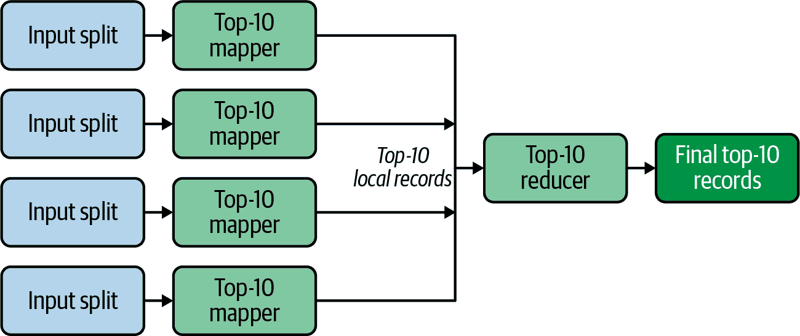

# 第十章：实用数据设计模式

本章的目标是介绍一些在解决常见数据问题中有用的实用数据设计模式。我们将专注于实际的设计模式，这些设计模式用于大数据解决方案，并且已在生产环境中部署。

与前一章一样，我将提供简单的示例来说明每个设计模式的使用，并向您展示如何使用 Spark 的转换来实现它们。我还将更多地讨论单子的概念，帮助您更好地理解归约转换。

最佳的设计模式书籍是由 Erich Gamma、Richard Helm、Ralph Johnson 和 John Vlissides（被称为“四人帮”）编写的经典计算机科学书籍 *设计模式：可复用面向对象软件的基础*。与“四人帮”书中类似的数据设计模式不同，我将专注于实际的、非正式的生产环境中使用的数据设计模式。

本章中我们将要讨论的数据设计模式可以帮助我们编写可部署在 Spark 集群上的可扩展解决方案。然而，要注意的是，在采用和使用设计模式时，并没有银弹。每个模式都应该使用真实数据在类似于生产环境的环境中进行性能和可扩展性测试。

###### 注意

关于软件工程中设计模式的一般介绍，请参阅前面提到的 *设计模式：可复用面向对象软件的基础*，作者是 Erich Gamma、Richard Helm、Ralph Johnson 和 John Vlissides（Addison-Wesley 出版）。要了解更多关于 MapReduce 中设计模式的信息，请参阅 [*MapReduce 设计模式*](https://www.oreilly.com/library/view/mapreduce-design-patterns/9781449341954/)，作者是 Donald Miner 和 Adam Shook，以及我的书籍 [*数据算法*](https://www.oreilly.com/library/view/data-algorithms/9781491906170/)（均由 O'Reilly 出版）。

我将在本章中介绍的设计模式包括：

+   内部映射器组合

+   前 10 名

+   最大最小

+   复合模式/单子

+   分箱

+   排序

我们将从一个有用的总结设计模式开始，使用一个内部映射器组合器。

# 在内部映射器组合中

在 MapReduce 范式中，组合器（也称为半减少器）是在每个工作节点上本地运行的过程，用于在数据发送到减少器之前对数据进行聚合。在像 Hadoop 这样的框架中，这通常被视为一个可选的本地优化。*In-mapper combiner* 执行进一步的优化，通过在收到每个（键，值）对时在内存中执行聚合，而不是将它们全部写入本地磁盘，然后按键聚合值。 （Spark 在内存中执行所有处理，因此默认情况下是这样操作的。）In-mapper 组合设计模式的目的是使 Mapper 能够尽可能高效地组合和总结其输出，以便在排序、洗牌和减少器（如 `reduceByKey()` 或 `groupByKey()`）处理时发出更少的中间（键，值）对。例如，对于经典的单词计数问题，给定如下输入记录：

```
"fox jumped and fox jumped again fox"
```

如果不使用 In-mapper 组合设计模式，我们将生成以下（键，值）对发送到减少器：

```
(fox, 1)
(jumped, 1)
(and, 1)
(fox, 1)
(jumped, 1)
(again, 1)
(fox, 1)
```

问题在于，对于非常大的数据集，这种方法会生成大量的 `(单词, 1)` 对，这样做效率低下，并且会使集群网络非常忙碌。使用 In-mapper 组合设计模式，我们在数据发送到网络之前通过键进行聚合，汇总和减少 Mapper 的输出，在执行洗牌之前完成这一过程。例如，在这种情况下有三个 `(fox, 1)` 实例和两个 `(jumped, 1)` 实例，这些（键，值）对将组合成以下输出：

```
(fox, 3)
(jumped, 2)
(and, 1)
(again, 1)
```

尽管在这个简单的示例中减少不显著，但如果我们有一个包含大量重复单词的大型数据集，这种设计模式可以通过生成更少的中间（键，值）对显著提升性能。

为了进一步演示这种设计模式背后的概念，接下来的部分将介绍三种解决方案来计算一组文档中每个字符出现频率的问题。简单来说，我们想要找出每个唯一字符在给定语料库中出现的次数。我们将讨论以下解决方案：

+   基本的 MapReduce 算法

+   每条记录的 In-mapper 组合

+   分区内的 In-mapper 组合

## 基本的 MapReduce 算法

为了计算一组文档中的字符数，我们将每个输入记录拆分为一组单词，将每个单词拆分为字符数组，然后生成(key, value)对，其中 key 是字符数组中的单个字符，value 为 1（表示一个字符的频率计数）。这是一种基本的 MapReduce 设计模式，不使用任何自定义数据类型，而 reducer 简单地求和每个单一唯一字符的频率。这种解决方案的问题在于，对于大数据集，它会生成大量的(key, value)对，这可能会导致网络负载过大，从而影响整体解决方案的性能。生成的大量(key, value)对还可能减慢排序和洗牌阶段（对相同 key 的值进行分组）。这种方法的不同阶段如图 10-1 所示。


###### 图 10-1\. 字符计数：基本的 MapReduce 算法

给定一个`RDD[String]`，下面提供了该算法的 PySpark 实现。

首先我们定义一个简单的函数，接受单个`String`记录，并返回(key, value)对列表，其中 key 是字符，value 是 1（该字符的频率）：

```
def mapper(rec):
    words = rec.lower().split() 
    pairs = [] 
    for word in words: 
        for c in word: 
           pairs.append((c, 1)) 
        #end-for
    #end-for
    return pairs 
#end-def
```


将记录标记为单词数组。


创建一个空列表作为`pairs`。


迭代每个单词。


遍历单个单词。


将每个字符(`c`)作为`(c, 1)`添加到`pairs`中。


返回给定记录中所有字符的`(c, 1)`列表。

这个`mapper()`函数可以简化为：

```
def mapper(rec):
    words = rec.lower().split()
    pairs = [(c, 1) for word in words for c in word]
    return pairs
#end-def
```

接下来，我们使用`mapper()`函数来计算唯一字符的频率：

```
# spark: an instance of SparkSession
rdd = spark.sparkContext.textFile("/dir/input") 
pairs = rdd.flatMap(mapper) 
frequencies = pairs.reduceByKey(lambda a, b: a+b) 
```


从输入数据创建一个`RDD[String]`。


将每条记录映射为一组字符，并将其展开为新的`RDD[Character, 1]`。


查找每个唯一字符的频率。

接下来，我们将介绍一个更高效的实现，它使用内映射器组合设计模式。

## 记录级别的内映射器组合

本节介绍了每条记录的 In-Mapper Combining 设计模式，也称为本地聚合每条记录解决方案。它类似于基本的 Spark MapReduce 算法，唯一的区别是对于给定的输入记录，我们在发射`(key, value)`对之前聚合每个字符的频率。换句话说，在这个解决方案中，我们发射`(key, value)`对，其中 key 是给定输入记录中的唯一字符，value 是该记录中该字符的累计频率。然后我们使用`reduceByKey()`来聚合每个唯一字符的所有频率。该解决方案利用`reduce()`函数的结合性和交换性，在发送到网络之前将值组合起来。例如，对于以下的输入记录：

```
foxy fox jumped over fence
```

我们将发射以下的`(key, value)`对：

```
(o, 3)  (m, 1)  (v, 1)
(x, 2)  (p, 1)  (r, 1)
(y, 1)  (e, 4)  (n, 1)
(j, 1)  (d, 1)  (c, 1)
```

给定一个`RDD[String]`，下面提供了一个 PySpark 解决方案。

首先，我们定义一个简单的函数，接受一个单个的`String`记录（输入`RDD[String]`的一个元素），并返回一个`(key, value)`对列表，其中 key 是一个唯一的字符，value 是该字符的累计频率：

```
import collections 
def local_aggregator(record):
    hashmap = collections.defaultdict(int) 
    words = record.lower().split() 
    for word in words: 
        for c in word: 
            hashmap[c] += 1 
        #end-for
    #end-for
    print("hashmap=", hashmap)

    pairs = [(k, v) for k, v in hashmap.iteritems()] 
    print("pairs=", pairs)
    return  pairs 
#end-def
```


`collections`模块提供高性能的容器数据类型。


创建一个空的`dict[String, Integer]`。`defaultdict`是一个`dict`的子类，它调用一个工厂函数来提供缺失的值。


将输入记录分词为一个单词数组。


遍历单词。


遍历每个单词。


聚合字符。


将字典扁平化为`(character, frequency)`列表。


返回扁平化的`(character, frequency)`列表。

接下来，我们使用`local_aggregator()`函数来计算唯一字符的频率：

```
input_path = '/tmp/your_input_data.txt'
rdd = spark.sparkContext.textFile(input_path)
pairs = rdd.flatMap(local_aggregator)
frequencies = pairs.reduceByKey(lambda a, b: a+b)
```

这个解决方案将发射较少的`(key, value)`对，这比之前的解决方案更好。这意味着网络负载较小，排序和洗牌的执行速度比基本算法更快。然而，这个实现仍然存在潜在的问题：虽然它会在不太多的映射器情况下扩展，因为我们在每个映射器中实例化和使用一个字典，如果映射器数量很多，我们可能会遇到内存溢出错误。

接下来，我将展示这一设计模式的另一个版本，避免了这个问题并且更加高效。

## 分区内的 In-Mapper Combining

此最终解决方案会聚合输入数据每个分区（而不是每个记录）中每个字符的频率，其中每个分区可能包含数千或数百万条输入记录。为此，我们再次构建一个`dict[Character, Integer]`的哈希表，但这次是针对给定输入分区的字符而不是输入记录。映射器然后会发出由哈希表条目组成的（键，值）对，其中键是`dict.Entry.getKey()`，值是`dict.Entry.getValue()`。这是一种非常紧凑的数据表示，因为`dict[Character, Integer]`的每个条目相当于*N*个基本的（键，值）对，其中*N*等于`dict.Entry.getValue()`。

因此，在这个解决方案中，我们使用每个输入分区一个哈希表来跟踪该分区所有记录中所有字符的频率。在映射器完成处理分区后（使用 PySpark 的 `mapPartitions()` 转换），我们发出频率表（我们构建的哈希表）中的所有（键，值）对。然后减少器将汇总所有分区的频率，并找出字符的最终计数。这个解决方案比前两种更有效，因为它发出的（键，值）对更少，从而减少了网络负载和排序和洗牌阶段的工作量。它也比前两种解决方案更好地扩展，因为使用每个输入分区一个哈希表消除了内存溢出问题的风险。即使我们将输入分区划分成成千上万个分区，这个解决方案也可以很好地扩展。

例如，对于以下输入分区（而不是单个记录）：

```
foxy fox jumped over fence
foxy fox jumped
foxy fox
```

我们将会发出以下（键，值）对：

```
(f, 7)  (u, 2)  (v, 1)  (j, 2)  (y, 3)
(o, 7)  (m, 1)  (r, 1)  (d, 2)  (e, 5)
(x, 6)  (p, 2)  (n, 1)  (c, 1)
```

###### 注

在使用这种设计模式时需要考虑的一个因素是，你需要小心哈希表的大小，确保它不会成为瓶颈。对于字符计数问题，每个映射器（每个输入分区）的哈希表大小将非常小（因为我们只有有限数量的唯一字符），所以不会有性能瓶颈的危险。

给定一个`RDD[String]`，PySpark 解决方案如下所示。

首先我们定义一个简单的函数，接受一个由许多输入记录组成的单个输入分区，并返回一个（键，值）对列表，其中键是字符，值是该字符的聚合频率：

```
def inmapper_combiner(partition_iterator): 
    hashmap = defaultdict(int) 
    for record in partition_iterator: 
        words = record.lower().split() 
        for word in words: 
            for c in word: 
                hashmap[c] += 1 
            #end-for
        #end-for
    #end-for
    print("hashmap=", hashmap)
    #
    pairs = [(k, v) for k, v in hashmap.iteritems()] 
    print("pairs=", pairs)
    return  pairs 
#end-def
```


`partition_iterator` 表示由一组记录组成的单个输入分区。


创建一个空的`dict[String, Integer]`。


从一个分区获取单个记录。


将记录标记为单词数组。


遍历单词。


遍历每个单词。


聚合字符。


将字典扁平化为`(character, frequency)`列表。


返回扁平化的`(character, frequency)`列表。

接下来，我们使用`inmapper_combiner()`函数来计算唯一字符的频率：

```
rdd = spark.sparkContext.textFile("/.../input") 
pairs = rdd.mapPartitions(inmapper_combiner) 
frequencies = pairs.reduceByKey(lambda a, b: a+b)
```


从输入文件(s)创建一个`RDD[String]`。


`mapPartitions()`转换通过将函数应用于该 RDD 的每个输入分区（而不是单个输入记录）来返回一个新的 RDD。

这种解决方案将比先前的解决方案发出远少于的(key, value)对。它非常高效，因为我们在每个输入分区中实例化和使用一个单一的字典（而不是每个输入记录）。这极大地减少了需要在 mapper 和 reducer 之间传输的数据量，减轻了网络负载并加快了排序和洗牌阶段的速度。内映射合并算法充分利用组合器作为优化器，这种解决方案极好地扩展了。即使有大量的 mapper，也不会导致 OOM 错误。然而，应该注意的是，如果唯一键的数量增长到关联数组无法适应内存的大小，内存分页将显著影响性能。如果出现这种情况，您将不得不恢复到基本的 MapReduce 方法。

在实现按分区设计模式的内映射合并时，我们使用 Spark 强大的`mapPartitions()`转换将每个输入分区转换为一个单一的`dict[Character, Integer]`，然后将这些聚合成一个最终的单一的`dict[Character, Integer]`。对于字符计数及其他需要从大数据集中提取少量信息的应用，该算法比其他方法更高效快速。在字符计数问题中，关联数组（每个 mapper 分区）的大小受限于唯一字符的数量，因此在使用这种设计模式时不会遇到可扩展性瓶颈。

总结一下，在按分区设计模式的内映射合并方案中，在效率和可扩展性方面提供了几个重要优势：  

+   大大减少了发出的(key, value)对的数量

+   需要较少的(key, value)对的排序和洗牌

+   充分利用组合器作为优化器

+   很好地扩展了

但也需要注意一些缺点：

+   更难实现（需要处理每个分区的自定义函数）

+   底层对象（每个 mapper 分区）更加重量级

+   基础限制是底层对象的大小（对于字符计数问题，每个映射器分区使用一个关联数组）

接下来，我们将看一下其他几个常见的用例，您希望从大型数据集中提取少量信息，并查看最佳方法是什么。

# 前 10

创建一个前 10 列表在许多数据密集型操作中是一个常见的任务。例如，我们可能会问以下问题：

+   在过去的一天/一周/一个月内访问的前 10 个 URL 是哪些？

+   在过去的一天/一周/一个月内，亚马逊上购买的前 10 件物品是什么？

+   在过去的一天/一周/一个月内，Google 上前 10 个搜索查询是什么？

+   昨天 Facebook 上最受欢迎的前 10 个物品是什么？

+   有史以来最受欢迎的前 10 个卡通是什么？

用于回答这些问题的简单设计模式在图 10-2 中说明。



###### 图 10-2。前 10 设计模式

例如，假设我们有一个包含两列`url`和`frequency`的表。使用 SQL 查询查找最受欢迎的前 10 个访问量最高的 URL 很简单：

```
  SELECT url, frequency
     FROM url_table
        ORDER BY frequency DESC
           LIMIT 10;
```

在 Spark 中查找前*N*（其中*N* > 0）条记录也很容易。给定一个`RDD[(String, Integer)]`，其中键是表示 URL 的字符串，值是访问该 URL 的频率，我们可以使用`RDD.takeOrdered(*N*)`来找到前*N*列表。`RDD.takeOrdered()`的一般格式是：

```
takeOrdered(N, key=None)
Description:
   Get the N elements from an RDD ordered in ascending
   order or as specified by the optional key function.
```

假设*N*是大于 0 的整数，我们有多种选项可以有效地找到一个顶级-N 列表，使用`RDD.takeOrdered()`：

```
# Sort by keys (ascending):
RDD.takeOrdered(N, key = lambda x: x[0])

# Sort by keys (descending):
RDD.takeOrdered(N, key = lambda x: -x[0])

# Sort by values (ascending):
RDD.takeOrdered(N, key = lambda x: x[1])

# Sort by values (descending):
RDD.takeOrdered(N, key = lambda x: -x[1])
```

举例来说，假设`takeOrdered()`在大型数据集中表现不佳。我们还有哪些其他选择？

给定一个大量的（键，值）对集合，其中键是一个`String`，值是一个`Integer`，我们希望找到一个独立的、可重用的解决方案来解决找到前*N*个键（其中*N* > 0）的问题——即一种设计模式，使我们能够生成可重用的代码来回答像前面提到的那些问题，当处理大数据时。这种问题对于由（键，值）对组成的数据很常见。这本质上是一个过滤任务：您过滤掉不需要的数据，只保留前*N*个项目。前 10 函数也是可交换和可结合的函数，因此使用分区器、合并器和减少器将始终产生正确的结果。

也就是说，给定一个顶级-10 函数`T`和一组值（例如频率）`{a, b, c}`对于相同的键，然后我们可以写：

+   可交换

    ```
    T(a, b) = T(b, a)
    ```

+   可结合

    ```
    T(a, T(b, c)) = T(T(a, b), c)
    ```

###### 提示

有关前 10 列表设计模式的详细信息，请参考 Donald Miner 和 Adam Shook 的《*MapReduce 设计模式*》（https://www.oreilly.com/library/view/mapreduce-design-patterns/9781449341954/）。

本节提供了一个完整的 PySpark 解决方案，用于 top-10 设计模式。给定一个 `RDD[(String, Integer)]`，目标是找到该 RDD 的前 10 名列表。在我们的解决方案中，我们假设所有键都是唯一的。如果键不唯一，则可以在找到前 10 名之前使用 `reduceByKey()` 转换使它们唯一。

我们的解决方案将推广问题并能够找到一个 top-*N* 列表（对于 *N* > 0）。例如，我们将能够找到前 10 名猫、前 50 名最访问的网站或前 100 个搜索查询。

## 正式化的 Top-N

让我们开始正式化这个问题。让 *N* 是大于 0 的整数。让 `L` 是一个 `(T, Integer)` 对的列表，其中 `T` 可以是任何类型（如 `String`、`Integer` 等），`L.size() = s`，且 `s > N`。`L` 的元素是：

<math alttext="StartSet left-parenthesis upper K Subscript i Baseline comma upper V Subscript i Baseline right-parenthesis comma i equals 1 comma 2 comma period period period comma s EndSet" display="block"><mrow><mo>{</mo> <mrow><mo>(</mo> <msub><mi>K</mi> <mi>i</mi></msub> <mo>,</mo> <msub><mi>V</mi> <mi>i</mi></msub> <mo>)</mo></mrow> <mo>,</mo> <mi>i</mi> <mo>=</mo> <mn>1</mn> <mo>,</mo> <mn>2</mn> <mo>,</mo> <mo>.</mo> <mo>.</mo> <mo>.</mo> <mo>,</mo> <mi>s</mi> <mo>}</mo></mrow></math>

其中 *K[i]* 的数据类型为 `T`，*V[i]* 是 `Integer` 类型（这是 *K[i]* 的频率）。让 `{sort(L)}` 是一个排序列表，排序是通过使用频率作为键来完成的。这给了我们：

<math alttext="StartSet left-parenthesis upper A Subscript j Baseline comma upper B Subscript j Baseline right-parenthesis comma 1 less-than-or-equal-to j less-than-or-equal-to upper S comma upper B 1 greater-than-or-equal-to upper B 2 greater-than-or-equal-to period period period upper B Subscript s Baseline EndSet" display="block"><mrow><mo>{</mo> <mrow><mo>(</mo> <msub><mi>A</mi> <mi>j</mi></msub> <mo>,</mo> <msub><mi>B</mi> <mi>j</mi></msub> <mo>)</mo></mrow> <mo>,</mo> <mn>1</mn> <mo>≤</mo> <mi>j</mi> <mo>≤</mo> <mi>S</mi> <mo>,</mo> <msub><mi>B</mi> <mn>1</mn></msub> <mo>≥</mo> <msub><mi>B</mi> <mn>2</mn></msub> <mo>≥</mo> <mo>.</mo> <mo>.</mo> <mo>.</mo> <mo>≥</mo> <msub><mi>B</mi> <mi>s</mi></msub> <mo>}</mo></mrow></math>

其中 *(A[j], B[j])* 在 `L` 中。然后，列表 `L` 的 top-*N* 定义为：

<math alttext="top hyphen upper N left-parenthesis upper L right-parenthesis equals StartSet left-parenthesis upper A Subscript j Baseline comma upper B Subscript j Baseline right-parenthesis comma 1 less-than-or-equal-to j less-than-or-equal-to upper N comma upper B 1 greater-than-or-equal-to upper B 2 greater-than-or-equal-to period period period upper B Subscript upper N Baseline greater-than-or-equal-to upper B Subscript upper N plus 1 Baseline greater-than-or-equal-to period period period upper B Subscript s Baseline EndSet" display="block"><mrow><mtext>top-N(L)</mtext> <mo>=</mo> <mo>{</mo> <mrow><mo>(</mo> <msub><mi>A</mi> <mi>j</mi></msub> <mo>,</mo> <msub><mi>B</mi> <mi>j</mi></msub> <mo>)</mo></mrow> <mo>,</mo> <mn>1</mn> <mo>≤</mo> <mi>j</mi> <mo>≤</mo> <mi>N</mi> <mo>,</mo> <msub><mi>B</mi> <mn>1</mn></msub> <mo>≥</mo> <msub><mi>B</mi> <mn>2</mn></msub> <mo>≥</mo> <mtext>...</mtext> <mo>≥</mo> <msub><mi>B</mi> <mi>N</mi></msub> <mo>≥</mo> <msub><mi>B</mi> <mrow><mi>N</mi><mo>+</mo><mn>1</mn></mrow></msub> <mo>≥</mo> <mtext>...</mtext> <mo>≥</mo> <msub><mi>B</mi> <mi>s</mi></msub> <mo>}</mo></mrow></math>

对于我们的 top-*N* 解决方案，我们将使用 Python 的 `SortedDict`，一个有序的可变映射。这种类型的设计很简单：`SortedDict` 继承自 `dict` 来存储项目，并维护一个键的排序列表。排序字典键必须是可散列的和可比较的。键的散列和总序在存储在排序字典中时不能更改。

要实现 top-*N*，我们需要一个哈希表数据结构，其键可以有总序，例如`SortedDict`（在我们的情况下，键表示频率）。该字典按其键的自然顺序排序。我们可以使用 `sortedcontainer.SortedDict()` 构建这个结构。我们将继续向 `SortedDict` 添加 `(frequency, url)` 对，但保持其大小为 *N*。当大小为 *N*+1 时，我们将使用 `SortedDict.popitem(0)` 弹出最小频率。

这里展示了这个工作的一个例子：

```
>>> from sortedcontainers import SortedDict
>>> sd = SortedDict({10: 'a', 2: 'm', 3: 'z', 5: 'b', 6: 't', 100: 'd', 20: 's'})
>>> sd
SortedDict({2: 'm', 3: 'z', 5: 'b', 6: 't', 10: 'a', 20: 's', 100: 'd'})
>>> sd.popitem(0)
(2, 'm')
>>> sd
SortedDict({3: 'z', 5: 'b', 6: 't', 10: 'a', 20: 's', 100: 'd'})
>>> sd[50] = 'g'
>>> sd
SortedDict({3: 'z', 5: 'b', 6: 't', 10: 'a', 20: 's', 50: 'g', 100: 'd'})
>>> sd.popitem(0)
(3, 'z')
>>> sd
SortedDict({5: 'b', 6: 't', 10: 'a', 20: 's', 50: 'g', 100: 'd'})
>>> sd[9] = 'h'
>>> sd
SortedDict({5: 'b', 6: 't', 9: 'h', 10: 'a', 20: 's', 50: 'g', 100: 'd'})
>>> sd.popitem(0)
(5, 'b')
>>> sd
SortedDict({6: 't', 9: 'h', 10: 'a', 20: 's', 50: 'g', 100: 'd'})
>>>
>>> len(sd)
6
```

接下来，我将介绍一个使用 PySpark 的 top-10 解决方案。

## PySpark 解决方案

PySpark 解决方案非常直接。我们使用 `mapPartitions()` 转换来找到每个分区的本地 top *N*（其中 *N* > 0），并将这些传递给单个 reducer。Reducer 然后从所有从 mappers 传递的本地 top *N* 列表中找到最终的 top-*N* 列表。通常，在大多数 MapReduce 算法中，如果一个 reducer 在一个服务器上接收到所有数据，可能会导致性能瓶颈。然而，在这种情况下，我们的单个 reducer 不会引起性能问题。为什么不会呢？假设我们有 5000 个分区。每个 mapper 只会生成 10 个（键，值）对，这意味着我们的单个 reducer 只会得到 50000 条记录——这样的数据量不太可能在 Spark 集群中引起性能瓶颈。

关于 PySpark 解决方案中关于顶级设计模式的高级概述在图 10-3 中提供。


###### 图 10-3\. PySpark 中的顶级设计模式实现

输入被分割成较小的块，并且每个块被发送到一个 mapper。每个 mapper 发出一个本地的前 10 名列表以供一个单一的 reducer 消费。在这里，我们使用单个 reducer 键，以便来自所有 mapper 的输出将被单个 reducer 消耗。

让`spark`成为`SparkSession`的一个实例。这就是通过使用`mapPartitions()`转换和一个名为`top10_design_pattern()`的自定义 Python 函数解决前 10 名问题的方式：

```
pairs = [('url-1', 10), ('url-2', 8), ('url-3', 4), ...]
rdd = spark.sparkContext.parallelize(pairs)
# mapPartitions(f, preservesPartitioning=False)
# Return a new RDD by applying a function
# to each partition of this RDD.
top10 = rdd.mapPartitions(top10_design_pattern)
```

要完成实现，这里我将介绍`top10_design_pattern()`函数，该函数查找每个分区（包含一组(key, value)对）的前 10 名：

```
from sortedcontainers import SortedDict

def top10_design_pattern(partition_iterator): 
    sd = SortedDict() 
    for url, frequency in partition_iterator: 
        sd[frequency] = url 
        if (len(sd) > 10):
            sd.popitem(0) 
    #end-for
    print("local sd=", sd)

    pairs = [(k, v) for k, v in sd.items()] 
    print("top 10 pairs=", pairs)
    return  pairs 
#end-def
```


`partition_iterator`是单个分区的迭代器；它迭代一组`(URL, frequency)`对。


创建一个空的`(Integer, String)`对的`SortedDict`。


迭代一组`(URL, frequency)`对。


将`(frequency, URL)`对放入`SortedDict`中。


限制排序字典的大小为 10（删除最低频率的条目）。


将`SortedDict`（这是一个本地前 10 名列表）转换为`(k, v)`对的列表。


返回单个分区的本地前 10 名列表。

每个 mapper 接受元素的分区，其中每个元素都是`(URL, frequency)`对。分区的数量通常由数据大小和集群中可用资源（节点、核心、内存等）决定，或者可以由程序员明确设置。在 mapper 完成创建其本地的`SortedDict[Integer, String]`作为单个字典（例如`SortedDict`）的本地前 10 名列表后，该函数返回该列表。请注意，我们每个分区使用单个字典（如`SortedDict`），而不是源 RDD 的每个元素。正如“在 Mapper 中的每个分区组合”所描述的那样，通过减少网络负载以及在排序和洗牌阶段要做的工作，这显著提高了操作的效率。

书的 GitHub 存储库中提供了使用`mapPartitions()`的完整解决方案。

## 寻找底部的 10 个

在前一节中，我向您展示了如何找到前 10 名列表。要找到底部的 10 个列表，我们只需要替换此行代码：

```
      # find top 10
      if (len(sd) > 10): 
          sd.popitem(0) 
```


如果`SortedDict`的大小大于 10…


…然后从字典中删除频率最低的 URL。

with this:

```
      # find bottom 10
      if (len(sd) > 10): 
          sd.popitem(-1) 
```


如果`SortedDict`的大小大于 10…


…然后从字典中删除频率最高的 URL。

接下来让我们讨论如何对输入进行分区。RDD 的分区是艺术和科学的结合体。对于你的集群，什么是正确的分区数？没有计算这个的魔法公式；这取决于集群节点的数量，每个服务器的核心数以及可用的 RAM 数量。这里涉及一些试错，但一个好的经验法则是从以下开始：

```
2 * num_executors * cores_per_executor
```

当你创建一个 RDD 时，如果没有显式设置分区数，Spark 集群管理器将根据可用资源将其设置为默认值。你也可以像这样自己设置分区数：

```
input_path = "/data/my_input_path"
desired_num_of_partitions = 16
rdd = spark.sparkContext.textFile(input_path, desired_num_of_partitions)
```

这将创建一个带有`16 partitions`的`RDD[String]`。

对于现有的 RDD，你可以使用`coalesce()`函数重新设置新的分区数：

```
# rdd: RDD[T]
desired_number_of_partitions = 40
rdd2 = rdd.coalesce(desired_number_of_partitions)
```

新创建的`rdd2`（另一个`RDD[T]`）将有 40 个分区。`coalesce()`函数定义如下：

```
pyspark.RDD.coalesce:
coalesce(numPartitions, shuffle=False)

Description:
  Return a new RDD that is reduced into numPartitions partitions.
```

与`repartition()`不同，它可以用于增加或减少分区数，但涉及跨集群的洗牌，`coalesce()`只能用于减少分区数，在大多数情况下不需要洗牌。

接下来，我将介绍 MinMax 设计模式，用于从大量数字数据集中提取少量信息。

# MinMax

MinMax 是一种数值汇总设计模式。给定一组数十亿的数字，目标是找到所有数字的最小值、最大值和计数。这种模式可以用于数据为数值类型并且可以按特定字段分组的场景。为了帮助你理解 MinMax 设计模式的概念，我将介绍三种性能差异显著的解决方案。

## 解决方案 1：经典 MapReduce

最简单的方法是发射以下（键，值）对：

```
("min", number)
("max", number)
("count", 1)
```

然后，排序和洗牌将按三个键`min`、`max`和`count`分组所有值，最后我们可以使用一个减少器来迭代所有数字并找到全局的`min`、`max`和`count`。这种方法的问题在于，我们必须在网络上移动可能数百万的（键，值）对，然后创建三个巨大的`Iterable<T>`数据结构（其中`T`是数值类型，如`Long`或`Double`）。这种解决方案可能会遇到严重的性能问题，并且不会扩展。此外，在减少阶段，由于只有三个唯一键，它不会有效地利用所有的集群资源。

## 解决方案 2：排序

下一个解决方案是对所有数字进行排序，然后找到数据集的顶部(`max`)、底部(`min`)和`count`。如果性能可接受，则这是一个有效的解决方案；然而，对于大型数据集，排序时间可能会不可接受的长。换句话说，此解决方案也不会扩展。

## 解决方案 3：Spark 的 mapPartitions()

最终的解决方案，从性能和可扩展性的角度来看最高效，将数据分割为`*N*`个块（分区），然后使用 Spark 的`mapPartitions()`转换从每个分区发出三个（键，值）对：

```
("min", minimum-number-in-partition)
("max", maximum-number-in-partition)
("count", count-of-numbers-in-partition)
```

最后，我们从所有分区中找到全局的`min`、`max`和`count`。这个解决方案的可扩展性非常好。无论你有多少分区，这都会起作用，并且不会创建 OOM 错误。例如，假设您的数据集中有 5000 亿个数字（假设每条记录一个或多个数字），并且将其分成 100,000 个块。在最坏的情况下（每条记录一个数字），每个分区将有 500 万条记录。这些分区中的每一个将发出上述三对。然后，您只需要找到 100,000 x 3 对 = 300,000 个数字的`min`、`max`和`count`。这是一个微不足道的任务，不会造成任何可扩展性问题。

这个解决方案的高层次视图在图 10-4 中说明。


###### 图 10-4\. MinMax 设计模式的 PySpark 实现

假设我们的输入记录具有以下格式：

```
<number><,><number><,><number>...
```

这里是一些示例记录：

```
10,345,24567,2,100,345,9000,765
2,34567,23,13,45678,900
...
```

下面是解决 MinMax 问题的 PySpark 解决方案（包含完整程序和示例输入的 GitHub 链接，在文件*minmax_use_mappartitions.py*中可用）：

```
input_path = *`<``your``-``input``-``path``>`*
rdd = spark.sparkContext.textFile(input_path) 
min_max_count = rdd.mapPartitions(minmax) 
min_max_count_list = min_max_count.collect() 
final_min_max_count = find_min_max_count(min_max_count_list) 

```


从给定的输入返回一个新的 RDD。


应用`minmax()`函数从每个分区返回一个 RDD，其中包含`(min, max, count)`。


作为列表从所有分区收集`(min, max, count)`。


通过调用函数`find_min_max_count()`找到(`final_min`, `final_max`, `final_count`)。

我定义了`minmax()`函数如下：

```
def minmax(iterator): 

    first_time = True

    for record in iterator: 
        numbers = [int(n) for n in record.split(",")] 
        if (first_time): 
            # initialize count, min, max to the 1st record values
            local_min = min(numbers)
            local_max = max(numbers)
            local_count = len(numbers)
            first_time = False
        else: 
            # update count, min, and max
            local_count += len(numbers)
            local_max = max(max(numbers), local_max)
            local_min = min(min(numbers), local_min)
    #end-for
    return [(local_min, local_max, local_count)] 
#end-def
```


`iterator`的类型为`itertools.chain`。


迭代`iterator`（`record`保存一个记录）。


对输入进行标记化，并构建一个数字数组。


如果这是第一条记录，找到`min`、`max`和`count`。


如果这不是第一条记录，更新`local_min`、`local_max`和`local_count`。


最后，从每个分区返回一个三元组。

如果某些分区为空（即不包含数据），有许多原因可能导致这种情况发生，因此优雅地处理空分区非常重要（详见第三章）。

接下来我将向您展示如何处理这个问题。Python 中的错误处理通过捕获`try`块中的异常并在`except`块中处理来完成。在 Python 中，如果在`try`块中遇到错误，则会停止代码执行，并将控制转移到`except`块。让我们看看如何在我们的 MinMax 解决方案中实现这一点：

```
def minmax(iterator): 

    print("type(iterator)=", type(iterator)) 
#   ('type(iterator)=', <type 'itertools.chain'>)

    try:
        first_record = next(iterator) 
    except StopIteration: 
        return [ None ] # We will filter out None values by filter()

    # initialize count, min, max to the 1st record values
    numbers = [int(n) for n in first_record.split(",")] 
    local_min = min(numbers)
    local_max = max(numbers)
    local_count = len(numbers)

    for record in iterator: 
        numbers = [int(n) for n in record.split(",")]
        # update min, max, count
        local_count += len(numbers)
        local_max = max(max(numbers), local_max)
        local_min = min(min(numbers), local_min)
#   end-for
    return [(local_min, local_max, local_count)] 
```


`iterator`的类型为`itertools.chain`。


打印`iterator`的类型（仅用于调试）。


尝试从`iterator`获取第一个记录。如果成功，则将`first_record`初始化为分区的第一个记录。


如果您在这里，这意味着分区为空；返回一个空值。


设置`min`、`max`和`count`为第一个记录的值。


迭代`iterator`以获取记录 2、3 等（`record`保存单个记录）。


最后，从每个分区返回一个三元组。

我们应该如何测试空分区的处理？程序*minmax_force_empty_partitions.py*（在书的 GitHub 存储库中可用）强制创建空分区并优雅地处理它们。您可以通过将分区数设置为高于输入记录数来强制创建空分区。例如，如果您的输入有`*N*`条记录，则将分区数设置为`*N*+3`将导致分区器创建多达三个空分区。

# 复合模式和单子

本节探讨了复合模式和单子的概念，这些概念在第四章中介绍，并深入探讨了如何在 Spark 和 PySpark 的上下文中使用它们。

复合模式是一种结构设计模式（也称为分区设计模式），当一组对象可以像该组中的单个对象一样对待时，可以使用它。您可以使用它创建层次结构和对象组，从而形成具有叶子（对象）和复合物（子组）的树状结构。这在 UML 表示法中以图 10-5 说明。


###### 图 10-5\. 复合设计模式的 UML 图

有了这种设计模式，一旦你把对象组合成这种类似树结构的形式，你就可以像操作单一对象一样操作这个结构。其关键特点是能够递归地运行方法覆盖整个树结构并汇总结果。这种模式可以通过 PySpark 的 reducer 实现。

复合模式的一个简单应用示例是对一组数字进行加法（在一组键上），如 图 10-6 所示。这里，数字是叶子节点，而复合是加法运算符。


###### 图 10-6\. 复合模式示例：加法

接下来，我将在复合模式的背景下讨论幺半群的概念。

## 幺半群

在 第四章 中，我们讨论了在减少转换中使用幺半群。在这里，我们将在复合模式的背景下看看幺半群的应用，这在大数据中常用于组合（例如通过加法和连接运算符）和聚合数据点集合。从模式的定义来看，很明显幺半群与复合模式有着共同点。

作为一个复习，让我们从 [维基百科](https://oreil.ly/5TXsW) 查看一下幺半群的定义：

> 在抽象代数中，数学的一个分支中，幺半群是带有可结合的二元操作和单位元素的集合。幺半群是带单位元的半群。这样的代数结构出现在数学的几个分支中。例如，从一个集合到它自身的函数形成一个关于函数合成的幺半群。更一般地说，在范畴论中，对象到自身的态射形成一个幺半群，反过来，一个幺半群可以看作是具有单一对象的范畴。在计算机科学和计算机编程中，从给定字符集构建的字符串集合是一个自由幺半群。

MapReduce 编程模型是计算机科学中幺半群的一个应用。正如我们所见，它由三个函数组成：`map()`、`combine()` 和 `reduce()`。这些函数与 Spark 中的 `map()` 和 `flatMap()` 函数以及减少转换非常相似（`combine()` 是可选操作）。给定一个数据集，`map()` 将任意数据映射到特定幺半群的元素，`combine()` 在本地级别（集群中的工作节点）聚合/折叠数据，而 `reduce()` 则聚合/折叠这些元素，最终产生一个元素。

因此，在编程语言语义上，幺半群只是一个具有一个抽象值和一个抽象方法的接口。幺半群的抽象方法是附加操作（它可以是整数的加法运算符或字符串对象的连接运算符）。幺半群的抽象值是身份值，定义为可以附加到任何值而始终产生原始值未修改的值。例如，集合数据结构的身份值是空集合，因为将集合附加到空集合通常会产生相同的未修改集合。对于添加一组整数，身份值是零，对于连接字符串，它是空字符串（长度为零的字符串）。

接下来，我们将简要回顾 MapReduce 的组合器和抽象代数的幺半群，并看看它们之间的关系。正如你将看到的那样，当你的 MapReduce 操作（例如在 Spark 中的`map()`和`reduceByKey()`转换）不是幺半群时，要有效地使用组合器是非常困难的（如果不是不可能的话）。

在 MapReduce 范式中，Mapper 没有约束，但 Reducer 需要是（迭代应用的）可结合操作。组合器（作为可选的插件组件）是一个“本地减少器”进程，仅在一个服务器生成的数据上操作。成功使用组合器可以通过减少在给定单个服务器上由 Mapper 生成的中间数据量来减少网络流量（这就是为什么称为本地）。组合器可以用作 MapReduce 的优化，通过减少从 Mapper 到 Reducer 发送的（键，值）对的数量来减少网络流量。通常，组合器具有与 Reducer 相同的接口。组合器必须具有以下特征：

+   接收给定服务器上所有由 Mapper 实例发出的数据作为输入（这称为本地聚合）

+   将其输出发送给 Reducers

+   无副作用（组合器可能运行不确定次数）

+   具有相同的输入和输出键和值类型

+   在映射阶段后在内存中运行

我们可以定义组合器的框架如下：

```
# key: as KeyType
# values: as Iterable<ValueType>
def combine(key, values):
   ...
   # use key and values to create new_key and new_value
   new_key = *`<``a``-``value``-``of``-``KeyType``>`*
   new_value = *`<``a``-``value``-``of``-``ValueType``>`*
   ...
   return (new_key, new_value);
   ...
#end-def
```

此模板说明了组合器生成的（键，值）对必须与 Mapper 发出的（键，值）对的类型相同。例如，如果 Mapper 输出 `(T[1], T[2])` 对（其中键是类型为 `T[1]`，值是类型为 `T[2]`），那么组合器也必须发出 (`T[1]`, `T[2]`) 对。

Hadoop MapReduce 框架没有显式的`combine()`函数，但可以通过在`Map`和`Reduce`类之间添加`Combiner`类来减少传输到 Reducer 的数据量。组合器通过`Job.setCombinerClass()`方法指定。

组合器的目标应该是通过 Mapper 发出的中间值“单体化”，正如我们在第四章中看到的那样，这是设计高效 MapReduce 算法的指导原则。

一些编程语言，如 Haskell，直接支持幺半群。在 Haskell 中，幺半群是“具有一条规则的类型，该规则说明如何将该类型的两个元素组合以生成该类型的另一个元素”。我们将在接下来的章节中看一些例子，但首先让我们快速回顾一下幺半群。

幺半群是一个三元组 (`S`, `f`, `e`)，其中：

+   `S`是一个集合（称为幺半群的底层集合）。

+   `f` 是幺半群的二元操作称为映射 (`f : S x S → S`)。

+   `e`是幺半群的单位操作（`e` ∈ `S`）。

带有二元操作 `+` 的幺半群（请注意，这里的 `+` 表示二元操作，而不是数学上的加法运算）满足以下三条公理（请注意 `f(a,b) = a + b`）：

闭合性

对于集合 `S` 中的所有 `a`、`b`，操作 `(a + b)` 的结果也在 `S` 中。

结合性

对于集合 `S` 中的所有 `a`、`b` 和 `c`，以下方程成立：

```
((a + b) + c) = (a + (b + c))
```

单位元素

在集合 `S` 中存在一个元素 `e`，使得对于集合 `S` 中的所有元素 `a`，以下两个方程成立：

```
e + a = a
a + e = a
```

在数学符号中，我们可以这样写：

闭合性

∀ `a,b` ∈ `S: a + b` ∈ `S`

结合性

```
for all a,b,c in S: ((a + b) + c) = (a + (b + c))
```

单位元素

```
{
  exists e in S:
    for all a in S:
       e + a = a
       a + e = a
}
```

幺半群操作可能（但不一定）具有其他属性，例如：

幂等性

```
for all a in S: a + a = a
```

可交换性

```
for all a, b in S: a + b = b + a
```

要形成一个幺半群，首先我们需要一个类型 *S*，该类型可以定义值集合，如整数：`{0, -1, +1, -2, +2, ...}`。第二个组成部分是一个二元函数：

+   *+ : S x S → S*

然后，我们需要确保对于集合 *S* 中的任意两个值 *x* 和 *y*：

+   *x + y : S*

例如，如果类型 *S* 是整数集合，则二元操作可以是加法（`+`）、乘法（`*`）或除法（`/`）。最后，作为第三个和最重要的成分，我们需要二元操作遵循指定的一组法则。如果是这样，我们说 (*S*, +, *e*) 是一个幺半群，其中 *e* 在 *S* 中是单位元素（例如加法为 0，乘法为 1）。

###### 提示

请注意，实数集的二元除法操作（`/`）不是幺半群：

```
((12 / 4) / 2) != (12 / (4 / 2))
((12 / 4) / 2) =  (3 / 2) = 1.5
(12 / (4 / 2)) =  (12 / 2) = 6.0
```

简言之，幺半群捕捉将任意多个东西组合成单个东西的概念，同时还有一个称为空物或值的身份元素或值的概念。一个简单的例子是自然数的加法 `{1, 2, 3, ...}`。加法函数 `+` 允许我们将任意多个自然数组合成单个自然数，即和。身份值是数字 0。另一个例子是字符串连接，其中连接运算符允许我们将任意多个字符串组合成单个字符串；在这种情况下，身份值是空字符串。

## 幺半群和非幺半群的例子

Spark 在`reduceByKey()`转换中使用合并器，因此要有效使用这个转换，你必须确保缩减函数是一个幺半群——即，幺半群是一个集合（用`S`表示），它在一个结合的二元操作`(f)`下是封闭的，并且在`S`中有一个单位元`I`，使得对于所有`x`在`S`中，`f(I, x) = x` 和 `f(x, I) = x`。为了帮助您理解幺半群的概念，我在这里提供一些幺半群和非幺半群的例子。

### 整数集上的最大值

集合`S = {0, 1, 2, ...}`是`MAX`（最大）操作下的交换幺半群，其单位元是`0`：

```
MAX(a, MAX(b, c)) = MAX(MAX(a, b), c)}
MAX(a, 0) = a
MAX(0, a) = a
MAX(a, b) in S
```

### 整数集上的减法

整数集上的减法（`-`）不定义一个幺半群；此操作不是结合的：

```
(1 - 2) -3 = -4
1 - (2 - 3) = 2
```

### 整数集上的加法

整数集上的加法（`+`）定义了一个幺半群；此操作是交换的和结合的，单位元是`0`：

```
(1 + 2) + 3 = 6
1 + (2 + 3) = 6
n + 0 = n
0 + n = n
```

我们可以将此形式化如下，其中`e(+)`定义了一个单位元：

```
S = {0, -1, +1, -2, +2, -3, +3, ...}
e(+) = 0
f(a, b) = f(b, a) = a + b
```

### 整数的并集和交集

整数集的并集或交集形成一个幺半群。二元函数是并集/交集，单位元是空集`{}`。

### 整数集上的乘法

自然数集合`N = {0, 1, 2, 3, ...}`在乘法下形成一个交换幺半群（单位元为 1）。

### 整数集上的平均值

另一方面，自然数集`N = {0, 1, 2, 3, ...}`在`MEAN`（平均）函数下不构成幺半群。以下例子表明，对于值集的任意子集的平均值的平均值与完整值集的平均值不同：

```
MEAN(1, 2, 3, 4, 5)
-- NOT EQUAL --
MEAN( MEAN(1,2,3), MEAN(4,5) )

MEAN(1, 2, 3, 4, 5) = (1+2+3+4+5)/5
                    = 15/5
                    = 3

MEAN( MEAN(1,2,3), MEAN(4,5) ) = MEAN(2, 4.5)
                               = (2 + 4.5)/2
                               = 3.25
```

因此，如果你想要计算`RDD[(key, integer)]`的值的平均数，你不能使用以下转换（由于分区而可能导致不正确的值）：

```
# rdd: RDD[(key, integer)]
average_per_key = rdd.reduceByKey(lambda x, y: (x+y)/2)
```

找到每个键的平均值的正确方法是使该函数成为一个幺半群：

```
# rdd: RDD[(key, integer)]
# create value as (sum, count) pair: this makes a monoid
rdd2 = rdd.mapValues(lambda n: (n, 1))
# find (sum, count) per key
sum_count = rdd2.reduceByKey(lambda x, y: (x[0]+y[0], x[1]+y[1]))
# now, given (sum, count) per key, find the average per key
average_per_key = sum_count.mapValues(lambda x: x[0]/x[1])
```

### 整数集上的中位数

自然数集合同样不在`MEDIAN`函数下构成幺半群：

```
MEDIAN(1, 2, 3, 5, 6, 7, 8, 9)
-- NOT EQUAL --
MEDIAN( MEDIAN(1,2,3), MEDIAN(5,6,7,8,9) )

MEDIAN(1, 2, 3, 5, 6, 7, 8, 9)
  = (5 + 6) / 2
  = 11 / 2
  = 5.5

MEDIAN( MEDIAN(1,2,3), MEDIAN(5,6,7,8,9) )
  = MEDIAN(2, 7) =
  = (2 + 7) / 2
  = 9 / 2
  = 4.5
```

### 列表的串联

列表的串联（`+`）与空列表（`[]`）是一个幺半群。对于任何列表`L`，我们可以写：

```
L + [] = L
[] + L = L
```

此外，请注意，串联函数是可结合的。给定两个列表，例如`[1,2,3]`和`[7,8]`，我们可以使用`+`将它们连接在一起以得到`[1,2,3,7,8]`。然而，除了与空列表（或字符串、集合等）的串联外，它不是交换的：`[1,2,3]+[7,8]=[1,2,3,7,8]` 而 `[7,8]+[1,2,3]=[7,8,1,2,3]`。

### 矩阵示例

设`N = {1, 2, 3, ...}`，且*m, n ∈ N*。则带整数条目的*m* × *n*矩阵的集合，写作*Z^(m×n)*，满足使其在加法下成为幺半群的属性：

+   闭包由定义保证。

+   其元素的结合性质由其元素的结合性质保证。

+   加法恒元是`0`，即零矩阵。

这些示例应该帮助您理解减少函数作为幺半群的含义。Spark 的`reduceByKey()`是一个有效的转换，使用关联和交换的 reduce 函数合并每个 key 的值。我们必须确保其 reduce 函数是一个幺半群，否则可能得不到正确的减少结果。

## 非幺半群 MapReduce 示例

给定大量的(key, value)对，其中 key 为字符串，value 为整数，对于这个非幺半群示例，我们的目标是按 key 找到所有值的平均值。假设我们在名为`mytable`的表中有以下数据，有`key`和`value`列：

```
SELECT key, value FROM mytable

key    value
---    -----
key1   10
key1   20
key1   30
key2   40
key2   60
key3   20
key3   30
```

在 SQL 中，可以通过以下方式实现：

```
SELECT key, AVG(value) as avg FROM mytable GROUP BY key

key    avg
---    ---
key1   20
key2   50
key3   25
```

这是一个 MapReduce 算法的初始版本，其中 mapper 未生成 mean/average 函数的幺半群输出：

Mapper 函数

```
# key: a string object
# value: a long associated with key
map(key, value) {
   emit(key, value);
}
```

Reducer 函数

```
# key: a string object
# values: a list of long data type numbers
reduce(key, values) {
   sum = 0
   count = 0
   for (i : list) {
      sum += i
      count += 1
   }
   average = sum / count
   emit(key, average)
}
```

这个第一次尝试的 MapReduce 算法存在几个问题：

+   该算法效率不高；在排序和洗牌阶段需要完成大量工作。

+   我们不能将 reducer 作为 combiner 使用，因为我们知道一组值的任意子集的平均值并不等于所有值的平均值。

我们可以做哪些改变以使我们的 Reducer 可以作为 Combiner 使用，以减少网络负载并加快排序和洗牌阶段的速度？我们需要改变 mapper 的输出，使其成为一个幺半群。这将确保我们的 combiners 和 reducers 能够正确运行。

让我们看看我们如何做到这一点。

## 幺半群 MapReduce 示例

在本节中，我将修改 mapper 以生成(key, value)对，其中 key 是字符串，value 是一对`(sum, count)`。`(sum, count)`数据结构是一个幺半群，单位元素是`(0, 0)`。证明在这里给出：

```
Monoid type is (N, N) where N = {set of integers}

Identity element is (0, 0):
(sum, count) + (0, 0) =  (sum, count)
(0, 0) + (sum, count) =  (sum, count)

Let a = (sum1, count1), b = (sum2, count2), c = (sum3, count3)
Then associativity holds:
(a + (b + c)) = ((a + b) + c)

+ is the binary function:
a + b = (sum1+sum2, count1+count2) in (N, N)
```

现在，让我们为我们的幺半群数据类型编写一个 mapper：

```
# key: a string object
# value: a long data type associated with key
# emits (key, (sum, count))
map(key, value) {
   emit (key, (value, 1))
}
```

如您所见，key 与以前相同，但 value 是一对`(sum, count)`。现在，mapper 的输出是一个幺半群，其中单位元素是`(0, 0)`。可以执行逐元素求和操作如下：

```
 element1 = (key, (sum1, count1))
 element2 = (key, (sum2, count2))

 ==> values for the same key are reduced as:

  element1 + element2
    = (sum1, count1) + (sum2, count2)
    = (sum1+sum2, count1+count2)
```

因为 mapper 输出了幺半群，现在 mean 函数将被正确计算。假设单个 key 的值为`{1, 2, 3, 4, 5}`，而`{1, 2, 3}`进入分区 1，`{4, 5}`进入分区 2：

```
MEAN(1, 2, 3, 4, 5)
  = MEAN( MEAN(1,2,3), MEAN(4,5) )}
  = (1+2+3+4+5) / 5
  = 15 / 5
  = 3

Partition 1:
  MEAN(1,2,3) = MEAN(6, 3)

Partition 2:
  MEAN(4,5) = MEAN(9, 2)

Merging partitions:
MEAN( MEAN(1,2,3), MEAN(4,5) )
  = MEAN( MEAN(6, 3), MEAN(9, 2))
  = MEAN(15, 5)
  = 15 / 5
  = 3
```

修改后的算法如下，对于给定的一对`(sum, count)`，`pair.1`表示`sum`，`pair.2`表示`count`。这是我们的 combiner：

```
# key: a string object
# values: a list of pairs as [(s1, c1), (s2, c2), ...]
combine(key, values) {
   sum = 0
   count = 0
   for (pair : values) {
      sum += pair.1
      count += pair.2
   }
   emit (key, (sum, count))
}
```

这是我们的 reducer：

```
# key: a string object
# values: a list of pairs as [(s1, c1), (s2, c2), ...]
reduce(key, values) {
   sum = 0
   count = 0
   for (pair : values) {
      sum += pair.1
      count += pair.2
   }
   average = sum / count
   emit (key, average)
}
```

由于我们的 mapper 生成了幺半群数据类型，我们知道我们的 combiner 将正确执行，并且我们的 reducer 将产生正确的结果。

## Monoidal Mean 的 PySpark 实现

本节的目标是提供一个解决方案，使我们能够在使用组合器来聚合值以找到分区间平均值时使用组合器。为了计算相同键的所有值的平均值，我们可以使用 Spark 的`groupByKey()`转换来对值进行分组，然后找到总和并除以数目（每个键）。然而，这并不是一个最优解决方案，因为正如我们在前面章节中看到的，对于大数据集使用`groupByKey()`可能会导致 OOM 错误。

对于这里呈现的解决方案，对于给定的`(key, number)`对，我们将发出`(key, (number, 1))`的元组，其中键的关联值表示`(sum, count)`对：

```
(key, value1) = (key, (sum1, count1))
(key, value2) = (key, (sum2, count2))
```

早些时候，我展示了使用`(sum, count)`作为值将使我们能够使用组合器和减少器正确计算平均值。我们将使用非常高效的`reduceByKey()`转换而不是`groupByKey()`。这是归约函数的工作方式：

```
value1 + value2 =
(sum1, count1) + (sum2, count2) =
(sum1+sum2, count1+count2)
```

一旦归约完成，我们将使用额外的映射器通过将总和除以计数来找到平均值。

输入记录的格式将是：

```
<key-as-string><,><value-as-integer>
```

例如：

```
key1,100
key2,46
key1,300
```

在高层次上，PySpark 解决方案由以下四个步骤组成：

1.  读取输入并创建第一个 RDD 作为`RDD[String]`。

1.  应用`map()`来创建`RDD[key, (number, 1)]`。

1.  使用`reduceByKey()`执行归约操作，将创建一个`RDD[key, (sum, count)]`。

1.  应用`mapValue()`来创建最终的 RDD 作为`RDD[key, (sum / count)]`。

完整的 PySpark 程序（*average_monoid_driver.py*）可以在 GitHub 上找到。

首先，我们需要两个简单的 Python 函数来帮助我们使用 Spark 转换。第一个函数`create_pair()`接受一个`String`对象作为`"key,number"`并返回一个`(key, (number, 1))`对：

```
# record as String of "key,number"
def create_pair(record):
  tokens = record.split(",")
  key = tokens[0]
  number = int(tokens[1])
  return (key, (number, 1))
# end-def
```

第二个函数`add_pairs()`接受两个对`(sum1, count1)`和`(sum2, count2)`，并返回它们的和`(sum1+sum2, count1+count2)`：

```
# a = (sum1, count1)
# b = (sum2, count2)
def add_pairs(a, b):
    # sum = sum1+sum2
    sum = a[0] + b[0]
    # count = count1+count2
    count = a[1] + b[1]
    return (sum, count)
# end-def
```

这是完整的 PySpark 解决方案：

```
from __future__ import print_function 
import sys 
from pyspark.sql import SparkSession 

if len(sys.argv) != 2: 
    print("Usage: average_monoid_driver.py <file>", file=sys.stderr)
    exit(-1)

spark = SparkSession.builder.getOrCreate() 

#  sys.argv[0] is the name of the script
#  sys.argv[1] is the first parameter
input_path = sys.argv[1] 
print("input_path: {}".format(input_path))

# read input and create an RDD[String]
records = spark.sparkContext.textFile(input_path) 

# create a pair of (key, (number, 1)) for "key,number"
key_number_one = records.map(create_pair) 

# aggregate the (sum, count) of each unique key
sum_count = key_number_one.reduceByKey(add_pairs) 

# create the final RDD as an RDD[key, average]
averages =  sum_count.mapValues(lambda (sum, count): sum / count) 
print("averages.take(5): ", averages.take(5))

# done!
spark.stop()
```


导入`print()`函数。


导入系统特定的参数和函数。


从`pyspark.sql`模块导入`SparkSession`。


确保在命令行中有两个参数。


使用构建器模式创建`SparkSession`的实例。


定义输入路径（可以是文件或包含任意数量文件的目录）。


读取输入并创建第一个 RDD 作为`RDD[String]`，其中每个对象的格式为`"key,number"`。


创建`key_number_one` RDD 作为`RDD[key, (number, 1)]`。


将 `(sum1, count1)` 和 `(sum2, count2)` 聚合，并创建 `(sum1+sum2, count1+count2)` 作为值。


应用 `mapValues()` 转换以找到每个键的最终平均值。

## 函数子与单子

您现在已经看到了几个单子及其在 MapReduce 框架中的使用示例，但我们甚至可以将高阶函数（如函数子）应用于单子。函数子是一个既是函数又是对象的对象。

首先，我将通过一个简单的例子介绍如何在单子上使用函数子。让 `MONOID = (t, e, f)` 是一个单子，其中 `T` 是一个类型（值的集合），`e` 是单位元素，`f` 是二进制加法函数 `+`：

```
MONOID = {
   type T
   val e : T
   val plus : T x T -> T
}
```

然后我们可以如下定义函数子 `Prod`：

```
functor Prod (M : MONOID) (N : MONOID) = {
   type t = M.T * N.T
   val e = (M.e, N.e)
   fun plus((x1,y1), (x2,y2)) = (M.plus(x1,x2), N.plus(y1,y2))
}
```

我们还可以定义其他函数子，例如 `Square`，如下所示：

```
functor Square (M : MONOID) : MONOID = Prod M M
```

我们还可以定义两个单子之间的函数子。设 (*M*[1], *f*[1], *e*[1]) 和 (*M*[2], *f*[2], *e*[2]) 是单子。一个函数子：

+   *F : (M[1], f[1], e[1]) → (M[2], f[2], e[2])*

由对象映射指定（单子是具有单个对象的范畴）和箭头映射 *F : M[1] → M[2]*。并且以下条件将成立：

+   *∀a,b ∈ M[1], F(f1) = f2, F(b))*

+   *F(e[1]) = e[2]*

两个单子之间的函数子只是一个单子同态（在保持单子操作并映射第一个单子的单位元素到第二个单子的单位元素之间的映射）。例如，对于 `String` 数据类型，一个函数 `Length()`，它计算一个单词中字母的数量，是一个单子同态：

+   `Length("") = 0`（空字符串的长度为 0）。

+   如果 `Length(x) = m` 和 `Length(y) = n`，则字符串的连接 `x + y` 有 `m + n` 个字母。例如：

    ```
    Length("String" + "ology")
        = Length("Stringology")
        = 11
        = 6 + 5
        = Length("String") + Length("ology")
    ```

再次强调，使映射器创建单子可以确保减少器能够有效且正确地利用组合器。

## 对单子的使用结论

正如我们所观察到的，在 MapReduce 范式中（这是 Hadoop、Spark、Tez 等框架的基础），如果您的映射器生成单子，则可以利用组合器进行优化和效率目的。使用组合器减少了网络流量并加速了 MapReduce 的排序和洗牌阶段，因为要处理的数据更少。您还看到了如何将 MapReduce 算法单子化的一些示例。一般而言，当您要应用的函数是可交换和可结合的（单子的性质）时，可以使用组合器。例如，经典的单词计数函数在整数集合上是一个具有 `+` 操作的单子（这里可以使用组合器）。然而，平均函数（不是可结合的）在整数集合上不形成单子。要在这种情况下有效地使用组合器，我们需要确保映射器的输出是单子的。接下来，我们将关注一些重要的数据组织模式：分桶和排序。

# 分桶

Binning 是一种将多个或多少连续的数值分组成较少数量的“bin”或“桶”的方法。例如，如果你有关于一群人口普查数据，你可能希望将他们的年龄映射到较少数量的年龄区间，比如`0-5`，`6-10`，`11-15`，…，`96-100+`。Binning 的一个重要优势是它缩小了搜索特定值所需的数据范围。例如，如果你知道有人是 14 岁，你只需要在标记为`11-15`的 bin 中搜索他们。换句话说，Binning 可以通过检查数据的一个切片而不是整个数据集来帮助我们更快地进行查询。Binning 设计模式将记录移动到类别（bin），而不考虑记录的初始顺序。

Figure 10-7 展示了另一个例子。在基因组数据中，染色体标记为`{chr1, chr2, ..., chr22, chrX, chrY, chrMT}`。一个人类有 30 亿对染色体，其中`chr1`大约有 2.5 亿个位置，`chr7`有 1.6 亿个位置，依此类推。如果你想找到一个变体键为`10:100221486:100221486:G`，你将不得不搜索数十亿条记录，这是非常低效的。Binning 可以帮助加快这一过程：如果我们按染色体对数据进行分组，要找到这个变体键，我们只需要查看标记为`chr10`的 bin，而不是搜索所有数据。


###### 图 10-7\. 按染色体进行 Binning

要在 PySpark 中实现 Binning 算法，首先我们读取输入并创建一个带有正确列的 DataFrame。然后，我们创建一个额外的列，称为`chr_id`，它将表示染色体的一个 bin。`chr_id` 列将具有集合`{chr1, chr2, ..., chr22, chrX, chrY, chrMT}`中的值。

可以在多个层次上实现 Binning —— 例如，首先按染色体，然后按起始位置的模数—— 如 Figure 10-8 所示。


###### 图 10-8\. 按染色体进行 Binning

这将非常有帮助，因为我们可能每条染色体有数百万个变体；再加一层 Binning 可以通过允许我们检查更薄的数据切片进一步减少查询时间。在我展示如何按起始位置实现 Binning 之前，让我们先看一下变体结构：

```
<chromosome><:><start_position><:><stop_position><:><allele>
```

一个简单的 Binning 算法是将`start_position`划分为 101 个 bin（取决于数据量，你可能会选择一个不同的数量，但应为质数）。因此，我们的 bin 值将是`{0, 1, 2, ..., 100}`。然后，我们将创建另一个新列称为`modulo`，其值将定义为：

```
modulo = start_position % 101
```

例如，对于变体`10:100221486:100221486:G`，`module`值将是`95`（`100221486 % 101 = 95`）。

继续以基因组数据示例为例，假设我们有以下数据（请注意，我在这里只包括了几列，以保持示例简单）。首先，我们从这些数据创建一个 DataFrame：

```
variants = [('S-100', 'Prostate-1', '5:163697197:163697197:T', 2),
            ('S-200', 'Prostate-1', '5:3420488:3420488:C', 1),
            ('S-100', 'Genome-1000', '3:107988242:107988242:T', 1),
            ('S-200', 'Genome-1000', '3:54969706:54969706:T', 3)]

columns = ['SAMPLE_ID',	'STUDY_ID', 'VARIANT_KEY', 'ZYGOSITY' ]

df = spark.createDataFrame(variants, columns)
df.show(truncate=False)
+---------+-----------+-----------------------+--------+
|SAMPLE_ID|STUDY_ID   |VARIANT_KEY            |ZYGOSITY|
+---------+-----------+-----------------------+--------+
|S-100    |Prostate-1 |5:163697197:163697197:T|2       |
|S-200    |Prostate-1 |5:3420488:3420488:C    |1       |
|S-100    |Genome-1000|3:107988242:107988242:T|1       |
|S-200    |Genome-1000|3:54969706:54969706:T  |3       |
+---------+-----------+-----------------------+--------+
```

接下来，我们为`chr_id`创建一个分箱函数，该函数从给定的`variant_key`中提取：

```
def extract_chr(variant_key):
  tokens = variant_key.split(":")
  return "chr" + tokens[0]
#end-def
```

要使用`extract_chr()`函数，首先我们必须创建一个 UDF：

```
from pyspark.sql.functions import udf
from pyspark.sql.types import StringType
extract_chr_udf = udf(extract_chr, StringType())

binned_by_chr = df.select("SAMPLE_ID", "STUDY_ID", "VARIANT_KEY",
    "ZYGOSITY", extract_chr_udf("VARIANT_KEY").alias("CHR_ID"))

binned_by_chr.show(truncate=False)
+---------+-----------+-----------------------+--------+------+
|SAMPLE_ID|STUDY_ID   |VARIANT_KEY            |ZYGOSITY|CHR_ID|
+---------+-----------+-----------------------+--------+------+
|S-100    |Prostate-1 |5:163697197:163697197:T|2       |chr5  |
|S-200    |Prostate-1 |5:3420488:3420488:C    |1       |chr5  |
|S-100    |Genome-1000|3:107988242:107988242:T|1       |chr3  |
|S-200    |Genome-1000|3:54969706:54969706:T  |3       |chr3  |
+---------+-----------+-----------------------+--------+------+

```

要创建第二级分箱，我们需要另一个 Python 函数来找到`start_position % 101`：

```
# 101 is the number of bins per chromosome
def create_modulo(variant_key):
  tokens = variant_key.split(":")
  start_position = int(tokens[1])
  return start_position % 101
#end-def
```

然后，我们定义另一个 UDF 来使用此函数创建`modulo`列：

```
from pyspark.sql.functions import udf
from pyspark.sql.types import IntegerType
create_modulo_udf = udf(create_modulo, IntegerType())

binned_by_chr_and_position = df.select("SAMPLE_ID", "STUDY_ID", "VARIANT_KEY",
   "ZYGOSITY", extract_chr_udf("VARIANT_KEY").alias("CHR_ID"),
   create_modulo_udf("VARIANT_KEY").alias("modulo"))

binned_by_chr_and_position.show(truncate=False)
+---------+-----------+-----------------------+--------+------+------+
|SAMPLE_ID|STUDY_ID   |VARIANT_KEY            |ZYGOSITY|CHR_ID|modulo|
+---------+-----------+-----------------------+--------+------+------+
|S-100    |Prostate-1 |5:163697197:163697197:T|2       |chr5  |33    |
|S-200    |Prostate-1 |5:3420488:3420488:C    |1       |chr5  |22    |
|S-100    |Genome-1000|3:107988242:107988242:T|1       |chr3  |52    |
|S-200    |Genome-1000|3:54969706:54969706:T  |3       |chr3  |52    |
+---------+-----------+-----------------------+--------+------+------+
```

我们可以将 DataFrame 保存为 Parquet 格式，不进行分箱，如下所示：

```
binned_by_chr_and_position.write.mode("append")\
                          .parquet(*/tmp/genome1/*)

$ ls -l /tmp/genome1/
-rw-r--r-- ...     0 Jan 18 14:34 _SUCCESS
...
-rw-r--r-- ...  1382 Jan 18 14:34 part-00007-....snappy.parquet
```

或者，为了保存带有分箱信息的数据，我们可以使用`partitionBy()`函数：

```
binned_by_chr_and_position.write.mode("append")\
                          .partitionBy("CHR_ID", "modulo")\
                          .parquet(*/tmp/genome2/*)

$ ls -R /tmp/genome2/
CHR_ID=chr3 CHR_ID=chr5 _SUCCESS

/tmp/genome2//CHR_ID=chr3:
modulo=52

/tmp/genome2//CHR_ID=chr3/modulo=52:
part-00005-....snappy.parquet
part-00007-....snappy.parquet

/tmp/genome2//CHR_ID=chr5:
modulo=22 modulo=33

/tmp/genome2//CHR_ID=chr5/modulo=22:
part-00003-....snappy.parquet

/tmp/genome2//CHR_ID=chr5/modulo=33:
part-00001-....snappy.parquet
```

# 排序

数据记录的排序是许多编程语言中的常见任务，例如 Python 和 Java。排序是指任何按照系统化排列记录的过程，并且可以涉及排序（按某些标准排列顺序排列记录）或分类（具有相似属性的项目分组）。在排序中，可以按照正常的低到高（升序）或正常的高到低（降序）顺序进行排序。有许多著名的排序算法——如快速排序、冒泡排序和堆排序——具有不同的时间复杂度。

PySpark 提供了几个用于排序 RDD 和 DataFrame 的函数，以下是其中几个：

```
pyspark.RDD.repartitionAndSortWithinPartitions()
pyspark.RDD.sortBy()
pyspark.RDD.sortByKey()
pyspark.sql.DataFrame.sort()
pyspark.sql.DataFrame.sortWithinPartitions()
pyspark.sql.DataFrameWriter.sortBy()
```

使用这些排序函数非常简单。

# 总结

MapReduce 设计模式是数据分析中常见的模式。这些设计模式使我们能够以高效的方式解决类似的数据问题。

数据设计模式可以分为几个不同的类别，例如：

摘要模式

通过汇总和分组数据来获得顶层视图。例如，包括内映射组合（用于解决词频统计问题）和 MinMax。

过滤模式

使用谓词查看数据子集。一个示例是前 10 位模式。

数据组织模式

重新组织数据以便与其他系统配合使用，或者使 MapReduce 分析更容易。例如，包括分箱和排序算法。

连接模式

分析不同的数据集以发现有趣的关系。

元模式

将多个模式拼接在一起以解决多阶段问题，或在同一作业中执行多个分析。

输入和输出模式

自定义使用持久存储（如 HDFS 或 S3）加载或存储数据的方式。

在下一章中，我们将研究执行连接的设计模式，这是两个大数据集之间的重要转换。
