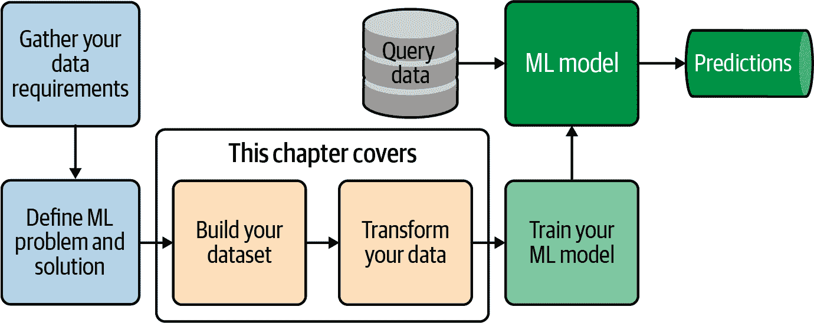
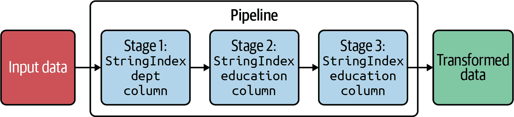
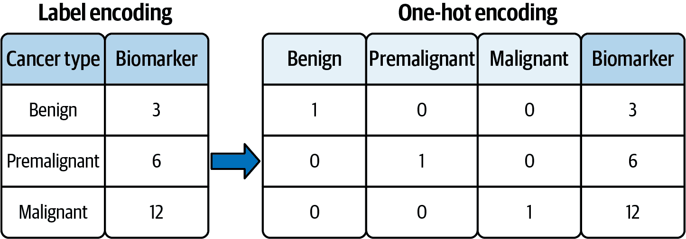

# 第十二章：特征工程在 PySpark 中

本章涵盖了在构建机器学习模型时处理数据特征（任何可测量的属性，从汽车价格到基因值、血红蛋白计数或教育水平）的设计模式（也称为*特征工程*）。在构建有效的机器学习模型时，提取、转换和选择特征是必不可少的过程。特征工程是机器学习中最重要的主题之一，因为模型在预测未来时成功与否主要取决于您选择的特征。

Spark 提供了广泛的机器学习 API，涵盖了许多著名的算法，包括线性回归、逻辑回归和决策树。本章的目标是介绍 PySpark 中的基础工具和技术，您可以使用这些工具构建各种机器学习流水线。本章介绍了 Spark 强大的机器学习工具和实用程序，并提供了使用 PySpark API 的示例。在这里学到的技能对于有志成为数据科学家或数据工程师的人来说非常有用。我的目标不是让您熟悉著名的机器学习算法，如线性回归、主成分分析或支持向量机，因为这些内容在许多书籍中已经涵盖，而是为您提供一些工具（如归一化、标准化、字符串索引等），您可以用这些工具来清洗数据并为各种机器学习算法构建模型。

无论您使用哪种算法，特征工程都是重要的。机器学习使我们能够在数据中找到模式——我们通过构建模型找到这些模式，然后使用构建的模型对新数据点（即查询数据）进行预测。为了正确预测，我们必须正确构建数据集并转换数据。本章涵盖了这两个关键步骤。

我们将讨论的主题包括：

+   添加新的派生特征

+   创建和应用用户定义函数（UDF）

+   创建流水线

+   数据二值化

+   **数据插补**

+   **Tokenization**

+   **标准化**

+   **归一化**

+   **String indexing**

+   **Vector assembly**

+   **分桶**

+   对数变换

+   独热编码

+   TF-IDF

+   **特征哈希**

+   应用 SQL 转换

不过，首先让我们更深入地研究特征工程。

# **特征工程介绍**

在他出色的[博客文章](https://oreil.ly/IO6T6)中，Jason Brownlee 将特征工程定义为“将原始数据转换为更好地代表预测模型底层问题的特征的过程，从而在未见数据上提高模型准确性”。在本章中，我的目标是介绍 PySpark 中通用的特征工程技术，您可以使用这些技术来构建更好的预测模型。

假设您的数据表示为行和列的矩阵。在机器学习中，列被称为特征（如年龄、性别、教育、心率或血压），每行代表数据集的一个实例（即记录）。数据中的特征将直接影响您构建和使用的预测模型以及您可以实现的结果。数据科学家大约一半的时间都花在数据准备上，特征工程是其中重要的一部分。

特征工程在构建机器学习模型中的位置是什么？何时将这些技术应用于您的数据？让我们来看看构建和使用机器学习模型的关键步骤：

1.  收集机器学习数据的要求并定义问题。

1.  选择数据（收集和整合数据，然后将其反规范化为数据集）。

1.  预处理数据（格式化、清理和采样数据，以便您可以处理它）。

1.  转换数据（执行特征工程）。

1.  对数据建模（将数据拆分为训练集和测试集，使用训练数据创建模型，然后使用测试数据评估和调整模型）。

1.  使用构建的模型对查询数据进行预测。

特征工程发生在从数据构建模型之前。在选择和清理数据之后（例如，确保空值被替换为适当的值），通过执行特征工程来转换数据：这可能涉及将字符串转换为数值数据、对数据进行分桶、对数据进行标准化或归一化等操作。

本章涵盖的整体过程的部分如图 Figure 12-1 所示。



###### 图 12-1\. 特征工程

Spark API 提供了多种用于处理特征的[算法](https://oreil.ly/butJ1)，大致分为以下几类：

+   提取（从“原始”数据中提取特征的算法）

+   转换（用于缩放、转换或修改特征的算法）

+   选择（从更大的特征集中选择子集的算法）

+   局部敏感哈希（LSH）；用于对相似项进行分组的算法）

数据转换和特征工程有许多原因，可以是强制性的，也可以是可选的：

强制转换

这些转换是为了解决问题（如构建机器学习模型）而必要的，以保证数据的兼容性。例如：

+   将非数值特征转换为数值特征。例如，如果一个特征具有非数值值，则无法进行平均、求和和中位数计算；同样，我们无法对字符串执行矩阵乘法，而必须首先将其转换为某种数值表示。

+   将输入调整为固定大小。一些线性模型和前馈神经网络具有固定数量的输入节点，因此你的输入数据必须始终具有相同的大小。例如，图像模型需要将其数据集中的图像重塑为固定大小。

可选的转换

可选的数据转换可能有助于机器学习模型表现更好。这些转换可能包括：

+   在应用其他数据转换之前将文本转换为小写。

+   分词和去除非必要的词，比如“of”、“a”、“and”、“the”和“so”

+   对数值特征进行归一化

我们将在接下来的章节中检查这两种类型。让我们深入探讨我们的第一个主题，添加一个新特征。

# 添加新特征

有时你想要添加一个新的衍生特征（因为你的机器学习算法需要这个衍生特征）到你的数据集中，为了向你的数据集添加一个新列或特征，你可以使用`DataFrame.withColumn()`函数。这个概念在下面进行了演示：

```
# SparkSession available as 'spark'
>>> column_names = ["emp_id", "salary"]
>>> records = [(100, 120000), (200, 170000), (300, 150000)]
>>> df = spark.createDataFrame(records, column_names)
>>> df.show()
+------+------+
|emp_id|salary|
+------+------+
|   100|120000|
|   200|170000|
|   300|150000|
+------+------+
```

你可以使用 Spark 的`DataFrame.withColumn()`来添加一个新列/特征：

```
>>> df2 = df.withColumn("bonus", df.salary * 0.05)
>>> df2.show()
+------+------+------+
|emp_id|salary| bonus|
+------+------+------+
|   100|120000|6000.0|
|   200|170000|8500.0|
|   300|150000|7500.0|
+------+------+------+
```

# 应用 UDFs

如果 PySpark 没有提供你需要的函数，你可以定义自己的 Python 函数，并使用`spark.udf.register()`将它们注册为 Spark SQL 的 DSL 中的用户定义函数（UDFs）。然后，你可以在你的数据转换中应用这些函数。

要使你的 Python 函数与 Spark 的 DataFrame 兼容，你需要通过将它们传递给`pyspark.sql.functions.udf()`函数来将它们转换为 PySpark UDFs。或者，你可以使用注解一步创建你的 UDF，如下所示。将`udf@`作为你的 Python 函数的“装饰器”，并将其返回类型作为参数指定：

```
from pyspark.sql.functions import udf

>>> @udf("integer") 
... def tripled(num):
...   return 3*int(num)
...
>>> df2 = df.withColumn('tripled_col', tripled(df.salary))
>>> df2.show()
+------+------+-----------+
|emp_id|salary|tripled_col| 
+------+------+-----------+
|   100|120000|     360000|
|   200|170000|     510000|
|   300|150000|     450000|
+------+------+-----------+
```


函数`tripled()`是一个 UDF，其返回类型是`integer`。


`tripled_col`是一个衍生特征。

请注意，如果你的特征表示为 RDD（其中每个 RDD 元素表示特征的一个实例），你可以使用`RDD.map()`函数向你的特征集添加一个新特征。

# 创建流水线

在机器学习算法中，你可以将几个阶段连接在一起并按顺序运行它们。考虑三个阶段，称为`{Stage-1, Stage-2, Stage-3}`，其中`Stage-1`的输出被用作`Stage-2`的输入，`Stage-2`的输出被用作`Stage-3`的输入。这三个阶段形成一个简单的流水线。假设我们必须按照显示在 Table 12-1 中的顺序转换数据。

表 12-1\. 流水线阶段

| Stage | 描述 |
| --- | --- |
| `Stage-1` | 对`dept`列进行标签编码或字符串索引（创建`dept_index`列）。 |
| `Stage-2` | 对`education`列进行标签编码或字符串索引（创建`education_index`列）。 |
| `Stage-3` | 对索引列`education_index`进行独热编码（创建`education_OHE`列）。 |

Spark 提供了一个 pipeline API，定义为`pyspark.ml.Pipeline(*, stages=None)`，它作为一个 estimator（在数据集上拟合模型的学习算法的抽象）。根据 Spark 的文档：

> 一个`Pipeline`由一系列阶段组成，每个阶段都是一个`Estimator`或`Transformer`。当调用`Pipeline.fit()`时，阶段将按顺序执行。如果阶段是一个`Estimator`，则会在输入数据集上调用其`Estimator.fit()`方法来拟合模型。然后这个模型，即一个 transformer，将被用来转换数据集作为下一个阶段的输入。如果阶段是一个`Transformer`，则会调用其`Transformer.transform()`方法来生成下一个阶段的数据集。从`Pipeline`中拟合的模型是一个`PipelineModel`，它包含了拟合的模型和 transformers，对应于 pipeline 的各个阶段。如果阶段是一个空列表，则 pipeline 充当一个 identity transformer。

为了说明 pipeline 的概念，首先我们将创建一个包含三列用作输入数据的示例 DataFrame，如下所示，然后我们将使用`pyspark.ml.Pipeline()`创建一个简单的 pipeline：

```
# spark: an instance of SparkSession
# create a DataFrame
df = spark.createDataFrame([
    (1, 'CS', 'MS'),
    (2, 'MATH', 'PHD'),
    (3, 'MATH', 'MS'),
    (4, 'CS', 'MS'),
    (5, 'CS', 'PHD'),
    (6, 'ECON', 'BS'),
    (7, 'ECON', 'BS'),
], ['id', 'dept', 'education'])
```

我们可以使用`df.show()`来查看我们的样本数据：

```
>>> df.show()
+---+----+---------+
| id|dept|education|
+---+----+---------+
|  1|  CS|       MS|
|  2|MATH|      PHD|
|  3|MATH|       MS|
|  4|  CS|       MS|
|  5|  CS|      PHD|
|  6|ECON|       BS|
|  7|ECON|       BS|
+---+----+---------+
```

现在我们已经创建了 DataFrame，假设我们想通过三个定义的阶段 `{stage_1, stage_2, stage_3}` 转换数据。在每个阶段中，我们将传递输入和输出列名称，并通过将定义的阶段作为列表传递给`Pipeline`对象来设置 pipeline。

Spark 的 pipeline 模型然后按顺序执行特定步骤，并给出最终的期望结果。图 12-2 显示了我们将定义的 pipeline。



###### 图 12-2\. 一个包含三个阶段的示例 pipeline

这三个阶段的实现如下：

```
from pyspark.ml import Pipeline
from pyspark.ml.feature import StringIndexer
from pyspark.ml.feature import OneHotEncoder

# Stage 1: transform the `dept` column to numeric
stage_1 = StringIndexer(inputCol= 'dept', outputCol= 'dept_index')
#
# Stage 2: transform the `education` column to numeric
stage_2 = StringIndexer(inputCol= 'education', outputCol= 'education_index')
#
# Stage 3: one-hot encode the numeric column `education_index`
stage_3 = OneHotEncoder(inputCols=['education_index'],
                        outputCols=['education_OHE'])
```

接下来，我们将定义包含这三个阶段的 pipeline：

```
# set up the pipeline: glue the stages together
pipeline = Pipeline(stages=[stage_1, stage_2, stage_3])

# fit the pipeline model and transform the data as defined
pipeline_model = pipeline.fit(df)

# view the transformed data
final_df = pipeline_model.transform(df)
final_df.show(truncate=False)
+---+----+---------+----------+---------------+-------------+
|id |dept|education|dept_index|education_index|education_OHE|
+---+----+---------+----------+---------------+-------------+
|1  |CS  |MS       |0.0       |0.0            |(2,[0],[1.0])|
|2  |MATH|PHD      |2.0       |2.0            |(2,[],[])    |
|3  |MATH|MS       |2.0       |0.0            |(2,[0],[1.0])|
|4  |CS  |MS       |0.0       |0.0            |(2,[0],[1.0])|
|5  |CS  |PHD      |0.0       |2.0            |(2,[],[])    |
|6  |ECON|BS       |1.0       |1.0            |(2,[1],[1.0])|
|7  |ECON|BS       |1.0       |1.0            |(2,[1],[1.0])|
+---+----+---------+----------+---------------+-------------+
```

# 数据二值化

*二值化*数据意味着根据某个阈值将特征值设置为 0 或 1。大于阈值的值映射为 1，小于或等于阈值的值映射为 0。使用默认阈值 0，只有正值映射为 1。因此，二值化是将数值特征阈值化为二进制 `{0, 1}` 特征的过程。

Spark 的`Binarizer`接受参数`inputCol`和`outputCol`，以及二值化的`threshold`。大于阈值的特征值被二值化为`1.0`；小于或等于阈值的特征值被二值化为`0.0`。

首先，让我们创建一个只有单个特征的 DataFrame：

```
from pyspark.ml.feature import Binarizer

raw_df = spark.createDataFrame([
    (1, 0.1),
    (2, 0.2),
    (3, 0.5),
    (4, 0.8),
    (5, 0.9),
    (6, 1.1)
], ["id", "feature"])
```

接下来，我们将创建一个`Binarizer`，设置`threshold=0.5`，因此任何小于或等于`0.5`的值将映射为`0.0`，任何大于`0.5`的值将映射为`1.0`：

```
>>> from pyspark.ml.feature import Binarizer
>>> binarizer = Binarizer(threshold=0.5, inputCol="feature",
                          outputCol="binarized_feature")
```

最后，我们将定义的`Binarizer`应用于特征列：

```
binarized_df = binarizer.transform(raw_df)

>>> print("Binarizer output with Threshold = %f" % binarizer.getThreshold())
Binarizer output with Threshold = 0.500000

>>> binarized_df = binarizer.transform(raw_df)
>>> binarized_df.show(truncate=False)
+---+-------+-----------------+
|id |feature|binarized_feature|
+---+-------+-----------------+
|1  |0.1    |0.0              |
|2  |0.2    |0.0              |
|3  |0.5    |0.0              |
|4  |0.8    |1.0              |
|5  |0.9    |1.0              |
|6  |1.1    |1.0              |
+---+-------+-----------------+
```

# 补全

Spark 的 `Imputer` 是用于填充缺失值的填充转换器。现实世界的数据集通常包含缺失值，通常编码为 null、空白、`NaN`或其他占位符。有许多方法可以处理这些值，包括以下方法：

+   如果存在任何缺失的特征，则删除实例（这可能不是一个好主意，因为会丢失其他特征的重要信息）。

+   对于缺失的特征，找到该特征的平均值并填充该值。

+   对缺失值进行填充（即从数据的已知部分推断出缺失值）。这通常是最佳策略。

Spark 的 `Imputer` 具有以下签名：

```
class pyspark.ml.feature.Imputer(*, strategy='mean', missingValue=nan,
                                 inputCols=None, outputCols=None,
                                 inputCol=None, outputCol=None,
                                 relativeError=0.001)
```

它使用所在列的均值或中位数来填补缺失值。输入列应为数值型；目前 `Imputer` 不支持分类特征，可能会为分类特征创建不正确的值。

注意，在过滤掉缺失值后计算均值/中位数/模式值。输入列中的所有 `null` 值都视为缺失值，因此也会被填充。对于计算中位数，使用 `pyspark.sql.DataFrame.approxQuantile()` 并设定相对误差为 0.001。

您可以指示 imputer 通过 `.setMissingValue(*custom_value*)` 来填充除 `NaN` 以外的自定义值。例如，`.setMissingValue(0)` 告诉它填充所有 `0` 的出现次数（再次强调，输入列中的 `null` 值将被视为缺失并进行填充）。

下面的例子展示了如何使用 imputer。假设我们有一个包含三列 `id`、`col1` 和 `col2` 的 DataFrame：

```
>>> df = spark.createDataFrame([
...      (1, 12.0, 5.0),
...      (2, 7.0, 10.0),
...      (3, 10.0, 12.0),
...      (4, 5.0, float("nan")),
...      (5, 6.0, None),
...      (6, float("nan"), float("nan")),
...      (7, None, None)
... ], ["id", "col1", "col2"])
>>> df.show(truncate=False)
+---+----+----+
|id |col1|col2|
+---+----+----+
|1  |12.0|5.0 |
|2  |7.0 |10.0|
|3  |10.0|12.0|
|4  |5.0 |NaN |
|5  |6.0 |null|
|6  |NaN |NaN |
|7  |null|null|
+---+----+----+
```

接下来，让我们创建一个 imputer 并将其应用于我们创建的数据：

```
>>> from pyspark.ml.feature import Imputer
>>> imputer = Imputer(inputCols=["col1", "col2"],
                      outputCols=["col1_out", "col2_out"])
>>> model = imputer.fit(df)
>>> transformed = model.transform(df)
>>> transformed.show(truncate=False)
+---+----+----+--------+--------+
|id |col1|col2|col1_out|col2_out|
+---+----+----+--------+--------+
|1  |12.0|5.0 |12.0    |5.0     |
|2  |7.0 |10.0|7.0     |10.0    |
|3  |10.0|12.0|10.0    |12.0    |
|4  |5.0 |NaN |5.0     |9.0     |
|5  |6.0 |null|6.0     |9.0     |
|6  |NaN |NaN |8.0     |9.0     |
|7  |null|null|8.0     |9.0     |
+---+----+----+--------+--------+
```

我们是如何得到用于缺失值的这些数字（`col1` 的 `8.0` 和 `col2` 的 `9.0`）？很简单；因为默认策略是“均值”，我们只需计算每列的平均值并将其用于缺失值：

```
col1: (12.0+7.0+10.0+5.0+6.0) / 5 = 40 / 5 = 8.0
col2: (5.0+10.0+12.0) / 3 = 27.0 / 3 = 9.0
```

根据您的数据需求，您可能希望使用不同的策略来填充缺失值。您可以指示 imputer 使用可用特征值的中位数代替缺失值，如下所示：

```
>>> imputer.setStrategy("median")
>>> model = imputer.fit(df)
>>> transformed = model.transform(df)
>>> transformed.show(truncate=False)
+---+----+----+--------+--------+
|id |col1|col2|col1_out|col2_out|
+---+----+----+--------+--------+
|1  |12.0|5.0 |12.0    |5.0     |
|2  |7.0 |10.0|7.0     |10.0    |
|3  |10.0|12.0|10.0    |12.0    |
|4  |5.0 |NaN |5.0     |10.0    |
|5  |6.0 |null|6.0     |10.0    |
|6  |NaN |NaN |7.0     |10.0    |
|7  |null|null|7.0     |10.0    |
+---+----+----+--------+--------+
```

要获取这些值（`col1` 的 `7.0` 和 `col2` 的 `10.0`），我们只需计算每列的中位数值：

```
median(col1) =
median(12.0, 7.0, 10.0, 5.0, 6.0) =
median(5.0, 6.0, 7.0, 10.0, 12.0) =
7.0

median(col2) =
median(5.0, 10.0, 12.0) =
10.0
```

# 分词

分词算法用于将短语、句子、段落或整个文本文档分割成较小的单元，如单词、二元组或术语。这些较小的单元称为 *tokens*。例如，词法分析器（编译器编写中使用的算法）通过移除任何空格或注释，将编程代码分割成一系列 tokens。因此，您可以将分词更普遍地理解为将字符串拆分为任何有意义的 tokens 的过程。

在 Spark 中，您可以使用 `Tokenizer` 和 `RegexTokenizer`（通过正则表达式定义自定义分词策略）来对字符串进行分词。

## 分词器

Spark 的`Tokenizer`是一个将输入字符串转换为小写并按空格分割的分词器。为了展示它的工作原理，让我们创建一些示例数据：

```
>>> docs = [(1, "a Fox jumped over FOX"),
            (2, "RED of fox jumped")]
>>> df = spark.createDataFrame(docs, ["id", "text"])
>>> df.show(truncate=False)
+---+---------------------+
|id |text                 |
+---+---------------------+
|1  |a Fox jumped over FOX|
|2  |RED of fox jumped   |
+---+---------------------+
```

然后应用`Tokenizer`：

```
>>> tokenizer = Tokenizer(inputCol="text", outputCol="tokens")
>>> tokenized = tokenizer.transform(df)
>>> tokenized.select("text", "tokens")
        .withColumn("tokens_length", countTokens(col("tokens")))
        .show(truncate=False)
+---------------------+---------------------------+-------------+
|text                 |tokens                     |tokens_length|
+---------------------+---------------------------+-------------+
|a Fox jumped over FOX|[a, fox, jumped, over, fox]|5            |
|RED of fox jumped    |[red, of, fox, jumped]     |4            |
+---------------------+---------------------------+-------------+
```

## 正则表达式分词器（RegexTokenizer）

Spark 的`RegexTokenizer`是基于正则表达式的分词器，它通过使用提供的正则表达式模式拆分文本（默认情况）或反复匹配正则表达式（如果可选的`gaps`参数，默认值为`True`，为`False`）来提取令牌。下面是一个示例：

```
>>> regexTokenizer = RegexTokenizer(inputCol="text", outputCol="tokens",
                                    pattern="\\W", minTokenLength=3)
>>> regex_tokenized = regexTokenizer.transform(df)
>>> regex_tokenized.select("text", "tokens")
        .withColumn("tokens_length", countTokens(col("tokens")))
        .show(truncate=False)
+---------------------+------------------------+-------------+
|text                 |tokens                  |tokens_length|
+---------------------+------------------------+-------------+
|a Fox jumped over FOX|[fox, jumped, over, fox]|4            |
|RED of fox jumped    |[red, fox, jumped]      |3            |
+---------------------+------------------------+-------------+
```

## 管道中的分词

我们还可以作为管道的一部分执行分词。这里，我们创建一个包含两列的 DataFrame：

```
>>> docs = [(1, "a Fox jumped, over, the fence?"),
            (2, "a RED, of fox?")]
>>> df = spark.createDataFrame(docs, ["id", "text"])
>>> df.show(truncate=False)
+---+------------------------------+
|id |text                          |
+---+------------------------------+
|1  |a Fox jumped, over, the fence?|
|2  |a RED, of fox?                |
+---+------------------------------+
```

接下来，我们对这个 DataFrame 应用`RegexTokenizer()`函数：

```
>>> tk = RegexTokenizer(pattern=r'(?:\p{Punct}|\s)+', inputCol="text",
                        outputCol='text2')
>>> sw = StopWordsRemover(inputCol='text2', outputCol='text3')
>>> pipeline = Pipeline(stages=[tk, sw])
>>> df4 = pipeline.fit(df).transform(df)
>>> df4.show(truncate=False)
+---+----------------+-----------------+--------------+
|id | text           |text2            |text3         |
+---+----------------+-----------------+--------------+
|1  |a Fox jumped,   |[a, fox, jumped, |[fox, jumped, |
|   |over, the fence?|over, the, fence]| fence]       |
|2  |a RED, of fox?  |[a, red, of, fox]|[red, fox]    |
+---+----------------+-----------------+--------------+
```

# 标准化

在构建模型之前，最流行的数值数据缩放技术之一是标准化。标准化数据集涉及重新缩放值的分布，使观察值的均值（作为特征）为`0.00`，标准差为`1.00`。

许多机器学习算法在数值输入变量（特征）缩放到标准范围时表现更好。例如，使用输入加权和的线性回归算法和使用距离度量的 k 最近邻算法需要标准化值，否则构建的模型可能会欠拟合或过拟合训练数据，并且性能较差。

一个值的标准化公式如下：

```
y = (x – mean) / standard_deviation
```

均值的计   均值的计算公式为：

```
mean = sum(x) / count(x)
```

<math alttext="x overbar equals StartFraction 1 Over upper N EndFraction sigma-summation Underscript i equals 1 Overscript upper N Endscripts x Subscript i" display="block"><mrow><mover accent="true"><mi>x</mi> <mo>¯</mo></mover> <mo>=</mo> <mfrac><mn>1</mn> <mi>N</mi></mfrac> <munderover><mo>∑</mo> <mrow><mi>i</mi><mo>=</mo><mn>1</mn></mrow> <mi>N</mi></munderover> <msub><mi>x</mi> <mi>i</mi></msub></mrow></math>

标准差的计算公式为：

```
standard_deviation = sqrt(sum( (x – mean)² ) / count(x))
```

<math alttext="s d equals StartRoot StartFraction 1 Over upper N EndFraction sigma-summation Underscript i equals 1 Overscript upper N Endscripts left-parenthesis x Subscript i Baseline minus x overbar right-parenthesis squared EndRoot" display="block"><mrow><mi>s</mi> <mi>d</mi> <mo>=</mo> <msqrt><mrow><mfrac><mn>1</mn> <mi>N</mi></mfrac> <msubsup><mo>∑</mo> <mrow><mi>i</mi><mo>=</mo><mn>1</mn></mrow> <mi>N</mi></msubsup> <msup><mrow><mo>(</mo><msub><mi>x</mi> <mi>i</mi></msub> <mo>-</mo><mover accent="true"><mi>x</mi> <mo>¯</mo></mover><mo>)</mo></mrow> <mn>2</mn></msup></mrow></msqrt></mrow></math>

例如，若`X = (1, 3, 6, 10)`，则均值/平均值计算为：

```
mean = (1+2+6+10)/4 = 20/4 = 5.0
```

标准差的计算公式为：

```
standard_deviation
= sqrt ( ((1-5)² + (3-5)² + (6-5)² + (10-5)²)) / 4)
= sqrt ((16+4+1+25)/4)
= sqrt(46/4)
= sqrt(11.5) = 3.39116
```

所以，新标准化的值将是：

```
y = (y1, y2, y3, y4) = (-1.1795, -0.5897, 0.2948, 1.4744)
```

其中：

```
y1 = (1 – 5.0) / 3.39116
y2 = (3 - 5.0) / 3.39116
y3 = (6 - 5.0) / 3.39116
y4 = (10 - 5.0) / 3.39116
```

如你所见，标准化值`(y)`的均值为`0.00`，标准差为`1.00`。

让我们来看看如何在 PySpark 中执行标准化。假设我们试图将 DataFrame 中的一列进行标准化（`均值 = 0.00`，`标准差 = 1.00`）。首先，我们将创建一个示例 DataFrame，然后我将向你展示两种标准化`age`列的方法：

```
features = [('alex', 1), ('bob', 3), ('ali', 6), ('dave', 10)]
columns = ("name", "age")
samples = spark.createDataFrame(features, columns)
>>> samples.show()
+----+---+
|name|age|
+----+---+
|alex|  1|
| bob|  3|
| ali|  6|
|dave| 10|
+----+---+
```

方法 1 是使用 DataFrame 函数：

```
>>> from pyspark.sql.functions import stddev, mean, col
>>> (samples.select(mean("age").alias("mean_age"),
...                 stddev("age").alias("stddev_age"))
...   .crossJoin(samples)
...   .withColumn("age_scaled",
         (col("age") - col("mean_age")) / col("stddev_age")))
...   .show(truncate=False)
+--------+------------------+----+---+-------------------+
|mean_age|stddev_age        |name|age|age_scaled         |
+--------+------------------+----+---+-------------------+
|5.0     |3.9157800414902435|alex|1  |-1.0215078369104984|
|5.0     |3.9157800414902435|bob |3  |-0.5107539184552492|
|5.0     |3.9157800414902435|ali |6  |0.2553769592276246 |
|5.0     |3.9157800414902435|dave|10 |1.276884796138123  |
+--------+------------------+----+---+-------------------+
```

或者，我们也可以这样写：

```
>>> mean_age, sttdev_age = samples.select(mean("age"), stddev("age"))
    .first()
>>> samples.withColumn("age_scaled",
    (col("age") - mean_age) / sttdev_age).show(truncate=False)
+----+---+-------------------+
|name|age|age_scaled         |
+----+---+-------------------+
|alex|1  |-1.0215078369104984|
|bob |3  |-0.5107539184552492|
|ali |6  |0.2553769592276246 |
|dave|10 |1.276884796138123  |
+----+---+-------------------+
```

方法 2 是使用 PySpark 的`ml`包中的函数。这里，我们使用`pyspark.ml.feature.VectorAssembler()`将`age`列转换为向量，然后使用 Spark 的`StandardScaler`对值进行标准化：

```
>>> from pyspark.ml.feature import VectorAssembler
>>> from pyspark.ml.feature import StandardScaler
>>> vecAssembler = VectorAssembler(inputCols=['age'], outputCol="age_vector")
>>> samples2 = vecAssembler.transform(samples)
>>> samples2.show()
+----+---+----------+
|name|age|age_vector|
+----+---+----------+
|alex|  1|     [1.0]|
| bob|  3|     [3.0]|
| ali|  6|     [6.0]|
|dave| 10|    [10.0]|
+----+---+----------+
```

```
>>> scaler = StandardScaler(inputCol="age_vector", outputCol="age_scaled",
...   withStd=True, withMean=True)
>>> scalerModel = scaler.fit(samples2)
>>> scaledData = scalerModel.transform(samples2)
>>> scaledData.show(truncate=False)
+----+---+----------+---------------------+
|name|age|age_vector|age_scaled           |
+----+---+----------+---------------------+
|alex|1  |[1.0]     |[-1.0215078369104984]|
|bob |3  |[3.0]     |[-0.5107539184552492]|
|ali |6  |[6.0]     |[0.2553769592276246] |
|dave|10 |[10.0]    |[1.276884796138123]  |
+----+---+----------+---------------------+
```

与我们接下来要讨论的归一化不同，标准化在数据服从高斯分布的情况下非常有帮助。它也没有边界范围，因此如果数据中存在离群值，标准化不会受到影响。

# 归一化

归一化是机器学习中常用的数据准备技术之一。归一化的目标是将数据集中数值列的值更改为一个公共的尺度，而不失真值的差异或丢失信息。归一化将每个数值输入变量分别缩放到范围`[0,1]`内，这是浮点值的范围，具有最高的精度。换句话说，特征值被移动和重新缩放，以便它们最终在`0.00`到`1.00`之间。这种技术也称为*min-max scaling*，Spark 提供了一个名为`MinMaxScaler`的转换器用于此目的。

这是归一化的公式：

<math alttext="upper X overTilde Subscript i Baseline equals StartFraction upper X Subscript i Baseline minus upper X Subscript m i n Baseline Over upper X Subscript m a x Baseline minus upper X Subscript m i n Baseline EndFraction" display="block"><mrow><msub><mover accent="true"><mi>X</mi> <mo>˜</mo></mover> <mi>i</mi></msub> <mo>=</mo> <mfrac><mrow><msub><mi>X</mi> <mi>i</mi></msub> <mo>-</mo><msub><mi>X</mi> <mrow><mi>m</mi><mi>i</mi><mi>n</mi></mrow></msub></mrow> <mrow><msub><mi>X</mi> <mrow><mi>m</mi><mi>a</mi><mi>x</mi></mrow></msub> <mo>-</mo><msub><mi>X</mi> <mrow><mi>m</mi><mi>i</mi><mi>n</mi></mrow></msub></mrow></mfrac></mrow></math>

注意*X[max]*和*X[min]*是给定特征*X[i]*的最大值和最小值，分别。

为了说明归一化过程，让我们创建一个具有三个特征的 DataFrame：

```
>>> df = spark.createDataFrame([ (100, 77560, 45),
                                 (200, 41560, 23),
                                 (300, 30285, 20),
                                 (400, 10345, 6),
                                 (500, 88000, 50)
                               ], ["user_id", "revenue","num_of_days"])

>>> print("Before Scaling :")
>>> df.show(5)
+-------+-------+-----------+
|user_id|revenue|num_of_days|
+-------+-------+-----------+
|    100|  77560|         45|
|    200|  41560|         23|
|    300|  30285|         20|
|    400|  10345|          6|
|    500|  88000|         50|
+-------+-------+-----------+
```

接下来，我们将`MinMaxScaler`应用于我们的特征：

```
from pyspark.ml.feature import MinMaxScaler
from pyspark.ml.feature import VectorAssembler
from pyspark.ml import Pipeline
from pyspark.sql.functions import udf
from pyspark.sql.types import DoubleType

# UDF for converting column type from vector to double type
unlist = udf(lambda x: round(float(list(x)[0]),3), DoubleType())

# Iterating over columns to be scaled
for i in ["revenue","num_of_days"]:
    # VectorAssembler transformation - Converting column to vector type
    assembler = VectorAssembler(inputCols=[i],outputCol=i+"_Vect")

    # MinMaxScaler transformation
    scaler = MinMaxScaler(inputCol=i+"_Vect", outputCol=i+"_Scaled")

    # Pipeline of VectorAssembler and MinMaxScaler
    pipeline = Pipeline(stages=[assembler, scaler])

    # Fitting pipeline on DataFrame
    df = pipeline.fit(df).transform(df)
      .withColumn(i+"_Scaled", unlist(i+"_Scaled")).drop(i+"_Vect")

After scaling, we can create and execute the following pipelines:

for i in ["revenue","num_of_days"]:
   assembler = VectorAssembler(inputCols=[i], outputCol=i+"_Vect")
   scaler = MinMaxScaler(inputCol=i+"_Vect", outputCol=i+"_Scaled")
   pipeline = Pipeline(stages=[assembler, scaler])
   df = pipeline.fit(df)
            .transform(df)
            .withColumn(i+"_Scaled", unlist(i+"_Scaled"))
            .drop(i+"_Vect")
```

并查看缩放后的值：

```
>>> df.show(5)
+-------+-------+-----------+--------------+------------------+
|user_id|revenue|num_of_days|revenue_Scaled|num_of_days_Scaled|
+-------+-------+-----------+--------------+------------------+
|    100|  77560|         45|         0.866|             0.886|
|    200|  41560|         23|         0.402|             0.386|
|    300|  30285|         20|         0.257|             0.318|
|    400|  10345|          6|           0.0|               0.0|
|    500|  88000|         50|           1.0|               1.0|
+-------+-------+-----------+--------------+------------------+
```

当你知道你的数据不遵循高斯分布时，归一化是一个好的技术。这在不假设数据分布的算法中非常有用，例如线性回归、*k*-最近邻和神经网络。在接下来的几节中，我们将通过几个更多的例子来演示。

## 在管道中使用 MinMaxScaler 来缩放列

与标记化一样，我们可以在管道中应用归一化。首先，让我们定义一组特征：

```
>>> from pyspark.ml.feature import MinMaxScaler
>>> from pyspark.ml import Pipeline
>>> from pyspark.ml.feature import VectorAssembler
>>> triplets = [(0, 1, 100), (1, 2, 200), (2, 5, 1000)]
>>> df = spark.createDataFrame(triplets, ['x', 'y', 'z'])
>>> df.show()
+---+---+----+
|  x|  y|   z|
+---+---+----+
|  0|  1| 100|
|  1|  2| 200|
|  2|  5|1000|
+---+---+----+
```

现在我们可以按照以下方式在管道中应用`MinMaxScaler`来归一化特征（列）`x`的值：

```
>>> assembler = VectorAssembler(inputCols=["x"], outputCol="x_vector")
>>> scaler = MinMaxScaler(inputCol="x_vector", outputCol="x_scaled")
>>> pipeline = Pipeline(stages=[assembler, scaler])
>>> scalerModel = pipeline.fit(df)
>>> scaledData = scalerModel.transform(df)
>>> scaledData.show(truncate=False)
+---+---+----+--------+--------+
|x  |y  |z   |x_vector|x_scaled|
+---+---+----+--------+--------+
|0  |1  |100 |[0.0]   |[0.0]   |
|1  |2  |200 |[1.0]   |[0.5]   |
|2  |5  |1000|[2.0]   |[1.0]   |
+---+---+----+--------+--------+
```

## 在多列上使用 MinMaxScaler

我们还可以在多列上应用缩放器（如`MinMaxScaler`）：

```
>>> triplets = [(0, 1, 100), (1, 2, 200), (2, 5, 1000)]
>>> df = spark.createDataFrame(triplets, ['x', 'y', 'z'])
>>> df.show()
+---+---+----+
|  x|  y|   z|
+---+---+----+
|  0|  1| 100|
|  1|  2| 200|
|  2|  5|1000|
+---+---+----+
>>> from pyspark.ml import Pipeline
>>> from pyspark.ml.feature import MinMaxScaler
>>> columns_to_scale = ["x", "y", "z"]
>>> assemblers = [VectorAssembler(inputCols=[col],
    outputCol=col + "_vector") for col in columns_to_scale]
>>> scalers = [MinMaxScaler(inputCol=col + "_vector",
    outputCol=col + "_scaled") for col in columns_to_scale]
>>> pipeline = Pipeline(stages=assemblers + scalers)
>>> scalerModel = pipeline.fit(df)
>>> scaledData = scalerModel.transform(df)
>>> scaledData.show(truncate=False)
+---+---+----+--------+--------+--------+--------+--------+--------------------+
|x  |y  |z   |x_vector|y_vector|z_vector|x_scaled|y_scaled|z_scaled            |
+---+---+----+--------+--------+--------+--------+--------+--------------------+
|0  |1  |100 |[0.0]   |[1.0]   |[100.0] |[0.0]   |[0.0]   |[0.0]               |
|1  |2  |200 |[1.0]   |[2.0]   |[200.0] |[0.5]   |[0.25]  |[0.1111111111111111]|
|2  |5  |1000|[2.0]   |[5.0]   |[1000.0]|[1.0]   |[1.0]   |[1.0]               |
+---+---+----+--------+--------+--------+--------+--------+--------------------+
```

您可以进行一些后处理来恢复原始列名：

```
from pyspark.sql import functions as f

names = {x + "_scaled": x for x in columns_to_scale}
scaledData = scaledData.select([f.col(c).alias(names[c]) for c in names.keys()])
```

输出将是：

```
>>> scaledData.show()
+------+-----+--------------------+
|     y|    x|                   z|
+------+-----+--------------------+
| [0.0]|[0.0]|               [0.0]|
|[0.25]|[0.5]|[0.1111111111111111]|
| [1.0]|[1.0]|               [1.0]|
+------+-----+--------------------+
```

## 使用 Normalizer 进行归一化

Spark 的`Normalizer`将一个`Vector`行数据集转换为单位范数（即长度为 1）的`Vector`。它接受来自用户的参数`p`，表示 p-范数。例如，您可以设置`p=1`来使用曼哈顿范数（或曼哈顿距离），或者`p=2`来使用欧几里得范数：

```
L1: z = || x ||1 = sum(|xi|) for i=1, ..., n
L2: z = || x ||2 = sqrt(sum(xi²)) for i=1,..., n
```

```
from pyspark.ml.feature import Normalizer
# Create an object of the class Normalizer
ManhattanDistance=Normalizer().setP(1)
  .setInputCol("features").setOutputCol("Manhattan Distance")
EuclideanDistance=Normalizer().setP(2)
  .setInputCol("features").setOutputCol("Euclidean Distance")
# Transform
ManhattanDistance.transform(scaleDF).show()
+---+--------------+--------------------+
| id|      features|  Manhattan Distance|
+---+--------------+--------------------+
|  0|[1.0,0.1,-1.0]|[0.47619047619047...|
|  1| [2.0,1.1,1.0]|[0.48780487804878...|
|  0|[1.0,0.1,-1.0]|[0.47619047619047...|
|  1| [2.0,1.1,1.0]|[0.48780487804878...|
|  1|[3.0,10.1,3.0]|[0.18633540372670...|
+---+--------------+--------------------+

EuclideanDistance.transform(scaleDF).show()
+---+--------------+--------------------+
| id|      features|  Euclidean Distance|
+---+--------------+--------------------+
|  0|[1.0,0.1,-1.0]|[0.70534561585859...|
|  1| [2.0,1.1,1.0]|[0.80257235390512...|
|  0|[1.0,0.1,-1.0]|[0.70534561585859...|
|  1| [2.0,1.1,1.0]|[0.80257235390512...|
|  1|[3.0,10.1,3.0]|[0.27384986857909...|
+---+--------------+--------------------+
```

# 字符串索引

大多数机器学习算法要求将分类特征（例如字符串）转换为数值特征。字符串索引是将字符串转换为数值的过程。

Spark 的`StringIndexer`是一个标签索引器，它将标签的字符串列映射到标签索引的列。如果输入列是数值型的，我们将其转换为字符串并索引字符串值。索引的范围为`[0, numLabels)`。默认情况下，它们按照标签频率降序排序，因此最频繁的标签得到索引`0`。排序行为由设置`stringOrderType`选项来控制。

## 将 StringIndexer 应用于单列

假设我们有以下 PySpark DataFrame：

```
+-------+--------------+----+----+
|address|          date|name|food|
+-------+--------------+----+----+
|1111111|20151122045510| Yin|gre |
|1111111|20151122045501| Yin|gre |
|1111111|20151122045500| Yln|gra |
|1111112|20151122065832| Yun|ddd |
|1111113|20160101003221| Yan|fdf |
|1111111|20160703045231| Yin|gre |
|1111114|20150419134543| Yin|fdf |
|1111115|20151123174302| Yen|ddd |
|2111115|      20123192| Yen|gre |
+-------+--------------+----+----+
```

如果我们想要将其转换为适用于`pyspark.ml`，我们可以使用 Spark 的`StringIndexer`将`name`列转换为数值列，如下所示：

```
>>> indexer = StringIndexer(inputCol="name", outputCol="name_index").fit(df)
>>> df_ind = indexer.transform(df)
>>> df_ind.show()
+-------+--------------+----+----------+----+
|address|          date|name|name_index|food|
+-------+--------------+----+----------+----+
|1111111|20151122045510| Yin|       0.0|gre |
|1111111|20151122045501| Yin|       0.0|gre |
|1111111|20151122045500| Yln|       2.0|gra |
|1111112|20151122065832| Yun|       4.0|ddd |
|1111113|20160101003221| Yan|       3.0|fdf |
|1111111|20160703045231| Yin|       0.0|gre |
|1111114|20150419134543| Yin|       0.0|fdf |
|1111115|20151123174302| Yen|       1.0|ddd |
|2111115|      20123192| Yen|       1.0|gre |
+-------+--------------+----+----------+----+
```

## 将 StringIndexer 应用于多个列

如果我们想要一次将`StringIndexer`应用于多个列，简单的方法是将多个`StringIndex`组合在`list()`函数中，并使用`Pipeline`来执行它们所有：

```
from pyspark.ml import Pipeline
from pyspark.ml.feature import StringIndexer

indexers = [ StringIndexer(inputCol=column, outputCol=column+"_index").fit(df)
  for column in list(set(df.columns)-set(['date'])) ]

pipeline = Pipeline(stages=indexers)
df_indexed = pipeline.fit(df).transform(df)

df_indexed.show()
+-------+--------------+----+----+----------+----------+-------------+
|address|          date|food|name|food_index|name_index|address_index|
+-------+--------------+----+----+----------+----------+-------------+
|1111111|20151122045510| gre| Yin|       0.0|       0.0|          0.0|
|1111111|20151122045501| gra| Yin|       2.0|       0.0|          0.0|
|1111111|20151122045500| gre| Yln|       0.0|       2.0|          0.0|
|1111112|20151122065832| gre| Yun|       0.0|       4.0|          3.0|
|1111113|20160101003221| gre| Yan|       0.0|       3.0|          1.0|
|1111111|20160703045231| gre| Yin|       0.0|       0.0|          0.0|
|1111114|20150419134543| gre| Yin|       0.0|       0.0|          5.0|
|1111115|20151123174302| ddd| Yen|       1.0|       1.0|          2.0|
|2111115|      20123192| ddd| Yen|       1.0|       1.0|          4.0|
+-------+--------------+----+----+----------+----------+-------------+
```

接下来，我将更深入地探讨`VectorAssembler`，介绍在“标准化”中引入的内容。

# 向量组装

`VectorAssembler`的主要功能是将一组特征连接成一个单独的向量，可以传递给估算器或机器学习算法。换句话说，它是一个特征转换器，将多个列合并为一个单独的向量列。假设我们有以下 DataFrame：

```
>>> df.show()
+----+----+----+
|col1|col2|col3|
+----+----+----+
| 7.0| 8.0| 9.0|
| 1.1| 1.2| 1.3|
| 4.0| 5.0| 6.0|
|   2|   3|   4|
| 5.0| NaN|null|
+----+----+----+
```

我们可以将`VectorAssembler`应用于这三个特征（`col1`、`col2`和`col3`），并将它们合并为一个名为`features`的向量列，如下所示：

```
from pyspark.ml.feature import VectorAssembler
input_columns = ["col1", "col2", "col3"]
assembler = VectorAssembler(inputCols=input_columns, outputCol="features")
# use the transform() method to transform the dataset into a vector
transformed = assembler.transform(df)
transformed.show()
+----+----+----+-------------+
|col1|col2|col3|     features|
+----+----+----+-------------+
| 7.0| 8.0| 9.0|[7.0,8.0,9.0]|
| 1.1| 1.2| 1.3|[1.1,1.2,1.3]|
| 4.0| 5.0| 6.0|[4.0,5.0,6.0]|
|   2|   3|   4|[2.0,3.0,4.0]|
| 5.0| NaN|null|[5.0,NaN,NaN]|
+----+----+----+-------------+
```

如果您想要跳过具有`NaN`或`null`值的行，您可以使用`VectorAssembler.setParams(handleInvalid="skip")`来实现：

```
>>> assembler2 = VectorAssembler(inputCols=input_columns, outputCol="features")
                .setParams(handleInvalid="skip")

>>> assembler2.transform(df).show()
+----+----+----+-------------+
|col1|col2|col3|     features|
+----+----+----+-------------+
| 7.0| 8.0| 9.0|[7.0,8.0,9.0]|
| 1.1| 1.2| 1.3|[1.1,1.2,1.3]|
| 4.0| 5.0| 6.0|[4.0,5.0,6.0]|
|   2|   3|   4|[2.0,3.0,4.0]|
+----+----+----+-------------+
```

# 分桶

数据分桶，也称为离散分桶或分箱，是一种用于减少小观察误差影响的数据预处理技术。通过这种技术，原始数据值落入给定小间隔（桶）中的数据被替换为该间隔的代表值，通常是中心值。例如，如果您有汽车价格数据，其中值广泛分布，您可能更喜欢使用分桶而不是实际的个别汽车价格。

Spark 的 Bucketizer 将连续特征列转换为特征桶列，其中桶由用户指定。

考虑这个例子：纬度和住房价值之间没有线性关系，但您可能会怀疑单独的纬度和住房价值之间存在关系。为了探索这一点，您可以将纬度进行分桶处理，创建如下的桶：

```
Bin-1:  32 < latitude <= 33
Bin-2:  33 < latitude <= 34
...
```

分桶技术可以应用于分类和数值数据。表 12-2 展示了一个数值分桶示例，表 12-3 展示了一个分类分桶示例。

表 12-2\. 数值分桶示例

| 值 | 分箱 |
| --- | --- |
| 0-10 | 非常低 |
| 11-30 | 低 |
| 31-70 | 中等 |
| 71-90 | 高 |
| 91-100 | 非常高 |

表 12-3\. 分类分桶示例

| 值 | 分箱 |
| --- | --- |
| 印度 | 亚洲 |
| 中国 | 亚洲 |
| 日本 | 亚洲 |
| 西班牙 | 欧洲 |
| 意大利 | 欧洲 |
| 智利 | 南美洲 |
| 巴西 | 南美洲 |

分桶也用于基因组数据：我们将人类基因组染色体（1、2、3、...、22、X、Y、MT）进行分桶处理。例如，染色体 1 有 2.5 亿个位置，我们可以将其分成 101 个桶，如下所示：

```
for id in (1, 2, 3, ..., 22, X, Y, MT):
  chr_position = (chromosome-<id> position)
  # chr_position range is from 1 to 250,000,000
  bucket = chr_position % 101
  # where
  #      0 =< bucket <= 100
```

## Bucketizer

桶装是将连续变量转换为分类变量的最直接方法。为了说明，让我们看一个例子。在 PySpark 中，通过`Bucketizer`类可以轻松实现分桶任务。第一步是定义桶边界；然后，我们创建`Bucketizer`类的对象，并应用`transform()`方法到我们的 DataFrame 上。

首先，让我们为演示目的创建一个示例 DataFrame：

```
>>> data = [('A', -99.99), ('B', -0.5), ('C', -0.3),
...   ('D', 0.0), ('E', 0.7), ('F', 99.99)]
>>>
>>> dataframe = spark.createDataFrame(data, ["id", "features"])
>>> dataframe.show()
+---+--------+
| id|features|
+---+--------+
|  A|  -99.99|
|  B|    -0.5|
|  C|    -0.3|
|  D|     0.0|
|  E|     0.7|
|  F|   99.99|
+---+--------+
```

接下来，我们定义我们的桶边界，并应用`Bucketizer`来创建桶：

```
>>> bucket_borders=[-float("inf"), -0.5, 0.0, 0.5, float("inf")]
>>> from pyspark.ml.feature import Bucketizer
>>> bucketer = Bucketizer().setSplits(bucket_borders)
   .setInputCol("features").setOutputCol("bucket")
>>> bucketer.transform(dataframe).show()
+---+--------+------+
| id|features|bucket|
+---+--------+------+
|  A|  -99.99|   0.0|
|  B|    -0.5|   1.0|
|  C|    -0.3|   1.0|
|  D|     0.0|   2.0|
|  E|     0.7|   3.0|
|  F|   99.99|   3.0|
+---+--------+------+
```

## 分位数分箱器

Spark 的`QuantileDiscretizer`接受一个带有连续特征的列，并输出一个带有分箱分类特征的列。分箱数由`numBuckets`参数设置，桶分割基于数据确定。如果输入数据中的唯一值太少，无法创建足够的分位数（即数据集的段），则使用的桶数量可能小于指定值。

您可以像这样同时使用`Bucketizer`和`QuantileDiscretizer`：

```
>>> from pyspark.ml.feature import Bucketizer
>>> from pyspark.ml.feature import QuantileDiscretizer
>>> data = [(0, 18.0), (1, 19.0), (2, 8.0), (3, 5.0), (4, 2.2)]
>>> df = spark.createDataFrame(data, ["id", "hour"])
>>> print(df.show())
+---+----+
| id|hour|
+---+----+
|  0|18.0|
|  1|19.0|
|  2| 8.0|
|  3| 5.0|
|  4| 2.2|
+---+----+
```

```
>>> qds = QuantileDiscretizer(numBuckets=5, inputCol="hour",
   outputCol="buckets", relativeError=0.01, handleInvalid="error")
>>> bucketizer = qds.fit(df)
>>> bucketizer.setHandleInvalid("skip").transform(df).show()
+---+----+-------+
| id|hour|buckets|
+---+----+-------+
|  0|18.0|    3.0|
|  1|19.0|    3.0|
|  2| 8.0|    2.0|
|  3| 5.0|    2.0|
|  4| 2.2|    1.0|
+---+----+-------+
```

# 对数变换

简而言之，对数（通常表示为`log`）变换压缩了大数的范围并扩展了小数的范围。在数学中，对数是幂运算的反函数，定义为（其中*b*称为基数）：

<math><mrow><mi>l</mi> <mi>o</mi> <msub><mi>g</mi> <mi>b</mi></msub> <mrow><mo>(</mo> <mi>x</mi> <mo>)</mo></mrow> <mo>=</mo> <mi>y</mi> <mo>→</mo> <msup><mi>b</mi> <mi>y</mi></msup> <mo>=</mo> <mi>x</mi></mrow></math>

在特征工程中，对数变换是最常用的数学变换之一。它帮助我们通过将异常值强制拉近到均值附近来处理偏斜数据，使数据分布更接近正态（例如，数值 4,000 的自然对数或以 e 为底的对数是 8.2940496401）。这种归一化减少了异常值的影响，有助于使机器学习模型更加健壮。

对数只对除了 1 之外的正数定义（0、1 和负数不能可靠地作为幂函数的底数）。处理负数和零值的常见技术是在应用对数变换之前向数据添加一个常数（例如，log(x+1)）。

Spark 提供了以任意基数定义的对数函数，定义如下：

```
pyspark.sql.functions.log(arg1, arg2=None)

Description: Returns the first argument-based logarithm
of the second argument. If there is only one argument,
then this takes the natural logarithm of the argument.
```

其用法在以下示例中说明。首先，我们创建一个 DataFrame：

```
>>> data = [('gene1', 1.2), ('gene2', 3.4), ('gene1', 3.5), ('gene2', 12.6)]
>>> df = spark.createDataFrame(data, ["gene", "value"])
>>> df.show()
+-----+-----+
| gene|value|
+-----+-----+
|gene1|  1.2|
|gene2|  3.4|
|gene1|  3.5|
|gene2| 12.6|
+-----+-----+
```

然后，我们在标记为`value`的特征上应用对数变换：

```
>>> from pyspark.sql.functions import log
>>> df.withColumn("base-10", log(10.0, df.value))
      .withColumn("base-e", log(df.value)).show()
+-----+-----+------------------+------------------+
| gene|value|           base-10|            base-e|
+-----+-----+------------------+------------------+
|gene1|  1.2|0.0791812460476248|0.1823215567939546|
|gene2|  3.4| 0.531478917042255|1.2237754316221157|
|gene1|  3.5|0.5440680443502756| 1.252762968495368|
|gene2| 12.6|1.1003705451175627| 2.533696813957432|
+-----+-----+------------------+------------------+
```

# 独热编码

机器学习模型要求所有的输入特征和输出预测都是数值型的。这意味着，如果您的数据包含分类特征（例如教育程度`{学士，MBA，硕士，医学博士，博士}`），您必须在构建和评估模型之前对其进行数值编码。

图 12-3 说明了一种称为独热编码的概念，这是一种编码方案，其中每个分类值都转换为一个二进制向量。



###### 图 12-3\. 独热编码示例

一种独热编码器将标签索引映射到二进制向量表示形式，其中最多有一个 1 值表示来自所有可能特征值集合的特定特征值的存在。当您需要使用分类特征但算法期望连续特征时，此方法非常有用。要理解这种编码方法，考虑一个名为 `safety_level` 的特征，它具有五个分类值（在 表 12-4 中表示）。第一列显示特征值，其余列显示这些值的独热编码二进制向量表示。

表 12-4\. 将分类值表示为二进制向量

| safety_level (文本) | 非常低 | 低 | 中等 | 高 | 非常高 |
| --- | --- | --- | --- | --- | --- |
| `非常低` | 1 | 0 | 0 | 0 | 0 |
| `低` | 0 | 1 | 0 | 0 | 0 |
| `中等` | 0 | 0 | 1 | 0 | 0 |
| `高` | 0 | 0 | 0 | 1 | 0 |
| `非常高` | 0 | 0 | 0 | 0 | 1 |

对于字符串类型的输入数据，通常首先使用 `StringIndexer` 对分类特征进行编码。然后，Spark 的 `OneHotEncoder` 将字符串索引标签编码为稀疏向量。让我们通过一个示例来看看这是如何工作的。首先，我们将创建一个包含两个分类特征的 DataFrame：

```
>>> from pyspark.sql.types import *
>>>
>>> schema = StructType().add("id","integer")\
...                      .add("safety_level","string")\
...                      .add("engine_type","string")
>>> schema
StructType(List(StructField(id,IntegerType,true),
                StructField(safety_level,StringType,true),
                StructField(engine_type,StringType,true)))
>>> data = [
...      (1,'Very-Low','v4'),
...      (2,'Very-Low','v6'),
...      (3,'Low','v6'),
...      (4,'Low','v6'),
...      (5,'Medium','v4'),
...      (6,'High','v6'),
...      (7,'High','v6'),
...      (8,'Very-High','v4'),
...      (9,'Very-High','v6')
... ]
>>>
>>> df = spark.createDataFrame(data, schema=schema)
>>> df.show(truncate=False)
+---+------------+-----------+
|id |safety_level|engine_type|
+---+------------+-----------+
|1  |Very-Low    |v4         |
|2  |Very-Low    |v6         |
|3  |Low         |v6         |
|4  |Low         |v6         |
|5  |Medium      |v4         |
|6  |High        |v6         |
|7  |High        |v6         |
|8  |Very-High   |v4         |
|9  |Very-High   |v6         |
+---+------------+-----------+
```

接下来，我们将对 `safety_level` 和 `engine_type` 特征应用 `OneHotEncoder` 转换。在 Spark 中，我们不能直接对字符串列应用 `OneHotEncoder`，我们需要先将它们转换为数值，这可以通过 Spark 的 `StringIndexer` 来完成。

首先，我们对 `safety_level` 特征应用 `StringIndexer`：

```
>>> from pyspark.ml.feature import StringIndexer
>>> safety_level_indexer = StringIndexer(inputCol="safety_level",
    outputCol="safety_level_index")
>>> df1 = safety_level_indexer.fit(df).transform(df)
>>> df1.show()
+---+------------+-----------+------------------+
| id|safety_level|engine_type|safety_level_index|
+---+------------+-----------+------------------+
|  1|    Very-Low|         v4|               3.0|
|  2|    Very-Low|         v6|               3.0|
|  3|         Low|         v6|               1.0|
|  4|         Low|         v6|               1.0|
|  5|      Medium|         v4|               4.0|
|  6|        High|         v6|               0.0|
|  7|        High|         v6|               0.0|
|  8|   Very-High|         v4|               2.0|
|  9|   Very-High|         v6|               2.0|
+---+------------+-----------+------------------+
```

接下来，我们对 `engine_type` 特征应用 `StringIndexer`：

```
>>> engine_type_indexer = StringIndexer(inputCol="engine_type",
    outputCol="engine_type_index")
>>> df2 = engine_type_indexer.fit(df).transform(df)
>>> df2.show()
+---+------------+-----------+-----------------+
| id|safety_level|engine_type|engine_type_index|
+---+------------+-----------+-----------------+
|  1|    Very-Low|         v4|              1.0|
|  2|    Very-Low|         v6|              0.0|
|  3|         Low|         v6|              0.0|
|  4|         Low|         v6|              0.0|
|  5|      Medium|         v4|              1.0|
|  6|        High|         v6|              0.0|
|  7|        High|         v6|              0.0|
|  8|   Very-High|         v4|              1.0|
|  9|   Very-High|         v6|              0.0|
+---+------------+-----------+-----------------+
```

现在我们可以将 `OneHotEncoder` 应用到 `safety_level_index` 和 `engine_type_index` 列：

```
>>> from pyspark.ml.feature import OneHotEncoder
>>> onehotencoder_safety_level = OneHotEncoder(inputCol="safety_level_index",
    outputCol="safety_level_vector")
>>> df11 = onehotencoder_safety_level.fit(df1).transform(df1)
>>> df11.show(truncate=False)
+---+------------+-----------+------------------+-------------------+
|id |safety_level|engine_type|safety_level_index|safety_level_vector|
+---+------------+-----------+------------------+-------------------+
|1  |Very-Low    |v4         |3.0               |(4,[3],[1.0])      |
|2  |Very-Low    |v6         |3.0               |(4,[3],[1.0])      |
|3  |Low         |v6         |1.0               |(4,[1],[1.0])      |
|4  |Low         |v6         |1.0               |(4,[1],[1.0])      |
|5  |Medium      |v4         |4.0               |(4,[],[])          |
|6  |High        |v6         |0.0               |(4,[0],[1.0])      |
|7  |High        |v6         |0.0               |(4,[0],[1.0])      |
|8  |Very-High   |v4         |2.0               |(4,[2],[1.0])      |
|9  |Very-High   |v6         |2.0               |(4,[2],[1.0])      |
+---+------------+-----------+------------------+-------------------+
```

```
>>> onehotencoder_engine_type = OneHotEncoder(inputCol="engine_type_index",
    outputCol="engine_type_vector")
>>> df12 = onehotencoder_engine_type.fit(df2).transform(df2)
>>> df12.show(truncate=False)
+---+------------+-----------+-----------------+------------------+
|id |safety_level|engine_type|engine_type_index|engine_type_vector|
+---+------------+-----------+-----------------+------------------+
|1  |Very-Low    |v4         |1.0              |(1,[],[])         |
|2  |Very-Low    |v6         |0.0              |(1,[0],[1.0])     |
|3  |Low         |v6         |0.0              |(1,[0],[1.0])     |
|4  |Low         |v6         |0.0              |(1,[0],[1.0])     |
|5  |Medium      |v4         |1.0              |(1,[],[])         |
|6  |High        |v6         |0.0              |(1,[0],[1.0])     |
|7  |High        |v6         |0.0              |(1,[0],[1.0])     |
|8  |Very-High   |v4         |1.0              |(1,[],[])         |
|9  |Very-High   |v6         |0.0              |(1,[0],[1.0])     |
+---+------------+-----------+-----------------+------------------+
```

我们还可以同时对多列应用此编码：

```
>>> indexers = [StringIndexer(inputCol=column, outputCol=column+"_index")
    .fit(df) for column in list(set(df.columns)-set(['id'])) ]

>>> from pyspark.ml import Pipeline
>>> pipeline = Pipeline(stages=indexers)
>>> df_indexed = pipeline.fit(df).transform(df)
>>> df_indexed.show()
+---+------------+-----------+------------------+-----------------+
| id|safety_level|engine_type|safety_level_index|engine_type_index|
+---+------------+-----------+------------------+-----------------+
|  1|    Very-Low|         v4|               3.0|              1.0|
|  2|    Very-Low|         v6|               3.0|              0.0|
|  3|         Low|         v6|               1.0|              0.0|
|  4|         Low|         v6|               1.0|              0.0|
|  5|      Medium|         v4|               4.0|              1.0|
|  6|        High|         v6|               0.0|              0.0|
|  7|        High|         v6|               0.0|              0.0|
|  8|   Very-High|         v4|               2.0|              1.0|
|  9|   Very-High|         v6|               2.0|              0.0|
+---+------------+-----------+------------------+-----------------+
```

```
>>> encoder = OneHotEncoder(
...     inputCols=[indexer.getOutputCol() for indexer in indexers],
...     outputCols=[
...         "{0}_encoded".format(indexer.getOutputCol()) for indexer in indexers]
... )
>>>
>>> from pyspark.ml.feature import VectorAssembler
>>> assembler = VectorAssembler(
...     inputCols=encoder.getOutputCols(),
...     outputCol="features"
... )
>>>
>>> pipeline = Pipeline(stages=indexers + [encoder, assembler])
>>>
>>> pipeline.fit(df).transform(df).show()
+---+------------+-----------+------------------+-----------------+
| id|safety_level|engine_type|safety_level_index|engine_type_index|
+---+------------+-----------+------------------+-----------------+
|  1|    Very-Low|         v4|               3.0|              1.0|
|  2|    Very-Low|         v6|               3.0|              0.0|
|  3|         Low|         v6|               1.0|              0.0|
|  4|         Low|         v6|               1.0|              0.0|
|  5|      Medium|         v4|               4.0|              1.0|
|  6|        High|         v6|               0.0|              0.0|
|  7|        High|         v6|               0.0|              0.0|
|  8|   Very-High|         v4|               2.0|              1.0|
|  9|   Very-High|         v6|               2.0|              0.0|
+---+------------+-----------+------------------+-----------------+

+---+--------------+-------------------------+-------------------+
| id| safety_level_|engine_type_index_encoded|           features|
|   | index_encoded|                         |                   |
+---+--------------+-------------------------+-------------------+
|  1| (4,[3],[1.0])|                (1,[],[])|      (5,[3],[1.0])|
|  2| (4,[3],[1.0])|            (1,[0],[1.0])|(5,[3,4],[1.0,1.0])|
|  3| (4,[1],[1.0])|            (1,[0],[1.0])|(5,[1,4],[1.0,1.0])|
|  4| (4,[1],[1.0])|            (1,[0],[1.0])|(5,[1,4],[1.0,1.0])|
|  5|     (4,[],[])|                (1,[],[])|          (5,[],[])|
|  6| (4,[0],[1.0])|            (1,[0],[1.0])|(5,[0,4],[1.0,1.0])|
|  7| (4,[0],[1.0])|            (1,[0],[1.0])|(5,[0,4],[1.0,1.0])|
|  8| (4,[2],[1.0])|                (1,[],[])|      (5,[2],[1.0])|
|  9| (4,[2],[1.0])|            (1,[0],[1.0])|(5,[2,4],[1.0,1.0])|
+---+--------------+-------------------------+-------------------+
```

还有另一种数据转换方式：我们可以使用管道来简化这个过程。首先，我们创建所需的阶段：

```
>>> safety_level_indexer = StringIndexer(inputCol="safety_level",
    outputCol="safety_level_index")
>>> engine_type_indexer = StringIndexer(inputCol="engine_type",
    outputCol="engine_type_index")
>>> onehotencoder_safety_level = OneHotEncoder(
    inputCol="safety_level_index",
    outputCol="safety_level_vector")
>>> onehotencoder_engine_type = OneHotEncoder(
    inputCol="engine_type_index",
    outputCol="engine_type_vector")
```

然后我们创建一个管道，并将所有定义的阶段传递给它：

```
>>> pipeline = Pipeline(stages=[safety_level_indexer,
...                             engine_type_indexer,
...                             onehotencoder_safety_level,
...                             onehotencoder_engine_type
...                     ])
>>>
>>> df_transformed = pipeline.fit(df).transform(df)
>>> df_transformed.show(truncate=False)
+---+---------+------+------+------+-------------+------------------+
|id |   safety|engine|safety|engine| safety_level|      engine_type |
|   |   _level| _type|_level| _type|      _vector|          _vector |
|   |         |      |_index|_index|             |                  |
+---+---------+------+------+------+-------------+------------------+
|1  |Very-Low |v4    |3.0   |1.0   |(4,[3],[1.0])|  (1,[],[])       |
|2  |Very-Low |v6    |3.0   |0.0   |(4,[3],[1.0])|  (1,[0],[1.0])   |
|3  |Low      |v6    |1.0   |0.0   |(4,[1],[1.0])|  (1,[0],[1.0])   |
|4  |Low      |v6    |1.0   |0.0   |(4,[1],[1.0])|  (1,[0],[1.0])   |
|5  |Medium   |v4    |4.0   |1.0   |(4,[],[])    |  (1,[],[])       |
|6  |High     |v6    |0.0   |0.0   |(4,[0],[1.0])|  (1,[0],[1.0])   |
|7  |High     |v6    |0.0   |0.0   |(4,[0],[1.0])|  (1,[0],[1.0])   |
|8  |Very-High|v4    |2.0   |1.0   |(4,[2],[1.0])|  (1,[],[])       |
|9  |Very-High|v6    |2.0   |0.0   |(4,[2],[1.0])|  (1,[0],[1.0])   |
+---+---------+------+------+------+-------------+------------------+
```

# TF-IDF

词频-逆文档频率（TF-IDF）是一种基于词在文档中出现的次数及其出现在整个语料库中文档数量的原创性度量。换句话说，它是文本挖掘中用于反映术语对文档在语料库中的重要性的特征向量化方法。TF-IDF 技术通常用于文档分析、搜索引擎、推荐系统和其他自然语言处理（NLP）应用中。

词项频率 `TF(t,d)` 是术语 `t` 在文档 `d` 中出现的次数，而文档频率 `DF(t, D)` 是包含术语 `t` 的文档数量。如果一个术语在整个语料库中经常出现，意味着它并不提供有关特定文档的特殊信息，通常这类词汇（如“of”、“the”和“as”）可能会在文本分析中被排除。在深入探讨 TF-IDF 转换之前，让我们先定义以下方程中使用的术语（Table 12-5）。

Table 12-5\. TF-IDF 符号

| 标记 | 描述 |
| --- | --- |
| `t` | 术语 |
| `d` | 文档 |
| `D` | 语料库（有限文档集合） |
| `&#124;D&#124;` | 语料库中的文档数量 |
| `TF(t, d)` | 术语频率：术语 `t` 在文档 `d` 中出现的次数 |
| `DF(t, D)` | 文档频率：包含术语 `t` 的文档数量 |
| `IDF(t, D)` | 逆文档频率：一个术语提供信息量的数值度量 |

逆文档频率（IDF）定义如下：

<math alttext="upper I upper D upper F left-parenthesis t comma upper D right-parenthesis equals l o g left-parenthesis StartFraction StartAbsoluteValue upper D EndAbsoluteValue plus 1 Over upper D upper F left-parenthesis t comma upper D right-parenthesis plus 1 EndFraction right-parenthesis" display="block"><mrow><mi>I</mi> <mi>D</mi> <mi>F</mi> <mrow><mo>(</mo> <mi>t</mi> <mo>,</mo> <mi>D</mi> <mo>)</mo></mrow> <mo>=</mo> <mi>l</mi> <mi>o</mi> <mi>g</mi> <mrow><mo>(</mo> <mfrac><mrow><mo>|</mo><mi>D</mi><mo>|</mo><mo>+</mo><mn>1</mn></mrow> <mrow><mi>D</mi><mi>F</mi><mo>(</mo><mi>t</mi><mo>,</mo><mi>D</mi><mo>)</mo><mo>+</mo><mn>1</mn></mrow></mfrac> <mo>)</mo></mrow></mrow></math>

假设 `N` 是语料库中的文档数量。由于使用了对数，如果一个词在所有文档中出现，其 `IDF` 值就会变为 `0`：

<math alttext="upper I upper D upper F left-parenthesis t comma upper D right-parenthesis equals l o g left-parenthesis StartFraction upper N plus 1 Over upper N plus 1 EndFraction right-parenthesis equals l o g left-parenthesis 1 right-parenthesis equals 0" display="block"><mrow><mi>I</mi> <mi>D</mi> <mi>F</mi> <mrow><mo>(</mo> <mi>t</mi> <mo>,</mo> <mi>D</mi> <mo>)</mo></mrow> <mo>=</mo> <mi>l</mi> <mi>o</mi> <mi>g</mi> <mrow><mo>(</mo> <mfrac><mrow><mi>N</mi><mo>+</mo><mn>1</mn></mrow> <mrow><mi>N</mi><mo>+</mo><mn>1</mn></mrow></mfrac> <mo>)</mo></mrow> <mo>=</mo> <mi>l</mi> <mi>o</mi> <mi>g</mi> <mrow><mo>(</mo> <mn>1</mn> <mo>)</mo></mrow> <mo>=</mo> <mn>0</mn></mrow></math>

注意，为了避免在语料库中未出现的术语分母为零，我们应用了平滑项 (`+1`)。`TF-IDF` 测量值简单地是 `TF` 和 `IDF` 的乘积：

<math alttext="upper T upper F minus upper I upper D upper F left-parenthesis t comma d comma upper D right-parenthesis equals upper T upper F left-parenthesis t comma d right-parenthesis times upper I upper D upper F left-parenthesis t comma upper D right-parenthesis" display="block"><mrow><mi>T</mi> <mi>F</mi> <mo>-</mo> <mi>I</mi> <mi>D</mi> <mi>F</mi> <mo>(</mo> <mi>t</mi> <mo>,</mo> <mi>d</mi> <mo>,</mo> <mi>D</mi> <mo>)</mo> <mo>=</mo> <mi>T</mi> <mi>F</mi> <mo>(</mo> <mi>t</mi> <mo>,</mo> <mi>d</mi> <mo>)</mo> <mo>×</mo> <mi>I</mi> <mi>D</mi> <mi>F</mi> <mo>(</mo> <mi>t</mi> <mo>,</mo> <mi>D</mi> <mo>)</mo></mrow></math>

其中：

+   `t` 表示术语（术语）

+   `d` 表示一个文档

+   `D` 表示语料库

+   `TF(t,d)` 表示术语 `t` 在文档 `d` 中出现的次数

我们可以表达 TF 如下：

<math><mrow><mi>T</mi> <msub><mi>F</mi> <mrow><mi>i</mi><mo>,</mo><mi>j</mi></mrow></msub> <mo>=</mo> <mfrac><msub><mi>n</mi> <mrow><mi>i</mi><mo>,</mo><mi>j</mi></mrow></msub> <mrow><msub><mo>∑</mo> <mi>k</mi></msub> <msub><mi>n</mi> <mrow><mi>k</mi><mo>,</mo><mi>j</mi></mrow></msub></mrow></mfrac> <mi>I</mi> <mi>D</mi> <msub><mi>F</mi> <mi>i</mi></msub> <mo>=</mo> <mtext>log</mtext> <mfrac><mrow><mo>|</mo><mi>D</mi><mo>|</mo></mrow> <mrow><mrow><mo>|</mo></mrow><mrow><mi>d</mi><mo>:</mo><msub><mi>t</mi> <mi>i</mi></msub> <mo>∈</mo><mi>d</mi></mrow><mrow><mo>|</mo></mrow></mrow></mfrac></mrow></math>

在我展示 Spark 如何实现 TF-IDF 之前，让我们通过一个简单的例子来了解，其中包含两个文档（语料库大小为 2，`D = {doc1, doc2}`）。我们首先计算术语频率和文档频率：

```
documents = spark.createDataFrame([
    ("doc1", "Ada Ada Spark Spark Spark"),
    ("doc2", "Ada SQL")],["id", "document"])

TF(Ada, doc1) = 2
TF(Spark, doc1) = 3
TF(Ada, doc2) = 1
TF(SQL, doc2) = 1

DF(Ada, D) = 2
DF(Spark, D) = 1
DF(SQL, D) = 1
```

然后我们计算 IDF 和 TF-IDF（请注意，所有计算的对数基数为 *e*）：

```
IDF(Ada, D) = log ( (|D|+1) / (DF(t,D)+1) )
            = log ( (2+1) / (DF(Ada, D)+1) )
            = log ( 3 / (2+1)) = log(1)
            = 0.00

IDF(Spark, D) = log ( (|D|+1) / (DF(t,D)+1) )
            = log ( (2+1) / (DF(Spark, D)+1) )
            = log ( 3 / (1+1) )
            = log (1.5)
            = 0.40546510811

TF-IDF(Ada, doc1, D) = TF(Ada, doc1) x IDF(Ada, D)
                     = 2 x 0.0
                     = 0.0

TF-IDF(Spark, doc1, D) = TF(Spark, doc1) x IDF(Spark, D)
                       = 3 x 0.40546510811
                       = 1.21639532433
```

在 Spark 中，`HashingTF` 和 `CountVectorizer` 是用于生成词项频率向量的两种算法。下面的示例展示了如何执行所需的转换。首先，我们创建我们的样本 DataFrame：

```
>>> from pyspark.ml.feature import HashingTF, IDF, Tokenizer
>>>
>>> sentences = spark.createDataFrame([
...     (0.0, "we heard about Spark and Java"),
...     (0.0, "Does Java use case classes"),
...     (1.0, "fox jumped over fence"),
...     (1.0, "red fox jumped over")
... ], ["label", "text"])
>>>
>>> sentences.show(truncate=False)
+-----+-----------------------------+
|label|text                         |
+-----+-----------------------------+
|0.0  |we heard about Spark and Java|
|0.0  |Does Java use case classes   |
|1.0  |fox jumped over fence        |
|1.0  |red fox jumped over          |
+-----+-----------------------------+

>>> tokenizer = Tokenizer(inputCol="text", outputCol="words")
>>> words_data = tokenizer.transform(sentences)
>>> words_data.show(truncate=False)
+-----+-----------------------------+------------------------------------+
|label|text                         |words                               |
+-----+-----------------------------+------------------------------------+
|0.0  |we heard about Spark and Java|[we, heard, about, spark, and, java]|
|0.0  |Does Java use case classes   |[does, java, use, case, classes]    |
|1.0  |fox jumped over fence        |[fox, jumped, over, fence]          |
|1.0  |red fox jumped over          |[red, fox, jumped, over]            |
+-----+-----------------------------+------------------------------------+
```

接下来，我们创建原始特征：

```
>>> hashingTF = HashingTF(inputCol="words", outputCol="raw_features",
  numFeatures=16)
>>> featurized_data = hashingTF.transform(words_data)
>>> featurized_data.select("label", "raw_features").show(truncate=False)
+-----+-----------------------------------------------+
|label|raw_features                                   |
+-----+-----------------------------------------------+
|0.0  |(16,[1,4,6,11,12,15],[1.0,1.0,1.0,1.0,1.0,1.0])|
|0.0  |(16,[2,6,11,13,15],[1.0,1.0,1.0,1.0,1.0])      |
|1.0  |(16,[0,1,6,8],[1.0,1.0,1.0,1.0])               |
|1.0  |(16,[1,4,6,8],[1.0,1.0,1.0,1.0])               |
+-----+-----------------------------------------------+
```

然后我们应用 `IDF()` 转换：

```
>>> idf = IDF(inputCol="raw_features", outputCol="features")
>>> idf_model = idf.fit(featurized_data)
>>> rescaled_data = idf_model.transform(featurized_data)
>>> rescaled_data.select("label", "features").show(truncate=False)
+-----+--------------------------------------------------------------+
|label|features                                                      |
+-----+--------------------------------------------------------------+
|0.0  |(16,[1,4,6,11,12,15],[0.22314355131420976,0.5108256237659907, |
|     |0.0,0.5108256237659907,0.9162907318741551,0.5108256237659907])|
|0.0  |(16,[2,6,11,13,15],[0.9162907318741551,0.0,0.5108256237659907,|
|     | 0.9162907318741551,0.5108256237659907])                      |
|1.0  |(16,[0,1,6,8],[0.9162907318741551,0.22314355131420976,        |
|     |0.0,0.5108256237659907])                                      |
|1.0  |(16,[1,4,6,8],[0.22314355131420976,0.5108256237659907,        |
|     |0.0,0.5108256237659907])                                      |
+-----+--------------------------------------------------------------+
```

使用`CountVectorizer`展示了如何进行 TF-IDF 计算，它从文档集合中提取词汇，并生成`CountVectorizerModel`。在本例中，DataFrame 的每一行代表一个文档：

```
>>> df = spark.createDataFrame(
...    [(0, ["a", "b", "c"]), (1, ["a", "b", "b", "c", "a"])],
...    ["label", "raw"]
... )
>>> df.show()
+-----+---------------+
|label|            raw|
+-----+---------------+
|    0|      [a, b, c]|
|    1|[a, b, b, c, a]|
+-----+---------------+
```

```
>>> from  pyspark.ml.feature import CountVectorizer
>>> cv = CountVectorizer().setInputCol("raw").setOutputCol("features")
>>> model = cv.fit(df)
>>> transformed = model.transform(df)
>>> transformed.show(truncate=False)
+-----+---------------+--------------------------+
|label|raw            |features                  |
+-----+---------------+--------------------------+
|0    |[a, b, c]      | (3,[0,1,2],[1.0,1.0,1.0])|
|1    |[a, b, b, c, a]| (3,[0,1,2],[2.0,2.0,1.0])|
+-----+---------------+--------------------------+
```

在`features`列中，以第二行为例：

+   `3`是向量的长度。

+   `[0, 1, 2]`是向量的索引（`index(a)=0, index(b)=1, index(c)=2`）。

+   `[2.0, 2.0, 1.0]`是向量的值。

`HashingTF()`将文档转换为固定大小的向量：

```
>>> hashing_TF = HashingTF(inputCol="raw", outputCol="features", numFeatures=128)
>>> result = hashing_TF.transform(df)
>>> result.show(truncate=False)
+-----+---------------+-------------------------------+
|label|raw            |features                       |
+-----+---------------+-------------------------------+
|0    |[a, b, c]      |(128,[40,99,117],[1.0,1.0,1.0])|
|1    |[a, b, b, c, a]|(128,[40,99,117],[1.0,2.0,2.0])|
+-----+---------------+-------------------------------+
```

注意，通过`CountVectorizer`生成的向量大小取决于训练语料库和文档，而通过`HashingTF`生成的向量具有固定大小（我们设置为 128）。这意味着当使用`CountVectorizer`时，每个原始特征映射到一个索引，但`HashingTF`可能会遇到哈希冲突，其中两个或更多术语映射到同一个索引。为了避免这种情况，我们可以增加目标特征维度。

# FeatureHasher

特征哈希将一组分类或数值特征投影到指定维度的特征向量中（通常远小于原始特征空间的维度）。使用[哈希技巧](https://en.wikipedia.org/wiki/Feature_hashing)将特征映射到特征向量中的索引。

Spark 的`FeatureHasher`可以处理多列数据，这些数据可以是数值型或分类型特征。对于数值型特征，使用列名的哈希来映射特征值到特征向量中的索引。对于分类和布尔型特征，使用字符串`"column_name=value"`的哈希，其指示值为`1.0`。以下是一个例子：

```
>>> from pyspark.ml.feature import FeatureHasher
>>> df = spark.createDataFrame([
...   (2.1, True, "1", "fox"),
...   (2.1, False, "2", "gray"),
...   (3.3, False, "2", "red"),
...   (4.4, True, "4", "fox")
... ], ["number", "boolean", "string_number", "string"])

>>> input_columns = ["number", "boolean", "string_number", "string"]

>>> featurized = hasher.transform(df)
>>> featurized.show(truncate=False)
+------+-------+-------------+------+---------------------------------------+
|number|boolean|string_number|string|features                               |
+------+-------+-------------+------+---------------------------------------+
|2.1   |true   |1            |fox   |(256,[22,40,71,156],[1.0,1.0,2.1,1.0]) |
|2.1   |false  |2            |gray  |(256,[71,91,109,130],[2.1,1.0,1.0,1.0])|
|3.3   |false  |2            |red   |(256,[71,91,130,205],[3.3,1.0,1.0,1.0])|
|4.4   |true   |4            |fox   |(256,[40,71,84,156],[1.0,4.4,1.0,1.0]) |
+------+-------+-------------+------+---------------------------------------+
```

# SQLTransformer

Spark 的`SQLTransformer`实现了由 SQL 语句定义的转换操作。与将 DataFrame 注册为表然后查询表不同，你可以直接将 SQL 转换应用于作为 DataFrame 表示的数据。目前，`SQLTransformer`的功能有限，可以应用于单个 DataFrame 作为`__THIS__`，它表示输入数据集的基础表。

`SQLTransformer`支持类似以下的语句：

```
SELECT salary, salary * 0.06 AS bonus
   FROM __THIS__
      WHERE salary > 10000

SELECT dept, location, SUM(salary) AS sum_of_salary
   FROM __THIS__
      GROUP BY dept, location
```

以下示例展示了如何使用`SQLTransformer`：

```
>>> from pyspark.ml.feature import SQLTransformer
>>> df = spark.createDataFrame([
...     (10, "d1", 27000),
...     (20, "d1", 29000),
...     (40, "d2", 31000),
...     (50, "d2", 39000)], ["id", "dept", "salary"])
>>>
>>> df.show()
+---+----+------+
| id|dept|salary|
+---+----+------+
| 10|  d1| 27000|
| 20|  d1| 29000|
| 40|  d2| 31000|
| 50|  d2| 39000|
+---+----+------+
```

```
query = "SELECT dept, SUM(salary) AS sum_of_salary FROM __THIS__ GROUP BY dept"
sqlTrans = SQLTransformer(statement=query)
sqlTrans.transform(df).show()
+----+-------------+
|dept|sum_of_salary|
+----+-------------+
|  d2|        70000|
|  d1|        56000|
+----+-------------+
```

# Summary

机器学习算法的目标是利用输入数据创建可用模型，帮助我们回答问题。输入数据包括结构化列形式的特征（如教育水平、汽车价格、血糖水平等）。在大多数情况下，算法要求具有特定特性的特征才能正常工作，这就需要特征工程。Spark 的机器学习库 MLlib（包含在 PySpark 中）提供了一组高级 API，使特征工程成为可能。正确的特征工程有助于构建语义正确的机器学习模型。

以下是提供有关特征工程和本书其他涵盖主题的可访问资源列表：

+   [“开始特征工程”](https://oreil.ly/GAlRk)，一篇由 Pravar Jain 撰写的博客文章。

+   [“数据操作：特征”](https://oreil.ly/Qc3sP)，作者是冯文强。

+   [“表征：特征工程”](https://oreil.ly/eDeDr)，来自 Google 的*TensorFlow API 机器学习速成课程*。

+   [“想要构建机器学习流水线？使用 PySpark 的快速介绍”](https://oreil.ly/kHLFL)，一篇由 Lakshay Arora 撰写的博客文章。

+   [TF-IDF，词频-逆文档频率](https://oreil.ly/2WlgI)，Ethen Liu 的文档。

我们的 Spark 数据算法之旅到此结束！希望你感觉准备好解决任何大小的数据问题了。记住我的座右铭：保持简单，并使用参数，以便其他开发者可以重复使用你的解决方案。
