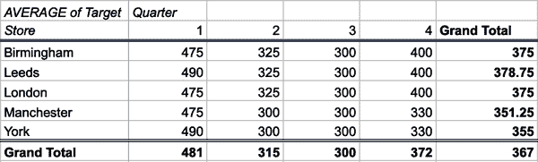
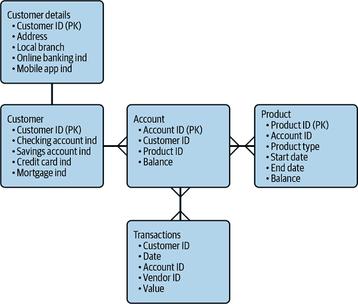
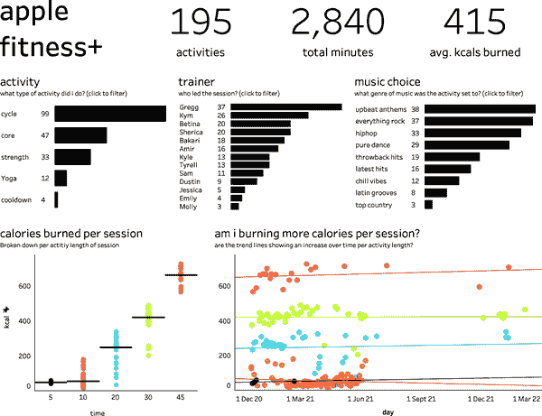
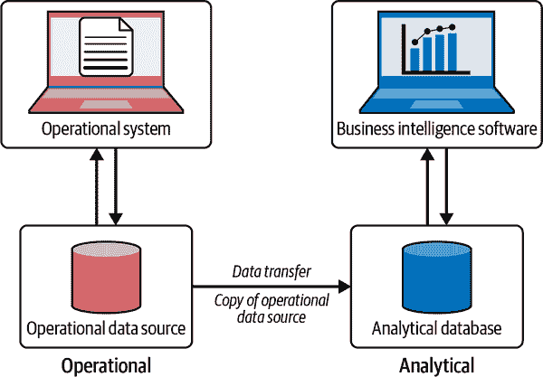
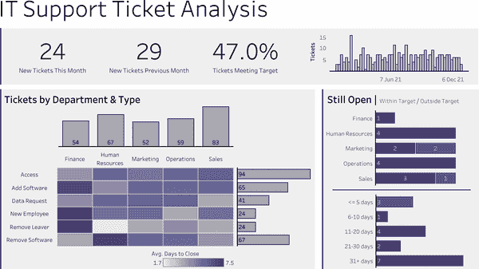
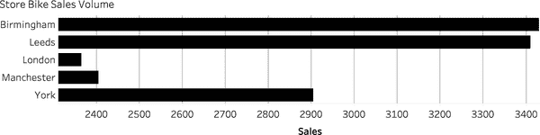
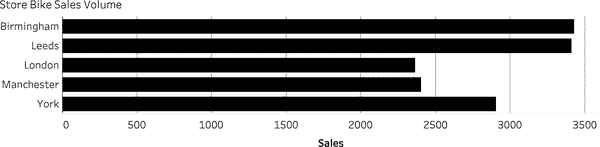
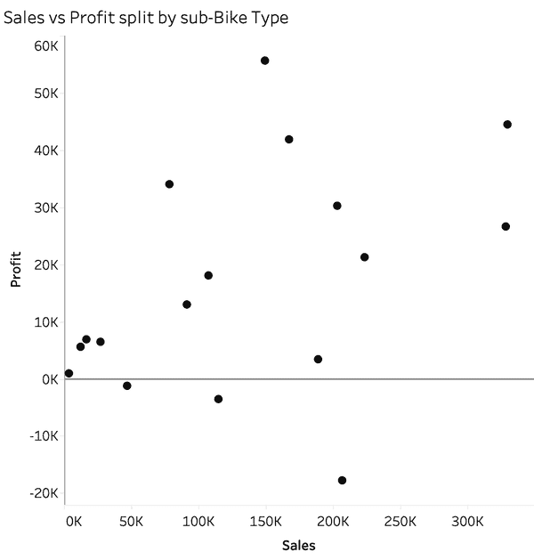
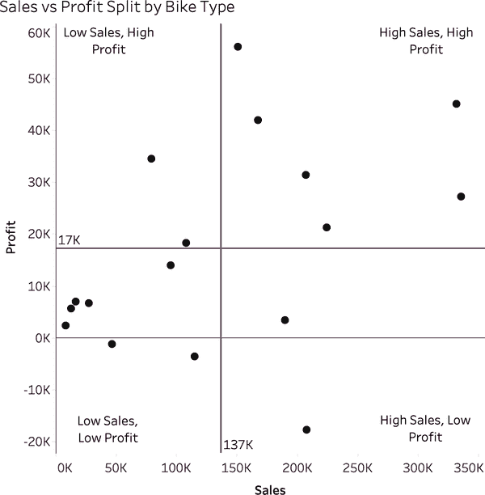
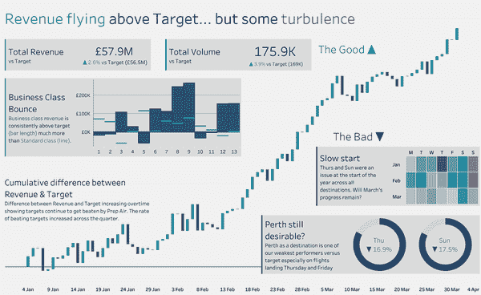

# 第二章：数据知识与技能

数据是整本书的基础。通过阅读它，您显然正在朝着比今天更多地使用数据迈出重要一步，因此真正理解我们所说的数据是至关重要的。在处理数据时可能遇到的最大挑战之一是术语，这些术语用于描述您将使用的值、字段和文件。

一旦熟悉了术语，本章将介绍数据的基本概念。数据的这些构建块具有多种形式。通过理解数据的来源，您将能够找到有用的来源，发现它们之间的差异，并了解形成可用数据源所需的内容。

在处理数据时，寻找和优化用于驱动数据驱动决策的数据来源并不是您可能创造的唯一输出。本章将探讨您的项目可能创建的各种输出以及每种类型的关键方面，并描述确保每种类型满足项目需求的基本因素。

正如在第一章中所述，数据流畅是您组织中许多人可能缺少的基本技能集。为了创建数据驱动决策的好处并建立有价值的数据建议，您需要填补自己和其他人的这一技能差距。确保成功项目结果所需的能力将会被覆盖，以便您了解为您的组织取得最佳结果所需的能力和专业知识。

# 什么是数据？

*数据*是从观察中收集的用于更好理解特定主题的事实或数字。这可以包括操作系统为记录未来系统内部的交易或报告目的而创建的细节或数字。与手写书籍或手动收集人口普查数据时产生的数据涓涓细流相比，随着数字化程度的增加和智能设备更广泛的采用，产生的数据量已经成为洪水般的数量。

处理数据的挑战不再仅仅是在大量可用数据中找到正确的数据集，而是现在在于“驯服”可用数据以找到问题的答案。使用新的数据源通常需要清理、结构化和聚合数据集以更容易使用的格式。这些任务涉及计划所需内容、调查数据，然后执行这些计划以形成修订后的数据集以进行进一步分析。寻找这些数据源将涉及与同事的大量协作，因为您追踪可以帮助您实现目标的数据。

要理解需要什么数据，你需要能够将手头的业务问题转化为一个问题，并形成假设来测试。很少有一种方法可以解决困境，你需要通过不同的表达式来迭代，以了解到底需要什么解决方案。获得精炼问题的经验，以满足真正需求，需要经验，与你的利益相关者建立信任将需要时间和努力。

在过去的几十年里，组织已经建立了宝贵的数据存储；或者说，他们的 IT 部门已经这样做了，因为他们是唯一具有必要经验来完成这类工作的人。直到最近，这些存储被隐藏在多层安全性之后，并需要专业知识来访问。在过去的十年里，解决这些障碍的软件解决方案不仅改变了能够使用数据的人群，还改变了他们能多快地访问数据。

组织经常需要重组、清理值、将代码转换为实际名称，并将多个来源结合在一起，以使数据可用。专家们通常会进行这项工作，但即使如此，你越了解任务和数据集的各个部分，就越有可能在首次请求时获得所需的数据。此外，软件通过成为无代码或低代码平台，已经变得更易用于普通用户。这意味着你不需要学习专业编码语言即可开始访问数据源。以下部分将帮助你学习如何从组织的源中形成自己的数据集。

## 数据的关键特征

数据集的许多不同特性。许多术语对你来说可能很熟悉，但有些可能是新概念；我们将在本节中进行介绍。

有些特性决定了数据的形状和结构。这些包括：

+   列

+   行

+   标题

数据集的其他特性改变了数据的使用方式。这些包括：

+   类别

+   测量

+   数据类型

+   粒度

当你问大多数人在他们想到数据时会想到什么，你很可能会听到*电子表格*这个词。电子表格非常有用，灵活的数据存储方式，可以通过表格或创建图表进行数据分析。在许多方面，电子表格包含了更可扩展和专业化数据解决方案的许多常见特性。

大多数由你组织的 IT 提供的数据源都被归类为*结构化*。你通常可以看到电子表格中行和列的结构，因为它们显示了网格线。这意味着数据源具有以下组成部分：

+   列：单个列应包含数据的单个属性，并且只能是一种类型的数据。

+   行：每一行应该包含数据实例的单个记录。

+   标题：列的标题详细说明了其内部内容。

一个*记录*是数据中捕获的单个交易或实例。由于行包含记录，因此在讨论数据集时可以互换使用这些术语。

并非所有的数据集都以这种干净的格式保存。*干净的数据*指的是结构良好且可以在当前状态下轻松分析的数据。*不干净的*数据则相反。不干净数据的特征包括以下问题：

+   列：每个列中可以包含多个数据项，比如表 2-1 中的第三行数据，其中包含旋转课程期间的教练、消耗的卡路里和听的音乐。

+   行：单个记录可以跨多行分布，这意味着每行可能缺少值，或者行可能重复；这通常称为*重复记录*。

+   Headers: headers might be incomprehensible or not present at all.

表 2-1. 旋转数据的基本电子表格

| 日期 | 值 | 单位 | 类型 | 详细信息 |
| --- | --- | --- | --- | --- |
| 08/01/2023 | 88.2 | km | Tour | Lille to Bruges |
| 10/01/2023 | 6.1 | km | Casual | 去市场 |
| 10/01/2023 | 30 | min | Spin | Kym - 540 - everything rock |
| 11/01/2023 | 18.4 | km | Commute | Wed 11th morning commute |
| 11/01/2023 | 18.7 | km | Commute | Wed 11th afternoon commute |
| 14/01/2023 | 20 | min | Spin | Sherica - 323 - latest hits |
| 15/01/2023 | 6.8 | km | Casual | Sun 15th shopping |

单列，也称为*数据字段*，可能会分为两种类型，分类或测量。在我们依次详细讨论之前，我们将向您展示如何在您可能被要求基于其进行分析的问题中识别它们。如果您被问到像“按季度的收入是多少？”这样的问题，问题的哪一部分是类别，哪一部分是测量？问题中的数值部分是测量；在这种情况下，它是收入。分类数据由问题的其他部分指示，这些部分帮助指定如何分析测量：在这种情况下，按季度。问题的“按”部分是将帮助您识别类别的部分，从测量开始。

*类别*是描述记录内容的数据字段。当您组合类别数据字段时，您应该能够确定记录代表的确切内容。在表 2-1 中，卡尔的每次骑行活动都由类别数据字段描述，包括日期（活动发生的时间）、单位（活动的测量方式）、类型（活动是什么）、以及详情（关于活动的额外信息）。类别数据字段通常只能包含有限数量的变量。从表 2-1 中记录卡尔的骑行活动的数据集中，类别字段*类型*仅有少数可能的取值，例如骑行活动是在自行车巡回赛、动感单车课程还是上下班途中进行的。如果您听到术语*维度*，这是描述数据集中类别的另一个词。

能够查看数据集并了解其分析准备就绪的程度是任何数据项目的关键部分。数据集可能需要几分钟、几小时，甚至几天来重新结构，以满足本节详细描述的特征，然后才能变得易于使用。在表 2-1 中，详情列包含卡尔骑行活动的各种不同类型的描述。这意味着任何想要统计他在动感单车课程中听某种类型音乐次数的人会发现这比有一个单独的“音乐类型”列更难做到。

*度量*通常是数据集中的数值值，是您试图分析的核心内容。度量通常不会单独逐行查看，而是经常在许多数据行上聚合。例如，您可能会被问到以下典型问题：二月份的销售总额是多少？上个季度的平均每日出勤率是多少？销售值按月汇总，而出勤率则作为季度平均值呈现。在分析您的分析软件中的数据时，您可能会执行这些汇总操作。

并非所有的数值数据点都被视为度量。您经常会发现数据集中存在*标识符*字段，用于区分记录。也许您有一个客户数据集，而不是保存所有客户的详细信息（如姓名和地址），而是使用数值标识符来区分客户。数值通常被用作标识符字段，因为在数据集的存储或查询中需要更少的内存。标识符也可以用来混淆数据，使其更难识别数据所属的对象。由于标识符用于区分记录，数据字段被分类为类别而不是度量。总结这些标识符字段很少会产生有用的结果。

数据集中每行数据代表的是数据集的最终关键特征。术语*粒度*用于描述每行存在的详细级别。由于分类数据字段描述了行参考的不同元素，它们对于理解粒度至关重要。让我们使用表格 2-1 来展示如何定义数据集的粒度。

在表格 2-1 中，日期、单位、类型和详细信息都可以用作分类数据字段，但哪个设置了粒度？一个字段与另一行具有相同值表明它不能单独设置数据的粒度，除非该行是另一行的重复。日期、单位和类型在多行中都包含相同的值，因此它们并不固有地设置粒度。详细信息描述了卡尔每次乘坐的情况，因此即使他进行了相同的活动，详细信息字段很可能与同一列中的任何其他值都不同。

表格 2-1 中的数据集不必以每天每次骑行的粒度进行保存。你可以总结数据集，描述每天发生了多少次骑行（表格 2-2）。2023 年 1 月 11 日的上午和下午通勤骑行已经合并，用来描述该日进行了相同类型活动的活动数量。2023 年 1 月 10 日的记录不能合并，因为它们代表了不同类型的骑行，也以不同的方式测量。如果要保留表格中的数值数据字段，则需要进行从分钟到公里的转换，或者反之。

表格 2-2\. 从表格 2-1 中总结的数据集

| 日期 | 值 | 单位 | 类型 | 骑行次数 |
| --- | --- | --- | --- | --- |
| 08/01/2023 | 88.2 | 公里 | 旅游 | 1 |
| 10/01/2023 | 6.1 | 公里 | 休闲 | 1 |
| 10/01/2023 | 30 | 分钟 | 骑行 | 1 |
| 11/01/2023 | 37.1 | 公里 | 上下班 | 2 |
| 14/01/2023 | 20 | 分钟 | 骑行 | 1 |
| 15/01/2023 | 6.8 | 分钟 | 休闲 | 1 |

在使用数据集时，如果看到一个可能是聚合的字段，那么你可能会假设数据集已经进行了一些*预处理*。在表格 2-2 中，骑行次数可能是一个聚合值，因为每一行代表一个详细记录，描述了一个单独的活动，而第四行则捕捉了两次骑行的详细信息。像任何信息源一样，要理解可能由变更引入的任何潜在偏见或错误，你应该质疑信息的来源以及谁进行了更改。

## 数据类型

在数据列的定义中，我们强调每列只能有一种数据类型，或称数据类型。*数据类型*是赋予数据字段的分类，它决定了我们可以对其进行何种操作。让我们描述每种主要的数据类型及其操作方法。

### 数字

我们都知道数字有两种格式：整数和小数。数值数据值由 1、2、3、4、5、6、7、8、9 或 0 组成。在分析数据集时，数字经常会被聚合。

当数据中使用整数时，我们通常称其为*整数*。小数通常被称为浮点数，或简称为*浮点数*。这些数据字段更有可能是您聚合或搜索单个值以回答特定问题的字段。

*聚合*数值数据涉及求和、平均值或计数值。根据您提出的问题，数值数据字段可以通过许多不同的方式进行聚合。这种情况常发生在您试图回答以下问题时：

+   总销售额是多少？

+   平均成绩是多少？

+   任何事件的最大出席人数是多少？

聚合通常涉及在聚合之前根据数据集中找到的类别对数据进行拆分。当您询问以下问题时，就会发生这种情况：

+   每个月的总销售额是多少？

+   每个学科平均成绩是多少？

+   每种音乐流派的任何事件的最大出席人数是多少？

注意数字数据仍然是每个问题的核心，但请记住您还需要理解分类数据字段。

### 字符串数据

字符串数据字段包含字母数字值以及标点符号和其他符号。如果文件格式没有指定，许多计算机程序将默认将数据字段视为字符串，因为它们在容纳字符方面最为灵活。字符串数据字段将构成数据集中大多数分类字段。了解您的字符串字段代表什么将帮助您了解数据集包含什么和不包含什么。

字符串数据字段中的值与数字字段处理方式不同。您仍然可以通过以下几种方式聚合字符串字段：

+   计算每个值出现的次数

+   基于字母顺序查找最小或最大值

+   列出单个值中的所有内容

通过使用各种计算函数，可以将字符串字段拆分或追加到其他字符串字段中，以确保它们对你试图回答的问题有用。在表格 2-1 中，需要拆分目前被压缩在一个字段中的三个不同属性。字符串可以基于特定字符、字符模式或字符位置进行拆分。在表格 2-1 中，详细数据字段中的变量可以基于连字符进行拆分。可以使用计算创建新的数据字段，分别记录旋转课程的教练、卡尔消耗的卡路里以及执行该会话时使用的音乐。

位置是使用字符串数据时需要理解的一个有用概念，因为它与数字、日期和布尔数据字段不同。*位置* 指的是字符串字段值中字符的顺序（见图 2-1）。每个字符，无论是字母、数字还是符号，都有一个可以在计算中引用的位置。

###### 图 2-1\. 字符串字段中位置的确定方式

由于字符串字段可以包含各种字符，它们在数据库中占用的存储空间更多，处理时需要更多的计算资源，而不是数字字段。数据库管理员（DBA）会努力确保尽可能有效地存储和处理数据。

### 日期字段

日期字段也是存储数据的低效方式。一些软件允许你以常见格式存储日期，如图 2-2 所示。

###### 图 2-2\. 日期字段格式

尽管这种格式对人类来说易于阅读，但从计算机的角度来看，存在显著的存储和处理开销。因此，你可能会发现日期数据以多种特定于所用软件的不同格式存储。以下列出了几个示例：

Excel 序列号

如果你在更改格式时，曾经将日期突然更改为 Excel 中的数字，这可能就是原因。Excel 将日期存储为自 1900 年 1 月 1 日以来的每日整数。以 12/31/2023 为例，Excel 序列号等效值为 45289。

纪元日期

纪元日期与 Excel 序列号类似，但使用自 1970 年 1 月 1 日午夜以来的每秒整数。再以图 2-2 中的日期为例，纪元日期值将为 1703890800。

正如在“数字”中提到的，整数是存储值的高效方式，这就是为什么它们被用于而不是人类友好的格式。如果计划与人类共享数据集，则需要将值转换为可读格式。

### 布尔字段

为了让您的数据库管理员满意，请尽量将尽可能多的数据以布尔格式存储。计算机基本上使用 1 和 0 来操作，布尔数据格式只是 1 和 0。这些 1 和 0 表示记录是否具有特定特征的真或假，或者是有或无。这意味着计算机可以比其他数据格式更轻松地存储和检索布尔值。

在大型组织中，您经常会遇到数据库提取或来自数据库的数据集，这些数据集使用 1 和 0 作为数据集内是或否的指示器。例如，当保存关于客户拥有哪些银行产品的数据时，1 和 0 指示器会简单地存储每个客户所拥有的可用产品。这使得可以在数百万行数据上快速生成摘要（表 2-3）。

表 2-3. 布尔数据用作是/否的指示器

| 客户 ID | 现金账户指示 | 储蓄账户指示 | 信用卡指示 | 交易账户指示 |
| --- | --- | --- | --- | --- |
| 7005461 | 0 | 1 | 0 | 1 |
| 9174324 | 1 | 1 | 1 | 1 |
| 5094878 | 1 | 1 | 1 | 0 |
| 4168373 | 0 | 1 | 0 | 0 |
| 1511246 | 1 | 0 | 0 | 0 |
| 2380267 | 1 | 0 | 0 | 0 |
| 6792839 | 1 | 0 | 0 | 0 |
| 5022090 | 0 | 1 | 0 | 1 |

与日期一样，您可能希望对指示器应用别名，以便清楚地表明 1 或 0 代表是或否。这将帮助其他可能使用数据源的人理解 1 和 0 代表的含义。

## 数据文件结构和格式

描述数据集部分所使用的数据类型和术语仅仅是开始。您还需要理解用于定义数据集存储位置和方式的术语。您的计算机可能填满了最常见的数据源格式，如 Excel 电子表格，但您可能并未直接使用世界上体积最大的数据存储格式：数据库。

数据文件，例如电子表格，由于其在数据保存方面的灵活性，非常普遍。这种输入的灵活性使得在进一步分析时更难使用电子表格中的数据作为数据源。

### 数据的形状

大多数电子表格中常见的数据有两种主要形式：列式数据和数据透视表。

您可能会问我们所说的*列式数据*是什么意思。这是指数据仍然以结构化列的形式保存，类似于您查询数据存储在哪里的数据库时所找到的内容。表格 2-3 和 2-4 是列式数据集的简单示例。

表 2-4. 列式数据：商店的目标销售额

| 季度 | 商店 | 目标 |
| --- | --- | --- |
| 1 | 曼彻斯特 | 475 |
| 1 | 伦敦 | 475 |
| 1 | 利兹 | 490 |
| 1 | 约克 | 490 |
| 1 | 伯明翰 | 475 |
| 2 | 曼彻斯特 | 300 |
| 2 | 伦敦 | 325 |
| 2 | 利兹 | 325 |
| 2 | 约克 | 300 |
| 2 | 伯明翰 | 325 |
| 3 | 曼彻斯特 | 300 |
| 3 | 伦敦 | 300 |
| 3 | 利兹 | 300 |
| 3 | 约克 | 300 |
| 3 | 伯明翰 | 300 |
| 4 | 曼彻斯特 | 330 |
| 4 | 伦敦 | 400 |
| 4 | 利兹 | 400 |
| 4 | 约克 | 330 |
| 4 | 伯明翰 | 400 |

您很可能不是第一次接触本书中的透视表概念，但我们希望确保您思考为什么以及它们如何如此频繁地被使用。*透视表*，或称为交叉表，是将大型数据集快速汇总为更易消化的数据点或用于回答分析问题的便捷方式。例如，您可以查看表格 2-4 中不同商店的自行车销售目标的数据表。

将这些数据转换为透视表使您能够轻松查阅目标区域的季度趋势。由于透视表可以包含总计和替代聚合方式，您可以使用它们来找到问题的答案。在 图 2-3 中，已经从 表格 2-4 的数据形成了一个透视表，按商店和季度组织数据，以及创建每季度每个商店的平均目标和整个年度每个商店的平均值，显示在总计列中。透视表的最终单元格位于总计列和总计行，表示整个年度所有商店的平均目标。

###### 图 2-3\. 在 Google Sheets 中从 表格 2-4 数据创建的透视表

对许多人来说，在电子表格中分析数据是他们在学校或职业早期学到的所有数据分析技术。这导致大量数据以列形式或透视表形式存储在电子表格中。

数据的形状很重要，因为它会提示您在处理每种形式数据时需要考虑的事项。由于透视表可能已应用某种聚合函数，因此很难确定它们形成的数据源。许多透视表在组织中共享，使得其来源难以追踪。如果没有详细的笔记、文档或文件命名规范，使用这些表作为决策基础可能会很危险。可能缺少的几个信息包括：

+   数据的起源

+   数据的年龄

+   已应用的任何筛选器或计算

这并不意味着从仍处于列形式的数据库中提取的数据的数据源是完美的。数据库以更符合计算机的数据字段名称而不是对数据集用户有意义的名称而闻名。为了分析前准备数据集，通常需要通过更好的命名和文档化来澄清每个数据集包含的内容。如果数据源的提取已在整个组织中共享，其来源、年龄和过滤可能也是问题。*数据治理* 是用来描述确保数据有良好文档化的任务，以便所有需要使用它的人能够追踪和理解其来源、年龄和任何变更。

### 文件类型

有许多文件类型可以保存你的有用数据源。尽管你的职业生涯中可能一直在使用电子表格和 CSV 文件，但空间文件可能对你来说是新鲜的，但使用时可以为你对组织的理解提供新的视角。其他文件类型，如 PDF，可能包含有用的数据集，但将数据从中提取到你正在进行分析的工具中并不总是一致或直接。在这本书中处理太多文件类型以存储数据，因此我们将重点放在最常见或最有用的文件类型上。在使用每种文件类型时，您应考虑以下几点：

电子表格

在你的组织中，最常见的数据文件类型是电子表格——通常是 Excel、Google Sheets 或类似的应用程序。这些文件可以包含手工输入的数据、数据透视表或数据库提取等多种数据来源。电子表格可能是你尝试准备数据并对其进行分析的第一个地方。

在处理数据时，电子表格是一种无法忽视的资源。由于数据的灵活输入和简易编辑，电子表格是你的同行通常会用来建模预测或应用他们对主题的知识从数据中提取意义的常见位置。

然而，能够输入数据值、应用计算或删除数据点的能力意味着在使用任何电子表格作为数据源时，您应该小心。很容易犯错，比如输入错误的数值或将计算错误地指向电子表格单元格中错误的数据值。

大多数商业智能（BI）工具需要数据以清晰的列和单一标题保存。当在组织中共享时，电子表格通常格式化为在你分析数据时可能想使用的数据表格之上或旁边插入更详细的标题和其他评论。这意味着在可以使用 BI 工具分析之前，必须通过删除附加的标题和文本来重新格式化电子表格。

逗号分隔值（CSV）文件

您可以在许多与电子表格相同类型的软件中打开 CSV 文件。主要区别在于数据保存的结构。CSV 文件的每一行应包含一个记录，但数据字段之间用逗号分隔，而不是以列形式存储数据。例如，在 Table 2-4 中，数据的第一行将保存为 1,Manchester,475。

空间

如果您处理的数据详细描述了商店或人员的位置、距离或覆盖区域等信息，那么您可能已经在进行地理空间分析时使用了空间文件，这些文件保存了关于如何映射数据点的信息。空间文件在您的行业中可能并不常见，但如果遇到它们，您需要考虑一些关键差异。空间文件包含关于点（具体位置）、线（路线）或多边形（地图上的区域）的数据。这些文件不是单个文件，而是一个目录或文件夹。例如，Esri 形状格式包含.shp、.shx 和.dbf 文件。您可能需要特殊的地理空间软件或商业智能工具来打开空间格式，尽管越来越多的商业智能工具正在使这类分析与传统图表分析更容易进行。

### 超越文件

并非所有的数据集都存储在计算机或网络文件中。您的组织中大部分数据可能存储在数据库中。数据库是计算机上存储的数据结构化存储。大多数数据库都足够大，需要专门的计算机，称为*服务器*，其规格适合存储和处理大量数据。

数据库提供商，如 Microsoft、Oracle、Teradata 和 Snowflake 等，竞争吸收、处理和交付数据集的速度。数据库处理这些任务的方式随着时间的推移而发展，其中大部分处理在数据库内部完成，数据库用户并未直接看到。在最常见的数据库形式中，关系型数据库*，*用户可以看到的数据库层是表格和视图。

*关系型数据库* 将类似的数据存储在可以通过共享标识符或其他数据字段相互关联的表中。例如，客户可能在一个表中存储其联系方式，而在另一个表中存储其应付账单。要将这两个表用于向客户发送应付账单，您需要在两个表中共同字段上进行连接。数据库中的表格以行和列的方式存储数据，与我们展示的其他数据源相同。

例如，银行的客户可能会参与许多数据查询：

+   客户有哪些产品？

+   客户的信用额度是多少？

+   客户访问了哪些分行？

+   客户使用哪些渠道与银行进行交易？

+   客户是否与其他银行客户共享产品？

如果所有这些数据都存储在单个表中，那将是庞大且难以管理的。这就是为什么数据被拆分到不同的表中——以使其更易于管理。银行很可能会将数据存储在不同的表中。表名示意了它们在组织数据库中可能被称为的名称，就像以下示例中的一样：

Product_Customers

包含客户拥有的产品及其使用的服务，他们开始使用银行的日期，以及账户上是否列出了其他客户。

Detailed_Product

每种产品有不同的利率；还标示了产品销售的日期以及销售对象。

Branch_Customers

显示客户访问过的分行位置详情。

Digital_Interactions

包含客户与银行的互动列表，互动发生的时间以及通过哪种渠道进行；例如在分行存支票、通过 ATM 取现金和通过银行的移动应用程序转账余额等。

这只是每家公司对消费者、客户或顾客拥有的数据的整体拼图的一部分。数据库没有现成的解决方案，可以与您组织的数据集或需求匹配。您将需要一个专家来设计数据库的结构。这个专家通常被称为*数据架构师*，他们的责任包括设计满足组织分析、运营和战略需求的数据产品。数据架构师将帮助决定需要哪些表集来从数据中获取信息，它们如何彼此链接，以及如何从这些表中加载、读取和删除数据。

每个表中作为表之间链接的字段被称为*键*。每个表中的每一行都应该有一个数据字段作为*唯一*的*键*，用来链接记录到其他数据表，形成完整的数据集。这个唯一键，或者被称为*主键*（PK），需要小心处理，以确保每一行可以链接到其他表中相关的信息，避免记录的重复。例如，客户表应该只有每个客户的单一记录。因此，如果每个客户有自己的 CustomerID 值，这将作为主键。CustomerID 也会出现在其他表中，比如产品、账单和地址详情表中，用于链接不同的表，以添加关于每个客户所需的附加信息，具体取决于正在进行的分析。

并非每个记录都有单一行到单一行的链接。例如，联合银行账户将有两个客户记录与该账户关联。这被称为*一对多关系*。

关系数据库将表格如何映射在一起被称为 *模式*。这就像是一张地图，用于导航如何连接表格。模式允许您形成需要获取数据以回答所提出问题的查询。一个银行数据模式部分的示例可以在 图 2-4 中看到。

###### 图 2-4\. 模式的一部分

由于数据可以从许多不同的角度来看待，您可能需要链接单个记录与许多其他信息以回答特定问题。这就是关系数据库发挥作用的地方，因为它们允许不同的用户以不同的方式使用类似的记录。

在与数据库中的数据工作时，您可能需要的不仅仅是最新的数据 —— 您可能还需要历史数据。例如，仅知道客户的最新余额是有用的，但了解他们的余额在多个月甚至多年中如何变化，是评估您可以从客户财富中获得的收入的更好方式。如果客户正在为购买房屋或汽车等大件物品存钱，那么他们当前的余额可能会很低，但这并不意味着将他们的资金存放在您的银行中没有好处，或者他们没有能力再次增加资产。

历史数据的快照可能占用大量的存储空间，特别是如果每个快照由数百万条记录组成。您需要管理数据的保留，以确保仅存储对您有潜在价值的数据，并且不超过主题数据权利，如 “新规定和政府命令” 中讨论的内容。

# 数据作为资源

现在您知道数据的组成以及它可以存储为临时文件中的特定用途或更战略地存储在数据库中，您需要了解它最初来自何处。了解数据集在到达您之前经历的旅程对许多原因都很重要，包括避免偏见和潜在错误。

随着您组织中更多成员能够访问数据，如果不仔细管理，跟踪数据来源和对其进行的更改可能变得更加困难。从数据源到使用中管理您的数据需要投入一定的努力，您需要计划进入您的数据项目中，但这是非常值得的。

本节将讨论以下关键问题：

+   数据产生的地方

+   运营和分析来源的区别

+   如何管理数据源

+   管理数据来源

## 数据产生的地方

坦率地说……无处不在。世界的数字化意味着您的大部分活动、购买和与他人的互动都会产生数据点。即使在我的一生中，捕捉数据的方式也从一个非常有意识的行为变成了生活的一个结果。

当我（卡尔）不到 40 年前出生时，数据是通过像调查或纸质表格这样的有意的手段捕获的。当我的儿子去年出生时，我们不得不手动填写表格或填写任何纸质内容时感到很奇怪，而不是数据自动生成。

这种数字化带来了可用数据种类和数量的增长。无需不断要求客户手动提供数据点，您有机会更多地了解您的客户和消费者。有了如此多的数据来源，让我们来看看其中一些选择以及它们可能成为富有成效的数据源的原因：

网上购物

在 20 世纪 90 年代后期的实体零售商店购物，提供了大多数商店想要了解其客户信息的一个很好的例子，但他们必须手动收集。员工会尝试根据顾客正在看或手持的商品推销商品。通过让顾客注册邮寄清单或目录来建立与顾客的长期关系。

数字环境现在更加有利于零售商。通过在优惠或结账过程中收集电子邮件地址获取客户详细信息。基于跟踪客户在互联网上的行程的 cookie 进行追加销售，这些追加销售显示出客户可能对其他产品感兴趣。定制链接可以轻松附加到营销信息、QR 码和优惠中，以查看哪种获取方式最有效。如果促销来自社交媒体网站，则您可能能够确定许多人口统计因素，这将帮助您向他们推销后续有吸引力的产品和优惠。这些数据的收集并不需要顾客太多额外的努力；因此，零售商可以轻松而准确地收集数据。

智能手机

大约十年前，收集客户数据的另一途径被开辟：汽车保险。在 2012 年，我的前雇主安华（Aviva）为驾驶员提供了下载应用程序的机会，该应用程序利用智能手机中可用的传感器和 GPS 数据来监控某人的驾驶安全性。驾驶风格越好，即减少急刹车和超速，保费就会从标准费率中减少。

尽管在当时的英国这款产品是革命性的，但却遭遇了很多怀疑，因为智能手机及其能够收集关于所有者的数据刚刚开始被认可和货币化。消费者对于是否值得接受折扣以及被越来越多地监视，特别是在他们驾驶时的位置以及他们的驾驶被随时评估，持谨慎态度。

智能设备/量化自我

智能设备是连接到互联网或利用算法为原始产品提供额外服务或增强的产品。尽管制造商早在 1980 年代就试图为这些设备创造大众市场吸引力，但是它们与手机的配对真正创造了一个可取之处。随后，智能手表成为首批利用智能手机增长实现大众市场影响的智能设备之一。

2015 年，苹果推出了苹果手表，最初用于测量步数并与手机连接，但逐渐发展为心率和活动的医疗跟踪器，甚至提供心电图监测的功能。这些功能使得苹果能够将手表与健身训练配对，以便您在家里进行健身课程时监测自己的运动强度。我使用我的智能手表跟踪我在家中上课的情况，以查看我（卡尔）每节课是否燃烧更多卡路里，以及哪些课程效果最好（图 2-5）。我还能分析 2021 年夏季我的第一个孩子的到来对我的“空闲时间”的影响。

###### 图 2-5\. 卡尔使用来自智能手表的数据进行健身跟踪（此图的较大版本可在[*https://oreil.ly/de7fI*](https://oreil.ly/de7fI)获取）。

此数据可以由所有者与其他服务提供商共享，包括医疗保健服务。在英国，健康保险提供商 Vitality 推出了一款新型保险产品，降低保费并为客户提供返现和零售商折扣，如果客户达到活动目标。

随着关于一切的数据增加，必须在让客户感到我们对他们了解有多少和我们可以提供的增强提议之间取得平衡。21 世纪长大的客户已经习惯于提供数据以获得更个性化的体验。然而，尽管人们越来越习惯于他们的数据被使用，但对于他们的数据被监视有一定的限度。不能假设人们会对基于他们数据做出的非常微妙的决定感到满意。组织客户焦点小组来测试提议及其可能对组织声誉的影响是明智的做法。

## 运营与分析源

数据不断生成，数据源面临的挑战是以数据生成速度吸收数据。这就是传统的*抽取、转换和加载*（ETL）惯例变为*抽取、加载和转换*（ELT）的原因之一。要以数据生成的速度处理数据是困难的，因此最好先吸收所有数据，然后在后期将其转换为需要分析的源。

未经转换的数据源通常被称为*操作*数据，而经过转换的数据源称为*分析*数据源。

操作数据源是为提供服务、产品或监控而创建的数据集。例如，在保险公司中，操作系统将在保险单中捕获客户详细信息，记录每月支付的保费以及提出的任何索赔。数据集通常包含系统的记忆，存储捕获系统处理的所有交易的记录。系统设计用于特定流程，因此数据源通常是主系统目的的副产品。这意味着它们不是为分析或在其他地方使用而结构化的。如果要分析这些数据集中包含的数据，您需要增强和重塑数据。这种转换将在与操作数据源分开的分析数据库中进行（图 2-6）。

###### 图 2-6。操作数据源转换为分析数据源

交易中包含的数据很可能会被商业智能（BI）分析师分析。在数据集中找到异常值并识别趋势将有助于决定您组织的下一步或确定需要改进的内容。聚合措施或计数分类变量将使 BI 分析师能够找到异常值和趋势。必须小心地理解所得结果是否受到任何极端离群值的影响，特别是在使用平均值时。大多数 BI 工具使用默认的平均值。这些值可能会因为几个非常大或非常小的数值而发生剧烈变化。使用中位数可以帮助减少这种影响。识别异常值可能很有用，因为它们通常是可以帮助识别以前认为不可能的新机会的交易。

直接从操作系统中获取的数据集很少准备好进行分析。这就是您可能需要将数据从操作系统的原始结构转换为更适合分析的结构的地方。无论您的组织使用 ETL 还是 ELT 方法论，T 都是转换步骤。转换涉及重塑、清洁和删除不必要的数据点。确切需要为分析而做的工作会有所不同，但一些常见步骤可能涉及以下任务：

聚合数据

当您查找数据中的趋势和客户行为的整体模式时，您不太可能需要每笔交易的所有细节。如果您清楚了解到对您的分析重要的分类数据点，您可以向这些因素聚合。

清理数据

许多操作系统的数据字段名称对业务专家来说并不清楚。通过将这些字段重命名为更易理解的版本，数据集将变得更加易于使用。字段内的数据值也可能需要清理，以便进行更轻松的分析。根据您从哪个操作系统获取数据，创建干净的数据集所需的各种转换，如“数据的关键特征”中所述，将因情况而异。常见任务包括移除数值或字母异常值，过滤掉具有空度量的记录，或创建基本计算以便于度量分析。

重塑数据

操作性数据源可能没有结构化成便于分析的方式。如果您需要使用这些值来分析数据，每个值必须有单独的列非常重要。将合并的数据点拆分为单独的数据字段将确保分析人员可以使用这些数据字段。重塑数据可能还涉及数据透视，以确保每行代表一个单独的记录，每列代表一个分类值或度量。

合并数据集

从操作性数据源获取数据可能不会告诉您分析数据所需的所有信息。您可能需要将数据集与其他数据集配对，以提供交易发生方式的背景信息。我们经常寻求向操作性数据集添加产品描述、营销活动和客户历史等因素。

最终，为了准备数据集进行分析，您需要考虑需要回答的问题。这将帮助您确保将操作性数据精炼到最佳聚合级别，清理分析中需要的数据字段，并从其他来源添加任何额外的字段，以帮助理解您的数据。

## 筛选数据源

一旦确定您需要操作性或分析性数据源，您的下一个任务是查看是否还有其他人需要该数据集。我经常发现，如果我可以用数据集来回答我的问题，其他人也会发现这些数据有用。

操作数据集可以通过确保其格式适合将要使用的软件而准备好使用。这可能涉及更改数据存储位置或数据的形状。如果查询操作数据，您最不希望的是对使用系统的操作过程产生任何后续影响。在操作系统的数据库上运行查询可能会导致问题，尤其是如果处理大量数据或编写更改数据的查询。避免任何不必要影响的最佳方法是使用数据的副本，如 图 2-6 所示。尽管这会在您的组织中复制数据存储，但可以对数据运行查询，而不必担心任何影响。

通过复制数据，您还有机会为其使用准备数据。您可能希望删除敏感数据，如个人可识别信息（PII），并用标识符替换它，或将同一字段下的不同数据值拆分为更容易使用的数据字段。

分析数据集通常需要进行更深层次的转换。分析数据集的形成是为了回答特定问题并处理特定调查领域。这些数据集支撑了您在组织中已经可以访问的大量报告和见解。它们通常包含多个数据集，这些数据集构成了您收到的大部分报告的基础。这些数据源不应有大幅度变化，因为任何更改都可能影响到它们支撑的报告和仪表板。更改数据字段名称或重组数据集将意味着需要重建报告和仪表板以匹配修改。

如果您正在构建一个运行数据项目以创建新的数据源，那么您可能需要对数据源的范围进行多次迭代。当您设计一个数据源来开发您的报告时，您将不可避免地从报告中的见解中学到更多内容，这将意味着会出现进一步的问题。如果坚持原始范围，那么您的用户可能会感到沮丧，因为他们无法获得他们想要的答案。然而，如果让变更无限期地继续下去，那么您永远无法完成项目。在计划项目时准备接受一些迭代是重要的，但设定用户反馈的时间限制是限制影响的一种方法。

构建数据源的技能集通常不在同一团队中与关于数据的问题提出者之间找到。在这些个体之间创建清晰的沟通渠道将对双方能够解释彼此需求至关重要。我发现让数据集开发者与专家坐在一起可以帮助人们迅速传达所需的更改，但要注意在谈话之前解释为什么提出这个问题，以防开发者能够提供额外的建议。这避免了每一方因为过度改变需求或在涉及技术挑战以满足需求时花费过长时间而感到沮丧的情况。

随着 COVID-19 封锁后远程工作的兴起，彼此紧密坐在一起变得更加困难了。但这并不意味着这一点应该被忽视。为每一方创建清晰的虚拟和数字沟通渠道，无论是在物理还是数字上工作密切，都将有助于确保迭代过程迅速有效地进行。我发现定期在专家（SMEs）与构建数据源的技术团队之间进行会议非常有价值，不仅讨论各自项目的进展，还促进了对数据集中需要什么以及管理数据集过程的思想的普遍分享。

## 数据源的祝福与诅咒

如果您已经能够创建数据源，以帮助更多地利用数据支持组织决策，那么您现在将面临一个额外的挑战：维护这些数据源。数据治理将在下一章节中更深入地探讨，但目前只需记住，确保您的项目有良好的数据控制是非常重要的。*数据治理*涉及数据如何收集、存储、使用和处理的问题。

项目资源通常是为运行开发项目而建立的，但随后会进一步用于其他任务。创建数据源是一步积极的措施，但需要持续管理、监控和维护，以确保数据保持一致和完整。长期拥有数据源是一个经常被忽视的领域，但它可能决定一个东西在短期内是否有用以及长期是否有利。

当您建立了数据源后，您需要考虑以下任务，以确保它适合使用：

检查刷新是否已经完成处理

您的数据源可能只是数据集在某个时间点的快照，但很可能会继续更新最新的数据。特别是如果数据源很有价值，带有丰富的洞察力，您将希望确保您的决策仍然基于最新的信息。数据源刷新的频率有很多种：每小时、每天、每周和每月等等。确保数据集的刷新已经正确运行是一项值得的任务。错误可能是由于源头问题、数据结构变化、转换步骤中的错误或者刷新数据集加载到存储位置时发生的。

内容变更

在第一章中，我们讲述了随着人们学习，他们会对数据集提出新的问题。数据源将需要更新新的字段或者更改聚合级别，以满足新的需求。

数据源使用变化

数据源通常为其将要使用的软件而设。随着新的软件在您的组织中出现，您将需要满足其要求，以使数据源保持相关性。

法律变化

数据源应设置到期日期，当它们不再相关时，但也需要进行管理以应对新的法律要求。确保有人负责这一点意味着数据集将被管理以满足所有要求。

不再需要

当不再需要一个数据源时，经常被忽视的一步是删除它。由于业务领域专家和技术团队之间的脱节，通常忽视了需要共享数据源原始用途变更的事实。这意味着即使没有从中获得利益，该数据源的管理开销成本也将继续存在。验证数据源是一个有用的任务，可以减少维护不断增长的数据源清单中的不必要工作量。

管理数据源可能看起来是一个潜在的昂贵开销，但实际上这是组织的一个很好的标志。拥有人们想要使用和继续发展的数据源意味着仍然从最初对其的投资中获得利益，因此这项任务不应该被忽视。

# 数据产品

数据源和由其形成的数据产品的发展是相辅相成的。在数据分析的早期年份，大部分工作集中在使用数据来回答有关组织的问题上。数据的价值最近不仅集中在做出更好的决策上，而且还集中在从数据集中创造产生收入的产品和建议上。可以从数据中开发出一系列产品和建议，以满足您和客户不同的需求。

术语*数据产品*用于描述从数据中创建的结果工作。产品不太可能是您可以感受或持有的有形物体。与数据合作的结果可以是任何东西——表格、图表、报告或仪表板等等。当数据用于创建依赖数据但不仅仅专注于共享数据产品的服务时，我们还将使用术语*提议*。本节将介绍各种类型的产品及其开发方式。

## 分析输出类型

数据可以出于许多不同的原因进行处理；本节将介绍您在大多数组织中会遇到的最常见的输出类型。以下部分已按使用数据的复杂程度排序。

### 操作报告

操作报告通常用于回答需要定期回答的简单重复问题。操作团队经常被要求执行可重复的任务。完成任务所需的时间、工作的准确性和任务的数量都是有价值的数据点，有助于规划完成工作所需的人员数量。

操作报告往往包括通过完成任务数、活动趋势和剩余工作量来展示活动快照。报告在内部用于优化表现或外部用于测量客户外包工作的合同遵从情况。

你组织中的许多团队希望接收操作报告，以帮助他们了解工作完成的效率，这将帮助管理者做出决策。你所在的行业将决定你通过操作报告想要实现什么。让我们看看一些行业是如何使用操作报告的：

制造业

通过衡量你生产了多少产品，发现的错误水平以及任何操作停机时间，将决定你有多少产品可供销售。

呼叫中心

对于运营呼叫中心的服务来说，最昂贵的可变成本是不得不增加额外的代理人来接听电话。如果能够做到正确的处理，您将能够应对电话激增的需求。如果处理不当，您将收到顾客的投诉，可能会丧失销售机会。跟踪电话数量、处理每个电话所需的时间，并确保始终有足够的代理人可用于接听电话，将意味着您的服务至少被视为合格。

零售

能够追踪仓库、地点之间以及商店中的库存情况，意味着你的产品能够在正确的时间出现在正确的地方。能够分享这些快照可以让你商店的销售人员以知识丰富的方式告知你的顾客。

运营报告不是设计用来找出某事发生的原因或发现异常值，而是检查在特定日期或日期范围内发生了多少活动。

运营报告的挑战在于确保报告经常（通常是每天）生成，并且被过滤到正确的团队/商店/制造线。术语*burst reporting*表示这些报告如何快速创建并在整个组织中分发。

### 补充其他沟通方式

图表和图形通常用来补充其他报告和沟通方式。它们通常是使用电子表格中数据集的片段创建的，以便为演示幻灯片或电子邮件创建图表。电子表格是无处不在的，大多数人都可以从整洁组织的数据集构建基本的图表。

我（卡尔）管理的第一个数据团队负责通过在 Excel 中使用组织数据库的摘录来创建见解。表格、图表和图形被发送到请求它们的团队，但通常会通过幻灯片和电子邮件进一步分享，参与关于绩效的跨团队讨论。

幻灯片和电子邮件中的图表的挑战在于它们经常被发送到组织内的其他团队和个人，超出了最初的请求者。当你的数据产品不仅对最初的受众有用，而且对其他人也有用时，这是很好的。然而，我发现当人们传递我的工作成果时，他们经常只是作为工作的部分截图发送，没有任何数据源细节、创建者链接或任何提到应用的筛选条件。这有两个影响，首先，截图很容易被断章取义，其次，没有人会知道何时需要更新数据基础图表时该找谁。

电子表格输出也存在这个挑战——它们并不是为重复性设计的。电子表格是灵活的工具，用于创建定制工作，但这种灵活性意味着重复同样的过程并不容易。数据通常在电子表格内部被操纵，然后使用同样的工具创建图表。这是一个具有挑战性的过程，尤其是如果输出被分享到组织内以及潜在的第三方。如果发现工作有用且需要重复执行，则需要专业的数据工具。如果电子表格仍然是处理数据工具包的核心组成部分，则电子表格内部的文档应该成为它们制作和修改的一部分。

### 基本数据可视化/分析

第一次使用专业工具，通常使用商业智能软件，通常是为了创建基本报告，以回答非常具体的问题。由于这些工具设计用于探索和报告数据给其他人，它们可以创建更高级的数据产品。使用商业智能工具的更高级功能将需要用户接受培训。

BI 工具越来越多地被市场营销给业务用户，而不是专业的 IT 团队。尽管通过界面修改（如拖放图标而不是编码），这些工具变得更易于使用，但仍需要基础知识来配置数据源以供这些工具使用。

BI 工具相比电子表格的一个优势在于它们能处理的数据量和种类。BI 工具被设计用来连接数据文件以及数据库。连接数据库意味着更容易地更新数据集，以获取主题的最新视图。

随着这些资产的反复使用，它们可能被投入生产。*生产化* 指的是记录进度、建立数据流水线并定期刷新工作的过程。

### 仪表板

BI 仪表板的早期定义是一种在一个屏幕上看到所有关键指标的方式，就像车辆的仪表盘一样。

BI 仪表板的角色和目的已经发展，现在涵盖了一个更广泛的定义。这种广度并不总是受欢迎。作为视觉分析思维的思想领袖，Stephen Few 根据数据世界中对术语*仪表板*使用的演变，修订了他最初的定义。

> 仪表板是显示在单个计算机屏幕上的需要实现一个或多个目标的最重要信息的可视化显示。

to:

> 仪表板是主要的视觉信息显示，人们用来监视当前需要及时响应以完成特定角色的情况。¹

少数人专注于快速决策作为数据产品中的关键部分，这个产品就是仪表板。Few 反对更广泛的定义，比如在*大型仪表板手册*中发现的定义：

> 仪表板是用于监视条件和/或促进理解的数据可视化显示。²

要理解你组织中大多数人会如何分类仪表板，你不需要遵循精确的定义。你需要了解在你的组织中通常所指的仪表板，才能正确理解别人实际需要的是什么。

仪表板的一个关键元素是在单个页面上使用多个图表。通过拥有多个图表，单一视图可以同时呈现不同的角度。这就是一个精心构建的仪表板与本章中呈现的其他数据产品不同之处。通过更全面地了解情况，您可能会做出更为明智的决策。

让我们看看一个仪表板的例子，如果您试图理解您组织的 IT 支持票据，即每当有人遇到问题时提出的票据（Figure 2-7）。

###### 图 2-7\. IT 支持工单仪表板（此图的较大版本可在[*https://oreil.ly/VCOVB*](https://oreil.ly/VCOVB)获取）

从这个仪表板，您可以以几种不同的方式了解工单的数量：

+   本月提出

+   上个月提出

+   在 SLA 内解决³

+   每个部门提出

+   按每个原因

+   仍待解决

+   到目前为止

就像形成数据源一样，您的仪表板需要根据需要解决的问题来创建。仪表板的挑战在于努力在提供足够信息的同时避免提供过多信息。图 2-7 的仪表板显示了大量信息，不仅可以监控情况，还应该有助于理解情况为何如此。它是否能回答组织中每个人的每个问题？可能不会。例如，您无法跟踪单个工单的进展。

任何组织很少不拥有 BI 仪表板。在您组织的各个层级上，需要仪表板进行数据驱动决策的需求意味着它们可能会大量存在。就像数据源一样，它们需要管理以确保它们仍然相关，并且正在用于回答紧迫问题。当仪表板是许多人访问数据的唯一可访问方式时，如果他们没有直接自己查询数据的技能或工具，就存在风险。如果现有的仪表板无法直接回答所提出的问题，就会有错误推断的风险。

由于仪表板的易于访问性，它们通常是许多人开始使用数据的有效入口。仪表板中使用的图表复杂度是确保数据对所有用户可理解的主要考虑因素之一。利用仪表板帮助人们理解组织数据源中提供的内容，将有助于长期发展更高级的分析能力。

### 预测模型

分析数据的更高级方法之一是构建预测模型，不仅仅关注过去发生的事情，还试图确定未来将会发生的事情。仅凭后视镜来驾驶汽车的类比是一个强烈的信息，解释为什么您需要开发预测模型。这些模型并不容易创建，因为它们需要一些专业技能，超出您组织中大多数分析师可能具备的技能。

首先，您需要对数据有深入的理解，以确保您构建在坚实的基础上。通过彻底分析和定期使用数据来支持决策，数据集会因为 SME（Subject Matter Experts）的使用而变得更加理解和健壮。数据集的定期使用使数据能够与 SME 期望在数据中看到的内容相匹配。由于预测模型依赖于数据作为输入来推断未来会发生什么，输入的质量将确保输出更加可信和理解。

其次，您的团队将需要统计技能和知识来形成这些模型。构建这些模型所需的技能以及准确应用技术的方法都是复杂的。数据科学家在组织中角色的提升是由于他们能够创建、评估和优化预测模型的能力。如果您想了解更多关于预测模型可能性的信息，有许多书籍、课程和视频可供您参考。

正如您会从其他数据产品的输出中学习，从而提出不同或发展中的数据问题一样，同样的情况也会发生在您从预测模型形成的输出上。当您根据预测模型改变流程并调整决策时，您将需要重新训练预测模型以适应当前条件。

## 数据可视化最佳实践

无论您是创建单个图表、开发仪表板还是尝试展示预测模型的输出，数据可视化都会使您的分析对大多数人更易消化。数据可视化依赖于使用注意力前属性，让人们能够快速发现趋势、异常值和模式。

*注意力前属性*是人类可以在没有太多有意识努力的情况下理解的数据的视觉表示。在可视化数据时，有许多注意力前属性可以使用，但有些比其他更有效。图 2-8 展示了您可能经常使用的一些属性。

###### 图 2-8\. 常见的注意力前属性（此图的较大版本可在[*https://oreil.ly/TGUBk*](https://oreil.ly/TGUBk)找到）

长度是最强的预注意属性。条形图是在可视化数据时最常见使用长度的方式。不过，有一个注意事项。由于长度对人类来说非常易于感知，当你在轴上移除零点时，很难看到数据中真正的模式。轴上的零点是轴从 0 开始的地方。如果轴显示的值变化不大，那么很难看出数据内部的变化。我们通过查看条形的长度和它们之间的差异所形成的模式来阅读条形图。图 2-9 展示了一个条形图。你能发现条形图长度的变化吗？哪些商店表现良好？哪些商店遇到了困难？

###### 图 2-9\. 没有零线的条形图可能会误导

现在，看看图 2-10。这是相同的数据，但这次轴不是从 2300 开始，而是从 0 开始。你还会以同样的方式回答所有那些问题吗？我们制作了这些图表，*我们*会以不同的方式回答！通过移除零轴，你的图表可以集中在每个条形的末端。突出显示商店销售的差异可能比每个商店的总销售量更具吸引力。你可以这样做，但不应该使用条形图。

###### 图 2-10\. 商店自行车销量条形图

二维位置是另一个关键的预注意属性，你在可视化数据时会经常使用。二维位置在许多图表类型中使用，但它们在散点图中最常见，其中每个数据点的值基于其相对于垂直和水平轴的位置显示。散点图是展示两个测量之间关联的好方法。散点图中的每个图形根据其相对于水平和垂直轴的位置进行引用。图 2-11 中的散点图并不显示强关联，但这并不意味着无法发现分析发现。

###### 图 2-11\. 基础散点图

通过创建每个轴的平均线，形成了一个象限图（见图 2-12](#fig_16_figure_quadrant_chart)）。可以标记每个象限，以帮助那些不太熟悉散点图的人解释其中的见解。

###### 图 2-12\. 象限图

最初需要关注的最后一个关键的注意力前属性是页面上标记的色调。色调可以帮助单个数据点或分析视图的部分在众多其他标记中脱颖而出。在 图 2-13 中，伦敦的所有 32 个区的数据都被可视化，这使得找到一个区域与其他区域比较成为一项具有挑战性的任务。我使用了不同的色调来与较暗的其他标记区分开来，以吸引观众的注意力。

###### 图 2-13\. “我们无法呼吸” 分析视角（此图的更大版本可在 [*https://oreil.ly/A4Pza*](https://oreil.ly/A4Pza) 查看）

色调是一个经常被用来不仅仅是在页面上吸引注意力到标记上，也用来吸引注意力到工作本身的属性。许多公司会在分析工作中利用品牌色彩方案。图 2-14 展示了一个仿制的航空公司 Prep Air 的信息图示例，展示了其收入。Prep Air 的品牌色是蓝色和紫色，每种颜色都被用来显示正面或负面的变化。

使用色调的挑战在于不要过度使用它。将页面上的每个标记都着色成各种颜色会削弱人们对色调的先觉意识，并使趋势对观众不那么易读。

学习如何利用不同的注意力前属性将使您能够在数据中找到关键洞见，但它们也将允许您与其他人分享同样的洞见。

###### 图 2-14\. Prep Air 收入信息图（此图的更大版本可在 [*https://oreil.ly/C4cXY*](https://oreil.ly/C4cXY) 查看）

## 数据集作为产品

另一个数据产品是实际的数据集本身。进一步引用 Humby 的“数据是新石油”一词，一个经过精炼的数据集类似于精炼的石油，比输入更有用。

如 “策划数据来源” 中所讨论的，将输入数据集、为分析进行结构化并理解内容的过程可能是一项耗时的任务。不要低估为内容增加清晰度并为其他用户准备数据集注入的价值。当您为自己或内部用户准备数据集时，您可能正在创建一个对组织外其他人有用的数据集。

在超出您组织范围分享数据集时，必须谨慎处理。您需要检查数据的主体是否已经同意将其用于组织之外的使用，否则可能会违反数据保护法规。

您可以通过多种方式分享您组织之外的数据集：

汇总

遵守大多数数据保护法规的最简单方法是聚合结果，使个体数据记录不可识别。对大多数组织来说，价值在于查看更宏观的趋势而不仅仅是个体行为，因此这种降低的粒度不会使数据集变得对购买者多余。提到的骑行应用程序 Beeline 在 第一章 中就是聚合数据点创造价值的一个典型例子。

托管解决方案

托管数据源涉及您创建数据源并将其保存在您的 IT 基础设施中，但允许其他组织访问。通过托管数据源，您将能够根据需要维护、更新和删除数据源。数据源可能通过应用程序编程接口（API）查询，您可以控制访问的信息并在必要时限制查询。

快照

您可能希望发布数据快照，以分享数据集中包含的宝贵信息。一旦将数据集发送给另一个组织，您将无法再编辑或更新数据。必须小心确保已达成协议以防止数据被传递给其他人，否则您可能会失去拥有和使用数据的价值。

## 迭代的重要性

迭代是创建数据产品最重要的方面之一。当您与他人一起使用数据产品时，您将从共同获得的见解中学习，并因此提出新的、更多样化的问题。无论您如何擅长定义产品所需的初始需求，您都必须记住，这些需求将随时间演变。

准备好预算、时间和人员以进行产品变更是重要且不可避免的。做好迭代准备将使过程更加简单和及时。

使用产品的人员将显著影响更改的复杂性：

仅您

这是最容易管理的变更过程。您将知道何时进行更改以及其可能的影响。确保正确进行更改非常重要，也是迭代数据产品的主要开销。

你的团队

一旦您开始与他人共享数据产品，您需要清楚地沟通何时进行迭代以及它们将产生的影响。根据变更的情况，您可能会影响他人使用产品的方式，这可能会改变他们是否认为其有价值。删除数据字段或更改功能可能会阻止他们获取所需内容。

您的部门/组织

随着数据产品被其他远离您日常角色的人使用，沟通和版本控制的重要性增加。数据产品的利益相关者和用户应在变更之前事先通知，并在变更后进行测试以确保其对他们的影响，并在变更后进行检查以确保其有效性。

组织外的其他人

在管理超出组织范围的产品变更时，迭代数据产品为整个组织带来的挑战可能会成倍增加。如果组织已与第三方签订合同，您需要考虑这些变更的影响，以确保合同约定的服务仍能执行。

当您创建初始数据解决方案时，可能会感觉自己现在变成了产品经理，而不是最初期望的角色。制定成功的数据产品和建立数据驱动决策的强大文化需要许多角色。本书的第五章更广泛地涵盖了数据团队的人员方面。总体而言，如果有许多人从使用您创建的产品中获得价值，那么这些价值的一部分需要通过投资使用产品的人来支持产品的维护和迭代。

# 数据技能助力更好的决策

在现代工作世界中，任何与数据工作的人都需要一系列技能。精通数据需要经历多个阶段，从理解如何从数据源提取数据，到通过可视化传达见解给观众。教授组织中每个人完整的技能范围会非常棒，但没有人拥有无限的时间和无限的培训预算。

本节将讨论您自己和他人需要考虑的技能，以及每个人需要具备的专业水平。

## 什么技能？

对于任何学科来说，技能越多越好。处理数据也不例外。许多人在完成学业后，希望在工作中拥有所需的核心技能。遗憾的是，传统上并没有充分教授使用数据的先决技能，以有效地在大多数工作中使用数据。如果您和您的组织希望做出更多数据驱动的决策，那么您将需要填补这些技能缺口。

让我们从基础技能水平开始，并逐步进入更高级的内容。

### 理解输出

能够解读图表是处理数据产品时最基础的技能要求。学会阅读条形图、折线图、散点图和数据表对于理解大多数数据通信的部分至关重要。如果图表使用了强大的注意力属性来构建，那么观众应该能够轻松解读。

在这项能力基础上构建的下一个技能是结合来自多个来源的见解，形成对情况更加全面的看法。如果所有各种图表都来自同一通信，那么作者应该会让这更容易。如果图表来自多个来源，那么您应该考虑的因素将更多：

+   信息源的可信度

+   数据来源的年龄

+   作者可能加入的任何偏见

+   目的；为什么要创建这些沟通方式

这些因素将决定您可以从作品中获取什么以及您可以信任自己解读的程度。学习怀疑数据产品来源的技能是自然而然地通过与数据输出工作的经验获得的，但也可以通过更传统的学习形式来补充，如阅读书籍、观看教程或参加课程。

### 分析

一旦了解如何阅读和解释他人的输出结果，下一个需要的技能集就是创建您自己的分析。构建自己的分析将需要迄今为止这本书涵盖的许多技能：提出正确的问题、直接处理数据来源以及利用您的数字技能来查找比率、方差和异常值。

进行分析所需的技能是一部分；实施分析是另一部分。建立分析数据集的经验将会把技能转化为真正的能力。许多课程、书籍和教程都可以教授进行数据分析所需的各种技能，但许多人忽视了创造练习和完善这些技能的重要性。

尽管我（卡尔）曾为一个分析学术学位而学习，并且天生是一个好奇的人，只有通过进行一系列的数据分析，我真正磨练了在我可以访问的数据集中找到见解的技能。我非常幸运，我的组织中的其他人为我创造了练习和发展我的分析能力的机会。如果您正在领导数据项目，请尝试为您团队的人们创造学习分析技能的机会，并进一步通过练习完善他们所学到的技能。

### 数据沟通

一旦您获得了有见地的发现，您会想要与您的团队、同行和领导分享。最好的方法是在分析过程中通过可视化数据来做到这一点。这样，一旦您得出您的发现，您可以将这些图表作为传达您的见解的方法分享。

与执行分析一样，没有单一正确或错误的数据传达方式。可视化数据是一个需要实践和完善的技能；确保随着时间推移，你的数据传达能力也在提升。从仅有单个图表开始，逐渐增加复杂度，通过多个图表再到交互性，你将能够向更广泛的受众传递更复杂的信息。许多早期的数据分析是*解释性*的。这意味着分析将传达有关特定问题的详细信息。随着你的技能集的发展，你可能不仅能在单一沟通中回答特定问题，而且还可以通过引入额外的过滤器、交互性和不同层次详细视图，让用户自行探索问题，这称为*探索性*分析。

每个人都需要学会如何使用你的组织偏好的特定软件来构建数据沟通。只有在使用可用的软件时，才能通过可视化数据有效地传达信息。在大多数组织中，你将不能自由选择用于形成沟通的软件。如果你是团队或功能的领导者，你应该考虑在可视化工具方面进行培训，以使人们（包括你自己）能够传达他们需要的内容。

### 超越数据分析

对于最先进的分析，你将需要最先进的技能。如果你要利用新的数据源，测试假设，并使用预测模型，你将需要一系列广泛的技能。

只有对你正在使用的数据有深刻的理解和明确的目标，你才能开始考虑建立预测模型来预测结果。你需要具备强大的统计技能来对数据建模并解释模型的结果。如果没有这些技能，你就有可能得出错误的结论或开发出不准确地代表其目的的模型。

创建强大的分析工作不仅仅是建立预测模型和运行这些模型所需的所有前提条件。将结果传达给其他人是一个经常被忽视的关键技能，当准备数据科学团队取得成功时，由于形成模型的复杂性，清晰的沟通和简化复杂概念的能力是必要的，以帮助利益相关者了解他们应该依赖输出的程度。

需要许多技能，但幸运的是，你不需要在你的组织的每个员工中都发展所有这些技能，才能成功地开发更大程度上的基于数据的决策能力。通常有几个专家专注于关键倡议的工作，就可以满足大多数组织的需求。

## 针对谁的技能？

将你的同事分为三组可以帮助你了解你需要确保每个个体都具备哪些技能，以帮助他们做出基于数据的决策：

观众

任何使用视觉数据产品的人都需要能够理解如何解释他人创建的图表和分析。了解数据的来源还将使观众能够质疑数据中的偏见或潜在漏洞。

编辑者

编辑不仅仅是查看他人的产品，还会对数据产品进行更改以满足自己的需求。这可能涉及更改应用于数据源的过滤器或组合不同的图表，以进行对已有分析的替代分析。他们的技能组合需要包括一些分析技能和沟通技能。

创作者

创作者是那些从头开始构建数据产品的人。他们将对如何解释他人的工作、分析新数据集以及传达所发现的发现有着很好的理解。一旦他们理解了业务挑战并验证了可能回答提出问题的数据源，创作者可能会参与数据科学项目。建立预测模型需要有坚实的理解，但同时也需要统计技能和对预测方法的理解。

确定谁属于哪个类别以及存在哪些技能缺口，本身就需要进行一些工作。通过面谈了解人们的角色、需求和现有的数据技能，是了解你的组织拥有哪些数据知识和技能，以及与其需求的一种关键方式。

# 总结

当你初次接触数据时，可能会因为多种因素而感到畏惧。通过阅读本章，您应该更加自信地理解数据的含义，描述其不同特征的术语，以及您可以通过数据产生的结果。最终，通过开始与数据工作，您不仅会提升自己的数据流畅性，还可能会提高他人的技能水平和意识，因为您分享了您和您的团队所创造的成果。如果您试图在单个项目中完成所有工作，您将需要许多技能；但请放心，很少有人能够成为在与数据工作所需的所有不同方面和工具中都是专家的“独角兽”。

在每个数据项目中交付不同组件的团队很可能需要一个团队。下一章将介绍在涉及数据项目时，您可能在每个步骤中创建的不同产品。

¹ Stephen Few，“关于语义绝非小事”，*感知边缘博客*，2010 年 3 月 19 日，[*https://oreil.ly/98j7Y*](https://oreil.ly/98j7Y)。

² Steve Wexler, Jeffrey Shaffer, 和 Andy Cotgreave，*大型仪表盘手册：使用真实商业场景展示您的数据*（新泽西州霍博肯：约翰·威利与儿子，2017 年）。

³ 我们相信你在职业生涯中一定遇到过服务级别协议（SLAs），但如果你还没有，简单解释一下：SLA 是关于提供产品或服务的频率和及时性的协议。例如，对于数据产品，SLA 将规定产品将何时刷新为最新数据。
