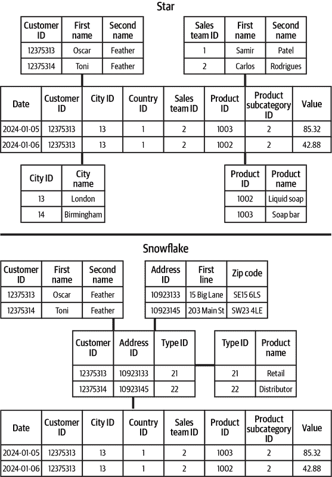
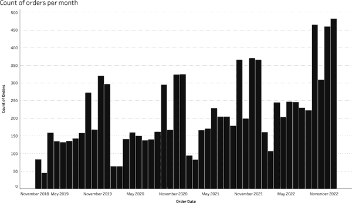
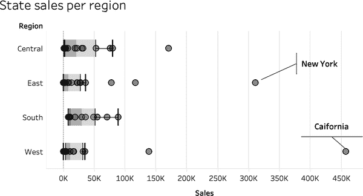

# 第三章：数据分析系统的构建模块

数据项目可能很复杂，但并不需要如此。数据有无数可能的结果。了解数据项目的不同阶段将使您能够分解复杂性并使项目更易管理。本章的目标是让您能够在任何数据项目中发挥积极作用，并帮助引导其完成交付。

本章将解决数据项目的常见阶段：

+   通过从系统中提取或从第三方获取数据来获取数据

+   在所有项目阶段和长期存储数据

+   精选和丰富数据

+   探索和分析数据集

+   分享项目创建的数据产品

本章的主题是确定您试图通过数据项目解决的问题是多么重要。专注于问题是关键，因为您可能会遇到障碍，并且在创建所需的解决方案时需要不同的选择。允许自己在从数据和分析中学习时进行转变是关键。这比长时间以前在需求文档中坚持原来设定的目标更好。

# 数据提取和获取

可能不言而喻，但如果没有数据或者不考虑获取数据，你就无法进行数据项目。获取数据的三种主要方式有：提取、获取和创建。在这里，我们将重点介绍前两者：提取和获取。每种收集数据的方法都有其挑战，但通过执行任何一种方法，您都有机会做出更明智的决策。

## 数据提取

虽然搜索引擎帮助找到外部数据源，但你需要依赖自己的网络和 IT 支持同事，指导你找到相关的内部数据源。要开始找出可能需要提取的数据，你需要找出哪些操作系统创建或捕获你需要的数据。一旦确定了系统，你可以与 IT 合作，了解创建了哪些基础数据集以及如何访问它们。如果你幸运的话，你需要的数据可能已经被提取用于分析。如果没有，你需要了解存储的数据和可以访问的数据。

从源中取样数据字段将帮助您了解可能需要和不需要的内容。查询操作系统以提取大量数据可能会影响操作系统的性能。使用小样本可以告诉您如果要提取更大量的数据，则需要进行哪些转换和清理。您对所需数据越清晰和详细，您的 IT 团队就越容易安排访问时间并估计所需的工作量。

随着对基于云托管的第三方软件和解决方案依赖的增加，访问底层数据集可能会更具挑战性。你可能会预期，作为你的组织数据的托管方，你应该能够轻松访问它，但情况并非总是如此。除非合同明确授予数据访问权限，否则你可能无法进行分析访问。

另一个需要做出的决策是在添加新记录时如何处理数据集。你的数据内容的性质以及源系统如何保存数据将在很大程度上指导这一决策。有两种主要的处理方式：

完全刷新

这涉及删除原始数据并重新加载所有数据。如果原始数据没有发生变化，只有新记录被添加，这种操作大多是多余的。如果记录可能已经更新，并且你只想看到最新的值，则完全刷新是最佳选择。

增量刷新

这涉及到在数据中有一个序数字段，即具有固有顺序的数据字段，例如日期，可以用来识别上次数据加载发生的时间，然后可以添加所有后续记录。这种提取数据的方法更有效，因为你不需要重新加载未更改的数据。

一旦你获得了数据访问权限，你可以开始计划如何处理和准备数据以进行分析。ETL 方法涉及在将数据加载到分析数据库之前进行所需的任何操作。这需要更多的规划和对长期需求的更清晰理解。

与本地数据处理相比，ELT 备用选项更符合云计算，可以实现更可扩展的处理。随着数据处理需求的增加和数据集的扩大，云计算的灵活性有助于满足不断变化的需求。可以根据需求随时增加更多的处理能力，而不需要像本地设置那样购买和安装额外的物理计算服务器。

ELT 的最大优势之一是原始数据集被存储，因此可以根据业务需要以不同方式进行操作。这使得处理数据更具未来性，因为你可以在不影响原始数据集的情况下更改结构、清理和过滤数据。ETL 方法在初始设置时可能会删除后来变得重要的数据点，因为它们最初被认为不相关。

## 数据采集

*数据采集*涉及从第三方供应商购买或获取数据。随着越来越多的公司通过 API 或作为付费服务提供数据，你很可能会遇到这种情况。

数据采集的首要挑战通常是找到不仅适合您需求的任意数据源，而是最适合您需求的最佳数据源。无论您是花钱获取数据还是免费获取，您都将使用组织资源来设置数据源，因此您需要确保数据本身符合您的需求。

您将使用的组织资源之一是时间。那么在项目上花费多少时间才合适？获取数据应该与其使用的潜在时长成比例。如果您希望获取几个值来支持演示文稿中的某个单一点，则找到准确的数据很重要，但找到能保持数据更新的来源则不是必需的。如果数据将支持长期解决方案，则相对而言，花费更多时间寻找可能更适合您项目需求的替代来源更为合适。您并不总是知道获取数据将需要多少努力，但通过快速测试，您将能够迅速了解可能会遇到的耗时挑战。

将数据引入您的组织并不总是像从数据提供商的网站下载文件那样简单。数据集可能非常庞大。如果数据频繁更新，您将需要投资建立一个能够执行以下功能的数据管道：

+   为您和提供商提供安全保障。

+   处理数据的量级。

+   处理数据的速度。

+   处理接收到的各种数据。

*数据管道* 是指从其来源或提供商获取数据并加载到存储中的过程。数据管道还可以包含转换步骤，将数据转换为可供分析的形式。

最后一点很少被考虑，但如果犯了这个错误会很昂贵。数据集供应商很少为您的特定需求制作数据集。这意味着随着供应商更新其可用内容，结构、文件名或数据字段名称可能会发生变化。如果您的数据管道和存储解决方案仅用于处理数据的原始特性，您将发现管道可能会中断和失败，使您的采集变得无用。

构建适合的数据管道需要专业知识，包括如何处理数据管道和工作流程，以及如何在您的组织中完成这项任务。例如，如果您反复吸收大量数据，则创建组织安全防火墙中的访问点只是所需任务之一。

通过 API，你可以访问托管数据的第三方系统。API 已成为从交易系统导入数据到数据存储或分析平台的关键元素。API 设计用于允许计算机程序相互通信，而不是直接向最终用户传递数据。这就是为什么 API 用于将数据从源系统传送到分析平台。与任何技术一样，随着时间的推移，API 已经发展成为使用更简单且功能更丰富的工具。如果你在进行需要 API 的数据项目，除非你有很多编写自己解决方案的经验，否则可能需要专家的帮助。现代数据项目的一个关键组成部分是拥有能帮助你理解从所需数据系统中获取数据可能性的程序员。

你还需要考虑是否需要获取的数据集进行更新。如果需要，你需要了解数据集可能何时更新，以及如何识别其变化。你很少会希望删除获取的数据集并重新上传数据。因此，重要的是识别获取的数据集中可能会变化的字段，以便确定何时可以获取新记录。通常随 API 提供的文档说明了需要注意的内容。然而，使用其他数据源，如*网页抓取*或从互联网页面复制数据，通常不会有这样的内容。网页抓取可以通过许多专业工具来完成，如 Microsoft Excel 中的 Web 查询或 Google Sheets 中的 *IMPORTHTML* 函数，用于从网站上的表格加载数据。你可能需要与数据提供商合作，了解可用更新的频率以及如何识别何时需要获取新信息。

从第三方提供商获取数据集需要依赖提供商的组织。根据数据集对你的组织的重要性，你可能希望审计提供商长期支持数据集生产的能力。如果这个获取的数据集成为你组织流程的关键部分，那么你需要确保已经有协议来维持数据流。如果无法形成这些协议，你将面临长期风险，可能导致数据驱动的流程出现故障。

获取数据集意味着你对数据的使用和你自己创建的来源同样负责。这意味着你需要确保数据集符合所有相关法规，并进行仔细管理。在获取数据集时，要追溯数据的主体以确保他们已经同意收集和使用数据可能是一个耗时的过程，但重要的是确保你的组织免受数据滥用长期影响的保护，如来自监管机构的诉讼和罚款。

获取数据时你需要考虑的最终挑战是数据提供者可能在数据集中引入偏见。在“数据的关键特征”中，我们介绍了质疑数据集重要性的重要性。在这里，我们将看看偏见如何渗入数据集。研究提供数据的组织，看看是否存在潜在的政治、经济、社会或宗教偏见，这是一个经常被忽视的重要步骤。如果你假设一个数据集代表整个人群，但它只代表社会的一个有限段，你就会面临形成错误和误导性结论的风险。潜在的偏见可以通过多种方式引入；以下列出了一些：

+   限制数据来源

+   过滤掉某些值

+   用词不当的问题

+   汇总偏见来源以形成新的数据来源

修正你不拥有的数据集中的偏见是非常困难的，所以在使用数据时，你需要考虑这些偏见，或者找到替代来源。

# 数据存储逻辑和术语

一旦你获得了项目所需的数据，下一步是确定你将在哪里存储它。有多种选择供你选择，这可能比你首次想象的更棘手。你的组织可能会通过制定你必须遵循的指南或者仅提供访问受限范围工具的能力来限制某些选项。如果没有建立的数据存储方法或技术，你需要评估对你的组织和项目最合适的方法。每个选项都会有一些优缺点，所以让我们依次来看看每个选项。

## 类型

就像你遇到的所有其他数据一样，你解决的业务问题将塑造你所需的数据集。你的数据形状、行数和数据结构将影响你的存储选项。

我们无法详细说明你可能遇到的每种情况的具体细节，但我们将突出显示关键差异及一个解决方案不再可行的地方，你需要考虑另一个解决方案。

您可能会发现您可以访问的数据存储可以吸收您通过数据项目创建的数据源，但您需要问自己的问题是，“它们应该吗？”几十年来，组织一直在尽力挤出许多数据源的最后一点容量、内存或功能，以避免对现有解决方案及其所有链接到它们的数据产品造成重大影响的系统性变化。如果您正在创建一个需要持久的全新项目，关键是确保数据源能够扩展到手头的解决方案，并满足用户的需求，而不是让他们的屏幕上出现旋转加载图标。接下来我们将探讨您可以使用的选项。

### 电子表格

尽管许多数据专业人士会认为电子表格不是战略性的数据存储平台，它们仍然在大多数组织中扮演着保持重要数据集的关键角色，正如在“数据的形状”中讨论的那样。电子表格提供的灵活性确保它们可以满足许多人的需求。单元格可以容纳您想要的任何数据类型，数据不必以特定方式结构化，文件可以通过简单覆盖文件中已有的值进行更新。电子表格的灵活性可以允许从中创建多种数据产品。

电子表格的一个优势是源数据和输出通常保持在一起，通常位于不同的选项卡中，但仍在同一个文件中。这可以使得审视数据如何导致分析结果变得更加容易。许多顾问在电子表格中构建财务模型，因为这样更容易与客户分享，并且可以快速添加客户的数据。如果这些模型需要反复使用，那么可能会选择其他工具，但由于这项工作的定制性质，电子表格仍然是许多人的首选工具。

然而，电子表格提供的灵活性实际上是它们作为数据存储的一个不佳选择的原因。分析工具期望在每个列中找到仅一种数据类型。由于电子表格不必以数据集中的相同数据类型结构化数据字段或名称位于顶部行，许多商业智能工具在读取其中保存的数据时会遇到困难。数据点可以通过单击单元格并按键进行轻松覆盖。这可能会导致在使用电子表格与其他工具或分析本身时出现错误。

如果数据以字段顶部的名称在列中保存，由于电子表格可以拥有的行数有限制，您可能仍会遇到困难。Microsoft Excel 的行数限制为 1,048,576 行，在此之后无法添加额外的数据。这听起来很多，确实是，但随着更大数据集变得越来越常见，电子表格通常无法处理完整的数据集。这意味着文件必须分段，这在尝试处理它们时会增加更多复杂性。

在数据存储方面，共享电子表格文件可能既是福音又是诅咒。共享电子表格的便利性意味着数据更容易使用，因为在访问之前不需要授予对更安全数据存储的权限。而与此同时，情况也可能完全相反。由于数据集可以在同事之间甚至在外部传递，数据集的控制立即丧失。这种情况的影响包括以下内容：

+   随着信息在更多人之间传递，追踪信息来源变得困难。

+   如果原始来源丢失，无法更新数据集。

+   数据安全不可靠，因为它依赖于他人不传递数据。

+   难以追踪数据使用，以满足主体控制其自身数据使用权的要求。

如果电子表格的版本控制不够好，他人可以轻易更改原始数据集。这可能会改变某人从数据分析中得出的发现，或导致错过更新的数据。如果在数据项目中使用电子表格存储数据，您需要慎重考虑上述因素。

### 数据库

许多对电子表格使用不利的因素可以通过使用数据库来解决。*数据库*是专门设计用于摄取、处理、存储和输出数据的软件解决方案。数据库加载到专门用于它们将承担任务的数据服务器上。服务器仍然是计算机，但它们具有比您的笔记本或台式计算机更多的存储和计算处理能力。因此，数据库被设计用于在处理数据查询时关注的特定目的和考虑要采取的存储选项。

许多传统数据库通常使用一种名为*结构化查询语言*（SQL）的编程语言，允许您使用其中持有的数据。SQL 是一种全面的语言，可以让您创建、更新、查询和删除数据库表格。SQL 在大多数分析师中广泛知晓，但非数据专家往往不常被教授。这意味着许多人可能会难以访问数据库中的数据。

在“超越文件”中，我们向您介绍了数据库及其在系统内持有数据的方式。让我们更详细地了解关系数据库如何将数据集分成不同类型的表格。*事实表*持有数据集的度量，而常重复的维度则存放在*维度表*中。维度表保留了分类数据点的名称以及数字标识符。由于数字标识符更快处理且存储空间更小，维度表有助于减少处理数据查询时的总体大小和复杂性。由于维度值经常在数据集之间重复，它们在维度表中只存储一次，然后在事实表中使用标识符。

组织事实和维度表所采用的方法可以有几种形式。您将遇到的最常见的是星型和雪花型模式（图 3-1）。

星型模式

星型模式具有许多维度表，这些表连接到事实表，就像从星的中心射出的光束一样。

雪花型模式

在自然界中，雪花的核心有从中发出的树突，然后从这些树突中进一步发出更小的树突。数据雪花也是如此，详细的维度表可以连接到其他维度表，然后再连接到事实表。

尽管您可能不会亲自决定模式类型（如果您有一位负责服务的数据库管理员），但您可能需要了解在数据库中结构化您的数据时使用了哪种类型。在中型和大型组织中，*数据库管理员*是您在 IT 团队中经常遇到的一种角色，负责维护和优化更新和存储。

作为数据库的用户，您必须考虑您在将来和数据的其他用户留下的复杂性。雪花模式可能更易于维护，利用空间更少，并且数据完整性问题较少，因为元素存储在适当的详细级别上，以便每个类别有多少变量。星型模式需要较少的连接来组合不同的表，连接较少的查询处理速度更快。因此，决定哪种模式类型可能最适合的因素是用户的技能。在确定应使用的模式类型时，可能是迄今为止在您的组织中主要使用的因素。

###### 图 3-1\. 星型和雪花型模式（该图的较大版本可在[*https://oreil.ly/HAjLk*](https://oreil.ly/HAjLk)找到）

多个数据库可以并存于同一台计算机上；这些称为*数据服务器*。为分析设计的数据服务器被归类为*数据仓库*。由于数据量如此之大，数据库软件被设计为允许控制访问权限。在处理数据项目时，了解谁需要或可以访问特定数据字段或记录是项目的重要组成部分。如果过度限制访问，您输出的用户可能找不到所需的内容。如果没有足够的控制措施，您可能会面临泄露最终用户可能无法合法查看的数据的风险。

数据库比电子表格和其他数据文件存储选项具有更丰富的功能和更强大的查询性能。随着这种丰富性而来的是规划和管理数据的额外开销，因为你不能随意创建、编辑和使用数据库。当你从数据库源进行分析和开发数据产品时，你希望数据结构保持稳定。规划你将从数据库中需要的结构和访问方式将决定许多数据项目的成败，因为如果底层数据或需求发生变化，你将无法迅速更改架构。

或许你认为数据库是几乎所有场景的正确存储解决方案，因为它们专为许多情况而设计，但你错了。数据量、速度和多样性的增长挑战了数据库，因为许多软件解决方案未设计以适应更现代应用程序生成的数据所需的灵活性和规模。

### 数据湖

数据湖为许多数据库无法解决的挑战提供了部分解决方案。首先，数据湖得名于其能力，能够吸收和存储来自各种不同来源的大量各种类型的数据。尽管数据库只能存储结构化数据，数据湖也能存储非结构化数据。

*非结构化数据* 指的是没有行、列或关系定义的数据集，就像数据库中所见的那样。非结构化数据可以包括文件、文本、媒体或传感器数据。数据湖持有非结构化数据的好处在于在存储之前不必进行处理和转换。这意味着数据可以更快地吸收到存储中，允许捕获比必须首先进行转换更多的数据。Web 应用数据、社交媒体或任何数字点击都可以作为数据流捕获。

随着数据分析和数据项目的演变，能够迭代你正在寻找的内容及其存储方式变得至关重要，以便你能够获得最大的可能收益。一旦开始分析数据，你将开始学习，因此可能会提出不同和更高级的问题。数据湖允许吸收所有数据而无需指定架构。当你从数据湖中分析数据时，你将形成满足你需求的所需架构。这与必须事先指定它不同，就像你的数据项目将使用数据库作为存储解决方案一样。

仅仅将数据集倾泻到数据湖中并不是足够的存储方法。您需要为数据湖中存储的数据编目，以供潜在用户了解其可以访问的内容。*数据目录*包含元数据（关于数据的数据）和搜索功能，允许用户查找并找到他们正在寻找的内容。数据目录已经成为独立的软件产品，这意味着除非您的组织已经有一个，否则您将需要与另一个供应商合作。

数据湖可能需要与传统分析师不同的技能集。由于文件是非结构化的，数据字段和记录不能像在 SQL 中预期的那样在查询中引用。在组织中，R 和 Python 以及其他编程语言已经变得更加普遍，以帮助处理和从数据湖中提取价值。

对于您组织中的大多数人员及其使用的商业智能工具，仍然需要数据库。

### 数据湖仓库

数据湖仓库已开始将结构化数据库的优势与数据湖的灵活性融合到一个单一领域中。数据湖仓库的发明是为了创建一个单一位置，利用两种数据存储方法的优势。

通过创建单一解决方案，可以像探索数据湖一样探索相同的基础数据集，但它们还具有已开发的数据库架构。数据湖仓库也引入了许多在数据湖设置中缺失的数据管理特性。这种结合了结构化、半结构化和非结构化数据的组合，使得各种数据工作者能够从同一组数据集中获取他们所需的内容。

随着数据存储解决方案的发展，您可能需要依赖于组织中已有的东西。如果您选择从头开始，数据湖仓库可能会提供最佳解决方案，但解决方案仍在发展和成熟中。

## 数据服务器位置

选择数据项目存储的技术模型是第一步，但您选择的解决方案托管位置是另一个关键考虑因素。在 2010 年代，云计算的出现成为许多组织托管其数据的真实选择。在此之前，数据服务器的场内托管是唯一可行的选项。您关于托管数据服务器的决定将在很大程度上取决于您的组织运行的模型。

理解两种选项的优缺点是从他人那里获取数据以及存储您自己数据的重要因素。

### 在场内

将数据源*本地*托管意味着在您的组织运营的建筑物内拥有和运行数据服务器。出于多种原因，这曾经是标准做法，主要是出于安全考虑。通过在自己的建筑物内托管数据服务器，它们很可能位于您组织的防火墙内。*防火墙*是一种安全设备，用于分隔您组织的计算机网络与公共网络。防火墙过滤网络流量，并只允许授权访问。在云计算变得更为普遍之前，尝试通过组织的防火墙获取许可并建立访问点是一项耗时的过程，因为这增加了黑客攻击的风险，需要谨慎对待。

将数据服务器放在防火墙内使连接到其他本地托管数据源变得更加容易。您需要的大多数系统数据或其他数据服务器访问的数据源都在本地，因此继续这一趋势是一个相对简单的决定。随着云托管应用程序和数据源的兴起，情况不再如此。但是，本地托管还有其他好处：

您的应用程序控制

应用程序的版本控制曾经非常严格，以确保任何更新不会无意干扰其他应用程序或数据产品。通过在本地托管应用程序，您负责更新，因此可以选择安装和更新的时间。这意味着您可以避开高峰使用时间和/或关键报告期，比如季末。

前期成本

使用本地软件，许可模型传统上侧重于高前期成本，较小的剩余金额用于版本更新和产品支持。在初始项目的一部分中，您可以要求更高的价值，然后将维护成本作为持续的运营支出因素。

在本地解决方案的主要缺点是，所有操作都发生在您获取、管理和维护的服务器上。对此有几个影响：首先，您需要在项目开始时非常谨慎地确定容量和性能需求，以确保数据服务器能够存储和处理数据产品生成的数据。正如我之前提到的，许多数据项目随着项目进行而逐渐发展，这增加了吸引力和用户。其次，如果数据作为您的数据项目的一部分创建和存储，这一数据量可能会随时间增长，这意味着您需要长时间保留数据服务器的全部资源。这就是为什么与云托管相比，本地解决方案被视为昂贵和浪费的最终影响。最后一个影响是需要有架构师设计数据服务器和维护技能来修复不可避免的问题。

### 云

云解决方案的创建是为了解决自行托管所有内容所带来的许多影响。*云计算*指的是通常由 Microsoft Azure、Google Cloud Platform 或 Amazon Web Services 等第三方组织拥有和运营的外部服务器网络。您所在的组织或运营的国家可能会限制您可以使用的云提供商，因为存在安全问题或对其他国家持有敏感数据的担忧。云计算提供商可以提供大量的潜力来扩展，并可以在瞬间提供数据的增加处理能力和处理能力。自行托管解决方案最显著的缺点是它们的固定和预设容量；云计算解决了这个问题。

云网络利用互联网将它们的服务器连接在一起，以创建潜在的大量服务器阵列来获取资源。这些网络通过以极大规模运作来产生经济效益，从而比自行托管解决方案提供更为廉价的选项。对于许多关键应用程序，您的组织可能会运行备份系统，以确保应用程序在原始设置中出现任何问题时仍能运行。云提供商可以更便宜地提供这种服务，因为大多数故障转移选项不需要同时运行，因此处理能力可以在它们的设置之间共享。

随着越来越多的数据来源和应用程序托管在云上，将您的数据服务器放在云中将使访问数据变得更加容易。如果您的数据服务器在本地但依赖于云网络中的数据来源，您将需要在防火墙中开放访问点。除了减少连接到基于云的数据源的工作量外，云网络还具有其他好处：

托管更新

为您设置数据服务器并非唯一的云选项。您可能需要考虑的许多解决方案将包括在云中运行的完全托管系统。这意味着所有更新将由您完成。

更为廉价的前期许可证

借助云托管解决方案的能力进行上下扩展，许可费模型已经改变，更加专注于使用量而非重量级的前期成本。这种模型意味着随着您的组织更多地使用数据解决方案，您的成本将增加。然而，如果解决方案没有被广泛采用或使用，您支付的许可成本将不会像自行托管解决方案那样高。这降低了整体项目投资风险。

无论您选择将数据资源部署到哪个位置，您都需要管理随时间建立的数据存储。数据项目需要考虑其长期管理，并制定相关控制措施。

# 数据丰富化和策展

数据源可能非常有价值，但只有在其结构良好时才能理解和轻松管理。当数据被存储时，并不一定已经被结构化、理解或管理到位。本节将探讨如何通过将不同的数据源组合在一起来创建更全面的视图，从而使数据源变得更有价值。

一旦您的数据源被开发出来，您需要考虑如何维护它们以保持它们与初始状态一样有价值。管理数据源需要付出努力，但如果做得好，可以节省大量时间和（重新）工作，因为数据源被应用于替代用途。提供数据管理和数据集治理控制可以决定数据是否被信任使用，或被忽视为不可靠的混乱。

将这些管理方面因素纳入项目数据的保持和维护过程中，然后通过精心策划数据来增强其可用性。编目数据已经催生出一整套软件产品，以帮助处理这一任务。记录元数据——关于数据的数据，有助于使你的数据源能够被尽可能广泛的观众发现和使用。

## 数据转换与丰富化

如果您的组织主要的数据源传统上是电子表格，您可能已经花费了大量时间来转换数据。重塑数据以便与商业智能工具一起使用，或者仅在电子表格软件内进行分析，都可能是一项耗时且不被重视的任务。在数据输出的观众中，很少有人意识到在生成数据产品时可能涉及多少转换工作。许多高管习惯于仅仅要求他们想要的信息，而不了解为响应他们的请求而努力整理必要的数据点需要多少时间和精力。

*数据转换* 涉及改变数据源的形状，通常包括清洗单个数据字段。在电子表格中，您可能已经学会了如何使用 CTRL+C 和 CTRL+V 将数据从某些单元格复制并粘贴到其他单元格中。但是现代工具提供了更简便的方法来创建和自动化这些过程。自动化对于消除重复的手动步骤中的工作量是非常重要的。如果这些过程留给手动操作，无论执行任务的人多么尽责，重复的性质通常会导致错误。相信我，在这方面我领导过一个团队，他们大部分工作都属于这一类别，他们非常出色，但错误还是不可避免地发生了。

数据转换的自动化通常是在被称为工作流的内容中构建的。*工作流*之所以被这样称呼，是因为它们通过一系列转换步骤处理数据。虽然工作流可以被脚本化，但许多工具（如 Tableau Prep 和 Alteryx）提供拖放交互功能，允许用户构建最适合其流程迭代的工作流，直到完成所有必要的更改，而不必在代码块中查找相关指令。

*丰富*不同于转换，因为它涉及添加数据字段和点，以提供数据源的额外背景或详细信息。这是数据源可以通过以其他任何组织系统无法做到的方式进行组合而变得更有价值的地方。将数据表连接在一起可以添加有用的数据点，建立记录背后原因的依据。让我们看几个例子：

医院中的患者历史记录

添加来自患者地址本地区域的人口统计信息可能有助于了解造成患者访问该设施的原因。也许财务困难导致饮食不良，从而引起较差的健康状况。

客户购买

添加来自研究公司的市场份额数据可以帮助促进理解，了解高销售是否是由于贵组织的表现，还是与更广泛的市场趋势相似。

农作物产量

添加天气数据可能帮助农民理解作物产量变化的原因。

创建一个丰富的数据源可能意味着您需要复制数据源，从而使数据存储成本翻倍。但这并非必然，因为您可以在数据库中创建视图，这些视图仅引用原始数据源的位置。当使用时，它们具有所有的连接逻辑，使它们像数据库表一样易于使用。除非数据库中的命名约定非常清晰，否则您可能甚至不会意识到在使用视图而不是表。

随着组织多年来积累的大量数据，丰富数据可能是将庞大的数据量转化为每个人都可以使用的东西的关键部分。许多数据项目仅仅是为了构建更丰富的数据源，使分析师和领域专家能够提出比以往更详细的问题。

一旦创建了数据源，就需要对其进行维护和治理，以确保其保持准确和最新。

## 数据质量与治理

一旦您形成了一个数据源，就需要确保它与所涵盖的情况保持相关和可靠。数据很快可能过时，更新不正确，或者被多次复制，这在选择使用哪个数据和它们之间的差异时会带来挑战。让我们看看这些问题是如何发生以及产生的影响：

过时

如果形成您的数据源的工作流程没有考虑到源数据更新，那么您有可能使记录过时。这意味着任何新的数据点都不会自动添加到数据源中。您可能会错过客户行为变化或可能出现的问题，这些问题如果数据刷新后就能轻松发现。

更新不正确

您需要确保数据源更新正确进行。当您更新数据时，可能会进行全量刷新或增量刷新。全量刷新会删除数据集中的所有当前记录，并用该时间点数据源中的所有数据替换它们。增量刷新仅会上传数据集中的新记录。如果数据字段名称或数据类型发生了变化，那么您的刷新可能无法正确运行，导致数据不存在或不正确。

多份副本

最后的挑战是确保人们没有形成自己的数据源版本。这可能涉及添加数据字段，过滤记录或使用旧版本的数据源。当他人使用这些副本而不是真实的数据源时，会在决策过程中引入无意的错误。

数十年来，数据的多份副本一直是大多数组织最关注的问题之一。保留多份副本浪费昂贵的存储空间。现在，大多数组织都专注于“真理的单一来源”或*黄金来源*的概念。这个概念是有道理的，比如报告给股市的财务信息，下一季度所需的产品数量，或者收到的投诉数量，这些都是公司做出正确决策所需的关键信息示例；因此，拥有一个一致的数值非常重要。

在我们看来，“单一来源”概念已经被过分推广。该概念忽视了来自同一源的数据可能需要由不同的业务领域进行不同处理的事实。让我们以销售数据为例，说明为什么您可能希望不同版本的同一数据，有时被称为数据的不同*切片*：

销售

处理企业间交易时，销售团队希望知道销售已记录并且发票已支付。大多数销售佣金的支付依赖于此。他们的角色需要非常精细的细节：每行数据可能都是一个单独的交易。

市场营销

市场部门希望以较少细粒度的方式了解数据。例如，他们想知道哪项活动导致了销售。销售是源自电子邮件活动还是黑色星期五促销活动导致的折扣销售？

物流

这个团队需要知道何时完成销售以调整库存水平。这个数据集将更加注重产品和时间的焦点，包括尚未履行的销售记录。

每个这些数据集都应通过不同的数据字段进行丰富，以便每个领域能够回答自己的问题。如果您在一个单一的数据集中拥有所有这些字段，那么它将需要是一个非常宽的数据源来包含所有的数据字段。当数据保存在不同的粒度级别时，数据源也必须不同，因为每行将代表非常不同的东西。这种方法并没有错，但是您必须确保数据可以追溯到原始销售交易。这些销售交易只需存储一次，但需要以多种方式用于不同的目的，这样如果存在导致潜在混淆或错误报告的差异，数据就可以被对账。

允许多视角查看同一基础数据源可能会带来管理数据的挑战。确保每一次数据切割都符合存储、更新和删除数据的法律要求非常重要。当客户结束与公司的关系时，他们有权要求删除他们的数据，但是如果首先需要识别数据的多个原始来源，这将更难实现。使用单一的基础数据源来提供和更新视图是实现这一目标的最简单方法。

对数据不同视角的看法可能会带来挑战，即数据是否仍然用于收集时指定的目的及其使用是否被数据的主体允许。如果您制作了希望与其他部门共享的数据产品，而不仅仅是用于分析，您需要小心确保数据的正确使用。例如，如果精算部门希望使用您从产品概念调查中收集的数据集，但它已经有了关于受访者家庭设置的数据以更新政策定价，这是不应被允许的。

管理数据源变得更具挑战性，但是通过强大的数据管理指南来减少数据源的复制，可以使这变得更加容易实现。

## 策划数据

一旦您存储了数据，它就不会因闲置在存储库中而获得任何价值。策划数据源涉及将数据源提供给那些能够利用它们的人。如果您在一个小组织工作，您可能能够直接与您的数据集潜在用户交谈。然而，一旦您的组织员工增加到 100 人以上，就很难引导每个人知道哪些数据源可用以及他们在哪里找到它们。在目录中使元数据可用且可搜索将有助于数据源的使用。

### 元数据

元数据通常被定义为关于数据的数据。所捕获的信息可以是有关数据源的任何内容，有助于描述它是什么及为何创建它。元数据的元素可以包括以下内容：

+   数据源类型

+   文件大小

+   创建日期和时间

+   更新日期和时间

+   创建者

+   数据来源

还有其他一些详细信息也可以被归类为元数据，比如结构元数据。*结构元数据*描述了数据源的格式，包括列、值的数据类型以及其中包含的行。了解数据结构有助于确定数据源是否能帮助用户获取所需的内容。清楚每个记录在数据集中代表什么，也称为数据的*粒度*，有助于正确解释和使用数据源。在数据库表中，结构元数据还包括哪些字段是键和索引。这些因素帮助您通过仔细地将不同的表连接在一起来链接有用的表格。

### 目录

随着各种数据集的增多，数据目录已经变得越来越重要。找到所需的数据源的传统方法需要知道向谁询问。在很大程度上，数据库管理员，负责构建和运行数据环境的人员，是数据的向导，无论是在可用性还是获取方式上。在较小的组织中，这仍然是可能的，但对于跨国组织而言，仅仅找到一个数据库管理员已经是一个巨大的挑战，更别说找到知道如何找到您想要的数据的人了。

数据目录工具已经成为数据平台的重要组成部分，因为它们现在是指导存在哪些数据、数据存储在哪里以及数据意味着什么的向导。大多数数据目录工具将扫描数据库和数据源，识别存在的元数据，并使此信息可搜索。许多数据存储工具具有某种搜索能力，但数据目录具有能够同时在多个数据库和存储解决方案中工作的优势，从而创建更全面的概述。

数据整理往往容易被忽视。了解您的组织使用哪些工具和技术来使数据源更容易共享和理解是推动组织进行数据驱动决策的重要步骤。这有助于人们找到正确的数据来回答他们的问题，而不是花时间寻找某人来指导他们找到特定的数据源以回答每个问题。

# 数据探索与分析

一旦找到了正确的数据，从这些数据集中开发数据源，并从数据中创造意义，那么您就到达了这个过程中最有价值的部分，即开发分析和见解。形成见解的过程首先涉及数据探索，以理解数据代表什么，数据源的完整程度如何，以及数据可以回答哪些问题。

将数据转化为信息和洞察力是一种不广泛教授的技能，但大多数人都可以培养。鼓励每个人与数据一起工作是本书贯穿始终的一个重要主题。确保这对于主题专家或我们也一直称之为领域专家的人员在你的项目所涉及的领域是至关重要的，这是确保你的组织充分利用其数据资源的关键。使用允许专家无论其数据流利程度如何利用其知识的工具至关重要。

如果你不将数据交给组织中的专家，他们只能使用数据的通用概述。这些整体视图可能只是简单的计数，不太可能挖掘数据的真正价值。毕竟，为了完成一个出色的数据项目，你需要尽可能多地从数据中获取价值。

在探讨如何赋予你的专家主体能力探索你组织的数据集之前，让我们先了解数据探索涉及什么。

## 什么是数据探索？

*数据探索*包括对数据源进行分析，了解不仅包含哪些字段，还涵盖了哪些分类值的范围，日期范围以及关键度量的分布情况。这是将数据转化为信息的第一步，然后更重要的是得出洞察。

当首次使用数据源时，对数据集进行分析总是一个好主意。如果没有对数据进行分析，你可能会做出没有根据的假设。数据分析能让你测试你对数据中预期出现的内容与实际情况是否一致。以图 3-2 为例。如果你的业务有季节性，即某个时间段的销售量较高，则图表看起来符合你的预期，每年最后一个季度的订单数量较多。然而，如果你的预期是每个月的订单数量应该相似，你需要更深入地了解为什么每个月的订单数量不同。系统故障、数据管道错误，甚至是数据源意外变更都可能导致数据中的差异，从而得出错误的结论。

###### 图 3-2\. 数据分析（更大的图像版本可在[*https://oreil.ly/UJpPI*](https://oreil.ly/UJpPI)查看）

有多种方法可以对数据集进行分析。以下是一些需要考虑的方面：

+   唯一值的计数

+   每个字段内变量的记录数

+   数据点之间的偏差测量

+   过多数据点的测量（即超过 100%的任何数据）

当您进行这种探索时，您可能选择仅使用诸如平均值、标准偏差和其他统计量之类的摘要统计数据，但通过数据可视化，您更有可能揭示出异常值和趋势等额外洞见。图 3-3 展示了使用箱线图来查看零售商州销售价值分布的情况。

###### 图 3-3. 可视化值的差异（更大的版本可在[*https://oreil.ly/Qb3ZS*](https://oreil.ly/Qb3ZS)找到）

人类在图像中有出色的模式识别能力。将数据可视化使人们更容易看到数据中的异常值和趋势。在图 3-3 中的每个地区的异常状态无需告诉你，因为可视化已经清楚地表达出来。在你的组织中，很少有人对标准偏差、*p*-值或其他摘要统计有深入的了解。通过数据可视化，您可以利用注意前属性更轻松地向没有深入统计理解的人展示数据内部的分布和相关性强度。像箱线图这样的图表并不是大多数受众立即能理解的，但关键特征可以快速标注和分享。

探索和分析之间并没有明显的区别。通过从数据探索开始，您将很快开始创建有益的分析和洞见。

## 创建分析输出

您的数据项目可能会创建多个有用的数据产品，从需求文档中列出的产品到作为项目有益副产品的产品。

在项目的不同阶段，除了最初的请求者之外的人经常会使用您创建的数据源作为他们自己工作的主要或辅助数据源。在获取或提取数据之前，以及在将其转换为所需形式之前，您会希望将这些数据源以原始形式存储以备将来使用。这意味着您进行的任何转换都不会限制其他人使用数据源的其他部分。记录数据源，使其他人知道可以从中获取什么是未来使用它的关键。有许多记录数据的方法，但正如在“策划数据源”中讨论的那样，专业的数据编目工具正在越来越流行地做到这一点。

可视化数据对数据探索非常有用，可以为您自己的使用形成第一个分析输出。由于可视化是一种有效的数据传递媒介，因此这些视觉探索对直接与他人分享非常有用。如果没有对数据进行可视化，与他人分享您发现的见解将需要更多的时间和精力。可视化图表可以直接与专家（SMEs）分享，以帮助他们将他们的经验添加到数据中，形成更丰富的见解。

在运行数据项目时，传统上形成的大部分基本报告确实应该只是第一步。在本书中，我们强调了学习和迭代的好处。创建基本报告是为了报告标准关键绩效指标（KPIs）。如果数据来自更新的来源，则应定期安排刷新这些报告。微软的 SSRS、IBM 的 Cognos 和 SAP BusinessObjects 等报告工具首先提供了超出 Excel 所提供的自动报告的功能。这些工具通常由集中的 IT 团队拥有和操作，这限制了一些领域专业知识的应用。

开发数据产品并仅专注于项目的技术方面很容易。忽视组织问题或您试图用数据项目解决的挑战是一些项目可能偏离轨道的地方。应早期引入领域专家参与分析过程，以确保他们的知识和经验与数据一起使用。将 SMEs 纳入分析过程可以大大增加解决问题的项目初衷的可能性。创建可以使用简单工具进行分析的数据源，即无需大量编码或培训，意味着领域专家可以与数据专家一起探索数据源。许多商业智能工具已经开发成为更简单易用，而不会降低可以创建的输出质量。

即使具有领域专业知识，分析师也应参与形成分析输出，而不仅仅把一切交给 SMEs。分析师将有经验向数据提出正确的问题，以确保尽可能从中提取出最大的价值。如果您是第一次开发分析文化，有一些基本的地方可以开始开发分析输出。询问数据集中分类字段的谁、什么、何时、何地和为什么将有助于指导分析。以下是您可以使用每个方面来探索数据源以促进强大分析输出的方法：

谁？

这可以查看内部个体以及客户和客户。找到有关他们最多数据记录的个体可以指示您应该重点分析的地方。[帕累托的 80/20 法则](https://oreil.ly/3-txt)在这种情况下非常适用，即假设 80%的收益来自于 20%的客户。

什么？

此分析角度可以查看数据涵盖的产品、服务或主题。探索组织产品套件中新选项与现有主流产品的对比，是许多可以探索的角度之一。

何时？

如果您有任何时间数据字段，可以查看随时间变化的度量方式。对于任何项目交付，了解项目的影响需要考虑时间因素。

在哪里？

现在更多的商业智能工具在数据源中提供经度和纬度的映射能力。或者，一些工具提供内部数据库，以将地名映射到经度和纬度，或者在数据源本身不存在时，映射到地理区域的轮廓。

为什么？

这是这些问题中最难回答的。短语“相关不等于因果”在分析师行话中很常见¹。仅凭其数据字段很少完全捕捉到某些事件的原因。在这里，领域专业知识和经验有助于定位数据。使用数据来支持或挑战领域专家所作假设，是大多数分析师通过数据真正理解“为什么”的最接近方式。

尽管商业智能工具为组织中的许多人提供了生产自己分析的可访问方式，并有助于形成对情况的理解，但还有其他支持强大分析的方法可用。代码中心化解决方案正变得越来越受欢迎。然而，无论是使用 R 和 Python 包还是需要一些编码的 BI 工具，所需的编码能力水平限制了谁能使用这些解决方案。

参与编码的工具好处在于它们提供更高的控制水平和提供按需解决方案的可能性。这可能导致数据可视化的增加复杂性，使用数据科学模型，或者比企业级商业智能工具更便宜的软件成本。

如果您的数据项目提供涉及 AI 或机器学习组件的数据产品，那么很可能您将更依赖于中央 IT 资源，而不是可以从组织中的个体域中运行的自助报告解决方案。

# 与他人分享

当您完成项目的产出时，您将有一个最终的考虑因素：谁可以使用它们。受众或数据产品的用户将决定您可以创建什么以及所需的维护工作和可能的后续工作量。

在规划和构建过程中务必考虑您的受众。如果没有考虑受众，那么您很可能无法创建最终用户实际需要的产品。接下来，我们将讨论数据产品的关键考虑因素，这些产品将在您的组织内部使用，或者由私人组织外部使用，或者向公众分享。

## 内部部门分享

在组织内部分享数据产品通常是数据项目的主要目标。为自己的团队或他人开发数据源，生成报告或进行预测通常意味着您不必对产品的使用方式设置太多限制。

创建数据产品之后，您能够鼓励预期的最终用户使用产品的程度越大，您可能创造的收益就越大。正如我先前所述，不是每个人都具有高水平的数据流畅性；因此，他们可能需要支持才能有效地利用这些产品。您可以采用各种类型的支持来确保产品按预期使用：

书面解释

提供逐步说明如何使用您的产品对于指导最终用户非常重要。PDF 指南或您公司内部的网页可用于提供文本描述以及关键过程部分的截图。这些文档制作成本低廉，易于分发。PDF 文件易于重新共享，因此如果截图中含有任何敏感数据，必须格外小心。

视频演示

虽然制作成本更高且耗时，但视频可以更详细地说明如何使用产品。除非视频非常短，视频文件可能太大而无法通过电子邮件共享，因此需要将其托管在某个地方。如果产品包含敏感信息，视频还需要存放在安全的位置。

培训

最昂贵的选项可能也会产生最大的影响。举行关于如何使用产品的培训会话可以帮助用户进行一般用例的指导，但也将帮助他们按照自己的偏好使用产品。由于在同一时间让所有人（无论是面对面还是在线）聚在一起的挑战，安排培训会议可能会很困难。您还需要确保培训师足够了解以便能够处理问题。

数据产品的广泛分发，需要提供支持材料以确保其按照预期使用。如果数据产品供自己的团队使用，那么说服团队使用它会更容易。一旦产品与他人共享，您需要能够激励他们同样使用产品。在现代组织中，由于人们的注意力竞争激烈，清楚产品的好处是具有挑战性的。鼓励领导者分享产品的好处或提出需要使用产品的问题，可以增加产品被采用的可能性。

有时，您需要限制其他团队和个人对项目产出的访问。有许多情况需要限制访问，以下是需要牢记的两个重要考虑因素：

主题内容

人力资源（HR）团队可以访问大量敏感信息，因此必须严格保护其数据来源。薪酬水平、关系状态和绩效记录都属于需要限制访问的敏感信息。此外，在上市公司，财务团队通常可以访问敏感数据。为了防止内幕交易和其他非法市场行为，需要限制这些信息的访问。

监管限制

不同的行业面临不同的监管限制。例如，投资银行受到限制，不能接收来自其零售银行部门的数据，以防止基于受限信息（如银行客户的消费模式）进行交易。在欧洲，投资银行和零售银行之间的围栏设置也旨在限制不良交易的影响。这些限制扩展到组织各部门之间可以共享哪些数据平台及其上托管的数据产品。

许多数据和分析平台允许基于登录进行访问控制。确定谁应该访问项目产品是一个关键决策。可以对分析输出或基础数据源施加限制。如果分析产品已经经过精心构建，以避免暴露敏感信息，则必须注意不要暴露可能仍存在于基础数据集中的详细信息。

## 与合作伙伴的外部共享

与外部方面分享数据可以带来巨大的好处。当数据在外部共享时，潜在的财政价值显著增加，因为您的公司不仅可以从销售数据产品中获益，而且商业伙伴关系也可以得到加强，并且可以创建共享的提议。

在外部共享数据产品中的主要挑战是真正理解所需的内容。如果外部方为自己开发最终产品，他们不太可能准确地披露他们试图实现的目标。如果您组织之间的关系不够紧密，他们可能会担心您会试图首先将输出推向市场。这会使得难以生产专注于他们需求的完美产品。

如果最终产品是共享的提案，情况就不一样了。然后面临的挑战是如何共同创新，首先形成概念。通过我的（卡尔的）职业生涯，我们在已知可能存在数据集的基础上探索了我的组织与其他组织之间的潜在合作关系，这使得为最终解决方案创建正确的数据产品成为一个更长的过程；事实上，这成为了另一个独立的项目。

当将数据产品与组织外部共享时，您所考虑的所有情况在与您的组织之外的共享时会变得更加困难。您将需要仔细思考许多“如果”场景，以确保向正确的人分享正确的信息。如果您在这一点上搞砸了，即使您本意是正确的，也可能导致数据被滥用，造成严重后果。即使您有意做正确的事情，如果轻率忽视个人和组织数据的保护职责，可能会导致罚款、声誉受损和失业。

为了避免任何负面后果，您需要确保拥有允许数据离开组织的权利。您将经常被要求签署详尽的条款和条件协议，以定义您的数据如何使用和分享。如果您计划与第三方分享数据产品，您需要追溯文件中的许可以确保这是可能的。您可能会有法律团队支持这类工作，但仍需要小心谨慎地进行。

如果您的数据产品与外部方共享，您需要确保没有分享过多的信息。您需要检查数据或输出，看看是否包含了关于您组织的商业敏感信息。这可能涉及到在可视化输出中分享的明确见解，或者隐藏在数据集中的构成产品的信息。

尽管存在这些挑战，外部共享数据的好处是巨大的。这是大多数组织远未充分利用的收入来源。与其他组织分享打开了比仅将数据保留在内部获得的更大的机会和价值，但是当与公众分享时，机会更大。

## 与公众分享外部信息

与公众分享数据产品可以为多个原因提供巨大的机会：

收入机会

通过向人们收费订阅模型，让他们了解他们对产品或服务的使用洞察，已成为[*量化自我应用*](https://oreil.ly/lH6Ko)（如健身活动应用 Strava）频繁使用的模式。

使用产品的理由

Beeline，一个在第一章提到的骑行导航设备，为其用户提供数据洞察，鼓励更多的使用。跟踪速度、距离和海拔高度有助于鼓励用户继续使用 Beeline 设备和应用程序。此外，在充分匿名化的情况下，其他用户也可以为数据做出贡献，比如在这种情况下，城市规划者或商店所有者。

使您的客户更加聪明

银行应该随着他们的客户变得更加富裕而变得更富裕。通过让客户通过数据洞察了解他们的消费习惯，他们可能会找到节省金钱的机会。

当向公众开放数据产品时，您需要更加小心地确定要分享的数据和粒度水平。与公众分享数据的最大缺点是，您可能因过度分享您能够从您的服务使用中形成的信息而失去他们的信任。确保受试者知道您在谨慎和私密地使用他们的数据应该是任何与公众分享的数据产品的核心。如果您打破人们对您如何使用他们的数据的期望而破坏了他们的信任，您将发现您的组织会收到投诉和负面媒体报道，并可能失去客户。

如果您发现公共数据产品的使用价值，那么您将面临的下一个挑战是让公众使用该产品。在繁忙的世界中争取人们的注意力并不容易。由于您花费在产品开发上的时间，您很有可能比产品可能帮助的所有潜在用户更能感知到产品的价值。为了吸引人们的注意，您可能会诱惑使用引人注目的图表和图形，然而这可能会产生与产品使用意图相反的效果。然而，通过使用更加定制化和潜在难以解读的图表，您的受众可能不太可能能够解读您与他们分享的内容。数据流畅性是一个挑战，不仅在组织内部，而且在整个社会中都是如此。您可能需要简化图表和前端设计，以使产品更易于访问。

如果您向公众分享产品，它不一定要面向大众市场。数据的内容可能自然地聚焦于一小群人可以获益的好处，但是当将数据公开提供时，您仍需要去除许多复杂性，以使这些用户能够从中受益。

# 总结

数据项目可以有许多不同的输入，导致无限多的潜在输出。这意味着没有两个数据项目会完全相同，这就造成了固有的管理难题。从一开始，识别最佳的数据来源、获取数据并将其引入您的组织将会带来挑战。一旦您拥有了数据，建立正确的存储设置、建立目录以及生产数据产品都是艰巨的任务，但是一旦做对了，您就可以为组织开发出大量价值。最后一个考虑因素是您将与谁分享项目的产物。

尽管数据项目在技术上具有挑战性，但有效交付它们已经成为任何成功组织的关键要素。

¹ 如果您以前没有探索过这个概念，Tyler Vigen 的[“无关相关”信息图](https://oreil.ly/H_h5X)是为什么相关性并不意味着因果关系的轻松演示。
