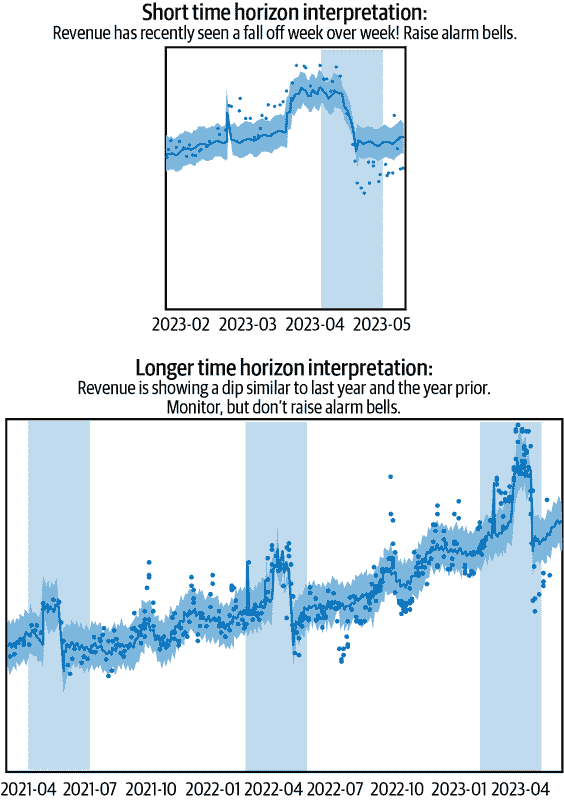
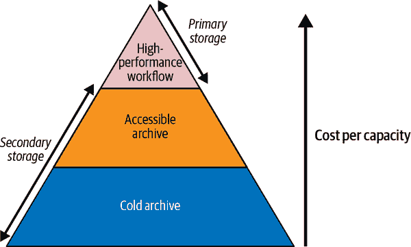

# 第四章：构建您的分析平台

无论您打算构建一个简单的仪表板来突出基本的公司关键业绩指标，还是一个实时预测模型来推荐产品给客户，您都希望从输出开始向后定义数据架构、设计、工具和人员，以便利用这些来实现目标。本章将从工具、数据需求及相关成本的当前情况概述开始。最后，将介绍一些最佳实践，包括敏捷项目管理和以质量和利益相关者信任为核心的构建方法。

# 技术选择

人工智能炒作经历了几轮繁荣与萧条。然而，自 2010 年以来，我们看到对几乎所有行业和公司注入更多分析和数据智能的积极稳定推动。为了保持相关性和竞争力，领导者们面临着学习和将数据及其系统融入业务决策和产品开发流程的压力。虽然一些公司由于缺乏基础设施或数据专业知识，或者对变革的抵制而落后，但大多数公司已经开始利用数据来*支持*业务决策，其他一些公司则全力以赴创建数据*驱动*的产品。行业、公司、产品和领导力都影响着它们的数据采纳和成熟阶段，以及数据被如何利用的方式。

在第一章中，我们介绍了*数据驱动*决策的概念。将这一概念应用于公司，这意味着一家正在利用数据输入来帮助支持或指导决策过程，但最终仍依赖于人类判断来做出最终决策或战略的公司。这可以通过利用数据来指导库存管理、定价策略、市场营销和产品改进来实现。这种行为在传统公司中很常见（例如金融、医疗保健、娱乐和零售业），这些公司历来依赖于人类经验来指导决策过程。随着数据整合在获取或保持竞争优势中的重要性日益增强，这些公司已经开始积极融入更多数据驱动的决策。数据驱动的决策主要依赖于历史观点、描述性统计和关键绩效指标监控的仪表板，但预测分析也可以被利用并帮助决策。

在适用的情况下，公司可以通过利用数据作为决策的主要输入来发展*数据驱动*的决策制定。这种产品在我们现在与之互动的几乎每个应用程序或技术中都有，从 Netflix、Spotify 和 YouTube 提供的个性化“为您推荐”的体验，到 Google Maps、Waze 和 Apple Maps 提供的推荐路线和预测驾驶时间，再到 Tesla 的自动驾驶功能。这个列表似乎无法穷尽我们对建立在大数据和自动化 ML 系统基础上的产品和服务的依赖。这些公司在不断将数据置于其产品开发流程的中心方面做得非常出色。然而，即使在看似无需人工干预的输入输出系统中，始终存在对人类监控的需求。正如 ChatGPT 和 Facebook 等产品所展示的那样，始终需要人类监控安全性和质量保证角度。

公司可以同时具备数据驱动和数据信息决策的方面。像 Netflix 这样的公司在其应用程序上形成个性化体验时是*数据驱动*的，在其财务和人力资源部门做决策时是*数据信息*的。由于一些公司体现了这两种决策类型，这扩展了它们使用的数据产品的集合以及它们需要开发的工具、存储解决方案和流程的复杂性。

一切始于一个想法！识别出一个产品、一个服务或现有市场的空白。一旦领导者们决定建造“什么”，他们便转而考虑“如何”。它将如何建造？成功将如何衡量？在任何公司形成的初期，无论是 100 年前还是一年前，都已经做出了一系列关键的业务决策来使公司运转起来。随后，领导者们急于建立并证明自己的相关性，对分析平台基础设施的深思熟虑时间被缩短，通常集中于短期需求，并依赖现有的专业知识。组织通常会努力在脆弱的基础设施上建立概念验证，直到价值得到证明。这留下了很大的改进空间，通常公司会随着不同成熟阶段的经历而演进其观点和工具集，这些阶段决定了它们如何轻松地转向和适应技术景观的变化。

无论您目前在此过程中处于哪个阶段，无论是匆忙通过早期的建立决策过程，还是深思熟虑地思考新技术系统，以帮助支持您公司的下一阶段和发展，本章将为您提供正确的工具和考虑因素，以便从一开始就奠定良好的基础。这将涉及围绕分析工具、数据存储和数据处理与流程进行决策。

## 分析工具

你对数据产品的方法将影响你的技术栈是什么样子（即你决定依赖哪些工具来生成你将要产生的数据输出）。根据你在组织内打算建立的数据产品（基本分析、仪表板、前瞻性视图等），你将面临许多具有不同数据需求和需求的工具选项。你选择的具体工具将取决于你拥有的数据类型、想要回答的问题，以及你的技术技能和资源。让我们来看看主要的工具类型，并突出一些你可以考虑的选项：

电子表格软件

驱动几乎所有业务的第一个和最常见的软件是电子表格。这种软件功能强大，可以用来存储、分析、可视化甚至预测数据。Excel（Microsoft）和 Google Sheets（G-suite）在这一领域中占据主导地位，它们的使用量也在不断增长。最新的使用统计显示，公司对 Excel 的依赖约为 63%。（参见 1）

通常情况下，电子表格被用作个人和小团队的早期解决方案。根据我的（Sarah 的）经验，我甚至看到一些较大的公司也依赖电子表格作为主要的数据存储系统！一旦数据变得过大，并且需要更复杂的分析时，这种做法就显得有限了。不过，第二章中涵盖的大部分运营和临时报告都可以通过电子表格软件来处理。

低代码/无代码数据分析

当你的数据量或复杂性增加时，运行重复的数据准备、清理和报告任务可能会非常耗时，你可能想转向其他软件选项。低代码或无代码数据分析平台如 KNIME、RapidMiner 和 Alteryx 都提供拖放界面，帮助构建数据准备工作流、分析和仪表板。每个工具都提供不同的功能集，你需要探索每个工具，找到最适合你需求的那一个。

将数据准备、分析和可视化转移到这些工具中的一个将帮助你“工作更聪明，而不是更辛苦”，通过简化流程，赋予非技术用户进行更复杂分析的能力。除了帮助自动化流程外，这些工具的附加功能还包括与同事协作、版本控制和数据质量监控。电子表格容易出现人为错误，并且缺乏必要的数据治理控制。这些工具有助于规避这些问题。

商业智能软件

下一组工具是商业智能工具，如 Tableau、Looker、Power BI、Qlik 或 Incorta，可用于几乎实时地可视化和分析数据，创建交互式仪表板，并生成用于决策的报告。这些工具的功能会有所不同，但其中许多都包含低代码或无代码界面，带有拖放和预构建组件，使其对没有广泛编程知识的用户也能够访问。此外，这些软件提供了丰富的协作、共享和分发选项。

这类商业智能工具的一个主要缺点是，为了准备数据进行可视化，通常需要构建这些工具之外的数据管道。像 Tableau 这样的工具开发了类似于 Tableau Prep 的预处理工具，允许[高级用户](https://oreil.ly/t4Zkb)在类似而熟悉的工具中拥有自己的管道工作流程。然而，当这些预处理工具不可用时，可能需要数据工程资源来帮助构建工作流程并为您的用例提供数据表。

统计/机器学习（ML）软件

对于大型和复杂数据集，或者如果您需要比传统商业智能工具提供的更灵活和定制化的功能，可以利用像 Python、R 或 SAS 这样的高级统计软件。用于可视化的库，如 Matplotlib、seaborn 和 ggplot，可以生成出版质量的图表，而像 scikit-learn 或 Carat 这样的机器学习库则可用于开发预测模型、数据分类或自动化决策过程。

Python 和 R 由于强大的库的可用性、大量已建立的软件来帮助管理、测试、创建、开发和部署机器学习解决方案，以及它们的开源性而变得越来越受欢迎。*开源*指的是软件的开放和通常免费的性质，源代码公开可用，通常任何人都可以自由使用，无需支付许可费用。除了可以免费使用外，这些工具通过众包得到改进，这意味着任何人都可以贡献新功能、修复错误和优化性能。

采用统计和机器学习软件存在几个入门障碍，包括学习编程语言、理解统计概念以及熟悉设置开发环境。通过开源软件，由于社区提供的所有资源，这些障碍可能会稍低一些，但仍需时间和精力来学习。幸运的是，[AutoML](https://oreil.ly/6uRH-)工具大大简化了机器学习的复杂性，使非专家可以更轻松地构建和部署模型。

根据你的需求，你可能会发现自己使用了刚刚介绍的一个或多个工具。大多数组织，无论规模大小，都会依赖电子表格和商业智能工具来在公司内共享数据。如果你开始使用统计或机器学习软件，你可能会发现自己将输出导入电子表格或商业智能工具，以便公司更广泛地使用。尽管阅读代码丰富的 Jupyter Notebook 对某些人可能有效，但对更广泛的观众来说可能并不适用。

特别是在具有成熟流程和多人致力于相似目标的大公司中，可能会过度依赖电子表格在业务的数据驱动部分。然而，我们开始逐渐看到更多技术技能渗入这些领域，这可能会改善流程和产出。这在很大程度上是由于数据和工具在组织内的民主化以及对数据素养的普遍强调。这个过程涉及简化和扩展访问和分析数据的手段。

当你试图理性化你现有的分析堆栈时，继续关注正在不断变化和发展的格局是非常重要的。我们看到技术工具的持续集成，例如 Google Sheets 与 BigQuery 以及 ChatGPT 的集成，以及教授[Python for Excel](https://oreil.ly/93GhQ)的书籍。

## 数据存储与管理

当你继续专注于你的数据产品及其所需的输入以实现期望的输出时，你需要问自己需要多少数据以及将数据存储在何处。

“实时快照”用于实时报告和监控每周和每天的变化，并帮助回答这些问题：每周或每天收入如何变化？昨天我们最大的客户是谁？哪种产品上周产生了最高的收入？实时报告非常适合评估业务健康状况或以易于阅读和理解的格式（通常是良好格式化的电子表格或仪表板）快速查看 KPI。这使得企业能够对 KPI 出现的任何意外行为做出适当的反应（无论是好是坏）。

“实时”这个词给人的印象是数据每秒钟更新一次（甚至更频繁），但更现实的情况是，在数据创建、存储以及用于传输的数据管道之间存在延迟。根据你现有的 ETL 流程设置和管道的复杂性，这可能是一小时或一天，甚至更长的延迟。无论如何，你可能认为最新的视图可能是“实时”的。

*历史表格*将时间视角延长（或时间框架）至一年以上，使我们能够比较长期趋势，比如评估年度变化（YoY）、季节性趋势或推动预测建模。今天指标的变化可能可以解释为“正常”的波动，但你需要历史数据来解释这一点。根据您对指标、关键绩效指标（KPI）及团队或公司文化的熟悉程度，您可能会看到很多反应性行为。

一个例子是广告主在斋月期间的支出，如图 4-1 节所示。在中东和北非（MENA 地区），广告主将在食品配送服务上支出更多，为了做好开斋节的准备。这意味着在斋月前期和期间支出水平将上升。然而，开斋节结束标志着斋月支出的结束，通常会看到大幅的收入下降（类似于西方和中国文化中的元旦后的收入悬崖）。了解相关的地区行为，并拥有历史数据来设定和确认预期，甚至预测当前年份的收入下降，可以是指导业务的有用方式，可以帮助业务从反应性的“火灾演练”心态转变为更为主动的“如何抵消收入下降”的心态。

因此，我们回到了“存储多少数据以及在哪里存储”的问题。答案将取决于需求和成本。多年来，数据存储选项和成本已经发生了变化，从软盘到云存储，这使得能够更可靠、更经济高效地存储更多数据成为可能。这使得我们可以存储的数据量和种类更加广泛，包括更多用例和业务需求，有时会导致“暂时跟踪这个，看看以后是否需要”的心态。因此，通常会出现比业务需求所需更多的数据的情况。然而，即使这可能是一种合理的方法，在最终决定数据应该存储在何处以及在何种存储级别之前，了解所有利益相关者的需求是非常重要的，以确保没有任何“必须具备的”被忽略。了解哪些指标是必要的，由哪些团队需要，以及在何种历史时间范围内，对于做出正确的存储决策至关重要。预测未来收入的团队将需要多年的收入数据来识别和理解趋势、季节模式、假日依赖等。如果无法轻松访问历史数据，财务和收入战略团队在其预测能力上将受到限制。

###### 图 4-1\. 短期与长期时间视角

在权衡成本和可访问性之间的权衡时，您可能会考虑三种主要类型的存储：热、温和冷（参见图 4-2）。在进行一些尽职调查并收集要求后，您可以根据需要存储哪些数据以及在哪个级别存储数据来进行选择。

###### 图 4-2\. 存储金字塔（[来源于安妮·赫雷里亚的一张图片](https://oreil.ly/21jj-)）

热存储

为了管理近实时报告和数据的实时快照，您需要将这些数据存储在所谓的热存储中。这种存储选项旨在存储经常访问的数据，并提供最高级别的性能。通常这也比其他存储选项更昂贵。

温存储

对于不经常需要的数据，温存储是可以处理需要随时可用的数据的下一个可能选项。这种存储方式比热存储更便宜，但仍然提供相对快速的访问时间。

冷存储

冷存储是为了那些很少访问但需要长时间存储的数据而设计的。这种存储方式成本最低，但访问时间最慢。这可能是出于合规性原因而归档的数据。

## 数据处理和管道

为了获得所需的输出，您需要确保输入数据在您需要的*方式*、*时间*和*速率*下可用。

如果您正在进行*临时*（或一次性）分析，通常可以使用数据源所有者提供的数据快照。如果您无法即时访问某些类型的数据或数据集，通常可以请求并使用一次性数据拉取来满足需求。

另外，临时数据拉取在构建*概念验证*方面非常有帮助。当您试图从新分析、方法或流程中建立价值时，您需要的数据输入可能尚不存在于规模化格式中。利用数据快照是进行首次尝试、从利益相关者获取反馈、迭代并完善输出的一个好方法。构建概念验证是在规模化建设数据产品周期中的重要一环，并可用于阐明为何要投资于第三方供应商或在构建内部管道用于您的用例。这将使您的一次性任务变为*持续*需求，并提供几种如何继续进行的选项。

如果你的团队有专门的 BI 或工程支持，你可以与他们密切合作，以获得支持使用案例的端到端流程。或者，你可以利用“分析工具”中提到的许多自助工具来帮助自动化工作流程。在没有 IT 支持或投资于自助数据分析工具的情况下，你的团队成员可能会找到其他方法来构建他们的管道，如利用 Python、R、cron 作业等开源工具。在这些情况下，你可能会发现充满创造力的团队成员正在建立他们自己的管道。一般来说，孤立建设既有其利弊。一方面，这为团队提供了一种快速构建新流程且不依赖其他团队的方法。然而，当团队的技能有限且无法扩展到支持生产级代码和结构时，这可能会带来问题，并需要持续的监督以确保稳定性。这意味着该流程将继续存在于次优状态中。

那些优化团队设置以支持正确数据需求的公司，将有一个额外的流程层，将帮助他们有效运行：数据治理。*数据治理*涵盖了公司内确保数据质量、完整性和可用性的所有实践、流程、政策和指南。

一旦你从你的数据产品中证明了价值，你将需要投入时间和资源来建立规模化和生产级别的后端数据管道，以确保你能够持续支持你创建的数据产品。你需要确定像是你所需的维度和度量、所需的粒度级别，以及数据刷新的频率。

# 如何选择分析架构

在你管理预算限制、团队技能构成、不同的领导风格以及在团队或组织内部进行变革所需时间的挑战下，找到适合你分析架构可能会很具有挑战性。在这一部分，我们将深入探讨影响这些决策的考虑因素。

## 评估总拥有成本

他们说“生活中没有免费的午餐”，这也适用于你的数据产品（或一套数据产品）！要将你的愿景变为现实，你需要结合人、工具和流程。每个组成部分都有与之相关的成本，你需要将其考虑在*总拥有成本*（TCO）的一部分。TCO 代表了产品在其生命周期内的成本，从部署到废弃，以及其中的一切。在有许多开源工具可供利用的世界中，利用它们可以帮助减少一些成本，但仍需考虑许多其他因素：

人员

首先要考虑的是人员。你的团队是否拥有完成和构建你所设定的目标所需的正确技能？你需要考虑到分析技能、建模技能、工程能力、创造力、产品管理等。这些成本将包括数据科学家、数据工程师、业务分析师和其他团队成员的工资。在某些情况下，你可能需要聘请顾问或引入合作伙伴来帮助评估和确定最佳执行计划。额外的成本包括员工福利、招聘成本、培训团队成员使用新工具和技术的成本，以及持续培训以保持他们的技能更新。

工具

第二个考虑因素涉及数据、工具和技术。首先让我们谈谈数据——这包括获取和存储数据的成本，以及使用第三方数据源可能涉及的任何费用。明确你需要的数据以及时间范围，可以帮助降低你的总成本。这包括第三方数据及其增强你的第一方数据所需的需求和成本。第三方数据和许可费用可能非常昂贵，因此需仔细考虑哪些数据子集是满足你所列用例需求的必要条件。你能否跨公司合并用例？你能否预见到所有需求并创建一个集中的数据源？随着时间的推移，数据量将继续增加，因此你需要继续重新评估需求范围，并相应调整数据存储选项。哪些数据可以从热存储移至温存储或从温存储移至冷存储？

接下来，你需要考虑所需的工具或技术，这可能包括用于分析软件工具、数据治理工具以及任何硬件或云服务的许可费用。这些工具成本会有所不同，可能需要根据用户数量（例如 Tableau）或总使用量（例如 Amazon Redshift）来计算。你是否已经准备好了合适的工具来完成你所设定的目标？很多公司会默认选择某种工具，你需要在这个过程中进行评估。它是否适合你的需求？你的团队是否需要另一种工具？如果需要，该工具的成本如何，与现有合同相比如何？

有时候你可能会决定现有的工具不再足够，需要迁移到另一个工具。一般来说，迁移过程可能会非常漫长，团队需要时间来处理这些变化，接受培训以理解新工具，安排迁移时间，并重新建立流程和报告到新工具中。通常会经历五个阶段的悲伤循环，从否认到愤怒再到讨价还价，最终接受。此外，可能还涉及更改合同的成本，这本身可能导致比原始合同更高的费用。现有合同通常存在多年，并且可能享有传统价格的优势，使其难以击败。

如果没有迁移过程或者你已经完成了迁移，那么接下来就是维护和更新你正在使用的技术和工具的成本，以及任何持续支持的成本。

流程

最后的考虑是流程成本，因为在执行糟糕的流程时，你的资源会有隐含的成本。花时间评估流程可能存在的问题并进行改进，很可能能增加你有限资源的产出价值。流程改进可以包括培训团队如何编写更具成本效益的代码，以及开发代码审查流程。另一个例子可能是鼓励团队之间更紧密的协作，并开发沟通和知识分享论坛以提高产出。这也可能意味着在团队在项目或数据工作流中如何相互交流时建立角色和责任。列举的例子不胜枚举，但我希望这能让你了解如何利用流程改进来降低整体成本。

## 业务变化的速度

到这一步，你已经成功评估了工具、成本以及数据产品的一般需求范围，你可能会开始问自己……接下来是什么？嗯，不幸的是，从这里开始的旅程只会变得更加艰难，所以做好准备吧！现在是把技术放在一边，看看你能否很好地依靠你的人际关系，并与人们联系并激励他们进行改变的时候了。第一步将需要领导团队和高管的支持，这对任何成功的数据项目至关重要。你需要准备好回答这样的问题：为什么要变更？为什么现在？

您的答案应考虑您的观众的视角。他们是对数据技术不太熟悉、可能难以理解正在进行的变更带来的影响或者可能更抗拒变革的领导者吗？相反，他们是更懂数据的领导者，可能更愿意接受新技术和方法，但同时可能对这些变更带来的好处有更高的期望吗？无论如何，您都需要为您的产品、您的建议和*您自己*准备合适的推介。记住，大笔投资不只是给予好主意，而是给予优秀领导者，所以不要忘记您在推动这一切变成现实中的角色的重要性。

您可能会陷入周、月甚至年的辩论中，因为获得领导共识、批准预算、分配资源并进入执行阶段需要时间。通过这个阶段的时间很大程度上取决于请求变更的范围以及组织或团队的数据文化。您是否正在请求额外的人手？摄取新的数据源？平台转移？向云端迁移？重建数据管道和数据存储？并非所有领导者都充分了解数据机会，并且他们需要更多时间和重复来完全支持您的请求，即使那些完全支持的人也可能在您请求时没有预算来批准事情。在这个过程的这一部分要有耐心，但也不要灰心和放弃！

现在，假设您已经通过了批准过程，并希望进入执行阶段——让我们谈谈如何一直坚持到您承诺的结束。许多因素将影响您的推进速度，包括您的组织规模、现有数据基础设施的复杂性、正在进行的变更范围以及涉及的领导者和员工的技术专业水平。需要牢记的一些主要因素包括：

团队规模

影响变革速度的第一个考虑因素是公司（或团队）的规模。在较小的团队中，更改数据架构可能不那么复杂，但仍需要大量的努力，并且会面临独特的挑战。较小的组织可能内部技术专业性较低，并面临资源限制，如有限的预算或缺乏专门的 IT 人员。这可能使得计划和有效执行变得困难。在这里，您的挑战是找到在有限资源下有效的方法。有时这意味着尽可能依赖顾问；其他时候，您需要更慢地前进，另一个选择可能是优先考虑将团队成员的项目放置后焦点放在迁移上。

在更大规模、数据基础设施更为复杂的企业中，可能存在多个需要集成或迁移的遗留系统，而在这些系统之间进行数据流映射的过程可能耗时且容易出错。迁移的努力将涉及高度协调，可能需要跨多人和多个团队。在处理这一过程时，你可能会发现需要聘请具备专业技术技能的新人员来管理新架构，这将增加时间要求和复杂性。有时，转变团队会感觉像是在汹涌的水域中重定航向，你需要做好随时调整的准备。

范围和复杂性

团队可以引入各种变更，包括（但不限于）存储迁移、应用迁移、业务流程迁移和数据迁移。不论提议引入的是一个还是多个这些变更，你都需要深思熟虑现有基础设施的复杂性。你是否已经仔细分析和理解了现有数据系统，包括它们的结构、内容和依赖关系？通常来说，对一套工具或基础设施的依赖时间越长，复杂性越高，你需要花更多时间仔细规划，以管理潜在的故障点或数据丢失。迁移后，你需要抽出时间进行验证，并可能停用旧流程或工具。你的变更范围应该经过深思熟虑和详细概述，包括任何变更和期望，以及你预计从一个系统移动到另一个系统的团队的时间表。

商业领导

除了最初的开始构建的签署外，你需要在整个迁移和采纳阶段得到领导支持。在过程中，你可能会遇到各种挑战和障碍，需要领导层的支持来帮助排除这些障碍，因此务必提前请求支持。领导层的调整和沟通将有助于在你开始执行迁移截止日期时使生活更轻松。

总体而言，涉及迁移和变更分析架构的挑战可能会很大，需要仔细规划、执行和持续管理，以确保顺利过渡。不要忘记，所有这些变更的背后都是人类，研究显示，习惯的形成和打破可能需要 18 至 254 天不等。因此，请保持同所有受变更影响的团队保持密切沟通，确保事务顺利和成功。过度沟通可以通过提供设置目标的背景（我们为什么要这样做）和时间表（我们何时进行这样做）来帮助团队理解并与您一同踏上这段旅程。

## 如何使用？

在实施阶段开始之前，你将不得不决定如何处理迁移：*大爆炸* 还是 *渐进式*。大爆炸迁移涉及将现有系统中的所有数据一次性地迁移到新系统中。在小规模情况下，这是一个干净而有效的方法。然而，对于更大、更复杂的系统来说，这可能存在风险，如果出现问题，可能会导致显著的停机时间、数据丢失或损坏。理论上，如果一切顺利并且风险得到正确缓解，这种方法的成本应该比渐进式方法低。

或者，你可以采取更慢的方式，选择渐进式方法。这将涉及在较长时间内分阶段地移动数据或流程。这种方法可能不太具有破坏性和风险性，因为它提供了更多时间来测试和验证新系统，然后再进行切换。渐进式方法的主要缺点是在较长时间内维护两个系统，以确保适当的过渡。这需要更多的人力投入，并且最终维护成本将更高。

## 内部团队与外部支持

最后考虑的一个方面，同时也是每个组件的一部分，是*人员*。*谁*将是你依靠将你的愿景变为现实的人？会是现有团队成员，还是你将寻求雇佣合同工？通过分析成本和时间之间的权衡，你可以帮助自己找到答案。

如果你有时间限制，需要快速行动，并且团队缺乏所需的技能，你可能需要考虑引入临时承包商或顾问来帮助推动事情。这里的权衡是成本，因为顾问费用昂贵。或者，你可以通过投资学习和发展培训来提升现有团队的水平。这个过程会花费更长的时间，并涉及不同类型的成本——学习过程中可能产生的错误成本。每个项目的人员方面都是微妙的，我们将在第五章中详细讨论这一点。

# 部署

部署阶段将是你开始构建的地方，你的愿景将作为端到端用户的切实输出而实现。这可能是最激动人心的部分，因为你的工作影响可以在这个阶段开始真正被感受到。如果你准备好了，有几件事情需要记住；让我们一起来详细了解一下。

## 敏捷开发

项目   项目管理的黄金标准曾经是*瀑布模型*，这涉及到大量的前期需求收集（也称为*规格*），几个月的独立构建，几乎不对原始规格进行任何修改，以及在产品完全构建完成后才向利益相关者发布。这意味着直到产品完全完成之前，几乎没有提供反馈，几乎没有灵活性和迭代的空间。在这个时候，利益相关者可能已经对他们想要的东西变得更加聪明，并且经常对产品的反馈也会非常详细。幸运的是，正如技术在不断变化，围绕它的方法论和流程也在变化。这就是*敏捷开发*的出现。

这可能不是你第一次听说敏捷方法论，但到底是什么，如何帮助你呢？好吧，敏捷方法论关注于灵活、迭代和以客户为中心的方法。在开始任何项目之前，你将经历类似于从利益相关者那里收集需求的过程，但这里的区别在于你将使用*MoSCoW*优先级排序，通过一系列问题帮助你确定必须要有的、应该要有的、可以要有的和不会要有的特性和请求。通过这个过程，你可以开始将预期的输出简化为只包含必须要有的版本，也就是*最小可行产品*（MVP）。从 MVP 开始将有助于缩短构建时间、获取反馈和迭代的时间。采用敏捷方法进行产品开发对于确保你的输出成功至关重要。

假设你在一家社交媒体公司工作，被要求开发一个基准工具，以帮助识别加速广告支出的行业。你被要求开发一个将多个数据源（包括第一方和第三方数据）连接在一起的输出，提供内部视图以及完整的市场视图。为了开发一个最小可行产品（MVP），你可能建议仅集中在第一方数据上，开发良好的内部基准。这可以满足利益相关者的需求，直到你能够加入第三方数据。加入第三方数据将涉及映射数据集，进行质量保证以确保准确性，并根据分析的关键绩效指标（KPIs）验证其影响。在大多数使用第三方数据进行*描述性*分析的情况下，有一个明确的增值路径，因此这非常值得时间投资。

## 计划部署

任何良好的部署计划的第一步是理解您所做变更的所有下游影响。在范围界定阶段，当您与相关团队联系时，大部分工作已经完成，但始终保持与最终用户的密切沟通非常重要，因为需求可能随时间而变化。完成这一步骤后，请务必与他们分享时间表、里程碑、应急计划和沟通协议，以便他们了解预期情况及其时间安排。确保所有团队（IT、数据工程、业务智能、数据科学、分析或其他团队）都已介入并了解其在过程中的角色。为此，请确保沟通协议和期望明确。及早和经常沟通，并使用多种格式（电子邮件、Slack、一对一会议）将有助于减少后续问题，因此花时间确保向所有相关团队成员发送清晰、简明和频繁的更新。

一旦您进入部署阶段，您将希望通过在受控环境中进行测试、监控和评估变更，验证一切是否按预期运行。因此，部署通常分为两个阶段，您需要考虑：测试和生产。让我们来看看每个阶段的内容：

测试

测试阶段是部署的重要组成部分，因为它将有助于最小化错误或中断的风险。从最小可行产品（MVP）开始，并在此阶段花费足够时间，确保您的最终用户参与其中。这将及早警示您是否满足了他们的需求，并允许他们时间提供反馈。在测试阶段，您将有时间进行评估和调整方向，一旦您已经将变更投入生产并推广，这将变得更加困难。您需要为任何情况做好准备，例如范围变更、不兼容问题、数据丢失等，并且您可能会意识到需要调整以适应未预见的问题。根据需要进行调整，并继续收集团队成员的反馈，以识别改进的领域。关于遵循计划的引用之一是来自电视剧*Arrow*中虚构人物 Leonard Snart 的我（Sarah）最喜欢的一句话：

> “没关系。你只需要记住四条规则：制定计划，执行计划，预计计划会出现问题，放弃计划。跟着我走，你就没问题。”

生产

当您进入释放阶段，将变更部署到生产环境时，您需要确保更新任何相关文档，并向最终用户通报变更。带头设置培训、用户指南和其他资源，帮助团队成员适应变更。

为了在开发阶段移除风险，您将希望依赖敏捷风险管理政策来帮助持续监控和解决问题。这涉及开发团队、项目经理和利益相关者之间的协作，以识别和优先处理风险，并制定减轻风险的策略。

## 使用分析技术来监控部署。

部署完成后，您将希望密切监控并努力改善数据管道和产品的健康、质量和性能。这被称为*数据可观性*，并不是一个新概念。传统上，它局限于监控相对简单数据堆栈的单个组件，并且数据质量检查通常是手动执行的。从报告的角度来看，这可能看起来像这样：主题专家等终端用户发现报告中的断点（缺少一天的数据、异常值或奇怪的数据点），向业务智能团队发出警告，并建议数据管道或质量保证流程中断。这利用了一种*自下而上*的数据可观性方法，依赖于主题专家驱动报告的质量检查。然而，现代数据可观性实践包括自动化数据质量检查、异常检测和实时监控工程和业务智能团队内的数据管道。这导致了一种更*自上而下*、积极主动和自动化的监控、观察和改进方法的普遍转变，以满足 SLA 要求并保持数据质量高。让我们讨论一下在您的组织内建立强大数据可观性实践的一些重要方面。

首先，您将希望定义要监控的指标（销售数量、日收入、点击次数等），并为这些指标建立可接受的范围，以便当数据点超出“正常”范围时，您能够开发自动警报和通知来观察或修复它们。这通常被称为*异常检测*，是数据可观性框架的重要组成部分。通过更自动化化，帮助工程和业务智能团队在问题进入或破坏报告之前注意并解决问题。

其次，您将希望监控数据管道的健康状况，以确保数据从其源头流畅地传输到目的地。随着多个系统共同形成数据集和报告，存在许多可能导致数据延迟或数据丢失的故障点。这可能是由于人为错误、硬件故障、软件故障或其他许多原因。例如，如果应用程序在向数据库写入数据时崩溃，数据可能会丢失。因此，建立处理数据延迟和数据丢失问题的减轻计划将对维护数据完整性并满足您约定的 SLA 要求至关重要。

第三，您将希望定期查看通过数据观察实践生成的警报、通知和报告，以识别趋势和洞察。当对您构建的报告进行高级分析以监控数据系统时，您将能够发现诸如：数据何时失败？在周末？在每个人都在争夺资源的星期一早晨？使用度量看起来如何？最终用户多久使用他们一个月或一年前为他们建立的报告？我们能够废弃不再被利用的报告吗？等等……

最后，您将希望监控任何已建立的报告或数据集的使用情况。这是了解您建立的内容是否被有效使用的最佳方式！根据所使用的工具，您可能拥有一些内置分析功能，可以监控使用情况。

通过建立强大的数据可观察性实践，可以帮助您的团队提前解决数据质量问题，建立更多透明度，并将责任分配给他们，以确保报告准确可靠。回到我们的利益相关者信任主题，建立强大的数据可观察性实践可以帮助增强您的团队与最终用户之间的信任。随着时间的推移，这只会产生积极的涟漪效应。³

# 通过使用案例开发

尽管出现在本章的最后一节，通过业务用例开发是所有良好数据产品的起点。让我们诚实地说，不是所有有趣的数据项目都具有影响力，也不是所有有影响力的业务问题都有趣，但在中间这个大部分地带，可以做很多伟大的工作。因此，您的工作应该从能推动业务进展的地方开始。

## 创建关键报告/仪表板

您的组织的数据洞察力将指导您首先解决哪些问题，如何建立信任，并如何展示即时价值。任何新成立的团队、产品或输出都需要时间来获得动力并获得采纳。正是在这种精神下，您应该致力于开发具有明显好处的产品。审查当前存在的内容，并寻找增加价值的领域。如果已经存在仪表板和关键报告，是否存在自动化或优化的机会？

自动化

自动化指的是利用技术来执行本应由团队成员手动处理的任务或流程。您可以轻松地确定团队在重复流程上花费了大量时间的地方，这些流程可以使用某种形式的自动化。投资于经常性重复任务的自动化解决方案将有助于释放出更多时间，并帮助提高其输出的准确性。如果利益相关者依赖于这些流程的输出，这也会对您的服务水平协议交付产生下游影响。

优化

优化指的是寻找问题或任务的最佳解决方案的过程。团队通常采用一致性较高的方法论，允许很少的创新或改进。人们难以改变，而已建立的流程更难改变。然而，引入新的不同方法不仅可能有所帮助，还可以提高产品输出的准确性和质量。我们鼓励您审视和质疑运作模式，找到优化流程和解决方案的机会。让其他人参与进来，听取他们对现有工作流程的看法和想法。他们是否渴望改变，但只是没有时间或技能去做？

## 质量与数量

在任何成功的数据产品背后，都是高采用率和信任水平的核心。在 Facebook 早期，马克·扎克伯格确立了座右铭“快速迭代、快速创新”。尽管这是一个进行实验、快速建设并吸引关注的好方法，但不是一个长期可持续的框架。2022 年，在重塑为 Meta 的时候，由于快速推进而带来的冷漠态度被负面报道所影响，他们转向了“在稳定基础设施下快速迭代”。这个例子突显了快速证明价值的重要性，但也警示我们不要因行动过快而犯错、失信于人。⁴

特别是在初期，您需要权衡速度建设与质量建设之间的取舍。在极端情况下，如果输出错误或误导，您可以非常快速地行动，却面临与利益相关方失去信任的风险。在另一极端，您可以行动缓慢，需要较长的时间线来完成和交付任务，使利益相关方对承诺的结果感到不安。关键在于找到这个光谱的中间点，足够快速地交付价值，但又足够缓慢地验证和确保准确的输出。一个很好的开始是寻找能够用较少努力带来高价值的低 hanging fruit。当您观察团队或利益相关方接收、消化和处理信息时，观察流程和输出。分析、仪表盘和实时分析的健壮性如何？您可以开始将预测建模整合到堆栈中吗？寻找创造性的方式，以直接而有影响力的方式提供自动化或优化他们的工作流程。

在交付数据产品时，重要的是记住，你将在产品存在和使用的整个生命周期中担任所有者的角色。唯一的例外是在有已建立的流程将你的工作移交给工程团队，并通过产品化的方式稳定输出时。一旦你的产品投入使用，你的利益相关者可能会扩展；在没有工程支持的情况下，你需要准备好回答关于输出的问题，并在任何出现问题时修复后端流程。因此，你需要监控输出，以确保利益相关者继续获得正确的输出并看到它们。通常情况下，取决于谁构建了后端流水线，以及它是否建立在脆弱的基础设施上，你需要密切监控这一点。

把这视为一个持续的迭代循环。就像 Brian McKnight 的歌词中唱到的，“如果我相信我的工作已经完成，那么我将重新开始”，你需要继续寻找改进基础设施、数据增强、工具和流程的机会。你可能会发现自己参与多次资源或更好工具的谈判，所有这些将从满足利益相关者的需求开始。

¹ StackCommerce，“63%的公司认为 Excel 是一种重要的会计工具”，《金融邮报》，2021 年 4 月 29 日，[*https://oreil.ly/1a37R*](https://oreil.ly/1a37R)。

² Suzy Davenport，“打破习惯需要多长时间，什么是最好的方法？”《医学新闻今日》，2022 年 10 月 11 日，[*https://oreil.ly/5C4aC*](https://oreil.ly/5C4aC)。

³ 关于数据可观察性的更多信息，请参见[*数据可观察性基础*](https://oreil.ly/HHsY1)或[*什么是数据可观察性？*](https://oreil.ly/Oa1l4)，均由 Andy Petrella 撰写，由 O’Reilly 出版。

⁴ Emily Stewart，“马克·扎克伯格对 Meta 的新价值观表明他仍未真正放弃‘快速行动，打破陈规’”，《商业内幕》，2022 年 2 月 2 日，[*https://oreil.ly/8hQBc*](https://oreil.ly/8hQBc)。
