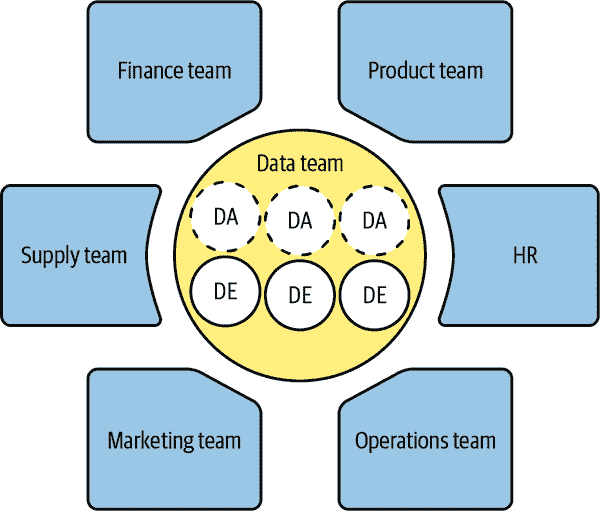

# 第五章：设置您的团队成功的道路

人是所有技术的核心。尽管机器人日益增多和技术系统接管工作的情况可能看起来令人沮丧，但人始终是所有技术决策和实施的中心。将合适的人才置于正确的问题面前，并投资于人才以建设未来，这才是你真正能感受到的领导力。

# 招聘

当 [哈佛商业评论](https://oreil.ly/30Gpb) 在 2012 年将“数据科学家”称为“21 世纪最性感的工作”时，这引起了对数据工作（数据分析师、数据科学家、数据工程师、数据讲故事者等）在业务成果方面重要性的关注。尽管真正的业务影响尚未被证明，数据职称之间的差异也不明显，但招聘和留住最优秀人才的竞争已经开始，并且竞争异常激烈！公司被极大地压力着要提供丰厚的薪酬和优越的福利来吸引候选人。自然而然，已经存在数据中心公司率先行动，拥有成熟的数据团队和数据系统依赖，并且他们制定了数据实践标准的基准。难怪所有最优秀的人才都聚集在 FANG（Facebook、Amazon、Netflix 和 Google）等大型科技公司。他们提供了丰厚的薪酬套餐，但作为交换，他们要求候选人具备出色的技术、战略、领导和领域专业知识——一个全能型人才。

但“独角兽”候选人的数量有限，且日益减少。为了继续大规模招聘，必须重新设定这些期望，并进行妥协和权衡。理解到你可能会找到技术上强大但缺乏领域经验的候选人，或者反之，意味着接受学习和发展投资不仅有益而且是必要的。如果你不愿意妥协，只愿意接受完美候选人，那么你的唯一敌人将是时间。在填补这个角色之前，你能等多久？项目和交付成果将如何受到保持此角色空缺的影响？最终，你的决定需要考虑找到合适候选人的时间、招聘成本以及学习与发展的投资。

市场上“独角兽”的数量有限，这迫使人们向独角兽数据团队的转变，而不是个体人才，其中团队成员互补各自的技能（数据科学、领域知识、沟通、运营）。当你评估和审计你现有的团队以及为实现项目愿景所需的技能时，你可能会发现存在一些缺口，你将面临升级现有团队与寻找新人才来填补技能缺口之间的抉择。让我们来看看在做出选择的时候需要考虑的因素。

## 首先内部

当然，构建你的愿景的最佳起点是通过你现有的团队！他们是你的明星球员，深知业务内情，拥有最强的领域专业知识，并且可以确保流程顺利进行。他们了解数据的细微差别以及关键指标、计算、报告、流水线等的重要性。因此，请对你现有的人才进行审核。他们中是否有人具备协助进行变更所需的正确技能？如果是这样，他们需要暂停哪些项目来承担这个项目？这些项目是否使命关键，或者如果为了优先处理你的工作而将事情搁置，业务是否会理解？你在这里的主要决策将是现有项目和新项目之间的权衡，并最终决定哪一个可能对业务产生更大的长期影响。

如果你的团队中没有专家存在，你是否有可以培训的人才（即，他们易于教导且积极主动）？如果是这样，这里有几个值得评估的问题：你希望培训的技能是否对团队的长期需求有益？这些技能是否符合个人职业发展的方向？这些问题将帮助你理解投资学习与发展是否值得。

一旦你决定了，团队成员将需要浏览许多学习选项，包括但不限于书籍、MOOC（大规模在线开放课程）、会议、训练营和正式学位。他们选择的方向将取决于他们试图学习的技能以及他们当前的专业水平。这个选择将直接影响达到熟练水平所需的时间和成本。一方面，书籍可能是最便宜的选择，但依赖于自律和独立学习者。另一方面，课程和训练营费用更高，但会提供动手学习和问问题的环境。最终，他们学习的投资应该导致对项目完成做出有意义的贡献。

虽然对团队的投资总是对个人技能和简历有益的，但在踏上这段旅程之前，有一点需要注意：并非所有技能的价值都是相同的。这是什么意思？嗯，根据角色（例如分析）和范围（仪表盘设计、报告等），你可能希望培训的技能（例如设计数据架构）可能不在“范围内”，因此不能完全被重视。特别是在大公司中，角色和范围已经明确定义，你需要花时间了解你希望培训的技能是否“在范围内”。如果答案是否定的，你需要考虑在哪里找到更合适的团队或个人。或者，我们建议寻找外部专家，我们将在下一节详细讨论。

## 外部资源

当您的现有团队的数据技能有限，将他们从当前项目中抽调的机会成本太高，或者可培训的技能超出了您团队的范围时，您可能会寻找外部专家（或通才）来提供帮助。作为短期解决方案，您可能会转向能够填补技能差距并推动项目运行的承包商或顾问。这使得您现有的团队成员可以专注于当前的高价值、高影响力项目，并同时推动您的项目前行——两全其美！作为长期方法，您将希望找到可以帮助维护、迭代和改进您通过短期聘用建立的任何东西的永久雇员。

作为新部署流程的所有者，您将扮演的最具挑战性的角色之一是招聘经理。在大多数专业领域，有标准化的测试可以帮助评估候选人的能力。然而，在数据领域，没有标准化的考试、测试或者能够证明能力的方式。这是一把双刃剑。从员工的角度来看，要学习和保持流利掌握的内容广泛、不断发展，并且难以跟上。而从雇主的角度来看，简历开始变得相似，都集中于相同工具的专业知识和基于相同训练的经历。因此，简历变得有限，您必须从其他方面评估当前的熟练水平标准，探索在线建立的成熟作品集（如 GitHub、Kaggle 等），或者可能需要花时间正式面试候选人。您可能感兴趣的问题包括：他们能否通过作品集或之前的工作展示程序、工具或语言的掌握？他们现有的经验是否适合您正在招聘的任务？他们的项目历史是否与您所在的领域或行业相符？

除了他们可以在第一天带到桌上的具体技能（Python、SQL、Tableau 等），您如何评估他们的无形技能？确实有数百个数据课程和认证，但没有一个能涉及到您企业特定内部运营的。您如何评估候选人的智慧好奇心和创造力，以及他们如何将经验应用到您的业务中？理想情况下，技术性与理解业务的能力结合是成功招聘的核心。

根据您招聘人才的紧急程度，您可能会被迫在少数几位候选人中挑选最合适的，然后迅速决定。如果没有这种紧急情况，我们喜欢提醒您考虑最优停止理论和“37%法则”，这可以帮助您更快地做出决策。这个法则基本上建议您面试候选人池的前 37%，不选任何人，然后准备向比您目前面试过的任何候选人更好的第一个候选人提供职位。无论哪种情况，您可能会被迫做出决策或者只能妥协。您需要警惕糟糕的招聘，因为招聘一个不适合文化或角色的新员工，其入职和培训成本可能很高，导致项目进度延误。

在考虑建立您的全明星团队的长远愿景时，您将希望开始思考全职员工（FTE）或永久性聘用。根据需求，您可以寻找能填补任何技能缺口的专家，或者寻找渴望学习和快速成长的通才，以补充和激励现有团队。此外，多样化招聘意味着更好的业务结果。研究清楚地显示，多样化的团队和公司比少数民族少的同行表现出更好的业务结果。例如，Fundera 的研究发现，“种族和种族多样化的公司更有可能表现更好，而多样化的团队更有可能占领并渗透新市场。”¹ 如今，大多数公司都有具体的多样性、公平和包容（DEI）倡议，这些倡议从高层开始实施，通过招聘快跑和为招聘经理提供培训来帮助吸引多样化的候选人。然而，如果贵公司没有这些做法，您始终可以努力使招聘实践更加有意义——在职位申请中采用包容性语言，并提供一个 inviting 的文化。

## 设置职业路径

无论您选择哪条道路来推动事务，利用内部团队或寻求外部支持，您都希望长远考虑，为团队的成功打下基础。虽然您的分析产品是输出，但您的团队才是持续运转的引擎。因此，请花时间为他们设置相关且激动人心的职业路径，以便他们保持好奇心和动力，并在职业生涯中成长。这样，您将更容易吸引优秀的候选人，并留住团队中的优秀人才。

尽管美国企业界工作的典型轨迹是从个人贡献者开始，然后逐步晋升到管理人员及更高职位，但这已不再是那些希望发展职业的个人的唯一选择。对于分析和一般数据角色来说，通常设置了两条轨道：*经理*和*主管*角色。基于这些轨道，了解团队中每个个体及其职业抱负，以下问题为背景：所有优秀的数据科学家和分析师都是出色的领导者吗？更高的管理职位是否是他们想要的？如何为您的数据专家创造一个激励他们的职业道路，以便您能留住他们？让我们更详细地看看这两条轨道：

经理的职业生涯

在这条轨道上的团队成员通常渴望领导力，并展示承担大型项目责任的能力。通过项目管理，他们很可能间接管理其他团队成员，并展示领导力。对于这条轨道上的个人，培训可能包括通过监督实习生进行小型管理机会。还有许多管理培训课程，您的团队可以投资学习，如 DiSC 风格、学习和沟通风格以及一般项目管理。

主管的职业生涯

当团队成员没有希望沿着人员管理的路线发展时，他们通常希望有其他的成长和发展方式，不限制于一个职业路径。这就是转向主管角色的时候。从培训和学习发展的角度来看，这里的工作永远不会结束。景观不断发展——新技术、数据仓库解决方案、概念和框架不断被开发出来，以适应日益庞大的数据系统。此外，开源技术的持续改进使得那些在分析背景知识有限的新手和中小企业可以上手运行。这些工具的民主化使得在团队中各个层次和编码与统计知识水平的人们都能利用强大的工具来解决他们的业务问题。你将需要随时了解这些工具，并寻找测试、促进学习并在团队内部利用这些工具的方法。因此，您对团队的学习和发展方法应该通过小型项目或沙盒不断鼓励独立学习。这将需要团队成员具备运行您为团队设置的新系统或改进系统所需的技能。这可以通过持续投资团队的学习与发展来实现，正如前面提到的，或者引入新的员工来填补技能缺口。

# 确定组织的正确结构

如何组织您的团队将是一个重要且微妙的决策。一方面，您可以选择将所有人员集中到一个团队中（集中式方法），另一方面，您可以选择直接将它们组织为更接近所支持业务的较小组（分散式方法）。让我们来讨论每种设计结构的优缺点。

## 集中式与分散式

在*集中式*支持结构中，如在图 5-1 中所示，您的分析团队将作为组织中的一个独立实体存在，通过一个中央队列为所有利益相关者提供服务。这种结构的最大好处之一是允许所有请求通过您进行优先处理，然后再委派进行分析。这可以让您有时间理解、完善并根据业务需求和预期影响对任务进行优先级排序。此外，您还可以整合多个利益相关者之间重复的任务，创建一个满足多方需求的报告输出。这符合 80/20 法则等原则，即 20%的工作量将覆盖团队收到的 80%任务。这是驱动集中团队引擎的哲学，因为他们处理能够满足业务中大多数用例和需求的重大项目。此方法除了优先级设定外，还有许多其他好处，如知识共享、报告标准化和同行之间的导师制。通过建立集中结构，您的团队将接触到各种业务问题，并形成强大的团队联系，从而实现更强大的协作。

集中式方法的缺点可能来自于领域专业知识的缺乏，因为在队列中分配更复杂的团队特定任务时，负责这些任务的分析师可能对指标和利益相关者的微妙之处不太熟悉，这将导致完成输出的时间延迟。不幸的是，这可能会使一些有特定需求的团队处于劣势，并且有时可能是盲目行动。由于竞争优先级的问题，避免这种情况可能具有挑战性，但是与所有利益相关者保持强有力的沟通流可以帮助平息争端，让他们了解团队关注的内容以及他们可以何时期待满足他们的需求。

###### 图 5-1\. 集中式方法（改编自[大卫·默里](https://oreil.ly/NwqYs)的图像）

在*分散式*方法中，如图 5-2 所示，你的团队被整合到组织内的业务单元中。分析师被对齐到业务单元，并且沉浸在它们的日常工作流程、指标、报告和管理中。他们的角色要求他们处理来自各自团队的任务，并允许他们专注于满足业务单元需求的定制化和细致报告。此外，他们可以成为与利益相关者的智囊团伙。这种方法的最大优势在于“速度需求”。通过将团队对齐到业务单元，他们也可以作为领域专家更快地完成产出，相比于使用集中式方法的团队。

分散结构的缺点包括每个团队成员需要在其业务组内管理任务优先级的要求。根据个人/利益相关者关系以及团队成员对抗的舒适程度，这可能（有时）会导致感觉不堪重负。最后，当团队以这种方式分布时，天然形成孤立，团队成员之间的合作也较少。作为领导者，你可能希望通过创建论坛和其他知识共享和协作手段来适应这一点。

###### 图 5-2\. 分散式方法（改编自[David Murray](https://oreil.ly/Wh6kN)的图像）

## 混合方法

集中式和分散式方法可能会让你感觉它们处于设计团队结构的极端位置，因为它们确实如此！因此，如果感觉你在试图将方块插入圆洞中，你可以转向混合方法。混合方法更加灵活，允许你利用两种方法的最佳特性，并根据你和你团队的需求进行定制化。

尽管有许多关于如何构建混合团队的选择，我们将介绍一种常见的选择，我们个人在许多公司中都遇到过。在这种混合模型中，你会发现团队成员被对齐到部门或特定的业务功能（分散式方法），同时他们又统一在一个组织标准、产出和团队活动的统治下（集中式方法）。这使得既可以利用分散式方法的领域专业知识和速度优势，又可以利用集中式方法的标准化和知识分享。

关于采取何种混合方法的其他变体需要考虑，你可能会更倾向于集中式或分散式。幸运的是，并没有“一刀切”的方法，你应该为你的团队和业务需求做出正确的决策，同时也要为自己设立一个合理的工作框架。

# 建立与授权

任何公司对新数据系统、方法、报告和产品的创新和采用，都将严重依赖于公司数据文化的强度。这种文化通常从最高层开始，逐渐渗透。当 CEO 和高级领导层接受了数据文化时，他们将会带领团队朝这个北极星进发，帮助根据数据和技术扎根日常战略和决策。但即使在今天这个世界上，随着技术和创新的前所未有的速度发展，公司仍然面临着创建正确文化的挑战。

## 执行赞助

自从数据和技术繁荣开始以来，每家公司都面临着跟上下一个快速移动的列车或被落下的选择。在这些创新和公司转变中，已经进行了大量的研究，以测试成为更多数据驱动和证明文化重要性的有效性和效率增益。压倒性的数据和研究指出了成为数据驱动或数据主导的所有好处，以及新的 C 级角色——首席数据官（CDO）的崛起。然而，更具挑战性的方面不仅是说你想成为数据驱动，而是真正将这种情绪融入到文化中。²

> 例如，[NewVantage Partners 的一项针对美国大型企业的调查](https://wiki.example.org/newvantage_partners_survey)发现，只有 31%的公司表示他们是数据驱动型的，这一比例从 2017 年的 37%下降。2019 年，超过四分之三的企业报告称，大数据和人工智能倡议的业务采纳仍然是一个主要挑战。但其中 95%的人表示，文化、组织和流程方面的挑战是采纳的最大障碍。只有 5%的人认为技术是问题所在。

这表明需要帮助领导者和 CEO 更加掌握数据的权力。如果领导层对数据或工具的理解存在差距，设置正确的运营合作伙伴和教育渠道，帮助提升对“被落后”或“行动过慢”影响的理解，将对推动这一过程至关重要。他们将需要帮助理解变化的全部范围，包括对产品或服务可能产生的影响，通过培训或招聘开发新技能的潜在需求，以及支持公司更多数据的正确组织结构。一旦领导层支持和以身作则的心态到位，使命、叙事和普遍文化将会改善，并有助于支持日常任务的执行和决策的制定。

领导层的不一致或不支持使得某些团队难以感到有权力，项目、洞察或策略可能会受阻。尽管特定团队（如分析和数据科学团队）易于使用和利用数据来推动洞察并建议战略决策，但他们的影响力受到领导层支持的限制。当需要做出决策时，领导层对数据展示的尊重不足或仅在数据符合其意识形态时才听取，这表明对数据的依赖性较弱，其他人也会效仿。分析师和数据科学团队将不断提高对数据缺陷的认识，将难以获得正确的跨职能支持，并且在许多情况下将无法继续获得资金支持。

## 数据驱动文化

培育强大数据文化的组织通常保持对由分析、工程和数据科学团队开发的新数据产品进行测试、学习和迭代的开放态度。这有许多优势，因为它帮助建立团队，这些团队协作开发新的和改进的流程和工具，这些工具设计时考虑了自动化和优化。更易于替换过时的传统方法，并共同欢迎新方法论的出现，并进行迭代和改进。拥有强大数据文化的团队将这种理念融入到每个团队成员的思维中，因为他们都朝着同一个北极星努力。这将产生高效和有效的团队，具有强大的信任水平和高质量的输出。安全的数据驱动文化的一个好处是能够快速行动并在市场竞争中保持竞争力。

在数据文化较弱的团队或组织中，你会发现更多对尝试新产品的犹豫，以及更长的迭代和采纳时间。如果你在这样的文化中运作，毅力是你最好的朋友。你将会逆水行舟，需要继续倡导提高准确性和改进流程的理念，找到激励团队全员使用数据的方法。在采取自下而上的方法不奏效的情况下，你需要朝高层发展，并找到能通过领导支持实施的支持。

不幸的是，建立强大和安全的数据文化面临的最大阻力是对技术快速进步及其对工作安全性影响的恐惧和不确定性。对于“我是否会因我帮助构建的技术而失去工作？”这个问题的答案是非常不确定的，但这个问题存在于我们每个人之中。这可能会阻止团队成员积极参与可能威胁到他们工作存在的产品反馈。那么，我们如何在不让团队成员感到不安的情况下平衡创新需求，拥抱数据和技术的世界呢？我们不能抗拒不可避免的事实并冒着变得无关紧要或保持低效的风险——我们应该寻求在可能的地方优化和自动化。在一个自我意识的数据文化中，领导层将确保公司的信息不是建议削减人员的工作，而是使其更加高效，并寻找方法重新配置员工，以在公司运营中创造更多效率。可以说，自动化那些花费团队成员几小时或几天时间的乏味工作，是可以重新配置到其他地方以提高您组织的生产力的时间。

随着我们周围创新速度的持续增加，出现了两种思想流派：接受变革还是抗拒变革。最近，随着 ChatGPT 的开发，我们看到了关于我们是否准备好迎接这种变革以及我们是否已经制定了支持正确创新的政策的问题。在一封公开信中，1100 多位签署者写道：³

> 机器是否应该允许淹没我们的信息渠道，发布宣传和虚假信息？是否应该自动化所有工作，包括那些富有成就感的工作？是否应该发展非人类的思维，这可能最终会超过、智胜、使我们过时并取代我们？我们是否应该冒失去对我们文明的控制的风险？这些决定决不能委托给未经选举的技术领导者。强大的人工智能系统只有在我们确信其影响将是积极的、风险可控的情况下才应该开发。

另一方面，其他人则认为我们应该集中精力如何更好地为自动化变革做准备：⁴

> 在失业已成为一种耻辱，悲剧般地影响并且仍然影响着数百万人的世界中，像这样的标题可能看起来像是一场不可想象的戏剧，但另一方面，如果我们对此情景毫无准备，那么可以肯定，这将是一个实现的预言。这种可能的情景就是我们所走向的，毫不停息地、几乎是不可避免地，至少如果我们假设技术发展将继续的话。问题不在于它是否会发生，而在于何时以及哪个国家将首先实现，也许几十年后，但随着当前变化速度的加快，很可能在本世纪中叶之前就会“可行”。

无论您在这个范围的哪一端，基本原则始终不变：强调数据流畅性，并理解您所做决策的影响。您需要团结您的团队朝这个方向发展，并明确您的立场将帮助他们理解您的愿景。

## 可能遇到的挑战

不可避免地，您将面临许多挑战，当您踏上这段旅程时。所有事情都摆在桌面上：平衡数据需求与数据成本、公司转向需要数据转向、赢得领导层的支持、找到合适的人才、实施挑战等等。尽管我们已经为您准备了思考所有重要的高层次考虑因素，但没有简单的蓝图可以涵盖您可能看到或遇到的一切。

您需要具备的最佳品质是坚韧和适应性。如果您能在公司内部保持数据叙事的连贯性，清晰地阐述“需要改变什么”和“为什么现在”，并根据需要调整您的方法，那么您就会为成功铺平道路。请记住，无论我们做出何种变革，无论是涉及流程还是工具，最终影响的都是人。决定改变工具并实施它可能很容易，但要让人们改变他们的思维方式、打破习惯并学习新东西则需要更长时间。因此，作为领导者，以*共情*为先是至关重要的。

# 接下来呢？

首先，感谢您抽出时间阅读本书。凭借您的新知识，您应该更有信心去承担基于数据的项目。但请记住，仅仅拥有知识并不能保证您的下一个项目会取得成功。我们建议您采取以下行动，以提高实现组织所需变革的机会。

## 鼓励创建数据驱动的组织的项目

作为您组织中的一员，您可以帮助塑造公司走向更具数据洞察力的道路。在评估将推动您的团队、部门或组织向前发展的项目时，请确保涉及数据。无论是建立数据源或一套分析产品，还是利用现有数据创建新的提案，您都将塑造组织对数据的态度。数据被更多地使用，每个人都会更有动力去使用它。

## 组建一个数据流畅的团队

数据产品和提议要求参与其构建的专业人员具备技能。如果您的组织已有这些技能，请确认他们的身份并培养他们的才能。在招聘组织角色时，请确保数据技能是期望角色配置文件的一部分，同时还需要领域专业知识和相关经验。对于已在您的组织内但缺乏数据技能的人员，请尝试鼓励他们提升数据流畅度。如果您有培训预算，请确保有课程可以提升员工的数据流畅度。为团队提供学习数据课程和分享知识的途径，更有可能增强应对数据使用变化或主题上的任何不信任的能力。通过改变组织运作和决策方式来使用数据的机会，并突出其带来的好处，将有助于改善企业文化。

## Just Get Started

尽管我们不得不说这一点，但您永远不会拥有完美的数据流畅团队，从数据信息化的高管那里收到请求时，刚好有合适的数据可以回答这些请求。对您来说，最重要的是简单地朝着在本书中阅读到的数据信息化文化迈出步伐。您的组织使用数据的越多，建立的信任越多，您的公司就会做出越多数据信息化决策，从而使您能够突显从做出更多数据信息化决策中获得的增强结果。

提供了许多专门书籍和资源，涵盖了您将参与的特定工具和数据专业领域。我们希望本书只是您与数据开始旅程的开端。

¹ Thomas Helfrich，《多样性如何帮助业务增长》，*Forbes Magazine Council Post*，2022 年 11 月 9 日，[*https://oreil.ly/6fUI3*](https://oreil.ly/6fUI3)。

² Thomas H. Davenport 和 Nitin Mittal，《CEO 如何领导数据驱动文化》，*Harvard Business Review*，2020 年 4 月 20 日，[*https://oreil.ly/qFlJp*](https://oreil.ly/qFlJp)。

³ Connie Loizos，《1,100+ 位显要签署公开信要求所有人工智能实验室立即暂停至少 6 个月》，*TechCrunch*，2023 年 3 月 29 日，[*https://oreil.ly/hlCvy*](https://oreil.ly/hlCvy)。

⁴ David Vivancos，《第一个失业率达到 100% 的国家？》，*LinkedIn*，2022 年 8 月 30 日，[*https://oreil.ly/RWBrk*](https://oreil.ly/RWBrk)。
