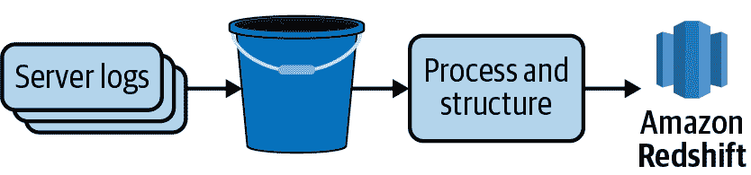

# 第一章：数据管道简介

在每个华丽的仪表板、机器学习模型和改变业务的深刻洞见背后都是数据。不仅仅是原始数据，而是从多个来源收集的数据，必须经过清洗、处理和组合才能提供价值。著名的短语“数据是新的石油”已被证明是正确的。就像石油一样，数据的价值在于它在被精炼和传递到消费者之后的潜力。也像石油一样，需要高效的管道通过其价值链的每个阶段传递数据。

这本袖珍参考书讨论了这些数据管道是什么，并展示了它们如何融入现代数据生态系统。它涵盖了在实施管道时的常见考虑因素和关键决策点，如批处理与流处理数据摄入、构建与购买工具等。尽管它不专属于单一语言或平台，但它讨论了数据专业人士在讨论适用于自制解决方案、开源框架和商业产品的基础概念时做出的最常见决策。

# 数据管道是什么？

*数据管道*是一组过程，将数据从各种来源移动和转换到一个可以派生新价值的目的地。它们是分析、报告和机器学习能力的基础。

数据管道的复杂性取决于源数据的大小、状态和结构，以及分析项目的需求。在其最简单的形式中，管道可能仅从一个源（如 REST API）提取数据，并加载到目的地（如数据仓库中的 SQL 表）中。然而，在实践中，管道通常包括多个步骤，包括数据提取、数据预处理、数据验证，有时在将数据传递到最终目的地之前进行机器学习模型的训练或运行。管道通常包含来自多个系统和编程语言的任务。此外，数据团队通常负责并维护多个数据管道，这些管道共享依赖关系，并且必须进行协调。图 1-1 展示了一个简单的管道。

###### 图 1-1。一个简单的管道，将服务器日志数据加载到一个 S3 Bucket 中，进行基本处理和结构化，并将结果加载到 Amazon Redshift 数据库中。

# 谁构建数据管道？

随着云计算和软件即服务（SaaS）的普及，组织需要理解的数据源数量激增。与此同时，供应数据以满足机器学习模型、数据科学研究和时间敏感洞见的需求达到了空前高度。为了跟上这一需求，*数据工程*已经成为分析团队中的关键角色。*数据工程师*专注于构建和维护支撑分析生态系统的数据管道。

数据工程师的目标不仅仅是将数据加载到数据仓库中。数据工程师与数据科学家和分析师密切合作，理解数据将如何使用，并帮助将他们的需求转化为可扩展的生产状态。

数据工程师以确保他们交付的数据的有效性和及时性为荣。这意味着测试、警报以及为出现问题时创建备用计划。是的，问题最终会出现！

数据工程师的具体技能在某种程度上取决于其组织使用的技术堆栈。然而，所有优秀的数据工程师都具备一些共同的技能。

## SQL 和数据仓库基础

数据工程师需要知道如何查询数据库，而 SQL 是执行此操作的通用语言。经验丰富的数据工程师懂得如何编写高性能的 SQL，并理解数据仓库和数据建模的基础知识。即使数据团队包括数据仓库专家，具备仓储基础的数据工程师也是更好的合作伙伴，能填补出现的更复杂的技术空白。

## Python 和/或 Java

数据工程师精通的编程语言将取决于他们团队的技术堆栈，但无论如何，即使他们的工具库中有一些好的“无代码”工具，数据工程师也不会只凭这些工具完成工作。Python 和 Java 目前在数据工程领域占主导地位，但新兴的语言如 Go 正在崛起。

## 分布式计算

处理涉及大数据量和希望快速处理数据的问题，导致数据工程师与分布式计算平台合作。分布式计算结合了多个系统的力量，以高效存储、处理和分析大量数据。

在分析中的分布式计算的一个流行例子是 Hadoop 生态系统，其中包括通过 Hadoop 分布式文件系统（HDFS）进行分布式文件存储，通过 MapReduce 进行处理，通过 Pig 进行数据分析等。Apache Spark 是另一个流行的分布式处理框架，它在流行度上迅速超越了 Hadoop。

尽管并非所有的数据流水线都需要使用分布式计算，但数据工程师需要知道如何以及何时利用这样的框架。

## 基本系统管理

数据工程师预期在 Linux 命令行上熟练，并能执行诸如分析应用程序日志、调度 cron 作业以及解决防火墙和其他安全设置问题的任务。即使在完全依赖 AWS、Azure 或 Google Cloud 等云服务提供商的情况下，他们也会利用这些技能使云服务协同工作并部署数据流水线。

## 一个目标导向的心态

一个优秀的数据工程师不仅拥有技术技能。他们可能不会经常与利益相关者进行接口，但团队中的分析师和数据科学家肯定会。如果数据工程师了解他们首先构建流水线的原因，他们将做出更好的架构决策。

# 为什么要构建数据流水线？

就像一艘过往的船只只能看到冰山的尖端一样，大多数组织只看到分析工作流程的最终产品。高管们看到仪表板和精美的图表。营销部门在社交媒体上分享打包整齐的洞察力。客服根据预测需求模型的输出优化呼叫中心的人员配备。

多数不熟悉分析工作的人往往未能意识到，在外显数据背后存在着复杂的未曾见过的机制。对于数据分析师生成的每个仪表板和洞察力，以及数据科学家开发的每个预测模型，都有数据流水线在幕后运作。一个仪表板甚至一个单一指标往往可以来源于多个源系统中的数据。此外，数据流水线不仅仅是从源中提取数据并加载到简单的数据库表或平面文件供分析师使用。原始数据在此过程中被加工，进行清洗、结构化、标准化、合并、聚合，有时还会进行匿名化或其他安全处理。换句话说，在水面下面有更多事情在进行中。

# 如何构建流水线？

随着数据工程师一同涌现的，是近年来出现的大量用于构建和支持数据流水线的工具。有些是开源的，有些是商业的，还有些是自家制作的。有些流水线是用 Python 编写的，有些是用 Java，还有些用其他语言，甚至有些根本不需要编程。

本便携参考手册中，我探讨了一些用于构建流水线的最受欢迎的产品和框架，以及讨论了如何根据组织的需求和约束条件来确定使用哪种。

尽管我并未详尽涵盖所有这类产品，但我确实提供了一些例子和样例代码。本书中的所有代码均使用 Python 和 SQL 编写。这些是构建数据流水线最常见、也是我认为最易接触的语言。

此外，流水线不仅仅是建立起来就完事了——它们还需要监控、维护和扩展。数据工程师的任务不仅仅是一次性交付数据，而是构建可靠、安全且及时交付和处理数据的流水线和支持基础设施。这并非易事，但如果做得好，组织数据的价值将会真正被释放出来。
