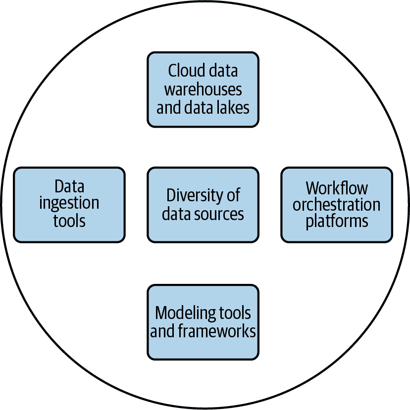
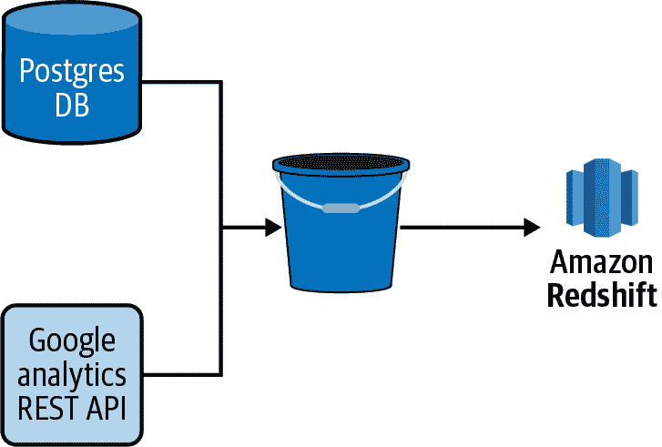
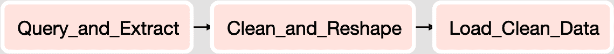

# 第二章：一个现代化的数据基础设施

在决定构建管道的产品和设计之前，了解构成现代数据堆栈的内容是很重要的。就像技术领域的大多数事物一样，设计您的分析生态系统或选择产品和供应商并没有单一正确的方法。但是，已经形成了一些行业标准和概念，这些标准为实施管道的最佳实践奠定了基础。

让我们来看看这种基础设施的关键组件，如图 2-1 所示。未来的章节将探讨每个组件如何影响数据管道的设计和实施。

# 数据源的多样性

大多数组织在进行分析工作时，有数十甚至数百个数据源。这些数据源在本节覆盖的多个维度上有所不同。

###### 图 2-1 一个现代化数据基础设施的关键组件。

## 源系统的所有权

对于分析团队而言，从组织构建并拥有的源系统以及从第三方工具和供应商那里摄入数据是很典型的。例如，电子商务公司可能会在其网站后台使用 PostgreSQL（也称为 Postgres）数据库存储购物车中的数据。他们还可能使用第三方网络分析工具，如 Google Analytics，来跟踪其网站的使用情况。这两种数据源的结合（如图 2-2 所示）是了解客户在购买前行为的完整理解所必需的。因此，从这两个源的数据摄入开始的数据管道，最终以分析此类行为告终。

###### 图 2-2 一个简单的管道示例，将多个来源的数据加载到 S3 存储桶，然后加载到 Redshift 数据库。

###### 注意

术语 *数据摄入* 指的是从一个源中提取数据并加载到另一个源的过程。

理解源系统的所有权对于多个原因非常重要。首先，对于第三方数据源，您可能会受到限制，不能访问所有数据或以您希望的方式访问数据。大多数供应商提供 REST API，但很少有供应商会直接以 SQL 数据库的形式向您提供数据访问权。甚至更少的供应商会允许您对可以访问的数据进行多少程度上的自定义或以何种粒度访问数据。

内部构建的系统为分析团队提供了更多定制可用数据和访问方法的机会。然而，它们也带来了其他挑战。这些系统是否考虑了数据摄入？通常答案是否定的，这会导致摄入将意外负载放在系统上，或者无法增量加载数据。如果你很幸运，拥有源系统的工程团队可能会有时间和愿意与你合作，但在资源限制的现实中，你可能会发现这与与外部供应商合作并没有太大不同。

## 数据摄入接口和数据结构

无论数据的所有者是谁，建立新的数据摄入时，数据工程师首先会检查如何获取数据以及以何种形式获取。首先，数据的接口是什么？一些最常见的包括以下几种：

+   应用程序背后的数据库，如 Postgres 或 MySQL 数据库

+   在系统顶部的一个抽象层，比如 REST API

+   诸如 Apache Kafka 的流处理平台

+   包含日志、逗号分隔值（CSV）文件和其他平面文件的共享网络文件系统或云存储桶

+   数据仓库或数据湖

+   HDFS 或 HBase 数据库中的数据

除了接口外，数据的结构会有所不同。以下是一些常见的例子：

+   来自 REST API 的 JSON

+   来自 MySQL 数据库的良好结构化数据

+   MySQL 数据库表的列内 JSON

+   半结构化日志数据

+   CSV、固定宽度格式（FWF）和其他平面文件格式

+   平面文件中的 JSON

+   从 Kafka 的流输出

每个接口和数据结构都有其自己的挑战和机遇。良好结构化的数据通常最容易处理，但通常是为了应用程序或网站的利益而结构化的。除了数据的摄入外，管道中进一步的步骤可能需要进行数据清理和转换，以便更适合分析项目的结构。

类似 JSON 的半结构化数据越来越普遍，并且具有属性-值对的结构和对象的嵌套的优势。然而，与关系数据库不同的是，同一数据集中的每个对象并不保证具有相同的结构。正如本书后文所述，如何处理数据管道中的缺失或不完整数据是依赖于上下文的，并且随着数据结构的刚性减少而变得越来越必要。

对于某些分析项目来说，非结构化数据很常见。例如，自然语言处理（NLP）模型需要大量的自由文本数据来训练和验证。计算机视觉（CV）项目需要图像和视频内容。即使是从网页上抓取数据这样较不艰难的项目，也需要来自网页的自由文本数据，以及网页的半结构化 HTML 标记。

## 数据量

尽管数据工程师和招聘经理都喜欢吹嘘拥有 PB 级数据集，但事实是大多数组织既重视小数据集也重视大数据集。此外，常见的是同时接收和建模小和大数据集。尽管在管道的每个步骤中的设计决策必须考虑数据量，但高容量并不意味着高价值。

尽管如此，大多数组织至少拥有一个对分析需求和高容量至关重要的数据集。什么是*高容量*？没有简单的定义，但就管道而言，最好是以一个光谱而非二元定义来思考*高-*和*低-*容量数据集。

###### 注意

正如你将在本书中看到的那样，在简化数据摄取和处理时存在过度简化的危险，结果是运行时间长且效率低下，当数据量或任务复杂性较低时，过度工程化管道任务也同样存在风险。

## 数据的清洁度和有效性

就像数据源具有很大的多样性一样，数据源的质量也存在很大的差异。正如老话所说：“垃圾进，垃圾出。”理解数据源的局限性和缺陷，并在管道的适当部分加以解决是非常重要的。

“混乱数据”的常见特征有许多，包括但不限于以下内容：

+   重复或模棱两可的记录

+   孤立记录

+   不完整或缺失的记录

+   文本编码错误

+   不一致的格式（例如，电话号码有或没有连字符）

+   错误标记或未标记的数据

当然，在源系统的上下文中，还有许多其他数据有效性问题。

保证数据清洁和有效性并非有灵丹妙药，但在现代数据生态系统中，我们会看到本书中的关键特征和方法：

假设最坏的情况，期待最好的结果

完美的数据集只存在于学术文献中。假设你的输入数据集将包含大量的有效性和一致性问题，但构建能够识别和清洗数据的管道以获取干净输出是非常重要的。

在最适合的系统中清洁和验证数据

有时最好等到管道的后期再清理数据。例如，现代管道倾向于采用提取-加载-转换（ELT）而不是提取-转换-加载（ETL）的方法进行数据仓库操作（详见第三章）。将数据以相对原始的形式加载到数据湖中，并在管道的后期担心结构化和清洗有时是最优选择。换句话说，用合适的工具做合适的工作，而不是匆忙进行清洗和验证过程。

经常验证

即使在流水线的早期阶段不清理数据，也不要等到流水线的最后阶段才验证数据。确定问题发生的位置会更加困难。反过来，也不要在流水线早期验证一次然后假设后续步骤都会顺利进行。第八章深入探讨了验证的问题。

## 源系统的延迟和带宽

需要频繁地从源系统中提取大量数据是现代数据堆栈中的常见用例。然而，这样做也带来了挑战。在流水线中进行数据提取步骤必须应对 API 速率限制、连接超时、下载缓慢以及源系统所有者因其系统负担而感到不满。

###### 注意

正如我在第四章和第五章中将详细讨论的那样，数据摄入是大多数数据管道中的第一步。因此，了解源系统及其数据的特性是设计管道并在下游基础设施方面做出决策的第一步。

# 云数据仓库和数据湖

过去 10 年间，有三件事情改变了分析和数据仓库领域的格局，这三件事情都与主要公共云服务提供商（亚马逊、谷歌和微软）的出现有关：

+   在云中构建和部署数据管道、数据湖、数据仓库以及分析处理变得更加简便。不再需要等待 IT 部门和预算批准大笔前期成本。托管服务，特别是数据库，已经成为主流。

+   云端存储成本持续下降。

+   出现了高度可扩展的列式数据库，比如 Amazon Redshift、Snowflake 和 Google Big Query。

这些变化为数据仓库注入了新的活力，并引入了数据湖的概念。尽管第五章详细介绍了数据仓库和数据湖，但现在简要定义两者，以便澄清它们在现代数据生态系统中的位置。

*数据仓库*是一个数据库，用于存储和建模来自不同系统的数据，以支持与之相关的分析和其他活动。数据仓库中的数据是结构化的，并且经过优化，用于报告和分析查询。

*数据湖*是数据存储的地方，但没有数据仓库的结构或查询优化。它可能包含大量数据以及各种数据类型。例如，单个数据湖可能包含存储为文本文件的博客文章集合，来自关系数据库的扁平文件提取，以及工业系统传感器生成的 JSON 对象事件。它甚至可以存储结构化数据，如标准数据库，尽管其未优化用于报告和分析查询。

在同一个数据生态系统中，数据仓库和数据湖都有各自的位置，数据管道经常在两者之间移动数据。

# 数据摄入工具

将数据从一个系统摄取到另一个系统的需求几乎是所有数据管道的共同需求。正如本章之前讨论的，数据团队必须处理各种各样的数据源。幸运的是，在现代数据基础设施中，有许多商业和开源工具可供选择。

在这本《便携参考指南》中，我讨论了一些最常见的工具和框架，包括：

+   Singer

+   Stitch

+   Fivetran

尽管这些工具普遍存在，一些团队决定编写自定义代码来进行数据摄取。有些甚至开发了他们自己的框架。组织机构选择这样做的原因各不相同，但通常与成本、构建文化胜过购买、以及对于信任外部供应商的法律和安全风险的担忧有关。在第五章中，我讨论了数据摄取工具独特的构建与购买权衡。特别感兴趣的是商业解决方案的价值是否在于让数据工程师更容易将数据摄取集成到他们的流水线中，还是在于让非数据工程师（如数据分析师）自行构建摄取过程。

正如第四章和第五章所述，数据摄取传统上包括 ETL 或 ELT 过程中的 *提取* 和 *加载* 步骤。一些工具专注于这些步骤，而另一些还提供一些 *转换* 能力给用户。在实际应用中，我发现大多数数据团队选择在数据摄取过程中限制转换数量，并且使用擅长于从源中提取数据并加载到目的地的摄取工具。

# 数据转换和建模工具

尽管本章的大部分内容集中在源和目的地之间移动数据（数据摄取）上，但数据管道和数据移动还包括更多内容。管道还包括转换和建模数据以实现新目的，如机器学习、分析和报告的任务。

*数据建模* 和 *数据转换* 这两个术语常常可以互换使用；然而，在本文中，我将对它们进行区分：

数据转换

转换数据是 ETL 或 ELT 过程中 *T* 的广义术语。转换可以是将表中存储的时间戳从一个时区转换到另一个时区这样简单的操作。它还可以是一个更复杂的操作，通过某些业务逻辑聚合和过滤多个源列，创建一个新的度量指标。

数据建模

数据建模是数据转换的一种更具体的类型。数据模型以数据分析理解和优化的格式结构化和定义数据。数据模型通常以一个或多个表的形式存在于数据仓库中。有关创建数据模型的过程，将在第六章中详细讨论。

与数据摄取类似，现代数据基础设施中存在许多方法和工具。如前所述，一些数据摄取工具提供一定程度的数据转换能力，但这些通常非常简单。例如，为了保护*个人身份信息*（PII），可能希望将电子邮件地址转换为哈希值，然后存储在最终目标中。这种转换通常在摄取过程中执行。

对于更复杂的数据转换和数据建模，我发现寻找专门设计用于此任务的工具和框架很有必要，例如 dbt（参见第九章）。此外，数据转换通常是上下文特定的，可以使用熟悉的数据工程师和数据分析师使用的语言编写，如 SQL 或 Python。

用于分析和报告的数据模型通常是通过 SQL 或通过点对点用户界面定义和编写的。就像构建与购买的权衡一样，在选择使用 SQL 还是*无代码*工具构建模型时，需要考虑一些因素。SQL 是一种非常易于访问的语言，对数据工程师和分析师都很常见。它使分析师能够直接处理数据，并优化模型设计以满足其需求。它几乎在每个组织中使用，因此为新员工加入团队提供了熟悉的入门点。在大多数情况下，选择支持使用 SQL 构建数据模型的转换框架比通过点对点用户界面更可取。您将获得更多的可定制性，并从头到尾拥有自己的开发过程。

第六章详细讨论了数据转换和建模。

# 工作流编排平台

随着组织中数据管道的复杂性和数量的增长，将*工作流编排平台*引入到您的数据基础设施中变得至关重要。这些平台管理管道中任务的调度和流动。想象一下一条管道，其中包括从 Python 编写的数据摄取到 SQL 编写的数据转换的十几个任务，必须在一天中特定的顺序中运行。安排和管理每个任务之间的依赖关系并不是一个简单的挑战。每个数据团队都面临这一挑战，但幸运的是，有许多工作流编排平台可用来减轻这种痛苦。

###### 注意

工作流编排平台也被称为*工作流管理系统*（WMSs）、*编排平台*或*编排框架*。在本文中，我将这些术语互换使用。

一些平台，如 Apache Airflow、Luigi 和 AWS Glue，设计用于更通用的用例，因此用于各种数据管道。另一些平台，如 Kubeflow Pipelines，则设计用于更具体的用例和平台（在 Kubeflow Pipelines 的情况下，是构建在 Docker 容器上的机器学习工作流）。

## 有向无环图

几乎所有现代编排框架将任务的流程和依赖关系表示为图形管道。然而，管道图具有一些特定的约束条件。

管道步骤始终是*有向的*，这意味着它们从一个一般任务或多个任务开始，并以一个特定的任务或任务结束。这是为了确保执行路径。换句话说，它确保任务在其所有依赖任务成功完成之前不会运行。

管道图还必须是*无环的*，这意味着任务不能指向之前已完成的任务。换句话说，它不能循环。如果可以的话，管道可能会无限运行！

在考虑这两个约束条件的基础上，编排管道生成称为有向无环图（DaGs）的图形。图 2-3 展示了一个简单的 DAG。在这个例子中，任务 A 必须在任务 B 和 C 开始之前完成。一旦它们都完成了，任务 D 就可以开始。一旦任务 D 完成，整个管道也完成了。

###### 图 2-3\. 一个有四个任务的 DAG。任务 A 完成后，任务 B 和任务 C 运行。当它们都完成后，任务 D 运行。

DAG 是一组任务的表示，并不是任务逻辑定义的位置。编排平台能够运行各种任务。

例如，考虑一个有三个任务的数据管道。在图 2-4 中表示为一个 DAG。

+   第一个执行一个 SQL 脚本，从关系型数据库中查询数据，并将结果存储在 CSV 文件中。

+   第二个运行一个 Python 脚本，加载 CSV 文件，清理数据，然后重塑数据后保存新版本的文件。

+   最后，第三个任务运行 SQL 中的 COPY 命令，将第二个任务创建的 CSV 加载到 Snowflake 数据仓库中。

###### 图 2-4\. 一个有三个任务的 DAG，按顺序从 SQL 数据库提取数据，使用 Python 脚本清理和重塑数据，然后将结果数据加载到数据仓库中。

编排平台执行每个任务，但任务的逻辑存在于 SQL 和 Python 代码中，在数据基础设施的不同系统上运行。

第七章更详细地讨论了工作流编排平台，并提供了 Apache Airflow 中管道编排的实际示例。

# 自定义数据基础设施

很少能找到两个完全相同数据基础设施的组织。大多数选择符合其特定需求的工具和供应商，并自行构建其余部分。尽管本书中详细介绍了一些最流行的工具和产品，但每年市场上还有更多新产品问世。

如前所述，根据您组织中的文化和资源情况，您可能会被鼓励大部分数据基础设施自行构建，或者依赖于 SaaS 供应商。无论您在构建与购买的权衡上倾向于哪一方，您都可以构建高质量的数据基础设施，这对于构建高质量的数据流水线至关重要。

重要的是理解你的约束条件（资金、工程资源、安全性和法律风险容忍度），以及由此产生的权衡。我在整个文本中都会谈及这些，并且指出在选择产品或工具时的关键决策点。
