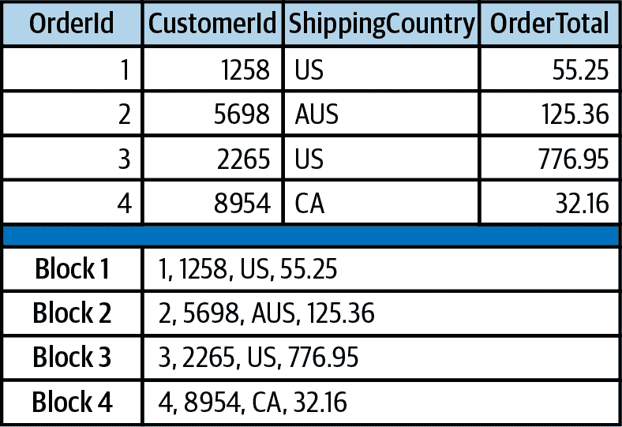
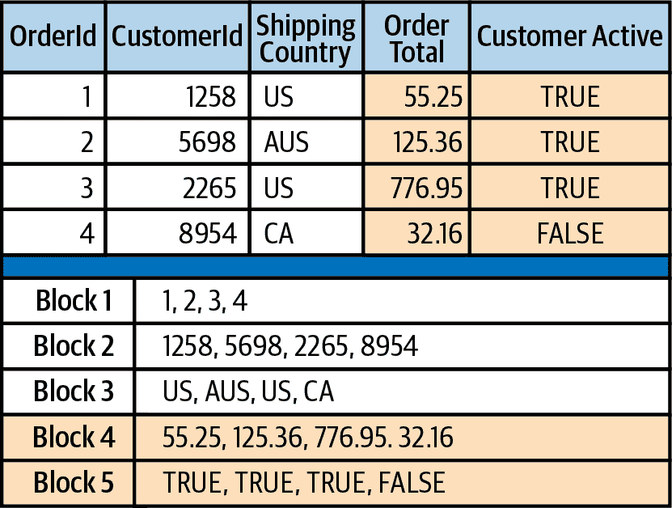
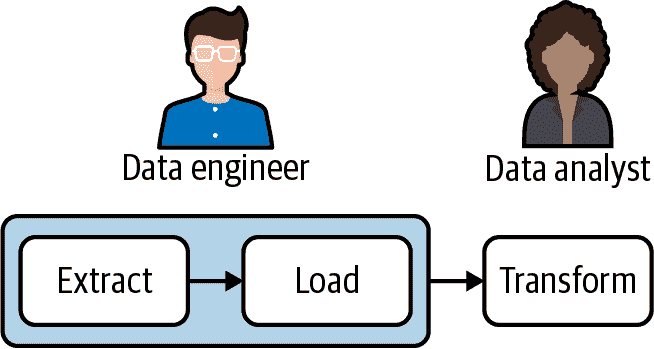

# 第三章：常见数据管道模式

即使对于经验丰富的数据工程师来说，设计新的数据管道每次都是一次新的旅程。正如在第二章中讨论的，不同的数据来源和基础设施既是挑战也是机遇。此外，管道的构建目标和约束也各不相同。数据是否需要几乎实时处理？可以每天更新吗？将其建模用于仪表盘还是作为机器学习模型的输入？

幸运的是，数据管道中存在一些常见模式已被证明成功，并且可以扩展到许多用例。在本章中，我将定义这些模式。后续章节将基于这些模式实现管道。

# ETL 和 ELT

或许没有比 ETL 及其现代化的姊妹 ELT 更为人熟知的模式了。这两者都是广泛用于数据仓库和商业智能的模式。近年来，它们还为运行在生产中的数据科学和机器学习模型的管道模式提供了灵感。它们如此著名，以至于许多人将这些术语与数据管道同义使用，而不是许多管道遵循的模式。

考虑到它们源自数据仓库，最容易在这个背景下描述它们，这也是本节所做的。本章后续部分将描述它们在特定用例中的使用方式。

这两种模式都是用于将数据输入数据仓库并使其对分析师和报告工具有用的数据处理方法。它们之间的区别在于其最后两个步骤（转换和加载）的顺序，但在选择它们之间的设计影响方面存在重大差异，正如我将在本章中详细解释的那样。首先，让我们探讨 ETL 和 ELT 的步骤。

*提取* 步骤从各种来源收集数据，为加载和转换做准备。第二章讨论了这些来源的多样性和提取方法。

*加载* 步骤将原始数据（在 ELT 的情况下）或完全转换后的数据（在 ETL 的情况下）带入最终目的地。无论哪种方式，最终结果都是将数据加载到数据仓库、数据湖或其他目的地中。

*转换* 步骤是从每个源系统的原始数据中合并和格式化数据，使其对分析师、可视化工具或管道服务的任何用例都有用。无论您将流程设计为 ETL 还是 ELT，此步骤都有很多内容，所有这些内容都将在第六章中详细探讨。

# ELT 的兴起超越了 ETL

几十年来，ETL 一直是数据管道模式的黄金标准。尽管现在仍在使用，但最近 ELT 已经成为首选模式。为什么呢？在现代云端主导的数据仓库之前（参见第 2 章），数据团队没有访问具备足够存储或计算能力的数据仓库，无法处理大量原始数据加载和转换成可用数据模型的需求。此外，当时的数据仓库是面向事务使用场景的行存储数据库，但对于分析中常见的大容量批量查询并不适用。因此，数据首先从源系统中提取出来，然后在另一个系统上进行转换，最后再加载到数据仓库中供分析师和可视化工具查询和模型化使用。

当今大多数数据仓库基于高度可扩展的列存储数据库构建，可以在成本效益高的情况下存储和运行大规模数据转换操作。得益于列存储数据库的 I/O 效率、数据压缩能力以及能够跨多个节点分发数据和查询的能力，情况已经发生了变化。现在更加适合专注于提取数据并加载到数据仓库，然后在那里执行必要的转换操作来完成数据管道。

行存储和列存储数据仓库之间的差异影响深远。图 3-1 展示了如何在行存储数据库（如 MySQL 或 Postgres）中将记录存储在磁盘上的示例。数据库的每一行都整体存储在磁盘上的一个或多个块中，具体取决于每条记录的大小。如果记录小于一个块或者无法整除块大小，则会导致一些磁盘空间未被使用。

###### 图 3-1\. 存储在行存储数据库中的表格。每个块包含表中的一条记录（行）。

考虑一个在线事务处理（OLTP）数据库用例，比如利用 MySQL 数据库存储的电子商务网站应用程序。Web 应用程序从 MySQL 数据库读取和写入数据，通常涉及每条记录中的多个值，比如订单确认页面上的订单详情。同时，可能仅查询或更新一个订单。因此，行存储是最优选择，因为应用程序所需的数据在磁盘上的靠近位置存储，并且每次查询的数据量较小。

由于记录在块中留下空间导致的磁盘空间利用不佳，在这种情况下是可以接受的平衡，因为频繁读写单个记录的速度是最重要的。然而，在分析中情况恰恰相反。我们通常不需要频繁读写少量数据，而是偶尔需要读写大量数据。此外，分析查询很少需要表中的许多列，而是一个具有许多列的表中的单个列。

例如，在我们虚构的电子商务应用程序中考虑订单表。除其他事项外，它包含订单金额以及正在发货的国家。与按顺序处理订单的 Web 应用程序不同，使用数据仓库的分析师将希望批量分析订单。此外，数据仓库中包含订单数据的表还包含来自我们的 MySQL 数据库中多个表的值的额外列。例如，它可能包含下订单的客户的信息。也许分析师想要总结所有由当前活跃账户的客户下的订单。这样的查询可能涉及数百万条记录，但仅需读取两列，OrderTotal 和 CustomerActive。毕竟，分析不是关于创建或更改数据（例如在 OLTP 中）而是关于推导指标和理解数据。

如图 Figure 3-2 所示，例如 Snowflake 或 Amazon Redshift 这样的列数据库，将数据按列而非按行存储在磁盘块中。在我们的使用案例中，分析师编写的查询只需访问存储 OrderTotal 和 CustomerActive 值的块，而不是存储像 MySQL 数据库那样基于行的记录的块。因此，需要访问的磁盘 I/O 较少，需要加载到内存中执行分析查询所需的筛选和求和操作的数据也较少。最终的好处是存储量减少，因为块可以充分利用并进行最佳压缩，因为每个块中存储的是相同的数据类型，而不是在单个基于行的记录中常见的多种类型。

总的来说，列式数据库的出现意味着在数据仓库中高效存储、转换和查询大型数据集。数据工程师可以利用这一优势，通过构建专门用于从数据仓库中提取和加载数据的流水线步骤，让分析师和数据科学家可以在数据库的限制范围内进行数据转换、建模和查询。因此，ELT 已成为数据仓库流水线以及机器学习和数据产品开发中其他用例的理想模式。

###### 图 3-2\. 存储在基于列的存储数据库中的表。每个磁盘块包含来自同一列的数据。我们示例查询涉及的两列已经突出显示。只有这些块需要访问才能运行查询。每个块包含相同类型的数据，使压缩效果最佳。

# EtLT 子模式

当 ELT 模式成为主流模式时，明确的是在加载之前执行一些转换仍然是有益的。但是，与涉及业务逻辑或数据建模的转换不同，这种类型的转换范围更有限。我将其称为*小写 t*转换，或*EtLT*。

符合 EtLT 子模式的转换类型的一些示例包括以下内容：

+   在表中去重记录

+   将 URL 参数解析为各个组件

+   掩盖或以其他方式混淆敏感数据

这些类型的转换要么完全与业务逻辑脱节，要么（例如，对敏感数据进行掩码）有时由于法律或安全原因需要尽早在管道中执行。此外，使用合适的工具完成合适的工作也有其价值。正如第四章和第五章详细说明的那样，如果准备充分，大多数现代数据仓库可以以最高效的方式加载数据。在处理大量数据或关键性能时延要求高的管道中，在提取和加载步骤之间执行一些基本的转换是值得的。

您可以假设剩余的 ELT 相关模式设计的目的是包含 EtLT 子模式。

# 用于数据分析的 ELT

对于为数据分析构建的管道来说，ELT 已经成为最常见且我认为是最优化的模式。正如前面讨论的那样，列存储数据库非常适合处理大量数据。它们还设计用于处理宽表，即具有许多列的表，这要归功于仅扫描磁盘上用于特定查询的列数据并将其加载到内存中的事实。

除了技术考虑因素外，数据分析员通常精通 SQL。使用 ELT 时，数据工程师可以专注于管道中的提取和加载步骤（数据摄取），而分析员可以利用 SQL 根据需要转换已被摄入的数据以供报告和分析。这种清晰的分离在 ETL 模式中是不可能的，因为数据工程师在整个管道中都是必需的。如图 3-3 所示，ELT 允许数据团队成员专注于各自的优势，减少了相互依赖和协调的需要。

此外，ELT 模式减少了在构建提取和加载过程时需要准确预测分析员将如何使用数据的必要性。虽然了解一般用例是提取和加载适当数据的要求，但是将转换步骤推迟到后面为分析员提供了更多选择和灵活性。

###### 图 3-3\. ELT 模式允许数据工程师和数据分析师（或数据科学家）在工具和语言上独立工作。

###### 注意

随着 ELT 的出现，数据分析师变得更加自主，并能够通过自己编写和部署作为 SQL 编写的转换代码，从数据中提取价值而不被数据工程师“阻塞”。数据工程师可以专注于数据引入和支持基础设施。随着这种赋权，出现了新的工作职称，如*分析工程师*。第六章 讨论了这些数据分析师和分析工程师如何转换数据以构建数据模型。

# 数据科学的 ELT

为数据科学团队构建的数据管道与数据仓库中为数据分析构建的管道类似。与分析用例类似，数据工程师专注于将数据引入数据仓库或数据湖。然而，数据科学家对数据的需求与数据分析师不同。

尽管数据科学是一个广泛的领域，但总体来说，数据科学家需要比数据分析师更详细和有时更原始的数据访问。虽然数据分析师建立的数据模型能生成指标并支持仪表板，数据科学家则花费大部分时间探索数据和构建预测模型。虽然本书不涵盖数据科学家的具体角色细节，但这种高层次的区别对于为数据科学家设计流水线是重要的。

如果你正在构建管道以支持数据科学家，你会发现 ELT 模式中的提取和加载步骤与支持分析的步骤基本相同。第四章 和 5 章 详细介绍了这些技术步骤。数据科学家在 ELT 管道的转换步骤中也可能受益于与分析师构建的某些数据模型一起工作（第六章），但他们可能会分支出去，并使用在提取加载过程中获取的大部分数据。

# 数据产品和机器学习的 ELT

数据不仅用于分析、报告和预测模型，还用于支持*数据产品*。一些常见的数据产品示例包括以下内容：

+   驱动视频流首页的内容推荐引擎

+   电子商务网站上的个性化搜索引擎

+   一个应用程序，对用户生成的餐厅评论进行情感分析

这些数据产品中的每一个可能都由一个或多个机器学习（ML）模型驱动，这些模型需要训练和验证数据。这些数据可能来自各种源系统，并经过一定程度的转换以准备用于模型。类似 ELT 的模式非常适合这些需求，尽管面向数据产品设计的管道的所有步骤都存在一些具体的挑战。

## 机器学习流水线中的步骤

像本书主要专注的分析管道一样，构建用于机器学习的管道也遵循与 ELT 类似的模式，至少在管道的开始阶段是如此。不同之处在于，转换步骤不再专注于将数据转换为数据模型，而是一旦数据被提取并加载到数据仓库或数据湖中，就涉及到多个步骤来构建和更新机器学习模型。

如果您熟悉机器学习开发，这些步骤可能看起来也很熟悉：

数据摄入

这一步骤遵循我在第四章和 5 章中概述的相同过程。尽管您输入的数据可能不同，但对于分析和机器学习构建的管道，逻辑基本保持一致，但对于机器学习管道还有一个额外考虑的因素。即，确保您输入的数据以可以供后续机器学习模型引用的特定数据集版本化。有多种工具和方法可以对数据集进行版本管理。建议参考 “ML 管道进一步阅读” 以了解更多信息。

数据预处理

摄入的数据不太可能直接用于机器学习开发。预处理是数据清理和为模型准备数据的过程。例如，在管道中，这是文本标记化、特征转换为数值以及输入值归一化的步骤。

模型训练

在新数据被摄入和预处理后，机器学习模型需要重新训练。

模型部署

将模型部署到生产环境可能是从以研究为导向的机器学习到真正数据产品的最具挑战性的部分。在这里，不仅需要对数据集进行版本控制，还需要对训练过的模型进行版本控制。通常情况下，会使用 REST API 来允许查询已部署模型，并将用于各个模型版本的 API 端点。这是一个需要跟踪和协调数据科学家、机器学习工程师和数据工程师共同努力达到生产状态的过程。一个设计良好的管道是将这一切粘合在一起的关键。

## 在管道中整合反馈

任何优秀的机器学习管道还将包括收集反馈以改进模型的步骤。以视频流服务的内容推荐模型为例。为了在未来衡量和改进模型，您需要跟踪其推荐给用户的内容、用户点击的推荐以及点击后他们享受的推荐内容。为此，您需要与负责在流服务主屏上使用模型的开发团队合作。他们需要实施一些类型的事件收集，以跟踪每个用户推荐的推荐内容，推荐时使用的模型版本，以及点击后的行为，并将点击行为与他们可能已经收集的有关用户内容消费的数据联系起来。

所有这些信息都可以被摄入到数据仓库中，并被纳入到未来模型的版本中，可以作为训练数据，也可以被数据科学家（也许是数据科学家）分析和考虑，以便将来纳入到模型或实验中。

此外，收集到的数据可以被数据分析师在本书中描述的 ELT 模式中摄入、转换和分析。分析师通常被委托测量模型的有效性，并构建仪表板来显示组织的模型关键指标。利益相关者可以使用这些仪表板来理解各种模型对业务和客户的效果如何。

## 有关 ML 流水线的进一步阅读

为机器学习模型构建流水线是一个强大的主题。根据您的基础设施选择和 ML 环境的复杂性，我建议您阅读以下几本书进行进一步学习：

+   *构建机器学习流水线* by Hannes Hapke 和 Catherine Nelson (O’Reilly, 2020)

+   *使用 Scikit-Learn、Keras 和 TensorFlow 进行机器学习*，第二版，作者 Aurélien Géron (O’Reilly, 2019)

此外，以下书籍是一个极其易于理解的机器学习入门：

+   *Python 机器学习入门* by Andreas C. Müller 和 Sarah Guido (O’Reilly, 2016)
