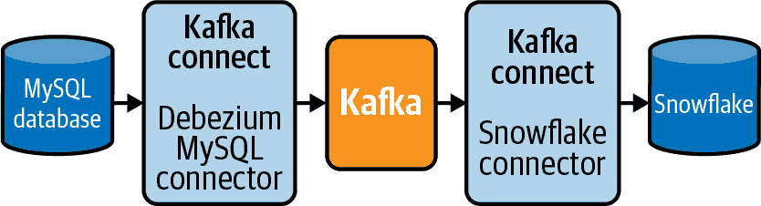

# 第四章：数据摄取：提取数据

正如第三章中讨论的那样，ELT 模式是为数据分析、数据科学和数据产品构建的数据流水线的理想设计。ELT 模式的前两个步骤，提取和加载，通常被称为*数据摄取*。本章讨论了为这两个步骤设置开发环境和基础设施的具体步骤，并详细介绍了从各种源系统提取数据的细节。第五章讨论了将结果数据集加载到数据仓库中。

###### 注意

本章的提取和加载代码示例完全解耦。协调这两个步骤以完成数据摄取是第七章讨论的主题。

正如第二章中讨论的那样，有许多类型的源系统可以提取数据，以及许多目的地可以加载数据。此外，数据以多种形式呈现，每种形式都对其摄取提出了不同的挑战。

本章和下一章包括了从常见系统中导出和摄取数据的代码示例。这些代码简化了高度，仅包含了最小的错误处理。每个示例都旨在作为数据摄取的易于理解的起点，但完全功能且可扩展到更可伸缩的解决方案。

###### 注意

本章的代码示例将提取的数据写入 CSV 文件，以加载到目标数据仓库中。在某些情况下，将提取的数据存储为其他格式（如 JSON）可能更合理。在适用的情况下，我会指出您可能考虑进行这样的调整。

第五章还讨论了一些您可以构建的开源框架，以及为数据工程师和分析师提供“低代码”选项的商业替代方案，用于摄取数据。

# 设置您的 Python 环境

所有后续的代码示例都是用 Python 和 SQL 编写的，并使用今天数据工程领域常见的开源框架。为简单起见，源和目的地的数量有限。但在适用的情况下，我提供了如何修改为类似系统的说明。

要运行示例代码，您需要运行 Python 3.x 的物理或虚拟机。您还需要安装和导入一些库。

如果您的计算机上没有安装 Python，可以直接从[官网](https://oreil.ly/ytH4s)获取适合您操作系统的分发版和安装程序。

###### 注意

以下命令适用于 Linux 或 Macintosh 命令行。在 Windows 上，您可能需要将 Python 3 可执行文件添加到您的 PATH 中。

在安装本章使用的库之前，最好创建一个 *虚拟环境* 来安装它们。为此，你可以使用一个名为 `virtualenv` 的工具。`virtualenv` 有助于管理不同项目和应用程序的 Python 库。它允许你在特定于你的项目的范围内安装 Python 库，而不是全局安装。首先，创建一个名为 *env* 的虚拟环境。

```
$ python -m venv env
```

现在你已经创建了虚拟环境，请使用以下命令激活它：

```
$ source env/bin/activate
```

你可以通过两种方式验证你的虚拟环境是否已激活。首先，你会注意到你的命令提示符现在前缀为环境名称：

```
(env) $
```

你还可以使用 `which python` 命令验证 Python 查找库的位置。你应该会看到类似于这样的输出，显示了虚拟环境目录的路径：

```
(env) $ which python
env/bin/python
```

现在安全地安装接下来代码示例需要的库。

###### 注意

在某些操作系统（OS）上，你必须使用`python3`而不是`python`来运行 Python 3.x 可执行文件。较旧的 OS 版本可能默认使用 Python 2.x。你可以通过输入`python --version`来查看你的操作系统使用的 Python 版本。

在本章中，你将使用 `pip` 来安装代码示例中使用的库。[`pip`](https://pypi.org/project/pip) 是大多数 Python 发行版附带的工具。

第一个你将使用 `pip` 安装的库是 `configparser`，它将用于读取稍后添加到文件中的配置信息。

```
(env) $ pip install configparser
```

接下来，在接下来的几节中创建的 Python 脚本所在的同一目录中创建一个名为 *pipeline.conf* 的文件。现在先保持文件为空。本章的代码示例将需要向其中添加内容。在 Linux 和 Mac 操作系统中，你可以使用以下命令在命令行中创建空文件：

```
(env) $ touch pipeline.conf
```

# 设置云文件存储

在本章的每个示例中，你将使用一个名为亚马逊简单存储服务（Amazon Simple Storage Service，简称 S3）的存储桶来进行文件存储。S3 托管在 AWS 上，正如其名称所示，S3 是一种简单的存储和访问文件的方式。它还非常经济高效。截至本文撰写时，AWS 提供新 AWS 账户的首个 12 个月免费 5 GB 的 S3 存储，并在此后的标准 S3 存储类型中每个千兆字节不到 3 美分的费用。考虑到本章示例的简单性，如果你在创建 AWS 账户的前 12 个月内，你可以免费在 S3 中存储所需数据；或者在此后每月不到 1 美元的费用下进行存储。

要运行本章中的示例，您将需要一个 S3 存储桶。幸运的是，创建 S3 存储桶很简单，最新的说明可以在[AWS 文档](https://oreil.ly/7W9ZD)中找到。设置适当的访问控制以访问 S3 存储桶取决于您使用的数据仓库。通常情况下，最好使用 AWS 身份和访问管理（IAM）角色进行访问管理策略。有关为 Amazon Redshift 和 Snowflake 数据仓库设置此类访问的详细说明将在接下来的章节中提供，但现在请按照指示创建一个新的存储桶。可以使用默认设置来命名它，包括保持存储桶私有。

每个抽取示例从给定的源系统中提取数据，并将输出存储在 S3 存储桶中。第五章中的每个加载示例将数据从 S3 存储桶加载到目标中。这是数据管道中的常见模式。每个主要的公共云提供商都有类似 S3 的服务。其他公共云上的等价服务包括 Microsoft Azure 中的 Azure 存储和 GCP 中的 Google Cloud Storage（GCS）。

还可以修改每个示例以使用本地或本地存储。但是，需要额外的工作来从特定云提供商以外的存储加载数据到您的数据仓库中。无论您使用哪个云提供商，或者选择在本地托管您的数据基础设施，本章描述的模式都是有效的。

在我继续每个示例之前，还有一个 Python 库，您需要安装它，以便您的抽取和加载脚本可以与您的 S3 存储桶进行交互。Boto3 是 AWS 的 Python SDK。确保您在前一节中设置的虚拟环境处于活动状态，并使用`pip`安装它：

```
(env) $ pip install boto3
```

在接下来的示例中，您将被要求像这样将`boto3`导入到您的 Python 脚本中：

```
import boto3
```

因为您将使用`boto3` Python 库与您的 S3 存储桶进行交互，所以您还需要创建一个 IAM 用户，为该用户生成访问密钥，并将密钥存储在配置文件中，以便您的 Python 脚本可以读取。这些都是必需的，以便您的脚本具有权限在您的 S3 存储桶中读取和写入文件。

首先，创建 IAM 用户：

1.  在 AWS 控制台的服务菜单（或顶部导航栏）下，导航至 IAM。

1.  在导航窗格中，点击“用户”，然后点击“添加用户”。键入新用户的用户名。在本例中，将用户命名为*data_pipeline_readwrite*。

1.  为此 IAM 用户选择访问类型。选择“程序化访问”，因为此用户不需要登录到 AWS 控制台，而是通过 Python 脚本以编程方式访问 AWS 资源。

1.  点击“下一步：权限”。

1.  在“设置权限”页面上，点击“直接为用户附加现有策略”选项。添加 AmazonS3FullAccess 策略。

1.  点击“下一步：标签”。在 AWS 中，向各种对象和服务添加标签以便稍后查找是最佳实践。但这是可选的。

1.  点击“下一步：审阅”以验证您的设置。如果一切正常，请点击“创建用户”。

1.  您需要保存新 IAM 用户的访问密钥 ID 和秘密访问密钥。为此，请单击“下载 .csv” 然后将文件保存到安全位置，以便稍后使用。

最后，在 *pipeline.conf* 文件中添加一个名为 `[aws_boto_credentials]` 的部分，以存储 IAM 用户和 S3 存储桶信息的凭证。您可以在登录 AWS 网站后点击右上角的帐户名找到您的 AWS 帐户 ID。将您之前创建的 S3 存储桶的名称用作 `bucket_name` 的值。*pipeline.conf* 文件中的新部分将如下所示：

```
[aws_boto_credentials]
access_key = ijfiojr54rg8er8erg8erg8
secret_key = 5r4f84er4ghrg484eg84re84ger84
bucket_name = pipeline-bucket
account_id = 4515465518
```

# 从 MySQL 数据库提取数据

从 MySQL 数据库提取数据可以通过两种方式完成：

+   使用 SQL 进行全量或增量提取

+   二进制日志（binlog）复制

使用 SQL 进行全量或增量提取较为简单，但对于数据变化频繁的大型数据集来说，可扩展性较差。全量和增量提取之间也存在一些权衡，我将在下一节中讨论。

虽然二进制日志复制实现起来更复杂，但更适合源表数据变更量大或需要更频繁地从 MySQL 源中摄取数据的情况。

###### 注意

二进制日志复制也是创建*流式数据摄入*的一种方式。有关这两种方法之间以及实现模式的区别，请参阅本章的“批处理与流摄入”部分。

本节内容适用于那些需要从 MySQL 数据源中提取数据的读者。但是，如果您想设置一个简单的数据库以便尝试代码示例，您有两个选择。首先，您可以免费在本地机器或虚拟机上安装 MySQL。您可以在[MySQL 下载页面](https://oreil.ly/p2-L1)找到适用于您操作系统的安装程序。

或者，您可以在[AWS](https://oreil.ly/XahtN)中创建一个完全托管的 Amazon RDS for MySQL 实例。我发现这种方法更加直观，而且不会在本地机器上创建不必要的混乱！

###### 警告

当您按照[链接指南](https://oreil.ly/CiVgC)设置 MySQL RDS 数据库实例时，您将被提示将数据库设置为公共访问。这对于学习和处理示例数据非常合适。事实上，这样做可以更轻松地从您运行本节示例的任何计算机连接。但是，在生产环境中为了更强大的安全性，建议遵循[Amazon RDS 安全最佳实践](https://oreil.ly/8DYsz)。

请注意，就像前面提到的 S3 定价一样，如果您不再符合 AWS 的免费套餐条件，这将产生费用。否则，设置和运行是免费的！只需记得在完成时删除您的 RDS 实例，以免忘记并在免费套餐过期时产生费用。

本节中的代码示例非常简单，并参考了 MySQL 数据库中名为`Orders`的表。一旦有了 MySQL 实例可以使用，你可以通过运行以下 SQL 命令创建表并插入一些示例行：

```
CREATE TABLE Orders (
  OrderId int,
  OrderStatus varchar(30),
  LastUpdated timestamp
);

INSERT INTO Orders
  VALUES(1,'Backordered', '2020-06-01 12:00:00');
INSERT INTO Orders
  VALUES(1,'Shipped', '2020-06-09 12:00:25');
INSERT INTO Orders
  VALUES(2,'Shipped', '2020-07-11 3:05:00');
INSERT INTO Orders
  VALUES(1,'Shipped', '2020-06-09 11:50:00');
INSERT INTO Orders
  VALUES(3,'Shipped', '2020-07-12 12:00:00');
```

## MySQL 表的全量或增量抽取

当你需要将 MySQL 表中的所有或部分列导入到数据仓库或数据湖中时，可以使用全量抽取或增量抽取。

在*全量抽取*中，每次运行抽取作业时都会提取表中的每条记录。这是最简单的方法之一，但对于高容量的表来说，运行时间可能会很长。例如，如果你想对名为`Orders`的表进行全量抽取，在源 MySQL 数据库上执行的 SQL 如下所示：

```
SELECT *
FROM Orders;
```

在*增量抽取*中，只提取源表中自上次作业运行以来发生更改或新增的记录。上次抽取的时间戳可以存储在数据仓库中的抽取作业日志表中，或者通过查询仓库中目标表中`LastUpdated`列的最大时间戳来检索。以虚构的`Orders`表为例，执行在源 MySQL 数据库上执行的 SQL 查询如下所示：

```
SELECT *
FROM Orders
WHERE LastUpdated > {{ last_extraction_run} };
```

###### 注意

对于包含*不可变数据*（即可以插入但不能更新记录的数据），可以使用记录创建时间戳而不是`LastUpdated`列。

`{{ last_extraction_run }}`变量是表示最近一次抽取作业运行的时间戳。通常情况下，它是从数据仓库中的目标表中查询的。在这种情况下，将在数据仓库中执行以下 SQL，并使用结果值作为`{{ last_extraction_run }}`使用：

```
SELECT MAX(LastUpdated)
FROM warehouse.Orders;
```

尽管增量抽取对于性能优化是理想的，但也存在一些缺点和可能使得某个表无法使用的原因。

首先，使用此方法删除时，不会捕获行。如果从源 MySQL 表中删除行，则不会知道，并且它将保留在目标表中，就像没有发生任何更改一样。

第二，源表必须具有可靠的时间戳来标记其上次更新的时间（如前面示例中的`LastUpdated`列）。源系统表中缺少这样的列或者列的更新不可靠并不少见。开发人员可以随意更新源表中的记录，而忘记更新`LastUpdated`时间戳。

然而，增量抽取确实使捕捉更新行变得更容易。在即将出现的代码示例中，如果`Orders`表中的特定行被更新，那么无论是全量还是增量抽取都将带回行的最新版本。在全量抽取中，这对表中的所有行都适用，因为抽取会检索表的完整副本。在增量抽取中，只检索已更改的行。

当进行加载步骤时，通常通过首先截断目标表并加载新抽取的数据来加载全量抽取数据。在这种情况下，您将仅在数据仓库中留下行的最新版本。

从增量抽取加载数据时，结果数据将追加到目标表中的数据中。在这种情况下，你将同时拥有原始记录和更新后的版本。当进行数据转换和分析时，同时拥有这两者可能非常有价值，正如我在第六章中讨论的那样。

例如，表 4-1 显示了 MySQL 数据库中订单 ID 为 1 的原始记录。当客户下订单时，订单处于缺货后补状态。表 4-2 显示了 MySQL 数据库中的更新记录。如您所见，该订单已更新，因为在 2020-06-09 发货。

表 4-1\. 订单 ID 1 的原始状态

| 订单 ID | 订单状态 | 最后更新时间 |
| --- | --- | --- |
| 1 | 缺货后补 | 2020-06-01 12:00:00 |

表 4-2\. 订单 ID 1 的更新状态

| 订单 ID | 订单状态 | 最后更新时间 |
| --- | --- | --- |
| 1 | 已发货 | 2020-06-09 12:00:25 |

当运行全量抽取时，数据仓库中的目标表首先被截断，然后加载抽取的输出数据。`订单 ID`为 1 的结果是只显示在表 4-2 中的单个记录。然而，在增量抽取中，抽取的输出数据简单地追加到数据仓库的目标表中。结果是，订单 ID 为 1 的原始和更新记录都在数据仓库中，如表 4-3 所示。

表 4-3\. 数据仓库中订单 ID 1 的所有版本

| 订单 ID | 订单状态 | 最后更新时间 |
| --- | --- | --- |
| 1 | 缺货后补 | 2020-06-01 12:00:00 |
| 1 | 已发货 | 2020-06-09 12:00:25 |

您可以在第五章的相关部分了解更多关于加载全量和增量抽取的信息，包括“将数据加载到 Redshift 数据仓库”。

###### 警告

永远不要假设源系统中的`LastUpdated`列会被可靠地更新。在依赖它进行增量抽取之前，请与源系统的所有者确认。

可以使用在数据库上执行的 SQL 查询实现 MySQL 数据库的完整和增量提取，但由 Python 脚本触发。除了在前几节安装的 Python 库外，您还需要使用`pip`安装`PyMySQL`库：

```
(env) $ pip install pymysql
```

您还需要向*pipeline.conf*文件添加新的部分，以存储 MySQL 数据库的连接信息：

```
[mysql_config]
hostname = my_host.com
port = 3306
username = my_user_name
password = my_password
database = db_name
```

现在创建一个名为*extract_mysql_full.py*的新 Python 脚本。您需要导入几个库，例如连接到 MySQL 数据库的`pymysql`，以及`csv`库，这样您可以在摄入过程的加载步骤中结构化并写出提取的数据为易于导入数据仓库的平面文件。还导入`boto3`，这样您可以将生成的 CSV 文件上传到您的 S3 桶，以便稍后加载到数据仓库：

```
import pymysql
import csv
import boto3
import configparser
```

现在你可以初始化到 MySQL 数据库的连接：

```
parser = configparser.ConfigParser()
parser.read("pipeline.conf")
hostname = parser.get("mysql_config", "hostname")
port = parser.get("mysql_config", "port")
username = parser.get("mysql_config", "username")
dbname = parser.get("mysql_config", "database")
password = parser.get("mysql_config", "password")

conn = pymysql.connect(host=hostname,
        user=username,
        password=password,
        db=dbname,
        port=int(port))

if conn is None:
  print("Error connecting to the MySQL database")
else:
  print("MySQL connection established!")
```

从之前的示例中完全提取`Orders`表。以下代码将提取整个表的内容并将其写入管道分隔的 CSV 文件中。为执行提取操作，它使用`pymysql`库中的`cursor`对象执行 SELECT 查询：

```
m_query = "SELECT * FROM Orders;"
local_filename = "order_extract.csv"

m_cursor = conn.cursor()
m_cursor.execute(m_query)
results = m_cursor.fetchall()

with open(local_filename, 'w') as fp:
  csv_w = csv.writer(fp, delimiter='|')
  csv_w.writerows(results)

fp.close()
m_cursor.close()
conn.close()
```

现在 CSV 文件已在本地编写，需要将其上传到 S3 桶中，以便稍后加载到数据仓库或其他目的地。从“设置云文件存储”中回忆，您已设置了 IAM 用户供 Boto3 库使用，以对 S3 桶进行身份验证。您还将凭证存储在*pipeline.conf*文件的`aws_boto_credentials`部分。以下是将 CSV 文件上传到您的 S3 桶的代码：

```
# load the aws_boto_credentials values
parser = configparser.ConfigParser()
parser.read("pipeline.conf")
access_key = parser.get("aws_boto_credentials", "access_key")
secret_key = parser.get("aws_boto_credentials", "secret_key")
bucket_name = parser.get("aws_boto_credentials", "bucket_name")

s3 = boto3.client('s3', aws_access_key_id=access_key, aws_secret_access_key=secret_key)

s3_file = local_filename

s3.upload_file(local_filename, bucket_name, s3_file)
```

你可以按照以下步骤执行脚本：

```
(env) $ python extract_mysql_full.py
```

当执行脚本时，`Orders`表的整个内容现在包含在等待加载到数据仓库或其他数据存储中的 S3 桶中的 CSV 文件中。有关加载到所选数据存储的更多信息，请参见第五章。

如果要增量提取数据，您需要对脚本进行一些更改。建议将*extract_mysql_full.py*的副本命名为*extract_mysql_incremental.py*作为起点。

首先，查找从源`Orders`表中提取的最后记录的时间戳。为此，请查询数据仓库中`Orders`表的`MAX(LastUpdated)`值。在本示例中，我将使用 Redshift 数据仓库（参见“配置亚马逊 Redshift 仓库作为目标”），但您也可以使用您选择的仓库。

要与您的 Redshift 集群交互，请安装`psycopg2`库（如果尚未安装）。

```
(env) $ pip install psycopg2
```

这里是连接并从 Redshift 集群查询`Orders`表中的`MAX(LastUpdated)`值的代码：

```
import psycopg2

# get db Redshift connection info
parser = configparser.ConfigParser()
parser.read("pipeline.conf")
dbname = parser.get("aws_creds", "database")
user = parser.get("aws_creds", "username")
password = parser.get("aws_creds", "password")
host = parser.get("aws_creds", "host")
port = parser.get("aws_creds", "port")

# connect to the redshift cluster
rs_conn = psycopg2.connect(
    "dbname=" + dbname
    + " user=" + user
    + " password=" + password
    + " host=" + host
    + " port=" + port)

rs_sql = """SELECT COALESCE(MAX(LastUpdated),
 '1900-01-01')
 FROM Orders;"""
rs_cursor = rs_conn.cursor()
rs_cursor.execute(rs_sql)
result = rs_cursor.fetchone()

# there's only one row and column returned
last_updated_warehouse = result[0]

rs_cursor.close()
rs_conn.commit()
```

使用存储在 `last_updated_warehouse` 中的值，修改在 MySQL 数据库上运行的抽取查询，仅拉取自上次运行抽取作业以来已更新的 `Orders` 表记录。新查询包含一个占位符 `%s`，用于 `last_updated_warehouse` 值。然后将该值作为元组传递给游标的 `.execute()` 函数（一种用于存储数据集合的数据类型）。这是向 SQL 查询添加参数的正确和安全方式，以避免可能的 SQL 注入。以下是在 MySQL 数据库上运行 SQL 查询的更新代码块：

```
m_query = """SELECT *
 FROM Orders
 WHERE LastUpdated > %s;"""
local_filename = "order_extract.csv"

m_cursor = conn.cursor()
m_cursor.execute(m_query, (last_updated_warehouse,))
```

用于增量抽取的整个 *extract_mysql_incremental.py* 脚本（使用 Redshift 集群作为 `last_updated` 值）如下所示：

```
import pymysql
import csv
import boto3
import configparser
import psycopg2

# get db Redshift connection info
parser = configparser.ConfigParser()
parser.read("pipeline.conf")
dbname = parser.get("aws_creds", "database")
user = parser.get("aws_creds", "username")
password = parser.get("aws_creds", "password")
host = parser.get("aws_creds", "host")
port = parser.get("aws_creds", "port")

# connect to the redshift cluster
rs_conn = psycopg2.connect(
    "dbname=" + dbname
    + " user=" + user
    + " password=" + password
    + " host=" + host
    + " port=" + port)

rs_sql = """SELECT COALESCE(MAX(LastUpdated),
 '1900-01-01')
 FROM Orders;"""
rs_cursor = rs_conn.cursor()
rs_cursor.execute(rs_sql)
result = rs_cursor.fetchone()

# there's only one row and column returned
last_updated_warehouse = result[0]

rs_cursor.close()
rs_conn.commit()

# get the MySQL connection info and connect
parser = configparser.ConfigParser()
parser.read("pipeline.conf")
hostname = parser.get("mysql_config", "hostname")
port = parser.get("mysql_config", "port")
username = parser.get("mysql_config", "username")
dbname = parser.get("mysql_config", "database")
password = parser.get("mysql_config", "password")

conn = pymysql.connect(host=hostname,
        user=username,
        password=password,
        db=dbname,
        port=int(port))

if conn is None:
  print("Error connecting to the MySQL database")
else:
  print("MySQL connection established!")

m_query = """SELECT *
 FROM Orders
 WHERE LastUpdated > %s;"""
local_filename = "order_extract.csv"

m_cursor = conn.cursor()
m_cursor.execute(m_query, (last_updated_warehouse,))
results = m_cursor.fetchall()

with open(local_filename, 'w') as fp:
  csv_w = csv.writer(fp, delimiter='|')
  csv_w.writerows(results)

fp.close()
m_cursor.close()
conn.close()

# load the aws_boto_credentials values
parser = configparser.ConfigParser()
parser.read("pipeline.conf")
access_key = parser.get(
    "aws_boto_credentials",
    "access_key")
secret_key = parser.get(
    "aws_boto_credentials",
    "secret_key")
bucket_name = parser.get(
    "aws_boto_credentials",
    "bucket_name")

s3 = boto3.client(
    's3',
    aws_access_key_id=access_key,
    aws_secret_access_key=secret_key)

s3_file = local_filename

s3.upload_file(
    local_filename,
    bucket_name,
    s3_file)
```

###### 警告

要注意大型的抽取作业，无论是完整的还是增量的，可能会给源 MySQL 数据库造成压力，甚至会阻塞生产查询的执行。请与数据库所有者咨询，并考虑设置一个副本用于抽取，而不是直接从主源数据库抽取。

## MySQL 数据的二进制日志复制

虽然实施起来更复杂，但使用 MySQL 数据库的 MySQL binlog 内容复制变更在高容量摄入需求的情况下效率高。

###### 注意

Binlog 复制是一种变更数据捕获（CDC）形式。许多源数据存储都有一些 CDC 形式，可以用来使用。

MySQL binlog 是一个日志，记录数据库中执行的每个操作。例如，根据其配置方式，它将记录每个表的创建或修改的具体信息，以及每个 `INSERT`、`UPDATE` 和 `DELETE` 操作。尽管最初是用于将数据复制到其他 MySQL 实例，但很容易理解为什么数据工程师对 binlog 的内容如此感兴趣，希望将数据摄入数据仓库中。

因为您的数据仓库可能不是 MySQL 数据库，所以不能简单地使用内置的 MySQL 复制功能。为了利用 binlog 将数据摄入到非 MySQL 源中，需要采取一些步骤：

1.  启用并配置 MySQL 服务器上的 binlog。

1.  运行初始的完整表抽取和加载。

1.  持续从二进制日志中进行抽取。

1.  将二进制日志的抽取内容翻译并加载到数据仓库中。

###### 注意

第三步没有详细讨论，但要使用 binlog 进行摄入，您必须首先使用当前 MySQL 数据库的内容填充数据仓库中的表，然后使用 binlog 摄入后续的变更。通常需要对要抽取的表进行 `LOCK`，运行这些表的 `mysqldump`，然后将 `mysqldump` 的结果加载到数据仓库中，然后再打开 binlog 摄入。

虽然最好参考最新的 MySQL [binlog 文档](https://oreil.ly/2Vdyf) 获取有关启用和配置二进制日志的指导，我将介绍关键的配置值。

在 MySQL 数据库中，关于 binlog 配置，有两个关键设置需要确保。

首先，请确保启用了二进制日志。通常情况下，默认情况下启用了它，但是您可以通过在数据库上运行以下 SQL 查询来检查（确切的语法可能因 MySQL 分发而异）：

```
SELECT variable_value as bin_log_status
FROM performance_schema.global_variables
WHERE variable_name='log_bin';
```

如果启用了二进制日志，您将看到以下内容。如果返回的状态是`OFF`，则需要查阅相关版本的 MySQL 文档以启用它。

```
+ — — — — — — — — — — — — — — — — — — -+
| bin_log_status :: |
+ — — — — — — — — — — — — — — — — — — -+
| ON |
+ — — — — — — — — — — — — — — — — — — -+
1 row in set (0.00 sec)
```

接下来，请确保二进制日志格式设置正确。在最近版本的 MySQL 中支持三种格式：

+   `STATEMENT`

+   `ROW`

+   `MIXED`

`STATEMENT` 格式记录了将 SQL 语句插入或修改行的每个 SQL 语句到 binlog 中。如果您想要从一个 MySQL 数据库复制数据到另一个，这种格式是有用的。为了复制数据，您可以运行所有语句以重现数据库的状态。但是，由于提取的数据可能用于运行在不同平台上的数据仓库，MySQL 数据库中生成的 SQL 语句可能与您的数据仓库不兼容。

使用`ROW`格式，表中每行的每个更改都表示为 binlog 的一行，而不是 SQL 语句本身。这是首选的格式。

`MIXED` 格式在 binlog 中记录了`STATEMENT`和`ROW`格式的记录。尽管以后可以筛选出只有`ROW`数据，但除非 binlog 用于其他目的，否则没有必要启用`MIXED`，因为它会占用额外的磁盘空间。

您可以通过运行以下 SQL 查询来验证当前的 binlog 格式：

```
SELECT variable_value as bin_log_format
FROM performance_schema.global_variables
WHERE variable_name='binlog_format';
```

该语句将返回当前活动的格式：

```
+ — — — — — — — — — — — — — — — — — — — -+
| bin_log_format :: |
+ — — — — — — — — — — — — — — — — — — — -+
| ROW |
+ — — — — — — — — — — — — — — — — — — — -+
1 row in set (0.00 sec)
```

binlog 格式以及其他配置设置通常在特定于 MySQL 数据库实例的 *my.cnf* 文件中设置。如果打开文件，您会看到包括以下内容的行：

```
[mysqld]
binlog_format=row
........
```

再次强调，在修改任何配置之前，最好先与 MySQL 数据库的所有者或最新的 MySQL 文档进行咨询。

现在二进制日志以`ROW`格式启用，您可以构建一个流程来从中提取相关信息，并将其存储在一个文件中，以便加载到您的数据仓库中。

有三种不同类型的`ROW`格式事件，您希望从 binlog 中提取。在此摄取示例中，您可以忽略日志中找到的其他事件，但在更高级的复制策略中，提取修改表结构的事件也是有价值的。您将处理的事件如下：

+   `WRITE_ROWS_EVENT`

+   `UPDATE_ROWS_EVENT`

+   `DELETE_ROWS_EVENT`

紧接着，是时候从 binlog 获取事件了。幸运的是，有一些开源的 Python 库可以帮助你入门。其中最流行的之一是`python-mysql-replication`项目，可以在[GitHub](https://oreil.ly/QqBSu)上找到。要开始使用，可以使用`pip`安装它：

```
(env) $ pip install mysql-replication
```

要了解 binlog 输出的样子，可以连接到数据库并从 binlog 中读取。在这个例子中，我将使用早期在本节中添加到*pipeline.conf*文件中的 MySQL 连接信息，作为完整和增量摄取示例。

###### 注意

以下示例从 MySQL 服务器的默认 binlog 文件中读取。默认的 binlog 文件名和路径在 MySQL 数据库的*my.cnf*文件中通过`log_bin`变量设置。在某些情况下，binlog 会随时间旋转（可能是每天或每小时）。如果是这样，您将需要根据 MySQL 管理员选择的日志旋转方法和文件命名方案确定文件路径，并在创建`BinLogStreamReader`实例时将其作为`log_file`参数的值传递。有关更多信息，请参阅[BinLogStreamReader 类的文档](https://oreil.ly/uzn0B)。

```
from pymysqlreplication import BinLogStreamReader
from pymysqlreplication import row_event
import configparser
import pymysqlreplication

# get the MySQL connection info
parser = configparser.ConfigParser()
parser.read("pipeline.conf")
hostname = parser.get("mysql_config", "hostname")
port = parser.get("mysql_config", "port")
username = parser.get("mysql_config", "username")
password = parser.get("mysql_config", "password")

mysql_settings = {
    "host": hostname,
    "port": int(port),
    "user": username,
    "passwd": password
}

b_stream = BinLogStreamReader(
            connection_settings = mysql_settings,
            server_id=100,
            only_events=[row_event.DeleteRowsEvent,
                        row_event.WriteRowsEvent,
                        row_event.UpdateRowsEvent]
            )

for event in b_stream:
    event.dump()

b_stream.close()
```

在代码示例中实例化的`BinLogStreamReader`对象有几个需要注意的地方。首先，它连接到*pipeline.conf*文件中指定的 MySQL 数据库，并从特定的 binlog 文件中读取。接下来，通过`resume_stream=True`设置和`log_pos`值的组合告诉它从指定点开始读取 binlog。在这种情况下，位置是 1400。最后，我告诉`BinLogStreamReader`只读取`DeleteRowsEvent`、`WriteRowsEvent`和`UpdateRowsEvent`事件，使用`only_events`参数。

接下来，脚本会迭代所有事件，并以人类可读的格式打印它们。对于你的包含`Orders`表的数据库，输出将类似于这样：

```
=== WriteRowsEvent ===
Date: 2020-06-01 12:00:00
Log position: 1400
Event size: 30
Read bytes: 20
Table: orders
Affected columns: 3
Changed rows: 1
Values:
--
* OrderId : 1
* OrderStatus : Backordered
* LastUpdated : 2020-06-01 12:00:00

=== UpdateRowsEvent ===
Date: 2020-06-09 12:00:25
Log position: 1401
Event size: 56
Read bytes: 15
Table: orders
Affected columns: 3
Changed rows: 1
Affected columns: 3
Values:
--
* OrderId : 1 => 1
* OrderStatus : Backordered => Shipped
* LastUpdated : 2020-06-01 12:00:00 => 2020-06-09 12:00:25
```

正如你所见，有两个事件代表了`OrderId`为 1 的`INSERT`和`UPDATE`，这在 Table 4-3 中有显示。在这个虚构的例子中，这两个连续的 binlog 事件相隔几天，但实际上之间会有许多事件，代表数据库中的所有更改。

###### 注意

告诉`BinLogStreamReader`从何处开始的`log_pos`值是一个你需要在自己的表中存储的值，以便在下一次提取时从该位置开始。我发现最好将该值存储在数据仓库中的日志表中，在提取开始时读取该值，并在提取完成时写入最终事件的位置值。

尽管代码示例显示了事件在人类可读的格式中的样子，为了方便加载到数据仓库中，还需要做一些额外的工作：

+   解析并以不同格式写入数据。为了简化加载，下一个代码示例将每个事件写入 CSV 文件的一行。

+   每个想要提取和加载的表都要写一个文件。尽管示例 binlog 仅包含与`Orders`表相关的事件，但在实际的 binlog 中，很可能也包含与其他表相关的事件。

为了解决第一个变更，我将不再使用`.dump()`函数，而是解析事件属性并将其写入 CSV 文件。至于第二个变更，为了简化起见，我只会将与`Orders`表相关的事件写入名为*orders_extract.csv*的文件中。在完全实施的提取过程中，您可以修改此代码示例，将事件按表分组，并写入多个文件，每个表一个文件。最后一个代码示例的最后一步将 CSV 文件上传到 S3 存储桶中，以便加载到数据仓库中，详细描述请参阅第五章。

```
from pymysqlreplication import BinLogStreamReader
from pymysqlreplication import row_event
import configparser
import pymysqlreplication
import csv
import boto3

# get the MySQL connection info
parser = configparser.ConfigParser()
parser.read("pipeline.conf")
hostname = parser.get("mysql_config", "hostname")
port = parser.get("mysql_config", "port")
username = parser.get("mysql_config", "username")
password = parser.get("mysql_config", "password")

mysql_settings = {
    "host": hostname,
    "port": int(port),
    "user": username,
    "passwd": password
}

b_stream = BinLogStreamReader(
            connection_settings = mysql_settings,
            server_id=100,
            only_events=[row_event.DeleteRowsEvent,
                        row_event.WriteRowsEvent,
                        row_event.UpdateRowsEvent]
            )

order_events = []

for binlogevent in b_stream:
  for row in binlogevent.rows:
    if binlogevent.table == 'orders':
      event = {}
      if isinstance(
            binlogevent,row_event.DeleteRowsEvent
        ):
        event["action"] = "delete"
        event.update(row["values"].items())
      elif isinstance(
            binlogevent,row_event.UpdateRowsEvent
        ):
        event["action"] = "update"
        event.update(row["after_values"].items())
      elif isinstance(
            binlogevent,row_event.WriteRowsEvent
        ):
        event["action"] = "insert"
        event.update(row["values"].items())

      order_events.append(event)

b_stream.close()

keys = order_events[0].keys()
local_filename = 'orders_extract.csv'
with open(
        local_filename,
        'w',
        newline='') as output_file:
    dict_writer = csv.DictWriter(
                output_file, keys,delimiter='|')
    dict_writer.writerows(order_events)

# load the aws_boto_credentials values
parser = configparser.ConfigParser()
parser.read("pipeline.conf")
access_key = parser.get(
                "aws_boto_credentials",
                "access_key")
secret_key = parser.get(
                "aws_boto_credentials",
                "secret_key")
bucket_name = parser.get(
                "aws_boto_credentials",
                "bucket_name")

s3 = boto3.client(
    's3',
    aws_access_key_id=access_key,
    aws_secret_access_key=secret_key)

s3_file = local_filename

s3.upload_file(
    local_filename,
    bucket_name,
    s3_file)
```

执行后，*orders_extract.csv*将如下所示：

```
insert|1|Backordered|2020-06-01 12:00:00
update|1|Shipped|2020-06-09 12:00:25
```

正如我在第五章中讨论的那样，生成的 CSV 文件格式经过优化，以便快速加载。解析提取出的数据是管道中的转换步骤的任务，在第六章中详细审查。

# 从 PostgreSQL 数据库中提取数据

就像 MySQL 一样，从 PostgreSQL（通常称为 Postgres）数据库中提取数据可以通过两种方式之一完成：使用 SQL 进行全量或增量抽取，或者利用数据库支持的复制功能将数据复制到其他节点。在 Postgres 的情况下，有几种方法可以实现这一点，但本章节将重点介绍一种方法：将 Postgres 的*预写式日志*（WAL）转换为数据流。

与前一节类似，本节适用于需要从现有的 Postgres 数据库中提取数据的人群。但是，如果您只想尝试代码示例，可以通过[在本地安装](https://oreil.ly/3KId7)Postgres 或使用[RDS 实例](https://oreil.ly/SWj3g)在 AWS 上安装 Postgres，我推荐使用。有关 RDS MySQL 的定价和与安全相关的最佳实践的注意事项，请参阅前一节，因为它们同样适用于 RDS Postgres。

本节中的代码示例非常简单，涉及到 Postgres 数据库中名为`Orders`的表。一旦您有一个可用的 Postgres 实例，可以通过运行以下 SQL 命令创建表并插入一些示例行：

```
CREATE TABLE Orders (
  OrderId int,
  OrderStatus varchar(30),
  LastUpdated timestamp
);

INSERT INTO Orders
  VALUES(1,'Backordered', '2020-06-01 12:00:00');
INSERT INTO Orders
  VALUES(1,'Shipped', '2020-06-09 12:00:25');
INSERT INTO Orders
  VALUES(2,'Shipped', '2020-07-11 3:05:00');
INSERT INTO Orders
  VALUES(1,'Shipped', '2020-06-09 11:50:00');
INSERT INTO Orders
  VALUES(3,'Shipped', '2020-07-12 12:00:00');
```

## 全量或增量 Postgres 表抽取

这种方法与从 MySQL 数据库中提取数据的全量和增量抽取方法相似，详见“从 MySQL 数据库中提取数据”。它们如此相似，我在这里不会详细介绍，只提到代码中的一个差异。与前述示例类似，此示例将从源数据库中名为`Orders`的表中提取数据，将其写入 CSV 文件，然后将其上传到 S3 存储桶中。

这一部分唯一的区别在于我将使用的 Python 库来提取数据。与`PyMySQL`不同，我将使用`pyscopg2`连接到 Postgres 数据库。如果你尚未安装它，可以使用`pip`安装：

```
(env) $ pip install pyscopg2
```

你还需要向*pipeline.conf*文件添加一个新的部分，包含 Postgres 数据库的连接信息：

```
[postgres_config]
host = myhost.com
port = 5432
username = my_username
password = my_password
database = db_name
```

运行完整提取`Orders`表的代码与 MySQL 部分的示例几乎完全相同，但是你可以看到，它使用`pyscopg2`连接到源数据库并运行查询。以下是完整的代码：

```
import psycopg2
import csv
import boto3
import configparser

parser = configparser.ConfigParser()
parser.read("pipeline.conf")
dbname = parser.get("postgres_config", "database")
user = parser.get("postgres_config", "username")
password = parser.get("postgres_config",
    "password")
host = parser.get("postgres_config", "host")
port = parser.get("postgres_config", "port")

conn = psycopg2.connect(
        "dbname=" + dbname
        + " user=" + user
        + " password=" + password
        + " host=" + host,
        port = port)

m_query = "SELECT * FROM Orders;"
local_filename = "order_extract.csv"

m_cursor = conn.cursor()
m_cursor.execute(m_query)
results = m_cursor.fetchall()

with open(local_filename, 'w') as fp:
  csv_w = csv.writer(fp, delimiter='|')
  csv_w.writerows(results)

fp.close()
m_cursor.close()
conn.close()

# load the aws_boto_credentials values
parser = configparser.ConfigParser()
parser.read("pipeline.conf")
access_key = parser.get(
                "aws_boto_credentials",
                "access_key")
secret_key = parser.get(
                "aws_boto_credentials",
                "secret_key")
bucket_name = parser.get(
                "aws_boto_credentials",
                "bucket_name")

s3 = boto3.client(
      's3',
      aws_access_key_id = access_key,
      aws_secret_access_key = secret_key)

s3_file = local_filename

s3.upload_file(
    local_filename,
    bucket_name,
    s3_file)
```

修改 MySQL 部分中显示的增量版本同样简单。你只需使用`psycopg2`而不是`PyMySQL`即可。

## 使用预写式日志复制数据

与 MySQL 二进制日志（如前一节所讨论的）类似，Postgres WAL 可用作 CDC 的一种方法。同样地，使用 WAL 在管道中进行数据摄取是非常复杂的。

尽管你可以采用类似简化的方法来处理 MySQL 二进制日志示例，但我建议使用一个名为 Debezium 的开源分布式平台来流式传输 Postgres WAL 的内容到 S3 存储桶或数据仓库。

尽管配置和运行 Debezium 服务的具体细节值得专门一本书来讨论，我在“使用 Kafka 和 Debezium 进行流数据摄取”中概述了 Debezium 的使用及其在 Postgres CDC 中的应用。你可以在那里了解更多关于如何在 Postgres CDC 中使用它的信息。

# 从 MongoDB 提取数据

本示例说明了如何从集合中提取 MongoDB 文档的子集。在这个示例的 MongoDB 集合中，文档代表从某些系统（如 Web 服务器）记录的事件。每个文档都有一个创建时的时间戳，以及一些属性，示例代码提取了其中的一个子集。提取完成后，数据将被写入 CSV 文件并存储在 S3 存储桶中，以便在后续步骤中加载到数据仓库中（参见第五章）。

要连接到 MongoDB 数据库，你首先需要安装 PyMongo 库。与其他 Python 库一样，你可以使用`pip`来安装它：

```
(env) $ pip install pymongo
```

当然，你可以修改以下示例代码以连接到自己的 MongoDB 实例并从文档中提取数据。但是，如果你想按原样运行示例，可以通过 MongoDB Atlas 免费创建一个 MongoDB 集群。Atlas 是一个完全托管的 MongoDB 服务，包括一个免费的终身套件，提供了足够的存储空间和计算能力，适用于学习和运行我提供的示例。你也可以升级到付费计划用于生产部署。

您可以按照[这些说明](https://oreil.ly/DIPdo)学习如何在 Atlas 中创建一个免费的 MongoDB 集群，创建一个数据库，并进行配置，以便您可以通过在本地机器上运行的 Python 脚本进行连接。

您需要安装一个名为`dnspython`的 Python 库，以支持`pymongo`连接到 MongoDB Atlas 中托管的集群。您可以使用`pip`安装它：

```
(env) $ pip install dnspython
```

接下来，在*pipeline.conf*文件中添加一个新的部分，包含用于从 MongoDB 实例中提取数据的连接信息。请填写每一行中的自己的连接细节。如果您使用的是 MongoDB Atlas，并且无法从设置集群时记起这些值，您可以阅读[Atlas 文档](https://oreil.ly/Zdynu)来了解如何找到它们。

```
[mongo_config]
hostname = my_host.com
username = mongo_user
password = mongo_password
database = my_database
collection = my_collection
```

在创建和运行提取脚本之前，您可以插入一些样本数据以进行工作。创建一个名为*sample_mongodb.py*的文件，并添加以下代码：

```
from pymongo import MongoClient
import datetime
import configparser

# load the mongo_config values
parser = configparser.ConfigParser()
parser.read("pipeline.conf")
hostname = parser.get("mongo_config", "hostname")
username = parser.get("mongo_config", "username")
password = parser.get("mongo_config", "password")
database_name = parser.get("mongo_config",
                    "database")
collection_name = parser.get("mongo_config",
                    "collection")

mongo_client = MongoClient(
                "mongodb+srv://" + username
                + ":" + password
                + "@" + hostname
                + "/" + database_name
                + "?retryWrites=true&"
                + "w=majority&ssl=true&"
                + "ssl_cert_reqs=CERT_NONE")

# connect to the db where the collection resides
mongo_db = mongo_client[database_name]

# choose the collection to query documents from
mongo_collection = mongo_db[collection_name]

event_1 = {
  "event_id": 1,
  "event_timestamp": datetime.datetime.today(),
  "event_name": "signup"
}

event_2 = {
  "event_id": 2,
  "event_timestamp": datetime.datetime.today(),
  "event_name": "pageview"
}

event_3 = {
  "event_id": 3,
  "event_timestamp": datetime.datetime.today(),
  "event_name": "login"
}

# insert the 3 documents
mongo_collection.insert_one(event_1)
mongo_collection.insert_one(event_2)
mongo_collection.insert_one(event_3)
```

在执行时，这三个文档将被插入到您的 MongoDB 集合中：

```
(env) $ python sample_mongodb.py
```

现在创建一个名为*mongo_extract.py*的新 Python 脚本，以便您可以在其中添加以下代码块。

首先，导入 PyMongo 和 Boto3，以便您可以从 MongoDB 数据库中提取数据，并将结果存储在 S3 存储桶中。还导入`csv`库，以便您可以在摄取过程的加载步骤中将提取的数据结构化并写入一个易于导入到数据仓库的扁平文件中。最后，您还需要一些`datetime`函数，以便您可以在 MongoDB 集合中的示例事件数据中进行迭代：

```
from pymongo import MongoClient
import csv
import boto3
import datetime
from datetime import timedelta
import configparser
```

接下来，连接到`pipelines.conf`文件中指定的 MongoDB 实例，并创建一个`collection`对象，其中存储了您想要提取的文档：

```
# load the mongo_config values
parser = configparser.ConfigParser()
parser.read("pipeline.conf")
hostname = parser.get("mongo_config", "hostname")
username = parser.get("mongo_config", "username")
password = parser.get("mongo_config", "password")
database_name = parser.get("mongo_config",
                    "database")
collection_name = parser.get("mongo_config",
                    "collection")

mongo_client = MongoClient(
                "mongodb+srv://" + username
                + ":" + password
                + "@" + hostname
                + "/" + database_name
                + "?retryWrites=true&"
                + "w=majority&ssl=true&"
                + "ssl_cert_reqs=CERT_NONE")

# connect to the db where the collection resides
mongo_db = mongo_client[database_name]

# choose the collection to query documents from
mongo_collection = mongo_db[collection_name]
```

现在是查询要提取的文档的时候了。您可以通过在`mongo_collection`上调用`.find()`函数来执行此操作，以查询您正在寻找的文档。在下面的示例中，您将获取所有具有脚本中定义的两个日期之间的`event_timestamp`字段值的文档。

###### 注意

从数据存储中按日期范围提取不可变数据，例如日志记录或通用的“事件”记录，是一个常见的用例。尽管示例代码使用脚本中定义的日期时间范围，但更有可能的是，您将在脚本中传递日期时间范围，或者让脚本查询数据仓库以获取最后加载事件的日期时间，并从源数据存储中提取后续记录。请参阅“从 MySQL 数据库中提取数据”来了解如何执行此操作的示例。

```
start_date = datetime.datetime.today() + timedelta(days = -1)
end_date = start_date + timedelta(days = 1 )

mongo_query = { "$and":[{"event_timestamp" : { "$gte": start_date }}, {"event_timestamp" : { "$lt": end_date }}] }

event_docs = mongo_collection.find(mongo_query, batch_size=3000)
```

###### 注意

在这个例子中，`batch_size` 参数设置为 `3000`。PyMongo 每个批次都会与 MongoDB 主机进行一次往返。例如，如果 `result_docs 游标`有 6,000 个结果，将需要两次与 MongoDB 主机的往返，以将所有文档拉取到运行 Python 脚本的机器上。将批次大小值设为多少取决于您，在提取过程中在内存中存储更多文档与进行多次与 MongoDB 实例的往返之间的权衡。

上述代码的结果是名为 `event_docs 游标`，我将用它来迭代结果文档。请记住，在这个简化的例子中，每个文档表示从诸如 Web 服务器之类的系统生成的事件。一个事件可能代表用户登录、查看页面或提交反馈表单等活动。尽管文档可能有几十个字段来表示诸如用户登录时使用的浏览器之类的信息，但在这个例子中，我只选择了几个字段：

```
# create a blank list to store the results
all_events = []

# iterate through the cursor
for doc in event_docs:
    # Include default values
    event_id = str(doc.get("event_id", -1))
    event_timestamp = doc.get(
                        "event_timestamp", None)
    event_name = doc.get("event_name", None)

    # add all the event properties into a list
    current_event = []
    current_event.append(event_id)
    current_event.append(event_timestamp)
    current_event.append(event_name)

    # add the event to the final list of events
    all_events.append(current_event)
```

在 `doc.get()` 函数调用中包含了一个默认值（-1 或 None）。为什么这样做？非结构化文档数据的特性意味着文档中的字段可能会完全丢失。换句话说，您不能假设您迭代的每个文档都有“event_name”或任何其他字段。在这些情况下，告诉 `doc.get()` 返回一个 `None` 值，而不是抛出错误。

在 `event_docs` 中迭代所有事件后，`all_events` 列表已准备好写入 CSV 文件。为此，您将使用标准 Python 分发中包含的 `csv` 模块，此模块已在此示例中导入：

```
export_file = "export_file.csv"

with open(export_file, 'w') as fp:
	csvw = csv.writer(fp, delimiter='|')
	csvw.writerows(all_events)

fp.close()
```

现在，上传 CSV 文件到您在“设置云文件存储”中配置的 S3 存储桶。为此，使用 Boto3 库：

```
# load the aws_boto_credentials values
parser = configparser.ConfigParser()
parser.read("pipeline.conf")
access_key = parser.get("aws_boto_credentials",
                "access_key")
secret_key = parser.get("aws_boto_credentials",
                "secret_key")
bucket_name = parser.get("aws_boto_credentials",
                "bucket_name")

s3 = boto3.client('s3',
        aws_access_key_id=access_key,
        aws_secret_access_key=secret_key)

s3_file = export_file

s3.upload_file(export_file, bucket_name, s3_file)
```

就这样！从 MongoDB 集合中提取的数据现在已经位于 S3 存储桶中，等待加载到数据仓库或其他数据存储中。如果您使用了提供的示例数据，*export_file.csv* 文件的内容将类似于以下内容：

```
1|2020-12-13 11:01:37.942000|signup
2|2020-12-13 11:01:37.942000|pageview
3|2020-12-13 11:01:37.942000|login
```

参见第五章，了解更多将数据加载到您选择的数据存储中的信息。

# 从 REST API 中提取数据

REST API 是常见的数据提取来源。您可能需要从您的组织创建和维护的 API，或者从您的组织使用的外部服务或供应商（如 Salesforce、HubSpot 或 Twitter）的 API 中摄取数据。无论是哪种 API，数据提取的常见模式如下所示，我将在接下来的简单示例中使用：

1.  向 API 端点发送 HTTP GET 请求。

1.  接受响应，这些响应大多数情况下是以 JSON 格式进行格式化的。

1.  解析响应并将其“展平”成一个后续可以加载到数据仓库的 CSV 文件。

###### 注意

尽管我正在解析 JSON 响应并将其存储在平面文件（CSV）中，但您也可以将数据保存为 JSON 格式以加载到数据仓库中。为简单起见，我坚持使用 CSV 文件的模式。请参阅第五章或您的数据仓库文档，了解如何加载其他格式的数据更多信息。

在这个示例中，我将连接到一个名为 Open Notify 的 API。该 API 有几个端点，每个端点返回有关太空活动的 NASA 数据。我将查询返回给定地球位置上国际空间站（ISS）将经过的下五次时间的端点。

在分享用于查询端点的 Python 代码之前，您可以通过将以下 URL 键入浏览器来查看简单查询输出的样子：

```
http://api.open-notify.org/iss-pass.json?lat=42.36&lon=71.05
```

结果的 JSON 如下所示：

```
{
  "message": "success",
  "request": {
    "altitude": 100,
    "datetime": 1596384217,
    "latitude": 42.36,
    "longitude": 71.05,
    "passes": 5
  },
  "response": [
    {
      "duration": 623,
      "risetime": 1596384449
    },
    {
      "duration": 169,
      "risetime": 1596390428
    },
    {
      "duration": 482,
      "risetime": 1596438949
    },
    {
      "duration": 652,
      "risetime": 1596444637
    },
    {
      "duration": 624,
      "risetime": 1596450474
    }
  ]
}
```

此提取的目标是从响应中检索数据，并将其格式化为 CSV 文件，每行描述 ISS 经过的时间和持续时间。例如，CSV 文件的前两行将如下所示：

```
42.36,|71.05|623|1596384449
42.36,|71.05|169|1596390428
```

要在 Python 中查询 API 并处理响应，您需要安装`requests`库。`requests`使 Python 中的 HTTP 请求和响应操作变得简单。您可以使用`pip`安装它：

```
(env) $ pip install requests
```

现在，您可以使用`requests`查询 API 端点，获取响应并打印出结果 JSON 的样子，它看起来与您在浏览器中看到的类似：

```
import requests

lat = 42.36
lon = 71.05
lat_log_params = {"lat": lat, "lon": lon}

api_response = requests.get(
    "http://api.open-notify.org/iss-pass.json", params=lat_log_params)

print(api_response.content)
```

不再打印 JSON，而是迭代响应，解析出持续时间和经过时间的值，将结果写入 CSV 文件，并将文件上传到 S3 存储桶。

要解析 JSON 响应，我将导入 Python 的`json`库。无需安装它，因为它随标准 Python 安装而来。接下来，我将导入`csv`库，这也包含在标准 Python 发行版中，用于编写 CSV 文件。最后，我将使用`configparser`库获取 Boto3 库上传 CSV 文件到 S3 存储桶所需的凭据：

```
import requests
import json
import configparser
import csv
import boto3
```

接下来，像以前一样查询 API：

```
lat = 42.36
lon = 71.05
lat_log_params = {"lat": lat, "lon": lon}

api_response = requests.get(
    "http://api.open-notify.org/iss-pass.json", params=lat_log_params)
```

现在，是时候迭代响应，将结果存储在名为`all_passes`的 Python 列表中，并将结果保存到 CSV 文件中。请注意，尽管它们未包含在响应中，但我也会存储来自请求的纬度和经度。在加载到数据仓库时，这些信息在每行 CSV 文件中都是必需的，以便将经过时间与正确的纬度和经度关联起来：

```
# create a json object from the response content
response_json = json.loads(api_response.content)

all_passes = []
for response in response_json['response']:
    current_pass = []

    #store the lat/log from the request
    current_pass.append(lat)
    current_pass.append(lon)

    # store the duration and risetime of the pass
    current_pass.append(response['duration'])
    current_pass.append(response['risetime'])

    all_passes.append(current_pass)

export_file = "export_file.csv"

with open(export_file, 'w') as fp:
	csvw = csv.writer(fp, delimiter='|')
	csvw.writerows(all_passes)

fp.close()
```

最后，使用 Boto3 库将 CSV 文件上传到 S3 存储桶：

```
# load the aws_boto_credentials values
parser = configparser.ConfigParser()
parser.read("pipeline.conf")
access_key = parser.get("aws_boto_credentials",
                "access_key")
secret_key = parser.get("aws_boto_credentials",
                "secret_key")
bucket_name = parser.get("aws_boto_credentials",
                "bucket_name")

s3 = boto3.client(
    's3',
    aws_access_key_id=access_key,
    aws_secret_access_key=secret_key)

s3.upload_file(
    export_file,
    bucket_name,
    export_file)
```

# 使用 Kafka 和 Debezium 进行流式数据接入

当涉及从 CDC 系统（如 MySQL binlog 或 Postgres WAL）摄取数据时，没有简单的解决方案，除非借助一个很棒的框架。

Debezium 是一个分布式系统，由几个开源服务组成，捕获常见 CDC 系统中的行级变更，然后将它们作为可被其他系统消费的事件流。Debezium 安装的三个主要组件包括：

+   *Apache Zookeeper* 管理分布式环境并处理每个服务的配置。

+   *Apache Kafka* 是一个分布式流处理平台，通常用于构建高度可扩展的数据流水线。

+   *Apache Kafka Connect* 是一个工具，用于连接 Kafka 与其他系统，以便通过 Kafka 轻松地流式传输数据。连接器针对诸如 MySQL 和 Postgres 等系统构建，将来自它们的 CDC 系统（binlog 和 WAL）的数据转换为 *Kafka topics*。

Kafka 通过 *topic* 交换组织的消息。一个系统可能发布到一个主题，而一个或多个系统可能订阅该主题。

Debezium 将这些系统连接在一起，并包括常见 CDC 实现的连接器。例如，我讨论了在 “从 MySQL 数据库中提取数据” 和 “从 PostgreSQL 数据库中提取数据” 中 CDC 的挑战。幸运的是，已经建立了可以“监听”MySQL binlog 和 Postgres WAL 的连接器。然后，数据作为主题中的记录通过 Kafka 路由，并通过另一个连接器消耗到目的地，如 S3 存储桶、Snowflake 或 Redshift 数据仓库。图 4-1 演示了使用 Debezium 及其各个组件将 MySQL binlog 生成的事件发送到 Snowflake 数据仓库的示例。



###### 图 4-1\. 使用 Debezium 组件从 MySQL 向 Snowflake 进行 CDC。

据我所知，已经为您可能需要从中摄取数据的源系统建立了多个 Debezium 连接器：

+   MongoDB

+   MySQL

+   PostgreSQL

+   Microsoft SQL Server

+   Oracle

+   Db2

+   Cassandra

还有 Kafka Connect 连接器适用于最常见的数据仓库和存储系统，如 S3 和 Snowflake。

尽管 Debezium 本身及 Kafka 本身是一个值得撰写专著的主题，但我确实希望指出，如果您决定使用 CDC 作为数据摄入的方法，它们的价值是显而易见的。本章 MySQL 提取部分中使用的简单示例是功能性的；然而，如果您希望大规模使用 CDC，我强烈建议使用像 Debezium 这样的现有平台，而不是自行构建一个现有平台！

###### 提示

[Debezium 文档](https://oreil.ly/9igMR) 极好，是学习该系统的绝佳起点。
