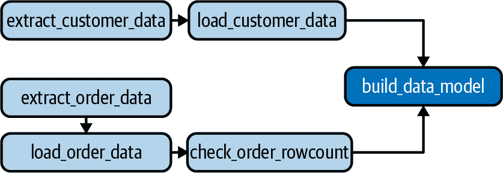

# 第八章：管道中的数据验证

即使在设计最佳的数据管道中，某些事情也可能出错。通过良好的流程、编排和基础设施设计，可以避免或至少减轻许多问题。然而，要确保数据本身的质量和有效性，你需要投入数据验证。最好假设未经测试的数据在分析中使用时并不安全。本章讨论了在 ELT 管道的各个步骤中进行数据验证的原则。

# 早期验证，频繁验证

尽管有良好的意图，某些数据团队将数据验证留到管道末端，并在转换期间甚至在所有转换完成后实施某种验证。在这种设计中，他们认为数据分析师（通常拥有变换逻辑）最适合理解数据并确定是否存在任何质量问题。

在这种设计中，数据工程师专注于将数据从一个系统移动到另一个系统，编排管道，并维护数据基础设施。尽管这是数据工程师的角色，但缺少一点：通过忽略流经管道中每个步骤的数据内容，他们将信任从中摄取的源系统所有者、自己的摄取过程以及转换数据的分析师。尽管这种责任分离听起来效率很高，但当发现质量问题时，调试过程可能效率低下。

在管道末端发现数据质量问题并追溯到起始点是最糟糕的情况。通过在管道的每个步骤进行验证，你更有可能在当前步骤找到根本原因，而不是之前的步骤。

尽管不能期望数据工程师具备足够的上下文来为每个数据集执行验证，但他们可以通过编写非上下文验证检查并提供基础设施和模板来引导那些接近管道每个步骤的团队成员和利益相关者执行更具体的验证。

## 源系统数据质量

鉴于将大量源系统摄取到典型数据仓库中，很可能在数据摄取过程中某个时刻会将无效数据引入到仓库中。尽管可能会认为在摄取之前，源系统所有者会发现某种形式的无效数据，但通常情况并非如此，原因有几个：

无效数据可能不会影响源系统本身的功能。

源系统应用的逻辑可能会通过应用层对表中的重复/模糊记录进行去重复，或在应用本身中用默认值填充 NULL 日期值。

源系统中的记录孤立时可能正常运行。

例如，可能会删除`Customer`记录，但与该客户相关的`Order`记录可能仍然存在。尽管应用程序可能会忽略这些`Order`记录，但这种情况肯定会影响数据分析。

在源系统中可能存在尚未发现或修复的错误

在我的职业生涯中，我遇到过多次数据团队识别源系统中关键问题的情况！

###### 注意

无论原因如何，关键是数据工程师不应假设他们摄取的数据没有质量问题，即使加载到仓库中的数据完全匹配其来源。

## 数据摄取风险

除了源系统中的质量问题外，数据摄取过程本身可能导致数据质量问题。以下是一些常见例子：

摄取中提取或加载步骤中的系统停机或超时

尽管有时这种情况会引发严重错误并停止管道，但在其他情况下，“静默”故障将导致部分提取或加载数据集。

增量摄取中的逻辑错误

从第四章和第五章回想起增量提取的模式。从数据仓库中读取表中最新记录的时间戳，然后提取源系统中时间戳更晚的任何记录，以便加载到数据仓库中。在 SQL 语句中简单地使用“大于或等于”运算符而不是“大于”可能导致重复记录被加载。还有许多其他可能性，比如系统之间的时区不一致。

提取文件中的解析问题

如你在第四章和第五章中所述，从源系统中提取数据，存储在诸如 CSV 这样的平面文件中，然后从该文件加载到数据仓库中是很典型的。当数据从源系统转换为平面文件时，有时会包含特殊字符或其他意外的字符编码。根据数据工程师和数据仓库加载机制处理这些情况的方式，可能会导致记录被丢弃或新加载的记录中的数据格式错误。

###### 注意

与假设源系统将呈现有效数据一样，假设数据摄取“仅仅”提取和加载数据是不合适的。

## 启用数据分析师验证

在验证已加载到数据仓库中的数据以及转换为数据模型的数据方面，数据分析师通常是最适合拥有验证权利的人。他们是了解原始数据和每个数据模型业务背景的人（见第六章）。然而，数据工程师的任务是为分析师提供他们在数据管道中定义和执行数据验证所需的工具。当然，对于像行数统计和重复记录等较少上下文的验证，数据工程师应该在管道的早期参与验证过程中。

接下来的部分介绍了一个简化的框架，可以供分析师和数据工程师在管道中实现数据验证检查。最后一节提到了一些开源和商业框架，可以用于相同的目的。无论你选择哪种工具，重要的是为工程师和分析师提供一种可靠的方法来编写和执行验证测试，同时尽量减少摩擦。虽然数据团队中的每个人通常都同意有效的数据很重要，但如果实施验证的门槛很高，你会发现它会被新开发和其他优先事项所拖后腿。

# 一个简单的验证框架

在这一部分中，我定义了一个完全功能的数据验证框架，用 Python 编写，旨在执行基于 SQL 的数据验证检查。像本书中的其他示例一样，它是高度简化的，并且缺少生产环境中所期望的许多功能。换句话说，它并不打算处理所有的数据验证需求。然而，我的目标是介绍这种框架的关键概念，同时分享一些可以扩展和改进以适应你的基础设施的东西。

这个简化版本的框架支持有限的功能，可以检查验证测试中可以检查的结果类型以及如何批量执行测试，但没有更多功能。如果你想将其用作起点，我在本节中还提到了一些可能的扩展来扩展该框架。即使你选择使用现成的框架，我相信理解这种高度简化方法所涉及的概念也是有价值的。

## 验证器框架代码

这个框架的总体概念是一个 Python 脚本，它执行一对 SQL 脚本，并根据比较运算符进行比较。每个脚本的组合和结果被视为一个*验证测试*，测试结果根据执行脚本的结果与预期结果的比较而定，可以通过或失败。例如，一个脚本可能会计算给定日期表中的行数，第二个脚本计算前一天的行数，比较运算符`>=`则检查当前日期的行数是否比前一天多。如果是，则测试通过；否则，测试失败。

注意，SQL 脚本中的一个也可以返回静态值，如整数。正如您在“验证测试示例”中所看到的那样，该方法用于检查表中的重复行。虽然简单，但此框架可以处理广泛的验证逻辑。

使用命令行参数，您可以告诉验证器执行特定的脚本对以及用于比较的运算符。然后，它执行并返回一个通过/失败代码。返回值可以用于触发 Airflow DAG 中的各种操作，如本节稍后所示，或被任何其他执行验证器的过程所消耗。

示例 8-1 显示了验证器的代码。此版本设置为使用`psycopg2` Python 库执行针对 Amazon Redshift 数据仓库的测试。它还使用了第四章和第五章中相同的*pipeline.conf*配置文件来访问仓库的凭据。您可以轻松地修改此脚本以访问 Snowflake 数据仓库，如第 5 章中的示例，或其他您选择的数据仓库。唯一的区别将是您用于连接和执行查询的库。您还需要确保您的 Python 环境设置正确，并激活虚拟环境。有关更多信息，请参阅“设置您的 Python 环境”。

##### 示例 8-1\. validator.py

```
import sys
import psycopg2
import configparser

def connect_to_warehouse():
    # get db connection parameters from the conf file
    parser = configparser.ConfigParser()
    parser.read("pipeline.conf")
    dbname = parser.get("aws_creds", "database")
    user = parser.get("aws_creds", "username")
    password = parser.get("aws_creds", "password")
    host = parser.get("aws_creds", "host")
    port = parser.get("aws_creds", "port")

    rs_conn = psycopg2.connect(
        "dbname=" + dbname
        + " user=" + user
        + " password=" + password
        + " host=" + host
        + " port=" + port)

    return rs_conn

# execute a test made of up two scripts
# and a comparison operator
# Returns true/false for test pass/fail
def execute_test(
        db_conn,
        script_1,
        script_2,
        comp_operator):

    # execute the 1st script and store the result
    cursor = db_conn.cursor()
    sql_file = open(script_1, 'r')
    cursor.execute(sql_file.read())

    record = cursor.fetchone()
    result_1 = record[0]
    db_conn.commit()
    cursor.close()

    # execute the 2nd script and store the result
    cursor = db_conn.cursor()
    sql_file = open(script_2, 'r')
    cursor.execute(sql_file.read())

    record = cursor.fetchone()
    result_2 = record[0]
    db_conn.commit()
    cursor.close()

    print("result 1 = " + str(result_1))
    print("result 2 = " + str(result_2))

    # compare values based on the comp_operator
    if comp_operator == "equals":
        return result_1 == result_2
    elif comp_operator == "greater_equals":
        return result_1 >= result_2
    elif comp_operator == "greater":
        return result_1 > result_2
    elif comp_operator == "less_equals":
        return result_1 <= result_2
    elif comp_operator == "less":
        return result_1 < result_2
    elif comp_operator == "not_equal":
        return result_1 != result_2

    # if we made it here, something went wrong
    return False

if __name__ == "__main__":

    if len(sys.argv) == 2 and sys.argv[1] == "-h":
        print("Usage: python validator.py"
          + "script1.sql script2.sql "
          + "comparison_operator")
        print("Valid comparison_operator values:")
        print("equals")
        print("greater_equals")
        print("greater")
        print("less_equals")
        print("less")
        print("not_equal")

        exit(0)

    if len(sys.argv) != 4:
        print("Usage: python validator.py"
          + "script1.sql script2.sql "
          + "comparison_operator")
        exit(-1)

    script_1 = sys.argv[1]
    script_2 = sys.argv[2]
    comp_operator = sys.argv[3]

    # connect to the data warehouse
    db_conn = connect_to_warehouse()

    # execute the validation test
    test_result = execute_test(
                    db_conn,
                    script_1,
                    script_2,
                    comp_operator)

    print("Result of test: " + str(test_result))

    if test_result == True:
        exit(0)
    else:
        exit(-1)
```

下面的小节描述了此框架设计用于运行的验证测试的结构以及如何从命令行运行测试以及 Airflow DAG。在下一节中，我将基于常见的测试类型分享一些示例验证测试。

## 验证测试的结构

正如前面的小节中简要描述的那样，此框架中的验证测试由三个部分组成：

+   运行脚本并返回单个数值的 SQL 文件

+   第二个运行脚本并返回单个数值的 SQL 文件

+   一个“比较运算符”，用于比较从 SQL 脚本返回的两个值

让我们看一个简单的例子，检查两个表的行数是否相同。在示例 8-2 中，SQL 脚本计算名为`Orders`的表中的行数，而在示例 8-3 中，SQL 脚本从另一个名为`Orders_Full`的表中获取相同的计数。

##### 示例 8-2\. order_count.sql

```
SELECT COUNT(*)
FROM Orders;
```

##### 示例 8-3\. order_full_count.sql

```
SELECT COUNT(*)
FROM Orders_Full;
```

您可以使用以下 SQL 创建和填充本章中使用的`Orders`和`Orders_Full`表：

```
CREATE TABLE Orders (
  OrderId int,
  OrderStatus varchar(30),
  OrderDate timestamp,
  CustomerId int,
  OrderTotal numeric
);

INSERT INTO Orders
  VALUES(1,'Shipped','2020-06-09',100,50.05);
INSERT INTO Orders
  VALUES(2,'Shipped','2020-07-11',101,57.45);
INSERT INTO Orders
  VALUES(3,'Shipped','2020-07-12',102,135.99);
INSERT INTO Orders
  VALUES(4,'Shipped','2020-07-12',100,43.00);

CREATE TABLE Orders_Full (
  OrderId int,
  OrderStatus varchar(30),
  OrderDate timestamp,
  CustomerId int,
  OrderTotal numeric
);

INSERT INTO Orders_Full VALUES(1,'Shipped','2020-06-09',100,50.05);
INSERT INTO Orders_Full VALUES(2,'Shipped','2020-07-11',101,57.45);
INSERT INTO Orders_Full VALUES(3,'Shipped','2020-07-12',102,135.99);
INSERT INTO Orders_Full VALUES(4,'Shipped','2020-07-12',100,43.00);
```

最后一个验证测试的部分是要用来比较两个值的比较运算符。在来自示例 8-1 的代码示例中，您可以看到可用于比较运算符的选项，但这里它们带有其关联的逻辑符号（括号内）以供参考：

+   `equals`

+   `greater_equals`

+   `greater`

+   `less_equals`

+   `less`

+   `not_equal`

接下来我们将看看如何运行测试并理解结果。

## 运行验证测试

使用前一小节中验证测试的示例，可以在命令行上执行如下：

```
$ python validator.py order_count.sql order_full_count.sql equals
```

如果`Orders`表和`Orders_Full`表的行数相同，则输出如下：

```
result 1 = 15368
result 2 = 15368
Result of test: True
```

在命令行上看不到的是*退出状态码*，在本例中为`0`，但在测试失败时将为`-1`。但您可以在程序中消耗此值。下一节将展示如何在 Airflow DAG 中执行此操作。您可能还希望考虑在测试失败时执行像发送 Slack 消息或电子邮件之类的操作。稍后在“扩展框架”中将讨论一些选项。

## 在 Airflow DAG 中的使用

正如您在第七章中学到的，Airflow 任务可以使用`BashOperator`执行 Python 脚本。考虑从示例 7-2 中的`elt_pipeline_sample` DAG 开始。在`Orders`表被摄取之后（提取和加载任务完成之后），我将添加另一个任务来运行我刚分享的验证测试示例，以检查`Orders`表的行数与名为`Orders_Full`的虚构表格的行数是否相同。出于本例考虑，假设出于某种原因我们希望确保`Orders`中的行数与`Orders_Full`相同，并且如果不是，则任务失败，并停止 DAG 中下游任务的进一步执行。

首先，将以下任务添加到`elt_pipeline_sample.py` DAG 定义中：

```
check_order_rowcount_task = BashOperator(
    task_id='check_order_rowcount',
    bash_command='set -e; python validator.py' +
    'order_count.sql order_full_count.sql equals',
    dag=dag,
)
```

接下来，在同一文件中重新定义 DAG 的依赖顺序为以下代码。这确保在`load_orders_task`之后，验证任务运行，在验证完成（并通过）以及`load_customers_task`成功完成后，`revenue_model_task`任务运行：

```
extract_orders_task >> load_orders_task
extract_customers_task >> load_customers_task
load_orders_task >> check_order_rowcount_task
check_order_rowcount_task >> revenue_model_task
load_customers_task >> revenue_model_task
```

图 8-1 显示了 DAG 的更新图形视图。



###### 图 8-1\. 带有验证测试的示例 ELT DAG 的图形视图。

当执行`check_order_rowcount_task`时，根据任务定义运行以下 Bash 命令：

```
set -e; python validator.py order_count.sql order_full_count.sql equals
```

您会注意到使用了先前在本节中讨论过的命令行参数执行验证器。新的部分是在其余命令之前加上了`set -e;`。这告诉 Bash 在错误时停止脚本的执行，错误由非零退出状态码定义。如您所记得的，如果验证测试失败，它将返回退出状态-1。如果发生这种情况，Airflow 任务将失败，并且不会执行下游任务（本例中的`revenue_model_task`）。

当验证测试失败时，并不总是需要停止 DAG 的进一步执行。在这种情况下，不应将 Bash 命令集中的`set -e`部分包含在 Airflow 任务中，或者修改验证器以不同方式处理警告和严重错误。接下来，我将讨论何时这样做，何时只需发送某种通知。

## 何时停止管道，何时警告并继续

有时候，比如在前面的例子中，当数据验证测试失败时，停止管道是必要的。在那个例子中，如果`Orders`表中的记录计数不正确，可能是由于在最后一个任务中刷新数据模型，业务用户将看到不正确的销售数据。如果避免这种情况很重要，那么停止 DAG 以便解决问题是正确的方法。完成这些操作后，数据模型仍然包含前一个成功运行 DAG 的数据。总的来说，旧数据比不正确的数据更好！

然而，还有其他时候，验证测试失败并不那么关键，更多的是提供信息。例如，也许表中的订单数量自昨天的上一个运行增加了 3%，而过去 30 天的平均每日增长率是 1%。你可以通过下一节中我展示的基本统计测试来捕捉这样的增长。这是否值得停止呢？答案取决于你的情况和对风险的接受程度，但你可以依靠多个测试来得出答案。

例如，如果你还运行了一个测试来检查`Orders`表中是否有重复行，并且测试通过了，那么你就知道问题不是重复的。也许公司因为促销活动而销售额惊人增长。你也可以调整你的测试以考虑季节性因素。也许现在是假期季节，昨天是黑色星期五。与其将记录的增长与过去 30 天相比较，不如与去年同期相比较，无论业务年度增长是否增加都可以考虑。

最终，是选择抛出错误并停止管道，还是发送警报到 Slack 频道的决定，应该基于业务的背景和数据的用例。然而，这也指出了数据工程师和分析师都有必要贡献验证测试到管道的需求。虽然数据工程师可能会检查行计数差异，但他们可能没有业务背景去考虑创建一个测试来检查`Orders`表中行计数的季节性增长因素。

如果你只想警告而不是停止管道，你需要在前面例子中的 DAG 或验证框架本身中进行一些修改。Airflow 在错误处理方面有许多选项，你可以在官方 Airflow 文档中了解。在接下来关于验证框架的一些可能扩展的部分中，我建议一些处理框架中较不关键失败的方法。任何一个选项都可以；你可以选择在哪里设置逻辑。

## 扩展框架

正如我在本章前面提到的，从示例 8-1 中的样本数据验证框架中，缺少了许多你可能希望考虑用于生产部署的功能。如果你决定将这个框架作为起点，而不是考虑开源或商业选项，你可能会考虑一些改进措施。

在验证框架中的常见需求是，在测试失败时向 Slack 频道或电子邮件发送通知。我将提供一个示例，演示如何为 Slack 频道执行此操作，但在 Python 中发送电子邮件和其他消息服务的通知的示例也有很多。

首先，你需要为要发送的 Slack 频道创建一个*incoming webhook*。入站 Webhook 是一个唯一的 URL，你可以向其发送数据，以便它显示为该频道中的消息。你可以按照[Slack 文档](https://oreil.ly/L4sYZ)中的说明创建它。

一旦你有了 Webhook，你可以将以下函数添加到`validator.py`中，如示例 8-4 所示。你可以向其传递有关验证测试的信息。发送到 Webhook 的信息随后会在 Slack 频道中发布。

##### 示例 8-4\. 发送 Slack 消息的函数

```
# test_result should be True/False
def send_slack_notification(
  webhook_url,
  script_1,
  script_2,
  comp_operator,
  test_result):
    try:
        if test_result == True:
            message = ("Validation Test Passed!: "
            + script_1 + " / "
            + script_2 + " / "
            + comp_operator)
        else:
            message = ("Validation Test FAILED!: "
            + script_1 + " / "
            + script_2 + " / "
            + comp_operator)

        slack_data = {'text': message}
        response = requests.post(webhook_url,
            data=json.dumps(slack_data),
            headers={
                'Content-Type': 'application/json'
            })

        if response.status_code != 200:
            print(response)
            return False
    except Exception as e:
        print("error sending slack notification")
        print(str(e))
        return False
```

现在，在*validation.py*退出之前，你只需要调用该函数。示例 8-5 展示了更新脚本的最后几行。

##### 示例 8-5\. 在测试失败时发送 Slack 消息

```
if test_result == True:
        exit(0)
    else:
        send_slack_notification(
          webhook_url,
          script_1,
          script_2,
          comp_operator,
          test_result)
        exit(-1)
```

当然，Slack 消息的格式还有改进的空间，这个函数发送的消息，现在已经足够完成工作。请注意，我在`send_slack_notification`函数中包含了`test_result`参数。它被设置为处理通过测试和未通过测试的通知。尽管在示例中我没有这样使用它，但你可能希望这样做。

如前一小节所述，有时候一个 Slack 消息就足够了，测试失败的结果不应导致流水线停止。尽管你可以利用 DAG 配置来处理这种情况，但也可以通过添加另一个命令行参数来定义严重性，从而改进验证框架。

示例 8-6 展示了带有严重性处理的`validator.py`中更新后的`__main__`块。当脚本以`halt`严重性级别执行时，失败的测试会导致退出码为-1。当严重性级别设置为`warn`时，失败的测试结果会导致退出码为 0，就像测试通过时一样。在两种情况下，失败消息都会导致在你指定的频道发送 Slack 消息。

##### 示例 8-6\. 添加多种严重性级别的测试失败处理

```
if __name__ == "__main__":

    if len(sys.argv) == 2 and sys.argv[1] == "-h":
        print("Usage: python validator.py"
            + "script1.sql script2.sql "
            + "comparison_operator")
        print("Valid comparison_operator values:")
        print("equals")
        print("greater_equals")
        print("greater")
        print("less_equals")
        print("less")
        print("not_equal")

        exit(0)

    if len(sys.argv) != 5:
        print("Usage: python validator.py"
            + "script1.sql script2.sql "
            + "comparison_operator")
        exit(-1)

    script_1 = sys.argv[1]
    script_2 = sys.argv[2]
    comp_operator = sys.argv[3]
    sev_level = sys.argv[4]

    # connect to the data warehouse
    db_conn = connect_to_warehouse()

    # execute the validation test
    test_result = execute_test(
                  db_conn,
                  script_1,
                  script_2,
                  comp_operator)

    print("Result of test: " + str(test_result))

    if test_result == True:
        exit(0)
    else:
        send_slack_notification(
          webhook_url,
          script_1,
          script_2,
          comp_operator,
          test_result)
        if sev_level == "halt":
            exit(-1)
        else:
            exit(0)
```

有无数其他方法可以扩展这个框架，其中两种如下。我相信你也会想到其他一些方法！

应用程序中的异常处理

虽然我在本书中为了节省空间而没有详细介绍，但在生产中，必须捕获和处理异常，如无效的命令行参数和 SQL 错误。

使用 validator.py 的单个执行能运行多个测试的能力

考虑将您的测试存储在配置文件中，并按表、DAG 或其他适合您的开发模式的方式进行分组。然后，您可以通过单个命令执行与管道中特定点匹配的所有测试，而不是为您定义的每个测试执行一个命令。

# 验证测试示例

前面的部分定义了一个简单的验证框架及其工作原理。作为提醒，验证测试包括以下内容：

+   运行脚本并得到一个单一的数字值的 SQL 文件

+   运行脚本并得到一个单一的数字值的第二个 SQL 文件

+   用于比较从 SQL 脚本返回的两个值的“比较运算符”

假设您已将示例 8-4、8-5 和 8-6 的增强功能添加到 Example 8-1 中的`validator.py`代码中，您可以在命令行上执行测试如下：

```
python validator.py order_count.sql order_full_count.sql equals warn
```

在本节中，我将定义一些我认为在验证管道中的数据时很有用的样本测试。这些并不是你需要运行的所有测试，但它们确实涵盖了一些常见点，可以帮助你开始并激发更广泛的测试。每个子节包括组成测试的两个 SQL 文件的源代码，以及执行测试所需的命令行命令和参数。

## 在摄取后重复记录

检查重复记录是一个简单而常见的测试。唯一需要考虑的是，你需要在检查的表中定义什么是“重复”。是基于单个 ID 值？还是基于 ID 以及第二列？在这个例子中，我将检查确保`Orders`表中没有两条具有相同`OrderId`的记录。要基于其他列检查重复项，只需将这些列添加到第一个查询的`SELECT`和`GROUP BY`中即可。

注意第二个查询返回了一个固定值 0。这是因为我预期没有重复项，并希望将重复项的计数与零进行比较。如果它们匹配，则测试通过。

##### 示例 8-7\. order_dup.sql

```
WITH order_dups AS
(
  SELECT OrderId, Count(*)
  FROM Orders
  GROUP BY OrderId
  HAVING COUNT(*) > 1
)
SELECT COUNT(*)
FROM order_dups;
```

##### 示例 8-8\. order_dup_zero.sql

```
SELECT 0;
```

要运行测试，请使用以下命令：

```
python validator.py order_dup.sql order_dup_zero.sql equals warn
```

## 摄取后行数意外变化

当您期望最近摄取的记录数量相对稳定时，您可以使用统计检查来查看最新的摄取是否加载比历史记录建议的更多或更少的记录。

在这个例子中，我假设数据每天摄取，并且会查看最近加载（昨天）`Orders`表中记录的数量是否在我可以接受的范围内。只要间隔是固定的，你可以对每小时、每周或任何其他间隔执行相同操作。

我将使用标准差计算并查看昨天的行数是否在`Orders`表的整个历史记录的 90%置信水平内。换句话说，基于历史，值（行数）是否在 90%置信区间内的任一方向（每个方向最多可以偏离 5%）？

在统计学中，这被视为*双尾检验*，因为我们在正态分布曲线的两侧查找。你可以使用 z-score 计算器确定在置信水平为 90%的双尾检验中使用的分数，以确定 z-score 为 1.645\. 换句话说，我们正在寻找根据设置的阈值在任一方向上的差异，无论是太高还是太低。

我将在测试中使用该 z-score 来查看昨天订单记录的计数是否通过测试。在验证测试中，我将返回昨天行数的 z-score 的绝对值，然后将其与第二个 SQL 脚本中的 z-score 1.645 进行比较。

因为你需要在`Orders`表中有大量样本数据，我提供了验证测试中第一个 SQL 脚本的两个版本。第一个(示例 8-9) 是用于遍历`Orders`表、获取每天行数，并计算前一天 z-score 的“真实”代码。

然而，你可能想要使用一些样本数据来进行这种测试的实验。我提供了一个备用版本，以填充名为`orders_by_day`的表，然后执行示例 8-9 的后半部分来计算样本集的最后一天（*2020-10-05*）的 z-score。示例 8-11 显示了备用版本。

##### 示例 8-9\. order_yesterday_zscore.sql

```
WITH orders_by_day AS (
  SELECT
    CAST(OrderDate AS DATE) AS order_date,
    COUNT(*) AS order_count
  FROM Orders
  GROUP BY CAST(OrderDate AS DATE)
),
order_count_zscore AS (
  SELECT
    order_date,
    order_count,
    (order_count - avg(order_count) over ())
     / (stddev(order_count) over ()) as z_score
  FROM orders_by_day
)
SELECT ABS(z_score) AS twosided_score
FROM order_count_zscore
WHERE
  order_date =
    CAST(current_timestamp AS DATE)
    - interval '1 day';
```

示例 8-10 简单返回要检查的值。

##### 示例 8-10\. zscore_90_twosided.sql

```
SELECT 1.645;
```

若要运行测试，请使用以下方法：

```
python validator.py order_yesterday_zscore.sql zscore_90_twosided.sql greater_equals warn
```

###### 注意

如果`Orders`表包含大量数据，创建`orders_by_day`数据集作为转换任务中的表（就像第六章中的数据模型示例一样），而不是作为验证脚本中的 CTE，是值得的。因为按天计算的订单数量在过去不应该发生变化，你可以创建一个增量数据模型，并在每个后续的天数中追加行，以表明`Orders`表中新数据的到达。

这是另一版本，带有一个硬编码的日期进行检查以及运行它所需的样本数据。通过这个版本，你可以调整`order_count`的值并运行测试，以获得不同的 z-score 在期望范围内和之外：

```
CREATE TABLE orders_by_day
(
  order_date date,
  order_count int
);

INSERT INTO orders_by_day
  VALUES ('2020-09-24', 11);
INSERT INTO orders_by_day
  VALUES ('2020-09-25', 9);
INSERT INTO orders_by_day
  VALUES ('2020-09-26', 14);
INSERT INTO orders_by_day
  VALUES ('2020-09-27', 21);
INSERT INTO orders_by_day
  VALUES ('2020-09-28', 15);
INSERT INTO orders_by_day
  VALUES ('2020-09-29', 9);
INSERT INTO orders_by_day
  VALUES ('2020-09-30', 20);
INSERT INTO orders_by_day
  VALUES ('2020-10-01', 18);
INSERT INTO orders_by_day
  VALUES ('2020-10-02', 14);
INSERT INTO orders_by_day
  VALUES ('2020-10-03', 26);
INSERT INTO orders_by_day
  VALUES ('2020-10-04', 11);
```

##### 示例 8-11\. order_sample_zscore.sql

```
WITH order_count_zscore AS (
  SELECT
    order_date,
    order_count,
    (order_count - avg(order_count) over ())
     / (stddev(order_count) over ()) as z_score
  FROM orders_by_day
)
SELECT ABS(z_score) AS twosided_score
FROM order_count_zscore
WHERE
  order_date =
    CAST('2020-10-05' AS DATE)
    - interval '1 day';
```

若要运行测试，请使用以下方法：

```
python validator.py order_sample_zscore.sql zscore_90_twosided.sql greater_equals warn
```

## 指标值波动

正如本章前面所述，在管道的每个步骤中验证数据至关重要。前两个示例在摄入后验证了数据的有效性。此示例检查在数据在管道的转换步骤中建模后是否出现问题。

在来自第六章的数据建模示例中，多个源表被连接在一起，并实现了确定如何聚合值的逻辑。有很多问题可能会发生，包括导致行重复或删除的无效连接逻辑。即使源数据在管道的早期阶段已通过验证，也始终要对在管道末端构建的数据模型进行验证是个好习惯。

您可以检查三件事情：

+   确保度量在某些下限和上限之间

+   检查数据模型中行数的增长（或减少）

+   检查特定指标的值是否出现意外波动

到现在为止，您可能已经对如何实施这些测试有了一个很好的想法，但我将提供最后一个示例来检查指标值的波动。逻辑与我上一节分享的用于检查给定源表行数变化的逻辑几乎相同。不过，这一次，我不是检查行数值，而是查看特定日期订单总收入是否超出历史规范。

就像前一节查找行数变化的示例一样，我提供了在原始数据上如何做到这一点（示例 8-12）以及在样本聚合数据上的一个“真实”示例（示例 8-14）。要运行示例 8-12，您需要在`Orders`表中有相当多的数据。这段代码对于真正的实现是有意义的。但是，您可能会发现示例 8-14 更容易用于学习目的。

##### 示例 8-12\. revenue_yesterday_zscore.sql

```
WITH revenue_by_day AS (
  SELECT
    CAST(OrderDate AS DATE) AS order_date,
    SUM(ordertotal) AS total_revenue
  FROM Orders
  GROUP BY CAST(OrderDate AS DATE)
),
daily_revenue_zscore AS (
  SELECT
    order_date,
    total_revenue,
    (total_revenue - avg(total_revenue) over ())
     / (stddev(total_revenue) over ()) as z_score
  FROM revenue_by_day
)
SELECT ABS(z_score) AS twosided_score
FROM daily_revenue_zscore
WHERE
  order_date =
    CAST(current_timestamp AS DATE)
    - interval '1 day';
```

示例 8-13 简单地返回要检查的值。

##### 示例 8-13\. zscore_90_twosided.sql

```
SELECT 1.645;
```

使用这个来运行测试：

```
python validator.py revenue_yesterday_zscore.sql zscore_90_twosided.sql greater_equals warn
```

这是示例 8-14 的示例数据，正如前面提到的，这是示例 8-12 的简化版本，但用于您自己的实验：

```
CREATE TABLE revenue_by_day
(
  order_date date,
  total_revenue numeric
);

INSERT INTO revenue_by_day
  VALUES ('2020-09-24', 203.3);
INSERT INTO revenue_by_day
  VALUES ('2020-09-25', 190.99);
INSERT INTO revenue_by_day
  VALUES ('2020-09-26', 156.32);
INSERT INTO revenue_by_day
  VALUES ('2020-09-27', 210.0);
INSERT INTO revenue_by_day
  VALUES ('2020-09-28', 151.3);
INSERT INTO revenue_by_day
  VALUES ('2020-09-29', 568.0);
INSERT INTO revenue_by_day
  VALUES ('2020-09-30', 211.69);
INSERT INTO revenue_by_day
  VALUES ('2020-10-01', 98.99);
INSERT INTO revenue_by_day
  VALUES ('2020-10-02', 145.0);
INSERT INTO revenue_by_day
  VALUES ('2020-10-03', 159.3);
INSERT INTO revenue_by_day
  VALUES ('2020-10-04', 110.23);
```

##### 示例 8-14\. revenue_sample_zscore.sql

```
WITH daily_revenue_zscore AS (
  SELECT
    order_date,
    total_revenue,
    (total_revenue - avg(total_revenue) over ())
     / (stddev(total_revenue) over ()) as z_score
  FROM revenue_by_day
)
SELECT ABS(z_score) AS twosided_score
FROM daily_revenue_zscore
WHERE
  order_date =
    CAST('2020-10-05' AS DATE)
    - interval '1 day';
```

要运行测试，请使用这个：

```
python validator.py revenue_sample_zscore.sql zscore_90_twosided.sql greater_equals warn
```

当然，您会希望考虑调整此测试以适应您的业务案例。

每天查看订单收入是否太“嘈杂”？您的订单量是否足够低，需要查看每周或每月的聚合数据？如果是这样，您可以修改示例 8-12 以按周或月进行聚合，而不是按天。示例 8-15 展示了相同检查的月度版本。它比较了上个月与之前 11 个月的差异。

请注意，此示例检查从当前日期到上个月的总收入。这是在“关闭”一个月时运行的验证类型，通常是在下个月的第一天。例如，这是您可能在 10 月 1 日运行的验证，以确保根据过去的历史，9 月份的收入是否在您预期的范围内。

##### 示例 8-15\. revenue_lastmonth_zscore.sql

```
WITH revenue_by_day AS (
  SELECT
    date_part('month', order_date) AS order_month,
    SUM(ordertotal) AS total_revenue
  FROM Orders
  WHERE
    order_date > date_trunc('month',current_timestamp - interval '12 months')
    AND
    order_date < date_trunc('month', current_timestamp)
  GROUP BY date_part('month', order_date)
),
daily_revenue_zscore AS (
  SELECT
    order_month,
    total_revenue,
    (total_revenue - avg(total_revenue) over ())
     / (stddev(total_revenue) over ()) as z_score
  FROM revenue_by_day
)
SELECT ABS(z_score) AS twosided_score
FROM daily_revenue_zscore
WHERE order_month = date_part('month',date_trunc('month',current_timestamp - interval '1 months'));
```

还有许多其他类型的验证测试变体。你需要根据自己的数据分析和调整日期粒度的级别、你想要比较的日期周期，甚至是 z 分数。

# 商业和开源数据验证框架

在本节中，我使用了一个基于 Python 的示例验证框架。正如之前提到的，尽管它很简单，但可以轻松扩展为一个功能齐全、可投入生产的应用程序，用于各种数据验证需求。

说到数据验证，就像数据摄入、数据建模和数据编排工具一样，当涉及到数据验证时，你需要做出一个自建还是购买的决策。实际上，之前的自建与购买决策通常会影响数据团队在管道不同阶段选择用于数据验证的工具。

例如，一些数据摄入工具包括功能来检查行数变化、列中的意外值等。一些数据转换框架，如[dbt](https://www.getdbt.com)，包括数据验证和测试功能。如果你已经投资了这类工具，看看有哪些可用选项。

最后，有一些开源框架可用于数据验证。这类框架的数量庞大，我建议找一个适合你生态系统的框架。例如，如果你正在构建一个机器学习管道并使用 TensorFlow，你可以考虑使用[TensorFlow 数据验证](https://oreil.ly/EJHDl)。对于更通用的验证，Yahoo 的[验证器](https://oreil.ly/XMdGY)是一个开源选择。
