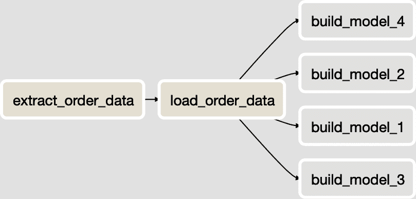
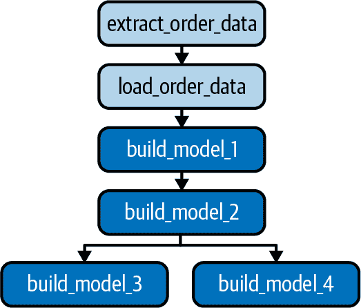

# 第九章：维护管道的最佳实践

到目前为止，这本书主要关注于构建数据管道。本章讨论如何在遇到增加复杂性并处理管道依赖系统中不可避免的变更时，保持这些管道的维护。

# 处理源系统的变更

对于数据工程师来说，最常见的维护挑战之一是处理数据来源系统不是静态的这一事实。开发人员总是在他们的软件中进行更改，无论是添加功能，重构代码库，还是修复错误。当这些更改引入要摄取的数据的模式或含义修改时，管道就有可能面临失败或不准确的风险。

正如本书中多次讨论的那样，现代数据基础设施的现实是数据从多种来源摄入。因此，在处理源系统中的模式和业务逻辑变更时很难找到一种适合所有情况的解决方案。尽管如此，我建议投资一些最佳实践。

## 引入抽象化

在可能的情况下，最好在源系统和摄取过程之间引入抽象层。同样重要的是，源系统的所有者要么维护抽象方法，要么了解这种抽象方法。

例如，不要直接从 Postgres 数据库摄取数据，考虑与数据库所有者合作构建一个 REST API，从数据库中拉取数据并可以查询以进行数据提取。即使 API 只是一个透传，但它存在于源系统所有者维护的代码库中意味着系统所有者知道正在提取哪些数据，不必担心其 Postgres 应用数据库的内部结构变更。如果他们选择修改数据库表的结构，他们需要对 API 进行修改，但不必考虑其他可能依赖它的代码。

此外，如果对源系统的更改导致支持的 API 端点中的字段被删除，则可以做出有意识的决定。也许该字段会随时间逐渐淘汰，或者在历史数据中支持但在未来为 NULL。无论哪种方式，存在一个明确的抽象层时，都意识到需要处理这种变更。

REST API 并不是唯一的抽象选项，有时并不是最佳选择。通过 Kafka 主题发布数据是一种维持约定模式的绝佳方式，同时完全将发布事件的源系统和订阅它的系统（摄取）的细节分开。

## 维护数据契约

如果必须直接从源系统的数据库或通过一些未明确为您的提取而设计的方法摄取数据，则创建和维护数据合同是管理模式和逻辑变更的较少技术性解决方案。

数据合同可以以文本文档的形式编写，但最好以标准化的配置文件形式编写，例如在示例 9-1 中。在此示例中，来自 Postgres 数据库中表的摄入数据合同以 JSON 形式存储。

##### 示例 9-1\. orders_contract.json

```
{
  ingestion_jobid: "orders_postgres",
  source_host: "my_host.com",
  source_db: "ecommerce",
  source_table: "orders",
  ingestion_type: "full",
  ingestion_frequency_minutes: "60",
  source_owner: "dev-team@mycompany.com",
  ingestion_owner: "data-eng@mycompany.com"
};
```

一旦创建了数据合同，以下是您可以使用它们来提前应对任何可能影响管道完整性的源系统变更的几种方式：

+   创建一个 Git 钩子，在提交 PR 或提交代码到分支时查找表中的任何更改（模式或逻辑），这些表在数据合同中列为`source_table`。自动通知贡献者该表用于数据摄入，以及联系方式（`ingestion_owner`）以协调变更。

+   如果数据合同本身位于 Git 存储库中（应该是！），请添加一个 Git 钩子来检查合同的变更。例如，如果增加摄入运行的频率，则不仅应更新数据合同，还应与源系统所有者协商，以确保对生产系统没有负面影响。

+   在公司集中文档站点上发布所有数据合同的可读形式，并使其可搜索。

+   编写并安排一个脚本，以通知源系统和摄入所有者任何在过去六个月内未更新的数据合同（或其他频率），并要求他们进行审核和更新（如果需要）。

无论是自动化还是手动操作，目标都是在数据摄入或摄入方法（例如从增量到完整加载）发生变化之前，及时标记并与管道或源系统的任何问题进行通信。

## 读取时模式的限制

处理源数据模式变更的一种方法是从*写入时*设计转向*读取时*设计。

本书中贯穿始终采用的是写入时模式；特别是在第四章和第五章。从源头提取数据时，定义结构（模式），然后将数据写入数据湖或 S3 存储桶。然后，在运行摄入中的加载步骤时，数据处于可预测的形式，并且可以加载到定义的表结构中。

读取时模式是一种模式，其中数据写入数据湖、S3 存储桶或其他存储系统，没有严格的模式。例如，定义系统中放置订单的事件可能被定义为 JSON 对象，但随着时间的推移，该对象的属性可能会随着新属性的添加或现有属性的移除而发生变化。在这种情况下，直到*读取*数据时才能知道数据的模式，这就是为什么称其为读取时模式。

尽管对于将数据写入存储非常有效，但这种模式会增加加载步骤的复杂性，并在管道中产生一些重大影响。从技术角度来看，从 S3 存储桶中读取以这种方式存储的数据非常容易。Amazon Athena 和其他产品使得查询原始数据就像编写 SQL 查询一样简单。然而，维护数据的定义并不是一件小事。

首先，您需要使用与在加载步骤中读取模式灵活数据的工具集成的*数据目录*。数据目录存储数据湖和仓库中数据的元数据。它可以存储数据集的结构和定义。对于按需模式读取，定义和存储数据目录中数据的结构对于实用和人类参考都至关重要。[AWS Glue 数据目录](https://oreil.ly/BpXT7)和[Apache Atlas](https://atlas.apache.org)是流行的数据目录，但还有许多其他选择。

首先，您需要考虑加载步骤的逻辑变得更加复杂。您需要考虑如何在检测到摄取过程中的新字段时动态添加新列到仓库中的表中。在管道的转换步骤中，您如何通知数据分析师或者更改他们源表格的人建模的数据？

如果选择按需模式读取方法，您需要认真对待*数据治理*，这不仅包括对数据进行分类，还包括定义组织中数据使用的标准和流程。数据治理是一个广泛的主题，无论您如何摄取数据，都是一个重要的主题。但是，如果选择按需模式读取方法，在技术层面上是一个不可忽视的话题。

# 扩展复杂性

当源系统和下游数据模型有限时，构建数据管道本身就具有挑战性。即使在相对较小的组织中，一旦这些数字变大，扩展管道以处理增加的复杂性也会面临一些挑战。本节包括在管道各个阶段应对这些挑战的一些提示和最佳实践。

## 标准化数据摄取

当涉及到复杂性时，您从中摄取的系统数量通常不是问题的主要因素，而是每个系统并不完全相同。这一事实通常会导致两个管道维护挑战：

+   摄取作业必须编写以处理各种源系统类型（例如 Postgres，Kafka 等）。您需要从的源系统类型越多，您的代码库就越大，需要维护的东西也就越多。

+   无法轻松地对同一源系统类型的摄取作业进行标准化。例如，即使您只从 REST API 中摄取数据，如果这些 API 没有标准化的分页方式、增量访问数据等特性，数据工程师可能会构建“一次性”摄取作业，这些作业不能重用代码并共享可以集中维护的逻辑。

根据你的组织情况，你可能无法控制你所摄取的系统。也许你必须主要从第三方平台摄取数据，或者内部系统由组织层次结构下不同部门的工程团队构建。这不是技术问题，但每个问题仍然应被考虑并作为数据流水线战略的一部分解决。幸运的是，在你的控制范围内也有一些技术方法来减轻对你的流水线的影响。

首先是非技术因素。如果你正在摄取的系统是内部构建的，但标准化程度不高，那么提高对数据组织流水线影响的认识可能会获得系统所有者的支持。

特别是在较大的公司中，构建每个系统的软件工程师可能并不意识到他们构建的系统与组织内其他部门的系统并不完全相同。幸运的是，软件工程师通常能够理解标准化带来的效率和可维护性优势。与工程组织建立合作伙伴关系需要耐心和恰到好处的方法，但这是数据团队中被低估的非技术技能之一。

如果你发现自己需要从大量第三方数据源摄取数据，那么你的组织很可能在许多情况下选择购买而不是自建。建立/购买决策是复杂的，组织通常在评估不同供应商和内部解决方案提案时权衡多种因素。在过程中往往忽略或推迟的一个因素是对报告和分析的影响。在这种情况下，数据团队面临的挑战是从设计不良的产品中摄取数据。尽最大努力早期参与评估过程，并确保你的团队在最终决策中有一席之地。就像提高内部系统标准化意识一样，与供应商合作确定分析需求的重要性通常不被考虑，除非数据团队确保他们的声音被听到。

在你的控制范围内，还有一些技术方法可以减少你的数据摄取作业的复杂性：

标准化你能够的所有代码，并且重复使用。

这是软件工程的一般最佳实践，但有时会在创建数据摄取作业时被忽视。

力求通过配置驱动的数据摄取

你是否需要从多个 Postgres 数据库和表摄取数据？不要为每个摄取编写不同的作业，而是编写一个单一的作业，通过配置文件（或数据库表中的记录！）迭代定义你想要摄取的表和架构。

考虑你自己的抽象层。

如果你无法让源系统所有者在它们的系统和你的数据摄取之间建立一些标准化的抽象层，可以考虑自行完成或与它们合作，并承担大部分开发工作。例如，如果你必须摄取来自 Postgres 或 MySQL 数据库的数据，可以征得源团队的许可，实施使用 Debezium 进行流式 CDC（参见第四章），而不是再写一个摄取任务。

## 数据模型逻辑的重用

复杂性也可能在管道的后续阶段和特别是在管道转换阶段的数据建模过程中出现（参见第六章）。随着分析师构建更多数据模型，他们往往会做以下两件事之一：

+   在构建每个模型的 SQL 中重复逻辑。

+   派生各个模型，创建模型之间的多个依赖关系。

正如在数据摄取中（以及一般的软件工程中）代码重用是理想的一样，在数据建模中也是理想的。它确保存在单一的真实来源，并在存在错误或业务逻辑更改的情况下减少需要更改的代码量。这种权衡是管道中更复杂的依赖图。

图 9-1 展示了一个 DAG（参见第七章），其中只有一个数据摄取和四个通过并行运行脚本构建的数据模型。它们可以这样执行，因为它们彼此之间没有依赖关系。



###### 图 9-1\. 四个独立数据模型。

如果它们确实是不相关的数据模型，那没问题。但是，如果它们都共享一些逻辑，最好重构模型和 DAG，使其看起来像图 9-2。



###### 图 9-2\. 具有逻辑重用和依赖关系的数据模型。

示例 9-2 展示了逻辑重用的简单示例，表示在图 9-2 中执行的`build_model_1`任务中执行的脚本。该脚本按日生成订单计数，并将其存储在名为`orders_by_day`的数据模型中。

您可以使用从第六章的`Orders`表格，可以使用以下 SQL 重新创建和填充：

```
CREATE TABLE Orders (
  OrderId int,
  OrderStatus varchar(30),
  OrderDate timestamp,
  CustomerId int,
  OrderTotal numeric
);

INSERT INTO Orders
  VALUES(1,'Shipped','2020-06-09',100,50.05);
INSERT INTO Orders
  VALUES(2,'Shipped','2020-07-11',101,57.45);
INSERT INTO Orders
  VALUES(3,'Shipped','2020-07-12',102,135.99);
INSERT INTO Orders
  VALUES(4,'Shipped','2020-07-12',100,43.00);
```

##### 示例 9-2\. model_1.sql

```
CREATE TABLE IF NOT EXISTS orders_by_day AS
SELECT
    CAST(OrderDate AS DATE) AS order_date,
    COUNT(*) AS order_count
FROM Orders
GROUP BY CAST(OrderDate AS DATE);
```

DAG 中的后续模型在需要每日订单计数时可以引用此表，而不是每次重新计算。示例 9-3 表示在 图 9-2 中的 `build_model_2` 任务中执行的脚本。与每天按订单计算订单数量相比，使用 `orders_by_day` 模型更为重要，尤其是在具有额外逻辑的更复杂计算或带有 `WHERE` 子句或连接的查询中，更应一次编写逻辑并重复使用。这样做可以确保单一真相源，确保仅需维护单个模型，并且作为奖励，仅需要您的数据仓库运行任何复杂逻辑一次并将结果存储以供以后参考。在某些情况下，这种节省时间在管道运行时的显著性是显著的。

##### 示例 9-3\. model_2.sql

```
SELECT
  obd.order_date,
  ot.order_count
FROM orders_by_day obd
LEFT JOIN other_table ot
  ON ot.some_date = obd.order_date;
```

虽然一些精明的数据分析师从一开始就设计他们的数据模型和随后的 DAG，但更常见的是在管道中出现问题后才找到重构的机会。例如，如果在模型逻辑中发现了错误并需要修复多个模型，则很可能有机会将逻辑应用于单个模型并从中派生其他模型。

尽管最终结果是更复杂的依赖关系集合，如果处理得当，正如您将在下一节中看到的那样，您会发现管道中数据建模部分的逻辑更可靠且不太可能导致多个真相版本的出现。

## 确保依赖完整性

如前一节所述，尽管重用数据模型逻辑带来了诸多好处，但也存在一个权衡：需要跟踪每个模型依赖的内容，并确保这些依赖在 DAG 中正确定义以进行编排。

在前一节中的 图 9-2（以及示例 9-2 和 9-3 中的查询）中，`model_2` 依赖于 `model_1`，而 `model_3` 和 `model_4` 都依赖于 `model_2`。这些依赖关系在 DAG 中得到了正确定义，但随着团队构建更多模型，跟踪依赖关系变得相当繁琐且容易出错。

随着管道变得越来越复杂，是时候考虑通过程序化方法定义和验证数据模型之间的依赖关系了。有多种方法，我将讨论其中两种。

首先，您可以在开发过程中构建一些逻辑，以识别 SQL 脚本中的依赖关系，并确保任何脚本依赖的表在 DAG 中的上游被执行。这并不简单，可以通过从 SQL 脚本中解析表名来完成，或者更常见的是，在数据分析师提交新模型或对现有模型进行修改时，在配置文件中手动提供依赖列表。在这两种情况下，您需要做一些工作，并为开发过程增加一些摩擦。

另一种方法是使用数据模型开发框架，比如[dbt](https://www.getdbt.com)，它除了其他好处外，还具有分析师在模型定义的 SQL 中定义模型之间引用的机制。

例如，我将重写示例 9-3 中的`model_2.sql`，并在 dbt 中使用`ref()`函数来引用连接中的`model_1.sql`。示例 9-4 展示了结果。

##### 示例 9-4\. model_2_dbt.sql

```
SELECT
  obd.order_date,
  ot.order_count
FROM {{ref('model_1')}} obd
LEFT JOIN other_table ot
  ON ot.some_date = obd.order_date;
```

通过更新的 SQL，dbt 知道`model_2`依赖于`model_1`，并确保按正确顺序执行。事实上，dbt 动态构建 DAG，而不是强迫您在 Airflow 等工具中这样做。当数据模型在执行之前由 dbt 编译时，对`model_1`的引用将用表名（`orders_by_day`）填充。如果图 9-2 中的 DAG 中的所有四个模型改为在 dbt 中编写，它们可以在命令行上用单个命令编译和执行：

```
$ dbt run
```

当执行`dbt run`时，表示每个模型的 SQL 脚本将根据每个表从彼此引用的方式按正确的顺序运行。正如您在第七章中学到的，通过 Airflow 运行命令行任务是简单的。如果您仍然希望在数据模型开发中同时使用 Airflow 作为编排器和 dbt，那也没问题。图 9-3 显示了一个更新的 DAG，其中两个摄取步骤的运行方式与以前相同。当它们完成时，一个单独的 Airflow 任务执行`dbt run`命令，该命令按正确顺序执行所有四个数据模型的 SQL。


###### 图 9-3\. 从 Airflow 中执行的 dbt 数据模型。

虽然在这个例子中，我运行了 dbt 项目中的所有模型，但你也可以通过向`dbt run`传递参数来指定要运行的模型子集。

无论您选择使用自定义代码识别和验证模型依赖关系，还是利用 dbt 等产品，在处理大规模依赖关系时都是保持数据管道的关键。最好不要依赖手动检查和人工操作！
