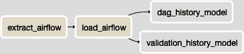

# 第十章：衡量和监控流水线性能

即使是设计最为良好的数据流水线也不应被视为“设定并忘记”。测量和监控流水线性能的实践至关重要。在流水线的可靠性方面，您有责任对团队和利益相关者设定并履行期望。

本章概述了一些技巧和最佳实践，这些技巧和实践通常由数据团队交付给其他人，但令人惊讶的是，他们并不总是在自己身上进行这些投资：收集数据并衡量其工作性能。

# 关键流水线指标

在确定需要在整个流水线中捕获哪些数据之前，首先必须决定要跟踪哪些指标。

选择指标应该从确定对您和利益相关者重要的事物开始。一些示例包括以下内容：

+   运行了多少验证测试（请参阅第八章），以及总测试中通过的百分比是多少

+   特定 DAG 成功运行的频率有多高

+   流水线在几周、几个月和几年内的总运行时间

收集计算这些指标所需的数据并不难，这在你看过接下来的章节后就会明白。可以直接从本书中早先构建的基础设施中捕获这些数据；尤其是，请参阅 Airflow（第七章）和数据验证框架（第八章）。

# 准备数据仓库

在监控和报告流水线性能之前，您当然需要捕获这些测量所需的数据。幸运的是，作为数据专业人士，您拥有在您面前的工具来执行此操作！您的数据仓库是存储来自数据流水线每个步骤的日志数据的最佳场所。

在本节中，我定义了用于存储来自 Airflow 和数据验证框架中定义的数据的表结构（请参阅第八章）。这些数据稍后将用于开发衡量流水线性能的关键指标。

我想指出，您可能希望跟踪和报告的其他数据点众多。我喜欢这两个示例，因为它们涵盖了基础知识，并应激发其他与您的数据基础架构相关的跟踪和测量。

## 数据基础架构模式

首先，您需要一张表来存储来自 Airflow 的 DAG 运行历史记录。回想一下第七章中提到，Airflow 用于执行数据流水线中的每个步骤。它还保留了每个 DAG 运行的历史记录。在提取这些数据之前，您需要一个表来加载这些数据。以下是名为`dag_run_history`的表的定义，应该在数据摄取过程中用于加载数据的模式中创建：

```
CREATE TABLE dag_run_history (
  id int,
  dag_id varchar(250),
  execution_date timestamp with time zone,
  state varchar(250),
  run_id varchar(250),
  external_trigger boolean,
  end_date timestamp with time zone,
  start_date timestamp with time zone
);
```

除了报告 DAG 的性能外，还需要提供关于数据有效性的见解。在第八章中，我定义了一个简单的基于 Python 的数据验证框架。在本章中，我将扩展它，以便将每个验证测试的结果记录到数据仓库中。名为`validation_run_history`的以下表将成为验证测试结果的目标。建议将其创建在您的数据仓库中与加载的数据相同的模式中：

```
CREATE TABLE validation_run_history (
  script_1 varchar(255),
  script_2 varchar(255),
  comp_operator varchar(10),
  test_result varchar(20),
  test_run_at timestamp
);
```

本章的其余部分实现了填充和利用先前两个表中加载数据的逻辑。

# 记录和摄入性能数据

现在是时候填充您在前一节中在数据仓库中创建的两个表了。第一个将通过构建一个数据摄入作业来填充，就像您在第四章和第五章中学到的那样。第二个将需要对首次在第八章中介绍的数据验证应用程序进行增强。

## 从 Airflow 摄入 DAG 运行历史记录

要填充您在前一节中在数据仓库中创建的`dag_run_history`表，您需要从您在“Apache Airflow Setup and Overview”中配置的 Airflow 应用程序数据库中提取数据。

在该部分中，我选择使用 Postgres 数据库供 Airflow 使用，因此以下提取代码遵循“从 PostgreSQL 数据库提取数据”中定义的模型。请注意，由于 Airflow 数据库中的`dag_run`表的自动递增`id`列，我选择增量加载数据是很容易的（定义在示例 10-1 中）。其提取结果是一个名为*dag_run_extract.csv*的 CSV 文件，上传到您在第四章中设置的 S3 存储桶。

在执行代码之前，您需要向来自第四章的*pipeline.conf*文件添加一个新部分。如下所示，它必须包含您在第七章中设置的 Airflow 数据库的连接详细信息：

```
[airflowdb_config]
host = localhost
port = 5432
username = airflow
password = pass1
database = airflowdb
```

##### 示例 10-1\. airflow_extract.py

```
import csv
import boto3
import configparser
import psycopg2

# get db Redshift connection info
parser = configparser.ConfigParser()
parser.read("pipeline.conf")
dbname = parser.get("aws_creds", "database")
user = parser.get("aws_creds", "username")
password = parser.get("aws_creds", "password")
host = parser.get("aws_creds", "host")
port = parser.get("aws_creds", "port")

# connect to the redshift cluster
rs_conn = psycopg2.connect(
            "dbname=" + dbname
            + " user=" + user
            + " password=" + password
            + " host=" + host
            + " port=" + port)

rs_sql = """SELECT COALESCE(MAX(id),-1)
 FROM dag_run_history;"""

rs_cursor = rs_conn.cursor()
rs_cursor.execute(rs_sql)
result = rs_cursor.fetchone()

# there's only one row and column returned
last_id = result[0]
rs_cursor.close()
rs_conn.commit()

# connect to the airflow db
parser = configparser.ConfigParser()
parser.read("pipeline.conf")
dbname = parser.get("airflowdb_config", "database")
user = parser.get("airflowdb_config", "username")
password = parser.get("airflowdb_config", "password")
host = parser.get("airflowdb_config", "host")
port =  parser.get("airflowdb_config", "port")
conn = psycopg2.connect(
        "dbname=" + dbname
        + " user=" + user
        + " password=" + password
        + " host=" + host
        + " port=" + port)

# get any new DAG runs. ignore running DAGs
m_query = """SELECT
 id,
 dag_id,
 execution_date,
 state,
 run_id,
 external_trigger,
 end_date,
 start_date
 FROM dag_run
 WHERE id > %s
 AND state <> \'running\';
 """

m_cursor = conn.cursor()
m_cursor.execute(m_query, (last_id,))
results = m_cursor.fetchall()

local_filename = "dag_run_extract.csv"
with open(local_filename, 'w') as fp:
    csv_w = csv.writer(fp, delimiter='|')
    csv_w.writerows(results)

fp.close()
m_cursor.close()
conn.close()

# load the aws_boto_credentials values
parser = configparser.ConfigParser()
parser.read("pipeline.conf")
access_key = parser.get("aws_boto_credentials",
                "access_key")
secret_key = parser.get("aws_boto_credentials",
                "secret_key")
bucket_name = parser.get("aws_boto_credentials",
                "bucket_name")

# upload the local CSV to the S3 bucket
s3 = boto3.client(
        's3',
        aws_access_key_id=access_key,
        aws_secret_access_key=secret_key)
s3_file = local_filename
s3.upload_file(local_filename, bucket_name, s3_file)
```

提取完成后，您可以按照第五章中详细描述的方法将 CSV 文件的内容加载到数据仓库中。如果您有一个 Redshift 数据仓库，示例 10-2 定义了如何执行此操作。

##### 示例 10-2\. airflow_load.py

```
import boto3
import configparser
import pyscopg2

# get db Redshift connection info
parser = configparser.ConfigParser()
parser.read("pipeline.conf")
dbname = parser.get("aws_creds", "database")
user = parser.get("aws_creds", "username")
password = parser.get("aws_creds", "password")
host = parser.get("aws_creds", "host")
port = parser.get("aws_creds", "port")

# connect to the redshift cluster
rs_conn = psycopg2.connect(
            "dbname=" + dbname
            + " user=" + user
            + " password=" + password
            + " host=" + host
            + " port=" + port)

# load the account_id and iam_role from the conf files
parser = configparser.ConfigParser()
parser.read("pipeline.conf")
account_id = parser.get(
                "aws_boto_credentials",
                "account_id")
iam_role = parser.get("aws_creds", "iam_role")

# run the COPY command to ingest into Redshift
file_path = "s3://bucket-name/dag_run_extract.csv"

sql = """COPY dag_run_history
 (id,dag_id,execution_date,
 state,run_id,external_trigger,
 end_date,start_date)"""
sql = sql + " from %s "
sql = sql + " iam_role 'arn:aws:iam::%s:role/%s';"

# create a cursor object and execute the COPY command
cur = rs_conn.cursor()
cur.execute(sql,(file_path, account_id, iam_role))

# close the cursor and commit the transaction
cur.close()
rs_conn.commit()

# close the connection
rs_conn.close()
```

您可能希望手动运行一次摄入过程，但稍后可以通过 Airflow DAG 按计划运行，正如本章后面的部分所述。

## 向数据验证器添加日志记录

为了记录首次在第八章中介绍的验证测试的结果，我将在*validator.py*脚本中添加一个名为`log_result`的函数。因为脚本已经连接到数据仓库以运行验证测试，所以我重用连接并简单地`INSERT`一个记录与测试结果：

```
def log_result(
      db_conn,
      script_1,
      script_2,
      comp_operator,
      result):

    m_query = """INSERT INTO
 validation_run_history(
 script_1,
 script_2,
 comp_operator,
 test_result,
 test_run_at)
 VALUES(%s, %s, %s, %s,
 current_timestamp);"""

    m_cursor = db_conn.cursor()
    m_cursor.execute(
      m_query,
      (script_1, script_2, comp_operator, result))
    db_conn.commit()

    m_cursor.close()
    db_conn.close()

    return
```

作为最后的修改，您需要在测试运行后调用新函数。在添加日志记录代码后，示例 10-3 完整定义了更新的验证器。通过此添加，每次运行验证测试时，结果都会记录在`validation_run_history`表中。

我建议运行几个验证测试以生成接下来示例所需的测试数据。有关运行验证测试的更多信息，请参阅第八章。

##### 示例 10-3\. validator_logging.py

```
import sys
import psycopg2
import configparser

def connect_to_warehouse():
    # get db connection parameters from the conf file
    parser = configparser.ConfigParser()
    parser.read("pipeline.conf")
    dbname = parser.get("aws_creds", "database")
    user = parser.get("aws_creds", "username")
    password = parser.get("aws_creds", "password")
    host = parser.get("aws_creds", "host")
    port = parser.get("aws_creds", "port")

    # connect to the Redshift cluster
    rs_conn = psycopg2.connect(
                "dbname=" + dbname
                + " user=" + user
                + " password=" + password
                + " host=" + host
                + " port=" + port)

    return rs_conn

# execute a test made of up two scripts
# and a comparison operator
# Returns true/false for test pass/fail
def execute_test(
        db_conn,
        script_1,
        script_2,
        comp_operator):

    # execute the 1st script and store the result
    cursor = db_conn.cursor()
    sql_file = open(script_1, 'r')
    cursor.execute(sql_file.read())

    record = cursor.fetchone()
    result_1 = record[0]
    db_conn.commit()
    cursor.close()

    # execute the 2nd script and store the result
    cursor = db_conn.cursor()
    sql_file = open(script_2, 'r')
    cursor.execute(sql_file.read())

    record = cursor.fetchone()
    result_2 = record[0]
    db_conn.commit()
    cursor.close()

    print("result 1 = " + str(result_1))
    print("result 2 = " + str(result_2))

    # compare values based on the comp_operator
    if comp_operator == "equals":
        return result_1 == result_2
    elif comp_operator == "greater_equals":
        return result_1 >= result_2
    elif comp_operator == "greater":
        return result_1 > result_2
    elif comp_operator == "less_equals":
        return result_1 <= result_2
    elif comp_operator == "less":
        return result_1 < result_2
    elif comp_operator == "not_equal":
        return result_1 != result_2

    # if we made it here, something went wrong
    return False

def log_result(
        db_conn,
        script_1,
        script_2,
        comp_operator,
        result):
    m_query = """INSERT INTO
 validation_run_history(
 script_1,
 script_2,
 comp_operator,
 test_result,
 test_run_at)
 VALUES(%s, %s, %s, %s,
 current_timestamp);"""

    m_cursor = db_conn.cursor()
    m_cursor.execute(
                m_query,
                (script_1,
                    script_2,
                    comp_operator,
                    result)
            )
    db_conn.commit()

    m_cursor.close()
    db_conn.close()

    return

if __name__ == "__main__":
    if len(sys.argv) == 2 and sys.argv[1] == "-h":
        print("Usage: python validator.py"
            + "script1.sql script2.sql "
            + "comparison_operator")
        print("Valid comparison_operator values:")
        print("equals")
        print("greater_equals")
        print("greater")
        print("less_equals")
        print("less")
        print("not_equal")

        exit(0)

    if len(sys.argv) != 5:
        print("Usage: python validator.py"
            + "script1.sql script2.sql "
            + "comparison_operator")
        exit(-1)

    script_1 = sys.argv[1]
    script_2 = sys.argv[2]
    comp_operator = sys.argv[3]
    sev_level = sys.argv[4]

    # connect to the data warehouse
    db_conn = connect_to_warehouse()

    # execute the validation test
    test_result = execute_test(
                    db_conn,
                    script_1,
                    script_2,
                    comp_operator)

    # log the test in the data warehouse
    log_result(
        db_conn,
        script_1,
        script_2,
        comp_operator,
        test_result)

    print("Result of test: " + str(test_result))

    if test_result == True:
        exit(0)
    else:
        if sev_level == "halt":
            exit(-1)
        else:
            exit(0)
```

有关运行验证测试的更多信息，请参阅第八章。

# 转换性能数据

现在，您已经捕获了管道中的关键事件并将它们存储在数据仓库中，您可以利用它们来报告管道的性能。最好的方法是构建一个简单的数据管道！

参考本书中引入的 ELT 模式（第三章）以及整本书中使用的模式。构建用于报告每个管道性能的管道的工作几乎完成。在前一节中已处理提取和加载（EL）步骤。您所剩下的就是转换（T）步骤。对于此管道，这意味着将来自 Airflow DAG 运行的数据以及您选择记录的其他操作转换为您打算测量和对自己负责的性能指标。

在以下小节中，我定义了用于创建本章前面讨论过的一些关键指标数据模型的转换。

## DAG 成功率

正如您在第六章中记得的那样，您必须考虑您希望建模的数据的粒度。在这种情况下，我想测量每个 DAG 按天的成功率。这种粒度水平使我能够每天、每周、每月或每年测量单个或多个 DAG 的成功率。无论 DAG 每天运行一次还是更多次，此模型都将支持成功率。示例 10-4 定义了用于构建该模型的 SQL。请注意，这是一个完全刷新的模型以简化操作。

##### 示例 10-4\. dag_history_daily.sql

```
CREATE TABLE IF NOT EXISTS dag_history_daily (
  execution_date DATE,
  dag_id VARCHAR(250),
  dag_state VARCHAR(250),
  runtime_seconds DECIMAL(12,4),
  dag_run_count int
);

TRUNCATE TABLE dag_history_daily;

INSERT INTO dag_history_daily
  (execution_date, dag_id, dag_state,
  runtime_seconds, dag_run_count)
SELECT
  CAST(execution_date as DATE),
  dag_id,
  state,
  SUM(EXTRACT(EPOCH FROM (end_date - start_date))),
  COUNT(*) AS dag_run_count
FROM dag_run_history
GROUP BY
  CAST(execution_date as DATE),
  dag_id,
  state;
```

您可以从`dag_history_daily`表中，测量单个或所有 DAG 在给定日期范围内的成功率。以下是基于在第七章中定义的一些 DAG 运行的示例，但您将看到基于您自己的 Airflow DAG 运行历史数据。确保至少运行一次 Airflow 数据的摄取（在本章前面定义）以填充`dag_history_daily`。

这是一个查询，用于按 DAG 返回成功率。当然，您可以按给定的 DAG 或日期范围进行筛选。请注意，您必须将`dag_run_count`强制转换为`DECIMAL`以计算分数成功率：

```
SELECT
  dag_id,
  SUM(CASE WHEN dag_state = 'success' THEN 1
      ELSE 0 END)
      / CAST(SUM(dag_run_count) AS DECIMAL(6,2))
  AS success_rate
FROM dag_history_daily
GROUP BY dag_id;
```

查询的输出将如下所示：

```
dag_id          |      success_rate
-------------------------+------------------------
tutorial                | 0.83333333333333333333
elt_pipeline_sample     | 0.25000000000000000000
simple_dag              | 0.31250000000000000000
(3 rows)
```

## DAG 运行时间随时间的变化

经常使用时间来测量 DAG 的运行时间，以便跟踪随着时间推移完成时间较长的 DAG，从而创建数据仓库中数据过时的风险。我将使用我在上一小节中创建的`dag_history_daily`表来计算每个 DAG 按日平均运行时间。

请注意，在以下查询中，我仅包括成功的 DAG 运行，但在某些情况下，您可能希望报告运行时间长且失败的 DAG 运行（也许是由于超时！）。还要记住，由于给定 DAG 的多次运行可能在单个日内发生，因此我必须在查询中对这些 DAG 的运行时间进行平均。

最后，因为`dag_history_daily`表按日期和`dag_state`进行了细分，我实际上不需要对`runtime_seconds`和`dag_run_count`求和，但作为最佳实践，我会这样做。为什么呢？如果我或另一位分析师决定更改逻辑以包括失败的 DAG 运行等操作，那么`SUM()`函数就会是必需的，但很容易被忽视。

这里是从第七章中的`elt_pipeline_sample` DAG 的查询：

```
SELECT
  dag_id,
  execution_date,
  SUM(runtime_seconds)
    / SUM(CAST(dag_run_count as DECIMAL(6,2)))
  AS avg_runtime
FROM dag_history_daily
WHERE
  dag_id = 'elt_pipeline_sample'
GROUP BY
  dag_id,
  execution_date
ORDER BY
dag_id,
execution_date;
```

查询的输出将类似于以下内容：

```
dag_id        | execution_date |     avg_runtime
---------------------+----------------+----------
elt_pipeline_sample | 2020-09-16     |  63.773900
elt_pipeline_sample | 2020-09-17     | 105.902900
elt_pipeline_sample | 2020-09-18     | 135.392000
elt_pipeline_sample | 2020-09-19     | 101.111700
(4 rows)
```

## 验证测试量和成功率

由于您在本章前面为数据验证器添加的额外日志，现在可以测量验证测试的成功率以及运行的测试总量。

示例 10-5 定义了一个名为`validator_summary_daily`的新数据模型，用于按日粒度计算和存储每个验证器测试的结果。

##### 示例 10-5\. validator_summary_daily.sql

```
CREATE TABLE IF NOT EXISTS validator_summary_daily (
  test_date DATE,
  script_1 varchar(255),
  script_2 varchar(255),
  comp_operator varchar(10),
  test_composite_name varchar(650),
  test_result varchar(20),
  test_count int
);

TRUNCATE TABLE validator_summary_daily;

INSERT INTO validator_summary_daily
  (test_date, script_1, script_2, comp_operator,
  test_composite_name, test_result, test_count)
SELECT
  CAST(test_run_at AS DATE) AS test_date,
  script_1,
  script_2,
  comp_operator,
  (script_1
    || ' '
    || script_2
    || ' '
    || comp_operator) AS test_composite_name,
  test_result,
  COUNT(*) AS test_count
FROM validation_run_history
GROUP BY
  CAST(test_run_at AS DATE),
  script_1,
  script_2,
  comp_operator,
  (script_1 || ' ' || script_2 || ' ' || comp_operator),
  test_result;
```

尽管创建`validator_summary_daily`的逻辑相当简单，但还是值得注意`test_composite_name`列。在没有为每个验证测试指定唯一名称（一个值得考虑的增强功能）的情况下，`test_composite_name`是测试的两个脚本和运算符的组合。它充当了一个可以用来分组验证测试运行的复合键。例如，以下是计算每个测试通过时间百分比的 SQL。当然，您可以按天、周、月或其他任何时间范围查看这些内容：

```
SELECT
  test_composite_name,
  SUM(
    CASE WHEN test_result = 'true' THEN 1
    ELSE 0 END)
    / CAST(SUM(test_count) AS DECIMAL(6,2))
  AS success_rate
FROM validator_summary_daily
GROUP BY
  test_composite_name;
```

输出将类似于以下内容：

```
test_composite_name    |      success_rate
--------------------------+----------------------
sql1.sql sql2.sql equals    | 0.33333333333333333
sql3.sql sql4.sql not_equal | 0.75000000000000000

(2 rows)
```

至于测试运行的数量，您可能希望按日期、测试或两者查看。如前所述，保持此值的上下文很重要。随着管道数量和复杂性的增加，您可以使用此措施确保在整个管道中测试数据的有效性。以下 SQL 通过日期生成测试计数和成功率。这是一个数据集，您可以在双 Y 轴线图或类似可视化上绘制：

```
SELECT
  test_date,
  SUM(
    CASE WHEN test_result = 'true' THEN 1
    ELSE 0 END)
    / CAST(SUM(test_count) AS DECIMAL(6,2))
  AS success_rate,
  SUM(test_count) AS total_tests
FROM validator_summary_daily
GROUP BY
  test_date
ORDER BY
  test_date;
```

结果将类似于以下内容：

```
test_date  |      success_rate      | total_tests
------------+------------------------+-----------
2020-11-03 | 0.33333333333333333333 |         3
2020-11-04 | 1.00000000000000000000 |         6
2020-11-05 | 0.50000000000000000000 |         8

(3 row)
```

# 管理性能管道

有了前几节的代码，你可以创建一个新的 Airflow DAG 来调度和编排一个管道，以摄取和转换管道性能数据。这可能感觉有点递归，但你可以利用你已有的基础设施来执行这种类型的操作。请记住，这种向后看的报告侧重于洞察力，而不是像运行时间监控或管道警报那样的使命关键任务。你永远不想使用相同的基础设施来执行这些任务！

## 性能 DAG

基于第 7 章中的示例，编排所有在本章中定义的步骤的 DAG 将会很熟悉。根据示例 10-3，验证测试的结果已经记录在数据仓库中。这意味着在这个管道中只需要进行少数几个步骤：

1.  从 Airflow 数据库提取数据（参见示例 10-1）。

1.  从 Airflow 提取的数据加载到数据仓库中（参见示例 10-2）。

1.  转换 Airflow 历史（参见示例 10-4）。

1.  转换数据验证历史（参见示例 10-5）。

示例 10-6 是 Airflow DAG 的源代码，而图 10-1 显示了该 DAG 的图形形式。



###### 图 10-1\. 流水线性能 DAG 的图形视图。

##### 示例 10-6\. pipeline_performance.py

```
from datetime import timedelta
from airflow import DAG
from airflow.operators.bash_operator \
    import BashOperator
from airflow.operators.postgres_operator \
    import PostgresOperator
from airflow.utils.dates import days_ago

dag = DAG(
    'pipeline_performance',
    description='Performance measurement pipeline',
    schedule_interval=timedelta(days=1),
    start_date = days_ago(1),
)

extract_airflow_task = BashOperator(
    task_id='extract_airflow',
    bash_command='python /p/airflow_extract.py',
    dag=dag,
)

load_airlflow_task = BashOperator(
    task_id='load_airflow',
    bash_command='python /p/airflow_load.py',
    dag=dag,
)

dag_history_model_task = PostgresOperator(
    task_id='dag_history_model',
    postgres_conn_id='redshift_dw',
    sql='/sql/dag_history_daily.sql',
    dag=dag,
)

validation_history_model_task = PostgresOperator(
    task_id='validation_history_model',
    postgres_conn_id='redshift_dw',
    sql='/sql/validator_summary_daily.sql',
    dag=dag,
)

extract_airflow_task >> load_airlflow_task
load_airlflow_task >> dag_history_model_task
load_airlflow_task >> validation_history_model_task
```

# 性能透明度

有了一个工作中的管道来衡量你的生产管道和数据验证测试的性能，还有一件事要记住：与你的数据团队和利益相关者分享由此产生的见解的重要性。管道性能的透明度对于建立与利益相关者的信任，以及在你的团队中创建归属感和自豪感至关重要。

这里有一些利用本章节生成的数据和见解的技巧：

利用可视化工具

使你创建的数据模型的度量指标能够在与你的利益相关者使用的相同可视化工具中访问。可能是 Tableau、Looker 或类似产品。无论是什么，确保它是你的团队和利益相关者每天都会去的地方。

定期分享总结的度量指标

至少每月（如果不是每周）通过电子邮件、Slack 或团队和利益相关者关注的其他地方分享总结的度量指标。

观察趋势，而不仅仅是当前值

在你分享的仪表板和总结中，不仅仅分享每个指标的最新值。还包括随时间变化的情况，并确保负面趋势像正面趋势一样频繁地指出。

反应趋势

分享度量指标的趋势不仅仅是为了展示。这是一个反应和改进的机会。验证测试的失败率比前一个月高吗？深入挖掘原因，做出改变，并观察未来的趋势来衡量你的工作的影响。
