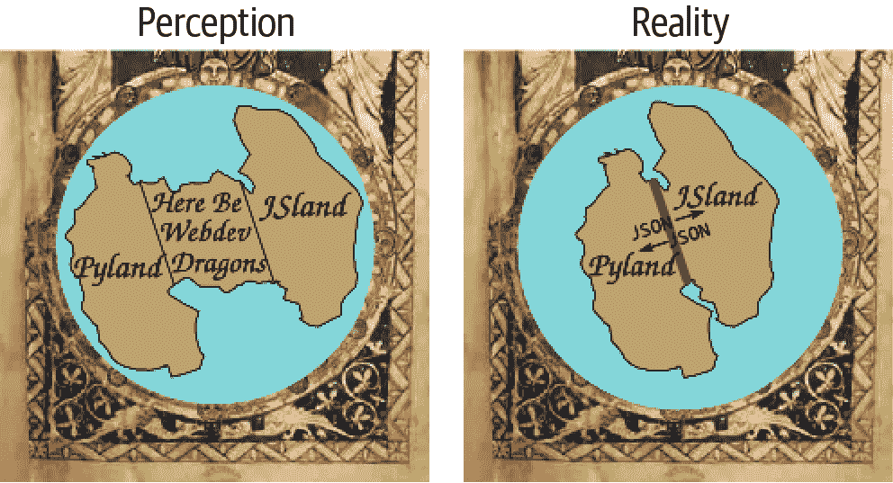
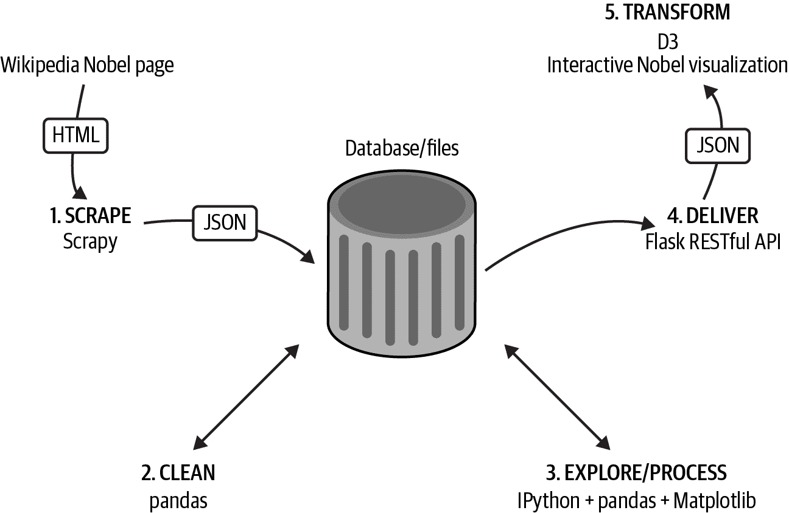
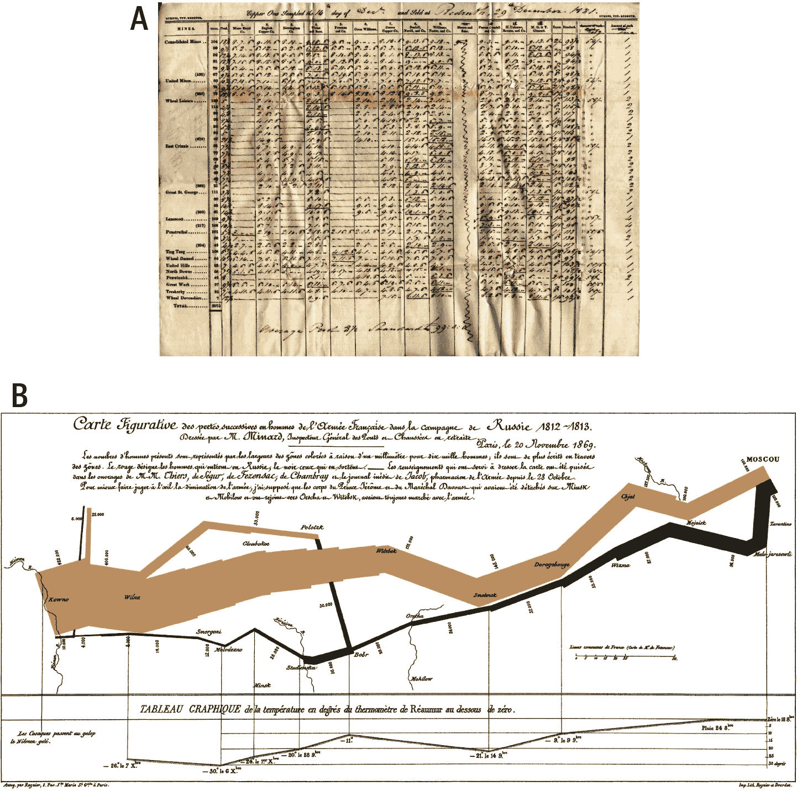

# 第一章：简介

这本书的目标是让你快速掌握我认为最强大的数据可视化堆栈：Python 和 JavaScript。你将学习足够的关于像 pandas 和 D3 这样的大型库，开始打造自己的网络数据可视化并完善自己的工具链。专业知识将随着实践而来，但是这本书提供了一个基础能力的浅学习曲线。

###### 注意

如果你正在阅读这本书，我很乐意听取你的任何反馈意见。请发送至 pyjsdataviz@kyrandale.com。非常感谢。

你可以在[我的网站](https://www.kyrandale.com/viz/nobel_viz_v2)找到诺贝尔奖可视化的工作副本，这本书在字面和象征意义上都是在构建这一可视化。

这本书的大部分内容讲述了无数数据可视化故事之一，精心选择以展示一些强大的 Python 和 JavaScript 库和工具，这些库和工具一起形成了一个工具链。这个工具链在其起点收集原始未加工数据，在其终点提供丰富而引人入胜的网络可视化。像所有的数据可视化故事一样，这是一个转变的故事——在这种情况下，将一个基本的维基百科诺贝尔奖获奖者列表转化为互动可视化，使得探索奖项历史变得轻松而有趣。

无论你有什么样的数据，想用它讲述什么样的故事，将其转化为可视化后的自然家园就是网络。作为一个交付平台，它比以往任何一个平台都更加强大，而这本书旨在使得从基于桌面或服务器的数据分析和处理过渡到网络变得更加顺畅。

使用这两种强大语言不仅能够提供强大的网络可视化，而且还充满乐趣和吸引力。

许多潜在的数据可视化程序员认为*网页开发*和他们想做的事情之间存在很大的分歧，他们想做的是使用 Python 和 JavaScript 进行编程。网页开发涉及大量关于标记语言、样式脚本和管理的深奥知识，并且不能没有像*Webpack*或*Gulp*这样奇怪命名的工具。如今，这种巨大分歧可以被缩小到一层薄薄的、非常可渗透的膜，使你能够专注于你擅长的事情：用最少的功夫编程（见图 I-1），将网页服务器降低到数据交付的级别。

###### 图 I-1\. 这里是网页开发的巨龙

# 本书适合读者

首先，这本书适合所有对 Python 或 JavaScript 有合理掌握的人，他们希望探索当前数据处理生态系统中最令人兴奋的领域之一：数据可视化的爆炸性增长。同时，它也解决了一些根据我的经验相当普遍的具体挑战。

当你被委托写技术书籍时，编辑通常会明智地提醒你，要考虑你的书能解决的*痛点*。这本书的两个关键痛点最好通过一些故事来说明，包括我自己的故事和一些 JavaScript 开发者向我讲述的故事的各种变体。

多年前，作为一名学术研究员，我接触到 Python 并爱上了它。我之前在 C++中写了一些相当复杂的模拟程序，Python 的简洁和强大为我带来了一股清新的空气，远离了所有样板文件、声明、定义等等。编程变得有趣起来。Python 是完美的粘合剂，与我的 C++库良好配合（当时 Python 并不是速度飞快的语言，现在也不是），并且毫不费力地执行低级语言中让人头疼的所有操作（例如文件 I/O、数据库访问和序列化）。我开始用 Python 编写所有的图形用户界面（GUI）和可视化工具，使用 wxPython、PyQt 以及其他许多简单易用的工具集。不幸的是，尽管其中一些工具非常酷，我很想与世界分享，但需要打包、分发并确保它们仍然与现代库兼容的努力代表了我难以克服的障碍。

那时候，有一个在理论上是完美的软件通用分发系统存在，那就是网页浏览器。网页浏览器几乎在地球上每台计算机上都可以找到，并且具有自己的内置解释型编程语言：一次编写，到处运行。但是 Python 不能在网页浏览器的沙盒中运行，而且浏览器对于宏大的图形和可视化是无能为力的，基本上只能处理静态图像和偶尔的[jQuery 转换](https://jquery.com)。JavaScript 是一种“玩具”语言，与非常慢的解释器绑定，只适合做一些[DOM](https://oreil.ly/QnE0a)小技巧，但绝对无法与我在桌面上使用 Python 所能做的相提并论。因此，这条路线被毫不留情地排除了。我的可视化想要呈现在网络上，但却没有办法去实现它。

十年左右过去了，多亏了由 Google 及其 V8 引擎发起的竞争激化，JavaScript 现在的速度已经快了几个数量级；事实上，它现在比 Python 快得多。¹ HTML 也通过 HTML5 的形式稍作整理。现在使用起来更加舒适，减少了大量样板代码。像可伸缩矢量图形（SVG）这样宽松跟进、不太稳定的协议已经得到了很好的加固，得益于强大的可视化库，尤其是 D3。现代浏览器被要求与 SVG 和越来越多的 3D 技术如 WebGL 及其衍生库（如 THREE.js）良好协作。我以前在 Python 中做的可视化现在可以在你的本地网页浏览器上实现，而且最大的好处是，只需很少的努力，就能让它们适用于全世界的每台台式机、笔记本电脑、智能手机和平板电脑。

那么，为什么 Python 爱好者们不纷纷将他们的数据以他们指定的形式发布出去呢？毕竟，除了自己精心制作之外，别无选择，这对我认识的大多数数据科学家来说都远非理想。首先，有那个术语*web development*，暗示着复杂的标记、难以理解的样式表，以及一大堆新工具需要学习，需要掌握的 IDE。然后是 JavaScript 本身，这是一种奇怪的语言，直到最近被认为不过是一种玩具，而且在某种程度上难以归类。我打算直面这些痛点，并展示，你可以使用极少量的 HTML 和 CSS 样板代码制作现代的 Web 可视化（通常是单页应用程序），让你专注于编程，而 JavaScript 对于 Python 爱好者来说并不难上手。但你并不需要跳跃；第二章 是一个语言桥梁，旨在帮助 Python 爱好者和 JavaScript 开发者通过突出共同元素和提供简单的转换来弥合语言之间的鸿沟。

第二个故事在我认识的 JavaScript 数据可视化者中很普遍。在 JavaScript 中处理数据远非理想。虽然语言最近的功能增强使得数据整理变得更加愉快，但仍然没有真正的数据处理生态系统可言。因此，现有的强大可视化库（D3 仍然是最重要的库）和浏览器提供的清洁和处理任何传输到浏览器的数据的能力之间存在明显的不对称。所有这些都要求你在另一种语言中进行数据清洗、处理和探索，或者使用像 Tableau 这样的工具包，这通常会演变为零散的探索，模糊记忆的 Matlab，陡峭学习曲线的 R，或者一两个 Java 库。

像[Tableau](https://www.tableau.com)这样的工具包尽管非常令人印象深刻，但对程序员来说常常令人沮丧。在 GUI 中无法复制一个好的、通用编程语言的表现力。此外，如果您想创建一个小型的 Web 服务器来传递处理过的数据，那就意味着至少要学习一种新的 Web 开发能力语言。

换句话说，开始拓展其数据可视化的 JavaScript 开发者，正在寻找一个需要时间投入最少、学习曲线最浅的互补数据处理栈。

## 使用本书的最低要求

我总是对限制人们探索的行为感到不情愿，特别是在编程和网络的背景下，充斥着自学者（否则人们如何在学术界落后于潮流的情况下学习呢？），他们快速而狂热地学习，光彩夺目地不受曾经适用于学习的正式限制的约束。从编程语言的角度来看，Python 和 JavaScript 几乎是最简单的，并且都是最佳首选语言的主要候选者。在解释代码时，没有太大的认知负荷。

按照这种精神，有些专家程序员，即使没有 Python 和 JavaScript 的任何经验，也可以在一周内消化这本书，并且能够编写自定义库。

对于初学者程序员来说，对 Python 或 JavaScript 新手来说，这本书可能太高级了，我建议您利用当前大量的书籍、网络资源、录屏和其他资源，这些资源使学习变得如此简单。专注于个人的兴趣点，一个您想解决的问题，并通过实践学习编程——这是唯一的方式。

对于那些已经在 Python 或 JavaScript 中编程过一点的人，我建议入门的门槛是您已经一起使用了几个库，了解了您语言的基本习惯，并且能够看一段新代码，并大致了解其中的运行机制——换句话说，可以使用标准库的几个模块的 Python 开发者，以及已经使用过一些库并理解其源代码几行的 JavaScript 开发者。

# 为什么选择 Python 和 JavaScript？

为什么选择 JavaScript 是一个容易回答的问题。在现在和可预见的未来，只有一种一流的、基于浏览器的编程语言。虽然曾经有过各种扩展、增强和篡改的尝试，但好旧的、普通的 JavaScript 仍然是首屈一指的。如果您想制作现代、动态、交互式的可视化，并且在点击按钮时将它们传递给世界，那么迟早您会遇到 JavaScript。您可能不需要掌握它，但基本的能力是进入现代数据科学中最激动人心的领域的基本门槛。这本书将带您进入这个领域。

## 为什么不在浏览器中使用 Python？

最近有一些倡议旨在在浏览器中运行 Python 的有限版本。例如，[Pyodide](https://github.com/pyodide/pyodide)是将 CPython 移植到 WebAssembly 的一个项目。这些项目令人印象深刻且有趣，但目前在 Python 中生成网页图表的主要方式是通过中间库自动转换它们。

目前有一些非常令人印象深刻的倡议，旨在使 Python 生成的可视化效果能够在浏览器中运行。它们通过将 Python 代码转换为基于`canvas`或`svg`绘图上下文的 JavaScript 来实现。其中最受欢迎和成熟的是[Plotly](https://plot.ly)和[Bokeh](https://bokeh.pydata.org/en/latest)。在第十四章中，您将看到如何在 Jupyter 笔记本中使用 Plotly 生成图表，并将其转移到网页上。对于许多用例来说，这是一个很好的数据可视化工具。

虽然这些 JavaScript 转换器背后有一些精彩的编码和许多实际用例，但它们确实有很大的局限性：

+   自动代码转换可能能完成任务，但生成的代码通常对人类来说很难理解。

+   使用强大的基于浏览器的 JavaScript 开发环境调整和定制生成的图表可能会很痛苦。在第十四章中，我们将看到如何通过使用 Plotly 的 JS API 来减轻这种痛苦。

+   您目前只能使用这些库中当前可用的图表类型的子集。

+   当前的交互性非常基础。最好使用浏览器的开发工具，在 JavaScript 中定制用户控件。

请记住，构建这些库的人必须是 JavaScript 专家，因此如果您希望理解他们正在做的事情并最终表达自己，那么您必须学习一些 JavaScript。

## 为什么选择 Python 进行数据处理

关于数据处理，选择 Python 的原因更加复杂一些。首先，在数据处理方面有很多良好的替代方案。让我们从企业巨头 Java 开始，逐一探讨一些候选方案。

### Java

在其他主要的通用编程语言中，只有 Java 提供了类似 Python 丰富库生态系统的东西，并且速度更快。但是虽然 Java 比如 C++之类的语言更容易编程，但在我看来，它并不是一种特别好的编程语言，因为它有太多的乏味样板代码和过度冗长的言辞。这种事情在一段时间后开始变得沉重，并使编程变得非常困难。至于速度，Python 的默认解释器速度较慢，但 Python 是一种很好的“胶水”语言，可以与其他语言很好地协作。这种能力由大型 Python 数据处理库如 NumPy（及其依赖项 pandas）、SciPy 等所展示，它们使用 C++和 Fortran 库来进行重型计算，同时提供简单脚本语言的易用性。

### R

备受尊敬的 R 直到最近一直是许多数据科学家的首选工具，也许是 Python 在这一领域的主要竞争对手。像 Python 一样，R 受益于一个非常活跃的社区，一些很棒的工具如绘图库 ggplot2，以及专门为数据科学和统计学设计的语法。但这种专业性是一把双刃剑。因为 R 是为特定目的开发的，这意味着如果你想写一个用于提供 R 处理数据的 Web 服务器，你必须跳出去使用另一种语言，带来了所有相关的学习开销，或者尝试以一种圆孔/方钉的方式粗略地组合。Python 的通用性质和其丰富的生态系统意味着可以在不离开其舒适区的情况下完成几乎所有数据处理流水线所需的一切（除了 JS 视觉）。对我个人而言，这是为了一点点语法笨拙而付出的小小牺牲。

### 其他

有其他选择可以用 Python 进行数据处理，但它们都无法与一种通用、易于使用的编程语言及其丰富的库生态系统所带来的灵活性和能力相比。例如，像 Matlab 和 Mathematica 这样的数学编程环境有着活跃的社区和大量优秀的库，但它们几乎不能算作通用目的，因为它们设计用于在封闭的环境中使用。它们也是专有的，这意味着需要显著的初始投资，并且与 Python 显然开放源代码的环境不同。

像[Tableau](https://www.tableau.com)这样由 GUI 驱动的数据可视化工具是伟大的创造，但对于习惯了编程自由的人来说，它们很快会感到沮丧。只要你按照它们的乐谱唱歌，它们通常运行良好。一旦偏离指定路径，情况就会迅速恶化。

## Python 的日益改进

就目前情况而言，我认为可以充分证明 Python 是新兴数据科学家的首选语言。但事情并未停滞不前；事实上，Python 在这一领域的能力正以惊人的速度增长。举个例子，我已经使用 Python 编程超过 20 年了，并且习惯于惊讶于如果找不到一个 Python 模块来帮助解决手头的问题，但我发现 Python 在数据处理能力方面的增长让我感到惊讶，每周都会出现一个新的强大库。例如，Python 传统上在统计分析库方面表现较弱，而 R 则遥遥领先。最近，一些强大的模块，如 statsmodels，开始迅速弥补这一差距。

Python 是一个繁荣的数据处理生态系统，几乎无与伦比的通用性，并且它每周都在变得更好。可以理解为什么社区中有这么多人处于如此兴奋的状态——这确实令人振奋。

至于在浏览器中的可视化，好消息是 JavaScript 并不仅限于它在网络生态系统中的特权，相反，由于解释器的竞争战，性能大幅提升，以及一些强大的可视化库，比如 D3，这些都能与任何语言完美配合，JavaScript 现在拥有了真正的实力。

简而言之，Python 和 JavaScript 是网络数据可视化的绝佳补充，彼此需要对方来提供至关重要的缺失组件。

# **你将学到什么**

在我们的数据可视化工具链中，有一些重要的 Python 和 JavaScript 库，要全面覆盖它们需要多本书。然而，我认为大多数库的基础知识，尤其是本书涵盖的那些，可以相当快地掌握。专业知识需要时间和实践，但要成为高效工作所需的基础知识，可以说是“易如反掌”。

从这个意义上说，本书旨在为您提供坚实的实用知识基础，足以支撑未来发展的重任。我旨在尽可能地降低学习曲线，并通过实际技能帮助您克服最初的障碍，开始精炼您的技艺。

本书强调实用主义和最佳实践。它将涵盖大量内容，没有足够的空间进行许多理论上的分歧。我涵盖了工具链中最常用的库的方面，并指引您去了解其他问题的资源。大多数库都有一些核心的函数、方法、类等，这些是主要的、功能性的子集。有了这些工具，您实际上可以做一些事情。最终，您会发现有些问题您无法仅凭这些工具解决，这时好书、文档和在线论坛将成为您的朋友。

## **库的选择**

在选择本书中使用的库时，我有三个考虑因素：

+   开源和 [免费（如啤酒一样）](https://oreil.ly/WwriM) —— 您无需额外投资任何费用就可以使用本书进行学习。

+   历史悠久 —— 通常是经过良好建立、由社区驱动和流行的。

+   假设有良好的支持和活跃的社区，**最佳实践**处于流行度和实用性的甜蜜点。

您在此学到的技能应该会长期保持相关性。通常情况下，已经选择了明显的候选库——这些库可以自行编写它们的票据。在适当的情况下，我将突出显示替代选择，并对我选择的理由进行说明。

## 开篇

在我们的诺贝尔奖数据集通过工具链进行转换之旅开始之前，需要一些初步章节。这些章节涵盖了使得后续工具链章节更流畅运行所需的基本技能。前几章包括以下内容：

第二章，“Python 和 JavaScript 之间的语言学习桥梁”

搭建 Python 和 JavaScript 之间的语言桥梁

第三章，“使用 Python 读写数据”

如何通过 Python 在各种文件格式和数据库中传递数据

第四章，“Webdev 101”

涵盖本书所需的基本网页开发

这些章节既是教程又是参考，可以直接跳到工具链的开始部分，需要时再回头查看。

# 数据可视化工具链

本书的主要部分展示了数据可视化工具链，跟随诺贝尔奖获得者数据集从原始的、刚刮取下来的数据到引人入胜的、交互式的 JavaScript 可视化的过程。在收集过程中，展示了多个大型库的精炼和转换，总结在 图 I-2 中。这些库是我们工具链的工业车床：丰富、成熟的工具展示了 Python+JavaScript 数据可视化堆栈的力量。接下来的章节包含了对我们工具链五个阶段及其主要库的简要介绍。

###### 图 I-2\. 数据可视化工具链

## 1\. 使用 Scrapy 抓取数据

任何数据可视化工作者的第一个挑战是获得他们需要的数据，无论是受到请求的启发还是为了解决个人问题。如果非常幸运，这些数据会以原始形式交付给您，但更多时候您需要自己去寻找。我将介绍您可以使用 Python 从网络获取数据的各种方法（例如，web API 或 Google 电子表格）。用于工具链演示的诺贝尔奖数据集是通过使用 Scrapy 从维基百科页面抓取的。²

Python 的 Scrapy 是一个工业强度的爬虫程序，可以处理所有的数据节流和媒体管道，如果您计划抓取大量数据，这些功能是不可或缺的。抓取数据通常是获取您感兴趣数据的唯一途径，一旦掌握了 Scrapy 的工作流程，之前无法访问的数据集只隔一只蜘蛛之遥。³

## 2\. 使用 pandas 清洗数据

数据可视化的不为人知的秘密是，几乎所有的数据都是不干净的，将其转化为可用的数据可能会比预期花费更多时间。这是一个不起眼的过程，很容易占用超过一半的时间，这也是掌握它并使用正确工具的更多理由。

*pandas* 在 Python 数据处理生态系统中扮演着重要角色。它是一个 Python 数据分析库，其主要组件是 DataFrame，本质上是一个编程化的电子表格。pandas 将 NumPy（Python 强大的数值计算库）扩展到了异构数据集的领域，这些数据集包括分类、时间序列和顺序信息，这些是数据可视化者必须处理的类型。

除了适合交互式探索数据（使用其内置的 Matplotlib 绘图），pandas 还非常适合清理数据的苦活，可以轻松定位重复记录，修复不规范的日期字符串，找到丢失的字段等等。

## 3\. 使用 pandas 和 Matplotlib 探索数据

在开始将数据转换为可视化之前，您需要对数据有深入的理解。数据中隐藏的模式、趋势和异常将决定您试图通过数据传达的故事，无论是解释年度小部件销售的最近增长还是展示全球气候变化。

与*IPython*一起，作为强化版的 Python 解释器，pandas 和 Matplotlib（包括 seaborn 等附加组件）提供了一种很好的交互式数据探索方式，可以从命令行生成丰富的内联图表，通过切片和切块数据来揭示有趣的模式。这些探索的结果可以轻松保存到文件或数据库，供 JavaScript 可视化使用。

## 4\. 使用 Flask 传递您的数据

一旦您探索和完善了您的数据，您将需要将其提供给 Web 浏览器，其中像 D3 这样的 JavaScript 库可以转换它。使用像 Python 这样的通用语言的一个伟大优势是，它像通过几行代码滚动一个 Web 服务器一样轻松，它像使用 NumPy 和 SciPy 这样的特定目的库一样轻松处理大型数据集。⁴ *Flask* 是 Python 最流行的轻量级服务器，非常适合创建小型的、RESTful⁵ API，JavaScript 可以使用它从服务器、文件或数据库中获取数据到浏览器。正如我将演示的那样，您可以用几行代码来创建一个 RESTful API，能够从 SQL 或 NoSQL 数据库中提供数据。

## 5\. 使用 Plotly 和 D3 将数据转换为交互式可视化

数据清洗和精炼完成后，我们进入可视化阶段，展示数据集的精选反映，可能允许用户进行交互式探索。根据数据的不同，这可能涉及传统图表、地图或新颖的可视化方式。

Plotly 是一个出色的图表库，允许您在 Python 中开发图表并将其转移到 Web 上。正如我们将在第十四章中看到的那样，它还具有一个 JavaScript API，模仿 Python API，为您提供一个免费的本地 JS 图表库。

*D3* 是 JavaScript 强大的可视化库，无论语言如何，都是最强大的可视化工具之一。我们将使用 D3 创建一个包含多个元素和用户交互的新颖的诺贝尔奖可视化，允许人们探索数据集中的感兴趣项。学习 D3 可能具有挑战性，但我将迅速带您了解并准备好开始磨练您的技能。

## 更小的库

除了涵盖的大型库外，还有一个大量的小型库支持群体。这些是不可或缺的小工具，是工具链的锤子和扳手。特别值得一提的是 Python 生态系统非常丰富，几乎为每个可想象的任务提供了小型专业库。在强大的支持阵容中，特别值得一提的是：

Requests

Python 的首选 HTTP 库，完全配得上其口号“人类的 HTTP”。Requests 比 Python 自带的 urllib2 要好得多。

SQLAlchemy

最好的 Python SQL 工具包和对象关系映射器（ORM）。它功能丰富，使得与各种基于 SQL 的数据库的工作相对轻松。

seaborn

作为 Python 绘图强大工具 Matplotlib 的重要补充，它添加了一些非常有用的图形类型，特别适用于数据可视化者。它还增加了更出色的美学效果，覆盖了 Matplotlib 的默认设置。

Crossfilter

尽管 JavaScript 的数据处理库还在不断发展中，但最近出现了一些非常有用的库，其中 Crossfilter 是一个突出的例子。它能够非常快速地对行列数据集进行过滤，非常适合数据可视化工作，这一点并不令人意外，因为它的创始人之一是 D3 的创始人 Mike Bostock。

marshmallow

一个非常出色且非常方便的库，可以将诸如对象之类的复杂数据类型转换为原生 Python 数据类型。

# 使用本书

虽然本书的不同部分遵循数据转换的过程，但不必从头到尾一次性阅读。第一部分提供了一个基本工具包，用于基于 Python 和 JavaScript 的 web 数据可视化，并且其中的内容对许多读者来说可能是熟悉的。挑选你不了解的内容，并根据需要进行回溯（根据需要将会有链接回溯）。对于那些精通这两种语言的人来说，Python 和 JavaScript 之间的语言学习桥梁是不必要的，尽管仍然可能有一些有用的信息。

本书的其余部分遵循我们的工具链，将一个相当乏味的 web 列表转化为一个完全成熟、交互式的 D3 可视化，本质上是相互独立的。如果你想立即深入到 第三部分 并使用 pandas 进行一些数据清理和探索，可以直接进行，但要注意它假定存在一个脏的诺贝尔奖数据集。如果这符合你的计划，稍后可以看看 Scrapy 是如何产生它的。同样，如果你想直接开始创建诺贝尔可视化应用的第四部分和第五部分，请注意它们假设有一个干净的诺贝尔奖数据集。

无论选择哪条路径，我建议最终目标是掌握书中涵盖的所有基本技能，如果你打算把数据可视化作为你的职业。

# 一点背景信息

这是一本实用的书，假设读者对自己想要可视化的内容有一个相当清晰的想法，以及这种可视化应该看起来和感觉如何，并且渴望开始行动，不受太多理论的约束。然而，借鉴数据可视化的历史既可以澄清本书的中心主题，也可以增加宝贵的背景知识。它还可以帮助解释为什么现在是进入这个领域的如此激动人心的时刻，因为技术创新正在推动新型数据可视化形式的发展，人们正在努力解决因互联网生成的多维数据量不断增加而带来的问题。

数据可视化背后有着一整套令人印象深刻的理论体系，而且有一些我建议你阅读的好书（参见“推荐书籍”）。理解人类视觉收集信息的方式的实际好处不言而喻。例如，通过心理测量实验，我们现在已经相当清楚如何欺骗人类视觉系统，使数据中的关系更难理解。相反，我们可以展示一些视觉形式几乎最优化地增强对比度。至少从文献上来看，这些提供了一些有用的经验法则，建议了解任何特定数据叙事的良好候选人。

本质上，良好的数据可视化试图以一种能够揭示或强调可能存在的任何模式或趋势的方式呈现数据，这些数据可能是从世界上的测量（经验性）中收集的，或者作为抽象数学探索的产物（例如，[Mandelbrot 集](https://oreil.ly/w5BIV)的美丽分形图案）。这些模式可以是简单的（例如，按国家平均体重），也可以是复杂统计分析的产物（例如，在更高维度空间中的数据聚类）。

在其未转换的状态下，我们可以想象这些数据漂浮为一个模糊的数字或类别云团。任何模式或相关性都完全隐晦。很容易忘记，但是卑微的电子表格（图 I-3 a）就是数据可视化——数据排列成行列形式是为了驯服它，使其操作更容易，并突出差异（例如，精算簿记）。当然，大多数人并不擅长在数字行中发现模式，因此开发了更易于理解的视觉形式来与我们的视觉皮层互动，这是人类获取关于世界信息的主要通道。于是便有了条形图、饼图⁶和折线图的出现。更富想象力的方法被用来将统计数据提炼成更易理解的形式，其中最著名的之一是查尔斯·约瑟夫·米纳德对 1812 年拿破仑灾难性俄罗斯战役的可视化（图 I-3 b）。

图 I-3 中的浅棕色流表示拿破仑军队向莫斯科进发；黑线表示撤退。流的粗细代表拿破仑军队规模，随伤亡增加而变薄。下方的温度图表用于指示沿途位置的温度。请注意 Minard 如何巧妙地结合多维数据（伤亡统计、地理位置和温度），以展现战争的惨状，这在其他方式下很难理解（想象试图从伤亡图表跳转到位置列表并进行必要的联系）。我认为现代交互式数据可视化的主要问题与 Minard 面临的问题完全相同：如何超越传统的一维条形图（对于许多事情来说完全有效）并开发新的有效传达跨维度模式的方式。

###### 图 I-3\. (a) 早期电子表格和 (b) Charles Joseph Minard 对 1812 年拿破仑俄罗斯战役的可视化

直到最近，我们对图表的大部分体验与 Charles Joseph Minard 的观众并无多大不同。它们都是预渲染和惰性的，展示的只是数据的一个反映，希望是一个重要且有洞察力的反映，但仍然完全受作者控制。在这个意义上，将真实的墨水点替换为计算机屏幕像素只是分布规模的改变。

互联网的发展只是用像素取代了新闻纸，可视化仍然是不可点击且静态的。最近，一些强大的可视化库（其中以 D3 为首）和 JavaScript 性能的大幅提升开辟了一条新的可视化路径，这种可视化方式易于访问和动态，并实际上鼓励探索和发现。数据探索和展示之间的明确界限变得模糊。这种新型数据可视化是本书的重点，也是为什么 Web 数据可视化现在如此令人兴奋的原因。人们正在尝试创造新的数据可视化方式，使其对最终用户更加可访问和有用。这简直是一场革命。

# 摘要

现在，数据可视化在网络上是一个令人兴奋的领域，交互式可视化的创新层出不穷，许多（如果不是大多数）都是用 D3 开发的。 JavaScript 是唯一的基于浏览器的语言，因此酷炫的视觉效果必然是用它（或转换为它）。但是 JavaScript 缺乏进行数据聚合、筛选和处理的工具或环境，这是现代数据可视化同样重要但不那么引人注目的部分。这就是 Python 的优势所在，它提供了一种通用、简洁和极易阅读的编程语言，并且可以访问日益稳定的一流数据处理工具。其中许多工具利用了非常快速的低级别库的强大功能，使 Python 数据处理既快速又简单。

本书介绍了一些重量级工具，以及一系列其他较小但同样重要的工具。它还展示了 Python 和 JavaScript 结合使用是最佳数据可视化堆栈，任何希望将他们的可视化作品发布到互联网上的人都可以使用。

接下来是本书的第一部分，涵盖了工具链所需的初步技能。您现在可以开始学习，或者直接跳到 第 II 部分 和工具链的开始部分，在需要时参考之前的内容。

# 推荐书籍

以下是一些关键的数据可视化书籍，以满足您的胃口，涵盖从交互式仪表板到美丽而富有洞见的信息图表的方方面面。

+   Bertin, Jacques. *Semiology of Graphics: Diagrams, Networks, Maps*. Esri Press, 2010.

+   Cairo, Alberto. *The Functional Art*. New Riders, 2012.

+   Few, Stephen. *Information Dashboard Design: Displaying Data for At-a-Glance Monitoring*, 2nd Ed. Analytics Press, 2013.

+   Rosenberg, Daniel and Anthony Grafton. *Cartographies of Time: A History of the Timeline*. Princeton Architectural Press, 2012.

+   Tufte, Edward. *The Visual Display of Quantitative Information*, 2nd Ed. Graphics Press, 2001.

+   Wexler, Steve. *The Big Book of Dashboards*. Wiley, 2017.

+   Wilke, Claus. *Fundamentals of Data Visualization*. O’Reilly, 2019\. ([免费在线版本](https://clauswilke.com/dataviz).)

¹ 参见 [Benchmarks Game 网站](https://oreil.ly/z6T6R) 进行相当令人瞠目结舌的比较。

² [网页抓取](https://oreil.ly/g3LPa) 是一种从网站提取信息的计算机软件技术，通常涉及获取和解析网页。

³ Scrapy 的控制器被称为爬虫。

⁴ 这是 NumPy 生态系统的一部分的科学 Python 库。

⁵ REST 是 Representational State Transfer 的缩写，是基于 HTTP 的 Web API 的主导风格，并且强烈推荐使用。

⁶ 威廉·普莱费尔于 1801 年创作的*统计摘要*因创造了饼图而获得了可疑的荣誉。
