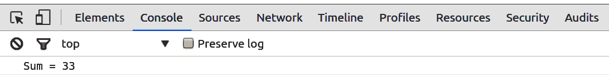
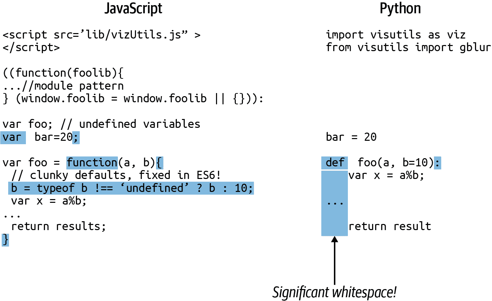
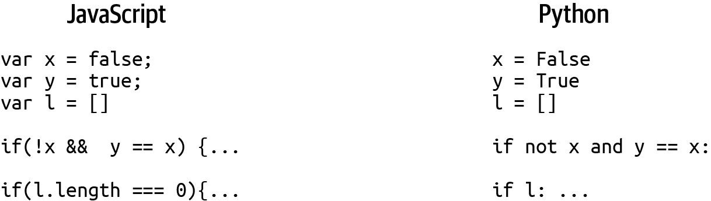
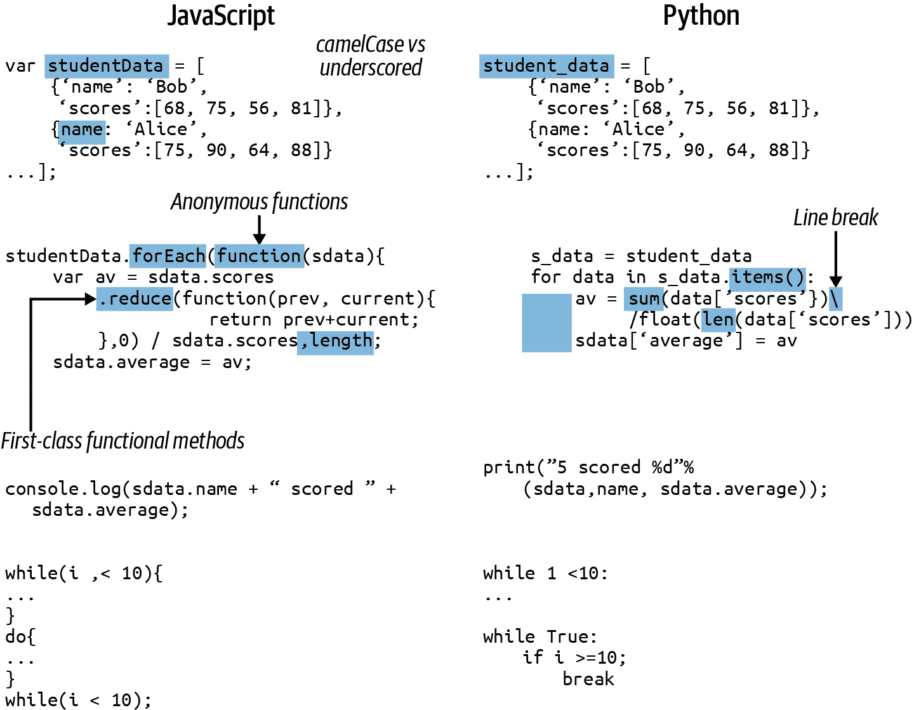
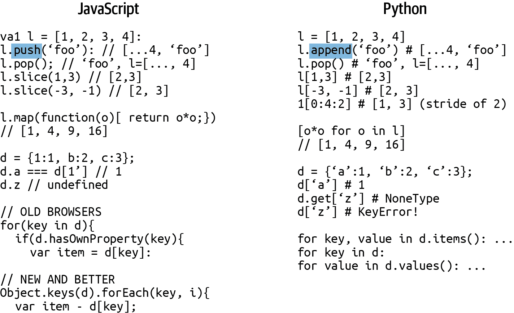
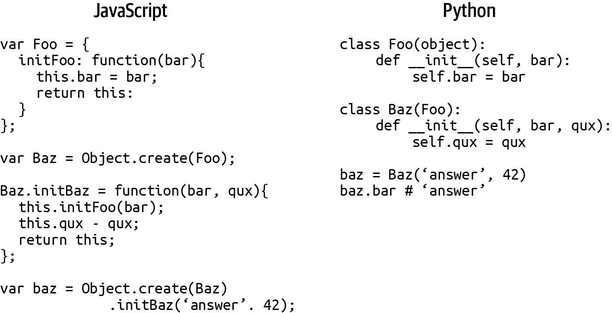

# 第二章：Python 和 JavaScript 之间的语言学习桥梁

这本书最雄心勃勃的方面可能是它涉及两种编程语言。此外，它只需要你精通其中一种语言。这仅仅是因为 Python 和 JavaScript（JS）是相当简单的语言，并且有很多共同之处。本章的目的是挖掘这些共同之处，并利用它们来构建两种语言之间的学习桥梁，以便在一种语言中获得的核心技能可以轻松地应用到另一种语言中。

在展示了这两种语言之间的关键相似之处和差异之后，我将展示如何为 Python 和 JS 设置学习环境。然后，本章的大部分内容将涉及核心的句法和概念差异，然后是我在进行数据可视化工作时经常使用的一些模式和习惯用法的选择。

# 相似之处和不同之处

除了语法差异之外，Python 和 JavaScript 实际上有很多共同之处。在短时间内，它们之间的切换几乎可以无缝进行。让我们从数据可视化者的角度来比较这两种语言：

这些是主要的相似之处：

+   他们都可以在不需要编译步骤的情况下工作（即，它们是解释型的）。

+   你可以使用交互式解释器来使用它们，这意味着你可以输入代码并立即看到结果。

+   两者都有垃圾收集，这意味着它们会自动管理程序内存。

+   与 C++、Java 等语言相比，两种语言都没有头文件、包装样板等。

+   两者都可以在文本编辑器或轻量级 IDE 中愉快地开发。

+   在两者中，函数都是一等公民，可以作为参数传递。

这些是关键的区别：

+   可能最大的区别是 JavaScript 是单线程和非阻塞的，使用异步 I/O。这意味着简单的事情，比如文件访问，涉及到使用一个回调函数，传递给另一个函数，并在某些代码完成后调用，通常是异步的。

+   JS 基本上是用于 Web 开发，并且直到相对最近才与浏览器捆绑在一起，但 Python 几乎随处可见。

+   JS 是 Web 浏览器中唯一的一流语言，而 Python 被排除在外。

+   Python 有一个全面的标准库，而 JS 只有一套有限的实用对象（例如，JSON、Math）。

+   Python 有着相当经典的面向对象类，而 JS 使用原型对象。

+   JS 缺乏重量级的通用数据处理库。

这些差异突显了这本书需要是双语的必要性。JavaScript 在浏览器数据可视化方面的垄断需要一个传统的数据处理堆栈的补充。而 Python 则是最好的选择。

# 与代码交互

Python 和 JavaScript 的一大优势是它们可以即时解释，因此可以与其交互。Python 的解释器可以从命令行运行，而 JavaScript 的通常通过浏览器的控制台访问，通常可从内置的开发工具中获取。在本节中，我们将看到如何启动解释器会话并开始尝试您的代码。

## Python

到目前为止，最好的命令行 Python 解释器是 [IPython](https://ipython.org)，它有三种形式：基本的终端版本、增强的图形版本和基于浏览器的笔记本。自 IPython 版本 4.0 以来，后两种已经分拆成 [Jupyter](https://jupyter.org) 项目。Jupyter 笔记本是一个非常出色且相当新颖的创新，提供基于浏览器的交互式计算环境。笔记本的重要优势在于会话持久性和 web 访问的可能性。在其中分享编程会话及嵌入的数据可视化非常简便，使笔记本成为绝佳的教学工具以及恢复编程上下文的好方式。这也是为什么本书的 Python 章节配有 Jupyter 笔记本的原因。

要启动 Jupyter 笔记本，请在命令行运行 `jupyter`：

```py
$ jupyter notebook
[I 15:27:44.553 NotebookApp] Serving notebooks from local
directory:
...
[I 15:27:44.553 NotebookApp] http://localhost:8888/?token=5e09...
```

打开指定的 URL（在这种情况下是 *http://localhost:8888*），然后开始阅读或编写 Python 笔记本。

## JavaScript

有很多选项可以尝试 JavaScript 代码而不启动服务器，尽管后者并不难。因为 JavaScript 解释器嵌入在所有现代 web 浏览器中，所以有许多网站可以让您尝试 JavaScript 片段以及 HTML 和 CSS，并查看结果。[CodePen](https://oreil.ly/ZtROX) 是一个不错的选择。这些网站非常适合分享代码和尝试片段，通常还允许您通过几次鼠标点击添加库，如 *D3.js*。

如果您想尝试代码一行或者查看活动代码的状态，基于浏览器的控制台是最佳选择。在 Chrome 中，您可以使用 Ctrl-Shift-J（Mac 上为 Command + Option + J）访问控制台。除了尝试一些小的 JavaScript 片段外，控制台还允许您深入到任何范围内的对象，显示它们的方法和属性。这是查看活动对象状态和搜索错误的好方法。

使用在线 JavaScript 编辑器的一个缺点是失去了您喜欢的编辑环境的优势，如 linting、熟悉的键盘快捷键等（参见 第四章）。在线编辑器往往基本功能简陋。如果您预计会进行广泛的 JavaScript 会话并想使用您喜欢的编辑器，最好的选择是运行本地服务器。

首先，创建一个项目目录——例如称为 *sandpit*——并添加一个包含 JS 脚本的最小 HTML 文件：

```py
sandpit
├── index.xhtml
└── script.js
```

*index.xhtml* 文件只需几行代码，可以选择在其中使用 `div` 占位符来开始构建你的可视化或尝试一些 DOM 操作：

```py
<!-- index.xhtml -->
<!DOCTYPE html>
<meta charset="utf-8">

<div id='viz'></div>

<script type="text/javascript" src="script.js" async></script>
```

然后可以向你的 *script.js* 文件中添加一些 JavaScript 代码：

```py
// script.js
let data = [3, 7, 2, 9, 1, 11];
let sum = 0;
data.forEach(function(d){
    sum += d;
});

console.log('Sum = ' + sum);
// outputs 'Sum = 33'
```

使用 Python 的 `http` 模块在项目目录中启动开发服务器：

```py
$ python -m http.server 8000
Serving HTTP on 0.0.0.0 port 8000 ...
```

然后在浏览器中打开 *http://localhost:8000*，按 Ctrl-Shift-J（OS X 上的 Cmd-Opt-J）访问控制台，你应该可以看到 图 2-1，显示脚本的日志输出（详见 第 4 章）。



###### 图 2-1\. 输出到 Chrome 控制台

现在我们已经学会了如何运行演示代码，让我们开始在 Python 和 JavaScript 之间建立桥梁。首先，我们将介绍语法上的基本差异。正如你将看到的那样，它们相差甚微，容易吸收。

# 基础桥梁工作

在本节中，我将对比这两种语言中编程的基本要素。

## 风格指南、PEP 8 和使用严格模式

JavaScript 的风格指南有些松散（人们通常默认使用像 React 这样的大型库所使用的风格），而 Python 则有一项专门的 Python Enhancement Proposal（PEP）。我建议熟悉 PEP-8，但不完全服从其领导地位。它在大多数事情上都是正确的，但在这里也有一些个人选择的余地。有一个方便的在线检查工具叫做 [PEP8 Online](http://pep8online.com)，可以找出任何违反 PEP-8 的情况。许多 Python 爱好者正在转向 [Black Python 代码格式化工具](https://oreil.ly/C9xWO)，它按照 PEP-8 规范接管了格式化任务。

在 Python 中，应使用四个空格缩进代码块。JavaScript 则不那么严格，但两个空格是最常见的缩进方式。

JavaScript 的最新增强（ECMAScript 5）之一是 `'use strict'` 指令，它强制启用严格模式。这种模式强制执行一些良好的 JavaScript 实践，包括捕获意外的全局声明，我强烈推荐使用它。要使用它，只需将字符串放在函数或模块的顶部：

```py
(function(foo){
  'use strict';
  // ...
}(window.foo = window.foo || {}));
```

## 骆驼命名法对比下划线

JavaScript 通常使用骆驼命名法（例如 `processStudentData`）来命名变量，而 Python 根据 PEP-8 使用下划线（例如 `process_student_data`）来命名变量（参见示例 2-3 和 2-4）。按照惯例（Python 生态系统中的惯例比 JavaScript 更重要），Python 使用大写的骆驼命名法来声明类（见下面的示例），使用大写字母来定义常量，使用下划线来区分其他内容：

```py
FOO_CONST = 10
class FooBar(object): # ...
def foo_bar():
    baz_bar = 'some string'
```

## 导入模块，包括脚本

在你的代码中使用其他库，无论是你自己的还是第三方的，对现代编程至关重要，这使得直到相对较近的时间内 JavaScript 没有专门的方法来做这件事显得更加令人惊讶。Python 有一个简单的导入系统，总体上运行得相当好。

JavaScript 前端的好消息是，自 ECMAScript 6 以来，JavaScript 已经解决了这个问题，通过增加了`import`和`export`语句来封装模块。我们现在有 JavaScript 模块（通常使用`.mjs`后缀），可以导入和导出封装的函数和对象，这是一个巨大的进步。在第 V 部分，我们将看到这些如何易于使用。

当你熟悉 JS 时，你可能想使用`script`标签导入第三方库，这通常会将它们作为对象添加到全局命名空间中。例如，为了使用 D3，你可以在你的 HTML 入口文件（通常是*index.xhtml*）中添加以下`script`标签：

```py
<!DOCTYPE html>
<meta charset="utf-8">
  <script src="http://d3js.org/d3.v7.min.js"></script>
```

现在你可以像这样使用 D3 库：

```py
let r = d3.range(0, 10, 2)
console.log(r)
// out: [0, 2, 4, 6, 8]
```

Python 自带“电池”，一个涵盖从扩展数据容器（collections）到处理 CSV 文件家族的全面库集合。如果你想使用其中之一，只需使用`import`关键字导入它：

```py
In [1]: import sys

In [2]: sys.platform
Out[2]: 'linux'
```

如果你不想导入整个库或想使用别名，你可以使用`as`和`from`关键字代替：

```py
import pandas as pd
from csv import DictWriter, DictReader
from numpy import * 

df = pd.read_json('data.json')
reader = DictReader('data.csv')
md = median([12, 56, 44, 33])
```


这会将模块中的所有变量导入到当前命名空间，几乎总是一个坏主意。其中一个变量可能掩盖一个现有的变量，并且违反了 Python 显示优于隐式的最佳实践。唯一的例外是，如果你在交互式 Python 解释器中使用。在这种有限的情况下，从库中导入所有函数可能有意义，以减少按键次数；例如，如果进行一些 Python 数学操作，导入所有数学函数(`from math import *`)。

如果导入非标准库，Python 会使用`sys.path`来尝试找到它。`sys.path`包括：

+   导入模块的目录（当前目录）

+   `PYTHONPATH`变量，包含一个目录列表

+   安装依赖的默认位置，使用`pip`或`easy_install`安装的库通常会放在这里

大型库通常被打包分成子模块。这些子模块通过点符号访问：

```py
import matplotlib.pyplot as plt
```

通过文件系统构建包，通常是空的`__init__.py`文件，如示例 2-1 所示。有 init 文件使得目录对 Python 的导入系统可见。

##### 示例 2-1\. 构建一个 Python 包

```py
mypackage
├── __init__.py
...
├── core
│   └── __init__.py
│   ...
...
└── io
    ├── __init__.py
    └── api.py
    ...
    └── tests
        └── __init__.py
        └── test_data.py
        └── test_excel.py 
        ...
...
```


你可以使用`from mypackage.io.tests import test_excel`来导入这个模块。

您可以使用点符号从根目录（即 示例 2-1 中的 `mypackage`）访问 `sys.path` 上的包。 `import` 的一个特例是包内引用。`test_excel.py` 子模块在 示例 2-1 中可以绝对和相对地从 `mypackage` 包导入子模块：

```py
from mypackage.io.tests import test_data 
from . import test_data 
import test_data 
from ..io import api 
```


绝对导入 `test_data.py` 模块，从包的主目录。


显式（`. import`）和隐式相对导入。


来自 `tests` 兄弟包的相对导入。

## JavaScript 模块

JavaScript 现在具有模块，可以导入和导出封装的变量。JS 挑选了它的导入语法，使用了许多对 Python 开发者来说很熟悉但在我看来改进了的东西。以下是简要介绍：

假设我们有一个 JS 入口模块 `index.js`，它想要使用位于 `lib` 目录中的库模块 `libFoo.js` 中的一些函数或对象。文件结构如下所示：

```py
.
├── index.mjs
└── lib
    └── libFoo.mjs
```

在 `libFoo.mjs` 中，我们导出一个虚拟函数，并可以使用 `export default` 导出模块的单个对象，通常是一个带有实用方法的 API：

```py
// lib/libFoo.mjs export let findOdds = (a) => {
  return a.filter(x => x%2)
}

let api = {findOdds} 

export default api
```


使用简写属性名创建对象的示例，相当于 `{findOdds: findOdds}`

要从我们的索引模块导入导出的函数和对象，我们使用 `import` 语句，它允许我们导入默认的 API 或通过花括号选择按名称导出的变量：

```py
// index.mjs
import api from './lib/libFoo.mjs'
import { findOdds } from './lib/libFoo.mjs'

let odds = findOdds([2, 4, 24, 33, 5, 66, 24])
console.log('Odd numbers: ', odds)

odds = api.findOdds([12, 43, 22, 39, 52, 21])
console.log('Odd numbers: ', odds)
```

JS 导入还支持别名，这可以成为优秀的代码消毒器：

```py
// index.mjs
import api as foo from './lib/libFoo.mjs'
import { findOdds as odds } from './lib/libFoo.mjs'
// ...
```

正如你所见，JavaScript 的导入和导出与 Python 非常相似，尽管在我的经验中稍微更加用户友好。你可以在 Mozilla 的 [exports](https://oreil.ly/J0aDV) 和 [imports](https://oreil.ly/slsT5) 文档中查看更多细节。

## 保持您的命名空间干净

Python 模块中定义的变量是封装的，这意味着除非你显式地导入它们（例如，`from foo import baa`），否则你将使用点符号从导入的模块命名空间访问它们（例如，`foo.baa`）。全局命名空间的模块化被视为非常好的事情，符合 Python 的关键原则之一：显式声明的重要性胜过隐式声明。分析某人的 Python 代码时，你应该能够准确地看到类、函数或变量来自哪里。同样重要的是，保留命名空间限制了变量冲突或遮蔽的可能性——这在代码库变大时是一个很大的潜在问题。

过去 JavaScript 的主要批评之一（也是公正的），是其对命名空间约定的快速且不拘一格。其中最突出的例子是，在函数外声明的变量或者缺少`var`关键字^(6)，是全局的，而不是限定在其声明所在的脚本内。使用现代化、模块化的 JavaScript，你可以像 Python 一样进行封装，通过导入和导出变量来实现。

JS 模块是一个相对较新的游戏变革者——过去常用的一种模式是创建自调用函数，以便将局部变量与全局命名空间隔离开来。这样一来，通过`var`声明的所有变量都将局部化到脚本/函数中，防止它们污染全局命名空间。JavaScript 中的[`let`](https://oreil.ly/cTxOy)关键字具有块级作用域，几乎总是优于`var`。你希望在其他脚本中使用的任何对象、函数和变量，都可以附加到全局命名空间的一个对象上。

示例 2-2 展示了一个模块模式。模板的头部和尾部（标记为  和 ）有效地创建了一个封装模块。这种模式远非是 JavaScript 模块化的完美解决方案，但在 ECMAScript 6 采用了主流浏览器的专用导入系统之前，它是我所知道的最佳折中方案。

##### 示例 2-2\. JavaScript 的模块模式

```py
(function(nbviz) { 
    'use strict';
    // ...
    nbviz.updateTimeChart = function(data) {..} 
    // ... }(window.nbviz = window.nbviz || {})); 
```


接收全局的`nbviz`对象。


将`updateTimeChart`方法附加到全局的`nbviz`对象上，有效地*导出*它。


如果全局（窗口）命名空间中存在`nbviz`对象，则将其传递给模块函数；否则，将其添加到全局命名空间中。

## 输出“Hello World!”

到目前为止，任何编程语言最受欢迎的初始演示，是在某种形式上打印或传递“Hello World!”，因此让我们从 Python 和 JavaScript 的输出开始。

Python 的输出简直不能再简单：

```py
print('Hello World!')
```

JavaScript 没有打印函数，但你可以将输出记录到浏览器控制台：

```py
console.log('Hello World!')
```

## 简单的数据处理

要了解语言差异的一个好方法是查看两种语言中相同功能的编写方式。示例 2-3 和 2-4 展示了 Python 和 JavaScript 中数据处理的小型构造示例，我们将使用它们来比较 Python 和 JS 的语法，并标记为大写字母（A、B...），以便进行代码块比较。

##### 示例 2-3\. Python 的简单数据转换

```py
# A
student_data = [
    {'name': 'Bob', 'id':0, 'scores':[68, 75, 56, 81]},
    {'name': 'Alice', 'id':1,  'scores':[75, 90, 64, 88]},
    {'name': 'Carol', 'id':2, 'scores':[59, 74, 71, 68]},
    {'name': 'Dan', 'id':3, 'scores':[64, 58, 53, 62]},
]

# B
def process_student_data(data, pass_threshold=60,
                         merit_threshold=75):
    """ Perform some basic stats on some student data. """

    # C
    for sdata in data:
        av = sum(sdata['scores'])/float(len(sdata['scores']))

        if av > merit_threshold:
            sdata['assessment'] = 'passed with merit'
        elif av >= pass_threshold:
            sdata['assessment'] = 'passed'
        else:
            sdata['assessment'] = 'failed'
        # D
        print(f"{sdata['name']}'s (id: {sdata['id']}) final assessment is:\
        {sdata['assessment'].upper()}")
        # For Python versions before 3.7, the old-style string formatting is equivalent
        # print("%s's (id: %d) final assessment is: %s"%(sdata['name'],\
        # sdata['id'], sdata['assessment'].upper()))     sdata['name'], sdata['id'],\
        # sdata['assessment'].upper()))
        print(f"{sdata['name']}'s (id: {sdata['id']}) final assessment is:\
         {sdata['assessment'].upper()}")

        sdata['average'] = av

# E
if __name__ == '__main__':
    process_student_data(student_data)
```

##### 示例 2-4\. JavaScript 的简单数据处理

```py
let studentData =  ![1
    {name: 'Bob', id:0, 'scores':[68, 75, 76, 81]},
    {name: 'Alice', id:1, 'scores':[75, 90, 64, 88]},
    {'name': 'Carol', id:2, 'scores':[59, 74, 71, 68]},
    {'name': 'Dan', id:3, 'scores':[64, 58, 53, 62]},
];

// B function processStudentData(data, passThreshold, meritThreshold){
    passThreshold = typeof passThreshold !== 'undefined'?\
    passThreshold: 60;
    meritThreshold = typeof meritThreshold !== 'undefined'?\
    meritThreshold: 75;

    // C
    data.forEach(function(sdata){
        let av = sdata.scores.reduce(function(prev, current){
            return prev+current;
        },0) / sdata.scores.length;

        if(av > meritThreshold){
            sdata.assessment = 'passed with merit';
        }
        else if(av >= passThreshold){
            sdata.assessment = 'passed';
        }
        else{
            sdata.assessment = 'failed';
        }
        // D
        console.log(sdata.name + "'s (id: " + sdata.id +
          ") final assessment is: " +
            sdata.assessment.toUpperCase());
        sdata.average = av;
    });

}

// E processStudentData(studentData);
```


请注意对象键中有些带引号有些不带引号的故意和有效的不一致性。

## 字符串构造

示例 2-3 和 2-4 中的 D 部分显示了将输出打印到控制台或终端的标准方法。JavaScript 没有 `print` 语句，但可以通过 `console` 对象记录到浏览器的控制台：

```py
console.log(sdata.name + "'s (id: " + sdata.id +
  ") final assessment is: " + sdata.assessment.toUpperCase());
```

请注意，整数变量 `id` 被强制转换为字符串，允许串联。Python 不执行这种隐式强制转换，因此尝试以这种方式将字符串添加到整数会导致错误。而是通过 `str` 或 `repr` 函数显式转换为字符串形式。

在 示例 2-3 的 A 部分中，输出字符串是用 C 类型格式化构造的。通过最终的元组 (`%(…​)`) 提供字符串 (`%s`) 和整数 (`%d`) 占位符：

```py
print("%s's (id: %d) final assessment is: %s"
  %(sdata['name'], sdata['id'], sdata['assessment'].upper()))
```

近年来，我很少使用 Python 的 `print` 语句，而是选择更强大和灵活的 `logging` 模块，在以下代码块中展示。使用它需要更多的努力，但是非常值得。日志记录使您可以灵活地将输出定向到文件和/或屏幕，调整日志级别以优先处理某些信息，以及其他许多有用的功能。在 [Python 文档](https://oreil.ly/aJzyx) 中查看详细信息。

```py
import logging
logger = logging.getLogger(__name__) 
//...
logger.debug('Some useful debugging output')
logger.info('Some general information')

// IN INITIAL MODULE
logging.basicConfig(level=logging.DEBUG) 
```


创建一个以该模块名称命名的记录器。


将日志级别设置为“debug”提供了可用的最详细信息（参见 [Python 文档](https://oreil.ly/xAiP1) 了解更多详情）。

## 显著的空白与大括号

Python 最显著的语法特点是显著的空白。与像 C 和 JavaScript 这样的语言使用空白来增强可读性并可以轻易地压缩成一行不同，^(7) 在 Python 中，前导空格用于指示代码块，移除它们会改变代码的含义。维护正确的代码对齐所需的额外工作远远超过了增加的可读性 —— 你阅读代码的时间远远超过写代码的时间，而 Python 的易读性可能是 Python 库生态系统如此健康的主要原因。四个空格几乎是强制性的（参见 PEP-8），而我个人偏好所谓的*软制表符*，即你的编辑器插入（和删除）多个空格而不是制表符字符。^(8)

在以下代码中，`return` 语句的缩进按照惯例必须是四个空格：^(9)

```py
def doubler(x):
    return x * 2
#  |<-this spacing is important
```

JavaScript 不关心语句和变量之间的空格数量，使用大括号来标记代码块；此代码中的两个 doubler 函数是等效的：

```py
let doubler = function(x){
  return x * 2;
}

let doubler=function(x){return x*2;}
```

Python 的缩进被过分强调，但我认识的大多数优秀编码者都设置了编辑器以强制执行缩进代码块和一致的外观。Python 只是强制执行这种良好的实践。再次强调，我认为 Python 代码的极高可读性对 Python 极其健康的生态系统贡献了同样多，这与其简单的语法一样重要。

## 注释和文档字符串

要向代码添加注释，Python 使用井号（`#`）：

```py
# ex.py, a single informative comment

data = {} # Our main data-ball
```

相比之下，JavaScript 使用 C 语言约定的双反斜杠（`//`）或 `/* ... */` 来进行多行注释：

```py
// script.js, a single informative comment
/* A multiline comment block for
function descriptions, library script
headers, and the like */
let data = {}; // Our main data-ball
```

除了注释外，Python 还有文档字符串（doc-strings）的约定，符合其可读性和透明性的哲学。在 示例 2-3 中的 `process_student_data` 函数顶部有一行三引号的文本，将自动分配给函数的 `__doc__` 属性。你也可以使用多行文档字符串：

```py
def doubler(x):
    """This function returns double its input."""
    return 2 * x

def sanitize_string(s):
    """This function replaces any string spaces
 with '-' after stripping any whitespace
 """
    return s.strip().replace(' ', '-')
```

文档字符串是一个很好养成的习惯，特别是在协作工作中。它们被大多数优秀的 Python 编辑工具集所理解，并且也被自动化文档库（如 [Sphinx](http://sphinx-doc.org)）使用。字符串字面量的文档字符串可以作为函数或类的 `doc` 属性访问。

## 使用`let`或`var`声明变量

JavaScript 使用 `let` 或 `var` 来声明变量。一般来说，`let` 几乎总是正确的选择。

严格来说，JS 语句应该以分号结尾，而不是 Python 的换行符。你会看到有些例子省略了分号，在现代浏览器中通常不会有问题。有一些边缘情况可能需要使用分号（例如，可能会影响去除空格的代码缩小器和压缩器），但通常来说，减少混乱和提高可读性是一种值得的编码方式，不使用分号。

###### 提示

JavaScript 具有变量提升机制，这意味着使用 `var` 声明的变量会在任何其他代码之前进行处理。这意味着在函数中的任何位置声明它们都等效于在顶部声明它们。这可能导致奇怪的错误和混乱。明确将 `var` 放在顶部可以避免这种情况，但更好的做法是使用现代的 `let` 并具有作用域声明。

## 字符串和数字

在 JavaScript 中，学生数据中使用的 *name* 字符串（参见示例 2-3 和 2-4 的第 A 部分）将被解释为 UCS-2（unicode UTF-16 的父类）^(10)，而在 Python 3 中将被解释为 Unicode（默认为 UTF-8）^(11)。

两种语言都允许在字符串中使用单引号和双引号。如果要在字符串中包含单引号或双引号，可以使用另一种引号进行封闭，如下所示：

```py
pub_name = "The Brewer's Tap"
```

示例 2-4 中 A 节中的`scores`以 JavaScript 的一种数值类型，双精度 64 位（IEEE 754）浮点数存储。尽管 JavaScript 有一个`parseInt`转换函数，当与浮点数一起使用时，^(12) 它实际上只是一个舍入操作符，类似于`floor`。解析的`number`的类型仍然是`number`：

```py
let x = parseInt(3.45); // 'cast' x to 3
typeof(x); // "number"
```

Python 有两种数值类型：32 位的`int`，学生分数将被转换为这种类型，以及与 JS 的`number`相当的`float`（IEE 754）。这意味着 Python 可以表示任何整数，而 JavaScript 更为有限。^(13) Python 的强制类型转换会改变类型：

```py
foo = 3.4 # type(foo) -> float
bar = int(3.4) # type(bar) -> int
```

Python 和 JavaScript 的数字的好处在于它们易于使用并且通常能够做到你想要的。如果需要更高效的东西，Python 有 NumPy 库，允许精细控制你的数值类型（你将在第七章学到更多关于 NumPy 的知识）。在 JavaScript 中，除了一些前沿项目，你基本上只能使用 64 位浮点数。

## 布尔值

Python 在使用命名布尔运算符上与 JavaScript 和 C 类语言不同。除此之外，它们的工作方式几乎符合预期。这张表格给出了一个比较：

| **Python** | `bool` | `True` | `False` | `not` | `and` | `or` |
| --- | --- | --- | --- | --- | --- | --- |
| **JavaScript** | `boolean` | `true` | `false` | `!` | `&&` | &#124;&#124; |

Python 的大写`True`和`False`对任何 JavaScript 开发者来说都是一个明显的障碍，反之亦然，但是任何良好的语法高亮工具和你的代码检查工具都应该能够捕捉到这一点。

与总是返回布尔值 true 或 false 不同，Python 和 JavaScript 的`and`/`or`表达式返回其中一个参数的结果，当然，这个参数可以是布尔值。表 2-1 展示了这是如何工作的，使用 Python 来演示。

表 2-1\. Python 的布尔运算符

| 操作 | 结果 |
| --- | --- |
| x or y | 如果 x 为假，则为 y，否则为 x |
| x and y | 如果 x 为假，则为 x，否则为 y |
| not x | 如果 x 为假，则为`True`，否则为`False` |

这个事实允许偶尔有用的变量赋值：

```py
rocket_launch = True
(rocket_launch == True and 'All OK') or 'We have a problem!'
Out:
'All OK'

rocket_launch = False
(rocket_launch == True and 'All OK') or 'We have a problem!'
Out:
'We have a problem!'
```

## 数据容器：dicts, objects, lists, Arrays

粗略地说，JavaScript 中的`objects`可以像 Python 中的`dict`s 一样使用，而 Python 中的`list`s 则像 JavaScript 中的数组。Python 还有一个元组容器，类似于不可变的列表。以下是一些例子：

```py
# Python
d = {'name': 'Groucho', 'occupation': 'Ruler of Freedonia'}
l = ['Harpo', 'Groucho', 99]
t = ('an', 'immutable', 'container')
```

```py
// JavaScript
d = {'name': 'Groucho', 'occupation': 'Ruler of Freedonia'}
l = ['Harpo', 'Groucho', 99]
```

如示例 2-3 和 2-4 中 A 节所示，Python 的`dict`键必须是用引号括起来的字符串（或可散列类型），而 JavaScript 允许你在属性是有效标识符（即不包含特殊字符如空格和破折号）时省略引号。所以在我们的`studentData`对象中，JS 隐式地将属性`'name'`转换为字符串形式。

学生数据声明看起来非常相似，实际上也基本相同。需要注意的主要区别是，虽然 JS 中 `studentData` 中用花括号括起来的容器看起来像 Python 的 `dict`，但它们实际上是 JS 对象的一种简写声明，这是一种略有不同的数据容器。

在 JS 数据可视化中，我们倾向于使用对象数组作为主要数据容器，在这里，JS 对象的功能与 Python 程序员所期望的功能非常相似。事实上，正如下面的代码所示，我们既获得了点表示法又获得了键字符串访问的优势，前者在适用时更受青睐（需要用引号括起来的键名，如含有空格或破折号的情况）：

```py
let foo = {bar:3, baz:5};
foo.bar; // 3
foo['baz']; // 5, same as Python
```

值得注意的是，虽然 JavaScript 的对象可以像 Python 字典那样使用，但它们实际上远不止于简单的容器（除了像字符串和数字这样的基本类型外，JavaScript 的几乎所有东西都是对象）。^(14) 但在大多数数据可视化示例中，它们与 Python 的 `dict` 非常类似。

表 2-2 转换基本列表操作。

表 2-2\. 列表和数组

| JavaScript 数组（a） | Python 列表（l） |
| --- | --- |
| `a.length` | `len(l)` |
| `a.push(item)` | `l.append(item)` |
| `a.pop()` | `l.pop()` |
| `a.shift()` | `l.pop(0)` |
| `a.unshift(item)` | `l.insert(0, item)` |
| `a.slice(start, end)` | `l[start:end]` |
| `a.splice(start, howMany, i1, …​)` | `l[start:end] = [i1, …​]` |

## 函数

例子 2-3 和 2-4 的 B 部分展示了函数声明。Python 使用 `def` 表示函数：

```py
def process_student_data(data, pass_threshold=60,
                         merit_threshold=75):
    """ Perform some basic stats on some student data. """
    ...
```

而 JavaScript 使用 `function`：

```py
function processStudentData(data, passThreshold=60, meritThreshold=75){
    ...
}
```

两者都有参数列表。在 JS 中，函数的代码块用花括号 { …​ } 表示；在 Python 中，代码块由冒号和缩进定义。

JS 还有一种称为 *函数表达式* 的定义函数的替代方式，你可以在这个例子中看到：

```py
let processStudentData = function( ...){...}
```

现在有一种更受欢迎的简化形式：

```py
let processStudentData = ( ...) => {...}
```

这些差异现在可以不用担心。

函数参数是一个领域，Python 处理比 JavaScript 更为复杂。正如你在 `process_student_data`（例子 2-3 中的 B 部分）中看到的那样，Python 允许参数有默认值。在 JavaScript 中，所有未在函数调用中使用的参数都声明为 *undefined*。

## 遍历：for 循环和函数式替代方法

例子 2-3 和 2-4 的 C 部分展示了 Python 和 JavaScript 之间第一个关键差异 —— 它们对 `for` 循环的处理方式。

Python 的 `for` 循环对任何迭代器（如数组和 `dict`）都是简单直观且高效的。`dict` 的一个需要注意的地方是，标准迭代是按键而非项进行的。例如：

```py
foo = {'a':3, 'b':2}
for x in foo:
    print(x)
# outputs 'a' 'b'
```

若要遍历键值对，使用 `dict` 的 `items` 方法，如下所示：

```py
for x in foo.items():
    print(x)
# outputs key-value tuples ('a', 3) ('b' 2)
```

你可以在 `for` 语句中方便地分配键值对。例如：

```py
for key, value in foo.items():
```

因为 Python 的`for`循环适用于具有正确迭代器管道的任何内容，所以您可以做一些很酷的事情，比如循环遍历文件行：

```py
for line in open('data.txt'):
    print(line)
```

对于从 Python 过来的人来说，JS 的`for`循环是一件相当可怕和不直观的事情。以下是一个例子：

```py
for(let i in ['a', 'b', 'c']){
  console.log(i)
}
// outputs 1, 2, 3
```

JS 的`for .. in`返回数组项的索引，而不是数组项本身。更糟糕的是，对于 Pythonista 来说，迭代的顺序不能保证，因此索引可能以非连续的顺序返回。

在 Python 和 JS 的`for`循环之间进行切换几乎没有无缝衔接，要求您保持警觉。好消息是，这些日子几乎不需要使用 JS 的`for`循环。事实上，我几乎从不需要。这是因为 JS 最近获得了一些非常强大的一流函数能力，这些能力具有更高的表达能力，且与 Python 的混淆机会更少，一旦您习惯了它们，很快就变得不可或缺。^(16)

示例 2-4 中的第 C 部分展示了现代 JavaScript 数组可用的*功能*方法之一，即`forEach()`。`forEach()`迭代数组项，依次将它们发送到第一个参数中定义的匿名回调函数中，其中可以处理它们。这些功能方法的真正表现力来自它们的链式调用（映射、过滤等），但是现在我们已经有了更清洁、更优雅的迭代，没有旧方法的笨重记录。

回调函数可以选择性地接收索引和原始数组作为第二个参数：

```py
data.forEach(function(currentValue, index){...})
```

直到最近，即使是迭代`object`的键值对也是相当棘手的。不像 Python 的`dict`，`object`可能会从原型链继承属性，所以您必须使用`hasOwnProperty`保护来过滤这些属性。您可能会遇到这样的代码：

```py
let obj = {a:3, b:2, c:4};
for (let prop in obj) {
  if( obj.hasOwnProperty( prop ) ) {
    console.log("o." + prop + " = " + obj[prop]);
  }
}
// out: o.a = 3, o.b = 2, o.c = 4
```

虽然 JS 数组有一组本地功能迭代器方法（`map`、`reduce`、`filter`、`every`、`sum`、`reduceRight`），`object`作为伪字典的外观则没有。好消息是，`object`类最近新增了一些有用的附加方法来填补这一空白。因此，您可以使用`entries`方法迭代键值对：

```py
let obj = {a:3, b:2, c:4};
for (const [key, value] of Object.entries(object1)) {
  console.log(`${key}: ${value}`); 
}
// out: a: 3 //      b: 2 ...
```


请注意`${foo}`这种形式的字符串模板，用于打印变量。

## 条件语句：if, else, elif, switch

示例中的第 C 部分展示了 Python 和 JavaScript 条件语句的应用，分别为 2-3 和 2-4。除了 JavaScript 使用括号外，语句非常相似；唯一的真正区别是 Python 额外的`elif`关键字，一个方便的`else if`联合体。

尽管有很多请求，Python 没有像大多数高级语言中那样的`switch`语句。JS 有，允许您做到这一点：

```py
switch(expression){
  case value1:
    // execute if expression === value1
    break; // optional end expression
  case value2:
    //...
  default:
    // if other matches fail
}
```

对于 Python 爱好者来说，好消息是在 3.10 版本中，Python 获得了一个非常强大的模式匹配条件，可以作为 `switch` 语句使用，但可以做的事情远不止于此。因此，我们可以这样在不同情况之间进行切换：

```py
for value in [value1, value2, value3]:
    match value:
        case value1:
            # do foo
        case value2:
            # do baa
        case value3:
            # do baz
```

## 文件输入和输出

基于浏览器的 JavaScript 没有真正等效的文件输入和输出（I/O），但 Python 的实现非常简单：

```py
# READING A FILE
f = open("data.txt") # open file for reading

for line in f: # iterate over file lines
    print(line)

lines = f.readlines() # grab all lines in file into array
data = f.read() # read all of file as single string

# WRITING TO A FILE
f = open("data.txt", 'w')
# use 'w' to write, 'a' to append to file
f.write("this will be written as a line to the file")
f.close() # explicitly close the file
```

一个被强烈推荐的最佳实践是在打开文件时使用 Python 的 `with`, `as` 上下文管理器。这确保在离开代码块时自动关闭文件，本质上为 `try`, `except`, `finally` 块提供了语法糖。这里是使用 `with`, `as` 打开文件的方式：

```py
with open("data.txt") as f:
    lines = f.readlines()
    ...
```

然而，JavaScript 也有大致相似的 `fetch` 方法，用于从网络上获取资源，基于其 URL。因此，要从网站服务器获取数据集，在 *static/data* 目录下执行如下操作：

```py
fetch('/static/data/nobel_winners.json')
  .then(function(response) {
  console.log(response.json())
})
Out:
[{name: 'Albert Einstein', category: 'Physics'...},]
```

[Fetch API](https://oreil.ly/OFjns) 在 Mozilla 上有详细的文档。

## 类和原型

可能比任何其他主题更容易引起混淆的是 JavaScript 选择原型而不是经典类作为其主要的面向对象编程（OOP）元素。对于 Python 程序员来说，这确实需要一些适应，因为在 Python 中类是无处不在的，但实际上，根据我的经验，这种学习曲线是短暂且相对浅显的。

我记得，当我第一次开始涉足像 C++ 这样更高级的语言时，迷上了面向对象编程的承诺，特别是基于类的继承。多态性当时非常流行，形状类被子类化为矩形和椭圆，这些又进一步被特化为更专门的正方形和圆形。

很快就意识到，在教科书中清晰的类划分在实际编程中很少能找到，并且尝试平衡通用和特定的 API 很快变得复杂。从这个意义上说，我发现组合和混合比尝试扩展子类化更有用作为编程概念，通常通过使用 JavaScript 中的函数式编程技术来避免所有这些问题。尽管如此，类/原型区别是两种语言之间明显的差异，你理解其细微差别的越多，编码能力就会越好。^(18)

Python 的类非常简单，并且和大多数语言一样容易使用。我现在倾向于将它们视为一种方便的方式来封装数据并提供方便的 API，很少扩展子类化超过一代。这里有一个简单的示例：

```py
class Citizen(object):

    def __init__(self, name, country): 
        self.name = name
        self.country = country

     def __str__(self): 
        return f'Citizen {self.name} from {self.country}'

     def print_details(self):
         print(f'Citizen {self.name} from {self.country}')

groucho = Citizen('Groucho M.', 'Freedonia') 
print(groucho) # or groucho.print_details()
# Out:
# Citizen Groucho M. from Freedonia
```


Python 类有许多双下划线的特殊方法，`__init__`是最常见的，当创建类实例时调用。所有实例方法都有一个显式的第一个`self`参数（你可以给它取其他名字，但这是一个非常糟糕的主意），它指的是实例本身。在这种情况下，我们用它来设置名称和国家属性。


你可以覆盖类的字符串方法，在调用实例的`print`函数时使用。


创建一个带有名称和国家的新`Citizen`实例。

Python 遵循了一种相当经典的类继承模式。这很容易做到，这可能是 Python 程序员大量使用它的原因。让我们自定义`Citizen`类来创建一个（诺贝尔奖）`Winner`类，并添加几个额外的属性：

```py
class Winner(Citizen):

    def __init__(self, name, country, category, year):
        super().__init__(name, country) 
        self.category = category
        self.year = year

    def __str__(self):
        return 'Nobel winner %s from %s, category %s, year %s'\
        %(self.name, self.country, self.category,\
        str(self.year))

w = Winner('Albert E.', 'Switzerland', 'Physics', 1921)
w.print_details()
# Out:
# Nobel prizewinner Albert E. from Switzerland, category Physics,
# year 1921
```


我们想要重用超类`Citizen`的`__init__`方法，使用这个`Winner`实例作为`self`。`super`方法将继承树从其第一个参数扩展一个分支，并将第二个参数作为类实例方法的实例。

我认为我读过的关于 JavaScript 原型和经典类之间主要区别的最佳文章是 Reginald Braithwaite 的[“OOP, JavaScript, and so-called Classes”](https://oreil.ly/92Kxk)。这段引文很好地总结了类和原型之间的区别：

> 原型（prototype）和类之间的区别类似于模型房屋和家庭蓝图之间的区别。

当你实例化一个 C++或 Python 类时，会遵循一个蓝图，创建一个对象并调用其继承树中的各种构造函数。换句话说，你是从头开始构建一个漂亮、崭新的类实例。

使用 JavaScript 原型，你从一个有房间（方法）的模型房屋（对象）开始。如果你想要一个新的客厅，你可以用更好颜色的东西替换旧的。如果你想要一个新的温室，那么只需做一个扩展。但与蓝图从头开始构建不同，你是在适应和扩展现有对象。

在搞定了必要的理论并提醒对象继承虽然有用但在数据可视化中并不普遍的情况下，让我们来看一个简单的 JavaScript 原型对象示例 Example 2-5。

##### 示例 2-5. 一个简单的 JavaScript 对象

```py
let Citizen = function(name, country){ 
  this.name = name; 
  this.country = country;
};

Citizen.prototype = { 
  logDetails: function(){
    console.log(`Citizen ${this.name} from ${this.country}`);
  }
};

let c = new Citizen('Groucho M.', 'Freedonia'); 

c.logDetails();
Out:
Citizen Groucho M. from Freedonia

typeof(c) # object
```


这个函数本质上是一个初始化器，由`new`运算符调用。


`this` 是函数调用上下文的隐式引用。就目前而言，它的行为与预期相符，尽管它看起来有点像 Python 的 `self`，但它们是完全不同的，我们稍后会看到。


此处指定的方法将覆盖继承链上所有原型方法，并被从 `Citizen` 派生的任何对象继承。


`new` 用于创建一个新对象，将其原型设置为 `Citizen` 构造函数的原型，然后在新对象上调用 `Citizen` 构造函数。

JavaScript 最近获得了一些[语法糖](https://oreil.ly/43NXG)，允许声明类。这本质上包装了面向对象形式（参见 示例 2-5）以更加熟悉的形式呈现，如来自类似 Java 和 C# 的编程语言的程序员。我认为可以说，在前端、基于浏览器的 JavaScript 中，类并没有真正流行起来，有点被强调可重用组件的新框架（如 React、Vue、Svelte）所取代。这是我们如何实现 示例 2-5 中展示的 `Citizen` 对象的方式：

```py
class Citizen {
  constructor(name, country) {
    this.name = name
    this.country = country
  }

  logDetails() {
    console.log(`Citizen ${this.name} from ${this.country}`)
  }
}

const c = new Citizen('Groucho M.', 'Freedonia')
```

我包含了 示例 2-5，展示了 JavaScript 对象实例化中的 `new` 使用，因为你会经常遇到它的使用。但语法已经有点笨拙，当你尝试进行继承时会变得更糟。ECMAScript 5 引入了 `Object.create` 方法，这是创建对象和实现继承的更好方式。我建议在你自己的代码中使用它，但是 `new` 可能会在一些第三方库中出现。

让我们使用 `Object.create` 创建一个 `Citizen` 及其 `Winner` 子类。强调一下，JavaScript 有很多方法可以做到这一点，但 示例 2-6 展示了我找到的最干净的方法和我的个人模式。

##### 示例 2-6\. 使用 `Object.create` 进行原型继承

```py
let Citizen = { 
    setCitizen: function(name, country){
        this.name = name;
        this.country = country;
        return this;
    },
    printDetails: function(){
        console.log('Citizen ' + this.name + ' from ',\
        + this.country);
    }
};

let Winner = Object.create(Citizen);

Winner.setWinner = function(name, country, category, year){
    this.setCitizen(name, country);
    this.category = category;
    this.year = year;
    return this;
};

Winner.logDetails = function(){
    console.log('Nobel winner ' + this.name + ' from ' +
    this.country + ', category ' + this.category + ', year ' +
    this.year);
};

let albert = Object.create(Winner)
    .setWinner('Albert Einstein', 'Switzerland', 'Physics', 1921);

albert.logDetails();
// Out: // Nobel winner Albert Einstein from Switzerland, category // Physics, year 1921
```


`Citizen` 现在是一个对象，而不是构造函数。将其视为任何新建筑（如 `Winner`）的基础。

再次强调，原型继承在 JavaScript 数据可视化中并不常见，特别是在以声明式和函数式模式为重点的 800 磅大猩猩 D3 中，原始的未封装数据被用来在网页上留下印记。

这一部分关于基本语法差异的内容，将以棘手的类/原型比较作结。现在让我们看看 Python 和 JS 数据可视化工作中常见的一些模式。

# 实践中的差异

JS 和 Python 的语法差异很重要，必须了解，幸运的是它们的语法相似性超过了差异。命令式编程的核心部分，循环、条件语句、数据声明和操作大体相同。在数据处理和数据可视化的专业领域，语言的一级函数允许常见习惯用法更加突出。

接下来是从数据可视化师的视角看到的 Python 和 JavaScript 中一些重要模式和习惯用法的非全面列表。在可能的情况下，给出了两种语言之间的翻译。

## 方法链

JavaScript 的常见习语是 *方法链*，它由最常用的库 jQuery 推广，并且在 D3 中被广泛使用。方法链涉及从自己的方法返回一个对象，以便在结果上调用另一个方法，使用点符号表示：

```py
let sel = d3.select('#viz')
    .attr('width', '600px') 
    .attr('height', '400px')
    .style('background', 'lightgray');
```


`attr` 方法返回调用它的 D3 选择器，然后用于调用另一个 `attr` 方法。

Python 中很少见到方法链，因为它通常主张每行只有一个语句，以保持简单和可读性。

## 枚举列表

经常需要在遍历列表时跟踪项的索引。Python 有一个非常方便的内置函数 `enumerate` 正是为了这个原因：

```py
names = ['Alice', 'Bob', 'Carol']

for i, n in enumerate(names):
    print(f'{i}: {n}')
```

```py
Out:
0: Alice
1: Bob
2: Carol
```

JavaScript 的列表方法，如 `forEach` 和函数式的 `map`、`reduce` 和 `filter`，向回调函数提供迭代的项及其索引：

```py
let names = ['Alice', 'Bob', 'Carol'];

names.forEach(function(n, i){
    console.log(i + ': ' + n);
});
```

```py
Out:
0: Alice
1: Bob
2: Carol
```

## 元组解包

Python 最初采用的一个很酷的技巧是使用元组解包来交换变量：

```py
(a, b) = (b, a)
```

注意括号是可选的。这可以更实际地用作减少临时变量的一种方法，例如在 [斐波那契函数](https://oreil.ly/OAT8Q) 中：

```py
def fibonacci(n):
    x, y = 0, 1
    for i in range(n):
        print(x)
        x, y = y, x + y
# fibonacci(6) -> 0, 1, 1, 2, 3, 5
```

如果你想忽略其中一个解包的变量，可以使用下划线：

```py
winner = 'Albert Einstein', 'Physics', 1921, 'Swiss'

name, _, _, nationality = winner 
print(f'{name}, {nationality}')
# Albert Einstein, Swiss
```


Python 3 有一个 [* 操作符](https://oreil.ly/MFjiR)，在这种情况下，我们可以使用它来解包我们的变量：`name, *_, nationality = winner`

JavaScript 语言正在迅速适应，并最近获得了一些非常强大的 [解构能力](https://oreil.ly/97rbT)。通过添加 *展开操作符* (`...`)，这使得一些非常简洁的数据操作成为可能：

```py
let a, b, rem 

[a, b] = [1, 2]
// swap variables [a, b] = [b, a]
// using the spread operator [a, b, ...rem] = [1, 2, 3, 4, 5, 6,] // rem = [3, 4, 5, 6]
```


不像 Python，你仍然需要声明你将要使用的任何变量。

## 集合

Python 中最有用的一个“电池”是 `collections` 模块。它提供了一些专门的容器数据类型来增强 Python 的标准集合。它有一个 `deque`，提供了一个类似列表的容器，在两端快速添加和弹出；一个 `OrderedDict`，记住添加条目的顺序；一个 `defaultdict`，提供一个设置字典默认值的工厂函数；以及一个 `Counter` 容器，用于计数可散列对象，等等。我经常使用最后三个。以下是一些示例：

```py
from collections import Counter, defaultdict, OrderedDict

items = ['F', 'C', 'C', 'A', 'B', 'A', 'C', 'E', 'F']

cntr = Counter(items)
print(cntr)
cntr['C'] -=1
print(cntr)
Out:
Counter({'C': 3, 'A': 2, 'F': 2, 'B': 1, 'E': 1})
Counter({'A': 2, 'C': 2, 'F': 2, 'B': 1, 'E': 1})

d = defaultdict(int) 

for item in items:
    d[item] += 1 

d
Out:
defaultdict(<type 'int'>, {'A': 2, 'C': 3, 'B': 1, 'E': 1, 'F': 2})

OrderedDict(sorted(d.items(), key=lambda i: i[1])) 
Out:
OrderedDict([('B', 1), ('E', 1), ('A', 2), ('F', 2), ('C', 3)]) 
```


将字典默认设置为整数，默认值为 0。


如果项目键不存在，则将其值设置为默认值 0 并添加 1。


获取字典 `d` 中项目的键值对列表，按整数值排序，然后创建一个排序后列表的 `OrderedDict`。


`OrderedDict` 记住了添加到其中的项目的（排序后的）顺序。

您可以在 [Python 文档](https://oreil.ly/IOK7c) 中获取有关 `collections` 模块的更多详细信息。

如果您想使用更常规的 JavaScript 库复制一些 Python 的 `collections` 函数，Underscore（或其功能上完全相同的替代品 Lodash^(20）是一个很好的起点。这些库提供了一些增强的函数式编程工具。让我们快速看看这个非常方便的工具。

## 下划线

Underscore 可能是继普及的 jQuery 后最受欢迎的 JavaScript 库，为 JavaScript 数据可视化程序员提供了大量的函数式编程工具。使用 Underscore 的最简单方法是使用内容传递网络（CDN）远程加载它（这些加载将由您的浏览器缓存，使常见库非常高效），如下所示：

```py
<script src="https://cdnjs.cloudflare.com/ajax/libs/
 underscore.js/1.13.1/underscore-min.js"></script>
```

Underscore 有大量有用的函数。例如，有一个 `countBy` 方法，其作用与刚讨论的 Python 的 `collections` 计数器相同：

```py
let items = ['F', 'C', 'C', 'A', 'B', 'A', 'C', 'E', 'F'];

_.countBy(items) 
Out:
Object {F: 2, C: 3, A: 2, B: 1, E: 1}
```


现在你知道为什么这个库叫 Underscore 了。

现在我们可以看到，现代 JavaScript 中原生的函数方法（`map`、`reduce`、`filter`）以及数组的 `forEach` 迭代器使得 Underscore 稍显不那么必不可少，但它仍然具有一些非常棒的实用工具来增强原生 JS。稍加链式操作，你可以编写极为简洁但非常强大的代码。Underscore 是我在 JavaScript 中接触函数式编程的入门，这些习惯如今依然令人着迷。请访问[它们的网站](https://underscorejs.org)查看 Underscore 的各种实用工具。

让我们看看 Underscore 在更复杂任务中的应用：

```py
journeys = [
  {period:'morning', times:[44, 34, 56, 31]},
  {period:'evening', times:[35, 33],},
  {period:'morning', times:[33, 29, 35, 41]},
  {period:'evening', times:[24, 45, 27]},
  {period:'morning', times:[18, 23, 28]}
];

let groups = _.groupBy(journeys, 'period');
let mTimes = _.pluck(groups['morning'], 'times');
mTimes = _.flatten(mTimes); 
let average = function(l){
  let sum = _.reduce(l, function(a,b){return a+b},0);
  return sum/l.length;
};
console.log('Average morning time is ' + average(mTimes));
Out:
Average morning time is 33.81818181818182
```


我们的早晨时间数组（`[[44, 34, 56, 31], [33...]]`）需要 *展平* 成一个单一的数字数组。

## 函数式数组方法和列表推导式

自从 ECMAScript 5 加入 JavaScript 数组的函数方法以来，我使用 Underscore 的频率大大减少。我认为自那时起我几乎没有再使用传统的 `for` 循环，考虑到 JS `for` 循环的丑陋程度，这是一件非常好的事情。

一旦你习惯了函数式处理数组，就很难再考虑回到以前。结合 JS 的匿名函数，它使得编程变得非常流畅和表达力强。这也是方法链在这里显得非常自然的一个领域。让我们看一个高度刻意的例子：

```py
let nums = [1, 2, 3, 4, 5, 6, 7, 8, 9, 10];

let sum = nums.filter(x => x%2) 
  .map(x => x * x) 
  .reduce((total, current) => total + current, 0); 

console.log('Sum of the odd squares is ' + sum);
```


过滤列表以获取奇数（即对 `modulus (%) 2` 操作返回 `1`）。


`map` 通过将函数应用于每个成员来生成新列表（即 `[1, 3, 5...]` → `[1, 9, 25...]`）。


`reduce` 逐个处理映射后的列表，依次提供当前值（在此例中为求和后的值 `total`）和项目值（`current`）。默认情况下，第一个参数（`total`）的初始值为 `0`，但在这里我们显式地提供了它作为第二个参数。

Python 强大的列表推导式可以轻松模拟上一个例子：

```py
nums = range(10) 

odd_squares = [x * x for x in nums if x%2] 
sum(odd_squares) 
Out:
165
```


Python 有一个方便的内置 `range` 函数，也可以接受起始、结束和步长（例如，`range(2, 8, 2)` → `(2, 4, 6)`）。


`if` 条件检测 `x` 的奇数性，并将通过此筛选的数字进行平方并插入列表。


Python 还有一个内置且经常使用的 `sum` 语句。

###### 提示

Python 的列表推导可以使用递归控制结构，比如在迭代项目上应用第二个`for`/`if`表达式。虽然这可以创建简洁而强大的代码行，但它违背了 Python 的可读性，我不鼓励其使用。即使简单的列表推导也不够直观，并且，尽管它吸引了我们所有人内心深处的精英黑客，你可能会写出难以理解的代码。

Python 的列表推导在基本过滤和映射方面效果良好。它们确实缺乏 JavaScript 的匿名函数的便利性（这些是完全成熟的，有自己的作用域、控制块、异常处理等），但是对于匿名函数的使用存在争议。例如，它们不可重用，并且由于没有名称，使得异常跟踪和调试变得困难。参见[Ultimate Courses](https://oreil.ly/7u1j6)获取一些有说服力的论点。尽管如此，对于像 D3 这样的库，用命名函数替换用于设置[DOM 属性](https://oreil.ly/hYN27)和属性的小型、一次性匿名函数将会太繁琐，只会增加样板代码。

Python 确实有函数式 lambda 表达式，我们将在下一节中看到，但出于必要性和 JavaScript 的最佳实践，我们可以使用命名函数来增加我们的控制范围。对于我们简单的奇数平方示例，命名函数是一种构思，但请注意，它们增加了列表推导的一目了然的可读性，这在函数变得更复杂时变得更加重要：

```py
items = [1, 2, 3, 4, 5]

def is_odd(x):
    return x%2

def sq(x):
    return x * x

sum([sq(x) for x in items if is_odd(x)])
```

使用 JavaScript，类似的构思也可以增加可读性，并促进 DRY 代码：^(21)

```py
let isOdd = function(x){ return x%2; };

sum = l.filter(isOdd)
...
```

## 使用 Python 的 Lambdas 进行 Map、Reduce 和 Filter

虽然 Python 没有匿名函数，但它有*lambdas*，这是没有名字的表达式，接受参数。尽管缺少 JavaScript 的匿名函数的花哨和吸引力，这些对于 Python 的函数编程来说是一个强大的补充，特别是与其函数方法结合使用时。

###### 注意

Python 的函数内置（`map`、`reduce`、`filter` 方法和 lambda 表达式）历史悠久。众所周知，Python 的创始人希望将它们从语言中删除。对它们的不满导致它们不情愿地被保留下来。随着最近对函数式编程的趋势，这看起来是一件非常好的事情。它们并非完美，但比没有好得多。鉴于 JavaScript 对函数式的强调，它们是利用在该语言中获得的技能的一种好方法。

Python 的 lambda 接受多个参数，并对它们进行操作，使用冒号分隔符定义函数块，与标准 Python 函数非常相似，只是简化到了最基本的部分，并且有一个隐式返回。下面的例子展示了在函数式编程中使用的一些 lambda 表达式：

```py
from functools import reduce # if using Python 3+

nums = [0, 1, 2, 3, 4, 5, 6, 7, 8, 9]

odds = filter(lambda x: x % 2, nums)
odds_sq = map(lambda x: x * x, odds)
reduce(lambda x, y: x + y, odds_sq) 
Out:
165
```


在这里，`reduce` 方法向 lambda 函数提供两个参数，lambda 函数使用它们在冒号后返回表达式。

## JavaScript 闭包与模块模式

JavaScript 的一个关键概念之一是*闭包*，它本质上是一个嵌套函数声明，使用在外部（但不是全局）作用域中声明的变量，在函数返回后仍然*保持活跃*。闭包允许实现许多非常有用的编程模式，是该语言的一个常见特性。

让我们看看闭包可能是最常见的用法之一，也是我们在模块模式中已经看到并利用的用法（示例 2-2）：在保持对本质上是私有的成员变量的访问的同时，公开了有限的 API。

一个简单的闭包示例是这个小计数器：

```py
function Counter(inc) {
  let count = 0;
  let add = function() { 
    count += inc;
    console.log('Current count: ' + count);
  }
  return add;
}

let inc2 = Counter(2); 
inc2(); 
Out:
Current count: 2
inc2();
Out:
Current count: 4
```


`add` 函数可以访问本质上是私有的外部作用域中的 `count` 和 `inc` 变量。


这返回一个带有闭包变量 `count`（`0`）和 `inc`（`2`）的 `add` 函数。


调用 `inc2` 会调用 `add`，从而更新*封闭的* `count` 变量。

我们可以扩展 `Counter` 来添加一个小 API。这种技术是 JavaScript 模块和许多简单库的基础，尤其是在使用基于脚本的 JavaScript 时。^(22) 本质上，它选择性地公开公共方法，同时隐藏私有方法和变量，这在编程界通常被视为良好的实践：

```py
function Counter(inc) {
  let count = 0
  let api = {}
  api.add = function() {
    count += inc
    console.log('Current count: ' + count);
  }
  api.sub = function() {
    count -= inc
    console.log('Current count: ' + count)
  }
  api.reset = function() {
    count = 0;
    console.log('Count reset to 0')
  }

  return api
}

cntr = Counter(3);
cntr.add() // Current count: 3
cntr.add() // Current count: 6
cntr.sub() // Current count: 3
cntr.reset() // Count reset to 0
```

在 JavaScript 中，闭包有各种各样的用途，我建议你对其有个基本的了解——因为在你开始研究其他人的代码时，你会经常遇到它们。以下是三篇特别好的网络文章，提供了闭包的许多实际用例：

+   [Mozilla 的介绍](https://oreil.ly/T6itS)

+   [“JavaScript 模块模式：深入了解”](https://oreil.ly/0P2EI) 作者 Ben Cherry

+   [“JavaScript 闭包用例”](https://oreil.ly/xz4G5) 作者 Juriy Zaytsev

Python 也有闭包，但它们并没有像 JavaScript 那样被广泛使用，也许是因为一些使得代码略显尴尬的怪异之处。尽管如此，这些问题是可以克服的。为了演示这一点，示例 2-7 尝试复制之前的 JavaScript 计数器。

##### 示例 2-7\. Python 计数器闭包的初步尝试

```py
def get_counter(inc):
    count = 0
    def add():
        count += inc
        print('Current count: ' + str(count))
    return add
```

如果你用 `get_counter` 创建一个计数器（示例 2-7），然后尝试运行它，你会得到一个 `UnboundLocalError`：

```py
cntr = get_counter(2)
cntr()
Out:
...
UnboundLocalError: local variable 'count' referenced before
assignment
```

有趣的是，尽管我们可以在 `add` 函数内读取 `count` 的值（注释掉 `count += inc` 行来尝试），但尝试改变它会抛出错误。这是因为在 Python 中，尝试将值分配给某些东西会假定它是局部范围的。`add` 函数中没有 `count`，因此会抛出错误。

在 Python 3 中，我们可以通过使用 `nonlocal` 关键字来绕过 示例 2-7 中的错误，告诉 Python `count` 在一个非局部范围内：

```py
...
def add():
    nonlocal count
    count += inc
...
```

如果你不得不使用 Python 2+（请尝试升级），我们可以使用一点字典技巧来允许对闭包变量进行修改：

```py
def get_counter(inc):
    vars = {'count': 0}
    def add():
        vars['count'] += inc
        print('Current count: ' + str(vars['count']))
    return add
```

这个技巧之所以有效，是因为我们没有给 `vars` 赋予新值，而是改变了一个现有容器，即使它超出了局部范围，这也是完全有效的。

如您所见，通过一点努力，JavaScript 开发者可以将他们的闭包技能转移到 Python 中。用例类似，但 Python 是一种更丰富的语言，具有许多有用的内置功能，可以对同一问题应用更多选项。闭包最常见的用途可能是 Python 中的装饰器。

*装饰器*本质上是扩展函数实用性的函数包装器，而无需更改函数本身。它们是一个相对高级的概念，但您可以在[The Code Ship 网站](https://oreil.ly/Skz8b)上找到一个用户友好的介绍。

这就是我精心挑选的一些模式和技巧的总结，我在数据可视化工作中经常使用。你无疑会拥有自己的经验，但我希望这些可以帮助你起步。

# 速查表

作为一个方便的参考指南，图 2-2 至 2-7 包括了一组速查表，用于在 Python 和 JavaScript 之间转换基本操作。



###### 图 2-2\. 一些基本语法



###### 图 2-3\. 布尔值



###### 图 2-4\. 循环和迭代


###### 图 2-5\. 条件语句



###### 图 2-6\. 容器



###### 图 2-7\. 类和原型

# 概要

我希望本章已经表明，JavaScript 和 Python 有很多共同的语法，而且两种语言中的大多数常见习语和模式都可以在另一种语言中表达，而不会有太多麻烦。编程的核心——迭代、条件和基本数据操作——在两种语言中都很简单，函数的转换也很直接。如果您能够以任何程度的熟练程度编程其中一种语言，那么学习另一种语言的门槛就很低。这就是这些简单的脚本语言的巨大吸引力，它们有很多共同的遗产。

我提供了一个在数据可视化工作中我经常使用的模式、技巧和习惯。我确信这个列表有它的特殊之处，但我已经尽力满足了明显的要求。

将其视为教程的一部分，也是未来章节的参考。未涵盖的任何内容将在引入时进行讨论。

^(1) 特别讨厌的小坑之一是，Python 使用 `pop` 来移除列表项，但却使用 `append` 而不是 `push` 来添加项。JavaScript 使用 `push` 来添加项，而 `append` 则用于连接数组。

^(2) [node.js](https://nodejs.org/en) 的兴起将 JavaScript 扩展到了服务器端。

^(3) 随着像 [TensorFlow.js](https://oreil.ly/kDw6M) 和 [Danfo.js](https://oreil.ly/dJnOl)（基于 TensorFlow 的 JavaScript pandas 替代品）等库的出现，这一情况正在改变，但 JS 仍远远落后于 Python、R 等。

^(4) 以在服务器上运行 Python 解释器为代价。

^(5) 通过 HTTP 在网络上传输 JS 脚本的限制在很大程度上造成了这种情况。

^(6) 通过使用 ECMAScript 5 的 `'use strict'` 指令，可以消除遗漏 `var` 的可能性。

^(7) 这实际上是 JavaScript 压缩器为了减小下载网页文件大小而完成的。

^(8) 软制表符与硬制表符的争论引发了激烈的讨论，有很多争执却鲜有建设性意见。PEP-8 规定了使用空格，这对我来说已经足够好了。

^(9) 可能是两个甚至三个空格，但这个数字在整个模块中必须保持一致。

^(10) JavaScript 使用 UTF-16 的普遍假设导致了许多由 bug 引起的痛苦。请参阅 [Mathias Bynens 的博文](https://oreil.ly/9otVB) 进行有趣的分析。

^(11) Python 3 中转向 Unicode 字符串是一个重大变化。考虑到通常伴随 Unicode 编码/解码的混乱，值得阅读有关 [此方面的一些内容](https://oreil.ly/5FNwi)。Python 2 使用字节字符串。

^(12) `parseInt` 的功能远不止四舍五入。例如，`parseInt(*12.5px*)` 返回 12，首先去除 *`px`*，然后将字符串转换为数字。它还有第二个 `radix` 参数来指定转换的基数。具体细节请参见 [Mozilla 文档](https://oreil.ly/ZtA4n)。

^(13) 因为 JavaScript 中的所有数字都是浮点数，它只支持 53 位整数。使用更大的整数（例如常用的 64 位）可能导致不连续的整数。请参阅这篇 [2ality 博文](https://oreil.ly/hBxvS) 获取更多信息。

^(14) 这使得遍历它们的属性比可能要棘手一些。查看[这个 Stack Overflow 线程](https://oreil.ly/3kJW3)以获取更多详情。

^(15) 如果你好奇，Angus Croll 的[一篇博客文章](https://oreil.ly/YyUyx)对此有一个很好的总结。

^(16) 这是 JavaScript 明显胜过 Python 的一个领域，许多人希望 Python 也能有类似的功能。

^(17) 从 ECMAScript 5 开始，并在所有现代浏览器中可用。

^(18) 我告诉一个有才华的程序员朋友，我面临向 Python 程序员解释原型的挑战，他指出大多数 JavaScript 程序员可能也需要一些指导。这有很多道理，许多 JavaScript 程序员通过 *优雅* 地使用原型，在边缘情况下进行技巧性的编码来保持高效。

^(19) 这是使用 ECMAScript 5 的 `'use strict;'` 指令的另一个原因，它引起了这类错误的注意。

^(20) 出于性能原因，这是我的个人选择。

^(21) 不要重复自己（DRY）是一种可靠的编码约定。

^(22) 现代 JavaScript 有适当的模块，可以导入和导出封装的变量。使用这些会有额外的开销，因为它们目前需要一个构建阶段来准备好供浏览器使用。
