# 第四章 Webdev 101

本章介绍了核心的网页开发知识，这些知识将帮助你理解你要抓取数据的网页，并结构化那些你想要作为 JavaScript 可视化骨架传递的网页。正如你将看到的，对现代网页开发来说，一点点知识就可以走很长的路，特别是当你的重点是构建独立的可视化而不是整个网站（详见“单页面应用”获取更多详情）。

通常情况下，这章既是参考，又是教程。这里可能有您已经了解的内容，所以可以自由跳过，直接阅读新材料。

# 大局观

谦逊的网页，作为万维网（WWW）—人类使用的互联网的一部分—的基本构建块，由各种类型的文件构成。除了多媒体文件（图片、视频、声音等），关键元素是文本，由超文本标记语言（HTML）、层叠样式表（CSS）和 JavaScript 组成。这三者，连同任何必要的数据文件，使用超文本传输协议（HTTP）传递，并用于构建您在浏览器窗口中看到和交互的页面，这由文档对象模型（DOM）描述，一个您的内容悬挂的分层树。了解这些元素如何互动是构建现代 Web 可视化的重要基础，而本章的目的就是让您迅速掌握这些知识。

Web 开发是一个广阔的领域，这里的目标不是让您成为一个全面的 Web 开发人员。我假设您希望尽可能地减少必须进行的 Web 开发工作量，只专注于构建现代可视化所需的部分。为了构建像[*d3js.org*](https://d3js.org)展示的那种可视化效果，发表在*纽约时报*上，或者集成在基本交互式数据仪表板中，实际上您需要的 Web 开发技能相当有限。您的工作成果应该能够被专门负责此类工作的人轻松添加到更大的网站中。对于小型个人网站，将可视化内容整合进去也相当容易。

# 单页面应用

*单页面应用*（SPAs）是使用 JavaScript 动态组装的 Web 应用程序（或整个网站），通常基于轻量级 HTML 骨架和可以使用类和 ID 属性动态应用的 CSS 样式构建。许多现代数据可视化项目符合此描述，包括本书所构建的诺贝尔奖可视化项目。

通常是自包含的，SPA 的根目录可以轻松地整合到现有网站中或独立运行，只需一个像 Apache 或 NGINX 这样的 HTTP 服务器。

将我们的数据可视化视为单页应用程序（SPA），可以减少 JavaScript 可视化的 Web 开发方面的认知负担，让我们专注于编程挑战。在网上发布可视化仍然需要的技能相当基础且很快就会摊销。通常这将是其他人的工作。

# 工具配置

正如你将看到的，制作现代数据可视化所需的 Web 开发并不比一个体面的文本编辑器、现代浏览器和终端（图 4-1）更多。我将介绍我认为适合 Web 开发准备的最低要求编辑器以及非必需但不错的功能。

我选择的浏览器开发工具是[Chrome 的 Web 开发者工具套件](https://oreil.ly/52Z3e)，在所有平台上都免费提供。它具有许多选项卡分隔的功能，其中我将在本章中介绍以下内容：

+   *元素*选项卡，允许您探索 Web 页面的结构、其 HTML 内容、CSS 样式和 DOM 呈现

+   *资源*选项卡，大多数 JavaScript 调试将在这里进行

你将需要一个终端用于输出、启动本地 Web 服务器，也许还要用 IPython 解释器草拟一些想法。最近我倾向于使用基于浏览器的[Jupyter 笔记本](https://jupyter.org)作为我的 Python 数据可视化“*草图本*”，其主要优势之一是会话以笔记本（*.ipynb* 文件）的形式持久化，你可以在以后的日期重新启动会话。你还可以通过内嵌的图表迭代地探索数据。我们将在第三部分中充分利用它。

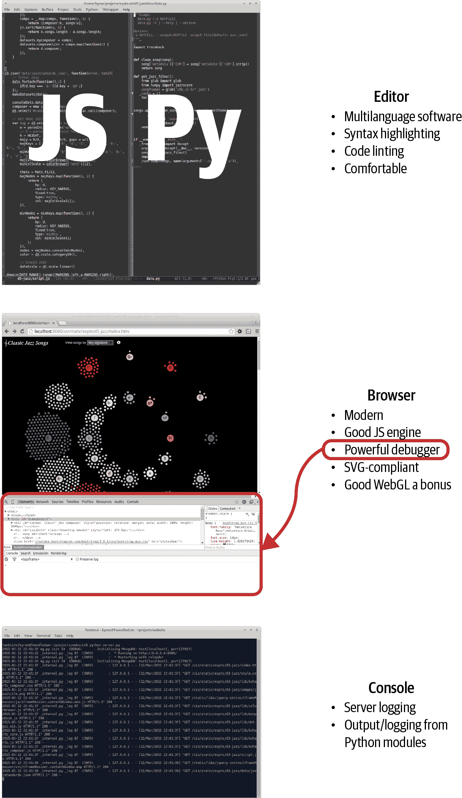

###### 图 4-1\. 主要的 Web 开发工具

在谈论你需要什么之前，让我们先来谈谈在开始时你不需要的一些事情，顺便打消一些迷思。

## IDE、框架和工具的神话

那些准备学习 JavaScript 的人普遍认为，在网络编程中需要复杂的工具集，主要是企业及其他编码人员广泛使用的智能开发环境（IDE）。这可能昂贵且具有陡峭的学习曲线。好消息是，你只需一个体面的文本编辑器，就可以创建专业水平的 Web 数据可视化。事实上，直到你开始涉足现代 JavaScript 框架（我建议在你掌握 Web 开发技能之前先暂缓），IDE 并不会带来太多优势，而且通常性能较差。更令人振奋的消息是，免费且轻量级的[Visual Studio Code IDE (VSCode)](https://code.visualstudio.com) 已成为 Web 开发的事实标准。如果你已经在使用 VSCode，或者想要一些额外的功能，它是跟随本书的一个良好工具。

还有一个普遍的神话，即在不使用任何框架的情况下，无法在 JavaScript 中提高生产力。^(1) 目前，许多这些框架正在争夺 JS 生态系统的控制权，其中大多数由创建它们的各种巨大公司赞助。这些框架来去匆匆，我的建议是，任何刚开始学习 JavaScript 的人都应该完全忽略它们，而是在发展核心技能的同时使用小型、定向的库，比如 jQuery 生态系统中的库或 Underscore 的函数式编程扩展，看看在需要*我行我素*框架之前你能走多远。只有在有明确现实需求的情况下，才锁定到框架中，而不是因为当前的 JS 集体思维正在疯狂地吹捧它有多么好。^(2) 另一个重要的考虑因素是，D3，主要的 Web 数据可视化库，实际上与我所知道的任何较大的框架都不太兼容，特别是那些想要控制 DOM 的框架。使 D3 符合框架的要求是一种高级技能。

如果您逗留在 Webdev 论坛、Reddit 列表和 Stack Overflow 上，您会发现有大量工具不断争相吸引注意。其中包括 JS+CSS 缩小器和监视器，用于在开发过程中自动检测文件更改并重新加载网页等。虽然其中有一些是有用的，但根据我的经验，有很多工具可能比它们在生产力上节省的时间更花费时间。重申一下，您可以在没有这些工具的情况下非常高效地工作，只有在迫切需要解决问题时才应该使用其中之一。有些工具是值得保留的，但只有极少数对于数据可视化工作是必不可少的。

## 一个文本编辑工具

在您的 Webdev 工具中，首要的是一个您感觉舒适且至少可以对多种语言进行语法高亮的文本编辑器，例如 HTML、CSS、JavaScript 和 Python。您可以使用一个普通的、没有语法高亮的编辑器，但从长远来看，这将证明是一种痛苦。诸如语法高亮、代码检查、智能缩进等功能，可以极大地减轻编程过程中的认知负担，以至于我认为它们的缺失是一种限制因素。这些是我对文本编辑器的最低要求：

+   对您使用的所有语言进行语法高亮显示

+   可配置的缩进级别和类型，适用于各种语言（例如，Python 4 个软制表符，JavaScript 2 个软制表符）

+   多窗口/窗格/选项卡，以便轻松导航您的代码库周围

+   一个体面的[代码检查工具](https://oreil.ly/6BOEU)（见图 4-2）

如果您使用的是相对高级的文本编辑器，则上述所有功能应该是标准配置，除了代码检查可能需要一些配置外。

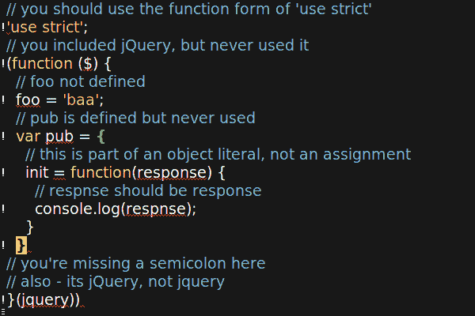

###### 图 4-2\. 运行的代码检查程序持续分析 JavaScript，以红色突出显示语法错误，并在错误行左侧添加一个！

## 带有开发工具的浏览器

现代 Web 开发中完整的 IDE 不那么重要的一个原因是，最佳调试位置是在 Web 浏览器本身，而这种环境的变化速度如此之快，以至于任何试图模拟该上下文的 IDE 都将面临艰巨的任务。此外，现代 Web 浏览器已经发展出强大的一套调试和开发工具。其中最好的工具之一是[Chrome DevTools](https://oreil.ly/jBLc9)，提供了大量功能，从复杂的（对 Pythonista 来说肯定如此）调试（参数断点、变量监视等）到内存和处理器优化分析，设备仿真（想知道您的网页在智能手机或平板电脑上的显示效果？）等等。Chrome DevTools 是我选择的调试器，并将在本书中使用。像本书涵盖的所有内容一样，它是免费使用的。

## 终端或命令提示符

终端或命令行是您启动各种服务器和可能输出有用日志信息的地方。它还是您尝试 Python 模块或运行 Python 解释器的地方（在许多方面，IPython 是最好的）。

# 创建网页

典型 Web 可视化有四个要素：

+   一个 HTML 框架，其中包含我们的程序化可视化的占位符

+   层叠样式表（CSS），定义外观和感觉（例如，边框宽度、颜色、字体大小、内容块的放置）

+   JavaScript 用于构建可视化

+   要转换的数据

这三者中的前三个只是文本文件，使用我们最喜爱的编辑器创建，并由 Web 服务器传递到浏览器（见第十二章）。让我们逐个来看。

## 使用 HTTP 提供页面

用于制作特定网页（及任何相关数据文件、多媒体等）的 HTML、CSS 和 JS 文件的传递是通过超文本传输协议在服务器和浏览器之间进行协商的。HTTP 提供了许多方法，其中最常用的是 GET，它请求一个 Web 资源，在一切顺利时从服务器检索数据，否则会抛出错误。我们将使用 GET，以及 Python 的 requests 模块，在第六章中抓取一些网页内容。

要协商由浏览器生成的 HTTP 请求，您将需要一个服务器。在开发中，您可以使用 Python 的内置 Web 服务器（内置电池之一），该服务器是`http`模块的一部分。您可以在命令行中启动服务器，并可以选择端口号（默认为 8000），如下所示：

```py
$ python -m http.server 8080
Serving HTTP on 0.0.0.0 port 8080 (http://0.0.0.0:8080/) ...
```

此服务器现在在本地端口 8080 上提供内容。您可以通过在浏览器中输入 URL *http://localhost:8080* 来访问它提供的网站。

`http.server` 模块是一个很好的演示工具，但对于许多基本功能来说仍然不足。因此，正如我们将在第四部分中看到的那样，最好掌握像 Flask 这样的适当开发（和生产）服务器（本书的首选服务器）。

## DOM

通过 HTTP 发送的 HTML 文件在浏览器端转换为文档对象模型（DOM），JavaScript 可以通过这种编程 DOM 进行调整，因为这种 DOM 是如 D3 等数据可视化库的基础。DOM 是一种树形结构，由层级节点表示，顶级节点为主网页或文档。

本质上，您编写或生成的 HTML 通过浏览器转换为节点的树层次结构，每个节点表示一个 HTML 元素。顶级节点称为*文档对象*，所有其他节点都以父子方式衍生。以编程方式操作 DOM 是 jQuery 等库的核心，因此理解其运行原理至关重要。了解 DOM 的绝佳方法是使用诸如*Chrome DevTools*（我推荐的工具集）之类的 Web 工具检查树的分支。

无论您在网页上看到什么，对象状态的记账（显示或隐藏，矩阵转换等）都是通过 DOM 完成的。D3 的强大创新在于直接将数据附加到 DOM，并使用它驱动视觉变化（数据驱动文档）。

## HTML 骨架

典型的 Web 可视化使用 HTML 骨架，并使用 JavaScript 在其上构建可视化。

HTML 是用于描述网页内容的语言。最初由物理学家 Tim Berners-Lee 在瑞士 CERN 粒子加速器复杂中工作时于 1980 年首次提出。它使用标签如 `<div>`、`` 和 `<h>` 来结构化页面内容，而 CSS 则用于定义外观和感觉。^(3) HTML5 的出现大大减少了样板代码，但其本质在这三十年间基本保持不变。

完整的 HTML 规范曾涉及许多相当令人困惑的头部标签，但 HTML5 考虑到了更用户友好的极简主义。这基本上是起始模板的最低要求：^(4)

```py
<!DOCTYPE html>
<meta charset="utf-8">
<body>
    <!-- page content -->
</body>
```

因此，我们只需声明文档 HTML、我们的字符集 8 位 Unicode，并在其下添加一个 `<body>` 标签，以添加我们的页面内容。这比以前所需的记账工作有了很大的改进，并为创建将成为网页的文档提供了一个非常低的入门门槛。请注意注释标签的形式：`<!-- comment -->`。

更实际地说，我们可能想要添加一些 CSS 和 JavaScript。您可以通过使用 `<style>` 和 `<script>` 标签直接将两者添加到 HTML 文档中，如下所示：

```py
<!DOCTYPE html>
<meta charset="utf-8">
<style>
/* CSS */
</style>
<body>
    <!-- page content -->
    <script>
    // JavaScript...
    </script>
</body>
```

这种单页面 HTML 表单通常在示例中使用，比如在 [*d3js.org*](https://d3js.org) 上的可视化。在演示代码或跟踪文件时，使用单页面非常方便，但通常建议将 HTML、CSS 和 JavaScript 元素分开存放。除了随着代码库变大更容易导航之外，这里的重要优势是可以充分利用编辑器的特定语言增强功能，如完整的语法突出显示和代码检查（实质上是即时语法检查）。尽管一些编辑器和库声称可以处理嵌入式 CSS 和 JavaScript，但我还没有找到一个合适的。

要使用 CSS 和 JavaScript 文件，只需在 HTML 中包含它们，使用 `<link>` 和 `<script>` 标签，就像这样：

```py
<!DOCTYPE html>
<meta charset="utf-8">
<link rel="stylesheet" href="style.css" />
<body>
    <!-- page content -->
    <script type="text/javascript" src="script.js"></script>
</body>
```

## 标记内容

可视化通常使用少量可用的 HTML 标签，通常通过将元素附加到 DOM 树来程序化构建页面。

最常见的标签是 `<div>`，标记了一个内容块。`<div>` 可以包含其他 `<div>`，允许树形层次结构，其分支用于元素选择和传播用户界面（UI）事件，如鼠标点击。这里是一个简单的 `<div>` 层次结构：

```py
<div id="my-chart-wrapper" class="chart-holder dev">
    <div id="my-chart" class="bar chart">
         this is a placeholder, with parent #my-chart-wrapper
    </div>
</div>
```

注意使用 `id` 和 `class` 属性。这些在选择 DOM 元素和应用 CSS 样式时使用。ID 是唯一标识符；每个元素应该只有一个，每页只能有一个特定的 ID 出现一次。类可以应用于多个元素，允许批量选择，每个元素可以有多个类。

对于文本内容，主要使用的标签是 `<p>`、`<h*>` 和 `<br>`。你将经常使用它们。此代码生成了图 4-3 Figure 4-3：

```py
<h2>A Level-2 Header</h2>
<p>A paragraph of body text with a line break here..</br>
and a second paragraph...</p>
```

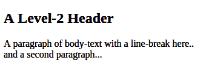

###### 图 4-3\. 一个 h2 标题和文本

标题标签按大小倒序排列，从最大的 `<h1>` 开始。

`<div>`、`<h*>` 和 `<p>` 被称为*块元素*。它们通常以新行开始和结束。另一类标签是*内联元素*，它们在显示时不会有换行符。像 `` 图像、`<a>` 超链接和 `<td>` 表格单元格就属于这一类，还包括 `<span>` 标签用于内联文本：

```py
<div id="inline-examples">
     
    <p>This is a <a href="link-url">link</a> to <span class="url">link-url</span></p> 
</div>
```


注意，对于图片，我们不需要闭合标签。


文本中 span 和 link 是连续的。

其他有用的标签包括有序 `<ol>` 和无序 `<ul>` 列表：

```py
<div style="display: flex; gap: 50px"> 
  <div>
    <h3>Ordered (ol) list</h3>
    <ol>
      <li>First Item</li>
      <li>Second Item</li>
    </ol>
  </div>
  <div>
    <h3>Unordered (ul) list</h3>
    <ul>
      <li>First Item</li>
      <li>Second Item</li>
    </ul>
  </div>
</div>
```


在这里我们直接在 `div` 标签上应用 CSS 样式（内联）。查看 “使用 Flex 定位和调整容器大小” 来介绍 `flex` 显示属性。

图 4-4 显示了渲染后的列表。

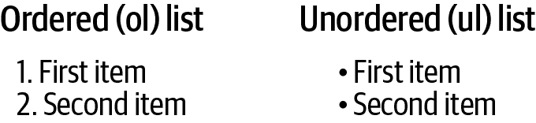

###### 图 4-4\. HTML 列表

HTML 还有一个专用的 `<table>` 标签，如果你想在可视化中呈现原始数据很有用。这段 HTML 生成了图 4-5 的标题和行 Figure 4-5：

```py
 <table id="chart-data">
  <tr> 
    <th>Name</th>
    <th>Category</th>
    <th>Country</th>
  </tr>
  <tr> 
    <td>Albert Einstein</td>
    <td>Physics</td>
    <td>Switzerland</td>
  </tr>
</table>
```


表头行


数据的第一行

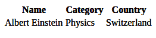

###### 图 4-5\. 一个 HTML 表格

当您制作网络可视化时，前面标签最常用的是文本标签，它们提供说明、信息框等。但是我们的 JavaScript 工作的核心可能是构建基于可伸缩矢量图形（SVG）`<svg>`和`<canvas>`标签的 DOM 分支。在大多数现代浏览器上，`<canvas>`标签还支持 3D *WebGL* 上下文，允许在页面中嵌入 *OpenGL* 可视化。^(5)

我们将处理本书的焦点 SVG，这是强大的 D3 库使用的格式，在“可缩放矢量图形”中看看我们如何为我们的内容块添加样式。

## CSS

*CSS*，即层叠样式表，是一种描述网页外观和感觉的语言。虽然您可以将样式属性硬编码到 HTML 中，但通常认为这是不良实践。^(6) 最好的方法是为标签打上`id`或`class`，然后在样式表中使用它来应用样式。

CSS 中的关键字是*层叠*。CSS 遵循优先规则，因此在冲突的情况下，最新的样式会覆盖先前的样式。这意味着包含表的顺序很重要。通常情况下，您希望样式表加载最后，以便可以覆盖浏览器默认样式和任何使用的库定义的样式。

图 4-6 展示了如何使用 CSS 对 HTML 元素应用样式。首先，使用井号（#）选择具有唯一 ID 的元素，使用点号（.）选择类的成员。然后定义一个或多个属性/值对。注意，`font-family`属性可以是一个优先级顺序列表。在这里，我们希望浏览器默认的`font-family`为`serif`（有衬线的），替换为更现代的`sans-serif`，首选为`Helvetica Neue`。

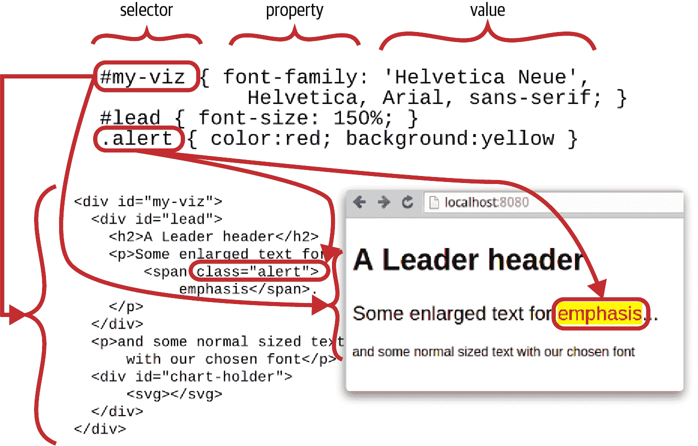

###### 图 4-6\. 使用 CSS 为页面添加样式

理解 CSS 优先规则是成功应用样式的关键。简而言之，顺序是：

1.  在 CSS 属性后面添加`!important`会覆盖所有。

1.  越具体越好（例如，ID 优先于类）。

1.  声明的顺序：最后的声明优先，遵循*1*和*2*。

所以，例如，假设我们有一个具有`alert`类的`<span>`：

```py
<span class="alert" id="special-alert">
something to be alerted to</span>
```

在我们的 *style.css* 文件中添加以下内容将使警报文本变为红色和粗体：

```py
.alert { font-weight:bold; color:red }
```

如果我们然后将其添加到 *style.css* 中，ID 颜色黑色将覆盖类颜色红色，而类`font-weight`保持粗体：

```py
#special-alert {background: yellow; color:black}
```

要强制警报颜色为红色，我们可以使用`!important`指令：^(7)

```py
.alert { font-weight:bold; color:red !important }
```

如果我们在 *style.css* 后添加另一个样式表 *style2.css*：

```py
<link rel="stylesheet" href="style.css" type="text/css" />
<link rel="stylesheet" href="style2.css" type="text/css" />
```

*style2.css* 包含以下内容：

```py
.alert { font-weight:normal }
```

然后警报的`font-weight`将恢复为`normal`，因为新的类样式是最后声明的。

## JavaScript

JavaScript 是唯一支持浏览器的编程语言，所有现代浏览器都包含了它的解释器。为了进行任何稍微高级的操作（包括所有现代网络可视化），您应该具备 JavaScript 的基础。[TypeScript](https://www.typescriptlang.org) 是 JavaScript 的超集，提供强类型，并且目前正在获得很大的关注。TypeScript 编译为 JavaScript，并假定您精通 JavaScript。

99% 的编码网络可视化示例，你应该学习的示例，都是用 JavaScript 编写的，而流行的替代方案往往会随着时间的推移而逐渐消失。基本上，对于有趣的网络可视化来说，精通（如果不是掌握）JavaScript 是一个先决条件。

对于 Python 爱好者来说，好消息是一旦你掌握了 JavaScript 的一些比较棘手的怪癖[⁸]，JavaScript 其实是一种非常不错的语言。正如我在 第二章 中展示的，JavaScript 和 Python 有很多共同点，通常很容易从一种语言翻译到另一种语言。

## 数据

用于驱动您的网络可视化所需的数据将由 Web 服务器提供为静态文件（例如 JSON 或 CSV 文件）或通过某种 Web API 动态提供（例如，[RESTful APIs](https://oreil.ly/RwvhM)），通常从数据库服务器端检索数据。我们将在 第 IV 部分 中涵盖所有这些形式。

尽管过去很多数据以 [XML 形式](https://oreil.ly/2IvEi) 提供，现代网络可视化主要是关于 JSON，并且在较小程度上也是 CSV 或 TSV 文件。

[JSON](https://oreil.ly/kCBDk)（JavaScript 对象表示法的缩写）是事实上的网络可视化数据标准，我建议你学会喜欢它。显然，它与 JavaScript 非常兼容，但它的结构也会对 Python 爱好者来说很熟悉。正如我们在 “JSON” 中看到的，用 Python 读取和写入 JSON 数据非常简单。这里有一个 JSON 数据的小例子：

```py
{
  "firstName": "Groucho",
  "lastName": "Marx",
  "siblings": ["Harpo", "Chico", "Gummo", "Zeppo"],
  "nationality": "American",
  "yearOfBirth": 1890
}
```

# Chrome 开发者工具

近年来 JavaScript 引擎的竞争，导致性能大幅提升，与此同时，各种浏览器内置的开发工具也变得越来越复杂。Firefox 的 Firebug 曾经领先一段时间，但是 [Chrome 开发者工具](https://oreil.ly/djHBp) 已经超越它，并且不断增加功能。现在你可以用 Chrome 的选项卡工具做很多事情，但在这里我将介绍两个最有用的选项卡，即专注于 HTML+CSS 的 *Elements* 和专注于 JavaScript 的 *Sources*。这两者与 Chrome 的开发者控制台相辅相成，如 “JavaScript” 中所示。

## 元素选项卡

要访问元素选项卡，请从右侧选项菜单中选择更多工具→开发者工具，或使用 Ctrl-Shift-I 键盘快捷键（Mac 中为 Cmd-Option-I）。

图 4-7 展示了元素选项卡的工作原理。您可以使用左侧的放大镜选择页面上的 DOM 元素，并在左侧面板中查看它们的 HTML 分支。右侧面板允许您查看应用于元素的 CSS 样式，并查看任何附加的事件监听器或 DOM 属性。

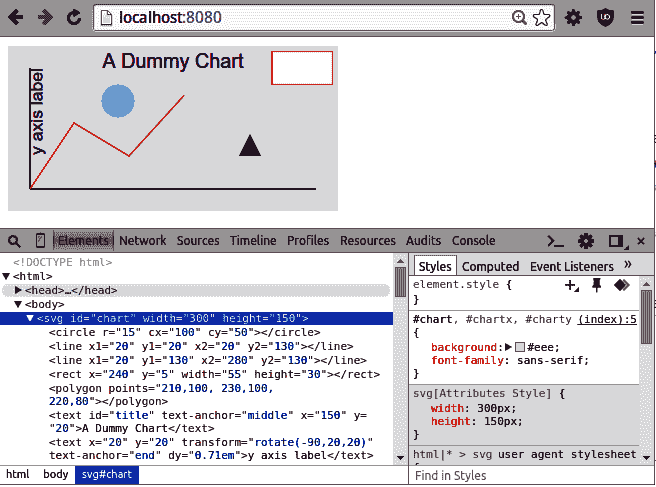

###### 图 4-7\. Chrome 开发者工具的元素选项卡

元素选项卡的一个非常酷的功能是，您可以交互地更改元素的 CSS 样式和属性。(9) 这是精细调整数据可视化外观和感觉的好方法。

Chrome 的元素选项卡为探索页面结构提供了一个很好的方式，找出不同元素的定位方式。这是了解如何使用`position`和`float`属性定位内容块的好方法。看看专家如何应用 CSS 样式是提升您技能并学习一些有用技巧的好方式。

## 来源选项卡

来源选项卡允许您查看页面中包含的任何 JavaScript。图 4-8 展示了该选项卡的工作方式。在左侧面板中，您可以选择带有嵌入式`<script>`标签的脚本或 HTML 文件。如图所示，您可以在代码中设置断点，加载页面，然后在中断时查看调用堆栈和任何局部或全局变量。这些断点是参数化的，因此您可以设置它们触发的条件，这在想要捕捉和逐步执行特定配置时非常方便。在中断时，您可以标准地执行进入、退出和跳过函数等操作。

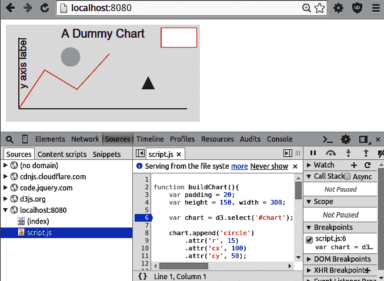

###### 图 4-8\. Chrome 开发者工具的来源选项卡

当试图调试 JavaScript 时，来源选项卡是一个非常好的资源，大大减少了需要使用控制台日志的次数。事实上，JS 调试曾经是一个主要的痛点，现在几乎成为一种乐趣。

## 其他工具

Chrome 开发者工具中的这些选项卡功能非常丰富，并且几乎每天都在更新。您可以进行内存和 CPU 时间线和分析，监视您的网络下载，并为不同的形式因素测试您的页面。但作为数据可视化工作者，您将在元素和来源选项卡中花费大部分时间。

# 带有占位符的基本页面

现在我们已经介绍了网页的主要元素，让我们把它们结合起来。大多数 Web 可视化从 HTML 和 CSS 骨架开始，准备好用一点 JavaScript 加数据来完善它们（参见“单页面应用程序”）。

我们首先需要我们的 HTML 骨架，使用示例 4-1 中的代码。这包括一个`<div>`内容块树，定义了三个图表元素：页眉、主要部分和侧边栏部分。我们将这个文件保存为*index.xhtml*。

##### 示例 4-1\. 文件 index.xhtml，我们的 HTML 骨架

```py
<!DOCTYPE html>
<meta charset="utf-8">

<link rel="stylesheet" href="style.css" type="text/css" />

<body>

  <div id="chart-holder" class="dev">
    <div id="header">
      <h2>A Catchy Title Coming Soon...</h2>
      <p>Some body text describing what this visualization is all
      about and why you should care.</p>
    </div>
    <div id="chart-components">
      <div id="main">
        A placeholder for the main chart.
      </div><div id="sidebar">
        <p>Some useful information about the chart,
          probably changing with user interaction.</p>
      </div>
    </div>
  </div>

  <script src="script.js"></script>
</body>
```

现在我们已经有了 HTML 骨架，我们想要使用一些 CSS 来进行样式化。这将使用我们内容块的类和 ID 来调整大小、位置、背景颜色等。要应用我们的 CSS，在示例 4-1 中我们引入了一个*style.css*文件，如示例 4-2 所示。

##### 示例 4-2\. style.css 文件，提供我们的 CSS 样式

```py
body {
    background: #ccc;
    font-family: Sans-serif;
}

div.dev { 
    border: solid 1px red;
}

div.dev div {
    border: dashed 1px green;
}

div#chart-holder {
    width: 600px;
    background :white;
    margin: auto;
    font-size :16px;
}

div#chart-components {
    height :400px;
    position :relative; 
}

div#main, div#sidebar {
    position: absolute; 
}

div#main {
    width: 75%;
    height: 100%;
    background: #eee;
}

div#sidebar {
    right: 0; 
    width: 25%;
    height: 100%;
}
```


这个`dev`类是查看任何可视块边框的便捷方法，对于可视化工作非常有用。


使`chart-components`成为相对父级。


使`main`和`sidebar`相对于`chart-components`定位。


将此块与`chart-components`的右墙对齐。

我们使用绝对定位的主要和侧边栏图表元素（示例 4-2）。有各种各样的方法来使用 CSS 定位内容块，但绝对定位可以明确控制它们的位置，这是如果你想要达到完美外观必须做的。

在指定了`chart-components`容器的大小之后，`main`和`sidebar`子元素使用其父元素的百分比进行了大小调整和定位。这意味着对`chart-components`大小的任何更改都将反映在其子元素中。

使用我们定义的 HTML 和 CSS，我们可以通过在包含在示例 4-1 和 4-2 中定义的*index.xhtml*和*style.css*文件的项目目录中启动 Python 的单行 HTTP 服务器来检查骨架，如下所示：

```py
$ python -m http.server 8000
Serving HTTP on 0.0.0.0 port 8000 ...
```

图 4-9 显示了打开元素选项卡的结果页面，显示了页面的 DOM 树。

现在图表的内容块已经正确地定位和调整大小，准备使用 JavaScript 添加一些引人入胜的内容。

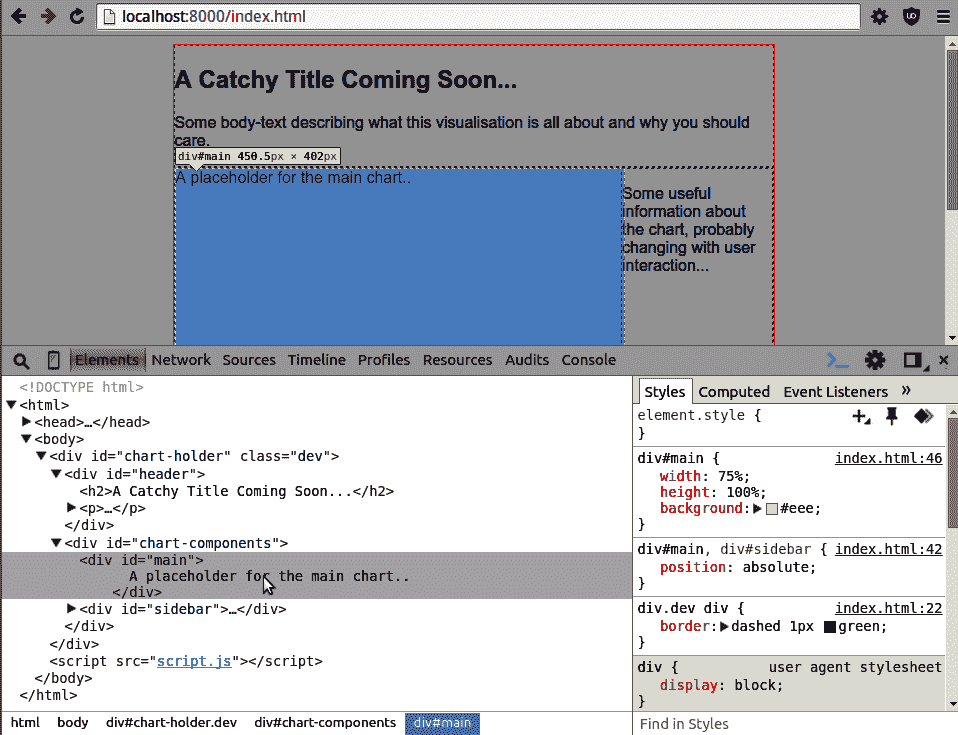

###### 图 4-9\. 构建基本网页

# 使用 Flex 定位和调整大小的容器

历史上，使用 CSS 定位和调整内容（通常为 `<div>` 容器）有点像黑魔法。并没有帮助的是，有许多跨浏览器的不兼容性和对什么构成填充或边距的争议。但即使考虑到这一点，所使用的 CSS 属性似乎也相当随意。通常，实现看似完全合理的定位或大小野心的方法，结果涉及到深奥的 CSS 知识，隐藏在 Stack Overflow 帖子的深处。一个例子是将 `div` 在水平和垂直方向上居中[¹¹]。这一切都随着 CSS flex-box 的出现而改变，它使用一些强大的新 CSS 属性几乎提供了您所需要的所有大小和定位。

Flex-boxes 并不完全是一种 CSS 属性来统治它们所有——前面章节展示的绝对定位仍然有其用处，特别是在数据可视化方面——但它们是一组非常强大的属性，往往是实现特定定位/大小任务的最简单、有时是唯一的方法。过去需要 CSS 专业知识的效果现在已经非常容易掌握，而且 flex-boxes 与可变屏幕比例非常兼容——flex 的威力。考虑到这一点，让我们看看基本的 flex 属性能做些什么。

首先，我们将使用一些 HTML 创建一个带有三个子 `div`（框）的容器 `div`。子框将具有类 `box`，并带有一个 ID 以便应用特定的 CSS：

```py
<div class="container" id="top-container">
  <div class="box" id="box1">box 1</div>
  <div class="box" id="box2">box 2</div>
  <div class="box" id="box3">box 3</div>
</div>
```

最初的 CSS 给容器一个红色边框、宽度和高度（600x400）。框的宽度和高度均为 100 像素（80 像素加上 10 像素的填充）并带有绿色边框。一个新颖的 CSS 属性是容器的 `display: flex`，它建立了一个 flex 显示上下文。这样做的结果可以在 图 4-10（`display: flex`）中看到，显示的框以行而不是默认的列呈现，其中每个框占据自己的行：

```py
.container {
  display: flex;
  width: 600px;
  height: 400px;
  border: 2px solid red;
}

.box {
  border: 2px solid green;
  font-size: 28px;
  padding: 10px;
  width: 80px;
  height: 80px;
}
```

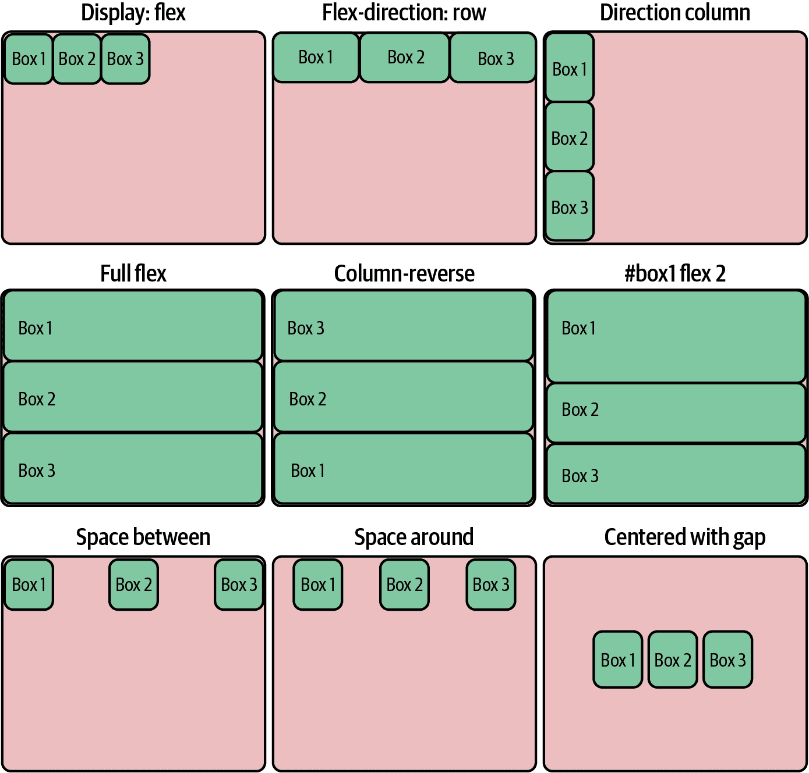

###### 图 4-10\. 使用 flex-boxes 进行定位和调整大小

Flex 显示根据子元素的 `flex` 属性响应地扩展其大小以适应可用空间。如果我们使框具有弹性，它们将响应性地扩展以填充容器行。图 4-10（flex-direction: row）显示了结果。请注意，`flex` 属性会覆盖框的宽度属性，使其能够扩展：

```py
.box {
  /* ... */
  flex: 1;
}
```

`flex-direction` 属性默认为 `row`。通过将其设置为 `column`，可以将框放置在列中，并覆盖高度属性，使其能够扩展以适应容器的高度。图 4-10（方向列）显示了结果：

```py
.container {
  /* ... */
  flex-direction: column;
}
```

从框中删除或注释掉宽度和高度属性会使它们完全灵活，能够在水平和垂直方向上扩展，生成 图 4-10（全灵活）：

```py
.box {
  /* ... */
  /* width: 80px;
 height: 80px; */
  flex: 1;
}
```

如果你想颠倒 `flex` 盒子的顺序，有 `row-reverse` 和 `column-reverse` 的 `flex-direction`。图 4-10 (列逆序) 显示了颠倒列的结果：

```py
.container {
  /* ... */
  flex-direction: column-reverse;
}
```

盒子的 `flex` 属性值表示一个大小权重。最初，所有的盒子都有一个权重为一，这使它们的大小相等。如果我们给第一个盒子一个权重为二，它将占据在指定的行或列方向上可用空间的一半（2 / (1 + 1 + 2)）。图 4-10 (#box1 flex 2) 显示了增加 `box1` 的 `flex` 值的结果：

```py
#box1 {
  flex: 2;
}
```

如果我们将盒子的高度和宽度限制（包括填充）返回到 100 像素，并移除它们的 `flex` 属性，我们可以展示 `flex` 布局定位的强大功能。我们还需要从 `box1` 中删除 `flex` 指令：

```py
.box {
  width: 80px;
  height: 80px;
  /* flex: 1; */
}

#box1 {
  /* flex: 2; */
}
```

对于固定大小的内容，`flex` 布局具有许多属性，允许精确放置内容。这种操作以前通常涉及各种复杂的 CSS 技巧。首先，让我们在容器中均匀分布盒子，使用基于行的间距。魔法属性是 `justify-content`，值为 `space-between`；图 4-10 (间距之间) 显示了结果：

```py
.container {
  /* ... */
  flex-direction: row;
  justify-content: space-between;
}
```

有一个与 `space-between` 对称的 `space-around`，它通过在左右两侧添加相等的内边距来排列内容。图 4-10 (四周留白) 显示了结果：

```py
.container {
  /* ... */
  justify-content: space-around;
}
```

通过组合 `justify-content` 和 `align-items` 属性，我们可以实现 CSS 定位的圣杯，将内容垂直和水平居中。我们使用 `flex` 布局的 `gap` 属性在盒子之间增加了 20 像素的间距：

```py
.container {
  /* ... */
    gap: 20px;
    justify-content: center;
    align-items: center;
}
```

图 4-10 （使用 `gap` 居中）显示我们的内容完全位于其容器的中间。

`flex` 布局的另一个很棒的特性是它是完全递归的。`div` 既可以 *拥有* `flex` 属性，也可以 *成为* `flex` 内容。这使得实现复杂的内容布局变得轻而易举。让我们来看一个嵌套的 flex 盒子的小演示，以便清晰地表达这一点。

我们首先使用一些 HTML 来构建盒子的嵌套树（包括主容器盒子）。我们给每个盒子和容器都分配一个 ID 和类：

```py
  <div class="main-container">

    <div class="container" id="top-container">
      <div class="box" id="box1">box 1</div>
      <div class="box" id="box2">box 2</div>
    </div>

    <div class="container" id="middle-container">
      <div class="box" id="box3">box 3</div>
    </div>

    <div class="container" id="bottom-container">
      <div class="box" id="box4">box 4</div>
      <div class="box" id="box5">
        <div class="box" id="box6">box 6</div>
        <div class="box" id="box7">box 7</div>
      </div>
    </div>

  </div>
```

以下 CSS 给主容器设置了 800 像素的高度（默认情况下它会填充可用宽度），一个 `flex` 布局，并且一个 `flex-direction` 的列，使其堆叠其 `flex` 内容。

有三个要堆叠的容器，它们既灵活又为其内容提供了 `flex` 布局。这些盒子有一个红色边框，并且完全灵活（没有指定宽度或高度）。默认情况下，所有盒子的 `flex` 权重都为一。

中间容器有一个固定宽度的盒子（宽度为 66%），并使用 `justify-content: center` 将其居中。

底部容器的 flex 值为 2，使其高度是其兄弟元素的两倍。它有两个等重的盒子，其中一个（盒子 5）包含两个堆叠的盒子（`flex-direction: column`）。这种相当复杂的布局（参见图 4-11）只需非常少量的 CSS 即可实现，并且通过更改几个 flex 显示属性可以轻松适应：

```py
.main-container {
  height: 800px;
  padding: 10px;
  border: 2px solid green;
  display: flex;
  flex-direction: column;
}

.container {
  flex: 1;
  display: flex;
}

.box {
  flex: 1;
  border: 2px solid red;
  padding: 10px;
  font-size: 30px;
}

#middle-container {
  justify-content: center;
}

#box3 {
  width: 66%;
  flex: initial;
}

#bottom-container {
  flex: 2;
}

#box5 {
  display: flex;
  flex-direction: column;
}
```

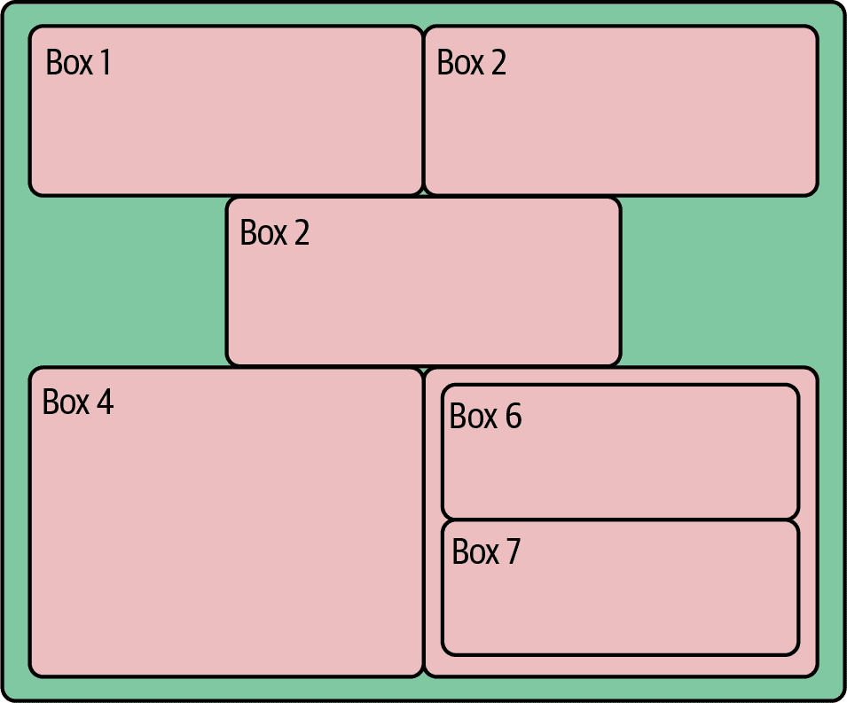

###### 图 4-11\. 嵌套的 flex-boxes

Flex-boxes 提供了一个非常强大的大小和定位上下文，适应 HTML 内容的容器大小，并且可以轻松地适应。如果您希望内容在列而不是行中显示，只需更改一个属性即可。对于更精确的定位和大小控制，可以使用[CSS 网格布局](https://oreil.ly/lVilF)，但我建议您首先集中精力学习 flex 布局——它目前代表了 CSS 学习投入的最佳回报。有关更多示例，请参阅[CSS-Tricks 文章](https://oreil.ly/JJgbG)关于 flex-boxes 和[这个便捷的速查表](https://flexboxsheet.com)。

## 填充占位符与内容

在 HTML 中定义了内容块并用 CSS 定位后，现代数据可视化使用 JavaScript 构建其交互式图表，菜单，表格等。在现代浏览器中，除了图像或多媒体标签之外，还有许多创建视觉内容的方式，主要包括：

+   可伸缩矢量图形（SVG）使用特殊的 HTML 标签

+   绘制到 2D `canvas`上下文

+   绘制到 3D `canvas` WebGL 上下文，允许使用 OpenGL 命令的子集

+   使用现代 CSS 创建动画，图形基元等

因为 SVG 是 D3 的首选语言，D3 是目前最大的 JavaScript 数据可视化库，许多您见过的酷炫网络数据可视化，例如*纽约时报*的那些，都是使用它构建的。总体来说，除非您预期在可视化中有大量（>1000）的移动元素或需要使用特定的基于`canvas`的库，否则 SVG 可能是更好的选择。

通过使用向量而不是像素来表达其基元，SVG 通常会生成更清晰的图形，对缩放操作响应平滑。它在处理文本方面也要好得多，这对许多可视化是一个关键考虑因素。SVG 的另一个关键优势是用户交互（例如，鼠标悬停或点击）是浏览器的本地功能，是标准 DOM 事件处理的一部分。^(12) 它的另一个优点是，由于图形组件建立在 DOM 上，您可以使用浏览器的开发工具检查和调整它们（参见“Chrome DevTools”）。这比试图在相对黑盒的`canvas`中找到错误要容易得多。

当您需要超越简单的图形基元（如圆圈和线条），例如在包含 PNG 和 JPG 图像时，`canvas` 绘图环境就发挥了自己的作用。相对于 SVG，`canvas` 通常具有更高的性能，因此任何具有大量移动元素的情况^(13) 最好使用 `canvas` 进行渲染。如果您想要真正雄心勃勃，或者超越二维图形，甚至可以通过使用特殊形式的 `canvas` 上下文，即基于 OpenGL 的 WebGL 上下文，释放现代图形卡的强大能力。但请记住，与 SVG 的简单用户交互（例如点击可视元素）通常必须从鼠标坐标手动派生，这增加了一个棘手的复杂层次。

在本书工具链的最后实现的诺贝尔奖数据可视化主要使用了 D3，因此 SVG 图形是本书的重点。熟悉 SVG 对于现代基于网络的数据可视化是基础，因此让我们探索一些基础知识。

# 可缩放矢量图形

所有的 SVG 创建都从 `<svg>` 根标签开始。所有的图形元素，如圆圈和线条，以及它们的组，都定义在 DOM 树的这个分支上。示例 4-3 展示了我们将在接下来的演示中使用的一个小型 SVG 上下文，一个带有 ID `chart` 的浅灰色矩形。我们还包括了从 [*d3js.org*](https://d3js.org) 载入的 D3 库以及项目文件夹中的 *script.js* JavaScript 文件。

##### 示例 4-3\. 一个基本的 SVG 上下文

```py
<!DOCTYPE html>
<meta charset="utf-8">
<!-- A few CSS style rules -->
<style>
  svg#chart {
  background: lightgray;
  }
</style>

<svg id="chart" width="300" height="225">
</svg>

<!-- Third-party libraries and our JS script. -->
<script src="http://d3js.org/d3.v7.min.js"></script>
<script src="script.js"></script>
```

现在我们已经将我们的小型 SVG 画布放置好了，让我们开始做一些绘画。

## <g> 元素

我们可以通过使用 `<g>` 元素在我们的 `<svg>` 元素中对形状进行分组。正如我们将在“使用群组”中看到的那样，包含在组中的形状可以一起操作，包括更改它们的位置、比例或不透明度。

## 圆圈

创建 SVG 可视化，从最简单的静态条形图到完整的交互式地理杰作，都涉及从一组相当小的图形基元（如线条、圆圈和非常强大的路径）中组合元素。每个元素都将有其自己的 DOM 标签，在其更改时更新。^(14) 例如，其 *x* 和 *y* 属性将根据 `<svg>` 或组（`<g>`）上下文中的任何平移而更改。

让我们向我们的 `<svg>` 上下文中添加一个圆圈来演示：

```py
<svg id="chart" width="300" height="225">
  <circle r="15" cx="100" cy="50"></circle>
</svg>
```

使用一点 CSS 为圆圈提供填充颜色：

```py
#chart circle{ fill: lightblue }
```

这生成了图 4-12。请注意，*y* 坐标是从 `<svg>` `'#chart'` 容器顶部测量的，这是一种常见的图形约定。

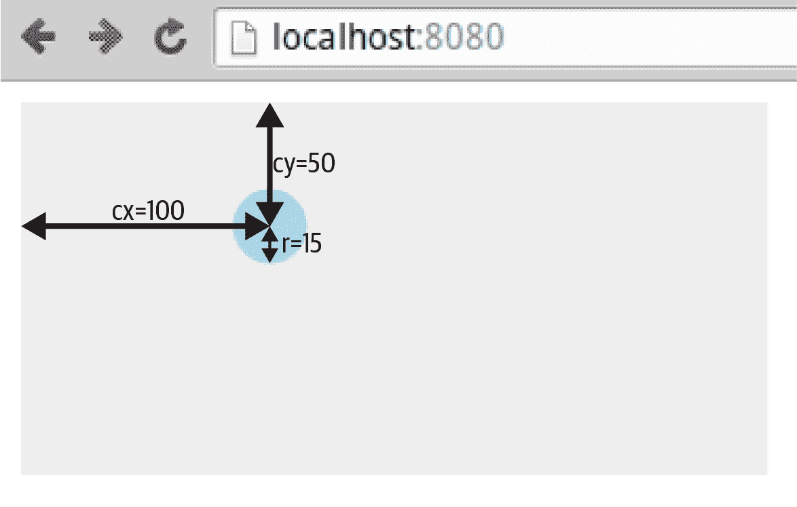

###### 图 4-12\. 一个 SVG 圆圈

现在让我们看看如何向 SVG 元素应用样式。

## 应用 CSS 样式

在使用 CSS 样式规则填充浅蓝色的图 4-12 中的圆圈：

```py
#chart circle{ fill: lightblue }
```

在现代浏览器中，您可以使用 CSS 设置大多数视觉 SVG 样式，包括 `fill`、`stroke`、`stroke-width` 和 `opacity`。所以，如果我们想要一条粗的、半透明的绿色线（带有 ID `total`），我们可以使用以下 CSS：

```py
#chart line#total {
    stroke: green;
    stroke-width: 3px;
    opacity: 0.5;
}
```

您也可以将样式设置为标签的属性，尽管通常更喜欢使用 CSS：

```py
<svg>
  <circle r="15" cx="100" cy="50" fill="lightblue"></circle>
</svg>
```

###### 提示

哪些 SVG 特性可以通过 CSS 设置，哪些不能，这是一些混淆和许多陷阱的来源。SVG 规范区分元素的 [属性](https://oreil.ly/K0enr) 和属性，前者更可能出现在有效的 CSS 样式中。您可以使用 Chrome 的元素选项卡和自动完成来调查有效的 CSS 属性。另外，要做好一些准备，例如，SVG 文本的颜色由 `fill` 属性而不是 `color` 属性确定。

对于 `fill` 和 `stroke`，您可以使用各种颜色约定：

+   命名的 HTML 颜色，如 lightblue

+   使用 HTML 十六进制代码（#RRGGBB）；例如，白色是 #FFFFFF

+   RGB 值；例如，红色 = rgb(255, 0, 0)

+   RGBA 值，其中 A 是 alpha 通道（0–1）；例如，半透明蓝色是 rgba(0, 0, 255, 0.5)

除了使用 RGBA 调整颜色的 alpha 通道外，您还可以使用 SVG 元素的 `opacity` 属性淡化 SVG 元素。在 D3 动画中经常使用不透明度。

默认情况下，描边宽度以像素为单位，但可以使用点。

## 线条、矩形和多边形

我们将向我们的图表添加一些更多的元素，以生成 图 4-13。

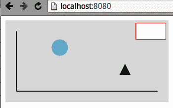

###### 图 4-13\. 向虚拟图表添加一些元素

首先，我们将使用 `<line>` 标签向我们的图表添加几条简单的轴线。线的位置由起始坐标（x1，y1）和结束坐标（x2，y2）定义：

```py
<svg>
  <line x1="20" y1="20" x2="20" y2="130"></line>
  <line x1="20" y1="130" x2="280" y2="130"></line>
</svg>
```

我们还将使用 SVG 矩形在右上角添加一个虚拟图例框。矩形由相对于其父容器的 *x* 和 *y* 坐标以及宽度和高度定义：

```py
<svg>
  <rect x="240" y="5" width="55" height="30"></rect>
</svg>
```

您可以使用 `<polygon>` 标签创建不规则多边形，它接受一系列坐标对。让我们在图表的右下角制作一个三角形标记：

```py
<svg>
  <polygon points="210,100, 230,100, 220,80"></polygon>
</svg>
```

我们将使用一些 CSS 样式化元素：

```py
#chart circle {fill: lightblue}
#chart line {stroke: #555555; stroke-width: 2}
#chart rect {stroke: red; fill: white}
#chart polygon {fill: green}
```

现在我们已经有了一些图形原语，让我们看看如何向虚拟图表添加一些文本。

## 文本

SVG 相对于栅格化的 `canvas` 上下文的一个关键优势之一是它如何处理文本。基于矢量的文本往往看起来比其像素化的对应物更清晰，并且也受益于平滑缩放。您还可以调整描边和填充属性，就像任何 SVG 元素一样。

让我们向虚拟图表添加一些文本：一个标题和带标签的 y 轴（参见 图 4-14）。

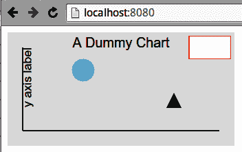

###### 图 4-14\. 一些 SVG 文本

我们使用 *x* 和 *y* 坐标放置文本。一个重要的属性是 `text-anchor`，它规定了文本相对于其 x 位置的放置位置。选项有 `start`、`middle` 和 `end`；`start` 是默认值。

我们可以使用`text-anchor`属性来使我们的图表标题居中。我们将*x*坐标设置为图表宽度的一半，然后将`text-anchor`设置为`middle`：

```py
<svg>
  <text id="title" text-anchor="middle" x="150" y="20">
    A Dummy Chart
  </text>
</svg>
```

与所有 SVG 基元一样，我们可以对文本应用缩放和旋转变换。为了标记我们的 y 轴，我们需要将文本旋转为垂直方向（示例 4-4）。按照惯例，旋转是顺时针的度数，所以我们希望逆时针旋转，-90 度旋转。默认情况下，旋转是围绕元素容器(`<svg>`或组`<g>`)的(0,0)点进行的。我们希望围绕其自身位置旋转文本，因此首先使用`rotate`函数的额外参数来转换旋转点。我们还希望首先将`text-anchor`设置为`y 轴标签`字符串的末端，以围绕其端点旋转。

##### 示例 4-4\. 旋转文本

```py
<svg>
  <text x="20" y="20" transform="rotate(-90,20,20)"
      text-anchor="end" dy="0.71em">y axis label</text>
</svg>
```

在示例 4-4 中，我们利用文本的`dy`属性，与`dx`一起可以微调文本的位置。在这种情况下，我们希望将其降低，这样在逆时针旋转时它将位于 y 轴的右侧。

SVG 文本元素也可以使用 CSS 进行样式设置。在这里，我们将图表的`font-family`设置为`sans-serif`，`font-size`设置为`16px`，使用`title` ID 使其稍大：

```py
#chart {
background: #eee;
font-family: sans-serif;
}
#chart text{ font-size: 16px }
#chart text#title{ font-size: 18px }
```

注意，`text`元素继承自图表的 CSS 中的`font-family`和`font-size`；您不必为`text`元素指定。

## 路径

路径是最复杂和强大的 SVG 元素，可以创建多行、多曲线组件路径，可以闭合和填充，从而创建几乎任何形状。一个简单的例子是在我们的虚拟图表中添加一条小图表线，生成图 4-15。

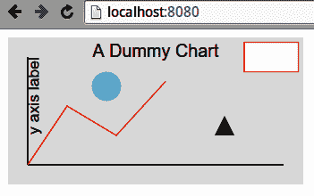

###### 图 4-15\. 来自图表轴的红线路径

图 4-15 中的红色路径是由以下 SVG 生成的：

```py
<svg>
  <path d="M20 130L60 70L110 100L160 45"></path>
</svg>
```

`path`的`d`属性指定了制作红线所需的一系列操作。让我们详细分解一下：

+   “M20 130”: 移动到坐标 (20, 130)

+   “L60 70”: 画一条线到 (60, 70)

+   “L110 100”: 画一条线到 (110, 100)

+   “L160 45”: 画一条线到 (160, 45)

您可以将`d`想象成一组指示笔移动到点的指令，其中`M`从画布上抬起笔。

需要一些 CSS 样式。请注意，`fill`设置为`none`；否则，为了创建填充区域，路径将闭合，并从其结束点到起始点绘制一条线，并用默认颜色黑色填充任何封闭区域：

```py
#chart path {stroke: red; fill: none}
```

除了`moveto 'M'`和`lineto 'L'`，路径还有许多其他命令来绘制弧线、贝塞尔曲线等。SVG 弧线和曲线在数据可视化工作中经常使用，D3 的许多库都在使用它们。^(15) 图 4-16 展示了以下代码创建的一些 SVG 椭圆弧：

```py
<svg id="chart" width="300" height="150">
  <path d="M40 40
           A30 40  0 0 1  80 80
           A50 50  0 0 1  160  80
           A30 30  0 0 1  190  80
">
</svg>
```


移动到位置 (40, 40) 后，绘制一个 x 半径为 30，y 半径为 40，终点为 (80, 80) 的椭圆弧。


第一个标志 (0) 设置了 x 轴的旋转，在本例中为传统的零度。参见 [Mozilla 开发者网站](https://oreil.ly/KGCDZ) 进行视觉演示。最后两个标志 (0, 1) 是 `large-arc-flag`，指定要使用椭圆的哪个弧，以及 `sweep-flag`，指定由起点和终点定义的两个可能椭圆中的哪一个。

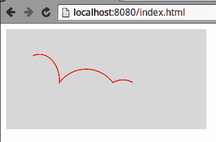

###### 图 4-16\. 一些 SVG 椭圆弧

椭圆弧中使用的关键标志（`large-arc-flag` 和 `sweep-flag`），像大多数几何事物一样，最好是演示而不是描述。图 4-17 展示了在相同的相对起始点和端点情况下改变标志的效果，如下所示：

```py
<svg id="chart" width="300" height="150">
  <path d="M40 80
 A30 40  0 0 1  80 80
 A30 40  0 0 0  120  80
 A30 40  0 1 0  160  80
 A30 40  0 1 1  200  80
">
</svg>
```

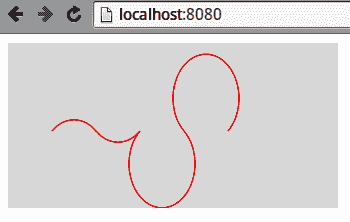

###### 图 4-17\. 改变椭圆弧标志

除了直线和弧线外，`path` 元素还提供了多种贝塞尔曲线，包括二次、三次以及二者的复合曲线。通过一些工作，这些曲线可以创建任何你想要的线路路径。在 [SitePoint](https://oreil.ly/PRdVF) 上有一个很好的运行过程，配有良好的插图。

想要了解 `path` 元素及其参数的完整列表，请访问 [World Wide Web Consortium (W3C) 源](https://oreil.ly/s7YSY)。另外，可以参考 [Jakob Jenkov 的介绍](https://oreil.ly/fdERF) 进行详细了解。

## 缩放和旋转

作为其向量性质的体现，所有的 SVG 元素都可以通过几何操作进行变换。最常用的是 `rotate`、`translate` 和 `scale`，但你也可以使用 `skewX` 和 `skewY` 进行倾斜，或者使用功能强大的多用途 *matrix* 变换。

让我们演示最流行的变换，使用一组相同的矩形。通过如下方式实现 图 4-18 中的变换矩形：

```py
<svg id="chart" width="300" height="150">
  <rect width="20" height="40" transform="translate(60, 55)"
        fill="blue"/>
  <rect width="20" height="40" transform="translate(120, 55),
 rotate(45)" fill="blue"/>
  <rect width="20" height="40" transform="translate(180, 55),
 scale(0.5)" fill="blue"/>
  <rect width="20" height="40" transform="translate(240, 55),
 rotate(45),scale(0.5)" fill="blue"/>
</svg>
```

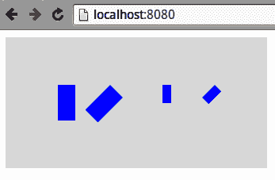

###### 图 4-18\. 一些 SVG 变换：rotate(45)，scale(0.5)，scale(0.5)，然后 rotate(45)

###### 注意

变换的应用顺序很重要。顺时针旋转 45 度，然后沿 x 轴平移将使元素向东南移动，而反向操作则将其向左移动，然后旋转。

## 使用组

在构建可视化时，通常将视觉元素分组是很有帮助的。一些特定的用途包括：

+   当需要局部坐标方案时（例如，如果你有一个图标的文本标签，想要指定其相对于图标而不是整个 `<svg>` 画布的位置）。

+   如果要对部分视觉元素应用缩放和/或旋转变换。

SVG 使用 `<g>` 标签来进行分组，你可以将其视为 `<svg>` 画布中的小型画布。组可以包含组，从而允许非常灵活的几何映射。^(16)

示例 4-5 将形状分组在画布的中心，生成图 4-19。注意`circle`、`rect`和`path`元素的位置是相对于被转换的组而言的。

##### 示例 4-5\. 对 SVG 形状进行分组

```py
<svg id="chart" width="300" height="150">
  <g id="shapes" transform="translate(150,75)">
    <circle cx="50" cy="0" r="25" fill="red" />
    <rect x="30" y="10" width="40" height="20" fill="blue" />
    <path d="M-20 -10L50 -10L10 60Z" fill="green" />
    <circle r="10" fill="yellow">
  </g>
</svg>
```

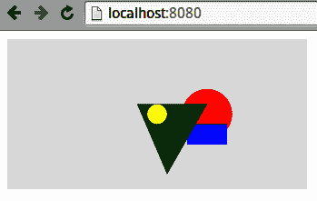

###### 图 4-19\. 使用 SVG `<g>` 标签对形状进行分组

如果我们现在对组应用一个变换，组内的所有形状都将受到影响。图 4-20 展示了通过将图 4-19 按 0.75 倍缩放并旋转 90 度来实现的结果，我们通过调整 transform 属性来实现这一点，如下所示：

```py
<svg id="chart" width="300" height="150">
  <g id="shapes",
     transform = "translate(150,75),scale(0.5),rotate(90)">
     ...
</svg>
```

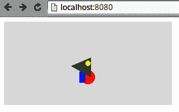

###### 图 4-20\. 对 SVG 组进行变换

## 层叠和透明度

在 DOM 树中添加 SVG 元素的顺序很重要，后面的元素会覆盖前面的元素。例如，在图 4-19 中，三角形路径遮盖了红色圆形和蓝色矩形，同时被黄色圆形遮盖。

控制 DOM 的排序是 JavaScript 数据可视化的重要部分（例如，D3 的 `insert` 方法允许您在现有元素之前放置一个 SVG 元素）。

可以使用 `rgba(R,G,B,A)` 颜色的 alpha 通道或更方便的 `opacity` 属性来控制元素的透明度。两者都可以使用 CSS 来设置。对于重叠的元素，透明度是累积的，正如在图 4-21 中的颜色三角形所示，该三角形是通过以下 SVG 生成的：

```py
<style>
  #chart circle { opacity: 0.33 }
</style>

<svg id="chart" width="300" height="150">
  <g transform="translate(150, 75)">
    <circle cx="0" cy="-20" r="30" fill="red"/>
    <circle cx="17.3" cy="10" r="30" fill="green"/>
    <circle cx="-17.3" cy="10" r="30" fill="blue"/>
  </g>
</svg>
```

这里展示的 SVG 元素是在 HTML 中手工编码的，但在数据可视化工作中，它们几乎总是以编程方式添加的。因此，基本的 D3 工作流程是向可视化中添加 SVG 元素，使用数据文件来指定它们的属性和属性。

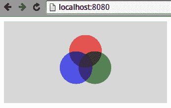

###### 图 4-21\. 使用 SVG 调整不透明度

## JavaScripted SVG

SVG 图形由 DOM 标签描述的事实相比 `<canvas>` 上的黑盒有许多优势。例如，它允许非程序员创建或调整图形，并且有助于调试。

在 web 数据可视化中，几乎所有的 SVG 元素都是通过 JavaScript 创建的，例如使用 D3 这样的库。您可以使用浏览器的元素选项卡检查这些脚本的结果（参见“Chrome DevTools”），这是精细调整和调试工作的好方法（例如解决令人烦恼的视觉故障）。

为了展示即将发生的事情，让我们使用 D3 在 SVG 画布上散布一些红色圆圈。画布和圆圈的尺寸包含在发送给 `chartCircles` 函数的 `data` 对象中。

我们使用一个小的 HTML 占位符来表示`<svg>`元素：

```py
<!DOCTYPE html>
<meta charset="utf-8">

<style>
  #chart { background: lightgray; }
  #chart circle {fill: red}
</style>

<body>
  <svg id="chart"></svg>

  <script src="http://d3js.org/d3.v7.min.js"></script>
  <script src="script.js"></script>
</body>
```

放置了我们的占位符 SVG `chart` 元素后，*script.js* 文件中的少量 D3 代码被用来将一些数据转换为散点圆圈（参见图 4-22）：

```py
// script.js 
var chartCircles = function(data) {

    var chart = d3.select('#chart');
    // Set the chart height and width from data
    chart.attr('height', data.height).attr('width', data.width);
    // Create some circles using the data
    chart.selectAll('circle').data(data.circles)
        .enter()
        .append('circle')
        .attr('cx', function(d) { return d.x })
        .attr('cy', d => d.y) 
        .attr('r', d => d.r);
};

var data = {
    width: 300, height: 150,
    circles: [
        {'x': 50, 'y': 30, 'r': 20},
        {'x': 70, 'y': 80, 'r': 10},
        {'x': 160, 'y': 60, 'r': 10},
        {'x': 200, 'y': 100, 'r': 5},
    ]
};

chartCircles(data);
```


这是现代箭头匿名函数的简写形式，等同于上一行的长形式。D3 大量使用这种方法来访问绑定数据对象的属性，因此这种新的语法是一大进步。

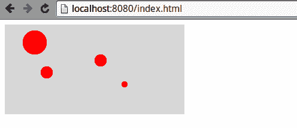

###### 图 4-22\. D3 生成的圆圈

我们将在第十七章中详细了解 D3 的奥秘。现在，让我们总结一下本章学到的内容。

# 总结

本章为初学数据可视化者提供了一组基本的现代 Web 开发技能。它展示了 Web 页面的各种元素（HTML、CSS 样式表、JavaScript 和媒体文件）是如何通过 HTTP 传送的，并且在被浏览器接收后，如何组合成用户看到的网页。我们看到了如何描述内容块，使用 HTML 标签如`div`和`p`，然后使用 CSS 进行样式化和定位。我们还介绍了 Chrome 的 Elements 和 Sources 标签，这是关键的浏览器开发工具。最后，我们简要介绍了 SVG，这是大多数现代 Web 数据可视化表达的语言。这些技能将在我们的工具链达到其 D3 可视化时进行扩展，并且将在上下文中引入新的技能。

^(1) 目前有一些备受关注的替代方案，与 Python Web 服务器（如 Django 和[Flask](https://oreil.ly/3zlEU)）兼容良好，例如[Alpine.js 和 htmx](https://oreil.ly/daXEB)。 

^(2) 我承受了伤痕，这样你就不必了。

^(3) 你可以使用`style`属性在 HTML 标签中编写样式，但这通常是一种不良实践。最好使用在 CSS 中定义的类和 ID。

^(4) 正如迈克·博斯托克所演示的，向保罗·爱尔兰致敬。

^(5) OpenGL（Open Graphics Language）及其网络对应物 WebGL 是跨平台的 API，用于渲染 2D 和 3D 矢量图形（详情请参阅[Wikipedia 页面](https://oreil.ly/eytfV)）。

^(6) 这与以编程方式设置样式不同，后者是一种非常强大的技术，允许样式根据用户交互进行调整。

^(7) 这通常被认为是一种不良实践，通常是 CSS 结构混乱的指示。请极度谨慎使用，因为它可能会让代码开发人员的生活变得非常困难。

^(8) 这些在道格拉斯·克罗克福德著名简短的*JavaScript: The Good Parts*（O'Reilly）中简要讨论。

^(9) 当尝试使可缩放矢量图形（SVG）工作时，能够玩弄属性尤其有用。

^(10) 记录日志是跟踪应用程序数据流的好方法。我建议您在这里采用一致的方法。

^(11) 这里有[一个展示问题多样解决方案的讨论串](https://oreil.ly/casbD)，没有一个可以称得上优雅。

^(12) 使用`canvas`图形上下文，通常需要自己设计事件处理。

^(13) 这个数字随时间和所用的浏览器而变化，但作为一个粗略的经验法则，SVG 在低千个元素时通常开始吃力。

^(14) 您应该能够使用浏览器的开发工具实时查看标签属性的更新。

^(15) [迈克·博斯托克的弦图](https://oreil.ly/ujCxf)是一个很好的例子，使用了 D3 的`chord`函数。

^(16) 例如，一个身体组可以包含一个手臂组，手臂组可以包含一个手组，手组可以包含手指元素。
