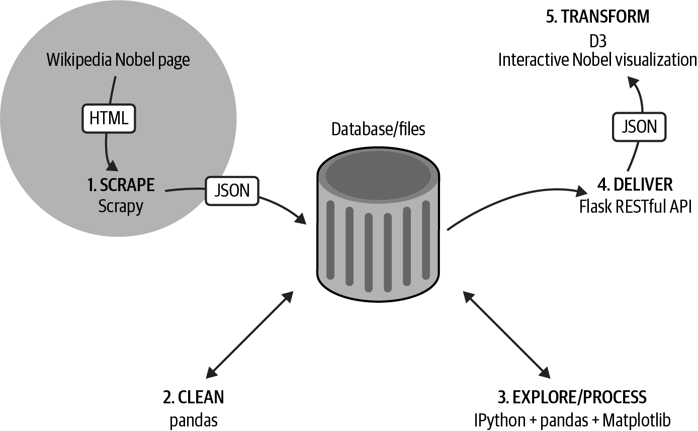

# 第二部分：获取数据

本书的这一部分开始了我们沿着数据可视化工具链的旅程（见 图 II-1），首先介绍了几章如何获取数据，如果数据没有提供给你的话。

在第五章中，我们学习如何从网络获取数据，使用 Python 的 Requests 库来获取基于 web 的文件和消费 RESTful API。我们还看到了如何使用一些包装更复杂的 web API 的 Python 库，包括 Twitter（使用 Python 的 Tweepy）和 Google Docs。本章以 Beautiful Soup 库进行轻量级[网络抓取](https://oreil.ly/fjBEA)的示例结束。

在第六章中，我们使用了 Scrapy，Python 的工业级网络爬虫，获取了诺贝尔奖数据集，这将用于我们的网络可视化。有了这个*肮脏*的数据集，我们准备进入本书的下一部分，第 III 部分。

###### 图 II-1\. 我们的数据可视化工具链：获取数据

###### 提示

你可以在[书籍的 GitHub 仓库](https://github.com/Kyrand/dataviz-with-python-and-js-ed-2)找到本书这部分的代码。
