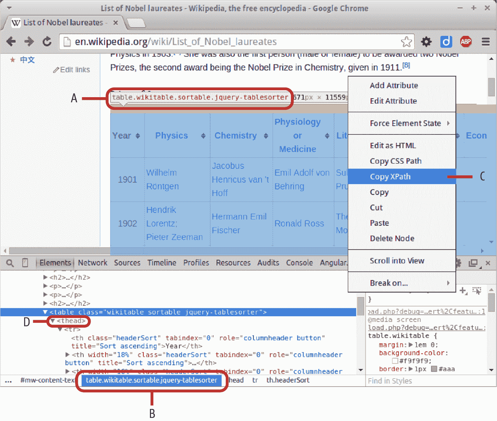
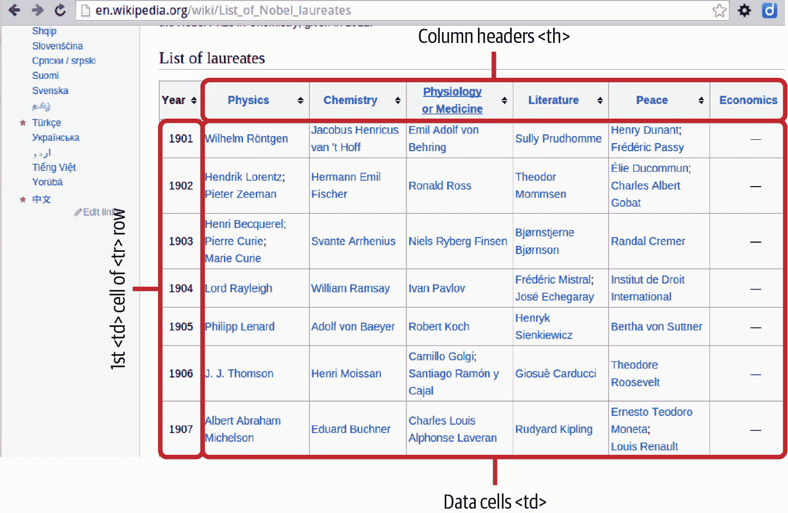

# 第五章。使用 Python 从网络获取数据

数据可视化工具箱中的一个基本部分是以尽可能干净的形式获取正确的数据集。有时你会被提供一个漂亮干净的数据集来分析，但通常你需要找到数据并/或清理提供的数据。

而如今更多的时候，获取数据意味着从网络上获取数据。你可以通过各种方式实现这一点，Python 提供了一些很棒的库来简化数据的获取过程。

从网络获取数据的主要方法包括：

+   从 HTTP 获取一个识别的数据格式的原始数据文件（例如 JSON 或 CSV）。

+   使用专用 API 获取数据。

+   通过 HTTP 获取网页并在本地解析以获取所需数据。

本章将依次处理这些方法，但首先让我们熟悉一下目前最好的 Python HTTP 库：Requests。

# 使用 Requests 库获取网络数据

正如我们在第四章中看到的，用于构建网页的文件通过超文本传输协议（HTTP）进行通信，最初由[Tim Berners-Lee](https://oreil.ly/uKF5f)开发。获取网页内容以解析数据涉及发出 HTTP 请求。

处理 HTTP 请求是任何通用语言的重要部分，但是以前在 Python 中获取网页是一件相当讨厌的事情。古老的 urllib2 库几乎没有用户友好的 API，其使用非常笨拙。[*Requests*](https://oreil.ly/6VkKZ)，由 Kenneth Reitz 提供，改变了这一状况，使得 HTTP 请求变得相对轻松，并迅速确立了作为首选 Python HTTP 库的地位。

Requests 不是 Python 标准库的一部分^(1)，但是是[Anaconda 包](https://oreil.ly/LD0ee)的一部分（参见第一章）。如果你没有使用 Anaconda，以下`pip`命令应该可以胜任：

```py
$ pip install requests
Downloading/unpacking requests
...
Cleaning up...
```

如果你使用的是 Python 2.7.9 之前的版本（我强烈建议尽可能使用 Python 3+），使用 Requests 可能会生成一些[安全套接字层（SSL）警告](https://oreil.ly/8D08s)。升级到更新的 SSL 库应该可以解决这个问题：^(2)

```py
$ pip install --upgrade ndg-httpsclient
```

现在你已经安装了 Requests，可以执行本章开头提到的第一个任务，从网络上获取一些原始数据文件。

# 使用 Requests 获取数据文件

使用 Python 解释器会话是测试 Requests 的一个好方法，所以找一个友好的本地命令行，启动 IPython，并导入`requests`：

```py
$ ipython
Python 3.8.9 (default, Apr  3 2021, 01:02:10)
...

In [1]: import requests
```

为了演示，让我们使用该库下载一个维基百科页面。我们使用 Requests 库的`get`方法获取页面，并按照惯例将结果分配给一个`response`对象：

```py
response = requests.get(\
"https://en.wikipedia.org/wiki/Nobel_Prize")
```

让我们使用 Python 的[`dir`](https://oreil.ly/CrJ8h)方法来获取`response`对象的属性列表：

```py
dir(response)
```

```py
Out:
...
 ['content',
 'cookies',
 'elapsed',
 'encoding',
 'headers',
 ...
 'iter_content',
 'iter_lines',
 'json',
 'links',
 ...
 'status_code',
 'text',
 'url']
```

大多数这些属性是不言自明的，一起提供了大量关于生成的 HTTP 响应的信息。通常情况下，你将只使用这些属性的一个小子集。首先，让我们检查响应的状态：

```py
response.status_code
Out: 200
```

所有优秀的最小化网络开发者都知道，200 是[HTTP 状态码](https://oreil.ly/ucEoo)表示 OK，指示成功的事务。除了 200 之外，最常见的代码是：

401（未经授权）

尝试未经授权的访问

400（错误请求）

尝试错误地访问 Web 服务器

403（禁止）

类似于 401，但没有登录机会可用

404（未找到）

尝试访问一个不存在的网页

500（内部服务器错误）

一个通用的、万能的错误

因此，例如，如果我们在请求中拼写错误，请求查看`SNoble_Prize`页面，我们将收到 404（未找到）错误：

```py
not_found_response = requests.get(\
"http://en.wikipedia.org/wiki/SNobel_Prize")
not_found_response.status_code
Out: 404
```

通过我们的 200 OK 响应，从正确拼写的请求中，让我们看一下返回的一些信息。可以通过`headers`属性快速查看概述：

```py
response.headers
```

```py
Out: {
  'date': 'Sat, 23 Oct 2021 23:58:49 GMT',
  'server': 'mw1435.eqiad.wmnet',
  'content-encoding': 'gzip', ...
  'last-modified': 'Sat, 23 Oct 2021 17:14:09 GMT', ...
  'content-type': 'text/html; charset=UTF-8'...
  'content-length': '88959'
  }
```

这显示，除其他外，返回的页面是经过 gzip 编码的，大小为 87 KB，`content-type`为`text/html`，使用 Unicode UTF-8 编码。

由于我们知道已经返回了文本，我们可以使用响应的`text`属性来查看它是什么：

```py
response.text
#Out: u'<!DOCTYPE html>\n<html lang="en"
#dir="ltr" class="client-nojs">\n<head>\n<meta charset="UTF-8"
#/>\n<title>Nobel Prize - Wikipedia, the free
#encyclopedia</title>\n<script>document.documentElement... =
```

这表明我们确实有我们的维基百科 HTML 页面，带有一些内联 JavaScript。正如我们将在“抓取数据”中看到的那样，为了理解这个内容，我们需要一个解析器来读取 HTML 并提供内容块。

现在我们已经从网络上抓取了一个原始页面，让我们看看如何使用 Requests 来消耗网络数据 API。

# 使用 Python 从 Web API 中获取数据

如果你需要的数据文件不在网络上，很可能有一个应用程序编程接口（API）提供你所需的数据。使用这个 API 将涉及向适当的服务器发出请求，以获取你在请求中指定的固定格式或你指定的格式中的数据。

Web API 的最流行的数据格式是 JSON 和 XML，尽管存在许多奇特的格式。对于 JavaScript 数据可视化器的目的，JavaScript 对象表示法（JSON）显然是首选的（见“数据”）。幸运的是，它也开始占主导地位。

创建 Web API 有不同的方法，并且在几年内有三种主要类型的 API 在网络中存在一场小规模的架构之争：

[REST](https://oreil.ly/ujgdJ)

表示表现状态转移，使用 HTTP 动词（GET，POST 等）和统一资源标识符（URI；例如，*/user/kyran*）来访问，创建和调整数据的组合。

[XML-RPC](https://oreil.ly/ZMQvW)

使用 XML 编码和 HTTP 传输的远程过程调用（RPC）协议。

[SOAP](https://oreil.ly/l5LVL)

表示简单对象访问协议，使用 XML 和 HTTP。

这场战斗似乎正在向[RESTful APIs](https://oreil.ly/apc1l)的胜利方向解决，这是一件非常好的事情。除了 RESTful API 更加优雅、更易于使用和实现（参见第十三章），在这里进行一些标准化使得您更有可能认识并快速适应新的 API。理想情况下，您将能够重用现有代码。作为一个数据可视化者，有一个新的参与者出现，名为[GraphQL](https://oreil.ly/JUGVS)，自称为更好的 REST，但您更有可能使用传统的 RESTful API。

大多数远程数据的访问和操作可以通过 CRUD（创建、检索、更新、删除）这个缩写来概括，最初用来描述在关系数据库中实现的所有主要功能。HTTP 提供了 CRUD 的对应操作，包括 POST、GET、PUT 和 DELETE 动词，而 REST 抽象则基于这些动词的使用，作用于[统一资源标识符（URI）](https://oreil.ly/xmX1k)。

讨论什么是一个适当的 RESTful 接口，可以变得非常复杂，但基本上，URI（例如，*https://example.com/api/items/2*）应包含执行 CRUD 操作所需的所有信息。具体操作（例如 GET 或 DELETE）由 HTTP 动词指定。这不包括像 SOAP 这样的体系结构，它将有状态信息放在请求头的元数据中。将 URI 想象成数据的虚拟地址，CRUD 是您可以对其执行的所有操作。

作为渴望获得一些有趣数据集的数据可视化者，我们在这里是狂热的消费者，因此我们选择的 HTTP 动词是 GET，接下来的示例将专注于使用各种知名的 Web API 获取数据。希望能找出一些模式。

尽管无状态 URI 和使用 CRUD 动词的两个约束是 RESTful API 形状上的一个不错的约束条件，但这里仍然有很多主题的变体。

## 使用 Requests 消费 RESTful Web API

Requests 围绕主要的 HTTP 请求动词有相当多的功能和特性。详细内容请参阅[Requests 快速入门](https://oreil.ly/Bp8VG)。为了获取数据，您几乎完全会使用 GET 和 POST 动词，其中 GET 是远远最常用的动词。POST 允许您模拟 Web 表单，包括登录详细信息、字段值等在请求中。对于那些需要使用 POST 轻松驱动 Web 表单的情况，例如具有大量选项选择器的情况，Requests 使得自动化变得容易。GET 几乎涵盖了所有其他内容，包括无处不在的 RESTful API，这些 API 提供了越来越多的网上可用的形式良好的数据。

让我们来看一个更复杂的请求使用 Requests，获取带有参数的 URL。[经济合作与发展组织（OECD）](https://oreil.ly/QAj3A)提供了一些[有用的数据集](https://data.oecd.org)。这些数据集主要提供 OECD 成员国的经济措施和统计数据，这些数据可以成为许多有趣可视化的基础。OECD 提供了一些自己的可视化工具，如允许您与 OECD 中的其他国家进行比较的工具。

OECD 网络 API 在[这个文档](https://oreil.ly/f5VDc)中有详细描述，查询由数据集名称（dsname）和一些用点分隔的维度构成，每个维度可以是多个用`+`分隔的值。URL 也可以采用标准的 HTTP 参数，以`?`开头，用`&`分隔：

```py
<root_url>/<dsname>/<dim 1>.<dim 2>...<dim n>
/all?param1=foo&param2=baa..
<dim 1> = 'AUS'+'AUT'+'BEL'...
```

以下是有效的 URL：

```py
http://stats.oecd.org/sdmx-json/data/QNA   
    /AUS+AUT.GDP+B1_GE.CUR+VOBARSA.Q       
    /all?startTime=2009-Q2&endTime=2011-Q4 
```


指定季度国民账户（QNA）数据集。


四个维度，按地点、主题、措施和频率。


数据从 2009 年第二季度到 2011 年第四季度。

让我们构建一个小的 Python 函数来查询 OECD 的 API（示例 5-1）。

##### 示例 5-1\. 构建 OECD API 的 URL

```py
OECD_ROOT_URL = 'http://stats.oecd.org/sdmx-json/data'

def make_OECD_request(dsname, dimensions, params=None, \ root_dir=OECD_ROOT_URL):
    """ Make a URL for the OECD API and return a response """

    if not params: 
        params = {}

    dim_args = ['+'.join(d) for d in dimensions] 
    dim_str = '.'.join(dim_args)

    url = root_dir + '/' + dsname + '/' + dim_str + '/all'
    print('Requesting URL: ' + url)
    return requests.get(url, params=params) 
```


对于 Python 函数默认值，不应使用可变值，如`{}`。参见[这个 Python 指南](https://oreil.ly/Yv6bX)以了解此问题的解释。


我们首先使用 Python 的列表推导和`join`方法创建一个维度列表，成员用加号连接（例如，[*USA+AUS*, …​ ]）。然后再次使用`join`将`dim_str`的成员用句点连接。


注意`requests`的`get`可以将参数字典作为其第二个参数，用于构建 URL 查询字符串。

我们可以像这样使用这个函数，从 2009 年到 2010 年获取美国和澳大利亚的经济数据：

```py
response = make_OECD_request('QNA',
    (('USA', 'AUS'),('GDP', 'B1_GE'),('CUR', 'VOBARSA'), ('Q')),
    {'startTime':'2009-Q1', 'endTime':'2010-Q1'})
```

```py
Requesting URL: http://stats.oecd.org/sdmx-json/data/QNA/
    USA+AUS.GDP+B1_GE.CUR+VOBARSA.Q/all
```

现在，查看数据，只需检查响应是否正常，并查看字典键：

```py
if response.status_code == 200:
   json = response.json()
   json.keys()
Out: [u'header', u'dataSets', u'structure']
```

结果 JSON 数据以[SDMX 格式](https://oreil.ly/HeE7G)提供，旨在促进统计数据的通信。这不是最直观的格式，但往往是数据集结构不理想的情况。好消息是，Python 非常适合整理数据。对于 Python 的[pandas 库](https://pandas.pydata.org)（参见第八章），有[pandaSDMX](https://oreil.ly/2PKxZ)，目前可以处理基于 XML 的格式。

OECD API 基本上是 RESTful 的，所有查询都包含在 URL 中，HTTP 动词 GET 指定了获取操作。如果没有专门的 Python 库可用于使用该 API（例如 Twitter 的 Tweepy），那么您可能最终会编写类似于示例 5-1 的东西。Requests 是一个非常友好且设计良好的库，几乎可以处理使用 Web API 所需的所有操作。

## 获取诺贝尔数据可视化的国家数据

在我们正在使用的工具链中，有一些国家统计数据将对我们构建的诺贝尔奖可视化非常有用。人口规模、三字母国际代码（例如 GDR、USA）和地理中心在可视化国际奖项及其分布时可能非常有用。[REST countries](https://restcountries.com)是一个非常方便的 RESTful 网络资源，提供各种国际统计数据。让我们用它来获取一些数据。

对 REST 国家的请求采用以下形式：

```py
https://restcountries.com/v3.1/<field>/<name>?<params>
```

就像对 OECD API（参见示例 5-1）一样，我们可以创建一个简单的调用函数，以便轻松访问 API 的数据，如下所示：

```py
REST_EU_ROOT_URL = "https://restcountries.com/v3.1"

def REST_country_request(field='all', name=None, params=None):

    headers={'User-Agent': 'Mozilla/5.0'} 

    if not params:
        params = {}

    if field == 'all':
         response = requests.get(REST_EU_ROOT_URL + '/all')
         return response.json()

    url = '%s/%s/%s'%(REST_EU_ROOT_URL, field, name)
    print('Requesting URL: ' + url)
    response = requests.get(url, params=params, headers=headers)

    if not response.status_code == 200: 
        raise Exception('Request failed with status code ' \
        + str(response.status_code))

     return response.json() # JSON encoded data
```


通常最好在请求头中指定一个有效的`User-Agent`。否则，一些网站可能会拒绝请求。


在返回响应之前，请确保它具有 OK（200）HTTP 代码；否则，请提供一个带有有用信息的异常。

现在有了`REST_country_request`函数，让我们获取所有使用美元作为货币的国家列表：

```py
response = REST_country_request('currency', 'usd')
response
Out:
[{u'alpha2Code': u'AS',
  u'alpha3Code': u'ASM',
  u'altSpellings': [u'AS',
  ...
  u'capital': u'Pago Pago',
  u'currencies': [u'USD'],
  u'demonym': u'American Samoan',
  ...
  u'latlng': [12.15, -68.266667],
  u'name': u'Bonaire',
  ...
  u'name': u'British Indian Ocean Territory',
  ...
  u'name': u'United States Minor Outlying Islands',
  ... ]}]
```

在 REST 国家的完整数据集相当小，因此为了方便起见，我们将其存储为 JSON 文件。我们将在后续章节中使用它，进行探索性和展示性的数据可视化：

```py
import json

country_data = REST_country_request() # all world data

with open('data/world_country_data.json', 'w') as json_file:
    json.dump(country_data, json_file)
```

现在我们已经编写了几个自己的 API 消费者，让我们来看看一些专门的库，它们包装了一些更大的 Web API，以便于使用。

# 使用库访问 Web API

Requests 能够处理几乎所有的 Web API，但随着 API 开始添加认证和数据结构变得更复杂，一个好的包装库可以节省大量麻烦，减少繁琐的账务工作。在本节中，我将介绍一些较受欢迎的[包装库](https://oreil.ly/DBrZ8)，帮助你了解工作流程和一些有用的起始点。

## 使用 Google 电子表格

如今，拥有存储在*云端*的实时数据集变得越来越普遍。例如，你可能需要可视化作为一个群组共享数据池的 Google 电子表格的各个方面。我更喜欢将这些数据从 Googleplex 导入 pandas 来开始探索（见第十一章），但一个好的库可以让你在需要时直接访问和调整数据*原地*，协商网络流量。

[*gspread*](https://oreil.ly/DNKYT) 是访问 Google 电子表格最知名的 Python 库，使用起来相对轻松。

你需要[OAuth 2.0](https://oreil.ly/z3u6y)凭证来使用 API。^(3) 可以在[Google Developers 网站](https://oreil.ly/tnO3b)上找到最新的指南，按照这些说明应该可以获取包含你私钥的 JSON 文件。

你需要安装*gspread*和最新的*google-auth*客户端库。以下是使用`pip`安装的方法：

```py
$ pip install gspread
$ pip install --upgrade google-auth
```

根据你的系统，你可能还需要 pyOpenSSL：

```py
$ pip install PyOpenSSL
```

阅读[文档](https://oreil.ly/1xAPm)获取更多详情和故障排除。

###### 注意

Google 的 API 假定你尝试访问的电子表格是由你的 API 账户拥有或共享的，而不是你的个人账户。分享电子表格的电子邮件地址可以在你的[Google 开发者控制台](https://oreil.ly/z5KyM)以及在使用 API 所需的 JSON 凭证键中找到，它应该看起来像*account-1@My Project…​iam.gserviceaccount.com*。

安装了这些库之后，你应该能够只用几行代码访问任何你的电子表格。我正在使用[Microbe-scope spreadsheet](https://oreil.ly/AAj9X)。示例 5-2 展示了如何加载电子表格。

##### 示例 5-2\. 打开一个 Google 电子表格

```py
import gspread

gc = gspread.service_account(\
                   filename='data/google_credentials.json') 

ss = gc.open("Microbe-scope") 
```


JSON 凭证文件是由 Google 服务提供的，通常格式为*My Project-b8ab5e38fd68.json*。


在这里，我们通过名称打开电子表格。也可以使用`open_by_url`或`open_by_id`。详细信息请参阅[`gspread`文档](https://oreil.ly/sa4sa)。

现在我们已经有了我们的电子表格，可以看到它包含的工作表：

```py
ss.worksheets()
Out:
[<Worksheet 'bugs' id:0>,
 <Worksheet 'outrageous facts' id:430583748>,
 <Worksheet 'physicians per 1,000' id:1268911119>,
 <Worksheet 'amends' id:1001992659>]

ws = ss.worksheet('bugs')
```

选择电子表格中的`bugs`工作表后，`gspread`允许您访问和更改列、行和单元格的值（假设表格不是只读的）。因此，我们可以使用`col_values`命令获取第二列中的值：

```py
ws.col_values(1)
Out: [None,
 'grey = not plotted',
 'Anthrax (untreated)',
 'Bird Flu (H5N1)',
 'Bubonic Plague (untreated)',
 'C.Difficile',
 'Campylobacter',
 'Chicken Pox',
 'Cholera',...]
```

###### 提示

如果在使用`gspread`访问 Google 电子表格时出现`BadStatusLine`错误，则可能是会话已过期。重新打开电子表格应该可以使事情重新运行。这个[未解决的`gspread`问题](https://oreil.ly/xTGg9)提供了更多信息。

虽然您可以使用*gspread*的 API 直接绘制图表，例如使用 Matplotlib 等绘图库，但我更喜欢将整个表格发送到 pandas，Python 的强大程序化电子表格。这可以通过`gspread`的`get_all_records`轻松实现，它返回一个项目字典列表。这个列表可以直接用于初始化一个 pandas DataFrame（参见“DataFrame”）：

```py
df = pd.DataFrame(ws.get_all_records(expected_headers=[]))
df.info()
Out:
<class 'pandas.core.frame.DataFrame'>
Int64Index: 41 entries, 0 to 40
Data columns (total 23 columns):
                                          41 non-null object
average basic reproductive rate           41 non-null object
case fatality rate                        41 non-null object
infectious dose                           41 non-null object
...
upper R0                                  41 non-null object
viral load in acute stage                 41 non-null object
yearly fatalities                         41 non-null object
dtypes: object(23)
memory usage: 7.5+ KB
```

在第十一章中，我们将看到如何交互式地探索 DataFrame 的数据。

## 使用 Tweepy 的 Twitter API

社交媒体的出现产生了大量数据，并引起了对可视化其中包含的社交网络、流行标签和媒体风暴的兴趣。Twitter 的广播网络可能是最丰富的数据可视化来源，其 API 提供按用户、标签、日期等过滤的推文^(4)。

Python 的 Tweepy 是一个易于使用的 Twitter 库，提供了许多有用的功能，例如用于流式传输实时 Twitter 更新的`StreamListener`类。要开始使用它，您需要一个 Twitter 访问令牌，可以通过按照[Twitter 文档](https://oreil.ly/ZkWNf)中的说明创建您的 Twitter 应用程序来获取。一旦创建了此应用程序，您可以通过单击链接在您的 Twitter 应用程序页面上获取您应用程序的密钥和访问令牌。

Tweepy 通常需要这里显示的四个授权元素：

```py
# The user credential variables to access Twitter API
access_token = "2677230157-Ze3bWuBAw4kwoj4via2dEntU86...TD7z"
access_token_secret = "DxwKAvVzMFLq7WnQGnty49jgJ39Acu...paR8ZH"
consumer_key = "pIorGFGQHShuYQtIxzYWk1jMD"
consumer_secret = "yLc4Hw82G0Zn4vTi4q8pSBcNyHkn35BfIe...oVa4P7R"
```

有了这些定义，访问推文变得非常简单。在这里，我们使用我们的令牌和密钥创建一个 OAuth `auth`对象，并用它来启动 API 会话。然后，我们可以从我们的时间线获取最新的推文：

```py
In [0]: import tweepy

        auth = tweepy.OAuthHandler(consumer_key,\
                                   consumer_secret)
        auth.set_access_token(access_token, access_token_secret)

        api = tweepy.API(auth)

        public_tweets = api.home_timeline()
        for tweet in public_tweets:
            print(tweet.text)
```

```py
RT @Glinner: Read these tweets https://t.co/QqzJPsDxUD
Volodymyr Bilyachat https://t.co/VIyOHlje6b +1 bmeyer
#javascript
RT @bbcworldservice: If scientists edit genes to
make people healthier does it change what it means to be
human? https://t.co/Vciuyu6BCx h…
RT @ForrestTheWoods:
Launching something pretty cool tomorrow. I'm excited. Keep
...
```

Tweepy 的`API`类提供了许多方便的方法，您可以在[Tweepy 文档](https://oreil.ly/2FTRw)中查看。一个常见的可视化方法是使用网络图来展示 Twitter 子群体中朋友和关注者的模式。Tweepy 方法`followers_ids`（获取所有关注用户）和`friends_ids`（获取所有被关注用户）可用于构建这样一个网络：

```py
my_follower_ids = api.get_follower_ids() 

followers_tree = {'followers': []}
for id in my_follower_ids:
    # get the followers of your followers
    try:
         follower_ids = api.get_follower_ids(user_id=id) 
    except tweepy.errors.Unauthorized:
         print("Unauthorized to access user %d's followers"\
               %(id))

    followers_tree['followers'].append(\
        {'id': id, 'follower_ids': follower_ids})
```


获取您关注者的 ID 列表（例如，`[1191701545, 1554134420, …]`）。


`follower_ids`的第一个参数可以是用户 ID 或屏幕名称。

请注意，如果你尝试为拥有超过一百个追随者的任何人构建网络，可能会遇到速率限制错误（详见[这个 Stack Overflow 帖子](https://oreil.ly/1KDH2)的解释）。为了克服这一问题，你需要实施一些基本的速率限制，以将你的请求计数减少到每 15 分钟 180 次。或者，你可以支付 Twitter 以获取高级账户。

通过映射追随者的追随者，你可以创建一个连接网络，可能会揭示与特定个体或主题相关的群组和子群体中的有趣内容。关于这种 Twitter 分析的一个很好的例子可以在[Gabe Sawhney 的博客](https://oreil.ly/sWH99)中找到。

Tweepy 中最酷的功能之一是其`StreamListener`类，它使得在实时收集和处理经过筛选的推文变得很容易。Twitter 流的实时更新已经被许多令人难忘的可视化所使用（请参见[FlowingData](https://oreil.ly/mNOYX)和[DensityDesign](https://oreil.ly/ZpmLq)的这些例子，以获得一些灵感）。让我们建立一个小流来记录提到 Python、JavaScript 和数据可视化的推文。我们只会将结果打印到屏幕上（在`on_data`中），但通常你会将它们缓存到文件或数据库中（或者两者都用 SQLite）：

```py
import json

class MyStream(tweepy.Stream):
    """ Customized tweet stream """

    def on_data(self, tweet):
        """Do something with the tweet data..."""
        print(tweet)

    def on_error(self, status):
        return True # keep stream open

stream = MyStream(consumer_key, consumer_secret,\
                     access_token, access_token_secret)
# Start the stream with track list of keywords
stream.filter(track=['python', 'javascript', 'dataviz'])
```

现在我们已经品尝了你在寻找有趣数据过程中可能遇到的 API 类型，让我们来看看你将使用的主要技术，如果像通常情况下一样，没有人以整洁、用户友好的形式提供你想要的数据：用 Python 抓取数据。

# 抓取数据

抓取是用来获取那些并非被设计为以程序方式消费的数据的实践的首要隐喻。这是一个相当好的隐喻，因为抓取通常涉及在移除过多或过少的数据之间取得平衡。创建能够尽可能干净地从网页中提取恰当数据的程序是一门手艺，而且通常是一门相当混乱的手艺。但回报是可以访问到以其他方式难以获取的可视化数据。以正确的方式接近，抓取甚至可能带来内在的满足感。

## 为什么我们需要抓取数据

在理想的虚拟世界中，在线数据会像图书馆一样有条理，通过一个复杂的杜威十进制系统对网页进行目录化。然而，对于热衷于数据狩猎的人来说，网络通常是有机地成长的，往往不受潜在的数据可视化者轻松访问的考虑所约束。因此，实际上，网络更像是一大堆数据，其中一些是干净且可用的（幸运的是，这个比例正在增加），但很多是设计不良、难以为人类消费的。而人类能够解析这种混乱、设计不良的数据，而我们相对笨拙的计算机却有些难以应对。^(5)

网络爬虫是关于制作选择模式，抓取我们想要的数据并且留下其他内容的过程。如果我们幸运的话，包含数据的网页会有有用的指针，比如具名表格，特定身份优于通用类等等。如果我们不幸的话，这些指针将会丢失，我们将不得不使用其他模式，或者在最坏的情况下，使用顺序指定符号，如*主 div 中的第三个表格*。显然，这些方法非常脆弱，如果有人在第三个表格之上添加了一个表格，它们就会失效。

在本节中，我们将解决一个小型网络爬虫任务，获取相同的诺贝尔奖获得者数据。我们将使用 Python 的最佳工具 Beautiful Soup 进行这次轻量级网络爬虫探险，将 Scrapy 这个重型武器留给下一章节。

###### 注意

网页上存在数据和图片并不意味着它们一定是免费使用的。在我们的网络爬虫示例中，我们将使用允许在[创意共享许可证](https://oreil.ly/jBTaC)下完全重用的维基百科。确保您爬取的任何内容可用，并且如有疑问，请联系网站维护者。您可能需要至少引用原始作者。

## Beautiful Soup 和 lxml

Python 的主要轻量级网络爬虫工具是 Beautiful Soup 和 lxml。它们的主要选择语法不同，但令人困惑的是，每个工具都可以使用对方的解析器。一致的观点似乎是 lxml 的解析器速度要快得多，但 Beautiful Soup 在处理格式不良的 HTML 时可能更为强大。个人而言，我发现 lxml 足够强大，其基于[xpaths](https://oreil.ly/A43cY)的语法更加强大且通常更直观。我认为对于从网页开发背景来的人，熟悉 CSS 和 jQuery，基于 CSS 选择器的选择更加自然。根据您的系统，默认情况下 Beautiful Soup 通常使用 lxml 作为解析器。我们将在接下来的章节中使用它。

Beautiful Soup 是 Anaconda 软件包的一部分（见第一章），可以通过`pip`轻松安装：

```py
$ pip install beautifulsoup4
$ pip install lxml
```

## 第一次网络爬虫探险

装备了 Requests 和 Beautiful Soup，让我们来做一个小任务，获取所有诺贝尔奖获得者的姓名、年份、类别和国籍。我们将从[主维基百科诺贝尔奖页面](https://oreil.ly/cSFFW)开始。向下滚动显示了一个按年份和类别列出所有获奖者的表格，这是我们最低数据需求的良好起点。

一种 HTML 浏览器几乎是网页抓取的必备工具，我知道的最好的是 Chrome 的 Web 开发者工具中的元素选项卡（参见“元素选项卡”）。图 5-1 展示了涉及查询网页结构的关键元素。我们需要知道如何选择感兴趣的数据，比如维基百科的表格，同时避免页面上的其他元素。制作良好的选择器模式是有效抓取的关键，通过元素检查器突出显示 DOM 元素可以为我们提供 CSS 模式和 xpath（右键单击）。后者是 DOM 元素选择的特别强大的语法，也是我们工业强度抓取解决方案 Scrapy 的基础。



###### 图 5-1. 维基百科的主要诺贝尔奖页面：A 和 B 展示了 wikitable 的 CSS 选择器。右键单击并选择 C（复制 XPath）会得到表格的 xpath（`//*[@id="mw-content-text"]/table[1]`）。D 显示了由 jQuery 生成的`thead`标签。

# 获取 Soup

在抓取感兴趣的网页之前，您需要使用 Beautiful Soup 解析它，将 HTML 转换为标签树层次结构或 soup：

```py
from bs4 import BeautifulSoup
import requests

BASE_URL = 'http://en.wikipedia.org'
# Wikipedia will reject our request unless we add
# a 'User-Agent' attribute to our http header.
HEADERS = {'User-Agent': 'Mozilla/5.0'}

def get_Nobel_soup():
    """ Return a parsed tag tree of our Nobel prize page """
    # Make a request to the Nobel page, setting valid headers
    response = requests.get(
        BASE_URL + '/wiki/List_of_Nobel_laureates',
        headers=HEADERS)
    # Return the content of the response parsed by Beautiful Soup
    return BeautifulSoup(response.content, "lxml") 
```


第二个参数指定了我们想要使用的解析器，即 lxml 的。

有了我们的 soup，让我们看看如何找到我们的目标标签。

# 选择标签

Beautiful Soup 提供了几种从解析后的 soup 中选择标签的方法，它们之间有微妙的差异，可能会让人感到困惑。在演示选择方法之前，让我们获取一下诺贝尔奖页面的 soup：

```py
soup = get_Nobel_soup()
```

我们的目标表格（参见图 5-1）有两个定义类，`wikitable` 和 `sortable`（页面上还有一些不可排序的表格）。我们可以使用 Beautiful Soup 的 `find` 方法来查找第一个具有这些类的表格标签。`find` 方法将一个标签名称作为其第一个参数，并将一个包含类、ID 和其他标识符的字典作为其第二个参数：

```py
In[3]: soup.find('table', {'class':'wikitable sortable'})
Out[3]:
<table class="wikitable sortable">
<tr>
<th>Year</th>
...
```

尽管我们已经成功地通过类找到了我们的表格，但这种方法并不是很健壮。让我们看看当我们改变我们的 CSS 类的顺序时会发生什么：

```py
In[4]: soup.find('table', {'class':'sortable wikitable'})
# nothing returned
```

因此，`find`关心类的顺序，使用类字符串来找到标签。如果类的顺序不同——这在 HTML 编辑中可能会发生，那么`find`就会失败。这种脆弱性使得很难推荐 Beautiful Soup 的选择器，比如`find`和`find_all`。在快速进行修改时，我发现 lxml 的[CSS 选择器](https://lxml.de/cssselect.xhtml)更容易和更直观。

使用 soup 的`select`方法（如果在创建时指定了 lxml 解析器），您可以使用其 CSS 类、ID 等指定 HTML 元素。此 CSS 选择器被转换为 lxml 内部使用的 xpath 语法。^(6)

要获取我们的 wikitable，我们只需在 soup 中选择一个表格，使用点符号表示其类：

```py
In[5]: soup.select('table.sortable.wikitable')
Out[5]:
[<table class="wikitable sortable">
 <tr>
 <th>Year</th>
 ...
]
```

注意，`select` 返回一个结果数组，找到 soup 中所有匹配的标签。如果您只选择一个 HTML 元素，则 lxml 提供了 `select_one` 便捷方法。让我们抓取我们的诺贝尔表格，并看看它有哪些标题：

```py
In[8]: table = soup.select_one('table.sortable.wikitable')

In[9]: table.select('th')
Out[9]:
[<th>Year</th>,
 <th width="18%"><a href="/wiki/..._in_Physics..</a></th>,
 <th width="16%"><a href="/wiki/..._in_Chemis..</a></th>,
 ...
]
```

作为 `select` 的简写，您可以直接在 soup 上调用标签；所以这两个是等效的：

```py
table.select('th')
table('th')
```

使用 lxml 解析器，Beautiful Soup 提供了许多不同的过滤器来查找标签，包括我们刚刚使用的简单字符串名称、使用 [正则表达式](https://oreil.ly/GeU8Q)、使用标签名称列表等。更多详情请参阅这个 [综合列表](https://oreil.ly/iBQwc)。

除了 lxml 的 `select` 和 `select_one` 外，BeautifulSoup 还提供了 10 个搜索解析树的便捷方法。这些方法本质上是 `find` 和 `find_all` 的变体，指定了它们搜索的树的哪些部分。例如，`find_parent` 和 `find_parents` 不是在树下查找后代，而是查找被搜索标签的父标签。所有这 10 个方法都在 Beautiful Soup [官方文档](https://oreil.ly/oPrQl) 中有详细说明。

现在我们知道如何选择我们的维基百科表格，并且掌握了 lxml 的选择方法，让我们看看如何制定一些选择模式来获取我们想要的数据。

## 制定选择模式

成功选择了我们的数据表格后，我们现在想要制定一些选择模式来抓取所需的数据。使用 HTML 浏览器，你可以看到个人得奖者被包含在 `<td>` 单元格中，并带有指向维基百科传记页面的 href `<a>` 链接（在个人情况下）。这是一个典型的目标行，具有我们可以用作目标以获取 `<td>` 单元格中数据的 CSS 类：

```py
 <tr>
  <td align="center">
   1901
  </td>
  <td>
   <span class="sortkey">
    Röntgen, Wilhelm
   </span>
   <span class="vcard">
    <span class="fn">
     <a href="/wiki/Wilhelm_R%C3%B6ntgen" \
        title="Wilhelm Röntgen">
      Wilhelm Röntgen
     </a>
    </span>
   </span>
  </td>
  <td>
  ...
</tr>
```

如果我们循环遍历这些数据单元格，并跟踪它们的行（年份）和列（类别），那么我们应该能够创建一个获奖者列表，其中包含我们指定的所有数据，但不包括国籍。

以下 `get_column_titles` 函数从我们的表格中抓取了诺贝尔奖类别列标题，忽略了第一列 Year。通常，维基百科表格中的标题单元格包含一个带有 web 链接的 `'a'` 标签；所有诺贝尔奖类别都符合这个模型，指向它们各自的维基百科页面。如果标题不可点击，则我们存储其文本和一个空的 href：

```py
def get_column_titles(table):
    """ Get the Nobel categories from the table header """
    cols = []
    for th in table.select_one('tr').select('th')[1:]: 
        link = th.select_one('a')
        # Store the category name and any Wikipedia link it has
        if link:
            cols.append({'name':link.text,\
                         'href':link.attrs['href']})
        else:
            cols.append({'name':th.text, 'href':None})
    return cols
```


我们循环遍历表头，忽略第一列 Year ([1:])。这选择了 图 5-2 中显示的列标题。



###### 图 5-2\. 维基百科的诺贝尔奖得主表格

让我们确保 `get_column_titles` 正在给我们想要的东西：

```py
get_column_titles(table)
Out:
[{'name': 'Physics', \
  'href': '/wiki/List_of_Nobel_laureates_in_Physics'},
 {'name': 'Chemistry',\
  'href': '/wiki/List_of_Nobel_laureates_in_Chemistry'},...
]

def get_Nobel_winners(table):
    cols = get_column_titles(table)
    winners = []
    for row in table.select('tr')[1:-1]: 
        year = int(row.select_one('td').text) # Gets 1st <td>
        for i, td in enumerate(row.select('td')[1:]): 
            for winner in td.select('a'):
                href = winner.attrs['href']
                if not href.startswith('#endnote'):
                    winners.append({
                        'year':year,
                        'category':cols[i]['name'],
                        'name':winner.text,
                        'link':winner.attrs['href']
                    })
    return winners
```


获取所有 Year 行，从第二行开始，对应于 图 5-2 中的行。


查找图 5-2 中显示的`<td>`数据单元格。

在年份行迭代中，我们获取第一个年份列，然后迭代剩余列，使用`enumerate`来跟踪我们的索引，该索引将映射到类别列名。我们知道所有获奖者的名称都包含在一个`<a>`标签中，但有时会有额外的以`#endnote`开头的`<a>`标签，我们需要过滤掉这些。最后，我们向数据数组中添加一个年份、类别、名称和链接的字典。请注意，获奖者选择器具有包含`<a>`标签的`attrs`字典，其中包括其他内容。

让我们确认`get_Nobel_winners`是否提供了诺贝尔奖获奖者字典的列表：

```py
get_Nobel_winners(table)
```

```py
[{'year': 1901,
  'category': 'Physics',
  'name': 'Wilhelm Röntgen',
  'link': '/wiki/Wilhelm_R%C3%B6ntgen'},
 {'year': 1901,
  'category': 'Chemistry',
  'name': "Jacobus Henricus van 't Hoff",
  'link': '/wiki/Jacobus_Henricus_van_%27t_Hoff'},
 {'year': 1901,
  'category': 'Physiologyor Medicine',
  'name': 'Emil Adolf von Behring',
  'link': '/wiki/Emil_Adolf_von_Behring'},
 {'year': 1901,
 ...}]
```

现在我们拥有了完整的诺贝尔奖获奖者列表和他们维基百科页面的链接，我们可以利用这些链接从个人传记中抓取数据。这将涉及大量请求，这不是我们真正希望多次执行的操作。明智和尊重的^(7)做法是缓存我们抓取的数据，使我们能够尝试各种抓取实验而无需返回维基百科。

## 缓存网页

在 Python 中轻松地制作一个快速缓存器是很容易的，但往往更容易找到由他人编写并慷慨捐赠给开源社区的更好解决方案。Requests 有一个名为`requests-cache`的不错插件，通过几行配置，可以满足所有基本的缓存需求。

首先，我们使用`pip`安装插件：

```py
$ pip install --upgrade requests-cache
```

`requests-cache`使用[猴子补丁技术](https://oreil.ly/8IklZ)，在运行时动态替换`requests` API 的部分。这意味着它可以透明地工作。您只需安装其缓存，然后像平常一样使用`requests`，所有缓存都会被处理。这是使用`requests-cache`的最简单方式：

```py
import requests
import requests_cache

requests_cache.install_cache()
# use requests as usual...
```

`install_cache`方法有许多有用的选项，包括允许您指定缓存`backend`（`sqlite`、`memory`、`mongdb`或`redis`）或在缓存上设置过期时间（`expiry_after`）（单位为秒）。因此，以下代码将创建一个名为`nobel_pages`的缓存，使用`sqlite`作为后端，并设置页面在两小时（7,200 秒）后过期：

```py
requests_cache.install_cache('nobel_pages',\
                         backend='sqlite', expire_after=7200)
```

`requests-cache`将满足大部分缓存需求，并且使用起来非常简单。有关更多详细信息，请参阅[官方文档](https://oreil.ly/d67bK)，您还可以在那里找到请求节流的小例子，这在进行大规模抓取时是一种有用的技术。

## 抓取获奖者的国籍

设置了缓存后，让我们尝试获取获奖者的国籍，使用前 50 个进行实验。一个小的`get_winner_nationality()`函数将使用我们之前存储的获奖者链接来抓取他们的页面，然后使用图 5-3 中显示的信息框来获取`Nationality`属性。


###### 图 5-3\. 抓取获奖者的国籍

###### 注意

在抓取时，您正在寻找可靠的模式和包含有用数据的重复元素。正如我们将看到的那样，个人的维基信息框并不是一个可靠的来源，但是点击几个随机链接确实给人这样的印象。根据数据集的大小，进行一些实验性的健全性检查是很好的。您可以手动执行此操作，但是正如本章开头提到的那样，这不会扩展或提升您的技能。

示例 5-3 从之前抓取的获奖者字典中获取一个，并在找到`Nationality`键时返回一个带有名称标签的字典。让我们在前 50 名获奖者上运行它，并看看`Nationality`属性缺失的频率。

##### 示例 5-3\. 从获奖者传记页面抓取获奖者的国家

```py
HEADERS = {'User-Agent': 'Mozilla/5.0'}

def get_winner_nationality(w):
    """ scrape biographic data from the winner's wikipedia page """
    response = requests.get('http://en.wikipedia.org' \
                                + w['link'], headers=HEADERS)
    content = response.content.decode('utf-8')
    soup = BeautifulSoup(content)
    person_data = {'name': w['name']}
    attr_rows = soup.select('table.infobox tr') 
    for tr in attr_rows:                        
        try:
            attribute = tr.select_one('th').text
            if attribute == 'Nationality':
                person_data[attribute] = tr.select_one('td').text
        except AttributeError:
            pass

    return person_data
```


我们使用 CSS 选择器来查找所有具有`infobox`类的表格的所有`<tr>`行。


在行中循环查找国籍字段。

示例 5-4 表明，在前 50 名获奖者中，有 14 人未能成功抓取其国籍信息。在国际法学院的情况下，国籍可能并不重要，但西奥多·罗斯福就如同美国人一般。点击其中几个名字显示了问题（见图 5-4）。“国籍”缺失的标准传记格式意味着通常会使用*国籍*的同义词，例如玛丽·居里的*公民身份*；有时不会有参考文献，例如尼尔斯·芬森；而兰德尔·克雷默的信息框中仅有一张照片。我们可以丢弃信息框作为获奖者国籍的可靠来源，但是因为它们似乎是唯一的常规数据来源，这让我们不得不重新考虑。在下一章中，我们将看到使用 Scrapy 和不同起始页的成功方法。

##### 示例 5-4\. 测试抓取的国籍

```py
wdata = []
# test first 50 winners
for w in winners[:50]:
    wdata.append(get_winner_nationality(w))
missing_nationality = []
for w in wdata:
    # if missing 'Nationality' add to list
    if not w.get('Nationality'):
        missing_nationality.append(w)
# output list
missing_nationality

[{'name': 'Theodor Mommsen'},
 {'name': 'Élie Ducommun'},
 {'name': 'Charles Albert Gobat'},
 {'name': 'Pierre Curie'},
 {'name': 'Marie Curie'},
 {'name': 'Niels Ryberg Finsen'},
 ...
 {'name': 'Theodore Roosevelt'}, ... ]
```


###### 图 5-4\. 没有记录*国籍*的获奖者

尽管维基百科相对自由，生产方面的数据设计是为了人类消费，您可能会发现缺乏严谨性。许多网站存在类似的陷阱，随着数据集的增大，可能需要更多的测试来发现集合模式中的缺陷。

尽管我们的第一个抓取练习有些人为，是为了介绍工具，我希望它捕捉到了一些网络抓取的稍微混乱的精神。我们最终未能获得可靠的诺贝尔数据集中的国籍字段，这可能可以通过一些网络浏览和手动 HTML 源代码检索来避免。然而，如果数据集规模更大，失败率稍低，那么编程检测，随着你熟悉抓取模块，确实开始变得更容易。

这个小小的抓取测试旨在介绍 Beautiful Soup，并显示我们寻找的数据收集需要更多的思考，这在抓取中经常发生。在下一章中，我们将使用我们在本节中学到的知识，推出大杀器 Scrapy，并收集我们需要的诺贝尔奖可视化数据。

# 总结

在本章中，我们已经看到了从网络中提取数据并存入 Python 容器、数据库或 pandas 数据集中的最常见方法的示例。Python 的 Requests 库是 HTTP 协商的真正工作马和我们数据可视化工具链中的一个基本工具。对于更简单的、符合 RESTful 标准的 API，使用 Requests 消耗数据只需几行 Python 代码。对于更为棘手的 API，比如那些可能有复杂授权的 API，像 Tweepy（用于 Twitter）这样的包装库可以省去许多麻烦。良好的包装库还可以跟踪访问速率，并在必要时限制你的请求。这是一个关键考虑因素，特别是当有可能会列入黑名单的不友好的消费者时。

我们还开始了我们的第一次数据抓取尝试，这通常是一个必要的后备措施，当不存在 API 并且数据是供人类消费时。在下一章中，我们将使用 Python 的 Scrapy 库，一个工业级的抓取库，获取本书可视化所需的所有诺贝尔奖数据。

^(1) 这实际上是开发人员的一个[有意的策略](https://oreil.ly/WOjdB)。

^(2) 仍可能有一些平台依赖性可能会产生错误。如果仍然遇到问题，这个[Stack Overflow 线程](https://oreil.ly/Zm082)是一个很好的起点。

^(3) OAuth1 访问最近已经被弃用。

^(4) 免费 API 当前限制为每小时约[350 个请求](https://oreil.ly/LKzJX)。

^(5) 许多现代机器学习和人工智能（AI）研究致力于创建能够处理杂乱、嘈杂、模糊、非正式数据的计算机软件，但截至本书出版时，我不知道有现成的解决方案。

^(6) 这种 CSS 选择语法对于使用过 JavaScript 的 [jQuery library](https://jquery.com) 的人应该很熟悉，它也类似于 [D3](https://d3js.org) 使用的语法。

^(7) 在抓取数据时，你使用了其他人的网络带宽，这最终会花费他们的金钱。试着限制你的请求次数是一种礼貌行为。
