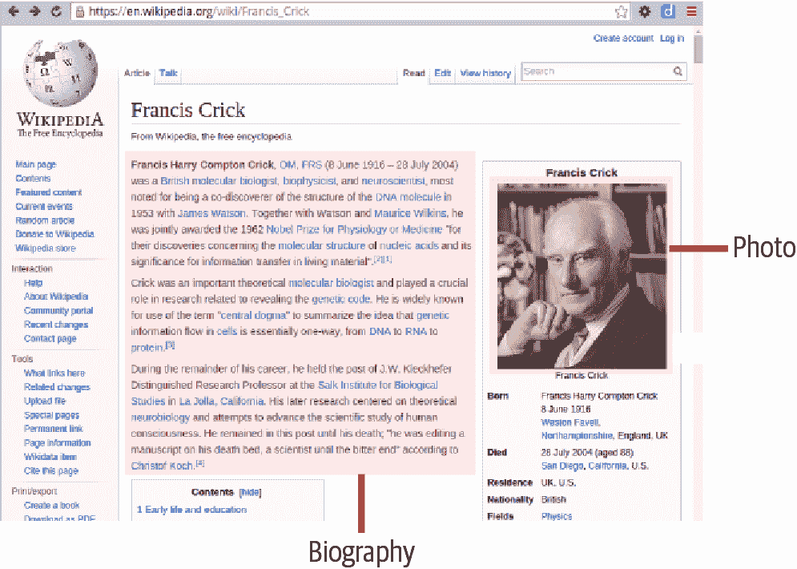
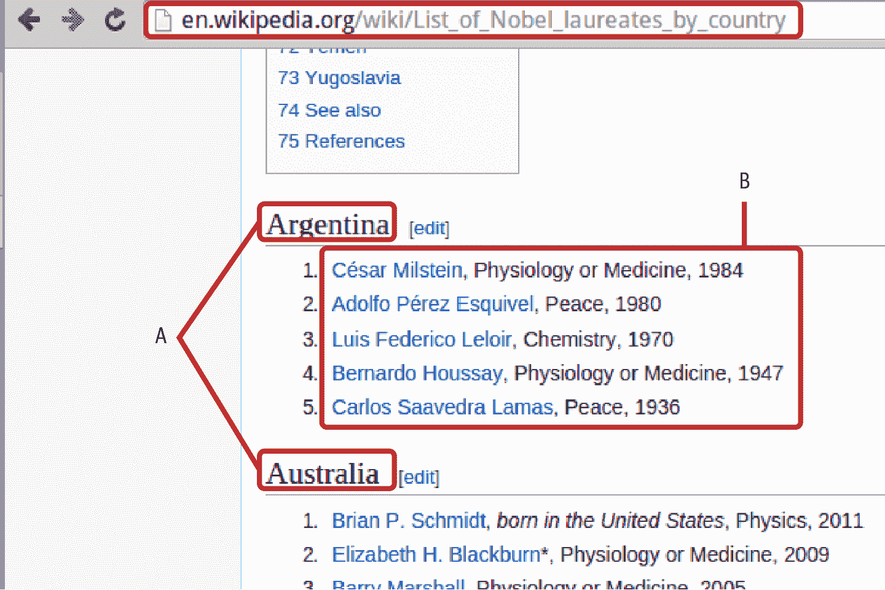
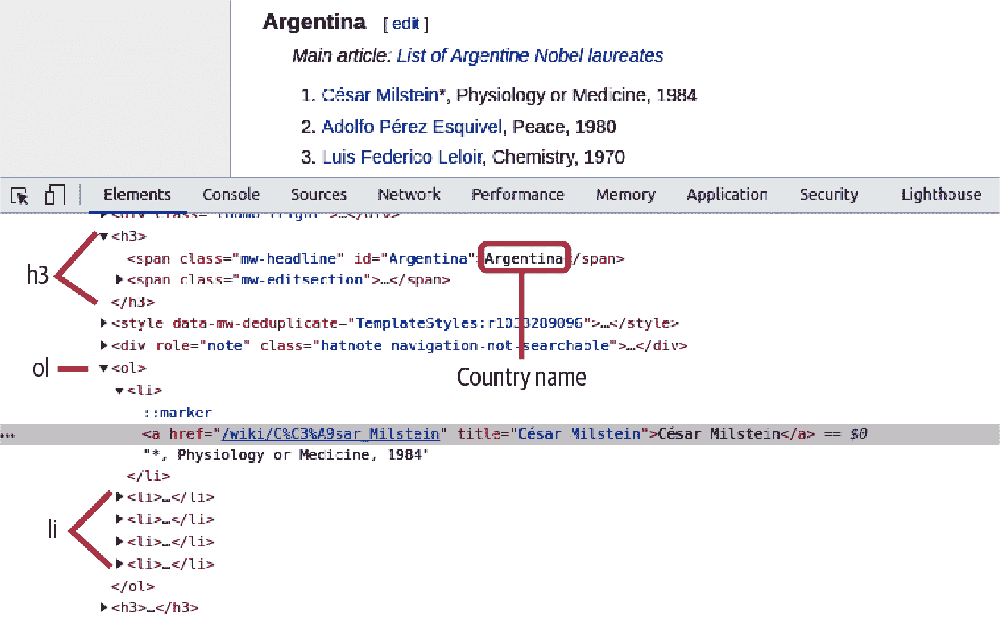
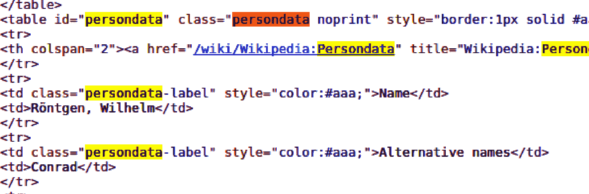
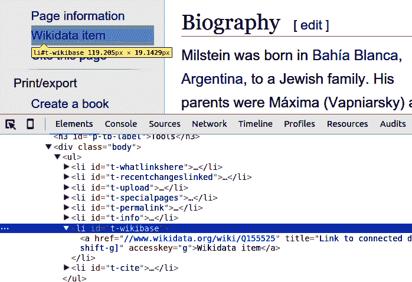
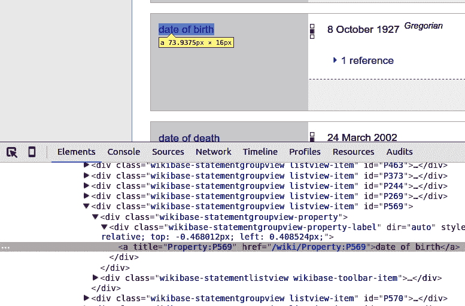
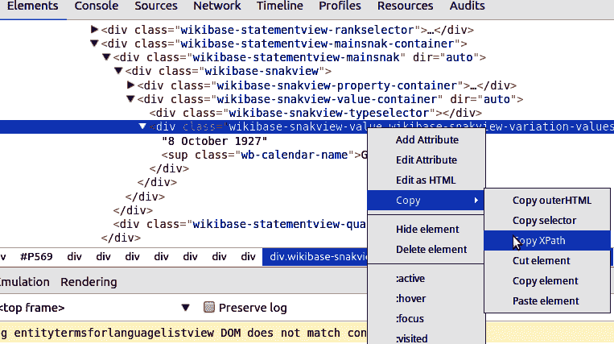
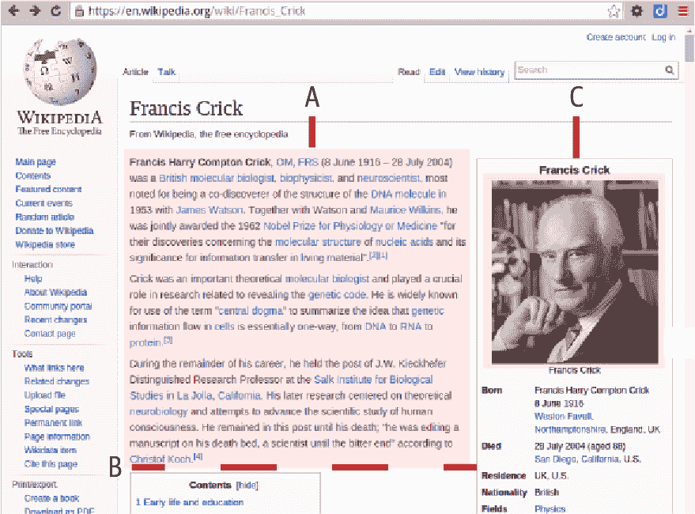

# 第六章：使用 Scrapy 进行大规模抓取

随着你的网络爬取目标变得更加宏大，使用 Beautiful Soup 和 requests 进行黑客式解决方案可能会非常快速变得非常混乱。管理作为请求生成更多请求的抓取数据变得棘手，如果你的请求是同步进行的，事情就会迅速变慢。一系列你可能没有预料到的问题开始显现出来。正是在这个时候，你需要转向一个强大、稳健的库来解决所有这些问题及更多。这就是 Scrapy 发挥作用的时候。

当 Beautiful Soup 是一个非常方便的快速且脏的抓取小工具时，Scrapy 是一个可以轻松进行大规模数据抓取的 Python 库。它拥有你期望的所有功能，例如内置缓存（带有过期时间）、通过 Python 的 Twisted web 框架进行异步请求、用户代理随机化等等。所有这些功能的代价是一个相当陡峭的学习曲线，而本章旨在通过一个简单的例子来平滑这条曲线。我认为 Scrapy 是任何数据可视化工具包的强大补充，真正为网络数据收集打开了可能性。

在“数据抓取”中，我们成功抓取了包含所有诺贝尔奖获得者姓名、年份和类别的数据集。我们对获奖者链接的传记页面进行了猜测性抓取，显示提取国籍将会很困难。在本章中，我们将把我们的诺贝尔奖数据的目标设定得更高一些，并且旨在爬取类似示例 6-1 所示形式的对象。

##### 示例 6-1\. 我们的目标诺贝尔 JSON 对象

```py
{
  "category": "Physiology or Medicine",
  "country": "Argentina",
  "date_of_birth': "8 October 1927",
  "date_of_death': "24 March 2002",
  "gender": "male",
  "link": "http:\/\/en.wikipedia.org\/wiki\/C%C3%A9sar_Milstein",
  "name": "C\u00e9sar Milstein",
  "place_of_birth": "Bah\u00eda Blanca ,  Argentina",
  "place_of_death": "Cambridge , England",
  "text": "C\u00e9sar Milstein , Physiology or Medicine, 1984",
  "year": 1984
}
```

除了这些数据，我们还将尝试爬取获奖者的照片（如果适用）和一些简短的生物数据（参见图 6-1）。我们将使用这些照片和正文来为我们的诺贝尔奖可视化添加一些特色。



###### 图 6-1\. 爬取获奖者页面的目标

# 设置 Scrapy

Scrapy 应该是 Anaconda 包之一（参见第一章），所以你应该已经有它了。如果不是这样的话，你可以使用以下`conda`命令行来安装它：

```py
$ conda install -c https://conda.anaconda.org/anaconda scrapy
```

如果你没有使用 Anaconda，只需快速安装`pip`即可完成任务:^(1)

```py
$ pip install scrapy
```

安装了 Scrapy 后，你应该可以访问`scrapy`命令。与大多数 Python 库不同，Scrapy 设计为在爬取项目的上下文中通过命令行驱动，由配置文件、爬虫、管道等定义。让我们使用`startproject`选项为我们的诺贝尔奖爬取生成一个新项目。这将生成一个项目文件夹，所以确保你从一个合适的工作目录运行它：

```py
$ scrapy startproject nobel_winners
New Scrapy project 'nobel_winners' created in:
    /home/kyran/workspace/.../scrapy/nobel_winners

You can start your first spider with:
    cd nobel_winners
    scrapy genspider example example.com
```

正如`startproject`的输出所说，你需要切换到*nobel_winners*目录，以便开始使用 Scrapy。

让我们来看看项目的目录树：

```py
nobel_winners
├── nobel_winners
│   ├── __init__.py
│   ├── items.py
│   ├── middlewares.py
│   ├── pipelines.py
│   ├── settings.py
│   └── spiders
│       └── __init__.py
└── scrapy.cfg
```

如图所示，项目目录有一个同名的子目录，还有一个配置文件 *scrapy.cfg*。*nobel_winners* 子目录是一个 Python 模块（包含一个 *__init__.py* 文件），其中有几个骨架文件和一个 *spiders* 目录，其中将包含您的抓取器。

# 建立目标

在“数据抓取”中，我们尝试从诺贝尔获奖者的传记页面中获取其国籍信息，但发现在许多情况下，这些信息要么缺失，要么标记不一致（请参见第五章）。与其间接获取国家数据，不如进行一点维基百科搜索。有一个[页面](https://oreil.ly/p6pXm)按国家列出获奖者。这些获奖者以标题形式呈现，按顺序列出（请参见图 6-2），而不是以表格形式呈现，这使得恢复我们的基本姓名、类别和年份数据变得更加困难。此外，数据组织不是最理想的（例如，国家标题和获奖者列表并未分开形成有用的区块）。正如我们将看到的，一些结构良好的 Scrapy 查询将轻松地为我们提供所需的数据。

图 6-2 显示了我们第一个爬虫的起始页面及其将要定位的关键元素。国家名称标题（A）列表后面是他们获得诺贝尔奖的公民的有序列表（B）。



###### 图 6-2\. 通过国籍抓取维基百科的诺贝尔奖

为了抓取列表数据，我们需要启动 Chrome 浏览器的 DevTools（请参阅“元素标签”）并使用 Elements 标签及其检查器（放大镜）检查目标元素。图 6-3 显示了我们第一个爬虫的关键 HTML 目标：包含国家名称的标题（h2）和后面的获奖者列表（ol）。



###### 图 6-3\. 找到维基列表的 HTML 目标

# 使用 Xpath 定位 HTML 目标

Scrapy 使用[xpaths](https://oreil.ly/Y67BF)来定义其 HTML 目标。Xpath 是描述 X(HT)ML 文档部分的语法，虽然它可能会变得相当复杂，但基础知识是直接的，并且通常能够完成手头的任务。

您可以通过使用 Chrome 的元素标签悬停在源上，然后右键单击并选择复制 XPath 来获取 HTML 元素的 xpath。例如，在我们的诺贝尔奖维基列表的国家名称（图 6-3 中的 h3）的情况下，选择阿根廷（第一个国家）的 xpath 如下所示：

```py
//*[@id="mw-content-text"]/div[1]/h3[1]
```

我们可以使用以下 xpath 规则进行解码：

`//E`

文档中的任何元素 `<E>`（例如，`//img` 获取页面上的所有图片）

`//E[@id="foo"]`

选择 ID 为 `foo` 的元素 `<E>`

`//*[@id="foo"]`

选择任意带有 ID `foo` 的元素

`//E/F[1]`

元素 `<E>` 的第一个子元素 `<F>`

`//E/*[1]`

元素 `<E>` 的第一个子元素

遵循这些规则表明，我们的阿根廷标题`//*[@id="mw-content-text"]/div[1]/h3[1]`是具有 ID `mw-content-text` 的 DOM 元素的第一个`div`的第一个标题（h2）子元素。这相当于以下 HTML：

```py
<div id="mw-content-text">
  <div>
    <h2>
        ...
    </h2>
  </div>
    ...
</div>
```

请注意，与 Python 不同，xpath 不使用从零开始的索引，而是将第一个成员设为*1*。

## 使用 Scrapy Shell 测试 Xpath

正确使用 xpath 定位非常关键，对良好的抓取至关重要，并可能涉及一定程度的迭代。Scrapy 通过提供一个命令行 Shell 大大简化了这个过程，该 Shell 接受一个 URL，并创建一个响应上下文，在该上下文中可以尝试您的 xpath，如下所示：

```py
$ scrapy shell
  https://en.wikipedia.org/wiki/List_of_Nobel_laureates_by_country

2021-12-09 14:31:06 [scrapy.utils.log] INFO: Scrapy 2.5.1 started
(bot: nobel_winners)
...

2021-12-09 14:31:07 [scrapy.core.engine] INFO: Spider opened
2021-12-09 14:31:07 [scrapy.core.engine] DEBUG: Crawled (200)
<GET https://en.wikip...List_of_Nobel_laureates_by_country>
(referer: None)
[s] Available Scrapy objects:

[s]   crawler  <scrapy.crawler.Crawler object at 0x3a8f510>
[s]   item {}
[s]   request    <GET https://...Nobel_laureates_by_country>
[s]   response   <200 https://...Nobel_laureates_by_country>
[s]   settings   <scrapy.settings.Settings object at 0x34a98d0>
[s]   spider     <DefaultSpider 'default' at 0x3f59190>

[s] Useful shortcuts:
[s]   shelp()   Shell help (print this help)
[s]   fetch(url[, redirect=True]) Fetch URL and update local objects
(by default, redirects are followed)
[s]   fetch(req)                  Fetch a scrapy.Request and update
[s]   view(response)    View response in a browser

In [1]:
```

现在我们有了一个基于 IPython 的 Shell，具有代码完成和语法高亮，可以在其中尝试我们的 xpath 定位。让我们抓取 wiki 页面上的所有`<h3>`标题：

```py
In [1]: h3s = response.xpath('//h3')
```

结果的`h3s`是一个[SelectorList](https://oreil.ly/zpbqa)，一个专门的 Python`list`对象。让我们看看我们有多少个标题：

```py
In [2]: len(h3s)
Out[2]: 91
```

我们可以获取第一个[`Selector`对象](https://oreil.ly/uBhdU)，并通过在追加点后按 Tab 键，查询其在 Scrapy shell 中的方法和属性：

```py
In [3] h3 = h3s[0]
In [4] h3.
attrib             get                re                 remove             ...
css                getall             re_first           remove_namespaces  ...
extract            namespaces         register_namespace response           ...
```

您经常会使用`extract`方法来获取 xpath 选择器的原始结果：

```py
In [5]: h3.extract()
Out[6]:
u'<h3>
  <span class="mw-headline" id="Argentina">Argentina</span>
  <span class="mw-editsection">
  <span class="mw-editsection-bracket">
  ...
  </h3>'
```

这表明我们的国家标题从第一个`<h3>`开始，并包含一个类为`mw-headline`的`span`。我们可以使用`mw-headline`类的存在作为我们国家标题的过滤器，内容作为我们的国家标签。让我们尝试一个 xpath，使用选择器的`text`方法从`mw-headline` span 中提取文本。请注意，我们使用`xpath`方法的`<h3>`选择器，使 xpath 查询相对于该元素：

```py
In [7]: h3_arg = h3
In [8]: country = h3_arg.xpath(\
                         'span[@class="mw-headline"]/text()')\
.extract()
In [9]: country
Out[9]: ['Argentina']
```

`extract`方法返回可能的匹配列表，在我们的情况下是单个字符串`'Argentina'`。通过遍历`h3s`列表，我们现在可以获取我们的国家名称。

假设我们有一个国家的`<h3>`标题，现在我们需要获取其后跟的诺贝尔获奖者的有序列表（图 6-2 B）。方便的是，xpath 的`following-sibling`选择器正好可以做到这一点。让我们抓取阿根廷标题之后的第一个有序列表：

```py
In [10]: ol_arg = h3_arg.xpath('following-sibling::ol[1]')
Out[10]: ol_arg
[<Selector xpath='following-sibling::ol[1]' data=u'<ol><li>
<a href="/wiki/C%C3%A9sar_Milst'>]
```

查看`ol_arg`的截断数据显示我们已选择了一个有序列表。请注意，即使只有一个`Selector`，`xpath`仍然会返回一个`SelectorList`。为了方便起见，通常直接选择第一个成员即可：

```py
In [11]: ol_arg = h2_arg.xpath('following-sibling::ol[1]')[0]
```

现在我们已经有了有序列表，让我们获取其成员`<li>`元素的列表（截至 2022 年中）：

```py
In [12]: lis_arg = ol_arg.xpath('li')
In [13]: len(lis_arg)
Out[13]: 5
```

使用`extract`方法检查其中一个列表元素。作为第一个测试，我们要抓取获奖者的姓名，并捕获列表元素的文本：

```py
In [14]: li = lis_arg[0] # select the first list element
In [15]: li.extract()
Out[15]:
'<li><a href="/wiki/C%C3%A9sar_Milstein"
         title="C\xe9sar Milstein">C\xe9sar Milstein</a>,
         Physiology or Medicine, 1984</li>'
```

提取列表元素显示了一个标准模式：获奖者维基百科页面的超链接名称，后跟逗号分隔的获奖类别和年份。获取获奖者姓名的一个稳健方法是选择列表元素第一个`<a>`标签的文本：

```py
In [16]: name = li.xpath('a//text()')[0].extract()
In [17]: name
Out[17]: 'César Milstein'
```

常常需要获取例如列表元素中的所有文本，去除各种 HTML `<a>`、`<span>`和其他标签。`descendant-or-self`为我们提供了一个便捷的方法来执行此操作，生成后代文本的列表：

```py
In [18]: list_text = li.xpath('descendant-or-self::text()')\
.extract()
In [19]: list_text
Out[19]: ['César Milstein', '*, Physiology or Medicine, 1984']
```

我们可以通过连接列表元素来获取完整的文本：

```py
In [20]: ' '.join(list_text)
Out[20]: 'César Milstein *, Physiology or Medicine, 1984'
```

注意，`list_text`的第一项是获奖者的姓名，如果例如它缺少超链接，这给我们提供了另一种访问它的方式。

现在我们已经确定了我们的爬取目标（诺贝尔奖获得者的姓名和链接文本）的 xpath，让我们将它们合并到我们的第一个 Scrapy spider 中。

## 使用相对 Xpath 选择

正如刚才展示的，Scrapy 的`xpath`选择返回选择器的列表，这些选择器又有其自己的`xpath`方法。在使用`xpath`方法时，清楚相对选择和绝对选择非常重要。让我们通过诺贝尔页面的目录来明确这种区别。

目录具有以下结构：

```py
<div id='toc'... >
  ...
   <ul ... >
     <li ... >
       <a href='Argentina'> ... </a>
     </li>
     ...
   </ul>
  ...
</div>
```

我们可以通过在响应上使用标准的`xpath`查询来选择诺贝尔 wiki 页面的目录，并获取带有 ID `toc`的`div`：

```py
In [21]: toc = response.xpath('//div[@id="toc"]')[0]
```

如果我们想获取所有国家的`<li>`列表标签，可以在所选的`toc` div 上使用相对`xpath`。查看图 6-3 中的 HTML，显示国家无序列表`ul`是目录顶级列表的第二个列表项的第一个列表成员。以下等效的 xpath 可以选择此列表，两者都是相对于当前`toc`选择的子级：

```py
In [22]: lis = toc.xpath('.//ul/li[2]/ul/li')
In [23]: lis = toc.xpath('ul/li[2]/ul/li')
In [24]: len(lis)
Out[24]: 81 # the number of countries in the table of contents (July 2022)
```

一个常见的错误是在当前选择上使用非相对`xpath`选择器，这会从整个文档中进行选择，在这种情况下获取所有无序（`<ul>`）`<li>`标签：

```py
In [25]: lis = toc.xpath('//ul/li')
In [26]: len(lis)
OUt[26]: 271
```

在论坛上，由于混淆相对和非相对查询而导致的错误经常发生，因此非常重要要非常注意这种区别和观察那些点。

###### 小贴士

获取目标元素的正确 xpath 表达式可能有些棘手，这些难点可能需要复杂的子句嵌套。使用一个写得很好的速查表在这里可以提供很大帮助，幸运的是有许多好的 xpath 速查表。可以在[devhints.io](https://devhints.io/xpath)找到一个非常好的选择。

# 第一个 Scrapy Spider

掌握了一些 xpath 知识，让我们制作我们的第一个爬虫，旨在获取获奖者的国家和链接文本（图 6-2 A 和 B）。

Scrapy 称其爬虫为*spiders*，每个爬虫都是项目*spiders*目录中的 Python 模块。我们将第一个爬虫称为*nwinner_list_spider.py*：

```py
.
├── nobel_winners
│   ├── __init__.py
│   ├── items.py
│   ├── middlewares.py
│   ├── pipelines.py
│   ├── settings.py
│   └── spiders
│       |── __init__.py
│       └── nwinners_list_spider.py <---
└── scrapy.cfg
```

爬虫是`scrapy.Spider`类的子类，放置在项目的*spiders*目录中，Scrapy 会自动检测到它们，并通过名称使其可通过`scrapy`命令访问。

在 示例 6-2 中显示的基本 Scrapy 爬虫遵循您将与大多数爬虫一起使用的模式。首先，您通过子类化 Scrapy `item` 创建字段来存储抓取的数据（第 A 部分在 示例 6-2）。然后，通过子类化 `scrapy.Spider` 创建一个命名的爬虫（第 B 部分在 示例 6-2）。调用 `scrapy` 命令行时，将使用爬虫的名称。每个爬虫都有一个 `parse` 方法，处理包含在 `start_url` 类属性中的起始 URL 的 HTTP 请求。在我们的情况下，起始 URL 是维基百科的诺贝尔奖得主页面。

##### 示例 6-2\. 第一个 Scrapy 爬虫

```py
# nwinners_list_spider.py

import scrapy
import re
# A. Define the data to be scraped
class NWinnerItem(scrapy.Item):
    country = scrapy.Field()
    name = scrapy.Field()
    link_text = scrapy.Field()

# B Create a named spider
class NWinnerSpider(scrapy.Spider):
    """ Scrapes the country and link text of the Nobel-winners. """

    name = 'nwinners_list'
    allowed_domains = ['en.wikipedia.org']
    start_urls = [
        "http://en.wikipedia.org ... of_Nobel_laureates_by_country"
    ]
    # C A parse method to deal with the HTTP response
    def parse(self, response):

         h3s = response.xpath('//h3') 

         for h3 in h3s:
            country = h3.xpath('span[@class="mw-headline"]'\
            'text()').extract() 
            if country:
                winners = h2.xpath('following-sibling::ol[1]') 
                for w in winners.xpath('li'):
                    text = w.xpath('descendant-or-self::text()')\
                    .extract()
                    yield NWinnerItem(
                        country=country[0], name=text[0],
                        link_text = ' '.join(text)
                        )
```


获取页面上所有 `<h3>` 标题，其中大多数将是我们的目标国家标题。


在可能的情况下，获取带有类名为 `mw-headline` 的 `<h3>` 元素的子 `<span>` 的文本。


获取国家获奖者列表。

示例 6-2 中的 `parse` 方法接收来自维基百科诺贝尔奖页面的响应，并生成 Scrapy 项目，然后将其转换为 JSON 对象并附加到输出文件，即一个 JSON 对象数组。

让我们运行我们的第一个爬虫，确保我们正确解析和抓取我们的诺贝尔数据。首先，导航到抓取项目的 *nobel_winners* 根目录（包含 *scrapy.cfg* 文件）。让我们看看可用的抓取爬虫有哪些：

```py
$ scrapy list
nwinners_list
```

如预期，我们有一个 `nwinners_list` 爬虫位于 *spiders* 目录中。要启动它进行抓取，我们使用 `crawl` 命令并将输出重定向到 *nwinners.json* 文件。默认情况下，我们会得到许多伴随抓取的 Python 日志信息：

```py
$ scrapy crawl nwinners_list -o nobel_winners.json
2021- ... [scrapy] INFO: Scrapy started (bot: nobel_winners)
...
2021- ... [nwinners_list] INFO: Closing spider (finished)
2021- ... [nwinners_list] INFO: Dumping Scrapy stats:
        {'downloader/request_bytes': 1147,
         'downloader/request_count': 4,
         'downloader/request_method_count/GET': 4,
         'downloader/response_bytes': 66459,
         ...
         'item_scraped_count': 1169, 
2021- ...  [scrapy.core.engine] INFO: Spider closed (finished)
```


我们从页面上抓取了 1,169 名诺贝尔获奖者。

Scrapy `crawl` 的输出显示成功抓取了 1,169 个条目。让我们查看我们的 JSON 输出文件，确保事情按计划进行：

```py
$ head nobel_winners.json
{"country": "Argentina",
  "link_text": "C\u00e9sar Milstein , Physiology or Medicine,"\
  " 1984",
  "name": "C\u00e9sar Milstein"},
 {"country": "Argentina",
  "link_text": "Adolfo P\u00e9rez Esquivel , Peace, 1980",
  "name": "Adolfo P\u00e9rez Esquivel"},
  ...
```

如您所见，我们有一个 JSON 对象数组，其中四个关键字段都是正确的。

现在我们已经有一个成功抓取页面上所有诺贝尔获奖者列表数据的爬虫，让我们开始优化它，以抓取我们用于诺贝尔奖可视化的所有目标数据（见[示例 6-1 和图 6-1）。

首先，让我们将我们计划抓取的所有数据作为字段添加到我们的 `scrapy.Item` 中：

```py
...
class NWinnerItem(scrapy.Item):
    name = scrapy.Field()
    link = scrapy.Field()
    year = scrapy.Field()
    category = scrapy.Field()
    country = scrapy.Field()
    gender = scrapy.Field()
    born_in = scrapy.Field()
    date_of_birth = scrapy.Field()
    date_of_death = scrapy.Field()
    place_of_birth = scrapy.Field()
    place_of_death = scrapy.Field()
    text = scrapy.Field()
...
```

简化代码并使用专用函数 `process_winner_li` 处理获奖者链接文本也是明智的选择。我们将向其传递一个链接选择器和国家名称，并返回一个包含抓取数据的字典：

```py
...

def parse(self, response):

    h3s = response.xpath('//h3')

    for h3 in h3s:
        country = h3.xpath('span[@class="mw-headline"]/text()')\
        .extract()
        if country:
            winners = h3.xpath('following-sibling::ol[1]')
            for w in winners.xpath('li'):
                wdata = process_winner_li(w, country[0])
                ...
```

在示例 6-3 中显示了`process_winner_li`方法。使用几个正则表达式从获奖者的`li`标签中提取信息，找到获奖年份和类别。

##### 示例 6-3\. 处理获奖者列表项

```py
# ...
import re
BASE_URL = 'http://en.wikipedia.org'
# ...

def process_winner_li(w, country=None):
    """
    Process a winner's <li> tag, adding country of birth or
    nationality, as applicable.
    """
    wdata = {}
    # get the href link-address from the <a> tag
    wdata['link'] = BASE_URL + w.xpath('a/@href').extract()[0] 

    text = ' '.join(w.xpath('descendant-or-self::text()')\
         .extract())
    # get comma-delineated name and strip trailing whitespace
    wdata['name'] = text.split(',')[0].strip()

    year = re.findall('\d{4}', text) 
    if year:
        wdata['year'] = int(year[0])
    else:
        wdata['year'] = 0
        print('Oops, no year in ', text)

    category = re.findall(
            'Physics|Chemistry|Physiology or Medicine|Literature|'\
            'Peace|Economics',
                text) 
    if category:
        wdata['category'] = category[0]
    else:
        wdata['category'] = ''
        print('Oops, no category in ', text)

    if country:
         if text.find('*') != -1: 
             wdata['country'] = ''
             wdata['born_in'] = country
         else:
             wdata['country'] = country
             wdata['born_in'] = ''

    # store a copy of the link's text-string for any manual corrections
    wdata['text'] = text
    return wdata
```


要从列表项的`<a>`标签（`<li><a href=*/wiki…​*>[winner name]</a>…​`）中获取`href`属性，我们使用 xpath 属性引用 @。


这里，我们使用 Python 的内置正则表达式库`re`来查找列表项文本中的四位数字年份。


正则表达式库的另一个用途是在文本中查找诺贝尔奖类别。


获奖者姓名后面的星号用于指示国家是获奖者出生时的国家，而非国籍，如在澳大利亚列表中的`"William Lawrence Bragg*，物理学，1915"`。

示例 6-3 返回主要维基百科诺贝尔奖按国家页面上所有获奖者的数据，包括姓名、年份、类别、国家（出生国或获奖时的国籍）以及个人获奖者页面的链接。我们需要使用最后这部分信息获取这些传记页面，并用它们来抓取我们剩余的目标数据（参见示例 6-1 和图 6-1）。

# 抓取个人传记页面

主要的维基百科诺贝尔奖按国家页面为我们提供了大量目标数据，但获奖者的出生日期、死亡日期（如适用）和性别仍需抓取。希望这些信息能够在他们的传记页面上（非组织获奖者）隐式或显式地获取。现在是启动 Chrome 的 Elements 选项卡并查看这些页面以确定如何提取所需数据的好时机。

我们在上一章中看到（第 5 章）个人页面上的可见信息框不是可靠的信息来源，而且经常完全缺失。直到最近^(3)，一个隐藏的`persondata`表（参见图 6-4）相当可靠地提供了出生地点、死亡日期等信息。不幸的是，这个方便的资源已被弃用^(4)。好消息是，这是改进生物信息分类的一部分，通过在[Wikidata](https://oreil.ly/ICbBi)上为其提供一个专门的空间，维基百科的结构化数据中心。



###### 图 6-4\. 诺贝尔奖获奖者的隐藏`persondata`表

在 Chrome 的 Elements 标签页中检查维基百科的传记页面，显示了一个指向相关维基数据项的链接（见 图 6-5），它带你到保存在 [*https://www.wikidata.org*](https://www.wikidata.org) 的传记数据。通过跟随这个链接，我们可以抓取那里找到的任何内容，我们希望那将是我们目标数据的主体部分——重要的日期和地点（见 示例 6-1）。



###### 图 6-5\. 超链接到获奖者的维基数据

跟随到维基数据的链接显示了一个页面，其中包含我们正在寻找的数据字段，例如我们的获奖者的出生日期。如 图 6-6 所示，这些属性嵌入在由计算机生成的 HTML 巢穴中，带有相关的代码，我们可以将其用作抓取标识符（例如，出生日期的代码为 `P569`）。



###### 图 6-6\. 维基数据的传记属性

如 图 6-7 所示，在这种情况下，我们想要的实际数据，即日期字符串，包含在 HTML 的另一个嵌套分支中，位于其相应的属性标签内。通过选择 `div` 并右键单击，我们可以存储元素的 xpath，并使用它告诉 Scrapy 如何获取它包含的数据。



###### 图 6-7\. 获取维基数据属性的 xpath

现在我们有了找到我们抓取目标所需的 xpath，让我们把所有这些放在一起，看看 Scrapy 如何链式处理请求，允许进行复杂的、多页面的抓取操作。

# 链接请求和数据产出

在本节中，我们将看到如何链式处理 Scrapy 请求，允许我们在进行数据抓取时跟随超链接。首先，让我们启用 Scrapy 的页面缓存。在尝试 xpath 目标时，我们希望限制对维基百科的调用次数，并且将我们抓取的页面存储起来是个好习惯。与某些数据集不同，我们的诺贝尔奖获得者每年只变一次。^(5)

## 缓存页面

如你所料，Scrapy 拥有一个[复杂的缓存系统](https://oreil.ly/ytYWP)，可以精细地控制页面缓存（例如，允许你选择数据库或文件系统存储后端，页面过期前的时间等）。它被实现为启用在我们项目的 `settings.py` 模块中的[中间件](https://oreil.ly/w8v7c)。有各种选项可用，但为了我们的诺贝尔奖抓取目的，简单地将 `HTTPCACHE_ENABLED` 设置为 `True` 就足够了：

```py
# -*- coding: utf-8 -*-

# Scrapy settings for nobel_winners project
#
# This file contains only the most important settings by
# default. All the other settings are documented here:
#
#     http://doc.scrapy.org/en/latest/topics/settings.xhtml
#

BOT_NAME = 'nobel_winners'

SPIDER_MODULES = ['nobel_winners.spiders']
NEWSPIDER_MODULE = 'nobel_winners.spiders'

# Crawl responsibly by identifying yourself
# (and your website) on the user-agent
#USER_AGENT = 'nobel_winners (+http://www.yourdomain.com)'

HTTPCACHE_ENABLED = True
```

查看完整的 Scrapy 中间件范围，请参阅[Scrapy 文档](https://oreil.ly/9CMc4)。

在勾选了缓存框后，让我们看看如何链式处理 Scrapy 请求。

## 产出请求

我们现有的 spider 的`parse`方法循环遍历诺贝尔获奖者，使用`process_winner_li`方法来抓取国家、姓名、年份、类别和传记超链接字段。我们现在想要使用传记超链接来生成一个 Scrapy 请求，以获取生物页面并将其发送到一个自定义的抓取方法。

Scrapy 实现了一种 Python 风格的请求链接模式，利用 Python 的`yield`语句创建生成器，^(6) 使得 Scrapy 能够轻松处理我们所做的任何额外页面请求。示例 6-4 展示了该模式的实际应用。

##### 示例 6-4\. 使用 Scrapy 进行请求链接

```py
class NWinnerSpider(scrapy.Spider):
    name = 'nwinners_full'
    allowed_domains = ['en.wikipedia.org']
    start_urls = [
        "https://en.wikipedia.org/wiki/List_of_Nobel_laureates" \
        "_by_country"
    ]

    def parse(self, response):

        h3s = response.xpath('//h3')
        for h3 in h3s:
            country = h3.xpath('span[@class="mw-headline"]/text()')
                      .extract()
            if country:
                winners = h2.xpath('following-sibling::ol[1]')
                for w in winners.xpath('li'):
                    wdata = process_winner_li(w, country[0])
                    request = scrapy.Request( 
                        wdata['link'],
                        callback=self.parse_bio, 
                        dont_filter=True)
                    request.meta['item'] = NWinnerItem(**wdata) 
                    yield request 

    def parse_bio(self, response):
        item = response.meta['item'] 
        ...
```


发起对获奖者传记页面的请求，使用从`process_winner_li`中抓取的链接（`wdata[*link*]`）。


设置回调函数以处理响应。


创建一个 Scrapy `Item` 来保存我们的诺贝尔数据，并使用刚刚从`process_winner_li`中抓取的数据进行初始化。将此`Item`数据附加到请求的元数据中，以允许任何响应访问它。


通过`yield`请求，使得`parse`方法成为可消费请求的生成器。


此方法处理来自我们生物链接请求的回调。为了将抓取的数据添加到我们的 Scrapy `Item` 中，我们首先从响应的元数据中检索它。

我们对“抓取个人传记页面”中的维基百科页面的调查表明，我们需要从其传记页面中找到获奖者的 Wikidata 链接，并使用它来生成请求。然后，我们将从响应中抓取日期、地点和性别数据。

示例 6-5 展示了`parse_bio`和`parse_wikidata`这两种方法，用于抓取我们获奖者的生物数据。`parse_bio`使用抓取的 Wikidata 链接请求 Wikidata 页面，并将请求作为`parse`方法中也使用`yield`返回的`request`进行返回。在请求链的末尾，`parse_wikidata`获取项目并填充来自 Wikidata 的任何可用字段，最终将项目`yield`给 Scrapy。

##### 示例 6-5\. 解析获奖者的传记数据

```py
# ...

    def parse_bio(self, response):

        item = response.meta['item']
        href = response.xpath("//li[@id='t-wikibase']/a/@href") 
               .extract()
        if href:
            url = href[0] 
            wiki_code = url.split('/')[-1]
            request = scrapy.Request(href[0],\
                          callback=self.parse_wikidata,\ 
                          dont_filter=True)
            request.meta['item'] = item
            yield request

    def parse_wikidata(self, response):

        item = response.meta['item']
        property_codes =  ![4
            {'name':'date_of_birth', 'code':'P569'},
            {'name':'date_of_death', 'code':'P570'},
            {'name':'place_of_birth', 'code':'P19', 'link':True},
            {'name':'place_of_death', 'code':'P20', 'link':True},
            {'name':'gender', 'code':'P21', 'link':True}
          ]

        for prop in property_codes:

            link_html = ''
            if prop.get('link'):
                link_html = '/a'
            # select the div with a property-code id
            code_block = response.xpath('//*[@id="%s"]'%(prop['code']))
            # continue if the code_block exists
            if code_block:
            # We can use the css selector, which has superior class
            # selection
                values = code_block.css('.wikibase-snakview-value')
            # the first value corresponds to the code property\
            # (e.g., '10 August 1879')
                value = values[0]
                prop_sel = value.xpath('.%s/text()'%link_html)
                if prop_sel:
                    item[prop['name']] = prop_sel[0].extract()

        yield item 
```


提取在图 6-5 中标识的 Wikidata 链接。


从 URL 中提取`wiki_code`，例如，[*http://wikidata.org/wiki/Q155525*](http://wikidata.org/wiki/Q155525) → Q155525。


使用 Wikidata 链接生成一个请求，其中我们的 spider 的`parse_wikidata`作为回调处理响应。


这些是我们之前找到的属性代码（见图 6-6），名称对应于我们 Scrapy 项目`NWinnerItem`中的字段。具有`True` `link`属性的属性包含在`<a>`标签中。


最后，我们返回项目，此时应该已从维基百科获得了所有目标数据。

现在我们的请求链已经建立，让我们检查一下爬虫是否正在爬取我们需要的数据：

```py
$ scrapy crawl nwinners_full
2021-... [scrapy] ... started (bot: nobel_winners)
...
2021-... [nwinners_full] DEBUG: Scraped from
         <200 https://www.wikidata.org/wiki/Q155525>
  {'born_in': '',
   'category': u'Physiology or Medicine',
   'date_of_birth': u'8 October 1927',
   'date_of_death': u'24 March 2002',
   'gender': u'male',
   'link': u'http://en.wikipedia.org/wiki/C%C3%A9sar_Milstein',
   'name': u'C\xe9sar Milstein',
   'country': u'Argentina',
   'place_of_birth': u'Bah\xeda Blanca',
   'place_of_death': u'Cambridge',
   'text': u'C\xe9sar Milstein , Physiology or Medicine, 1984',
   'year': 1984}
2021-... [nwinners_full] DEBUG: Scraped from
         <200 https://www.wikidata.org/wiki/Q193672>
 {'born_in': '',
  'category': u'Peace',
  'date_of_birth': u'1 November 1878',
  'date_of_death': u'5 May 1959',
  'gender': u'male',
  'link': u'http://en.wikipedia.org/wiki/Carlos_Saavedra_Lamas',
  ...
```

看起来一切都很顺利。除了`born_in`字段外，该字段依赖于主维基百科诺贝尔奖获奖者列表中是否有一个带有星号的名称，我们获得了所有我们目标的数据。这个数据集现在已准备好在接下来的章节中由 pandas 进行清理。

现在我们已经为诺贝尔奖获奖者爬取了基本的传记数据，让我们继续爬取我们的其余目标，包括一些传记正文和伟大男女士的图片（如果有的话）。

# Scrapy 管道

为了为我们的诺贝尔奖可视化增添一点个性，最好有一些获奖者的简介文字和一张图片。维基百科的传记页面通常提供这些内容，所以让我们开始爬取它们吧。

到目前为止，我们爬取的数据都是文本字符串。为了爬取各种格式的图片，我们需要使用一个 Scrapy *pipeline*。[管道](https://oreil.ly/maUyE)提供了一种对我们爬取的项目进行后处理的方法，您可以定义任意数量的管道。您可以编写自己的管道，或者利用 Scrapy 已提供的管道，比如我们将要使用的`ImagesPipeline`。

在其最简单的形式中，一个管道只需定义一个`process_item`方法。这个方法接收到爬取的项目和爬虫对象。让我们编写一个小管道来拒绝无性别的诺贝尔奖获得者（这样我们就可以省略掉授予组织而不是个人的奖项），使用我们现有的`nwinners_full`爬虫来传递项目。首先，我们将一个`DropNonPersons`管道添加到我们项目的`pipelines.py`模块中：

```py
# nobel_winners/nobel_winners/pipelines.py

# Define your item pipelines here
#
# Don't forget to add your pipeline to the ITEM_PIPELINES setting
# See: http://doc.scrapy.org/en/latest/topics/item-pipeline.xhtml

from scrapy.exceptions import DropItem

class DropNonPersons(object):
    """ Remove non-person winners """

    def process_item(self, item, spider):
        if not item['gender']:               
            raise DropItem("No gender for %s"%item['name'])
        return item 
```


如果我们爬取的项目在 Wikidata 上找不到性别属性，那么它很可能是一个组织，比如红十字会。我们的可视化重点是个人获奖者，所以在这里我们使用`DropItem`将该项目从输出流中删除。


我们需要将项目返回到进一步的管道或由 Scrapy 保存。

如`pipelines.py`头部所述，为了将此管道添加到我们项目的爬虫中，我们需要在`settings.py`模块中将其注册到一个管道的`dict`中，并设置为活动状态（`1`）：

```py
# nobel_winners/nobel_winners/settings.py

BOT_NAME = 'nobel_winners'
SPIDER_MODULES = ['nobel_winners.spiders']
NEWSPIDER_MODULE = 'nobel_winners.spiders'

HTTPCACHE_ENABLED = True
ITEM_PIPELINES = {'nobel_winners.pipelines.DropNonPersons':300}
```

现在我们已经为我们的项目创建了基本的管道工作流程，让我们向项目添加一个有用的管道。

# 使用管道爬取文本和图片

现在我们想要抓取获奖者的传记和照片（见 Figure 6-1），如果有的话。我们可以使用与上一个爬虫相同的方法来抓取传记文本，但是最好使用图像管道来处理照片。

我们可以轻松编写自己的管道，以获取抓取的图像 URL，从维基百科请求并保存到磁盘，但要正确执行则需要一些小心。例如，我们希望避免重新下载最近下载过或在此期间未更改的图像。指定存储图像位置的灵活性是一个有用的功能。此外，最好有将图像转换为常见格式（例如 JPG 或 PNG）或生成缩略图的选项。幸运的是，Scrapy 提供了一个 `ImagesPipeline` 对象，具备所有这些功能及更多。这是其 [媒体管道](https://oreil.ly/y9vAT) 之一，还包括用于处理一般文件的 `FilesPipeline`。

我们可以将图像和传记文本抓取添加到现有的 `nwinners_full` 爬虫中，但这开始变得有点庞大，从更正式的类别中分离此字符数据是有意义的。因此，我们将创建一个名为 `nwinners_minibio` 的新爬虫，它将重用前一个爬虫的 `parse` 方法的部分，以便循环遍历诺贝尔获奖者。

像往常一样，创建 Scrapy 爬虫时，我们的第一步是获取我们的抓取目标的 XPath——在这种情况下，如果有的话，这是获奖者传记文本的第一部分和他们的照片。为此，我们启动 Chrome Elements 并探索传记页面的 HTML 源代码，查找在 Figure 6-8 中显示的目标。



###### 图 6-8\. 我们传记抓取的目标元素：传记的第一部分（A）由一个停止点（B）标记，以及获奖者的照片（C）

##### Example 6-6\. 抓取传记文本

```py
<div id="mw-content-text">
  <div class="mw-parser-output">
    ...
    <table class="infobox biography vcard">...</table>
    /* target paragraphs: */
    <p>...</p>
    <p>...</p>
    <p>...</p>
    <div id="toc">...</div>
  ...
  </div>
</div>
```

使用 Chrome Elements 进行调查（参见 Example 6-6）显示，传记文本（Figure 6-8 A）包含在 `mw-parser-output` 类的子段落中，后者是具有 ID `mw-content-text` 的 `div` 的子 `div`。这些段落夹在一个具有类 `infobox` 的 `table` 和具有 ID `toc` 的目录 `div` 之间。我们可以使用 `following-sibling` 和 `preceding-sibling` 运算符来创建一个选择器，以捕获目标段落：

```py
  ps = response.xpath(\
    '//*[@id="mw-content-text"]/div/table/following-sibling::p' 
    '[not(preceding-sibling::div[@id="toc"])]').extract() 
```


第一个 `div` 的第一个表格之后的所有段落，它是 `mw-content-text` ID 的子 `div` 中的一个。


排除（不包括）所有具有前置兄弟 `div` 和 ID `toc` 的段落。

用 Scrapy shell 测试后，它始终捕获了诺贝尔获奖者的小传。

进一步探索获奖者页面显示，他们的照片（Figure 6-8 C）位于 `infobox` 类的表格中，并且是该表格中唯一的图像标签（``）：

```py
<table class="infobox biography vcard">
  ...
        
  ...
</table>
```

xpath `'//table[contains(@class,"infobox")]//img/@src'` 将获取图像的源地址。

与我们的第一个蜘蛛一样，我们首先需要声明一个 Scrapy `Item` 来保存我们爬取的数据。我们将爬取获奖者的传记链接和姓名，这些可以作为图像和文本的标识符使用。我们还需要一个地方来存储我们的 `image-urls`（尽管我们只会爬取一个生物图像，我将涵盖多图像使用情况），结果图像引用（文件路径），以及一个 `bio_image` 字段来存储我们感兴趣的特定图像：

```py
import scrapy
import re

BASE_URL = 'http://en.wikipedia.org'

class NWinnerItemBio(scrapy.Item):
    link = scrapy.Field()
    name = scrapy.Field()
    mini_bio = scrapy.Field()
    image_urls = scrapy.Field()
    bio_image = scrapy.Field()
    images = scrapy.Field()
...
```

现在我们重复使用我们的诺贝尔奖获得者爬取循环（详见 Example 6-4），这次生成请求到我们的新 `get_mini_bio` 方法，它将爬取图像 URL 和传记文本：

```py
class NWinnerSpiderBio(scrapy.Spider):

    name = 'nwinners_minibio'
    allowed_domains = ['en.wikipedia.org']
    start_urls = [
        "https://en.wikipedia.org/wiki/List_of_Nobel_" \
        "laureates_by_country"
    ]

    def parse(self, response):

        filename = response.url.split('/')[-1]
        h3s = response.xpath('//h3')

        for h3 in h3s:
            country = h3.xpath('span[@class="mw-headline"]'\
            'text()').extract()
            if country:
                winners = h3.xpath('following-sibling::ol[1]')
                for w in winners.xpath('li'):
                    wdata = {}
                    wdata['link'] = BASE_URL + \
                    w.xpath('a/@href').extract()[0]
                    # Process the winner's bio page with
                    # the get_mini_bio method
                    request = scrapy.Request(wdata['link'],
                                  callback=self.get_mini_bio)
                    request.meta['item'] = NWinnerItemBio(**wdata)
                    yield request
```

我们的 `get_mini_bio` 方法将为 `image_urls` 列表添加任何可用的照片 URL，并将传记的所有段落添加到项目的 `mini_bio` 字段，直到 `<p></p>` 结束点：

```py
...
    def get_mini_bio(self, response):
        """ Get the winner's bio text and photo """

        BASE_URL_ESCAPED = 'http:\/\/en.wikipedia.org'
        item = response.meta['item']
        item['image_urls'] = []
        img_src = response.xpath(\
            '//table[contains(@class,"infobox")]//img/@src') 
        if img_src:
            item['image_urls'] = ['http:' +\
             img_src[0].extract()]

        ps = response.xpath(
            '//*[@id="mw-content-text"]/div/table/'
            'following-sibling::p[not(preceding-sibling::div[@id="toc"])]')\
            .extract() 
        # Concatenate the biography paragraphs for a mini_bio string
        mini_bio = ''
        for p in ps:
            mini_bio += p
        # correct for wiki-links
        mini_bio = mini_bio.replace('href="/wiki', 'href="'
                       + BASE_URL + '/wiki"') 
        mini_bio = mini_bio.replace('href="#',\
         'href="' + item['link'] + '#"')
        item['mini_bio'] = mini_bio
        yield item
```


定位到 `infobox` 类中的第一个（也是唯一的）图像，并获取其源（`src`）属性（例如 `

{'bio_image': 'full/65ac9541c305ab4728ed889385d422a2321a117d.jpg',
 'image_urls': ['http://upload.wikimedia...
 150px-Milstein_lnp_restauraci%C3%B3n.jpg'],
 'link': 'http://en.wikipedia.org/wiki/C%C3%A9sar_Milstein',
 'mini_bio': '<p><b>César Milstein</b>, <a ...'
             'href="http://en.wikipedia.org/wiki/Order_of_the_...'
             'title="Order of the Companions of Honour">CH</a>'
             'href="http://en.wikipedia.org/wiki/Royal_Society'
             'Society">FRS</a><sup id="cite_ref-frs_2-1" class'...>
             'href="http://en.wikipedia.org/wiki/C%C3%A9sar_Mi'
             '(8 October 1927 – 24 March 2002) was an <a ...>'
             'href="http://en.wikipedia.org/wiki/Argentine" '

...
```

正确地收集了迷你传记和诺贝尔获奖者的照片，并利用其图像管道进行处理。图像存储在 `image_urls` 中，并成功处理，加载了存储在我们指定的 `IMAGE_STORE` 目录中的 JPG 文件的相对路径（`full/a5f763b828006e704cb291411b8b643bfb1886c.jpg`）。恰好，文件名是图像 URL 的 [SHA1 哈希](https://oreil.ly/SlSl2)，这使得图像管道能够检查现有的图像，并防止冗余请求。

我们的图像目录的快速列表显示了一系列美观的维基百科诺贝尔奖获得者图像，已准备好在我们的网络可视化中使用：

```py
$ (nobel_winners) tree images
images
└── full
    ├── 0512ae11141584da1262661992a1b05dfb20dd52.jpg
    ├── 092a92689118c16b15b1613751af422439df2850.jpg
    ├── 0b6a8ca56e6ff115b7d30087df9c21da09684db1.jpg
    ├── 1197aa95299a1fec983b3dbdeaeb97a1f7e545c9.jpg
    ├── 1f6fb8e9e2241733da47328291b25bd1a78fa588.jpg
    ├── 272cf1b089c7a28ea0109ad8655bc3ef1c03fb52.jpg
    ├── 28dcc7978d9d5710f0c29d6dfcf09caa7e13a1d0.jpg
    ...
```

正如我们将在 Chapter 16 中看到的那样，我们将把它们放在我们 web 应用的 *static* 文件夹中，以便通过获奖者的 `bio_image` 字段访问。

有了我们手头的图像和传记文本，我们已经成功地完成了本章初时设定的所有目标（参见 Example 6-1 和 Figure 6-1）。现在，在使用 pandas 的帮助下清理这些不可避免的脏数据之前，我们来进行一个快速总结。

## 指定多个爬虫的管道

在我们的 Scrapy 项目中启用的管道适用于所有爬虫。通常，如果你有多个爬虫，你可能希望能够指定哪些管道适用于每个爬虫。有几种方法可以实现这一点，但我见过的最好的方法是使用爬虫的 `custom_settings` 类属性来设置 `ITEM_PIPELINES` 字典，而不是在 `settings.py` 中设置它。对于我们的 `nwinners_minibio` 爬虫来说，这意味着像这样调整 `NWinnerSpiderBio` 类：

```py
class NWinnerSpiderBio(scrapy.Spider):
    name = 'nwinners_minibio'
    allowed_domains = ['en.wikipedia.org']
    start_urls = [
      "http://en.wikipedia.org/wiki"\
      "List_of_Nobel_laureates_by_country"
    ]

    custom_settings = {
        'ITEM_PIPELINES':\
        {'nobel_winners.pipelines.NobelImagesPipeline':1}
    }

    # ...
```

现在 `NobelImagesPipeline` 管道只会在爬取诺贝尔奖获得者传记时应用。

# 概要

在本章中，我们创建了两个 Scrapy 爬虫，成功抓取了我们的诺贝尔奖获得者的简单统计数据，以及一些传记文本（如果有的话，还有一张照片，为数据增添一些色彩）。Scrapy 是一个功能强大的库，它能够处理你在一个完整的爬虫中可能需要的一切。虽然使用 Scrapy 的工作流比用 Beautiful Soup 进行一些简单的操作需要更多的努力来实现，但是随着你的爬取需求增加，Scrapy 的强大之处也会显现出来。所有的 Scrapy 爬虫都遵循这里演示的标准流程，并且在编写了几个爬虫后，这种工作流程应该会变得日常化。

我希望本章传达了网页抓取的相当“hacky”、迭代性质，以及在从网上常见的混乱数据中生成相对干净数据时所能获得的某些安静满足感。事实上，现在和可预见的未来，大多数有趣的数据（数据可视化艺术和科学的燃料）都困在一种对于本书关注的基于网络的可视化来说是不可用的形式中。从这个意义上说，网页抓取是一种解放性的努力。

我们抓取的数据，其中大部分是人工编辑的，肯定会有一些错误——从格式不正确的日期到分类异常和缺失字段。下一章基于 pandas 的重点是使数据变得可呈现。但首先，我们需要简要介绍一下 pandas 及其构建模块 NumPy。

^(1) 查看 [Scrapy 安装文档](https://oreil.ly/LamAt) 获取特定平台的详细信息。

^(2) 有一些方便的在线工具可以用来测试正则表达式，其中一些是特定于编程语言的。[Pyregex](http://www.pyregex.com) 是一个不错的 Python 工具，包含一个方便的速查表。

^(3) 作者被这次删除搞得很烦。

^(4) 查看 [Wikipedia](https://oreil.ly/pLVcE) 获取解释。

^(5) 严格来说，维基百科社区不断进行编辑，但基本细节应该稳定直到下一批奖项。

^(6) 参阅 [Jeff Knupp 的博客，“Everything I Know About Python”](https://oreil.ly/qgku4)，了解 Python 生成器和 `yield` 的使用。
