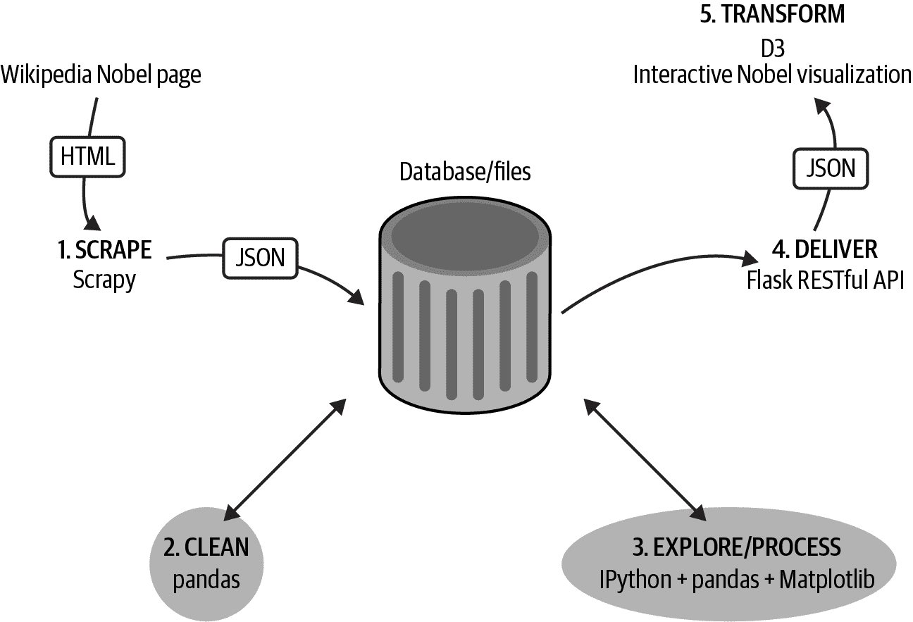

# 第三部分：使用 pandas 清理和探索数据

在本书的这一部分中，我们工具链的第二阶段（见图 III-1），我们将刚刚用 Scrapy 爬取的诺贝尔奖数据集首先进行清理，然后探索其中有趣的信息。我们将要使用的主要工具是庞大的 Python 库 Matplotlib 和 pandas。

###### 注意

本书的第二版使用了在第一版中爬取的相同的诺贝尔数据集。认为把时间用于撰写新材料和更新所有库要比更改探索和分析更有价值。数据可视化通常涉及与旧数据集一起工作，少数额外的诺贝尔获奖者完全不改变材料的实质。

pandas 将在接下来的几章中介绍，与其基础模块 NumPy 一起。在第九章中，我们将使用 pandas 来清理诺贝尔奖数据集。然后在第十一章中，与 Python 的绘图库 Matplotlib 一起，我们将使用它来探索数据。

在第四部分，我们将看到如何使用 Python 的 Flask Web 服务器将经过清理的诺贝尔奖数据集传递到浏览器。

###### 图 III-1. 我们的数据可视化工具链：数据清理和探索

###### 提示

你可以在[书籍的 GitHub 仓库](https://github.com/Kyrand/dataviz-with-python-and-js-ed-2)找到本书这部分的代码。
