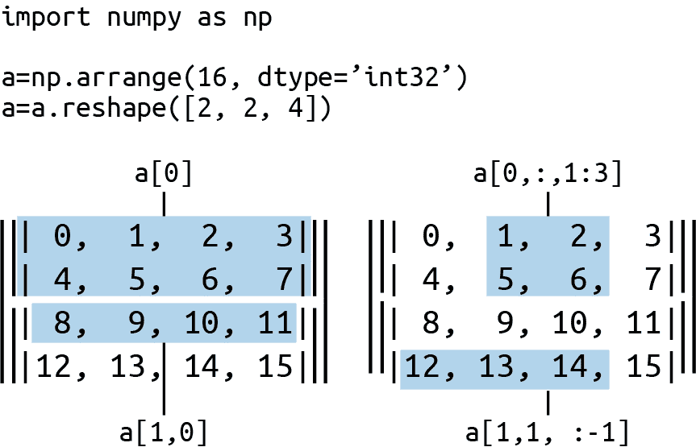
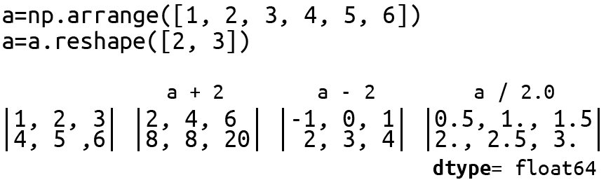

# 第七章 介绍 NumPy

本章旨在向不熟悉的人介绍 Numeric Python 库（NumPy）。NumPy 是 pandas 的关键构建模块，pandas 是一个强大的数据分析库，我们将在接下来的章节中使用它来清理和探索最近抓取的诺贝尔奖数据集（参见 第六章）。如果你想充分利用 pandas，对 NumPy 的核心元素和原则有基本的了解是很重要的。因此，本章的重点是为即将介绍 pandas 的内容奠定基础。

NumPy 是一个 Python 模块，允许访问非常快速的、多维数组操作，由 C 和 Fortran 编写的底层库实现。^(1) Python 对大量数据的本地性能相对较慢，但 NumPy 允许您一次在大数组上执行并行操作，使其非常快速。鉴于 NumPy 是大多数重量级 Python 数据处理库的主要构建模块，包括 pandas，很难否认它作为 Python 数据处理世界的枢纽的地位。

除了 pandas，NumPy 的庞大生态系统还包括科学 Python（SciPy），它用硬核科学和工程模块补充了 NumPy；scikit-learn，它添加了许多现代机器学习算法，如分类和特征提取；以及许多其他专门库，它们使用 NumPy 的多维数组作为其主要数据对象。在这个意义上，基本的 NumPy 掌握可以极大地扩展你在数据处理领域的 Python 范围。

理解 NumPy 的关键在于其数组。如果你了解这些是如何工作的以及如何操作它们，那么其他很多东西应该会很容易跟上。^(2) 接下来的几节将涵盖基本的数组操作，并举几个 NumPy 实例，为 第八章 中 pandas 数据集的介绍做铺垫。

# NumPy 数组

在 NumPy 中，一切都是围绕其同构^(3)、多维的 `ndarray` 对象构建的。对这些数组的操作是使用非常快速、编译的库执行的，使得 NumPy 能够大大超越原生 Python。除此之外，你可以对这些数组执行标准算术，就像你对一个 Python `int` 或 `float` 执行的一样。^(4) 在下面的代码中，整个数组被添加到自身，就像添加两个整数一样容易和快速：

```py
import numpy as np 

a = np.array([1, 2, 3]) 
a + a
# output array([2, 4, 6])
```


使用 NumPy 库的标准方法，远远优于 `"from numpy import *"`。^(5)


自动将 Python 列表转换为数字。

在幕后，NumPy 可以利用现代 CPU 可用的大规模并行计算，允许例如在可接受的时间内压缩大矩阵（2D 数组）。

NumPy `ndarray`的关键属性是其维数(`ndim`)、形状(`shape`)和数值类型(`dtype`)。同一组数字数组可以在原地重塑，有时这将涉及更改数组的维数。让我们使用`print_array_details`方法演示一些重塑的例子，用一个小八元素数组：

```py
def print_array_details(a):
    print('Dimensions: %d, shape: %s, dtype: %s'\
        %(a.ndim, a.shape, a.dtype))
```

首先，我们将创建我们的一维数组。如打印的细节所示，默认情况下，这具有 64 位整数数值类型(`int64`)：

```py
In [1]: a = np.array([1, 2, 3, 4, 5, 6, 7, 8])

In [2]: a
Out[2]: array([1, 2, 3, 4, 5, 6, 7, 8])

In [3]: print_array_details(a)
Dimensions: 1, shape: (8,), dtype: int64
```

使用`reshape`方法，我们可以改变`a`的形状和维度数量。让我们将`a`重塑为一个由两个四元素数组组成的二维数组：

```py
In [4]: a = a.reshape([2, 4])
In [5]: a
Out[5]:
array([[1, 2, 3, 4],
       [5, 6, 7, 8]])

In [6]: print_array_details(a)
Dimensions: 2, shape: (2, 4), dtype: int64
```

一个八元素数组也可以重塑为三维数组：

```py
In [7]: a = a.reshape([2, 2, 2])

In [8]: a
Out[8]:
array([[[1, 2],
        [3, 4]],

       [[5, 6],
        [7, 8]]])

In [9]: print_array_details(a)
Dimensions: 3, shape: (2, 2, 2), dtype: int64
```

形状和数值类型可以在创建数组时或以后指定。改变数组的数值类型最简单的方法是使用`astype`方法，以制作具有新类型的原始调整大小副本：^(6)

```py
In [0]: x = np.array([[1, 2, 3], [4, 5, 6]], np.int32) 
In [1]: x.shape
Out[1]: (2, 3)
In [2]: x.shape = (6,)
In [3]: x
Out[3]: array([1, 2, 3, 4, 5, 6], dtype=int32)
In [4]  x = x.astype('int64')
In [5]: x.dtype
Out[5]: dtype('int64')
```


数组将把一个数字的嵌套列表转换为合适形状的多维形式。

## 创建数组

除了使用数字列表创建数组外，NumPy 还提供了一些实用函数来创建具有特定形状的数组。`zeros`和`ones`是最常用的函数，用于创建预填充的数组。以下是一些示例。注意，这些方法的默认`dtype`是 64 位浮点数(`float64`)：

```py
In [32]: a = np.zeros([2,3])
In [33]: a
Out[33]:
array([[ 0.,  0.,  0.],
       [ 0.,  0.,  0.]])

In [34]: a.dtype
Out[34]: dtype('float64')

In [35]: np.ones([2, 3])
Out[35]:
array([[ 1.,  1.,  1.],
       [ 1.,  1.,  1.]])
```

更快的`empty`方法只接受一个内存块而没有填充开销，留下初始化由您负责。这意味着与`np.zeros`不同，您不知道也无法保证数组具有哪些值，因此请谨慎使用：

```py
empty_array = np.empty((2,3)) # create an uninitialized array

empty_array
Out[3]:
array([[  6.93185732e-310,   2.52008024e-316,   4.71690401e-317],
       [  2.38085057e-316,   6.93185752e-310,   6.93185751e-310]])
```

另一个有用的实用函数是`random`，它与 NumPy 的`random`模块中的一些有用的兄弟函数一起找到。这将创建一个形状随机数组：

```py
>>> np.random.random((2,3))
>>> Out:
array([[ 0.97519667,  0.94934859,  0.98379541], 
       [ 0.10407003,  0.35752882,  0.62971186]])
```


一个 2×3 的随机数数组，在范围 0 `<=` x < 1 内。

方便的`linspace`在设置的区间内创建指定数量的均匀间隔样本。`arange`类似，但使用步长参数：

```py
np.linspace(2, 10, 5) # 5 numbers in range 2-10
Out: array([2., 4.,6., 8., 10.]) 

np.arange(2, 10, 2) # from 2 to 10 (exlusive) with step-size 2.
Out: array([2, 4, 6, 8])
```

请注意，与`arange`不同，`linspace`包括上限值，并且数组的数据类型是默认的`float64`。

## 数组索引和切片

一维数组的索引和切片与 Python 列表类似：

```py
a = np.array([1, 2, 3, 4, 5, 6])
a[2] # Out: 3
a[3:5] # Out: array([4, 5])
# every second item from 0-4 set to 0
a[:4:2] = 0 # Out: array([0, 2, 0, 4, 5, 6])
a[::-1] # Out: array([6, 5, 4, 0, 2, 0]), reversed
```

多维数组的索引与*1-D*形式类似。每个维度都有自己的索引/切片操作，这些操作在以逗号分隔的元组中指定。^(7) 图 7-1 展示了这是如何工作的。



###### 图 7-1\. 使用 NumPy 进行多维索引

请注意，如果选择元组中的对象数少于维数的数量，则假定其余维度完全选择（:）。省略号也可以用作所有索引的全选的缩写，扩展为所需数量的：对象。我们将使用一个三维数组来演示：

```py
a = np.arange(8)
a.shape = (2, 2, 2)
a
Out:
array([[[0, 1],
        [2, 3]],

       [[4, 5],
        [6, 7]]])
```

NumPy 提供了一个方便的 `array_equal` 方法，可以按形状和元素比较数组。我们可以用它来展示以下数组选择的等价性，获取轴 0 的第二个子数组：

```py
a1 = a[1]
a1
Out:
array([[4, 5],
       [6, 7]])
```

测试等价性：

```py
np.array_equal(a1, a[1,:])
Out: True

np.array_equal(a1, a[1,:,:])
Out: True
# Taking the first element of the subarrays
# array([[0, 2], [4, 6]])
np.array_equal(a[...,0], a[:,:,0])
Out: True
```

## 几个基本操作

NumPy 数组的一个非常酷的功能之一是，您可以像操作普通数值变量一样进行基本（以及不那么基本的）数学运算。图 7-2 展示了如何在二维数组上使用一些重载的算术运算符。简单的数学运算适用于数组的所有成员。请注意，当数组除以浮点值（2.0）时，结果会自动转换为浮点类型（`float64`）。能够像操作单个数字一样操作数组是 NumPy 的一大优势，也是其表现力的重要组成部分。



###### 图 7-2\. 在二维 NumPy 数组上进行的几个基本数学操作

布尔运算符的工作方式与算术运算符类似。正如我们将在下一章看到的那样，这是创建 pandas 中经常使用的布尔掩码的非常有用的方式。这里有一个小例子：

```py
a = np.array([45, 65, 76, 32, 99, 22])
a < 50
Out[69]: array([ True, False, False,  True, False,  True]
               , dtype=bool)
```

数组还有许多有用的方法，其中一部分在 示例 7-1 中进行了演示。您可以在 [NumPy 官方文档](https://oreil.ly/qmnDX) 中获取全面的介绍。

##### 示例 7-1\. 一些数组方法

```py
a = np.arange(8).reshape((2,4))
# array([[0, 1, 2, 3],
#        [4, 5, 6, 7]])
a.min(axis=1)
# array([0, 4])
a.sum(axis=0)
# array([4, 6, 8, 10])
a.mean(axis=1) 
# array([ 1.5, 5.5 ])
a.std(axis=1) 
# array([ 1.11803399,  1.11803399])
```


沿第二轴的平均值。


[0, 1, 2, 3] 的标准差,…​

还有大量的内置数组函数。示例 7-2 展示了其中的一些，您可以在 [NumPy 官方网站](https://oreil.ly/vvfzm) 上找到 NumPy 内置数学函数的全面列表。

##### 示例 7-2\. 一些 NumPy 数组数学函数

```py
# Trigonometric functions
pi = np.pi
a = np.array([pi, pi/2, pi/4, pi/6])

np.degrees(a) # radians to degrees
# Out: array([ 180., 90., 45., 30.,])

sin_a = np.sin(a)
# Out: array(  1.22464680e-16,   1.00000000e+00, ![1
#               7.07106781e-01,   5.00000000e-01])
# Rounding
np.round(sin_a, 7) # round to 7 decimal places
# Out: array([ 0.,  1.,  0.7071068,  0.5 ])

# Sums, products, differences
a = np.arange(8).reshape((2,4))
# array([[0, 1, 2, 3],
#        [4, 5, 6, 7]])

np.cumsum(a, axis=1) # cumulative sum along second axis
# array([[ 0,  1,  3,  6],
#        [ 4,  9, 15, 22]])

np.cumsum(a) # without axis argument, array is flattened
# array([ 0,  1,  3,  6, 10, 15, 21, 28])
```


注意 sin(pi) 的浮点舍入误差。

# 创建数组函数

无论您使用的是 pandas 还是诸如 SciPy、scikit-learn 或 PyTorch 等许多 Python 数据处理库之一，核心数据结构往往是 NumPy 数组。因此，掌握一些小的数组处理函数对您的数据处理工具包和数据可视化工具链来说是一个很好的补充。通常可以通过简短的互联网搜索找到社区解决方案，但自己动手编写代码不仅能够带来满足感，而且是学习的一个好方法。让我们看看如何利用 NumPy 数组来计算一个[移动平均](https://oreil.ly/ajLZJ)。移动平均是基于最近的 *n* 个值的移动窗口的一系列平均值，其中 *n* 是可变的，也称为*滚动平均*。

## 计算移动平均

示例 7-3 展示了在一维 NumPy 数组上计算移动平均所需的几行代码。^(8)正如您所见，这些代码既简洁又清晰，但其中确实包含了相当多的内容。让我们来详细分析一下。

##### 示例 7-3\. 使用 NumPy 计算移动平均

```py
def moving_average(a, n=3):
    ret = np.cumsum(a, dtype=float)
    ret[n:] = ret[n:] - ret[:-n]
    return ret[n - 1:] / n
```

函数接收一个数组 *a* 和一个指定移动窗口大小 *n* 的数字。

我们首先使用 NumPy 的内置方法计算数组的累积和：

```py
a = np.arange(6)
# array([0, 1, 2, 3, 4, 5])
csum = np.cumsum(a)
csum
# Out: array([0, 1, 3, 6, 10, 15])
```

从累积和数组的第 *n* 个索引开始，我们对所有 *i* 减去 *i*–*n* 的值，这意味着 *i* 现在具有包括 *a* 的最后 *n* 个值的总和。以下是一个窗口大小为三的示例： 

```py
# a = array([0, 1, 2, 3, 4, 5])
# csum = array([0, 1, 3, 6, 10, 15])
csum[3:] = csum[3:] - csum[:-3]
# csum = array([0, 1, 3, 6, 9, 12])
```

比较数组 `a` 与最终数组 `csum`，索引 5 现在是窗口 [3, 4, 5] 的总和。

因为移动平均仅对索引 (*n*–1) 及之后有意义，所以只需返回这些值，除以窗口大小 *n* 得到平均值。

`moving_average` 函数需要一些时间才能理解，但它是使用 NumPy 数组和数组切片能够实现简洁和表达力的一个很好的例子。您也可以轻松地用纯 Python 编写该函数，但对于规模较大的数组来说，它可能会更加复杂，关键是速度更慢。

把函数投入实际运行：

```py
a = np.arange(10)
moving_average(a, 4)
# Out[98]: array([ 1.5,  2.5,  3.5,  4.5,  5.5,  6.5,  7.5])
```

# 总结

本章奠定了 NumPy 的基础，重点是其构建块，即 NumPy 数组或 `ndarray`。精通 NumPy 对于任何与数据相关的 Python 开发者来说都是一项核心技能。它支持大多数 Python 强大的数据处理堆栈，因此仅出于这个原因，您应该熟练掌握其数组操作。

与 NumPy 熟悉会使 pandas 的工作更加轻松，并打开丰富的 NumPy 生态系统，涵盖科学、工程、机器学习和统计算法。尽管 pandas 将其 NumPy 数组隐藏在数据容器背后，如其 DataFrame 和 Series，这些容器被适配为处理异构数据，但这些容器在大多数情况下表现得像 NumPy 数组，并且通常在需要时会表现出正确的行为。了解 `ndarray` 在其核心的事实，也有助于您在为 pandas 构建问题时考虑到 NumPy 的情况。现在我们已经掌握了其基本构建块，让我们看看 pandas 如何将均匀的 NumPy 数组扩展到异构数据领域，在这里进行大部分数据可视化工作。

^(1) Python 的脚本易用性是以性能的原始速度为代价的。通过封装快速的低级库，像 NumPy 这样的项目旨在实现简单、无冗余的编程和极高的性能。

^(2) NumPy 用于实现一些非常高级的数学功能，因此不要期望能够完全理解在线看到的所有内容—​只需理解其中的基本构建块。

^(3) 这意味着 NumPy 处理的是相同数据类型（dtype）的数组，而不是像 Python 列表那样可以包含字符串、数字、日期等。

^(4) 这假设数组符合形状和类型的约束条件。

^(5) 使用 `*` 将所有模块变量导入到您的命名空间几乎总是一个坏主意。

^(6) 更节省内存且性能更好的方法涉及操作数组的视图，但确实需要一些额外步骤。参见 [这篇 Stack Overflow 文章](https://oreil.ly/FOQWt) 获取一些示例以及对其优缺点的讨论。

^(7) 有一种简写的点符号表示法（例如，`[..1:3]`）用于选择所有索引。

^(8) NumPy 有一个 `convolve` 方法，这是计算简单移动平均的最简单方法，但不够具有指导意义。此外，pandas 也有许多专门的方法来实现这一点。
