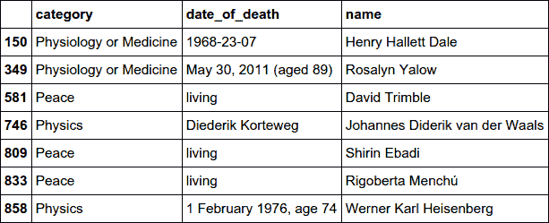

# 第九章：使用 pandas 清洗数据

前两章介绍了 pandas 和 NumPy，它扩展了 Numeric Python 库。具备基本的 pandas 知识，我们现在可以开始我们工具链的清洗阶段，旨在查找并消除我们抓取数据集中的脏数据（参见第六章）。本章还将在工作环境中介绍新方法，扩展你的 pandas 知识。

在第八章中，我们介绍了 pandas 的核心组件：DataFrame，一种可以处理现实世界中多种不同数据类型的程序化电子表格，以及其构建块 Series，是 NumPy 均匀 ndarray 的异构扩展。我们还介绍了如何从不同的数据存储中读取和写入，包括 JSON、CSV 文件、MongoDB 和 SQL 数据库。现在我们将开始展示 pandas 的实际运用，展示如何使用它来清洗肮脏的数据。我将以我们肮脏的诺贝尔奖数据集为例，介绍数据清洗的关键要素。

我会慢慢介绍关键的 pandas 概念，让你在实际工作环境中了解。让我们首先弄清楚为什么数据清洗是数据可视化工作中如此重要的一部分。

# 洗清肮脏的数据

我认为可以说，大多数进入数据可视化领域的人都低估了他们将花费在使数据呈现可用状态上的时间，通常低估的程度相当大。事实上，要获得干净的数据集，可以轻松转化为酷炫可视化效果，可能会占用你一半以上的时间。野外的数据很少是完美的，往往带有错误的手动数据输入的粘滞痕迹，由于疏忽或解析错误而丢失整个字段和/或混合的日期时间格式。

对于本书，为了提出一个适当的复杂挑战，我们的诺贝尔奖数据集是从维基百科上抓取的，这是一个手动编辑的网站，有相当非正式的指南。在这个意义上，数据肯定是脏的——即使在环境更宽容的情况下，人类也会犯错。但即使是来自例如大型社交媒体网站的官方 API 的数据，也经常存在缺失或不完整的字段，来自对数据模式无数更改的疤痕，故意的错误输入等等。

因此，数据清洗是数据可视化工作的基本组成部分，会占用你本来更愿意做的所有酷炫工作的时间——这是擅长它并释放出那些枯燥时间以进行更有意义追求的一个很好的理由。而擅长数据清洗的一个重要部分就是选择正确的工具集，而这正是 pandas 发挥作用的地方。即使是处理相当大的数据集也是切片和切块的一个很好的方法，^(1) 熟悉它可以节省大量时间。这就是本章的作用所在。

总之，使用 Python 的 Scrapy 库（参见第 6 章）从维基百科爬取诺贝尔奖数据产生了一个 JSON 对象数组：

```py
{
  "category": "Physics",
  "name": "Albert Einstein",
  "gender": "male",
  "place_of_birth": "Ulm ,  Baden-W\u00fcrttemberg ,
 German Empire",
  "date_of_death": "1955-04-18",
  ...
}
```

本章的任务是在我们在下一章用 pandas 探索之前，尽可能将该数组转换为尽可能干净的数据源。

有许多形式的脏数据，最常见的是：

+   重复条目/行

+   缺失字段

+   行不对齐

+   损坏的字段

+   列中混合的数据类型

现在我们将探究我们的诺贝尔奖数据中是否存在这些异常。

首先，我们需要将我们的 JSON 数据加载到 DataFrame 中，就像前一章中所示（参见“创建和保存 DataFrame”）。我们可以直接打开 JSON 数据文件：

```py
import pandas as pd

df = pd.read_json(open('data/nobel_winners_dirty.json'))
```

现在我们已经将脏数据加载到 DataFrame 中，让我们先来全面了解一下我们拥有的数据。

# 检查数据

pandas DataFrame 有许多方法和属性，可以快速概述其中包含的数据。最通用的是`info`，它提供了每列的数据条目数量的整洁摘要：

```py
df.info()
<class 'pandas.core.frame.DataFrame'>
RangeIndex: 1052 entries, 0 to 1051
Data columns (total 12 columns):
 #   Column          Non-Null Count  Dtype
---  ------          --------------  -----
 0   born_in         1052 non-null   object
 1   category        1052 non-null   object
 2   country         1052 non-null   object
 3   date_of_birth   1044 non-null   object
 4   date_of_death   1044 non-null   object
 5   gender          1040 non-null   object
 6   link            1052 non-null   object
 7   name            1052 non-null   object
 8   place_of_birth  1044 non-null   object
 9   place_of_death  1044 non-null   object
 10  text            1052 non-null   object
 11  year            1052 non-null   int64
dtypes: int64(1), object(11)
memory usage: 98.8+ KB
```

您可以看到某些字段缺少条目。例如，虽然我们的 DataFrame 中有 1,052 行，但只有 1,040 个性别属性。还请注意方便的`memory_usage`——pandas DataFrames 存储在 RAM 中，因此随着数据集的增大，此数字可以很好地指示我们离机器特定的内存限制有多近。

DataFrame 的`describe`方法提供了相关列的方便的统计摘要：

```py
df.describe()
Out:
              year
count  1052.000000
mean   1968.729087
std      33.155829
min    1809.000000
25%    1947.000000
50%    1975.000000
75%    1996.000000
max    2014.000000
```

如您所见，默认情况下只描述数值列。我们已经可以看到数据中的一个错误，最小年份为 1809 年，而第一个诺贝尔奖是在 1901 年颁发的，这是不可能的。

`describe`接受一个`include`参数，允许我们指定要评估的列数据类型（`dtype`s）。除了年份之外，我们的诺贝尔奖数据集中的列都是对象，这是 pandas 的默认、万能的`dtype`，能够表示任何数字、字符串、日期时间等。示例 9-1 展示了如何获取它们的统计数据。

##### 示例 9-1\. 描述 DataFrame

```py
In [140]: df.describe(include=['object']) 
Out[140]:
       born_in  category date_of_birth date_of_death gender  \ count     1052      1052          1044          1044   1040
unique      40         7           853           563      2
top             Physio..    9 May 1947                 male
freq       910       250             4           362    983

                              link             name  \ count                         1052             1052
unique                         893              998
top     http://eg/wiki/...                     Daniel Kahneman
freq                             4                2

          country place_of_birth place_of_death  \ count            1052           1044           1044
unique             59            735            410
top     United States
freq              350             29            409
...
```


`include`参数是要总结的列数据类型的列表（或单个项目）。

从示例 9-1 的输出中可以得到相当多有用的信息，例如有 59 个独特的国籍，美国是最大的群体，有 350 个。

有趣的一点是，在 1,044 个记录的出生日期中，只有 853 个是唯一的，这可能意味着很多事情。可能某些吉利的日子见证了多位获奖者的诞生，或者，在我们进行数据清理时，更有可能存在重复的获奖者，或者某些日期有误或者只记录了年份。重复的获奖者假设得到了证实，因为在 1,052 个名称计数中，只有 998 个是唯一的。虽然有一些多次获奖者，但这些并不足以解释 54 个重复。

DataFrame 的 `head` 和 `tail` 方法提供了另一种快速了解数据的方法。默认情况下，它们显示前五行或后五行，但我们可以通过将整数作为第一个参数传递来设置显示的行数。示例 9-2 显示了在我们的诺贝尔 DataFrame 上使用 `head` 的结果。

##### 示例 9-2\. 对 DataFrame 的前五行进行采样

```py
df.head()
Out:
                  born_in                category   date_of_bi..
0                          Physiology or Medicine  8 October 1..
1  Bosnia and Herzegovina              Literature  9 October 1..
2  Bosnia and Herzegovina               Chemistry   July 23, 1..
3                                           Peace             ..
4                                           Peace    26 July 1..

    date_of_death gender                                      ..
0   24 March 2002   male   http://en.wikipedia.org/wiki/C%C3%A..
1   13 March 1975   male            http://en.wikipedia.org/wi..
2      1998-01-07   male       http://en.wikipedia.org/wiki/Vl..
3             NaN   None  http://en.wikipedia.org/wiki/Institu..
4  6 October 1912   male  http://en.wikipedia.org/wiki/Auguste..

                              name country  \ 0                   César Milstein   Argentina
1                     Ivo Andric *               
2                Vladimir Prelog *
3  Institut de Droit International     Belgium
4                Auguste Beernaert     Belgium
```


这些行在 `born_in` 字段中有条目，并且姓名旁边有星号标记。


`date_of_death` 字段的时间格式与其他行不同。

示例 9-2 中的前五位获奖者展示了一些有用的信息。首先，我们看到第 1 和第 2 行的姓名被星号标记，并在 `born_in` 字段中有条目 。其次，请注意第 2 行的 `date_of_death` 与其他行有不同的时间格式，而 `date_of_birth` 字段中既有月-日格式，也有日-月格式 。这种不一致性是人为编辑数据中的常见问题，特别是日期和时间。稍后我们将看到如何使用 pandas 解决这个问题。

示例 9-1 给出了 `born_in` 字段的对象计数为 1,052，表明没有空字段，但 `head` 显示只有第 1 和第 2 行有内容。这表明缺失字段是空字符串或空格，这两者在 pandas 中都算作数据。让我们将它们改为不计数的 `NaN`，这将更好地解释这些数字。但首先，我们需要对 pandas 数据选择做一个简单的介绍。

# 索引和 pandas 数据选择

在开始清理数据之前，让我们快速回顾一下基本的 pandas 数据选择，以诺贝尔奖数据集为例。

pandas 按行和列进行索引。通常列索引由数据文件、SQL 表等指定，但正如上一章所示，我们可以通过使用 `names` 参数在创建 DataFrame 时设置或覆盖这些列名。列索引可以作为 DataFrame 的属性访问：

```py
# Our Nobel dataset's columns
df.columns
Out: Index(['born_in', 'category', 'date_of_birth',
...
        'place_of_death', 'text', 'year'], dtype='object')
```

默认情况下，pandas 为行指定零基整数索引，但我们可以通过在创建 DataFrame 时传递列表或直接设置`index`属性来覆盖这一点。我们更经常想要将一个或多个 DataFrame 的列用作索引。我们可以使用`set_index`方法来做到这一点。如果要返回默认索引，可以使用`reset_index`方法，如示例 9-3 所示。

##### 示例 9-3. 设置 DataFrame 的索引

```py
# set the name field as index
df = df.set_index('name') 
df.head(2)
Out:
                               born_in                category  \ name 
César Milstein                          Physiology or Medicine
Ivo Andric *    Bosnia and Herzegovina              Literature
...

df.reset_index(inplace=True) 

df.head(2)
Out:
             name                 born_in                category  \ 0  César Milstein                          Physiology or Medicine  
1    Ivo Andric *  Bosnia and Herzegovina              Literature
```


将框架的索引设置为其名称列。将结果返回给`df`。


现在行已经按名称索引。


将索引重置为整数。请注意，这次我们直接在原地更改它。


现在索引是按整数位置。

###### 注意

有两种方法可以更改 pandas DataFrame 或 Series：通过直接更改数据或通过赋值副本。不能保证直接更改更快，而且方法链需要操作返回一个已更改的对象。通常情况下，我使用`df = df.foo(...)`形式，但大多数变异方法都有一个`inplace`参数`df.foo(..., inplace=True)`。

现在我们了解了行列索引系统，让我们开始选择 DataFrame 的切片。

我们可以通过点表示法（名称中没有空格或特殊字符）或方括号表示法选择 DataFrame 的列。让我们看看`born_in`列：

```py
bi_col = df.born_in # or bi = df['born_in']
bi_col
Out:
0
1     Bosnia and Herzegovina
2     Bosnia and Herzegovina
3
...
1051
Name: born_in, Length: 1052, dtype: object

type(bi_col)
Out: pandas.core.series.Series
```

注意列选择返回一个 pandas Series，保留了 DataFrame 的索引。

DataFrames 和 Series 共享相同的方法来访问行/成员。`iloc`通过整数位置选择，`loc`通过标签选择。让我们使用`iloc`来获取我们 DataFrame 的第一行：

```py
# access the first row
df.iloc[0]
Out:
name                                 César Milstein
born_in
category                             Physiology or Medicine
...

# set the index to 'name' and access by name-label
df.set_index('name', inplace=True)
df.loc['Albert Einstein']
Out:
                 born_in category      country  ...
name
Albert Einstein           Physics  Switzerland  ...
Albert Einstein           Physics      Germany  ...
...
```

## 选择多行

可以使用标准的 Python 数组切片与 DataFrame 一起选择多行：

```py
# select the first 10 rows
df[0:10]
Out:
                  born_in                category   date_of_b..
0                          Physiology or Medicine  8 October ..
1  Bosnia and Herzegovina              Literature  9 October ..
...
9                                           Peace      1910-0..
# select the last four rows
df[-4:]
Out:
     born_in                category      date_of_birth date_..
1048                           Peace   November 1, 1878   May..
1049          Physiology or Medicine         1887-04-10    19..
1050                       Chemistry           1906-9-6     1..
1051                           Peace  November 26, 1931      ..
```

根据条件表达式选择多行的标准方法（例如，列`value`的值是否大于`x`）是创建一个布尔掩码并在选择器中使用它。让我们找出所有 2000 年后的诺贝尔奖获得者。首先，我们通过对每一行执行布尔表达式来创建一个掩码：

```py
mask = df.year > 2000 
mask
Out:
0     False
1     False
...
13     True
...
1047     True
1048    False
...
Name: year, Length: 1052, dtype: bool
```


所有`year`字段大于 2000 的行为`True`。

结果布尔掩码共享我们 DataFrame 的索引，可用于选择所有`True`行：

```py
mask = df.year > 2000
winners_since_2000 = df[mask] 
winners_since_2000.count()
Out:
...
year              202 # number of winners since 2000
dtype: int64

winners_since_2000.head()
Out:
...
                                               text  year
13                 François Englert , Physics, 2013  2013
32      Christopher A. Pissarides , Economics, 2010  2010
66                         Kofi Annan , Peace, 2001  2001
87               Riccardo Giacconi *, Physics, 2002  2002
88   Mario Capecchi *, Physiology or Medicine, 2007  2007
```


这将返回一个 DataFrame，其中仅包含布尔`mask`数组为`True`的行。

布尔遮罩是一种非常强大的技术，能够选择您需要的数据的任何子集。我建议设定一些目标来练习构建正确的布尔表达式。通常，我们会省略中间遮罩的创建。

```py
winners_since_2000 = df[df.year > 2000]
```

现在我们可以通过切片或使用布尔遮罩来选择单个和多个行，接下来的几节我们将看到如何改变我们的 DataFrame，在此过程中清除脏数据。

# 清理数据

现在我们知道如何访问我们的数据了，让我们看看如何改进它，从我们在 示例 9-2 中看到的看起来为空的 `born_in` 字段开始。如果我们查看 `born_in` 列的计数，它不会显示任何缺失的行，如果有任何字段缺失或 `NaN`（非数字）的话，它会显示出来：

```py
In [0]: df.born_in.describe()
Out[0]:
count     1052
unique      40
top
freq       910
Name: born_in, dtype: object
```

## 查找混合类型

请注意，pandas 使用 `dtype` 对象存储所有类似字符串的数据。粗略检查表明，该列是空和国家名称字符串的混合。我们可以通过将 Python 的 [`type` 函数](https://oreil.ly/jj9hY) 映射到所有成员，然后使用 `apply` 方法并将结果列表设置为列成员类型的集合来快速检查所有列成员是否都是字符串：

```py
In [1]: set(df.born_in.apply(type))
Out[1]: {str}
```

这表明 `born_in` 列的所有成员都是字符串类型 `str`。现在让我们用一个空字段来替换任何空字符串。

## 替换字符串

我们想用 `NaN` 替换这些空字符串，以防止它们被计数。[³] pandas 的 `replace` 方法是专门为此而设计的，可以应用于整个 DataFrame 或单个 Series：

```py
import numpy as np

bi_col.replace('', np.nan, inplace=True)
bi_col
Out:
0                        NaN 
1     Bosnia and Herzegovina
2     Bosnia and Herzegovina
3                        NaN
...

bi_col.count()
Out: 142 
```


我们的空 `''` 字符串已被替换为 NumPy 的 `NaN`。


不像空字符串，`NaN` 字段是不计算在内的。

在用 `NaN` 替换空字符串后，我们得到了 `born_in` 字段的真实计数为 142。

让我们用折扣的 `NaN` 替换我们 DataFrame 中的所有空字符串：

```py
df.replace('', np.nan, inplace=True)
```

pandas 允许对列中的字符串（以及其他对象）进行复杂的替换（例如，允许您编写 [正则表达式或 regexes](https://oreil.ly/KK3b2)，这些表达式适用于整个 Series，通常是 DataFrame 的列）。让我们看一个小例子，使用我们的诺贝尔奖 DataFrame 中用星号标记的姓名。

示例 9-2 显示，我们的一些诺贝尔奖获得者的名字被标记为星号，表示这些获奖者是按出生国家记录的，而不是获奖时的国家：

```py
df.head()
Out:
...
                              name country  \
0                   César Milstein   Argentina
1                     Ivo Andric *
2                Vladimir Prelog *
3  Institut de Droit International     Belgium
4                Auguste Beernaert     Belgium
```

让我们设置一个任务，通过去除星号并去除任何剩余的空白来清理这些名字。

pandas Series 有一个方便的 `str` 成员，提供了许多有用的字符串方法，可在数组上执行。让我们使用它来检查有多少带星号的名字：

```py
df[df.name.str.contains(r'\*')]['name'] 
Out:
1              Ivo Andric *
2         Vladimir Prelog *
...
1041       John Warcup Cornforth *
1046      Elizabeth H. Blackburn *
Name: name, Length: 142, dtype: object 
```


我们在`name`列上使用`str`的`contains`方法。请注意，我们必须转义星号（`'\*'`），因为这是一个正则表达式字符串。然后将布尔掩码应用于我们的诺贝尔奖 DataFrame，并列出结果名称。


我们的 1,052 行中，有 142 行的名称中包含`*`。

为了清理名称，让我们用空字符串替换星号，并从结果名称中去掉任何空格：

```py
df.name = df.name.str.replace('*', '', regex=True) 
# strip the whitespace from the names
df.name = df.name.str.strip()
```


删除名称字段中的所有星号，并将结果返回到 DataFrame。请注意，我们必须显式地将`regex`标志设置为`True`。

快速检查显示现在名称已经干净：

```py
df[df.name.str.contains('\*')]
Out:
Empty DataFrame
```

pandas Series 有大量的字符串处理函数，使您能够搜索和调整字符串列。您可以在[API 文档](https://oreil.ly/2mCSZ)中找到完整列表。

## 删除行

总结一下，142 位出生地字段为获奖者是重复的，在维基百科传记页上既有出生国家，又有获奖时的国家。尽管前者可能形成有趣的可视化基础，^(4) 但对于我们的可视化，我们希望每个个人奖只代表一次，因此需要从我们的 DataFrame 中删除这些内容。

我们想创建一个新的 DataFrame，只包含那些具有`NaN`的`born_in`字段的行。您可能天真地认为将条件表达式与`born_in`字段与`NaN`进行比较会在这里起作用，但根据定义^(5)，`NaN`布尔比较始终返回`False`：

```py
np.nan == np.nan
Out: False
```

因此，pandas 提供了专门的`isnull`方法来检查折扣（空）字段：

```py
df = df[df.born_in.isnull()] 
df.count()
Out:
born_in             0 # all entries now empty
category          910
...
dtype: int64
```


`isnull` 生成一个布尔掩码，对于所有具有空`born_in`字段的行返回`True`。

`born_in`列现在不再有用，所以暂时删除它：^(6)

```py
df = df.drop('born_in', axis=1) 
```


`drop` 接受一个单个标签或索引（或相同的列表）作为第一个参数，并且一个`axis`参数以指示行（`0`和默认）或列（`1`）索引。

## 查找重复项

现在，快速的互联网搜索显示截至 2015 年有 889 个人和组织获得了诺贝尔奖。还剩下 910 行，我们仍然有一些重复或异常需要处理。

pandas 提供了一个方便的`duplicated`方法用于查找匹配的行。这可以根据列名或列名列表进行匹配。让我们获取所有名称重复的列表：

```py
dupes_by_name = df[df.duplicated('name')] 
dupes_by_name.count()
Out:
...
year              46
dtype: int64
```


`duplicated` 返回一个布尔数组，对于具有相同`name`字段的任何行的第一个出现，返回`True`。

现在，有些人曾多次获得诺贝尔奖，但不是 46 次，这意味着有 40 多个获奖者是重复的。考虑到我们抓取的维基百科页面按国家列出了获奖者，最有可能的情况是获奖者被多个国家“认领”。

让我们看一些在我们的诺贝尔奖 DataFrame 中通过名称查找重复项的方法。其中一些方法效率很低，但这是演示一些 pandas 函数的好方法。

默认情况下，`duplicated` 指示（布尔值 `True`）第一次出现后的所有重复项，但将 `keep` 选项设置为 `*last*` 将重复行的第一次出现设置为 `True`。通过使用布尔 *or* (|) 结合这两个调用，我们可以得到完整的重复列表：

```py
all_dupes = df[df.duplicated('name')\
               | df.duplicated('name', keep='last')]
all_dupes.count()
Out:
...
year              92
dtype: int64
```

我们还可以通过测试我们的 DataFrame 行中是否有一个名称在重复名称列表中来获取所有重复项。pandas 提供了一个方便的 `isin` 方法来实现这一点：

```py
all_dupes = df[df.name.isin(dupes_by_name.name)] 
all_dupes.count()
Out:
...
year              92
dtype: int64
```


`dupes_by_name.name` 是一个包含所有重复名称的列 Series。

我们还可以使用 pandas 强大的 `groupby` 方法找到所有重复项，该方法通过列或列列表对我们的 DataFrame 行进行分组。它返回一系列键值对，键是列值，值是行的列表：

```py
for name, rows in df.groupby('name'): 
    print('name: %s, number of rows: %d'%(name, len(rows)))

name: A. Michael Spence, number of rows: 1
name: Aage Bohr, number of rows: 1
name: Aaron Ciechanover, number of rows: 1
...
```


`groupby` 返回一个 (组名，组) 元组的迭代器。

要获得所有重复的行，我们只需检查由 key 返回的行列表的长度。任何大于一的值都具有名称重复。在这里，我们使用 pandas 的 `concat` 方法，它接受一个行列表的列表，并创建一个包含所有重复行的 DataFrame。使用 Python 列表构造函数来过滤具有多行的组：

```py
pd.concat(g for _,g in df.groupby('name')\ ![1
                     if len(g) > 1])['name']

Out:
121           Aaron Klug
131           Aaron Klug
615      Albert Einstein
844      Albert Einstein
...
489      Yoichiro Nambu
773      Yoichiro Nambu
Name: name, Length: 92, dtype: object
```


通过筛选具有多行的 `name` 行组（即重复的名称）来创建一个 Python 列表。

# 达到相同目标的不同途径

在像 pandas 这样的大型库中，通常有多种方法可以实现相同的目标。对于像我们的诺贝尔奖获得者这样的小型数据集，任何一种方法都可以，但对于大型数据集来说，可能会有显著的性能影响。仅仅因为 pandas 能够执行你要求的操作，并不意味着它一定是高效的。由于幕后进行了大量复杂的数据处理，因此最好做好准备，对低效的方法保持灵活和警惕。

## 数据排序

现在我们有了 `all_dupes` DataFrame，其中包含了所有重复的行，按名称排序，让我们用它来演示 pandas 的 `sort` 方法。

pandas 为 DataFrame 和 Series 类提供了一个复杂的 `sort` 方法，能够在多个列名上进行排序：

```py
df2 = pd.DataFrame(\
     {'name':['zak', 'alice', 'bob', 'mike', 'bob', 'bob'],\
      'score':[4, 3, 5, 2, 3, 7]})
df2.sort_values(['name', 'score'],\ 
        ascending=[1,0]) 

Out:
    name  score
1  alice      3
5    bob      7
2    bob      5
4    bob      3
3   mike      2
0    zak      4
```


首先按名称排序 DataFrame，然后在这些子组内按分数排序。旧版本的 pandas 使用 `sort`，现在已不推荐使用。


将姓名按字母顺序升序排序；将分数从高到低排序。

让我们按姓名对`all_dupes`的 DataFrame 进行排序，然后查看姓名、国家和年份列：

```py
In [306]: all_dupes.sort_values('name')\
  [['name', 'country', 'year']]
Out[306]:
                          name         country  year
121                 Aaron Klug    South Africa  1982
131                 Aaron Klug  United Kingdom  1982
844            Albert Einstein         Germany  1921
615            Albert Einstein     Switzerland  1921
...
910                Marie Curie          France  1903
919                Marie Curie          France  1911
706     Marie Skłodowska-Curie          Poland  1903
709     Marie Skłodowska-Curie          Poland  1911
...
650              Ragnar Granit          Sweden  1967
960              Ragnar Granit         Finland  1809
...
396              Sidney Altman   United States  1990
995              Sidney Altman          Canada  1989
...
[92 rows x 3 columns]
```

此输出显示，如预期的那样，一些获奖者因同一年份而分配了两次，但具有不同的国家。它还显示了一些其他异常情况。尽管玛丽·居里确实两次获得诺贝尔奖，但她在这里既有法国国籍又有波兰国籍。^(7)在这里最公平的做法是将战利品分给波兰和法国，并最终选择单一的复合姓。我们还发现了我们 960 行处的 1809 年的异常年份。Sidney Altman 既重复了，又错误地获得了 1990 年的年份。

## 移除重复项

让我们开始移除我们刚刚识别的重复项，并开始编译一个小的清理函数。

###### 提示

如果您知道数据集是稳定的并且不预期再次运行任何清理脚本，则可以通过数字索引更改行。但是，就像我们抓取的诺贝尔奖数据一样，如果您希望在更新的数据集上运行相同的清理脚本，最好使用稳定的指示器（即，获取玛丽·居里和 1911 年的行，而不是索引 919）。

更改特定行的国家的更健壮的方法是使用稳定的列值来选择行，而不是其索引。这意味着如果索引值更改，则清理脚本仍然可以工作。因此，要将玛丽·居里 1911 年的奖项国家更改为法国，我们可以使用带有`loc`方法的布尔掩码来选择一行，然后将其国家列设置为法国。请注意，我们为波兰的ł指定了 Unicode：

```py
df.loc[(df.name == 'Marie Sk\u0142odowska-Curie') &\
      (df.year == 1911), 'country'] = 'France'
```

除了更改玛丽·居里的国家外，我们还希望根据列值从 DataFrame 中删除或删除一些行。我们可以通过两种方法实现这一点，首先是使用 DataFrame 的`drop`方法，该方法接受一个索引标签列表，或者通过创建一个布尔掩码的新 DataFrame 来筛选我们想要删除的行。如果使用`drop`，我们可以使用`inplace`参数来更改现有的 DataFrame。

在以下代码中，我们通过创建一个只包含我们想要的单行的 DataFrame 并将该索引传递给`drop`方法来删除我们的重复的 Sidney Altman 行，并在原地更改 DataFrame：

```py
df.drop(df[(df.name == 'Sidney Altman') &\
 (df.year == 1990)].index,
    inplace=True)
```

删除行的另一种方法是使用相同的布尔掩码与逻辑*非*（~）来创建一个新的 DataFrame，该 DataFrame 除了我们选择的行之外的所有行：

```py
df = df[~((df.name == 'Sidney Altman') & (df.year == 1990))]
```

让我们将此更改和所有当前修改添加到`clean_data`方法中：

```py
def clean_data(df):
    df = df.replace('', np.nan)
    df = df[df.born_in.isnull()]
    df = df.drop('born_in', axis=1)
    df.drop(df[df.year == 1809].index, inplace=True)
    df = df[~(df.name == 'Marie Curie')]
    df.loc[(df.name == 'Marie Sk\u0142odowska-Curie') &\
           (df.year == 1911), 'country'] = 'France'
    df = df[~((df.name == 'Sidney Altman') &\
     (df.year == 1990))]
    return df
```

现在我们有了有效的重复项（那些少数多次获奖的诺贝尔奖获得者）和那些具有双重国家的重复项。为了我们可视化的目的，我们希望每个奖项只计数一次，因此我们必须丢弃一半的双重国家奖项。最简单的方法是使用 `duplicated` 方法，但由于我们按国家字母顺序收集了获奖者，这将偏袒字母顺序较早的国家。除了进行大量研究和辩论之外，看起来最公平的方法似乎是随机选择一个并丢弃它。有各种方法可以做到这一点，但最简单的方法是在使用 `drop_duplicates` 之前随机化行的顺序，这是一个 pandas 方法，它会在遇到第一个重复项之后删除所有重复的行，或者在设置 `take_last=True` 参数时删除所有最后一个重复项之前的行。

NumPy 在其 `random` 模块中有许多非常有用的方法，其中 `permutation` 对于随机化行索引非常合适。该方法接受一个值数组（或 pandas 索引）并对其进行洗牌。然后我们可以使用 DataFrame 的 `reindex` 方法应用洗牌后的结果。请注意，我们丢弃了那些共享名称和年份的行，这将保留具有不同年份的合法双重获奖者：

```py
df = df.reindex(np.random.permutation(df.index)) 
df = df.drop_duplicates(['name', 'year'])        
df = df.sort_index()                             
df.count()
Out:
...
year              865
dtype: int64
```


创建 `df` 索引的洗牌版本，并用它重新索引 `df`。


删除所有共享名称和年份的重复项。


将索引返回到按整数位置排序。

如果我们的数据整理成功，应该只剩下有效的重复项，那些著名的双重获奖者。让我们列出剩余的重复项以进行检查：

```py
In : df[df.duplicated('name') |
             df.duplicated('name', keep='last')]\ 
             .sort_values(by='name')\
             [['name', 'country', 'year', 'category']]
Out:
                       name     country  year   category
548        Frederick Sanger  United Kingdom  1958  Chemistry
580        Frederick Sanger  United Kingdom  1980  Chemistry
292            John Bardeen   United States  1956    Physics
326            John Bardeen   United States  1972    Physics
285        Linus C. Pauling   United States  1954  Chemistry
309        Linus C. Pauling   United States  1962      Peace
706  Marie Skłodowska-Curie          Poland  1903    Physics
709  Marie Skłodowska-Curie          France  1911  Chemistry
```


我们将第一个和最后一个的重复项合并起来以获取它们所有的内容。如果使用较旧版本的 pandas，可能需要使用参数 `take_last=True`。

快速查阅互联网显示我们有正确的四位双重获奖者。

假设我们已经捕捉到了不需要的重复项^(10)，让我们继续处理数据的其他“脏”方面。

## 处理缺失字段

让我们统计一下 DataFrame 中的*null*字段情况：

```py
df.count()
Out:
category          864 
country           865
date_of_birth     857
date_of_death     566
gender            857 
link              865
name              865
place_of_birth    831
place_of_death    524
text              865
year              865
dtype: int64
```


缺失了一个类别字段。


缺失了八个性别字段。

看起来我们缺少一个 `category` 字段，这表明存在数据输入错误。如果记得，在抓取我们的诺贝尔奖数据时，我们检查了类别是否与有效列表匹配（参见 示例 6-3）。其中一个似乎未通过此检查。让我们找出是哪一个，方法是获取类别字段为空的行，并显示其名称和文本列：

```py
df[df.category.isnull()][['name', 'text']]
Out:
              name                            text
922  Alexis Carrel  Alexis Carrel , Medicine, 1912
```

我们为获奖者保存了原始链接文本，您可以看到，亚历克西斯·卡雷尔被列为赢得`医学`诺贝尔奖，而实际上应该是`生理学或医学`。让我们现在更正一下：

```py
...
df.loc[df.name == 'Alexis Carrel', 'category'] =\
 'Physiology or Medicine'
```

我们还缺少 8 位获奖者的`gender`。让我们列出它们：

```py
df[df.gender.isnull()]['name']
Out:
3                         Institut de Droit International
156                               Friends Service Council
267     American Friends Service Committee  (The Quakers)
574                                 Amnesty International
650                                         Ragnar Granit
947                              Médecins Sans Frontières
1000     Pugwash Conferences on Science and World Affairs
1033                   International Atomic Energy Agency
Name: name, dtype: object
```

除了拉格纳·格拉尼特（Ragnar Granit）外，所有这些都是没有性别的（缺失人员数据）机构。我们的可视化重点是个人获奖者，因此我们将删除这些，同时确定拉格纳·格拉尼特的性别^(11)：

```py
...
def clean_data(df):
...
    df.loc[df.name == 'Ragnar Granit', 'gender'] = 'male'
    df = df[df.gender.notnull()] # remove genderless entries
```

看看这些变化把我们带到哪里，通过对我们的 DataFrame 执行另一个计数来查看：

```py
df.count()
Out:
category          858
date_of_birth     857 # missing field
...
year              858
dtype: int64
```

删除了所有机构后，所有条目至少应该有一个出生日期。让我们找到缺失的条目并修复它：

```py
df[df.date_of_birth.isnull()]['name']
Out:
782    Hiroshi Amano
Name: name, dtype: object
```

可能是因为天野浩是最近（2014 年）的获奖者，他的出生日期无法被抓取到。通过快速的网络搜索，我们确认了天野浩的出生日期，然后手动将其添加到 DataFrame 中：

```py
...
    df.loc[df.name == 'Hiroshi Amano', 'date_of_birth'] =\
    '11 September 1960'
```

现在我们有 858 位个人获奖者。让我们进行最后一次计数，看看我们的情况如何：

```py
df.count()
Out:
category          858
country           858
date_of_birth     858
date_of_death     566
gender            858
link              858
name              858
place_of_birth    831
place_of_death    524
text              858
year              858
dtype: int64
```

`category`、`date_of_birth`、`gender`、`country`和`year`的关键字段都填满了，剩余统计数据也有足够的数据。总的来说，有足够干净的数据来形成丰富的可视化基础。

现在让我们通过使我们的时间字段更可用来做出最后的修改。

## 处理时间和日期

目前，`date_of_birth`和`date_of_death`字段由字符串表示。正如我们所见，维基百科的非正式编辑指南导致了许多不同的时间格式。我们的原始 DataFrame 在前 10 个条目中显示了令人印象深刻的多种格式：

```py
df[['name', 'date_of_birth']]
Out[14]:
                       name      date_of_birth
4         Auguste Beernaert       26 July 1829
                                        ...
8         Corneille Heymans      28 March 1892
...                     ...                ...
1047       Brian P. Schmidt  February 24, 1967
1048  Carlos Saavedra Lamas   November 1, 1878
1049       Bernardo Houssay         1887-04-10
1050   Luis Federico Leloir           1906-9-6
1051  Adolfo Pérez Esquivel  November 26, 1931

[858 rows x 2 columns]
```

为了比较日期字段（例如，从生日减去奖项*年份*以得到获奖者的年龄），我们需要将它们转换为允许这样的操作的格式。毫不奇怪，pandas 擅长解析混乱的日期和时间，将它们默认转换为 NumPy 的`datetime64`对象，该对象具有一系列有用的方法和运算符。

将时间列转换为`datetime64`，我们使用 pandas 的`to_datetime`方法：

```py
pd.to_datetime(df.date_of_birth, errors='raise') 
Out:
4      1829-07-26
5      1862-08-29
         ...
1050   1906-09-06
1051   1931-11-26
Name: date_of_birth, Length: 858, dtype: datetime64[ns]
```

](#co_cleaning_data_with_pandas_CO20-1)

`errors`默认值是`ignore`，但是我们希望它们被标记。

默认情况下，`to_datetime`会忽略错误，但是在这里，我们希望知道 pandas 是否无法解析`date_of_birth`，从而给我们手动修复的机会。幸运的是，转换顺利通过，没有错误。

让我们在继续之前修复我们的 DataFrame 的`date_of_birth`列：

```py
In: df.date_of_birth = pd.to_datetime(df.date_of_birth, errors='coerce')
```

在`date_of_birth`字段上运行`to_datetime`引发了一个`ValueError`，而且一个毫无帮助的错误，没有指示触发它的条目：

```py
In [143]: pd.to_datetime(df.date_of_death, errors='raise')
--------------------------------------------------------------
ValueError                   Traceback (most recent call last)
...
    301     if arg is None:

ValueError: month must be in 1..12
```

一种找到错误日期的天真方法是遍历我们的数据行，并捕获和显示任何错误。 pandas 有一个方便的`iterrows`方法提供了一个行迭代器。结合 Python 的`try-except`块，这成功地找到了我们的问题日期字段：

```py
for i,row in df.iterrows():
    try:
        pd.to_datetime(row.date_of_death, errors='raise') 
    except:
        print(f"{row.date_of_death.ljust(30)}({row['name']}, {i})") 
```

](#co_cleaning_data_with_pandas_CO21-1)

在单独的行上运行`to_datetime`并捕获任何错误。


我们将死亡日期左对齐到 30 宽度的文本列，以使输出更易于阅读。pandas 行具有遮罩`Name`属性，因此我们使用字符串键访问`['name']`。

这列出了有问题的行：

```py
1968-23-07              (Henry Hallett Dale, 150)
May 30, 2011 (aged 89)  (Rosalyn Yalow, 349)
living                  (David Trimble, 581)
Diederik Korteweg       (Johannes Diderik van der Waals, 746)
living                  (Shirin Ebadi, 809)
living                  (Rigoberta Menchú, 833)
1 February 1976, age 74 (Werner Karl Heisenberg, 858)
```

这是协作编辑时可能遇到的数据错误的良好示例。

虽然最后一种方法有效，但是每当您发现自己在遍历 pandas DataFrame 的行时，您应该停顿一秒钟，并尝试找到更好的方法，利用 pandas 效率的多行数组处理是一个基本的方面。

查找错误日期的更好方法利用了 pandas 的`to_datetime`方法的`coerce`参数，如果设为`True`，则会将任何日期异常转换为`NaT`（不是时间），这是`NaN`的时间等价物。然后我们可以基于结果 DataFrame 创建一个布尔掩码，根据`NaT`日期行生成 Figure 9-1：

```py
with_death_dates = df[df.date_of_death.notnull()] 
bad_dates = pd.isnull(pd.to_datetime(\
            with_death_dates.date_of_death, errors='coerce')) 
with_death_dates[bad_dates][['category', 'date_of_death',\ 'name']]
```


获取所有具有非空日期字段的行。


通过检查`with_death_dates`中的所有错误日期，创建一个布尔掩码，如果转换失败，则检查空值（`NaT`）。对于较旧的 pandas 版本，您可能需要使用`coerce=True`。



###### 图 9-1\. 无法解析的日期字段

取决于您想要多么一丝不苟，这些可以手动更正或强制转换为 NumPy 的时间等效物`NaN`，`NaT`。我们有超过 500 个有效的死亡日期，足以获得一些有趣的时间统计数据，因此我们将再次运行`to_datetime`并强制错误为空：

```py
df.date_of_death = pd.to_datetime(df.date_of_death,\
errors='coerce')
```

现在我们的时间字段已经以可用的格式存在，让我们添加一个字段，用于获得诺贝尔奖时获奖者的年龄。为了获取新日期的年份值，我们需要告诉 pandas 它正在处理一个日期列，使用`DatetimeIndex`方法。请注意，这给出了奖项年龄的粗略估计，可能会有一年的偏差。对于下一章的数据可视化探索目的，这已经足够了。

```py
df['award_age'] = df.year - pd.DatetimeIndex(df.date_of_birth)\ .year 
```


将列转换为`DatetimeIndex`，一个`datetime64`数据的`ndarray`，并使用`year`属性。

让我们使用新的`award_age`字段来查看诺贝尔奖最年轻的获奖者：

```py
# use +sort+ for older pandas
df.sort_values('award_age').iloc[:10]\
        [['name', 'award_age', 'category', 'year']]
Out:
                      name  award_age         category  year
725        Malala Yousafzai       17.0            Peace  2014 
525  William Lawrence Bragg       25.0          Physics  1915
626    Georges J. F. Köhler       30.0  Phys...Medicine  1976
294           Tsung-Dao Lee       31.0          Physics  1957
858  Werner Karl Heisenberg       31.0          Physics  1932
247           Carl Anderson       31.0          Physics  1936
146              Paul Dirac       31.0          Physics  1933
877        Rudolf Mössbauer       32.0          Physics  1961
226         Tawakkol Karman       32.0            Peace  2011
804        Mairéad Corrigan       32.0            Peace  1976
```


对于女性教育活动，我建议更多地了解[玛拉拉的励志故事](https://oreil.ly/26szS)。

现在我们将我们的日期字段格式化，让我们来看看完整的`clean_data`函数，它总结了本章的清理工作。

# 完整的`clean_data`函数

对于像从维基百科抓取的数据集这样手动编辑的数据，第一次处理时可能无法捕捉到所有的错误。因此，在数据探索阶段期间可能会发现一些错误。尽管如此，我们的诺贝尔奖数据集看起来已经可以使用。我们将宣布它足够干净，这一章的工作完成了。示例 9-4 展示了我们用来完成此清理工作的步骤。

##### 示例 9-4\. 完整的诺贝尔奖数据集清理函数

```py
def clean_data(df):
    df = df.replace('', np.nan)
    df_born_in = df[df.born_in.notnull()] 
    df = df[df.born_in.isnull()]
    df = df.drop('born_in', axis=1)
    df.drop(df[df.year == 1809].index, inplace=True)
    df = df[~(df.name == 'Marie Curie')]
    df.loc[(df.name == 'Marie Sk\u0142odowska-Curie') &\
           (df.year == 1911), 'country'] = 'France'
    df = df[~((df.name == 'Sidney Altman') & (df.year == 1990))]
    df = df.reindex(np.random.permutation(df.index))
    df = df.drop_duplicates(['name', 'year']) 
    df = df.sort_index()
    df.loc[df.name == 'Alexis Carrel', 'category'] =\
        'Physiology or Medicine'
    df.loc[df.name == 'Ragnar Granit', 'gender'] = 'male'
    df = df[df.gender.notnull()] # remove institutional prizes
    df.loc[df.name == 'Hiroshi Amano', 'date_of_birth'] =\
    '11 September 1960'
    df.date_of_birth = pd.to_datetime(df.date_of_birth) 
    df.date_of_death = pd.to_datetime(df.date_of_death,\
    errors='coerce')
    df['award_age'] = df.year - pd.DatetimeIndex(df.date_of_birth)\
    .year
    return df, df_born_in 
```


创建包含具有 `born_in` 字段的行的 DataFrame。


在随机化行顺序后，从 DataFrame 中删除重复项。


将日期列转换为实用的 `datetime64` 数据类型。


返回一个删除了 `born_in` 字段的 DataFrame；这些数据将在下一章节的可视化中提供有趣的展示。

# 添加 `born_in` 列

在清理获奖者 DataFrame 时，我们移除了 `born_in` 列（请参阅 “删除行”）。如我们将在下一章看到的那样，该列包含一些与获奖者国家（获奖来源国）相关的有趣数据，可以讲述一两个有趣的故事。`clean_data` 函数返回 `born_in` 数据作为一个 DataFrame。让我们看看如何将这些数据添加到我们刚刚清理过的 DataFrame 中。首先，我们将读取我们的原始脏数据集，并应用我们的数据清理函数：

```py
df = pd.read_json(open('data/nobel_winners_dirty.json'))
df_clean, df_born_in = clean_data(df)
```

现在，我们将清理 `df_born_in` DataFrame 的名称字段，方法是删除星号，去除任何空白，然后通过名称删除任何重复行。最后，我们将 DataFrame 的索引设置为其名称列：

```py
# clean up name column: '* Aaron Klug' -> 'Aaron Klug'
df_born_in.name = dfbi.name.str.replace('*', '', regex=False) 
df_born_in.name = dfbi.name.str.strip()
df_born_in.drop_duplicates(subset=['name'], inplace=True)
df_born_in.set_index('name', inplace=True)
```

现在我们有一个可以通过名称查询的 `df_born_in` DataFrame：

```py
In: df_born_in['Eugene Wigner']
Out:
born_in                                                     Hungary
category                                                    Physics
...
year                                                           1963
Name: Eugene Wigner, dtype: object
```

现在我们将编写一个小的 Python 函数，如果存在于我们的 `df_born_in` DataFrame 的名称，将返回`born_in`字段，否则返回 NumPy 的`nan`：

```py
def get_born_in(name):
    try:
        born_in = df_born_in.loc[name]['born_in']
        # We'll print out these rows as a sanity-check
        print('name: %s, born in: %s'%(name, born_in))
    except:
        born_in = np.nan
    return born_in
```

我们可以通过将 `get_born_in` 函数应用于每一行的名称字段，向我们的主 DataFrame 添加一个`born_in`列：

```py
In: df_wbi = df_clean.copy()
In: df_wbi['born_in'] = df_wbi['name'].apply(get_born_in)
Out:
...
name: Christian de Duve, born in: United Kingdom
name: Ilya Prigogine, born in: Russia
...
name: Niels Kaj Jerne, born in: United Kingdom
name: Albert Schweitzer, born in: Germany
...
```

最后，确保我们已成功向 DataFrame 添加了 `born_in` 列：

```py
In: df_wbi.info()
Out:
<class 'pandas.core.frame.DataFrame'>
Int64Index: 858 entries, 4 to 1051
Data columns (total 13 columns):
 #   Column          Non-Null Count  Dtype
---  ------          --------------  -----
 0   category        858 non-null    object
 ...
 12  born_in         102 non-null    object
dtypes: datetime64ns, int64(2), object(9)
memory usage: 93.8+ KB
```

注意，如果我们的诺贝尔获奖者中没有重复的名称，我们可以通过简单地将 `df` 和 `df_born_in` 的索引设置为 *name* 并直接创建列来创建 `born_in` 列：

```py
# this won't work with duplicate names in our index
In: df_wbi['born_in'] = df_born_in.born_in
Out:
...
ValueError: cannot reindex from a duplicate axis
```

使用 `apply` 处理大型数据集可能效率低下，但它提供了一种非常灵活的方式来基于现有列创建新列。

## 合并 DataFrame

此时，我们还可以创建一个合并后的数据库，将我们清理过的 `winners` 数据与我们在 “使用管道抓取文本和图像” 中抓取的图像和传记数据集合并。这将展示 pandas 合并 DataFrame 的能力。以下代码展示了如何合并 `df_clean` 和生物数据集：

```py
# Read the Scrapy bio-data into a DataFrame
df_winners_bios = pd.read_json(\ open('data/scrapy_nwinners_minibio.json'))

df_clean_bios = pd.merge(df_wbi, df_winners_bios,\ how='outer', on='link') 
```


[pandas 的`merge`](https://oreil.ly/T3ujJ)接受两个 DataFrame，并根据共享的列名（在本例中为`link`）将它们合并。`how`参数指定了如何确定哪些键应包含在结果表中，并且与 SQL 连接的方式相同。在本例中，`outer`指定了`FULL_OUTER_JOIN`。

合并这两个 DataFrame 会导致我们合并数据集中的冗余数据，超过了 858 个获奖行：

```py
df_clean_bios.count()
Out:
award_age         1023
category          1023
...
bio_image          978
mini_bio          1086
```

我们可以轻松地使用`drop_duplicates`来删除任何在删除没有`name`字段的行之后共享`link`和`year`字段的行：

```py
df_clean_bios = df_clean_bios[~df_clean_bios.name.isnull()]\
.drop_duplicates(subset=['link', 'year'])
```

快速计数显示，我们现在有 770 位获奖者的正确图像和一个`mini_bio`：

```py
df_clean_bios.count()
award_age         858
category          858
...
born_in           102
bio_image         770
mini_bio          857
dtype: int64
```

当我们清理数据集时，让我们看看哪个获奖者缺少`mini_bio`字段：

```py
df_clean_bios[df_clean_bios.mini_bio.isnull()]
Out:
...
                                            link        name  \
229  http://en.wikipedia.org/wiki/L%C3%AA_%C3...  Lê Ðức Thọ
...
```

原来是在创建越南和平奖获得者 Lê Ðức Thọ的维基百科链接时出现了 Unicode 错误。这可以手工修正。

`df_clean_bios` DataFrame 包含了我们从维基百科爬取的一系列图片 URL。我们不会使用这些图片，并且它们必须转换为 JSON 格式才能保存到 SQL 中。让我们删除`images_url`列，以尽可能使我们的数据集清晰：

```py
df_clean_bios.drop('image_urls', axis=1, inplace=True)
```

现在我们的数据集已经清理和简化，让我们以几种方便的格式保存它。

# 保存已清理的数据集

现在我们已经有了用于即将进行的 pandas 探索所需的数据集，让我们以几种数据可视化中常见的格式，即 SQL 和 JSON 格式，保存它们。

首先，我们将使用 pandas 方便的`to_json`方法将带有`born_in`字段和合并生物的清理 DataFrame 保存为 JSON 文件：

```py
df_clean_bios.to_json('data/nobel_winners_cleaned.json',\
             orient='records', date_format='iso') 
```


我们将`orient`参数设置为`records`以存储一组行对象，并指定`'iso'`作为我们日期格式的字符串编码。

让我们将我们干净的 DataFrame 副本保存到本地*data*目录中的 SQLite `nobel_prize`数据库中。我们将使用这个数据库来演示第十三章中基于 Flask 的 REST Web API（详见 ch13.xhtml#chapter_delivery_restful）。三行 Python 代码和 DataFrame 的`to_sql`方法可以简洁地完成这项工作（详见“SQL”获取更多细节）：

```py
import sqlalchemy

engine = sqlalchemy.create_engine(\
     'sqlite:///data/nobel_winners_clean.db')
df_clean_bios.to_sql('winners', engine, if_exists='replace')
```

让我们通过将内容重新读入 DataFrame 来确保我们已成功创建了数据库：

```py
df_read_sql = pd.read_sql('winners', engine)
df_read_sql.info()
Out:
<class 'pandas.core.frame.DataFrame'>
RangeIndex: 858 entries, 0 to 857
Data columns (total 16 columns):
 #   Column          Non-Null Count  Dtype
---  ------          --------------  -----
 0   index           858 non-null    int64
 1   category        858 non-null    object
 2   country         858 non-null    object
 3   date_of_birth   858 non-null    datetime64[ns]
 [...]
 14  bio_image       770 non-null    object
 15  mini_bio        857 non-null    object
dtypes: datetime64ns, float64(2), int64(1), object(11)
memory usage: 107.4+ KB
```

有了我们清理后的数据在数据库中，我们准备在下一章中开始探索它。

# 摘要

在这一章中，您学习了如何清理一个相当混乱的数据集，产生了更容易探索和处理的数据。在此过程中，引入了许多新的 pandas 方法和技术，以扩展上一章对基本 pandas 的介绍。

在下一章中，我们将使用新创建的数据集来开始了解诺贝尔奖获得者，他们的国家、性别、年龄以及我们可以找到的任何有趣的相关性（或其缺乏）。

^(1) *Large* 是一个非常相对的术语，但 pandas 将几乎任何能适合计算机 RAM 内存的东西，这就是 DataFrame 所在的地方。

^(2) pandas 支持使用 `MultiIndex` 对象的多个索引。这提供了一种非常强大的方式来细化高维数据。在 [pandas 文档](https://oreil.ly/itwDR) 中查看详情。

^(3) 默认情况下，pandas 使用 NumPy 的 `NaN`（不是一个数字）浮点数来表示缺失值。

^(4) 一个有趣的可视化可能是绘制诺贝尔奖获得者从祖国迁徙的图表。

^(5) 参见 IEEE 754 和 [维基百科](https://oreil.ly/5H3q2)。

^(6) 正如你将在下一章中看到的那样，`born_in` 字段包含有关诺贝尔奖获得者移动的一些有趣信息。我们将在本章末尾看到如何将这些数据添加到清理后的数据集中。

^(7) 尽管法国是居里夫人的养母国，但她保留了波兰国籍，并将她首次发现的放射性同位素命名为 *钋*，以纪念她的祖国。

^(8) 一些用户将此类警告视为多管闲事的偏执狂。参见 [Stack Overflow 上的讨论](https://oreil.ly/b7G9r)。

^(9) 可以通过 `pd.options.mode.chained_assignment = None # default=*warn*` 来关闭它们。

^(10) 根据数据集，清理阶段不太可能捕捉到所有违规者。

^(11) 虽然格兰尼特的性别在人物数据中未指定，但他的 [维基百科传记](https://oreil.ly/PxUns) 使用了男性性别。
