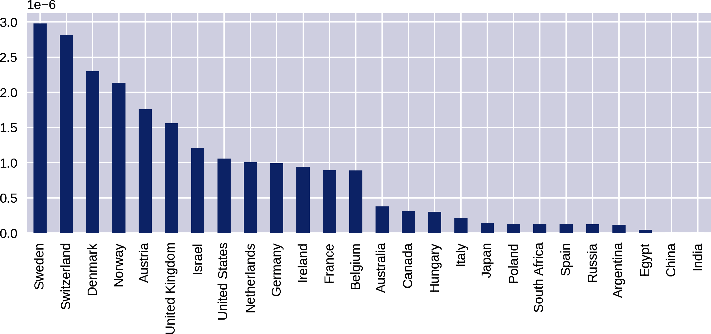

# 第十一章：利用 pandas 探索数据

在上一章中，我们清理了从维基百科中抓取的诺贝尔奖数据集，详见 第 6 章。现在是时候开始探索我们光鲜亮丽的新数据集了，寻找有趣的模式、可讲述的故事以及任何其他可以成为有趣可视化基础的东西。

首先，让我们尝试清空我们的思绪，认真地审视手头的数据，以获得对所建议可视化的整体概念。 Example 11-1 展示了诺贝尔数据集的形式，其中包含了分类、时间和地理数据。

##### 例 11-1\. 我们清理过的诺贝尔奖数据集

```py
[{
 'category': 'Physiology or Medicine',
 'date_of_birth': '8 October 1927',
 'date_of_death': '24 March 2002',
 'gender': 'male',
 'link': 'http://en.wikipedia.org/wiki/C%C3%A9sar_Milstein',
 'name': 'César Milstein'
 'country': 'Argentina',
 'place_of_birth': 'Bahía Blanca,  Argentina',
 'place_of_death': 'Cambridge , England',
 'year': 1984,
 'born_in': NaN
 },
 ...
 ]
```

Example 11-1 中的数据表明我们可能想要调查的一些 *故事*，其中包括：

+   奖项获得者之间的性别差异

+   国家趋势（例如，哪个国家在经济学领域获得了最多的奖项）

+   个别获奖者的详细信息，例如他们获奖时的平均年龄或预期寿命

+   利用 `born_in` 和 `country` 字段，从出生地到采纳国的地理旅程

这些调查性的行将成为接下来的部分的基础，这些部分将通过对数据集提出问题来探索数据集，比如“除了玛丽·居里之外，还有多少名女性获得了诺贝尔物理学奖？”，“哪些国家的奖项人均数量最多而不是绝对数量？”以及“是否有国家奖项的历史趋势，从旧（科学）世界（欧洲大国）到新（美国和即将崛起的亚洲国家）的交替？”在开始我们的探索之前，让我们准备好工具并加载我们的诺贝尔奖数据集。

# 开始探索

要开始我们的探索，让我们从命令行启动一个 Jupyter 笔记本：

```py
$ jupyter notebook
```

我们将使用 *神奇* 的 `matplotlib` 命令来启用内联绘图：

```py
%matplotlib inline
```

然后导入标准的数据探索模块集：

```py
import pandas as pd
import numpy as np
import matplotlib.pyplot as plt
import json
import matplotlib
import seaborn as sns
```

现在，我们将对绘图参数和图表的一般外观进行一些调整。确保在调整图形大小、字体和其他内容之前更改样式：

```py
matplotlib.style.use('seaborn') 

plt.rcParams['figure.figsize'] = (8, 4) 
plt.rcParams['font.size'] = '14'
```


我们将为我们的图表使用 seaborn 主题，这在美观程度上可能比 Matplotlib 的默认主题更具吸引力。


将默认绘图大小设置为八英寸乘四英寸。

在 第 9 章 的最后，我们将我们的清洁数据集保存为一个 JSON 文件。让我们将清洁的数据加载到 pandas DataFrame 中，准备开始探索。

```py
df = pd.read_json(open('data/nobel_winners_cleaned.json'))
```

让我们获取一些关于我们数据集结构的基本信息：

```py
df.info()

<class 'pandas.core.frame.DataFrame'>
RangeIndex: 858 entries, 0 to 857
Data columns (total 13 columns):
 #   Column          Non-Null Count  Dtype
---  ------          --------------  -----
 0   category        858 non-null    object
 1   country         858 non-null    object
 2   date_of_birth   858 non-null    object
 3   date_of_death   559 non-null    object
 4   gender          858 non-null    object
 5   link            858 non-null    object
 6   name            858 non-null    object
 7   place_of_birth  831 non-null    object
 8   place_of_death  524 non-null    object
 9   text            858 non-null    object
 10  year            858 non-null    int64
 11  award_age       858 non-null    int64
 12  born_in         102 non-null    object
 13  bio_image       770 non-null    object
 14  mini_bio        857 non-null    object
dtypes: int64(2), object(13)
memory usage: 100.7+ KB
```

请注意，我们的出生日期和死亡日期列具有标准的 pandas 数据类型 `object`。为了进行日期比较，我们需要将其转换为 datetime 类型 `datetime64`。我们可以使用 pandas 的 [`to_datetime` 方法](https://oreil.ly/jjcoR) 进行此转换：

```py
df.date_of_birth = pd.to_datetime(df.date_of_birth)
df.date_of_death = pd.to_datetime(df.date_of_death)
```

运行 `df.info()` 现在应该显示两个 datetime 列：

```py
df.info()

...
date_of_birth     858 non-null datetime64[ns, UTC] 
date_of_death     559 non-null datetime64[ns, UTC]
...
```


[UTC](https://oreil.ly/ZzSOR)（英文中的协调世界时）是世界上调整时钟和时间的主要时间标准。几乎总是希望按照这个标准工作。

`to_datetime`通常不需要额外的参数即可工作，并且如果给出非基于时间的数据，应该会抛出错误，但是值得检查转换后的列以确保。在我们的诺贝尔奖数据集的情况下，一切都很正常。

# 使用 pandas 进行绘图

pandas 的 Series 和 DataFrame 都有集成绘图功能，它包含了最常见的 Matplotlib 图表，我们在上一章中已经探讨过其中的一些。这使得在与 DataFrame 交互时轻松获得快速的视觉反馈。如果你想要可视化更复杂的内容，pandas 容器将与原始的 Matplotlib 很好地配合。你还可以使用标准的 Matplotlib 自定义来调整 pandas 生成的图形。

让我们看一个 pandas 集成绘图的例子，从一个基本的诺贝尔奖性别差异的绘图开始。众所周知，诺贝尔奖在各性别之间分配不均。让我们通过在*性别*类别上使用条形图来快速了解这种差异。示例 11-2 生成了图 11-1，显示了巨大的差异，男性在我们的数据集中获得了 858 项奖项中的 811 项。

##### 示例 11-2. 使用 pandas 的集成绘图查看性别差异

```py
by_gender = df.groupby('gender')
by_gender.size().plot(kind='bar')
```


###### 图 11-1. 按性别计算奖项数

在示例 11-2 中，通过性别组的`size`方法产生的 Series 有其自己的集成`plot`方法，它将原始数字转换为图表：

```py
by_gender.size()
Out:
gender
female     47
male      811
dtype: int64
```

除了默认的线图外，pandas 的`plot`方法还接受一个`kind`参数来选择其他可能的图。其中更常用的是：

+   `bar` 或 `barh`（*h* 表示水平）用于条形图

+   `hist` 用于直方图

+   `box` 用于箱线图

+   `scatter` 用于散点图

你可以在[文档中](https://oreil.ly/Zeo9f)找到 pandas 集成绘图的完整列表，以及一些以 DataFrame 和 Series 作为参数的 pandas 绘图函数。

让我们扩展对性别差异的调查，并开始扩展我们的绘图技能。

# 性别差异

让我们通过奖项类别来分析图 11-1 中显示的性别数字。pandas 的`groupby`方法可以接受一个列名列表进行分组，每个组可以通过多个键来访问：

```py
by_cat_gen = df.groupby(['category','gender'])

by_cat_gen.get_group(('Physics', 'female'))[['name', 'year']] 
```


使用`category`和`gender`键获取一个分组：

```py
Out:
                       name  year
269    Maria Goeppert-Mayer  1963
612  Marie Skłodowska-Curie  1903
```

使用`size`方法获取这些组的大小将返回一个带有`MultiIndex`的 Series，通过类别和性别标记值：

```py
by_cat_gen.size()
```

```py
Out:
category                gender
Chemistry               female      4
                        male      167
Economics               female      1
                        male       74
...
Physiology or Medicine  female     11
                        male      191
dtype: int64
```

我们可以直接绘制这个多索引的 Series，使用`hbar`作为`kind`参数以生成水平条形图。这段代码生成 图 11-2。

```py
by_cat_gen.size().plot(kind='barh')
```


###### 图 11-2. 绘制多关键组

图 11-2 有些粗糙，使得比较性别差距比应有的更难。让我们继续完善我们的图表，使这些差距更加明显。

## 组展开

图 11-2 并不是最容易阅读的图表，即使我们改进了条形的排序。幸运的是，pandas Series 有一个很酷的`unstack`方法，它接受多个索引（在本例中是性别和类别）并将它们用作列和索引，从而创建一个新的数据框。绘制此数据框将得到一个更加可用的图表，因为它比较了按性别获奖的奖品。以下代码生成图 11-3：

```py
by_cat_gen.size().unstack().plot(kind='barh')
```


###### 图 11-3\. 组大小的展开系列

图 11-3 显示了男性和女性获奖数量之间的巨大差异。让我们通过使用 pandas 生成一个显示按类别百分比的女性获奖者的图表，使数据更具体。我们还将按奖品数量对类别条进行排序。

首先，我们将展开`by_cat_gen`组以生成一个`cat_gen_sz`数据框：

```py
cat_gen_sz = by_cat_gen.size().unstack()
cat_gen_sz.head()
```

```py
gender      female  male
category
Chemistry        4   167
Economics        1    74
Literature      13    93
Peace           16    87
Physics          2   199
```

为了演示目的，我们将在两个阶段进行 pandas 操作，使用两列新数据存储我们的新数据。首先，我们将制作一个包含女性获奖者比例的列，与总获奖者数的比值：

```py
cat_gen_sz['ratio'] = cat_gen_sz.female /\ 
                     (cat_gen_sz.female + cat_gen_sz.male)
cat_gen_sz.head()
```


尴尬的斜杠阻止 Python 崩溃，但这是一个除法操作。

```py
ender      female  male     ratio
category
Chemistry        4   167  0.023392
Economics        1    74  0.013333
Literature      13    93  0.122642
Peace           16    87  0.155340
Physics          2   199  0.009950
```

有了比例列后，我们可以通过将该比例乘以 100 来创建一个包含女性获奖者百分比的列：

```py
cat_gen_sz['female_pc'] = cat_gen_sz['ratio'] * 100
```

让我们将这些女性百分比绘制在水平条形图上，设置 x 轴限制为 100%，并按奖项数量对类别进行排序：

```py
cat_gen_sz = cat_gen_sz.sort_values(by='female_pc', ascending=True)
ax = cat_gen_sz[['female_pc']].plot(kind='barh')
ax.set_xlim([0, 100])
ax.set_xlabel('% of female winners')
```

您可以在图 11-4 中看到新的图表，清楚地显示了按性别划分的奖项总数的差异。


###### 图 11-4\. 按奖项类别百分比的女性获奖者

忽略经济学，这是诺贝尔奖类别的最近而有争议的增加，图 11-4 显示物理学中男女获奖者数量最大的差距，只有两位女性获奖者。让我们提醒一下她们是谁：

```py
df[(df.category == 'Physics') & (df.gender == 'female')]\
    [['name', 'country','year']]
```

```py
Out:
                       name    country  year
269    Maria Goeppert-Mayer  United States  1963
612  Marie Skłodowska-Curie         Poland  1903
```

大多数人都听说过玛丽·居里，她实际上是两位诺贝尔奖获得者中的四位杰出人物之一，但很少有人听说过玛丽亚·歌柏·迈耶。^(1) 这种无知令人惊讶，考虑到鼓励女性从事科学的努力。我希望我的可视化能帮助人们发现并了解一点玛丽亚·歌柏·迈耶的事迹。

## 历史趋势

很有趣的是看看最近几年女性奖项分配是否有所增加。一种可视化的方法是随时间分组的条形图。让我们快速绘制一个图表，使用`unstack`，如图 11-3，但使用年份和性别列：

```py
by_year_gender = df.groupby(['year','gender'])
year_gen_sz = by_year_gender.size().unstack()
year_gen_sz.plot(kind='bar', figsize=(16,4))
```

图 11-5 是一个功能性的但难以阅读的绘图。可以观察到女性奖项分布的趋势，但图中存在许多问题。让我们利用 Matplotlib 和 pandas 卓越的灵活性来解决这些问题。


###### 图 11-5\. 按年份和性别分的奖项

我们需要做的第一件事是减少 x 轴标签的数量。默认情况下，Matplotlib 将为每个条形图或条形图组标记标签，在我们的百年奖项中会创建混乱的标签。我们需要的是根据需要稀疏化轴标签的能力。在 Matplotlib 中有多种方法可以做到这一点；我将展示我发现最可靠的方法。这是您将要重复使用的类型，因此将其放入专用函数中是有意义的。示例 11-3 展示了一个函数，用于减少我们 x 轴上的刻度。

##### 示例 11-3\. 减少 x 轴标签的数量

```py
def thin_xticks(ax, tick_gap=10, rotation=45):
    """ Thin x-ticks and adjust rotation """
    ticks = ax.xaxis.get_ticklocs() 
    ticklabels = [l.get_text()
                  for l in ax.xaxis.get_ticklabels()] 
    # Sets the new tick locations and labels at an interval
    # of tick_gap (default +10+):
    ax.xaxis.set_ticks(ticks[::tick_gap])
    ax.xaxis.set_ticklabels(ticklabels[::tick_gap],
                            rotation=rotation) 
    ax.figure.show()
```


获取当前条形图每个条或条组的 x 轴刻度位置和标签。


旋转标签以提高可读性，默认情况下是向上倾斜的对角线。

除了需要减少刻度的数量外，图 11-5 的 x 轴有一个不连续的范围，在第二次世界大战期间的 1939 年至 1945 年之间没有诺贝尔奖颁发。我们希望看到这样的间隙，因此需要手动设置 x 轴范围，以包含从诺贝尔奖开始到现在的所有年份。

当前未堆叠的组大小使用自动年份索引：

```py
by_year_gender = df.groupby(['year', 'gender'])
by_year_gender.size().unstack()
Out:
gender  female  male
year
1901       NaN     6.0
1902       NaN     7.0
...
2014         2.0    11.0
[111 rows x 2 columns]
```

为了查看奖项分布中的任何间隙，我们只需用包含全年份范围的新 Series 重新索引即可：

```py
new_index = pd.Index(np.arange(1901, 2015), name='year') 
by_year_gender = df.groupby(['year','gender'])
year_gen_sz = by_year_gender.size().unstack()
  .reindex(new_index) 
```


这里我们创建一个名为`year`的全范围索引，涵盖所有诺贝尔奖年份。


我们用新的连续索引替换我们的不连续索引。

图 11-5 的另一个问题是过多的条形图。虽然我们确实看到男性和女性条并排，但看起来混乱，还有混叠伪影。最好拥有专门的男性和女性图，但堆叠起来以便于轻松比较。我们可以使用我们在 “Axes and Subplots” 中看到的 subplot 方法，使用 pandas 数据但使用我们的 Matplotlib 知识自定义绘图。示例 11-4 展示了如何做到这一点，生成了 图 11-6 中的绘图。

##### 示例 11-4\. 按年份堆叠的性别奖项

```py
new_index = pd.Index(np.arange(1901, 2015), name='year')
by_year_gender = df.groupby(['year','gender'])

year_gen_sz = by_year_gender.size().unstack().reindex(new_index)

fig, axes = plt.subplots(nrows=2, ncols=1, 
            sharex=True, sharey=True, figsize=(16, 8)) 

ax_f = axes[0]
ax_m = axes[1]

fig.suptitle('Nobel Prize-winners by gender', fontsize=16)

ax_f.bar(year_gen_sz.index, year_gen_sz.female) 
ax_f.set_ylabel('Female winners')

ax_m.bar(year_gen_sz.index, year_gen_sz.male)
ax_m.set_ylabel('Male winners')

ax_m.set_xlabel('Year')
```


创建了两个轴，分别在二行一列的网格上。


我们将共享 x 轴和 y 轴，这将使得两个图之间的比较更加合理。


我们为轴的条形图 (`bar`) 方法提供了连续的年份索引和未堆叠的性别列。

通过我们对性别分布的调查，我们得出结论存在巨大的差异，但正如图 11-6 所示，近年来有所改善。此外，经济学作为一个离群值，在科学领域的差异最大。考虑到女性获奖者数量相对较少，在这里没有太多可以看到的东西。


###### 图 11-6\. 按年份和性别分布的奖项，分布在两个堆叠的坐标轴上

现在让我们来看看奖项赢得的国家趋势，看看是否有任何有趣的可视化信息。

# 国家趋势

在查看国家趋势的显而易见的起点是绘制奖项获得者的绝对数量。这在 pandas 的一行中很容易实现，这里为了便于阅读分开了：

```py
df.groupby('country').size().order(ascending=False)
        .plot(kind='bar', figsize=(12,4))
```

这产生了图 11-7，显示美国占据了奖项的主导地位。

奖品的绝对数量将有利于人口较多的国家。让我们看看更公平的比较，可视化每人均奖项。


###### 图 11-7\. 各国绝对奖项数目

## 每人均获奖者

奖项获得者的绝对数量将有利于较大的国家，这引发了一个问题，如果我们考虑到人口大小，这些数字如何叠加？为了测试每人均奖项的获得情况，我们需要将绝对奖项数量除以人口大小。在“获取诺贝尔数据可视化的国家数据”中，我们从网络上下载了一些国家数据，并将其存储为 JSON 文件。现在让我们检索它，并用它来制作相对于人口大小的奖项的图表。

首先，让我们获取国家组的大小，以国家名称为索引标签：

```py
nat_group = df.groupby('country')
ngsz = nat_group.size()
ngsz.index
Out:
Index([u'Argentina', u'Australia', u'Austria', u'Azerbaijan',...])
```

现在让我们将我们的国家数据加载到一个数据框中，并回顾它包含的数据：

```py
df_countries = pd.read_json('data/winning_country_data.json',\
                            orient='index')

df_countries.loc['Japan'] # countries indexed by name

Out:
gini                   38.1
name                  Japan
alpha3Code              JPN
area               377930.0
latlng        [36.0, 138.0]
capital               Tokyo
population        127080000
Name: Japan, dtype: object
```

我们的国家数据集已经索引到其 `name` 列。如果我们向其添加 `ngsz` 国家组大小系列，该系列也具有国家名称索引，则两者将根据共享的索引组合，为我们的国家数据添加一个新的 `nobel_wins` 列。然后，我们可以使用这一新列将其除以人口大小，创建一个 `nobel_wins_per_capita`：

```py
df_countries = df_countries.set_index('name')
df_countries['nobel_wins'] = ngsz
df_countries['nobel_wins_per_capita'] =\
    df_countries.nobel_wins / df_countries.population
```

现在，我们只需按照 `df_countries` 数据框的新 `nobel_wins_per_cap` 列进行排序，并绘制每人均诺贝尔奖的图表，生成图 11-8：

```py
df.countries.sort_values(by='nobel_wins_per_capita',\
    ascending=False).nobel_per_capita.plot(kind='bar',\
    figsize=(12, 4))
```


###### 图 11-8\. 每人均国家奖项数目

这显示加勒比海岛国圣卢西亚获得了第一名。作为诺贝尔奖获得者诗人[德里克·沃尔科特](https://oreil.ly/OOYBc)的故乡，其 17.5 万人口使其每人均诺贝尔奖数目高达。

让我们通过过滤那些获得超过两次诺贝尔奖的国家，来看看情况如何叠加：

```py
df_countries[df_countries.nobel_wins > 2]\
        .sort_values(by='nobel_wins_per_capita', ascending=False)\
        .nobel_wins_per_capita.plot(kind='bar')
```

图 11-9 中的结果显示，斯堪的纳维亚国家和瑞士的奖项数量超过了其应有的份额。



###### 图 11-9\. 人均国家奖项数量，过滤为三项或更多获奖

将国家奖项计数的度量方式从绝对值改为人均值会产生很大的差异。现在让我们稍微细化一下我们的搜索，并专注于奖项类别，寻找其中的有趣信息。

## 按类别分的奖项

让我们深入了解一下绝对奖项数据，并查看按类别获胜的情况。这将需要按国家和类别列进行分组，获取这些组的大小，展开生成的 Series，然后绘制生成的 DataFrame 的列。首先，我们通过国家和类别列获取我们的类别与国家组大小：

```py
nat_cat_sz = df.groupby(['country', 'category']).size()
.unstack()
nat_cat_sz
Out:
category     Chemistry  Economics  Literature  Peace  \...
country
Argentina            1        NaN         NaN      2
Australia          NaN          1           1    NaN
Austria              3          1           1      2
Azerbaijan         NaN        NaN         NaN    NaN
Bangladesh         NaN        NaN         NaN      1
```

然后我们使用 `nat_cat_sz` DataFrame 为六个诺贝尔奖类别生成子图：

```py
COL_NUM = 2
ROW_NUM = 3

fig, axes = plt.subplots(ROW_NUM, COL_NUM, figsize=(12,12))

for i, (label, col) in enumerate(nat_cat_sz.items()): 
    ax = axes[i//COL_NUM, i%COL_NUM] 
    col = col.order(ascending=False)[:10] 
    col = col.sort_values(ascending=True) 
    col.plot(kind='barh', ax=ax)
    ax.set_title(label)

plt.tight_layout() 
```


`items` 返回一个以 (列标签，列) 元组形式的 DataFrame 列的迭代器。


Python 3 引入了方便的 [整数除法](https://oreil.ly/X6QGK) 运算符 `//`，它返回除法的向下取整的整数值。


`order` 通过首先制作一个副本来对列的 Series 进行排序。它相当于 `sort(inplace=False)`。


将最大的 10 个国家去掉后，我们现在将顺序反转以制作条形图，该图自底向上绘制，将最大的国家放在顶部。


`tight_layout` 应该可以防止子图之间的标签重叠。如果您在使用 `tight_layout` 时遇到任何问题，请参阅 “标题和轴标签” 的末尾。

这会生成 图 11-10 中的图表。

图 11-10 中的一些有趣信息是，美国在经济奖项上的压倒性统治反映了二战后的经济共识，而法国在文学奖项上的领导地位。


###### 图 11-10\. 按国家和类别的奖项

## 奖项分配的历史趋势

现在我们知道了按国家的奖项统计数据，是否有任何有趣的历史趋势与奖项分配有关？让我们通过一些折线图来探索一下。

首先，让我们将默认字体大小增加到 20 点，以使图表标签更清晰可读：

```py
plt.rcParams['font.size'] = 20
```

我们将要查看的是按年份和国家的奖项分布情况，所以我们需要基于这两列创建一个新的未堆叠的 DataFrame。与以前一样，我们添加一个 `new_index` 来提供连续的年份：

```py
new_index = pd.Index(np.arange(1901, 2015), name='year')

by_year_nat_sz = df.groupby(['year', 'country'])\
    .size().unstack().reindex(new_index)
```

我们感兴趣的趋势是各国诺贝尔奖的累积总和。我们可以进一步探索各个类别的趋势，但现在我们将查看所有类别的总数。pandas 提供了一个方便的`cumsum`方法来做到这一点。让我们取美国列并绘制它：

```py
by_year_nat_sz['United States'].cumsum().plot()
```

这生成了图 11-11 中的图表。


###### 图 11-11\. 美国奖项获得者随时间的累积总和

线图中的间隙是`NaN`字段，即美国在某些年份没有获奖的年份。`cumsum`算法在这里返回`NaN`。让我们将这些填充为零以去除这些间隙：

```py
by_year_nat_sz['United States'].fillna(0)
    .cumsum().plot()
```

这生成了更干净的图表，显示在图 11-12 中。


###### 图 11-12\. 美国奖项获得者随时间的累积总和

让我们比较美国的获奖率与世界其他地区的获奖率：

```py
by_year_nat_sz = df.groupby(['year', 'country'])
    .size().unstack().fillna(0)

not_US = by_year_nat_sz.columns.tolist() 
not_US.remove('United States')

by_year_nat_sz['Not US'] = by_year_nat_sz[not_US].sum(axis=1) 
ax = by_year_nat_sz[['United States', 'Not US']]\
    .cumsum().plot(style=['-', '--']) 
```


获取国家列名称列表并移除美国。


使用我们的非美国国家名称列表创建一个`'Not_US'`列，对`not_US`列表中所有国家的奖项总和进行求和。


在 pandas 绘图中，默认情况下，线条是有颜色的。为了在印刷书籍中区分它们，我们可以使用`style`参数使一条线变为实线（*-*)，另一条线变为虚线（*--*），使用 Matplotlib 的线条样式（详见[文档](https://oreil.ly/dUw3x)）。

此代码生成了图 11-13 中显示的图表。


###### 图 11-13\. 美国与世界其他地区奖项总和比较

在`'Not_US'`的赢取数量显示出奖项多年来稳定增长的情况下，美国在二战结束后显示出急剧增长。让我们进一步调查一下，关注北美洲、欧洲和亚洲两到三个最大的赢家的地区差异：

```py
by_year_nat_sz = df.groupby(['year', 'country'])\
    .size().unstack().reindex(new_index).fillna(0)

regions =  ![1
    {'label':'N. America',
      'countries':['United States', 'Canada']},
    {'label':'Europe',
     'countries':['United Kingdom', 'Germany', 'France']},
    {'label':'Asia',
     'countries':['Japan', 'Russia', 'India']}
]

for region in regions: 
    by_year_nat_sz[region['label']] =\
        by_year_nat_sz[region['countries']].sum(axis=1)

by_year_nat_sz[[r['label'] for r in regions]].cumsum()\
  .plot(style=['-', '--', '-.']) # solid, dashed, dash-dotted line style 
```


通过选择三大洲中两到三个最大的赢家，我们创建了我们的大陆国家列表。


创建一个带有每个`regions`列表中的`dict`的区域标签的新列，总结其`countries`成员。


绘制所有新区域列的累积总和。

这给我们提供了图 11-14 中的图表。亚洲的奖项获得数量在多年来略有增加，但值得注意的主要是北美洲在 1940 年代中期前后的巨大增长，超过了在 1980 年代中期左右奖项总数下降的欧洲。


###### 图 11-14\. 按地区的历史奖项趋势

让我们通过总结 16 位最大获奖者（排除美国的离群值）的奖金比例来扩展先前的国家情节的详细信息：

```py
COL_NUM = 4
ROW_NUM = 4

by_nat_sz = df.groupby('country').size()
by_nat_sz.sort_values(ascending=False,\
    inplace=True)  

fig, axes = plt.subplots(COL_NUM, ROW_NUM,\ 
    sharex=True, sharey=True, 
    figsize=(12,12))

for i, nat in enumerate(by_nat.index[1:17]): 
    ax = axes[i/COL_NUM, i%ROW_NUM]
    by_year_nat_sz[nat].cumsum().plot(ax=ax) 
    ax.set_title(nat)
```


将我们的国家组按获奖总数从高到低排序。


获取具有共享 x 和 y 轴的 4×4 轴网格，用于归一化比较。


枚举从第二行（1）开始的排序索引，排除美国（0）。


选择 `nat` 国家名称列，并在网格轴 `ax` 上绘制其奖励的累积和。

这将生成 图 11-15，显示了一些历史上获奖率上升的国家，如日本，澳大利亚和以色列，而其他国家则趋于平稳。


###### 图 11-15. 美国之后排名前 16 位的国家获奖率

另一种总结国家奖励率随时间变化的好方法是使用热图，并按十年将总数划分。 seaborn 库提供了一个很好的热图。 让我们导入它，并使用其 `set` 方法通过缩放来增加其标签的字体大小：

```py
import seaborn as sns

sns.set(font_scale = 1.3)
```

数据分割成块也称为[*分箱*](https://oreil.ly/SkFSj)，因为它创建数据*箱*。 pandas 有一个方便的 `cut` 方法来完成这个任务，它接受一列连续值——在我们的情况下是诺贝尔奖年份——并返回指定大小的范围。 您可以将 DataFrame 的 `groupby` 方法与 `cut` 的结果一起使用，并将其按索引值范围分组。 以下代码生成 图 11-16：

```py
bins = np.arange(df.year.min(), df.year.max(), 10) 

by_year_nat_binned = df.groupby('country',\
    [pd.cut(df.year, bins, precision=0)])\ 
    .size().unstack().fillna(0)

plt.figure(figsize=(8, 8))

sns.heatmap(\
  by_year_nat_binned[by_year_nat_binned.sum(axis=1) > 2],\ 
  cmap='rocket_r') 
```


从 1901 年开始，获取我们的十年期间的区间（1901 年，1911 年，1921 年...）。


使用 `bins` 范围将我们的诺贝尔奖年份划分为十年，精度设置为 `0`，以给出整数年份。


在制作热图之前，我们先筛选出拥有两个以上诺贝尔奖的国家。


我们使用连续的 `rocket_r` 热图来突出显示差异。 查看 [seaborn 文档](https://oreil.ly/3FmHj) 中的所有 pandas 颜色调色板。

图 11-16 捕捉到一些有趣的趋势，比如俄罗斯在 1950 年代的短暂繁荣，到了 1980 年代就消退了。

现在我们已经调查了诺贝尔奖的国家，让我们将注意力转向个体获奖者。 使用手头的数据，我们能发现他们有什么有趣的事情吗？


###### 图 11-16. 各国诺贝尔奖获得情况按十年统计

# 获奖者的年龄和预期寿命

我们有所有获奖者的出生日期和 559 位获奖者的逝世日期。结合他们获奖的年份，我们有相当多的个人数据可以挖掘。让我们调查获奖者年龄的分布，并试图了解他们的长寿。

## 颁奖时的年龄

在第九章中，我们通过将获奖者的年龄减去他们的获奖年份，为诺贝尔奖数据集添加了一个 `'award_age'` 列。使用 pandas 的直方图绘制来评估这个分布是一个快速且简单的胜利：

```py
df['award_age'].hist(bins=20)
```

这里我们要求将年龄数据分成 20 个箱子。这产生了 Figure 11-17，显示 60 年代初是获奖的一个黄金期，如果你到了 100 岁还没有获奖，可能就不会发生了。请注意 20 岁左右的异常值，这是和平奖的 17 岁获奖者[马拉拉·尤萨夫扎伊](https://oreil.ly/8ft8y)。


###### 图 11-17\. 颁奖时年龄的分布

我们可以使用 seaborn 的 `displot` 来更好地了解分布情况，添加一个核密度估计（KDE）^(2)到直方图中。以下一行代码生成 Figure 11-18，显示我们的黄金年龄大约是 60 岁：

```py
sns.displot(df['award_age'], kde=True, height=4, aspect=2)
```


###### 图 11-18\. 颁奖时年龄的分布并叠加了 KDE

箱线图是可视化连续数据的一种好方法，显示四分位数，第一和第三个四分位数标记箱子的边缘，第二个四分位数（或中位数）标记在箱子内的线。通常，如图 Figure 11-19，水平的端线（称为须线端点）表示数据的最大值和最小值。让我们使用 seaborn 的箱线图，并按性别划分奖项：

```py
sns.boxplot(df, x='gender', y='award_age')
```

这产生了 Figure 11-19，显示按性别的分布相似，女性的平均年龄略低。请注意，由于女性获奖者较少，她们的统计数据更不确定。


###### 图 11-19\. 按性别分布的获奖者年龄

seaborn 的小提琴图结合了传统的箱线图和核密度估计，以更精细的方式显示年龄和性别的分布情况。以下代码生成 Figure 11-20：

```py
sns.violinplot(data=df, x='gender', y='award_age')
```


###### 图 11-20\. 小提琴图显示按性别分布的奖项年龄

## 获奖者的预期寿命

现在让我们看看诺贝尔奖获得者的长寿情况，通过他们的出生日期减去逝世日期。我们将这些数据存储在一个新的 `'age_at_death'` 列中：

```py
df['age_at_death'] = (df.date_of_death - df.date_of_birth)\
                     .dt.days/365 
```


`datetime64` 数据可以进行合理的加减操作，生成一个 pandas `timedelta` 列。我们可以使用它的 `dt` 方法获取以天为单位的间隔，将其除以 365 得到浮点数的死亡年龄。

我们复制 `'age_at_death'` 列，^(3) 删除所有空的 `NaN` 行。这可以用来制作 Figure 11-21 中显示的直方图和 KDE：

```py
age_at_death = df[df.age_at_death.notnull()].age_at_death 

sns.displot(age_at_death, bins=40, kde=True, aspect=2, height=4)
```


删除所有的 `NaN` 以清理数据并减少绘图错误（例如，`distplot` 在有 `NaN` 的情况下会失败）。


###### Figure 11-21\. 诺贝尔奖获得者的寿命期望

Figure 11-21 展示了诺贝尔奖获得者是一群寿命异常长的人，平均寿命在 80 岁左右。这更加令人印象深刻，因为大多数获奖者都是男性，在一般人口中男性的平均寿命显著较低^(4)。导致这种长寿的一个因素是我们早些看到的选择偏差。诺贝尔奖获得者通常直到他们五六十岁才受到尊敬，这排除了那些没有机会被认可的亚群体，从而提高了长寿的数据。

Figure 11-21 展示了一些长寿者在获奖者中。让我们找找看：

```py
df[df.age_at_death > 100][['name', 'category', 'year']]
Out:
                     name                category  year
101          Ronald Coase               Economics  1991
328   Rita Levi-Montalcini  Physiology or Medicine 1986
```

现在让我们叠加几个 KDE 来展示男性和女性获奖者的死亡率差异：

```py
df_temp = df_temp[df.age_at_death.notnull()] 
sns.kdeplot(df_temp[df_temp.gender == 'male']
    .age_at_death, shade=True, label='male')
sns.kdeplot(df_temp[df_temp.gender == 'female']
    .age_at_death, shade=True, label='female')

plt.legend()
```


创建一个只包含有效 `'age_at_death'` 字段的 DataFrame。

这产生了 Figure 11-22，尽管女性获奖者数量较少且分布较为平坦，显示男性和女性的平均值接近。相比一般人群，女性诺贝尔奖获得者似乎活得相对较短。


###### Figure 11-22\. 获奖者的寿命期望值按性别划分

一张小提琴图提供了另一种视角，如 Figure 11-23 所示：

```py
sns.violinplot(data=df, x='gender', y='age_at_death',\
               aspect=2, height=4)
```


###### Figure 11-23\. 获奖者的寿命期望值按性别划分

## 随着时间的推移，寿命期望值增加

让我们通过看看我们的诺贝尔奖获得者的出生日期和他们的寿命期望之间是否有相关性，做一点历史人口统计分析。我们将使用 seaborn 的 `lmplot` 之一提供散点图和带有置信区间的线性拟合（参见 “seaborn”）：

```py
df_temp = df[df.age_at_death.notnull()] 
data = pd.DataFrame( 
    {'age at death':df_temp.age_at_death,
     'date of birth':df_temp.date_of_birth.dt.year})
sns.lmplot(data=data, x='date of birth', y='age at death',
  height=6, aspect=1.5)
```


创建一个临时 DataFrame，删除所有没有 `'age_at_death'` 字段的行。


创建一个新的 DataFrame，只包含来自精炼的 `df_temp` 的两列感兴趣的内容。我们只从 `date_of_birth` 中获取年份，使用其 [`dt` accessor](https://oreil.ly/hGULX)。

这产生了图 11-24，显示奖项期间预期寿命增加了约十年。


###### 图 11-24\. 出生日期与去世年龄的相关性

# 诺贝尔流亡者

在清理我们的诺贝尔奖数据集时（见第九章），我们发现有重复条目记录了获奖者出生地和获奖时的国家。我们保留了这些信息，共有 104 名获奖者，其获奖时的国家与出生国不同。这其中是否有故事？

从获奖者的出生国到其所选国的移动模式的良好可视化方法是使用热图来显示所有 `born_in`/`country` 对。以下代码生成了图 11-25 中的热图：

```py
by_bornin_nat = df[df.born_in.notnull()].groupby(\ 
    ['born_in', 'country']).size().unstack()
by_bornin_nat.index.name = 'Born in' 
by_bornin_nat.columns.name = 'Moved to'
plt.figure(figsize=(12, 12))

ax = sns.heatmap(by_bornin_nat, vmin=0, vmax=8, cmap="crest",\ 
                 linewidth=0.5)
ax.set_title('The Nobel Diaspora')
```


选择所有具有 `'born_in'` 字段的行，并根据此字段和国家列进行分组。


我们重新命名行索引和列名，使它们更具描述性。


seaborn 的 `heatmap` 尝试设置正确的数据边界，但在这种情况下，我们必须手动调整限制 (`vmin` 和 `vmax`) 以查看所有单元格。


###### 图 11-25\. 诺贝尔奖流亡现象

图 11-25 显示了一些有趣的模式，讲述了迫害和庇护的故事。首先，美国是重新安置的诺贝尔奖获得者的主要接收国，其次是英国。请注意，两者（除了来自加拿大的跨国移民）的最大派系都来自德国。意大利、匈牙利和奥地利是下一个最大的群体。检查这些群体中的个体表明，大多数是由于二战前纳粹反犹太少数民族政权的崛起和对犹太人的迫害而被迫流离失所的。

举个例子，所有四位从德国移居到英国的诺贝尔奖获得者都是具有犹太血统的德国研究科学家，他们是对纳粹兴起作出反应而迁移：

```py
df[(df.born_in == 'Germany') & (df.country == 'United Kingdom')]
    [['name', 'date_of_birth', 'category']]

Out:
                    name date_of_birth                category
119  Ernst Boris Chain    1906-06-19  Physiology or Medicine
484   Hans Adolf Krebs    1900-08-25  Physiology or Medicine
486           Max Born    1882-12-11                 Physics
503       Bernard Katz    1911-03-26  Physiology or Medicine
```

恩斯特·恩·查恩（Ernst Chain）开创了盘尼西林的工业生产。汉斯·克雷布斯（Hans Krebs）发现了克雷布斯循环，这是生物化学中最重要的发现之一，调节细胞的能量产生。马克斯·玻恩（Max Born）是量子力学的先驱之一，伯纳德·卡茨（Bernard Katz）揭示了神经元突触连接的基本特性。

在获奖的移民中有许多如此显赫的名字。一个有趣的发现是参与著名[Kindertransport](https://oreil.ly/tIzjj)行动的奖项获得者数量，这是第二次世界大战爆发前九个月进行的一次组织营救行动，将德国、奥地利、捷克斯洛伐克和波兰的一万名犹太儿童运送到英国。这些儿童中有四人后来获得了诺贝尔奖。

# 总结

在这一章中，我们探索了我们的诺贝尔奖数据集，分析了性别、类别、国家和奖励年份等关键字段，寻找可以讲述或视觉化的有趣趋势和故事。我们使用了大量的 Matplotlib（通过 pandas）和 seaborn 的图表，从基本的条形图到更复杂的统计摘要，如小提琴图和热图。精通这些工具以及 Python 图表库中的其他工具，将使您能够快速了解数据集的感觉，这是围绕它们构建可视化的先决条件。我们在数据中找到了足够多的故事，建议进行网络可视化。在下一章中，我们将想象并设计一个诺贝尔奖获奖者的可视化作品，挑选出本章获得的宝贵经验。

^(1) 据传，我个人询问过的或者在演讲观众中询问过的人，没有一个知道物理学领域另一位女性诺贝尔奖得主的名字。

^(2) 详细信息请参阅[Wikipedia](https://oreil.ly/DUd3e)。基本上，数据经过平滑处理并推导出概率密度函数。

^(3) 在从天数推导年份时，我们忽略了闰年和其他微妙的复杂因素。

^(4) 根据国家的不同，这大约是五到六年时间。请参阅[Our World in Data](https://oreil.ly/6xY9W)获取一些统计数据。
