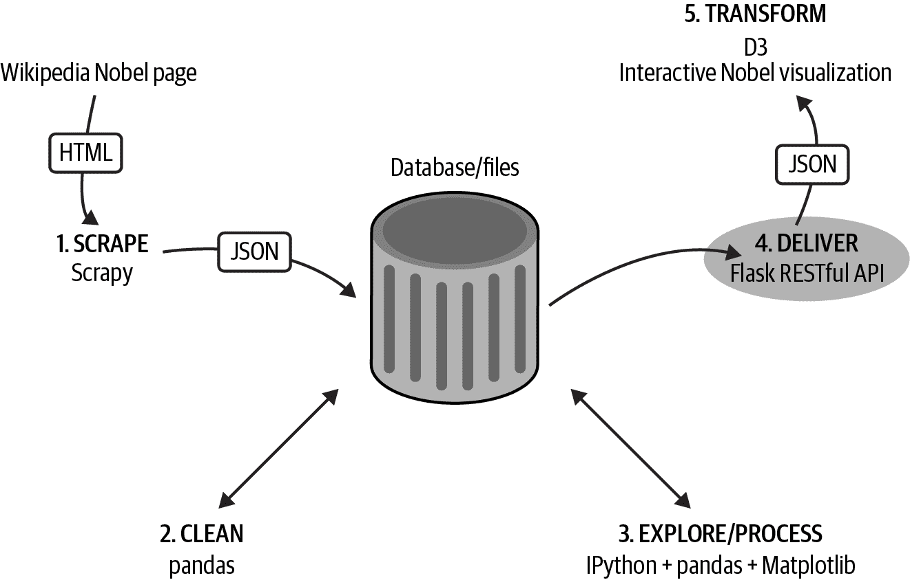

# 第十三章：第 IV 部分：数据交付

在本书的这一部分中，我们将看到如何将我们选择的诺贝尔奖数据集交付给浏览器，在其中 JavaScript 和 D3 将把它转化为一个引人入胜的、交互式的可视化（参见图 IV-1）。

使用 Python 这样的通用库的好处是，您可以轻松地在几行简洁而令人印象深刻的代码中构建 Web 服务器，就像使用强大的数据处理库来挖掘数据一样容易。

我们工具链中的关键服务器工具是 Flask，这是 Python 中强大但轻量级的 Web 框架。在第十二章中，我们将看到如何静态地提供您的数据（提供系统文件），以及动态地提供数据，通常是作为请求中指定的数据库选择。在第十三章中，我们将看到两个基于 Flask 的库如何使创建 RESTful Web API 只需几行 Python 代码即可完成。

###### 图 IV-1. 数据交付

###### 提示

您可以在[书的 GitHub 仓库](https://github.com/Kyrand/dataviz-with-python-and-js-ed-2)找到本书这部分的代码。
