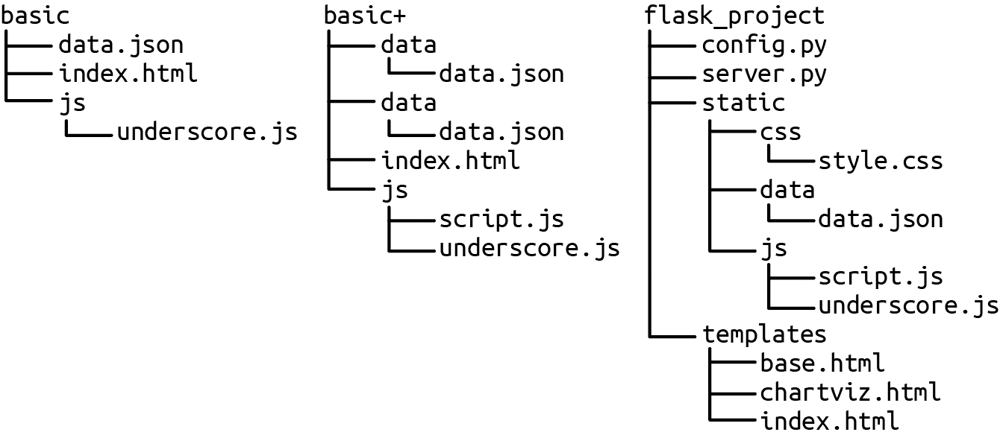
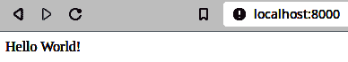
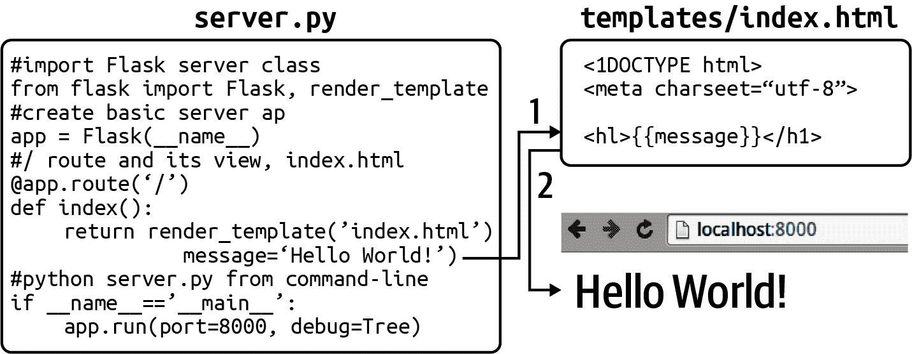
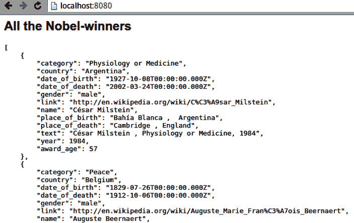
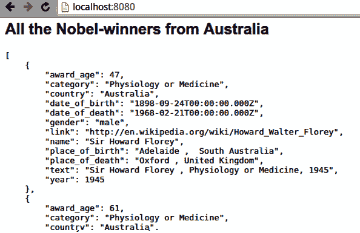

# 第十二章：传递数据

第六章展示了如何使用网络爬虫从网上获取你感兴趣的数据。我们使用 Scrapy 获取了一个诺贝尔奖获得者的数据集，然后在第九章和第十一章中使用 pandas 对诺贝尔奖数据集进行了清洗和探索。

本章将向你展示如何从 Python 服务器静态或动态地将数据传递到客户端浏览器的 JavaScript，以我们的诺贝尔奖数据集为例。这些数据以 JSON 格式存储，包含一个诺贝尔奖获得者对象列表，就像在例子 12-1 中所示的那样。

##### 例子 12-1。我们的诺贝尔奖 JSON 数据，被爬取然后清洗

```py
[
  {
    "category": "Physiology or Medicine",
    "country": "Argentina",
    "date_of_birth": "1927-10-08T00:00:00.000Z",
    "date_of_death": "2002-03-24T00:00:00.000Z",
    "gender": "male",
    "link": "http:\/\/en.wikipedia.org\/wiki\/C%C3%A9sar_Milstein",
    "name": "C\u00e9sar Milstein",
    "place_of_birth": "Bah\u00eda Blanca ,  Argentina",
    "place_of_death": "Cambridge , England",
    "text": "C\u00e9sar Milstein , Physiology or Medicine, 1984",
    "year": 1984,
    "award_age": 57,
    "born_in": "",
    "bio_image": "full/6bf65058d573e07b72231407842018afc98fd3ea.jpg",
    "mini_bio": "<p><b>César Milstein</b>, <a href='http://en.w..."
  }
  ['...']
]
```

就像本书的其余部分一样，重点是尽量减少 Web 开发的量，这样你就可以专注于在 JavaScript 中构建 Web 可视化。

###### 提示

一个好的经验法则是尽量使用 Python 进行尽可能多的数据操作——这比在 JavaScript 中进行等效操作要少痛苦得多。由此而来，传递的数据应尽可能接近它将被消费的形式（即对于 D3，这通常是一个包含对象的 JSON 数组，就像我们在第九章中生成的那样）。

# 提供数据

你需要一个 Web 服务器来处理浏览器发来的 HTTP 请求，用于构建网页的初始静态 HTML 和 CSS 文件，以及任何后续的 AJAX 请求数据。在开发过程中，该服务器通常运行在 localhost 的某个端口上（在大多数系统上，这个 IP 地址是 127.0.0.1）。按照惯例，*index.xhtml* HTML 文件用于初始化网站或我们的情况下，构成我们 Web 可视化的[单页面应用（SPA）](https://oreil.ly/23h3Y)。

使用单行服务器为可视化原型设计和构思提供服务可能是合适的，但无法控制基本的服务器功能，如 URL 路由或动态模板的使用。幸运的是，Python 有一个很棒的小型 Web 服务器，提供了 Web 可视化器所需的所有功能，而不会牺牲我们旨在最大程度减少 Python 处理数据与 JavaScript 可视化杰作之间模板代码的目标。Flask 就是这个小型 Web 服务器，是我们最佳工具链中的一个值得推荐的补充。

## 组织你的 Flask 文件

如何组织项目文件是那些经常被忽视的非常有用的信息之一，可能是因为在教程中很容易变得主观化，而且最终归根结底，这是个人偏好。尽管如此，良好的文件组织确实能带来很多好处，尤其是当你开始合作时。

图 12-1 提供了一个大致的想法，即在从使用一个标记为`basic`的单行服务器的基本数据可视化 JavaScript 原型转移到使用一个标记为`basic+`的更复杂项目，再到一个典型的简单 Flask 设置标记为`flask_project`时，应该将文件放在哪里。



###### 图 12-1\. 组织您的服务器项目文件

文件组织的关键是一致性。在过程记忆中，文件的位置对帮助是极大的。

## 使用 Flask 提供数据

如果您正在使用 Python 的 Anaconda 包（请参阅第一章），那么 Flask 已经可用。否则，简单的`pip`安装应该可以让其可用：

```py
$ pip install Flask
```

手头有了 Flask 模块，我们可以用几行代码设置一个服务器，用来提供一个通用的编程问候：

```py
# server.py
from flask import Flask
app = Flask(__name__)

@app.route("/") 
def hello():
    return "Hello World!"

if __name__ == "__main__":
    app.run(port=8000, debug=True) 
```


Flask 路由允许您指导网络流量。这是根路由（即，*http://localhost:8000*）。


设置本地主机端口，服务器将在此端口上运行（默认为 5000）。在调试模式下，Flask 会向屏幕提供有用的日志记录，并在错误发生时提供基于浏览器的报告。

现在，只需转到包含*nobel_viz.py*的目录，并运行该模块：

```py
$ python server.py
 * Serving Flask app 'server' (lazy loading)
 * Environment: production
   WARNING: This is a development server. Do not use it in a production deployment.
   Use a production WSGI server instead.
 * Debug mode: off
 * Running on http://127.0.0.1:8000/ (Press CTRL+C to quit)
```

现在，您可以转到您选择的网络浏览器，并查看在图 12-2 中显示的强调结果。



###### 图 12-2\. 一个简单的消息提供给浏览器

正如我们将在“使用 Flask API 提供动态数据”中看到的，Flask 路由的模式匹配使得轻松实现简单的 Web API 成为可能。还可以使用模板来生成动态网页，如图 12-4 所示。模板在组成基本静态 HTML 页面时非常有用，但通常会使用 JavaScript 构建可视化效果。在 JavaScript 中配置可视化效果时，服务器的主要工作（除了提供种子过程所需的静态文件之外）是通过 AJAX 请求动态地处理数据。



###### 图 12-4\. (1) 使用一个*message*变量创建一个网页模板，然后 (2) 将其提供给浏览器

Flask 完全能够提供完整的网站，具有强大的 HTML 模板化功能，用于模块化大型站点的[蓝图](https://oreil.ly/Y1PxL)和支持常见使用模式的插件和扩展。[Flask 用户指南](https://oreil.ly/aoqYy)是学习更多内容的良好起点，API 的具体信息可以在[指南的这一小节](https://oreil.ly/kpFpw)中找到。大多数 Web 可视化的单页面应用不需要大量的服务器端功能来交付必要的静态文件。我们对 Flask 的关键兴趣在于其提供简单高效的数据服务器，几行 Python 代码即可实现强大的 RESTful Web API。但在涉足数据 API 之前，让我们先看看如何交付和使用基于文件的数据资产，如 JSON 和 CSV 文件。

# 交付数据文件

许多不需要动态配置数据开销的网站选择以*静态*形式提供它们的数据，这基本上意味着所有 HTML 文件和关键的数据（通常是 JSON 或 CSV 格式）作为文件存在于服务器文件系统中，可以直接交付，例如，无需调用数据库。

静态页面易于缓存，这意味着它们的交付速度可以更快。它还可能更安全，因为那些数据库调用可以是恶意黑客的常见攻击向量（例如，[注入攻击](https://oreil.ly/SY92s)）。为了获得这种增加的速度和安全性所付出的代价是灵活性的丧失。限制在预组装页面集合上意味着禁止可能需要多变数据组合的用户交互。

对于初学者的数据可视化者，提供静态数据具有吸引力。您可以轻松创建一个独立的项目，无需 Web API，并且可以将您的工作（进行中）作为一个包含 HTML、CSS 和 JSON 文件的单个文件夹交付。

使用静态文件进行数据驱动的 Web 可视化的最简单示例可能是在[*https://bl.ocks.org/mbostock*](https://bl.ocks.org/mbostock)上看到的许多酷炫的 D3 示例。它们遵循与我们在“具有占位符的基本页面”中讨论的基本页面类似的结构。

虽然示例中使用`<script>`和`<style>`标签将 JavaScript 和 CSS 嵌入 HTML 页面，但我建议将 CSS 和 JavaScript 保留在单独的文件中，这样可以获得良好的格式感知编辑器和更容易的调试。

示例 12-2 展示了一个包含`<h2>`和`<div>`数据占位符以及加载本地*script.js*文件的*index.xhtml*基本页面。由于我们只设置了`font-family`样式，所以我们将在页面中内联 CSS。在*data*子目录中使用我们的*nobel_winners.json*数据集，这给我们带来以下文件结构：

```py
viz
├── data
│   └── nobel_winners.json
├── index.xhtml
└── script.js
```

##### 示例 12-2\. 带有数据占位符的基本 HTML 页面

```py
<!DOCTYPE html>
<meta charset="utf-8">

<style>
  body{ font-family: sans-serif; }
</style>

<h2 id='data-title'></h2>
<div id='data'>
    <pre></pre>
</div>

<script src="lib/d3.v7.min.js"></script>
<script src="script.js"></script>
```

这些示例的静态数据文件包含在一个单独的 JSON 文件（*nobel_winners.json*），位于*data*子目录中。消费这些数据需要通过 JavaScript 进行一个[AJAX](https://oreil.ly/5w6MQ)调用到我们的服务器。D3 提供了方便的库来进行 AJAX 调用，D3 的特定格式的`json`、`csv`和`tsv`方法对于 Web 可视化程序非常方便。

示例 12-3 展示了如何使用 D3 的`json`方法通过回调函数加载数据。在幕后，D3 使用 JavaScript 的[Fetch API](https://oreil.ly/D5wut)来获取数据。这返回一个 JavaScript 的[Promise](https://oreil.ly/K570a)，可以使用其`then`方法解析，返回数据，除非发生错误。

##### 示例 12-3\. 使用 D3 的`json`方法加载数据

```py
d3.json("data/nobel_winners_cleaned.json")
  .then((data) => {
  d3.select("h2#data-title").text("All the Nobel-winners");
  d3.select("div#data pre").html(JSON.stringify(data, null, 4)); 
});
```


JavaScript 的[`JSON.stringify`方法](https://oreil.ly/65ZTd)是一种方便的方法，可以使 JavaScript 对象输出漂亮。在这里，我们插入一些空格以使输出缩进四个空格。

如果你在*viz*目录中运行一个单行服务器（例如，`python -m http.server`）并在浏览器中打开本地主机页面，你应该会看到类似于图 12-5，表明数据已成功传递给 JavaScript，准备好被可视化。



###### 图 12-5\. 将 JSON 传递给浏览器

我们正在使用的*nobel_winners.json*数据集并不是特别大，但是如果我们开始添加传记正文或其他文本数据，它很容易会增长到超出浏览器带宽限制并且使用户等待变得不舒服的程度。限制加载时间的一种策略是根据其中一个维度将数据分解为子集。对于我们的数据来说，显而易见的方法是按国家存储获奖者。几行 pandas 代码就可以创建一个合适的*data*目录：

```py
import pandas as pd

df_winners = pd.read_json('data/nobel_winners.json')

for name, group in df_winners.groupby('country'): 
    group.to_json('data/winners_by_country' + name + '.json',\
                  orient='records')
```


将获奖者 DataFrame 按`country`分组，并迭代组名和成员。

这应该给我们一个`winners_by_country` *data*子目录：

```py
$ ls data/winners_by_country
Argentina.json  Azerbaijan.json      Canada.json
Colombia.json   Czech Republic.json  Egypt.json  ...
```

现在，我们可以使用一个小小的定制函数按国家消费我们的数据：

```py
let loadCountryWinnersJSON = function (country) {
    d3.json("data/winners_by_country/" + country + ".json")
      .then(function (data) {
        d3.select("h2#data-title").text(
          "All the Nobel-winners from " + country
        );
        d3.select("div#data pre").html(JSON.stringify(data, null, 4));
      })
      .catch((error) => console.log(error));
  };
```

以下函数调用将选择所有澳大利亚的诺贝尔奖获得者，生成图 12-6：

```py
loadCountryWinnersJSON('Australia');
```



###### 图 12-6\. 按国家选择获奖者

对于正确的可视化，通过国家选择获奖者可以减少数据带宽和随后的延迟，但是如果我们想按年份或性别获取获奖者呢？每个维度（分类、时间等）的分割都需要自己的子目录，从而创建文件的混乱和所有相关的簿记工作。如果我们想对数据进行精细的请求（例如，自 2000 年以来所有美国的奖项获得者）怎么办？在这一点上，我们需要一个可以动态响应此类请求的数据服务器，通常由用户交互驱动。接下来的部分将向您展示如何开始使用 Flask 制作这样的服务器。

# 使用 Flask APIs 实现动态数据

通过 JSON 或 CSV 文件向网页传递数据是许多令人印象深刻的数据可视化示例的基础，也非常适合小型演示和原型。但是，在表单方面存在一些约束，最明显的是可以实际传递的数据集大小。随着数据集的增大和文件开始超过几兆字节，页面加载变慢，用户在旋转加载器的每次旋转时会越来越沮丧。对于大多数数据可视化，特别是仪表板或探索性图表，根据需要和响应用户界面生成的用户请求传递数据是有意义的。对于这种数据传递，一个小型数据服务器通常非常适合工作，并且 Python 的 Flask 拥有您制作这些内容所需的一切。

如果我们要动态地提供数据，我们需要某种 API 来让我们的 JavaScript 请求数据。

## 用 Flask 构建简单的数据 API

使用 Dataset（参见 “使用 Dataset 更轻松的 SQL”），我们可以轻松地为 SQL 数据库调整我们现有的服务器。在这里，我们为了方便使用 Dataset 和专用的 JSON 编码器（参见 示例 3-2），将 Python datatimes 转换为 JSON 友好的 ISO 字符串：

```py
# server_sql.py
from flask import Flask, request, abort
import dataset
import json
import datetime

app = Flask(__name__)
db = dataset.connect('sqlite:///data/nobel_winners.db')

@app.route('/api/winners')
def get_country_data():
    print 'Request args: ' + str(dict(request.args))
    query_dict = {}
    for key in ['country', 'category', 'year']: 
        arg = request.args.get(key) 
        if arg:
            query_dict[key] = arg

    winners = list(db['winners'].find(**query_dict)) 
    if winners:
        return dumps(winners)
    abort(404) # resource not found

class JSONDateTimeEncoder(json.JSONEncoder): 
    def default(self, obj):
        if isinstance(obj, (datetime.date, datetime.datetime)):
            return obj.isoformat()
        else:
            return json.JSONEncoder.default(self, obj)

def dumps(obj):
    return json.dumps(obj, cls=JSONDateTimeEncoder)

if __name__=='__main__':
    app.run(port=8000, debug=True)
```


限制我们数据库查询的键在这个列表中。


`request.args` 让我们能够访问请求的参数（例如，`'?country=Australia&category=Chemistry'`）。


`dataset` 的 `find` 方法要求我们的参数字典使用 ** 解包（即 `find(country='Australia', category='Literature')`）。我们将迭代器转换为列表，以便进行序列化。


这是在 示例 3-2 中详细介绍的专用 JSON 编码器。

在启动服务器后，我们可以用 [curl](https://curl.se) 测试这个小小的 API (`python server_sql.py`)。让我们获取所有日本的物理学奖获得者：

```py
$ curl -d category=Physics -d country=Japan
  --get http://localhost:8000/api/

[{"index": 761, "category": "Physics", "country": "Japan",
"date_of_birth": "1907-01-23T00:00:00", "date_of_death": "1981-09-08T00:00:00",
"gender": "male", "link": "http://en.wikipedia.org/wiki/Hideki_Yukawa",
"name": "Hideki Yukawa", "place_of_birth": "Tokyo ,  Japan",
"place_of_death": "Kyoto ,  Japan", "text": "Hideki Yukawa , Physics, 1949",
"year": 1949, "award_age": 42}, {"index": 762, "category": "Physics",
"country": "Japan", "date_of_birth": "1906-03-31T00:00:00",
"date_of_death": "1979-07-08T00:00:00", "gender": "male", ... }]
```

现在您已经看到了开始创建简单 API 有多么容易。有很多方法可以扩展它，但是对于快速而肮脏的原型设计，这是一个非常方便的形式。

但是，如果您想要分页、认证以及诸如此类的复杂 RESTful API 所提供的其他功能呢？在下一章中，我们将看到如何将我们简单的数据 API 扩展为更强大和可扩展的东西，使用一些出色的 Python 库，如 marmalade。

# 使用静态或动态交付

何时使用静态或动态交付很大程度上取决于上下文，并且是一个不可避免的妥协。带宽在不同地区和设备上有所不同。例如，如果您正在开发一个可从农村环境中的智能手机访问的可视化效果，那么数据限制与内部数据应用程序在本地网络上运行时的情况大不相同。

用户体验是最终指南。如果在数据缓存的开始稍等片刻可以获得闪电般快速的 JavaScript 数据可视化，那么纯静态交付可能是答案。如果允许用户剪切和切片大型多变量数据集，则可能需要耐心等待。粗略的经验法则是，任何小于 200 KB 的数据集在纯静态交付下应该都没问题。随着数据量增加到兆字节及以上，您可能需要一个数据库驱动的 API 来获取数据。

# 概要

本章介绍了在 Web 服务器上静态数据传递文件的基础知识，以及动态数据传递，勾勒出基于简单 Flask 的 RESTful Web 服务器的基础。虽然 Flask 使得创建基本数据 API 变得非常轻松，但添加分页、选择性数据查询和 HTTP 动词的全套功能需要更多的工作。在本书的第一版中，我转向了一些现成的 Python RESTful 库，但这些库往往很快就会过时，可能是因为可以如此轻松地串联一些单一用途的 Python 库来实现相同的目标，并具有更高的灵活性。这也是学习这些工具的好方法，因此，建立一个正是这样的 RESTful API 是下一章的主题。

^(1) 迈克·博斯托克，D3 的创造者，是一个例子的强烈支持者。在这里有一个[精彩的演讲](https://oreil.ly/QsMfK)，他强调了例子在 D3 成功中所起的作用。
