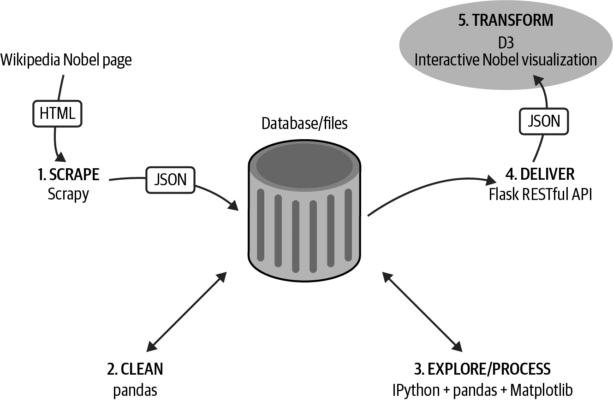

# 第五部分：使用 D3 和 Plotly 可视化您的数据

在本书的这一部分，我们利用在第六章从网络上抓取并在第九章清理的辛苦获取的诺贝尔奖数据集，利用基于 Python 和 JS 的 Plotly 库和 D3 这个重量级的 JS 数据可视化库，将其转化为现代、引人入胜、交互式的 Web 可视化。

我们将详细介绍 D3 诺贝尔奖数据可视化的实现过程，随着学习过程中获取 D3 和 JavaScript 知识。首先，让我们利用在第十一章获得的见解，想象一下我们的可视化应该是什么样子。

您可以在本书的 GitHub 仓库的*nobel_viz*目录中找到这个可视化的 Python 和 JavaScript 源代码（有关详细信息，请参见“附带的代码”）。

###### 图 V-1\. 我们的数据可视化工具链：获取数据

###### 提示

您可以在[书籍的 GitHub 仓库](https://github.com/Kyrand/dataviz-with-python-and-js-ed-2)找到本书这部分的代码。
