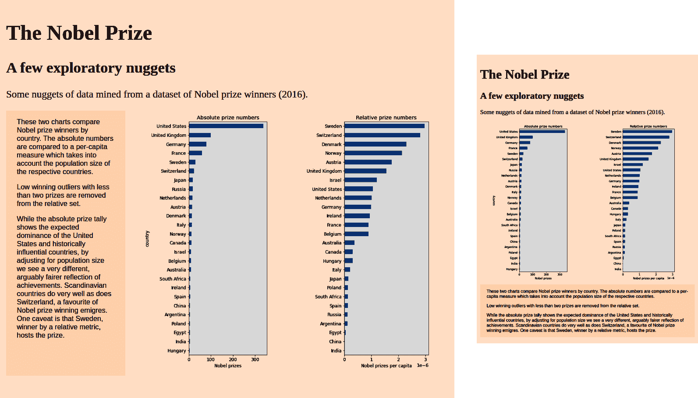
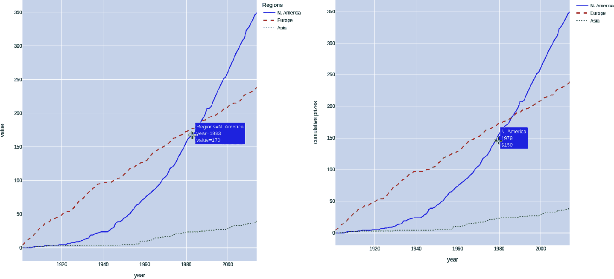
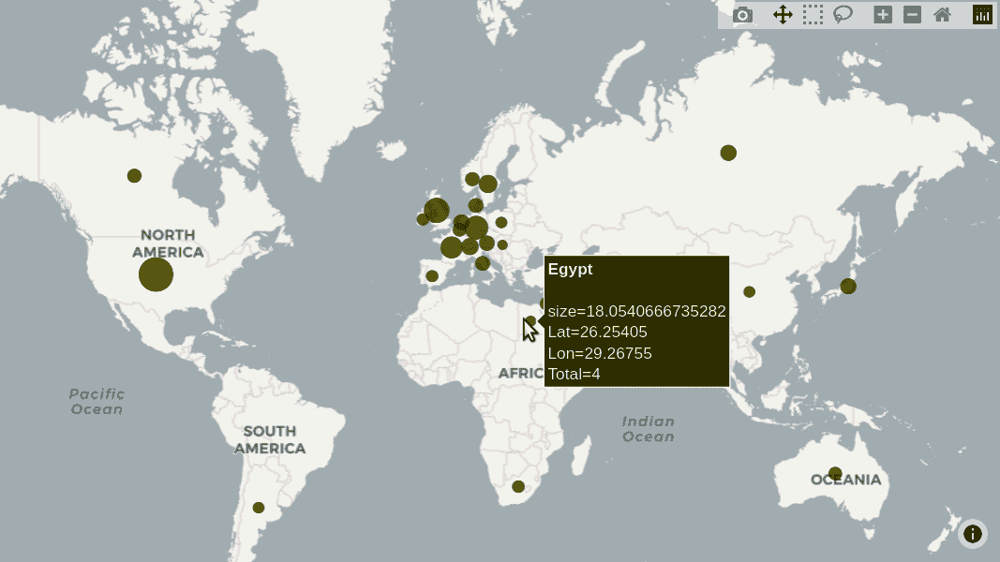
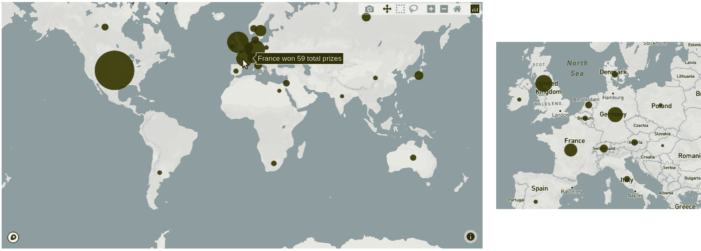
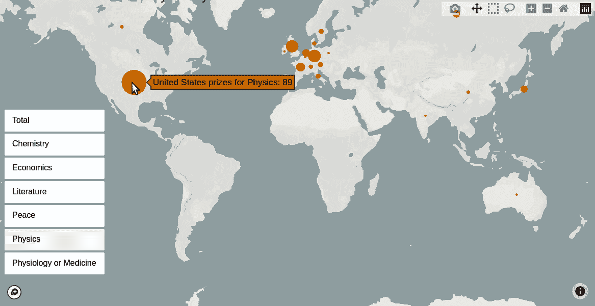
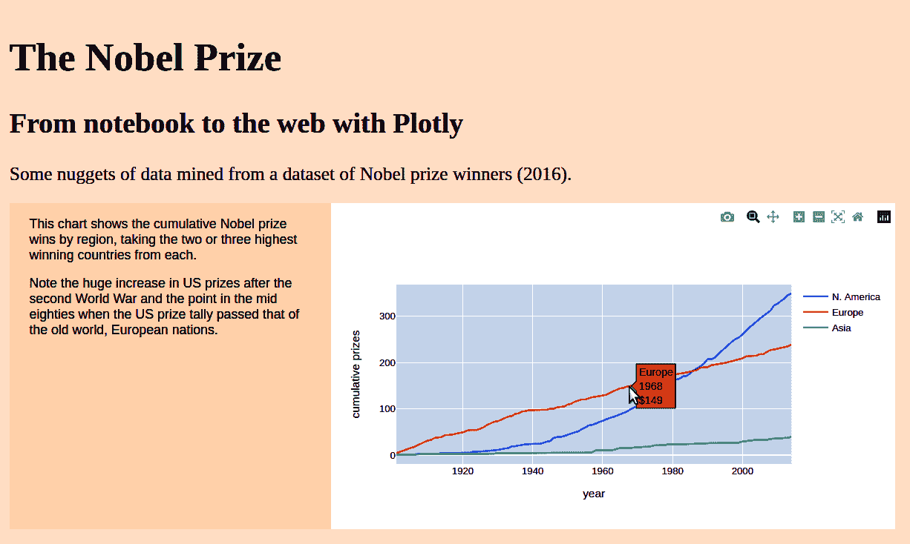
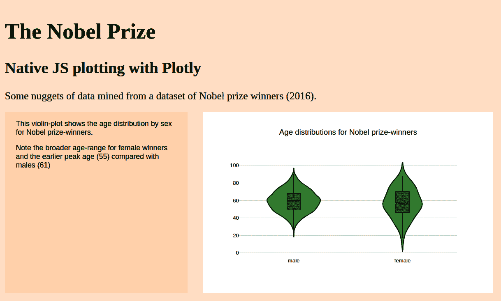
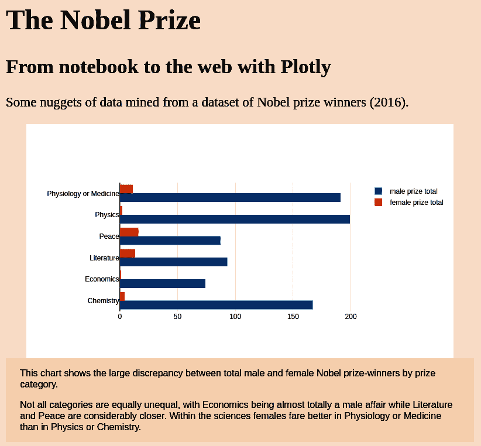
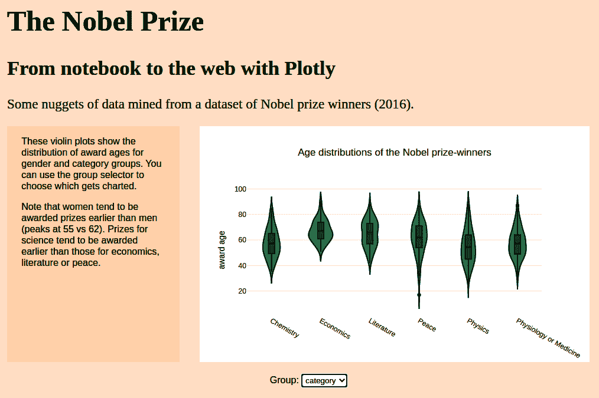

# 第十四章：使用 Matplotlib 和 Plotly 将图表带到网络上

在本章中，我们将看到如何将您的 pandas 数据清理和探索成果带到网络上。通常，一个良好的静态可视化图是展示数据的好方法，我们将从展示如何使用 Matplotlib 来实现这一点开始。有时，用户交互真的可以丰富数据可视化——我们将看到如何使用 Python 的 Plotly 库来创建交互式可视化图表，并将这些，包括用户交互 (UI)，全部转移到网页上。

我们还将看到学习 Plotly 的 Python 库如何使您具备使用本地 JavaScript 库的能力，这实际上可以扩展您的网络数据可视化的可能性。我们将通过创建一些简单的 JS UI 来更新我们的本地 Plotly 图表来演示这一点。

# 使用 Matplotlib 创建静态图表

通常，最适合工作的图表是静态图表，其中完全由创建者控制编辑。Matplotlib 的一个优点是它能够生成从高清网络 PNG 到 SVG 渲染的全面范围格式的印刷质量图表，具有与文档大小完美匹配的矢量基元。

对于 Web 图形，无处不在且推荐的格式是便携式网络图形 (PNG) 格式，正如其名称所示，它是为此工作而设计的。让我们从我们的诺贝尔探索中选择几个图表 (请参阅 第十一章)，并将它们以 PNG 的形式提供到网络上，在此过程中做一个小展示。

在 “国家趋势” 中，我们看到通过绝对数字衡量国家的奖项产出得到了一个非常不同的图片，考虑到人口规模的情况下，这是一个人均测量。我们制作了一些显示此内容的条形图。现在让我们将这个探索性发现转化为一个演示文稿。我们将使用垂直条形图来使国家名称更易

我们获取由 pandas 绘图方法返回的 Matplotlib 坐标轴，并对其进行一些调整，将其背景色更改为浅灰色（#eee），并添加一两个标签：

```py
ax = df_countries[df_countries.nobel_wins > 2]\ 
    .sort_values(by='nobel_wins_per_capita', ascending=True)\
    .nobel_wins_per_capita.plot(kind='barh',\ 
        figsize=(5, 10), title="Relative prize numbers")
ax.set_xlabel("Nobel prizes per capita")
ax.set_facecolor("#eee")
plt.tight_layout() 
plt.savefig("country_relative_prize_numbers.png")
```


具有至少三个奖项的国家的阈值。


我们想要一个水平条形图，种类为 `barh`。


使用 `tight_layout` 方法可减少保存图形时丢失图表元素的可能性。

我们对绝对数字执行相同的操作，生成两个水平条形图 PNG。为了在网络上展示这些，我们将使用一些在 第四章 中学到的 HTML 和 CSS：

```py
<!-- index.xhtml -->
<div class="main">
  <h1 class='title'>The Nobel Prize</h1>
  <h2>A few exploratory nuggets</h2>

  <div class="intro">
    <p>Some nuggets of data mined from a dataset of Nobel prize
     winners (2016).</p>
  </div>

  <div class="container" id="by-country-container">

    <div class="info-box">
      <p>These two charts compare Nobel prize winners by
         country. [...] that Sweden, winner by a relative
          metric, hosts the prize.</p>
    </div>

    <div class="chart-wrapper" id="by-country">

      <div class="chart">
        
      </div>

      <div class="chart">
        
      </div>

    </div>
  </div>
</div>
```


图像位于相对于 *index.xhtml* 的子目录中

在标题、副标题和介绍之后，我们有一个主容器，在其中有一个包含两个图表和一个信息框的图表包装器`div`。

我们将使用一些 CSS 来调整内容的大小、位置和样式。关键的 CSS 是使用 flex-box 将图表和信息框分布在一行中，并通过为图表包装器赋予两个权重和信息框赋予一个权重来使它们具有相等的宽度：

```py
html,
body {
  height: 100%;
  font-family: Georgia, serif;
  background: #fff1e5;
  font-size: 1.2em;
}

h1.title {
  font-size: 2.1em;
}

.main {
  padding: 10px;
  padding-bottom: 100px;
  min-width: 800px;
  max-width: 1200px;
}

.container {
  display: flex;
}

.chart-wrapper {
  display: flex; 
  flex: 2; 
}

.chart {
  flex: 1;
  padding: 0 1.5em;
}

.chart img {
  max-height: 600px;
}

.info-box {
  font-family: sans-serif;
  flex: 1; 
  font-size: 0.7em;
  padding: 0 1.5em;
  background: #ffebd9;
}
```


此容器的图表和信息框是通过 flex 控制的。


图表包装器的宽度是信息框的两倍。

图 14-1（左）显示了生成的网页。



###### 图 14-1\. 两幅静态图表

## 适应屏幕大小

现代 Web 开发及相关数据可视化面临的一个挑战是适应现在使用的众多设备。智能手机和平板电脑可以平移和捏/缩放，这意味着同样的可视化可以在所有设备上使用。使可视化具有适应性并不容易，并且很快就会遭遇组合爆炸问题。通常，妥协的组合是最佳方式。

但是在某些情况下，可以通过使用 CSS 的`media`属性来根据设备屏幕大小调整样式，通常使用变化的屏幕宽度来触发专用样式的使用，这是一种简单的胜利。我们将使用刚刚创建的 Nobel 网页来演示这一点。

默认的图表布局在大多数笔记本电脑或个人电脑屏幕上都很好，但设备宽度减小时，图表和信息框会变得有些混乱，信息框会变长以容纳文本内容。通过在设备宽度达到 1,000 像素时触发 flex-box 的变化，我们可以使可视化在小屏设备上更易于消化。

在此，我们添加了一个媒体屏幕触发器，将不超过 1,000 像素的设备应用不同的`flex-direction`值。与其在一行中显示信息框和图表，我们将它们显示在一列中，并反转顺序将信息框放在底部。结果显示在图 14-1（右）中：

```py
/* When the browser is 1000 pixels wide or less */
@media screen and (max-width: 1000px) {
  #by-country-container {
    flex-direction: column-reverse;
  }
}
```

## 使用远程图片或资源

您可以使用远程资源，例如 Dropbox 或 Google 托管的图像，通过获取它们的共享链接并将其用作图像源。例如，以下`img`标记使用 Dropbox 图像而不是本地托管的图像作为图 14-1 的示例：

```py
      <div class="chart">
        
      </div>

      <div class="chart">
        
      </div>
```

# 使用 Plotly 进行图表化

对于以 PNG 或 SVG 格式呈现的静态图表，Matplotlib 具有极高的可定制性，尽管其 API 可能不够直观。但是，如果你希望你的图表具有任何动态/交互元素，例如使用按钮或选择器更改或过滤数据集的能力，则需要使用不同的图表库，这就是 Plotly^(1) 的用武之地。

[Plotly](https://plotly.com/python) 是一个基于 Python（以及其他语言）的图表库，类似于 Matplotlib，可以在交互式 Jupyter 笔记本会话中使用。它提供了各种图表形式，其中一些在 Matplotlib 中找不到，并且配置起来比 Matplotlib 更容易。因此，单单因为这个原因它就是一个有用的工具，但 Plotly 的亮点在于其能够将这些图表以及任何脚本化的交互式小部件导出到 Web 上。

如前所述，用户交互和动态图表通常是多余的，但即使在这种情况下，Plotly 也有一些不错的增值功能，比如鼠标悬停时提供特定的柱状组信息。

## 基本图表

让我们看看 Plotly 是如何操作的，通过复制 Matploblib 中的一个图表来展示“奖励分布的历史趋势”。首先，我们将从诺贝尔奖数据集创建一个 DataFrame，显示三个地理区域的累积奖项：

```py
new_index = pd.Index(np.arange(1901, 2015), name='year')

by_year_nat_sz = df.groupby(['year', 'country'])\
    .size().unstack().reindex(new_index).fillna(0)

# Our continental country list created by selecting the biggest
# two or three winners in the three continents compared.
regions = [
{'label':'N. America',
'countries':['United States', 'Canada']},
{'label':'Europe',
'countries':['United Kingdom', 'Germany', 'France']},
{'label':'Asia',
'countries':['Japan', 'Russia', 'India']}
]
# Creates a new column with a region label for each dict in the
# regions list, summing its countries members.
for region in regions:
    by_year_nat_sz[region['label']] =\
    by_year_nat_sz[region['countries']].sum(axis=1)
# Creates a new DataFrame using the cumulative sum of the
# new region columns.
df_regions = by_year_nat_sz[[r['label'] for r in regions]].\
    cumsum()
```

这使我们得到了一个名为 `df_regions` 的 DataFrame，其中包含列累积求和：

```py
df_regions
country  N. America  Europe  Asia
year
1901            0.0     4.0   0.0
1902            0.0     7.0   0.0
1903            0.0    10.0   0.0
1904            0.0    13.0   1.0
1905            0.0    15.0   1.0
...             ...     ...   ...
2010          327.0   230.0  36.0
2011          333.0   231.0  36.0
...
```

## Plotly Express

Plotly 提供了一个 [`express` 模块](https://oreil.ly/bJRlf)，可以快速绘制图表草图，非常适合在笔记本中进行探索性迭代。该模块为线图、条形图等提供了高级对象，并且可以接受 pandas DataFrame 作为参数来解释列数据。^(2) 刚刚创建的区域 DataFrame 可以直接被 Plotly Express 使用，用几行代码构建一条线图。这将生成图表 图 14-2（左侧）：

```py
# load the express module
import plotly.express as px
# use the line method with a suitable DataFrame
fig = px.line(df_regions)
fig.show()
```



###### 图 14-2\. 使用 Plotly 的累积奖项

注意默认情况下用于 x 轴的行索引标签，以及鼠标悬停时显示的工具提示，显示线段部分的信息。

另一个需要注意的是图例标签取自分组索引，这种情况下为 `country`。我们可以轻松地将其改为更合理的名称，例如 `Regions`：

```py
fig = px.line(df_regions, labels={'country': 'Regions'})
      line_dash='country', line_dash_sequence=['solid', 'dash', 'dot']) 
)
fig.show()
```


默认情况下，Plotly 为线条着色，但为了在本书的印刷版本中区分它们，我们可以调整它们的样式。为此，我们将 `line_dash` 参数设置为国家组，并将 `line_dash_sequence` 设置为我们想要的线条样式。^(3)

Plotly Express 使用简单，并引入了一些新颖的图表^(4)。对于快速数据草图，它与 pandas 的 Matplotlib 包竞争，后者直接在 DataFrame 上运行。但如果您想对您的图表有更多控制，并真正利用 Plotly 的优势，我建议专注于使用 Plotly 图表和图形对象。这个 API 更复杂，但显著更强大。它还有 JavaScript API 的镜像，这意味着您实际上正在学习两个库——这是一个非常有用的事情，我们将在本章后面看到。

## Plotly 图形对象

使用 Plotly 图形对象需要一些样板代码，但无论是创建条形图、小提琴图、地图等，模式基本相同。思路是使用图形对象数组，如散点（在线模式下的线）、条形、蜡烛、方框等，作为图表的数据。`layout` 对象用于提供其他图表特性。

以下代码生成 图 14-2（右侧）的图表。请注意鼠标悬停时的自定义工具提示：

```py
import plotly.graph_objs as go

traces = [] 
for region in regions:
    name = region['label']
    traces.append(
        go.Scatter(
            x=df_regions.index, # years
            y=df_regions[name], # cum. prizes
            name=name,
            mode="lines", 
            hovertemplate=f"{name}<br>%{{x}}<br>$%{{y}}<extra></extra>" 
            line=dict(dash=['solid', 'dash', 'dot'][len(traces)]) 
        )
    )
layout = go.Layout(height=600, width=600,\ 
    xaxis_title="year", yaxis_title="cumulative prizes")
fig = go.Figure(traces, layout) 
fig.show()
```


我们将创建一个线图形对象数组，用作我们图表的数据。


在线模式散点对象的点是连接的。


您可以提供一个 HTML 字符串模板，将出现在鼠标悬停时。在那一点上提供 `x` 和 `y` 变量。


`Scatter` 对象有一个 *line* 属性，允许您设置各种线属性，如颜色、线样式、线形状等^(5) 为了在黑白印刷书中区分我们的线条，我们希望设置它们的样式。为此，我们使用 `traces` 数组的大小（`len`）作为样式数组的索引，按顺序设置线条样式。


除了数据外，我们还提供一个 `layout` 对象，定义了诸如图表尺寸、x 轴标题等内容。


使用我们的图形对象数组和布局创建图表。

## 使用 Plotly 进行地图绘制

Plotly 的另一个重要优势是其地图库，特别是其集成 [Mapbox 生态系统](https://oreil.ly/965Zv) 的能力，Mapbox 是最强大的网络切片地图资源之一。 Mapbox 的切片系统快速高效，并且开启了雄心勃勃的地图可视化可能性。

让我们利用我们的诺贝尔奖数据集展示一些 Plotly 地图绘制，目标是可视化奖项的全球分布。

首先，我们将使用 DataFrame 制作各获奖国家按类别的奖项统计，并通过汇总类别数字添加一个 `Total` 列：

```py
df_country_category = df.groupby(['country', 'category'])\
    .size().unstack()
df_country_category['Total'] = df_country_category.sum(1)
df_country_category.head(3) # top three rows
#category   Chemistry  Economics  Literature  Peace  Physics  \
#country
#Argentina        1.0        NaN         NaN    2.0      NaN
#Australia        NaN        1.0         1.0    NaN      1.0
#Austria          3.0        1.0         1.0    2.0      4.0
#
#category   Physiology or Medicine  Total
#country
#Argentina                     2.0    5.0
#Australia                     6.0    9.0
#Austria                       4.0   15.0
```

我们将使用 `Total` 列来筛选行，将国家限制为至少获得三次诺贝尔奖的国家。我们将复制此切片以避免任何 pandas DataFrame 错误，如果试图更改视图的话：

```py
df_country_category = df_country_category.\
    loc[df_country_category.Total > 2].copy()
df_country_category
```

手头有按国家统计的奖项数量，我们需要一些地理数据，即各国的中心经纬度坐标。这是一个演示 [Geopy](https://github.com/geopy/geopy) 的机会，这是一个很酷的小型 Python 库，可以执行这种工作，以及其他许多地理工作。

首先，使用 `pip` 或类似工具进行安装：

```py
!pip install geopy
```

现在我们可以使用 `Nominatim` 模块基于国家名称字符串提供位置信息。我们通过提供用户代理字符串创建一个地理定位器：

```py
from geopy.geocoders import Nominatim

geolocator = Nominatim(user_agent="nobel_prize_app")
```

使用地理定位器，我们可以遍历数据框索引中的几个国家，以展示可用的地理数据：

```py
for name in df_country_category.index[:5]:
    location = geolocator.geocode(name)
    print("Name: ", name)
    print("Coords: ", (location.latitude, location.longitude))
    print("Raw details: ", location.raw)
#Name:  Argentina
#Coords:  (-34.9964963, -64.9672817)
#Raw details:  {'place_id': 284427148, 'licence': 'Data ©
#OpenStreetMap contributors, ODbL 1.0\. https://osm.org/
#copyright', 'osm_type': 'relation', 'osm_id': 286393,
#'boundingbox': ['-55.1850761', '-21.7808568', '-73.5605371',
#[...] }
```

让我们向 DataFrame 添加地理纬度 (`Lat`) 和经度 (`Lon`) 列，使用我们的地理定位器：

```py
lats = {}
lons = {}
for name in df_country_category.index:
    location = geolocator.geocode(name)
    if location:
        lats[name] = location.latitude
        lons[name] = location.longitude
    else:
        print("No coords for %s"%name)

df_country_category.loc[:,'Lat'] = pd.Series(lats)
df_country_category.loc[:,'Lon'] = pd.Series(lons)
df_country_category
#category   Chemistry  Economics  Literature  Peace  Physics  \
#country
#Argentina        1.0        NaN         NaN    2.0      NaN
#Australia        NaN        1.0         1.0    NaN      1.0
#
#category   Physiology or Medicine  Total        Lat         Lon
#country
#Argentina                     2.0    5.0 -34.996496  -64.967282
#Australia                     6.0    9.0 -24.776109  134.755000
```

我们将使用一些地图标记来反映各国奖项数量。我们希望圆圈的大小反映奖项总数，因此我们需要一个小函数来获取适当的半径。我们将使用 `scale` 参数来允许手动调整标记大小：

```py
def calc_marker_radius(size, scale=5):
    return np.sqrt(size/np.pi) * scale
```

与基本图表一样，Plotly Express 提供了一种快速制图选项，使用 pandas DataFrame 可以快速创建地图。Express 有一个专门的 `scatter_mapbox` 方法返回一个图表对象。这里我们使用该图表对象对地图布局进行一些更新，使用 Plotly 提供的免费地图样式之一（carto-positron）（参见 图 14-3）：

```py
import plotly.express as px
init_notebook_mode(connected=True)

size = df_country_category['Total'].apply(calc_marker_radius, args=(16,)) 
fig = px.scatter_mapbox(df_country_category, lat="Lat", lon="Lon", 
                        hover_name=df_country_category.index, 
                        hover_data=['Total'],
                        color_discrete_sequence=["olive"],
                        zoom=0.7, size=size)
fig.update_layout(mapbox_style="carto-positron", width=800, height=450) 
fig.update_layout(margin={"r":0,"t":0,"l":0,"b":0})
fig.show()
```


创建一个用于圆形标记半径的大小数组。


Mapbox 需要经纬度和我们计算出的 `size` 数组以放置标记。缩放参数表示相机在地球上的位置，默认为 0.7。


`hover_name` 提供了鼠标悬停提示的标题和我们想要的额外信息，本例中是 `Total` 列。


Plotly 提供了许多免费使用的 [地图样式瓷砖集](https://oreil.ly/NbTg1)。



###### 图 14-3\. 使用 Plotly Express 快速制图

与基本图表一样，Plotly 还提供了一种更强大的数据+布局映射选项，遵循熟悉的配方，创建一个图表 *traces* 数组和一个布局以指定诸如图例框、标题、地图缩放等内容。以下是制作我们的诺贝尔地图的方法：

```py
mapbox_access_token = "pk.eyJ1Ij...JwFsbg" 

df_cc = df_country_category

site_lat = df_cc.Lat 
site_lon = df_cc.Lon
totals = df_cc.Total
locations_name = df_cc.index

layout = go.Layout(
    title='Nobel prize totals by country',
    hovermode='closest',
    showlegend=False,
    margin ={'l':0,'t':0,'b':0,'r':0},
    mapbox=dict(
        accesstoken=mapbox_access_token,
        # we can set map details here including center, pitch and bearing..
        # try playing  with these.
#         bearing=0,
# #         center=dict(
# #             lat=38,
# #             lon=-94
# #         ),
#         pitch=0,
        zoom=0.7,
        style='light'
    ),
    width=875, height=450
)

traces = [
            go.Scattermapbox(
            lat=site_lat,
            lon=site_lon,
            mode='markers',
            marker=dict(
                size=totals.apply(calc_marker_radius, args=(7,)),
                color='olive',
                opacity=0.8
            ),
            text=[f'{locations_name[i]} won {int(x)} total prizes'\
                for i, x in enumerate(totals)],
            hoverinfo='text'
             )
]

fig = go.Figure(traces, layout=layout)
fig.show()
```


Plotly 提供了许多基于免费开放街地图的地图集，但要使用 Mapbox 特定的图层，您需要获取一个[Mapbox 访问令牌](https://oreil.ly/7zzug)。这些令牌可以免费用于个人用途。


我们将 DataFrame 的列和索引存储在一个更用户友好的形式中。

所生成的地图显示在图 14-4（左侧）。请注意，在鼠标悬停时生成的自定义工具提示。图 14-4（右侧）显示了一些用户交互的结果，平移和缩放以突出显示欧洲奖项分布。



###### 图 14-4\. 使用 Plotly 的图形对象进行映射

让我们扩展地图以添加一些自定义控件，使用按钮来选择奖项类别进行可视化。

## 使用 Plotly 添加自定义控件

Plotly 交互地图的一个很酷的功能之一是能够添加[自定义控件](https://oreil.ly/xo62V)，可以在 Python 中作为 HTML+JS 控件进行移植到 Web 上。控件 API 在我看来有点笨拙，并且仅限于一小部分控件，但是能够添加数据集选择器、滑块、过滤器等功能是一个很大的优势。在这里，我们将在我们的诺贝尔奖地图上添加一些按钮，允许用户通过类别来筛选数据集。

在继续之前，我们需要将奖项中的非数字替换为零，以避免 Plotly 标签错误的发生。你可以在前两行中看到这些情况：

```py
df_country_category.head(2)
# Out:
#  category   Chemistry  Economics  Literature  Peace  Physics  \
# country
# Argentina        1.0        NaN         NaN    2.0      NaN
# Australia        NaN        1.0         1.0    NaN      1.0
```

一行 Pandas 代码就可以将这些`NaN`替换为零，直接进行修改：

```py
df_country_category.fillna(0, inplace=True)
```

这将涉及稍微不同的 Plotly 模式，与迄今为止使用的模式略有不同。我们将首先使用`layout`创建我们的图形，然后通过迭代诺贝尔类别使用`add_trace`添加数据跟踪，同时将按钮添加到`button`数组中。

然后，我们将使用其`update`方法将这些按钮添加到布局中：

```py
# ...
categories = ['Total', 'Chemistry',   'Economics', 'Literature',\
    'Peace', 'Physics','Physiology or Medicine',]
# ...
colors = ['#1b9e77','#d95f02','#7570b3','#e7298a','#66a61e','#e6ab02','#a6761d']
buttons = []
# ... DEFINE LAYOUT AS BEFORE
fig = go.Figure(layout=layout)
default_category = 'Total'

for i, category in enumerate(categories):
    visible = False
    if category == default_category: 
        visible = True
    fig.add_trace(
        go.Scattermapbox(
            lat=site_lat,
            lon=site_lon,
            mode='markers',
            marker=dict(
                size=df_cc[category].apply(calc_marker_radius, args=(7,)),
                color=colors[i],
                opacity=0.8
            ),
            text=[f'{locations_name[i]} prizes for {category}: {int(x)}'\
                  for i, x in enumerate(df_cc[category])],
            hoverinfo='text',
            visible=visible
             ),
    )
    # We start with a mask array of Boolean False, one for each category (inc. Total)
    # In Python [True] * 3 == [True, True, True]
    mask = [False] * len(categories)
    # We now set the mask index corresponding to the current category to True
    # i.e. button 'Chemistry' has mask [False, True, False, False, False, False]
    mask[categories.index(category)] = True
    # Now we can use that Boolean mask to add a button to our button list
    buttons.append(
            dict(
                label=category,
                method="update",
                args=[{"visible": mask}], 
            ),
    )

fig.layout.update( 
    updatemenus=[
        dict(
            type="buttons",
            direction="down",
            active=0,
            x=0.0,
            xanchor='left',
            y=0.65,
            showactive=True, # show the last button clicked
            buttons=buttons
        )
    ]
)

fig.show()
```


初始情况下，类别标记集是不可见的——只有默认的`Total`显示。


我们使用掩码来设置一个可见性数组，用于该按钮，仅使相关类别的数据标记可见。


现在我们将这些按钮添加到我们的布局中，使用`x`和`y`来垂直放置按钮组的中心，并且按钮框锚定在左侧。

点击按钮（参见图 14-5）会显示与该类别相关的数据标记，通过应用按钮的可见性掩码。虽然这感觉有点笨拙，但这是一种通过按钮按下来过滤数据的可靠方法。与本章稍后将介绍的 JavaScript+HTML 控件不同，按钮的样式化能力有限。



###### 图 14-5\. 向 Plotly 地图添加自定义控件

# 从笔记本到 Web 的 Plotly

现在我们在笔记本中显示了 Plotly 图表，让我们看看如何将它们转移到一个小的 Web 演示中。我们将使用 Plotly 的`offline`模块中的`plot`函数来生成所需的可嵌入 HTML+JS，因此首先导入它：

```py
from plotly.offline import plot
```

使用`plot`，我们可以创建一个从图形生成的可嵌入字符串，可以直接提升到 Web。它包含了启动 Plotly 的 JavaScript 库和创建图表所需的 HTML 和 JavaScript 标签：

```py
embed_string = plot(fig, output_type='div', include_plotlyjs="cdn")
embed_string
#'<div>                        <script type="text/javascript">window.PlotlyConfig
#= {MathJaxConfig: \'local\'};</script>\n        <script src="https://cdn.plot.ly/
#plotly-2.9.0.min.js"></script>                <div
#id="195b2d71-f59d-4f8a-a40a-3b8c797a918b" class="plotly-graph-div"
#style="height:600px; width:600px;"></div>            <script type="text/
#javascript"> [...]    </script>
#</div>'
```

如果我们整理这个字符串，我们可以看到它分解为四个部分，一个带有图表 ID 的 HTML `div`标签和一些 JavaScript，其中包含通过参数传递的数据和布局的`newPlot`调用：

```py
<div>
  <!-- (1) JavaScript Plotly config, placed with JavaScript (.js) file -->
  <script type="text/javascript">window.PlotlyConfig = {MathJaxConfig: 'local'};
  </script>
  <!-- (2) Place bottom of HTML file to import the Plotly library
 from the cloud (content delivery network) -->
  <script src="https://cdn.plot.ly/plotly-2.9.0.min.js"></script>
  <!-- create a content div for the chart, with ID tag (to be inflated)
 (3) !! Put this div in the HTML section of the code-pen !! -->
  <div id="4dbeae4f-ed9b-4dc1-9c69-d4bb2a20eaa7" class="plotly-graph-div"
       style="height:100%; width:100%;"></div>

  <script type="text/javascript">
    // (4) Everything within this tag goes to a JavaScript (.js) file -->
    window.PLOTLYENV=window.PLOTLYENV || {};
    // Grab the 'div' tag above by ID and call Plotly's JS API on it, using the
    // embedded data and annotations
    if (document.getElementById("4dbeae4f-ed9b-4dc1-9c69-d4bb2a20eaa7"))
    {                    Plotly.newPlot("4dbeae4f-ed9b-4dc1-9c69-d4bb2a20eaa7",
                      [{"mode":"lines","name":"Korea, South",
                      "x": [0,1,2,3,4,5,6,7,8,9,10,11,12,...]}])
                };
  </script>
</div>
```

虽然我们可以将 HTML+JS 直接粘贴到网页中查看渲染的图表，但将 JS 和 HTML 分开是更好的实践。首先，将图表 div 放入一个小的网页中，添加一些标题、信息框等容器：

```py
<!-- index.xhtml -->
<div class="main">
  <h1 class='title'>The Nobel Prize</h1>
  <h2>From notebook to the web with Plotly</h2>

  <div class="intro">
    <p>Some nuggets of data mined [...]</p>
  </div>

  <div class="container" id="by-country-container">

    <div class="info-box">
      <p>This chart shows the cumulative Nobel prize wins by region, taking the
       two or three highest winning countries from each.[...]</p>
    </div>

    <div class="chart-wrapper" id="by-country">
      <div id="bd54c166-3733-4b20-9bb9-694cfff4a48e" 
      class="plotly-graph-div" style="height:100%; width:100%;"></div>
    </div>
  </div>
</div>

<script scr="scripts/plotly_charts.js"></script>
<script src="https://cdn.plot.ly/plotly-2.9.0.min.js"></script> 
```


Plotly 生成的`div`容器，其 ID 对应于 JavaScript 图表。


Plotly 生成的`script`标签，用于导入 JS 图表库。

我们将剩余的两个 JavaScript 标签的内容放入一个*plotly_charts.js*的 JS 文件中：

```py
// scripts/plotly_charts.js
  window.PLOTLYENV=window.PLOTLYENV || {};
  if (document.getElementById("bd54c166-3733-4b20-9bb9-694cfff4a48e")){ 
    Plotly.newPlot("bd54c166-3733-4b20-9bb9-694cfff4a48e", 
      {"hovertemplate":"N. America<br>%{x}<br>$%{y}<extra></extra>", ![3
        "mode":"lines","name":"N. America",
        "x":[1901,1902,1903,1904,1905,1906,1907,1908,1909,1910,1911,1912,1913,
             1914,1915,1916,1917,1918,1919,1920,1921,1922,...]
      }])
  }
```


检查带有正确 ID 的`div`是否存在。


Plotly 的`newPlot`方法将在指定的容器中构建图表。


一个包含所有数据（`x`和`y`数组）的图表对象数组，这种情况下，可以将图表从笔记本转移到 Web 页面。

页面加载时，使用 Plotly 库的`newPlot`方法，使用嵌入数据和布局构建图表，并在指定 ID 的`div`容器中通过 JS 生成 Web 页面。这产生了图 14-6 中显示的 Web 页面。



###### 图 14-6\. 从笔记本到 Web 的 Plotly

使用 Plotly 在 Python 中生成的所有图表可以通过这种方式转移到 Web。如果您计划使用多个图表，建议为每个图表准备单独的 JS 文件，因为嵌入数据可能导致文件非常长。

# 使用 Plotly 的原生 JavaScript 图表

能够轻松地将喜爱的图表从笔记本转移到 Web 是很棒的，但如果需要进行细微调整，则需要在笔记本和 Web 开发之间来回移动。这可能会在一段时间后变得很烦人。Plotly 的一件非常酷的事情是，你可以免费学习一个 JavaScript 图表库。Python 和 JS 的图表模式非常相似，因此很容易将 Python 中的图表代码转换为 JS，并从头开始编写 JS 图表。让我们通过将 seaborn 图表转换为 JavaScripted Plotly 来演示这一点。

在 “获奖时年龄” 中，我们使用 seaborn 生成了一些小提琴图。要将这些图转移到 Web，我们首先需要一些数据。将小数据集转换为 JSON 并仅复制生成的字符串，然后将其粘贴到 JS 文件中并将字符串解析为 JS 对象是移动小数据集的有用方法。首先，我们使用 pandas 创建仅包含 `award_age` 和 `gender` 列的小数据集，然后生成所需的 JSON 对象数组：

```py
df_select = df[['gender', 'award_age']]
df_select.to_json(orient='records')
#'[{"gender":"male","award_age":57},{"gender":"male","award_age":80},
#{"gender":"male","award_age":49},{"gender":"male","award_age":59},
#{"gender":"male","award_age":49},{"gender":"male","award_age":46},...}]'
```

我们可以将 JSON 字符串复制到 JS 文件中，并使用内置的 JSON 库将字符串解析为 JS 对象数组：

```py
let data = JSON.parse('[{"gender":"male","award_age":57}
',{"gender":"male","award_age":80},'
'{"gender":"male","award_age":49},{"gender":"male","award_age":59},'
'{"gender":"male","award_age":48}, ... ]')
```

有了数据后，我们需要一些 HTML 结构来包含一个图表容器，ID 为 `'award_age'`，用于容纳 Plotly 图表：

```py
<div class="main">
  <h1 class='title'>The Nobel Prize</h1>
  <!-- ... -->
    <div class="chart-wrapper">
      <div class='chart' id='award_age'></div> 
  </div>

</div>

<script src="https://cdn.plot.ly/plotly-2.9.0.min.js"></script>
```


我们将使用此容器的 ID 来告诉 Plotly 在何处构建图表。

现在我们可以构建我们的第一个 JS 原生 Plotly 图表。该模式与我们笔记本中 Python Plotly 图表的模式相匹配。首先，我们创建一个包含一些图表对象的数据数组（`traces`），然后创建一个布局以提供标题、标签、颜色等。然后，我们使用 `newPlot` 来构建图表。与 Python 的主要区别在于 `newPlot` 的第一个参数是容器的 ID，用于在其中构建图表：

```py
var traces = { 
  y: data.map(d => d.award_age),
  points: 'none',
  box: {
    visible: true
  },
  line: {
    color: 'green',
  },
  meanline: {
    visible: true
  },
}]

var layout = {
  title: "Nobel Prize Violin Plot",
  yaxis: {
    zeroline: false
  }
}

Plotly.newPlot('award_age', traces, layout); 
```


根据通常的 Plotly 模式，我们首先创建一个图表对象数组。


我们使用 JS 数组的 `map` 方法和箭头函数的简写来生成获奖者性别和年龄的数组。


Plotly 将把图表渲染到我们的 `div` 容器中，其 ID 为 `'award_age'`。

所生成的小提琴图显示在 图 14-7 中。



###### 图 14-7\. 使用 Plotly JS 的小提琴图

如您所见，Plotly 的 JS API 与 Python 的 API 相匹配，而且如果有什么不同的话，JS 更为简洁。将数据传递与图表构建分开使代码库易于处理，并且意味着调整和精炼不需要返回 Python API。对于小数据快速查看，解析 JSON 字符串可以快速完成工作。

但是，如果你想要有更大的数据集，并真正利用 JS 网络上下文的能力，标准的数据传递方式是通过 JSON 文件。对于几兆字节的数据集，这为数据可视化提供了最大的灵活性。

## 获取 JSON 文件

另一种将数据传递到网页的方式是将 DataFrame 导出为 JSON，然后使用 JavaScript 获取它，进行任何必要的进一步处理，然后将其传递给本地 JS 图表库（或者 D3）。这是一种非常灵活的工作流程，为 JS 数据可视化提供了最大的自由度。

权力分离，允许 Python 专注于其数据处理能力，而 JavaScript 专注于其优越的数据可视化能力，提供了数据可视化的甜蜜点，是产生宏大网络数据可视化的最常见方式。

首先，我们将我们的诺贝尔获奖者 DataFrame 保存为 JSON，使用专用方法。通常，我们希望数据以对象数组的形式出现，这需要一个`orient`参数为`'records'`：

```py
df.to_json('nobel_winners.json', orient='records')
```

拥有 JSON 数据集后，让我们使用它来使用 JavaScript API 生成一个 Plotly 图表，就像前一节一样。我们需要一些 HTML，包括一个带 ID 的容器来构建图表，并且一个脚本链接来导入我们的 JS 代码：

```py
<!-- index.xhtml -->
<link rel="stylesheet" href="styles/index.css">

<div class="main">
  <h1 class='title'>The Nobel Prize</h1>
  <!-- ... -->
    <div class="chart-wrapper">
      <div class='chart' id='gender-category'> </div> 
    </div>
  </div>
</div>

<script src="https://cdn.plot.ly/plotly-2.9.0.min.js"></script>
<script src="https://cdnjs.cloudflare.com/ajax/libs/d3/7.4.2/d3.min.js"></script>
<script src="scripts/index.js"></script> 
```


我们将使用这个 ID 告诉 Plotly 在哪里构建图表。


从 scripts 文件夹导入索引 JS 文件。

在我们的 JS 入口点，我们使用 D3 的`json`实用方法来导入诺贝尔获奖者数据集并将其转换为 JS 对象数组。然后我们将数据传递给`makeChart`函数，在那里 Plotly 将展示其魔力：

```py
// scripts/index.js
d3.json('data/nobel_winners.json').then(data => {
  console.log("Dataset: ", data)
  makeChart(data)
})
```

控制台显示我们的获奖者数组：

```py
[
  {category: 'Physiology or Medicine', country: 'Argentina',
   date_of_birth: -1332806400000, date_of_death: 1016928000000,
   gender: 'male', …},
  {category: 'Peace', country: 'Belgium',
   date_of_birth: -4431715200000, date_of_death: -1806278400000,
   gender: 'male', …}
   [...]
]
```

在`makeChart`函数中，我们使用 D3 非常方便的[rollup 方法](https://oreil.ly/wLVAZ)来按性别和类别分组我们的诺贝尔数据集，然后通过返回的成员数组的长度来提供组大小：

```py
function makeChart(data) {
  let cat_groups = d3.rollup(data, v => v.length, 
                      d=>d.gender, d=>d.category)
  let male = cat_groups.get('male')
  let female = cat_groups.get('female')
  let categories = [...male.keys()].sort() 

  let traceM = {
    y: categories,
    x: categories.map(c => male.get(c)), 
    name: "male prize total",
    type: 'bar',
    orientation: 'h'
  }
    let traceF= {
    y: categories,
    x: categories.map(c => female.get(c)),
    name: "female prize total",
    type: 'bar',
    orientation: 'h'
  }

  let traces = [traceM, traceF]
  let layout = {barmode: 'group', margin: {l:160}} 

  Plotly.newPlot('gender-category', traces, layout)
}
```


从获奖者对象数组中，`rollup`按性别分组，然后按类别分组，然后将结果组的大小/长度作为 JS Map 返回：`{male: {Physics: 199, Economics: 74, ...}, female: {...}}`。


我们使用 JS 的`...` [扩展运算符](https://oreil.ly/ZsIzM) 来从类别键产生一个数组，然后进行排序以生成我们水平条形图的 y 值。


我们将排序后的类别映射到它们的组值，以提供条形图的高度。


我们增加水平条形图的左边距，以容纳长标签。

所生成的条形图显示在图 14-8 中。由于有完整的诺贝尔获奖者数据集可用，可以轻松生成一系列图表，无需从 Python 切换到 JS。Plotly API 相当直观和易于发现，使其成为数据可视化工具箱的重要补充。让我们看看如何通过一些 HTML+JS 自定义控件来扩展它。



###### 图 14-8. 使用 Plotly JS 绘制的条形图

# 使用 JavaScript 和 HTML 进行用户驱动的 Plotly

正如我们在“使用 Plotly 添加自定义控件”中看到的，Plotly 允许您在 Python 中添加自定义控件，如按钮或下拉菜单，并将其转换为由 JS 驱动的 HTML 控件。虽然这是 Plotly 的一个非常有用的功能，但在控件的布置和样式方面有些局限。更新 Plotly Web 图表的另一种方式是使用本地的 JS+HTML 控件来修改图表，过滤数据集或调整样式。事实证明这样做非常简单，并且借助一些 JS 技巧，可以实现更灵活、功能强大的控件设置。

让我们演示一些 JS 自定义控件，使用我们刚刚在“使用本地 JavaScript 创建 Plotly 图表”中构建的图表之一。我们将添加一个下拉菜单，允许用户更改显示的 x 轴组。两个明显的选项是按性别分组和按奖项类别分组的年龄。

首先，我们将在页面上添加一个 HTML 下拉菜单（`select`），并使用一些 flex-box CSS 将其居中：

```py
<div class="main">
  <h1 class='title'>The Nobel Prize</h1>
  <h2>From notebook to the web with Plotly</h2>

  <!-- ... -->
  <div class="container">
  <!-- ... -->
    <div class="chart-wrapper">
      <div class='chart' id='violin-group'> </div>
    </div>
  </div>

  <div id="chart-controls">

    <div id="nobel-group-select-holder">
      <label for="nobel-group">Group:</label>
      <select name="nobel-group" id="nobel-group"></select> 
    </div>

  </div>

</div>
```


这个`select`标签将包含通过 JS 和 D3 添加的`option`标签。

一些 CSS 将使`controls`容器中的任何控件居中，并适应字体样式：

```py
#chart-controls {
  display: flex;
  justify-content: center;
  font-family: sans-serif;
  font-size: 0.7em;
  margin: 20px 0;
}

select {
  padding: 2px;
}
```

现在我们有了一些 HTML 基础，我们将使用一些 JS 和 D3 来为我们的组控件添加`select`标签。但首先，我们将调整 Plotly 绘图函数，以允许其根据新组更新。JSON 数据像以前一样导入，但现在数据存储为本地变量，并用于更新 Plotly 小提琴图。这个`updateChart`函数使用 Plotly 的[`update`方法](https://oreil.ly/tayov)来创建图表。它类似于`newPlot`，但旨在在数据或布局变化时调用，高效地重新绘制图表以反映任何更改。

我们还有一个新的`selectedGroup`变量，它将用于下拉菜单`select`中，以更改正在绘制的字段：

```py
let data
d3.json("data/nobel_winners.json").then((_data) => {
  console.log(_data);
  data = _data
  updateChart();
});

let selectedGroup = 'gender' 

function updateChart() {
  var traces = [
    {
      type: "violin",
      x: data.map((d) => d[selectedGroup]), 
      y: data.map((d) => d.award_age),
      points: "none",
      box: {
        visible: true
      },
      line: {
        color: "green"
      },
      meanline: {
        visible: true
      }
    }
  ];

  var layout = {
    title: "Age distributions of the Nobel prizewinners",
    yaxis: {
      zeroline: false
    },
    xaxis: {
      categoryorder: 'category ascending' 
    }
  };

  Plotly.update("violin-group", traces, layout); 
}
```


`selectedGroup`变量允许用户通过下拉菜单`select`更改 x 轴组。


我们希望按字母顺序（从*化学*开始）呈现奖项组，因此对布局进行此更改。


在`newPlot`的位置，我们调用`update`，它具有相同的签名，但用于反映数据（`traces`）或布局的更改。

使用`updateChart`方法，我们现在需要添加选择选项和回调函数，以在用户更改奖项组时调用：

```py
let availableGroups = ['gender', 'category']
availableGroups.forEach((g) => {
  d3.select("#nobel-group") 
    .append("option")
    .property("selected", g === selectedGroup) 
    .attr("value", g)
    .text(g);
});

d3.select("#nobel-group").on("change", function (e) {
  selectedGroup = d3.select(this).property("value"); 
  updateChart();
});
```


对于每个可用的组，我们使用 D3 通过 ID 选择下拉菜单，并附加一个文本和值设置为组字符串的`<option>`标签。


这确保初始选择是`selectedGroup`的值，通过将`selected`属性设置为 true。


我们使用 D3 在进行选择时添加回调函数。在这里，我们获取选项（*性别*或*类别*）的值，并将其用于设置`selectedGroup`变量。然后，我们更新图表以反映这一变化。

现在连接完成，我们有一个组下拉菜单，可以更改小提琴图以反映所选组。图 14-9 显示选择奖项类别组的结果。请注意，Plotly 聪明地旋转类别组标签，以防止重叠。



###### 图 14-9\. 添加下拉菜单以控制 Plotly

我们将在后面的章节中看到更多 HTML 控件的实际应用，其中演示了按钮和单选框。使用 JS 创建控件比 Python 驱动的选项更加灵活，但也需要一些网络开发技能。

# 概要

在本章中，我们看到如何将笔记本探索中的最佳图表转换为网络演示。可用选项很多，从静态 PNG 图像（也许带有一些额外的 Matplotlib 样式）到使用自定义 JavaScript 控件的交互式 Plotly 图表。数据可以嵌入在 Plotly 图表调用中，使用 Plotly 的离线库生成，或作为 JSON 字符串（适用于数据草图）或文件导入。

Plotly 是一个很好的图表库，通过学习 Python API，你基本上也学会了 JS API——这是一个很大的优势。对于传统和一些专业（例如机器学习）图表，它是一个很好的选择。对于稍微复杂或特别定制的内容，D3 提供了更多的功能，我们将在即将到来的章节中看到。

^(1) [Bokeh](https://bokeh.org)是一个值得考虑的替代品。

^(2) 您可以使用 DataFrame 的`T`运算符轻松将数据框转置为所需的列形式。

^(3) 查看[*https://oreil.ly/zUyxK*](https://oreil.ly/zUyxK)了解 Plotly 的线型选项。

^(4) 查看[Plotly 网站](https://plotly.com/python)获取一些演示。

^(5) 查看[*https://oreil.ly/8UDgA*](https://oreil.ly/8UDgA)获取更多详细信息。

^(6) 对于更高级、用户驱动的大数据可视化，使用带有 API 的数据服务器是另一种选择。
