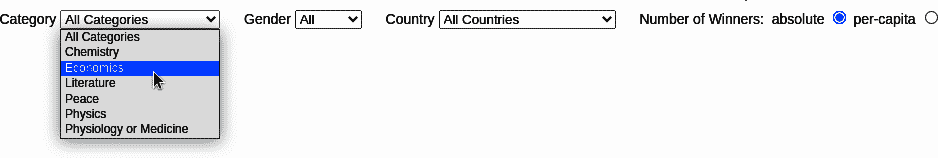
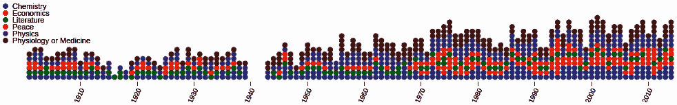
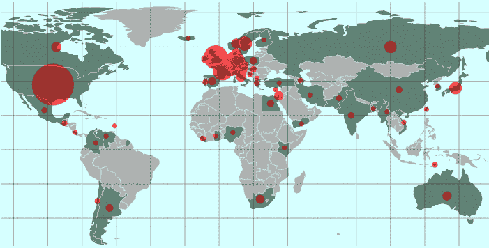
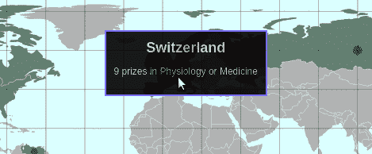
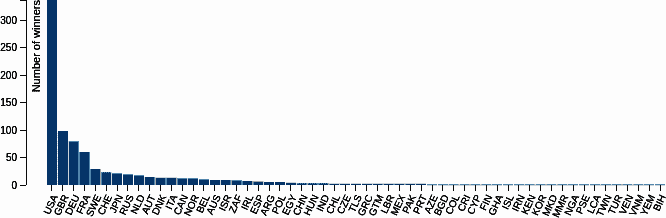
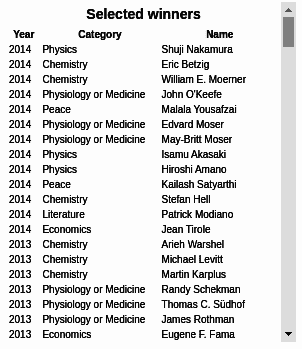
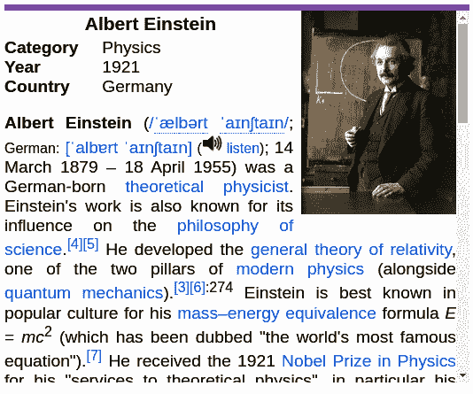
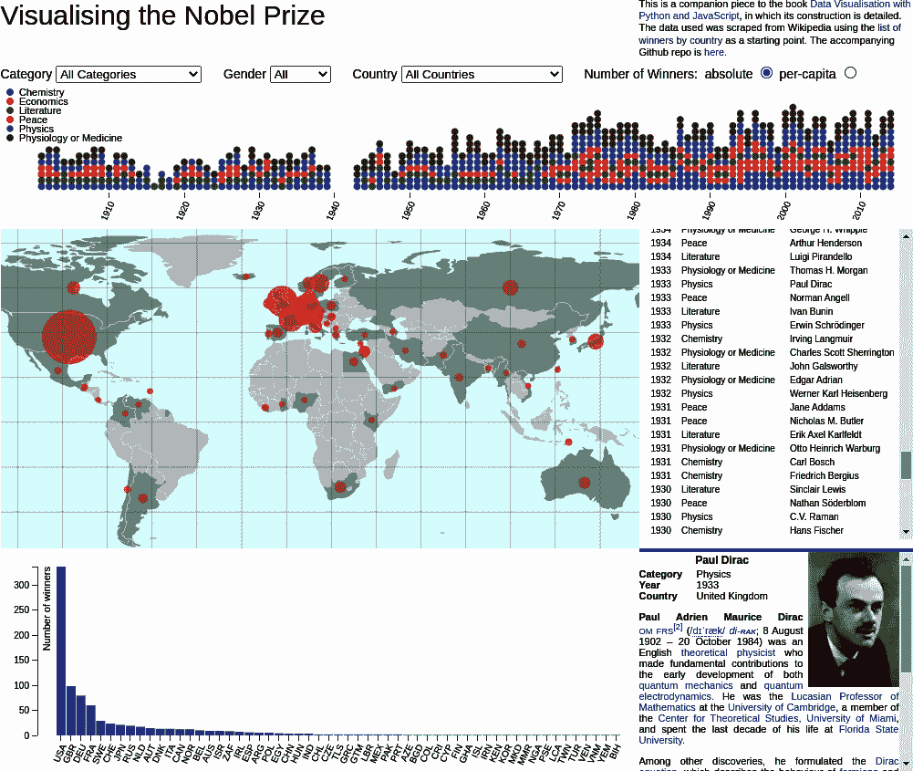

# 第十五章。想象一个诺贝尔奖可视化

在第十三章中，我们探讨了诺贝尔奖数据集，寻找基于数据的吸引人和教育性的有趣故事。我们找到了一些有趣的信息，其中包括：

+   玛丽亚·哥伯特，除玛丽·居里外唯一获得物理诺贝尔奖的女物理学家

+   二战后美国诺贝尔奖激增，超过了英国、德国和法国这三个最大欧洲赢家的不断下降的计数

+   大陆奖项分配的差异

+   当奖项计数根据人口规模进行调整时，斯堪的纳维亚国家的主导地位

这些以及其他一些叙述需要特定类型的可视化。比较各国诺贝尔奖数量可能最好通过传统的条形图来实现，而地理奖项分布则需要地图。在本章中，我们将尝试设计一个现代的、交互式的可视化，其中包含我们在探索数据集时发现的一些关键故事。

# 为谁准备？

想象可视化时的第一个考虑因素是目标受众。一个用于在画廊或博物馆展示的可视化作品，与一个用于内部仪表板的可视化作品可能会有很大不同，即使它们可以使用相同的数据集。这本书预期的诺贝尔奖可视化作品的主要限制是要教授一些 D3 和 JavaScript 的关键子集，以便创建现代交互式网络可视化。这是一个相当非正式的数据可视化，旨在娱乐和传达信息。它不需要专业观众。

# 选择视觉元素

我们诺贝尔奖可视化的第一个限制是它必须足够简单，以教授并提供一组关键的 D3 技能。但即使没有这个限制，限制任何可视化的范围也可能是明智的。这个范围在很大程度上取决于上下文[¹]，但是，与许多学习背景一样，少即是多。过多的互动会让用户不知所措，并削弱我们可能希望讲述的任何故事的影响力。

有了这个想法，让我们看看我们想要包括的关键元素以及这些元素如何被视觉上安排。

一种菜单栏是必不可少的，允许用户参与可视化并操作数据。它的功能将取决于我们选择讲述的故事，但肯定会提供一些方法来探索或过滤数据集。

理想情况下，可视化应该按年份显示每个奖项，并且当用户通过菜单栏精炼数据时，显示应该自动更新。考虑到国家和地区的趋势感兴趣，应包括一张地图，突出显示所选获奖国家，并显示其奖项数量的一些指示。柱状图是比较各国奖项数量的最佳方式，它也应根据数据变化动态调整。还应提供选择，可以根据各国的绝对奖项数量或人均奖项数量进行测量，考虑到各自的人口规模。

为了个性化可视化，我们应能够选择个别获奖者，展示任何可用的图片和我们从维基百科抓取的简短传记。这需要一个当前选定获奖者的列表，并在其中显示选定的个人。

上述元素提供了足够的范围来讲述我们在上一章节中发现的关键故事，稍加完善后应适合标准的表单因素。^(2)

我们的诺贝尔奖可视化对于所有设备使用固定大小，这意味着为了适应较小的设备（如上一代智能手机或平板电脑），必须牺牲具有更高分辨率的较大设备。对于许多可视化工作来说，固定大小为您提供了对视觉内容块、信息框、标签等具体放置的必要控制。对于一些特别是多元素仪表板的可视化，可能需要不同的方法。[响应式网页设计（RWD）](https://oreil.ly/AURTe)试图使您的可视化在特定设备上优化外观和感觉。一些流行的 CSS 库如[Bootstrap](https://getbootstrap.com)会检测设备大小（例如，分辨率为 1,280×800 像素的平板电脑），并更改应用的样式表，以充分利用可用的屏幕空间。如果您需要对视觉元素的放置进行精确定位，则指定可视化的固定大小并在其中使用绝对定位是一种方法。然而，您应该意识到 RWD 的挑战，特别是在需要构建多组件仪表板等情况下。

现在让我们针对诺贝尔奖可视化的个别元素的外观、感觉和要求进行详细说明，从主要的用户控制元素菜单栏开始。

# 菜单栏

交互式可视化由用户从选项中选择、点击事物、操作滑块等驱动。这些允许用户定义可视化的范围，这就是为什么我们将首先处理它们的原因。我们的用户控件将显示为可视化顶部的工具栏。

驱动有趣发现的标准方式之一是允许用户按关键维度过滤数据。我们诺贝尔奖的显而易见的选项是类别、性别和国家，这是我们上一章探索的重点。这些过滤器应该是累积的，因此，例如，选择女性性别和物理学类别应该返回两位获奖女性物理学家。除了这些过滤器之外，我们应该有一个单选按钮，可以选择国家获奖者的绝对数量或人均数量。

图 15-1 显示了一个符合我们要求的菜单栏。放置在我们可视化的顶部，它具有选择器来过滤我们需要的维度，以及一个单选按钮来选择我们的国家获奖者指标，无论是绝对数量还是人均数量。

###### 图 15-1\. 用户控件

菜单栏将位于我们可视化的关键组件之上，显示所有诺贝尔奖项的时间轴。接下来让我们描述一下这个。

# 奖项按年份

上一章展示了诺贝尔奖在国家历史上的许多有趣趋势。我们还看到，尽管女性获奖者最近有所增加，但在科学领域远远落后。允许发现这些趋势的一种方式是在时间轴上显示所有诺贝尔奖，并提供一个筛选器，用于按性别、国家和类别选择奖项（使用刚讨论的菜单栏）。

如果我们将可视化设为 1,000 像素宽，那么在 114 年的奖项中，我们可以分配大约 8 像素给每个奖项，足以区分它们。任何一年获得的最高奖项数量为 14，即在 2000 年，这给了我们一个元素的最小高度为 8×14 像素，约为 120\. 一个按类别编码的圆圈似乎是代表个别奖项的良好方式，这样我们得到的图表就像 图 15-2 中显示的那样。

###### 图 15-2\. 按年份彩色编码的诺贝尔奖时间线

个别奖项是可视化的本质，因此我们将这个时间轴显著地放在中心元素的上方，这个中心元素应该是一个地图，反映奖项的国际性质，并允许用户查看任何全球趋势。

# 显示选定诺贝尔奖国家的地图

映射是 D3 的一个强项，有许多全球投影可用，从经典的墨卡托到 3D 球形呈现。^(3) 虽然地图显然很吸引人，但在呈现非地理数据时常常被过度使用且不合适。例如，除非你小心，大的地理区域，如欧洲国家或美国的州，往往会比人口更少的小地区更重要。在呈现人口统计信息时，难以避免这种偏差，可能导致误代表。^(4)

但诺贝尔奖是国际性的，按大陆分配奖项是有意义的，因此使用全球地图来描绘筛选后的数据是一个很好的方法。如果我们在每个国家的中心叠加一个填充圆来反映奖项措施（绝对值或人均），那么我们就避免了对较大陆地的偏好。在欧洲，许多相对较小的国家按陆地面积划分，这些圆将相交。通过使它们略微透明，我们仍然可以看到叠加的圆，并通过添加不透明度来给出奖项密度的感觉。图 15-3 演示了这一点。

###### 图 15-3\. 奖项的全球分布

我们将为地图提供一个小工具提示，既作为演示如何构建这个方便的视觉组件的方式，也稍微帮助一下命名国家。图 15-4 展示了我们的目标。

###### 图 15-4\. 我们诺贝尔奖地图上的一个简单工具提示

较大元素的最后一个将放置在地图下方：一个条形图，允许用户清楚比较各国诺贝尔奖获奖人数。

# 一个显示各国获奖者数量的条形图

有很多证据表明条形图非常适合进行数字比较。可重新配置的条形图使我们的可视化具有很大的灵活性，使其能够呈现用户指导的数据过滤结果，选择度量标准（即绝对值与人均计数）等等。

图 15-5 显示了我们将用来比较所选国家获奖数量的条形图。轴上的刻度和条形应根据用户交互动态响应，由菜单栏驱动（参见图 15-1）。在条形图状态之间进行动画转换将是很好的，并且（正如我们将在“转换”中看到的那样）在 D3 中几乎是免费的。除了具有吸引力外，有理由认为这种转换也是有效的传达者。查看这篇[斯坦福大学论文](https://stanford.io/1Ue3cBR)，了解有关数据可视化中动画转换有效性的一些见解。

###### 图 15-5\. 一个条形图组件

在地图和条形图的旁边，我们将放置一个当前选定获奖者列表和一个传记框，允许用户了解个别获奖者的情况。

# 选定获奖者的列表

我们希望用户能够选择个别获奖者，显示获奖者的简介和图片（如果有）。实现这一目标的最简单方法是使用一个列表框，显示当前选定的获奖者，通过菜单栏选择器从完整数据集中进行筛选。按年份降序排序这些获奖者是一个明智的默认设置。虽然我们可以允许列表按列排序，但这似乎是一种不必要的复杂化。

这里应该用一个简单的带列标题的 HTML 表格来完成任务。它会看起来像 图 15-6。

###### 图 15-6\. 选定获奖者的列表

列表将有可点击的行，允许用户选择要在我们的最后一个元素中显示的个别获奖者，一个小传记框。

## 一个带图片的迷你传记框

诺贝尔奖颁发给个人，每个人都有一个故事要讲。为了使我们的可视化更加人性化和丰富，我们应该使用我们从维基百科爬取的个别迷你传记和图片（参见 第 6 章）来展示从我们的列表元素中选择个别人员的结果。

图 15-7 展示了一个带有颜色顶部边框的传记框，指示奖项类别，颜色与我们的时间图 (图 15-2) 共享，右上角有照片（如果可用），以及维基百科传记条目的前几段。

###### 图 15-7\. 如果可用，显示选定获奖者的带图片的迷你传记

传记框完成了我们的视觉组件集。现在我们可以把它们放在指定的 1000×800 像素框架中。

# 完整的可视化

图 15-8 展示了我们完整的诺贝尔奖可视化，包括五个关键元素和顶部用户控件，排列在一个 1000×800 像素的框架中。因为我们决定时间线应该占据主要位置，全球地图则需要中心位置，其他元素自然排列。条形图需要额外的宽度来容纳 58 个国家的带标签的条形，而选定获奖者列表和迷你传记则完美地适合右侧。

###### 图 15-8\. 完整的诺贝尔奖可视化

在继续下一章之前，让我们总结一下我们的想象，看看如何实现它们。

# 总结

在本章中，我们想象了我们的诺贝尔奖可视化，确定了在上一章的探索中发现的关键故事所需的最小视觉元素。这些完美地融入了我们的完整作品，显示在 图 15-8 中。在接下来的章节中，我将向您展示如何构建各个元素，并如何将它们组合在一起形成现代的交互式 Web 可视化。我们将从介绍 D3 开始，通过一个简单的条形图的故事。

^(1) 专为专家设计的仪表板，可以容纳比通用教育可视化更多的功能。

^(2) 使用像素测量时，值得关注不断变化的设备分辨率。截至 2022 年 5 月，几乎所有设备都支持 1000×800 像素的可视化。

^(3) 这些 3D 正交投影在“假”意义上不使用 3D 图形上下文，比如 WebGL。从[Jason Davies](https://oreil.ly/E7Rf3)，[observablehq](https://oreil.ly/mi2TC)，和[nullschool](https://oreil.ly/dLUlD)有一些不错的例子。

^(4) 查看[xkcd](https://xkcd.com/1138)获取一个例子。

^(5) 通过调整 RGBA 代码中的 alpha 通道，使用 CSS 属性`opacity`，从`0`（无）到`1`（全）。

^(6) 查看斯蒂芬·费的深思熟虑的[博客文章](https://oreil.ly/TAK5T)。
