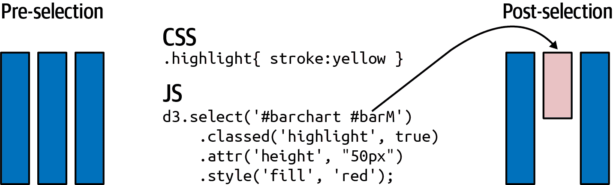

# 第十七章。介绍 D3—​柱状图的故事

在第十六章中，我们通过将诺贝尔奖可视化分解为组成部分来设想它。在本章中，我将通过展示如何构建我们所需的柱状图（参见图 17-1）温柔地向您介绍 D3。


###### 图 17-1\. 本章目标柱状图

D3 不仅仅是一个图表库。它是用来构建图表库等其他工具的库。那么为什么我通过传统的柱状图来向您介绍 D3 呢？首先，因为从头开始为其制作一个，对于第一次完全控制图表的外观和感觉，并且不受特定图表库的偏见的经验，应该会有一些小小的兴奋。其次，因为这恰好是学习 D3 的基本要素的绝佳方式，特别是数据连接和输入-输出-移除更新模式，现在由 D3 的新 `join` 方法很好地封装。如果您掌握了这些基础知识，您将能够运用 D3 提供的全部力量和表现力，创造出比柱状图更有创意的东西。

我们将使用一些在第四章中涵盖的 Web 开发技术，特别是 D3 的专长之一：SVG 图形（请参见“可伸缩矢量图形”）。您可以使用像[CodePen](https://codepen.io)或[VizHub](https://vizhub.com)这样的在线编辑器尝试代码片段（VizHub 还有大量精选的数据可视化示例）。

在我们开始构建柱状图之前，让我们考虑它的各个元素。

# 定位问题

柱状图有三个关键组成部分：轴、图例和标签，当然还有柱形。由于我们正在制作一个现代化、交互式的柱状图组件，我们需要轴和柱形能够根据用户交互进行转换—特别是通过顶部选择器筛选得奖者集合（见图 15-1）。

我们将逐步构建图表，最终使用 D3 过渡效果，这可以使您的 D3 创作更加引人入胜和吸引人。但首先我们将介绍 D3 的基础知识：

+   在你的网页中选择 DOM 元素

+   获取和设置它们的属性、属性和样式

+   追加和插入 DOM 元素

在这些基础知识牢固的基础上，我们将继续探讨数据绑定的乐趣，这是 D3 开始发挥其作用的地方。

# 处理选择集

选择是 D3 的支柱。使用类似于 jQuery 的 CSS 选择器，D3 可以选择和操作单个和分组的 DOM 元素。所有的 D3 链式操作都是从使用 `select` 和 `selectAll` 方法选择 DOM 元素或元素集开始的。`select` 返回第一个匹配的元素；`selectAll` 返回匹配的元素集。

图 17-2 显示了使用 `select` 和 `selectAll` 方法的 D3 选择示例。这些选择用于更改一个或多个条形图的 `height` 属性。`select` 方法返回具有类 `bar` 的第一个 `rect`（ID `barL`），而 `selectAll` 可以根据提供的查询返回任意组合的 `rect`。


###### 图 17-2\. 选择元素并更改属性：使用初始 HTML 构建了三个矩形。然后进行选择，并调整了一个或多个条的高度属性。

除了设置属性（DOM 元素上的命名字符串；例如，`id` 或 `class`），D3 还允许您设置元素的 CSS 样式、属性（例如，复选框是否选中）、文本和 HTML。

图 17-3 显示了使用 D3 更改 DOM 元素的所有方法。通过这些少数方法，您可以实现几乎任何外观和感觉。


###### 图 17-3\. 使用 D3 更改 DOM 元素

图 17-4 显示了我们如何通过向元素添加类或直接设置样式来应用 CSS 样式。我们首先通过其 ID `barM` 选择中间的条形图。然后使用 `classed` 方法来应用黄色高亮（参见 CSS）并将 `height` 属性设置为 50 像素。接着使用 `style` 方法直接将条形图填充为红色。



###### 图 17-4\. 设置属性和样式

D3 的 `text` 方法设置适用 DOM 标签的文本内容，例如 `div`、`p`、`h*` 标题和 SVG 文本元素。要看到 `text` 方法的实际效果，让我们创建一个带有一些 HTML 的小标题占位符：

```py
<!DOCTYPE html>
<meta charset="utf-8">

<style>font-family: sans-serif;</style>

<body>
  <h2 id="title">title holder</h2>
</body>
```

图 17-5（之前）显示了生成的浏览器页面。

现在让我们创建一个 `fancy-title` 的 CSS 类，具有大号和粗体字体：

```py
.fancy-title {
    font-size: 24px;
    font-weight: bold;
}
```

现在我们可以使用 D3 选择标题头，向其添加 `fancy-title` 类，并将其文本设置为“我的条形图”：

```py
d3.select('#title')
  .classed('fancy-title', true)
  .text('My Bar Chart');
```

图 17-5（之后）显示了生成的放大和加粗的标题。


###### 图 17-5\. 使用 D3 设置文本和样式

除了设置 DOM 元素的属性之外，我们还可以使用选择来获取这些属性。在 图 17-3 中列出的方法中省略第二个参数，可以获取有关网页设置的信息。

图 17-6 显示了如何从 SVG 矩形中获取关键属性。正如我们将看到的那样，从 SVG 元素获取像 `width` 和 `height` 这样的属性对于程序化的适应和调整非常有用。


###### 图 17-6\. 获取 `rect` 条形图的详细信息

图 17-7 演示了`html`和`text`获取方法。创建一个小列表（ID 为`silly-list`）后，我们使用 D3 选择它并获取各种属性。`html`方法返回列表子`<li>`标签的 HTML，而`text`方法返回列表中包含的文本，去除了 HTML 标签。请注意，对于父标签，返回的任何文本格式有些混乱，但对于一两个字符串搜索可能已足够。


###### 图 17-7\. 从`list`标签获取 HTML 和文本

到目前为止，我们一直在操作现有 DOM 元素的属性、样式和属性。这是一个有用的技能，但当我们开始使用其`append`和`insert`方法以编程方式创建 DOM 元素时，D3 变得更加强大。现在让我们来看看这些。

# 添加 DOM 元素

我们已经看到如何选择和操作 DOM 元素的属性、样式和属性。现在我们将看到 D3 如何允许我们附加和插入元素，以编程方式调整 DOM 树。

我们将从一个包含`nobel-bar`占位符的小 HTML 框架开始：

```py
<!DOCTYPE html>
<meta charset="utf-8">
<link rel="stylesheet" href="style.css" />

<body>
  <div id='nobel-bar'></div>

  <script
    src="https://cdnjs.cloudflare.com/ajax/libs/d3/7.3.1/d3.min.js">
  </script>
  <script type="text/javascript" src="script.js"></script> 
</body>
```


*script.js*文件是我们将添加条形图 JavaScript 代码的地方。

让我们通过一些 CSS 设置`nobel-bar`元素的大小，放在*style.css*中：

```py
#nobel-bar {
  width: 600px;
  height: 400px;
}

.bar {
    fill: blue; /* blue bars for the chapter */
}
```

通常，使用 D3 创建图表时，首先要为其提供一个 SVG 框架。这涉及将一个`<svg>`画布元素附加到一个`div` chartholder 上，然后将一个`<g>`组附加到`<svg>`上以容纳特定的图表元素（在我们的情况下是图表条）。这个组有边距来容纳轴、轴标签和标题。

按照惯例，您将在一个`margin`对象中指定图表的边距，然后使用该对象和图表容器的 CSS 指定宽度和高度来推导出图表组的宽度和高度。所需的 JavaScript 看起来像是示例 17-1。

##### 示例 17-1\. 获取我们条形图的尺寸

```py
    var chartHolder = d3.select("#nobel-bar");

    var margin = {top:20, right:20, bottom:30, left:40};

    var boundingRect = chartHolder.node()
      .getBoundingClientRect(); 
    var width = boundingRect.width - margin.left - margin.right,
    height = boundingRect.height - margin.top - margin.bottom;
```


获取我们 Nobel 条形图面板的边界矩形，用它来设置其条形容器组的宽度和高度。

有了我们条形图组的宽度和高度，我们使用 D3 来构建图表的框架，附加所需的`<svg>`和`<g>`标签，并指定 SVG 画布的大小和条形图组的平移：

```py
d3.select('#nobel-bar').append("svg")
    .attr("width", width + margin.left + margin.right)
    .attr("height", height + margin.top + margin.bottom)
    .append("g").classed('chart', true)
    .attr("transform", "translate(" + margin.left + ","
                                  + margin.top + ")");
```

这改变了`nobel-bar`内容块的 HTML：

```py
...
    <div id="nobel-bar">
      <svg width="600" height="400">
        <g class="chart" transform="translate(40, 20)"></g>
      </svg>
    </div>
...
```

结果的 SVG 框架显示在图 17-8 中。`<svg>`元素的宽度和高度是其子组和周围边距的总和。使用`transform`偏移子组，将其向右平移`margin.left`像素，并向下平移`margin.top`像素（根据 SVG 约定，向正 y 方向）。


###### 图 17-8\. 构建我们的条形图框架

使用`append`添加几个条形图，我们将使用一些虚拟数据：一个包含诺贝尔奖获得国家顶级奖项数量的对象数组。

```py
var nobelData = [
    {key:'United States', value:336},
    {key:'United Kingdom', value:98},
    {key:'Germany', value:79},
    {key:'France', value:60},
    {key:'Sweden', value:29},
    {key:'Switzerland', value:23},
    {key:'Japan', value:21},
    {key:'Russia', value:19},
    {key:'Netherlands', value:17},
    {key:'Austria', value:14}
];
```

要构建一个粗糙的条形图，^1 我们可以遍历`nobelData`数组，在我们前进的同时向图表组附加一根条。示例 17-2 演示了这一点。在为图表构建基本框架之后，我们遍历`nobelData`数组，使用`value`字段设置条的高度和 y 位置。图 17-9 显示了如何使用对象值向我们的图表组添加条。请注意，因为 SVG 使用向下的 y 轴，您必须通过条形图的高度减去条形图的高度来放置条形图以正确放置。正如我们将在后面看到的，通过使用 D3 的比例尺，我们可以限制这种几何上的记账工作。

##### 示例 17-2。使用`append`构建简单的条形图

```py
var buildCrudeBarchart = function() {

    var chartHolder = d3.select("#nobel-bar");

    var margin = {top:20, right:20, bottom:30, left:40};
    var boundingRect = chartHolder.node().getBoundingClientRect();
    var width = boundingRect.width - margin.left - margin.right,
    height = boundingRect.height - margin.top - margin.bottom;
    var barWidth = width/nobelData.length;

    var svg = d3.select('#nobel-bar').append("svg")
        .attr("width", width + margin.left + margin.right)
        .attr("height", height + margin.top + margin.bottom)
        .append("g").classed('chart', true)
        .attr("transform", "translate(" + margin.left + ","
        + margin.top + ")");

    nobelData.forEach(function(d, i) { 
        svg.append('rect').classed('bar', true)
            .attr('height', d.value)
            .attr('width', barWidth)
            .attr('y', height - d.value)
            .attr('x', i * (barWidth));
    });
};
```


遍历`nobelData`中的每个对象，`forEach`方法向匿名函数提供对象和数组索引。


###### 图 17-9。使用 D3 编程基本条形图

D3 向 DOM 树添加元素的另一种方法是使用其`insert`方法。`insert`的工作方式类似于`append`，但添加了第二个选择器参数，允许您在标签序列中的特定位置之前插入元素，例如在有序列表的开头。图 17-10 演示了`insert`的使用：选择`silly-list`中的列表项就像`append`一样，然后第二个参数（例如，`:first-child`）指定要插入的元素。


###### 图 17-10。使用 D3 的`insert`方法添加列表项

对于 SVG 元素，使用 x 和 y 坐标直接定位在其父组中，`insert`可能看起来是多余的。但是，正如在“分层和透明度”中讨论的那样，DOM 的顺序在 SVG 中很重要，因为元素是分层的，这意味着 DOM 树中的最后一个元素覆盖了之前的任何元素。我们将在第十九章中看到一个例子，我们在世界地图上有一个网格叠加物（或`graticule`）。我们希望这个网格在所有其他地图元素之上绘制，因此使用`insert`将这些元素放在它之前。

我们在图 17-9 中的粗糙条形图需要一点改进。让我们看看如何通过 D3 强大的`scale`对象和 D3 最大的想法——数据绑定来改善事物。

# 利用 D3

在示例 17-2 中，我们使用 D3 构建了一个基本的简单条形图。这个图表有很多问题。首先，循环遍历数据数组有些笨拙。如果我们想要调整数据集以适应我们的图表，该怎么办？我们需要一些方法来根据响应添加或删除条形，并使用新数据更新结果条形并重新绘制一切。我们还需要保持在 x 和 y 上的条形尺寸比例以反映不同数量的条形和不同的最大条形值。这已经是相当多的繁琐工作了，事情可能会很快变得混乱。此外，我们应该把变化的数据集保存在哪里？对我们的图表进行任何数据驱动的更改都需要传递数据集，然后构建一个循环来迭代元素。感觉数据存在于链式 D3 工作流之外，而实际上它需要成为其不可分割的一部分。

优雅地将我们的数据集与 D3 集成的解决方案在于数据绑定的概念，这是 D3 的最大想法。比例尺问题由 D3 最有用的实用程序库之一解决：比例尺。现在我们将看看这些，并释放 D3 的力量进行数据绑定。

# 使用 D3 比例尺进行测量

D3 比例尺背后的基本思想是将输入域映射到输出范围。这一简单的过程可以消除构建图表、可视化等过程中的许多烦琐细节。随着您对比例尺的熟悉程度越来越高，您会发现越来越多的情况可以应用它们。掌握它们是轻松使用 D3 的关键组成部分。

D3 提供了许多比例尺，将它们分为三大类：定量、序数和时间^(2)比例尺。有各种各样的映射来适应几乎所有可能的情况，但您可能会发现自己大部分时间使用线性和序数比例尺。

在使用中，D3 的比例尺可能看起来有些奇怪，因为它们既是对象的一部分，又是函数的一部分。这意味着，在创建比例尺后，您可以调用它的各种方法来设置其属性（例如`domain`用于设置其域），但您也可以将其作为一个带有域参数的函数来返回一个范围值。下面的例子应该能清楚地说明区别：

```py
var scale = d3.scaleLinear(); // create a linear scale scale.domain([0, 1]).range([0, 100]); 
scale(0.5) // returns 50 
```


我们使用比例尺的`domain`和`range`方法，将 0 到 1 映射到 0 到 100。


我们将像一个带有域参数`0.5`的函数称为比例尺，返回一个范围值`50`。

让我们来看看两种主要的 D3 比例尺，定量和序数，看看我们如何在构建条形图时使用它们。

## 定量比例尺

使用 D3 的定量比例尺时，通常用于构建折线图、柱状图、散点图等，是`linear`，将连续的域映射到连续的范围上。例如，我们希望柱子的高度是`nobelData`值的线性函数。要映射的值范围在柱子的最大和最小高度之间（400 像素到 0 像素），映射的域从最小的可行值（0）到数组中的最大值（336 位美国获奖者）。在下面的代码中，我们首先使用 D3 的`max`方法获取`nobelData`数组中的最大值，用于指定我们的域的结束位置：

```py
let maxWinners = d3.max(nobelData, function(d){
                   return +d.value; 
                 });

let yScale = d3.scaleLinear()
                 .domain([0, maxWinners]) /* [0, 336] */
                 .range([height, 0]);
```


如果有可能，就像 JSON 编码数据通常那样，值是一个字符串，用*+*前缀将其强制转换为数字。

要注意的一个小技巧是，我们的范围从其最大值开始减少。这是因为我们希望使用它来指定沿 SVG 向下 y 轴的正向位移，以使柱状图的 y 轴向上指向（即，柱子越小，所需的 y 位移就越大）。反之，您可以看到最大的柱子（美国的获奖者统计）根本没有位移（见图 17-11）。


###### 图 17-11。使用 D3 的线性比例尺来固定柱状图的 y 轴的域和范围

我们为柱状图的 y 轴使用了最简单的线性比例尺，从一个数值范围映射到另一个数值范围，但是 D3 的线性比例尺可以做更多。理解这一点的关键是 D3 的`interpolate`方法。^(3)它接受两个值并返回它们之间的插值器。因此，在我们的`yScale`的范围中，在图 17-11 中，`interpolate`返回 400 和 0 的数值插值器：

```py
var numInt = d3.interpolate(400, 0);

numInt(0); //   400 
numInt(0.5); // 200 numInt(1); //   0
```


插值器默认的域是[0,1]。

`interpolate`方法不仅可以处理数字，还可以处理字符串、颜色代码甚至对象。您还可以为您的域数组指定多于两个数字——只需确保域和范围数组的大小相同。^(4)我们可以结合这两个事实创建一个有用的色彩图：^(5)

```py
var color = d3.scaleLinear()
    .domain([-1, 0, 1])
    .range(["red", "green", "blue"]);

color(0) // "#008000" green's hex code
color(0.5) // "004080" slate blue
```

D3 的线性比例尺有许多有用的实用方法和丰富的功能。数值映射可能是您的主力比例尺，但我建议阅读[D3 文档](https://oreil.ly/lZy94)以充分了解线性比例尺的灵活性。在该网页上，您将找到 D3 的其他定量比例尺，几乎可以适应每一个定量的场合：

+   功率比例尺，类似于线性但具有指数变换（例如，`sqrt`）。

+   对数比例尺，类似于线性但具有对数变换。

+   量化标度，线性的变体，具有离散范围；即使输入是连续的，输出也被分成段或桶（例如，[1, 2, 3, 4, 5]）。

+   分位数标度，通常用于颜色调色板，与量化标度类似，但具有离散或桶装的域以及范围。

+   同一域和范围的恒等标度（相当神秘）。

量化标度非常适合处理连续值，但通常我们需要基于离散域（例如名称或类别）获取值。D3 具有一组专门的序数标度来满足这种需求。

## 序数标度

序数标度将一个值数组作为其域，并将这些值映射到离散或连续的范围，为每个值生成一个映射值。要明确创建一对一映射，我们使用标度的 `range` 方法：

```py
var oScale = d3.scaleOrdinal()
               .domain(['a', 'b', 'c', 'd', 'e'])
               .range([1, 2, 3, 4, 5]);

oScale('c'); // 3
```

在我们的条形图案例中，我们希望将一个索引数组映射到连续范围，以提供条的 x 坐标。为此，我们可以使用带状标度 `scaleBand` 的 `range` 或 `rangeRound` 方法，后者将输出值四舍五入到单个像素。在这里，我们使用 `rangeRound` 将数字数组映射到连续范围，并将输出值四舍五入为整数像素值：

```py
var oScale = d3.scaleBand()
               .domain([1, 2, 3, 4, 5])
               .rangeRound([0, 400]);

oScale(3) // 160
oScale(5) // 320
```

在构建我们最初的粗略条形图（示例 17-2）时，我们使用了 `barWidth` 变量来调整条的大小。实现条之间的填充需要一个填充变量和对 `barWidth` 以及条位置的必要调整。使用我们新的序数带状标度，我们免费获得这些内容，避免了繁琐的记账工作。调用 `xScale` 的 `bandwidth` 方法提供了计算出的条宽度。我们还可以使用标度的 `padding` 方法指定条之间的填充为每个条所占空间的一部分。`bandwidth` 值会相应调整。以下是一些实际应用示例：

```py
var oScale = d3.scaleBand()
               .domain([1, 2]); 

oScale.rangeRound([0, 100]); 
oScale(2); // 50 oScale.bandwidth(); // 50 

oScale.rangeRound([0, 100]);
oScale.padding(0.1) // pBpBp 
oScale(1); // 5 oScale(2); // 52 oScale.bandwidth(); // 42, the padded bar width
```


存储标度并固定域；如果我们预期范围会改变，这很有用。


`rangeRound` 将输出值四舍五入为整数。


我们指定一个填充因子（`p`）为`0.1` * 分配给条形图（`B`）空间。

图 17-12 显示了我们条形图的带状 x 轴标度，填充因子为`0.1`。连续范围为 600（像素），即条形图的宽度，域是表示各个条的整数数组。如图所示，为 `xScale` 提供一个条的索引号将返回其在 x 轴上的位置。


###### 图 17-12\. 设置我们条形图 x 轴标度的域和范围，使用填充因子为 0.1。

拥有我们的 D3 标度后，让我们转向 D3 的核心概念，将数据绑定到 DOM 以便驱动对其的更改。

# 利用数据绑定/连接释放 D3 的强大功能

D3 代表*数据驱动文档*，到目前为止我们还没有真正利用我们的数据进行驾驶。为了释放 D3 的潜力，我们需要接受它的核心思想，即将数据集中的数据与其对应的 DOM 元素进行绑定或连接（在线上两个术语都有使用），并基于此集成更新网页（文档）。这一小步骤将数据与 DOM 元素结合起来，与最强大的 D3 方法`enter`和`exit`结合使用时，将会产生巨大的功能性。

经过多次迭代，D3（5 版及以上）现在提供了`join`方法，大大简化了`enter`和`exit`的使用。本章将重点介绍`join`方法。

要解读在线上成千上万使用旧的`enter`、`exit`、`remove`更新模式的示例，有助于了解 D3 数据连接背后的原理。详细内容请参见附录 A。

# 使用数据更新 DOM

我认为可以公平地说，使用 D3 来更新 DOM 以显示新数据在历史上并不容易理解（注：当您尝试教授它或撰写有关它的书籍章节时，您真的会很感慨）。过去有许多实现，比如[通用更新模式](https://oreil.ly/sYrAG)，它们本身也经历了许多不兼容的形式。这意味着很多网络上流行的例子，使用旧版本的 D3，将会引导您走向错误的方向。

###### 提示

尽管您可能预计只构建一次性图表，但通过单一数据绑定过程，养成问自己“如果我需要动态更改数据会怎样？”的习惯是很好的。如果答案不立即显而易见，您可能实施了一个糟糕的 D3 设计。及时发现这一点意味着您可以进行一些代码审计并做出必要的更改，以免事情开始恶化。养成这种习惯是好事，因为 D3 在某种程度上是一种手艺技能，不断重申最佳实践将在您需要时得到回报。

最新版本的 D3 已经巩固了基本方法，并且使它们更加简单。因此，使用`enter`、`exit`和`remove`这三个关键的 D3 方法来进行数据连接现在可以通过单个`join`方法来完成，这个方法有合理的默认设置。在本节中，我们将看到如何使用这四种方法来响应新数据更新我们的条形图，这里以诺贝尔奖获得国家为例。

可能 D3 背后最基本的概念是数据连接的概念。本质上，数据集（通常是数据对象的数组）用于创建一些视觉元素，例如条形图的矩形条。对这些数据的任何更改都会反映在可视化效果的变化上，例如条形图中的条数，或现有条形图的高度或位置。我们可以将这个操作分为三个阶段：

1.  使用`enter`为任何没有视觉元素的数据创建一个视觉元素。

1.  更新这些元素的属性和样式，如果需要，也更新任何现有元素。

1.  使用`exit`和`remove`方法移除任何不再与数据关联的旧视觉元素。

以往，D3 要求您自行实现更新模式，使用`enter`、`exit`和（简要地）`merge`方法，而新的[`join`](https://oreil.ly/4mg8b)方法将这些方法结合到一个用户友好的包中。通常您可以只用一个参数调用它，指定要与数据关联的视觉元素（例如 SVG rect 或 circle），但它也具有更精细的控制，允许您传入`enter`、`exit`和`update`回调函数。

看看现在通过将一些由 SVG 矩形构成的水平条形图与我们的虚拟诺贝尔数据集进行关联，关联数据和视觉元素有多容易。我们将以下数据集与矩形组进行关联，并用它创建一些水平条形图。您可以在[CodePen](https://oreil.ly/YOnzx)中找到一个工作代码示例。

```py
let nobelData = [
  { key: "United States", value: 336 },
  { key: "United Kingdom", value: 98 },
  { key: "Germany", value: 79 },
  { key: "France", value: 60 },
  { key: "Sweden", value: 29 },
  { key: "Switzerland", value: 23 },
  { key: "Japan", value: 21 }
];
```

我们将使用一些 HTML 和 CSS 创建一个 SVG 组来放置条形图，并使用蓝色填充创建一个 bar 类：

```py
<div id="nobel-bars">
  <svg width="600" height="400">
    <g class="bars" transform="translate(40, 20)"></g>
  </svg>
</div>

<style>
.bar {
  fill: blue;
}
</style>
```

带有数据和 HTML 结构的支撑，让我们看看 D3 的`join`方法的实际效果。我们将创建一个`updateBars`函数，它将接受一个键-值国家数据数组，并将其与一些 SVG 矩形进行关联。

`updateBars`函数接受一个数据数组，并首先使用`data`方法将其添加到类为`'bar'`的选择集中。如 Example 17-3 所示，然后使用`join`方法将此`bars`选择集与一些 SVG 矩形进行关联。

##### 示例 17-3。将我们的国家数据与一些 SVG 条形图进行关联

```py
function updateBars(data) {
  // select and store the SVG bars group
  let svg = d3.select("#nobel-bars g");
  let bars = svg.selectAll(".bar").data(data);

  bars
    .join("rect") 
    .classed("bar", true) 
    .attr("height", 10)
    .attr("width", d => d.value)
    .attr("y", function (d, i) {
      return i * 12;
    });
}
```


这将所有现有的条形图数据与 SVG `rect`元素进行关联。


`join`返回所有现有的`rect`，然后我们使用它们的关联数据更新它们。

调用`join`方法后，D3 正在进行明智的操作，使用`enter`、`exit`和`remove`来保持数据和视觉元素的同步。我们通过几次使用变化数据调用`updateBars`函数来演示这一点。首先，我们将切片我们诺贝尔数据集的前四个成员，并用它们来更新条形图：

```py
updateBars(nobelData.slice(0, 4));
```

这产生了这里显示的条形图：


现在让我们更新数据关联，仅使用诺贝尔数据数组的前两个成员：

```py
updateBars(nobelData.slice(0, 2));
```


调用此方法会产生前图像中显示的两个条形图。在幕后，D3 的记账系统已经移除了多余的矩形，这些矩形与较小的数据集不再关联任何数据。

现在让我们反向操作，看看如果我们使用更大的数据集会发生什么，这次是诺贝尔数组的前六个成员：

```py
updateBars(nobelData.slice(0, 6));
```


再次，D3 做了预期的事情（参见前一图像），这次向新数据对象追加新的矩形。

已经演示了 D3 的`join`成功地保持数据和视觉元素的同步，根据需要添加和删除矩形，我们现在有了构建诺贝尔柱状图的基础。

# 组装柱状图

现在让我们把本章学到的内容整合起来，构建我们柱状图的主要元素。我们将在这里充分利用 D3 的比例尺。

首先，我们将通过 ID *#nobel-bar* 选择我们柱状图的容器，并使用其尺寸（来自`boundingClientRectangle`）和一些边距设置来获取图表的宽度和高度：

```py
let chartHolder = d3.select('#nobel-bar')
let margin = { top: 20, right: 20, bottom: 35, left: 40 }
let boundingRect = chartHolder.node().getBoundingClientRect()
let width = boundingRect.width - margin.left - margin.right,
height = boundingRect.height - margin.top - margin.bottom
// some left-padding for the y-axis label
var xPaddingLeft = 20
```

现在我们将使用宽度和高度设置我们的比例尺：

```py
let xScale = d3.scaleBand()
  .range([xPaddingLeft, width]) // left-padding for y-label
  .padding(0.1)

let yScale = d3.scaleLinear().range([height, 0])
```

现在我们将使用宽度、高度和边距创建 SVG 图表组，并将其存储到一个变量中：

```py
var svg = chartHolder
    .append('svg')
    .attr('width', width + margin.left + margin.right)
    .attr('height', height + margin.top + margin.bottom)
    .append('g')
    .attr('transform', 'translate(' + margin.left + ',' + margin.top + ')')
```

在我们的 HTML 和 SVG 框架就位之后，让我们调整`updateBars`函数（参见示例 17-3）以响应我们真实的诺贝尔数据变化。更新函数将接收一个数据数组，格式如下：

```py
[ {key: 'United States', value: 336, code: 'USA'}
  {key: 'United Kingdom', value: 98, code: 'GBR'}
  {key: 'Germany', value: 79, code: 'DEU'} ... ]
```

当使用新数据调用`updateBarchart`函数时，首先会过滤掉任何获奖数量为零的国家，并更新 x 和 y 比例尺的域，以反映柱子/国家的数量和最大获奖数，如示例 17-4 所示（#update_bar_chart）。

##### 示例 17-4\. 更新柱状图

```py
let updateBarChart = function (data) {
  // filter out any countries with zero prizes by value
  data = data.filter(function (d) {
    return d.value > 0
  })
  // change the scale domains to reflect the newly filtered data
  // this produces an array of country codes: ['USA', 'DEU', 'FRA' ...]
  xScale.domain(
    data.map(d => d.code)
  )
  // we want to scale the highest number of prizes won, e.g., USA: 336
  yScale.domain([
    0,
    d3.max(data, d => d.value)
  ])
// ...
}
```

通过更新比例尺，我们可以使用数据连接创建所需的柱子。这与示例 17-3 中显示的功能本质上相同，但使用比例尺调整柱子的大小，并使用定制的`entry`方法向新创建的柱子添加类和左填充：

```py
let bars = svg
     .selectAll('.bar')
     .data(data)
     .join(
       (enter) => { 
         return enter
           .append('rect')
           .attr('class', 'bar')
           .attr('x', xPaddingLeft)
       }
     )
     .attr('x', d => xScale(d.code))
     .attr('width', xScale.bandwidth())
     .attr('y', d => yScale(d.value))
     .attr('height', d => height - yScale(d.value))
```


我们定制`enter`方法，向矩形添加`` bar` ``类。请注意，我们需要在`join`调用后返回`enter`对象以便使用。

现在我们有了一个根据数据变化响应的柱状图，本例中由用户启动。过滤所有化学奖数据显示结果见图 17-13。尽管缺少一些关键元素，但是构建柱状图的重要工作已完成。现在让我们添加轴和一些酷炫的过渡效果，为其添加最后的润色。


###### 图 17-13\. 最终柱状图

# 轴和标签

现在我们有了可用的更新模式，我们将添加轴和轴标签，这是任何体面柱状图所需的。

D3 并未提供很多高级图表元素，鼓励您自行构建。但它确实提供了一个方便的`axis`对象，可以减少手工创建 SVG 元素的工作量。它易于使用，并且与我们的数据更新模式完美配合，允许轴刻度和标签根据呈现的数据变化而变化。

为了定义我们的 x 和 y 轴，我们需要知道我们希望轴代表的范围和定义域。在我们的情况下，它与我们的 x 和 y 比例尺的范围和定义域相同，因此我们将这些供应给轴的`scale`方法。D3 轴还允许您指定它们的方向，这将固定刻度线和刻度标签的相对位置。对于我们的条形图，我们希望 x 轴位于底部，y 轴位于左侧。我们的序数 x 轴将为每个条形图设置一个标签，但对于 y 轴，刻度数的选择是任意的。十个看起来是一个合理的数字，所以我们使用`ticks`方法设置它。以下代码显示了如何声明我们的条形图的轴：

```py
let xAxis = d3.axisBottom().scale(xScale)

let yAxis = d3
  .axisLeft()
  .scale(yScale)
  .ticks(10)
  .tickFormat(function (d) {
    if (nbviz.valuePerCapita) { 
      return d.toExponential()
    }
    return d
  })
```


我们希望我们的刻度标签的格式与我们选择的度量标准（人均或绝对）一起改变。人均会产生一个非常小的数字，最好用指数形式表示（例如，0.000005 → 5e-6）。`tickFormat`方法允许您获取每个刻度的数据值并返回所需的刻度字符串。

我们还需要一些 CSS 来正确地样式化轴，移除默认的`fill`，设置描边颜色为黑色，并使形状呈现得清晰。我们还将在这里指定字体大小和字体系列：

```py
/* style.css */
.axis { font: 10px sans-serif; }
.axis path, .axis line {
    fill: none;
    stroke: #000;
    shape-rendering: crispEdges;
}
```

现在我们有了我们的`axis`生成器，我们需要一些 SVG 组来容纳它们生成的轴。让我们将这些作为具有合理类名的组添加到我们的主`svg`选择器中：

```py
svg.append("g")
    .attr("class", "x axis")
    .attr("transform", "translate(0," + height + ")"); 

svg.append("g")
        .attr("class", "y axis");
```


根据 SVG 的约定，y 从顶部向下测量，因此我们希望我们底部导向的 x 轴从图表的顶部向下移动*height*像素。

我们条形图的轴具有固定的范围（图表的宽度和高度），但它们的定义域将随用户筛选数据集而变化。例如，如果用户按经济学类别过滤数据，（国家）条的数量将减少：这将更改序数 x 比例尺（条数）和定量 y 比例尺（最大获奖者数）的定义域。我们希望显示的轴随这些变化的定义域变化，并进行良好的过渡。

示例 17-5 展示了如何更新轴。首先，我们使用新数据更新我们的比例尺定义域（A）。这些新的比例尺定义域在调用它们各自轴组上的轴生成器时反映出来。

##### 示例 17-5\. 更新我们的条形图的轴

```py
let updateBarChart = function(data) {
    // A. Update scale domains with new data
    xScale.domain( data.map(d => d.code) );
    yScale.domain([0, d3.max(data, d => +d.value)])
    // B. Use the axes generators with the new scale domains
    svg.select('.x.axis')
        .call(xAxis) 
        .selectAll("text") 
        .style("text-anchor", "end")
        .attr("dx", "-.8em")
        .attr("dy", ".15em")
        .attr("transform", "rotate(-65)");

    svg.select('.y.axis')
        .call(yAxis);
    // ... }
```


调用 D3 的`axis`在我们的 x 轴组元素上构建所有必要的轴 SVG，包括刻度和刻度标签。D3 的`axis`使用内部更新模式来实现对新绑定数据的过渡。


创建 x 轴后，我们对生成的文本标签进行了一些 SVG 操作。首先，我们选择了轴的`text`元素，刻度标签。然后，我们将它们的文本锚点放置在元素的末端，并稍微移动它们的位置。这是因为文本是围绕其锚点旋转的，而我们希望围绕现在位于刻度线下方的国家标签的末端旋转。我们操作的结果显示在图 17-16 中。请注意，如果不旋转标签，它们将彼此合并。


###### 图 17-16。x 轴上重新定向的刻度标签

现在我们有了工作的坐标轴，让我们给 x 轴添加一个小标签，然后看看条形图如何处理我们的真实数据：

```py
let xPaddingLeft = 20 

let xScale = d3.scaleBand()
  .range([xPaddingLeft, width])
  .padding(0.1)
//... svg.append("g")
    .attr("class", "y axis")
    .append("text")
    .attr('id', 'y-axis-label')
    .attr("transform", "rotate(-90)") 
    .attr("y", 6)
    .attr("dy", ".71em") 
    .style("text-anchor", "end")
    .text('Number of winners');
```


左填充常数，以像素为单位，以为 y 轴标签让路。


将文本逆时针旋转到正立的位置。


`dy`是相对坐标[相对于刚刚指定的*y*坐标(6)]。通过使用`em`单位(相对于字体大小)，我们可以对文本边距和基线进行方便的调整。

图 17-17 显示了我们为化学奖获得者数据集应用分类选择器过滤器后的结果。条形宽度增加以反映国家数量的减少，并且两个坐标轴都适应了新数据集。


###### 图 17-17。我们应用化学奖获得者分类筛选器前后的诺贝尔奖条形图

现在我们有了一个工作的条形图，使用更新模式来根据用户驱动的数据集调整自身。但是，尽管它功能齐全，但是响应数据更改的转换在视觉上仍然很突然，甚至令人不适。使变化更具吸引力甚至具有信息性的一种方式是在短时间内持续更新图表，使保留的国家条从其旧位置移动到新位置，同时调整其高度和宽度。这种持续的转换确实为可视化添加了生命，并且在许多最令人印象深刻的 D3 作品中都可以看到。好消息是，转换已经紧密集成到 D3 的工作流程中，这意味着您可以以几行代码的成本实现这些酷炫的视觉效果。

# 转换

就目前而言，我们的条形图功能完善。它通过添加或删除条形元素以及使用新数据更新它们来响应数据变化。但是，从一种数据反映到另一种数据反映的立即变化会感到有点生硬和视觉上的不协调。

D3 的过渡效果提供了平滑更新元素的能力，使它们在设定的时间段内持续变化。这既可以美观，有时还能提供信息。^(7) 重要的是，D3 的过渡效果能够极大地提升用户的参与感，这已经足够成为掌握它们的理由了。

图 17-18 展示了我们要达到的效果。当使用新选择的数据集更新条形图时，我们希望存在于过渡前后的任何国家的条形图能够平滑地从旧位置和尺寸过渡到新位置和尺寸，如图中的法国条形图在过渡过程中逐渐增长，大约几秒钟，其间的条形图宽度和高度逐渐增加。随着 x 和 y 轴比例尺的变化，轴的刻度和标签也会相应调整。


###### 图 17-18\. 更新时的平滑条形图过渡效果

如图 17-18 所示的效果出奇地容易实现，但需要理解 D3 中数据绑定的精确方式。默认情况下，当新数据绑定到现有的 DOM 元素时，是通过数组索引进行的。如图 17-19 所示，使用我们选定的条形图作为示例。第一个条形图（B0），之前绑定了美国的数据，现在绑定了法国的数据。它保持在第一位置并更新其大小和刻度标签。实质上，美国的条形图变成了法国的。^(9)


###### 图 17-19\. 默认情况下，新数据通过索引进行关联

为了在我们的过渡中实现连续性（例如，使美国的条形图移动到其新位置同时改变其新的高度和宽度），我们需要将新数据绑定到一个唯一的键而不是索引。D3 允许您将函数作为`data`方法的第二个参数，该函数从对象数据中返回一个键，用于将新数据绑定到正确的条形图上，假设它们仍然存在。如图 17-20 所示。现在，第一个条形图（0）与新的美国数据绑定在一起，通过索引改变其位置以及其宽度和高度为新的美国条形图。


###### 图 17-20\. 使用对象键连接新数据

通过键值连接数据可以为我们的国家条形图提供正确的起始点和终点。现在我们只需找到一种方法，在它们之间实现平滑的过渡。我们可以通过使用 D3 最酷的方法之一，即`transition`和`duration`，来做到这一点。在我们改变条形图的尺寸和位置属性之前调用这些方法，D3 就会神奇地在它们之间实现平滑过渡，如图 17-18 所示。在我们的条形图更新中添加过渡效果只需要几行代码：

```py
// nbviz_core.mjs nbviz.TRANS_DURATION = 2000 // time in milliseconds // nbviz_bar.mjs import nbviz from ./nbviz_core.mjs
//... svg.select('.x.axis')
    .transition().duration(nbviz.TRANS_DURATION) 
    .call(xAxis) //... //... svg.select('.y.axis')
    .transition().duration(nbviz.TRANS_DURATION)
    .call(yAxis);
//... var bars = svg.selectAll(".bar")
    .data(data, d => d.code) 
//... let bars = svg.selectAll('.bar')
  .data(data, (d) => d.code)
  .join(
   // ...
  )
  .classed('active', function (d) {
    return d.key === nbviz.activeCountry
  })
  .transition()
  .duration(nbviz.TRANS_DURATION)
  .attr("x", (d) => xScale(d.code)) 
  .attr("width", xScale.bandwidth())
  .attr("y", (d) => yScale(d.value))
  .attr("height", (d) => height - yScale(d.value));
```


一个持续时间为两秒的过渡，即我们的 `TRANS_DURATION` 常量为 2000 (ms)。


使用数据对象的 `code` 属性进行连续数据连接。


`x`、`y`、`width` 和 `height` 属性将平滑地从当前值变形为这里定义的值。

过渡效果将作用于现有 DOM 元素的大多数明显属性和样式。^(10)

刚刚展示的过渡效果可以使属性平稳地从起始点变化到目标点，但是 D3 允许对这些效果进行大量调整。例如，您可以使用 `delay` 方法指定过渡开始前的时间。这个延迟也可以是数据的一个函数。

可能最有用的额外过渡方法是 `ease`，它允许您指定在过渡期间更新元素属性的方式。默认的缓动函数是 [`CubicInOut`](https://oreil.ly/zP5FO)，但您也可以指定像 `quad` 这样的东西，它会随着过渡的进行加速，或者像 `bounce` 和 `elastic` 这样的东西，它们基本上做它们名字上说的事情，给变化带来有弹性的感觉。还有 `sin`，它在开始时加速，朝结束时减速。参见 [*easings.net*](https://easings.net) 以了解不同的缓动函数的详细描述，以及 [observablehq](https://oreil.ly/crI0I) 以获取 D3 缓动函数的全面运行说明，辅以交互式图表。

如果 D3 提供的缓动函数不符合您的需求，或者您感觉特别雄心勃勃，那么像大多数 D3 的东西一样，您可以自己编写以满足任何微妙的要求。 `tween` 方法提供了您可能需要的精细控制。

通过工作中基于 `join` 的更新模式和一些酷炫的过渡效果，我们完成了我们的诺贝尔奖条形图。总是有改进的空间，但这个条形图将超出工作要求。在继续研究我们的诺贝尔奖可视化的其他组件之前，让我们总结一下这一相当大的章节中我们学到的东西。

## 更新条形图

当导入条形图模块时，它将一个回调函数附加到核心模块中的回调数组中。当以用户交互响应方式更新数据时，将调用此回调函数，并使用新的国家数据更新条形图：

```py
nbviz.callbacks.push(() => { 
  let data = nbviz.getCountryData()
  updateBarChart(data)
})
```


当数据更新时，在核心模块中调用这个匿名函数。

# 概要

这是一个庞大且相当具有挑战性的章节。D3 不是最容易学习的库，但我通过将事物分解成可消化的部分来平缓学习曲线。花些时间吸收基本思想，关键是开始为自己设定一些小目标，以扩展你的 D3 知识。我认为 D3 在很大程度上是一种艺术形式，比大多数库更是如此，你会在实践中学习。

理解和有效应用 D3 的关键要素是更新模式和涉及的数据绑定。如果你在基本水平上理解了这一点，D3 的其他大部分花哨的功能将很容易上手。专注于 `data`、`enter`、`exit` 和 `remove` 方法，并确保你真正理解发生了什么。这是从 D3 编程的大多数“复制粘贴”风格中进步的唯一途径，虽然最初是有效的（因为有很多酷炫的例子），但最终会令人沮丧。使用浏览器的开发者工具控制台（目前 Chrome 和 Chromium 在这方面拥有最佳工具）检查 DOM 元素，查看通过 `__data__` 变量绑定的数据。如果与你的预期不符，通过找出原因来学习会让你收获良多。

你现在应该对 D3 的核心技术有了相当扎实的基础。在下一章中，我们将挑战这些新技能，制作一个更为雄心勃勃的图表，即我们的诺贝尔奖时间线。

^(1) 当我们将国家的诺贝尔奖获奖次数从绝对值改为人均值时，显示的大量移动，随着国家柱形图改变顺序，强调了两种指标之间的差异。

^(2) 详细列表请见[D3 的 GitHub 页面](https://oreil.ly/xiKUs)。

^(3) 完整详情请参阅[D3 文档](https://oreil.ly/2IXaF)。

^(4) D3 将截取较大者。

^(5) D3 拥有许多内置的颜色地图和复杂的颜色处理，包括 RGB、HCL 等。我们将在接下来的几章中看到其中一些实际应用。

^(6) 坐标轴遵循了迈克·博斯托克在[*Towards Reusable Charts*](https://oreil.ly/FOEoe)中提出的类似模式，利用 JavaScript 对象的 [`call`](https://oreil.ly/4vVp3) 方法在所选 DOM 元素上构建 HTML。

^(7) 例如，当我们将诺贝尔奖的国家获奖情况从绝对值改为人均值时，国家柱形图的大量移动强调了两种度量标准之间的差异。

^(8) 在动画和计算机图形领域，这种效果被称为*tweening*（参见[此 Wikipedia 页面](https://oreil.ly/vr9QY)）。

^(9) 请查看迈克·博斯托克在[他的网站](https://oreil.ly/QZuYK)上对对象恒定性的精彩演示。

^(10) 过渡效果仅适用于现有元素——例如，你不能淡入创建的 DOM 元素。但是，你可以通过使用 `opacity` CSS 样式来实现淡入淡出效果。
