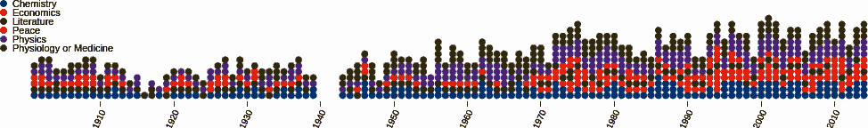
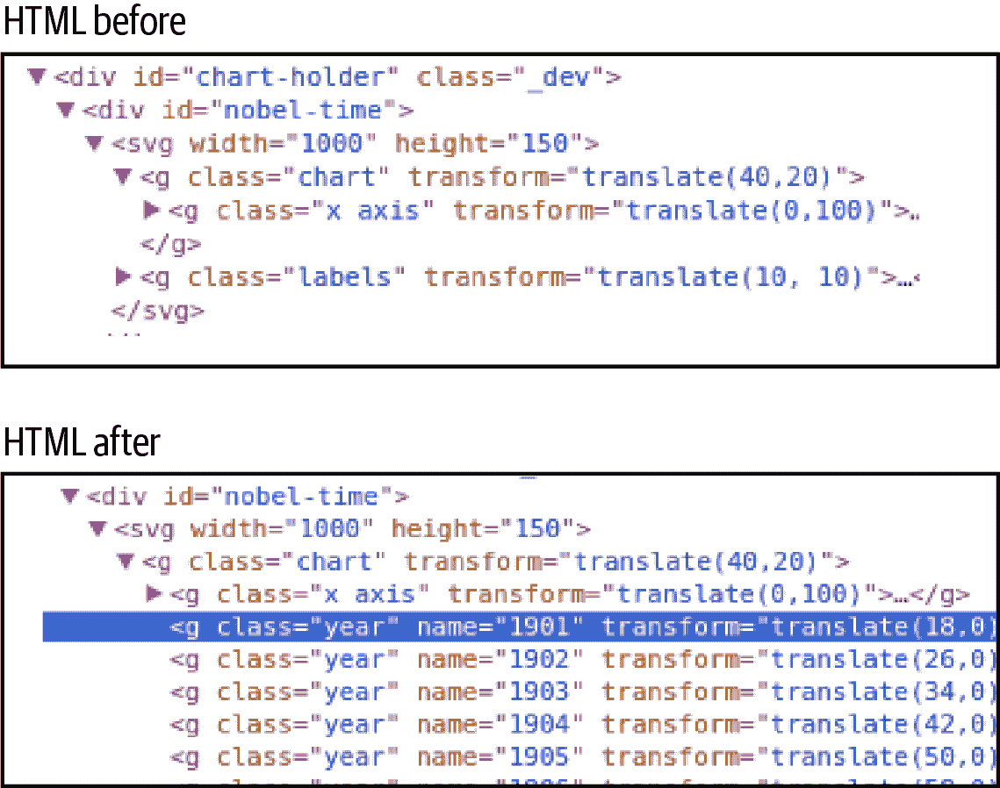
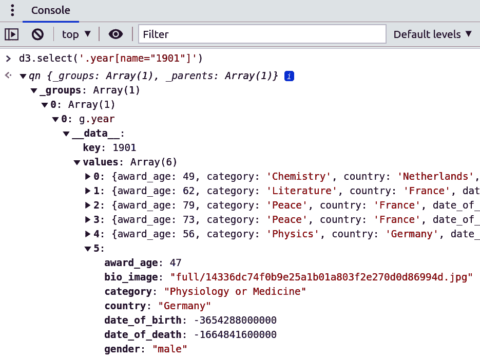
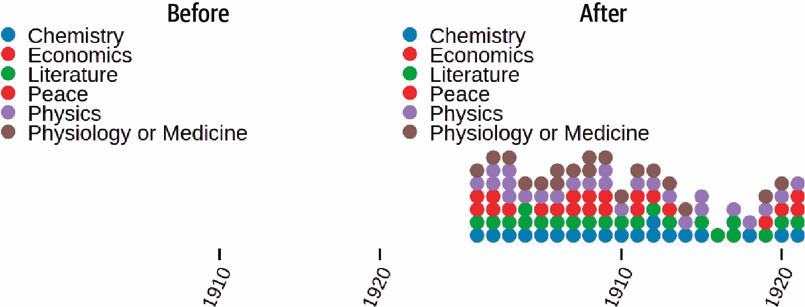
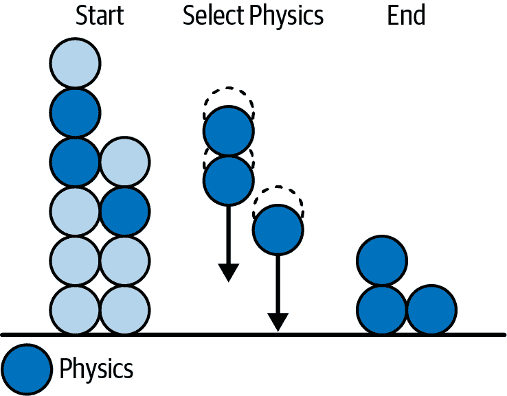

# 第十八章\. 可视化个别奖项

在第十七章中，您学习了 D3 的基础知识，如何选择和更改 DOM 元素，如何添加新元素以及如何应用数据更新模式，这是交互式 D3 的核心。在本章中，我将扩展您迄今所学，并向您展示如何构建一个相当新颖的视觉元素，显示每年的所有个别诺贝尔奖（图 18-1）。这个诺贝尔奖时间线将使我们扩展上一章的知识，演示许多新技术，包括更高级的数据操作。



###### 图 18-1\. 本章的目标图表，诺贝尔奖的时间线

让我们首先展示如何为我们的时间线图表构建 HTML 框架。

# 构建框架

我们目标图表的构建方式类似于上一章详细介绍的诺贝尔奖条形图。我们首先使用 D3 选择带有 ID `nobel-time` 的 `<div>` 容器，然后使用容器的宽度和高度以及指定的边距来创建我们的 `svg` 图表组：

```py
import nbviz from './nbviz_core.mjs'

let chartHolder = d3.select('#nobel-time');

let margin = {top:20, right:20, bottom:30, left:40};
let boundingRect = chartHolder.node()
  .getBoundingClientRect();
let width = boundingRect.width - margin.left
- margin.right,
height = boundingRect.height - margin.top - margin.bottom;

let svg = chartHolder.append("svg")
        .attr("width", width + margin.left + margin.right)
        .attr("height", height + margin.top
        + margin.bottom)
        .append('g')
          .attr("transform",
                  "translate(" + margin.left + ","
                  + margin.top + ")");
    // ...
})
```

在我们的 `svg` 图表组准备好之后，让我们添加比例尺和轴线。

# 比例尺

为了放置圆形指示器，我们使用了两个序数比例尺（示例 18-1）。x 比例尺使用 `rangeRoundBands` 方法指定圆形之间的 10%填充。由于我们使用 x 比例尺设置圆形的直径，因此我们的 y 比例尺的范围高度手动调整以容纳所有指示器，允许它们之间略有填充。我们使用 `rangeRoundPoints` 来将坐标舍入到整数像素。

##### 示例 18-1\. 图表的两个序数带比例尺，用于 x 和 y 轴

```py
let xScale = d3.scaleBand()
  .range([0, width])
  .padding(0.1) 
  .domain(d3.range(1901, 2015))

let yScale = d3.scaleBand()
  .range([height, 0]).domain(d3.range(15)) 
```


我们使用了 0.1 的填充因子，大约是指示器直径的 10%。


域是[0, …​, 15]，15 是任何一年中颁发的历史最高奖项数。

与上一章的条形图不同，此图的范围和域都是固定的。 `xScale` 的域是诺贝尔奖设立的年份，而 `yScale` 的域是从零到任意一年中最大奖项数（例如 2000 年的 14 个奖项）。这两者都不会因用户交互而改变，因此我们在 `update` 方法之外定义它们。

# 轴线

在任何一年最多有 14 个奖项并且每个奖项都有一个圆形指示器的情况下，如果需要，可以轻松通过眼睛获得奖项计数。基于此，强调相对奖项分布的指示器（例如显示二战后美国科学奖项的激增）和图表的长长度，我们的图表不需要 y 轴。

对于 x 轴，标注每个十年的开始似乎是合适的。这样可以减少视觉杂乱，并且也是图表历史趋势的标准人类方式。Example 18-2 展示了我们的 x 轴的构建，使用了 D3 的方便的`axis`对象。我们使用`tickValues`方法重写刻度值，过滤域范围（1900 年至 2015 年），只返回以零结尾的日期。

##### 示例 18-2。制作 x 轴，每十年一个刻度标签

```py
let xAxis = d3.axisBottom()
    .scale(xScale)
    .tickValues(
      xScale.domain().filter(function (d, i) {
        return !(d % 10) 
      })
    )
```

](#co_visualizing_individual_prizes_CO2-1)

我们只想在每十年打勾，所以我们通过过滤 x 轴刻度值并使用它们的索引来选择仅可被 10 整除的值来创建刻度值。这些通过模数(`%`)10 得到 0，我们将不布尔运算符(`!`)应用于这些来产生`true`，这通过了过滤器。

这会对以 0 结尾的年份返回`true`，从而在每个十年的开始处给出一个刻度标签。

与比例尺一样，我们不预期轴会改变，^(1)所以我们可以在`updateTimeChart`函数接收数据集之前添加它们：

```py
svg.append("g") // group to hold the axis
    .attr("class", "x axis")
    .attr("transform", "translate(0," + height + ")")
    .call(xAxis) 
    .selectAll("text") 
    .style("text-anchor", "end")
    .attr("dx", "-.8em")
    .attr("dy", ".15em")
    .attr("transform", "rotate(-65)");
```

](#co_visualizing_individual_prizes_CO3-1)

在`svg`组上调用我们的 D3 轴，使用`axis`对象来构建轴元素。

](#co_visualizing_individual_prizes_CO3-2)

就像“轴和标签”中一样，我们将轴刻度标签旋转，将它们对角放置。

有了轴和比例尺，我们只需要在移动到图表的酷炫、交互式元素之前添加一点带有彩色类别标签的图例。

# 类别标签

我们的*静态*组件中最后一个是图例，包含在图 18-2 中显示的类别标签。


###### 图 18-2。类别图例

要创建图例，我们首先创建一个组，类名为`labels`，用于保存标签。我们将我们的`nbviz.CATEGORIES`数据绑定到此`labels`组上的`label`选择器上，输入绑定的数据，并为每个类别附加一个组，通过索引在 y 轴上偏移：

```py
let catLabels = chartHolder.select('svg').append('g')
        .attr('transform', "translate(10, 10)")
        .attr('class', 'labels')
        .selectAll('label').data(nbviz.CATEGORIES) 
        .join('g')
        .attr('transform', function(d, i) {
            return "translate(0," + i * 10 + ")"; 
        });
```

](#co_visualizing_individual_prizes_CO4-1)

我们将我们的类别数组（`["Chemistry", "Economics", …​]`）与`label`组结合使用标准的`data`后跟`join`方法。

](#co_visualizing_individual_prizes_CO4-2)

为每个类别创建一个组，垂直间距为 10 像素。

现在我们有了我们的`catLabels`选择，让我们在每个组中添加一个圆形指示器（与时间线中看到的相匹配）和文本标签：

```py
catLabels.append('circle')
    .attr('fill', (nbviz.categoryFill)) 
    .attr('r', xScale.bandwidth()/2); 

catLabels.append('text')
    .text(d => d)
    .attr('dy', '0.4em')
    .attr('x', 10);
```

](#co_visualizing_individual_prizes_CO5-1)

我们使用我们共享的`categoryFill`方法根据绑定的类别返回颜色。

](#co_visualizing_individual_prizes_CO5-2)

x 轴的`bandwidth`方法返回两个类别标签之间的距离。我们将使用其中一半来获得我们圆形标签标记的半径。

`categoryFill`函数（示例 18-3）在*nbviz_core.js*中定义，并被应用于应用程序以为类别提供颜色。D3 提供了一些颜色方案，以色彩十六进制代码数组的形式提供，这些颜色可以用作我们的 SVG 填充颜色。您可以在[Observable](https://oreil.ly/sblXu)上看到颜色方案的演示。由于我们处理的是类别，因此我们将使用 Category10 集。

##### 示例 18-3\. 设置类别颜色

```py
// nbviz_core.js nbviz.CATEGORIES = [
    "Physiology or Medicine", "Peace", "Physics",
    "Literature", "Chemistry", "Economics"];

nbviz.categoryFill = function(category){
    var i = nbviz.CATEGORIES.indexOf(category);
    return d3.schemeCategory10[i]; 
};
```


D3 的`schemeCategory10`是一个包含 10 个颜色十六进制代码的数组（`['#1f77b4', '#ff7f0e', ...]`），我们可以根据奖项类别索引应用它们。

现在我们已经涵盖了时间图表的所有静态元素，让我们看看如何使用 D3 的*nest*库将其转换为可用形式。

# 将数据进行嵌套

为了创建这个时间线组件，我们需要重新组织我们的扁平化获奖者对象数组，以便将其绑定到我们时间线中的单个诺贝尔奖项。为了尽可能顺利地将这些数据与 D3 绑定，我们需要一个按年份组织的奖项对象数组，其中年份组以数组形式提供。让我们用我们的诺贝尔奖数据集演示转换过程。

以下是我们开始使用的扁平化诺贝尔奖数据集，按年份排序：

```py
[
 {"year":1901,"name":"Wilhelm Conrad R\\u00f6ntgen",...},
 {"year":1901,"name":"Jacobus Henricus van \'t Hoff",...},
 {"year":1901,"name":"Sully Prudhomme",...},
 {"year":1901,"name":"Fr\\u00e9d\\u00e9ric Passy",...},
 {"year":1901,"name":"Henry Dunant",...},
 {"year":1901,"name":"Emil Adolf von Behring",...},
 {"year":1902,"name":"Theodor Mommsen",...},
 {"year":1902,"name":"Hermann Emil Fischer",...},
 ...
];
```

我们希望将这些数据转换为以下嵌套格式，即年份键和按年份获奖者的对象数组：

```py
[
 {"key":"1901",
  "values":[
   {"year":1901,"name":"Wilhelm Conrad R\\u00f6ntgen",...},
   {"year":1901,"name":"Jacobus Henricus van \'t Hoff",...},
   {"year":1901,"name":"Sully Prudhomme",...},
   {"year":1901,"name":"Fr\\u00e9d\\u00e9ric Passy",...},
   {"year":1901,"name":"Henry Dunant",...},
   {"year":1901,"name":"Emil Adolf von Behring",...}
  ]
 },
 {"key":"1902",
  "values":[
   {"year":1902,"name":"Theodor Mommsen",...},
   {"year":1902,"name":"Hermann Emil Fischer",...},
   ...
  ]
 },
 ...
];
```

我们可以遍历这个嵌套数组，并依次加入年份组，每个组在我们的时间线中表示为指标的一列。

我们可以利用 D3 的一个`group`实用方法，按年份对诺贝尔奖进行分组。`group`接受一个数据数组并根据回调函数中指定的属性返回一个按指定属性分组的对象，对于我们来说是奖项的年份。因此，我们像这样按年份分组我们的条目：

```py
 let nestDataByYear = function (entries) {
    let yearGroups = d3.group(entries, d => d.year) 
	// ...
  }
```


在这里，我们使用了现代 JavaScript 的 lambda 简写函数，相当于`function(d) { return d.year }`。

这个分组将返回以下形式的条目数组：

```py
[ // yearGroups
  {1913: [{year: 1913, ...}, {year: 1913, ...}, ...]},
  {1921: [{year: 1921, ...}, {year: 1921, ...}, ...]},
  ...
]
```

现在，为了将此映射转换为所需的键-值对象数组，我们将利用 JavaScript 的`Array`对象及其`from`方法。我们传入我们的`yearGroups`映射及一个转换函数，该函数以[key, values]数组的形式接收单独的组，并将它们转换为{key: key, values: values}对象。我们再次使用了[解构赋值语法](https://oreil.ly/rREpC)来映射我们的键和值：

```py
let keyValues = Array.from(yearGroups, [key, values] => {key, values})
```

现在我们已经有了必要的函数，可以按照所需的键-值形式对我们筛选出的获奖条目按年份进行分组：

```py
nbviz.nestDataByYear = function (entries) {
  let yearGroups = d3.group(entries, (d) => d.year);
  let keyValues = Array.from(yearGroups, ([key, values]) => {
    let year = key;
    let prizes = values;
    prizes = prizes.sort(
      (p1, p2) => (p1.category > p2.category ? 1 : -1)); 
    return { key: year, values: prizes };
  });
  return keyValues;
};
```


我们使用 JavaScript 数组的 [`sort` 方法](https://oreil.ly/VA1ot) 按类别按字母顺序对奖项进行排序。这将使年份间的比较更加容易。 `sort` 期望一个正数或负数的数值，我们通过布尔值字母数字字符串比较生成它。

# 使用嵌套数据连接添加获奖者

在上一章的“将条形图组合在一起”中，我们看到了 D3 的新 `join` 方法如何轻松同步数据的变化，即按国家按奖项数量的情况，在可视化方面（在这种情况下是条形图中的条形）。我们按年份分组的获奖者图表本质上是一个条形图，其中各个条形由奖项（圆形标记）表示。现在我们将看到如何通过使用两个数据连接和上一节生成的嵌套数据集轻松实现这一点。

首先将嵌套数据从 `onDataChange` 传递给我们时间图表的 `updateTimeChart` 方法。然后，我们使用第一个数据连接创建年份组，并使用我们的序数 x 比例尺将它们定位到像素位置（参见示例 18-1），并按年份命名：

```py
nbviz.updateTimeChart = function (data) {

  let years = svg.selectAll('.year').data(data, d => d.key) 

  years
    .join('g') 
    .classed('year', true)
    .attr('name', d => d.key)
    .attr('transform', function (year) {
      return 'translate(' + xScale(+year.key) + ',0)'
    })
    //... }
```


我们要按照年份键（year key）而不是默认的数组索引将年份数据加入到其相应的列中，因为在用户选择的数据集中经常会出现年份间隔，这样默认的数组索引就会改变。


我们的第一个数据连接使用键值数组按年份生成圆形条形组。

让我们使用 Chrome 的 Elements 选项卡查看我们从第一次数据连接中做出的更改。图 18-3 显示我们的年份组已嵌套在其父图表组中。



###### 图 18-3\. 在第一个数据连接期间创建年份组的结果

让我们检查一下我们的嵌套数据是否已正确绑定到其相应的年份组。在图 18-4 中，我们按年份名称选择一个组元素并进行检查。按要求，正确的数据已按年份绑定，显示了 1901 年的六位诺贝尔奖获得者的数据对象数组。

将年份组数据与其相应的组绑定后，我们现在可以将这些值连接到代表每年的圆形标记组。首先，我们需要使用刚刚添加的键值数据选择所有年份组，并将值数组（该年的奖项）绑定到一些*获奖者*占位符上，这可以通过以下 D3 调用实现：

```py
let winners = svg
      .selectAll('.year')
      .selectAll('circle') 
      .data(
        d => d.values, 
        d => d.name    
      );
```


我们将为值数组中的每个奖项创建一个圆形标记。


我们将使用值数组使用 D3 的连接功能创建圆圈。


我们使用一个可选的键来按名称跟踪圆圈/获奖者——这对于过渡效果将会很有用，正如我们稍后将看到的。



###### 图 18-4\. 使用 Chrome 控制台检查我们第一个数据连接的结果

现在我们已经用获奖条目数据创建了我们的 *圆形* 占位符，只需使用 D3 的 `join` 方法将这些占位符连接到一个圆形上。这将跟踪数据的任何更改，并确保圆形在创建和销毁时同步进行。所需的其余令人印象深刻的简洁代码如下所示 示例 18-4。

##### 示例 18-4\. 第二个数据连接以生成奖品的圆形指示器

```py
winners
    .join((enter) => {
      return enter.append('circle') 
               .attr('cy', height)
    })
    .attr('fill', function (d) {
      return nbviz.categoryFill(d.category) 
    })
    .attr('cx', xScale.bandwidth() / 2) 
    .attr('r', xScale.bandwidth() / 2)
    .attr("cy", (d, i) => yScale(i));
```


自定义 `enter` 方法用于附加任何新需要的圆圈，并为它们设置一个默认的 y 位置在图表底部（SVG 的 y 向下）。


一个小帮手方法根据奖项类别返回一个颜色。


年度组已经有了正确的 x 位置，所以我们只需要使用条形的带宽来设置半径并将圆心置于条形的中间。y 比例尺用于根据获奖者数组中的索引 `i` 设置条形的高度。

示例 18-4 中的代码完成了构建我们的奖品时间图表的任务，如有需要，创建新的指示圆并将它们与任何现有的圆一起放置在它们正确的位置，由它们的数组索引指定（见 图 18-5）。



###### 图 18-5\. 我们成功的第二次数据连接的结果

尽管我们已经制作出了一个完全可用的时间轴，可以响应数据驱动的变化，但过渡有些生硬且缺乏吸引力。^(2) 现在让我们来看看 D3 的强大之处：通过添加两行代码，我们可以为我们的时间轴状态改变带来一个相当酷炫的视觉效果。

# 一点过渡的闪烁

就目前而言，当用户选择新的数据集时，^(3) 示例 18-4 中的更新模式立即设置相关圆的位置。现在我们要做的是动画化这种重新定位，使其在几秒钟内平稳过渡。

任何用户驱动的过滤都会留下一些现有的指示器（例如，当我们仅从所有类别中选择化学奖项时），添加一些新的指示器（例如，将我们的类别从物理学改变为化学学）或同时进行。一个特殊情况是当过滤器什么都不留下时（例如，选择女性经济学获奖者）。这意味着我们需要决定现有指示器应该做什么，以及如何动画化新指示器的定位。

图 18-6 展示了我们在选择现有数据子集时希望发生的情况，在这种情况下，我们将所有诺贝尔奖限制为仅包括物理学获奖者。在用户选择物理学类别时，所有指示器除物理学指示器外都将通过`exit`和`remove`方法删除。与此同时，现有的物理学指示器开始从其当前位置开始进行为期两秒的过渡，结束位置由其数组索引决定。



###### 图 18-6\. 选择现有数据子集时的过渡

您可能会惊讶地发现，通过向现有代码添加仅两行代码，即可实现这两种视觉效果：平滑移动现有条形图到其新位置以及从图表底部增加任何新条形图。这充分展示了 D3 数据连接概念和其成熟设计的强大力量。

为了实现所需的过渡效果，在设置圆形标记的 y 位置（*cy*属性）之前，我们在调用`transition`和`duration`方法。这些方法使圆形的重新定位平滑过渡，在两秒（2000ms）内缓慢进入：

```py
winners
   .join((enter) => {
     return enter.append('circle').attr('cy', height) 
   })
   .attr('fill', function (d) {
     return nbviz.categoryFill(d.category)
   })
   .attr('cx', xScale.bandwidth() / 2)
   .attr('r', xScale.bandwidth() / 2)
   .transition() 
   .duration(2000)
   .attr("cy", (d, i) => yScale(i));
```


任何新的圆形都从图表底部开始。


所有圆形在 2000ms 的持续时间内缓慢进入其 y 位置。

正如你所见，D3 使得在数据过渡中添加酷炫的视觉效果变得非常简单。这证明了其坚实的理论基础。我们现在拥有完整的时间线图表，它能够平滑过渡以响应用户启动的数据更改。

## 更新条形图

当时间图表模块被导入时，它会将一个回调函数附加到核心模块中的回调数组中。当用户交互导致数据更新时，此回调函数被调用，并使用新的按年嵌套的国家数据更新时间图表：

```py
nbviz.callbacks.push(() => { 
  let data = nbviz.nestDataByYear(nbviz.countryDim\
              .top(Infinity))
  updateTimeChart(data)
})
```


此匿名函数在核心模块中在数据更新时调用。

# 总结

继续第十七章中的条形图后，本章扩展了更新模式，展示了如何使用嵌套数据的第二次数据连接创建新的图表。重要的是强调，创建新颖可视化的能力是 D3 的巨大优势：您不仅限于传统图表库的特定功能，而可以实现数据的独特转换。正如我们的诺贝尔奖条形图所示，构建传统的动态图表非常简单，但 D3 允许更多。

我们还看到，一旦建立了稳定的更新模式，如何通过引人入胜的变换轻松激活您的可视化。

在下一章中，我们将使用 D3 强大的地形库构建我们的 Nobel-viz 的地图组件。

^(1) D3 提供了一些方便的画笔工具，可以轻松选择 x 轴或 y 轴的部分。结合过渡效果，这可以创建出一个引人入胜且直观的方式，提高大型数据集的分辨率。参见[这个*bl.ocks.org*页面](https://oreil.ly/2Q0j7)以获取一个很好的例子。

^(2) 正如在“过渡”中讨论的那样，从一个数据集到另一个的视觉过渡既具信息性又能增加可视化的连贯感，使其更具吸引力。

^(3) 例如，通过类别筛选奖项，只展示物理学奖获得者。
