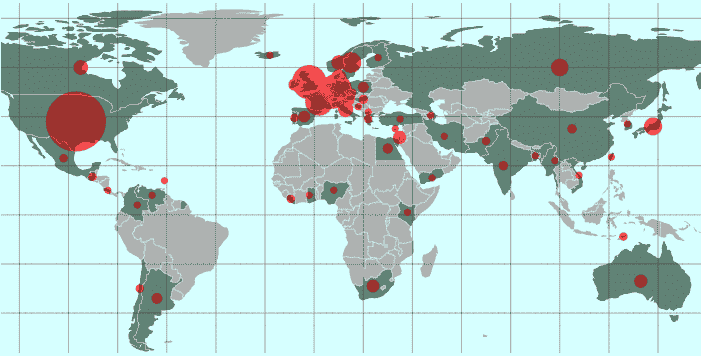
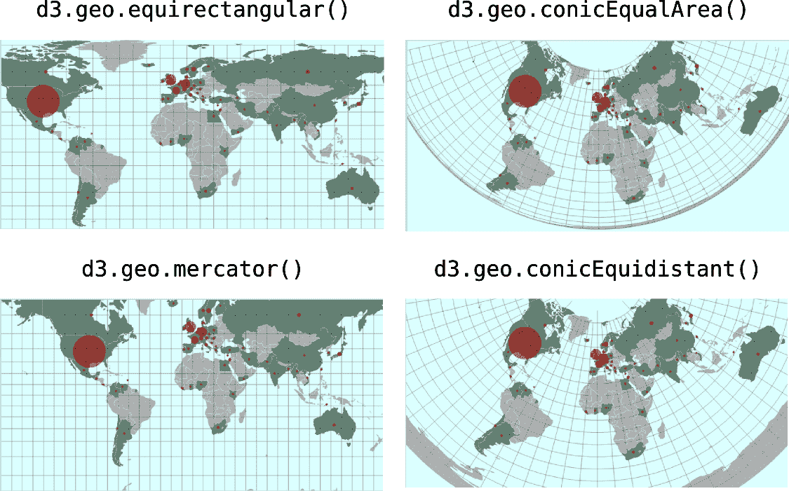
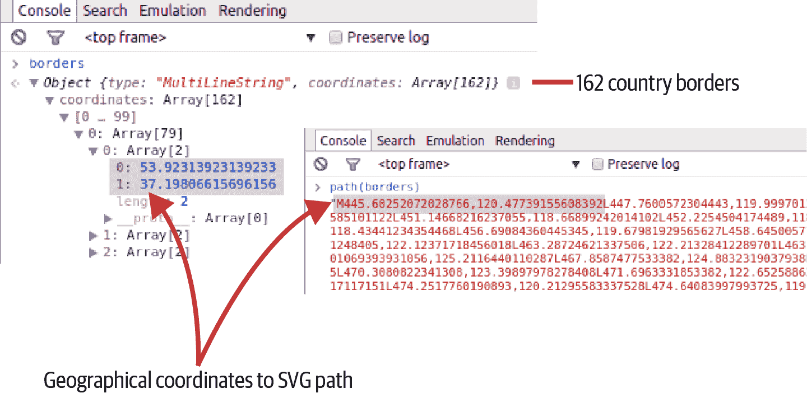
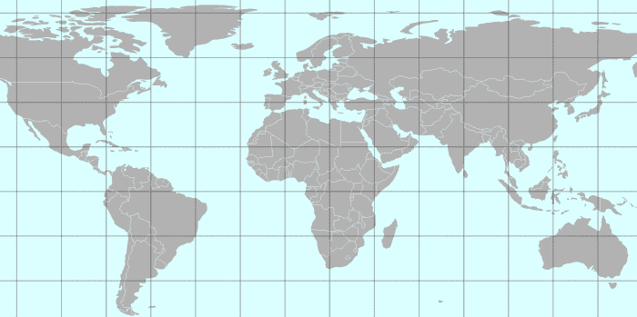
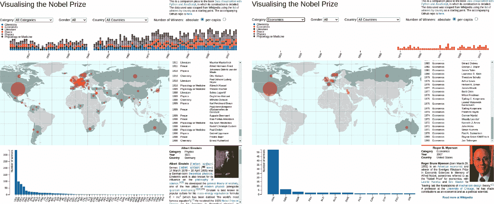
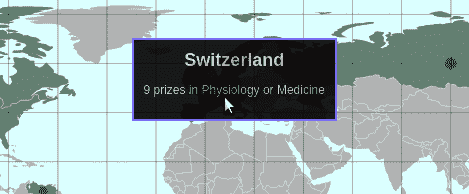

# 第十九章。使用 D3 进行映射

构建和自定义地图可视化是 D3 的核心优势之一。它有一些非常复杂的库，允许使用各种投影，从工作马卡托和正投影到更奇特的投影，如等距圆锥投影。地图似乎是 Mike Bostock 和 Jason Davies，D3 的核心开发人员的一种痴迷，并且他们对细节的关注令人印象深刻。如果您有地图问题，D3 很可能可以完成所需的繁重工作。^(1) 在本章中，我们将使用我们的诺贝尔奖可视化（Nobel-viz）地图（图 19-1）来介绍 D3 映射的核心概念。



###### 图 19-1。本章的目标元素

# 可用地图

最流行的映射格式是老化的[shapefile](https://oreil.ly/XV4Cb)，这是为地理信息系统（GIS）软件开发的。有许多免费和专有的桌面程序^(2) 用于操作和生成 shapefiles。

不幸的是，shapefiles 不是为网络设计的，网络更希望处理基于 JSON 的地图格式，并要求使用小而高效的表示形式来限制带宽和相关的延迟。

好消息是，有许多方便的方法可以将 shapefiles 转换为我们首选的 TopoJSON 格式，^(3) 这意味着您可以在软件中操作您的 shapefiles，然后将它们转换为网络友好的格式。寻找网络数据可视化地图的标准方法是首先寻找 TopoJSON 或 GeoJSON 版本，然后在更丰富的 shapefiles 池中搜索，作为最后的手段，使用 shapefile 或等价编辑器自行制作。根据您打算进行的地图可视化程度，可能会有现成的解决方案。对于像世界地图或大陆投影（例如流行的 Albers USA）这样的东西，通常可以找到不同精度的多个解决方案。

对于我们的诺贝尔奖地图，我们想要一个全球映射，至少显示所有 58 个诺贝尔奖获奖国家，并为其中的大多数国家提供标记形状。幸运的是，D3 提供了许多示例世界地图，一个以 50 米网格分辨率，另一个以较小的 110 米分辨率。对于我们相当粗糙的需求，后者就足够了。^(4)

# D3 的映射数据格式

D3 利用两种基于 JSON 的几何数据格式，[GeoJSON](https://geojson.org) 和 [TopoJSON](https://oreil.ly/709GD)，后者是由 Mike Bostock 设计的 GeoJSON 的扩展，用于编码拓扑信息。GeoJSON 更直观易读，但在大多数情况下，TopoJSON 更高效。通常，地图会被转换为 TopoJSON 进行网络传输，因为尺寸是一个重要考虑因素。然后，在浏览器中通过 D3 将 TopoJSON 转换为 GeoJSON，以简化 SVG 路径创建、功能优化等操作。

###### 注意

在[Stack Overflow](https://oreil.ly/DvcaG)上有一篇关于 TopoJSON 和 GeoJSON 之间差异的很好的总结。

现在让我们来看看这两种格式。理解它们的基本结构很重要，在您的映射工作变得更加雄心勃勃时，稍加努力将会有所回报。

## GeoJSON

GeoJSON 文件包含一个`type`对象，其中一个是 Point，MultiPoint，LineString，MultiLineString，Polygon，MultiPolygon，GeometryCollection，Feature 或 FeatureCollection。类型成员的大小写必须是[CamelCase](https://oreil.ly/wS4q9)，如此所示。它们还可以包含一个`crs`成员，指定特定的坐标参考系统。

FeatureCollections 是最大的 GeoJSON 容器，通常用于指定包含多个区域的地图。FeatureCollections 包含一个`features`数组，其中每个元素是前文列出类型的 GeoJSON 对象。

示例 19-1 展示了一个包含国家地图数组的典型 FeatureCollection，其边界由多边形指定。

##### 示例 19-1\. GeoJSON 映射数据格式

```py
{
  "type": "FeatureCollection", 
  "features":  
        "type": "Polygon",
        "coordinates": 
          [
            [
              61.210817, ![4
              35.650072
            ],
            [
              62.230651,
              35.270664
            ],
            ...
          ]
        ]
      }
    },
    ...
    {
      "type": "Feature",
      "id": "ZWE",
      "properties": {
        "name": "Zimbabwe"
      },
      "geometry": {
        "type": "Polygon",
        "coordinates": [
          [
            [...] ] ]
      }
    }
  ]
}
```


每个 GeoJSON 文件包含一个带有类型的单个对象，包含…​


…​一个特征数组—​在本例中，国家对象…​


…​使用基于坐标的多边形几何图形。


请注意，地理坐标以[经度，纬度]对给出，这与传统的地理定位相反。这是因为 GeoJSON 使用[X,Y]坐标方案。

虽然 GeoJSON 比 shapefile 更简洁且使用首选的 JSON 格式，但在地图编码中存在大量冗余。例如，共享边界被指定两次，而浮点坐标格式相当不灵活，并且对于许多工作来说太精确了。TopoJSON 格式旨在解决这些问题，并以更有效的方式向浏览器提供地图。

## TopoJSON

由 Mike Bostock 开发的 TopoJSON 是 GeoJSON 的扩展，它编码了拓扑关系，从称为弧线段的共享池中将几何图形拼接在一起。因为它们重用这些弧线段，TopoJSON 文件通常比其等效的 GeoJSON 文件小 80%！此外，采用拓扑方法来表示地图使得可以使用一些利用拓扑的技术。其中之一是保持拓扑的形状简化，^(5)可以消除 95%的地图点数，同时保留足够的细节。还能实现等面积图和自动地图着色。示例 19-2 展示了 TopoJSON 文件的结构。

##### 示例 19-2\. 我们的 TopoJSON 世界地图的结构

```py
{
   "type": "Topology",   
   "objects":{           
      "countries":{
        "type": "GeometryCollection",
        "geometries": [{
        "_id":24, "arcs":[[6,7,8],[10,11,12]], ... 
      ...}]},
      "land":{...},
   },
   "arcs":[[[67002,72360],[284,-219],[209..]], /*<-- arc*/ number 0 
           [[70827,73379],[50,-165]], ...      /*<-- arc number 1*/
        ]
   "transform":{        
      "scale":[
         0.003600036...,
         0.001736468...,
       ],
       "translate":[
          -180,
          -90
       ]
   }
}
```


TopoJSON 对象有一个`Topology`类型，并且必须包含一个`objects`对象和一个`arcs`数组。


在这种情况下，对象是`countries`和`land`，都是由弧线定义的`GeometryCollections`。


每个几何体（在这种情况下定义为国家形状）由一些弧线路径定义，这些路径由它们在`arcs`数组中的索引引用 。


用于构建对象的组件弧线数组。这些弧线由索引引用。


以整数形式量化位置所需的数字。

如果您需要将其传输到 Web 浏览器中，TopoJSON 格式的较小尺寸显然是一个巨大优势。通常只有 GeoJSON 格式是可用的，因此能够将其转换为 TopoJSON 是非常方便的。D3 提供了一个小的命令行实用程序来完成这个任务。名为`geo2topo`，它是 TopoJSON 包的一部分，并且可以通过`node`进行安装。

## 将地图转换为 TopoJSON

您可以通过`node`存储库安装 TopoJSON（参见第一章），使用`-g`标志进行全局安装^(6)：

```py
$ npm install -g topojson
```

安装了`topojson`后，将现有的 GeoJSON 转换为 TopoJSON 就变得非常简单。在这里，我们从命令行调用`geo2topo`，对一个名为*geo_input.json*的 GeoJSON 文件进行处理，并指定输出文件*topo_output.json*：

```py
$ geo2topo -o topo_output.json geo_input.json
```

或者，您可以将结果导入到一个文件中：

```py
$ geo2topo geo_input.json > topo_output.json
```

`geo2topo`有许多有用的选项，例如量化，允许您指定地图的精度。尝试使用这个选项可以生成一个文件更小、质量几乎无损的结果。您可以在[geo2topo 命令行参考](https://oreil.ly/mp0RN)中查看完整的规格说明。如果您希望以编程方式转换地图文件，可以使用一个方便的 Python 库*topojson.py*。您可以在[GitHub](https://oreil.ly/8t7Ko)上找到它。

现在我们已经将地图数据转换为轻量级、高效且面向 Web 优化的格式，让我们看看如何使用 JavaScript 将其转换为交互式 Web 地图。

# D3 Geo，投影和路径

D3 拥有一个客户端的*topojson*库，专门用于处理 TopoJSON 数据。它将优化的基于弧线的 TopoJSON 转换为基于坐标的 GeoJSON，可以被 D3 的*d3.geo*库的`projection`s 和`paths`对象操作。

示例 19-3 展示了从 TopoJSON *world-100m.json*地图中提取我们的诺贝尔地图所需的 GeoJSON 要素的过程。这为我们提供了代表国家及其边界的基于坐标的多边形。

为了从刚刚传递到浏览器的 TopoJSON `world` 对象中提取我们需要的 GeoJSON 特征，我们使用 *topojson* 的 `feature` 和 `mesh` 方法。`feature` 返回指定对象的 GeoJSON 特征或 FeatureCollection，而 `mesh` 返回表示指定对象网格的 GeoJSON MutliLineString 几何对象。

`feature` 和 `mesh` 方法的第一个参数是 TopoJSON 对象，第二个参数是我们想要提取的特征的引用（在 示例 19-3 中为 `land` 和 `countries`）。在我们的世界地图中，`countries` 是一个具有国家数组特征的 FeatureCollection（示例 19-3，）。

`mesh` 方法有第三个参数，用于指定一个过滤函数，该函数接受两个几何对象（`a` 和 `b`）作为参数，这两个对象共享网格弧。如果弧未共享，则 `a` 和 `b` 相同，允许我们在我们的世界地图中过滤掉外部边界（示例 19-3，）。

##### 示例 19-3\. 提取我们的 TopoJSON 特征

```py
// nbviz_main.mjs import { initMap } from './nbviz_map.mjs'

Promise.all(
   d3.json('static/data/world-110m.json'), ![1
   d3.csv('static/data/world-country-names-nobel.csv'),
   // ...
 ]).then(ready)

function ready([worldMap, countryNames, countryData, winnersData]) {
    // ...
    nbviz.initMap(worldMap, countryNames)
}
// nbviz_map.mjs export let initMap = function(world, names) {
    // EXTRACT OUR REQUIRED FEATURES FROM THE TOPOJSON
    let land = topojson.feature(world, world.objects.land),
        countries = topojson.feature(world, world.objects.countries)
                      .features, 
        borders = topojson.mesh(world, world.objects.countries,
                    function(a, b) { return a !== b; }); 
    // ... }
```


使用 D3 的辅助函数加载地图数据，并将其发送到 `ready` 函数以初始化地图图表。


使用 `topojson` 从 TopoJSON 数据中提取我们需要的特征，并以 GeoJSON 格式提供它们。


仅过滤出仅在国家之间共享的内部边界。如果一条弧仅被一个几何体（在本例中是一个国家）使用，则 `a` 和 `b` 是相同的。

在 D3 中的地图展示通常遵循一个标准模式。首先，我们创建一个 D3 `projection`，使用其中一个 D3 的多种选择。然后，我们使用这个 `projection` 创建一个 `path`。这个 `path` 用于将从我们的 TopoJSON 对象中提取的特征和网格转换为浏览器窗口中显示的 SVG 路径。现在让我们来看看关于 D3 `projection`s 的丰富主题。

## 投影

自从人们意识到地球是一个球体以来，地图的主要挑战可能是在二维形式中表示一个三维的球体或其重要部分。1569 年，弗兰德斯地图制作者杰拉德斯·麦卡托（Gerardus Mercator）通过从地球中心向显著的边界坐标延伸线，并将其投影到周围的圆柱体上，成功地解决了这个问题。这个投影方法的有用属性是将常数航线（称为 *rhumb lines*）表示为直线段，这对打算使用地图的航海导航员非常有用。不幸的是，投影过程会扭曲距离和大小，随着从赤道到极地的移动，会放大尺度。因此，尽管实际上非洲大陆的面积大约是格陵兰的 14 倍，但在地图上，它看起来并不比格陵兰大多少。

所有的投影方式都像墨卡托的一样是一种妥协，而 D3 的优点在于丰富的选择意味着可以平衡这些妥协，找到适合工作的正确投影方式。^(7) 图 19-2 展示了我们诺贝尔地图的一些替代 `projection`，包括最终可视化所选择的等经纬度投影。约束条件是在矩形窗口内显示所有诺贝尔奖获得国家，并尝试最大化空间，特别是在欧洲，那里有许多地理上较小但奖项相对较多的国家。

要创建一个 D3 的 `projection`，只需使用适用的 *d3.geo* 方法之一：

```py
let projection = d3.geoEquirectangular()
// ...
```

D3 的 `projection` 具有许多有用的方法。通常使用 `translate` 方法将地图平移至容器的一半宽度和高度，覆盖默认值 [480, 250]。还可以设置精度，这会影响在 `projection` 中使用的自适应重采样的程度。自适应重采样是一种聪明的技术，可以提高投影线的准确性，同时保持高效率。^(8) 地图的比例及其中心的经度和纬度可以通过 `scale` 和 `center` 方法进行设置。



###### 图 19-2\. 诺贝尔地图的一些替代映射投影方式

将 `projection` 方法组合在一起，下面的代码是我们的诺贝尔可视化世界等经纬度地图所使用的代码。请注意，它是手动调整的，以最大化给予诺贝尔奖获得国家的空间。两极被截断，因为在北极或南极都没有获奖者（请注意，等经纬度地图假设宽高比为 2）：

```py
let projection = d3.geoEquirectangular()
    .scale(193 * (height/480)) 
    .center([15,15]) 
    .translate([width / 2, height / 2])
    .precision(.1);
```


稍微放大；默认高度为 480，比例为 153。


居中于东经 15 度，北纬 15 度。

定义了我们的等经纬度 `projection` 后，让我们看看如何使用它创建 `path`，这将用于创建 SVG 地图。

## 路径

一旦确定了适合您地图的合适 `projection`，您可以使用它来创建 D3 地理 `path` 生成器，这是 SVG `path` 生成器 (`d3.svg.path`) 的专门变体。此 `path` 接受任何 GeoJSON 特征或几何对象，如 FeatureCollection、Polygon 或 Point，并返回用于 `d` 元素的 SVG 路径数据字符串。例如，使用我们的地图 `borders` 对象，描述 `MultiLineString` 的地理边界坐标将转换为 SVG 的路径坐标。

通常，我们一次性创建我们的 `path` 并设置其 `projection`：

```py
var projection = d3.geoEquirectangular()
// ...

var path = d3.geoPath()
             .projection(projection);
```

通常，我们使用`path`作为函数来生成 SVG 路径的`d`属性，使用`datum`方法绑定使用的 GeoJSON 数据（用于绑定单个对象——而不是数组——并且`data([object])`的简写）。因此，要使用刚刚提取的边界数据使用`topojson.mesh`来绘制我们的国家边界，我们使用以下方法：

```py
// BOUNDRY MARKS svg.insert("path", ".graticule") 
    .datum(borders)
    .attr("class", "boundary")
    .attr("d", path);
```


我们希望在地图的`graticule`（网格）覆盖层之前（下面）插入边界 SVG。

图 19-3 展示了从 Chrome 控制台输出的 TopoJSON `borders`对象，从我们的世界地图数据中提取的结果路径。使用了我们的*d3.geo* `path`，使用了等经纬投影。

地理路径生成器是 D3 地图演示的主要组成部分。我建议尝试使用不同的`projection`和简单几何体来感受一下，可以在[*bl.ocks.org*](https://bl.ocks.org/mbostock)找到大量的示例，以及[D3 的 GitHub 页面](https://oreil.ly/2qgyf)上的文档，并查看这个[很棒的小演示](https://oreil.ly/NansT)。



###### 图 19-3\. 路径生成器，从几何到 SVG 路径

现在让我们来看看你在地图中将使用的一个有用的*d3.geo*组件，即`graticule`（或地图网格）。

## 经线网格

*d3.geo*中一个有用的组件，也是我们诺贝尔地图中使用的`graticule`，是地理形状生成器之一。⁹ 它创建了经线（经度线）和纬线（纬度线）的全局网格，默认间距为 10 度。当我们将`path`应用于这个`graticule`时，它生成了一个适当投影的网格，如图 19-1 所示。

示例 19-4 展示了如何向您的地图添加一个`graticule`。请注意，如果您希望网格覆盖地图路径，则其 SVG 路径应该在 DOM 树中地图路径之后。正如您将看到的，您可以使用 D3 的`insert`方法来强制执行此顺序。

##### 示例 19-4\. 创建一个`graticule`

```py
var graticule = d3.geo.graticule()
                  .step([20, 20]); 

svg.append("path")
    .datum(graticule) 
    .attr("class", "graticule")
    .attr("d", path); 
```


创建一个`graticule`，将网格间距设置为 20 度。


注意`datum`是用于数据的简写（`[graticule]`）。


使用`path`生成器接收`graticule`数据并返回网格路径。

现在我们已经有了我们的网格覆盖层，以及将地图文件转换为具有所需`projection`的 SVG 路径的能力，让我们将元素放在一起。

# 将元素放在一起

使用讨论的`projection`、`path`和`graticule`组件，我们将创建基本地图。此地图旨在响应用户事件，突出显示由选定获奖者代表的国家，并在国家中心用填充的红色圆圈反映获奖者数量。我们将单独处理此互动更新。

示例 19-5 显示了构建基本全球地图所需的代码。它遵循了现在应该是熟悉的模式，从其 `div` 容器（ID `nobel-map`）获取 `mapContainer`，向其附加一个 `<svg>` 标签，然后继续添加 SVG 元素，这些元素在这种情况下是由 D3 生成的地图路径。

我们的地图有一些固定的组件（例如 `projection` 和 `path` 的选择），它们不依赖于任何数据变化，并且在初始化 `nbviz.initMap` 方法之外定义。当从服务器初始化可视化时，将调用 `nbviz.initMap`。它接收 TopoJSON `world` 对象，并使用它构建带有 `path` 对象的基本地图。图 19-4 显示了结果。

##### 示例 19-5。构建地图基础

```py
// DIMENSIONS AND SVG let mapContainer = d3.select('#nobel-map');
let boundingRect = mapContainer.node().getBoundingClientRect();
let width = boundingRect.width
    height = boundingRect.height;
let svg = mapContainer.append('svg');
// OUR CHOSEN PROJECTION let projection = d3.geo.equirectangular()
    .scale(193 * (height/480))
    .center([15,15])
    .translate([width / 2, height / 2])
    .precision(.1);
// CREATE PATH WITH PROJECTION let path = d3.geoPath().projection(projection);
// ADD GRATICULE var graticule = d3.geoGraticule().step([20, 20]);
svg.append("path").datum(graticule)
    .attr("class", "graticule")
    .attr("d", path);
// A RADIUS SCALE FOR OUR CENTROID INDICATORS var radiusScale = d3.scaleSqrt()
    .range([nbviz.MIN_CENTROID_RADIUS, nbviz.MAX_CENTROID_RADIUS]);
// OBJECT TO MAP COUNTRY NAME TO GEOJSON OBJECT var cnameToCountry = {};
// INITIAL MAP CREATION, USING DOWNLOADED MAP DATA export let initMap = function(world, names) { 
    // EXTRACT OUR REQUIRED FEATURES FROM THE TOPOJSON
    var land = topojson.feature(world, world.objects.land),
        countries = topojson.feature(world, world.objects.countries)
                      .features,
        borders = topojson.mesh(world, world.objects.countries,
                    function(a, b) { return a !== b; });
    // CREATE OBJECT MAPPING COUNTRY NAMES TO GEOJSON SHAPES
    var idToCountry = {};
    countries.forEach(function(c) {
        idToCountry[c.id] = c;
    });

    names.forEach(function(n) {
        cnameToCountry[n.name] = idToCountry[n.id]; 
    });
    // MAIN WORLD MAP
    svg.insert("path", ".graticule") 
        .datum(land)                 
        .attr("class", "land")
        .attr("d", path)
    ;
    // COUNTRY PATHS
    svg.insert("g", ".graticule")
        .attr("class", 'countries');
    // COUNTRIES VALUE-INDICATORS
    svg.insert("g")
        .attr("class", "centroids");
    // BOUNDARY LINES
    svg.insert("path", ".graticule")
        .datum(borders)
        .attr("class", "boundary")
        .attr("d", path);

};
```


`world` 是包含国家特征及 `names` 数组的 TopoJSON 对象，将国家名称与国家特征 ID 相连接（例如，`{id:36, name: 'Australia'}`）。


给定国家名称键，返回其相应 GeoJSON 几何体的对象。


请注意，我们在 `graticule` 网格之前插入了此 `path`，将网格覆盖在顶部。


使用 `datum` 将整个 `land` 对象分配给我们的 `path`。



###### 图 19-4。基本地图

地图形状已经就位，我们可以使用一些 CSS 样式化图 19-4，为海洋添加浅蓝色，为陆地添加浅灰色。`graticule` 是半透明的深灰色，国家边界是白色：

```py
/* NOBEL-MAP STYLES */
#nobel-map {
    background: azure;
}

.graticule {
    fill: none;
    stroke: #777;
    stroke-width: .5px;
    stroke-opacity: .5;
}

.land {
    fill: #ddd;
}

.boundary {
    fill: none;
    stroke: #fff;
    stroke-width: .5px;
}
```

组装了 SVG 地图之后，让我们看看如何使用获奖者数据集来绘制诺贝尔奖获得国家以及获奖次数的红色指示器。

# 更新地图

当我们初始化可视化时，我们的**诺贝尔奖得主地图**首次更新。此时，所选数据集未经过过滤，包含所有的诺贝尔奖获得者。随后，根据用户应用的过滤器（例如，所有化学奖获得者或来自法国的获奖者），数据集将发生变化，我们的地图也会相应变化以反映这一点。

因此，更新地图涉及将当前奖项获取情况的诺贝尔奖获得国家数据集发送给地图，这取决于用户应用的过滤器。为此，我们使用一个 `updateMap` 方法：

```py
let updateMap = function(countryData) { //...
                }
```

`countryData` 数组的形式如下：

```py

  {
   code: "USA",
   key: "United States",
   population: 319259000,
   value: 336 ![1
  },
  // ... 56 more countries ]
```


当前所选数据集中美国的获奖者数量。

我们希望在将此数组发送到我们的 D3 地图之前将其转换。以下代码完成了这项工作，提供了一个带有 `geo` 属性（国家的 GeoJSON 几何体）、`name` 属性（国家名称）和 `number` 属性（诺贝尔奖获得者数量）的国家对象数组：

```py
let mapData = countryData
    .filter(d => d.value > 0) 
    .map(function(d) {
      return {
        geo: cnameToCountry[d.key], 
        name: d.key,
        number: d.value
      }
    });
```


过滤掉没有获奖者的国家——我们只在地图上显示获奖国家。


使用国家的关键字（在本例中为其名称）来检索其 GeoJSON 特征。

我们希望在获奖国家的中心显示一个红色的圆形指示器，指示获奖数量。这些圆的面积应与获奖数量（绝对值或人均）成比例，这意味着（通过圆面积= pi × 半径平方）它们的半径应该是该奖品数量的平方根的函数。D3 提供了一个方便的`sqrt`比例尺，用于这种需要，允许您设置一个域（在本例中为最小和最大奖品数量）和一个范围（最小和最大指示器半径）。

让我们快速看看`sqrt`比例尺的示例。在以下代码中，我们设置一个域在 0 到 100 之间的比例尺，并且以基于零的范围设置了最大面积为 25（5 × 5）。这意味着调用该比例尺的 50（范围的一半）应该给出一半最大面积的平方根（12.5）：

```py
var sc = d3.scaleSqrt().domain([0, 100]).range([0, 5]);
sc(50) // returns 3.5353..., the square root of 12.5
```

为了创建我们的指标半径比例尺，我们使用*nbviz_core.js*中指定的最大和最小半径来设置其范围的`sqrt`比例尺：

```py
var radiusScale = d3.scaleSqrt()
    .range([nbviz.MIN_CENTROID_RADIUS,
    nbviz.MAX_CENTROID_RADIUS]);
```

为了将我们的范围设置为尺度的域，我们使用这个`mapData`来获取每个国家获奖者的最大数量，并将该值作为域的上限值，域的下限为`0`：

```py
var maxWinners = d3.max(mapData.map(d => d.number))
// DOMAIN OF VALUE-INDICATOR SCALE
radiusScale.domain([0, maxWinners]);
```

要将我们国家的形状添加到现有地图中，我们将`mapData`绑定到`countries`组的`country`类的选择上，并实现更新模式（见“使用数据更新 DOM”），首先添加`mapData`所需的任何国家形状。我们使用 CSS 的`opacity`属性，而不是移除未绑定的国家路径，使绑定的国家可见，未绑定的不可见。使用两秒的过渡效果使这些国家适当地淡入和淡出。示例 19-6 展示了更新模式。

##### 示例 19-6。更新国家形状

```py
let countries = svg
   .select('.countries').selectAll('.country')
   .data(mapData, d => d.name)
// Use a data-join to make selected countries visible // and fade them in over TRANS_DURATION milliseconds
 countries
   .join(
     (enter) => {
       return enter
         .append('path') 
		 .attr('d', function (d) {
		     return path(d.geo)
         })
         .attr('class', 'country')
         .attr('name', d => d.name)
         .on('mouseenter', function (event, d) { 
           d3.select(this).classed('active', true)
         })
         .on('mouseout', function (d) {
           d3.select(this).classed('active', false)
         })
     },
     (update) => update,
     (exit) => { 
       return exit
         .classed('visible', false)
         .transition()
         .duration(nbviz.TRANS_DURATION)
         .style('opacity', 0)
     }
   )
   .classed('visible', true)
   .transition() 
   .duration(nbviz.TRANS_DURATION)
   .style('opacity', 1)
```


使用 GeoJSON 数据使用我们的`path`对象创建国家地图形状。


UI 占位符，将 SVG 路径设置为鼠标悬停时的类*active*。请注意，我们在这里使用`function`关键字，而不是通常的箭头符号缩写（`⇒`）。这是因为我们希望使用 D3 访问由鼠标输入的 DOM 元素（地图区域），并使用`this`关键字，而箭头函数不支持该关键字。


自定义的`exit`函数，以 2000 毫秒的速度淡出（将透明度设置为 0）国家形状。


任何新国家都会在 2000 毫秒内逐渐淡入（透明度为 1）。

请注意，我们向新输入的国家添加了 CSS 类`country`，将它们的颜色设置为浅绿色。除此之外，鼠标事件用于将国家分类为`active`，如果光标悬停在其上，则用较深的绿色突出显示。这是 CSS 类：

```py
.country{
    fill: rgb(175, 195, 186); /* light green */
}

.country.active{
    fill: rgb(155, 175, 166); /* dark green */
}
```

如示例 19-6 所示的更新模式将平滑过渡从旧数据集到新数据集，这是响应用户应用的过滤器并传递给 `updateMap` 的结果。现在我们只需要添加类似响应的填充圆形指示器，这些指示器位于活跃国家的中心，并反映其当前值，无论是诺贝尔奖的绝对还是相对（人均）测量。

# 添加价值指示器

要添加我们的圆形值指示器，我们需要一个更新模式，它与用于创建国家 SVG 路径的模式相似。我们希望绑定到 `mapData` 数据集并相应地追加、更新和删除我们的指示器圆圈。与国家形状一样，我们将调整指示器的不透明度以添加和移除它们。

指示器需要放置在各自国家的中心位置。D3 的 `path` 生成器提供了许多处理 GeoJSON 几何体的实用工具方法之一就是 `centroid`，它计算指定要素的投影质心：

```py
// Given the GeoJSON of country (country.geo)
// calculate x, y coords of center
var center = path.centroid(country.geo);
// center = [x, y]
```

虽然 `path.centroid` 通常能很好地工作，并且对于标记形状、边界等非常有用，但它在高度凹凸不平的几何体上可能会产生奇怪的结果。我们在“为诺贝尔数据可视化获取国家数据”中存储的世界国家数据恰好包含所有诺贝尔奖获得国的中心坐标。

我们将首先编写一个小方法来检索那些给定 `mapData` 对象的方法：

```py
var getCentroid = function(d) {
    var latlng = nbviz.data.countryData[d.name].latlng; 
    return projection([latlng[1], latlng[0]]); 
};
```


使用存储的世界国家数据，按名称获取我们国家中心的纬度和经度。


利用我们的等经纬投影将其转换为 SVG 坐标。

如示例 19-7 所示，我们将 `mapData` 绑定到我们在示例 19-5 中添加的 `centroids` 组中所有 `centroid` 类元素的选择器上。数据通过 `name` 键进行绑定。

##### 示例 19-7\. 给诺贝尔国家的质心添加奖项指示器

```py
let updateMap = function(countryData) {
//...
  // BIND MAP DATA WITH NAME KEY
  let centroids = svg
     .select('.centroids').selectAll('.centroid')
     .data(mapData, d => d.name) 
  // JOIN DATA TO CIRCLE INDICATORS
  centroids
    .join(
      (enter) => {
        return enter
          .append("circle")
          .attr("class", "centroid")
          .attr("name", (d) => d.name)
          .attr("cx", (d) => getCentroid(d)[0]) 
          .attr("cy", (d) => getCentroid(d)[1])
      },
      (update) => update,
      (exit) => exit.style("opacity", 0)
    )
    .classed("active",
      (d) => d.name === nbviz.activeCountry)
    .transition()
    .duration(nbviz.TRANS_DURATION) 
    .style("opacity", 1)
    .attr("r", (d) => radiusScale(+d.number))
};
```


使用 `name` 键将地图数据绑定到质心元素。


使用 `getCentroid` 函数返回国家中心的地理坐标的像素位置。


此 2000 毫秒的过渡通过增加其不透明度逐渐淡入圆形标记，同时过渡到其新半径。

利用一些 CSS，我们可以将指示器设为红色并略显透明，允许地图细节和（在欧洲密集区域）其他指示器显示出来。如果用户选择了国家，可以使用 UI 栏上的国家过滤器，这些国家将被标记为 `active` 并呈现金色。以下是实现此效果的 CSS 代码：

```py
.centroid{
    fill: red;
    fill-opacity: 0.3;
    pointer-events: none; 
}

.centroid.active {
    fill: goldenrod;
    fill-opacity: 0.6;
}
```


这样可以让鼠标事件传播到圆形下面的国家形状，使用户仍然可以点击它们。

我们刚刚添加的活动重心指示器是我们诺贝尔奖地图的最后一个元素。现在让我们来看一下完整的文章。

# 我们完成的地图

完成国家和指示器更新模式后，我们的地图应能够对用户驱动的过滤作出平滑的过渡。图 19-5 显示了选择经济学诺贝尔奖的结果。只有获奖国家保持突出显示，并且值指示器被调整大小，反映了美国在该类别中的主导地位。



###### 图 19-5\. （左）显示带有完整诺贝尔数据集的地图；（右）奖项按类别进行过滤，显示经济学获奖者（以及美国经济学家的主导地位）

当用户将鼠标移到国家上时，调用`mouseenter`和`mouseout`回调函数并添加或删除`active`类时，在不互动的地图上显示。这些回调函数可以很容易地用于增加地图的更多功能，例如工具提示或使用国家作为可点击的数据过滤器。现在让我们使用它们来构建一个简单的工具提示，显示鼠标悬停在哪个国家和一些简单的奖励信息。

# 构建一个简单的工具提示

工具提示和其他交互式小部件通常是数据可视化者常常要求的内容，尽管它们可能变得非常复杂，特别是如果它们本身是交互式的（例如，鼠标悬停时出现的菜单），但有一些简单的技巧非常有用。在本节中，我将展示如何构建一个简单但相当有效的工具提示。图 19-6 展示了我们的目标。



###### 图 19-6\. 我们诺贝尔奖地图的简单工具提示

让我们回顾一下我们当前的`countries`更新，其中在数据连接过程中添加了`mouseenter`和`mouseout`事件处理程序：

```py
    // ENTER AND APPEND ANY NEW COUNTRIES
    countries.join((enter) => {
      return enter.append('path')
      // ...
        .on('mouseenter', function(d) {
            d3.select(this).classed('active', true);
        })
        .on('mouseout', function(d) {
            d3.select(this).classed('active', false);
        })
      })
    ;
```

为了向我们的地图添加工具提示，我们需要做三件事：

1.  在 HTML 中创建一个带有所需信息占位符的工具提示框，例如，所选奖项类别中的国家名称和获奖数量。

1.  当用户将鼠标移入一个国家时，在鼠标移出时隐藏 HTML 框。

1.  使用绑定到鼠标下方国家的数据更新显示框。

我们通过在 Nobel-viz 地图部分添加一个内容块来创建工具提示的 HTML，其 ID 为`map-tooltip`，一个`<h2>`标题和一个用于工具提示文本的`<p>`标签：

```py
<!-- index.xhtml  -->
      <!-- ...  -->
        <div id="nobel-map">
          <div id="map-tooltip">
            <h2></h2>
            <p></p>
          </div>
      <!-- ...  -->
```

我们还需要一些 CSS 来调整工具提示的外观和感觉，添加到我们的*style.css*文件中：

```py
/* css/style.css */
/* MAP TOOLTIP */
#map-tooltip {
    position: absolute;
    pointer-events: none; 
    color: #eee;
    font-size: 12px;
    opacity: 0.7; /* a little transparent */
    background: #222;
    border: 2px solid #555;
    border-color: goldenrod;
    padding: 10px;
    left: -999px; 
}

#map-tooltip h2 {
    text-align: center;
    padding: 0px;
    margin: 0px;
}
```


将`pointer-events`设置为`none`有效地允许您在工具提示下面点击东西。


最初，提示框隐藏在浏览器窗口的（虚拟）左侧，使用一个较大的负 x 索引。

我们的提示框 HTML 已经就位，并且元素隐藏在浏览器窗口的左侧（`left` 是 -9999 像素），我们只需扩展我们的 `mousein` 和 `mouseout` 回调函数来显示或隐藏提示框。`mousein` 函数在用户将鼠标移动到国家时被调用，完成大部分工作：

```py
// ... countries.join(
    (enter) => {
    .append('path')
    .attr('class', 'country')
    .on('mouseenter', function(event) {

        var country = d3.select(this);
        // don't do anything if the country is not visible
        if(!country.classed('visible')){ return; }

        // get the country data object
        var cData = country.datum();
        // if only one prize, use singular 'prize'
        var prize_string = (cData.number === 1)?
            ' prize in ': ' prizes in ';
        // set the header and text of the tooltip
        tooltip.select('h2').text(cData.name);
        tooltip.select('p').text(cData.number
            + prize_string + nbviz.activeCategory);
        // set the border color according to selected
        // prize category
        var borderColor =
          (nbviz.activeCategory === nbviz.ALL_CATS)?
            'goldenrod':
            nbviz.categoryFill(nbviz.activeCategory);
        tooltip.style('border-color', borderColor);

        var mouseCoords = d3.pointer(event); 
        var w = parseInt(tooltip.style('width')), 
            h = parseInt(tooltip.style('height'));
        tooltip.style('top', (mouseCoords[1] - h) + 'px'); 
        tooltip.style('left', (mouseCoords[0] - w/2) + 'px');

        d3.select(this).classed('active', true);
    })
    .on('mouseout', function (d) {
      tooltip.style('left', '-9999px') 
      d3.select(this).classed('active', false)
    })
  }, // ... )
```


D3 的 `pointer` 方法从 `event` 对象中返回鼠标坐标（这里是相对于父地图组的），以像素为单位，我们可以用它来定位提示框。


我们获取了提示框框的计算宽度和高度，已调整以适应我们的国家标题和奖项字符串。


我们使用鼠标坐标和提示框框的宽度和高度来将框居中水平放置，并大致位于鼠标光标上方（宽度和高度不包括我们的 10 像素填充周围的提示框 `<div>`）。


当鼠标离开一个国家时，我们通过将其放置到地图的最左边使提示框消失。

编写了 `mouseenter` 回调函数后，我们现在只需要一个 `mouseout` 来通过将其放置到浏览器窗口的左侧远处来隐藏提示框：

```py
countries.join(
    (enter) => {
    .append('path')
    .attr('class', 'country')
    .on('mouseenter', function(event) {
    // ...
    })
    .on('mouseout', function (d) {
      tooltip.style('left', '-9999px') 
      d3.select(this).classed('active', false)
    })
  }, // ... )
```


当鼠标离开国家时，我们将提示框移到浏览器视口的左侧远处，并从国家中移除 `'active'` 类，使其返回默认国家颜色。

随着 `mouseenter` 和 `mouseout` 函数协同工作，你应该可以看到提示框根据需要出现和消失，正如 Figure 19-6 所示。

## 更新地图

当地图模块被导入时，它会将回调函数附加到核心模块中的回调数组中。当用户交互响应中更新数据时，将调用此回调函数，并使用新的国家数据更新条形图：

```py
nbviz.callbacks.push(() => { 
  let data = nbviz.getCountryData()
  updateMap(data)
})
```


此匿名函数在核心模块中在数据更新时被调用。

现在我们已经构建了我们的诺贝尔数据可视化的地图组件，让我们在继续展示用户输入如何驱动可视化之前总结一下我们学到的内容。

# 摘要

D3 映射是一个丰富的领域，有许多不同的投影和大量的实用方法来帮助操纵几何图形。但是构建地图遵循一个相当标准的过程，就像本章演示的那样：首先选择你的投影方式——比如墨卡托投影或者通常用于美国地图绘制的[阿尔伯斯圆锥投影](https://oreil.ly/Nz6Ar)。然后使用这个投影创建一个 D3 的 `path` 生成器，将 GeoJSON 特征转换为 SVG 路径，创建你看到的地图。GeoJSON 通常从更高效的 TopoJSON 数据中提取。

本章还展示了使用 D3 如何轻松交互地突出显示您的地图并处理鼠标移动。综合起来，这些基本技能应该使您能够开始构建自己的地图可视化。

现在，我们已经构建了所有基于 SVG 的图形元素，让我们看看 D3 如何与传统 HTML 元素一起工作，通过构建我们的获奖者列表和个人传记框。

^(1) 例如，地理投影的数学可以迅速变得复杂。

^(2) 我使用并强烈推荐开源的[QGIS](https://www.qgis.org/en/site)。

^(3) Python 的*topojson.py*和 TopoJSON 命令行程序。

^(4) 正如我们将看到的那样，它确实缺少我们的几个诺贝尔奖国家，但这些国家太小，无法点击，我们有它们中心的坐标，可以在视觉上叠加标记。

^(5) 请查看[Mike Bostock 的这个网站](https://bost.ocks.org/mike/simplify)以获取一个非常酷的例子。

^(6) 通过全局安装，您可以在任何目录中使用`geo2topo`命令。

^(7) [D3 的扩展投影集](https://oreil.ly/14vLd)是 D3 的一个扩展部分，不在主库中。

^(8) 请参阅[*https://oreil.ly/oAppn*](https://oreil.ly/oAppn)以查看一个很好的演示。

^(9) 请查看[D3 GitHub](https://oreil.ly/KqnF6)获取完整列表。
