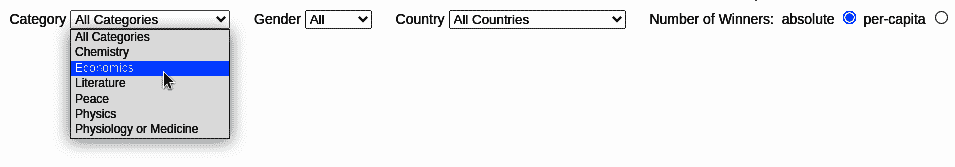

# 第二十一章：菜单栏

前几章展示了如何构建我们交互式诺贝尔奖可视化的视觉组件：时间图表用于显示所有诺贝尔奖得主按年份排序，地图显示地理分布，列表显示当前选定的获奖者，条形图比较各国的绝对和人均获奖情况。在本章中，我们将看到用户如何通过使用选择器和按钮（参见图 21-1）与可视化进行交互，以创建一个经过筛选的数据集，然后这些数据将反映在视觉组件中。例如，在类别选择框中选择物理学，筛选器将只显示诺贝尔奖可视化元素中的物理奖获得者。我们的菜单栏中的筛选器是累积的，因此我们可以选择只有来自法国的女性化学家曾获诺贝尔奖的人。^(1)



###### 图 21-1\. 本章目标菜单栏

在接下来的章节中，我将向您展示如何使用 D3 构建菜单栏，以及如何使用 JavaScript 回调来响应用户驱动的变化。

# 使用 D3 创建 HTML 元素

许多人认为 D3 是一个专门用于创建由图形基元组成的 SVG 可视化工具。虽然 D3 在这方面非常出色（是最好的），但它同样擅长创建传统的 HTML 元素，如表格或选择框。对于像层次菜单这样的复杂、数据驱动的 HTML 结构，D3 的嵌套数据连接是创建 DOM 元素和处理用户选择回调的理想方式。

在第二十章中，我们看到从选定数据集创建`table`行或填写获奖者数据的传记框是多么容易。在本章中，我们将展示如何基于变化的数据集填充选择器的选项，以及如何将回调函数附加到用户界面元素，如选择器和单选框。

###### 提示

如果你有稳定的 HTML 元素（例如，一个选择框，其选项不依赖于变化的数据），最好是先用 HTML 编写它们，然后再使用 D3 绑定任何需要处理用户输入的回调函数。与 CSS 样式一样，你应该尽可能多地在原生 HTML 中完成。这样可以保持代码库的清洁，并且易于其他开发人员和非开发人员理解。在本章中，我会稍微放宽这一规则，来演示如何创建 HTML 元素，但通常情况下，这确实是最佳实践。

# 构建菜单栏

如在“HTML 骨架”中所述，我们的 Nobel-viz 是建立在 HTML `<div>`占位符上的，通过 JavaScript 和 D3 扩展。如例 21-1 所示，我们的菜单栏建立在`nobel-menu` `<div>`上，放置在主图表持有者的上方，包括三个选择器过滤器（按获奖者类别、性别和国家）和一对单选按钮来选择国家获奖指标（绝对或人均）。

##### 例 21-1。菜单栏的 HTML 骨架

```py
<!-- ... -->
<body>
<!-- ... -->
  <!-- THE PLACEHOLDERS FOR OUR VISUAL COMPONENTS  -->
    <div id="nbviz">
      <!-- BEGIN MENU BAR -->
      <div id="nobel-menu">
        <div id="cat-select">
          Category
          <select></select>
        </div>
        <div id="gender-select">
          Gender
          <select>
            <option value="All">All</option>
            <option value="female">Female</option>
            <option value="male">Male</option>
          </select>
        </div>
        <div id="country-select">
          Country
          <select></select>
        </div>
        <div id='metric-radio'>
          Number of Winners:&nbsp;
          <form>
            <label>absolute
              <input type="radio" name="mode" value="0" checked>
            </label>
            <label>per-capita
              <input type="radio" name="mode" value="1">
            </label>
          </form>
        </div>
      </div>
      <!-- END MENU BAR  -->
  <div id='chart-holder'>
<!-- ... -->
</body>
```

现在我们将依次添加 UI 元素，首先是选择器过滤器。

## 构建类别选择器

为了构建类别选择器，我们需要一个选项字符串列表。让我们使用*nbviz_core.js*中定义的`CATEGORIES`列表创建该列表：

```py
import nbviz from './nbviz_core.mjs'

let catList = [nbviz.ALL_CATS].concat(nbviz.CATEGORIES) 
```


通过连接`['所有类别', '化学', '经济学', ... ]`列表和`['所有类别']`列表以创建类别选择器的列表。

现在我们将使用这个类别列表来制作选项标签。我们首先使用 D3 来获取`#cat-select`选择标签：

```py
//...
    let catSelect = d3.select('#cat-select select');
```

有了`catSelect`，让我们使用标准的 D3 数据连接来将我们的`catList`类别列表转换为 HTML `option`标签：

```py
catSelect.selectAll('option')
   .data(catList)
   .join('option') 
   .attr('value', d => d) 
   .html(d => d);
```


数据绑定后，为每个`catList`成员附加一个`option`。


我们设置`option`的`value`属性和文本为一个类别（例如，`<option value="Peace">和平</option>`）。

前述`append`操作的结果是以下`cat-select` DOM 元素：

```py
<div id="cat-select">
  "Category "
  <select>
    <option value="All Categories">All Categories</option>
    <option value="Chemistry">Chemistry</option>
    <option value="Economics">Economics</option>
    <option value="Literature">Literature</option>
    <option value="Peace">Peace</option>
    <option value="Physics">Physics</option>
    <option value="Physiology or Medicine">
    Physiology or Medicine</option>
  </select>
</div>
```

现在我们有了选择器，我们可以使用 D3 的`on`方法来附加一个事件处理回调函数，当选择器被改变时触发：

```py
catSelect.on('change', function(d) {
        let category = d3.select(this).property('value'); 
        nbviz.filterByCategory(category); 
        nbviz.onDataChange(); 
    });
```


`this`是选择标签，`value`属性是选定类别选项。


我们调用*nbviz_core.js*中定义的`filterByCategory`方法来过滤所选类别的奖项数据集。


`onDataChange`触发了将更新以反映我们新过滤的数据集的可视组件的方法。

图 21-2 是我们选择回调的示意图。选择物理学调用我们附加到选择器变更事件的匿名回调函数。此函数启动了 Nobel-viz 可视元素的更新。


###### 图 21-2。类别选择回调

在类别选择器的回调中，我们首先调用`filterByCategory`方法^(2)来选择仅物理学获奖者，并调用`onDataChange`方法来触发所有可视化组件的更新。在适用的情况下，这些将反映更改后的数据。例如，地图的分布环形指示器将重新调整大小，在没有诺贝尔物理学获奖者的国家中会消失。

## 添加性别选择器

我们已经在 *index.xhtml* 中的菜单栏描述中添加了性别选择器及其选项的 HTML：

```py
<!-- ... -->
        <div id="gender-select">
          Gender
          <select>
            <option value="All">All</option>
            <option value="female">Female</option>
            <option value="male">Male</option>
          </select>
        </div>
<!-- ... -->
```

现在我们只需选择性别 `select` 标签，并添加一个回调函数来处理用户的选择。我们可以很容易地通过 D3 的 `on` 方法实现这一点：

```py
    d3.select('#gender-select select')
        .on('change', function(d) {
            let gender = d3.select(this).property('value');
            if(gender === 'All'){
                nbviz.genderDim.filter(); 
            }
            else{
                nbviz.genderDim.filter(gender);
            }
            nbviz.onDataChange();
        });
```


调用性别维度的过滤器，不带参数则将其重置以允许所有性别。

首先，我们选择选择器的选项值。然后，我们使用此值来过滤当前的数据集。最后，我们调用 `onDataChange` 方法来触发 Nobel-viz 可视组件由新数据集引起的任何变化。

要放置性别 `select` 标签，我们使用了一点 CSS，给它左边距 20 像素：

```py
#gender-select{margin-left:20px;}
```

## 添加国家选择器

添加国家选择器比添加类别和性别选择器更复杂。诺贝尔奖按国家分布有长尾效应（参见图 17-1），许多国家只有一两个奖项。我们可以将所有这些包括在我们的选择器中，但这将使其变得相当长和笨重。一个更好的方法是为单个和双重获奖国家添加分组，以保持可管理的选择项数量，并向图表添加一些叙述，即小奖项随时间的分布，这可能反映出诺贝尔奖分配趋势的变化。（参见 3）。

为了添加我们的单个和双重获奖国家组，我们需要使用交叉过滤的国家维度获取每个国家的组大小。这意味着在我们的诺贝尔奖数据集加载后，将其放入一个 `nbviz.initUI` 方法中，该方法在我们主要的 *nbviz_main.js* 脚本中的交叉过滤器维度创建完成后调用（参见“使用交叉过滤器过滤数据”）。

下面的代码创建一个选择列表。三次或更多获奖的国家会有自己的选择项，出现在“所有获奖者”选择项下方。单个和双重获奖的国家会被添加到各自的列表中，这些列表将用于在用户从选择器选项中选择“单个获奖国家”或“双重获奖国家”时过滤数据集。

```py
export let initMenu = function() {
    let ALL_WINNERS = 'All Winners';
    let SINGLE_WINNERS = 'Single Winning Countries';
    let DOUBLE_WINNERS = 'Double Winning Countries';

    let nats = nbviz.countrySelectGroups = nbviz.countryDim
        .group().all() 
        .sort(function(a, b) {
            return b.value - a.value; // descending
        });

    let fewWinners = {1:[], 2:[]}; 
    let selectData = [ALL_WINNERS];

    nats.forEach(function(o) {
        if(o.value > 2){ 
            selectData.push(o.key);
        }
        else{
            fewWinners[o.value].push(o.key); 
        }
    });

    selectData.push(
        DOUBLE_WINNERS,
        SINGLE_WINNERS
    );
    //... })
```


按 (`{key:"United States", value:336}, …​`) 排序的组数组，其中 `value` 是该国家的获奖者数量。


一个包含用于存储单个和双重获奖者的列表的对象。


有两名以上获奖者的国家在 `selectData` 列表中有自己的位置。


基于值为 1 或 2 的组大小，将单个和双重获奖的国家添加到各自的列表中。

现在我们有了带有对应`fewWinners`数组的`selectData`列表，我们可以用它来创建国家选择器的选项。我们首先使用 D3 获取国家选择器的`select`标签，然后使用标准数据绑定将选项添加到其中：

```py
let countrySelect = d3.select('#country-select select');

countrySelect
    .selectAll("option")
    .data(selectData)
    .join("option")
    .attr("value", (d) => d)
    .html((d) => d);
```

添加了我们的`selectData`选项后，选择器看起来像图 21-3。


###### 图 21-3\. 按国家选择奖项的选择器

现在我们只需要一个回调函数，当选择一个选项时触发，通过国家过滤我们的主数据集。以下代码展示了如何完成。首先，我们获取选择的`select`的`value`属性（1），一个国家或者`ALL_WINNERS`、`DOUBLE_WINNERS`或`SINGLE_WINNERS`之一。然后，我们构造一个国家列表，发送到我们的国家过滤方法`nbviz.filterByCountries`（在*nbviz_core.js*中定义）：

```py
countrySelect.on('change', function(d) {

        let countries;
        let country = d3.select(this).property('value');

        if(country === ALL_WINNERS){ 
            countries = [];
        }
        else if(country === DOUBLE_WINNERS){
            countries = fewWinners[2];
        }
        else if(country === SINGLE_WINNERS){
            countries = fewWinners[1];
        }
        else{
            countries = [country];
        }

        nbviz.filterByCountries(countries); 
        nbviz.onDataChange(); 
    });
```


根据`country`字符串创建一个`countries`数组的条件语句。这个数组可以为空，单值，或包含一个`fewWinners`数组中的国家。


调用`filterByCountries`来使用国家数组过滤我们的主要诺贝尔获奖者数据集。


触发更新所有诺贝尔可视化元素。

`filterByCountries`函数显示在示例 21-2 中。一个空的`countryNames`参数将重置过滤器；否则，我们将按`countryNames`中的所有国家过滤国家维度`countryDim` 。

##### 示例 21-2\. 按国家过滤函数

```py
nbviz.filterByCountries = function(countryNames) {

    if(!countryNames.length){ 
        nbviz.countryDim.filter();
    }
    else{
        nbviz.countryDim.filter(function(name) { 
            return countryNames.indexOf(name) > -1;
        });
    }

    if(countryNames.length === 1){ 
        nbviz.activeCountry = countryNames[0];
    }
    else{
        nbviz.activeCountry = null;
    }
};
```


如果`countryNames`数组为空（用户选择所有国家），则重置过滤器。


在这里，我们在`crossfilter`国家维度上创建一个过滤器函数，如果一个国家在`countryNames`列表中（包含单个国家或所有单个或双赢家），则返回`true`。


记录任何单个选择的国家，例如在地图和条形图中突出显示。

现在，我们已经为类别、性别和国家维度构建了过滤选择器，现在我们只需要添加回调函数，以处理获奖度量单选按钮的更改。

## 连接度量单选按钮

指标单选按钮已在 HTML 中构建完成，由带有`radio`输入的表单组成：

```py
        <div id='metric-radio'> Number of Winners:&nbsp; 
          <form>
            <label>absolute <input
               type="radio" name="mode" value="0" checked> 
            </label>
            <label>per-capita <input type="radio" name="mode" value="1">
            </label>
          </form>
        </div>
```


使用`&nbsp;`在表单和其标签之间创建一个不间断的空格。


类型为`radio`的输入共享相同的名称（在本例中为`mode`），它们被分组在一起，激活其中一个将取消激活其他所有输入。它们通过值（在本例中为`0`和`1`）进行区分。这里我们使用`checked`属性来初始激活值`0`。

有了单选按钮表单，我们只需选择所有其输入，并添加一个回调函数来处理任何按下按钮触发的更改：

```py
d3.selectAll('#metric-radio input').on('change', function() {
        var val = d3.select(this).property('value');
        nbviz.valuePerCapita = parseInt(val); 
        nbviz.onDataChange();
    });
```


在调用`onDataChange`并触发可视元素重新绘制之前，更新`valuePerCapita`的值。

我们使用我们的`valuePerCapita`整数存储按钮的当前状态。当用户选择单选框时，此值将更改，并使用`onDataChange`触发具有新度量的重新绘制。

现在我们为我们的 Nobel-viz 添加了菜单栏元素，允许用户细化显示的数据集并深入到他们最感兴趣的子集。

# 摘要

在本章中，我们看到如何将选择器和单选按钮元素添加到我们的诺贝尔奖可视化中。还有许多其他用户界面 HTML 标记，如按钮组、复选框组、时间选择器和普通按钮。^(4) 但是，实现这些控件涉及与本章所示的相同模式。使用数据列表来附加和插入 DOM 元素，根据需要设置属性，并将回调函数绑定到任何更改事件。这是一种非常强大的方法，非常适合与 D3（和 JS）习惯用法相结合，如方法链和匿名函数。它将很快成为您 D3 工作流程的自然组成部分。

^(1) 值得注意的是，玛丽·居里和她的女儿伊莲·居里-居里拥有这一荣誉。

^(2) 定义在 *nbviz_core.js* 脚本中。

^(3) 它确实显示，在单个获奖者中，和平诺贝尔奖占主导地位，其次是文学奖。

^(4) 在 HTML5 中还有原生滑块，以前要依赖于 jQuery 插件。
