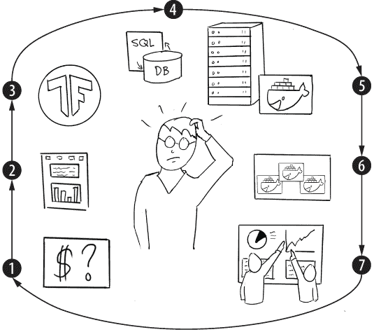
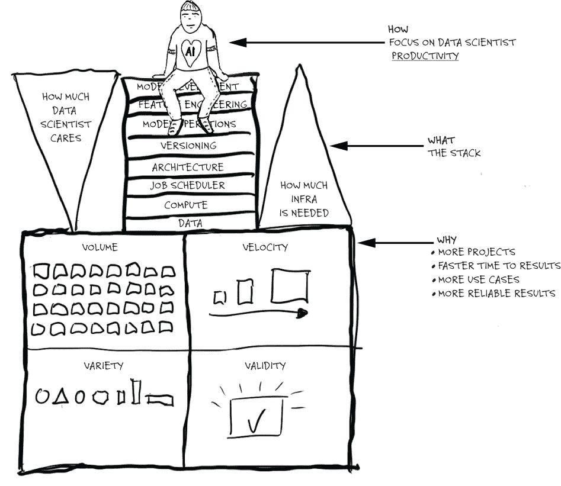
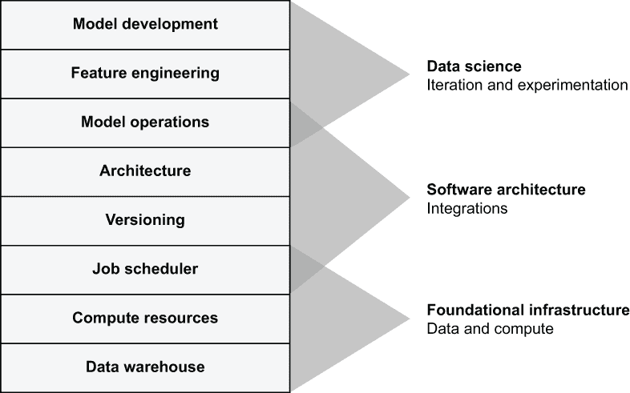
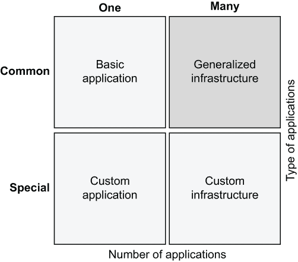
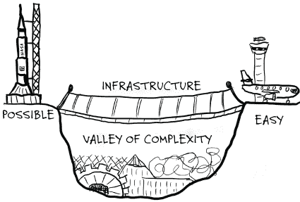
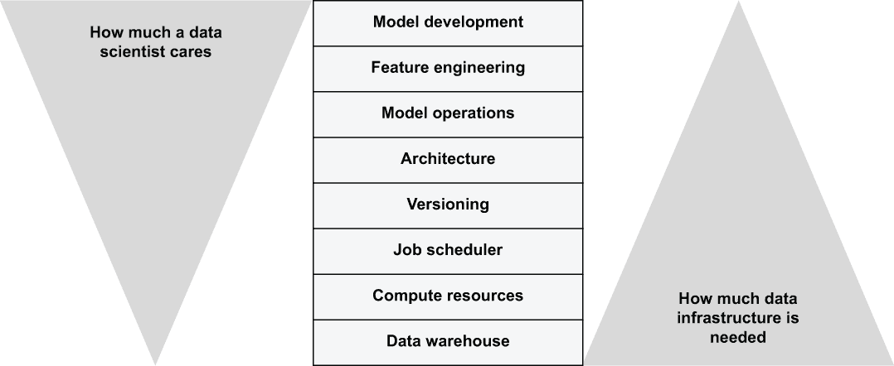

# 1 介绍数据科学基础设施

本章涵盖

+   为什么公司首先需要数据科学基础设施

+   介绍数据科学和机器学习的基础设施堆栈

+   成功数据科学基础设施的要素

机器学习和人工智能诞生于 20 世纪 50 年代的学术界。从技术上讲，如果时间成本不是问题，本书中展示的所有内容在几十年前就已经可以实施。然而，在过去七十年里，这个领域中的任何事物都不容易。

正如许多公司所经历的，构建由机器学习驱动的应用程序需要由具有专业知识的大型工程师团队，他们通常需要数年才能交付一个调优良好的解决方案。如果你回顾计算机的历史，大多数社会性的转变并不是在不可能的事情变得可能的时候发生的，而是在可能的事情变得容易的时候发生的。在可能和容易之间架起桥梁需要有效的基础设施，这正是本书的主题。

词典将基础设施定义为“一个国家、地区或组织正常运作所需的基本设备和结构（如道路和桥梁）。”本书涵盖了数据科学应用程序正常运作所需的基本设备和结构堆栈。阅读本书后，你将能够设置和定制一个基础设施，帮助你的组织比以往任何时候都更快、更容易地开发和交付数据科学应用程序。

关于术语的一些话

现代形式的“数据科学”这个短语是在 21 世纪初提出的。正如之前所提到的，“机器学习”和“人工智能”这些术语在此之前的几十年里就已经被使用，同时还有其他相关术语，如“数据挖掘”或“专家系统”，这些在某个时期曾经很流行。

对于这些术语的确切含义没有共识，这是一个挑战。这些领域的专业人士认识到数据科学、机器学习和人工智能之间的细微差别，但这些术语之间的界限是争议性和模糊的，这一定让那些在 20 世纪 70 年代和 80 年代对“模糊逻辑”这个术语感到兴奋的人感到高兴！

本书针对的是数据科学、机器学习和人工智能等现代领域的结合。为了简洁起见，我们选择使用“数据科学”这个术语来描述这种结合。术语的选择旨在包容性：我们不排除任何特定的方法或方法集。

为了本书的目的，这些领域之间的差异并不显著。在少数几个我们想要强调差异的具体案例中，我们将使用更具体的术语，例如“深度神经网络”。总之，每当本书使用这个术语时，如果你认为替换成你更喜欢的术语会使文本更有意义，你可以这样做。

如果你问一个领域内的人数据科学家的工作是什么，你可能会得到一个快速的回答：他们的工作是建立模型。尽管这个回答并不错误，但它有点狭隘。越来越多人期望数据科学家和工程师能够构建解决商业问题的端到端解决方案，其中模型只是一个小但重要的部分。因为这本书专注于端到端解决方案，所以我们说数据科学家的工作是构建*数据科学应用*。因此，当你在这本书中看到这个短语时，请考虑它意味着“模型以及端到端解决方案所需的任何其他东西。”

## 1.1 为什么需要数据科学基础设施？

关于数据科学是什么，为什么它有益，以及如何在各种环境中应用它的许多伟大书籍已经被写出来了。这本书专注于与*基础设施*相关的问题。在我们深入探讨为什么我们需要专门为数据科学建立基础设施之前，让我们简要地讨论一下为什么任何基础设施都存在。

考虑一下在 20 世纪工业规模农业出现之前，牛奶是如何生产和消费的。许多家庭有一到两头奶牛，为家庭的直接需求生产牛奶。维持一头奶牛需要一些专业知识，但不需要太多的技术基础设施。如果家庭想要扩大他们的乳品业务，没有投资于更大规模的饲料生产、人员数量和储存机制，这将是一项挑战。简而言之，他们能够以最少的设施运营一个小规模的乳品业务，但扩大生产*规模*则需要比仅仅再买一头奶牛更深的投资。

即使农场可以支持更多的奶牛，他们也需要将额外的牛奶分发到家庭以外的地方去销售。这提出了一个*速度*问题：如果农民不能足够快地移动牛奶，其他农民可能会先卖出他们的产品，使市场饱和。更糟糕的是，牛奶可能会变质，这会损害产品的*有效性*。

也许一个友好的邻居能够帮助分销并将牛奶运送到附近的城镇。我们的有事业心的农民可能会发现当地市场对原奶的供应过剩。相反，顾客需要的是*多样性*的精炼乳制品，比如酸奶、奶酪，甚至可能是冰淇淋。农民非常愿意服务顾客（并得到他们的钱），但很明显，他们的运营并没有准备好处理这种复杂程度。

随着时间的推移，一系列相互关联的系统应运而生，以满足这些需求，这些系统如今构成了现代乳制品基础设施：工业规模的农场优化了产量。制冷、巴氏杀菌和物流提供了将高质量牛奶运送到乳制品工厂所需的速度，然后这些工厂生产出各种产品，并分发到杂货市场。请注意，乳制品基础设施并没有取代所有小规模农民：有机、手工艺家庭农场的专业产品仍有一个相当大的市场，但以这种劳动密集型的方式满足所有需求并不可行。

三个“V”——体积、速度和多样性——最初由迈克尔·斯坦布瑞克教授用来对大数据数据库系统进行分类。我们添加了有效性作为第四个维度，因为它与数据科学高度相关。作为一个思维练习，考虑在你的业务环境中哪个维度最重要。在大多数情况下，有效的数据科学基础设施应在四个维度之间保持健康平衡。

### 1.1.1 数据科学项目生命周期

在过去的七十年里，大多数数据科学应用都是以一种可以描述为手工艺的方式产生的，即由一个高级软件工程师团队从头开始构建整个应用。与乳制品产品一样，手工艺并不意味着“不好”——通常恰恰相反。手工艺方式通常是实验前沿创新或生产高度专业化的应用的正确方式。

然而，正如乳制品行业一样，随着行业的成熟和需要支持更高产量、速度、有效性和多样化的产品，在共同基础设施上构建许多，如果不是大多数应用，变得合理。你可能对如何将生奶转化为奶酪以及支持工业规模奶酪生产所需的基础设施有一个大致的了解，但数据科学又是如何呢？图 1.1 展示了典型的数据科学项目。

图 1.1 数据科学项目生命周期

1.  在中心，我们有一个数据科学家，他被要求解决一个商业问题，例如，创建一个模型来估计客户的终身价值，或者创建一个在电子邮件通讯中生成个性化产品推荐的系统。

1.  数据科学家通过提出假设和实验来启动项目。他们可以使用他们最喜欢的工具来测试想法：Jupyter 笔记本、专门的编程语言如 R 或 Julia，或者软件包如 MATLAB 或 Mathematica。

1.  当涉及到原型设计机器学习或统计模型时，有出色的开源软件包可用，例如 Scikit-Learn、PyTorch、TensorFlow、Stan 以及许多其他软件包。得益于在线上可用的出色文档和教程，在许多情况下，使用这些软件包构建初始原型并不需要很长时间。

1.  然而，每个模型都需要数据。可能合适的数据存在于数据库中。为原型提取静态数据样本通常相当直接，但处理更大的数据集，比如数十吉字节，可能会更复杂。在这种情况下，数据科学家甚至还没有担心如何自动更新数据，这需要更多的架构和工程。

1.  数据科学家在哪里运行笔记本？也许他们可以在笔记本电脑上运行它，但他们如何分享结果？如果他们的同事想测试原型，但他们没有足够强大的笔记本电脑怎么办？在共享服务器上执行实验可能会更方便——在云端——所有合作者都可以轻松访问。然而，有人需要首先设置这个环境，并确保服务器上可用的工具、库以及数据。

1.  数据科学家被要求解决一个商业问题。很少有公司在笔记本或其他数据科学工具上进行业务操作。为了证明原型的价值，仅仅原型存在于笔记本或其他数据科学环境中是不够的。它需要集成到周围的业务基础设施中。也许那些系统是以微服务组织的，因此如果新的模型可以作为微服务部署，那将是有益的。这样做可能需要相当多的基础设施工程经验和知识。

1.  最后，原型集成到周围系统后，利益相关者——产品经理和业务所有者——评估结果并向数据科学家提供反馈。可能出现两种结果：要么利益相关者对结果持乐观态度，并要求数据科学家进一步改进，要么他们认为科学家的时间最好花在其他更有希望的业务问题上。值得注意的是，两种结果都导致相同的下一步：整个周期从开始再次开始，要么专注于改进结果，要么解决新的问题。

生命周期细节在公司和项目之间自然会发生变化：如何为顾客终身价值开发预测模型与构建自动驾驶汽车有很大不同。然而，所有数据科学和机器学习项目都有以下共同的关键要素：

1.  从技术角度来看，所有项目在其基础都涉及*数据和计算*。

1.  本书侧重于这些技术的实际应用，而不是纯粹的研究，所以我们期望所有项目最终都需要解决将结果*集成到生产系统*的问题，这通常涉及大量的软件工程。

1.  最后，从人类的角度来看，所有项目都涉及*实验和迭代*，许多人认为这是数据科学的核心活动。

虽然个人、公司或团队当然可以提出他们自己的定制流程和实践来执行数据科学项目，但一个共同的基础设施可以帮助增加可以同时执行的项目数量（*体积*），加快上市时间（*速度*），确保结果稳健（*有效性*），并使支持更多样化的项目成为可能。

注意，项目的规模，即数据集或模型的大小，是一个正交的关注点。特别是，认为只有大规模项目需要基础设施是错误的。通常情况正好相反。

这本书适合我吗？

如果与数据科学项目生命周期相关的问题和潜在解决方案与您产生共鸣，您应该会发现这本书很有用。如果您是一位数据科学家，您可能已经亲身体验了一些挑战。如果您是一位希望设计和构建系统以帮助数据科学家的基础设施工程师，您可能希望找到可扩展、稳健的解决方案来应对这些问题，这样您就不必在夜间因某些故障而醒来。

我们将系统地介绍构建现代、有效数据科学基础设施的系统。本书涵盖的原则并不特定于任何特定的实现，但我们将使用开源框架*Metaflow*来展示这些想法如何付诸实践。或者，您也可以通过使用其他现成的库来自定义自己的解决方案。这本书将帮助您选择适合工作的正确工具集。

值得注意的是，存在一些完全有效且重要的场景，这本书并不适用。如果您处于以下情况，这本书以及一般的数据科学基础设施可能对您并不相关：

+   您专注于理论研究，并没有将方法和结果应用于实际案例中。

+   您处于第一个应用数据科学项目的早期阶段（如前所述的步骤 1-4），一切进展顺利。

+   您正在从事一个非常具体、成熟的特定应用，因此优化项目的体积、速度和多样性并不重要。

在这些情况下，您可以在有更多项目开始出现或您开始遇到像我们之前的数据科学家所面临的难题时再回到这本书。否则，继续阅读！在下一节中，我们将介绍一个基础设施栈，为我们在后续章节中讨论的所有内容提供整体框架。

## 1.2 什么是数据科学基础设施？

新基础设施是如何出现的？在 20 世纪 90 年代互联网的早期，除了原始的网页浏览器和服务器之外，没有其他基础设施。在互联网泡沫时期，建立一个电子商务商店是一项重大的技术壮举，涉及众多人员、大量的定制 C 或 C++代码，以及财力雄厚的风险投资家。

在接下来的十年里，一场类似于寒武纪大爆发的网络框架开始汇聚到常见的基础设施栈，如 LAMP（Linux，Apache，MySQL，PHP/Perl/Python）。到 2020 年，操作系统、网络服务器和数据库等组件已经变成了少数人需要担心的问题，使得大多数开发者能够专注于使用如 ReactJS 这样的高级框架来构建面向用户的软件层。

数据科学的基础设施正在经历类似的演变。原始的机器学习和优化库已经存在了几十年，而没有太多的其他基础设施。现在，在 2020 年代初，我们正经历数据科学库、框架和基础设施的爆炸式增长，这通常是由商业利益驱动的，类似于在互联网泡沫期间及其之后发生的情况。如果历史可以作为证明，那么从这种碎片化的景观中将会出现广泛共享的模式，这将形成数据科学通用开源基础设施栈的基础。

在构建任何基础设施时，记住基础设施只是达到目的的手段，而不是目的本身是很好的。在我们的案例中，我们想要构建基础设施，以便使数据科学项目——以及负责这些项目的数据科学家——更加成功，如图 1.2 所示。

图 1.2 总结本书的关键关注点

下一个章节中介绍的这个栈的目标是解锁四个“V”：它应该能够支持更大规模和更多样化的项目，以更高的速度交付，同时不牺牲结果的有效性。然而，栈本身并不能交付项目——成功的项目是由数据科学家交付的，他们的生产力有望通过栈得到极大的提升。

### 1.2.1 数据科学的基础设施栈

数据科学基础设施栈的元素究竟是什么？得益于开源文化和硅谷以及全球范围内公司之间相对自由的技术信息共享，我们已经能够观察和收集数据科学项目和基础设施组件中的常见模式。尽管实现细节各异，但主要的基础设施层在大量项目中相对统一。本书的目的是提炼和描述这些层以及它们为数据科学形成的基础设施栈。

图 1.3 中展示的栈并不是构建数据科学基础设施的唯一有效方式。然而，它应该是一个有充分理由的方案：如果你从第一原理开始，很难想象在不解决栈的每一层的情况下如何成功执行数据科学项目。作为一个练习，你可以挑战栈的任何一层，并思考如果那一层不存在会发生什么。

每一层都可以以各种方式实现，由其环境和用例的具体需求驱动，但整体图景却非常一致。

图 1.3 数据科学基础设施栈

这个数据科学基础设施栈的组织方式是，最基本、最通用的组件位于栈的底部。随着向栈顶的移动，层变得更加针对数据科学。

栈是这本书各章节之间的关键思维模型，将它们联系在一起。当你读到最后一章时，你将能够回答为什么需要栈，每一层的作用是什么，以及如何在栈的每一层做出适当的技术选择。因为你将能够以一致的观点和架构构建基础设施，这将为使用它的数据科学家提供无缝、愉悦的体验。为了给你一个关于层含义的高层次概念，让我们从底部开始逐一介绍。

数据仓库

数据仓库存储应用程序使用的输入数据。一般来说，依赖一个单一集中的数据仓库作为事实的共同来源是有益的，而不是为数据科学构建一个专门的数据仓库，这很容易导致数据定义的分歧。第七章专门讨论这个广泛而深入的主题。

计算资源

原始数据本身并不能做什么——你需要运行计算，例如数据转换或模型训练，才能将其转化为更有价值的东西。与软件工程的其它领域相比，数据科学往往特别需要计算资源。数据科学家使用的算法形状和大小各异。有些需要许多 CPU 核心，有些需要 GPU，还有些需要大量内存。我们需要一个能够平滑扩展以处理多种不同类型工作负载的计算层。我们将在第四章和第五章中介绍这些主题。

任务调度器

不可否认，数据科学中没有什么是一次性的操作：模型应该定期重新训练，预测应根据需求生成。将数据科学应用视为一个持续嗡嗡作响的引擎，不断将数据流通过模型。调度层的任务是保持机器以期望的节奏运行。此外，调度器有助于将应用程序结构化和执行为计算步骤的相互关联的工作流。任务调度和工作流编排的主题在第二章、第三章和第六章中讨论。

版本控制

实验和迭代是数据科学项目的定义特征。因此，应用程序总是处于变化之中。然而，进步很少是线性的。通常，我们事先不知道哪个版本的应用程序比其他版本有所改进。为了正确判断版本，你需要并行运行多个版本，作为一个 A/B 实验。为了实现快速但有序的开发和实验，我们需要一个强大的版本控制层来组织工作。与版本控制相关的话题在第三章和第六章中进行了讨论。

架构

除了核心数据科学工作之外，构建一个健壮、可投入生产的数据科学应用程序还需要大量的软件工程。越来越多的公司发现，让那些并非软件工程师出身的数据科学家自主构建这些应用程序，同时提供强大的基础设施支持，是有益的。基础设施堆栈必须为数据科学家提供软件脚手架和指导轨道，确保他们产生的代码遵循架构最佳实践。我们在第三章中介绍了 Metaflow，这是一个开源框架，它规范了许多这样的实践。

模型操作

数据科学应用程序本身没有固有的价值——只有当它们连接到其他系统，如产品 UI 或决策支持系统时，它们才变得有价值。一旦应用程序部署，为了成为产品体验或业务运营的关键部分，它预计能够在各种条件下保持运行并输出正确的结果。如果应用程序失败，就像所有生产系统偶尔会发生的那样，必须建立系统以允许快速检测、故障排除和修复错误。我们可以从传统软件工程的最佳实践中学习很多，但数据和概率模型的变化性质给数据科学操作带来了特殊的味道，我们在第六章和第八章中讨论了这一点。

特征工程

在面向工程的层之上，是数据科学的核心关注点。首先，数据科学家必须发现合适的原始数据，确定其所需的子集，开发转换，并决定如何将生成的特征输入到模型中。设计这样的管道是数据科学家日常工作的主要部分。我们应该努力使这个过程尽可能高效，无论是在人类生产力的角度还是在计算复杂性的角度。有效的解决方案通常非常具体于每个问题域，因此我们的基础设施应该能够支持第七章和第九章中讨论的各种特征工程方法。

模型开发

最后，在堆栈的顶部是模型开发层：寻找并描述一个将特征转换为期望输出的数学模型。我们期望这一层将稳固地位于数据科学家的专业知识领域，因此基础设施不需要对建模方法有太多的偏见。我们应该能够支持广泛的现成库，以便科学家能够灵活地选择最适合工作的工具。

如果你对这个领域是新手，可能会让很多人感到惊讶，模型开发只占整个端到端机器中构建有效数据科学应用的极小部分。将模型开发层与人类大脑进行比较，大脑只占一个人总体体重的 2-3%。

### 1.2.2 支持数据科学项目的完整生命周期

基础设施堆栈的目标是在数据科学项目的整个生命周期中支持典型的数据科学项目，从其构思和初始部署到无数次的增量改进迭代。之前，我们确定了以下三个在大多数数据科学项目中都常见的主题。图 1.4 显示了这些主题如何映射到堆栈上。

图 1.4 数据科学项目的关注点映射到基础设施层

1.  很容易看出，无论问题领域如何，每个数据科学项目都需要处理数据和计算，因此这些层形成了**基础架构**。这些层对具体执行的内容是中立的。

1.  中间层定义了单个数据科学应用的**软件架构**：执行什么以及如何执行——算法、数据处理管道、部署策略以及结果的分发。关于这项工作的很多内容都是关于整合现有的软件组件。

1.  堆栈的顶部是**数据科学**的领域：定义数学模型以及如何将原始输入转换为模型可以处理的内容。在一个典型的数据科学项目中，这些层可以随着数据科学家尝试不同的方法而快速演变。

注意，层与主题之间并不是一对一的映射。关注点是重叠的。我们使用堆栈作为设计和构建基础设施的蓝图，但用户不需要关心它。特别是，他们不应该遇到层之间的缝隙，而应该将堆栈作为有效的数据科学基础设施来使用。

在下一章中，我们将介绍 Metaflow，这是一个框架，它提供了一个如何在实践中实现这一点的例子。或者，你可以通过遵循即将到来的章节中阐述的通用原则，结合解决堆栈不同部分的框架来自定义自己的解决方案。

### 1.2.3 一劳永逸的解决方案并不适用

如果贵公司需要一款高度专业化的数据科学应用——比如自动驾驶汽车、高频交易系统，或者可以部署在资源受限的物联网设备上的微型模型？当然，这样的应用基础设施堆栈可能需要看起来非常不同。在许多这样的情况下，答案是肯定的——至少最初是这样的。

假设贵公司希望将最先进的自主飞行无人机推向市场。整个公司都团结起来开发一个数据科学应用：无人机。自然，这样一个复杂的项目涉及许多子系统，但最终的目标是生产一个应用，因此，数量或多样性不是首要关注的问题。毫无疑问，速度和有效性很重要，但公司可能认为核心业务问题需要高度定制的解决方案。

您可以使用图 1.5 中所示的四象限来评估贵公司是否需要高度定制化的解决方案或通用基础设施。

图 1.5 基础设施类型

一家无人机公司有一个特殊应用，因此他们可能专注于构建一个单一的**定制应用**，因为他们没有需要通用基础设施的多样性和数量。同样，一家小型初创公司使用预测模型来定价二手车，可以快速组装一个**基本应用**来完成工作——再次，最初不需要投资基础设施。

相比之下，一家大型跨国银行有数百个数据科学应用，从信用评级到风险评估和交易，每个都可以使用被广泛理解（尽管复杂——“常见”在此语境中并不表示简单或不先进）的模型来解决，因此通用基础设施是合理的。一个生物信息学研究机构可能有许多高度专业化的应用，这些应用需要非常**定制化的基础设施**。

随着时间的推移，公司往往会倾向于选择**通用基础设施**，无论他们最初从哪里开始。一家最初有定制应用的无人机公司最终可能需要其他数据科学应用来支持销售、营销、客户服务，或者可能是另一条产品线。他们可能保留专门的应用或甚至定制的基础设施来支持他们的核心技术，同时使用通用基础设施来支持其他业务。

注意：在决定您的基础设施策略时，请考虑最广泛的使用案例集，包括新的和实验性的应用。围绕少数最明显应用的需求来设计基础设施是一个常见的错误，这些应用可能不代表大多数（未来）使用案例的需求。实际上，最明显应用可能需要一种可以与通用基础设施共存的自定义方法。

在涉及规模（例如谷歌搜索）或性能（例如必须以微秒级提供预测的高频交易应用）时，定制应用程序可能会有独特的需求。这类应用程序通常需要工匠式的方法：它们需要经验丰富的工程师精心打造，可能还会使用专用硬件。缺点是，专用应用程序在优化速度和数量方面往往很困难（所需的特殊技能限制了可以工作在该应用程序上的人数），并且它们无法通过设计支持各种应用程序。

仔细考虑您将需要构建或支持的应用程序类型。今天，大多数数据科学应用程序都可以由通用基础设施支持，这正是本书的主题。这很有益，因为它允许您优化数量、速度、多样性和有效性。如果您的某个应用程序有特殊需求，它可能需要更定制的方法。在这种情况下，将特殊应用程序视为特殊情况，同时让其他应用程序从通用基础设施中受益可能是有意义的。

## 1.3 为什么良好的基础设施很重要

随着我们通过了基础设施堆栈的八层，您对构建现代数据科学应用程序所需的各种技术组件有了窥视。实际上，像 YouTube 的个性化推荐或实时优化横幅广告的复杂模型这样的大规模机器学习应用——一个故意平凡化的例子——是人类有史以来建造的最复杂的机器之一，考虑到涉及的数百个子系统和数百万行代码。

按照我们的原始示例，为乳制品行业构建基础设施可能比许多生产级数据科学应用程序的复杂性低一个数量级。大部分复杂性在表面上并不明显，但事情失败时，它肯定会变得明显。

为了说明复杂性，想象一下上述八层堆栈为一个数据科学项目提供动力。记住，一个项目可以涉及许多相互连接的机器，每台机器代表一个复杂的模型。大量新鲜数据，可能数量很大，通过这些机器流动。这些机器由一个计算平台提供动力，该平台需要管理各种大小、同时执行的数千台机器。机器由作业调度器编排，确保数据在机器之间正确流动，并且每台机器在正确的时间执行。

我们有一支数据科学家团队在这些机器上工作，他们中的每个人都在快速迭代中尝试分配给他们的机器的各种版本。我们希望确保每个版本都能产生有效结果，并且我们希望通过并行执行来实时评估它们。每个版本都需要自己的独立环境，以确保版本之间不会发生干扰。

这种场景应该唤起一个工厂的画面，雇佣着成百上千个不停嗡嗡作响的机器的团队。与工业时代的工厂不同，这个工厂不是一次性建成的，而是不断演变，每天多次略微改变其形状。软件不受物理世界的限制，但它必须产生不断增长的商业价值。

故事还没有结束。一个大型或中型现代公司不仅仅只有一个工厂，一个数据科学应用，而是可以有任意多个。应用的数量本身就会造成运营负担，但主要挑战是多样性：每个现实世界的问题领域都需要不同的解决方案，每个都有自己的需求和特征，导致需要支持的应用程序种类繁多。作为复杂性蛋糕上的樱桃，这些应用程序通常是相互依赖的。

以一个假设的中型电子商务商店为例。他们有一个定制的推荐引擎（“这些产品推荐给您！”）；一个衡量营销活动有效性的模型（“Facebook 广告在康涅狄格州似乎比 Google 广告表现更好。”）；一个物流优化模型（“与保持库存相比，直接发货类别 B 更有效率。”）；以及一个用于估计客户流失的财务预测模型（“购买 X 的客户似乎流失较少。”）。这四个应用中的每一个本身就是一个工厂。它们可能涉及多个模型、多个数据处理管道、多个人和多个版本。

### 1.3.1 复杂性管理

现实生活中的数据科学应用复杂性给基础设施带来了许多挑战。对于这个问题，没有简单巧妙的解决方案。我们不是将复杂性视为可以扫除或抽象掉的麻烦，而是将管理复杂性作为有效基础设施的关键目标。我们将从多个方面应对这一挑战，如下所述：

+   *实施*—设计和实施处理这种复杂程度的**基础设施**是一个非平凡的任务。我们将在后面讨论解决工程挑战的策略。

+   *可用性*—在涉及复杂性的情况下，使数据科学家保持高效生产是有效基础设施的关键挑战，这也是后来提出的以人为中心的**基础设施**的关键动机。

+   *运维*——我们如何以最小的人工干预使机器保持运行？减少数据科学应用的操作负担是基础设施的另一个关键目标，这也是本书各章节的共同主题。

在所有这些情况下，我们必须避免引入*偶然复杂性*，即不是由问题本身所必需的，而是由选择的方法带来的不希望出现的副作用。偶然复杂性是现实世界数据科学的一个巨大问题，因为我们必须处理如此高的*固有复杂性*，以至于区分真实问题和想象问题变得困难。

你可能听说过*样板代码*（仅为了使框架满意而存在的代码），*意大利面式管道*（系统之间组织混乱的关系），或者*依赖地狱*（管理不断演变的第三方库图是困难的）。在这些技术问题之上，我们还面临着由人为组织引起的偶然复杂性：有时我们不得不在系统之间引入复杂的接口，并不是因为它们在技术上必要，而是因为它们遵循组织边界，例如，数据科学家和数据工程师之间。你可以在一篇经常引用的论文中了解更多关于这些问题，这篇论文名为“机器学习系统中的隐藏技术债务”，由谷歌在 2015 年发布([`mng.bz/Dg7n`](http://mng.bz/Dg7n))。

一个有效的基础设施有助于揭示和管理固有的复杂性，这是我们所处世界的自然状态，同时有意识地避免引入偶然复杂性。做好这一点很难，需要不断的判断。幸运的是，我们有一个经过时间考验的启发式方法来控制偶然复杂性，那就是*简单性*。“一切都应该尽可能简单，但不能过于简单”是适用于有效数据科学基础设施所有部分的核心设计原则。

### 1.3.2 利用现有平台

根据前几节所述，我们的任务是构建基于八层栈的有效、通用数据科学基础设施。我们希望以这种方式进行，使现实世界的复杂性变得可管理，同时最大限度地减少基础设施本身引起的额外复杂性。这听起来可能是一项艰巨的任务。

很少有公司能够承担起为数据科学建设并维护大量工程师团队的费用。较小的公司可能只有一到两名工程师负责这项任务，而较大的公司可能有一个小团队。最终，公司希望利用数据科学应用产生商业价值。基础设施是实现这一目标的手段，而不是一个目标本身，因此根据这一目标确定基础设施投资的规模是合理的。总的来说，我们在构建和维护基础设施上只能投入有限的时间和精力。

幸运的是，正如本章开头所提到的，本书中介绍的所有内容在技术上已经可以实现数十年，所以我们不必从头开始。我们不需要发明新的硬件、操作系统或数据仓库，我们的任务是利用现成的最佳平台，并将它们集成起来，以便轻松原型化和生产化数据科学应用。

工程师们往往低估了“可能”与“容易”之间的差距，如图 1.6 所示。在鸿沟的“可能”一侧，很容易以各种方式重新实现事物，而不真正回答如何使事情从根本上变得更容易的问题。然而，只有鸿沟的“容易”一侧才能使我们最大限度地发挥数据科学应用的四 V——数据量、速度、多样性和有效性——因此我们不应该在左岸花费太多时间。

图 1.6 基础设施使事情变得简单。

本书帮助您首先构建桥梁，这本身就是一个非同寻常的任务，尽可能利用现有组件。多亏了我们具有不同层的堆栈，我们可以让其他团队和公司担心个别组件。随着时间的推移，如果其中一些被发现不足，我们可以用更好的替代品替换它们，而不会干扰用户。

心无旁骛

云计算是一个很好的例子，它使许多技术上的事情成为可能，尽管并非总是容易实现。公共云，如亚马逊网络服务（Amazon Web Services）、谷歌计算平台（Google Compute Platform）和微软 Azure，通过允许任何人访问以前仅对最大公司开放的底层基础结构，极大地改变了基础设施的格局。这些服务不仅在技术上可用，而且在谨慎使用时也极具成本效益。

除了使基础设施的底层民主化外，云技术还从根本上改变了我们构建基础设施的方式。以前，在构建高性能计算系统时遇到的许多挑战都围绕着资源管理：如何保护并合理分配有限的计算和存储资源，以及相应地，如何使资源使用尽可能高效。

云技术使我们能够改变我们的思维方式。所有云都提供了一个数据层，例如亚马逊 S3，它提供了几乎无限的存储空间，接近完美的持久性和高可用性。同样，它们提供了几乎无限的、可弹性扩展的计算资源，如亚马逊弹性计算云（Amazon EC2）及其之上的抽象。我们可以假设我们有大量的计算资源和存储可用来构建我们的系统，并专注于成本效益和生产率。

本书假设您能够访问类似云的基础设施。到目前为止，满足这一要求最简单的方法是，在云服务提供商之一创建一个账户。您可以用几百美元或通过依赖许多云提供的免费层来免费构建和测试您的堆栈。或者，您可以构建或使用现有的私有云环境。然而，如何构建私有云超出了本书的范围。

所有云也提供了针对数据科学的高级产品，例如 Azure Machine Learning (ML) Studio 和 Amazon SageMaker。您通常可以将这些产品用作端到端平台，需要最小化定制，或者，您可以选择将它们的部分集成到您自己的系统中。本书采用后一种方法：您将学习如何构建自己的堆栈，利用云提供的各种服务以及使用开源框架。尽管这种方法需要更多工作，但它提供了更大的灵活性，结果可能更容易使用，并且定制的堆栈可能也更经济高效。您将在接下来的章节中了解到这一点的原因。

总结来说，您可以利用云来处理低级、无差别的技术重活。这使您可以将有限的开发预算集中在独特的、区分性的业务需求上，最重要的是，在您的组织中优化数据科学家的生产力。我们可以使用云越来越多地将我们的重点从技术问题转移到人文问题，正如我们将在下一节中描述的那样。

## 1.4 以人为中心的基础设施

该基础设施旨在从多个方面最大化组织的生产力。它支持更多项目，更快交付，结果更可靠，覆盖更多业务领域。为了更好地理解基础设施如何实现这一点，考虑以下在有效基础设施不可用时出现的典型瓶颈：

+   *体积*—我们无法支持更多的数据科学应用，仅仅因为我们没有足够的数据科学家来处理它们。我们所有的现有数据科学家都在忙于改进和支持现有应用。

+   *速度*—我们无法更快地交付结果，因为开发模型 X 的生产就绪版本将是一项重大的工程努力。

+   *有效性*—该模型的原型在笔记本上运行良好，但我们没有考虑到它可能会接收到像 Y 这样的数据，这在生产中破坏了它。

+   *多样性*—我们很乐意支持新的用例 Z，但我们的数据科学家只知道 Python，而围绕 Z 的系统只支持 Java。

在所有这些案例中，一个共同的因素是*人类是瓶颈*。除了某些高度专业化的应用，很少发生项目因为硬件或软件的基本限制而无法交付的情况。一个典型的瓶颈是由人类无法足够快地交付软件（或硬件，如果是在云外操作）这一事实造成的。即使他们能够足够快地破解代码，他们可能正忙于维护现有系统，而这又是另一项至关重要的人类活动。

这个观察结果帮助我们意识到，尽管“基础设施”听起来非常技术化，但我们并不是在为机器构建基础设施。我们是在为提高人类的生产力而构建基础设施。这一认识对我们思考如何为数据科学家（即人类同胞，而不是机器）设计和构建基础设施具有根本性的影响。

例如，如果我们假设人类时间比计算机时间更昂贵，这对于大多数数据科学家来说无疑是正确的，那么使用像 Python 这样的高度表达性和生产力提升的语言，而不是像 C++这样的底层语言，即使它使得工作负载处理效率更低，也是有意义的。我们将在第五章中更深入地探讨这个问题。

在上一节中，我们提到了我们希望充分利用现有平台并将它们集成到我们的基础设施堆栈中。我们的目标应该是以提供一致的用户体验的方式来做这件事，最大限度地减少用户在必须独立理解和操作每一层时可能遇到的认知开销。我们的假设是，通过减少与基础设施相关的认知开销，我们可以提高数据科学家在最重要的领域——即数据科学本身的——生产力。

### 1.4.1 自由与责任

Netflix，这家流媒体视频公司，以其独特的文化而闻名，这种文化在 Erin Meyer 和 Netflix 的联合创始人兼长期首席执行官 Reed Hastings 最近的一本书《无规则规则：Netflix 与变革文化》（Penguin Press，2020）中有详细描述。Netflix 的核心价值观之一是“自由与责任”，这赋予所有员工极大的自由度来决定他们如何完成工作。另一方面，员工始终被期望考虑公司的最大利益并负责任地行事。Metaflow，一个以人为中心的数据科学基础设施框架，我们将在第三章中介绍，它诞生于 Netflix，受到了公司文化的深刻影响。

我们可以将自由度和责任的概念应用于数据科学家的工作和数据科学基础设施。我们期望数据科学家在自己的领域是专家，例如在特征工程和模型开发方面。我们不期望他们是系统工程或其他与基础设施相关主题的专家。然而，我们期望他们有足够的责任感，如果数据科学基础设施可用，他们会选择利用它。我们可以将这个想法映射到我们的基础设施堆栈，如图 1.7 所示。

图 1.7 基础设施补充了数据科学家的利益。

左侧的三角形描述了数据科学家的专业领域和兴趣。它在堆栈的顶部最宽，最具体于数据科学。基础设施应该在这些层给予他们最大的自由度，允许他们根据自己的专长自由选择最佳建模方法、库和功能。我们期望数据科学家是自主的——关于这一点稍后还会详细说明——因此，他们应该稍微关注模型操作、版本控制和架构，这是他们责任的一部分。

右侧的三角形描述了基础设施团队的自由度和责任。基础设施团队应该有最大的自由度来选择和优化堆栈的底层，这在技术观点上是至关重要的。他们可以在不过度限制数据科学家自由度的前提下做到这一点。然而，他们的责任在堆栈的上层会减少。基础设施团队不能对模型本身负责，因为通常他们没有足够的专长，也没有足够的规模来支持所有用例。

这种安排的目的有两方面：一方面，我们可以通过让他们专注于自己喜欢且擅长执行的事情，以极大的自由度，最大化单个数据科学家的生产力和幸福感。另一方面，通过要求数据科学家负责任地使用堆栈，包括他们可能不太热衷的部分，我们可以实现公司利益的四个“V”，即速度、可扩展性、可访问性和可变性。结果是公司需求和数据科学家幸福之间的健康平衡。

### 1.4.2 数据科学家自主性

到目前为止，我们随意地谈论了“基础设施团队”和“数据科学家”。然而，数据科学项目中实际的角色可能更加多样化，如下所示：

+   *数据科学家* 或 *机器学习研究员* 开发和原型化机器学习或其他数据科学模型。

+   *机器学习工程师* 以可扩展、生产就绪的方式实现模型。

+   *数据工程师* 设置数据管道，用于输入和输出数据，包括数据转换。

+   *DevOps 工程师*在生产中部署应用程序，并确保所有系统保持正常运行且无故障。

+   *应用工程师*将模型与其他业务组件（如 Web 应用程序）集成，这些应用程序是模型的消费者。

+   *基础设施或平台工程师*为许多应用程序提供通用基础设施，例如数据仓库或计算平台。

除了这个技术团队外，数据科学项目可能还会涉及*业务所有者*，他们了解应用程序的业务背景；*产品经理*，他们将业务背景映射到技术要求；以及*项目/程序经理*，他们帮助协调跨职能协作。

任何参与过涉及众多利益相关者的项目的个人都知道，为了使项目顺利进行，需要多少沟通和协调。除了协调开销外，仅仅是因为没有足够的人来填补所有项目中所有角色的简单原因，增加并行数据科学项目的数量可能具有挑战性。出于这些原因以及许多其他原因，许多公司发现减少参与项目的人数是可取的，只要项目的执行不受影响。

我们基础设施堆栈的目标是使前四个技术角色能够合并，以便数据科学家能够在项目内部自主处理所有这些功能。这些角色在公司中可能仍然存在，但不是每个项目都需要这些角色，这些角色可以分配给少数关键项目，或者它们可以支持更横向的跨项目工作。

总结来说，数据科学家，他们不需要突然成为 DevOps 或数据工程的专家，应该能够以可扩展的方式实现模型，设置数据管道，并独立地部署和监控生产中的模型。他们应该能够以最小的额外开销做到这一点，从而让他们能够专注于数据科学。这是我们以人为本的数据科学基础设施的关键价值主张，我们将在下一章从头开始构建。

## 摘要

+   虽然可以在没有专用基础设施的情况下开发和交付数据科学项目，但有效的基础设施使得能够以更高的速度开发更多种类和数量的项目，同时不牺牲结果的有效性。

+   需要一个完整的系统基础设施堆栈来支持数据科学家，从基础层（如数据和计算）到更高级的关注点（如特征工程和模型开发）。本书将系统地介绍所有这些层。

+   数据科学没有一刀切的方法。能够定制基础设施堆栈的层以解决您的特定需求是有益的，这本书将帮助您做到这一点。

+   现代数据科学应用是一个复杂、精密的机器，涉及许多移动部件。在管理这种固有的复杂性方面做得很好，同时避免在执行过程中引入任何不必要的复杂性，这是数据科学基础设施的关键挑战。

+   利用现有的、经过实战考验的系统，例如公共云，是控制复杂性的好方法。接下来的章节将帮助你在堆栈的每一层选择合适的系统。

+   最终，人类往往成为数据科学项目的瓶颈。我们的关键焦点应该是提高整个堆栈的可用性，从而提高数据科学家的生产力。
