# 2 数据科学工具链

本章节涵盖

+   数据科学家在日常生活中参与的关键活动

+   使数据科学家高效的基本工具链

+   工作流程在基础设施堆栈中的作用

每个职业都有其行业工具。如果你是一名木匠，你需要锯子、尺子和凿子。如果你是一名牙医，你需要镜子、钻头和注射器。如果你是一名数据科学家，你在日常工作中需要哪些基本工具呢？

显然，你需要一台电脑。但电脑的用途是什么？它应该用于运行重型计算、训练模型等，还是仅仅作为一个相对笨拙的终端，用于编写代码和分析结果？由于生产应用程序在个人笔记本电脑之外执行，也许原型设计应该尽可能接近真实的生产环境。回答这类问题可能出人意料地复杂，而且答案可能对整个基础设施堆栈产生深远的影响。

正如我们在第一章中强调的，这些工具最终存在是为了提高数据科学家的生产力。我们必须仔细思考构成数据科学家日常工作主体的行动：探索和分析数据、编写代码、评估它并检查结果。如何使这些行动尽可能无摩擦，考虑到它们每天可能重复数百次？没有唯一的正确答案。本章将为你提供思考和技术指导，以设置适合您公司和技术环境的工具链。

将数据科学的全栈想象成一架喷气式战斗机——一个由无数相互连接的组件组成的复杂工程壮举。本章将探讨飞行员操作机器时使用的驾驶舱和仪表盘。从工程的角度来看，驾驶舱可能感觉有些次要，本质上只是一个控制杆和一些按钮（在数据科学的情况下，只是一个编辑器和笔记本），与下面的 3 万磅重的重型工程相比，但往往正是决定任务成功或失败的那个组件。

跟随数据科学家的旅程

为了使讨论更加具体和贴近现实商业需求，我们将跟随一位假设的数据科学家，亚历克斯，在整个书中展开旅程。亚历克斯的旅程展示了数据科学家在现代商业环境中面临的典型挑战。亚历克斯帮助我们保持对以人为本的基础设施的聚焦，并展示基础设施如何与公司一起逐步增长。每个部分都以与亚历克斯工作生活相关的激励场景开始，我们将详细分析和解决这些问题。

除了数据科学家亚历克斯之外，角色还包括哈珀，他是亚历克斯工作的初创公司的创始人。我们还将遇到波维，他是一位基础设施工程师，其职责包括为数据科学家提供支持。这本书的目标是针对所有像亚历克斯和波维这样的人，但更广泛的环境也可能对哈珀们来说很有趣。

*亚历克斯拥有海洋生物学博士学位。在意识到具有统计分析、基本机器学习以及 Python 基础知识的人作为数据科学家非常受重视后，亚历克斯决定从学术界转向工业界。*


## 2.1 设置开发环境

*亚历克斯加入了哈珀的初创公司 Caveman Cupcakes，该公司作为其首位数据科学家，负责制造和交付即将个性化的原始人风格杯型蛋糕。波维，作为 Caveman 的基础设施工程师，帮助亚历克斯开始工作。亚历克斯询问波维，Caveman 的数据科学家是否可以使用 Jupyter 笔记本来完成工作。如果他们能这样做，那就太好了，因为亚历克斯在学术界已经非常熟悉笔记本了。听到这个，波维意识到数据科学家有特殊的工具需求。他们应该安装哪些工具，以及如何配置这些工具以使亚历克斯的工作效率最大化？*


如果你只有时间设置好一项基础设施，那就让它是数据科学家的开发环境。虽然这听起来可能很显然，但你可能会惊讶地发现，许多公司都有调校良好、可扩展的生产基础设施，但最初代码的开发、调试和测试问题却以临时方式解决。我们不应仅仅将个人工作站视为一个 IT 问题，而应将开发环境视为有效基础设施的有机组成部分。毕竟，任何数据科学项目最重要的成功因素是参与其中的人及其工作效率。

词典将*人体工程学*定义为“研究人们在工作环境中的效率”，这很好地总结了本章的重点。数据科学的发展环境需要优化以下两种人类活动的效率：

1.  *原型设计*——将人类知识和专业知识转化为功能性代码和模型的过程

1.  *与生产部署的交互*——将代码和模型连接到周围系统，并运行这些生产部署，以便它们能够产生可持续的商业价值

图 2.1 中展示的原型循环在软件工程中很常见，被称为*REPL*，即读取-评估-打印循环。你在编辑器中编写代码，用交互式解释器或终端评估它，并分析结果。根据结果，你修复并改进代码，然后重新启动循环。这个循环在数据科学中也同样适用：你开发一个处理数据的模型或代码，评估它，并分析结果。

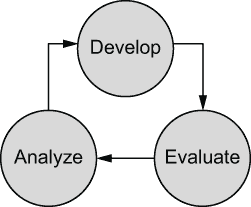

图 2.1 原型循环

为了提高数据科学家的生产力，我们希望使这个循环的每一次迭代尽可能快且不费力。这涉及到优化每个步骤以及步骤之间的转换：编写并评估一小段代码需要多长时间？你能否轻松地获取结果并开始分析它们？是否容易探索、分析和理解结果，并相应地更改代码？最终，我们需要基础设施堆栈所有层的合作来回答这些问题，但我们将从以下小节开始奠定基础。

经过无数次的原型循环迭代后，数据科学家拥有了一段能够产生有希望模型或其他所需输出的代码。尽管这对数据科学家来说是一个重要的里程碑，但许多开放性问题仍然存在：当连接到真实世界数据时，模型会产生预期的结果吗？模型能否扩展到它需要处理的所有数据？模型能否抵御随时间发生的变化？是否会有其他运营意外？

在原型环境中尝试回答这些问题是困难的。相反，我们应该使模型作为实验部署到生产环境变得容易，这样我们就可以观察模型在实际中的表现。预计模型的第一个版本可能不会完美运行，但生产故障提供了宝贵的见解，我们可以利用这些见解来改进模型。

进行此类受控的实证实验是科学方法的核心。科学家提出一个假设，进行实验，并分析结果。将此与 SpaceX 如何通过 20 次测试发射迭代开发新的可重复使用的火箭 Falcon 9，并在图 2.2 中展示的第一次成功助推器着陆之前，进行对比。

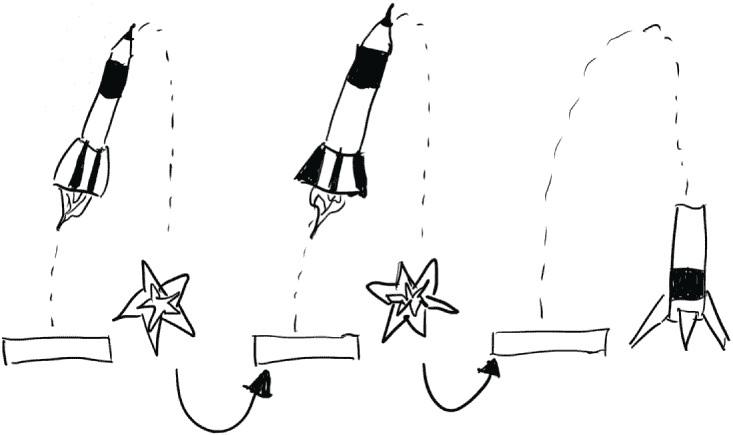

图 2.2 SpaceX 对 Falcon 9 的迭代

将部署到生产环境、观察问题并使用原型循环解决问题这一周期形成一个更高层次的循环，我们称之为*与生产部署的交互*。

如图 2.3 所示，生产部署不是一个单向的瀑布流程，而是一个迭代循环，与原型设计循环协同工作。我们希望让数据科学家更容易理解模型在生产中失败的原因和方式，并帮助他们本地重现任何问题，以便他们可以使用他们熟悉的原型设计循环来改进模型。值得注意的是，在成功的项目中，这些循环变成了无限循环：一个成功的模型会不断受到改进和调试的考验。

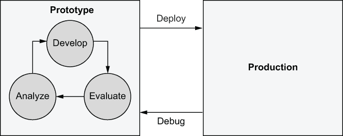

图 2.3 与生产部署的交互

在软件工程的世界里，这个概念被称为*持续交付*（CD）。尽管 CD 系统，如 GitHub Actions ([github.com/features/actions](https://github.com/features/actions))，可以用来促进数据科学部署，但数据科学应用与传统软件之间存在一些关键差异。考虑以下内容：

+   *正确性*—通过自动化测试相对容易确认传统软件在部署到生产之前是否正确工作。在数据科学中通常并非如此。部署的目标，例如执行 A/B 测试，是在部署后验证正确性。

+   *稳定性*—同样，通过自动化测试相对容易确认传统软件在其定义良好的环境中按预期工作。相比之下，数据科学应用受到不断变化的数据的影响，这使得它们在部署后面临意外情况。

+   *多样性*—可以开发一个传统软件组件，使其能够相对完美地完成预期的工作。相比之下，由于我们总是有新的想法和数据可以测试，因此很难达到这样的完美水平。相应地，能够并行部署多个模型版本并快速迭代是可取的。

+   *文化*—DevOps 和基础设施工程的世界有其自己的深厚文化和术语，这通常不被大多数数据科学课程所涵盖。遵循我们以人为本的伦理，我们不应该期望数据科学家，他们在自己的领域是专家，会突然成为另一个领域的专家。

在构建针对数据科学需求量身定制的基础设施时，我们可以从现有的 CD 系统中学习和部分利用。前面引入的两个循环是科学家重复以开发、部署和调试数据科学应用程序的概念性行动序列。本章的剩余部分将使它们更加具体。我们将介绍数据科学家应该使用的实际工具，并讨论如何最佳地设置它们。尽管无法规定配置数据科学环境的唯一正确方式——细节取决于你的业务基础设施——但我们将提供足够的技术背景和评估标准，以便你能够根据你的具体需求做出明智的决定。图 2.4 为你提供了一个预期概念。

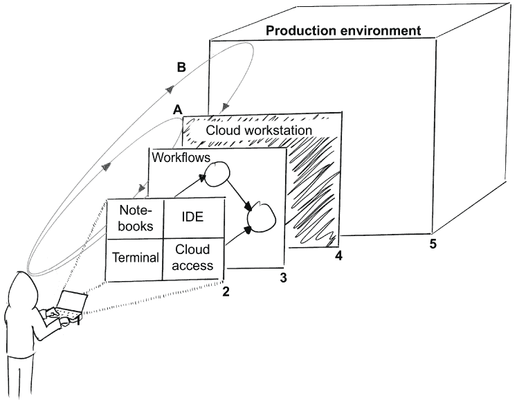

图 2.4 数据科学工具链的元素

1.  我们的关注点是数据科学家，他将使用工具链来推动两个核心活动：原型循环（A）和生产部署的交互（B）。

1.  在以下小节中，我们将介绍我们应该为科学家提供的核心生产力工具。

1.  在 2.2 节中，我们将强调将数据科学应用程序结构化为工作流的有用之处。

1.  我们还将论证在尽可能类似于生产环境的环境中运行原型循环的合理性——在实践中，通过云实例支持原型循环。

1.  本章介绍了用户界面，一个科学家用来指挥和控制生产环境的驾驶舱，这将在后续章节中详细说明。

### 2.1.1 云账户

本书我们将构建的基础设施假设你已经在公共云提供商（如亚马逊网络服务（AWS）、谷歌云平台（GCP）或微软 Azure）有一个账户。我们将使用 AWS 作为所有示例，因为它是目前最广泛使用的云平台。你应该能够相对容易地将示例和概念适应到其他云环境中，包括私有云。

AWS 提供免费层，允许你以最低或无成本设置本书中介绍的裸机基础设施。因此，强烈建议你创建一个 AWS 账户，除非你已经有了一个。创建一个账户很简单——只需遵循[aws.amazon.com/free](https://aws.amazon.com/free/?all-free-tier.sort-by=item.additionalFields.SortRank&all-free-tier.sort-order=asc&awsf.Free%20Tier%20Types=*all&awsf.Free%20Tier%20Categories=*all)上的说明。

许多公司已有现成的云账户。你应该能够为本书的目的使用它们。我们不会涵盖如何配置用户账户以及执行身份验证和授权，例如 AWS 的 IAM 用户和政策。这些问题并不特定于数据科学，你应该能够使用你之前使用过的相同策略。

### 2.1.2 数据科学工作站

数据科学家需要一个工作站来驱动原型循环，即开发、测试和部署代码和模型。如今，物理工作站通常是个人笔记本电脑。然而，由于需要高可用性和可扩展性，生产代码和模型不应在笔记本电脑上运行。相反，我们在云环境中部署生产模型。除了开发和生产硬件的差异外，操作系统也往往不同。在笔记本电脑上通常使用 OS X 或 Windows，而在服务器上使用 Linux。

开发工作站和生产环境之间通常存在技术差距，这在与生产部署交互时可能会引起摩擦。这个差距并不仅限于数据科学。例如，网络应用开发者通常在类似的环境中工作。然而，这个差距对于数据科学来说尤其有问题。现代建模库往往高度优化以适应特定的 GPU 和 CPU 架构，与 JavaScript 库等相比。此外，大规模数据处理往往比典型的非数据科学应用对硬件和软件的要求更高，放大了环境之间行为差异。

如许多软件开发人员所经历的艰难方式，当生产环境与开发环境存在显著差异时，调试代码可能会令人沮丧。我们可以通过解包原型循环来解决这个问题。我们不是在笔记本电脑上运行每个步骤——开发、评估和分析——而是在云中运行这些步骤中的任何或所有步骤。在实践中，这意味着我们需要一个半持久性的 Linux 实例或云中的容器，数据科学家可以连接到它。

设置一个可以按需启动和终止此类实例的系统需要预先配置以及为数据科学家提供培训。在决定您是想提供完全本地（基于笔记本电脑）、完全远程（基于云）还是混合解决方案时，请考虑表 2.1 中列出的优缺点。

表 2.1 笔记本电脑与云实例作为开发环境对比

|  | 笔记本电脑 | 云实例 |
| --- | --- | --- |
| **设置易用性** | 立即熟悉。 | 有学习曲线。 |
| **易用性** | 初始使用简单，但对于复杂情况，如部署，则较难。 | 初始使用较难；在更复杂的情况下，优势更为明显。 |
| **原型循环速度** | 步骤之间快速转换，但评估速度可能较慢，因为硬件有限。 | 步骤之间可能转换较慢，但评估速度更快。 |
| **支持易用性** | 监控较难；远程提供交互式支持较难。 | 易于支持——支持人员可以使用标准监控工具来观察实例，或远程登录实例。 |
| **可扩展性** | 不可扩展——硬件是固定的。 | 可扩展——实例大小可以根据用例选择。 |
| **与生产部署的交互** | 可能的跨平台问题（OS X 与 Linux）。 | 原型环境和生产环境之间的最小差异。 |
| **安全性** | 由于同一台笔记本电脑被用于许多除了数据科学之外的目的，因此存在许多问题；笔记本电脑可能会丢失。 | 更容易保护和监控——类似于任何其他云实例。可以使用标准的基于云的认证和授权系统，如 AWS IAM。 |
| **同质性** | 每个数据科学家可能都有一个略有不同的环境，这使得问题更难调试。 | 更容易确保环境高度统一。 |

总结表 2.1，基于云的工作站需要在基础设施方面做更多前期工作，但在安全性、运营关注点、可扩展性和与生产部署的交互方面可以带来巨大的回报。随着你阅读本书后面的章节，这一点将变得更加清晰。然而，你可以通过基于笔记本电脑的方法快速开始，随着需求的增长，稍后再重新审视这个决定。

提供基于云的工作站的方式取决于你的业务环境：你使用的云提供商、你的基础设施如何设置以及数据科学家需要遵守的安全策略类型。为了给你一个可用的选项的概览，我们接下来列出了一些典型的例子。预计在未来几年内，新的解决方案将变得可用，所以这个列表远非详尽无遗。

一个通用云 IDE：AWS Cloud9

AWS Cloud9 是一个通用、基于云的集成开发环境（IDE）——一个代码编辑器——它通过 AWS 提供的服务器（EC2 实例）在浏览器中运行，运行 Linux。使用 AWS Cloud9 的感觉与使用你的笔记本电脑在以下方面相似：

+   编辑器感觉像是一个本地编辑器，它内置了调试器。命令行会话感觉像是一个本地终端。

+   它管理着一个连接到编辑会话的标准 EC2 实例，你可以用它来支持原型循环并与生产部署进行交互。或者，你可以配置它连接到现有的 EC2 实例以获得更多控制。

+   除了通常的 EC2 费用外，没有额外的费用，未使用的实例会自动停止，因此它可能是一个非常经济有效的解决方案。

一个缺点是 AWS Cloud9 没有内置对笔记本的支持（关于笔记本的更多信息将在下一节中介绍），尽管通过一些定制工作，也可以使用底层的 EC2 来支持笔记本内核。

一个针对数据科学的环境：Amazon SageMaker Studio

Amazon SageMaker Studio 是 JupyterLab 数据科学环境的托管版本，它与 AWS 数据科学服务紧密集成。虽然你可以像 AWS Cloud9 一样将其用作通用代码编辑器，但它更侧重于以下方面的笔记本：

+   SageMaker Studio 为您管理支持笔记本和终端的实例，类似于 AWS Cloud9，但它使用的是更昂贵的、针对机器学习特定的实例类型，而不是普通的 EC2 实例。

+   现有的 Jupyter 和 JupyterLab 用户会感到非常熟悉。

+   如果您使用 AWS 数据科学服务，集成到 AWS 数据科学服务中会非常方便。

其他云服务提供商也提供了类似的服务作为其平台的一部分，例如微软的 Azure Machine Learning Studio。如果您想利用与它集成的其他服务，一个完整的数据科学环境非常有用。否则，一个更简单的编辑器可能更容易使用和操作。

由云实例支持的本地编辑器：Visual Studio Code

AWS Cloud9 和 SageMaker Studio 都是完全基于云的，包括基于浏览器的编辑器。尽管这种方法有很多好处——操作简单且非常安全——但有些人发现基于浏览器的编辑器比本地编辑器更繁琐。一个折中的方法是使用由云实例支持的本地编辑器，如 PyCharm 或 Visual Studio Code (VS Code)。

尤其是 VS Code 是一个非常受欢迎、功能强大的编辑器，它提供了对远程代码执行的良好集成支持，称为 Visual Studio Code Remote—SSH。使用此功能，您可以使用您选择的任意云实例评估任何代码。此外，VS Code 还内置了对笔记本的支持，它可以在同一远程实例上运行，为数据科学家提供无缝的用户体验。

混合方法的主要缺点是您必须部署一个机制来管理本地编辑器使用的云实例。这可以通过像 Gitpod ([`www.gitpod.io`](https://www.gitpod.io)) 这样的项目来实现。例如，一个相对简单的方法可能是为每个用户启动一个容器，并配置他们的编辑器自动连接到他们的个人容器。

### 2.1.3 笔记本

前一节介绍了原型循环的非常基础的部分：在编辑器中编写代码，在终端中评估它，并分析终端上打印出的结果。这几十年来一直是开发软件的经典方式。

许多数据科学家熟悉另一种软件开发方式：在称为笔记本的单个文档中编写和评估代码。笔记本方法的一个定义性特征是代码可以作为小的片段或单元格增量编写，可以即时评估，以便其结果显示并存储在代码旁边。笔记本支持丰富的输出类型，因此，与终端中仅输出纯文本不同，输出可以包括任意可视化。当原型新的数据科学应用或分析现有数据或模型时，这种方法很方便。

许多独立的笔记本环境可供选择，其中大多数针对特定的编程语言。知名的环境包括用于 R 的 RMarkdown 笔记本、用于 Scala 的 Zeppelin 和 Polynote、用于 Wolfram 语言的 Mathematica，以及用于 Python（和其他语言）的 Jupyter，这是目前最受欢迎的笔记本环境。

考虑到笔记本在数据科学中的普遍性和实用性，很难想象一个不支持笔记本的数据科学基础设施。一些基础设施将这种方法推向了极端，并建议所有数据科学代码都应该以笔记本的形式编写。尽管笔记本无疑对探索性编程、分析、教学和快速原型设计很有用，但它们是否是通用软件开发的最佳方法尚不清楚，而这在现实世界的数据科学项目中是一个很大的部分。为了更好地理解笔记本在数据科学堆栈中的作用，让我们首先看看它们的独特优势，如下所述：

+   原型设计循环非常快。你可以在单元格中编写一段代码，然后点击一下按钮，就可以评估它并看到结果紧挨着代码。无需在窗口或标签页之间切换。

+   结果可以是图表、图形或任意可视化。数据框，即数据表，会自动以表格格式可视化。

+   笔记本格式鼓励创建线性叙述，这对人类来说容易阅读和理解。结果可能看起来像一份可执行的研究论文。

+   大多数笔记本 GUI 在浏览器中运行，后端过程可以本地运行，因此您可以以最小的设置开始。

+   尤其是不同平台广泛使用、教授和支持 Jupyter 笔记本。相应地，网上有大量的资料和示例。

+   许多现代数据科学库都是为在笔记本中使用而设计的。它们带有内置的可视化和 API，使得笔记本使用变得方便。

笔记本的所有优势都与用户体验相关。它们可以使数据科学家而不是计算机更加高效和高效。另一方面，笔记本需要一套自己的基础设施，这导致额外的复杂性，可能导致脆弱性。因为计算机不关心笔记本，当人类不在循环中时，我们可以不使用它们执行代码，这在生产部署中是常见的情况。

另一个问题与笔记本的线性、叙述性质有关。虽然人类擅长阅读和理解线性发展的故事，比如你现在正在阅读的，但计算机程序在本质上往往是非线性的。将程序结构为独立但相互交互的模块，每个模块都有一个清晰的逻辑角色，被认为是良好的软件工程实践。模块可以任意调用彼此，形成一个调用图而不是线性叙述。

你还可以将这些模块跨多个项目重用和共享，进一步复杂化依赖图。为了管理大型软件项目，Git 这样的版本控制系统是必不可少的。技术上，在笔记本中编写任意代码、对其进行版本控制，甚至可能创建可组合的笔记本是可能的，但这正在推动该范式的极限，需要多层非标准工具。

而混合媒体输出的笔记本对于探索和分析来说非常出色，传统的 IDE 和代码编辑器则针对结构化编程进行了优化。它们使得管理并编写跨越多个文件的甚至大型代码库变得容易。一些现代 IDE，如 PyCharm、VS Code 或 JupyterLab，在单个界面中支持这两种模式，试图结合两者的优点。

本书提倡一种实用主义方法：我们可以在笔记本闪耀用例中使用笔记本，在其他地方坚持使用传统的软件工程工具。图 2.5 通过叠加原型设计和生产循环中的建议工具扩展了之前的图 2.3。

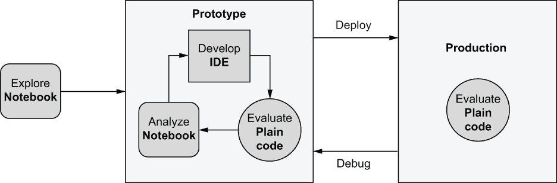

图 2.5 建议用于原型设计和生产循环的工具

想象一下开始一个新的数据科学项目。甚至在开始创建第一个原型，即进入原型设计循环之前，你可能想花些时间仅仅理解数据和问题域。笔记本是这种开放式探索的好工具，这种探索不旨在产生任何持久的软件工件。

在初步探索阶段之后，你开始原型设计解决方案。该解决方案，一个数据科学应用，本质上是一块软件，通常由多个模块组成，因此我们可以使用针对此目的优化的工具：集成开发环境（IDE）或代码编辑器。结果是应用程序，一个脚本，我们可以在本地和生产环境中将其作为普通代码进行评估，而无需任何额外的复杂性。当代码失败或你想改进模型时，你可以再次回到笔记本中进行分析和探索。我们将在后面的章节中看到这可能在实践中是什么样子。正如之前所述，现代 IDE 可以使在笔记本和编辑器模式之间切换变得无缝，因此循环步骤之间的转换可以发生得尽可能无摩擦。

设置 Jupyter 笔记本环境

实际上设置笔记本环境意味着什么？首先，让我们考虑 Jupyter（许多其他笔记本环境都有类似的架构）的高级架构，如图 2.6 所示。

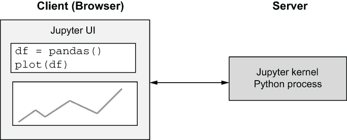

图 2.6 Jupyter 客户端和服务器

笔记本由两个主要部分组成：一个在浏览器中运行的基于 Web 的用户界面和一个后端进程，即内核，它管理 UI 所请求的所有状态和计算。每个笔记本会话都由一个唯一的内核支持，因此当多个笔记本在不同的浏览器标签页中打开时，通常会有多个内核并行运行。

从基础设施的角度来看，关键问题是内核在哪里运行。它是一个需要在某种服务器上执行的过程。最简单的选项是将内核作为本地进程运行在用户的笔记本电脑上，如图 2.7 中展示的最左侧选项 1。

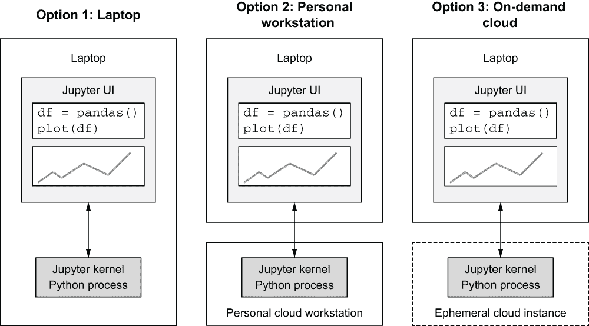

图 2.7 运行 Jupyter 内核的三个选项

在选项 1 中，所有由笔记本发起的计算都在用户的笔记本电脑上完成，类似于任何 Python 脚本。这种方法具有本地代码评估的所有优缺点，我们在表 2.1 中已经讨论过。特别是，环境不可扩展，难以统一控制。这种方法的主要优点是简单——你可以在笔记本电脑上执行以下命令来开始：

```
# pip install jupyter
# jupyter-notebook
```

选项 2 通过在云实例上运行内核来克服本地方法的局限性——与上一节中讨论的相同云工作站。云工作站可以根据用户和用例的需求进行扩展，并为所有数据科学家提供一个统一的环境。一个缺点是，基础设施团队需要设置工作站，包括在云工作站和本地笔记本电脑之间建立安全网络连接，例如虚拟专用网络（VPN）。然而，在初始配置成本之后，这种设置对数据科学来说可以非常高效。

选项 3 是笔记本的“无服务器”方法。而选项 2 提供了一种持续、有状态的云中笔记本电脑的错觉——就像个人工作站一样——选项 3 消除了最初需要服务器来运行内核的概念。毕竟，用户看到的是基于浏览器的 Jupyter UI，所以他们不需要关心后端。

实际上，选项 3 需要一个门户，允许用户打开笔记本。当打开笔记本时，会动态地为笔记本分配一个临时实例。这种方法的例子包括 Google Colab 和开源 [MyBinder.org](https://mybinder.org/)。

这种方法的主要缺点，除了操作复杂性之外，就是笔记本是无状态的。没有持久的本地文件系统或依赖项可以自动跨笔记本内核持久化。这使得体验与维护状态直到你明确删除它的本地笔记本电脑大不相同。此外，这种方法不允许与本地编辑器（如 VS Code）交互，而选项 2 是可以做到的。选项 3 对于快速便笺环境或不需要完整持久工作站的用户来说可能非常好。

### 2.1.4 将一切整合

让我们总结一下在前几节中我们所学到的内容：

1.  为了提高数据科学家的生产力，我们应该优化两个关键活动的舒适性：原型循环和与生产部署的交互。

1.  有许多很好的理由让数据科学家从一开始就能无缝地在云端工作。特别是，这将使与生产部署的交互变得更加容易。

1.  现代编辑器使得将代码评估推向云端成为可能。这可以使评估环境更具可扩展性，更容易管理，并且比在笔记本电脑上评估代码更接近生产部署。然而，这需要基础设施团队进行一些前期配置工作。

1.  笔记本是某些数据科学活动不可或缺的工具，它补充了传统的软件开发工具。你可以在支持其他代码评估的同一云工作站上运行笔记本。

图 2.8 展示了数据科学云工作站的架构。在实际应用中，你有多种方式来实现这种设置。你可以选择一个适合你需求的编辑器或 IDE。你可以在浏览器中以独立的方式使用笔记本，或者将其嵌入到编辑器中，例如使用 Visual Studio Code 或 PyCharm。或者你可以选择一个包含完整代码编辑器的笔记本环境，如 JupyterLab。工作站实例可以是一个在基于云的容器平台上运行的容器，例如 AWS 弹性容器服务（ECS）。

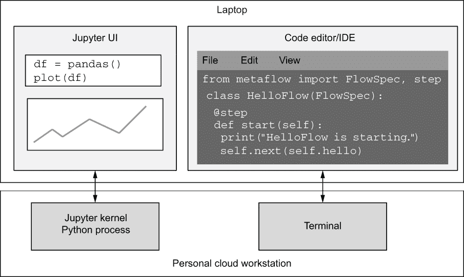

图 2.8 数据科学云工作站

图 2.9 显示了一个包含嵌入式编辑器、终端和笔记本的 Visual Studio Code 会话。通过单次点击，科学家可以在终端上执行编辑器中的代码。通过另一次点击，他们可以更新可视化结果的笔记本视图。终端和笔记本内核可以本地执行或在云工作站上执行。

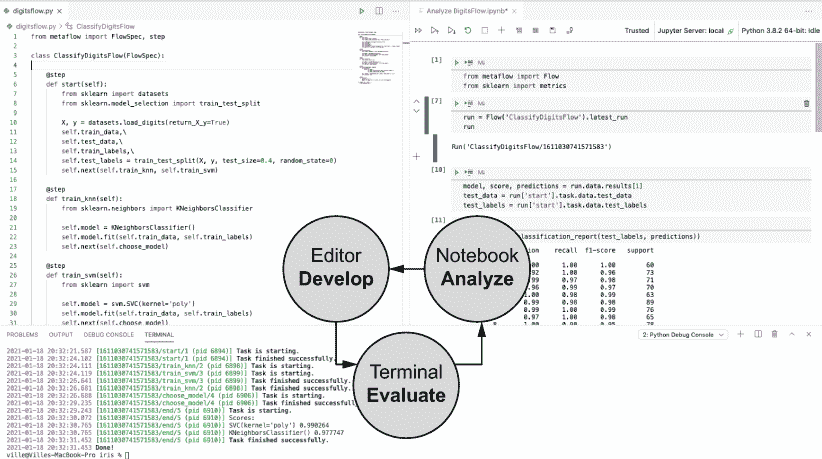

图 2.9 一个涵盖完整原型循环的 Visual Studio Code 设置

在这种设置下，科学家可以快速迭代原型循环的步骤，如图中所示。

## 2.2 工作流程介绍

*在洞穴人公司的第二天，亚历克斯加入了由哈珀主持的入职培训。哈珀解释了公司如何从多个供应商那里采购有机原料，如何使用手工方法生产各种纸杯蛋糕，以及他们如何处理全国范围内的物流。亚历克斯对生产原始人纸杯蛋糕所涉及的复杂价值链感到困惑。公司里的数据科学家应该如何处理所有相关数据，保持模型更新，并将更新后的预测发送到各个业务系统？这种复杂性似乎超出了亚历克斯在学术界使用笔记本时必须处理的范围。*


我们在上一节中介绍的开发环境是我们生产健壮、生产就绪的数据科学应用的旅程中的第一个停靠点。它提供了编写代码、评估它和分析结果的方法。现在，我们应该编写什么代码以及如何编写？

当提到像*机器学习*、*人工智能*或*数据科学*这样的术语时，它们通常会唤起一个*模型*的概念。我们所说的模型是指任何对世界的计算抽象，它接受一些输入，执行一些计算，并产生一个输出，如图 2.10 所示。在数据科学的领域内，这些模型通常被表示为人工神经网络或使用如逻辑回归这样的统计方法。

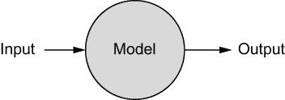

图 2.10 一个模型

为现实世界现象构建准确的模型并不容易。历史上，这通常由经过广泛理论培训并对他们的问题领域有深刻理解的科学家来完成。根据公司的不同，可能会有这样的期望，即数据科学家主要专注于构建模型。然而，在商业环境中构建实际有用的模型与在研究论文中发布模型设计是截然不同的体验。

考虑一个常见的商业环境，比如前面提到的 Caveman Cupcakes。数据科学家 Alex 面临着以下三个挑战：

1.  很可能无法将 Caveman Cupcakes 的整个业务作为一个单一模型来建模。相反，数据科学家被期望专注于建模一些特定的业务问题，例如，构建一个计算机视觉模型来自动检测生产线上的次品蛋糕，或者使用混合整数规划来优化物流。因此，随着时间的推移，该公司的数据科学家将产生一系列模型，每个模型都有其特定的要求和特征。

1.  在商业环境中，模型不能仅仅是一个抽象的数学结构。它需要在实践中执行计算，这意味着它需要用编程语言实现，并且需要可靠地执行。这可能是一项高度非平凡的软件工程练习，特别是因为我们不能无限期地等待结果。我们可能需要并行运行一些操作，并在像 GPU 这样的专用硬件上运行一些操作。

1.  除了图 2.10 中的大圆圈，我们不应忘记两个箭头：输入和输出。我们的模型需要接收准确、通常不断更新的数据，这并非易事。最后，模型的结果需要最终到达一个可以为企业带来利益的地方，比如数据库、规划电子表格或另一个软件组件。

总结来说，数据科学家需要理解需要解决的业务问题，设计一个模型，将其实现为软件，确保它获得正确的数据，并找出结果发送的位置。为了实现这一点，数据科学家在上一节中介绍的原型设计循环上花费了大量时间。

一旦我们适当地解决了这个特定的业务问题，我们就对另一个业务问题重复同样的过程。这个循环无限重复。模型从不完美，而且很少有公司会缺乏业务问题来优化。

此外，所有这些系统都必须可靠地运行，最好是 24/7。这需要与生产部署进行大量交互，因为模型不断暴露于现实世界的熵和数据中，这会侵蚀它们，就像任何暴露于自然元素中的现实世界机器一样。这是我们在上一节中讨论的第二个循环。

因此，我们得到了一个数据管道和模型的丛林——如图 2.11 所示的一个大型的嗡嗡作响的工厂——这需要持续的维护。为了使工厂可理解和可操作，我们需要对如何构建这些模型施加一些结构。这是将建模和数据管道，或工作流，作为我们基础设施中一等实体的主要动机。

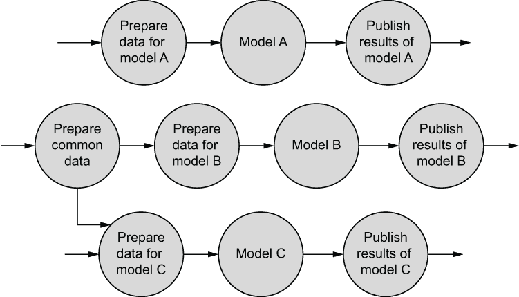

图 2.11 许多模型和数据管道

### 2.2.1 工作流的基本概念

在这个背景下，工作流是一个**有向图**，即由节点或步骤（如图 2.12 中的圆圈所示）通过有向边（箭头）连接的集合。这种表示方式捕捉了步骤之间的先后关系。例如，在图 2.12 中，我们可以明确知道 A 必须在 B 之前发生。


图 2.12 A 在 B 之前发生的工作流

步骤的顺序并不总是完全明确的。在图 2.13 中，我们知道 A 必须在 B 之前执行，C 必须在 D 之前执行，但 B 和 C 之间的相互顺序是未定义的。

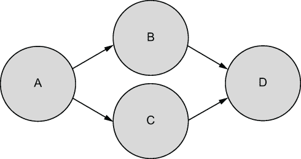

图 2.13 B 和 C 可以以任何顺序执行的工作流

我们可以使用这样的工作流来表示，我们不在乎 B 是否在 C 之前执行，只要两者都在 D 之前执行。这个特性很有用，因为它允许我们并行执行 B 和 C。

图 2.14 描述了一个具有循环的有向图：在 C 之后，我们再次回到 A。自然地，这会导致无限循环，除非我们定义某种条件来定义停止条件。或者，我们可以简单地禁止具有循环的图，并决定只有这样的图，有向无环图或 DAG，才是有效的工作流。实际上，仅支持 DAG 是工作流引擎中常见的选择。

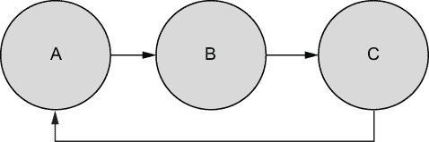

图 2.14 带有循环的工作流，即循环图

为什么亚历克斯或其他数据科学家应该关心 DAGs？考虑以下三个原因：

1.  它们引入了一个共同的词汇——步骤及其之间的转换——这使得编写和理解结构化为 DAGs 的非平凡应用变得更加容易。

1.  它们使我们能够明确操作顺序。这在操作顺序比简单的线性顺序更复杂时尤其有用，比如你在笔记本中看到的那样。通过使操作顺序清晰明确，我们的数据管道和模型丛林变得更加易于管理。

1.  它们允许我们指出操作顺序无关紧要的情况，如图 2.13 所示。我们可以自动并行化这些操作，这是高性能的关键。在典型的数据科学应用中，并行化的机会很多，但如果它们不是明确指出，大多数情况下计算机无法自动识别。

总结一下，在高层面上，你可以将 DAGs 视为一种语言，与其说是编程语言，不如说是人类之间交流的正式结构。它们允许我们以简洁易懂的方式讨论复杂的操作序列。

### 2.2.2 执行工作流程

如果 DAGs 只是谈论数据科学应用结构的抽象方式，那么实际操作中是如何实现工作流程执行的？最终，执行工作流程是**工作流程编排器**（也称为**作业调度器**）的工作，我们将在下一节讨论。在我们深入探讨各种编排器——而且有成百上千种之前——深入了解将抽象 DAG 转换为执行代码所需关注点是很有用的。

具体的工作流程涉及三个独立的关注点：应该执行什么代码（步骤内部的代码是什么），代码应该在何处具体执行（某个地方的计算机需要执行代码），以及步骤应该如何编排。这三个关注点对应于我们在第一章中介绍的基础设施堆栈的不同层，如图 2.15 所示。

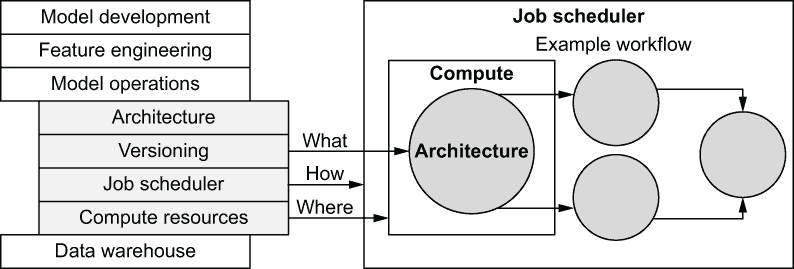

图 2.15 工作流程执行的三关注点

架构层定义了数据科学家在步骤中应该编写什么代码。它是工作流程的**用户界面层**。不同的工作流程框架提供不同类型的抽象，针对不同的用例进行了优化。其中一些是图形化的（你可以通过拖放圆圈来定义工作流程），一些是基于配置的，还有一些是定义为代码的。

从数据科学家的角度来看，架构层是工作流程中最明显的一部分。堆栈顶部的层更接近数据科学家的兴趣。架构层在很大程度上定义了在系统中自然表达的数据科学应用类型，这使得它可能是选择工作流程框架时最重要的考虑因素。

*计算资源*层决定了用户的代码具体在哪里执行。想象一下一个包含 600 个并行步骤的工作流程。每个步骤在一个 16 核 CPU 上执行 30 秒。如果计算层只包含一个 16 核实例（也许计算层是一台笔记本电脑！），执行这些步骤需要五小时。相比之下，如果计算层是一个包含 100 个实例的集群，这些步骤将在三分钟内执行。正如你所看到的，计算层对工作流程的*可扩展性*有很大影响，我们将在第四章和第五章中详细讨论这一点。

最后，我们需要一个系统来遍历 DAG（有向无环图），将每一步发送到计算层，并在继续之前等待它们的完成。我们称这个系统为作业调度器。调度层不需要关心正在执行什么代码以及执行代码的计算机具体位于何处。它的唯一责任是按照 DAG 定义的顺序调度步骤，确保在图中的后续步骤执行之前，每个步骤都成功完成（这个术语的技术名称是*拓扑顺序*）。

尽管这个过程可能听起来欺骗性地简单，但作业调度器层是工作流程的*鲁棒性*和*可操作性*的保证。它需要监控计算层是否成功完成步骤，如果不成功，它需要重试。它可能需要为成千上万的并发执行步骤和成千上万个工作流程做这件事。从用户的角度来看，作业调度器有观察执行的方式，可能是一个 GUI，以及如果工作流程失败，向所有者发出警报的方式是理想的。

除了操作方面的考虑，我们可以根据它们想要如何指定 DAG 来区分两种主要的作业调度器类型。那些要求在执行开始之前完全指定 DAG 的调度器被称为调度*静态 DAG*。另一种类型的调度器允许在执行过程中增量地构建 DAG，这被称为*动态 DAG*。这两种方法都有其优缺点。

每个工作流程框架都需要解决这三个问题。每个问题本身都是一个深奥的主题，需要大量的工程努力。除此之外，这些问题以各种方式相互作用。不同的框架最终会做出不同的技术选择，这些选择会影响可扩展性和鲁棒性，并影响用户体验，这取决于它们针对的使用案例以及他们愿意做出的权衡。因此，表面上看似相似的数百个工作流程框架——它们都声称可以执行 DAGs——但在底层存在显著差异。

### 2.2.3 工作流程框架的世界

维基百科上关于*科学工作流程系统*的文章列出了 20 个针对科学应用的知名工作流程框架。另一篇关于*工作流程管理系统*的文章列出了更多针对面向业务用例的系统。这两个列表都遗漏了许多流行的开源框架和资金充足的新创公司。这个领域也在迅速变化，所以当你阅读这本书的时候，任何试图列出所有框架的尝试都会显得过时。

我们不试图对所有现有的框架进行排名，而是提供以下标准来评估框架。这个标准基于我们在上一节中提到的三个问题：

1.  *架构*—实际的代码看起来是什么样子，以及系统对数据科学家来说看起来和感觉如何。系统提供的抽象是否使数据科学家更有效率，并允许他们更快地交付端到端的数据科学应用？

1.  *作业调度器*—工作流程是如何被触发、执行和监控的，以及如何处理失败。在没有停机时间的情况下管理整个工作流程丛林有多容易？

1.  *计算资源*—代码在实际中执行的位置。系统能否处理具有不同资源需求（如 GPU）的步骤，以及系统能并行执行多少步骤？

你的特定用例和业务环境应该决定你如何权衡这三个维度。对于一个只有几个小型用例的小型初创公司来说，计算资源可能不是一个大问题。对于一个有一个大型用例的公司来说，计算资源可能比其他任何东西都重要。对于一个由 Haskell 专家紧密团结在一起的团队来说，一个理想的架构与一个由来自不同背景的数据科学家组成的大型、分布式组织相比，看起来非常不同。

表 2.2 提供了一个比较工作流程框架的示例标准。我们选择了五个流行的框架进行说明。因为这本书是关于数据科学基础设施的，所以我们把比较集中在以下对数据科学应用重要的问题上：

+   架构是否专门设计来支持数据科学应用，还是它是通用的？

+   调度器是否设计为高可用（HA），即调度器本身是否是单点故障？这很重要，因为没有任何工作流比协调它们的工作流调度器更可靠。理想情况下，我们希望能够保持任意数量的工作流运行，而无需担心调度器会失败。

+   对计算资源支持有多灵活？数据科学应用程序通常计算密集，有时对硬件要求（例如，特定的 GPU 模型）很挑剔，因此这是一个有用的功能。

表 2.2 评估工作流框架的示例标准

|  | 架构 | 调度器 | 计算 |
| --- | --- | --- | --- |
| Apache Airflow | 任意 Python 代码，不特定于数据科学 | 优秀的 GUI；调度器非高可用 | 通过 *executors* 支持许多后端。 |
| Luigi | 任意 Python 代码，不特定于数据科学 | 基础版本；非高可用 | 默认情况下，调度器在本地执行 Python 类，*Tasks*。它们可以将工作推送到其他系统。 |
| Kubeflow Pipelines | Python，针对数据科学用例 | 优秀的 GUI；底层使用名为 Argo 的项目；由 Kubernetes 提供一些高可用性 | 步骤在 Kubernetes 集群上运行。 |
| AWS Step Functions | 基于 Amazon States Language 的 JSON 配置 | 设计为高可用；由 AWS 管理 | 与一些 AWS 服务集成。 |
| Metaflow | Python，针对数据科学用例 | 用于原型设计的本地调度器；支持生产中的高可用调度器如 Step Functions | 支持本地 *tasks* 以及外部计算平台。 |

这里是对所涵盖框架的快速概述：

+   *Apache Airflow* 是 Airbnb 在 2015 年发布的一个流行的开源工作流管理系统。它使用 Python 实现，并使用 Python 定义工作流。包括 AWS 和 GCP 在内的多个商业供应商提供托管 Airflow 作为服务。

+   *Luigi* 是另一个知名的基于 Python 的框架，由 Spotify 在 2012 年开源。它基于动态 DAG 的概念，通过数据依赖定义。

+   *Kubeflow Pipelines* 是一个嵌入在开源 Kubeflow 框架中的工作流系统，用于在 Kubernetes 上运行的数据科学应用程序。该框架由 Google 在 2018 年发布。在底层，工作流由一个名为 Argo 的开源调度器进行调度，它在 Kubernetes 生态系统中很受欢迎。

+   *AWS Step Functions* 是 AWS 在 2016 年发布的一个托管服务，不是开源服务。DAGs 使用 Amazon States Language 以 JSON 格式定义。Step Functions 的一个独特功能是工作流程可以运行很长时间，长达一年，依赖于 AWS 提供的高可用性保证。

+   *Metaflow* 是一个针对数据科学应用程序的全栈框架，最初由本书的作者发起，并于 2019 年由 Netflix 开源。Metaflow 专注于全面提高数据科学家的生产力，将工作流程视为一等构造。为了实现可扩展性和高可用性，Metaflow 与调度器如 AWS Step Functions 集成。

除了这里列出的框架外，还存在许多其他有希望的框架，其中一些专门针对数据科学应用程序。本书的目的不是专注于任何特定的框架，这些框架在网上有很好的文档，而是介绍数据科学基础设施的全栈，工作流程只是其中一部分，以便您可以为每一层选择最佳的技术方法。

当选择专门针对数据科学用例的工作流程框架时，请考虑以下因素：

1.  在大多数商业环境中，数据科学家的生产力应该是首要考虑的。选择一个针对数据科学用例特别适合的架构框架。构建数据科学应用程序需要的不仅仅是工作流程，因此在做出选择时，要考虑完整的数据科学堆栈（图 1.3），而不仅仅是调度层。

1.  从长远来看，系统的鲁棒性、可扩展性和高可用性等运营问题往往会超越其他技术问题。这些特性既是系统设计的涌现特性，也是多年与实际用例战斗的结果，因此一夜之间修复这些问题并不容易。因此，选择一个具有稳定操作性和可扩展性记录的系统是有意义的。我们将在第四章中详细讨论这个话题。

1.  不受计算资源的限制可以大幅提高生产力，因此请选择一个与您的计算层无缝集成的框架。关于这一点，请参阅第三章。

在接下来的章节中，我们将使用符合前面提到的三个标准的 Metaflow 作为示例框架。其原则和示例足够通用，以至于如果需要，应该不难将示例适应到其他框架。

如果设置本章涵盖的所有内容感觉像是一项巨大的投资，请不要担心——随着您业务需求的增长，您可以分阶段扩展工具链的功能。表 2.3 根据基础设施服务的数据科学家数量，为不同规模的组织提供了推荐的配置。括号中的选项指的是图 2.7。

表 2.3 开发环境投资多少

|  | 小型（1-3 用户） | 中型（3-20 用户） | 大型（20+用户） |
| --- | --- | --- | --- |
| 云账户 | 推荐 | 必需 | 必需 |
| 数据科学工作站 | 笔记本电脑就足够了。为所有数据科学家指定一个通用设置。 | 考虑使用现成的云服务或一个简单的手动启动的集成 IDE 的云工作站。 | 投资于一个自助、自动配置的集成 IDE 工作站。 |
| 笔记本 | 在笔记本电脑上本地运行笔记本内核（选项 1）。 | 一种简单的方法是在云工作站上支持笔记本内核（选项 2）。如果笔记本被积极利用，考虑提供临时笔记本（选项 3）。 |
| 工作流程 | 非常推荐——您可以使用简单的调度器在单个实例上运行工作流程。 | 选择一个最大化生产力和迭代速度的工作流程调度器。 | 选择一个除了生产力外，还提供高可用性、可观察性和可伸缩性的调度器。 |

## 摘要

+   数据科学家需要一个提供以下两个关键活动优秀人体工程学的开发环境：

    +   原型循环：编写、评估和分析应用程序代码

    +   与生产部署的交互：部署、监控和调试生产应用程序

+   基于云的数据科学工作站是处理两项活动的一种有效方式。您可以在本地开发代码，但在类似于生产的环境中进行评估。

+   笔记本是数据科学工具链的必要但不充分的部分。笔记本在刮擦板式原型设计和分析结果方面表现出色。您可以将它们集成到与工作站上的 IDE 和终端协同工作的环境中。

+   工作流程是结构化数据科学应用程序的有用抽象。工作流程提供了一系列好处：它们易于理解和解释，有助于管理随着数据科学应用程序数量的增长而增加的复杂性，并且可以使执行更可扩展和高效。

+   存在数十种不同的工作流程框架。选择一个为构建数据科学应用程序提供优秀人体工程学的框架。

+   一个作业调度器负责执行工作流程。选择一个与您的计算基础设施集成良好、足够可扩展且高度可用的调度器。
