# 3 介绍 Metaflow

本章涵盖

+   在 Metaflow 中定义一个接受输入数据并产生有用输出的工作流程

+   在单个实例上使用并行计算优化工作流程的性能

+   在笔记本中分析工作流程的结果

+   在 Metaflow 中开发一个简单的端到端应用程序

现在我们已经设置了开发环境，您可能已经迫不及待地想要动手编写实际的代码了。在本章中，您将学习使用 Metaflow 开发数据科学应用程序的基础知识，Metaflow 是一个框架，展示了基础设施堆栈的不同层如何无缝协作。

我们在上一章中讨论的开发环境决定了数据科学家如何开发应用程序：通过在编辑器中编写代码，在终端中评估它，并在笔记本中分析结果。在这个工具链之上，数据科学家使用 Metaflow 来确定编写什么代码以及为什么编写这些代码，这正是本章的主题。接下来的章节将涵盖确定工作流程在哪里以及何时执行的基础设施。

我们将从零开始介绍 Metaflow。您将首先学习语法和基本概念，这些概念允许您在 Metaflow 中定义基本的工作流程。之后，我们将介绍工作流程中的分支。分支是嵌入并发到工作流程中的直接方法，这通常通过并行计算带来更高的性能。

最后，我们通过构建一个实际的分类器应用程序将这些概念付诸实践。通过完成一个端到端的项目，您将学习 Metaflow 如何通过提供在笔记本中进行本地代码评估、调试和结果检查的工具来驱动原型设计循环。

阅读本章后，您或您支持的数据科学家将能够通过结合 Metaflow 与其他现成库来开发功能齐全的数据科学应用程序。随后的章节将在此基础上构建，并展示您如何通过利用完整的基础设施堆栈来使应用程序更具可扩展性、高度可用性和易于协作。您可以在[`mng.bz/xnB6`](http://mng.bz/xnB6)找到本章的所有代码列表。

## 3.1 Metaflow 的基础知识

*亚历克斯意识到数据科学家的工作远不止构建模型。作为 Caveman Cupcakes 的第一位数据科学家，亚历克斯有机会通过独立构建完整的数据科学解决方案来帮助公司。亚历克斯既感到兴奋又感到害怕。亚历克斯是一位海洋生物学家，而不是软件工程师——希望围绕模型构建必要的软件不会太令人畏惧。鲍伊建议他们看看 Metaflow，这是一个据说可以简化构建端到端数据科学应用程序的框架。*


Metaflow 于 2017 年在 Netflix 启动，旨在帮助数据科学家独立构建、交付和运营完整的数据科学应用。该框架旨在解决一个实际业务需求：像 Netflix 这样的大型公司可能有数十个甚至数百个潜在的数据科学用例，类似于洞穴人蛋糕店。公司希望在现实设置中快速测试新想法，最好是不需要分配大量团队来研究一个实验性想法，然后将最有前途的实验推广到生产中，而无需过多的开销。

第一章中介绍的思想是 Metaflow 的动力：我们需要考虑数据科学的整个堆栈，我们希望涵盖项目从原型到生产的整个生命周期，我们希望通过关注数据科学家的生产力来实现这一点。我们可以使用第一章中引入的四个“V”来回答“为什么是 Metaflow？”这个问题，如下所示：

+   *体积*—Metaflow 通过提供一种统一的方式来构建它们，利用工作流程的通用语言，帮助以更少的人力资源交付更多的数据科学应用。它通过减少数据科学应用嗡嗡声中的偶然复杂性来实现这一点。

+   *多样性*—Metaflow 并未针对任何特定类型的数据科学问题进行优化。它通过在堆栈的低层提供更多观点，而在顶层、特定领域的层提供较少观点，帮助交付多样化的应用。

+   *速度*—Metaflow 加快了原型设计循环以及与生产部署的交互。它通过在整个框架的所有部分优先考虑人类生产力来实现这一点，例如，允许数据科学家使用惯用的 Python。

+   *有效性*—Metaflow 通过强制执行最佳实践，使构建和运营生产级应用成为可能，即使对于没有 DevOps 背景的数据科学家也是如此，从而使得应用更加健壮。

从数据科学家的角度来看，Metaflow 的全部内容都是使原型设计循环和生产部署的交互尽可能平滑，正如我们在第 2.1 节中介绍的那样。要做好这一点，需要确保基础设施堆栈的所有层都能够无缝集成。而一些框架只处理工作流程、计算资源或模型操作，而 Metaflow 旨在解决数据科学的全堆栈问题，如图 3.1 所示。

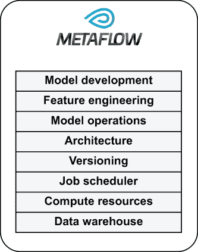

图 3.1 Metaflow 将数据科学堆栈的各个层绑定在一起。

从工程角度来看，Metaflow 充当集成的基础，而不是试图重新发明堆栈的各个层。公司已经为数据仓库、数据工程、计算平台和作业调度构建或购买了优秀的解决方案，更不用说开源机器学习库的繁荣生态系统了。试图用现有的成熟系统来满足数据科学家的需求既不必要也不高效。我们应该希望将数据科学应用集成到周围的业务系统中，而不是将它们孤立在一个孤岛上。

Metaflow 基于插件架构，允许在不同的堆栈层使用不同的后端，只要这些层能够支持一组基本操作。特别是，Metaflow 被设计成一个云原生框架，依赖于所有主要云提供商提供的基本计算和存储抽象。

Metaflow 有一个平缓的采用曲线。你可以在笔记本电脑上以“单玩家模式”开始，随着需求的增长，逐渐将基础设施扩展到云上。在本章的剩余部分，我们将介绍 Metaflow 的基础知识。在接下来的章节中，我们将扩大其影响力，展示如何解决越来越复杂的数据科学应用，涵盖堆栈的所有层，并增强多个数据科学家之间的协作。

如果你想使用其他框架而不是 Metaflow 来构建你的基础设施，你可以阅读下一节以获得灵感——这些概念也适用于许多其他框架，或者你可以直接跳到第四章，该章节专注于堆栈的基础层：计算资源。

### 3.1.1 安装 Metaflow

Metaflow 从第 2.1 节中引入的基于云的开发环境中受益匪浅，包括笔记本在内。然而，你只需一台笔记本电脑就可以开始使用。截至本书编写时，Metaflow 支持 OS X 和 Linux，但不支持 Windows。如果你想在 Windows 上测试 Metaflow，可以使用 Windows Subsystem for Linux、基于 Linux 的本地 Docker 容器或前一章中讨论的基于云的编辑器。

Metaflow 支持所有高于 Python 3.5 版本的 Python。安装 Python 解释器后，你可以像安装其他 Python 包一样使用 pip 安装 Metaflow，如下所示：

```
# pip install metaflow
```

在本书中，带有#前缀的行，如上一行，意味着需要在没有井号标记的终端窗口中执行。

注意：在所有示例中，我们假设 pip 和 python 命令指的是 Python 的最新版本，该版本应高于 Python 3.5。在某些系统中，正确的命令被称为 pip3 和 python3。在这种情况下，相应地替换示例中的命令。

你可以通过执行以下代码来确认 Metaflow 是否工作：

```
# metaflow
```

如果 Metaflow 安装正确，它应该会打印出一个带有如下标题的顶级帮助信息：

```
Metaflow (2.2.5): More data science, less engineering
```

您可以不使用云（AWS）账户就跟随本章中的示例，但如果您想尝试下一章中的所有示例，您将需要一个账户。您可以在[`aws.amazon.com/free`](https://aws.amazon.com/free)注册一个免费账户。

### 3.1.2 编写基本工作流

如前一章所述，工作流的概念有助于结构化数据科学应用。如果您不是软件工程师出身，将您的应用视为工作流步骤而不是一组任意的 Python 模块要容易得多。

想象一下我们的主角 Alex 编写一个 Metaflow 工作流。Alex 已经熟悉笔记本，所以将 Python 的小片段作为步骤编写看起来是可行的。步骤就像强化版的笔记本单元格。使用任意的 Python 类、函数和模块来拼凑一个应用将需要更多的认知努力。

让我们从经典的 Hello World 示例开始。在 Metaflow 中，一切都是以工作流的概念为中心的，或者简单地说，是一个流程，它是一个有向无环图（DAG），如 2.2 节中讨论的那样。我们定义在列表 3.1 中的 HelloWorldFlow 对应于图 3.2 中展示的 DAG。

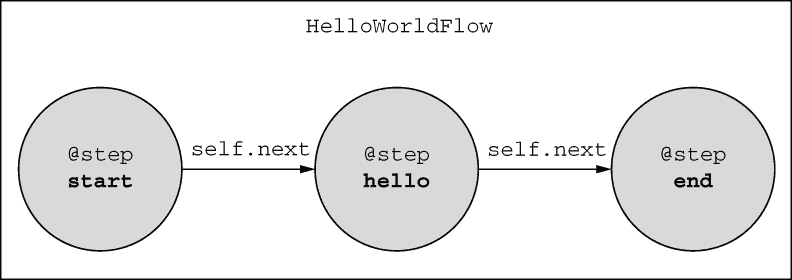

图 3.2 HelloWorldFlow

要在 Metaflow 中定义工作流，您必须遵循以下六个简单规则：

1.  *流程*定义为从 FlowSpec 类派生的 Python 类。您可以自由命名您的流程。在本书中，按照惯例，流程类的名称以 Flow 后缀结尾，如 HelloWorldFlow。您可以在该类中包含任何方法（函数），但用@step 注解的方法会被特别处理。

1.  *步骤*（节点）是类的成员方法，用@step 装饰器进行注解。您可以在方法体中编写任意的 Python 代码，但最后一行是特殊的，如下所述。您可以在方法中包含一个可选的文档字符串，解释步骤的目的。在第一个示例之后，我们将省略文档字符串以使书中的列表简洁，但在实际代码中建议使用它们。

1.  Metaflow 将方法体作为称为*任务*的原子计算单元执行。在这样一个简单的流程中，步骤与任务之间是一对一的对应关系，但情况并不总是如此，我们将在 3.2.3 节中稍后看到。

1.  第一步必须命名为 start，这样流程就有了一个明确的起点。

1.  步骤（节点）之间的边（箭头）是通过在方法的最后一行调用 self.next（step_name）来定义的，其中 step_name 是要执行的下一步的名称。

1.  最后一步必须命名为 end。因为结束步骤完成了流程，所以最后一行不需要 self.next 转换。

1.  一个 Python 文件（模块）必须只包含一个流程。你应该在文件的底部，在 if __name__ == '__main__'条件语句内实例化流程类，这会导致类仅在文件作为脚本被调用时被评估。

相应的源代码列在下一代码列表中。

列表 3.1 Hello World

```
from metaflow import FlowSpec, step

class HelloWorldFlow(FlowSpec):         ❶

    @step                               ❷
    def start(self):                    ❸
        """Starting point"""
        print("This is start step")
        self.next(self.hello)           ❹

    @step
    def hello(self):
        """Just saying hi"""
        print("Hello World!")
        self.next(self.end)

    @step
    def end(self):                      ❺
        """Finish line"""
        print("This is end step")

if __name__ == '__main__':
    HelloWorldFlow()                    ❻
```

❶ 工作流是通过从 FlowSpec 派生来定义的。

❷ @step 装饰器表示工作流中的一个步骤。

❸ 第一步必须命名为 start。

❹ 对 self.next()的调用表示工作流中的一个边。

❺ 最后一步必须命名为 end。

❻ 实例化工作流允许它被执行。

下面是如何阅读和理解与 Metaflow 流程相对应的代码：

1.  首先，找到启动方法。你知道这是执行开始的地方。你可以阅读这个方法来了解它在做什么。

1.  通过查看 start 的最后一条来查看下一个步骤。在这种情况下，它是 self.hello，即 hello 方法。

1.  阅读下一步的代码，并确定那之后的步骤。继续这样做，直到你到达结束步骤。

做这件事比试图理解一组任意的 Python 函数和模块要简单得多，这些函数和模块甚至没有明确的开始和结束。将代码保存在文件中，命名为 helloworld.py。你可以像任何 Python 脚本一样执行 Python。首先，尝试运行以下代码：

```
# python helloworld.py
```

这将验证流程结构而不执行任何步骤。Metaflow 有一系列关于被认为是有效 DAG 的规则。例如，所有步骤都必须相互连接，图中不能有任何循环。如果 Metaflow 检测到你的 DAG 有任何问题，将显示有用的错误信息。

Metaflow 在每次执行脚本时都会运行一个基本的代码检查，即一个*代码检查器*，它可以检测拼写错误、缺失的函数和其他类似的语法错误。如果发现任何问题，将显示错误信息，并且不会执行其他操作。这可以节省大量时间，因为问题可以在代码执行之前被发现。然而，有时代码检查器可能会产生误报。在这种情况下，你可以通过指定以下内容来禁用它：

```
# python helloworld.py --no-pylint
```

现在尝试运行以下代码：

```
# python helloworld.py show
```

这应该会打印出 DAG 的文本表示，对于 HelloWorldFlow 来说，对应于图 3.2。你可以看到输出中包含了文档字符串，因此你可以使用 show 命令来快速了解一个不熟悉的流程做了什么。

现在，是时候检验真伪了：让我们执行流程，如下所示！我们称流程的一次执行为*运行*：

```
# python helloworld.py run
```

这个命令按顺序执行 start、hello 和 end 方法。如果一切顺利，你应该会看到一系列看起来像这样的输出行：

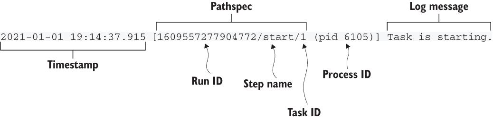

从你的流程打印到标准输出（也称为*stdout*）或标准错误（也称为*stderr*）的每一行都会得到一个类似于之前显示的标题。让我们按照以下方式解析标题：

+   *时间戳*表示该行输出的时间。您可以通过查看连续的时间戳来大致了解代码的不同部分执行所需的时间。在输出一行和生成时间戳之间可能会出现短暂的延迟，因此不要依赖于时间戳进行任何需要精确时间记录的操作。

+   方括号内的以下信息用于标识一个任务：

    +   每个 Metaflow 运行都会获得一个唯一的 ID，即*运行 ID*。

    +   运行按照顺序执行步骤。当前正在执行的步骤用*步骤名称*表示。

    +   步骤可以使用 foreach 构造（参见第 3.2.3 节）产生多个任务，这些任务由*任务 ID*标识。

    +   流名称、运行 ID、步骤名称和任务 ID 的组合在您的 Metaflow 环境中唯一地标识了任何流程运行中的任务。在这里，流名称被省略，因为对于所有行都是相同的。我们称这个全局唯一标识符为*路径规范*。

    +   每个任务由操作系统中的单独进程执行，该进程由*进程 ID*，即*pid*标识。您可以使用任何操作系统级别的监控工具，如*top*，根据进程 ID 监控任务的资源消耗。

+   方括号之后是*日志消息*，这可能是 Metaflow 本身输出的消息，如本例中的“任务开始”，或者是由您的代码输出的行。

关于 ID 的特别之处是什么？运行无数快速实验是数据科学的核心活动——记得我们之前讨论过的原型设计循环。想象一下，编写许多不同的代码变体，运行它们，每次都会看到略有不同的结果。过了一段时间，很容易失去对结果的跟踪：是第三个版本产生了有希望的结果，还是第六个版本？

在过去，勤奋的科学家可能会在实验笔记本中记录所有他们的实验及其结果。十年前，电子表格可能起到了相同的作用，但跟踪实验仍然是一个手动且容易出错的流程。今天，现代数据科学基础设施通过*实验跟踪系统*自动跟踪实验。

一个有效的实验跟踪系统允许数据科学团队能够检查已运行的内容，明确识别每个运行或实验，访问任何过去的结果，可视化它们，并将实验相互比较。此外，能够重新运行过去的实验并重现其结果是非常受欢迎的。这比听起来要困难得多，因此我们在第六章中专门用许多页面来讨论*可重现性*这一主题。

独立的实验跟踪产品可以与任何代码一起工作，只要代码被适当配置以向跟踪系统发送元数据。如果您使用 Metaflow 构建数据科学应用程序，您将免费获得实验跟踪——Metaflow 自动跟踪所有执行。之前显示的 ID 是这个系统的一部分。它们允许您在任务完成后立即识别和访问结果。

我们将在 3.3.2 节中更详细地讨论访问过去的结果，但您可以通过使用日志命令来提前体验，该命令允许您检查任何过去运行的输出。使用与您想要检查的任务对应的路径规范执行日志命令。例如，您可以从运行产生的输出中复制并粘贴路径规范，然后执行下一个命令：

```
# python helloworld.py logs 1609557277904772/start/1
```

您应该看到一行输出，它与您检查的步骤中的 print 语句相对应。日志子命令有几个选项，您可以通过执行 logs --help 来查看。

最后，请注意 Metaflow 如何将单个 Python 文件转换为一个无需任何模板代码的命令行应用程序。您无需担心解析命令行参数或手动捕获日志。每个步骤都作为一个独立的操作系统级子进程执行，因此可以独立监控。这也是实现容错性和可扩展性的关键特性，我们将在第四章中学习。

### 3.1.3 管理工作流程中的数据流

数据科学应用程序都是关于处理数据的。一个典型的应用程序从数据仓库中摄取原始数据，以各种方式对其进行转换，将其转换为特征，并可能训练一个模型或使用现有模型进行推理。训练好的模型或预测是工作流程的输出数据。要能够构建这样的工作流程，您需要回答以下三个问题：

1.  工作流程应该如何访问输入数据？

1.  工作流程应该如何移动转换后的数据，即工作流程的内部状态，跨步骤？

1.  工作流程应该如何使其输出对外部系统可用？

通过回答三个问题，您可以确定应用程序的*数据流*，即通过工作流程传输数据的方式。图 3.3 展示了由三个步骤 A、B 和 C 组成的工作流程中的数据流。

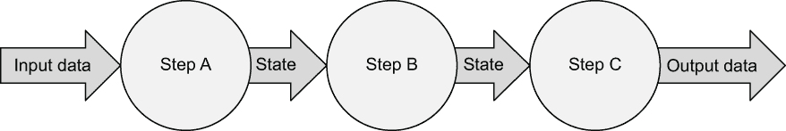

图 3.3 从输入到输出的数据流

在图 3.3 所示的工作流程中，步骤 A 在步骤 B 之前。因为步骤是按顺序执行的，所以步骤 A 处理的数据可以提供给步骤 B，但反之则不行。这样，工作流程的顺序决定了数据如何通过图流动。使用 Metaflow 术语，数据从起始步骤流向结束步骤，就像河水从上游流向下游，但不会反向流动。

为了说明明确数据流和状态的好处，考虑图 3.4 所示的示例，它展示了一个简单的 Jupyter 笔记本。


图 3.4 笔记本中隐藏的状态和未定义的数据流

输出可能看起来令人惊讶。为什么 x 的值打印为 2，尽管它在上一个单元格中只被分配为 1？在这种情况下，用户首先从顶部到底部评估了所有单元格，然后决定重新评估中间的单元格。在笔记本中按顺序评估单元格是一种常见的做法。它是它们作为不受约束的草稿本吸引力的一部分。

Jupyter 内核在幕后维护所有变量的状态。它允许用户根据其隐藏状态以任意顺序评估单元格。就像在这个例子中，结果可能非常令人惊讶，实际上无法重现。相比之下，工作流程通过使评估顺序和相应的数据流明确来解决这个问题。

与使用笔记本不同，这三个单元格可以组织成如图 3.3 所示的工作流程，这将使得产生不一致的结果变得不可能。笔记本在数据科学堆栈中扮演着重要的角色——它们便于快速探索和分析。然而，如前所述，将任何严肃的应用或建模代码作为具有明确数据流的工作流程结构会更好。

在工作流程中转移和持久化状态

实际中数据流看起来是怎样的呢？如果所有步骤都在单台计算机上的单个进程中执行，我们就可以在内存中保持状态，这是构建软件的常规方式。数据科学工作流程的挑战在于，我们可能希望在不同计算机上并行执行步骤，或者访问特殊硬件，如 GPU。因此，我们需要能够在步骤之间*转移状态*，这些步骤可能在不同物理计算机上执行。

我们可以通过*持久化状态*来实现这一点，即在步骤完成后存储所有与后续步骤相关的数据。然后，当新的步骤开始时，即使在另一台计算机上，我们也可以重新加载状态并继续执行。图 3.5 说明了这个想法。

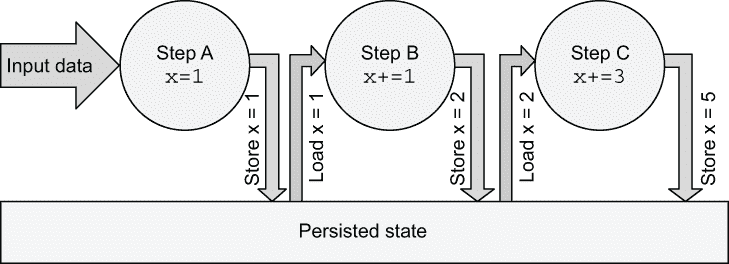

图 3.5 通过公共数据存储在步骤之间转移状态

在图 3.5 中，状态由一个变量 x 组成。变量首先在步骤 A 中初始化，然后在步骤 B 和 C 中增加。当步骤完成时，x 的值被持久化。在步骤开始之前，其值被重新加载。自然地，对于需要跨步骤访问的每一块状态、每一个变量，都需要重复这个过程。

你可以通过许多不同的方式实现持久化状态的想法。许多工作流程框架对此并不特别有意见。如何加载和存储状态取决于用户，可能使用数据库作为持久化层。生成的流程代码可能类似于图 3.6 中所示。每个步骤都包括加载和存储数据的代码。虽然这种方法很灵活，但它增加了大量的样板代码。更糟糕的是，它给数据科学家增加了认知负担，因为他们必须明确决定要持久化哪些数据以及如何持久化。

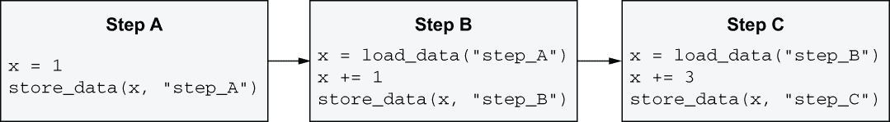

图 3.6 手动持久化状态

根据我们的经验，数据科学家在存储可能感觉多余的数据时可能会相当保守，特别是当需要对其做出明确选择时，比如图 3.6 中的情况。如果工作流程框架使得在步骤之间移动状态变得繁琐，用户可能会倾向于将许多无关的操作打包在一个步骤中，以避免添加加载和存储数据的样板代码。或者，他们可能会选择只持久化下游消费者绝对需要输出的数据。

虽然从技术上讲，这种节俭的方法可以工作，但过于节俭地处理数据并不利于应用程序的长期健康。首先，工作流程结构应该主要优化应用程序的逻辑结构，以便其他读者可以轻松理解它。例如，对于数据预处理和模型训练有单独的步骤是有意义的——你不应该合并步骤只是为了避免转移状态。其次，想象一下工作流程在生产中失败的情况。你希望获得最大量的信息来了解出了什么问题。

总结来说，拥有一种使状态转移对用户几乎透明的机制是有益的。我们不希望用户必须担心步骤可能在实际不同的计算机上执行的技术细节。同样，我们也不希望他们为了避免使用样板代码而牺牲工作流程的可读性。

最重要的是，我们希望鼓励用户自由地持久化数据，即使持久化数据并不是使工作流程功能性的严格必要条件。每次运行持久化的数据越多，工作流程就越*可观察*，这补充了实验跟踪系统存储的元数据。如果在每个步骤之后都足够持久化数据，我们就可以全面了解工作流程在执行期间和执行后的状态，如图 3.7 所示。

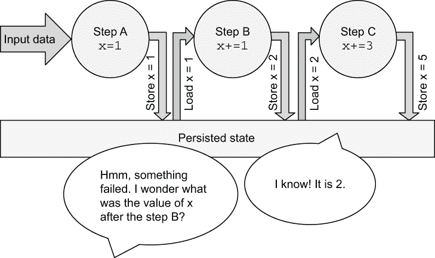

图 3.7 持久化状态允许你观察工作流程执行。

这种方法在长期来看会带来巨大的回报。您将能够更有效地监控和调试工作流程，并无需额外工作即可重现、重用和共享其结果。另一方面，存储数据需要花费金钱，但多亏了云，存储成本与数据科学家的时间相比变得相当微不足道。此外，我们并不提倡反复存储 *输入数据* 的副本——关于这一点，请参阅第七章。

Metaflow 工件

为了举例说明如何使数据流对用户几乎透明，让我们考虑 Metaflow 是如何做到的。Metaflow 自动持久化所有 *实例变量**，也就是说，在步骤代码中分配给 self 的任何内容。我们称这些持久化的实例变量为 *工件*。工件可以是任何数据：标量变量、模型、数据框或任何可以使用 Python 的 pickle 库序列化的 Python 对象。工件存储在称为 *数据存储库* 的通用数据仓库中，这是由 Metaflow 管理的持久化状态层。您可以在本章后面的侧边栏框“Metaflow 的数据存储库如何工作”中了解更多关于数据存储库的信息。

每个步骤可以产生任意数量的工件。步骤完成后，其工件作为不可变的数据单元持久化到数据存储库中。这些工件永久绑定到步骤上，由产生它们的路径规范标识。这对于实验跟踪至关重要：我们希望产生一个准确且不可修改的审计跟踪，记录运行期间产生的所有内容。然而，后续步骤可能会读取工件并产生自己的版本。

为了使这个概念更加具体，让我们从一个简单的例子开始，该例子在 HelloWorldFlow 的略微修改版本中添加了状态和计数器变量 count，我们在列表 3.1 中介绍了这个例子。为了清晰起见，让我们将流程重命名为 CounterFlow。

如图 3.8 所示，我们在起始步骤中初始化计数器变量 count 为零。我们这样做是通过在 Python 中创建一个实例变量，就像通常那样，self.count = 0。在接下来的添加步骤中，我们将 count 增加 1：self.count += 1。在打印最终值之前，我们在结束步骤中再次将 count 增加 1，最终值是 2。

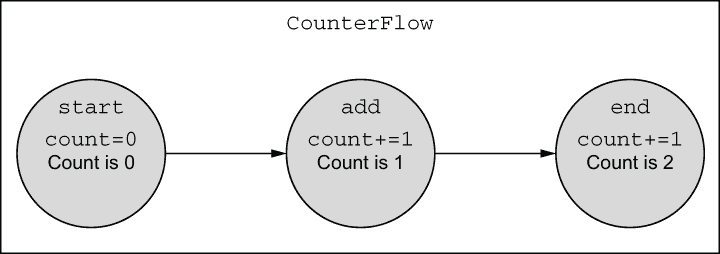

图 3.8 CounterFlow

下面的列表显示了相应的代码。

列表 3.2 维护状态的简单流程

```
from metaflow import FlowSpec, step

class CounterFlow(FlowSpec):

    @step
    def start(self):
        self.count = 0                             ❶
        self.next(self.add)

    @step
    def add(self):
        print("The count is", self.count, "before incrementing")
        self.count += 1                            ❷
        self.next(self.end)

    @step
    def end(self):
        self.count += 1                            ❷
        print("The final count is", self.count)    ❸

if __name__ == '__main__':
    CounterFlow()
```

❶ 初始化计数器为零

❷ 将计数器增加一

❸ 显示最终计数

将流程代码保存到名为 counter.py 的文件中，并像之前一样执行，如下所示：

```
# python counter.py run
```

除了 Metaflow 输出的常规消息外，你还应该看到一行说“在增加之前计数为 0”和“最终计数为 2”。假设你已经熟悉 Python 的基础知识，你会注意到当 self.start()、self.add()和 self.end()按顺序调用时，流程的行为就像任何 Python 对象一样。为了复习 Python 中实例变量（数据属性）的工作方式，请查看 Python 教程中关于实例变量的部分，链接为[`mng.bz/AyDQ`](http://mng.bz/AyDQ)。

按照设计，在 Metaflow 中管理状态的语言看起来像自然的、直接的 Python 语法：只需像往常一样使用 self 创建实例变量。排除那些不值得保存的临时值同样简单：只需创建普通、非实例变量，这些变量将在步骤函数退出后清理。

经验法则：使用实例变量（如 self）来存储任何可能具有步骤之外价值的任何数据和对象。仅使用局部变量来存储中间、临时数据。如果有疑问，请使用实例变量，因为它们使调试更容易。

按照设计，在 Metaflow 中状态管理看起来几乎是简单得令人难以置信，但在幕后发生了很多事情。Metaflow 必须解决与数据流相关的以下两个关键挑战：

1.  每个任务都作为一个独立的过程执行，可能是在一个独立的物理计算机上。我们必须具体地在进程和实例之间移动状态。

1.  运行可能会失败。我们想要了解它们失败的原因，这需要了解失败之前的状态。此外，我们可能想要重新启动失败步骤，而无需从头开始重新启动整个流程。所有这些功能都需要我们持久化状态。

为了解决这些挑战，Metaflow 在每次任务之后都会快照并存储工作流程的状态，存储在 self 中。快照是 Metaflow 的关键特性之一，它使许多其他特性成为可能，例如恢复工作流程、在不同的计算环境中执行任务，特别是易于观察工作流程。

你可以在任务完成时立即观察到实例变量，即使运行仍在执行中。你可以通过多种方式做到这一点，但一种简单的方法是使用 dump 命令，它的工作方式与我们之前使用的 logs 命令类似。只需复制并粘贴你想要观察的任务的路径规范，例如以下示例：

```
# python counter.py dump 1609651059708222/end/3
```

如果你使用了对应于最终任务的路径规范，就像上一个例子中那样，你应该会看到一行输出，显示计数器的值为 2。预期地，对于更早的步骤，值会低一些。除了 dump 命令外，你还可以通过编程方式访问工件，例如，在笔记本中使用 Metaflow 客户端 API，我们将在第 3.3.2 节中介绍。

这段讨论仅涉及了工件的基础知识。下一节关于*参数*将展示如何将工件从流程外部传递到运行中。下一章将详细介绍如何处理大型数据集，有时可能需要特殊处理。稍后，在第六章中，我们将讨论如何处理复杂对象，例如机器学习模型，作为工件。

Metaflow 的数据存储是如何工作的

你不需要这些技术细节就能成功使用或操作 Metaflow，但如果你好奇，以下是 Metaflow 的数据存储在底层是如何工作的。在 Metaflow 完成评估任务后，它会检查用户代码创建的实例变量。所有变量都被序列化，即转换为字节，并存储在 Metaflow 管理的数据存储中。这些序列化对象，称为工件，是 Metaflow 宇宙中的关键概念。

下图说明了在 CounterFlow 的情况下，数据如何在数据存储中移动和持久化。在开始步骤完成后，Metaflow 检测到计数变量。其值为 0 被序列化为字节，目前使用 Python 内置的 pickle 库，但这被视为一个内部实现细节，可能会更改。假设与 0 对应的字节序列为 ab0ef2。这些字节作为不可变 blob（工件）存储在数据存储中（除非它们已经存在）。之后，内部元数据被更新，以便计数变量引用开始步骤的工件 ab0ef21。

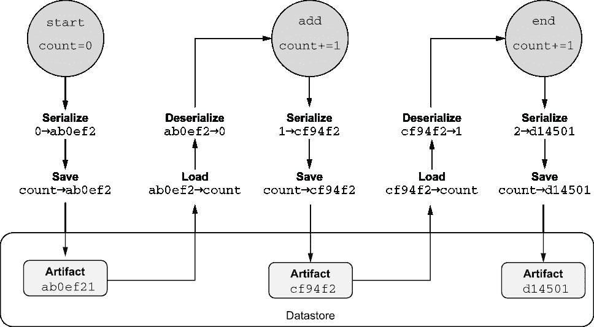

数据存储如何内部处理工件

当添加步骤第一次访问计数时，Metaflow 根据元数据从数据存储中获取它。我们知道添加步骤从开始处获取其值，因为流程的顺序。添加步骤增加计数的值，这会导致创建一个新的工件。需要注意的是，我们没有更改之前存储的计数值，因为其在开始时的历史值没有改变。每个步骤都有自己的工件集。这个过程会重复进行到结束步骤。

Metaflow 的数据存储组织成一个内容寻址存储，在概念上类似于 Git 版本控制系统*.* 内部，工件使用其内容的哈希值命名，因此只需要存储其唯一值的单个副本。换句话说，数据存储自动去重工件。这意味着磁盘空间被高效使用，在大多数情况下，你不必担心创建太多工件以节省空间。

应该是什么步骤？

当你开发一个新的流程时，你可能想知道哪些操作应该属于同一个步骤，以及何时将大步骤拆分成多个单独的步骤是有意义的。虽然没有唯一的正确答案，但将步骤视为*检查点*可能会有所帮助。如前所述，当步骤（精确地说，是步骤启动的任务）完成时，工件会被持久化。工件成功持久化后，它们将可用于检查，如 3.3.2 节所述。此外，你将能够在任意步骤恢复执行，如 3.3.3 节所述。因此，从执行时间方面来看，保持步骤合理小是有意义的，这样如果发生故障，你不会丢失太多工作。或者，如果你想几乎实时地监控运行的状况，你也需要小步骤。

另一方面，持久化工件和启动任务会产生一些开销。如果你的步骤太小，开销开始主导总执行时间。不过，这种开销很容易注意到：如果你发现它成为问题，你总是可以将微小的步骤合并在一起。

另一个考虑因素是代码的可读性。如果你执行

```
# python counter.py show
```

你觉得这个图有意义吗？很可能是步骤太大比步骤太小更损害可理解性。

经验法则：以逻辑步骤结构化你的工作流程，这些步骤应易于解释和理解。如有疑问，应偏向于小步骤。它们通常比大步骤更容易理解和调试。

### 3.1.4 参数

在上一节中，我们学习了如何使用工件在流程中传递数据，即通过将变量分配给 self。但如果你想在开始时传递数据，即设置流程的参数呢？

例如，假设你正在尝试一个新的模型，并且用各种参数化对其进行训练。在你分析实验结果之后，你应该知道用于训练模型特定版本的参数是什么。作为解决方案，Metaflow 提供了一个名为参数的特殊工件，你可以使用它将数据传递到运行中。参数工件与其他工件一样被跟踪，因此你可以检查分配给任何过去运行的参数。

参数是一个流程级（即类级）构造。它们不绑定到任何特定的步骤，并且自动对所有步骤（包括开始步骤）可用。要定义一个参数，你必须指定以下四个元素：

1.  在类级别创建一个参数实例。

1.  将参数分配给一个工件，例如，列表 3.3 中的动物和计数。

1.  指定用户看到的参数名称，例如，生物和计数，如下所示。工件名称和参数名称可以相同，也可以不同，如列表 3.3 所示。

1.  确定参数的类型。默认情况下，参数是字符串。您可以通过指定参数的默认值来更改类型，例如在下一个代码示例中为 count 所示，或者通过显式设置类型为 Python 的一种基本标量类型——str、float、int 或 bool，如列表 3.3 中的 ratio。

除了这些必需元素之外，参数支持一组可选参数。典型的选项包括 help，它指定了用户可见的帮助文本，以及 required=True，它表示用户必须为参数提供一个值。默认情况下，所有参数都是可选的。如果没有指定默认值且用户没有提供值，它们将接收 None 值。以下列表显示了一个示例。

列表 3.3 带有参数的工作流

```
from metaflow import FlowSpec, Parameter, step

class ParameterFlow(FlowSpec):

    animal = Parameter('creature',                   ❶
                       help="Specify an animal",
                       required=True)

    count = Parameter('count',                       ❶
                      help="Number of animals",
                      default=1)

    ratio = Parameter('ratio',                       ❶
                      help="Ratio between 0.0 and 1.0",
                      type=float)

    @step
    def start(self):
        print(self.animal, "is a string of", len(self.animal), "characters")
        print("Count is an integer: %s+1=%s" % (self.count, self.count + 1))
        print("Ratio is a", type(self.ratio), "whose value is", self.ratio)
        self.next(self.end)

    @step
    def end(self):
        print('done!')

if __name__ == '__main__':
    ParameterFlow()
```

❶ 参数在类级别定义，位于步骤之外。

将代码保存到名为 parameters.py 的文件中，并尝试像往常一样运行它：

```
# python parameters.py run
```

这会因错误“缺少选项 '--creature'”而失败，因为生物参数的 required=True。如果这是一个真实的工作流，这个错误将是一个很好的理由去检查工作流的帮助，如下所示：

```
# python parameters.py run --help
```

列出了许多选项。用户定义的参数位于选项列表的顶部，其帮助文本显示。尝试按以下方式设置 -creature 的值：

```
# python parameters.py run --creature seal
```

工作流应该运行，您会看到与分配的参数值相对应的输出。请注意，比例没有默认值，因此它被设置为 None。让我们尝试指定所有值，如下所示：

```
# python parameters.py run --creature seal --count 10 --ratio 0.3
```

注意观察计数和比例是如何自动转换为正确的 Python 类型的。

注意：参数是常量，不可变值。您不能在代码中更改它们。如果您想修改参数，请创建参数值的副本，并将其分配给另一个工件。

将参数指定为环境变量

如果您经常执行相同的运行命令行，可能略有修改，可能需要反复指定相同的参数，这可能会令人沮丧。为了方便，您还可以将任何选项指定为环境变量。

要这样做，请设置一个与选项名称匹配的环境变量，前面加上 METAFLOW_RUN_ 前缀。例如，我们可以将 creature 的值固定为 parameters.py，如下所示：

```
# export METAFLOW_RUN_CREATURE=dinosaur
```

现在，您可以在不指定 -creature 的情况下运行 ParameterFlow，因为它的值是通过环境变量指定的，如下所示：

```
# python parameters.py run --ratio 0.25
```

如果同时设置了环境变量和命令行选项，则后者具有优先级，正如您可以通过执行以下操作看到的那样：

```
# python parameters.py run --creature otter --count 10 --ratio 0.3
```

生物应该设置为水獭，而不是恐龙。

复杂参数

之前提到的机制适用于基本标量参数，这些参数是字符串、整数、浮点数或布尔值。大多数基本工作流除了这些基本类型之外不需要其他参数。

但有时，您可能需要一个列表或某种映射的参数，或者这些参数的复杂组合。挑战在于，因为参数通常在命令行上定义为字符串，我们需要一种方法来定义非标量值作为字符串，以便它们可以作为参数传递。这就是 JSON 编码参数派上用场的地方。

下一个列表展示了接受字典作为参数的简单示例。

列表 3.4 带有 JSON 类型参数的流程

```
from metaflow import FlowSpec, Parameter, step, JSONType     ❶

class JSONParameterFlow(FlowSpec):

    mapping = Parameter('mapping',
                        help="Specify a mapping",
                        default='{"some": "default"}',
                        type=JSONType)                       ❶

    @step
    def start(self):
        for key, value in self.mapping.items():
            print('key', key, 'value', value)
        self.next(self.end)

    @step
    def end(self):
        print('done!')

if __name__ == '__main__':
    JSONParameterFlow()
```

❶ 定义了一个 JSON 类型的参数，导入了 JSONType，并将其指定为参数类型

将代码片段保存到名为 json_parameter.py 的文件中。您可以在命令行中传递一个映射，一个字典，如下所示：

```
# python json_parameter.py run --mapping '{"mykey": "myvalue"}'
```

注意，字典被单引号包围，以避免特殊字符混淆 shell。

在命令行上内联指定大型 JSON 对象并不方便。对于大型 JSON 对象，更好的方法是使用标准的 shell 表达式从文件中读取值。如果您没有现成的用于测试的大型 JSON 文件，您可以创建一个——让我们称它为 myconfig.json——如下所示：

```
# echo '{"largekey": "largevalue"}' > myconfig.json
```

现在，您可以像这样提供一个文件作为参数：

```
# python json_parameter.py run --mapping "$(cat myconfig.json)"
```

shell 表达式，$(cat myconfig.json)，将命令行上的值替换为文件 myconfig.json 的内容。在这种情况下，我们必须将 shell 表达式用双引号括起来。

文件作为参数

之前展示的机制允许您使用命令行传递的小数值或配置文件来参数化一个运行，它们并不是用来传递大量输入数据的机制。

然而，在实际的数据科学应用中，区分参数和输入数据并不总是容易。大型配置文件可能比最小的数据集还要大。或者，您可能有一个中型辅助数据集，它感觉像是一个参数，尽管实际输入数据是通过另一个通道提供的。

Metaflow 提供了一个特殊的参数名为 IncludeFile，您可以使用它将小型或中型数据集作为一个工件包含在运行中。一个典型的例子是一个 CSV（逗号分隔值）文件。IncludeFile 可以处理文件的大小没有确切限制，但它的性能并没有针对大数据进行优化——比如说，大于一个 GB 的文件。将其视为一个超大的参数，如图 3.9 所示，而不是大规模数据处理机制，这将在第七章中介绍。

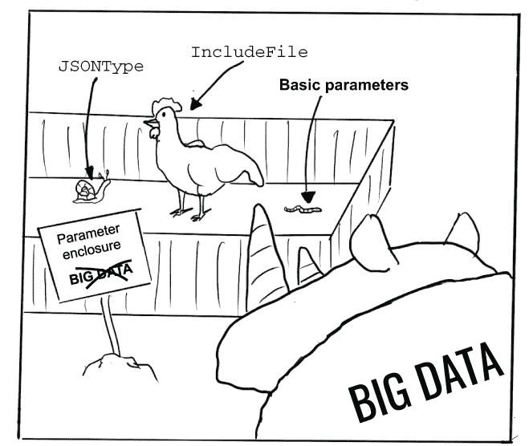

图 3.9 参数仅适用于小型和中型数据集。

让我们看看列表 3.5 中的示例。它接受一个 CSV 文件作为参数并解析它。该示例使用 Python 内置的 csv 模块中的 CSV 解析器，因此它可以处理引号值和可配置的字段分隔符。您可以通过指定--delimiter 选项来更改默认的分隔符，即逗号。

要测试流程，你可以创建一个简单的 CSV 文件，test.csv，其中包含任何以逗号分隔的值，如下所示：

```
first,second,third
a,b,c
```

csv.reader 函数将把 CSV 数据作为文件对象，因此我们将我们的字符串值 self.data 工件包装在 StringIO 中，使其成为一个内存中的文件对象。IncludeFile, is_text=True 表示相应的工件应以 Unicode 字符串的形式返回，而不是字节对象。

列表 3.5 包含 CSV 文件作为参数的流程

```
from metaflow import FlowSpec, Parameter, step, IncludeFile

from io import StringIO
import csv

class CSVFileFlow(FlowSpec):

    data = IncludeFile('csv',
                       help="CSV file to be parsed",
                       is_text=True)

    delimiter = Parameter('delimiter',
                          help="delimiter",
                          default=',')

    @step
    def start(self):
        fileobj = StringIO(self.data)
        for i, row in enumerate(csv.reader(fileobj, delimiter=self.delimiter)):
            print("row %d: %s" % (i, row))
        self.next(self.end)

    @step
    def end(self):
        print('done!')

if __name__ == '__main__':
    CSVFileFlow()
```

将代码保存到 csv_file.py。你可以按以下方式运行它：

```
# python csv_file.py run --csv test.csv
```

你应该能看到打印出来的 CSV 文件的解析字段。你可能会想知道这个简单的例子与直接在代码中打开 CSV 文件有什么不同，例如，使用 csv.reader(open('test.csv'))。关键区别在于 IncludeFile 读取文件并将其持久化为不可变的 Metaflow 工件，附加到运行中。因此，输入文件与运行一起快照和版本化，这样你就可以访问原始数据，即使 test.csv 被更改或丢失。这可以非常有用，我们将在第六章中学习。

现在你已经知道了如何定义可能通过参数从外部世界接收数据并在多个步骤中处理这些数据的顺序工作流程，这些步骤通过工件共享状态。在下一节中，我们将学习如何并行运行这些步骤序列。

## 3.2 分支和合并

*亚历克斯对在 Metaflow 中定义基本工作流程并不比在笔记本中编写代码更困难的事实感到非常惊讶。但这样编写代码有什么好处吗？到目前为止，工作流程的所谓好处似乎相当抽象。亚历克斯和鲍伊一边喝咖啡一边聊天，回忆起一个在笔记本中执行需要九分钟的项目。鲍伊指出，工作流程使得并行执行操作变得容易，这可以使处理速度大大加快。快速完成工作的想法与亚历克斯产生了共鸣——这可能是工作流程的一个杀手级特性！*


工作流程提供了一个并发（分支）的抽象，允许高效地使用并行计算资源，如多核 CPU 和分布式计算集群。尽管有几个其他范例能够实现并行计算，但其中许多都因其难以正确实现而闻名，多线程编程就是一个众所周知的例子。工作流程的独特之处在于，它们使得并行性对非专家软件开发者，包括数据科学家，变得可访问。

应该在何时使用分支？让我们先考虑一个没有分支的线性工作流程。设计一个线性工作流程通常并不太难。通常很明显，我们必须先做 A，然后才能做 B，只有 B 完成后 C 才能发生。A → B → C 的顺序是由数据流强制的：C 需要从 B 那里获取一些数据，而 B 又需要从 A 那里获取数据。

相应地，当数据流允许时，你应该使用分支。如果 A 产生可以被 B 和 C 使用的数据，并且 B 和 C 之间没有其他共享数据，那么 B 和 C 应该从 A 分支出来，这样它们可以并行运行。图 3.10 展示了这个例子。为了训练任何模型，我们需要获取由步骤 A 执行的数据集。我们希望使用步骤 A 产生的数据训练两个独立的模型版本。步骤 B 不需要从步骤 C 获取任何东西，反之亦然，因此我们应该将它们指定为独立的分支。在步骤 B 和 C 完成后，我们希望在步骤 D 中选择最佳模型，这显然需要来自步骤 B 和 C 的输入。

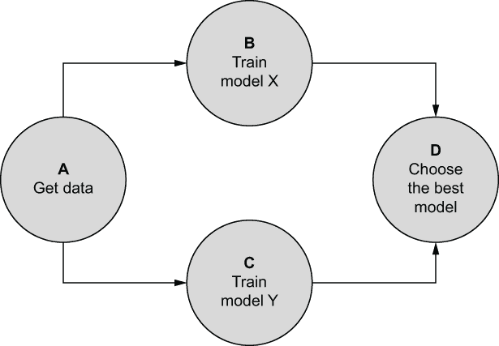

图 3.10 基本工作流程，包含两个分支

我们可以将图 3.10 的 DAG 表示为线性 DAG，A → B → C → D 或 A → C → B → D，并得到完全相同的结果。这些 DAG 的执行速度会慢一些，因为 Metaflow 无法并行运行步骤 B 和 C。除了性能优势外，分支可以通过突出实际的数据流和步骤之间的相互依赖性来使工作流程更易于阅读。因此，我们建议以下最佳实践。

经验法则：每当你有两个或更多可以独立执行的步骤时，将它们做成并行分支。这将使你的工作流程更容易理解，因为读者只需查看工作流程结构就能看到哪些步骤不共享数据。这也会使你的工作流程更快。

你可能会想知道系统是否能够自动确定最优的 DAG 结构。*自动并行化*在计算机科学领域已经是一个活跃的研究课题几十年了，但遗憾的是，使用任意、惯用的 Python 代码来做这件事实际上是不可能的。主要障碍是，通常流程代码本身并不包含足够的信息来表明什么可以并行化，因为步骤与其他第三方库和服务交互。我们发现，让用户保持控制比依赖半成品、容易出错的自动化更不容易造成混淆。此外，最终，工作流程是人类沟通的媒介。没有自动化的系统可以决定向人类描述业务问题的最易懂方式。

### 3.2.1 有效的 DAG 结构

我们称像图 3.10 中的步骤 A 那样分支扩散的步骤为*split 步骤*。相应地，我们称像图 3.10 中的步骤 D 那样合并分支的步骤为*join 步骤*。为了使数据流易于理解，Metaflow 要求每个 split 步骤都有一个相应的 join 步骤。你可以把 split 看作左括号(，而 join 看作右括号)。一个正确括号的表达式（就像这个）需要在两侧都有括号。你可以根据需要将 split 和 join 嵌套到任意深度。

图 3.11 展示了一个有效 DAG 的示例，其中包含嵌套分支。图中有三个分割步骤，浅灰色阴影。每个分割步骤都有一个对应的连接步骤，深灰色阴影。

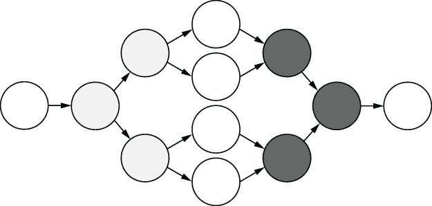

图 3.11 一个有效 DAG，具有两层嵌套分支

注意，仅仅有相同数量的分割和连接是不够的——还有另一条规则需要遵循。

规则 A 连接步骤只能连接具有公共分割父步骤的步骤。

图 3.12 展示了一个 DAG，其中包含两个无效的分割，分别用深灰和浅灰色表示。深灰色分割应该有一个对应的深灰色连接，但在这里，深灰色连接试图连接一个浅灰色步骤，这是不允许的——连接步骤只能连接来自公共分割父步骤的步骤。当你绘制一个有效的 Metaflow DAG 时，边（箭头）永远不需要交叉。


图 3.12 一个无效的 DAG，其中分割和连接不匹配

这些规则的原因可以追溯到数据流：我们需要跟踪艺术品的血统，这在有交叉边的图中可能会变得非常混乱。

### 3.2.2 静态分支

在前面的第二章中，我们介绍了 *静态 DAG* 的概念，即执行开始前结构完全已知的 DAG。所有之前展示的示例，例如图 3.10 中的示例，都是具有静态分支的静态 DAG。在本节中，我们将展示如何在 Metaflow 中定义静态分支。

在我们到达分割和连接的语法之前，我们需要涵盖以下重要主题：在分支中，数据流，即艺术品，将按设计发散。当我们到达连接步骤时，我们必须决定如何处理发散的值。换句话说，我们必须 *合并* 艺术品。合并的问题经常困扰 Metaflow 的新用户，所以让我们从一个简单的例子开始。

让我们通过添加另一个分支来扩展 3.2 列表中的原始 CounterFlow 示例，如图 3.13 所示。在这里，start 是我们的分割步骤。我们有一个分支，add_one，它将计数增加一，另一个分支，add_two，它将计数增加两。现在，在连接步骤中，我们有 count 的两个可能值，1 和 2。我们必须决定哪个是正确的值。

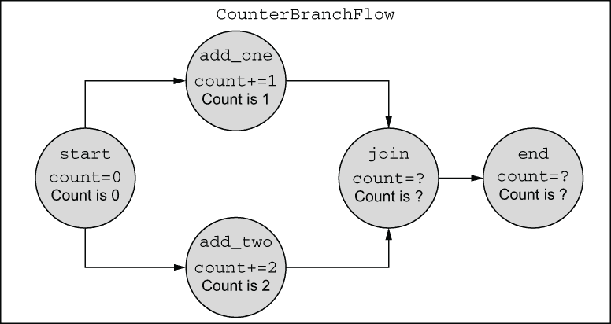

图 3.13 CounterBranchFlow

在这个例子中，与现实生活中流程类似，对于连接步骤中 count 应该得到什么值并没有明确的正确或错误答案。正确的选择取决于应用：可能是两个中的最大值，就像在列表 3.6 中那样；可能是平均值；或者可能是总和。定义如何合并值取决于用户。例如，考虑图 3.10 中的“选择最佳模型”步骤，该步骤将遍历模型 X 和 Y 并选择得分最高的模型。

虽然在图 3.13 中很容易看出计数问题需要解决，但还有一个额外的挑战：Metaflow 无法可靠地检测哪些工件已被修改，因此需要*决定如何处理所有上游来的工件*。如果你在合并步骤中不做任何事情，下游步骤将无法访问合并之前的数据，除非是常量参数，因此可以保证始终可用。

规则合并步骤在数据流中充当屏障。你必须明确合并所有工件（除了参数），以便数据可以通过下游流动。

在列表 3.6 中，对应于图 3.13，我们添加了另一个工件，creature，以演示这一点。如果合并步骤不对 creature 做任何处理，最终步骤中将无法访问它，尽管分支根本未对其进行修改。

定义静态分支的语法很简单：只需将所有分支作为 self.next 的参数列出。合并步骤接受一个额外的参数，按照惯例称为 inputs，它为你提供了访问每个入站分支的工件。合并步骤不必称为 join——它仅基于额外的参数被识别为合并步骤。

输入对象允许你以下三种方式访问分支：

1.  你可以遍历输入。通常使用 Python 内置函数，如 min、max 或 sum，结合一个遍历输入的生成器表达式来合并工件。这就是我们在下一个列表中选取计数最大值的方式。

1.  使用静态分支，你可以通过名称引用分支，就像在下一个列表中的打印语句中那样。

1.  你可以通过索引引用分支。通常使用第一个分支，inputs[0]，来重新分配所有分支中已知为常量的工件。这就是我们在以下列表中重新分配 creature 工件的方式。

列表 3.6 带有静态分支的流程

```
from metaflow import FlowSpec, step

class CounterBranchFlow(FlowSpec):

    @step
    def start(self):
        self.creature = "dog"
        self.count = 0
        self.next(self.add_one, self.add_two)                 ❶

    @step
    def add_one(self):
        self.count += 1
        self.next(self.join)

    @step
    def add_two(self):
        self.count += 2
        self.next(self.join)

    @step
    def join(self, inputs):                                   ❷

        self.count = max(inp.count for inp in inputs)         ❸
        print("count from add_one", inputs.add_one.count)     ❹
        print("count from add_two", inputs.add_two.count)     ❹

        self.creature = inputs[0].creature                    ❺
        self.next(self.end)

    @step
    def end(self):
        print("The creature is", self.creature)
        print("The final count is", self.count)

if __name__ == '__main__':
    CounterBranchFlow()
```

❶ 通过将所有输出步骤作为 self.next 的参数来定义静态分支。

❷ 通过向步骤添加额外的 inputs 参数来定义合并步骤。

❸ 通过遍历输入来取两个计数的最大值。

❹ 我们还可以从特定的命名分支中打印值。

❺ 要重新分配未修改的工件，我们只需通过索引引用第一个分支。

将代码保存到 counter_branch.py。你可以按以下方式运行它：

```
# python counter_branch.py run
```

打印的最终计数应该是 2，即两个分支中的最大值。你可以尝试在合并步骤中注释掉 self.creature 行，看看当不是所有下游步骤所需的工件——在本例中是 end——都由合并处理时会发生什么。它将崩溃，因为找不到 self.creature。

在日志中，注意 *pid*（进程标识符）在 add_one 和 add_two 中是不同的。Metaflow 将这两个分支作为单独的进程执行。如果你的计算机有多个 CPU 核心，这在任何现代系统中几乎是肯定的，操作系统可能会在单独的 CPU 核心上执行这些进程，这意味着计算实际上是在并行进行的。这意味着你可以将结果的速度提高两倍，与顺序运行相比。

合并辅助函数

你可能会想知道如果你有很多 artifacts 会发生什么。真的有必要显式地重新分配所有这些 artifacts 吗？它们确实都需要被重新分配，但为了避免样板代码，Metaflow 提供了一个辅助函数 merge_artifacts，它为你做了大部分的体力活。要看到它的实际效果，你可以替换重新分配常量 artifact 的那一行：

```
self.creature = inputs[0].creature
```

使用以下行：

```
self.merge_artifacts(inputs)
```

如果你再次运行流程，你会看到它同样适用于 merge_artifacts。

如你所想，merge_artifacts 不能为你完成所有的合并。它不知道你想要使用计数中的最大值，例如。它依赖于你首先显式地合并所有发散的 artifacts，就像我们在列表 3.6 中对 count 所做的那样。当你对所有发散的 artifacts 进行重新分配后调用 merge_artifacts，它将自动为你重新分配所有剩余的非发散 artifacts——即所有分支中具有相同值的 artifacts。如果任何发散的 artifacts 仍然存在，它将大声失败。

有时候你可能有一些不需要在下游可见的 artifacts，因此你不想合并它们，但它们可能会让 merge_artifacts 迷惑。列表 3.7 展示了这样一个案例。我们在两个分支中定义了一个名为 increment 的 artifact，它具有两个不同的值。我们将其视为步骤的内部细节，因此我们不想合并它。然而，我们希望将其保存为 artifact，以防我们以后需要调试代码。我们可以在 merge_artifacts 中使用 exclude 选项列出所有可以安全忽略的 artifacts。

列表 3.7 使用 merge 辅助函数合并分支

```
from metaflow import FlowSpec, step

class CounterBranchHelperFlow(FlowSpec):

    @step
    def start(self):
        self.creature = "dog"
        self.count = 0
        self.next(self.add_one, self.add_two)

    @step
    def add_one(self):
        self.increment = 1                                    ❶
        self.count += self.increment
        self.next(self.join)

    @step
    def add_two(self):
        self.increment = 2                                    ❶
        self.count += self.increment
        self.next(self.join)

    @step
    def join(self, inputs):
        self.count = max(inp.count for inp in inputs)
        print("count from add_one", inputs.add_one.count)       
        print("count from add_two", inputs.add_two.count)    
        self.merge_artifacts(inputs, exclude=['increment'])   ❷
        self.next(self.end)

    @step
    def end(self):
        print("The creature is", self.creature)
        print("The final count", self.count)

if __name__ == '__main__':
    CounterBranchHelperFlow()
```

❶ increment 的值在两个分支之间发散。

❷ 我们必须显式地忽略发散的 artifact，因为我们没有显式地处理它。

将代码保存到 counter_branch_helper.py。你可以按以下方式运行它：

```
# python counter_branch_helper.py run
```

输出与列表 3.6 中的相同。你可以移除 exclude 选项来查看 merge_artifacts 面对具有发散值的 artifacts 时抛出的错误。除了 exclude 之外，merge_artifacts 还有一些更方便的选项，你可以在 Metaflow 的在线文档中查阅。

### 3.2.3 动态分支

在上一节中，我们展示了如何将操作扩展到预定义的命名步骤列表中，每个步骤执行不同的操作。这种类型的并发操作有时被称为*任务并行性*。相反，如果你想要执行本质上相同的操作，但使用不同的输入数据呢？这种*数据并行性*在数据科学应用中非常常见。英特尔总监詹姆斯·雷 inders 在 ZDNet 上撰写的一篇文章([`mng.bz/j2Dz`](http://mng.bz/j2Dz))描述了这两种类型的并行性如下：

数据并行性涉及在不同的数据组件上运行相同的任务，而任务并行性则通过在同一数据上同时运行许多不同的任务来区分。

在数据科学的背景下，数据并行性出现在许多场景中，例如，当你并行训练或评分模型时，并行处理数据分片，或者并行进行超参数搜索时。在 Metaflow 中，数据并行性通过 foreach 构造来表示。我们称 foreach 分支为*动态分支*，因为分支的宽度或基数是在运行时根据数据动态确定的，而不是像静态分支那样在代码中确定。

注意：静态分支适合在代码中表达并发性，即无论处理什么数据，操作总是并发的，而动态分支适合在数据中表达并发性。

在图 3.10 中，我们概述了如何使用静态 DAG 来并行构建两个模型，X 和 Y。如果训练 X 和 Y 需要大量不同的代码——比如 X 是一个决策树，Y 是一个深度神经网络，那么这种结构是有意义的。然而，如果各个分支中的代码相同，但只有数据不同，这种方法就不合理了。例如，考虑为世界上的每个国家训练一个决策树模型，如图 3.14 所示。

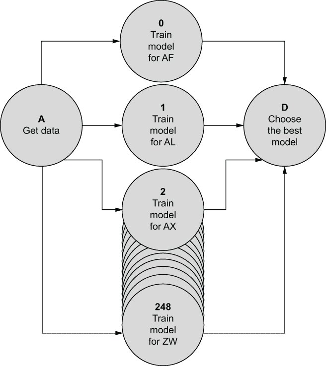

图 3.14 带有动态、数据驱动分支的工作流程

Metaflow 中一个称为 foreach 的构造允许你为给定列表中的每个值运行步骤的一个副本，因此得名*for-each*。许多编程语言，包括 Python，都提供了一个类似的功能，称为 map。像 map 一样，foreach 接受一个用户定义的函数（Metaflow 中的一个步骤）并将其应用于给定列表的每个项目，保存并返回结果（Metaflow 中的工件）。

分裂和合并的工作方式与静态分支完全相同，只是在分裂步骤中使用了略微不同的语法。特别是，你需要像静态分支一样合并 foreach 的工件。下面的列表演示了 foreach 的语法。

列表 3.8 带有 foreach 分支的流程

```
from metaflow import FlowSpec, step

class ForeachFlow(FlowSpec):

    @step
    def start(self):
        self.creatures = ['bird', 'mouse', 'dog']
        self.next(self.analyze_creatures, foreach='creatures')   ❶

    @step
    def analyze_creatures(self):
        print("Analyzing", self.input)                           ❷
        self.creature = self.input
        self.score = len(self.creature)
        self.next(self.join)

    @step
    def join(self, inputs):
        self.best = max(inputs, key=lambda x: x.score).creature
        self.next(self.end)

    @step
    def end(self):
        print(self.best, 'won!')

if __name__ == '__main__':
    ForeachFlow()
```

❶ 使用 foreach 关键字定义 foreach 分支，该关键字引用一个列表。

❷ self.input 指向 foreach 列表中的一个项。

foreach 拆分是通过调用 self.next 并传递一个步骤引用以及关键字参数 foreach 来定义的，foreach 的值是一个字符串，表示工件名称。foreach 引用的工件应该是一个 Python 列表。在这个例子中，foreach 工件被称为 creatures。

analyze_creatures 步骤将为列表中的每个项目调用，在这种情况下，三次。在 foreach 步骤中，你可以访问一个特殊属性 self.input，它包含分配给当前执行分支的 foreach 列表中的项目。请注意，self.input 在 foreach 外部不可用，因此如果你想保留该值，你应该将其分配给另一个工件，就像我们后来对 self.creature 所做的那样。

这个例子也演示了选择一个最大化某些工件值的分支的常见模式，在这种情况下，是分数。Python 内置的 max 函数接受一个可选的 key 参数，它定义了一个产生排序键的函数，该键用于定义最大值。实际上，这是 Python 中 arg max 的实现，这在数据科学中非常常见，尤其是在 foreach 的上下文中。

将代码保存到 foreach.py，并按以下方式运行：

```
# python foreach.py run
```

你可以看到有三个 analyze_creatures 实例正在并发运行，每个实例从 creatures 列表中获取不同的值。每个生物根据其名称的长度进行评分，老鼠获胜。

这是第一个展示单个步骤如何产生多个任务的例子。在日志中，你可以看到每个任务都有一个唯一的 ID，如 analyze_creatures/2 和 analyze_creatures/3，这些 ID 用于唯一标识 foreach 的分支。

数值计算喜欢动态分支

在数值计算中，并行执行代码的不同数据部分，然后收集结果的模式是通用的。在文献中，这种模式有如下名称：

+   批量同步并行（一个在 20 世纪 80 年代首次提出的概念）

+   MapReduce（由开源数据处理框架 Hadoop 普及）

+   分叉-合并模型（例如，Java 中的 java.util.concurrent.ForkJoinPool）

+   并行映射（例如，Python 的 multiprocessing 模块中的）

如果你好奇，可以使用 Google 查找这些概念的更多详细信息。它们都与 Metaflow 中的 foreach 构造类似。

在典型数据科学应用中，并行化发生在多个级别。例如，在应用级别，你可以使用 Metaflow 的 foreach 定义一个工作流程，为每个国家训练一个单独的模型，如图 3.14 所示。然后在低级别，接近硬件级别，使用类似模式的 ML 库（如 TensorFlow）训练模型，该库在多个 CPU 核心上并行化矩阵计算。

Metaflow 的哲学是专注于应用整体结构的高层次、以人为本的关注点，并让现成的机器学习库处理以机器为中心的优化。

### 3.2.4 控制并发

单个 foreach 可以扩展成数以万计的任务。实际上，foreach 是 Metaflow 可伸缩性故事的关键元素，如第四章所述。作为副作用，foreach 分支可能会意外地在您的笔记本电脑上启动如此多的并发任务，以至于它开始变得非常热。为了使笔记本电脑（或数据中心）的生活更轻松，Metaflow 提供了一种控制并发任务数量的机制。

并发限制不会以任何方式改变工作流程结构——代码保持完整。默认情况下，限制由 Metaflow 内置的 *本地调度器* 在执行时强制执行，该调度器负责在您输入 run 命令时执行工作流程。如第六章所述，Metaflow 支持其他调度器，用于需要更高可用性和可伸缩性的用例。

要了解并发限制在实际中的工作方式，让我们以列表 3.9 中的代码为例。它显示了一个包含一千个项目的列表的 foreach 流。

列表 3.9 包含 1000 方 foreach 的流程

```
from metaflow import FlowSpec, step

class WideForeachFlow(FlowSpec):

    @step
    def start(self):
        self.ints = list(range(1000))
        self.next(self.multiply, foreach='ints')

    @step
    def multiply(self):
        self.result = self.input * 1000
        self.next(self.join)

    @step
    def join(self, inputs):
        self.total = sum(inp.result for inp in inputs)
        self.next(self.end)

    @step
    def end(self):
        print('Total sum is', self.total)

if __name__ == '__main__':
    WideForeachFlow()
```

将代码保存到 wide_foreach.py。尝试以下方式运行它：

```
# python wide_foreach.py run
```

这应该会因错误信息“启动子任务过多”而失败。由于在 Metaflow 中定义 foreach 非常容易，您可能会无意中使用非常大的列表，可能包括数百万个项目。运行这样的流程将需要很长时间才能执行。

为了防止发生愚蠢且可能昂贵的错误，Metaflow 默认对 foreach 的最大大小进行了保护，为 100。您可以使用 --max-num-splits 选项提高限制，如下所示：

```
# python wide_foreach.py run --max-num-splits 10000
```

如果您总是运行宽 foreach，设置一个环境变量可能更容易，如下所示：

```
# export METAFLOW_RUN_MAX_NUM_SPLITS=100000
```

从理论上讲，列表 3.9 中的 foreach 的所有 1,000 个任务都可以并发运行。然而，请记住，每个任务都成为它自己的进程，因此您的操作系统可能不会太高兴管理成千上万的并发活动进程。此外，这也不会使事情变得更快，因为您的计算机没有 1,000 个 CPU 核心，所以大多数时候任务都会在操作系统的执行队列中闲置。

为了支持原型设计循环，特别是 run 命令，Metaflow 包含一个内置的工作流程调度器，类似于第 2.2.3 节中列出的那些。Metaflow 将此调度器称为 *本地调度器*，以区别于我们将在第六章中学习的其他可以编排 Metaflow 流的调度器。本地调度器的行为就像一个合适的工作流程调度器：它按流程顺序处理步骤，将步骤转换为任务，并将任务作为进程执行。重要的是，它可以控制同时执行的任务数量。

您可以使用`--max-workers`选项来控制调度器启动的最大并发进程数。默认情况下，最大值为 16。对于本地运行，例如我们迄今为止所执行的那些，将值设置得高于您开发环境中的 CPU 核心数并不会带来太多好处。有时您可能希望降低该值以节省计算机资源。例如，如果一项任务需要 4GB 的内存，除非您的计算机至少有 16*4=64GB 的可用内存，否则您无法同时运行 16 个这样的任务。

您可以尝试不同的`max-workers`值。例如，比较执行时间

```
# time python wide_foreach.py run --max-num-splits 1000 --max-workers 8
```

与之相比

```
# time python wide_foreach.py run --max-num-splits 1000 --max-workers 64
```

我们将在第五章中了解更多关于`max-workers`的影响。图 3.15 总结了这两个选项。

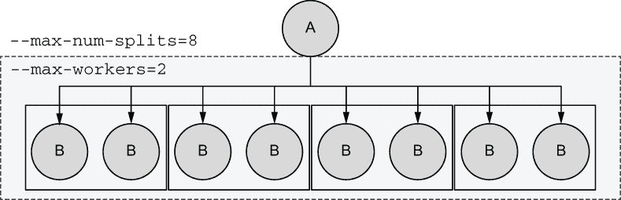

图 3.15 max-num-splits 和 max-workers 的影响

步骤 A 是一个`foreach`拆分，它生成步骤 B 的八个任务。在这种情况下，如果您为`--max-num-splits`指定了低于 8 的任何值，运行将崩溃，因为该选项控制了`foreach`分支的最大宽度。无论`--max-workers`的值是多少，都会运行所有八个任务，因为它只控制并发性。在这里，设置`--max-workers=2`通知本地调度器最多同时运行两个任务，因此八个任务将作为四个小批量执行。

恭喜！您现在能够在 Metaflow 中定义任意工作流程，通过分支管理数据流，并在您的笔记本电脑上执行甚至大规模的测试案例而不会过热！有了这个基础，我们可以继续构建我们的第一个真实数据科学应用。

## 3.3 Metaflow 实践

*作为第一个实际数据科学项目，Harper 建议 Alex 可以构建一个应用，预测新客户最可能喜欢的促销纸杯蛋糕的类型，给定客户的一些已知属性。幸运的是，到目前为止，客户已经手动选择了他们最喜欢的，因此他们的过去选择可以用作训练集中的标签。Alex 认识到这是一个简单的分类任务，使用现成的机器学习库实现应该不会太难。Alex 开始使用 Metaflow 开发原型。*

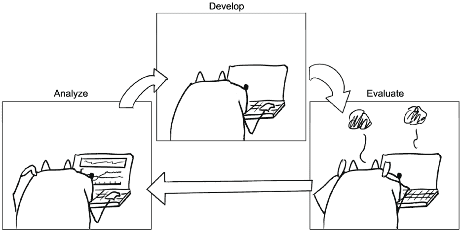

现在我们已经涵盖了 Metaflow 的基础知识，我们可以构建一个简单但功能性的数据科学应用。该应用创建用于训练和测试的数据集，训练两个不同的分类器模型，并选择表现最好的一个。工作流程类似于图 3.10 中所示。

如果你不是机器学习专家，请不要担心。这个应用，就像这本书中的所有其他示例一样，展示了数据科学的发展经验和基础设施，而不是建模技术。如果你对建模方面感兴趣，可以在*Scikit-Learn*教程中了解更多信息（[`scikit-learn.org/stable/tutorial/`](https://scikit-learn.org/stable/tutorial/index.xhtml)），这个示例就是基于这个教程的。

我们将通过多次迭代逐步构建示例，就像我们原型化一个真实应用一样。这是一个将第二章中概述的工作站设置（IDE、笔记本和云实例）付诸实践的好机会。

### 3.3.1 启动新项目

从零开始启动一个新项目可能会感到不知所措：你在编辑器中面对一个空白的文件，不知道从何开始。从工作流程的角度思考项目可能会有所帮助。我们可能只有模糊的想法需要做什么，但至少我们知道工作流程在开始时会有一个起始步骤，在结束时会有一个结束步骤。

我们知道工作流程将需要一些输入数据，并且它需要将结果写入某个地方。我们知道在开始和结束之间需要发生一些处理，我们可以迭代地找出这些处理。图 3.16 将这种方法描绘为一个螺旋。

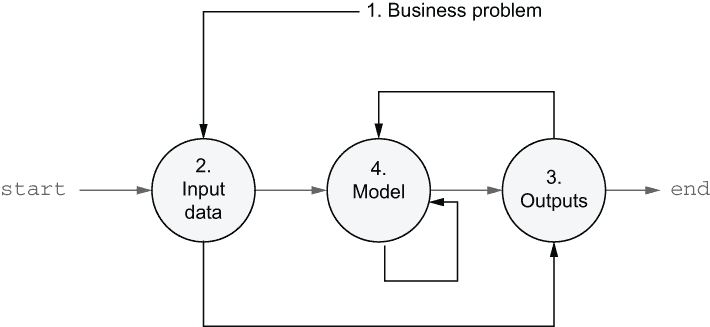

图 3.16 新项目启动的螺旋食谱

在启动新项目时，遵循黑色箭头指示的路径：

1.  我们试图解决的业务问题是什么？

1.  我们可以使用哪些输入数据？我们如何以及在哪里读取它？

1.  输出数据应该是什么？我们应该如何以及在哪里写入它？

1.  我们可以使用哪些技术来根据输入产生更好的输出？

箭头显示了工作流程的顺序。你可以看到我们是从外向内构建工作流程的。这种螺旋方法对以下原因很有用，这些原因在许多数据科学项目中已被证明是正确的：

1.  容易忽视我们试图解决的实际问题的细节，尤其是在处理一个新而令人兴奋的模型时。问题应该决定解决方案，而不是反过来。

1.  发现、验证、清理和转换合适的输入数据通常比预期的更困难。最好尽早开始这个过程。

1.  将结果集成到周围业务系统中可能比预期的更困难——最好尽早开始。此外，输出可能存在令人惊讶的要求，这可能会影响建模方法。

1.  从最简单的建模方法开始，并使其与端到端工作流程一起工作。当基本应用工作后，我们可以使用真实数据在真实业务环境中测量结果，这使得我们可以开始严格地改进模型。如果项目成功，这一步永远不会结束——总有方法可以改进模型。

基础设施应使遵循螺旋食谱变得容易。*I* 应支持开箱即用的迭代开发。让我们看看 Metaflow 在实际中的工作方式。

项目骨架

我们的玩具业务问题是对葡萄酒进行分类——并不完全是纸杯蛋糕，但足够接近。方便的是，Scikit-Learn 附带了一个合适的数据集。示例将不包含特定于该数据集的内容，因此您也可以使用相同的模板来测试其他数据集。

我们首先按照以下方式安装 Scikit-Learn 包：

```
# pip install sklearn
```

我们将在第六章学习更复杂的处理依赖关系的方法，但目前在系统范围内安装包是可行的。遵循螺旋食谱，我们首先从只加载输入数据的简单骨架版本开始。我们将在该流程中添加更多功能，如图 3.17 所示。相应的代码在 3.10 列表中给出。

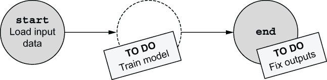

图 3.17 ClassifierTrainFlow 的第一迭代

列表 3.10 ClassifierTrainFlow 的第一迭代

```
from metaflow import FlowSpec, step

class ClassifierTrainFlow(FlowSpec):

    @step
    def start(self):
        from sklearn import datasets                                         ❶
        from sklearn.model_selection import train_test_split                 ❶

        X, y = datasets.load_wine(return_X_y=True)                           ❷
        self.train_data,\
        self.test_data,\
        self.train_labels,\
        self.test_labels = train_test_split(X, y, test_size=0.2, random_state=0)❸
        print("Data loaded successfully")
        self.next(self.end)

    @step
    def end(self):
        self.model = 'nothingburger'                                         ❹
        print('done')

if __name__ == '__main__':
    ClassifierTrainFlow()
```

❶ 在步骤代码内部进行导入，而不是在文件顶部

❷ 加载数据集

❸ 将数据集分为包含 20%行的测试集和包含其余行的训练集

❹ 实际模型的占位符

我们使用 Scikit-Learn 中的函数来加载数据集（load_wine）并将其拆分为训练集和测试集（train_test_split）。您可以在网上查找这些函数以获取更多信息，但这对于本例不是必需的。

注意：在 Metaflow 中，将导入语句放在使用模块的步骤内部，而不是在文件顶部，被认为是一种良好的实践。这样，导入仅在需要时执行。

将代码保存到 classifier_train_v1.py，并按以下所示运行：

```
# python classifier_train_v1.py run
```

代码应成功执行。为了确认已加载数据，您可以执行以下类似命令：

```
# python classifier_train_v1.py dump 1611541088765447/start/1
```

将路径规范替换为可以从上一个命令的输出中复制和粘贴的实际路径。该命令应显示已创建一些工件，但它们太大而无法显示。这是一个好兆头——已经获取了一些数据，但实际看到数据会更好。我们将在下一节学习如何做到这一点。

### 3.3.2 使用 Client API 访问结果

在 3.1.2 节中，我们了解到 Metaflow 将所有实例变量，如 3.10 列表中的 train_data 和 test_data，作为其自己的数据存储中的工件持久化。工件存储后，您可以使用 Metaflow Client 或 Client API 以编程方式读取它们。Client API 是允许您检查结果并在流程中使用它们的键机制。

注意：您可以使用 Client API 读取工件。工件创建后不能被修改。

客户端 API 公开了一个容器层次结构，可以用来引用运行的不同部分，即流程的执行。除了单个运行之外，容器还允许你导航整个 Metaflow 宇宙，包括你和你同事的所有运行，前提是你使用了一个共享元数据服务器（关于这一点，请参阅第六章）。容器层次结构在图 3.18 中展示。

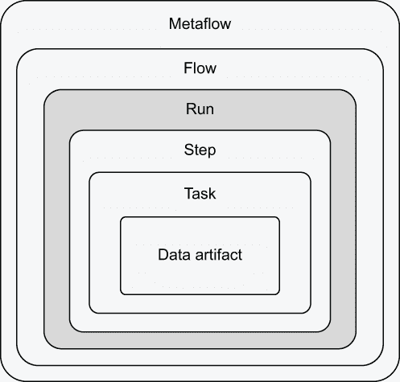

图 3.18 客户端 API 的容器层次结构

每个容器内部可以找到的内容如下：

+   *Metaflow*—包含所有流程。你可以用它来发现你和你同事创建的流程。

+   *流程*—包含使用 FlowSpec 类执行的所有运行。

+   *运行*—包含在此运行期间启动执行的流程的所有步骤。运行是层次结构中的核心概念，因为所有其他对象都是通过运行产生的。

+   *步骤*—包含由此步骤启动的所有任务。只有 foreach 步骤包含多个任务。

+   *任务*—包含此任务产生的所有数据工件。

+   *数据工件*—包含由任务产生的一份数据。

除了作为容器外，这些对象还包含其他元数据，例如创建时间和标签。值得注意的是，你还可以通过 Task 对象访问日志。

你可以通过以下三种方式实例化客户端 API 对象：

1.  你可以直接使用唯一标识对象层次结构中的对象的路径规范来实例化任何对象。例如，你可以使用 Run(pathspec)访问特定运行的 数据，例如，Run("ClassifierTrainFlow/1611541088765447")。

1.  你可以使用括号符号来访问子对象。例如，Run ("ClassifierTrainFlow/1611541088765447")['start'] 返回起始步骤。

1.  你可以迭代任何容器来访问其子对象。例如，list (Run("ClassifierTrainFlow/1611541088765447")) 返回与给定运行对应的所有 Step 对象的列表。

此外，客户端 API 包含了一些方便的快捷方式来导航层次结构，我们将在接下来的示例中介绍。

在笔记本中检查结果

你可以在 Python 支持的所有地方使用客户端 API：在脚本中、使用交互式 Python 解释器（只需执行 python 即可打开一个），或者在笔记本中。笔记本是一个特别方便的环境，用于检查结果，因为它们支持丰富的可视化。

让我们在笔记本中检查列表 3.10 中 ClassifierTrainFlow 的结果。首先，在你的编辑器中打开一个笔记本，或者通过在执行 Metaflow 运行的同个工作目录中执行命令行上的 jupyter-notebook 来打开一个笔记本。

我们可以使用笔记本来检查我们之前加载的数据。具体来说，我们想要检查一个名为 train_data 的工件，它在起始步骤处创建。为此，将下一列表中的行复制到笔记本中的一个单元格中。

列表 3.11 在笔记本中检查数据

```
from metaflow import Flow
run = Flow('ClassifierTrainFlow').latest_run
run['start'].task.data.train_data
```

使用 Client API 实际上是关于导航图 3.18 所示的对象层次结构。Flow.latest_run 是一个快捷方式，它给出了给定 Flow 的最新运行。我们使用 ['start'] 来访问所需的步骤，然后使用 .task 快捷方式来获取相应的任务对象，并使用 .data 来查看给定的工件。结果应该类似于图 3.19。


图 3.19 在笔记本中使用 Client API

Client API 旨在方便地探索数据。以下是一些你可以自己尝试的练习：

+   尝试检查由运行创建的其他工件，例如，train_labels 或 model。

+   再次运行流程。注意 `.latest_run` 返回了一个不同的运行 ID。现在尝试检查之前的运行。

+   尝试探索对象的其它属性，例如，.created_at。提示：你可以使用 help() 来查看文档——尝试 help(run)。

在流程间访问数据

图 3.20 展示了我们的项目如何通过前两个步骤进行进展，从业务问题定义到在 ClassifierTrainFlow 中设置输入数据。现在我们已经确认输入数据已正确加载，我们可以继续螺旋式流程的下一步，即项目的输出。我们希望使用一个由 ClassifierTrainFlow 训练的模型来分类未见过的数据点，在这种情况下，是葡萄酒。

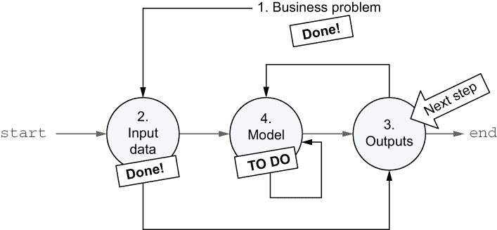

图 3.20 接下来关注项目的输出

将预测应用如此类分成两个流程是很常见的：一个用于训练模型，另一个用于使用模型为未见过的数据提供预测。这种分割是有用的，因为预测或推理流程通常独立运行，并且比训练流程运行得更频繁。例如，我们可能每天训练一个新的模型，但每小时预测新的数据一次。

让我们原型化一个预测流程，ClassifierPredictFlow，以配合我们的训练流程 ClassifierTrainFlow。关键思想是访问之前训练好的模型，我们可以通过 Client API 来实现。在这个例子中，我们接受一个要分类的数据点，它被指定为一个 JSON 类型的参数（有关其工作方式的提醒，请参阅 3.4 节的列表）。作为一个练习，你可以用数据点的 CSV 文件替换它（请参阅 3.5 节的示例），这将是一个更现实的方法。流程的第一个迭代如下所示。

列表 3.12 ClassifierPredictFlow 的第一次迭代

```
from metaflow import FlowSpec, step, Flow, Parameter, JSONType

class ClassifierPredictFlow(FlowSpec):

    vector = Parameter('vector', type=JSONType, required=True)

    @step
    def start(self):
        run = Flow('ClassifierTrainFlow').latest_run   ❶
        self.train_run_id = run.pathspec               ❷
        self.model = run['end'].task.data.model        ❸
        print("Input vector", self.vector)
        self.next(self.end)

    @step
    def end(self):
        print('Model', self.model)

if __name__ == '__main__':
     ClassifierPredictFlow()
```

❶ 使用 Client API 查找最新的训练运行

❷ 保存训练运行的路径规范以进行血缘跟踪

❸ 获取实际的模型对象

将代码保存到 classifier_predict_v1.py，并按以下方式运行：

```
# python classifier_predict_v1.py run --vector '[1,2]'
```

运行应该报告模型为“nothingburger”，正如我们在列表 3.10 中指定的项目骨架所示。这是螺旋方法的实际应用：我们在担心实际模型之前，先建立和验证端到端应用所有部分的连接。

注意我们持久化了一个包含训练运行路径 spec 的 artifact，train_run_id。我们可以使用这个 artifact 来跟踪*模型血缘*：如果预测结果有意外，我们可以追踪到产生结果的模型的精确训练运行。

### 3.3.3 调试失败

现在我们已经有了项目的输入和输出的骨架流程，我们来到了有趣的部分：定义机器学习模型。正如在现实世界的项目中常见的那样，模型的第一个版本可能不会工作。我们将通过 Metaflow 练习如何调试失败。

数据科学项目的另一个常见特征是，最初我们不确定哪种类型的模型最适合给定的数据。也许我们应该训练两种不同类型的模型，并选择表现最好的那个，正如我们在图 3.10 的上下文中讨论的那样。

受 Scikit-Learn 教程的启发，我们训练了一个 K 最近邻（KNN）分类器和支持向量机（SVM）。如果你对这些技术不熟悉，不用担心——了解它们对这个例子不是必需的。你可以参考 Scikit-Learn 教程了解更多关于模型的信息。

训练模型通常是流程中最耗时的部分，因此并行步骤训练模型以加快执行速度是有意义的。接下来的列表通过在列表 3.10 中的 ClassifierTrainFlow 骨架中间添加三个新步骤来扩展：train_knn 和 train_svm，它们是并行分支，以及 choose_model，它选择两个模型中表现最好的模型。

列表 3.13 几乎完成的 ClassifierTrainFlow

```
from metaflow import FlowSpec, step

class ClassifierTrainFlow(FlowSpec):

    @step
    def start(self):                                        ❶
        from sklearn import datasets
        from sklearn.model_selection import train_test_split

        X, y = datasets.load_wine(return_X_y=True)
        self.train_data,\
        self.test_data,\
        self.train_labels,\
        self.test_labels = train_test_split(X, y, test_size=0.2, random_state=0)
        self.next(self.train_knn, self.train_svm)

    @step
    def train_knn(self):                                    ❷
        from sklearn.neighbors import KNeighborsClassifier

        self.model = KNeighborsClassifier()
        self.model.fit(self.train_data, self.train_labels)
        self.next(self.choose_model)

    @step
    def train_svm(self):                                    ❷
        from sklearn import svm

        self.model = svm.SVC(kernel='polynomial')           ❸
        self.model.fit(self.train_data, self.train_labels)
        self.next(self.choose_model)

    @step
    def choose_model(self, inputs):                         ❷
        def score(inp):
            return inp.model,\
                   inp.model.score(inp.test_data, inp.test_labels)

        self.results = sorted(map(score, inputs), key=lambda x: -x[1])
        self.model = self.results[0][0]
        self.next(self.end)

    @step
    def end(self):                                          ❹
        print('Scores:')
        print('\n'.join('%s %f' % res for res in self.results))

if __name__ == '__main__':
    ClassifierTrainFlow()
```

❶ 除了更新 self.next()之外，起始步骤没有其他更改。

❷ 在流程中间添加了新的训练步骤。

❸ 这行代码将导致错误：参数应该是'poly'。

❹ 末步骤被修改为打印出有关模型的信息。

两个 train_ 步骤使用我们在起始步骤中初始化的 artifacts train_data 和 train_labels 中的训练数据来拟合模型。这种方法对于小型和中型数据集来说效果很好。使用大量数据训练大型模型有时需要不同的技术，我们将在第七章中讨论。

choose_model 步骤使用 Scikit-Learn 的 score 方法使用测试数据对每个模型进行评分。根据分数（多亏了-x[1]，它将排序键中的分数取反）按降序排序模型。我们将最佳模型存储在 model artifact 中，它将被 ClassifierPredictFlow 稍后使用。请注意，所有模型及其评分都存储在 results artifact 中，允许我们稍后在笔记本中检查结果。

将代码再次保存到 classifier_train.py 中，并按以下所示运行：

```
# python classifier_train.py run
```

哎呀！列表 3.13 中的代码在出现类似 ValueError: 'polynomial'不在列表中的错误时失败。

这种错误是原型设计循环中预期的一部分。事实上，Metaflow 和其他类似框架的许多功能都是专门设计来使调试失败更容易的。每当有东西失败时，您可以通过遵循图 3.21 中建议的步骤对问题进行分类和修复。


图 3.21 调试循环

让我们一步一步地来。

1. 在日志中查找错误信息

第一步是尝试理解确切失败的原因，特别是哪个步骤失败了，以及错误信息是什么。如果您手动运行流程，您应该在终端上看到带有步骤名称的前缀的堆栈跟踪（例如，在先前的 ClassifierTrainFlow 中的 train_svm）。

尤其是在宽泛的 foreach 中，终端上可能会出现如此多的错误信息，以至于阅读它们变得困难。在这种情况下，日志命令（见 3.1.1 节），可以用来显示单个任务的输出，可能会很有用。然而，该命令只有在您知道可能失败的步骤或任务时才有用。它对于在干草堆中寻找失败的针并没有帮助。

或者，您可以使用客户端 API，例如在笔记本中自动遍历所有任务。您可以将以下片段复制并粘贴到笔记本中。

列表 3.14 使用客户端 API 访问日志

```
from metaflow import Flow
for step in Flow("ClassifierTrainFlow").latest_run:
    for task in step:
        if not task.successful:
            print("Task %s failed:" % task.pathspec)
            print("-- Stdout --")
            print(task.stdout)
            print("-- Stderr --")
            print(task.stderr)
```

您可以将 Flow().latest_run 替换为指向特定运行的 Run 对象，例如 Run("ClassifierTrainFlow/1611603034239532")，以分析任何过去运行的日志。使用客户端 API 的好处是您可以使用 Python 的全部功能来找到您需要的内容。例如，您可以通过添加一个条件来仅查看包含特定术语的日志

```
if 'svm' in task.stderr:
```

在代码中。

2. 理解代码失败的原因

一旦您弄清楚什么失败了，您就可以开始分析为什么它失败了。通常，这一步涉及到仔细检查失败 API 的文档（以及谷歌搜索！）。Metaflow 支持使用一些额外的工具进行常规调试。

使用客户端 API 检查代表执行前状态的工件。尽可能多地存储信息作为工件的主要动机是帮助重建失败前的流程状态。您可以在笔记本中加载工件，检查它们，并使用它们来测试与失败相关的假设。学会热爱工件吧！

Metaflow 与调试器兼容，如 Visual Studio Code 和 PyCharm 中嵌入的调试器。由于 Metaflow 将任务作为单独的进程执行，调试器需要一些额外的配置才能正确工作。您可以在 Metaflow 的在线文档中找到配置流行编辑器中调试器的说明。一旦您配置了调试器，您就可以像往常一样使用它来检查实时代码。

通常，涉及大量数据的计算密集型代码会因资源耗尽而失败，例如内存不足。我们将在第四章中学习如何处理这些问题。

3. 测试修复

最后，您可以尝试修复代码。Metaflow 的一个巨大优势是您不需要从头开始重新启动整个运行来测试修复。想象一下，有一个流程首先花费 30 分钟处理输入数据，然后训练模型花费 3 小时，最后由于拼写错误在最后一步失败。您可以在一分钟内修复这个错误，但不得不等待 3.5 小时来确认修复是否有效，这会让人感到沮丧。

相反，您可以使用 `resume` 命令。让我们用它来修复列表 3.13 中的错误。在 `train_svm` 步骤中，将 "polynomial" 作为模型的参数，参数应该是 'poly'。将错误的行替换为以下内容：

```
svm.SVC(kernel='poly')
```

您可以使用运行命令再次运行代码，但与其这样做，不如尝试以下方法：

```
# python classifier_train.py resume
```

此命令将找到之前的运行，克隆所有成功步骤的结果，并从失败的步骤开始恢复执行。换句话说，它不会花费时间重新执行已经成功的步骤，这在前面的例子中可以节省 3.5 小时的执行时间！

如果您尝试修复代码不成功，您可以尝试另一个想法并再次恢复。您可以持续迭代修复，直到需要为止，如图 3.21 中的反向箭头所示。

在前面的例子中，`resume` 重新使用了 `train_knn` 步骤的成功结果。然而，在某些情况下，修复一个步骤可能需要更改成功的步骤，这时您可能也想恢复。您可以通过指示 `resume` 从任何先于失败步骤的步骤开始恢复执行，例如：

```
# python classifier_train.py resume train_knn
```

这将强制 `resume` 重新运行 `train_knn` 和 `train_svm` 步骤，以及任何后续步骤。失败的步骤及其后续步骤总是会被重新运行。

默认情况下，`resume` 命令会在当前工作目录中找到最新执行的运行 ID，并将其用作 *起源运行*，即克隆其结果用于恢复运行的运行。您可以使用 `--origin-run-id` 选项将起源运行更改为同一流程中的任何其他运行，如下所示：

```
# python classifier_train.py resume --origin-run-id 1611609148294496 train_knn
```

这将从 `train_knn` 步骤开始，使用 `classifier_train.py` 中的最新代码恢复运行 1611609148294496 的执行。起源运行不必是失败的运行，也不必是您执行的运行！在第五章中，我们将使用此功能在本地恢复失败的生产运行。

恢复的运行被注册为正常运行。它们将获得自己的唯一运行 ID，因此您可以使用客户端 API 访问它们的结果。但是，您无法更改已恢复运行的参数，因为更改它们可能会影响要克隆的任务的结果，这可能导致整体结果不一致。

### 3.3.4 完成细节

在修复 ClassifierTrainFlow 后，它应该成功完成并生成一个有效的模型。要完成 ClassifierPredictFlow（列表 3.12），请将其末尾步骤添加以下行：

```
print("Predicted class", self.model.predict([self.vector])[0])
```

为了测试预测，您必须在命令行上提供一个向量。葡萄酒数据集包含每个葡萄酒的 13 个属性。您可以在 Scikit-Learn 的数据集页面（[`mng.bz/ZAw9`](http://mng.bz/ZAw9)）中找到它们的定义。例如，以下是一个使用训练集向量的示例：

```
# python classifier_predict.py run --vector 
➥ '[14.3,1.92,2.72,20.0,120.0,2.8,3.14,0.33,1.97,6.2,1.07,2.65,1280.0]'
```

预测的类别应该是 0。恭喜——我们有一个工作的分类器！

如果分类器产生错误的结果怎么办？您可以使用 Scikit-Learn 的模型洞察工具和 Client API 来检查模型，如图 3.22 所示。

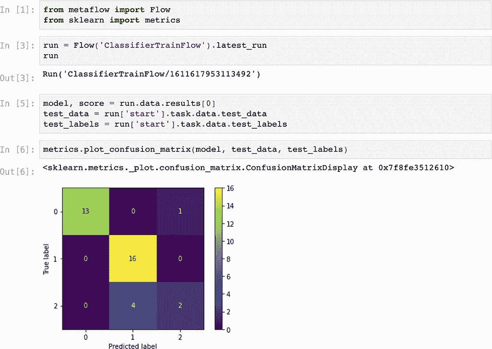

图 3.22 检查分类器模型的笔记本

现在，应用程序似乎可以端到端工作，让我们总结一下我们构建的内容。该应用程序展示了 Metaflow 和一般数据科学应用程序的许多关键概念。图 3.23 说明了我们最终应用程序的整体架构。

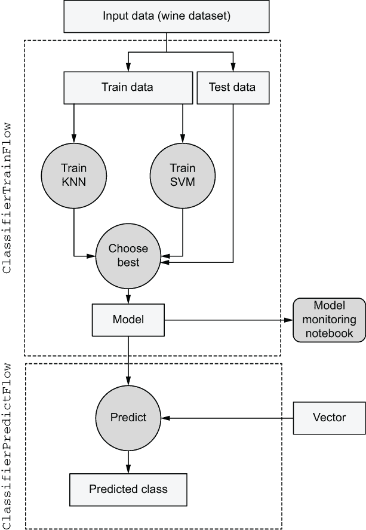

图 3.23 分类器应用程序的架构

从上到下阅读图示：

1.  我们获得了输入数据，并将其分为训练集和测试集，这些集被存储为工件。

1.  我们训练了两个替代模型作为并行分支……

1.  ……并基于测试数据的准确性选择表现最好的一个。

1.  所选模型被存储为一个工件，我们可以使用 Client API 与笔记本中的其他工件一起检查它。

1.  可以根据需要多次调用单独的预测流程来对新向量进行分类，使用训练好的模型。

尽管本节介绍了一个最小化的玩具示例（你能想象我们用不到 100 行代码实现了图 3.23 所示的应用程序吗！），但该架构对于生产级应用程序是有效的。您可以替换输入数据为您的数据集，根据您的实际需求改进建模步骤，在笔记本中添加更多细节以使其更具信息性，并替换用于预测的单个--vector 输入，例如使用 CSV 文件。

本书剩余部分回答了以下问题（以及许多其他问题），这些问题可能是您在将此应用程序以及其他类似性质的数据科学应用程序应用于实际用例时可能遇到的问题：

+   如果我必须处理一个 TB 的输入数据怎么办？

+   如果我想训练 2000 个模型而不是两个，并且每个模型的训练需要一个小时怎么办？

+   在流程中添加实际的建模和数据预处理代码后，文件变得相当长。我们可以将代码拆分为多个文件吗？

+   我是否应该在生产中手动运行流程？我们可以安排它们自动运行吗？

+   当我调用 Flow().latest_run 时，我想确保最新的运行指的是我的最新运行，而不是我同事的最新运行。我们能否以某种方式隔离我们的运行？

+   我们的生产流程使用的是 Scikit-Learn 的旧版本，但我想要使用 Scikit-Learn 的最新实验版本来原型化一个新模型——有什么想法吗？

不要担心——其余的基础设施将无缝地建立在我们在本章中建立的基础上。如果你已经走到这一步，你对基本概念已经有了很好的掌握，你可以跳过后续章节中与你的用例不相关的任何部分。

## 摘要

+   如何使用 Metaflow 定义工作流：

    +   你可以在 Metaflow 中定义基本的工作流并在你的笔记本电脑或云工作站上测试它们。

    +   Metaflow 会自动跟踪所有执行，为它们分配唯一的 ID，这样你的项目在整个迭代过程中都能保持组织有序，无需额外努力。唯一的 ID 允许你轻松找到与任何任务相关的日志和数据。

    +   使用工件在工作流中存储和移动数据。

    +   使用称为 Parameter 的特殊工件来参数化工作流。

    +   使用客户端 API 的笔记本来分析、可视化和比较任何过去运行中的元数据和工件。

+   如何使用 Metaflow 进行并行计算：

    +   使用分支可以使你的应用程序通过明确数据依赖性来提高可理解性，同时也能实现更高的性能。

    +   你可以使用动态分支在多份数据上执行一个操作，或者使用静态分支并行执行许多不同的操作。

+   如何开发一个简单的端到端应用程序：

    +   最好迭代地开发应用程序。

    +   使用恢复功能在失败后快速继续执行。

    +   Metaflow 旨在与现成的数据科学库（如 Scikit-Learn）一起使用。
