# 4 与计算层扩展

本章涵盖

+   设计可扩展的基础设施，使数据科学家能够处理计算密集型项目

+   选择符合您需求的基于云的计算层

+   在 Metaflow 中配置和使用计算层

+   开发能够优雅处理失败的稳健工作流程

所有数据科学项目的最基本构建块是什么？首先，根据定义，**数据**科学项目使用**数据**。至少，所有机器学习和数据科学项目都需要至少少量的数据。其次，数据科学中的**科学**部分意味着我们不仅收集数据，我们还用它来做些事情，即我们使用数据**计算**一些东西。相应地，**数据**和**计算**是我们数据科学基础设施堆栈的两个最基础层，如图 4.1 所示。

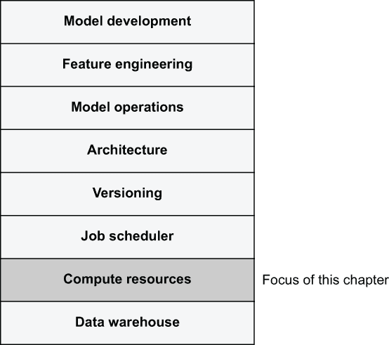

图 4.1 突出显示计算层的科学基础设施堆栈

管理和访问数据是一个如此深入和广泛的话题，我们将其深入讨论推迟到第七章。在本章中，我们专注于堆栈的**计算**层，它回答了一个看似简单的问题：数据科学家定义了一块代码，比如工作流程中的一个步骤，我们应该在哪里执行它？

一个直接的答案，我们在第二章中提到过，是在笔记本电脑或云工作站上执行任务。但是，如果任务对笔记本电脑来说要求过高——比如说需要 64GB 的内存？或者，如果工作流程包括一个 foreach 结构，它启动了 100 个任务？单个工作站没有足够的 CPU 核心来并行运行它们，而顺序运行可能速度太慢。本章提出了一种解决方案：我们可以在个人工作站之外，在基于云的计算层上执行任务。

您有多种方式来实现计算层。确切的选择取决于您的具体需求和用例。我们将介绍一些常见的选择，并讨论您如何选择一个适合您需求的选择。我们将介绍一个简单选项，一个名为*AWS Batch*的托管云服务，以使用 Metaflow 演示计算层的实际应用。在本章奠定基础的基础上，下一章将提供更多动手示例。

基本上，我们关注计算层，因为它允许项目处理更多的计算和数据。换句话说，计算层允许项目更具**可扩展性**。在我们深入探讨计算层的详细技术细节之前，我们首先来探讨可扩展性及其兄弟概念**性能**的含义，以及为什么和何时它们对数据科学项目很重要。正如您将学到的，可扩展性的主题是一个令人惊讶的微妙话题。更好地理解它将帮助您为项目做出正确的技术选择。

从基础设施的角度来看，我们的理想目标是让数据科学家能够有效地解决任何业务问题，而不会因为问题规模的大小而受到限制。许多数据科学家认为，能够利用大量数据和计算资源赋予他们超能力。这种感觉是合理的：使用本章介绍的技术，数据科学家可以用仅仅几十行 Python 代码来利用几十年前需要超级计算机才能提供的计算能力。

任何计算层的缺点是，与笔记本电脑紧密的封闭环境相比，任务可能会以令人惊讶的方式失败。为了提高数据科学家的生产力，我们希望尽可能自动处理尽可能多的错误。当发生无法恢复的错误时，我们希望使调试体验尽可能痛苦。我们将在本章的末尾讨论这个问题。你可以在这个章节找到所有代码列表：[`mng.bz/d2lN`](http://mng.bz/d2lN)。

## 4.1 什么是可扩展性？

*亚历克斯为能够构建第一个训练模型并产生预测的应用感到无比自豪。但鲍伊却有所担忧：随着他们的蛋糕生意有望指数级增长，亚历克斯的 Python 脚本能否处理他们未来可能面临的数据规模？亚历克斯并非可扩展性专家。尽管鲍伊的担忧是可以理解的，但亚历克斯认为他们可能有些过于急切。他们的业务规模还远未达到那种程度。无论如何，如果亚历克斯可以选择，最简单的解决方案就是购买一台足够大的笔记本电脑，以便运行现有的脚本处理更大的数据。亚历克斯宁愿专注于完善模型和更好地理解数据，而不愿花费时间重构现有的脚本。*


在这种情况下，谁的关注更有道理？鲍伊从工程角度来看有合理的担忧：运行在亚历克斯笔记本电脑上的 Python 脚本将无法处理任意大小的数据。亚历克斯的担忧也是合理的：脚本可能适合他们目前的状况，也可能适合近未来的情况。从商业角度来看，可能更合理的是关注结果的质量，而不是规模。

此外，虽然亚历克斯仅通过购买一台更大的笔记本电脑来处理可扩展性的梦想在技术角度来看可能听起来很愚蠢且不切实际，但从生产力的角度来看，这是一个合理的想法。从理论上讲，一台无限大的笔记本电脑将使得无需更改现有代码即可使用，从而让亚历克斯能够专注于数据科学，而不是分布式计算的复杂性。

如果你是哈珀，一位商业领导者，你会站在鲍伊一边，建议亚历克斯重新设计代码以使其可扩展，从而分散亚历克斯对模型的注意力，还是会让亚历克斯专注于改进模型，这可能会导致未来的失败？这并不是一个容易的决定。许多人会说“这取决于。”一个明智的领导者可能会选择一种平衡的方法，使代码仅具有足够可扩展性，以便在不久的将来不会在现实负载下崩溃，并让亚历克斯花剩余的时间确保结果的质量。

找到这样的平衡方法是本节的主要主题。我们希望同时优化数据科学家、业务需求和工程关注点的生产力，强调每个用例相关的维度。我们希望提供通用的基础设施，允许每个应用程序具有实用性，而不是对可扩展性过于教条，找到一个适合他们特定需求的平衡点。

### 4.1.1 堆栈层面的可扩展性

如果你参与过一个涉及要求严格的训练或数据处理步骤的数据科学项目，你很可能会听到或思考过类似“它是否可扩展？”或“它是否足够快？”的问题。在非正式讨论中，术语*可扩展性*和*性能*被互换使用，但实际上它们是独立的问题。让我们从*可扩展性*的定义开始：

可扩展性是指系统通过向系统中添加资源来处理日益增长的工作量的属性。

让我们如下解释这个定义：

1.  可扩展性关乎*增长*。对于具有静态输入的静态系统，讨论其可扩展性是没有意义的。然而，你可以讨论这样一个系统的*性能*——关于这一点我们很快就会讨论。

1.  可扩展性意味着系统必须执行*更多的工作*，例如，处理更多的数据或训练更多的模型。可扩展性不是关于优化固定工作量性能的。

1.  可扩展的系统有效地利用添加到系统中的*额外资源*。如果一个系统能够通过添加一些资源（如更多的计算机或更多的内存）来处理更多的工作，那么这个系统就是可扩展的。

而可扩展性关乎增长，*性能*则关乎系统的能力，独立于增长。例如，我们可以衡量你制作煎蛋卷的性能：你能多快地制作一个，结果的质量如何，或者作为副作用产生了多少浪费？没有单一的衡量性能或可扩展性的标准；你必须定义你感兴趣的维度。

如果你正在构建单个应用，你可以专注于使该特定应用可扩展。当构建基础设施时，你需要考虑不仅如何使单个应用可扩展，而且当不同应用的数量增加时，整个基础设施如何扩展。此外，基础设施还需要支持越来越多的工程师和数据科学家，他们构建这些应用。

因此，当构建有效的基础设施时，我们不仅关注特定算法或工作流的可扩展性。相反，我们希望优化基础设施堆栈所有层的可扩展性。记住我们在第一章中引入的以下四个 Vs：

1.  *规模*—我们希望支持*大量*的数据科学应用。

1.  *速度*—我们希望使原型设计和生产化数据科学应用变得容易且*快速*。

1.  *有效性*—我们希望确保结果有效且一致。

1.  *多样性*—我们希望支持*多种不同类型*的数据科学模型和应用。

几乎所有的 Vs 都与可扩展性或性能相关。*规模*关注的是应用数量的增长，这是最初拥有通用基础设施的动机。*速度*关注的是速度—代码、项目和人的速度，即*性能*。将*有效性*与可扩展性进行对比是一个如此重要的主题，以至于它值得在下一章中单独讨论。最后，*多样性*指的是我们能够使用各种工具处理日益多样化的用例的能力。尽管广告可能试图告诉你，但我们不应该假设存在一个银弹解决方案来解决可扩展性问题。总的来说，不同形式的可扩展性是贯穿本书的基本线索。图 4.2 显示了可扩展性如何触及数据科学基础设施堆栈的所有层。

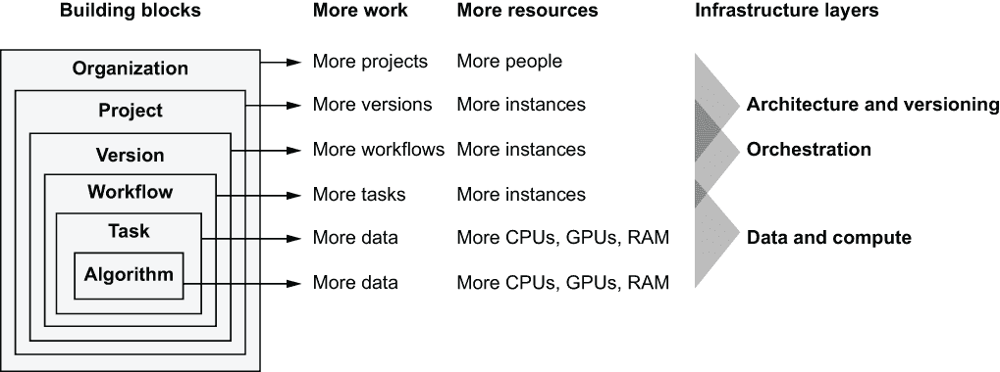

图 4.2 基础设施堆栈中的可扩展性类型

让我们分解这个图。在最左侧的列中，我们有数据科学应用的基本构建块。它们形成一个层次结构：一个算法包含在一个任务中，一个任务包含在一个工作流中，依此类推。这个层次结构扩展了我们在图 3.18 中讨论 Metaflow 时覆盖的层次结构。

这些构建块都可以独立扩展。根据我们的定义，可扩展性涉及两个因素：更多工作和更多资源。更多工作这一列显示了相应的构建块需要处理的工作类型，即其可扩展性的主要维度。更多资源这一列显示了我们可以添加到构建块中的资源。基础设施层这一列显示了管理资源的部分基础设施。按照设计，这些层是协作的，因此它们的责任之间有一些重叠。让我们逐一介绍以下块：

+   在应用程序的核心，通常有一个执行数值优化、训练模型等操作的*算法*。通常，算法由现成的库如 TensorFlow 或 Scikit-Learn 提供。通常，当算法必须处理更多数据时，它需要扩展，但还存在其他可扩展性维度，例如模型的复杂性。现代算法可以有效地使用计算实例上的所有可用资源，包括 CPU 核心、GPU 和 RAM，因此你可以通过增加实例容量来扩展它们。

+   算法不会自行运行。它需要被用户代码调用，例如 Metaflow 任务。任务是一个操作系统级别的进程。为了使其可扩展，你可以使用各种工具和技术（更多内容在第 4.2 节中介绍）来利用实例上的所有 CPU 核心和 RAM。通常，当使用高度优化的算法时，你可以将所有可扩展性关注点外包给算法，而任务可以保持相对简单，就像我们在第 3.3 节中与 Scikit-Learn 所做的那样。

+   数据科学应用程序或工作流程由多个任务组成。实际上，当利用数据并行性时，工作流程可以产生任意数量的任务，例如动态分支，这在第 3.2.3 节中已介绍。为了处理大量并发任务，工作流程可以将工作分散到多个计算实例上。我们将在本章和下一章中练习这些主题。

+   为了鼓励实验，我们应该允许数据科学家测试他们工作流程的多个不同*版本*，可能是在数据或模型架构上略有不同。为了节省时间，能够并行测试这些版本是很方便的。为了处理多个并行工作流程执行，我们需要一个可扩展的工作流程编排器（见第六章）以及许多计算实例。

+   数据科学组织通常同时进行多种数据科学*项目*。每个项目都有自己的业务目标，由定制的流程和版本表示。我们应尽量减少项目之间的干扰。对于每个项目，我们应能够独立选择架构、算法和可扩展性要求。第六章将更详细地探讨版本控制、命名空间和依赖关系管理的问题。

+   对于组织来说，能够通过雇佣更多的人来扩展并行项目的数量是很有吸引力的。重要的是，一个精心设计的基础设施也可以帮助解决这一可扩展性挑战，如后文所述。

总结来说，数据科学项目依赖于两种资源：人和计算。数据科学基础设施的工作是有效地匹配这两者。可扩展性不仅关乎通过更多的计算资源使单个工作流程更快完成，还关乎使更多的人能够参与更多版本和更多项目的工作，即促进实验和创新文化。由于这个重要方面在技术讨论中经常被忽视，我们在深入研究技术细节之前，花了几页篇幅来讨论这个话题。

### 4.1.2 实验室文化

一个现代、有效的数据科学组织鼓励数据科学家相对自由地创新和实验新的方法和替代实现，而不受计算层技术限制的约束。这听起来很好，但为什么在大多数组织中今天这不是现实呢？

随着时间的推移，计算周期的价格大幅下降，部分得益于云计算，而人才的价格却上涨。有效的基础设施可以平衡这种不平衡：我们可以为昂贵的人才提供轻松访问廉价计算资源，以最大化他们的生产力。我们希望以允许组织本身扩展的方式实现访问。

组织规模扩大的一个基本原因是通信开销。对于一组 N 个人相互沟通，他们需要 N²条通信线路。换句话说，通信开销随着人数的增长呈二次方增长。一个经典的解决方案是层级组织，它限制了信息流以避免二次方增长。然而，许多现代、创新的数据科学组织宁愿避免严格的层级和信息瓶颈。

人们为什么需要沟通呢？协调和知识共享是常见的原因。历史上，在许多环境中，访问共享资源，如计算机，需要相当多的协调和知识共享。这种情况在图 4.3 中得到了说明。

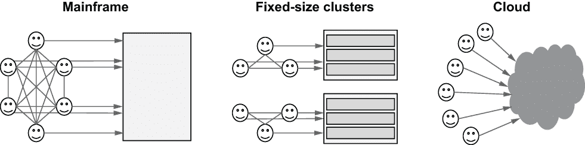

图 4.3 协调对共享计算资源的访问

想象一下，你在 20 世纪 60 年代的一所大学计算机实验室工作。实验室可能只有一台计算机，一台大型*主机*。由于计算能力和存储空间极其有限，你可能需要与所有能够使用计算机的同事协调。相对于同事的数量，通信开销将是二次方的。在这样的环境中，为了保持你的理智，你会积极尝试限制能够访问计算机的人数。

假设你在 2000 年代初在一家中型公司工作。该公司有自己的数据中心，可以根据业务需求和容量规划团队的建议，为不同的团队提供如*固定大小的集群*等计算资源。这种模式显然比主机模型更具可扩展性，因为每个团队可以自行协调对专用资源的访问。缺点是这种模式相当僵化——随着团队需求的增长而增加更多资源可能需要数周甚至数月。

今天，*云*提供了看似无限的计算能力。计算资源不再稀缺。由于范式转变发生得相当快，许多组织仍然将云视为一个固定大小的集群或主机是可以理解的。然而，云允许我们改变这种心态，并完全消除协调开销。

与人类仔细协调彼此之间对共享、稀缺资源的访问相比，我们可以依赖基础设施来促进对计算资源宝库的相对开放访问。我们将在下一节讨论的基于云的计算层，使得以成本效益的方式执行几乎任意数量的计算变得容易。它允许数据科学家自由实验，处理大数据集，而无需不断担心资源过度消耗或干扰同事的工作，这对生产力是一个巨大的福音。

因此，组织可以处理更多的项目，团队可以更有效地进行实验，个人科学家可以从事更大规模的问题。除了更多规模的量化变化之外，云还带来了质的飞跃——我们可以加倍重视*数据科学家自主性*这一理念，正如第 1.3 节所述。不再需要与机器学习工程师、数据工程师和 DevOps 工程师协调工作，单个数据科学家可以独自驱动原型循环和与生产部署的交互。

最小化干扰以最大化可扩展性

为什么过去控制和管理计算资源访问如此关键？一个原因是稀缺。如果任务、工作流程、版本或项目多于系统能够处理的，就需要一些控制。今天，在大多数情况下，云提供了足够的容量，使得这个论点变得无关紧要。

另一个论点是*脆弱性*。如果一个粗心的用户可以破坏系统，那么有一层监督似乎是个好主意。或者，也许系统设计得使得工作负载可以轻易相互干扰。这对于许多今天仍在积极使用的系统来说是一个有效的论点。例如，一个错误的查询可能会影响共享数据库的所有用户。

如果我们想要最大化组织的可扩展性，我们希望最小化人与人之间的通信和协调开销。理想情况下，我们希望消除协调的需求——尤其是当协调是为了避免故障时。作为一个基础设施提供商，我们的目标，至少是理想化的目标，是确保没有任何工作负载能够破坏系统或对其邻居产生不良影响。

由于数据科学工作负载往往具有实验性质，我们无法期望工作负载本身表现得特别良好。相反，我们必须确保它们得到适当的*隔离*，即使它们出现严重故障，它们的*破坏半径*也有限，也就是说，它们通过干扰其他工作负载造成的附带损害最小。

可扩展性技巧 通过隔离最小化工作负载之间的干扰是减少协调需求的一种极好方式。需要的协调越少，系统就越可扩展。

幸运的是，现代云基础设施，特别是容器管理系统，帮助我们相对容易地实现这一点，正如我们将在下一节中学习的那样。隔离的其他关键元素包括版本控制、命名空间和依赖管理，这些内容我们将在第六章中更详细地介绍。

## 4.2 计算层

*与其拥有一个巨大的笔记本电脑，不如有一个设置，让 Alex 能够将任何数量的大小任务抛向基于云的计算环境，该环境会自动扩展以处理任务。Alex 不需要更改代码或关心任何其他细节，除了收集结果。理想情况下，环境应该是 Bowie 只需花费很少的时间来维护。*

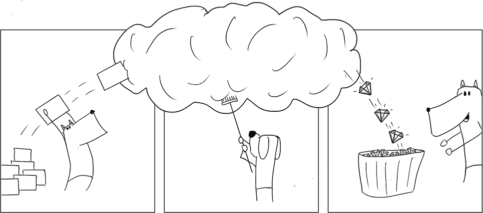

让我们从大局开始。图 4.4 展示了基础设施堆栈的各个层如何参与工作流程执行。我们使用工作流程作为用户界面来定义需要执行的任务，但计算层不必关心工作流程本身——它只关心单个任务。我们将使用工作流程编排器，即我们堆栈中的作业调度层，来确定如何调度单个任务以及何时执行工作流程。关于这一点，我们将在第六章中详细介绍。

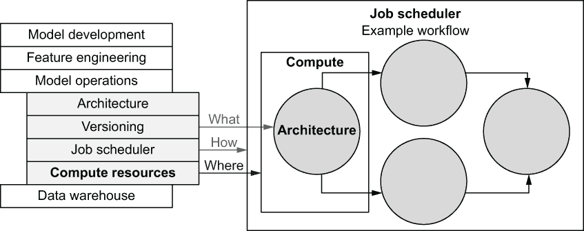

图 4.4 计算层的作用：任务执行的位置

此外，计算层不需要关心正在计算的内容以及为什么需要计算——数据科学家在架构应用时会回答这些问题。这对应于我们基础设施堆栈中的架构层。计算层只需要决定在哪里执行一个任务，换句话说，就是找到足够大的计算机来执行任务。

为了完成其工作，计算层需要提供一个简单的接口：它接受一个任务以及资源需求（任务需要多少 CPU 或多少 RAM），执行它（可能经过延迟后），并允许请求者查询所执行工作的状态。尽管这样做可能看起来很简单，但构建一个健壮的计算层是一个高度非平凡的工程挑战。考虑以下要求：

+   系统需要处理大量并发任务，可能多达数十万或数百万。

+   系统需要管理一个用于执行任务的物理计算机池。理想情况下，物理计算机可以随时添加到或从池中移除，而不会造成任何停机时间。

+   任务有不同的资源需求。系统需要将每个任务匹配到至少有所需资源可用的一台计算机。在规模上高效地进行匹配，或称为“打包”，是一个众所周知的问题。如果你是理论爱好者，你可以搜索“Bin Packing problem”和“Knapsack problem”来了解任务放置的计算复杂度。

+   系统必须预料到任何计算机都可能发生故障，数据中心可能会起火，任何任务可能表现不佳或甚至恶意行为，软件存在缺陷。无论如何，系统在任何情况下都不应该崩溃。

几十个世纪以来，构建满足这些要求的大型系统一直是高性能计算（HPC）的领域。该行业由专门向政府、研究机构和大型公司提供昂贵系统的供应商主导。较小的公司和机构依赖各种自制的解决方案，这些解决方案通常脆弱且维护成本高昂，至少在人力成本方面是这样。

公共云如 AWS 的出现极大地改变了这一领域。如今，只需几点击，你就可以部署一个在相对较新的超级计算机规模上稳健运行的计算层。当然，我们大多数人并不需要超级计算机规模的计算层。云允许我们从一个小型笔记本电脑的容量开始，随着需求的增长，弹性地扩展资源。最好的部分是，你只需为使用的部分付费，这意味着偶尔使用的小型计算层可能比同等大小的物理笔记本电脑更经济。

公共云在很大程度上使我们免于自己处理之前的要求。然而，它们提供的抽象级别——回答“在哪里”执行任务并为我们执行任务的问题——仍然相当低级。为了使计算层对数据科学工作负载有用，需要在云提供的接口之上做出许多架构选择。

不同的系统做出不同的工程权衡。一些优化延迟——即任务启动的速度——一些优化可用的计算机类型，一些优化最大规模，一些优化高可用性，还有一些优化成本。因此，认为存在或将来会有一个单一的通用计算层是不切实际的。

此外，不同的工作流和应用有不同的计算需求，因此对于数据科学基础设施来说，支持从本地笔记本电脑和云工作站到专门用于机器学习和人工智能的 GPU 或其他硬件加速器的集群的计算层选择是有益的。幸运的是，我们可以抽象出很大一部分这种不可避免的多样性。不同的计算层可以遵循下一节中讨论的通用接口和架构。

### 4.2.1 使用容器进行批处理

一个处理开始、接收输入数据、执行一些处理、生成输出并终止的任务的系统被称为执行 *批处理*。从根本上说，我们在这里描述的计算层是一个批处理系统。在我们的工作流范式（如图 4.5 所示）中，工作流中的一个步骤定义了一个或多个作为批处理作业执行的任务。

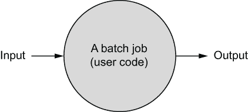

图 4.5 批处理作业，例如，工作流中的一个任务

批处理与流处理

批处理的一个替代方案是 *流处理*，它处理连续的数据流。历史上，绝大多数机器学习系统和需要高性能计算的应用程序都基于批处理：数据进入，进行一些处理，然后输出结果。

在过去十年中，应用复杂性的增加推动了流处理的需求，因为它允许结果以更低的延迟更新，例如，在几秒钟或几分钟内，与通常每小时最多运行一次的批处理作业相比。今天，流行的流处理框架包括 Kafka、Apache Flink 或 Apache Beam。此外，所有主要的公共云提供商都提供流处理即服务，例如 Amazon Kinesis 或 Google Dataflow。

幸运的是，选择不是非此即彼。你可以让应用程序同时使用这两种范式。今天，许多大规模机器学习系统，如 Netflix 的推荐系统，主要基于批处理，其中包含一些流处理，用于需要频繁更新的组件。

批处理作业的主要好处是它们比流处理对应物更容易开发、更容易推理和更容易扩展。因此，除非你的应用程序确实需要流处理，否则从本章讨论的批处理作业工作流开始是合理的。我们将在第八章讨论需要实时预测和/或流处理的更高级用例。

批处理作业由用户定义的任意代码组成。在 Metaflow 的情况下，每个由步骤方法定义的任务都成为一个单独的批处理作业。例如，下一个代码示例中的 train_svm 步骤，复制自列表 3.13，将是一个批处理作业。

列表 4.1 批处理作业示例

```
    @step
    def train_svm(self):
        from sklearn import svm               ❶
        self.model = svm.SVC(kernel='poly')
        self.model.fit(self.train_data, self.train_labels)
        self.next(self.choose_model)
```

❶ 外部依赖

作业调度器将这个片段，我们称之为*用户代码*，发送到计算层进行执行，并在执行完成后继续工作流程的下一步。这很简单！

另一个重要的细节：在这个例子中，用户代码引用了一个外部依赖，即 sklearn 库。如果我们尝试在一个没有安装该库的纯净环境中执行用户代码，代码将无法执行。为了成功执行，批处理作业需要打包用户代码以及代码所需的任何依赖。

今天，将用户代码及其依赖打包成*容器镜像*是很常见的。*容器*是在物理计算机内部提供隔离执行环境的一种方式。在物理计算机内部提供这样的“虚拟计算机”被称为*虚拟化*。虚拟化是有益的，因为它允许我们在单个物理计算机中打包多个任务，同时让每个任务像它们独自占据整个计算机一样运行。如第 4.1.1 节所述，提供这种强大的隔离允许每个用户专注于自己的工作，提高生产力，因为他们不必担心干扰到其他人的工作。

容器为什么很重要？

容器允许我们打包、运输和隔离批处理作业的执行。为了给出一个现实世界的类比，考虑一下容器就像一个物理容器，比如动物笼子。首先，你可以访问一个动物收容所（*容器注册库*），在那里你可以在笼子里找到一个预先打包的野猫（*容器镜像*）。容器包含了一只猫（*用户代码*）以及它的依赖，例如食物（*库*）。接下来，你可以在你的家里（*物理计算机*）部署这个容器（或多个）。由于每只猫都被*容器化*了，它们不会对你的房子或彼此造成损害。如果没有容器化，房子很可能会变成战场。

从计算层的角度来看，提交给系统的用户代码就像野猫。我们不应该假设任何代码都能良好地运行。尽管我们并不认为数据科学家本身是恶意的，但如果他们知道在最坏的情况下，他们只能破坏自己的代码，这会给用户带来极大的实验自由度，并且总体上让人感到安心。系统保证无论发生什么情况，用户都无法干扰生产系统或同事的任务。容器有助于提供这样的保证。图 4.6 总结了这次讨论。

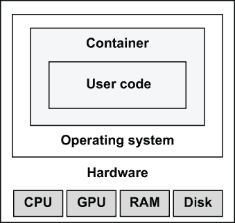

图 4.6 计算实例上的容器

生产力技巧 容器通过授予用户自由进行实验而不必担心意外破坏某些东西或干扰同事的工作来提高生产力。没有容器，一个恶意进程可能会占用任意数量的 CPU 或内存，或者填满磁盘，这可能导致同一实例上相邻但无关的进程失败。计算和数据处理密集型的机器学习过程尤其容易遇到这些问题。

外部框代表一台单独的计算机。计算机提供某些固定的硬件，例如 CPU 核心、可能还有 GPU、RAM（内存）和磁盘。计算机运行一个操作系统，例如 Linux。操作系统提供执行一个或多个隔离容器的机制。在容器内部，它提供了所有必要的依赖项，用户代码被执行。

存在着多种不同的容器格式，但今天，*Docker*是最受欢迎的一个。创建和执行 Docker 容器并不特别困难（如果你好奇，请参阅[`docs.docker.com`](https://docs.docker.com)），但我们不应该假设数据科学家会手动将他们的代码打包成容器。将代码的每个迭代都打包成单独的容器镜像只会减慢他们的原型设计循环，从而损害他们的生产力。

相反，我们可以自动将它们的代码和依赖项容器化，正如 4.3 节中 Metaflow 所展示的。在底层，数据科学基础设施可以利用容器发挥其最大潜力，而无需将技术细节，即容器，直接暴露给用户。数据科学家只需声明他们想要执行的代码（工作流程中的步骤）以及他们所需的依赖项。我们将在第七章详细讨论依赖项管理。

从容器到可扩展的计算层

现在我们已经了解到，我们可以将批处理作业定义为包含用户代码及其依赖项的容器。然而，当涉及到可扩展性和性能时，容器化本身并不会带来任何好处。在你的笔记本电脑上在 Docker 容器内执行一段代码并不比将其作为正常进程执行更快或更可扩展。

*可扩展性*是使计算层有趣的地方。记住可扩展性的定义：一个可扩展的系统能够通过向系统添加资源来处理不断增长的工作量。相应地，如果一个计算层能够通过添加更多的计算机或实例来处理更多的任务，那么它就是可扩展的。这正是基于云的计算层如此吸引人的原因。它们能够根据需求自动增加或减少处理任务的物理计算机数量。图 4.7 说明了在工作流程编排的背景下，可扩展的计算层是如何工作的。

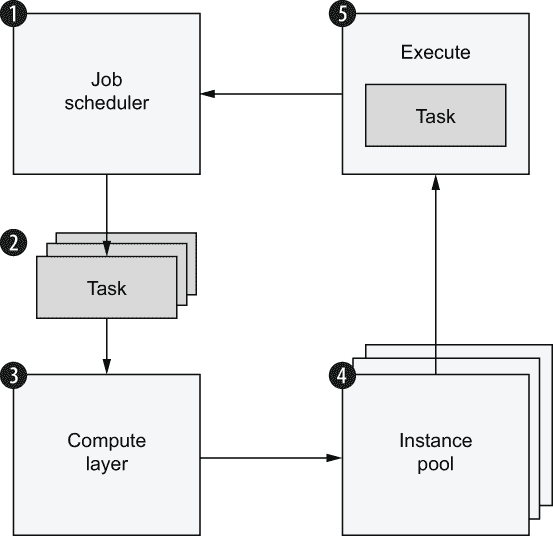

图 4.7 任务调度周期

让我们一步一步地分析这张图：

1.  就像使用 run 命令调用的 Metaflow 内部调度器一样，作业调度器开始执行工作流。它按顺序遍历工作流的步骤。每个步骤产生一个或多个任务，正如我们在第三章中学到的。

1.  调度器将每个任务作为一个独立的批量作业提交给计算层。在 foreach 分支的情况下，可能同时向计算层提交大量任务。

1.  计算层管理一个实例池和一个任务队列。它试图将任务与具有执行任务所需资源的计算机相匹配。

1.  如果计算层发现任务数量远远超过可用资源，它可以决定增加实例池中的实例数量。换句话说，它提供更多的计算机来处理负载。

1.  最终，找到一个合适的实例，可以在其中执行任务。任务在容器中执行。一旦任务完成，调度器就会收到通知，因此它可以继续到工作流程图中的下一个步骤，然后循环重新开始。

注意，计算层可以同时处理来自任何数量工作流的任务。如图所示，计算层获得一个恒定的任务提交流。它执行这些任务，而不关心任务内部做什么，为什么需要执行，或者何时被调度。简单地说，它找到执行任务的位置。

为了使步骤 3-5 发生，计算层内部需要几个组件。图 4.8 显示了典型计算层的高级架构。

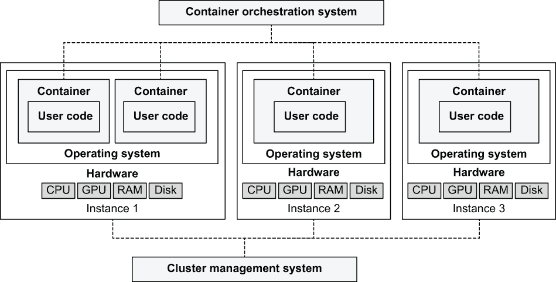

图 4.8 典型计算层的架构

+   在中间，我们有一个实例池。每个实例就像图 4.6 中描述的计算机一样。它们是执行一个或多个并发容器的机器，而这些容器又用于执行用户代码。

+   在底部，描绘了一个称为**集群管理系统**的组件。该系统负责管理实例池。在这种情况下，我们有一个包含三个实例的实例池。集群管理系统根据需求——待处理任务的数量——增加或减少实例池中的实例，或者当检测到实例不健康时，从池中添加或删除实例。请注意，实例不需要具有统一的硬件。一些实例可能有更多的 CPU，一些可能有更多的 GPU，一些可能有更多的 RAM。

+   在顶部，我们有一个**容器编排系统**。它负责维护一个待处理任务的队列，并将任务放置在底层实例上的容器中执行。该系统的任务是根据任务资源需求将任务与底层实例相匹配。例如，如果任务需要一个 GPU，系统需要找到底层池中带有 GPU 的实例，并等待该实例在执行之前的任务后空闲，然后将任务放置在该实例上。

幸运的是，我们不需要从头开始实现容器编排系统或集群管理系统——它们是臭名昭著的复杂软件。相反，我们可以利用云提供商提供的现有经过实战考验的计算层，无论是开源的还是托管服务。我们将在下一节列出此类系统的选择。当你自己评估这些系统时，记住这些图是个好主意，因为它们可以帮助你理解系统在底层是如何工作的，并激励系统做出各种权衡。

### 4.2.2 计算层示例

让我们来看看你可以开始使用的计算层。现在，你已经对这些系统在底层的工作原理有了基本的了解，你可以欣赏到每个系统都针对略微不同的特性进行了优化——没有系统在所有事情上都完美。幸运的是，我们不受单一选择的限制。我们的基础设施堆栈可以为不同的用例提供不同的计算层。

图 4.9 说明了支持多个计算层为何会很有用。如果你不认识图中计算层的名称——Spark、AWS Batch、SageMaker 和 AWS Lambda——请不要担心。我们很快会详细介绍它们。

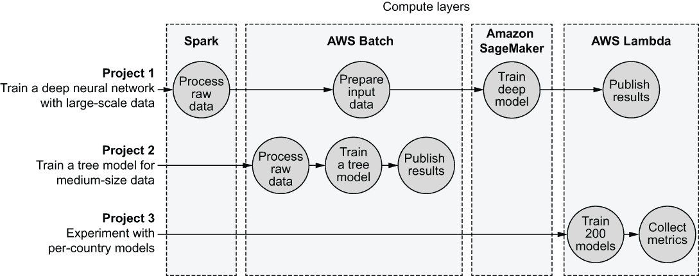

图 4.9 展示了使用多个计算层的流程示例

该图展示了以下三个项目，每个项目都有其自己的工作流程：

+   项目 1 是一个大型、高级项目。它需要处理大量数据，比如 100 GB 的文本语料库，并基于它训练一个大规模的深度神经网络模型。首先，使用针对该任务优化的 Spark 进行大规模数据处理。然后在由 AWS Batch 管理的大型实例上执行额外的数据准备。训练大规模神经网络需要一个针对该任务优化的计算层。我们可以使用 Amazon SageMaker 在 GPU 实例集群上训练模型。最后，我们可以通过在 AWS Lambda 上启动一个轻量级任务来发送模型已准备好的通知。

+   项目 2 使用中等规模的数据集，比如 50 GB，来训练决策树。我们可以使用具有 128 GB RAM 的标准 CPU 实例处理此类规模的数据、训练模型并发布结果。像 AWS Batch 这样的通用计算层可以轻松处理这项工作。

+   项目 3 代表一位数据科学家进行的实验。该项目涉及为世界上每个国家训练一个小型模型。他们不必在笔记本电脑上依次训练 200 个模型，而是可以使用 AWS Lambda 并行化模型训练，从而加快他们的原型设计循环。

如图 4.9 所示，计算层的选取取决于你需要支持的项目类型。从单一、通用的系统如 AWS Batch 开始，随着用例种类的增加，添加更多选项是个好主意。

关键的是，尽管基础设施堆栈可能支持多个计算层，但我们仍然可以限制向用户暴露的复杂性。我们只需用 Python 编写工作流程，在特定计算层的情况下，可能需要使用特定的库。还要记住，我们在第 2.1 节中讨论的两个循环的工效学，即原型设计和生产部署。通常，原型设计需要快速迭代和较少的数据量，而生产部署则强调可扩展性。

如何评估不同计算层的优缺点？你可以关注以下特性：

+   *工作负载支持*—一些系统针对特定类型的工作负载进行了优化，例如大数据处理或管理多个 GPU，而其他系统则是通用的，可以处理任何类型的任务。

+   *延迟*—一些系统试图保证任务以最小的延迟开始。在原型设计阶段，这可能很方便，因为等待几分钟才能启动任务可能会让人感到沮丧。另一方面，启动延迟对夜间计划运行没有影响。

+   *工作负载管理*—当系统接收到的任务数量超过其可以立即部署到实例池的任务时，系统会如何表现？一些系统开始拒绝任务，一些将它们添加到队列中，而一些可能开始终止或*抢占*正在执行的任务，以便更高优先级的任务可以替代它们执行。

+   *成本效益*—如前所述，成本优化的关键杠杆是利用率。一些系统在提高利用率方面更为激进，而其他系统则采取更为宽松的方法。此外，云系统中的计费粒度也各不相同：一些按小时计费，一些按秒计费，甚至有的按毫秒计费。

+   *操作复杂性*—一些系统部署、调试和维护相对简单，而其他系统可能需要持续的监控和维护。

接下来，我们列出了一些计算层的流行选择。这个列表并不全面，但它可以给你一个比较各种选项相对优势的思路。

Kubernetes

Kubernetes（通常简称为 K8S）是目前最受欢迎的开源容器编排系统。它起源于谷歌，谷歌内部已经运营了多年的类似计算层。你可以在私有数据中心部署 K8S，甚至可以在你的笔记本电脑上部署（搜索*Minikube*获取说明），但它通常用作托管云服务，例如 AWS 的弹性 Kubernetes 服务（EKS）。

Kubernetes 是一个极其灵活的系统。将其视为构建您自己的计算层或微服务平台的工具包。灵活性伴随着大量的复杂性。Kubernetes 及其周围的服务发展迅速，因此需要专业知识和努力才能跟上其生态系统。然而，如果您需要一个无限可扩展的自定义计算层的基础，Kubernetes 是一个很好的起点。查看表 4.1 以了解 Kubernetes 的特点。

表 4.1 Kubernetes 的特点

| **工作负载支持** | 通用。 |
| --- | --- |
| **延迟** | K8S 主要是一个容器编排系统。您可以配置它与各种集群管理系统一起工作，这些系统处理可伸缩性。选择对任务的启动延迟有重大影响。 |
| **工作负载管理** | 虽然 K8S 提供的是开箱即用的最小工作负载管理，但您可以使 K8S 与任何工作队列一起工作。 |
| **成本效率** | 可配置的；主要取决于底层集群管理系统。 |
| **操作复杂性** | 高；K8S 的学习曲线陡峭。像 EKS 这样的托管云解决方案使这变得容易一些。 |

AWS Batch

AWS 提供了一系列容器编排系统：ECS（弹性容器服务），它运行在您可以管理的 EC2 实例之上；Fargate，它是一个无服务器编排器（即不需要管理 EC2 实例）；以及 EKS，它使用 Kubernetes 管理容器。AWS Batch 是这些系统之上的一个层，为底层的编排器提供批处理计算能力，特别是任务队列。

AWS Batch 是操作基于云的计算层最简单的解决方案之一。您定义您希望在实例池中拥有的实例类型，称为*计算环境*，以及一个或多个*作业队列*，用于存储待处理任务。之后，您就可以开始向队列提交任务。AWS Batch 负责提供实例、部署容器，并等待它们成功执行。这种简单性的缺点是，AWS Batch 只为更高级的使用案例提供了有限的扩展性和可配置性。您可以在第 4.3 节中了解更多关于 AWS Batch 的信息。查看表 4.2 以了解 AWS Batch 的特点。

表 4.2 AWS Batch 的特点

| **工作负载支持** | 通用。 |
| --- | --- |
| **延迟** | 相对较高；正如其名所示，AWS Batch 是为批处理设计的，假设启动延迟不是主要问题。一个任务可能需要几秒钟到几分钟才能开始。 |
| **工作负载管理** | 包含内置的工作队列。 |
| **成本效率** | 可配置的；您可以使用 AWS Batch 与任何实例类型，无需额外费用。它还支持*spot instances*，比普通的按需 EC2 实例便宜得多。Spot 实例可能会突然终止，但对于可以自动重试的批处理作业来说，这通常不是问题。 |
| **操作复杂性** | 低；相对简单设置，几乎无需维护。 |

AWS Lambda

AWS Lambda 通常被描述为一种 *函数即服务*。您不需要定义服务器或容器，只需定义一段代码，在我们的术语中称为任务，AWS Lambda 就会在触发事件发生时执行该代码，而无需任何用户可见的实例。自 2020 年 12 月以来，AWS Lambda 允许将任务定义为容器镜像，这使得 AWS Lambda 成为计算层的有效选择。

与 AWS Batch 相比，最大的不同之处在于 Lambda 完全不暴露实例池（也称为计算环境）。尽管任务可以请求额外的 CPU 核心和内存，但资源需求的选择范围要小得多。这使得 AWS Lambda 最适合具有适度要求的轻量级任务。例如，您可以在原型设计期间使用 Lambda 快速处理小到中等量的数据。请参阅表 4.3 了解 AWS Lambda 的特性。

表 4.3 AWS Lambda 特性

| **工作负载支持** | 限于相对较短运行时间的轻量级任务。 |
| --- | --- |
| **延迟** | 低；AWS Lambda 针对在 1 秒或更短时间内启动的任务进行了优化。 |
| **工作负载管理** | 在 *异步调用* 模式下，Lambda 包含一个工作队列。与 AWS Batch 的工作队列相比，队列的透明度更低。 |
| **成本效益** | 非常高；按毫秒计费，因此您只需为实际使用的部分付费。 |
| **操作复杂性** | 非常低；设置简单，几乎无需维护。 |

Apache Spark

Apache Spark 是一个流行的开源大数据处理引擎。它与之前列出的服务不同，因为它依赖于特定的编程范式和数据结构来实现可伸缩性。它不适用于执行任意容器。然而，Spark 允许使用基于 JVM 的语言、Python 或 SQL 编写代码，因此只要代码遵循 Spark 范式，就可以用来执行任意代码。您可以在自己的实例上部署 Spark 集群，或者将其用作托管云服务，例如通过 AWS Elastic MapReduce (EMR)。请参阅表 4.4 了解 Apache Spark 的特性。

表 4.4 Apache Spark 特性

| **工作负载支持** | 限于使用 Spark 构造编写的代码。 |
| --- | --- |
| **延迟** | 取决于底层集群管理策略。 |
| **工作负载管理** | 包含内置的工作队列。 |
| **成本效益** | 可配置，取决于集群设置。 |
| **操作复杂性** | 相对较高；Spark 是一个复杂的引擎，需要专业知识来操作和维护。 |

分布式训练平台

虽然可以使用像 Kubernetes 或 AWS Batch 这样的通用计算层来训练大型模型，尤其是在 GPU 实例的支持下，但训练最大的深度神经网络模型，如大规模计算视觉，需要一个专门的计算层。可以使用开源组件构建这样的系统，例如使用名为 *Horovod* 的项目，该项目起源于 Uber，或者 *TensorFlow 分布式训练*，但许多公司可能发现使用 SageMaker 或 Google 的 Cloud TPU 这样的托管云服务更容易。

这些系统针对非常具体的工作负载进行了优化。它们使用大量的 GPU 集群，有时还使用定制硬件，以加快现代神经网络所需的张量或矩阵计算。如果你的用例需要训练大规模神经网络，那么在你的基础设施中拥有这样的系统可能是必要的。参见表 4.5 了解分布式训练平台的特征。

表 4.5 分布式训练平台的特征

| **工作量支持** | 非常有限；优化用于训练大规模模型。 |
| --- | --- |
| **延迟** | 高；优化用于批量处理。 |
| **工作量管理** | 任务特定，不透明的工作量管理。 |
| **成本效率** | 通常非常昂贵。 |
| **操作复杂性** | 相对较高，尽管与本地解决方案相比，云服务在操作和维护方面要容易得多。 |

本地进程

从历史上看，大多数数据科学工作负载都是在个人计算机上执行的，例如在笔记本电脑上。对这一点的现代看法是云工作站，如第 2.1.2 节所述。尽管工作站不是图 4.8 所示的计算层，但它可以用来执行进程和容器，并且对于大多数公司来说，在没有其他系统的情况下，它是第一个支持的计算层。

从计算的角度来看，个人工作站有一个主要优点和一个主要缺点。优点是工作站提供了非常低的延迟，因此有快速的原型设计循环。缺点是它无法扩展。因此，工作站最适合用于原型设计，而所有重负载都转移到其他系统上。参见表 4.6 了解本地进程的特征。

表 4.6 本地进程的特征

| **工作量支持** | 通用。 |
| --- | --- |
| **延迟** | 非常低；进程立即启动。 |
| **工作量管理** | 可配置的，默认无设置。 |
| **成本效率** | 价格低廉，但计算量有限。 |
| **操作复杂性** | 中等；工作站需要维护和调试。为所有用户提供统一的环境可能很困难。 |

比较

随着基础设施支持的使用案例种类的增加，对提供针对特定工作负载优化的计算层的需要也随之增加。作为数据科学基础设施的提供者，您需要评估应该将哪些系统包含在您的堆栈中，何时、如何以及为什么这么做。

为了帮助您完成这项任务，表 4.7 提供了我们所涵盖的系统的主要优缺点的简要总结。一颗星表示系统在特定领域表现不佳，两颗星表示可接受的行为，三颗星表示系统在该任务上表现卓越。

表 4.7 常见计算层的比较

|  | 本地 | Kubernetes | 批量 | Lambda | Spark | 分布式训练 |
| --- | --- | --- | --- | --- | --- | --- |
| **擅长通用计算** |   |  |  |  |  |  |
| **擅长数据处理** |  |  |  |  |  |  |
| **擅长模型训练** |  |  |  |  |  |
| **任务启动迅速** |  |  |  |  |  |  |
| **能够排队大量待处理任务** |  |  |  |  |  |  |
| **经济实惠** |  |  |  |  |  |  |
| **易于部署和操作** |   |  |  |  |  |  |
| **可扩展性** |   |  |  |  |  |  |

不要过于关注个别评估——它们是可以被挑战的。主要的启示信息是没有一个系统可以最优地处理所有工作负载。此外，如果您比较列，您可以看到一些系统在功能上有所重叠（例如，Kubernetes 和 Batch）与那些更互补的系统（例如，Lambda 和 Spark）。

作为一项练习，您可以创建自己版本的表 4.7。将您关心的特性作为行，将您可能考虑使用的系统作为列。练习的结果应该是一套互补的系统，以满足您需要支持的数据科学项目的需求。如果您不确定，以下是一个良好的起点。

技巧规则 提供一个通用计算层，如 Kubernetes 或 AWS Batch，用于重负载处理，以及一个低延迟系统，如本地进程，用于原型设计。根据您的用例需求，使用更多专用系统。

无论您最终选择什么系统，请确保它们可以无缝集成到数据科学家的一致用户体验中。从用户的角度来看，多个系统最初就需要存在是一种麻烦。然而，假装这不是现实往往会导致更多的摩擦和挫败感。

在 4.3 节中，我们将开始动手实践使用 Metaflow 进行计算层和可扩展性。此外，本节还将作为一个示例，说明多个计算层如何在一个统一的用户界面下愉快地共存。

考虑成本

许多公司都担心使用基于云的计算层的成本。当涉及到成本优化时，一个关键的观察结果是闲置实例的成本与执行工作的实例的成本相同。因此，降低成本的关键杠杆是最大化利用率，即用于有用工作的时段比例。我们定义利用率为用于执行任务的总体运行时间的百分比，如图所示：

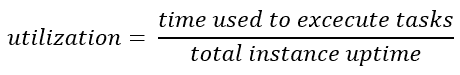

现在，假设我们无法影响任务执行所需的时间，当用于执行任务的时间等于总实例运行时间时，我们达到最小成本，即我们达到 100%的利用率。在实践中，典型计算层的利用率远低于 100%。特别是，老式数据中心可能只有 10%或更低的利用率。您可以通过以下两种方式提高利用率：

+   您可以通过在任务完成时立即关闭实例来最小化*总实例运行时间*。

+   您可以通过尽可能多地与项目和工作流程共享实例来最大化*用于执行任务的时间*，这样实例在运行期间就不会因工作耗尽而停止。

您可以使用本节中描述的计算层来实现这两个目标。首先，当云实例自动完成工作后，关闭它们很容易，因此您只需为需要执行的精确任务集付费。其次，由于虚拟化和容器化提供的强大隔离保证，您可以安全地与多个团队共享相同的实例。这增加了提交给计算层的任务数量，从而提高了利用率。

值得注意的是，在大多数情况下，数据科学家的每小时成本远高于实例的成本。通过使用更多实例小时来节省数据科学家的时间的机会通常都是值得的。例如，使用原始、低效的代码进行实验可能更经济，因为这样需要更多的实例小时，而不是花费许多天或几周手动优化代码。

## 4.3 Metaflow 中的计算层

*每次 Alex 执行模型训练步骤时，他的笔记本电脑听起来就像喷气式发动机。与其购买降噪耳机，不如利用云来处理计算密集型任务似乎是个明智的选择。Bowie 帮助 Alex 配置 Metaflow 以使用 AWS Batch 作为计算层，这使得 Alex 可以在本地原型化工作流程，并只需点击一下按钮即可在云中执行它们。对 Alex 来说，这感觉就像是一种无声的超能力！*

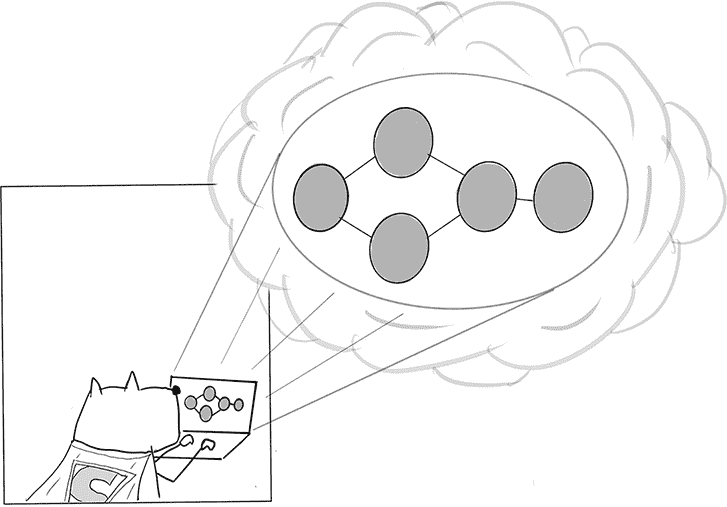

Metaflow 支持可插拔的计算层。例如，您可以在本地执行轻量级任务，但将重型数据处理和模型训练卸载到基于云的计算层。或者，如果您的公司已经有一个像 Kubernetes 这样的现有容器管理系统，您可以使用它作为集中的计算层，而不是必须为数据科学运行一个单独的系统。

默认情况下，Metaflow 使用运行在您个人工作站上的本地进程作为计算层。这对于快速原型设计来说很方便。为了展示本地进程在实际中的工作方式，请查看下一个列表。

列表 4.2 本地进程作为计算层

```
from metaflow import FlowSpec, step
import os

global_value = 5                    ❶

class ProcessDemoFlow(FlowSpec):

    @step
    def start(self):
        global global_value         ❷
        global_value = 9            ❷
        print('process ID is', os.getpid())
        print('global_value is', global_value)
        self.next(self.end)

    @step
    def end(self):
        print('process ID is', os.getpid())
        print('global_value is', global_value)

if __name__ == '__main__':
    ProcessDemoFlow()
```

❶ 初始化全局变量

❷ 修改全局变量的值

将代码保存到 process_demo.py。在这里，global_value 被初始化为模块级全局变量。其值在起始步骤从 5 变为 9。在结束步骤再次打印值。你能猜到结束步骤打印的值是 5 还是 9 吗？执行以下代码来测试它：

```
# python process_demo.py run
```

预期地，起始步骤的值是 9。结束步骤的值是 5。如果起始和结束是按顺序执行的普通 Python 函数，值将保持为 9。然而，Metaflow 将每个任务作为一个单独的本地进程执行，因此 global_value 的值在每个任务开始时重置为 5。如果您想在任务之间持久化更改，您应该将 global_value 作为 self 中的数据工件存储，而不是依赖于模块级变量。您还可以看到，两个任务的进程 ID 是不同的，如果任务由同一个 Python 进程执行，这种情况是不会发生的。将 Metaflow 任务作为独立的计算单元执行对于计算层很重要。

注意 Metaflow 任务是可以执行在各种计算层上的隔离的计算单元。单个工作流程可以将任务分发给许多不同的计算层，使用最适合每个任务的系统。

Metaflow 的计算方法基于以下三个关于数据科学通用基础设施本质的假设：

+   *基础设施需要支持各种具有不同计算需求的项目*。有些需要单个实例上的大量内存，有些需要许多小型实例，还有些需要像 GPU 这样的专用硬件。没有一种适合所有计算需求的一劳永逸的方法。

+   *单个项目或工作流程在计算方面的需求是变化的*。数据处理步骤可能是 I/O 密集型的，可能需要大量的内存。模型训练可能需要专用硬件。小的协调步骤应该快速执行。虽然技术上可以在最大的实例上运行整个工作流程，但在许多情况下，这可能会成本过高。更好的做法是给用户一个选项，可以*单独调整每个步骤的资源需求*。

+   *项目在其生命周期中的需求是变化的*。使用本地进程快速原型化第一个版本是方便的。在此之后，您应该能够使用更多的计算资源来测试工作流程。最后，生产版本应该是既健壮又可扩展的。在项目的生命周期中，您可以根据延迟、可扩展性和可靠性在不同阶段做出不同的权衡。

接下来，我们将展示如何使用本地进程和 AWS Batch 设置这种工作方式的基础设施。

### 4.3.1 为 Metaflow 配置 AWS Batch

AWS Batch 为需要执行计算单元（作业）到完成且无需用户干预的使用场景提供了一个方便的抽象。在底层，AWS Batch 是一个相对简单的作业队列，将计算资源的管理工作卸载给其他 AWS 服务。

您可以在 Metaflow 的在线文档中找到 AWS Batch 的逐步安装说明（请参阅[metaflow.org](https://metaflow.org/)上的 Metaflow 管理员指南）。您可以使用提供的*CloudFormation*模板，只需点击一下按钮即可为您设置一切，或者如果您想自己设置，可能还会在设置过程中进行自定义，可以遵循手动安装说明。

在您为 Metaflow 配置了 AWS Batch 之后，数据科学家可以像下一节所描述的那样直接使用它，无需担心实现细节。然而，对于系统的操作者来说，了解高级架构是有益的，如图 4.10 所示。

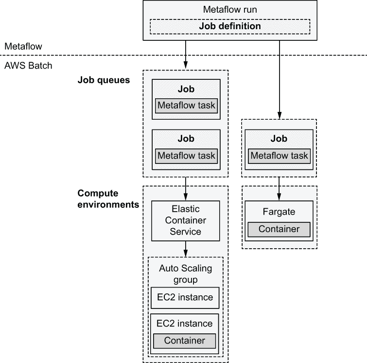

图 4.10 AWS Batch 的架构

让我们从以下四个概念开始，这些概念在 AWS Batch 的文档中经常被提及，如图 4.10 所示加粗显示：

+   *作业定义*——配置作业的执行环境：CPU、内存、环境变量等。Metaflow 会自动为每个步骤创建合适的作业定义，因此您无需担心这一点。

+   *作业*——单个计算单元。每个作业作为一个独立的容器执行。Metaflow 会自动将每个 Metaflow 任务映射到单个 Batch 作业。因此，在 AWS Batch 的上下文中，我们可以互换地谈论任务和作业。

+   *作业队列*—作业被发送到作业队列等待执行。一个队列可能有任何数量的待处理任务。你可以设置多个队列，例如，区分低优先级和高优先级作业。图示展示了两个队列：一个有两个作业，另一个有一个作业。

+   *计算环境*—一个执行作业的计算资源池。AWS Batch 可以为你管理计算环境，当队列变长时，向环境中添加更多计算资源，或者你可以自行管理计算环境。得益于自动扩展的计算环境，AWS Batch 可以用作弹性扩展的计算层。图示展示了两个计算环境：一个使用 EC2 实例，另一个使用 Fargate。更详细的讨论将在后面进行。

当你启动一个使用 AWS Batch 的 Metaflow 运行时，执行过程如下：

1.  在开始任何任务之前，Metaflow 确保在 Batch 上创建了正确的作业定义。

1.  Metaflow 创建一个包含与流程对应的全部 Python 代码的 *作业包*。该包被上传到 AWS S3 中的数据存储（关于作业包的更多信息请参阅第七章）。

1.  Metaflow 遍历 DAG。当它遇到应在 Batch 上执行的任务时，它会向预先配置的作业队列提交一个作业请求。

1.  如果计算环境中没有足够的计算资源，并且尚未达到其最大限制，Batch 会扩展环境。

1.  一旦资源可用，Batch 会为执行安排一个作业。

1.  包含在 Batch 作业中的 Metaflow 任务在容器中执行。

1.  Metaflow 检查任务的状况。一旦 Batch 报告任务已成功完成，Metaflow 继续执行后续任务，回到步骤 3，直到完成最后一步。

选择计算环境

如果你让 AWS Batch 为你管理计算环境，它将使用 AWS 提供的容器管理服务，如 *弹性容器服务*（ECS）来执行容器。在幕后，ECS 使用一个托管自动扩展组启动 EC2 计算实例，这是一个可以根据需求自动增长和缩小的实例集合。这些实例将像你账户中的任何其他实例一样出现在 EC2 控制台中。

使用 ECS 的好处是，你可以在计算环境中使用任何 EC2 实例类型。你可以选择具有大量内存、许多 CPU 核心或甚至多个 GPU 的实例集合。ECS 会根据其资源需求，在最适合的实例上安排作业。

或者，您可以选择使用 *AWS Fargate* 作为计算环境。Fargate 不直接使用 EC2 实例，因此您在 EC2 仪表板上看不到任何实例。此外，您也不能直接选择实例类型。Fargate 会根据每个作业的资源需求自动找到合适的实例。然而，与 ECS 相比，支持的资源需求范围更为有限。Fargate 相比 ECS 的最大优势是作业启动更快。

作为另一种选择，您可以在 ECS 后面管理自己的 *EC2 实例池*。虽然这种方法更为繁琐，但它允许最大程度的可定制性。您可以按自己的意愿设置实例。如果您的安全或合规性要求特殊，这种方法可能很有用。

从 Metaflow 任务的视角来看，计算环境并没有任何区别。一旦为任务找到合适的实例，它就会使用相同的容器镜像在容器中执行，无论环境如何。如本章前面所述，计算层仅决定任务执行的 *位置*。

最后，对于注重成本的公司来说，这是一个好消息：您使用 AWS Batch 的实例无需支付任何额外费用。您只需支付您选择的 EC2 实例的每秒费用，这使得 AWS Batch 成为最具成本效益的计算层之一。您还可以通过使用 *Spot 实例* 进一步降低成本，这些实例与 EC2 实例相同，但有一个前提，即它们可能在任何时间点被中断。这并不像听起来那么糟糕——Metaflow 可以使用 @retry 装饰器自动重试中断的作业（请参阅第 4.4 节）。主要成本是在发生中断时执行时间的额外延迟。

配置容器

虽然计算环境决定了如何为作业提供硬件资源，如 CPU 和内存，但容器设置决定了 Metaflow 任务的软件环境。请注意以下两个设置。

首先，您必须配置安全配置文件，即 *IAM 角色*，它决定了 Metaflow 任务允许访问哪些 AWS 资源。至少，它们需要能够访问用作 Metaflow 数据存储的 S3 存储桶。如果您使用 AWS Step Functions 进行作业调度，如第六章所述，您还必须允许访问 DynamoDB 表。如果您使用提供的 CloudFormation 模板，将为您自动创建合适的 IAM 角色。

其次，您可以配置用于执行任务的 *默认容器镜像*。该镜像决定了任务默认可用的库。例如，如果您已如第二章所述设置了基于云的工作站，您可以为工作站和任务执行使用相同的镜像（您将在第六章中了解更多关于依赖关系管理的知识）。如果您未指定任何镜像，Metaflow 将选择一个通用的 Python 镜像。

使用 AWS Batch 的第一次运行

要使用 AWS Batch 与 Metaflow，你需要完成以下步骤。这些步骤由提供的 CloudFormation 模板自动执行，但手动完成它们并不困难。请参阅 Metaflow 的在线文档以获取详细说明。

首先，按照以下步骤安装和配置 awscli，这是一个用于与 AWS 交互的命令行工具：

```
# pip install awscli
# aws configure
```

如果你没有使用 CloudFormation 模板，但想手动配置 AWS Batch，请执行以下步骤：

1.  为 Metaflow 数据存储初始化一个 S3 存储桶。

1.  为计算环境设置一个 VPC 网络。

1.  设置一个批处理作业队列。

1.  设置一个批处理计算环境。

1.  为容器设置一个 IAM 角色。

在你执行了 CloudFormation 模板或之前的手动步骤之后，运行 metaflow configure aws 来配置 Metaflow 的服务。这就完成了！

完成这些步骤后，让我们测试一下集成是否正常工作。执行以下命令，它使用 AWS Batch 运行列表 4.2 中的 process_demo.py：

```
# python process_demo.py run --with batch
```

命令应该生成如下所示的输出：

```
[5c8009d0-4b48-40b1-b4f6-79f6940a6b9c] Task is starting (status SUBMITTED)...
[5c8009d0-4b48-40b1-b4f6-79f6940a6b9c] Task is starting (status RUNNABLE)...
[5c8009d0-4b48-40b1-b4f6-79f6940a6b9c] Task is starting (status STARTING)...
[5c8009d0-4b48-40b1-b4f6-79f6940a6b9c] Task is starting (status RUNNING)...
[5c8009d0-4b48-40b1-b4f6-79f6940a6b9c] Setting up task environment.
```

示例省略了 Metaflow 每行的标准前缀以节省空间。方括号中的长 ID 是 AWS Batch 作业 ID，对应于 Metaflow 任务。你可以用它来在 AWS 控制台 UI 中交叉引用可见的 Metaflow 任务和 AWS Batch 作业。

前四条“任务正在启动”的行指示了任务在批处理队列中的状态如下：

+   *已提交*——任务正在进入队列。

+   *可运行*——任务在队列中等待，等待合适的实例变得可用。

+   *开始*——找到了合适的实例，任务正在该实例上启动。

+   *正在运行*——任务正在实例上运行。

当 AWS Batch 扩展计算环境时，任务通常会保持在可运行状态长达几分钟。如果计算环境已达到其最大大小，任务需要等待之前任务完成，这可能会更长。

几分钟后，运行应该成功完成。其输出应该与本地运行类似。尽管这次运行看起来并不起眼——使用 AWS Batch 的运行比本地运行慢，因为云中启动任务的开销——你现在几乎拥有无限的计算能力！我们将在下一节中利用这种能力，甚至在下一章中还会更多。

排查可运行任务

AWS Batch 无法正常工作的一个常见症状是任务似乎永远卡在可运行状态。这可能是由于与计算环境（CE）相关的一系列原因造成的。

如果你正在使用由 EC2 支持的计算环境（非 Fargate），你可以通过登录到 EC2 控制台并搜索以 aws:autoscaling:groupName:开头后跟 CE 名称的标签来检查在 CE 中创建了哪些实例。根据返回的实例列表，你可以按以下方式排查问题：

+   *没有实例*—如果没有返回实例，可能是因为你的 CE 无法启动所需类型的实例。例如，你的 AWS 账户可能已经达到 EC2 实例的限制。你可能可以通过检查以 CTE 命名的自动扩展组的状态来了解为什么没有实例。

+   *一些实例但无其他任务运行*—可能你的任务请求的资源，例如，使用稍后讨论的 @resources 装饰器，无法由 CE 满足，例如内存或 GPU。在这种情况下，任务将永远停留在队列中。你可以在 AWS Batch 控制台中终止任务（作业）。

+   *一些实例和其他正在运行的任务*—你的集群可能正忙于处理其他任务。请先等待其他任务完成。

如果问题仍然存在，你可以联系 Metaflow 的在线支持。

### 4.3.2 @batch 和 @resources 装饰器

现在你已经配置了 AWS Batch，你可以选择仅通过使用 run --with batch 在云中执行任何运行。Metaflow 的所有功能，如工件、实验跟踪、参数和客户端 API，在作为计算层使用 AWS Batch 时与之前完全相同。

如本章开头所述，拥有基于云的计算层的主要动机是可扩展性：你可以处理比在本地工作站上更多的计算和更多的数据。让我们在实践中测试可扩展性。下面的代码列表展示了一个尝试通过创建包含八十亿个字符的字符串来分配 8 GB 内存的工作流程。

列表 4.3 使用大量内存的工作流程

```
from metaflow import FlowSpec, step

LENGTH = 8_000_000_000                    ❶

class LongStringFlow(FlowSpec):

    @step
    def start(self):
        long_string = b'x' * LENGTH       ❷
        print("lots of memory consumed!")
        self.next(self.end)

    @step
    def end(self):
        print('done!')

if __name__ == '__main__':
    LongStringFlow()
```

❶ 将长度设置为八十亿个字符。下划线被添加以帮助阅读。

❷ 尝试分配 8 GB 的内存

将代码保存在 long_string.py 中。如果你的工作站上至少有 8 GB 的内存可用，你可以通过以下方式在本地运行流程：

```
# python long_string.py run
```

如果没有足够的内存，运行可能会因 MemoryError 而失败。接下来，让我们按照以下方式在 Batch 上执行流程：

```
# python long_string.py run --with batch
```

Metaflow 使用默认的内存设置在 Batch 上执行任务，这些设置为任务提供的内存少于 8 GB。任务可能会失败，并显示如下消息：

```
AWS Batch error:
OutOfMemoryError: Container killed due to memory usage This could be a transient error. Use @retry to retry.
```

虽然你无法像在笔记本电脑上那样轻松增加工作站上的内存量，但我们可以从我们的计算层请求更多的内存。按照以下方式重新运行流程：

```
# python long_string.py run --with batch:memory=10000
```

memory=10000 属性指示 Metaflow 为流程的每个步骤请求 10 GB 的内存。内存的单位是兆字节，所以 10,000 MB 等于 10 GB。请注意，如果你的计算环境不提供至少 10 GB 内存实例，运行将卡在 RUNNABLE 状态。假设可以找到合适的实例，运行应该可以成功完成。

这就是垂直扩展的实际应用！我们只需在命令行中请求具有特定硬件要求的实例。除了内存外，您还可以使用 cpu 属性请求最小数量的 CPU 核心，甚至可以使用 gpu 属性请求 GPU。例如，下面的命令行代码为每个任务提供了 8 个 CPU 核心和 8GB 的内存：

```
# python long_string.py run --with batch:memory=8000,cpu=8
```

由于数据科学工作负载往往对资源需求很大，能够轻松地测试代码和扩展工作负载非常方便。您可以在计算环境中请求 EC2 实例支持的任何内存量。截至本书编写时，最大的实例有 768GB 的内存，因此，在合适的计算环境中，您可以请求高达--with batch:memory=760000 的内存，为实例上的操作系统留下 8GB。

您可以使用这么多内存处理相当大的数据集。如果您担心成本，请考虑函数执行时间不到一分钟。即使您在最大且最昂贵的实例上执行任务，成本也只有大约 10 美分，这得益于按秒计费。您可以通过在计算环境中使用之前讨论过的 spot 实例来进一步降低成本。

在代码中指定资源需求

假设您与同事共享 long_string.py。按照之前的做法，他们需要知道特定的命令行代码，即 run --with batch: memory=10000，才能成功运行流程。我们知道内存量是一个严格的要求——没有至少 8GB 的内存，流程将无法成功——因此我们可以在代码中直接添加要求，通过添加

```
@batch(memory=10000)
```

上述@step 的起始步骤。请记住，在文件顶部添加 from metaflow import batch。

现在，您的同事可以使用运行命令来运行流程，而无需任何额外选项。作为额外的好处，只有用@batch 装饰器注解的起始步骤在 AWS Batch 上执行，而无需任何资源要求的结束步骤则在本地上执行。这说明了您如何在单个工作流程中无缝地使用多个计算层。

注意：--with 选项是分配装饰器（如 batch）的快捷方式，就像在飞行中添加@batch 装饰器一样。因此，run --with batch 相当于手动将@batch 装饰器添加到流程的每个步骤并执行 run。相应地，在冒号之后添加的任何属性，如 batch:memory=10000，将映射到装饰器提供的参数，如@batch(memory=10000)。

现在假设你公开了一个带有 @batch 注解的 long_string.py 版本。一个陌生人想要执行这段代码，但他们的计算层是 Kubernetes，而不是 AWS Batch。技术上，他们应该能够在 Kubernetes 提供的 10 GB 实例上成功执行流程。对于这种情况，Metaflow 提供了另一个装饰器，@resources，它允许你以计算层无关的方式指定资源需求。你可以用以下方式替换 @batch 装饰器：

```
@resources(memory=1000)
```

然而，与 @batch 相比，@resources 装饰器并不确定使用哪个计算层。如果你不带选项运行流程，它将在本地执行，并且 @resources 没有作用。要使用 AWS Batch 运行流程，你可以使用 run --with batch 而不带任何属性。@batch 装饰器知道从 @resources 中选择资源需求。相应地，陌生人可以使用类似于 run --with kubernetes 的方式在他们自己的 Kubernetes 集群上运行流程。

将具有高资源需求的步骤用 @resources 注解被认为是最佳实践。如果步骤代码没有一定数量的内存就无法成功执行，或者，例如，没有一定数量的 CPU 或 GPU 内核，模型训练步骤就无法快速执行，你应该在代码中明确要求。一般来说，当可能时，使用 @resources 而不是 @batch 或其他计算层特定的装饰器更可取，这样任何运行流程的人都可以动态选择合适的计算层。

我们将在下一章中通过使用 @resources 和 AWS Batch 的更多例子来探讨可扩展性。然而，在到达那里之前，我们将涵盖生活中不可避免的事实：意外会发生，事情并不总是按预期进行。

## 4.4 处理失败

*有一天，Caveman Cupcakes 的基于云的计算环境开始出现异常行为。Alex 那些已经完美运行了几周的作业开始无缘无故地失败。Bowie 注意到云提供商的状态仪表板报告了“错误率增加。”Alex 和 Bowie 除了等待云自行修复并尝试将影响限制在他们的生产工作流程中之外，别无他法。*

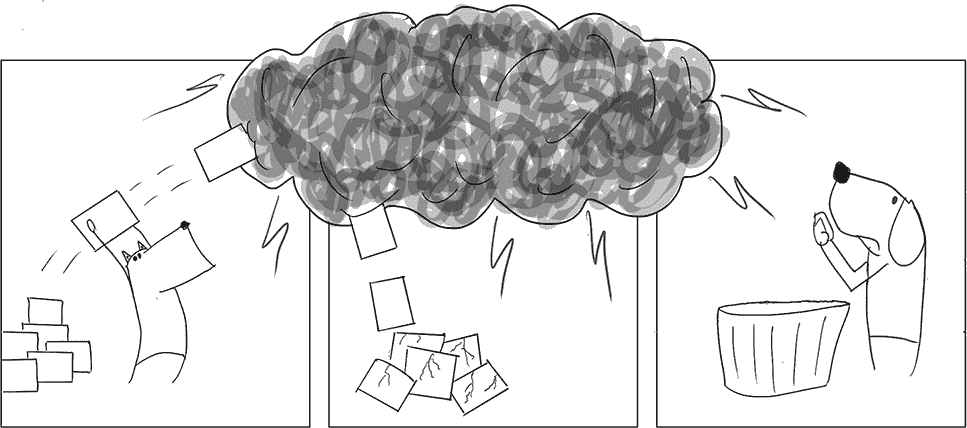

Alex 和 Bowie 的场景几乎不是假设性的。尽管云提供了一种相当实用的无限可扩展性的错觉，但它并不总是完美无缺。云中的错误往往具有随机性，因此并发作业的数量越多，你遇到随机瞬时错误的可能性就越大。因为这些错误是生活中不可避免的事实，我们应该做好积极应对的准备。区分两种类型的失败是有用的，如下所示：

1.  *用户代码中的失败*——步骤中的用户编写的代码可能包含错误，或者它可能调用其他表现错误的服务。

1.  *平台错误*——执行步骤代码的计算层可能会因多种原因而失败，例如硬件故障、网络故障或配置的意外更改。

发生在用户代码中的故障，如失败的数据库连接，通常可以在用户代码内部处理，这区分了第一类错误和第二类错误。在你的 Python 代码中，你无法从底层容器管理系统失败等情况中恢复。考虑下一个代码列表中展示的示例。

列表 4.4 由于除以零而失败

```
from metaflow import FlowSpec, step

class DivideByZeroFlow(FlowSpec):

    @step
    def start(self):
        self.divisors = [0, 1, 2]
        self.next(self.divide, foreach='divisors')

    @step
    def divide(self):
        self.res = 10 / self.input    ❶
        self.next(self.join)

    @step
    def join(self, inputs):
        self.results = [inp.res for inp in inputs]
        print('results', self.results)
        self.next(self.end)

    @step
    def end(self):
        print('done!')

if __name__ == '__main__':
    DivideByZeroFlow()
```

❶ 这将因 ZeroDivisionError 而失败。

将流程保存在 zerodiv.py 中，并按以下方式运行：

```
# python zerodiv.py run
```

运行将失败并抛出异常，ZeroDivisionError: 除以零。这显然是用户代码中的逻辑错误——在数值算法中，意外的除以零错误相当常见。如果我们怀疑某段代码可能会失败，我们可以使用 Python 的标准异常处理机制来处理它。按照以下方式修复除法步骤：

```
    @step
    def divide(self):
        try:
            self.res = 10 / self.input
        except:
            self.res = None
        self.next(self.join)
```

修复后，流程将成功运行。遵循这个模式，建议尽可能在步骤代码中处理尽可能多的异常，以下是一些原因：

1.  如果你编写代码时考虑了可能的错误路径，你也可以实现错误恢复路径，例如，当 ZeroDivisionError 被抛出时，应该确切发生什么。你可以将“计划 B”作为你逻辑的一部分实现，因为只有你知道在你特定的应用程序中正确的行动方案。

1.  从用户代码中的错误中恢复更快。例如，如果你在步骤中调用外部服务，如数据库，你可以实现重试逻辑（或依赖数据库客户端的内置逻辑），在不需要重试整个 Metaflow 任务的情况下重试失败的连接，这会带来更高的开销。

即使你遵循这些建议，任务仍然可能会失败。它们可能因为未考虑到的错误场景而失败，或者可能因为平台错误而失败，例如，数据中心可能发生火灾。Metaflow 提供了额外的错误处理层，可以帮助处理这些场景。

### 4.4.1 使用 @retry 从短暂错误中恢复

列表 4.4 中展示的流程每次执行都会可预测地失败。大多数平台错误和一些用户代码中的错误行为更为随机——例如，AWS Batch 可能会调度一个任务在硬件故障的实例上执行。计算环境最终会检测到硬件故障并退役该实例，但这可能需要几分钟。最好的做法是自动重试任务。有很大可能性它不会再次遇到相同的短暂错误。以下列表模拟了一个不幸的短暂错误：每隔一秒就会失败一次。

列表 4.5 重试装饰器

```
from metaflow import FlowSpec, step, retry

class RetryFlow(FlowSpec):

    @retry
    @step
    def start(self):
        import time
        if int(time.time()) % 2 == 0:      ❶
            raise Exception("Bad luck!")
        else:
            print("Lucky you!")
        self.next(self.end)

    @step
    def end(self):
        print("Phew!")

if __name__ == '__main__':
    RetryFlow()
```

❶ 条件为真，取决于执行该行的第二个时刻。

将流程保存在 retryflow.py 中，并按以下方式运行：

```
# python retryflow.py run
```

当执行遇到“Bad luck”分支时，你应该会看到一堆异常被打印出来。多亏了 @retry 标志，任何在起始步骤中的失败都会导致它自动重试。执行最终成功的可能性很大。你可以多次重新运行流程以查看效果。

@retry 的一个关键特性是它还处理平台错误。例如，如果容器在 AWS Batch 中由于任何原因失败，包括数据中心着火，@retry 装饰器将导致任务重试。多亏了云的复杂性，重试的任务有很大机会被重新路由到一个非燃烧的数据中心，并最终成功。

注意，当你开始在工作站上启动运行时，只有当工作站在整个执行过程中保持存活时，运行才会成功。@retry 装饰器的重试机制是由 DAG 调度器实现的，在本地运行的情况下是 Metaflow 的内置调度器。如果调度器本身死亡，它将把所有执行都带走，这对于业务关键的生产运行来说是不理想的。解决这个缺点是第六章的关键主题，该章专注于生产部署。我们将学习如何使调度本身能够容忍平台错误。

逃离燃烧的数据中心

即使数据中心着火，任务如何还能成功？AWS 有一个概念叫做可用区（AZ），它们是物理上分离的数据中心，限制了任何现实世界灾难的影响范围。在 AWS Batch 的情况下，计算环境可以透明地在多个 AZ 上启动实例，所以当一个 AZ 中的实例不可用时，另一个 AZ 中的实例可以接管。

选择性地避免重试

你可能会 wonder 为什么用户需要担心 @retry 装饰器——Metaflow 不能自动重试所有任务吗？一个挑战是步骤可能有副作用。想象一下一个步骤，比如在数据库中增加一个值，例如，银行账户的余额。如果该步骤在增加操作后崩溃并被自动重试，银行账户就会被借记两次。

如果你有一个不应该重试的步骤，你可以用装饰器 @retry(times=0) 来注释它。现在，任何人都可以通过简单地执行

```
# python retryflow.py run --with retry
```

这将为每个步骤添加一个 @retry 装饰器，但带有 @retry(times=0) 的步骤将不会重试。你还可以使用 times 属性来调整重试次数，使其高于默认值。此外，你可以指定另一个属性，minutes_between_retries，它告诉调度器在重试之间等待指定数量的分钟数。

建议：无论何时你在云中运行流程，例如使用 AWS Batch，运行它时带上 --with retry 是一个好主意，它会自动处理瞬态错误。如果你的代码不应该重试，请用 @retry(times=0) 来注释它。

### 4.4.2 使用 @timeout 杀死僵尸

并非所有错误都表现为异常或崩溃。一类特别令人烦恼的错误会导致任务卡住，阻止工作流程的执行。在机器学习中，这种情况可能发生在与特定数据集缓慢收敛的数值优化算法中。或者，你可能调用一个永远不会返回正确响应的外部服务，导致函数调用永远阻塞。

你可以使用@timeout 装饰器来限制任务的总体执行时间。下面的列表模拟了一个偶尔需要很长时间才能完成的任务。当这种情况发生时，任务会被中断并重试。

列表 4.6 超时装饰器

```
from metaflow import FlowSpec, timeout, step, retry
import time

class TimeoutFlow(FlowSpec):

    @retry
    @timeout(seconds=5)                             ❶
    @step
    def start(self):
        for i in range(int(time.time() % 10)):      ❷
            print(i)    #B
            time.sleep(1)    #B
        self.next(self.end)

    @step
    def end(self):
        print('success!')

if __name__ == '__main__':
    TimeoutFlow()
```

❶ 任务将在 5 秒后超时。

❷ 这段代码的执行时间从 0 到 9 秒不等。

将流程保存在 timeoutflow.py 中，并按以下方式运行：

```
# python timeoutflow.py run
```

如果你运气好，运行可能第一次尝试就成功。你可以再次尝试，看看@timeout 和@retry 是如何工作的。启动任务在 5 秒后中断。当这种情况发生时，@retry 会负责重试该步骤。如果没有@retry，当发生超时时，运行会崩溃。除了秒数，你还可以将超时值设置为分钟或小时，或者它们的组合。

### 4.4.3 最后的手段装饰器：@catch

机器学习工作流程可以为数百万人的业务关键系统和产品提供动力。在像这样的关键生产环境中，基础设施应确保在出现错误的情况下，工作流程能够优雅地降级。换句话说，即使发生错误，也不应该导致整个工作流程失败。

假设你在工作流程中的一个步骤中连接到数据库以检索用于更新模型的最新数据。有一天，数据库宕机，连接失败。希望你的步骤有@retry 装饰器，所以任务会重试几次。如果数据库中断持续到所有重试，会怎样？当达到最大重试次数时，工作流程会崩溃。这可不是什么好事。

或者考虑另一个现实场景：一个工作流程使用 200 个 foreach 为世界上每个国家训练一个单独的模型。输入数据集包含按国家划分的每日事件批次。有一天，由于安道尔这个小国没有产生新事件，模型训练步骤失败了。当然，数据科学家应该在数据被输入模型之前进行质量检查，但这个问题在测试期间从未发生，所以这是一个可以理解的错误。在这种情况下，整个工作流程也失败了，导致几小时的疯狂故障排除。

Metaflow 提供了一个最后的手段装饰器，@catch，它在所有重试耗尽后执行。@catch 装饰器吞没了任务产生的所有错误，即使任务未能产生任何有用的结果，也允许执行继续。关键的是，@catch 允许创建一个指示性工件，这样后续步骤可以优雅地处理失败的任务。

让我们将 @catch 装饰器应用到我们之前的示例中，即列表 4.4 中的 DivideByZeroFlow。让我们称新的版本为 CatchDivideByZeroFlow。从结构上看，这个例子与安道尔例子相似：它有一个带有故障任务的 foreach，这个任务不应该导致整个工作流程失败。

列表 4.7 展示了 @catch 装饰器

```
from metaflow import FlowSpec, step, retry, catch

class CatchDivideByZeroFlow(FlowSpec):

    @step
    def start(self):
        self.divisors = [0, 1, 2]
        self.next(self.divide, foreach='divisors')

    @catch(var='divide_failed')    ❶
    @retry(times=2)                ❷
    @step
    def divide(self):
        self.res = 10 / self.input
        self.next(self.join)

    @step
    def join(self, inputs):
        self.results = [inp.res for inp in inputs if not inp.divide_failed]
        print('results', self.results)
        self.next(self.end)

    @step
    def end(self):
        print('done!')

if __name__ == '__main__':
    CatchDivideByZeroFlow()
```

❶ 创建一个指标工件，divide_failed，如果任务失败则设置为 True

❷ 在这种情况下，重试是徒劳的。

将流程保存在 catchflow.py 中，并按以下方式运行：

```
# python catchflow.py run
```

注意到其中一个除法任务失败并重试，最后 @catch 接管并打印关于 ZeroDivisionError 的错误消息。关键的是，@catch 允许执行继续。它为失败的任务创建了一个工件，divide_failed=True，你可以自由命名这个工件。后续的 join 步骤使用这个工件只包括成功任务的输出。如果你好奇，你可以按照以下方式使用 AWS Batch 运行流程：

```
# python catchflow.py run --with batch
```

你可以看到，装饰器将以相同的方式工作，无论计算层如何。

使用 @catch 注解可能以不可预见的方式失败但不应导致整个工作流程崩溃的复杂步骤，例如模型训练或数据库访问。只需确保你在后续步骤中优雅地处理缺失的结果。

摘要：逐步加固工作流程

本节介绍了四种主动处理失败的方法：Python 的标准 try-except 构造、@retry、@timeout 和 @catch。这些装饰器是可选的，承认处理失败并不是在原型设计新项目时的首要任务。然而，随着项目的成熟，你可以使用装饰器来加固你的工作流程，使其更适合生产环境。你可以按以下顺序逐步加固你的工作流程：

1.  在你的代码中使用 try-except 块来处理明显的异常。例如，你可以将任何数据处理包裹在 try-except 中，因为数据可能会以令人惊讶的方式演变。此外，将任何对数据库等外部服务的调用包裹在 try-except 中，并可能包括特定用例的重试逻辑是一个好主意。

1.  使用 @retry 处理任何瞬态平台错误，即云中发生的任何随机问题。特别是，对于启动许多任务的工作流程，如使用 foreach，使用 @retry 是至关重要的。你只需使用 run --with batch --with retry 就可以在云中可靠地执行任何流程。为了额外的安全性，你可以使 @retry 更有耐心——例如，@retry(times=4, minutes_between_retries=20) 给任务超过一个小时的失败时间。

1.  使用 @timeout 注解可能卡住或可能执行任意长时间步骤。

1.  使用 @catch 防止复杂步骤，例如模型训练或数据处理，导致整个工作流程崩溃。记住在后续步骤中检查由 @catch 创建的指标工件，以考虑缺失的结果。

## 摘要

+   有效的基础设施有助于数据科学在多个层面进行扩展。它允许您处理更多的人员、更多项目、更多工作流程、更多计算和更多数据。

+   版本控制和隔离有助于扩展人员和项目数量，因为所需的协调较少。基于云的计算层允许数据科学家扩展计算资源，使他们能够处理更复杂模型和更多数据。

+   使用基于云的计算层可以处理比单个工作站更多的任务（横向扩展）和更大的任务（纵向扩展）。

+   利用现有的容器管理系统在云中执行隔离的批量计算单元。

+   基础设施可以支持多种计算层，每一层都针对特定的工作负载进行了优化。

+   要开始使用基于云的计算，一个简单的方法是使用 AWS Batch 与 Metaflow 结合。

+   使用@resources 装饰器来注释每一步的资源需求。

+   Metaflow 提供了三个装饰器，允许您逐步增强工作流程以应对失败：@retry、@catch 和@timeout。
