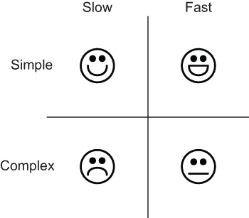
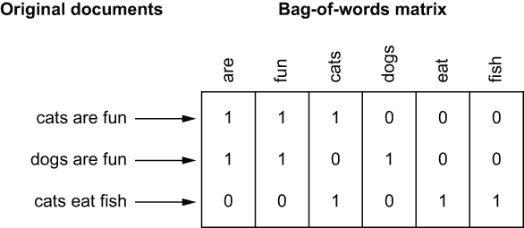
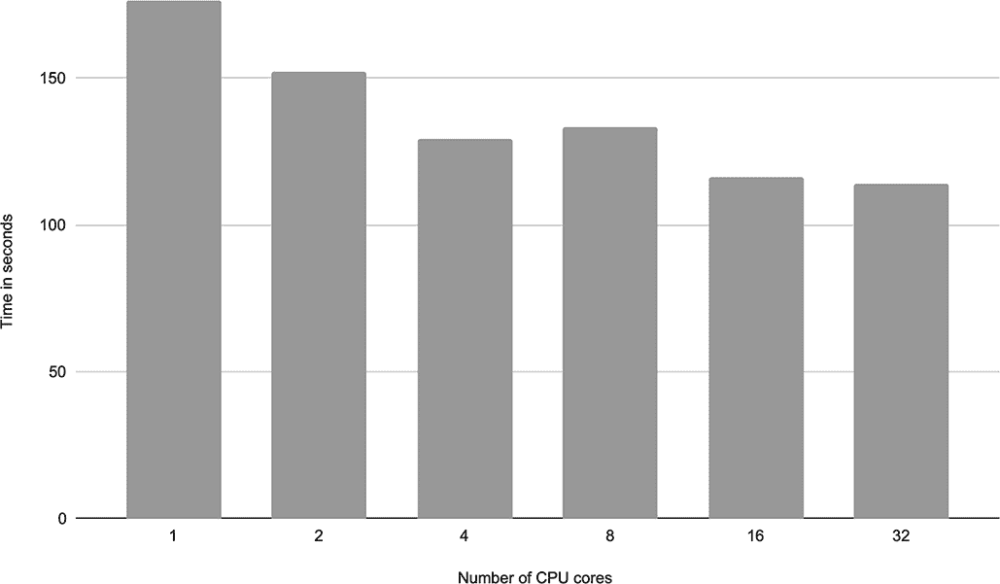
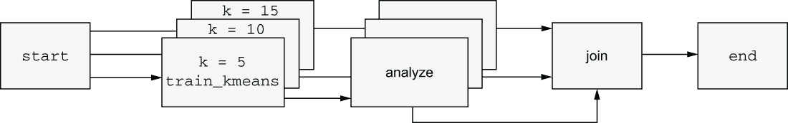
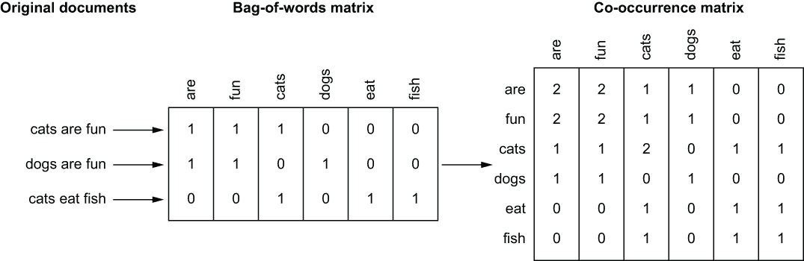
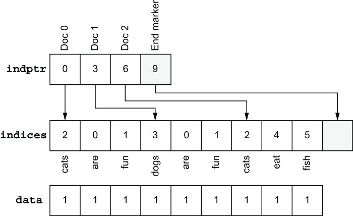
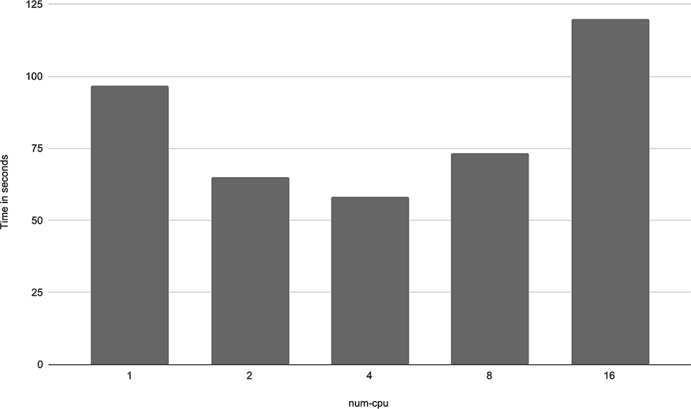
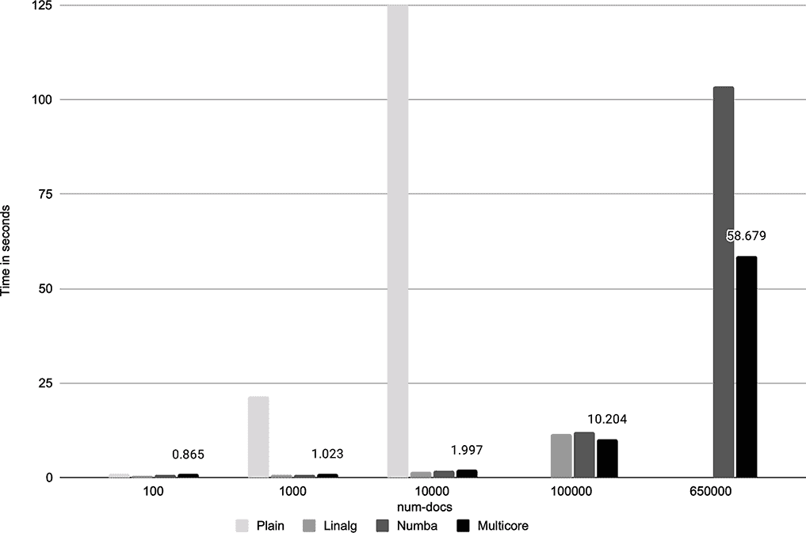

# 5 实践可扩展性和性能

本章涵盖了

+   逐步开发一个现实、高性能的数据科学项目

+   使用计算层来支持对计算要求高的操作，例如并行化模型训练

+   优化数值 Python 代码的性能

+   使用各种技术使你的工作流程更具可扩展性和性能

在上一章中，我们讨论了可扩展性不仅关乎能够处理更复杂的算法或处理更多数据。在组织层面上，基础设施应该扩展到由大量人员开发的大量项目。我们认识到，可扩展性和性能是两个独立的问题——你可以有其中一个而没有另一个。事实上，可扩展性和性能的不同维度可能相互矛盾。

想象一下，一个经验丰富的工程师正在用 C++ 语言实现一个高度优化、高性能的解决方案。尽管这个解决方案在技术层面上可以扩展，但如果团队中没有其他人懂得 C++ 语言，那么在组织层面上它的可扩展性就不是很强。相反，你可以想象一个非常高级的机器学习解决方案，只需点击一下按钮就能构建模型。每个人都知道如何点击按钮，但这个解决方案过于不灵活，无法扩展到各种不同的项目，并且无法处理大量数据。本章提倡一种务实的方法来处理可扩展性和性能，其特点如下：

1.  有效的基础设施需要处理各种项目，因此，而不是提供一个一刀切解决方案，它可以提供一个易于使用的工具箱，包含稳健的方法来实现*足够好*的可扩展性和性能。

1.  为了解决组织可扩展性——我们希望让尽可能多的人理解项目——我们的主要工具是*简单性*。人们的认知带宽有限，因此过度工程化和过度优化会带来真实的人类成本。

我们可以用一个简单的助记符来总结这两点，如图 5.1 所示。



图 5.1 一种务实的方法来处理可扩展性

在这里，*简单*指的是任何新加入项目的人都可以查看源代码，并快速理解其工作原理。*复杂*则相反：理解代码的工作原理需要付出很多努力。*慢*意味着解决方案可能会遇到可扩展性的限制，它使得人们等待结果的时间比理想状态更长，但无论如何，*它还是可以工作的*。*快*意味着解决方案对于当前的问题来说完全足够：它有足够的可扩展性，并且可以快速提供结果。

通过优化简单性，我们也优化了结果的有效性。正如著名计算机科学家托尼·霍尔所说：“有两种编写代码的方式：编写如此简单的代码以至于显然没有错误，或者编写如此复杂的代码以至于没有明显的错误。”由于数据科学应用程序本质上是统计性的——错误和偏差可能潜伏在模型中而不产生清晰的错误信息，因此您应该更喜欢简单的代码而不是不明显的问题。只有当应用程序确实需要更高的扩展性或性能时，您才应该按比例增加其复杂性。

在本章中，我们将开发一个对扩展性和性能有非平凡要求的实用机器学习（ML）应用程序。我们练习逐步开发数据科学应用程序，始终追求最简单的方法，这种方法是正确的并产生预期的结果。换句话说，我们希望保持在图 5.1 的第一行。我们将展示一些有助于实现足够好的扩展性和性能的方法。

我们将使用上一章中介绍的工具：使用计算层进行垂直和水平扩展。虽然可以在笔记本电脑上运行示例，但如果您已经按照之前的说明设置了基于云的计算层（如 AWS Batch），那么它们将更有趣和更真实。像以前一样，我们将使用 Metaflow 来展示概念并获得实际操作经验，但您可以将示例适应到其他框架，因为通用原则是框架无关的。您可以在[`mng.bz/yvRE`](http://mng.bz/yvRE)找到本章的所有代码列表。

## 5.1 从简单开始：垂直扩展性

我们将开始构建一个使用自然语言处理（NLP）来建模和分析 Yelp 评论的实用机器学习（ML）应用程序。我们将遵循第三章中介绍的螺旋方法，如图 5.2 所示，来开发该应用程序。


图 5.2 螺旋方法，优化作为最后一步

尽管本章的主题是*实践扩展性*，但以下步骤在图 5.2 中显示，在考虑任何扩展性问题之前：

1.  深入了解业务问题。也许业务环境允许我们采用更简单、扩展性较低但更明显正确的解决方案。

1.  获取相关输入数据，并确保数据是正确的，并且将保持正确。同时，估计数据的规模和增长率。

1.  确保您的应用程序的结果可以被正确消费，并且它们产生预期的行动。

1.  开发一个小型但功能齐全的原型，以便您可以使用真实数据测试应用程序，确保其端到端正确性。

为了实施这些步骤，我们可以选择最简单的可扩展方法，这样我们就能构建一个功能原型。第一个版本不需要特别可扩展。我们可以在确认其他一切正常后，再对其进行修复。引用软件架构师 Kent Beck 的话，我们的优先顺序应该是：“先让它工作，再让它正确，最后让它快速。”

### 5.1.1 示例：聚类 Yelp 评论

让我们从假设的商业问题开始：一家初创公司希望构建一个更好的 Yelp 版本，一个评论网站。为了了解 Yelp 产品的优势和劣势，他们希望分析人们为 Yelp 贡献的不同类型的评论。

我们没有现有的评论分类法，所以我们不会将评论分类到已知的类别中，而是将依赖于*无监督学习*，在这种情况下，将 Yelp 评论分组为看起来相似的评论集。你可以在 Scikit-Learn 的文档中了解更多关于无监督学习和文档聚类的信息，见[`mng.bz/M5Mm`](http://mng.bz/M5Mm)。

为了完成这个任务，我们可以访问一个包含 65 万条 Yelp 评论的公开可用语料库。数据集由 Fast.AI([`course.fast.ai/datasets`](https://course.fast.ai/datasets))公开提供，并且方便地托管在 AWS S3 的 AWS 开放数据注册处[`registry.opendata.aws/fast-ai-nlp/`](https://registry.opendata.aws/fast-ai-nlp/)。数据集未压缩时大约有 500 MB，因此足够大，可以练习可扩展性，但足够小，可以在任何中型云实例或工作站上处理。一个好的起点是查看数据看起来是什么样子。Jupyter 笔记本非常适合这个目的，如图 5.3 所示。


图 5.3 在笔记本中检查 Yelp 数据集

下一个列表显示了图 5.3 中使用的代码。

列表 5.1 检查 Yelp 评论数据集

```
import tarfile
from metaflow import S3

with S3() as s3:    #A
    res = s3.get('s3://fast-ai-nlp/yelp_review_full_csv.tgz')          ❶
    with tarfile.open(res.path) as tar:                                ❷
        datafile = tar.extractfile('yelp_review_full_csv/train.csv')   ❷
        reviews = [line.decode('utf-8') for line in datafile]          ❸

print('\n'.join(reviews[:2]))                                          ❹
```

❶ 使用 Metaflow 内置的 S3 客户端加载公开可用的 Yelp 数据集

❷ 从 tar 包中提取数据文件

❸ 将所有评论按行加载到一个列表中

❹ 打印前两个评论作为示例

在这里，我们使用 Metaflow 内置的 S3 客户端从 Amazon S3 加载数据——你将在第七章中了解更多关于它的内容。数据集存储在一个压缩的 tar 归档中，我们解压缩它以提取评论。每条评论一行，前面带有星级评分。我们的应用程序不需要关心评分列。

建议：本章中使用的数据集 yelp_review_full_csv.tgz 大约有 200 MB。通过慢速互联网连接下载可能需要几分钟。如果笔记本电脑上的示例感觉太慢，请考虑使用云工作站，例如 AWS Cloud9 IDE，以执行本章中的所有示例。

您可以在图 5.3 中看到一些评论数据的样本。正如预期的那样，评论是任意段落的书面英语。在我们可以对数据进行任何聚类之前，我们必须将字符串转换为数值表示。这种向量化步骤是涉及自然语言的机器学习任务中的常见预处理步骤。如果您之前没有进行过任何自然语言处理（NLP），请不要担心：我们将在下一小节中涵盖您需要了解的所有内容。

自然语言处理一分钟入门

将自然语言编码为数值形式的一种经典方法是称为*词袋*表示。使用词袋模型，我们可以将一组文档表示为一个矩阵，其中每一行是一个文档，列对应于所有文档中的所有唯一单词。列和行的顺序是任意的。矩阵的值表示每个单词在文档中出现的次数。图 5.4 说明了这个概念。



图 5.4 词袋矩阵

注意图 5.4 中的矩阵中大多数值都是零。这是预期的，因为实际上所有文档都只包含所有可能单词的小子集。因此，通常将矩阵编码为*稀疏矩阵*，这意味着我们使用一种数据结构，只存储矩阵的非零元素。在接下来的例子中，我们将使用 Scikit-Learn 的 scipy.sparse 模块将文档存储为词袋稀疏矩阵。我们将在 5.3.1 节中深入了解这些矩阵是如何在内部实现的。

尽管词袋表示丢失了单词的顺序，但您可以在许多自然语言处理（NLP）任务中，如分类和聚类中，使用简单的词袋表示获得令人惊讶的好结果。在接下来的几个例子中，我们将执行文档聚类。我们希望将文档分组到 K 个非重叠的组或簇中，使得分配到同一簇的文档彼此之间尽可能*相似*。关键的是，您必须事先选择簇的数量 K——在数据科学社区中并没有一个普遍认同的自动选择它的方法。

在这个例子中，*文档相似度*指的是文档之间共同单词的数量。例如，图 5.4 中的前两个文档有两个共同单词（are, fun），而第三个文档与它们最多只有一个共同单词。因此，将前两个文档分配到一个簇中，而将第三个文档分配到单独的簇中是有意义的。

为了进行聚类，我们将使用最著名的聚类技术，即 K-means 聚类算法，该算法在 Scikit-Learn 中实现。如果您感兴趣，可以在 [`mng.bz/aJlY`](http://mng.bz/aJlY) 上了解更多关于 K-means 的信息。算法的细节在这里并不重要，除了它是一个计算上有些要求较高的算法——执行时间随矩阵大小的平方增长。这使得它成为测试可扩展性和性能的一个有趣且现实的情况。

### 5.1.2 练习垂直可扩展性

在上一章介绍 @batch 和 @resources 装饰器时，我们遇到了垂直可扩展性的概念。这是迄今为止最简单的一种扩展形式：垂直可扩展性指的是通过使用更大的实例来处理更多的计算和更大的数据集。自然地，您不能在笔记本电脑上依赖垂直扩展，因为您不能通过编程方式添加更多的 CPU 核心或内存。相比之下，使用基于云的计算层（如 AWS Batch）很容易实现垂直扩展，它可以提供云中可用的任何实例。

让我们从加载 Yelp 评论数据集并构建其相应的词袋表示开始。我们将在许多流程中使用相同的数据集，因此我们将开发实用函数来处理数据，以避免在流程中重复相同的代码。在 Python 中，我们通常将函数存储在单独的文件中，即模块，流程可以导入这些模块。

我们的模块包含两个实用函数：load_yelp_reviews，它从数据集中下载并提取文档列表，以及 make_matrix，它将文档列表转换为词袋矩阵。load_yelp_reviews 函数看起来与我们用来在笔记本中检查数据的代码非常相似（列表 5.1）。实际上，创建单独模块的好处之一是我们可以在 Metaflow 流程和笔记本中使用相同的模块。

推荐：将相关函数放置在逻辑组织良好的模块中是一种良好的实践。您可以在多个流程中共享这些模块，并在笔记本中使用它们。此外，您还可以独立测试模块。

创建一个名为 scale_data.py 的文件，并将下一列表中的代码存储在其中。

列表 5.2 处理 Yelp 评论数据集的函数

```
import tarfile
from itertools import islice
from metaflow import S3

def load_yelp_reviews(num_docs):                                           ❶
    with S3() as s3:    #B
        res = s3.get('s3://fast-ai-nlp/yelp_review_full_csv.tgz')          ❷
        with tarfile.open(res.path) as tar:                                ❸
            datafile = tar.extractfile('yelp_review_full_csv/train.csv')   ❸
            return list(islice(datafile, num_docs))                        ❹

def make_matrix(docs, binary=False):                                       ❺
    from sklearn.feature_extraction.text import CountVectorizer
    vec = CountVectorizer(min_df=10, max_df=0.1, binary=binary)            ❻
    mtx = vec.fit_transform(docs)                                          ❻
    cols = [None] * len(vec.vocabulary_)                                   ❼
    for word, idx in vec.vocabulary_.items():                              ❼
        cols[idx] = word                                                   ❼
    return mtx, cols
```

❶ 从数据集中加载并提取文档列表

❷ 使用 Metaflow 内置的 S3 客户端加载公开可用的 Yelp 数据集

❸ 从 tar 包中提取数据文件

❹ 从文件中返回前 num_docs 行

❺ 将文档列表转换为词袋矩阵

❻ CountVectorizer 创建矩阵。

❼ 创建列标签列表

如我们的笔记本示例所示，该函数使用 Metaflow 内置的 S3 客户端从 S3 加载公开可用的 Yelp 数据集，我们将在第七章中更详细地介绍。load_yelp_reviews 函数接受一个参数 num_docs，表示要从数据集中读取多少个文档（每行一个评论）。我们将使用 num_docs 来控制数据集大小。

make_matrix 函数接受一个包含文档的列表 docs，并使用 Scikit-Learn 的 CountVectorizer 从文档创建一个矩阵。我们给它以下参数：

+   min_df 指定包含的单词至少需要在 10 个文档中出现。这消除了许多错误和其它无关的单词。

+   max_df 指定所有在所有文档中出现超过 10%的单词将被排除。它们通常是常见的英语单词，对于我们的用例来说，它们并不提供太多信息。

+   binary 可以用来表示文档中单词的出现即可。结果是 0 或 1，不管单词在文档中出现的次数多少。最后，我们创建一个列标签列表，以便我们知道哪个单词对应哪个列。

从像 scale_data.py 这样的模块化组件中构建你的工作流程提供了许多好处：你可以独立测试它们，在原型设计期间在笔记本中使用它们，并将它们打包和共享到多个项目中。Metaflow 将当前工作目录中的所有模块与流程一起打包，因此它们在由计算层执行的容器内自动可用。我们将在第六章讨论这个以及其他与软件库管理相关的话题。

建议：将复杂的企业逻辑，如建模代码，作为可以由工作流程调用的单独模块实现。这使得逻辑更容易在笔记本和自动化测试套件中进行测试。这也使得模块可以在多个工作流程之间共享。

接下来，让我们构建一个简单的流程，我们可以用它来测试函数。我们遵循螺旋方法：我们从一个几乎什么也不做的简单流程开始，并迭代地添加功能。在存储 scale_data.py 的同一目录中，创建一个新文件，名为 kmeans_flow_v1.py，包含以下代码。

列表 5.3 KMeansFlow 的第一迭代

```
from metaflow import FlowSpec, step, Parameter

class KmeansFlow(FlowSpec):
    num_docs = Parameter('num-docs', help='Number of documents', default=1000)

    @step
    def start(self):
        import scale_data                              ❶
        scale_data.load_yelp_reviews(self.num_docs)    ❶
        self.next(self.end)

    @step
    def end(self):
        pass

if __name__ == '__main__':
    KmeansFlow()
```

❶ 导入我们之前创建的模块，并使用它来加载数据集

开始步骤导入我们在列表 5.2 中创建的模块，并使用它来加载数据集。使用参数 num_docs 来控制数据集大小。默认情况下，只加载前 1,000 个文档。未压缩的数据集大约有 500 MB，因此执行此示例需要超过半 GB 的内存。目录结构需要如下所示，以确保 Metaflow 能够正确地打包所有模块：

```
my_dir/
my_dir/scale_data.py
my_dir/kmeans_flow_v1.py
```

你可以自由地为目录命名 my_dir。确保你的工作目录是 my_dir，并像往常一样执行流程：

```
# python kmeans_flow_v1.py run
```

尤其是在本地笔记本电脑上，这可能需要几分钟才能执行。如果一切顺利，它应该会无错误地完成。在我们开始向流程添加更多功能之前，这是一个很好的合理性检查。

使用 @conda 定义依赖项

接下来，让我们扩展 KmeansFlow 以使用 K-means 算法进行聚类。我们可以使用 Scikit-Learn 提供的现成 K-means 实现。在第三章中，我们通过在本地工作站上运行 pip install 简单地安装了 Scikit-Learn。然而，本地安装的库在计算层执行的所有容器中并不自动可用。

我们可以选择一个预装所有所需库的容器镜像，但管理多个与每个项目需求匹配的镜像可能会变得繁琐。作为替代方案，Metaflow 提供了一种更灵活的方法，即 @conda 装饰器，它不需要你手动创建或查找合适的镜像。

通常，依赖项管理是一个非平凡的话题，我们将在下一章中详细讨论。为了本节的目的，你只需要确保你已经安装了 Conda 包管理器——请参阅附录中的说明。之后，你只需要在代码中包含如列表 5.4 所示的 @conda_base 行：

```
@conda_base(python='3.8.3', libraries={'scikit-learn': '0.24.1'})
```

这行代码指示 Metaflow 在所有执行代码的计算层中安装 Python 3.8.3 和 Scikit-Learn 0.24.1 版本，包括本地运行。

注意：当你第一次使用 @conda 运行流程时，Metaflow 会解析所有所需的依赖项并将它们上传到 S3。这可能需要几分钟时间，尤其是如果你在笔记本电脑上执行代码时。请耐心等待——这仅在第一次执行时发生！

下面的代码片段扩展了列表 5.3 中的 KMeansFlow 的第一个版本。它使用我们的 scale_data 模块从 Yelp 数据集中创建一个词袋矩阵。矩阵在新的步骤 train_kmeans 中进行聚类。

列表 5.4 KMeansFlow 的最终版本

```
from metaflow import FlowSpec, step, Parameter, resources, conda_base, profile

@conda_base(python='3.8.3', libraries={'scikit-learn': '0.24.1'})     ❶
class KmeansFlow(FlowSpec):

    num_docs = Parameter('num-docs', help='Number of documents', default=1000000)

    @resources(memory=4000)                                           ❷
    @step
    def start(self):
        import scale_data                                             ❸
        docs = scale_data.load_yelp_reviews(self.num_docs)            ❸
        self.mtx, self.cols = scale_data.make_matrix(docs)            ❸
        print("matrix size: %dx%d" % self.mtx.shape) 
        self.next(self.train_kmeans)

    @resources(cpu=16, memory=4000)                                   ❹
    @step
    def train_kmeans(self):
        from sklearn.cluster import KMeans
        with profile('k-means'):                                      ❺
            kmeans = KMeans(n_clusters=10,
                            verbose=1,
                            n_init=1)                                 ❻
            kmeans.fit(self.mtx)                                      ❻
        self.clusters = kmeans.labels_                                ❻
        self.next(self.end)

    @step
    def end(self):
        pass

if __name__ == '__main__':
    KmeansFlow()
```

❶ 在任务中声明我们将需要的库

❷ 预处理数据需要 4 GB 的内存

❸ 导入我们之前创建的模块并使用它来加载数据集

❹ 运行 K-means 需要 4 GB 的内存和 16 个 CPU 核心

❺ 使用配置文件来测量并打印运行 K-means 所需的时间

❻ 运行 K-Means 并将结果存储在聚类中

将代码保存到 kmeans_flow_v2.py。你可以看到我们使用了 @resources 装饰器来声明 start 和 train_kmeans 步骤需要 4 GB 的内存。额外的 GB 是为了保持词袋矩阵在内存中，并考虑到所有相关的开销。train_kmeans 步骤使用 Metaflow 提供的一个小型实用函数 profile，它测量并打印执行代码块所需的时间。它的单个参数是包含在输出中的前缀，这样你知道测量与哪个代码块相关。

小贴士：在 Metaflow 中使用 profile 上下文管理器可以快速了解步骤内某些操作的耗时。

使用 KMeans 对象来运行算法。它接受簇的数量（K-means 中的 K），这里称为 n_clusters，作为参数，我们将其设置为某个相当随意的数字，10。在下一节中，我们将探索 K 的其他值。下一个参数 verbose 提供了关于算法进度的某些信息，而 n_init=1 意味着我们只需要运行算法一次。更高的数字可能会导致更好的结果。算法的结果是一个数组，存储在 self.clusters 中，它将每个文档分配到一个簇中。我们将在下一节中更深入地查看结果。

按以下方式使用 AWS Batch 运行流程：

```
# python kmeans_flow_v2.py --environment=conda run --with batch
```

使用`--environment=conda`标志是必须的，以表明我们希望使用 Conda 来处理依赖关系。如果您想在本地运行代码或您的计算环境没有可用 4 GB 内存和 16 个 CPU 核心的实例，您可以通过指定`num-docs`参数的较小值来处理更少的文档，例如运行`--num-docs 10000`。希望这次运行能够成功完成——这是我们目前要完成的所有事情。我们将在下一节中深入探讨结果。

关于这个流程有趣的地方是：数据集包含 650,000 个文档，相应的矩阵包含大约 48,000 个独特的单词。因此，矩阵的大小是 650,000 * 48,000，如果以密集矩阵的形式存储，将需要超过 100 GB 的内存。因为它以稀疏矩阵的形式存储，所以它将小于 4 GB。对于这样大小的矩阵运行 K-means 是计算密集型的。幸运的是，Scikit-Learn 中的实现可以自动在请求的多个 CPU 核心上并行化算法，即使用`@resources(cpu=16)`。因此，您只需增加 CPU 核心的数量，就可以使 K-means 更快地完成，如图 5.5 所示。



图 5.5 执行时间与使用的 CPU 核心数的关系

对于这个数据集，您可以通过使用多个 CPU 核心获得高达 40%的性能提升。作为一个练习，您可以尝试另一种名为 MiniBatchKMeans 的更快版本的 K-means。@resources 的最佳选择取决于数据集大小、算法及其实现。在这种情况下，超过四个核心似乎没有带来太多好处。超过这个数字，额外核心执行的工作量不足以证明通信和协调开销的合理性。一般来说，这种行为是大多数现代机器学习算法实现中典型的：您在更多的 CPU 核心或 GPU 上运行它们，它们的运行速度就会更快，直到达到一个极限。

注意：与内存限制不同，CPU 限制是 AWS Batch 上的一个**软限制**。如果没有其他任务同时在该实例上执行，任务可以使用实例上所有可用的 CPU 核心。当多个任务需要共享实例时，此限制适用。在大多数情况下，这种行为是可取的，但它使得基准测试变得复杂，因为具有例如四个 CPU 的任务可能会偶然使用更多的 CPU 核心。

垂直扩展最吸引人的特点是它的**无难度**——数据科学家只需修改一行代码，即@resources，就可以更快地处理更大的数据集，如前所述。尽管这种方法不提供无限的扩展性，但通常，它对于手头的任务来说已经足够了，正如下一小节所讨论的。

### 5.1.3 为什么需要垂直扩展？

从工程角度来看，对垂直扩展有一个本能的反应：它不是“真正的”扩展性——它在最大可用实例大小上达到一个硬上限。截至本书编写时，AWS 上最常用的最大 EC2 实例提供 48 个 CPU 核心和 768 GB 的内存。显然，如果你需要更多的核心或更多的内存，垂直扩展无法帮助你。

而不是依赖可能具有误导性的直觉，仔细评估垂直扩展是否足够以及可以持续多长时间是一个好主意。得益于垂直扩展的简单性，你可以快速构建应用程序的第一个版本，并在使实现复杂化之前验证其正确性和价值。令人惊讶的是，垂直扩展通常已经足够好。

简单性提升性能和生产力

在简单性方面，很难超越垂直扩展。你可以编写最地道、可读性和直接的 Python 代码，只需调整@resources 中的数字以匹配代码的要求。它没有新的范式需要学习。如果事情失败了，没有隐藏的抽象层会导致惊喜或复杂的错误信息。这对于数据科学家的生产力和自主性非常重要——他们可以专注于建模，而无需过多担心可扩展性或性能。

当涉及到在 Python 中实现机器学习和数据科学工作负载时，用户界面 API 的简单性具有欺骗性。在底层，最好的库使用 C++等低级语言进行了高度优化，以便能够非常有效地利用单个实例上的可用资源。

以建模框架为例。在 2010 年代初，人们投入了大量精力在 Hadoop 和 Spark 等可扩展框架之上提供传统机器学习算法的可扩展实现。这些框架是具有有限单机性能的固有可扩展系统的良好例子。

在 2010 年代后半期，开始变得明显的是，单机、垂直扩展的训练算法，如 XGBoost 或 Tensorflow 提供的算法，可以轻易地超越它们名义上更可扩展的对应者，尤其是在 GPU 加速的情况下。这些实现不仅速度更快，而且由于缺乏可扩展、分布式系统的固有复杂性，它们在操作和开发上也容易得多。

这突出了可扩展性和性能之间的差异：由多个低性能但并行单元组成的系统可以很好地扩展，但这样的分布式系统往往会产生固有的通信和协调开销，这可能会使其对于中小型工作负载比其非分布式对应者*更慢*。值得注意的是，有时不可扩展的方法甚至可以优于其可扩展的对应者，即使是在意外的大工作量下。

可扩展性技巧 不要高估名义上可扩展系统的性能，也不要低估单实例解决方案的性能。如有疑问，请进行基准测试。即使分布式解决方案可能具有更好的可扩展性，也要仔细考虑其运营成本和对数据科学家生产力的成本。关于这一效果的具体例子，请参阅 2015 年由 Frank McSherry 等人发表的论文《可扩展性！但代价是什么？》([`mng.bz/OogO`](http://mng.bz/OogO))。

考虑你问题的本质

当思考你问题的本质时，考虑以下两个经常被低估的因素。首先，现实生活中的可扩展性总是有一个上限。在物理世界中，没有什么真正是无限的。在本章中提供的例子中，我们使用了一个包含 650,000 条 Yelp 评论的静态数据集。对于这样的静态数据集，很容易看出可扩展性不太可能成为一个问题。

即使数据集不是静态的，其大小可能自然有限。例如，考虑一个为每个美国 ZIP 代码提供统计数据的数据集。美国大约有 40,000 个 ZIP 代码，这个数字几乎可以保证保持稳定。如果你能轻松处理大约 40,000 个 ZIP 代码，那么你就不应该有任何可扩展性的担忧。

第二，一台现代计算机可以拥有惊人的资源量。对于人类来说，任何数量级达到数十亿的都可能感觉很多，但请记住，一台现代计算机每秒可以进行大约 20 亿次的算术运算，并且可以同时存储大约 270 亿个英语单词。计算机的运行速度比我们有限的认知要高得多。

使用广泛用于训练深度神经网络和其他现代模型架构的专用硬件（如 GPU）时，这种影响更为明显。截至本书编写时，AWS 提供了具有八个高性能 GPU 的实例。你可以使用这样的机器来训练大型模型。由于机器内部 GPU 和 CPU 核心之间的通信开销最小，单个实例可以超越应该具有更多计算能力的实例集群，从原始数据来看。

最后，计算机的增长并未停止。尽管在过去 10 年中单核性能增长不大，但单个实例中的核心数量、内存容量以及本地存储速度都在增长。以一个例子来说明，考虑将每个 Netflix 订阅者的数据存储在单个实例的内存数据帧中。这可能会感觉像是一个糟糕的想法，因为 Netflix 订阅者的数量每年都在迅速增长！

与依赖直觉反应相比，检查数学计算是一个好主意。2011 年，Netflix 有 2600 万订阅者，最大的 AWS 实例提供了 60 GB 的内存，这意味着每个订阅者可以存储大约 2.3 KB 的数据。到 2021 年，Netflix 有 2.07 亿订阅者，最大的 AWS 实例提供了 768 GB 的内存，因此，出人意料的是，今天每个订阅者的数据容量更大——3.7 KB。换句话说，如果你的用例适合这些限制，你只需通过更新@资源中的数字，就可以简单地处理可扩展性超过 10 年，并且还在继续！

可扩展性技巧 在担心可扩展性之前，先估计你的增长上限。如果与可用计算资源相比，上限足够低，你可能根本不需要担心可扩展性。

## 5.2 实践水平可扩展性

如前所述，始终建议在开始项目时，不仅要思考问题本身，还要考虑涉及的数据和计算规模以及增长率。如果没有其他迹象表明应该这样做，垂直可扩展性是一个好的起点。什么迹象会表明应该这样做？换句话说，在什么情况下，你应该考虑使用多个并行实例而不是单个实例？

### 5.2.1 为什么需要水平可扩展性？

作为一项经验法则，如果你对以下三个问题中的任何一个回答“是”，你应该考虑水平可扩展性，即使用多个实例：

+   你的工作流程中是否有大量的计算部分是*令人尴尬地并行*的，这意味着它们可以在不共享任何数据（除了输入）的情况下执行操作？

+   数据集的大小是否太大，以至于无法方便地在最大的实例类型上处理？

+   是否存在计算密集型的算法，如模型训练，它们对单个实例来说要求过高？

这些项目按频率降序排列：前两种情况比最后一种情况典型得多。让我们逐一分析这些情况。

令人尴尬的并行任务

在分布式计算中，如果一个问题是“几乎不需要努力就可以将问题分解成多个并行任务”，那么这个问题被称为*令人尴尬的并行*。在 Metaflow 风格的工作流程的上下文中，这个定义与不需要相互共享任何数据（除了共享公共输入数据）的动态 foreach 任务相一致。

这种情况在数据科学应用中很常见：训练多个独立的模型，获取多个数据集，将多个算法与数据集进行基准测试，仅举几例。你可能能够通过垂直扩展来处理所有这些情况，可能利用单个实例上的多个核心，但通常这样做的好处很小。

记住，垂直扩展的关键动机是简单性和性能。典型地，一个令人尴尬的并行任务的实现看起来在单实例或多实例上执行时几乎相同——它只是一个函数或 Metaflow 步骤。因为任务是完全独立的，所以在单独的实例上执行它们不会产生性能惩罚。因此，在这种情况下，你可以通过在 Metaflow 中使用 foreach 来解锁巨大的可扩展性，而不会牺牲简单性或性能。我们将在下一节练习一个常见的令人尴尬的并行案例，即超参数搜索，这涉及到构建许多独立的模型。

大数据集

就本书的撰写而言，目前可用的最大常用 EC2 实例具有 768 GB 的内存。这意味着仅仅依靠垂直扩展，你可以在具有相当大内存开销的 pandas DataFrame 中加载大约 100 GB 的数据。如果你需要处理更多的数据，这在当今并不罕见，仅仅依靠垂直扩展是不可行的。

在许多情况下，处理大数据集的最简单方法之一是使用专门针对此类用例优化的计算层，例如 Apache Spark。另一种方法是将数据分成更小的单个块或碎片，以便每个碎片可以在大型实例上处理。我们将在第七章讨论这些方法。

分布式算法

除了输入数据外，可能要执行的计算算法，例如模型训练，对单个实例来说要求过高。例如，这可能适用于大规模计算机视觉模型。尽管拥有比单个实例更大的数据集很常见，但拥有这种规模的模型则很少见。一个配备八个 GPU 和超过一 TB 内存的单个 P4 型 AWS 实例可以容纳一个巨大的模型。

运行分布式模型训练和其他分布式算法可能并不简单。网络必须优化以实现低延迟通信，实例必须相应地放置以最小化延迟，并且必须仔细协调和同步紧密耦合的实例池，同时考虑到实例可能随时会失败。

幸运的是，许多现代机器学习库，如 PyTorch Lightning，提供了抽象，使得分布式训练变得容易一些。此外，专门的计算层，如 Amazon Sagemaker 和 Google 的 Cloud TPUs，可以为你管理复杂性。

许多现实世界的数据科学应用采用了这些方法中的许多：使用 Spark 预处理数据，并并行加载为分片，以生成一个在单个垂直扩展实例上训练的矩阵或张量。将应用程序组织为工作流的好处在于，你可以选择最适合工作流每一步的扩展方式，而不是试图将所有任务都适应到一个单一的模式中。下一节将演示一个简单但常见的尴尬并行案例：并行构建多个 K-means 模型以找到性能最佳的模型。

### 5.2.2 示例：超参数搜索

在本节中，我们通过展示如何使用水平扩展来解决机器学习项目中一个常见任务：*超参数搜索和优化*，来扩展我们之前提到的 K-means 示例。在前一节中，我们简单地固定了簇的数量，即 K-means 中的 *K* 参数，为 10 个簇，而没有给出任何理由。簇的数量是 K-means 算法的一个 *超参数*——一个在算法运行之前我们需要定义的参数。

通常，对于超参数值并没有一个明确正确的选择。因为我们无法事先定义正确的值，所以通常希望运行算法使用多个不同的超参数值，并选择表现最好的一个。复杂的超参数优化器可以动态生成新值，并在结果不再改善时停止。这里展示的简单方法只是预先定义一个要尝试的超参数列表，并在最后评估结果。这种简单方法的优点是算法可以独立地对每个参数化进行评估——这是一个非常适合水平扩展的理想用例。

如何定义聚类算法的“最佳结果”本身就是一个非平凡的问题。你可以以许多同样好的方式对文档进行分组。在这个例子中，选择权在你。你可以通过列出簇中最频繁出现的单词来表征每个簇。正如我们将展示的，你可以查看簇并决定哪些超参数值会产生最有趣的结果。列表 5.5 展示了一个函数，top_words，它计算每个簇中最频繁的单词。将其保存到一个单独的模块中，analyze_kmeans.py。

列表 5.5 计算每个簇的顶级单词

```
from itertools import islice

def top_words(num_clusters, clusters, mtx, columns):
    import numpy as np
    top = []
    for i in range(num_clusters):                                     ❶
        rows_in_cluster = np.where(clusters == i)[0]                  ❷
        word_freqs = mtx[rows_in_cluster].sum(axis=0).A[0]            ❸
        ordered_freqs = np.argsort(word_freqs)                        ❹
        top_words = [(columns[idx], int(word_freqs[idx]))             ❹
                     for idx in islice(reversed(ordered_freqs), 20)]  ❹
        top.append(top_words)
    return top
```

❶ 处理 K 个簇中的每一个

❷ 从词袋矩阵中选择与当前簇对应的行

❸ 计算列的总和，即每个单词在簇中的频率

❹ 按频率对列进行排序，并生成一个包含顶级 20 个单词的列表

此函数使用了来自 NumPy 包的一些技巧：它使用 where 从矩阵中选择行的一个子集，使用 sum(axis=0)生成列的总和，并使用 argsort 生成排序后的列索引。如果您好奇，可以查看 NumPy 文档以了解更多关于这些函数的信息。了解 NumPy 对于此示例不是必需的。

我们将使用 Metaflow 的 foreach 构造，如第 3.2.3 节中引入的，以并行运行多个 K-means 算法，利用 AWS Batch 作为自动扩展的计算层。相应的流程在图 5.6 中可视化。



图 5.6 ManyKmeansFlow 对应的 DAG

这展示了横向扩展的实际应用。该流程并行训练了多个 K-means 聚类，针对参数 K（聚类数量）的多个值，并生成结果摘要以供分析。以下列表显示了流程的代码，ManyKmeansFlow，它基于我们之前提到的 KMeansFlow。

列表 5.6 搜索 K-means 的超参数

```
from metaflow import FlowSpec, step, Parameter, resources, conda_base, profile

@conda_base(python='3.8.3', libraries={'scikit-learn': '0.24.1'})
class ManyKmeansFlow(FlowSpec):

    num_docs = Parameter('num-docs', help='Number of documents', default=1000000)

    @resources(memory=4000)
    @step
    def start(self):
        import scale_data
        docs = scale_data.load_yelp_reviews(self.num_docs)      ❶
        self.mtx, self.cols = scale_data.make_matrix(docs)      ❶
        self.k_params = list(range(5, 55, 5))                   ❷
        self.next(self.train_kmeans, foreach='k_params')

    @resources(cpu=4, memory=4000)
    @step
    def train_kmeans(self):                                     ❸
        from sklearn.cluster import KMeans
        self.k = self.input
        with profile('k-means'):
            kmeans = KMeans(n_clusters=self.k, verbose=1, n_init=1)
            kmeans.fit(self.mtx)
        self.clusters = kmeans.labels_
        self.next(self.analyze)

    @step
    def analyze(self):
        from analyze_kmeans import top_words                    ❹
        self.top = top_words(self.k, self.clusters, self.mtx, self.cols)
        self.next(self.join)

    @step
    def join(self, inputs):
        self.top = {inp.k: inp.top for inp in inputs}           ❺
        self.next(self.end)

    @step
    def end(self):
        pass

if __name__ == '__main__':
    ManyKmeansFlow()
```

❶ 使用 scale_data 模块生成词袋矩阵

❷ 为 foreach 定义一组超参数

❸ 在 foreach 中训练 K-means 聚类

❹ 为每个聚类生成顶级词汇列表

❺ 按超参数值分组所有顶级列表

此流程的亮点是 k_params 中定义的超参数列表。我们生成了 10 个独立的聚类，即 10 个独立的 train_kmeans 任务，聚类数量在 5 到 50 之间变化。根据您的计算环境配置，所有 10 个任务可能并行运行。系统儿乎完美地扩展：如果生成一个聚类需要大约两分钟，那么您也可以在两分钟内并行生成 10 个聚类！您可以使用以下代码运行此流程：

```
# python many_kmeans_flow.py --environment=conda run --with batch --with retry
```

默认情况下，Metaflow 最多并行运行 16 个任务，因此它将最多提交 16 个（在这种情况下，10 个）任务到 AWS Batch。根据您的计算环境，AWS Batch 可能会决定在单个实例上并行运行多个容器，或者它可能会决定启动更多实例来处理队列中的任务。您可以使用--max-workers 选项控制并行级别，如第 3.2.4 节所述。

此示例说明了基于云的计算层（如 AWS Batch）的好处。您不仅可以启动更大的实例，正如我们在上一节中提到的，还可以*并行启动任意数量的实例*。如果没有可扩展的计算层，您将不得不按顺序执行 K-means 算法，这将花费大约 20 分钟，而由于横向扩展，您可以在两分钟内获得结果。根据上一章的指示，我们使用--with retry 来处理任何可能偶尔发生的暂时性故障，当并行运行数百个 Batch 作业时，这些故障是不可避免的。

目前，Metaflow 可以无问题地处理数千个并发任务。考虑到每个任务可能需要大量的@资源，你可以在单个工作流中部署数万个 CPU 核心和近一个 PB 的 RAM！

检查结果

当运行完成时，你将拥有 10 种不同的聚类结果可供检查。你可以使用 Metaflow 客户端 API 在交互式 Python shell 或使用笔记本来检查结果，如第 3.3.2 节所述。以下是轻松完成此操作的方法。首先，按照以下方式访问最新运行的输出：

```
>>> from metaflow import Flow
>>> run = Flow('ManyKmeansFlow').latest_run  
```

由于 Metaflow 会持久化所有运行的输出，因此你还可以检查和比较运行之间的结果。

在连接步骤中，我们生成了一个名为“top”的工件，它包含每个聚类的方便聚合的顶级单词集合，以超参数值为键，即聚类的数量。在这里，我们看一下 40 个聚类的 K-means 算法的结果如下：

```
>>> k40 = run.data.top[40]
```

有 40 个聚类可供检查。让我们抽查几个，查看聚类中的前 5 个单词及其频率，如下所示：

```
>>> k40[3][:5]
[('pizza', 696), ('cheese', 134), ('crust', 102), ('sauce', 91), ('slice', 52)]
```

这看起来是关于披萨评论的。下一个看起来是关于酒店的：

```
>>> k40[4][:5]
[('her', 227), ('room', 164), ('hotel', 56), ('told', 45), ('manager', 41)
```

这一个看起来是关于汽车租赁的：

```
>>> k40[30][:5]
[('car', 20), ('hertz', 19), ('gold', 14), ('says', 8), ('explain', 7)]
```

默认情况下，K-means 不能保证结果总是相同的。例如，随机初始化会导致每次运行的结果略有不同，因此不要期望看到与这里显示的完全相同的结果。作为一个练习，你可以想出一个创造性的方法在笔记本中表格化和可视化聚类。

## 5.3 实践性能优化

到目前为止，我们已经学习了可扩展性的两个主要维度：垂直可扩展性（使用更大的实例）和水平可扩展性（使用更多实例）。值得注意的是，这两种技术都允许我们在代码变化最小的情况下处理更大的数据集和更复杂的需求。从生产力的角度来看，这种可扩展性很有吸引力：云服务允许我们通过投入更多的硬件来解决问题，从而节省人力资源去完成更有趣的任务。

在什么情况下我们应该考虑花费数据科学家的时间手动优化代码？考虑一下你有一个计算成本高昂的算法，比如模型训练，实现为一个 Python 函数。执行该函数需要五小时。根据算法的实现方式，如果算法不能有效地利用多个 CPU 核心、更多内存或 GPU，垂直可扩展性可能帮助不大。水平可扩展性也无法帮助。你可以在 100 个并行任务中执行该函数，但每个任务仍然需要五小时，因此总执行时间仍然是五小时。

一个关键问题是执行时间是否为五小时是否重要。也许工作流程是每晚运行，所以运行五小时或两小时并没有太大区别——无论如何，结果都会在早上准备好。然而，如果函数需要每小时运行一次，我们就遇到了问题。用需要五小时执行时间的函数来产生每小时的结果是不可能的。

在这种情况下，数据科学家需要花时间重新思考算法，使其更高效。下一个部分的关键教训是，即使是性能优化也是一个连续的过程。数据科学家不必丢弃 Python 实现并重新编写算法，比如用 C++。他们可以使用多种工具和技术，逐步优化算法，直到它足够好。

下一个部分将逐步通过一个现实生活中的例子，展示一个最初用简单的 Python 实现的数值密集型算法是如何逐渐优化到其性能可以与复杂的 C++多核实现相媲美的程度。正如你将看到的，一个简单且易于实现的优化可以带来 80%的效益。挤出最后 20%的性能需要 80%的时间。

性能提示：过早优化是万恶之源。在你用尽所有其他更简单的选项之前，不要担心性能问题。如果你必须优化性能，要知道何时停止。

### 5.3.1 示例：计算共现矩阵

前面的部分使用了一个词袋矩阵来记录文档和单词之间的关系。从这个矩阵中，我们可以推导出另一个有趣的矩阵：*单词-单词共现矩阵*。共现矩阵记录了一个单词在同一个文档中与任何其他单词一起出现的频率。这对于理解单词之间的语义相似性可能很有用，并且有了这个矩阵，可以快速计算各种单词级指标。图 5.7 扩展了我们早期的词袋示例，以显示相应的共现矩阵。



图 5.7 从原始文档到单词-单词共现矩阵

如果词袋矩阵的维度是 N*M，其中 N 是文档的数量，M 是唯一单词的数量，那么相应的共现矩阵的维度是 M*M。关键的是，词袋矩阵包含了我们构建相应共现矩阵所需的所有信息。构建共现矩阵的一个简单方法是通过遍历词袋矩阵的所有行，并对每一行，生成所有单词对并增加它们在共现矩阵中的计数。

我们可以利用词袋矩阵是一个稀疏矩阵的事实，即它不存储任何零条目，这无论如何都不会影响共现矩阵。为了能够设计一个高效的算法来处理数据，让我们看看 scipy.sparse.csr_matrix 的内部，它实现了稀疏矩阵。SciPy 中的*压缩稀疏行*（CSR）矩阵由三个密集数组组成，如图 5.8 所示：

1.  indptr 表示每个行在 indices 数组中的开始和结束位置。这个数组是必需的，因为每个文档可以包含不同数量的唯一词。indptr 数组在末尾包含一个额外的元素，以指示最后一个文档的长度。

1.  indices 表示哪些列（词）在此行上有非零值。

1.  data 包含每个文档中每个词的频率。它与 indices 数组对齐。



图 5.8 scipy.sparse.csr_matrix 的内部数据结构

构建共现矩阵时，我们并不关心一个词在文档中出现的次数。因此，我们的词袋矩阵可以是一个二元矩阵，相应地，数据数组是冗余的，因为它全部是 1。

配备了这个问题定义以及关于稀疏矩阵背后的数据结构的知识，我们可以实现一个算法的第一个变体，该算法用于计算 Yelp 数据集的共现矩阵。

变体 1：纯 Python 实现

想象一下，如果数据科学家需要计算共现矩阵作为另一个算法的预处理步骤，可能会采取的最简单的方法是直接在文本数据上计算共现，逐个文档地迭代字符串，但这将是一个非常慢的方法。假设数据科学家已经使用我们的 scale_data 模块生成了一个词袋矩阵。数据科学家编写了一个算法，遍历稀疏矩阵以构建共现矩阵。他们的解决方案可能看起来像下面所示。

列表 5.7 第一个变体：纯 Python 中的共现

```
def simple_cooc(indptr, indices, cooc):
    for row_idx in range(len(indptr) - 1):                  ❶
        row = indices[indptr[row_idx]:indptr[row_idx+1]]    ❶
        row_len = len(row)
        for i in range(row_len):                            ❷
            x = row[i]
            cooc[x][x] += 1                                 ❸
            for j in range(i + 1, row_len):
                y = row[j]
                cooc[x][y] += 1                             ❹
                cooc[y][x] += 1                             ❹

def new_cooc(mtx):                                          ❺
    import numpy as np
    num_words = mtx.shape[1]
    return np.zeros((num_words, num_words), dtype=np.int32)

def compute_cooc(mtx, num_cpu):                             ❻
    cooc = new_cooc(mtx)
    simple_cooc(mtx.indptr, mtx.indices, cooc)
    return cooc       
```

❶ 遍历词袋矩阵的所有行

❷ 遍历一行中的所有非零列（词）

❸ 增加矩阵的对角线，这表示词的频率

❹ 增加词-词对计数——矩阵是对称的

❺ 创建新共现矩阵的实用函数

❻ 创建并填充新共现矩阵的接口函数

将列表 5.7 中的代码保存在一个名为 cooc_plain.py 的单独模块中。这次，确切的文件名很重要，因为我们很快就会看到。实现很简单：我们遍历所有行中的所有单词对，并在执行过程中递增目标矩阵中的单词-单词计数。除了核心算法 simple_cooc 之外，我们还包含一个辅助函数来分配正确形状的新共现矩阵，new_cooc，以及一个创建并填充矩阵的函数 compute_cooc，我们将将其用作模块的入口点。这些函数很快就会派上用场。

让我们创建一个流程来测试算法。接下来的列表显示了一个支持可插拔算法的流程。我们也可以用它来测试 cooc_plain.py 之外的其它变体。将流程保存到 cooc_flow.py。

列表 5.8：生成共现矩阵的流程

```
from metaflow import FlowSpec, conda_base, step, profile, resources, Parameter
from importlib import import_module

@conda_base(python='3.8.3',
            libraries={'scikit-learn': '0.24.1',
                       'numba': '0.53.1'})                                ❶
class CoocFlow(FlowSpec):

    algo = Parameter('algo', help='Co-oc Algorithm', default='plain')     ❷
    num_cpu = Parameter('num-cpu', help='Number of CPU cores', default=32)
    num_docs = Parameter('num-docs', help='Number of documents', default=1000)

    @resources(memory=4000)
    @step
    def start(self):                                                      ❸
        import scale_data
        docs = scale_data.load_yelp_reviews(self.num_docs)
        self.mtx, self.cols = scale_data.make_matrix(docs, binary=True)   ❹
        print("matrix size: %dx%d" % self.mtx.shape)
        self.next(self.compute_cooc)

    @resources(cpu=32, memory=64000)                                      ❺
    @step
    def compute_cooc(self):
        module = import_module('cooc_%s' % self.algo)                     ❻
        with profile('Computing co-occurrences with the %s
        ➥ algorithm' % self.algo):
            self.cooc = module.compute_cooc(self.mtx, self.num_cpu)       ❼
        self.next(self.end)

    @step
    def end(self):
        pass

if __name__ == '__main__':
    CoocFlow()
```

❶ 我们稍后会需要 Numba，所以我们将将其作为依赖项包含。

❷ 指定要使用的算法变体

❸ 开始步骤使用 scale_data，类似于我们之前的示例。

❹ 注意 binary=True，这表示我们只需要一个二进制矩阵。

❺ 生成结果可能需要相当多的内存。

❻ 加载由 algo 参数定义的可插拔变体

❼ 计算共现矩阵

在这里，开始步骤与我们的前例相似。唯一的区别是我们指定 binary=True，因为对于共现，我们不在乎文档中单词的频率。compute_cooc 支持可插拔算法。我们不是硬编码导入语句，而是根据参数 algo 选择要导入的变体。我们使用 Python 内置的 importlib.import_module 从以 cooc_ 为前缀的文件中导入模块。

小贴士：使用 importlib.import_module 动态加载模块是实现流程插件的好方法。通常，DAG 的整体结构在插件之间不会改变，因此你可以保持 DAG 静态，但可以动态选择所需的功能。

让我们先通过一小部分数据，1,000 个文档，在本地测试流程，如下所示：

```
# python cooc_flow.py --environment=conda run --num-docs 1000
```

这将使用我们之前定义的 cooc_plain 模块。看起来使用 1,000 行（文档）和 1,148 列（单词）执行算法大约需要五秒钟，乍一看，似乎并不太糟糕。

尝试将 --num-docs 增加到 10,000。现在，算法需要 74 秒！如果你敢尝试，可以用完整的数据集执行它。这需要花费很长时间才能完成。你可以尝试使用 --with batch varying @resources 执行它，但时间不会有太大变化——这个算法既不高效也不可扩展。如果任务是生成包含 650,000 个文档的完整数据集的共现矩阵，显然这个算法是不行的。

变体 2：利用高性能库

当一个基本的 Python 实现变得太慢时，尝试找到一个包含相同算法优化实现的现成库是明智的。鉴于 Python 数据科学生态系统的庞大，您通常会了解到有人已经实现了合适的解决方案。或者，即使没有完全匹配的解决方案，也可能有人实现了我们用来优化解决方案的高效构建块。

不幸的是，在我们的例子中，Scikit-Learn 似乎没有提供计算共现矩阵的函数。为了我们的示例，我们忽略了一个合适的实现可能存在于其他地方的事实。

数据科学家转向一位在高性能数值计算方面有经验的同学。这位同学指出，cooc_plain 实现的算法实际上是一个矩阵乘法算法。结果发现，基于二进制词袋矩阵 B 计算共现矩阵 C 正好对应以下矩阵方程：

C = B^TB

其中，B^T 表示矩阵 B 的转置（旋转）。如果您将一个 M*N 矩阵与一个 N*M 矩阵相乘，结果是 M*M 矩阵，在这种情况下，正好是我们的共现矩阵。实现这个算法的变体非常简单，如下面的代码列表所示。

列表 5.9 第二个变体：利用线性代数

```
def compute_cooc(mtx, num_cpu):
    return (mtx.T * mtx).todense()
```

将列表 5.9 中的代码保存在 cooc_linalg.py 中，这是一个基于线性代数的变体。多亏了 CoocFlow 的可插拔算法支持，我们可以通过运行以下代码简单地测试这个变体：

```
# python cooc_flow.py --environment=conda run --num-docs 10000 --algo linalg
```

这个变体在 1.5 秒内完成，而不是 74 秒——速度提升了 50 倍！代码比原始的 Python 版本更简单、更快，这非常完美。

由于代码表现如此出色，您可以尝试使用完整的数据集，通过指定--num-docs 1000000 来运行。然而，由于内存不足异常，运行可能会失败。您可以尝试垂直扩展并使用--with batch 来运行，但即使有 64 GB 的内存，运行仍然会失败。

这个变体的问题在于，取原始矩阵 mtx.T 的转置会复制整个数据集，除了需要在内存中存储共现矩阵外，还会使内存需求翻倍。尽管 cooc_plain 变体表现不佳，但至少它更节省空间，避免了不必要的复制。

在这种情况下，您可以不断增加内存需求，直到算法成功完成。鉴于这个算法的优雅简洁，依赖垂直扩展可能是一个吸引人的解决方案。然而，为了讨论的目的，让我们假设数据科学家不能依赖最高内存实例，因此他们必须继续寻找更优的变体。

变体 3：使用 Numba 编译 Python

我们数据科学家的同事指出，变体 1 的主要问题是它是用 Python 编写的。如果它用 C++ 编写，它可能会表现得更好，而不会像变体 2 那样浪费空间。这是一个从技术角度来看合理的论点，但将一段自定义的 C++ 代码包含在 Python 项目中感觉像是一种麻烦，更不用说我们的数据科学家对 C++ 不熟悉了。

幸运的是，一些库可以帮助通过将其编译成机器代码来加快数值 Python 代码的速度，类似于 C++ 编译器所做的那样。最著名的 Python 编译器是 Cython ([cython.org](https://cython.org/)) 和 Numba ([numba.pydata.org](https://numba.pydata.org/))。

这些编译器不能神奇地将任何 Python 代码块的速度提升到 C++ 的速度，但它们在优化执行数值计算的函数方面表现出色，通常使用 NumPy 数组。换句话说，像 simple_cooc 这样的函数，它对几个 NumPy 数组执行循环，应该完全属于这些编译器的领域。

下面的代码片段展示了如何使用 Numba 在线编译 simple_cooc 函数。将这个变体保存到 cooc_numba.py。

列表 5.10 第三变体：使用 Numba 的共现

```
def compute_cooc(mtx, num_cpu):
    from cooc_plain import simple_cooc, new_cooc
    cooc = new_cooc(mtx)
    from numba import jit                         ❶
    fast_cooc = jit(nopython=True)(simple_cooc)   ❶
    fast_cooc(mtx.indptr, mtx.indices, cooc)
    return cooc
```

❶ 使用 Numba 在线编译 simple_cooc 函数

使用 Numba 的难点在于编写一个避免使用任何 Python 习惯用法（如对象和字典）并避免分配内存的函数。你必须专注于数组上的简单算术，就像 simple_cooc 所做的那样。一旦你做到了这一点，使用 Numba 就变得简单了。就像列表 5.10 所示，你所要做的就是调用 jit 函数并将要调用的函数作为参数传递。

结果是给定函数（这里指 fast_cooc）的一个版本，通常比原始版本快得多。这种神奇的效果得益于 Numba 将函数编译成机器代码，这几乎与用 C++ 编写的版本无法区分。nopython=True 标志表示该函数不使用任何 Python 构造，因此可以避免与 Python 的慢速兼容层。

按以下方式测试这个变体：

```
# python cooc_flow.py --environment=conda run --num-docs 10000 --algo numba
```

该算法版本耗时 2.7 秒，因此比 cooc_linalg 慢一些，后者运行时间为 1.5 秒。这种差异是可以理解的，因为 Numba 的时间包括编译时间。值得注意的是，这个版本不占用任何额外空间。这个变体能够在 50 秒内处理完整数据集——这并不算差劲！

变体 4：在多个 CPU 核心上并行化算法

尽管变体 3 能够相当快地处理完整数据集，但它是一个本质上不可扩展的算法：增加更多内存或 CPU 资源并不会使其更快或能够处理更大的矩阵。假设如果算法能够利用我们能够轻松请求的多个 CPU 核心的话，可能会得到更快的结果。

注意，这种优化是有代价的：实现比变体 2 和 3 更复杂。需要非常小心地确认它是否正确工作。正如性能优化经常发生的那样，最初的 20% 的努力可以带来 80% 的好处。在大多数用例中，花费时间来挤压最后一点性能是不值得的。通过这个警告的视角考虑这个变体。

观察简单 _cooc 中的算法，我们可以看到外层循环遍历输入矩阵的行。我们能否将输入矩阵分割，使得每个 CPU 核心只处理行的一个子集，即一个碎片？一个挑战是某一行可能会更新结果矩阵的任何位置，这需要所有 CPU 核心共享。在多个工作进程或线程之间共享可写数据是一个难题，我们宁愿避免。

一个简单的洞察力挽救了局面：我们可以让每个线程写入一个私有的共现矩阵副本，我们可以在最后简单地将它们相加。一个缺点是内存消耗再次增加，但与变体 2 相比，我们需要的共现矩阵副本比完整数据集要小。将此变体保存在下一个列表中的 cooc_multicore.py。

列表 5.11 第四种变体：使用 Numba 和多个 CPU 核心

```
from concurrent import futures
import math

def compute_cooc_multicore(row_indices, columns, cooc, num_cpu, fast_cooc):
    num_rows = len(row_indices) - 1                                        ❶
    batch_size = math.ceil(num_rows / num_cpu)                             ❶
    batches = [(cooc.copy(),                                               ❶
                row_indices[i * batch_size:(i+1) * batch_size + 1])        ❶
               for i in range(num_cpu)]

    with futures.ThreadPoolExecutor(max_workers=num_cpu) as exe:           ❷
        threads = [exe.submit(fast_cooc, row_batch, columns, tmp_cooc)
                   for tmp_cooc, row_batch in batches]
        futures.wait(threads)                                              ❸

    for tmp_cooc, row_batch in batches:                                    ❹
        cooc += tmp_cooc

def compute_cooc(mtx, num_cpu):
    from numba import jit
    from cooc_plain import simple_cooc, new_cooc
    cooc = new_cooc(mtx)
    fast_cooc = jit(nopython=True, nogil=True)(simple_cooc)                ❺
    fast_cooc(mtx.indptr, mtx.indices, cooc)
    compute_cooc_multicore(mtx.indptr, mtx.indices, cooc, num_cpu, fast_cooc)
    return cooc
```

❶ 将输入矩阵分割成与 num_cpu 数量相等的等大小碎片或批次，每个碎片或批次都有一个私有的输出矩阵

❷ 使用线程池以并行方式在多个 CPU 核心上处理批次，每个 CPU 核心使用 num_cpu 个线程

❸ 等待线程完成

❹ 将私有输出矩阵聚合到一个单一的输出矩阵中

❺ 注意 nogil=True 标志，它允许 Python 以真正并行的方式执行线程

该算法通过将输入矩阵的行分割成 num_cpu 个等大小的碎片或批次来工作。每个批次都得到自己的私有输出矩阵，通过 cooc.copy() 创建，这样线程就不需要锁定或以其他方式协调更新。批次被提交给具有 num_cpu 个工作线程的线程池。在线程完成填充它们私有的共现矩阵子集后，结果被合并到最终的输出矩阵中。你可以使用以下代码与早期变体进行基准测试：

```
# python cooc_flow.py --environment=conda run --num-docs 10000 --algo multicore
```

如果你之前在 Python 中遇到过多线程，你可能听说过 Python 中的 *全局解释器锁*（GIL）（如果你好奇，你可以在 [`wiki.python.org/moin/GlobalInterpreterLock`](https://wiki.python.org/moin/GlobalInterpreterLock) 上了解更多关于 GIL 的信息）。简而言之，GIL 阻止多个线程有效地并行执行 Python 代码。然而，GIL 的限制并不适用于这个算法，因为我们使用 Numba 将 Python 代码编译成机器码，类似于第 3 个变体。因此，从 Python 解释器的角度来看，我们执行的不是 Python 代码，而是本地代码，它不受 GIL 的限制。我们只需要记住在 jit 调用中添加 nogil=True，以提醒 Numba 注意这个细节。

这个变体是说明如何实现多核并非万能的一个很好的例子。尽管读取矩阵的行是一个令人尴尬的并行问题，不需要线程间的协调，但写入输出却不是。在这种情况下，我们付出的代价是输出矩阵的重复。另一种方法是应用锁定到输出矩阵上。无论如何，每个新线程都会增加一点成本。因此，增加核心有助于提高性能，但仅限于一定程度，类似于我们在第 4.3.1 节中并行化 K-means 经验到的。图 5.9 展示了这种效果。



图 5.9 多线程情况下的执行时间与 CPU 核心数的关系

图 5.9 显示，使用 num_cpu=1 运行算法需要大约 100 秒来处理完整矩阵的版本。对于这个数据集，最佳点似乎在 num_cpu=4，这提高了大约 40% 的性能。超过这个点，创建和聚合每个线程的输出矩阵的开销超过了处理每个线程中越来越小的输入分片的好处。

总结变体

本节展示了优化数值密集型算法性能的实际情况如下：

1.  首先，我们从算法的简单版本开始。

1.  结果证明，考虑到用例的要求，该算法的性能确实不够，所以我们评估了通过垂直或水平扩展来找到简单解决方案的可能性。结果发现，这两种方法都没有足够地加快简单算法的执行速度。

1.  我们评估了是否有现成的优化实现。我们找到了一个基于简单线性代数的优雅且高效的解决方案。然而，这个解决方案的副作用是增加了内存消耗，我们可以通过垂直扩展来解决。如果这是一个真实用例，基于努力、性能和可维护性的考虑，具有垂直扩展（高内存实例）的变体 2 似乎是一个不错的选择。

1.  为了说明更高级的优化，我们引入了 Numba，它在这种用例中表现良好。然而，默认实现没有充分利用多个 CPU 核心。

1.  最后，我们实现了一个编译的、多核的变体，其性能应该与优化良好的并行化 C++ 算法相媲美。然而，我们只用不到 100 行 Python 就完成了所有工作。

图 5.10 展示了四种变体的性能基准。



图 5.10 四种变体与文档数量的性能对比

当数据集足够小（这里为 100 个文档）时，实现不会产生任何差异。当有 1,000 个文档时，纯 Python 实现开始明显变慢，尽管在绝对意义上，执行时间可能是可接受的。在 10,000 个文档及以上时，纯版本实际上变得无法使用，因此被排除在大规模基准测试之外。三个高性能变体几乎同样高效，除了 linalg 变体在最高扩展级别时耗尽内存。多核变体的复杂性只有在完整数据集上才会开始显现效果。图 5.10 如下总结了本节的关键学习经验：

+   原始的纯实现效率极低，需要采取一些措施。

+   通过简单观察如何利用现有的高性能库来实现 linalg 解决方案，以最小的努力实现了巨大的速度提升。

+   实现一个定制的、多核的解决方案是可能的，其性能甚至优于 linalg，但实现要复杂得多。

+   我们能够在不切换到像 C++ 这样高性能但低级语言的情况下，用 Python 实现所有解决方案。

这些经验可以轻松应用于许多其他数值密集型 Python 任务。现代 Python 数据科学生态系统提供了一个功能强大且多才多艺的工具包，用于实现高性能算法。

### 5.3.2 快速工作流程的配方

现在我们已经在多个场景中实践了可扩展性和性能，我们可以将本章的学习总结成一个简单的配方，你可以将其应用于自己的用例，如下所示：

1.  从最简单的方法开始。一个简单且明显正确的解决方案为逐步优化提供了一个稳健的基础。

1.  如果你担心这种方法不可扩展，考虑在实际情况中何时以及如何达到极限。如果答案是永远不会，或者至少不是很快，你只能在必要时增加复杂性。

1.  使用垂直扩展性使简单版本能够处理现实输入数据。

1.  如果初始实现不能利用垂直扩展性提供的硬件资源，可以考虑使用现成的优化库。

1.  如果工作流程包含令人尴尬的并行部分，或者数据可以轻松分片，可以利用水平扩展性来实现并行处理。

1.  如果工作流程仍然太慢，仔细分析瓶颈所在。考虑是否可以通过简单的性能优化来消除瓶颈，也许可以使用 Python 数据科学工具包中的工具。

1.  如果工作流程仍然太慢，这种情况很少见，可以考虑使用能够利用分布式算法和专用硬件的专用计算层。

## 摘要

+   建议从简单的方法开始，最初优化的是正确性，而不是性能或可扩展性。

+   垂直扩展性有助于数据科学家的生产力：他们可以通过从云中请求更多的硬件资源，仅使用简单易懂的 Python 代码，就让工作流程处理更多的数据和更复杂的需求。

+   水平扩展性在处理三种场景时很有用：令人尴尬的并行任务、大型数据集和分布式算法。

+   建议将性能优化推迟到绝对必要时再进行。在优化性能时，寻找通过仔细分析瓶颈可以带来巨大收益的简单优化。

+   Python 数据科学生态系统包括大量工具，可以帮助逐步优化性能。特别是，许多问题可以通过使用基础包如 Scikit-Learn、NumPy 和 Numba 来解决。

+   你可以轻松地将水平扩展性、垂直扩展性和高性能代码结合在一个工作流程中，以满足当前任务的可扩展性需求。
