# 6 进入生产阶段

本章节涵盖

+   将工作流程部署到高度可扩展和高度可用的生产调度器

+   设置一个集中式元数据服务以跟踪公司范围内的实验

+   定义具有各种软件依赖关系的稳定执行环境

+   利用版本控制来允许多人安全地开发多个版本的项目

到目前为止，我们一直在个人工作站上启动所有工作流程，可能是一台笔记本电脑。然而，在原型环境中运行业务关键应用程序并不是一个好主意。原因有很多：笔记本电脑可能会丢失，它们难以集中控制和管理工作，更重要的是，快速、人工参与的原型设计需求与生产部署的需求非常不同。

“部署到生产”究竟意味着什么？这个词*生产*经常被使用，但很少被精确定义。尽管特定的用例可能有它们自己的定义，但我们认识到以下两个特性在大多数生产部署中是常见的：

+   *自动化*—生产工作流程应在没有任何人工参与的情况下运行。

+   *高可用性*—生产工作流程不应失败。

生产工作流程的主要特征是它们应在没有人工操作员的情况下运行：它们应该自动启动、执行并输出结果。请注意，自动化并不意味着它们是孤立的。它们可以由某些外部事件启动，例如新数据的可用性。

它们不应频繁失败，至少不应频繁失败，因为失败会使其他系统更难依赖应用程序，并且修复失败需要缓慢而繁琐的人工干预。从技术角度来说，不失败和可信赖意味着应用程序是*高度可用的*。

自动化和高可用性几乎是生产部署的必要要求，但它们并不总是足够的。您的特定用例可能还有额外的需求，例如，关于低延迟预测、处理大量数据集的能力或与特定生产系统的集成。本章讨论如何满足生产部署的常见和定制需求。

正如我们在第二章中讨论的，原型设计和与生产部署的交互是分离但又相互关联的活动。原型设计无法自动化，原型当然不是高度可用的，它们的定义特征是人的参与。生产部署则相反。

我们应该使在这两种模式之间移动变得容易，因为数据科学项目不是从原型到最终部署的线性过程的水下瀑布。相反，数据科学应用程序应不断迭代。将应用程序部署到生产应该是一个简单、频繁、不引人注目的事件——软件工程师称之为*持续部署*的概念。使所有项目都能持续部署是一个值得追求的目标，我们将在本章开始探索，并在第八章继续探讨。为了反驳常见的误解，认识到“生产”*并不*意味着以下内容是有用的：

+   并非所有生产应用程序都处理大量的计算或数据。你当然可以有小规模但业务至关重要的应用程序，这些应用程序不能失败。此外，并非所有生产应用程序都需要表现出高性能。

+   一个应用程序不一定只有一个生产部署。特别是在数据科学的背景下，通常会有多个生产部署并排运行，例如为了进行 A/B 测试。

+   生产并不意味着任何特定的技术方法：生产应用程序可以是每晚运行的流程，是服务于实时请求的微服务，是更新 Excel 表的流程，或任何其他满足用例的方法。

+   进入生产阶段不一定要是一个繁琐和令人焦虑的过程。事实上，有效的数据科学基础设施应该使得将早期版本部署到生产变得容易，以便在现实环境中观察其行为。

然而，生产部署始终应意味着一种*稳定性*。在本章中，我们介绍了一系列经过时间考验的防御性技术来保护生产部署。这些技术建立在前面章节介绍的技术之上。一个健壮、可扩展的计算层是生产准备的关键要素。

从基础知识开始，第 6.1 节涵盖了在个人工作站之外以稳定方式执行工作流程，无需任何人为干预。这是我们基础设施堆栈中*作业调度器层*的主要关注点，如图 6.1 所示。

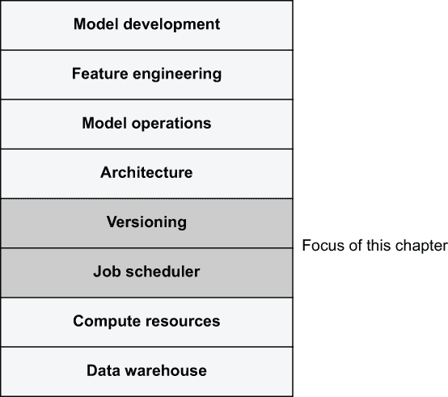

图 6.1 有效的数据科学基础设施的堆栈

在此之后，我们专注于尽可能保持工作流程执行环境的稳定性，这是堆栈中*版本控制层*的作用。许多生产故障并不是因为应用程序本身失败，而是因为其环境中的某些东西发生了变化。而像第四章中介绍的@retry 这样的技术，处理来自用户代码的故障，第 6.2 节展示了如何防止由用户代码*周围*的软件环境变化引起的故障，例如快速发展的库（如 TensorFlow 或 pandas）的新版本。

第 6.3 节侧重于防止人为错误和事故。我们需要在隔离和版本化的环境中执行生产工作流程，以便数据科学家可以继续实验新版本，而无需担心它们会干扰生产部署。理想情况下，你应该能够要求一位新实习生创建一个生产应用程序的版本，并将其与主版本并行部署，知道他们无法对现有版本造成任何破坏，甚至不是意外造成的。

你不需要将本章中介绍的所有技术应用到每个项目中。使应用程序更健壮的防御性功能可能会减慢原型设计，并可能使部署和测试新生产版本变得更加困难，从而影响整体生产力。幸运的是，生产就绪是一个连续体，而不是一个二元标签。你可以在本地工作站上快速原型化一个项目，如第 6.1 节所述，将早期版本部署到生产环境中，并在风险变得更高时，稍后应用第 6.2 节和第 6.3 节的技术。换句话说，随着项目的成熟，你可以逐渐*加固项目以抵御失败*。

在原型设计和生产需求之间不可避免地存在权衡。有效数据科学基础设施的一个主要目标是在这两种模式之间找到良好的折衷方案。图 6.2 展示了项目成熟路径上的典型权衡。

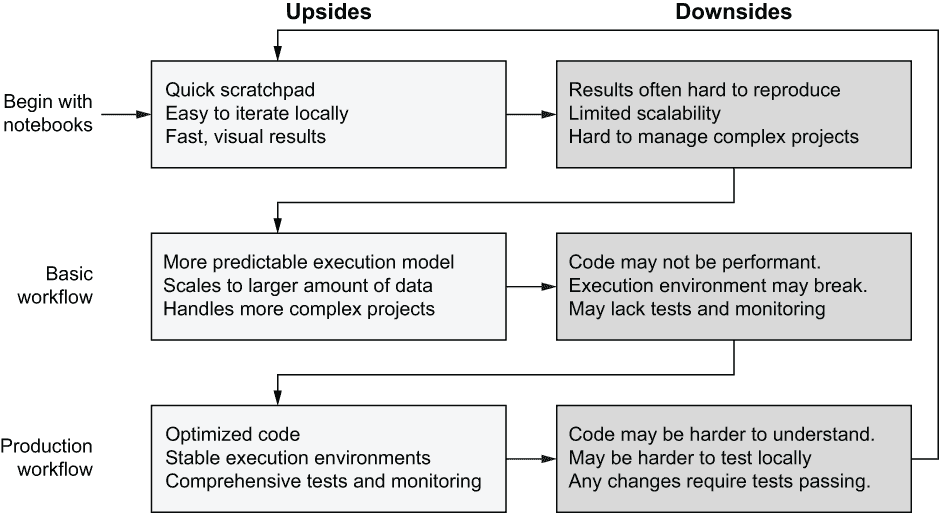

图 6.2 典型数据科学项目的成熟路径

在项目成熟路径的每个阶段，你都需要解决一组新的缺陷。随着时间的推移，随着项目的日益稳健，一些灵活性会丧失。项目的新版本可以从开始处重新开始循环，逐步改进生产版本。

本书的前几章已将你引导到“基本工作流程”阶段。本章将教你生产就绪的下一级。到本章结束时，你将达到一个已被证明足以支持 Netflix 和其他大型公司一些最关键业务机器学习应用的水平。你可以在此处找到本章的所有代码列表：[`mng.bz/06oW`](http://mng.bz/06oW)。

## 6.1 稳定的工作流程调度

*哈珀带亚历克斯参观了公司的新杯子蛋糕生产设施。受到亚历克斯有希望的样品的鼓舞，哈珀希望开始使用机器学习来优化该设施的操作。哈珀提醒亚历克斯，任何计划外的中断都会直接影响公司的收入，因此，希望亚历克斯的模型能够完美运行。听到这些，鲍伊建议他们应该在一个比亚历克斯的笔记本电脑更加健壮的环境中开始安排训练和优化工作流程。*

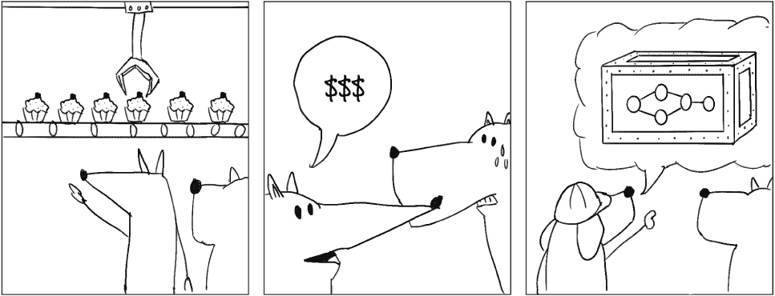

本节回答了一个简单的问题：我如何在没有人为干预的情况下可靠地执行我的工作流程？到目前为止，我们一直在命令行上通过执行类似以下命令来执行工作流程：

```
# python kmeans_flow.py run
```

输入命令需要人为干预，因此这不是适用于应自动运行的部署生产部署的好方法。此外，如果您在命令执行时关闭了终端，工作流程会崩溃——工作流程不是高度可用的。请注意，对于原型设计用例，运行命令是完美的，因为它提供了非常快速的迭代。

在第二章中，我们讨论了适用于生产级别的流程调度器或编排器，这是完成工作的正确工具。图 6.3 提醒我们工作调度层的作用：工作调度器只需要遍历工作流程的步骤，即决定如何编排 DAG 并将每个任务发送到计算层，计算层决定在哪里执行它们。关键的是，工作调度器和计算层都不需要关心确切执行什么——关于这一点稍后还会详细说明。

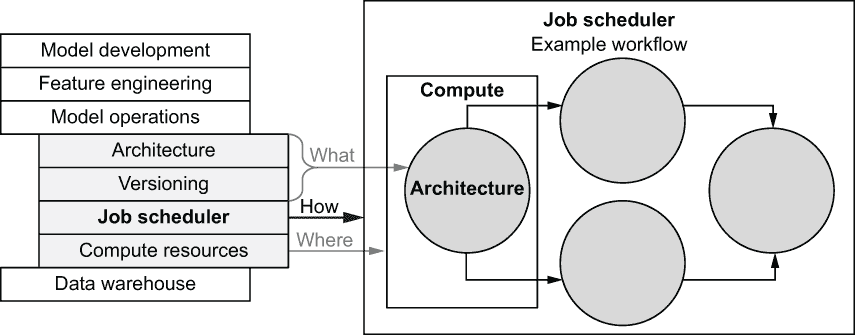

图 6.3 调度层的作用：如何编排 DAG

虽然遍历 DAG 听起来不难，但请记住，我们正在讨论生产用例：编排器可能需要处理包含数万个任务的庞大工作流程，可能有数千个这样的工作流程同时执行，编排器应该能够优雅地处理各种故障场景，包括编排器本身执行的数据中心。此外，编排器必须能够根据各种条件触发工作流程执行，例如当新数据到达时，并且它应该提供便于监控和警报的用户界面。总的来说，构建这样的系统是一个高度复杂的工程挑战，因此明智的做法是依靠最好的现成系统和服务。我们在第二章中列出了一些合适的候选者。

这也是 Metaflow 采取的方法。Metaflow 包括一个本地调度器，这对于原型设计来说已经足够好了——它支持运行命令。对于生产用例，您可以将 Metaflow 工作流程部署到几个不同的生产调度器，而无需在代码中进行任何更改。在本节中，我们将使用其中一个调度器，AWS Step Functions，来演示这个想法。请注意，一般来说，本节的讨论并不特定于 AWS Step Functions。您也可以将这种模式应用于其他工作调度器。

然而，在我们进入生产调度之前，我们必须注意另一个细节：我们需要一个集中式服务来跟踪所有运行的执行元数据，因为在云中编排工作流程时，我们不能依赖于本地存储的元数据。

### 6.1.1 集中式元数据

在第三章中，我们讨论了*实验跟踪*——跟踪执行及其结果的概念。这个术语有点误导。我们感兴趣的是跟踪的不仅仅是*实验*，还包括生产执行。因此，我们更喜欢使用一个通用术语*元数据*来指代所有账目活动。图 6.4 展示了元数据跟踪在任务执行背景下的作用。


图 6.4 Metaflow 元数据服务的作用

在顶部，我们有一个作业调度器，它会遍历 DAG。图中以 Metaflow 的本地调度器为例，但作业调度器也可以是生产调度器，例如 AWS Step Functions。调度器将任务发送到计算层，执行用户代码。用户代码产生结果或工件，如图中的 self.model，这些工件存储在数据存储库中，正如第三章所述。

在旁边，元数据服务跟踪所有启动的运行和任务。此外，当工件写入数据存储库时，元数据服务记录工件在数据存储库中的位置。关键的是，元数据不记录数据本身，因为数据已经在数据存储库中。这使我们能够保持元数据服务的相对轻量级——它只负责账目，而不是大规模数据或计算。

数据和元数据存储后，可以从外部系统查询。例如，正如我们在前面的章节中看到的，我们可以使用 Metaflow 客户端 API 在笔记本中查询运行及其结果。客户端 API 与元数据服务通信以确定可用的运行，并与数据存储库通信以访问其结果。

大多数现代数据科学和机器学习基础设施框架都提供集中式元数据跟踪服务。例如，MLflow ([`mlflow.org`](https://mlflow.org)) 提供了跟踪服务器，而 Kubeflow ([`kubeflow.org`](https://kubeflow.org)) 内置了一个集中式仪表板，用于存储和显示所有已执行的运行。

默认情况下，Metaflow 在本地文件中跟踪元数据。这对于小规模的个人原型设计来说是足够的，但对于更严肃的使用场景，你应该设置一个基于云的集中式元数据服务。集中式元数据跟踪提供了以下好处：

+   你需要一个元数据服务才能使用生产调度器，因为基于云的调度器没有“本地文件”的概念。

+   你可以在任何地方执行运行，无论是原型设计还是生产，并且可以放心，元数据始终在单一位置一致地跟踪。

+   集中式元数据使协作成为可能，因为所有用户都可以发现和访问过去运行的成果，无论是由谁启动的。更多内容请参阅第 6.3 节。

+   云端服务更稳定：所有元数据都可以存储在可以复制和定期备份的数据库中。

为 Metaflow 设置集中式元数据服务

就本书撰写时的情况而言，Metaflow 提供的元数据服务是一个典型的容器化微服务，它使用 Amazon 关系数据库服务（RDS）来存储元数据。该服务可以部署在 AWS 弹性容器服务（ECS）或弹性 Kubernetes 服务（EKS）上，例如。

部署服务的最简单方法是使用 Metaflow 安装说明中提供的 CloudFormation 模板（[`docs.metaflow.org`](https://docs.metaflow.org)）。使用 CloudFormation 模板的另一个好处是它还可以设置 AWS Step Functions，我们将在下一节中使用它。

在您设置并配置了 Metaflow 元数据服务之后，您可以使用客户端 API 访问结果，就像之前一样——用户界面 API 没有任何变化。您可以通过运行以下命令来确保 Metaflow 正在使用元数据服务而不是本地文件：

```
# metaflow status
```

如果服务配置正确，您应该看到以下类似的输出：

```
# Using Metadata provider at: 
➥ https://x3kbc0qyc2.execute-api.us-east-1.amazonaws.com/api/
```

您可以通过使用 run 命令执行任何流程来测试服务是否正常工作。您应该注意到，当使用服务时，运行和任务 ID 要短得多（例如，HelloFlow/2 与 HelloFlow/1624840556112887 相比）。本地模式使用时间戳作为 ID，而服务生成全局唯一的短 ID。

如果您不确定客户端 API 使用的是哪个元数据服务，您可以使用 get_metadata 函数来查找。您可以在笔记本中执行如下单元格：

```
from metaflow import get_metadata
print(get_metadata())
```

如果服务使用正确，您应该看到以下类似的输出：

```
service@https://x3kbc0qyc2.execute-api.us-east-1.amazonaws.com/api/
```

Metaflow 将配置存储在用户主目录的~/.metaflowconfig/中。如果您组织中有许多数据科学家，与他们都共享同一组配置文件是有益的，这样他们可以从一致的基础设施中受益，并通过共享的元数据服务和数据存储进行协作。另一方面，如果您需要维护组织之间的边界，例如出于数据治理的原因，您可以设置多个独立的元数据服务。您还可以通过使用单独的 S3 存储桶来定义不同数据存储之间的严格安全边界。

在您配置 Metaflow 使用基于 S3 的数据存储和集中式元数据之后，可能会有时候您想使用本地数据存储和元数据来测试某些内容，例如用于故障排除。您可以按照以下方式操作：

```
# python myflow.py --datastore=local --metadata=local run
```

这些选项指示 Metaflow 在默认配置的情况下回退到本地数据存储和元数据。

### 6.1.2 使用 AWS Step Functions 与 Metaflow

AWS Step Functions (SFN) 是由 AWS 提供的云服务，它是一个高度可用和可扩展的工作流编排器（作业调度器）。尽管有许多其他现成的流程编排器可用，但与替代方案相比，SFN 具有许多吸引人的特性，如下所述：

+   与 AWS Batch 类似，它是一个完全托管的服务。从操作者的角度来看，该服务实际上无需维护。

+   AWS 在提供高度可用性和可扩展性的服务方面有着卓越的记录。尽管许多替代方案声称具有这些特性，但并非所有都能按预期工作。

+   与内部运营类似服务的全部成本相比，运营总成本可以非常有竞争力，尤其是考虑到保持系统运行不需要任何人员。

+   SFN 可以无缝集成其他 AWS 服务。

当谈到 SFN 的缺点时，截至本书编写时，如果没有像 Metaflow 这样的库使用它们本地的基于 JSON 的语法手动定义 SFN 工作流程，那么很难定义。此外，SFN 的 GUI 有点笨拙。还有，SFN 的一些限制会约束工作流程的最大大小，这可能会影响具有非常宽泛 foreachs 的工作流程。

让我们看看它在实际中的工作方式。首先，确保你已经按照 Metaflow 文档中的说明部署了 Step Functions 集成。最简单的方法是使用提供的 CloudFormation 模板，它为你设置好一切，包括元数据服务。接下来，让我们定义一个简单的流程，如下一列表所示，我们用它来测试 SFN。

列表 6.1 测试 Step Functions 的简单流程

```
from metaflow import FlowSpec, Parameter, step

class SFNTestFlow(FlowSpec):

    num = Parameter('num',
                    help="Give a number",
                    default=1)

    @step
    def start(self):
        print("The number defined as a parameter is", self.num)
        self.next(self.end)

    @step
    def end(self):
        print('done!')

if __name__ == '__main__':
    SFNTestFlow()
```

将代码保存到 sfntest.py 并确保它在本地工作：

```
# python sfntest.py run
```

接下来，让我们将工作流程部署到生产环境！你只需要执行下一个命令：

```
# python sfntest.py step-functions create
```

如果一切顺利，你应该会看到如下输出：

```
Deploying SFNTestFlow to AWS Step Functions...
It seems this is the first time you are deploying SFNTestFlow to AWS Step Functions.

A new production token generated.
The namespace of this production flow is
    production:sfntestflow-0-xjke

To analyze results of this production flow add this line in your notebooks:
    namespace("production:sfntestflow-0-xjke")

If you want to authorize other people to deploy new versions of this flow to AWS Step Functions, they need to call
    step-functions create --authorize sfntestflow-0-xjke
when deploying this flow to AWS Step Functions for the first time.
See "Organizing Results" at https://docs.metaflow.org/ for more information about production tokens.

Workflow SFNTestFlow pushed to AWS Step Functions successfully.
What will trigger execution of the workflow:
    No triggers defined. You need to launch this workflow manually.
```

目前我们不必担心大部分这些输出。我们将在 6.3 节中深入探讨 *生产令牌*。不过，最后一行值得注意：正如它所说的，在其当前形式下，工作流程不会自动启动。我们需要手动启动或触发它。

当你运行 step-function create 时，究竟发生了什么？Metaflow 在幕后做了一系列工作，如图 6.5 所示。

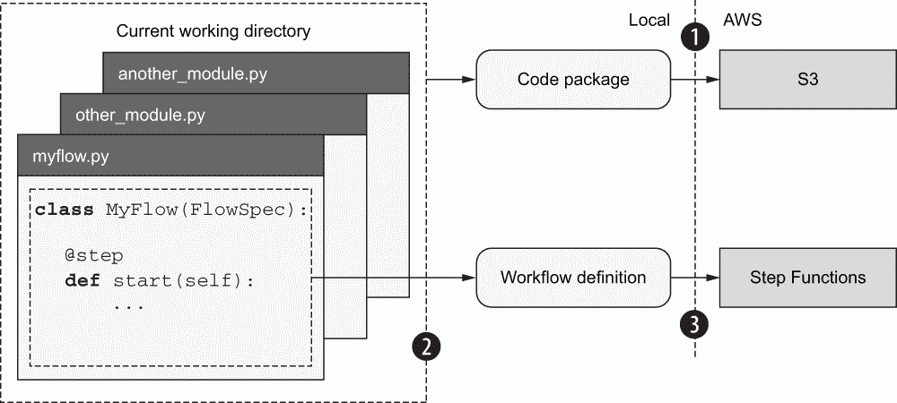

图 6.5 Metaflow 部署到 AWS Step Functions 的方式

执行了以下操作序列：

1.  Metaflow 将当前工作目录中的所有 Python 代码打包并上传到数据存储（S3），以便远程执行。更多内容将在下一节中介绍。

1.  Metaflow 解析了工作流程 DAG 并将其转换为 SFN 理解的语法。换句话说，它将你的本地 Metaflow 工作流程转换为真正的 SFN 工作流程。

1.  Metaflow 调用了一系列 AWS API 来部署翻译后的工作流程到云端。

值得注意的是，用户不需要更改他们的代码就可以将其部署到云端。这是 Metaflow 的一个重要特性：你可以在将代码部署到生产之前，在本地以及使用你选择的计算层（如 AWS Batch）测试代码。实际上，生产中运行的是相同的代码，所以如果你在本地测试中代码有效，你就可以有信心它在生产中也能工作。更重要的是，如果工作流程在生产中失败，你可以在本地重现并修复问题，然后只需再次运行 step-functions create 即可将修复版本部署到生产——更多关于这一点在第 6.3 节中介绍。

生产效率提示：当涉及到与第二章中讨论的生产部署的交互时，至关重要的是，你在本地原型化的工作流程可以在生产中以最小的更改工作，反之亦然。这使得在部署到生产之前在本地测试代码变得容易，当生产中的任务失败时，可以在本地重现这些问题。

在我们运行工作流程之前，让我们登录到 AWS 控制台，看看工作流程在 SFN 侧看起来如何。导航到 AWS 控制台上的步骤函数 UI。你应该会看到一个工作流程列表，如图 6.6 所示。

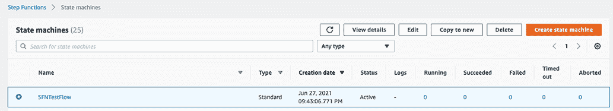

图 6.6 AWS Step Functions 控制台上的工作流程列表（状态机）

图 6.6 中显示的视图为你提供了当前执行、成功和失败的运行的快速概述。当你点击运行的名称时，你会进入如图 6.7 所示的视图。

这里目前没有什么可看的，因为没有执行。尽管“开始执行”按钮听起来很有吸引力，但实际上有更好的启动运行的方式。如果你点击该按钮，SFN 会要求你指定一个 JSON 文件，该文件应包含流程的参数，这有点麻烦手动完成。相反，我们可以在命令行上触发一个执行，如下所示：

```
python sfntest.py step-functions trigger
```

你应该看到以下类似的输出：

```
Workflow SFNTestFlow triggered on AWS Step Functions 
➥ (run-id sfn-344c543e-e4d2-4d06-9d93-c673d6d9e167  
```

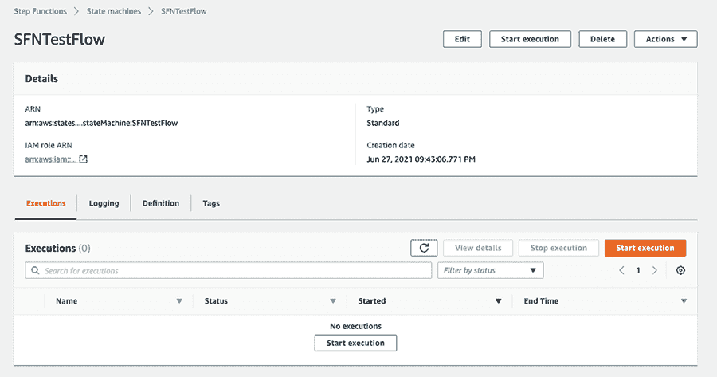

图 6.7 AWS Step Functions 控制台上的工作流程

在 SFN 上执行流程时，Metaflow 运行 ID 对应于 SFN 运行 ID，除了 Metaflow 添加的 sfn 前缀之外，所以很容易知道哪些 Metaflow 运行映射到哪些 SFN 执行。

触发命令与运行命令类似，因为它们都执行一个工作流程。然而，它们不是在本地执行，触发命令使工作流程在 SFN 上执行。关键的是，你可以关闭你的笔记本电脑，运行将在 SFN 上继续，这与本地运行相反。实际上，SFN 支持执行长达一年的工作流程！长时间不间断地运行笔记本电脑将非常不方便。

现在，如果你刷新工作流程列表，你应该会看到一个新的执行。如果你点击它，你会进入如图 6.8 所示的运行视图。

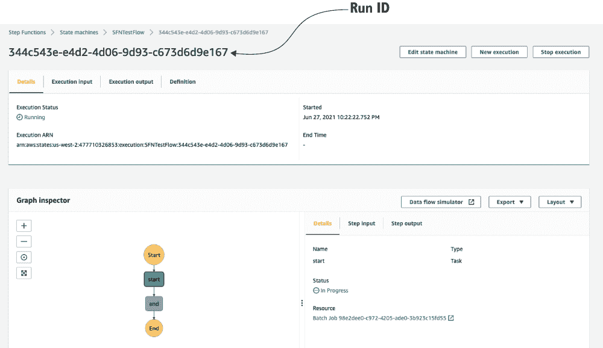

图 6.8 AWS Step Functions 控制台上的运行

注意，左上角的 ID 与触发器输出的 ID 匹配。方便的是，运行视图可视化了我们工作流程的 DAG。它实时更新，显示正在执行哪些步骤。如果您在 DAG 中单击一个步骤，在右侧面板中您会看到一个资源链接，该链接会将您带到 AWS Batch 控制台，显示与正在执行的任务对应的 AWS Batch 作业。在 AWS Batch 控制台中，您可以单击日志流链接以实时查看任务的输出。您可以通过使用熟悉的日志命令（将 ID 替换为触发器输出的您的 ID）更轻松地查看日志：

```
python sfntest.py logs sfn-344c543e-e4d2-4d06-9d93-c673d6d9e167/start
```

所有 Metaflow 命令和客户端 API 都可以在本地运行和 SFN 上的运行执行中同等工作——只是它们的 ID 格式不同。

如下所示，我们可以使用自定义参数值触发另一个执行

```
python sfntest.py step-functions trigger --num 2021
```

这将产生一个新的运行 ID，例如

```
Workflow SFNTestFlow triggered on AWS Step Functions 
➥ (run-id sfn-838650b2-4182-4802-9b1e-420bb726f7bd)
```

您可以通过检查触发运行的工件来确认参数更改是否生效

```
python sfntest.py dump sfn-838650b2-4182-4802-9b1e-420bb726f7bd/start
```

或者通过检查启动步骤的日志。注意，您可以通过执行以下命令在命令行中列出 SFN 运行：

```
python sfntest.py step-functions list-runs
```

因此，可以在不登录到 SFN 控制台的情况下触发和发现运行，以及检查日志和工件。

让我们深呼吸并总结一下我们刚刚学到的内容：

1.  我们定义了一个正常的 Metaflow 工作流程，我们能够像以前一样在本地进行测试。

1.  我们使用 step-functions create 命令将工作流程部署到云中高度可用、可扩展的生产调度器 AWS Step Functions。

1.  我们使用 step-functions 触发器触发了生产运行，并可选择使用自定义参数。即使您关闭了笔记本电脑，工作流程也会继续运行。

1.  我们在 SFN 提供的 GUI 上实时监控工作流程执行。

1.  我们使用熟悉的 CLI 命令检查了生产运行的日志和结果。

整个过程的简单性可能会让人误以为它非常简单。然而，能够如此轻松地将工作流程部署到生产调度器，对于数据科学家来说确实是一种超级能力！使用这种方法的结果是高度可用的工作流程，归功于 SFN。然而，我们手动使用触发器启动了工作流程，因此设置尚未完全自动化。在下一节中，我们将解决这个缺点。

### 6.1.3 使用 @schedule 安排运行

生产流程应无需任何人工干预即可执行。如果您有一个复杂的环境，其中包含许多相互依赖的工作流程，建议根据事件以编程方式触发工作流程，例如，当输入数据更新时重新训练模型。本节重点介绍一个更简单、更常见的方法：将工作流程部署到预定的时间表上运行。

Metaflow 提供了一个流程级别的装饰器 @schedule，允许您为工作流程定义执行时间表。请参见以下代码示例中的示例。

列表 6.2 使用 @schedule 的流程

```
from metaflow import FlowSpec, Parameter, step, schedule

@schedule(daily=True)                 ❶
class DailySFNTestFlow(FlowSpec):

    num = Parameter('num',
                    help="Give a number",
                    default=1)

    @step
    def start(self):
        print("The number defined as a parameter is", self.num)
        self.next(self.end)

    @step
    def end(self):
        print('done!')

if __name__ == '__main__':
    DailySFNTestFlow()
```

❶ 使工作流程在午夜自动触发

将代码保存在 dailysfntest.py 中。在这里，我们通过使用@schedule(daily=True)注解流程来定义一个简单的每日计划。这将使流程在 UTC 时区的午夜开始。当本地运行流程时，@schedule 没有任何效果。它将在您执行以下操作时生效：

```
python dailysfntest.py step-functions create
```

就这样！工作流程现在将每天自动运行一次。您可以在 SFN UI 上观察过去执行的运行 ID，或者使用前面描述的步骤函数 list-runs。

注意，您不能为计划中的运行更改参数值——所有参数都分配了它们的默认值。如果您需要动态参数化工作流程，可以使用任意 Python 代码，例如在启动步骤中。

除了每天运行工作流程之外，还提供了以下简写装饰器：

+   @schedule(weekly=True)—每周日午夜运行工作流程

+   @schedule(hourly=True)—每小时运行工作流程

或者，您可以使用 cron 属性定义一个自定义的计划。例如，这个表达式每天上午 10 点运行工作流程：@schedule(cron='0 10 * * ? *')。您可以在[`mng.bz/KxvE`](http://mng.bz/KxvE)找到更多 cron 计划的示例和语法描述。

现在我们已经学会了如何在没有人监督的情况下安排流程执行，这涵盖了生产部署的*自动化*需求。接下来，我们将把注意力转向*高可用性*，即如何在不断变化的环境中保持部署的稳定性。

## 6.2 稳定的执行环境

*亚历克斯为他们与鲍伊一起搭建的现代基础设施堆栈感到自豪。这允许公司的所有数据科学家在本地开发工作流程，并轻松地将它们部署到云中的强大生产调度器。亚历克斯开始了应得的假期。在假期期间，亚历克斯收到一条通知，提醒他一个已经完美运行了几周的生产工作流程昨晚神秘地崩溃了。当亚历克斯调查此事时，发现工作流程总是安装 TensorFlow 的最新版本。就在昨天，TensorFlow 发布了一个与生产工作流程不兼容的新版本。为什么这些事情总是在假期发生？*


实际上，几乎所有数据科学和机器学习工作流程都使用第三方库。事实上，几乎可以肯定的是，您工作流程中的绝大多数代码行都位于这些库中。在开发过程中，您可以通过使用不同的数据集和参数化来测试库的行为，以获得对特定版本的库工作正确的信心，但当一个新版本发布时会发生什么呢？大多数现代机器学习和数据科学库都在快速发展。

这个问题并不仅限于数据科学。软件工程师们几十年来一直在努力解决*依赖管理*问题。已经存在许多关于开发和发布软件库的最佳实践。例如，大多数表现良好的库在更改其公共 API 时会非常谨慎，这可能会破坏使用该库的应用程序。

库的公共 API 应该提供一个清晰的契约。想象你有一个提供函数 requests.get(url)的库，该函数通过 HTTP 获取给定的 URL 并返回字节字符串内容。只需阅读该函数的简短描述，就可以清楚地了解该函数应该如何表现。与此相对比的是，一个提供以下 API 的机器学习库用于 K-means 聚类：KMeans(k).fit(data)。契约要宽松得多：库可能会更改簇的初始化方式、使用的优化算法、数据处理方式以及如何在多个 CPU 或 GPU 核心上分配实现，而无需更改 API。所有这些变化都可能微妙地改变库的行为并导致意外的副作用。

松散的 API 契约和数据科学的一般统计特性使得数据科学工作流程的依赖管理比软件工程师面临的问题更为复杂。例如，想象一个机器学习库包含一个名为 train()的方法。该方法可能使用一种像*随机梯度下降*这样的技术，这可以以许多不同的方式实现，每种方式都有其自身的优缺点。如果实现方式在库的不同版本之间发生变化，它可能会对生成的模型产生重大影响，尽管技术上 train() API 保持不变。软件工程中的失败通常非常明显——可能是返回类型已更改，或者函数引发了一个新的异常，导致程序因冗长的错误消息而崩溃。然而，在数据科学中，你可能会简单地得到一个略有偏斜的结果分布，而没有任何失败，这使得甚至难以注意到有什么变化。

当你在原型化一个新应用程序时，能够灵活地使用任何库的最新版本当然是非常方便的。在原型化过程中，没有人会依赖你的工作流程输出，因此快速变化是可以接受和预期的。然而，当你将工作流程部署到生产环境中时，对依赖关系的谨慎处理开始变得重要。你不想在度假期间接到关于生产管道（比如糟糕的亚历克斯）意外失败的通知，或者面对难以调试的问题，比如为什么结果看起来与之前略有不同。为了避免任何意外，你希望生产部署在尽可能稳定的环境中执行，这样除非你明确行动和批准，否则什么都不会改变。

执行环境

我们所说的*执行环境*是什么意思？考虑我们之前执行过的 Metaflow 工作流程，例如 KMeansFlow，这是我们之前章节中开发的。当你通过执行，比如，python kmeans_flow.py run 来运行工作流程时，执行的入口点是 kmeans_flow.py，但为了使流程成功执行，还需要存在许多其他模块和库，这些模块和库共同构成了 kmeans_flow.py 的执行环境。图 6.9 说明了这个概念。

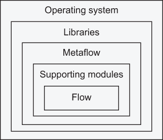

图 6.9 流程的执行环境层

在中心，我们有流程本身，kmeans_flow.py。流程可能使用用户定义的支持模块，如 scale_data.py，其中包含加载数据的函数。要执行流程，你需要 Metaflow，它本身就是一个库。在此基础上，你还有所有其他第三方库，如 Scikit-Learn，我们在 K-means 示例中使用过。最后，整个包在操作系统上执行。

为了为生产部署提供一个稳定的执行环境，冻结图 6.9 中显示的所有层的不可变快照是有益的。请注意，这包括所有*传递依赖**，即其他库本身使用的所有库。通过这样做，你可以确保新的库发布不会对部署产生未计划的影响。你可以控制如何以及何时升级库。

建议：为了最小化意外，冻结生产部署中的所有代码是有益的，包括工作流程本身及其所有依赖项。

技术上，我们有多种方式来实现这种快照功能。一种常见的方法是使用 Docker 等工具将图 6.9 中显示的所有层打包到一个容器镜像中。我们将在 6.2.3 节中讨论这种方法。另一种方法是 Metaflow 提供了内置的功能来处理层的快照，我们将在下一节中讨论。为了使讨论更加有趣和具体，我们将它们放在一个真实的数据科学应用背景下：时间序列预测。

示例：时间序列预测

时间序列预测有无数的应用，即根据历史数据预测未来的数据点。许多预测技术和现成的软件包都包括这些技术的有效实现。这类软件库是我们希望在数据科学工作流程中包含的典型例子，因此我们使用预测应用来展示与依赖管理及稳定执行环境相关的概念。在以下示例中，我们将使用一个名为 Sktime 的库([sktime.org](https://sktime.org))。

因为刚刚学习了如何自动调度工作流，让我们选择一个需要频繁更新的应用程序：天气预报。我们不敢深入探讨气象学——相反，我们只是根据给定位置的过去温度序列，提供未来几天的每小时温度预报。当然，这是一种愚蠢的天气预报方式，但温度数据很容易获得，我们可以轻松实现这个应用程序。

我们将使用名为 OpenWeatherMap 的服务（[openweathermap.org](https://openweathermap.org/））来获取天气数据。要使用此服务，您需要在网站上注册一个免费账户。注册后，您将收到一个私有的应用程序 ID 令牌，您可以在以下示例中输入。所需的令牌是一个看起来像这样的字符串：6e5db45abe65e3110be635abfb9bdac5。

完成天气预报示例后，可以将天气数据集替换为另一个实时时间序列，如股价，作为练习。

### 6.2.1 Metaflow 如何打包流程

在第四章中，我们学习了如何通过执行 run-with-batch 在云中简单地执行工作流。不知何故，Metaflow 能够将您在本地工作站（可能是一台笔记本电脑）上编写的代码，在数百或数千英里外的云数据中心执行。令人惊讶的是，您不需要做任何事情来保存或以任何特定方式打包代码，就可以实现这一点。这要归功于 Metaflow 自动将用户代码及其支持模块打包到*代码包*中。

默认情况下，代码包包括流程模块，当前工作目录及其子目录中的任何其他 Python (.py) 文件，以及 Metaflow 库本身。这对应于图 6.10 中突出显示的层。

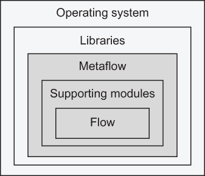

图 6.10 Metaflow 代码包包含的内容

为了了解实际工作原理，让我们首先为我们的天气预报应用程序创建一个支持模块。该模块，如列表 6.3 所示，从 OpenWeatherMap 获取给定位置过去五天的温度时间序列。

列表 6.3 获取温度时间序列的实用模块

```
from datetime import datetime, timedelta

HISTORY_API = 'https://api.openweathermap.org/data/2.5/onecall/timemachine'❶

def get_historical_weather_data(appid, lat, lon):                          ❷
    import pandas as pd                                                    ❸
    import requests                                                        ❸

    now = datetime.utcnow() 
    data = []
    index = []
    for ago in range(5, 0, -1):                                            ❹
        tstamp = int((now - timedelta(days=ago)).timestamp())              ❺
        params = {'lat': lat, 'lon': lon, 'dt': tstamp,                    ❺
                  'appid': appid, 'units': 'imperial'}                     ❺
        reply = requests.get(HISTORY_API, params=params).json()            ❺
        for hour in reply['hourly']:
            data.append(hour['temp'])                                      ❻
            index.append(datetime.utcfromtimestamp(hour['dt']))            ❻
    return pd.Series(data=data,                                            ❻
                     index=pd.DatetimeIndex(index, freq='infer'))

def series_to_list(series):                                                ❼
    index = map(lambda x: x.isoformat(), series.index)
    return list(zip(index, series))
```

❶ 返回历史天气数据的 API 端点

❷ 返回过去五天的温度时间序列

❸ 在函数内部进行导入以避免模块级依赖

❹ 按时间顺序请求过去五天的数据

❺ 准备并发送请求到 OpenWeatherMap

❻ 构建每小时温度的时间序列

❼ 将 pandas 时间序列转换为元组列表

将代码保存到 openweatherdata.py。该模块包含两个函数：get_historical_weather_data，它返回过去五天的温度时间序列，以及一个实用函数，series_to_list，它将 pandas 时间序列转换为元组列表。

get_historical_weather_data 函数接受三个参数：你的私有 appid，你可以通过在 OpenWeatherMap 上注册来获取它，以及你想要获取天气数据的地点的纬度（lat）和经度（lon）。

该函数展示了一个重要的习惯用法：与在模块顶部执行所有导入语句的典型 Python 习惯相反，我们在函数体内导入所有第三方模块——即不在 Python 标准库中的模块，如 pandas 和 Requests。这使得即使没有安装这两个库的人也能导入该模块。他们可以使用模块的一些功能，而无需安装每个依赖项。

习惯用法 如果你认为一个支持模块可能在许多不同的上下文中使用，那么在文件顶部而不是在函数体内导入任何第三方库是一个好主意。这样，模块本身就可以导入，而无需安装模块中所有函数所需的所有依赖项的并集。

OpenWeatherMap API 在一个请求中返回单日的每小时数据，因此我们需要一个循环来检索过去五天的数据。对于每一天，该服务返回一个包含每小时温度（华氏度）数组的 JSON 对象。如果你更喜欢摄氏度，请将单位从英制改为公制。我们将每日数组转换为单个 pandas 时间序列，每个小时都有一个 datetime 对象作为键。这种格式使得绘图和使用数据来进行预测变得容易。

series_to_list 函数简单地将 get_historical_weather_data 生成的 pandas 时间序列转换为 Python 元组列表。我们稍后会回到这个函数的动机。

拥有一个独立的模块的好处是你可以轻松地对其进行测试，而无需依赖任何流程。打开一个笔记本或 Python shell，尝试以下行：

```
from openweatherdata import get_historical_weather_data
APPID = ‘my-private-token'
LAT = 37.7749
LON = 122.4194
get_historical_weather_data(APPID, LAT, LON)
```

你可以用除旧金山以外的其他地点替换 LAT 和 LON。用你的私有令牌替换 APPID。如果一切顺利，你应该会看到一个温度列表。请注意，你需要安装 pandas 才能执行此操作。如果你还没有安装，不要担心——你很快就能看到结果！

接下来，我们可以开始开发实际的预测流程。遵循我们的螺旋式流程开发方法，我们目前不担心预测模型。我们只需插入输入，这些输入由 openweatherdata.py 提供，以及一些输出。我们将使用 @conda 来包含外部库，就像在前两个章节中做的那样，我们将在下一节中详细介绍这一点。以下列表包含 ForecastFlow 的第一次迭代。

列表 6.4 ForecastFlow 的第一个版本

```
from metaflow import FlowSpec, step, Parameter, conda

class ForecastFlow(FlowSpec):

    appid = Parameter('appid', required=True)
    location = Parameter('location', default='36.1699,115.1398')

    @conda(python='3.8.10', libraries={'sktime': '0.6.1'})
    @step
    def start(self):                                                         ❶
        from openweatherdata import get_historical_weather_data, 
        ➥ series_to_list
        lat, lon = map(float, self.location.split(','))
        self.pd_past5days = get_historical_weather_data(self.appid, lat, lon)❷
        self.past5days = series_to_list(self.pd_past5days)                   ❸
        self.next(self.plot)

    @conda(python='3.8.10', libraries={'sktime': '0.6.1',
                                       'seaborn': '0.11.1'})
    @step
    def plot(self):                                                          ❹
        from sktime.utils.plotting import plot_series
        from io import BytesIO
        buf = BytesIO()
        fig, _ = plot_series(self.pd_past5days, labels=['past5days'])        ❺
        fig.savefig(buf)                                                     ❺
        self.plot = buf.getvalue()                                           ❻
        self.next(self.end)

    @conda(python='3.8.10')
    @step
    def end(self):
        pass

if __name__ == '__main__':
    ForecastFlow()
```

❶ 在开始步骤中使用我们的 openweatherdata 模块加载数据

❷ 将 pandas 数据序列保存在一个工件中

❸ 将数据序列的 Python 版本保存在另一个工件中

❹ 这是我们输出步骤。它绘制时间序列。

❺ 在内存缓冲区中绘制并保存时间序列

❻ 将图表存储在工件中

将列表保存为 forecast1.py。要运行列表，您需要按照附录中的说明安装 Conda。

开始步骤负责获取输入数据，并将其委托给辅助模块 openweatherdata.py，这是我们第 6.3 节中创建的。值得注意的是，开始步骤创建了两个工件：pd_past5days，它包含过去五天的温度的 pandas 时间序列，以及 past5days，它包含相同的数据，但已转换为 Python 列表。请注意，我们不需要显式指定 pandas 依赖项，因为它是由 Seaborn 包的传递依赖项。

你可能会想知道为什么需要将相同的数据存储两次，只是两种不同的格式。动机再次是依赖关系：例如，要在笔记本中使用 Client API 读取 pd_past5days，你需要安装特定版本的 pandas。相比之下，你可以不依赖任何其他库来读取 past5days。我们本可以只存储 past5days，但流程的其他步骤需要 pandas 版本，并且由于@conda 装饰器，它们保证有正确的 pandas 版本。

建议：您应该优先将工件存储为内置 Python 类型，而不是依赖于第三方库的对象，因为原生 Python 类型在不同的上下文中都是可读的，无需外部依赖。如果您需要在流程中使用复杂对象，请考虑同时存储一个可共享的 Python 版本以及一个对象版本作为单独的工件。

尝试以下方式执行流程：

```
python forecast1.py  --environment=conda run --appid my-private-token
```

将 my-private-token 替换为您的个人 OpenWeatherMap 令牌。第一次运行流程需要几分钟，因为需要初始化 Conda 环境。后续运行应该会快得多。

运行完成后，您可以在笔记本中打开一个实例化 Run 对象的笔记本，该对象对应于刚刚完成的运行。您可以通过执行以下单元格来查看温度图：

```
From metaflow import Run
from IPython.display import Image
run = Run(‘ForecastFlow/16242950734051543')
Image(data=run.data.plot)
```

将运行 ID 替换为您运行的实际 ID。图 6.11 显示了结果的外观。它显示了五天内拉斯维加斯的每小时温度图，除非您更改了--location，否则它显示了昼夜之间温度变化的明显模式。由于天气不是恒定的，您的时间序列看起来会不同。

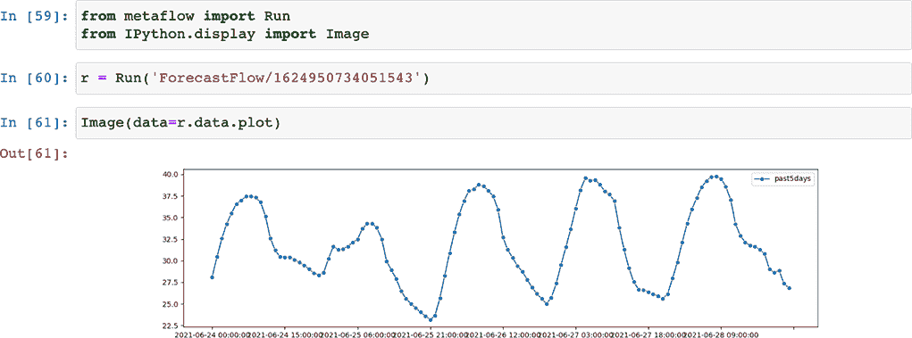

图 6.11 拉斯维加斯的每小时温度时间序列

您可以使用单个语句显示图表的事实突出了依赖关系管理的一个重要细节：有时在 Metaflow 内部生成图像而不是在笔记本中是有益的。尽管您也可以在笔记本中调用 plot_series 与 pd_past5days，但这要求您在笔记本内核中安装并可用 pandas、Sktime 和 Seaborn 包。即使您已安装，您的同事可能没有。

Metaflow 中如何生成和存储图像，通过绘图步骤进行演示。许多可视化库，如 Matplotlib，允许将绘图渲染并保存到内存缓冲区（buf）中。然后，您可以保存缓冲区中的字节，即图像文件，到 Metaflow 工件（此处为 self.plot），以便客户端 API 可以轻松检索它。

建议：如果您的流程从易于多个利益相关者访问的图表中受益，请考虑在 Metaflow 步骤内生成和保存它们，而不是在笔记本中。这样，利益相关者无需安装任何额外的依赖项即可查看图像。

在 Metaflow 内部生成图表的这种模式对于生产部署特别有用，在您确定哪些图表对监控流程有用之后，能够广泛共享它们是有益的。相比之下，在原型设计期间，在笔记本中快速设计和迭代可视化可能更容易。

Metaflow 代码包

现在我们有一个正在运行的流程，我们可以回到本节原始问题的原点：Metaflow 代码包包含什么，以及它是如何构建的？

您可以通过执行 package list 来查看代码包的内容：

```
python forecast1.py --environment=conda package list
```

注意，您需要为所有命令指定--environment=conda，包括使用@conda 装饰器应用于流程的包列表。您还可以设置环境变量，METAFLOW_ENVIRONMENT=conda，以避免必须显式设置选项。

您应该看到一个长文件列表。注意列表中的以下两点：

1.  默认情况下，Metaflow 将当前工作目录及其子目录中所有以.py 后缀结尾的文件（即 Python 源文件）包含在作业包中。这允许您在项目中轻松使用自定义模块和 Python 包——只需将它们包含在相同的当前工作目录中。

1.  Metaflow 将 Metaflow 自身包含在作业包中，这使得您可以在云中使用通用容器镜像，因为它们不需要预先安装 Metaflow。这也保证了您在本地看到的与在云中获得的相同结果。

有时您可能希望在代码包中包含除 Python 之外的其他文件。例如，您的数据处理步骤可能执行存储在单独.sql 文件中的 SQL 语句，或者您的代码可能调用自定义的二进制文件。您可以通过使用--package-suffixes 选项将任何文件包含在作业包中。考虑一个具有以下目录结构的假设项目：

```
mylibrary/__init__.py
mylibrary/database.py
mylibrary/preprocess.py
sql/input_data.sql
myflow.py
```

这里，mylibrary 是一个 *Python 包*（如果你不熟悉 Python 包，请参阅 [`mng.bz/95g0`](http://mng.bz/95g0)），它包含两个模块，database 和 preprocess。包允许你将多个相互关联的模块作为一个库分组。你可以在步骤代码中使用自定义包，只需编写以下内容：

```
from mylibrary import preprocess
```

这即使在执行 myflow.py 中的假设流程时也能正常工作

```
python myflow.py run --batch
```

或者将其部署到步骤函数中，因为 Metaflow 会递归地将所有 Python 文件打包到作业包中。然而，要包含 input_data.sql 到代码包中，你需要执行

```
python myflow.py --package-suffixes .sql run --batch
```

这条指令指示 Metaflow 包含所有 .sql 文件以及 .py 文件到代码包中。要访问代码中的 SQL 文件，你可以像通常一样打开文件，如下所示：

```
open(‘sql/input_data.sql')
```

注意，你应该始终在 Metaflow 代码中使用相对路径而不是绝对路径（任何以斜杠开头的路径），例如 /Users/ville/arc/sql/input_data.sql，因为绝对路径在你的个人工作站外将不起作用。

技术上，你可以在代码包中包含任意的数据文件。然而，正如其名所示，代码包应该仅用于可执行代码。更好地将数据作为数据工件处理，这些工件可以从去重和延迟加载中受益。你可以使用第三章中介绍的 IncludeFile 构造来捆绑运行中的任意数据文件，这对于小数据集是一个很好的解决方案。下一章提供了更多管理大数据集的想法。

### 6.2.2 为什么依赖管理很重要

在上一节中，我们学习了 Metaflow 如何自动将本地 Python 文件打包到代码包中，该代码包可以发送到不同的计算层，如 AWS Batch，以执行。在稳定执行环境方面，我们涵盖了洋葱的最内层三个层，如图 6.12 所示，但代码包并没有解决第三方库的问题。

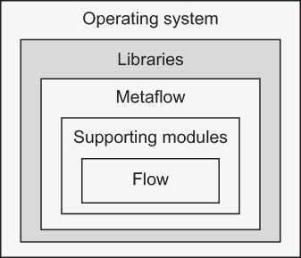

图 6.12 关注执行环境的库层

为什么我们不能在代码包中也包含库呢？最重要的是，现代机器学习库往往很复杂，大部分是用 C++ 等编译语言实现的。它们比简单的 Python 包有更多的要求。特别是，几乎所有库都依赖于许多其他库，所以“库”层不仅包括你直接导入的库，如 TensorFlow，还包括 TensorFlow 内部使用的所有库——多达几十个。

我们将这些由库使用的库称为 *传递依赖*。为了确定需要包含在任务执行环境中的完整库集，我们必须识别所有库及其传递依赖。确定这个依赖图——这个操作通常被称为 *依赖解析*——是一个令人惊讶的非平凡问题。

你可能会想，这个问题不是已经解决了吗？毕竟，你可以 pip install tensorflow，通常它都能正常工作。考虑以下你可能也遇到过的两个问题：

1.  *冲突*——你安装的库越多，你想要安装的库的依赖图与现有库发生冲突的可能性就越大，安装就会失败。例如，许多机器学习库，如 Scikit-Learn 和 TensorFlow，需要特定版本的 NumPy 库，因此经常会有与 NumPy 版本错误相关的冲突。

    这种问题可能很难调试和解决。一个常见的解决方案是公司里有人仔细维护一组相互兼容的包，这是一项繁琐的工作。更糟糕的是，它限制了迭代的速度。不同的项目不能独立做出选择，因为每个人都必须使用一组共同的库。

    另一个常见的解决方案是限制依赖图的大小，从而最大限度地减少冲突的可能性，即使用*虚拟环境*（见[`mng.bz/j2aV`](http://mng.bz/j2aV)）。使用虚拟环境，你可以创建和管理隔离的库集。这是一个很好的概念，但手动管理多个虚拟环境也可能很繁琐。

1.  *可重复性*——pip install（或 conda install）默认情况下从头开始执行依赖项解析。这意味着每次运行，例如 pip install tensorflow，你可能会得到一组不同的库。即使你要求特定的 TensorFlow 版本，它的传递依赖也可能随着时间的推移而演变。如果你想重现过去执行的结果，比如一个月前的一次运行，可能实际上无法确定用于产生结果的精确库集。

    注意，默认情况下，虚拟环境并不能帮助解决这个可重复性问题，因为 pip install tensorflow 在虚拟环境中同样不可预测。为了获得一个稳定的执行环境，你需要将整个虚拟环境本身冻结。

第一个问题损害了原型设计，因为你不能轻易地实验最新的库。第二个问题损害了生产，因为生产部署可能会因为库中的意外变化而失败。这些问题对每个基础设施都是通用的——它们并不特定于 Metaflow 或任何其他技术方法。

依赖项管理容器

今天，最常见的依赖项管理解决方案是使用容器镜像。正如我们在第四章中简要讨论的那样，容器镜像可以封装图 6.12 中的所有层，包括操作系统，尽管操作系统*内核*——与硬件交互的操作系统核心——通常在许多容器之间共享。

从依赖管理角度来看，容器镜像就像虚拟环境一样工作，具有类似的优缺点：它们可以帮助划分依赖图以避免冲突。一个缺点是，你需要一个系统，例如具有容器注册库的 *持续集成和持续部署*（CI/CD）设置，来创建和管理一系列的镜像。大多数公司只管理少量已准备好的生产镜像，以减少复杂性。

此外，尽管在相同的图像上执行相同的代码可以保证高度的再现性，但要生成可再现的图像则需要一些努力。如果你仅仅在图像规范（例如 Dockerfile）中使用 pip install tensorflow，那么你只是将可再现性问题推向了更深的一层。

Metaflow 对于基于容器的依赖管理效果良好。假设你有一个创建镜像的机制，你可以创建一个包含所有所需库的镜像，并让 Metaflow 的代码包在运行时将用户代码覆盖在基础镜像之上。这是一个可靠的解决方案，特别是对于生产部署。

对于原型设计来说，一个挑战是本地创建和使用容器并不直接。为了解决这一不足，Metaflow 内置了对 Conda 包管理器的支持，它将简单的原型设计体验与稳定的生成环境相结合。

依赖管理的实用方法

你可以采用分层的方法来管理依赖项，以平衡快速原型设计和稳定生产的需求。以下是一个实用方法：

+   在流程模块内部定义 DAG 和简单步骤。对于简单的流程和原型设计，这可能就是你所需要的全部。你可以依赖你本地已安装的任何库。

+   为逻辑上相关的函数集创建单独的 *支持模块*。一个单独的模块可以在多个流程之间共享，也可以在 Metaflow 之外使用，例如在笔记本中。单独的模块也适合进行测试，例如使用标准的单元测试框架如 PyTest ([pytest.org](https://pytest.org))。

+   使用 Python *包创建包含多个模块的定制库*。只要包与主流程模块位于相同的目录层次结构中，它就会自动包含在代码包中。

+   使用 @conda 管理第三方库。

+   如果你需要复杂的依赖管理，而 @conda 无法处理，或者你的公司有创建 *容器镜像* 的工作流程，那么你可以将它们作为 @conda 的替代品或补充。

这些层可以很好地协同工作：一个复杂的项目可以由许多流程组成，这些流程可能共享许多模块和包。它们可以在公司特定的基础镜像上运行，使用 @conda 在其上覆盖项目特定的依赖项。

### 6.2.3 使用 @conda 装饰器

Conda([`conda.io`](https://conda.io))是一个开源的包管理器，在 Python 数据科学和机器学习生态系统中被广泛使用。尽管 Conda 本身不能解决所有依赖管理问题，但它是一个可靠的工具，您可以使用它来解决前面描述的问题。Metaflow 提供与 Conda 的内置集成，原因如下：

+   Conda 生态系统包含大量的机器学习和数据科学库。

+   Conda 通过提供内置的虚拟环境和强大的依赖解析器来帮助解决冲突问题。正如我们很快就会看到的，它通过冻结环境来允许我们解决可重复性问题。

+   Conda 不仅处理 Python 依赖项，还处理系统库。这对于数据科学库尤其重要，因为它们包含许多编译组件和非 Python 的间接依赖项。作为额外的好处，Conda 还将 Python 解释器本身作为依赖项处理，因此您可以使用不同的 Python 版本。

为了了解 Metaflow 如何在实际中利用 Conda 解决依赖管理问题，让我们继续我们的预测示例。以下代码列表包含了一个骨架流程，该流程获取输入数据——过去五天的温度，并将其绘制出来。我们将通过添加一个执行实际预测的步骤 forecast 来扩展此代码中的流程。

列表 6.5：具有预测步骤的 ForecastFlow

```
from metaflow import FlowSpec, step, Parameter, conda, schedule

@schedule(daily=True)                                                  ❶
class ForecastFlow(FlowSpec):

    appid = Parameter('appid', default='your-private-token')           ❷
    location = Parameter('location', default='36.1699,115.1398')

    @conda(python='3.8.10', libraries={'sktime': '0.6.1'})
    @step
    def start(self):                                                   ❸
        from openweatherdata import get_historical_weather_data, 
        ➥ series_to_list
        lat, lon = map(float, self.location.split(','))
        self.pd_past5days = get_historical_weather_data(self.appid, lat, lon)
        self.past5days = series_to_list(self.pd_past5days)
        self.next(self.forecast)

    @conda(python='3.8.10', libraries={'sktime': '0.6.1'})
    @step
    def forecast(self):
        from openweatherdata import series_to_list
        from sktime.forecasting.theta import ThetaForecaster
        import numpy
        forecaster = ThetaForecaster(sp=48)   
        forecaster.fit(self.pd_past5days)                              ❹
        self.pd_predictions = forecaster.predict(numpy.arange(1, 48))  ❹
        self.predictions = series_to_list(self.pd_predictions)         ❺
        self.next(self.plot)

    @conda(python='3.8.10', libraries={'sktime': '0.6.1',
                                       'seaborn': '0.11.1'})
    @step
    def plot(self):
        from sktime.utils.plotting import plot_series
        from io import BytesIO
        buf = BytesIO()
                  fig, _ = plot_series(self.pd_past5days,               ❻
                             self.pd_predictions,
                             labels=['past5days', 'predictions'])
        fig.savefig(buf)
        self.plot = buf.getvalue()
        self.next(self.end)

    @step
    def end(self):
        pass

if __name__ == '__main__':
    ForecastFlow()
```

❶ 计划每天运行预测

❷ 将默认值替换为您的实际 OpenWeatherData API 令牌

❸ 开始步骤与之前完全相同。

❹ 创建一个预测器，它查看过去 48 小时来预测接下来的 48 小时

❺ 将预测保存为纯 Python 列表，以便于访问

❻ 绘制历史数据和预测数据

将代码保存到 forecast2.py。请注意，我们添加了@schedule 装饰器，以便流程可以在生产调度程序 Step Functions 上自动运行。这要求您在 appid 参数中将您的个人 OpenWeatherMap API 令牌作为默认值包含在内，因为无法为计划运行指定自定义参数值。

预测步骤是此流程中新颖且令人兴奋的部分。它使用一种特定的时间序列预测方法，称为**Theta 方法**，由 Sktime 中的 ThetaForecaster 类实现。您可以在[`sktime.org`](https://sktime.org)详细了解该方法。由于该方法考虑了季节性，它对我们温度预测应用很有用。查看图 6.13，很明显，温度遵循日循环模式，至少在拉斯维加斯这座沙漠城市是这样的。我们使用过去 48 小时的数据来预测接下来的 48 小时。请注意，我们除了存储在前面章节中讨论的 pandas 时间序列 pd_predictions 之外，还将预测存储在一个易于访问的纯 Python 对象 predictions 中。我们在绘图步骤中将预测与历史数据一起绘制。现在您可以运行以下命令：

```
python forecast2.py  --environment=conda run
```

使用笔记本，就像我们之前做的那样，我们可以将结果绘制成图 6.13 所示。

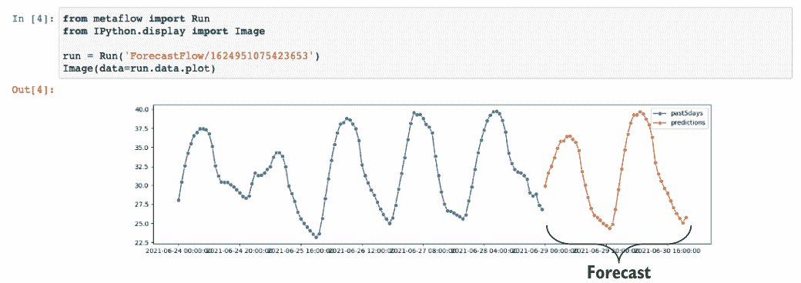

图 6.13 拉斯维加斯的预测每小时温度

只需看图 6.13，这个特定时间序列的预测看起来是可信的。作为一个练习，你可以测试不同地点的不同方法和参数化。为了使练习更加真实，你可以使用 OpenWeatherMap API 获取基于真实气象学的实际预测，并通过程序将你的预测与他们的预测进行比较。此外，你也可以通过查看基于更早的历史数据，你能够多好地预测历史数据来回测预测。

发现 Conda 包

在所有之前的示例中，我们只是为每个@conda 装饰器提供了一个预定义的库列表。你如何找到最初可用的库版本？

Conda 有通道的概念，这对应于不同的包提供者。Conda 背后的原始公司 Anaconda 维护了 Conda 的默认通道。另一个常见的通道是 Conda Forge，这是一个社区维护的 Conda 包仓库。你还可以设置一个自定义的私有 Conda 通道。

要查找包和可用版本，你可以在命令行上使用 conda search 命令，或者你可以在[`anaconda.org.`](https://anaconda.org)搜索包（注意，.org 是社区网站，而.com 指的是公司）。

这本书不是关于时间序列预测，而是关于基础设施，因此我们将专注于解释@conda 装饰器的工作原理。在你开始运行之前，但在任何任务执行之前，@conda 执行以下序列操作：

1.  它会遍历流程的每一步，并确定需要创建哪些虚拟环境。每个 Python 版本和库的唯一组合都需要一个隔离的环境。

1.  如果在本地找到一个具有正确 Python 版本和库的现有环境，则无需更改即可使用。这就是为什么后续执行比第一次更快的原因。

1.  如果找不到现有环境，Conda 将用于执行依赖关系解析，以解析需要安装的完整库列表，包括传递依赖项。

1.  已安装的库被上传到数据存储中，如 S3，以确保所有任务都可以快速可靠地访问。快速的网络连接或使用基于云的工作站有助于使这一步骤更快。

这个序列确保每个步骤都有一个稳定的执行环境，包括所有请求的库。反思依赖关系管理的问题，请注意我们在这里做了以下操作：

+   我们通过为每个步骤创建一个最小化的独立虚拟环境来最小化依赖冲突的可能性。手动维护如此细粒度的环境几乎是不切实际的，但 Metaflow 会自动为我们处理。

+   仅执行一次依赖项解析以减少开发过程中出现意外的情况的可能性。

+   依赖项列表在代码本身中声明，因此版本信息由 Metaflow 和 Git（如果您使用 Git 存储您的工作流程）存储。这确保了相当高的可重复性，因为您和您的同事有明确的依赖项声明，这些依赖项是重现结果所需的。

不安全步骤

注意，当您使用—environment=conda 时，所有步骤都在一个隔离的 Conda 环境中执行，即使它们没有指定显式的@conda 装饰器。例如，列表 6.5 中的最后一步在一个没有任何额外库的裸机环境中执行，因为它没有指定任何库要求。您不能导入任何未在@conda 中明确列出的库（除了 Metaflow 本身之外的库）。这是一个特性，而不是错误——它确保步骤不会意外地依赖于代码中未声明的库，这是确保*可重复性*的关键特性。

然而，在某些特殊情况下，您可能需要将隔离步骤与“不安全”步骤混合。例如，您的工作站或底层容器镜像可能包含您无法使用 Conda 安装的库。您可以通过添加装饰器@conda(disabled=True)来声明步骤不安全，这将使步骤执行时仿佛没有使用 Conda。请注意，这样做会否定许多 Conda 的好处，尤其是在后面讨论的生产部署中。

云中的@conda 装饰器

值得注意的是，您可以在云中运行完全相同的代码，如下所示：

```
python forecast2.py  --environment=conda run ---with batch
```

当使用 AWS Batch 等基于云的计算层运行时，执行开始时与前面列出的操作序列相同。然而，Metaflow 需要执行额外的工作来在容器中动态地重新创建虚拟环境。以下是任务执行之前云中发生的情况：

1.  计算层启动一个预配置的容器镜像。值得注意的是，容器镜像不需要包含 Metaflow、用户代码或其依赖项。Metaflow 在镜像之上叠加执行环境。

1.  代码包包括需要安装的确切库列表。值得注意的是，不会再次运行依赖项解析，因此所有任务都保证具有完全相同的执行环境。请注意，如果您在步骤代码中运行 pip install some_package，情况可能并非如此。任务最终可能具有略微不同的执行环境，导致难以调试的故障。

1.  Metaflow 从其自己的数据存储中拉取所需的库，这些库已经被缓存。这有两个关键原因。首先，想象一下运行一个宽泛的 foreach，例如，数百个实例并行运行。如果它们都并行地访问上游包仓库，这将相当于一种 *分布式拒绝服务攻击*——包仓库可以拒绝向这么多并行客户端提供服务。其次，偶尔包仓库会删除或更改文件，这可能导致任务失败——再次以难以调试的方式。

这些步骤确保你可以快速本地原型化，使用你喜欢的库，这些库可能对每个项目都是特定的，并且你可以在云中按比例执行相同的代码，而无需担心执行环境。

我们可以利用相同的机制来实现健壮的生产部署。让我们通过以下方式将预测流程部署到生产环境中来测试这个想法：

```
python forecast2.py  --environment=conda step-functions create
```

与运行命令类似，step-functions create 在生产部署之前执行四个依赖解析步骤。因此，生产部署将保证与流程代码的任何更改（多亏了代码包）以及其依赖项的更改（多亏了 @conda）以及数据存储中包的暂时性错误（多亏了包缓存）隔离。总的来说，你将保证拥有稳定的执行环境。

恭喜你——你刚刚将一个真实的数据科学应用部署到生产环境中！你可以使用 Step Functions UI 来观察日常运行。作为一个练习，你可以创建一个笔记本，在单个视图中绘制每日预测。

使用 @conda_base 的流程级依赖

注意列表 6.5 中开始和预测步骤包含以下相同的依赖集：

```
@conda(python='3.8.10', libraries={'sktime': '0.6.1'})
```

绘图步骤只有一个额外的库。随着步骤数量的增加，可能开始觉得在每一步都添加相同的依赖项显得冗余。作为一个解决方案，Metaflow 提供了一个流程级 @conda_base 装饰器，它指定了所有步骤共享的属性。任何特定步骤的附加项都可以使用步骤级 @conda 指定。以下列表显示了 ForecastFlow 的一个采用此方法的替代版本。函数体与列表 6.5 相同，因此为了简洁起见省略了它们。

列表 6.6 展示了 @conda_base 的使用

```
@schedule(daily=True)
@conda_base(python='3.8.10', libraries={'sktime': '0.6.1'})    ❶
class ForecastFlow(FlowSpec):

    @step
    def start(self):
       ...

    @step
    def forecast(self):
       ...

    @conda(libraries={'seaborn': '0.11.1'})                    ❷
    @step
    def plot(self):
       ...

    @step
    def end(self):
       ...
```

❶ 使用 @conda_base 定义一个公共 Python 版本和库

❷ 使用步骤级的 @conda 向公共基础添加步骤级附加

至此，我们暂时结束了对依赖管理的探索。我们将在第九章中使用和扩展这些经验，该章将展示一个使用可插拔依赖项的现实机器学习应用。接下来，我们将解决生产部署的另一个重要元素，这是间歇性失败的一个常见来源：人类。

## 6.3 稳定操作

*一名实习生，芬利，加入了公司度过夏天。芬利在贝叶斯统计方面有很强的理论基础。亚历克斯建议他们可以组织一场有趣的内部竞赛，比较芬利创建的贝叶斯模型和亚历克斯一直想构建的神经网络模型的性能。起初，亚历克斯看到神经网络模型在基准测试中似乎表现更好，非常高兴。然而，当他们验证最终结果时，他们注意到亚历克斯的预测工作流程意外地使用了芬利的模型，所以实际上芬利是赢家。如果亚历克斯在组织实验时更加小心，他们本可以花更多的时间完善模型，而不是被错误的结果误导。*


想象一下，你第一次将工作流程部署到生产调度器中，正如前几节所讨论的那样。对于大多数项目来说，这仅仅是开始，而不是结束。越来越频繁的是，开发工作流程的数据科学家也负责在生产中运行它们。因此，数据科学家有两个职责：首先，确保生产工作流程不间断地运行，其次，继续开发工作流程以改进结果。

一个挑战是，这两个职责有截然相反的目标：生产工作流程需要尽可能稳定，而原型可能需要在项目中做出剧烈的改变。解决这个困境的关键是将生产工作流程与原型明确隔离，这样无论原型环境中发生什么，都不会影响生产，反之亦然。

在一个更大的项目中，你可能不仅仅只有一个原型版本和一个生产版本。相反，一组数据科学家可以同时工作在多个原型上。为了测试实验版本，他们可能被部署到与生产版本并行运行的生产环境。总的来说，你可以有任意数量的项目版本在不同的成熟度级别上同时运行。所有项目版本都必须保持整洁的隔离，以确保结果不受任何干扰。

为了使这个想法更加具体，想象一个数据科学应用，比如一个推荐系统，它由一组数据科学家持续开发。团队的使命是通过一个*实验漏斗*推动实验，如图 6.14 所示。

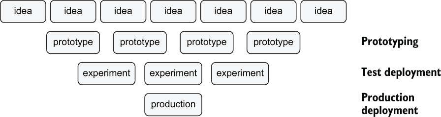

图 6.14 实验漏斗

在漏斗的顶部，团队有数十或数百种想法来改进系统。团队成员可以在他们的本地工作站上对优先级较高的想法进行原型设计和测试。原型设计的初步结果可以帮助确定哪些想法值得进一步开发——预期并非所有想法都能存活。可能还会进行额外的本地开发轮次。

一旦你有一个完全功能的实验工作流程（或一系列工作流程），通常你会在实际的生产环境中运行一个 A/B 测试，将新版本与当前生产版本进行比较。这要求你同时运行两个或更多测试部署。经过一段时间后，你可以分析结果以确定新版本是否应该升级为新的生产版本。

版本控制层

版本控制层有助于组织、隔离和跟踪所有版本，使其成为管理数百个并发版本和项目的可行方法，这些版本和项目存在于实验漏斗的不同层级。就我们的基础设施堆栈而言，版本控制层有助于确定*执行什么版本的代码*，如图 6.15 所示。

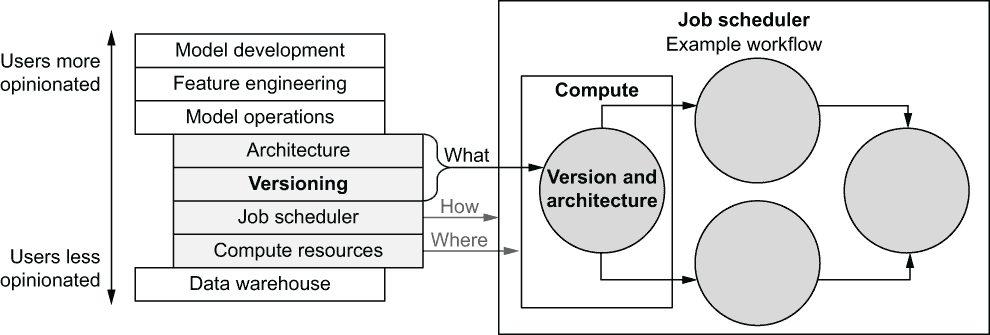

图 6.15 版本控制层的作用：执行什么代码

自然地，数据科学家需要编写代码，即工作流程的实际业务逻辑。这是（软件）*架构层*的关心问题，我们将在第八章中讨论。抽象或泛化业务逻辑很难，它往往非常具体于每个项目和用例，因此我们期望数据科学家在开发时能够行使相当大的自由度和责任感。因此，将架构层放置在基础设施堆栈的顶部是有意义的，在那里基础设施应该施加较少的限制。

相比之下，基础设施在版本控制方面可能更有意见——保持事物整洁有序、版本清晰分离不是个人偏好的问题，而是一个组织要求。对每个人来说，使用相同的版本控制方法来促进协作并避免冲突（如之前提到的 Alex 和 Finley 的情况）是非常有益的，这也是基础设施提供内置版本控制层的一个动机。

我们可以总结图 6.15 中突出层的作用，从上到下如下：

1.  数据科学家设计和开发业务逻辑，即工作流程的架构（架构层）。

1.  基础设施有助于管理多个同时原型设计和部署的业务逻辑版本（版本控制层），以促进实验漏斗。一起，架构层和版本控制层决定了*执行什么代码*。

1.  一个健壮的生产调度器（作业调度层），如 AWS Step Functions，确定特定工作流程 DAG 的执行方式和时间。

1.  最后，计算层负责找到服务器实例*在哪里*可以执行工作流程中的每个任务。

如前所述，将“什么、如何和在哪里”分开的一个主要好处是我们可以独立设计每个子系统。本节展示了 Metaflow 提供的版本层的一个参考实现，但你也可以使用另一个框架或方法来实现相同的目标：构建和运行一个实验漏斗，允许数据科学团队无摩擦地迭代和测试应用程序的各种版本。

构建漏斗没有唯一正确的方法。我们提供了一套工具和知识，帮助你设计并定制一个适合你特定需求的版本控制和部署方法。例如，许多公司已经开发了他们自己的自定义包装脚本或 CI/CD（持续集成/持续部署）管道，利用了下面介绍的机制。我们开始本节，先看看原型化过程中的版本控制，然后是如何实现安全隔离的生产部署。

### 6.3.1 原型化过程中的命名空间

考虑一下本节开头 Alex 和 Finley 所经历的情景：他们两人都在为同一个项目原型化不同的工作流程。意外的是，Alex 分析了 Finley 的结果而不是自己的。这突出了在原型化过程中保持组织的重要性：每个原型都应该与其他原型保持清晰的隔离。

Metaflow 有一个名为*命名空间*的概念，有助于保持运行和工件的组织。让我们通过下面的简单工作流程来演示它。

列表 6.7 显示命名空间作用的工作流程

```
from metaflow import FlowSpec, step, get_namespace

class NamespaceFlow(FlowSpec):

    @step
    def start(self):
        print('my namespace is', get_namespace())     ❶
        self.next(self.end)

    @step
    def end(self):
        pass

if __name__ == '__main__':
    NamespaceFlow()
```

❶ 打印当前命名空间

将代码保存在 namespaceflow.py 中，并像往常一样执行：

```
python namespaceflow.py run
```

你应该看到一个提到你用户名的输出，例如：

```
[1625945750782199/start/1 (pid 68133)] my namespace is user:ville
```

现在打开一个 Python 解释器或笔记本，并执行以下行：

```
from metaflow import Flow
Flow(‘NamespaceFlow').latest_run
```

这将打印用户命名空间中最新运行的运行 ID。在先前的例子中，它将显示以下内容：

```
Run('NamespaceFlow/1625945750782199')
```

注意运行 ID 1625945750782199 与最新执行的运行匹配。你还可以执行 get_namespace()来确认命名空间确实与 flow 使用的相同。

为了证明 latest-run 按预期工作，让我们再次运行 flow，如下所示：

```
python namespaceflow.py run
```

现在的运行 ID 是 1625946102336634。如果你再次测试 latest_run，你应该看到这个 ID。

接下来，让我们测试当多个用户一起工作时命名空间是如何工作的。执行以下命令，该命令模拟另一个用户 otheruser 同时运行 flow：

```
USER=otheruser python namespaceflow.py run
```

注意，在现实生活中，你不应该显式设置 USER。该变量由你的工作站自动设置。我们在这里显式设置它只是为了演示 Metaflow 在存在多个用户时的行为。

对于这个运行，ID 是 1625947446325543，命名空间是 user:otheruser。图 6.16 总结了每个命名空间中的执行情况。

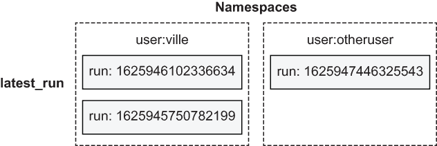

图 6.16 两位用户的命名空间，每人都有自己的最新运行

现在如果您再次检查最新运行，您将看到它仍然返回 1625946102336634，即维莱的最新运行，而不是其他用户执行的绝对最新的运行 ID。原因是客户端 API 默认尊重当前命名空间：它不会返回所有用户的最新运行，而是返回*您的最新运行*。

内置命名空间避免了像亚历克斯和芬利遇到的情况：如果你的笔记本使用的是最新运行，而你的同事执行了流程，那么它显示不同的结果将会很令人困惑。通过将元数据和工件名称空间化，我们可以避免这样的惊喜。

除了最新运行之外，您还可以通过它们的 ID 引用任何特定的运行，例如这里：

```
from metaflow import Run
Run('NamespaceFlow/1625945750782199')
```

这将有效，因为特定的运行在当前命名空间中。相比之下，尝试以下操作：

```
from metaflow import Run
Run('NamespaceFlow/1625947446325543')
```

这将产生以下异常

```
metaflow.exception.MetaflowNamespaceMismatch: Object not in namespace 
➥ 'user:ville'
```

因为请求的流程当前命名空间中不存在——它属于其他用户。这种行为确保了您不会意外地引用其他人的结果，例如，如果您误输了运行 ID。

注意：默认情况下，客户端 API 允许您检查您生成的运行和工件。其他用户采取的操作不会影响您的客户端 API 返回的结果，除非您明确切换命名空间。特别是，相对引用如最新运行是安全的，因为它指的是当前命名空间中的最新运行，因此其返回值不会意外改变。

切换命名空间

命名空间不是一个安全特性。它们不是为了隐藏信息；它们只是帮助保持事物组织有序。您可以通过切换命名空间来检查任何其他用户的成果。例如，尝试以下操作：

```
from metaflow import Run, namespace
namespace('user:otheruser')
Run('NamespaceFlow/1625947446325543')
```

使用命名空间函数切换到另一个命名空间。在命名空间调用之后，客户端 API 访问新命名空间下的对象。因此，可以访问其他用户 1625947446325543 的运行。相应地，

```
from metaflow import Flow
namespace('user:otheruser')
Flow('NamespaceFlow').latest_run
```

返回 1625947446325543。正如您所预期的，在这个命名空间中，当访问维莱的运行时，您将得到一个错误。

命名空间调用是一个方便的方法来切换命名空间，例如，在笔记本中。然而，客户端 API 也被用于流程内部以访问来自其他流程的数据。例如，记住第三章中提到的 ClassifierPredictFlow，它使用了以下行来访问最新的训练模型：

```
    @step
    def start(self):
        run = Flow('ClassifierTrainFlow').latest_run
```

客户端 API 在流程内部也尊重命名空间。之前的 latest_run 只会返回由你的 ClassifierTrainFlow 训练的模型。现在假设你想要使用你的同事 Alice 训练的模型。你可以在流程代码中添加一行，namespace('user:alice')，以切换命名空间。然而，如果你第二天想尝试另一位同事 Bob 的模型呢？你可以不断更改代码，但有一个更好的方法。无需更改代码，你可以在命令行上使用--namespace 选项切换命名空间，如下所示：

```
python classifier_predict.py run --namespace user:bob
```

这使得在不同输入之间切换变得容易，而无需在代码本身中硬编码任何内容。图 6.17 说明了这个想法。

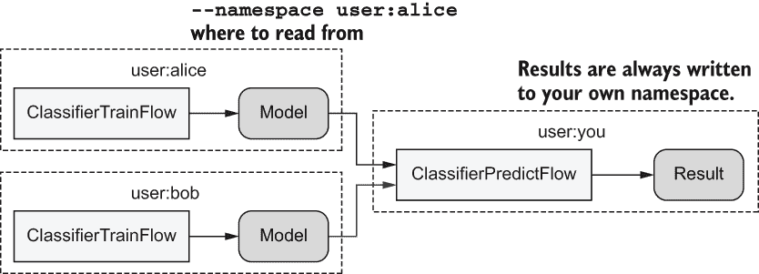

图 6.17 在两个命名空间之间切换

切换命名空间只会改变客户端 API*读取*数据的方式。它不会改变结果存储的方式——它们始终附加到你的用户名下。从任何命名空间读取是一个安全的操作，因为你不可能意外地覆盖或损坏现有数据。通过默认限制写入到自己的命名空间，你可以确保你的操作不会对其他用户产生不期望的副作用。

注意：使用 namespace 函数或--namespace 选项切换命名空间只会改变客户端 API 读取结果的方式。它不会改变结果写入的方式。默认情况下，它们仍然属于当前用户的命名空间。

全局命名空间

如果你在日志文件中看到一个运行 ID，例如 NamespaceFlow/1625947446325543，但你不知道是谁启动了这次运行？你不知道应该使用哪个命名空间。在这种情况下，你可以通过调用以下命令来禁用命名空间保护：

```
namespace(None)
```

之后，你可以无限制地访问任何对象（运行、工件等）。最新的 _run 将指向任何人执行的最新运行，因此其值可能会随时更改。

建议：不要在流程中使用 namespace(None)，因为它会使流程暴露于其他人员（甚至可能是你自己，无意中）运行流程所引起的不期望的副作用。它可以是一个探索数据的便捷工具，例如在笔记本中。

### 6.3.2 生产命名空间

前一节讨论了原型设计中的命名空间。在这种情况下，按用户命名空间运行是自然而然的，因为实际上，总是有一个单一的、明确的用户执行命令运行。但关于生产部署呢？没有人在执行运行，那么我们应该使用谁的命名空间？

Metaflow 为每个未附加到任何用户的、新的生产部署创建一个新的*生产命名空间*。让我们通过以下方式将列表 6.7 中的 namespaceflow.py 部署到 AWS Step functions，以了解这实际上意味着什么：

```
python namespaceflow.py step-functions create
```

你应该看到类似以下的输出：

```
Deploying NamespaceFlow to AWS Step Functions...
It seems this is the first time you are deploying NamespaceFlow to AWS Step Functions.
A new production token generated.
The namespace of this production flow is
    production:namespaceflow-0-fyaw
To analyze results of this production flow add this line in your notebooks:
    namespace("production:namespaceflow-0-fyaw")
If you want to authorize other people to deploy new versions of this flow to AWS Step Functions, they need to 
    call step-functions create --authorize namespaceflow-0-fyaw
```

如输出所示，为部署创建了一个新的唯一命名空间，production:namespaceflow-0-fyaw。如您所见，该命名空间并不绑定到用户，例如我们在原型设计期间使用的 user:ville。

如果您再次运行步骤函数创建，您会注意到生产命名空间不会改变。部署的命名空间绑定到流程名称。除非您通过执行来显式请求新的命名空间，否则它不会改变。

```
python namespaceflow.py step-functions create --generate-new-token
```

要查看命名空间的实际操作，让我们在步骤函数上触发一个执行，如下所示：

```
python namespaceflow.py step-functions trigger
```

等待一分钟左右，让执行开始。之后，打开一个笔记本或 Python 解释器，并执行以下行。将命名空间替换为 step-functions create 输出的实际唯一命名空间：

```
from metaflow import namespace, Flow
namespace(‘production:namespaceflow-0-fyaw')
Flow(‘NamespaceFlow').latest_run
```

您应该看到一个带有 sfn-前缀的长 ID 的运行对象，例如

```
Run('NamespaceFlow/sfn-72384eb6-2a1b-4c57-8905-df1aa544565c')
```

生产命名空间的一个关键优势是，您的流程可以安全地使用客户端 API，特别是像.latest_run 这样的相对引用，知道生产部署始终与任何用户在其个人命名空间中本地执行的任何原型设计保持隔离。

授权部署

生产命名空间包括一个重要的安全机制。想象一下，一位新员工查尔斯正在熟悉 Metaflow，并探索各种命令。正如我们之前讨论的，本地原型设计总是安全的，因为结果绑定到查尔斯的个人命名空间。查尔斯也可能测试生产部署并执行以下操作：

```
python namespaceflow.py step-functions create
```

查尔斯的本地 namespaceflow.py 版本可能不是生产就绪的，因此通过这种方式，他可能会意外地破坏生产部署。我们希望鼓励实验，因此我们应该确保新员工（或其他人）不必担心意外破坏任何东西。

为了防止发生事故，Metaflow 阻止查尔斯运行默认创建的步骤函数。查尔斯需要知道一个唯一的*生产令牌*，才能运行该命令。在这种情况下，如果查尔斯真的需要将流程部署到生产环境，他需要联系之前部署过该流程的人，获取令牌，并执行以下操作：

```
python namespaceflow.py step-functions create --authorize namespaceflow-0-fyaw
```

--authorize 标志仅适用于第一次部署。在此之后，查尔斯可以像其他人一样继续部署流程。请注意，--authorize 不是一个安全功能。查尔斯也可以自己发现令牌，正如我们很快就会看到的。它只是作为一个对动作的明确确认，这使得无意中造成损害的可能性稍微降低。

### 6.3.3 使用@project 的并行部署

当你运行 step-functions create 时，一个流程被部署到生产调度器。部署的名称自动根据 FlowSpec 类的名称命名。换句话说，默认情况下，每个流程名称都附有一个精确的生产版本。你可以（在授权后）通过再次运行 step-functions create 来更新部署，但新版本将覆盖旧版本。

正如我们在本节开头讨论的那样，较大的项目可能需要多个并行但隔离的生产部署，例如，为了便于测试流程的新实验版本。此外，一个复杂的应用程序可能由多个流程组成（例如，第三章中的 ClassifierTrainFlow 和 ClassifierPredictFlow），它们应该存在于同一个命名空间中，这样它们可以在彼此之间安全地共享工件。默认情况下，当你部署具有不同名称的两个流程时，将为每个流程生成一个唯一的命名空间。

为了满足这些需求，我们可以使用一个名为 @project 的流程级装饰器。@project 装饰器本身并不做任何事情，但它允许一个流程或多个流程以特殊方式在生产环境中部署。@project 装饰器是一个可选功能，可以帮助组织较大的项目。你可以先不使用它，只保留一个生产版本，然后在需要增长时再添加它。让我们使用列表 6.8 中所示的简单示例来演示这个概念。

列表 6.8 带有 @project 装饰器的流程

```
from metaflow import FlowSpec, step, project

@project(name='demo_project')    ❶
class FirstFlow(FlowSpec):

    @step
    def start(self):
        self.model = 'this is a demo model'
        self.next(self.end)

    @step
    def end(self):
        pass

if __name__ == '__main__':
    FirstFlow()
```

❶ 使用具有唯一名称的项目装饰器注释流程

将代码保存到 firstflow.py。我们使用 @project 对流程进行了注释，这需要一个唯一的名称。具有相同项目名称的所有流程将使用单个共享命名空间。

让我们看看当你将其部署到步骤函数时会发生什么，如下所示：

```
python firstflow.py step-functions create
```

多亏了 @project 装饰器，流程不是以通常的 FirstFlow 名称部署。相反，它被命名为 demo_project.user.ville.FirstFlow。@project 装饰器用于创建并行、具有唯一名称的部署。默认情况下，部署以项目名称（demo_project）和部署流程的用户（user.ville）为前缀。如果另一位团队成员使用此流程运行 step-functions create，他们将获得一个个人、唯一的部署。这允许任何人在生产环境中轻松测试他们的原型，而不会干扰主要的生产版本。

有时实验并没有明确地与单个用户相关联。也许多个数据科学家合作进行联合实验。在这种情况下，将流程作为 *分支* 部署是自然的。尝试以下操作：

```
python firstflow.py --branch testbranch step-functions create
```

它将生成一个名为 demo_project.test.testbranch.FirstFlow 的部署——请注意，名称中不包含用户名。你可以创建任意数量的独立分支。请注意，触发也尊重 --branch。尝试以下操作：

```
python firstflow.py --branch testbranch step-functions trigger
```

它将触发 demo_project.test.testbranch.FirstFlow 的执行。

按照惯例，如果你的项目只有一个受推崇的生产版本，你可以使用以下方式部署：

```
python firstflow.py --production step-functions create
```

这将产生一个名为 demo_project.prod.FirstFlow 的部署。--production 选项像部署任何其他分支一样部署分支部署——在 --production 中没有特殊的语义。然而，它可以帮助清楚地区分主生产版本和其他实验分支。

除了允许多个并行、隔离的生产部署外，@project 装饰器很有用，因为它在多个流程中创建了一个单一、统一的命名空间。为了测试这个想法，让我们为同一个 @project 创建另一个流程，如下面的代码列表所示。

列表 6.9 同一个 @project 中的另一个流程

```
from metaflow import FlowSpec, Flow, step, project

@project(name='demo_project')
class SecondFlow(FlowSpec):

    @step
    def start(self):
        self.model = Flow('FirstFlow').latest_run.data.model    ❶
        print('model:', self.model)
        self.next(self.end)

    @step
    def end(self):
        pass

if __name__ == '__main__':
    SecondFlow()
```

❶ 访问同一命名空间中的工件

将代码保存到 secondflow.py。你可以通过运行以下命令在本地测试流程：

```
python firstflow.py run
python secondflow.py run
```

本地，SecondFlow 中的 latest_run 指的是你个人命名空间中 FirstFlow 的最新运行，在我的情况下，是用户：ville。让我们按照以下方式将 SecondFlow 部署到我们的测试分支：

```
python secondflow.py -branch testbranch step-functions create
```

这将部署一个名为 demo_project.test.testbranch.SecondFlow 的流程。值得注意的是，FirstFlow 和 SecondFlow 使用相同的命名空间，在我的情况下，它被命名为 mfprj-pbnipyjz2ydyqlmi-0-zphk。项目命名空间是基于分支名称、项目名称和唯一令牌的哈希值生成的，因此它们看起来有点神秘。

现在，在 Step Functions 上触发以下执行：

```
python secondflow.py --branch testbranch step-functions trigger
```

一段时间后，你可以像这样在笔记本或 Python 解释器中检查结果：

```
from metaflow import namespace, Flow
namespace(None)
print(Flow('SecondFlow').latest_run['start'].task.stdout)
```

我们使用全局命名空间，因此我们不需要知道我们的 testbranch 所使用的确切命名空间。然而，如果其他人同时运行 SecondFlows，这种做法有点危险。请注意，流程名称 SecondFlow 仍然是相同的：@project 前缀仅用于为生产调度器命名流程。

要看到 @project 的力量，你现在可以在 FirstFlow 中进行编辑，例如，将模型字符串更改为其他内容。你可以像以前一样在本地测试更改，这不会影响生产部署。在你对更改满意后，你可以将改进后的 FirstFlow 以及 SecondFlow 部署到新的分支，比如 newbranch。设置如图 6.18 所示。

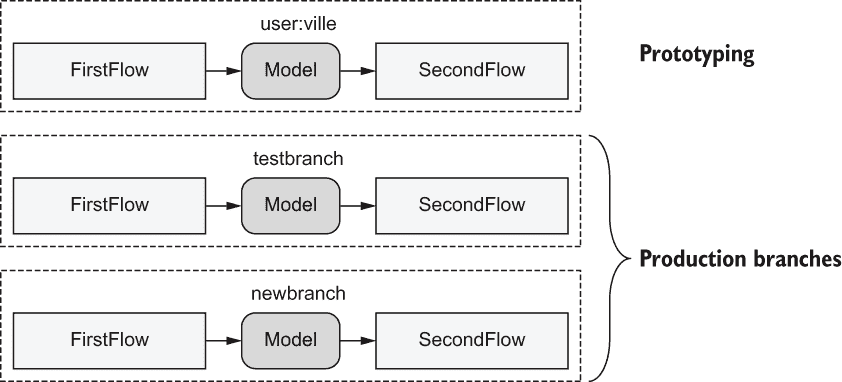

图 6.18 三种 @project 分支

当你执行它们时，只有部署到 newbranch 的新工作流会受到更改的影响。testbranch 上的旧版本不受影响。如图 6.18 所示，在这种情况下，我们有三个独立的命名空间：用于原型设计的默认用户命名空间和两个生产分支。

让我们总结一下在本节中学到的内容，结合一个实际的数据科学项目。该项目由多个数据科学家持续开发。他们可以提出数百种改进项目的想法。然而，如果没有在现实的生产环境中测试，我们不知道哪些想法是有效的。我们将这个过程可视化为一个实验漏斗，如图 6.19 所示。

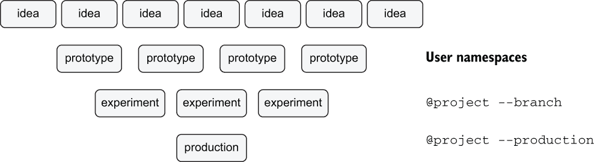

图 6.19 使用 @project 促进实验漏斗

多亏了用户命名空间，数据科学家能够原型化新版本并在本地运行，无需担心它们会相互干扰。命名空间会自动启用所有 Metaflow 运行。一旦他们确定了最有希望的想法，他们可以使用 @project 将其部署到生产环境作为一个自定义 --branch。然后，这些自定义分支可以用来向 A/B 实验提供预测。最后，当一个实验证明了其价值，它可以被提升为新的主要生产版本，使用 --production 部署。

## 摘要

+   使用集中式元数据服务器有助于跟踪所有项目、用户和生产部署中的所有执行和工件。

+   利用高度可用、可扩展的生产调度器，如 AWS Step Functions，在无需人工监督的情况下按计划执行工作流。

+   使用 @schedule 装饰器使工作流能够自动在预定义的计划上运行。

+   Metaflow 的代码包封装了用户定义的代码和云执行所需的支持模块。

+   使用容器和 @conda 装饰器来管理生产部署中的第三方依赖。

+   用户命名空间有助于隔离用户在其本地工作站上运行的原型，确保原型之间不会相互干扰。

+   生产部署拥有自己的命名空间，与原型隔离。新用户必须获取生产令牌才能将新版本部署到生产环境中，这可以防止意外覆盖。

+   @project 装饰器允许多个并行、隔离的工作流同时部署到生产环境中。

+   使用 @project 在多个工作流之间创建统一的命名空间。
