# 7 处理数据

本章涵盖

+   快速访问大量基于云的数据

+   使用 Apache Arrow 进行高效的内存数据处理

+   利用基于 SQL 的查询引擎对工作流程数据进行预处理

+   为大规模模型编码特征

前五章介绍了如何将数据科学项目从原型发展到生产。我们学习了如何构建工作流程，使用它们在云中运行计算密集型任务，并将工作流程部署到生产调度器。现在我们已经对原型循环和生产部署的交互有了清晰的认识，我们可以回到基本问题：工作流程应该如何消费和产生数据？

与数据交互是所有数据科学应用的关键关注点。每个应用都需要找到并读取存储在某处的输入数据。通常，应用还需要将其输出，如新的预测，写入到同一个系统。尽管在管理数据的不同系统中存在大量的差异，但在这种情况下，我们使用一个常见的术语，*数据仓库*，来指代所有这些系统。鉴于数据输入和输出的基础性质，将这一关注点置于堆栈的底部似乎是合适的，如图 7.1 所示。

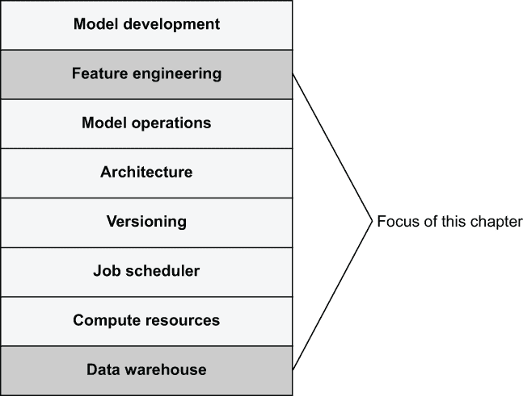

图 7.1 有效的数据科学基础设施堆栈

在堆栈的顶部存在另一个与数据相关的问题：数据科学家应该如何探索、操作和准备要输入到模型中的数据？这个过程通常被称为*特征工程*。本章关注堆栈的底部和顶部数据，尽管我们更倾向于底层关注点，这些更明显地属于通用基础设施领域。

值得注意的是，本章不是关于构建或设置数据仓库的，这是一个极其复杂的话题，由许多其他书籍涵盖。我们假设你已经有一些形式的数据仓库，也就是说，某种存储数据的方式已经就位。根据你公司的规模，数据仓库的性质可能会有很大的不同，如图 7.2 所示。

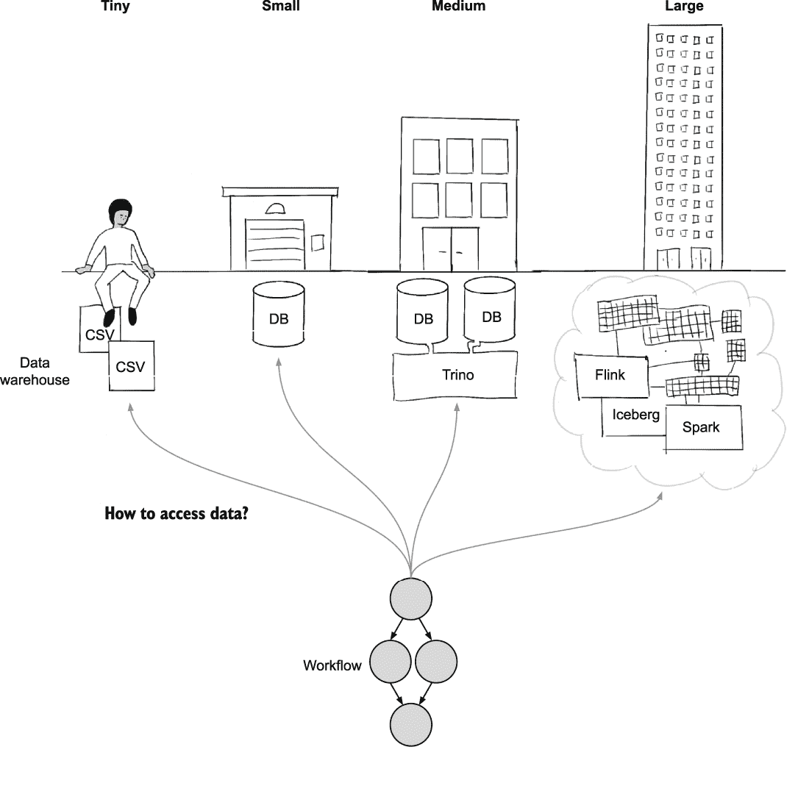

图 7.2 从小型到大型公司各种数据基础设施

如果你只是进行原型设计，你可以通过使用本地文件开始，例如，使用第三章中介绍过的 IncludeFile 加载的 CSV 文件。大多数公司使用像 Postgres 这样的数据库来存储它们宝贵的数据资产。中等规模的公司可能会使用多个数据库来满足不同的需求，可能还会配备一个联邦查询引擎，如 Trino（也称为 Presto），它提供了一种统一的方式来查询所有数据。

一家大型公司可能有一个基于云的数据湖，拥有多个查询引擎，如 Apache Flink 用于实时数据，Apache Iceberg 用于元数据管理，以及 Apache Spark 用于通用数据处理。如果你对这些系统不熟悉，请不要担心——我们将在第 7.2.1 节中给出现代数据架构的高级概述。在这些所有情况下，数据科学家面临相同的关键问题：如何在他们的工作流程中访问数据。

除了需要与不同的技术解决方案集成外，数据科学基础设施还需要支持不同的 *数据模式*。本章的例子主要关注 *结构化数据*，即关系型或表格数据源，这是商业应用中最常见的数据模式。此外，基础设施可能还需要支持处理 *非结构化数据* 的应用程序，如文本和图像。在实践中，这些天许多现实世界的数据集介于两者之间——它们是 *半结构化* 的。它们包含一些结构，例如严格遵循模式的列，以及一些非结构化字段，例如 JSON 或自由格式文本。本章重点关注数据仓库和数据模式中普遍存在的数据相关问题，具体如下：

1.  *性能*—鉴于数据科学应用程序往往数据密集型，也就是说，它们可能需要摄入大量数据，加载数据很容易成为工作流程中的瓶颈。等待可能长达数十分钟或更长时间的数据可能会使原型设计循环非常痛苦，这是我们想要避免的。我们将在第 7.1 节中关注这个问题。

1.  *数据选择*—如何找到和选择与任务相关的数据子集。SQL 是选择和过滤数据的通用语言，因此我们需要找到与能够执行 SQL 的查询引擎（如 Spark）接口的方法。这些解决方案通常也适用于半结构化数据，或者用于非结构化数据的元数据。这些主题是第 7.2 节的主题。

1.  *特征工程*—如何将原始数据转换为适合建模的格式，也就是特征转换。一旦我们摄入了一块原始数据，在数据能够有效地输入模型之前，我们需要解决许多问题。我们将在第 7.3 节中探讨这个深奥的主题。

这些基础问题适用于所有环境。本章为你提供了具体的构建块，你可以使用它们来设计数据访问模式，也许还有你自己的辅助库，这些库适用于你的特定环境。或者，你最终可能会使用一些更高级的库和产品，例如用于特征工程的 *特征存储*，它抽象了许多这些问题。在了解了基础知识之后，你将能够更有效地评估和使用这些抽象，正如我们将在第 7.3 节中讨论的那样。

数据访问的另一个正交维度是应用程序需要多频繁地响应数据变化。与前面的章节类似，我们关注*批量处理*，即最多每 15 分钟运行一次的应用程序。对于需要更频繁更新的许多数据科学应用来说，*流数据*的话题当然也很相关，但进行此类操作所需的基础设施更为复杂。我们将在下一章简要介绍这个话题。正如我们将在第 7.2 节中讨论的，许多涉及实时数据的数据科学应用仍然可以建模为批量工作流程。

在所有这些维度之上，我们还有*组织上的关注点*：谁应该对数据科学应用中使用的数据负责，以及责任如何在不同的角色之间分配——特别是数据工程师和数据科学家。尽管确切答案高度依赖于公司，但在第 7.2 节中我们分享了一些高级观点。

我们将本章从一项基本技术问题开始：如何在工作流程中有效地加载数据。下一节中介绍的工具为本章的其余部分提供了坚实的基础。你可以在此处找到本章的所有代码列表：[`mng.bz/95zo`](http://mng.bz/95zo)。

## 7.1 快速数据的基础

*亚历克斯开发了一个工作流程，用于估算纸杯蛋糕订单的配送时间。为了训练估算器，亚历克斯需要从公司的主要数据仓库中摄取所有历史纸杯蛋糕订单。令人惊讶的是，从数据库加载数据所需的时间比构建模型本身还要长！经过调查问题后，鲍伊意识到机器学习工作流程需要比之前主要由仪表板使用的路径更快的数据访问方式。新的快速数据路径极大地提高了亚历克斯的生产力：现在每天可以训练和测试至少 10 个模型版本，而不是仅仅两个。*

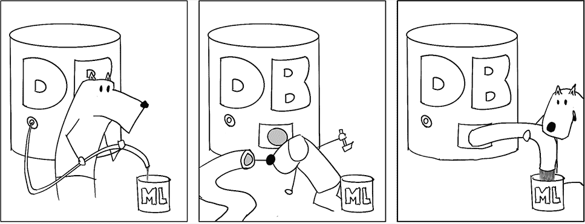

当本书的作者对 Netflix 的数据科学家进行非正式调查，询问他们在日常工作中面临的最大痛点是什么时，大多数人回答：寻找合适的数据并在他们的数据科学应用中访问它。我们将在下一节回到寻找数据的问题。本节重点探讨一个看似简单的问题：你应该如何将数据集从数据仓库加载到你的工作流程中？

这个问题可能看起来非常战术性，但它具有深远、战略性的影响。为了讨论方便，假设你无法轻松快速（或根本无法）将数据集从数据仓库加载到单独的工作流程中。出于必要性，你将不得不在数据仓库系统中*内部*构建模型和其他应用程序逻辑。

事实上，这一直是关于数据仓库的传统思维方式：大量数据不应该被移动出去。相反，应用程序通过 SQL 等表达他们的数据处理需求，数据仓库执行这些需求，并返回作为结果的小数据子集。尽管这种方法对于传统的商业智能来说是有道理的，但在 SQL 中构建机器学习模型并不是一个可行的想法。即使你的数据仓库支持使用 Python 等查询数据，基本问题仍然是这种方法将*计算层*，我们在第四章中讨论过的，与数据层紧密耦合。当工作负载非常计算密集时，这是一个问题：没有主流数据库是为在自动扩展的 GPU 实例集群上运行而设计的。

相反，如果能够有效地从仓库中提取大量数据，就可以实现*数据与计算的解耦*。这对于既需要数据又需要计算的数据科学应用来说是个好消息。正如在第四章中提倡的，你可以为每个任务选择最佳的计算层，最重要的是，你可以让数据科学家自由迭代和实验，而无需担心崩溃共享数据库。一个缺点是，控制数据使用变得更加困难——我们将在下一节回到这个问题。

当考虑耦合与解耦方法的优缺点时，记住数据科学应用——尤其是机器学习——的行为与传统分析和商业智能用例不同是很重要的。这种差异在图 7.3 中得到了说明。

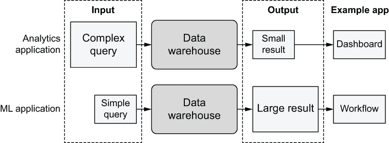

图 7.3 对比分析和机器学习应用之间的数据流

一个传统的商业分析应用，比如一个 Tableau 仪表板，通常生成一个非常复杂的 SQL 查询，数据仓库执行这个查询以返回一个小的、仔细过滤的结果给仪表板。相反，一个机器学习应用表现出相反的行为：它呈现一个简单的查询来摄取，例如，一个完整的数据表，select * from table，然后将其输入到机器学习模型中。

因此，机器学习应用可能会遇到两个问题。首先，数据仓库在执行提取大量数据的简单查询时可能出奇地低效，因为这些查询已经被优化为相反的模式。其次，由于同样的原因，用于与数据仓库接口的客户端库在加载大量数据时通常效率很低。

虽然许多现实世界的应用程序显示的查询模式介于两种极端之间，但在许多应用程序中，加载数据是主要的性能瓶颈。数据科学家可能需要等待数十分钟才能加载数据，这严重影响了他们的生产力。移除这种生产力瓶颈是有效数据科学基础设施的关键目标，因此，在接下来的章节中，我们将探讨一种替代的、极其高效的数据访问方法。这种方法适用于许多现代数据仓库，并允许您将数据与计算解耦，以及明确划分数据科学家和数据工程师之间的工作。 

### 7.1.1 从 S3 加载数据

如果问一个数据科学家他们希望如何访问数据集，假设他们只考虑个人生产力，一个典型的回答是“本地文件”。本地文件在以下方面极大地提高了生产力：

+   *它们可以非常快速地加载*—从本地文件加载数据比执行 SQL 查询要快。

+   *数据集不会突然改变*—这是有效原型设计的关键。如果底层数据未宣布改变，就无法进行系统性的实验和迭代。

+   *易用性*—加载数据不需要特殊的客户端，它不会在同事进行实验时随机失败或变得不可预测地缓慢，并且本地文件几乎可以由所有现成的库使用。

不幸的是，本地文件的缺点很多：它们与云端的实际部署或扩展实验不兼容，并且需要手动更新。此外，它们让数据仓库管理员感到不适，因为它们超出了数据安全和治理策略的控制范围。

使用基于云的对象存储，如 AWS S3，可以提供两全其美的解决方案：将数据存储在云端使其与云端的计算、部署和数据治理策略兼容。通过一些努力，正如下面将要展示的，我们可以使用户体验几乎与访问本地文件一样无缝。特别是，许多人对此事实感到惊讶：从基于云的对象存储（如 S3）加载数据可能比从本地文件加载数据更快。

为了展示基于 S3 的数据在实际中的应用，并验证前面的陈述是否真的正确，让我们创建一个简单的流程，如列表 7.1 所示，以基准测试 S3。该列表演示了一个基本操作：从文件到 Python 进程的内存加载数据，并比较从本地文件和 S3 中的文件加载数据的性能。

为了测试，我们使用 Common Crawl（[commoncrawl.org](https://commoncrawl.org/)）数据集的一个样本数据，这是一个由随机网页组成的公共数据集。数据集的详细信息并不重要。值得注意的是，你可以将本节中的经验同样应用于非结构化数据，如图像或视频，或结构化、表格数据。如果你想，你可以将下一个列表中的数据集 URL 替换为你可以在 S3 中访问的任何其他数据集。

列表 7.1 S3 基准测试

```
import os
from metaflow import FlowSpec, step, Parameter, S3, profile, parallel_map

URL = 
➥ 's3://commoncrawl/crawl-data/CC-MAIN-2021-25/segments/1623488519735.70/wet/'❶

def load_s3(s3, num):                                                         ❷
    files = list(s3.list_recursive([URL]))[:num]                              ❸
          total_size = sum(f.size for f in files) / 1024**3
    stats = {}
    with profile('downloading', stats_dict=stats):                            ❹
        loaded = s3.get_many([f.url for f in files])                          ❺

    s3_gbps = (total_size * 8) / (stats['downloading'] / 1000.)
    print("S3->EC2 throughput: %2.1f Gb/s" % s3_gbps)
    return [obj.path for obj in loaded]                                       ❻

class S3BenchmarkFlow(FlowSpec):
    local_dir = Parameter('local_dir',
                          help='Read local files from this directory')

    num = Parameter('num_files',
                    help='maximum number of files to read',
                    default=50)

    @step
    def start(self):
        with S3() as s3:                                                      ❼
            with profile('Loading and processing'):
                if self.local_dir:                                            ❽
                    files = [os.path.join(self.local_dir, f)
                             for f in os.listdir(self.local_dir)][:self.num]
                else:
                    files = load_s3(s3, self.num)                             ❽

                print("Reading %d objects" % len(files))
                stats = {}
                with profile('reading', stats_dict=stats):
                    size = sum(parallel_map(lambda x: len(open(x, 'rb').read()),
                    ➥ files)) / 1024**3                                      ❾

                read_gbps = (size * 8) / (stats['reading'] / 1000.)
                print("Read %2.fGB. Throughput: %2.1f Gb/s" % (size, read_gbps))
        self.next(self.end)

    @step
    def end(self):
        pass

if __name__ == '__main__':
    S3BenchmarkFlow()
```

❶ 可在 S3 中找到的公共 Common Crawl 数据集

❷ 从 S3 加载数据的辅助函数

❸ 从给定的 S3 目录中选择前 num 个文件

❹ 在 stats 中收集加载操作的计时信息

❺ 将文件从 S3 加载到临时本地文件

❻ 返回临时文件路径

❽ S3 作用域管理临时文件的生命周期

如果指定了参数 local_dir，则从本地目录加载文件；否则，从 S3 加载

❽ 并行读取本地文件

将代码保存到名为 s3benchmark.py 的文件中。如果你在笔记本电脑上运行它，你可以先下载一小部分数据，如下所示：

```
# python s3benchmark.py run --num_files 10
```

这将下载大约 1 GB 的数据，并打印出达到的 S3 吞吐量统计信息。

流程分为两部分：首先，如果没有指定--local_dir，它将调用 load_s3 辅助函数来列出给定 URL 上的可用文件，并选择其中的前 num 个。在创建文件列表后，它将使用 Metaflow 内置的 S3 客户端 metaflow.S3 的 get_many 函数并行下载文件，我们将在 7.1.3 节中更详细地介绍这个函数。该函数返回包含下载数据的本地临时文件路径列表。with S3 上下文管理器负责在上下文退出后清理临时文件。

其次，流程在内存中读取本地文件的正文。如果指定了--local_dir，则从给定的本地目录读取文件，该目录应包含 S3 中文件的本地副本。否则，读取下载的数据。在两种情况下，文件都使用 parallel_map 并行处理，这是 Metaflow 提供的一个便利函数，用于在多个 CPU 核心上并行化一个函数。在这种情况下，我们只是计算读取的字节数，并在读取文件后丢弃它。这个基准测试只测量加载数据花费的时间——我们不需要以任何方式处理数据。

如果你好奇想使用--local_dir 选项基准测试本地磁盘性能，你可以按照以下方式将文件从 S3 下载到本地目录：

```
# aws s3 cp --recursive 
➥ s3://commoncrawl/crawl-data/CC-MAIN-2021-25/segments/1623488519735.70/wet/
➥ local_data
```

注意，这将需要 70 GB 的磁盘空间。一旦文件下载完成，你可以按照以下方式运行流程：

```
# python s3benchmark.py run --num_files 10 --local_dir local_data
```

如果你测试笔记本电脑上的 S3 下载速度，你最终主要是在基准测试你的本地网络连接性能。正如第二章所讨论的，更好的选择是使用基于云的工作站，这可以加快所有云操作，无论你的本地带宽如何。

为了更好地了解实际的 S3 性能，可以在云工作站上运行流程，或者使用我们在第四章中讨论的基于云的计算层。例如，你可以使用 AWS Batch 如下运行：

```
# python s3benchmark.py run --with batch:memory=16000
```

当在大型 EC2 实例上运行时，你应该看到如下结果：

```
PROFILE: Loading and processing starting
S3->EC2 throughput: 21.3 Gb/s
Reading 100 objects
Read 11GB. Throughput: 228.2 Gb/s
PROFILE: Loading and processing completed in 5020ms
```

注意 S3 存储桶及其中的数据在物理上位于某个特定区域。建议在存储桶所在区域运行计算，以获得最佳性能并避免支付数据传输费用。例如，本例中使用的 commoncrawl 存储桶位于 AWS 区域 us-east-1。

图 7.4 显示了--num_files 选项作为性能的函数。

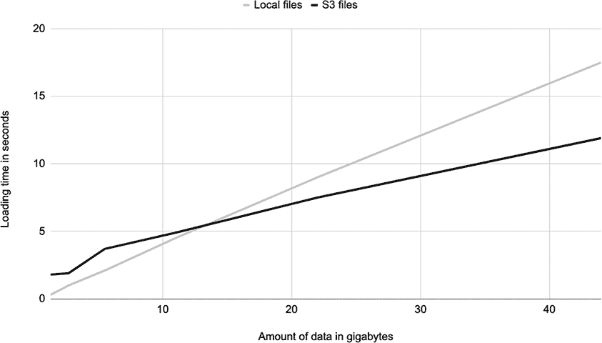

图 7.4 从本地文件加载时间与数据集大小作为函数的关系

黑色线表示从 S3 加载数据时的总执行时间，灰色线表示从本地文件加载数据时的执行时间。当数据集足够小，这里指小于 12 GB 左右时，使用本地文件稍微快一些。对于更大的数据集，从 S3 加载数据确实更快！

这个结果有一个重要的前提：S3 性能高度依赖于执行任务的实例的大小和类型。图 7.5 说明了这种影响。

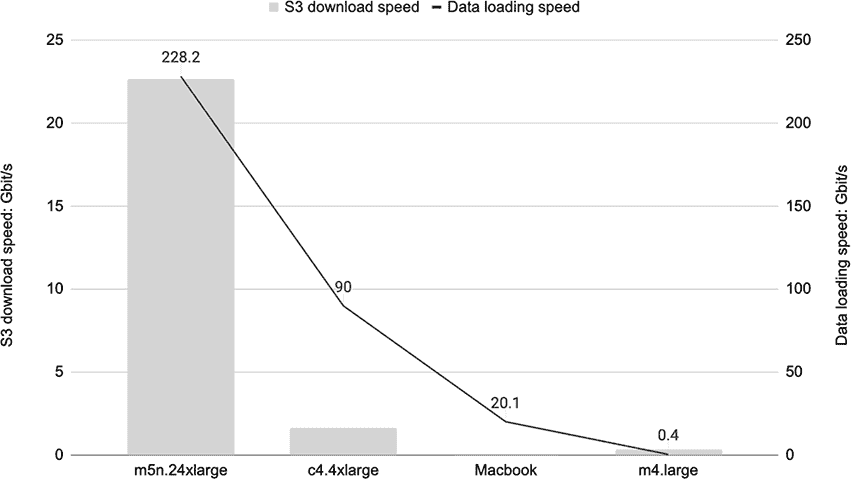

图 7.5 以实例大小为函数从 S3 和内存中加载数据

一个非常大的实例，如带有 384 GB RAM 和 48 个 CPU 核心的 m5n.24xlarge，在从 S3 加载数据时具有巨大的吞吐量：20-30 Gb/s，如图中灰色条所示。这比最近 Macbook 笔记本电脑上的本地磁盘带宽（可读取高达 20 Gb/s）要高。中等大小的实例如 c4.4xlarge 显示的带宽只有 1.5 Gbps，尽管仍然比典型办公室 Wi-Fi 所能达到的带宽要高得多。小型实例如 m4.large 的性能比笔记本电脑慢得多。

建议 当处理大规模数据时，使用大型实例类型是有益的。为了控制成本，你可以使用中等大小的实例作为云工作站，并在计算层（如 AWS Batch）上运行数据密集型步骤。

文件大小很重要

如果你尝试使用自己的数据集重现 S3 吞吐量图，但未能看到接近之前数字的结果，问题可能是文件大小。在 S3 中查找对象是一个相对较慢的操作，耗时约 50-100 毫秒。如果你有很多小文件，查找文件会花费大量时间，这会显著降低吞吐量。S3 的最佳文件大小至少是几十兆字节或更多，具体取决于数据量。

使用磁盘缓存将数据保持在内存中

为了解释图 7.5 中的黑色线条，让我们深入到这个例子中。你可能想知道这个基准是否有意义：load_s3 函数将数据下载到本地临时文件中，然后我们在启动步骤中读取这些文件。因此，我们似乎是在比较从临时本地文件加载数据和从目录中的本地文件加载数据，这两者的速度应该是相同的。

技巧在于，当从 S3 加载数据时，数据应保持在内存中，由操作系统透明地存储在内存中的磁盘缓存中，而无需触及本地磁盘，只要数据集足够小，可以适合内存。图 7.6 说明了这个逻辑。

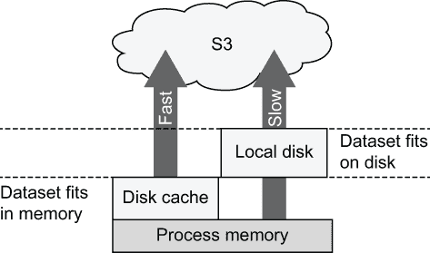

图 7.6 通过磁盘缓存加载数据比磁盘 I/O 快。

当数据集大小适合内存时，从 S3 的加载通过左侧箭头表示的快速路径进行。当数据集大于可用内存时，一些数据会溢出到本地磁盘，这使得加载数据变得非常慢。这就是为什么 S3 可以比本地磁盘更快：当你运行带有--with batch:memory=16000 的流程时，实例上的全部 16 GB 内存都用于这项任务。相比之下，许多进程都在争夺你的笔记本电脑上的内存，因此，当数据集大小如图 7.4 所示增长时，通常不可能将所有数据保持在内存中。

图 7.5 中的黑色线条显示了数据从磁盘缓存或本地磁盘读取到进程内存的速度。最大的实例 m5n.24xlarge 将所有数据保持在磁盘缓存中，因此读取数据非常快，达到 228 Gbit/s。数据只是在内存位置之间并行复制。相比之下，小型实例 m4.large 太小，无法将数据保持在内存中，因此数据会溢出到磁盘上，读取速度变得相对较慢，仅为 0.4 Gbit/s。

建议：在可行的情况下，选择允许你将所有数据保持在内存中的资源。这会使所有操作的速度大幅提升。

让我们总结一下本节中学到的内容：

+   使用 S3 而不是本地文件是有益的：数据更容易管理，它对在云中运行的任务来说随时可用，并且性能损失可以最小化，甚至可能提升性能。

+   只要我们使用足够大的实例，我们就可以非常快地从 S3 将数据加载到进程的内存中。

+   Metaflow 附带了一个高性能的 S3 客户端，metaflow.S3，它允许数据直接加载到内存中，而无需触及本地磁盘。

这些点构成了我们将要在接下来的章节中建立的基础。在下一节中，我们将将这些知识应用到数据科学家的日常工作中，并探讨如何在任务中有效地加载数据帧和其他表格数据。

### 7.1.2 与表格数据一起工作

在上一节中，我们仅仅对移动原始字节感兴趣。该讨论适用于从视频到自然语言的所有数据模式。在本节中，我们专注于一种特定类型的数据，即结构化或半结构化数据，这类数据通常以数据框的形式进行操作。这种类型的数据在商业数据科学中极为常见——例如，所有关系型数据库都持有这种类型的数据。

图 7.7 展示了包含员工信息的表格数据集的一个示例。该数据集有三个列，分别是姓名、年龄和角色，以及三行，每行代表一个员工。

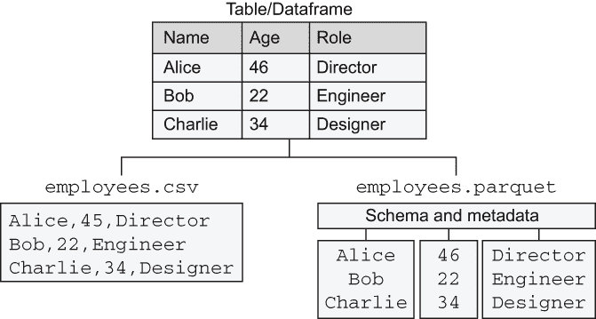

图 7.7 将表格数据存储为 CSV 与 Parquet 格式

如图 7.7 所示，我们可以以不同的格式存储数据集。在第三章中，我们讨论了 CSV（逗号分隔值）格式，它是一种简单的文本文件，每行包含一行数据，列之间由逗号分隔。或者，我们也可以以流行的*Parquet*格式存储相同的数据，这是一种*列式存储格式*。

在 Parquet 和其他列式格式中，每个数据列都是独立存储的。这种方法提供了一些好处。首先，对于结构化数据，每个列都有一个特定的类型。在这个例子中，姓名和角色是字符串，年龄是整数。每种数据类型都需要以特定的方式进行编码和压缩，因此按列（即按类型）分组数据是有益的。Parquet 文件在数据文件本身中存储了显式模式和其它元数据。相比之下，CSV 文件通过完全忽略模式来解决这个问题——所有内容都变成了字符串，这是 CSV 的一个主要缺点。

第二，由于每个列都是单独存储的，因此可以高效地只加载列的子集——想象一下这样的查询：SELECT name, role FROM table。同样，任何需要处理列的操作，如 SELECT AVG(age) FROM table，也可以快速处理，因为所有相关数据都在内存中连续排列。第三，Parquet 文件以压缩的二进制格式存储，因此占用的存储空间更少，比普通的 CSV 文件传输更快。

使用 Apache Arrow 在内存中读取 Parquet 数据

CSV 文件的一个主要优点是 Python 自带了一个名为 csv 的内建模块，非常适合读取它们。要读取 Parquet 文件，我们需要使用一个名为*Apache Arrow*的独立开源库。除了作为 Parquet 文件解码器之外，Arrow 还提供了数据的高效内存表示，这使我们能够高效地处理数据——稍后会有更多这方面的例子。

让我们实际比较一下 CSV 和 Parquet。为了测试，我们使用了纽约市出租车委员会的公开行程数据([`mng.bz/j2rp`](http://mng.bz/j2rp))，这些数据已经以公开的 Parquet 文件形式存储在 S3 上。对于我们的基准测试，我们使用了一个月的数据，包含大约 1300 万行，每行代表一次出租车行程。该数据集有 18 列，提供了关于行程的信息。

基准测试，如图 7.2 所示，比较了 CSV 和两种使用 Arrow 或 pandas 加载 Parquet 文件的方式所花费的时间。代码如下：

1.  开始步骤加载一个包含出租车行程的 Parquet 文件，该文件存储在公共 S3 桶中，并将其作为本地文件 taxi.parquet 提供。它使用 pandas 将 Parquet 文件转换为 CSV 文件，并将其保存为 taxi.csv。我们将使用这两个文件在后续步骤中基准测试数据加载。

1.  在 start 步骤之后，我们将其分为三个独立的数据加载步骤，每个步骤基准测试加载数据集的不同方式。每个步骤将加载数据所花费的时间保存到 stats 工件中如下：

    +   load_csv 步骤使用 Python 内置的 csv 模块遍历所有行，从 CSV 文件中读取。

    +   load_parquet 步骤使用 PyArrow 在内存中加载数据集。

    +   load_pandas 步骤使用 pandas 在内存中加载数据集。

1.  最后，join 步骤打印前一步骤测量的计时。

列表 7.2 比较数据格式

```
import os
from metaflow import FlowSpec, step, conda_base, resources, S3, profile

URL = 's3://ursa-labs-taxi-data/2014/12/data.parquet'                     ❶

@conda_base(python='3.8.10',
        libraries={'pyarrow': '5.0.0', 'pandas': '1.3.2'})
    class ParquetBenchmarkFlow(FlowSpec):

          @step
    def start(self):
        import pyarrow.parquet as pq
        with S3() as s3:
            res = s3.get(URL)                                             ❷
            table = pq.read_table(res.path)                               ❸
            os.rename(res.path, 'taxi.parquet')                           ❹
        table.to_pandas().to_csv('taxi.csv')                              ❺
        self.stats = {}                                                   ❻
        self.next(self.load_csv, self.load_parquet, self.load_pandas)

    @step
    def load_csv(self):
        with profile('load_csv', stats_dict=self.stats):                  ❼
            import csv
            with open('taxi.csv') as csvfile:
                for row in csv.reader(csvfile):                           ❽
                    pass                                                  ❾
        self.next(self.join)

    @step
    def load_parquet(self):
        with profile('load_parquet', stats_dict=self.stats):
            import pyarrow.parquet as pq
            table = pq.read_table('taxi.parquet')                         ❿
        self.next(self.join)

    @step
    def load_pandas(self):
        with profile('load_pandas', stats_dict=self.stats):
            import pandas as pd
            df = pd.read_parquet('taxi.parquet')                          ⓫
        self.next(self.join)

    @step
    def join(self, inputs):
        for inp in inputs:
            print(list(inp.stats.items())[0])                             ⓬
        self.next(self.end)

    @step
    def end(self):
        pass

if __name__ == '__main__':
    ParquetBenchmarkFlow()
```

❶ 存储为一个 Parquet 文件的出租车数据一个月

❷ 从 S3 下载 Parquet 文件

❸ 使用 Arrow 在内存中加载 Parquet 文件

❹ 将 Parquet 文件移动到持久位置，以便我们稍后加载

❺ 将数据集写入 CSV 文件，以便我们稍后加载

❻ 将分析统计信息存储在这个字典中

❼ 将计时信息存储在字典中

❽ 使用内置的 csv 模块读取 CSV 文件

❾ 抛弃行以避免过度消耗内存

❿ 使用 Arrow 加载 Parquet 文件。这次，我们计时操作。

⓫ 使用 pandas 加载 Parquet 文件

⓬ 打印每个分支的计时统计信息

将代码保存在 parquet_benchmark.py 中。出于基准测试的目的，此流程将 Parquet 文件和 CSV 文件作为本地文件存储，因此此流程必须在笔记本电脑或云工作站上运行，以便所有步骤都可以访问文件。按照以下方式运行流程：

```
# python parquet_benchmark.py --environment=conda run --max-workers 1
```

我们使用--max-workers 1 强制分支按顺序而不是并行执行，这确保了更无偏的计时。执行 start 步骤需要一段时间，因为它从 S3 下载一个 319MB 的压缩 Parquet 文件并将其写入本地 CSV 文件，该文件展开为 1.6GB。

提示：当迭代像 ParquetBenchmarkFlow 这样的流程时，该流程在开始处有一个昂贵的步骤，例如本例中的 start，记得使用 resume 命令：而不是使用 run，这需要一段时间，你可以使用，例如，resume load_csv 并继续迭代后续步骤，同时跳过缓慢的开始。

你应该看到如下输出，显示计时以毫秒为单位：

```
('load_csv', 19560)
('load_pandas', 1853)
('load_parquet', 973)
```

结果也显示在图 7.8 中。

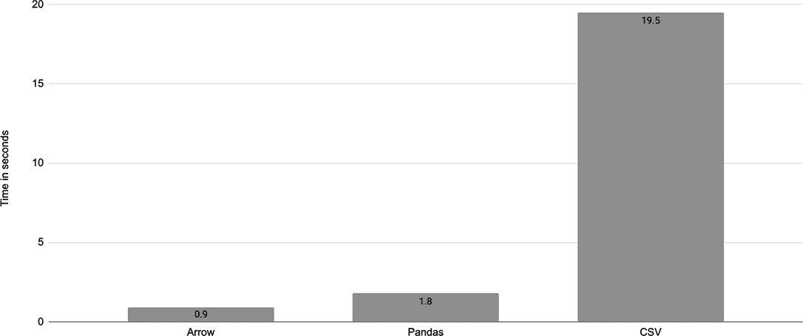

图 7.8 比较 Arrow、pandas 和 CSV 之间的数据加载时间

load_parquet 步骤是目前最快的，加载 1300 万行数据只需不到一秒钟！load_pandas 步骤需要两倍的时间来将 Parquet 文件读入 pandas DataFrame。我们在 load_csv 步骤上有点作弊，因为它几乎需要 20 秒，因为它不像其他步骤那样将数据保留在内存中。它只是迭代一次行。如果我们保留数据在内存中——你可以通过 list(csv.reader(csvfile)) 尝试——该步骤需要 70 秒，并消耗近 20 GB 的内存。

建议：在可行的情况下，使用 Parquet 格式存储和传输表格数据，而不是 CSV 文件。

希望这些结果能让你相信，使用 Parquet 而不是 CSV 几乎总是更胜一筹，主要例外是与其他系统和可能无法处理 Parquet 的人共享少量数据。此外，与简单的文本 CSV 文件相比，使用标准命令行工具检查 Parquet 文件并不那么容易，尽管存在可以将 Parquet 文件内容导出到文本文件的工具。现在我们知道了如何加载存储为 Parquet 文件的表格数据，下一步就是考虑其上的组件。

### 7.1.3 内存数据堆栈

使用 Parquet 而不是 CSV 是不言而喻的，但一个人应该如何在 Arrow 和 pandas 之间做出选择？幸运的是，你不必做出选择：这些工具通常是相当互补的。图 7.9 清晰地说明了构成内存数据堆栈的库是如何相互配合的。

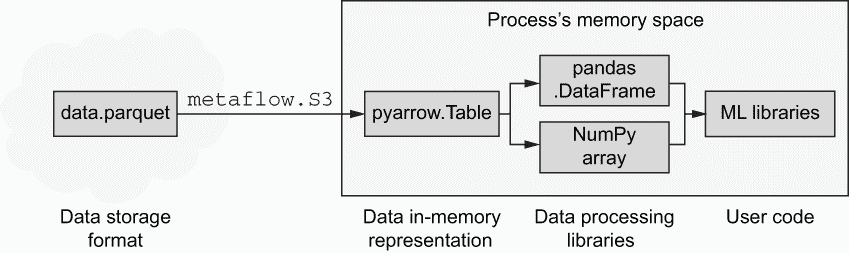

图 7.9 处理内存中数据的现代堆栈

Parquet 是一种 *数据存储格式*：它是一种比使用 CSV 文件更有效地存储和传输数据的方式。例如，你可以使用 metafow.S3 库非常快速地将 Parquet 文件从 S3 加载到你的工作流程中，正如我们之前所看到的。为了使用这些数据，我们需要从 Parquet 文件中加载和解析它，这是 Arrow 库的工作。Arrow 支持多种语言——其 Python 绑定称为 PyArrow。Arrow 将数据从 Parquet 文件解码成数据的高效 *内存表示*，可以直接使用或通过另一个库，如 pandas。

这是 Arrow 的一个超级功能：其内存表示已经被设计成可以被其他 *数据处理库*，如 pandas 或 NumPy 利用，这样它们就不必对数据进行另一次复制，这在处理大型数据集时是一个巨大的优势。这意味着你的 *用户代码*，例如使用 ML 库进行模型训练的步骤，可以以非常内存和时间高效的方式读取由 Arrow 管理的数据，可能通过 pandas。值得注意的是，所有数据管理都是由高效的底层代码执行的，而不是直接由 Python 执行，这使得在 Python 中开发极高性能的代码成为可能。

是否使用 pandas 或 NumPy 或直接使用 PyArrow 库取决于具体的使用情况。pandas 的一个主要优点是它提供了许多易于使用的数据操作原语，因此如果你的任务需要此类功能，将 Arrow 转换为 pandas 或使用 pd.read_parquet 是一个好的选择。

pandas 的一个主要缺点是它可能非常占用内存，正如我们稍后将会看到的，并且它的性能不如纯 Arrow 操作。因此，如果你使用一个可以接受 Arrow 数据或 NumPy 数组的 ML 库，避免转换为 pandas 可以节省大量时间和内存。我们将在 7.3 节中看到一个实际例子。

为什么使用 metaflow.S3？

如果你之前使用过 Arrow 或 pandas，你可能知道它们支持直接从 s3:// URLs 加载数据。那么为什么图 7.9 提到了 metaflow.S3*？目前，使用 metaflow.S3 加载数据集（由多个文件组成）比使用内置在 Arrow 和 pandas 中的 S3 接口要快得多。原因很简单：metaflow.S3 在多个网络连接上积极并行下载，这对于最大吞吐量是必需的。

很可能库将来会实现类似的方法。一旦发生这种情况，你就可以用库原生方法替换图和代码示例中的 metaflow.S3 部分。图片中的其他所有内容保持不变。

分析内存消耗

当处理大量内存中的数据时，内存消耗通常比执行时间更令人关注。在先前的例子中，我们使用了 with profile 上下文管理器来计时各种操作，但如果我们想以类似的方式测量内存消耗怎么办？

测量内存消耗随时间的变化不如查看计时器那么直接。然而，通过利用一个现成的库 memory_profiler，我们可以创建一个实用函数，实际上是一个自定义装饰器，你可以使用它来测量任何 Metaflow 步骤的峰值内存消耗，如下一列表所示。

列表 7.3 内存分析装饰器

```
from functools import wraps

def profile_memory(mf_step):                                     ❶
    @wraps(mf_step)                                              ❷
    def func(self):
        from memory_profiler import memory_usage                 ❸
        self.mem_usage = memory_usage((mf_step, (self,), {}),
                                      max_iterations=1,
                                      max_usage=True,
                                      interval=0.2)              ❹
    return func
```

❶ 定义了一个 Python 装饰器——一个返回函数的函数

❷ @wraps 装饰器有助于创建一个表现良好的装饰器

❸ 使用 memory_profile 库来测量内存消耗

❹ 将峰值内存使用存储在名为 mem_usage 的工件中

如果你之前没有在 Python 中创建过装饰器，这个例子可能看起来有点奇怪。它定义了一个函数，profile_memory，它接受一个参数 mf_step，这是被装饰的 Metaflow 步骤。它将步骤包装在一个新的函数 func 中，该函数调用库 memory_profiler 来执行步骤并在后台测量其内存使用情况。分析器返回峰值内存使用量，并将其分配给一个工件，self.mem_usage。

将代码保存到文件中，名为 metaflow_memory.py。现在，在任何流程中，你都可以通过在文件顶部写入 from metaflow_memory import profile_memory 来导入新的装饰器。你还必须确保内存分析库可用，这可以通过在@conda_base 字典中添加'memory_profiler': '0.58.0'来实现。现在你可以使用@profile_memory 装饰任何要分析步骤。例如，你可以通过编写以下内容来增强列表 7.3：

```
    @profile_memory
    @step
    def load_csv(self):
       ...
```

将装饰器添加到每个分支。要打印内存消耗，可以使用以下 join 步骤：

```
    @step
    def join(self, inputs):
        for inp in inputs:
            print(list(inp.stats.items())[0], inp.mem_usage)
        self.next(self.end)
```

为了在 load_csv 步骤中获得 CSV 内存消耗的实际情况，你应该通过使用 list(csv.reader(csvfile))而不是丢弃行的 for 循环来在内存中保留所有行。请注意，这将需要一个超过 16 GB RAM 的工作站。

你可以像往常一样运行 parquet_benchmark.py。除了计时外，你还会看到打印出的峰值内存消耗，如图 7.10 所示。

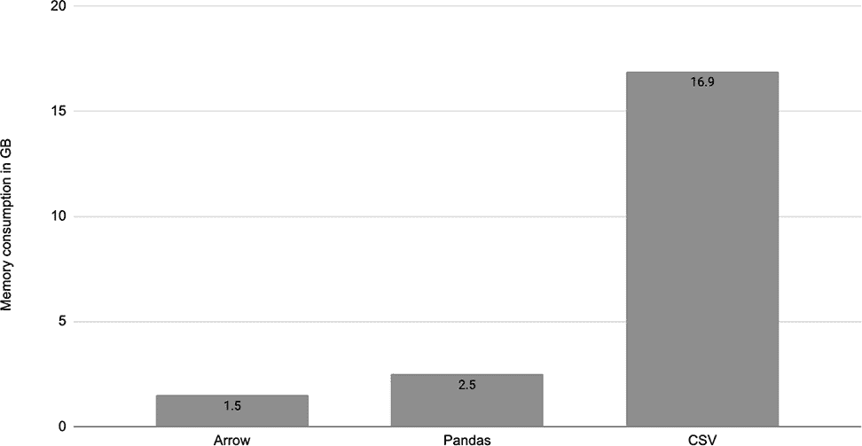

图 7.10 比较 Arrow、pandas 和 CSV 之间的内存开销

如预期的那样，将所有 CSV 数据作为内存效率低下的 Python 对象保存在内存中是非常昂贵的——load_csv 步骤消耗了近 17 GB 的 RAM，这比 Arrow 对相同数据的有效内存表示多出 10 倍以上。pandas 比 Arrow 多消耗一个 GB，因为它需要维护一些 Python 友好的对象表示，尤其是字符串。

建议：如果内存消耗是一个问题，请避免将单个行作为 Python 对象存储。转换为 pandas 也可能很昂贵。如果可能的话，最有效的方法是使用 Arrow 和 NumPy。

到目前为止，我们已经开发了从 S3 到数据高效内存表示的构建块。结合高内存实例（例如@resources (memory=256000)），你可以在单个任务中高效地处理大量数据集。然而，如果你的数据集比任何合理实例能处理的大，或者合适的数据集不存在但必须通过过滤和连接多个表来创建呢？在这种情况下，最好依赖剩余的数据基础设施，特别是经过实战考验的查询引擎，从任意数量的原始数据中创建适合数据科学工作流程的数据集。

## 7.2 与数据基础设施接口

*亚历克斯的交货时间估算器证明是成功的。因此，产品团队要求亚历克斯为特定产品类别构建更多细粒度的模型。这需要更多的数据预处理：亚历克斯需要为每个类别提取正确的数据子集，并尝试各种列的组合，以产生每个类别的最佳估计。鲍伊建议亚历克斯可以在 SQL 中完成所有数据预处理，因为数据库应该擅长处理数据。亚历克斯通过指出使用 Python 迭代模型及其输入数据要快得多来反驳这一观点。最后，他们达成了一项愉快的妥协：亚历克斯将使用 SQL 提取合适的数据集，并使用 Python 定义模型的输入*。

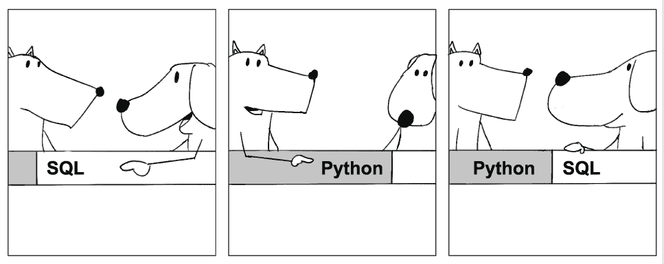

数据科学工作流程并非孤立存在。大多数公司都有现有的数据基础设施，这些基础设施已经建立起来以支持从分析到产品功能的各种用例。所有应用程序都依赖于一组一致的数据，由集中的数据基础设施管理是有益的。数据科学和机器学习也不例外。

尽管数据科学工作流程依赖于相同的数据输入，即与第 7.3 节中讨论的相同*事实*，但工作流程访问和使用数据的方式通常与其他应用程序不同。首先，它们倾向于访问大量数据提取——数十或数百吉字节的数据——用于训练模型，而仪表板可能一次只显示几千字节精心挑选的数据。其次，数据科学工作流程通常比其他应用程序计算密集得多，需要单独的计算层，正如第四章所讨论的。

本节展示了如何通过利用我们在上一节中学到的技术，将数据科学工作流程集成到现有的数据基础设施中。除了移动数据的技术问题外，我们还触及了一个组织问题，即如何在主要工作在数据基础设施上的数据工程师、主要工作在数据科学基础设施上的机器学习工程师和数据科学家之间分配工作。

### 7.2.1 现代数据基础设施

本书是关于*数据科学*基础设施的，即用于原型设计和部署利用各种优化或训练技术构建模型以服务于各种用例的数据密集型应用程序所需的基础设施。在许多公司中，数据科学基础设施有一个兄弟堆栈：*数据基础设施*堆栈。

由于这两个堆栈都处理数据，并且通常都使用 DAG 来表示将输入数据转换为输出数据的流程，人们可能会想知道这两个堆栈之间实际上是否有任何区别。我们难道不能也使用数据基础设施来进行数据科学吗？本书认为，与数据工程相关的活动在质量上与数据工程不同，这为并行堆栈提供了合理性。模型构建需要特殊的库，通常需要更多的代码，并且肯定比数据工程需要更多的计算。然而，保持两个堆栈紧密一致是有益的，以避免冗余解决方案和不必要的运营开销。

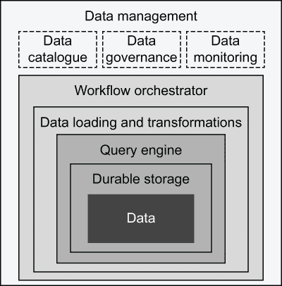

图 7.11 现代数据基础设施组件

为了更好地理解如何集成堆栈，让我们首先考虑现代数据基础设施的组件，如图 7.11 所示。该图的结构是，最基础的组件位于中心，而更高级、可选的组件位于外层。

+   *数据*—在最核心的位置，是数据资产本身。此图并未说明数据是如何获取的，这是一个复杂的话题，但我们假设你有一些数据，比如存储为 CSV 文件、Parquet 文件，或者作为数据库中的表。

+   *持久化存储*—虽然你可以使用 USB 闪存驱动器进行存储，但更可取的是依赖于更持久的存储系统，如 AWS S3 或复制的数据库。一个选择是现代*数据湖*，即在 S3 这样的通用存储系统上存储（Parquet）文件，并辅以 Apache Hive 或 Iceberg 这样的元数据层，以方便通过查询引擎访问数据。

+   *查询引擎*—查询引擎接收一个查询，例如一个 SQL 语句，它通过选择、过滤和连接来表示数据的一个子集。传统的数据库，如 Postgres，以及*数据仓库*，如 Teradata，将前三层紧密耦合在一起，而像 Trino（原名 Presto）或 Apache Spark 这样的新系统则是与底层存储系统松散耦合的查询引擎。对于*流数据*，可以使用 Apache Druid 或 Pinot 等系统。

+   *数据加载和转换*—提取、转换和加载（ETL）数据是数据工程的核心活动。传统上，数据在加载到数据仓库之前会被转换，但像 Snowflake 或 Spark 这样的新系统支持提取-加载-转换（ELT）范式，其中原始数据首先被加载到系统中，然后作为受祝福的数据集进行转换和精炼。如今，像 DBT ([getdbt.com](https://www.getdbt.com/))这样的工具可以用来更容易地表达和管理数据转换。可以使用 Great Expectations ([greatexpectations.io](https://greatexpectations.io/))等工具来确保数据质量。

+   *工作流程编排器*——ETL 管道通常表示为 DAG，类似于我们在本书前面讨论的数据科学工作流程。相应地，这些 DAG 需要由工作流程编排器如 AWS Step Functions 或 Apache Airflow，或 Apache Flink（用于流数据）执行。从工作流程编排器的角度来看，数据科学工作流程和数据工作流程之间没有区别。实际上，通常有益于使用一个集中的编排器来编排所有工作流程。

+   *数据管理*——随着数据量、种类和对有效性的需求增加，通常还需要另一层数据管理组件。*数据目录*，如 Lyft 的 Amundsen，可以更容易地发现和组织数据集。*数据治理*系统可用于执行安全性、数据生命周期、审计和血缘以及数据访问策略。*数据监控*系统有助于观察所有数据系统的整体状态、数据质量和 ETL 管道。

从核心向外构建数据基础设施是有意义的。例如，一个研究生可能只关心存储在他们笔记本电脑上的 CSV 文件中的数据集。初创公司可以从耐用的存储和基本的查询引擎中受益，如下一节中介绍的 Amazon Athena。拥有专门数据工程师的成熟公司还需要一个稳固的 ETL 管道设置。随着公司成长为大型跨国企业，他们还将添加一套强大的数据管理工具。

相应地，数据与数据科学基础设施之间的集成随着时间的推移而增长。图 7.12 突出了这些关系。独立于数据基础设施运行的层用虚线表示。虚线框突出了数据科学的特点：我们需要一个专门的计算层，能够执行要求高的数据科学应用程序和模型。

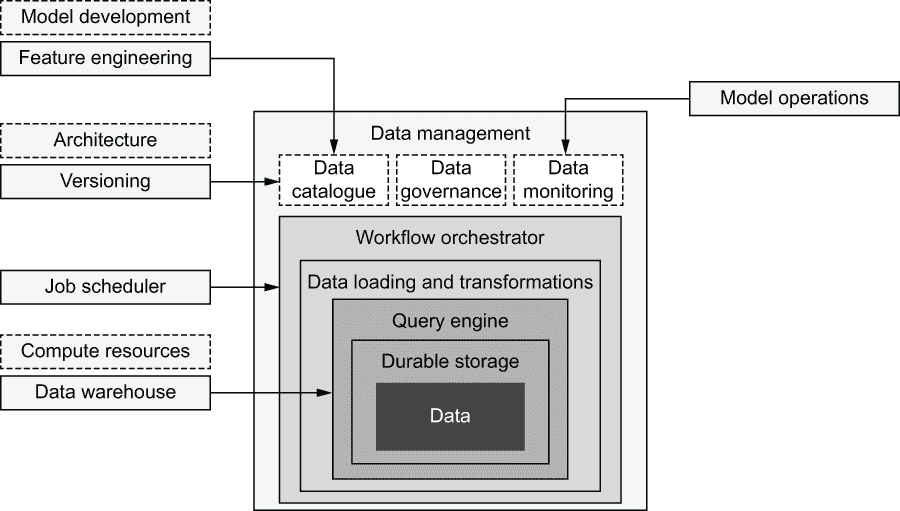

图 7.12 将数据科学堆栈与数据基础设施接口

相比之下，其他层通常从与数据基础设施的接口中受益如下：

+   *数据仓库*——在前一节中，我们学习了与存储为 Parquet 文件的原始数据以及持久存储系统 S3 交互的有效模式。在下一小节中，我们将学习如何与查询引擎接口。

+   *作业调度器*——我们在第二章中介绍的工作流程编排系统同样适用于数据管道 DAG 以及数据科学 DAG。因为这些 DAG 通常相互连接——例如，你可能希望在上游数据更新时启动模型训练工作流程——因此，在同一个系统上执行它们是有益的。例如，你可以使用 AWS Step Functions 来安排数据科学以及数据工作流程。

+   *版本控制*——假设您的数据目录支持数据集的版本控制，维护从上游数据集到使用这些数据构建的模型的数据血缘是有益的。例如，您可以通过存储一个数据版本标识符，指向数据目录，作为 Metaflow 工件来实现这一点。

+   *模型运维*——数据的变化是数据科学工作流程中失败的一个常见原因。除了监控模型和工作流程外，能够监控源数据也是有利的。

+   *特征工程*——正如我们将在 7.3 节中讨论的，在设计模型的新特征时，了解可用的数据是很方便的，这正是数据目录可以派上用场的地方。一些数据目录也可以作为特征存储使用。

具体来说，集成可以采取 Python 库的形式，这些库编码了数据的标准访问模式。许多现代数据工具和服务都附带 Python 客户端库，例如下一节中介绍的*AWS Data Wrangler*，它可以用于此目的。与一般的数据基础设施一样，没有必要在第一天就实现所有组件和集成。随着需求的增长，您可以逐步添加集成。

在数据科学家和数据工程师之间划分工作

公司规模越大，从原始数据到模型的路程就越长。随着数据量、种类和有效性的要求增长，要求一个人负责所有这些是不合理的。许多公司通过雇佣专门的数据工程师来解决这一问题，他们专注于所有与数据相关的工作，以及专注于建模的数据科学家。

然而，数据工程师和数据科学家之间的界限并不清晰。例如，如果三个表包含模型所需的信息，谁负责创建一个可以输入数据科学工作流程的联合表或视图？从技术角度来看，数据工程师是开发甚至复杂的 SQL 语句和优化连接的专家，所以他们可能应该做这件事。另一方面，数据科学家对模型及其需求了解得最准确。此外，如果数据科学家想要迭代模型和特征工程，他们不需要每次在数据集中进行哪怕微小的更改时都去打扰数据工程师。

正确答案取决于组织、资源以及涉及的数据工程师和数据科学家的技能组合的具体需求。图 7.13 提出了一种经过验证的工作划分方法，这种方法在两个角色之间非常清晰地划分了责任。

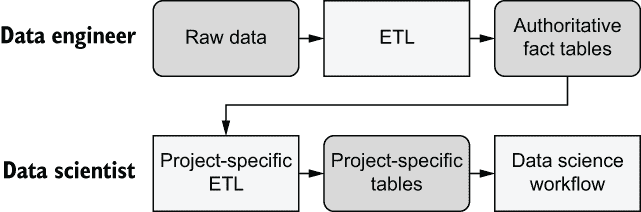

图 7.13 定义数据工程师和数据科学家之间的接口

*数据工程师*负责数据获取，即收集原始数据、数据质量和任何必要的转换，以便将数据作为广泛可消费、权威、精心管理的数据集提供。在结构化数据的情况下，数据集通常是具有固定、稳定模式的表格。值得注意的是，这些上游数据集应专注于*事实*——尽可能接近直接可观察的原始数据的数据——将数据的解释留给下游项目。组织不应低估这个角色的需求或低估其价值。这个角色直接通过原始数据暴露于现实世界的混乱之中，因此他们在隔离组织其余部分免受其影响方面发挥着关键作用。相应地，所有下游项目的有效性都取决于上游数据的质量。

*数据科学家*专注于构建、部署和运营数据科学应用。他们对每个项目的具体需求有深入了解。他们负责根据上游表创建特定项目的表格。由于他们负责创建这些表格，因此可以根据需要独立迭代它们。

对于特定项目的表格，对有效性和稳定性的要求可以更宽松，这取决于每个项目的需求，因为这些表格与由同一数据科学家或小型科学家团队管理的特定工作流程紧密耦合。在处理大型数据集时，如果数据科学家可以影响表格的布局和分区，这也是有益的，这将在前一段中讨论的将表格摄入工作流程时产生巨大的性能影响。

关键的是，这种安排只有在数据基础设施，尤其是查询引擎足够健壮，能够管理次优查询的情况下才能有效。我们不能假设每个数据科学家也都是世界级的数据工程师，但仍然方便让他们独立执行和安排查询。从历史上看，许多数据仓库在次优查询下很容易崩溃，因此让非专家运行任意查询是不可行的。现代数据基础设施应该能够隔离查询，这样这个问题就不再是问题。

数据工程的具体细节不在此书的讨论范围之内。然而，与数据科学家工作相关的问题则属于讨论范围，因此在下一段落中，我们将探讨一个人如何编写特定项目的 ETL，与查询引擎交互，作为数据科学工作流程的一部分。

### 7.2.2 在 SQL 中准备数据集

在本节中，我们将学习如何使用查询引擎，如 Trino 或 Apache Spark，或数据仓库如 Redshift 或 Snowflake，来准备可以使用我们在上一节中学到的模式高效加载到数据科学工作流程中的数据集。我们将使用图 7.14 中展示的概念，通过一个基于云的托管查询引擎 Athena 来演示，但您也可以使用相同的方法来使用其他系统。

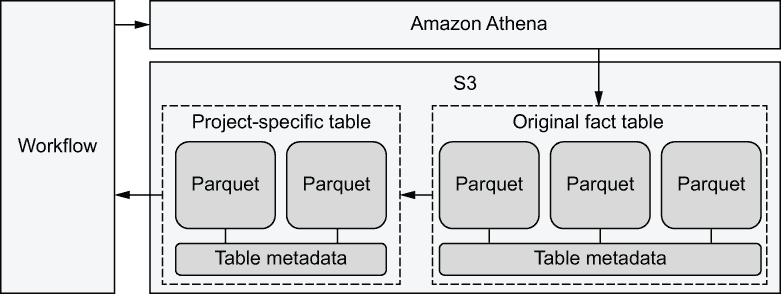

图 7.14 使用基于 S3 的数据湖的查询引擎

首先，我们需要将数据文件加载到 S3 并将其注册为具有合适模式的表，存储在表元数据中。Athena 使用流行的 Apache Hive 格式来存储其元数据。

之后，我们可以开始查询表。我们将创建一个工作流程，将 SQL 查询发送到 Athena，选择原始事实表的子集，并将结果写入新表。这种查询称为 *创建表选择*（CTAS）。CTAS 查询非常适合我们的需求，因为它们使我们能够使用我们在上一节中学到的快速数据模式从 S3 下载结果。

我们将使用开源库 *AWS Data Wrangler* ([`github.com/awslabs/aws-data-wrangler`](https://github.com/awslabs/aws-data-wrangler)) 来与 Athena 进行接口。AWS Data Wrangler 使得从 AWS 提供的各种数据库和数据仓库中读取和写入数据变得容易。然而，将示例修改为使用提供类似功能的其他客户端库并不困难。

如果您此时不想测试查询引擎，可以跳过本小节，继续下一节。在下一节中，我们将看到如何在工作流程中后处理数据。

在 Athena 上设置表

Amazon Athena 是一个基于 Trino 的无服务器查询引擎，无需预先设置。只需确保您的 IAM 用户或 Batch 角色（在 Metaflow 配置中的 METAFLOW_ECS_S3_ACCESS_IAM_ROLE）已附加名为 AmazonAthenaFullAccess 的策略，这允许执行 Athena 查询。此外，请确保在您的配置中设置了 AWS 区域，例如，通过设置环境变量 AWS_DEFAULT_REGION=us-east-1。

作为测试数据集，我们将使用纽约市出租车行程数据的子集，这是我们首次在列表 7.2 中使用的数据。我们将初始化一个包含一年数据的表，大约有 1.6 亿行，通过月份对表进行 *分区*。在这种情况下，分区只是将文件组织成目录，允许只读取部分月份的查询完成得更快，因为查询引擎可以跳过整个文件目录。分区需要特定的命名方案，目录以 month= 前缀开头，这就是为什么我们将文件从原始位置复制到遵循所需命名方案的新的 S3 位置。所需的路径结构如下所示：

```
s3://my-metaflow-bucket/metaflow/data/TaxiDataLoader/12/nyc_taxi/month=11/
➥ file.parquet
```

直到 /nyc_taxi/ 的前缀在你的情况下可能会有所不同，因为它取决于你的 Metaflow 配置。关键部分是 nyc_taxi 后的后缀，特别是 month=11，它用于分区。

要创建一个表，我们需要一个预定义的模式。我们将通过检查 Parquet 文件中的模式来创建一个模式规范。该表通过一个称为 *AWS Glue* 的数据目录服务进行注册，该服务与 Athena 紧密集成。列表 7.4 将所有这些操作打包在一个 Metaflow 工作流中，包括下载和上传数据到所需的层次结构、模式定义和表创建。以下是代码的工作方式：

+   开始步骤处理两件事：

    +   它将 Parquet 文件复制到 S3 中的分区目录层次结构。这需要创建新的路径名，通过 make_key 工具函数实现。请注意，通过使用 S3(run=self) 初始化 S3 客户端，Metaflow 为具有版本号的文件选择了一个合适的 S3 根目录，该版本号与运行 ID 相关联，这使得我们可以在不担心覆盖先前结果的情况下安全地测试代码的不同版本。结果层次结构的根路径存储在一个名为 s3_prefix 的工件中。

    +   它检查 Parquet 文件的模式。我们假设所有文件都有相同的模式，因此只需查看第一个文件的模式即可。Parquet 文件的模式使用与 Athena 使用的 Hive 格式略有不同的名称，因此我们使用 hive_field 工具函数根据 TYPES 映射重命名字段。结果模式存储在一个名为 schema 的工件中。

+   配置了适当布局的 Parquet 文件和模式后，我们可以在最终步骤中设置一个表。作为一个初始化步骤，我们创建一个默认名为 dsinfra_test 的数据库。如果数据库已存在，调用将引发异常，我们可以安全地忽略它。之后，我们可以为 Athena 创建一个存储其结果的存储桶并注册一个新表。repair_table 调用确保新创建的分区包含在表中。

在这些步骤之后，表就准备好查询了！

列表 7.4 在 Athena 中加载出租车数据

```
from metaflow import FlowSpec, Parameter, step, conda, profile, S3

GLUE_DB = 'dsinfra_test'                                                   ❶
URL = 's3://ursa-labs-taxi-data/2014/'                                     ❷

TYPES = {'timestamp[us]': 'bigint', 'int8': 'tinyint'}                     ❸

class TaxiDataLoader(FlowSpec):

    table = Parameter('table',                                             ❹
                      help='Table name',
                      default='nyc_taxi')

    @conda(python='3.8.10', libraries={'pyarrow': '5.0.0'})
    @step
    def start(self):
        import pyarrow.parquet as pq

        def make_key(obj):                                                 ❺
            key = '%s/month=%s/%s' % tuple([self.table] + obj.key.split('/'))
            return key, obj.path

        def hive_field(f):                                                 ❻
            return f.name, TYPES.get(str(f.type), str(f.type)) 

        with S3() as s3down:
            with profile('Dowloading data'):
                loaded = list(map(make_key, s3down.get_recursive([URL])))  ❼
            table = pq.read_table(loaded[0][1])                            ❽
            self.schema = dict(map(hive_field, table.schema))              ❽
            with S3(run=self) as s3up:    #I
                with profile('Uploading data'):
                    uploaded = s3up.put_files(loaded)                      ❾
                key, url = uploaded[0]
                self.s3_prefix = url[:-(len(key) - len(self.table))]       ❿
        self.next(self.end)

    @conda(python='3.8.10', libraries={'awswrangler': '1.10.1'})
    @step
    def end(self):
        import awswrangler as wr
        try:
            wr.catalog.create_database(name=GLUE_DB)                       ⓫
        except:
            pass
        wr.athena.create_athena_bucket()                                   ⓬
        with profile('Creating table'):
            wr.catalog.create_parquet_table(database=GLUE_DB,
                                            table=self.table,
                                            path=self.s3_prefix,
                                            columns_types=self.schema,
                                            partitions_types={'month': 'int'},
                                            mode='overwrite')              ⓭
            wr.athena.repair_table(self.table, database=GLUE_DB)           ⓮

if __name__ == '__main__':
    TaxiDataLoader()
```

❶ 数据库名称——你可以选择任何名称

❷ 在公共存储桶中的纽约出租车数据

❸ 将 Parquet 模式中的某些类型映射到 Glue 使用的 Hive 格式

❹ 定义表名，可选

❺ 符合我们分区方案的 S3 对象密钥（路径）

❻ 将 Parquet 类型映射到 Glue 使用的 Hive 类型

❼ 下载数据并生成新的密钥

❽ 从第一个 Parquet 文件中检查模式并将其映射到 Hive

❾ 将数据上传到 Metaflow 运行特定的位置

❿ 将新的 S3 位置保存到工件中

⓫ 在 Glue 中创建一个新的数据库并忽略由数据库已存在引起的失败

⓬ 初始化一个用于 CTAS 结果的存储桶

⓭ 使用新的位置和模式注册一个新的表

⓮ 请求 Athena 发现新添加的分区

将代码保存到 taxi_loader.py 文件中。运行流程将上传和下载大约 4.2 GB 的数据，因此建议在批处理或云工作站上运行。你可以像平常一样运行流程：

```
# python taxi_loader.py --environment=conda run
```

在大型云工作站上，该流程的执行时间应少于 30 秒。

使用 metaflow.S3 进行版本化数据

列表 7.4 上传数据到 S3 而不指定存储桶或显式的 S3 URL。这是可能的，因为 S3 客户端被初始化为 S3(run=self)*，这告诉 Metaflow 默认引用 *运行特定位置*。Metaflow 根据其数据存储位置创建一个 S3 URL，并在键前加上运行 ID。

此模式在将数据存储在 S3 且需要其他系统可访问的情况下很有用（工作流程内部的数据可以存储为工件）。因为数据是相对于运行 ID 存储的，所以上传的任何数据都会自动进行版本控制，确保每次运行都独立写入或复制数据，从而避免意外覆盖相关结果。之后，如果你需要跟踪某个运行产生的数据，可以根据运行 ID 查找数据，从而维护 *数据血缘*。

在运行成功完成后，你可以打开 Athena 控制台，确认在数据库 dsinfra_test 下可以找到新的表 nyc_taxi。控制台包括一个方便的查询编辑器，允许你使用 SQL 查询任何表。例如，你可以通过执行 SELECT * FROM nyc_taxi LIMIT 10 来查看数据的小型预览。图 7.15 展示了控制台应有的样子。

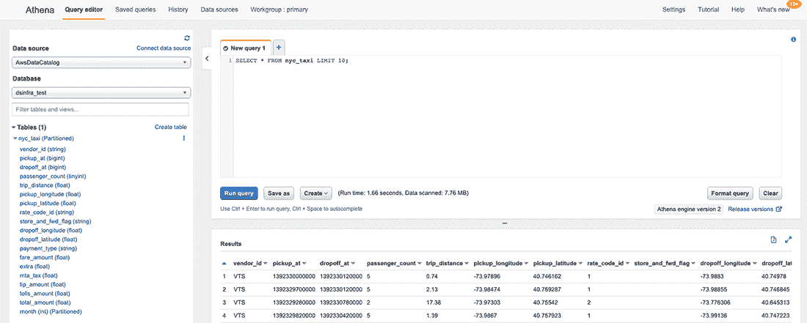

图 7.15 在 Athena 控制台上查询出租车数据

如果你可以在控制台中看到表及其列，并且测试查询返回了带有值的行，则该表已准备好使用！接下来，我们将创建一个执行针对该表的 CTAS 查询的流程，这允许我们创建任意数据子集以供工作流程使用。

运行 CTAS 查询

数据科学家应该如何执行特定项目的 SQL 查询？一个选项是使用数据基础设施提供的数据工具，遵循数据工程师使用的最佳实践。这种方法的一个缺点是查询与依赖它的工作流程解耦。可能更好的方法是作为工作流程的一部分执行查询，如下所示。

你可以在 Python 代码中将 SQL 语句作为字符串嵌入，但为了从 IDE 中的正确语法高亮和检查中受益，以及使代码整体更易于阅读，我们可以将它们存储为单独的文件。为了测试这个想法，让我们创建一个查询，该查询选择新创建的 nyc_taxi 表的子集。下面的代码列表显示了一个选择在上午 9 点到下午 5 点之间工作时间内开始的出租车行程的 SQL 语句。

列表 7.5 提取商业时段数据的 SQL 查询

```
SELECT * FROM nyc_taxi
    WHERE hour(from_unixtime(pickup_at / 1000)) BETWEEN 9 AND 17
```

将此 SQL 语句保存到一个新的子目录 sql 中，文件为 sql/taxi_etl.sql。如果您对时间逻辑感到好奇，pickup_at / 1000 是必需的，因为数据集中的时间戳以毫秒表示，但从 _unixtime 需要秒。现在我们可以编写一个执行查询的流程，如下所示。

列表 7.6 带参数的流程

```
from metaflow import FlowSpec, project, profile, S3, step, current, conda

GLUE_DB = 'dsinfra_test'

@project(name='nyc_taxi')                                                  ❶
class TaxiETLFlow(FlowSpec):

    def athena_ctas(self, sql):
        import awswrangler as wr
        table = 'mf_ctas_%s' % current.pathspec.replace('/', '_')          ❷
        self.ctas = "CREATE TABLE %s AS %s" % (table, sql)                 ❸
        with profile(‘Running query’):
            query = wr.athena.start_query_execution(self.ctas,
                                                     ➥ database=GLUE_DB)  ❹
            output = wr.athena.wait_query(query)                           ❺
            loc = output['ResultConfiguration']['OutputLocation']
            with S3() as s3:
                return [obj.url for obj in s3.list_recursive([loc + '/'])] ❻

    @conda(python='3.8.10', libraries={'awswrangler': '1.10.1'})
    @step
    def start(self):
        with open('sql/taxi_etl.sql') as f:
            self.paths = self.athena_ctas(f.read())                        ❼
        self.next(self.end)

    @step
    def end(self):
        pass

if __name__ == '__main__':
    TaxiETLFlow()
```

❶ 将流程附加到项目。在下一节中这将很有用。

❷ 根据当前任务的 ID 创建一个结果表名称

❸ 格式化 CTAS SQL 查询并将其存储为自述文件

❹ 将查询提交到 Athena

❺ 等待查询完成

❻ 列出结果集中所有的 Parquet 文件

❼ 格式化并提交查询，并存储生成的 Parquet 文件的 URL

TaxiETLFlow 是一个通用流程，它实现了本节开头图 7.14 中描述的模式。它从一个文件中读取任意 SELECT 语句，sql/taxi_etl.sql，通过在其前面添加 CREATE TABLE 转换为 CTAS 查询，提交查询，等待其完成，并将结果 Parquet 文件的路径作为自述文件存储，以便它们可以轻松地被其他下游流程消费，下一节我们将看到一个例子。

提示：您可以使用当前对象来检查当前正在执行的运行，如图 7.6 所示。如果您想了解当前的运行 ID、任务 ID 或执行运行的用户，这会很有用。

将代码保存到 taxi_etl.py。该流程需要一个额外的 SQL 文件，因此我们使用上一章中讨论的 --package- 后缀选项，将所有 .sql 文件包含在代码包中。按照以下方式运行流程：

```
# python taxi_etl.py --environment=conda --package-suffixes .sql run
```

运行完成后，您可以登录到 Athena 控制台并点击“历史”选项卡以确认查询状态，如图 7.16 所示。

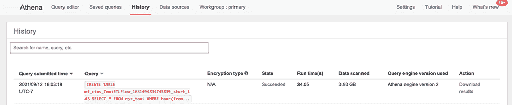

图 7.16 Athena 控制台上的查询状态

由于运行和任务 ID 嵌入在表名称中，例如图 7.16 中的 mf_ctas_TaxiETLFlow_1631494834745839_start_1，因此很容易在查询和运行之间建立联系。反之，通过将待执行的查询作为自述文件 self.ctas 存储并其结果存储在另一个自述文件 self.paths 中，我们可以从源数据、处理它的查询到最终输出（例如，工作流程产生的模型）形成一个完整的数据血缘。在调试与预测质量或输入数据相关的问题时，这种血缘关系可能非常有用。

建议：通过在执行的查询中包含运行 ID 并将查询作为自述文件记录，在数据基础设施和数据科学工作流程之间维护数据血缘。

作为练习，你可以将示例修改为与另一个现代查询引擎一起工作。相同的 CTAS 模式适用于 Spark、Redshift 或 Snowflake。你还可以使用我们在上一章中学到的技术，通过生产级调度器定期调度 ETL 工作流程，可能就是数据工程团队使用的同一个调度器。

无论你使用什么查询引擎，重要的是通用能力。使用这种方法，数据科学家可以在他们的工作流程中包含一个特定项目的数据处理步骤，并将大规模数据处理任务卸载到可扩展的查询引擎。在下一节中，我们将看到如何通过利用我们之前学到的水平扩展和快速数据方法来访问即使是大型 CTAS 查询的结果。

清理旧结果

默认情况下，CTAS 查询生成的结果表将永久保留。这对可重复性和可审计性有益，因为你可以检查任何旧结果。然而，在一段时间后删除旧结果是合理的做法。

你可以通过使用*S3 生命周期策略*来删除 S3 中的旧数据。因为结果只是 S3 中的位置，你可以设置一个策略，在预定时间后（例如 30 天后）删除 CTAS 结果写入位置的所有对象。此外，你还需要从 Glue 中删除表元数据。

你可以通过执行带有 AWS Data Wrangler 的 DROP TABLE SQL 语句或使用以下 AWS CLI 命令来删除 Glue 表：

```
aws glue batch-delete-table
```

作为要删除的表的参数列表。

### 7.2.3 分布式数据处理

在 7.1 节中，我们学习了如何快速将 Parquet 文件从 S3 加载到单个实例。这是一个简单且健壮的模式，适用于可以放入内存的数据集。当与具有数百 GB RAM 的大实例以及 Apache Arrow 和 NumPy 提供的有效内存表示相结合时，你可以处理大规模数据集，在某些情况下，可以处理数十亿个数据点，而无需求助于分布式计算及其带来的开销。

自然，这种方法有其局限性。显然，并非所有数据集都能一次性放入内存。或者，可能在单个实例上对数百 GB 的数据进行复杂处理可能太慢。在这种情况下，将计算扇出到多个实例是一个好主意。在本节中，我们将学习如何以分布式方式加载数据和处理数据，例如 CTAS 查询生成的表。像之前一样，我们将使用 Metaflow 的 foreach 构造来分布，但你也可以使用支持分布式计算的其他框架应用相同的模式。本章学到的经验在以下两个常见于数据科学工作流程的场景中很有用：

1.  *在每个分支中加载和处理数据的不同子集*——例如，与第五章中的 K-means 示例不同，该示例使用相同的数据集来训练所有模型，您可以在每个 foreach 任务中加载不同的子集，例如，针对特定国家的数据。

1.  *高效的数据预处理*——通常在 SQL 中进行基本数据提取后，再在 Python 中进行更高级的预处理，这样做很方便。我们将在本章和第九章的后续部分使用这种模式进行特征工程。

这两种情况的一个共同特点是，我们希望处理*分片*或分块的数据，而不是一次性处理所有数据。图 7.17 说明了这种高级模式。


图 7.17 工作流中处理分片数据

CTAS 查询生成一组 Parquet 文件，我们可以通过一列（例如，按国家）对其进行分区，或者将它们分成大小大致相等的分片。工作流将 foreach 操作扩展到分片上，将数据处理分布在多个并行步骤中。然后我们可以在连接步骤中合并结果。为了突出这种模式与分布式计算中的*MapReduce 范式*的相似性，图 7.17 将 foreach 步骤称为*Mappers*，将连接步骤称为*Reduce*。为了了解这种模式在实际中的工作原理，让我们通过一个有趣的例子来探讨：出租车数据集的可视化。

示例：可视化大型数据集

以下示例有两种工作模式：它可以读取由 TaxiETLFlow 生成的出租车数据集的任意子集（列表 7.6），或者它可以以原始数据的形式加载数据。如果您在上一节中没有设置 Athena，则可以使用原始数据模式。在两种情况下，我们将提取每辆出租车行程的接车位置的纬度和经度，并在图像上绘制它。

由于数据集中有*很多*行程，这个任务变得非同寻常。在原始模式下，我们处理 2014 年的所有行程，这相当于 4800 万个数据点。为了展示如何高效地处理这类大型数据集，我们像图 7.17 所示的那样并行进行预处理。

让我们首先编写一个辅助函数，该函数在图像上绘制点。由于数据量很大，我们将使用一个专门的开源库*Datashader* ([datashader.org](https://datashader.org/))，该库经过调整，可以高效地处理数百万个点。辅助函数在下一列表中显示。

列表 7.7 绘制出租车行程坐标

```
from io import BytesIO

CANVAS = {'plot_width': 1000,
          'plot_height': 1000,
          'x_range': (-74.03, -73.92),                                ❶
          'y_range': (40.70, 40.78)}                                  ❶

def visualize(lat, lon):                                              ❷
    from pandas import DataFrame
    import datashader as ds
    from datashader import transfer_functions as tf
    from datashader.colors import Greys9
    canvas = ds.Canvas(**CANVAS)
    agg = canvas.points(DataFrame({'x': lon, 'y': lat}), 'x', 'y')    ❸
    img = tf.shade(agg, cmap=Greys9, how='log')                       ❸
    img = tf.set_background(img, 'white')
    buf = BytesIO()                                                   ❹
    img.to_pil().save(buf, format='png')                              ❹
    return buf.getvalue()                                             ❹
```

❶ 定义下曼哈顿的边界框

❷ 接受两个数组作为点：纬度和经度

❸ 以对数方式着色每个像素绘制点

❹ 将可视化保存为工件

将代码保存到 taxiviz.py 中，我们将在后续的流程中导入。请注意，数据点的数量（高达 4800 万）比图像中的像素数量（100 万）多得多。因此，我们将根据击中每个像素的点数对其进行着色。我们使用对数颜色范围以确保最淡的像素不会被冲淡。类似于前一章中的预测图，我们将结果图像存储为工件，因此它具有版本控制并存储在运行中，可以使用客户端 API 检索并显示，例如在笔记本中。

接下来，让我们实现流程本身——请参见以下列表。该流程实现了图 7.17 中描述的模式。在起始步骤中，我们选择要使用的数据输入：要么是之前执行的 TaxiETLFlow 的 CTAS 查询结果，要么是原始数据。我们将数据划分为分片，每个分片由一个独立的前处理数据任务进行处理。连接步骤将每个分片产生的坐标数组合并在一起，并在图像上绘制坐标。

列表 7.8 带参数的流程

```
from metaflow import FlowSpec, step, conda, Parameter,\
                     S3, resources, project, Flow
import taxiviz                                                                ❶
URL = 's3://ursa-labs-taxi-data/2014/'                                        ❷
NUM_SHARDS = 4

def process_data(table):                                                      ❸
    return table.filter(table['passenger_count'].to_numpy() > 1)              ❹

@project(name='taxi_nyc')                                                     ❺
class TaxiPlotterFlow(FlowSpec):

    use_ctas = Parameter('use_ctas_data', help='Use CTAS data', default=False)❻

    @conda(python='3.8.10') 
    @step
    def start(self):
        if self.use_ctas:
            self.paths = Flow('TaxiETLFlow').latest_run.data.paths            ❼
        else:
            with S3() as s3:
                objs = s3.list_recursive([URL])                               ❽
                                      self.paths = [obj.url for obj in objs]
        print("Processing %d Parquet files" % len(self.paths))
        n = round(len(self.paths) / NUM_SHARDS)   
        self.shards = [self.paths[i*n:(i+1)*n] for i in range(NUM_SHARDS - 1)]❾
        self.shards.append(self.paths[(NUM_SHARDS - 1) * n:])                 ❾
        self.next(self.preprocess_data, foreach='shards')

    @resources(memory=16000)
    @conda(python='3.8.10', libraries={'pyarrow': '5.0.0'})
    @step
    def preprocess_data(self):                                                ❿
        with S3() as s3:
            from pyarrow.parquet import ParquetDataset
            if self.input:
                objs = s3.get_many(self.input)                                ⓫
                orig_table = ParquetDataset([obj.path for obj in objs]).read()⓫
                self.num_rows_before = orig_table.num_rows
                table = process_data(orig_table)                              ⓬
                self.num_rows_after = table.num_rows
                print('selected %d/%d rows'\
                      % (self.num_rows_after, self.num_rows_before))
                self.lat = table['pickup_latitude'].to_numpy()                ⓭
                self.lon = table['pickup_longitude'].to_numpy()               ⓭
        self.next(self.join)

    @resources(memory=16000)
    @conda(python=’3.8.10’, libraries={‘pyarrow’: ‘5.0.0’, ‘datashader’: 
    ➥ ‘0.13.0’})
    @step
    def join(self, inputs):
        import numpy
        lat = numpy.concatenate([inp.lat for inp in inputs])                  ⓮
        lon = numpy.concatenate([inp.lon for inp in inputs])                  ⓮
        print("Plotting %d locations" % len(lat))
        self.image = taxiviz.visualize(lat, lon)                              ⓯
        self.next(self.end)

    @conda(python='3.8.10') 
    @step
    def end(self):
        pass

if __name__ == '__main__':
    TaxiPlotterFlow()
```

❶ 导入我们之前创建的辅助函数

❷ 在原始数据模式下，使用 2014 年的数据

❸ 一个用于为每个分片预处理数据的 mapper 函数

❹ 例如，我们只包括有超过一名乘客的行程。

❺ 使用与 TaxiETLFlow 相同的工程

❻ 在两种模式之间进行选择：CTAS 或原始数据

❼ 在 CTAS 模式下，检索到 CTAS 结果的路径

❽ 在原始数据模式下，列出原始数据的路径

❾ 将所有路径分组为四个大致相等大小的分片

❿ Mapper 步骤，处理每个分片

⓫ 下载此分片的数据并将其解码为表

⓬ 处理表

⓭ 存储处理表中的坐标

⓮ 连接所有分片的坐标

⓯ 可视化并将结果存储为工件

将代码保存到 taxi_plotter.py。如果您之前运行了 TaxiETLFlow，您可以像这样运行流程：

```
# python taxi_plotter.py --environment=conda run --use_ctas_data=True
```

否则，省略该选项以直接使用原始数据。该流程在大实例上运行大约一分钟。运行完成后，您可以在笔记本中打开一个单元格并输入以下行以查看结果：

```
from metaflow import Flow
from IPython.display import Image
run = Flow('TaxiPlotterFlow').latest_run
Image(run.data.image)
```

结果应该类似于图 7.18 中的某个可视化。图 7.18 左侧显示了完整数据集的图像。您可以看到 Midtown 地区非常受欢迎（浅色）。右侧的图像是由一个 CTAS 查询生成的，该查询显示了午夜到凌晨 1 点之间的一小时的行程——Midtown 地区以外的许多地区交通稀疏。

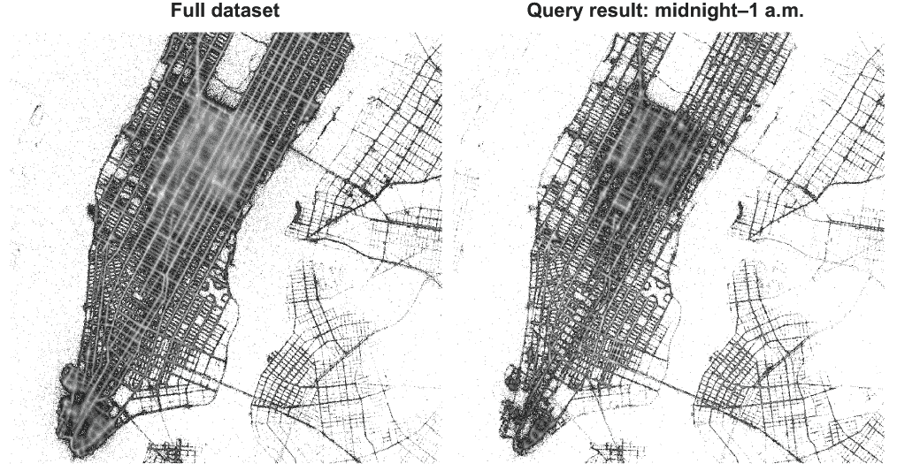

图 7.18 在出租车数据集的两个不同子集中可视化接车位置

列表 7.8 中的代码演示了以下三个重要概念：

+   多亏了 @project，我们可以安全地将上游数据处理流程 TaxiETLFlow 与其他下游业务逻辑（如 TaxiPlotterFlow）分离。关键的是，Flow('TaxiETLFlow').latest_run 指的不是 TaxiETLFlow 的任何随机最新运行，而是存在于流程自身命名空间中的最新运行，正如第六章所讨论的那样。这允许多个数据科学家在自己的 TaxiETLFlow→TaxiPlotterFlow 序列版本上工作，而不会相互干扰。

+   process_data 函数展示了映射器概念。在 CTAS 查询中使用 SQL 提取原始数据集之后，数据科学家可以在 Python 中进一步处理数据，而不是必须将所有项目特定的逻辑打包在 SQL 查询中。此外，我们还避免了可能内存效率低下的 pandas 转换。

将 process_data 视为一个无限通用的用户定义函数（UDF），许多查询引擎提供它作为绕过 SQL 限制的逃生门。根据 process_data 的计算成本，可以增加分片数量以加快处理速度。

+   我们避免将完整的数据集作为工件存储，因为这通常会导致不便的缓慢速度。相反，我们只提取所需的数据——在本例中为纬度和经度——作为空间高效的 NumPy 数组并存储它们。合并和操作 NumPy 数组是快速的。

此流程表明，使用现成的库和可扩展的计算层，在 Python 中处理大型数据集是可能的。这种方法的主要好处是操作简单：您可以使用现有的数据基础设施进行初始的重型工作以及 SQL 查询，其余部分可以由数据科学家在 Python 中自主处理。

在下一节中，我们添加数据路径中的最后一步：将数据输入到模型中。我们将利用本节中讨论的模式来有效地执行特征转换。

另一种方法：Dask 或 PySpark

作为分布式数据处理的一种替代方法，您可以使用专门的计算层，如 Dask ([dask.org](https://dask.org/))，它为在 Python 中执行类似操作提供了一个高级接口。Dask（或 PySpark）的一个好处是数据科学家可以操作类似 dataframe 的对象，这些对象在底层自动分片和并行化。

一个缺点是在您的基础设施堆栈中引入了另一个操作上非平凡的计算层。当像 Dask 或 Spark 这样的系统运行良好时，它可以大幅提高生产力。当它不起作用时，无论是由于工程问题还是由于与数据科学家想要使用的库不兼容，它可能会成为一个难以调试的头痛问题。

如果您已经有一个可用的 Dask 集群，您可以通过在 Metaflow 步骤中调用它来轻松地将数据处理任务卸载到该集群上。配备了关于各种方法的信息，您可以为您的组织做出正确的选择。

## 7.3 从数据到特征

*拥有一种从数据仓库到工作流加载数据的强大方式，亚历克斯可以开始更系统地考虑如何将原始数据转换为模型所消耗的矩阵和张量。亚历克斯希望快速从数据仓库中加载各种数据子集，并定义一组自定义 Python 函数——特征编码器，将原始数据转换为模型输入。输入矩阵的确切形状和大小取决于用例，因此系统应该足够灵活，能够处理各种需求。*

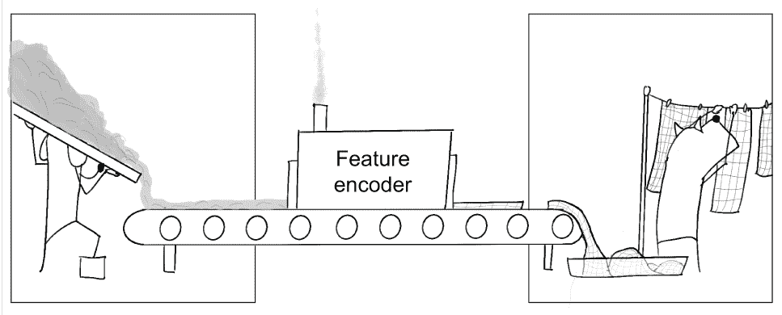

到目前为止，我们讨论了数据处理的基础层次：如何高效地访问和处理原始数据。这次讨论并没有特别涉及数据科学或机器学习。可以说，数据科学通常涉及通用的数据处理，因此这种关注是有道理的。这也是为什么我们将*数据*作为我们基础设施堆栈中最基础的层次。

在本节中，我们探讨了如何思考数据与模型之间接口的多方面问题。这是一个更高层次的问题，具有更少的普遍适用答案。例如，适用于表格数据的特征工程方法不一定适用于音频或时间序列。

数据科学家领域专业知识的一个重要部分与特征工程相关，因此让他们相对自由地实验和采用各种方法是有益的。在这方面，特征工程与本章前面讨论的基础数据主题或第四章中涵盖的计算层不同。这种区别在图 7.19 中得到了说明，该图最初在第一章中首次提出。

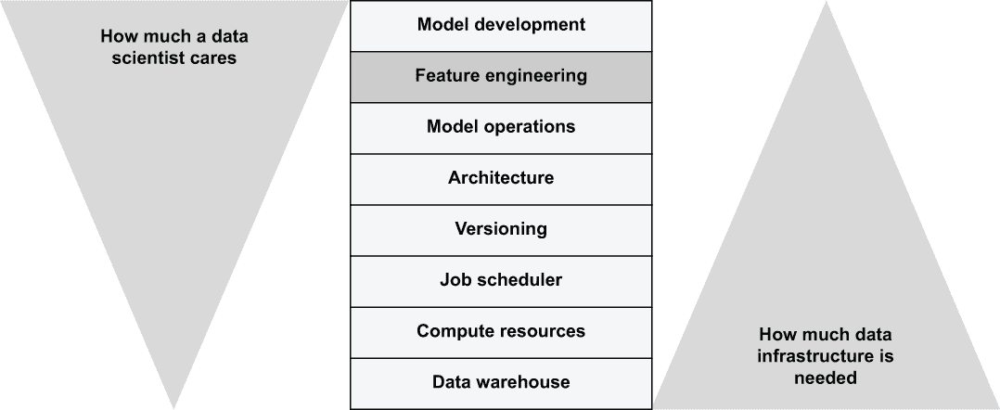

图 7.19 数据科学家对堆栈各层关注的程度

而不是规定一个适合所有情况的特征工程解决方案，每个领域都可以从特定领域的库和服务中受益。

建议：构建、采用或购买针对特征层的特定领域解决方案通常是一个好主意，这些解决方案可以根据手头的用例进行定制。这些解决方案可以建立在基础基础设施之上，因此它们是补充性的，而不是与其他堆栈部分竞争。

我们首先定义了模糊的概念*特征*。然后我们将提供一个基本示例，该示例将原始数据转换为特征，并将其输入到模型中。在第九章中，我们将扩展这个示例，使其具有更多的特征。这应该为你提供一个坚实的起点，以防你想要深入研究，例如，通过阅读一本更侧重于建模的书籍，详细介绍了特征工程，并将这些经验应用到你的基础设施堆栈中。

### 7.3.1 区分事实和特征

区分*事实*和*特征*是有用的。除了提供概念上的清晰度外，这种做法还有助于在数据工程师和数据科学家之间分配工作。让我们使用图 7.20 来组织讨论。

该图基于一个哲学假设，即一切存在于一个客观的物理*现实*中，我们可以部分观察以收集*事实*。由于它们的观察性质，我们预计事实可能会存在偏见、不准确，甚至偶尔错误。然而，关键的是，事实是我们能够接近客观现实的最接近的方式。


图 7.20 事实与特征的本质

从工程角度来看，事实可以是来自产品的事件或从第三方获取的数据。其中不应有太多的解释或歧义：例如，有人点击播放来观看《狮子王》是一个直接的观察——事实。后来，我们可能会决定将播放事件解释为用户更喜欢观看此类内容的信号，这可能是推荐模型的一个有用的标签——一个*特征*。对于播放事件存在无数其他可能的解释（也许他们在移动设备上误点了大型横幅）和，因此，许多特征工程的机会，尽管基本事实是明确的。事实与特征之间的区别具有重要的实际意义，其中一些在表 7.1 中概述。

表 7.1 比较和对比事实与特征

|  | 特征 | 事实 | 现实 |
| --- | --- | --- | --- |
| **角色** | 数据科学家 | 数据工程师 |  |
| **关键活动** | 定义新特征并挑战现有特征 | 收集并持久化可靠的观察 |  |
| **迭代速度** | 快速——提出新的解释很容易 | 慢——开始收集新数据需要大量努力 |  |
| **我们能控制它吗？** | 完全可以——我们知道并控制所有输入和输出 | 部分可以——我们无法控制输入，现实以不可预测的方式行为 | 不可以，但我们可以进行小的干预，例如 A/B 测试 |
| **可信度** | 变化，默认情况下较低 | 旨在很高 | 客观的真相 |

如表格所示，拥有一个角色，通常是一个数据工程师，负责可靠地收集和存储事实，这是非常有用的。这项任务本身就很复杂，因为他们需要直接与不断变化的现实世界进行交互。一旦获得了一组可靠的事实，另一个人，即数据科学家，就可以使用这些事实，进行解释和转换，将它们转化为特征，在模型中进行测试，并使用一组新的特征进行迭代，以改进模型。

两个角色之间的关键活动是不同的。理想情况下，数据科学家可以快速迭代，因为他们有无限多的可能特征进行测试。事实越准确、越全面，模型就越好，这激励数据工程师收集大量高质量的数据。我们可以将这些活动投影到本章中涵盖的以下模式：

+   数据工程师维护可靠的**事实表**，这些表对所有项目都是可用的。

+   数据科学家可以使用 CTAS 模式查询事实表，并从他们的工作流程中提取有趣的项目特定事实视图，例如。

+   数据科学家可以使用我们在上一节中介绍过的 MapReduce 风格的模式，在 Python 中快速迭代他们工作流程内的特征。

在某些情况下，利用现成的库和服务，如**特征存储**或**数据标注服务**来帮助完成最后两个步骤可能是有用的，或者您可以创建一个满足您公司特定需求的自定义库。在任何情况下，考虑一个不涉及专用工具的简单基线解决方案都是谨慎的。

您可以选择直接使用下一节中介绍的基线方法，或者将其作为您自己领域特定库的基础。无论您采取哪种方法，数据科学家都应该能够轻松访问事实并快速迭代特征。使用 Metaflow 这样的系统来处理版本控制在这个过程中非常有好处——否则，很容易失去对哪些数据和特征产生了最佳结果的追踪。

### 7.3.2 特征编码

将事实转换为特征的过程称为**特征编码**或**特征化**。模型接受一组特征，这些特征有时由数十甚至数百个单独的特征编码函数或**特征编码器**产生。虽然您可以将特征化代码与建模代码交织在一起，尤其是在较大的项目中，但将特征编码作为单独步骤进行定义和执行的一致方式非常有用。

除了帮助使整体架构可管理之外，在训练和推理过程中使用相同的特征编码器来保证结果正确性是至关重要的。这一要求通常被称为**离线-在线一致性**，其中**离线**指的是以批量过程定期训练模型，而**在线**指的是按需预测。

对于特征管道的另一个核心要求是管理*准确的训练和测试分割*。在许多情况下，例如在前一章中我们的天气预报示例中，历史数据用于预测未来。这样的模型可以通过将过去某个时间点作为参考，将此之前的作为历史数据用于训练，将此之后的作为模拟未来用于测试来进行*回测*。为了保证结果的可靠性，训练数据必须不包含任何超过参考点的信息，通常称为*泄露*，这会被视为从未来获取信息。

一个设计良好的特征编码管道可以将时间视为主要维度，这使得在确保特征编码器尊重时间范围的同时进行回测变得容易，从而防止任何类型的泄露。特征编码管道还可以帮助监控*概念漂移*，即模型的目标变量统计随时间变化。一些*特征存储*，这些存储帮助解决所有这些问题，还提供了一个用户界面，允许轻松共享和发现事实和特征。

实施这些关注点并没有唯一正确或普遍适用的方法。在不同数据集中，时间的处理方式不同，而保持在线和离线的一致性可以通过许多不同的方式来实现，这取决于具体的应用场景——并非所有应用程序都需要“在线”预测。一个紧密耦合的数据科学团队在共同开展项目时，可以快速沟通并迭代特征编码器，而无需复杂的解决方案。

一个关键争议在于灵活性和迭代速度与保证正确性之间的权衡：你可以设计（或获取）一个特征化解决方案来解决所有之前的问题，保证正确性，但会使定义新特征变得困难。对于一个敏感、成熟的项目，这可能是一个正确的权衡。另一方面，将过于僵化的解决方案强加于新项目可能会使其难以快速开发，从而限制其整体效用——项目可能 100%正确，但也很无用。一个良好的折衷方案可能是从灵活的方法开始，随着项目的成熟逐渐变得更加严格。

接下来，我们将展示一个非常简单的特征编码工作流程，基于上一节中的 TaxiPlotter 工作流程。这个例子位于灵活性的极端：它没有解决任何之前的问题，但为我们将在第九章中介绍的更完整的特征化管道奠定了基础。

示例：预测出租车行程费用

为了展示特征编码——而不是我们的建模技能——我们构建了一个简单的预测器来估算出租车行程的成本。我们知道价格与行程长度直接相关，无论是时间还是空间。为了简化问题，这个例子只关注距离。我们使用简单的线性回归来预测根据行程距离支付的金额。我们将在第九章使这个例子更有趣。

如果这是一个数据科学家实际接到的任务，他们肯定会首先探索数据，可能是在笔记本中。您也可以作为练习来做这件事。您会发现，与任何包含经验观察的真实生活数据集一样，数据中存在噪声：许多行程的成本为 0 或没有行程距离。此外，少数异常行程的成本或行程距离非常高。

我们首先进行解释，开始将事实转化为特征，假设这些异常行程并不重要。我们使用以下代码列表中的 filter_outliers 函数来去除值分布在最顶部或最底部 2%的行程。实用模块还包含一个名为 sample 的函数，我们可以使用它从数据集中均匀地采样行。

列表 7.9 从 Arrow 表中移除异常行

```
def filter_outliers(table, clean._fields):                          ❶
    import numpy
    valid = numpy.ones(table.num_rows, dtype='bool')                ❷
    for field in clean_fields:                                      ❸
        column = table[field].to_numpy()
        minval = numpy.percentile(column, 2)                        ❹
        maxval = numpy.percentile(column, 98)                       ❹
        valid &= (column > minval) & (column < maxval)              ❺
    return table.filter(valid)                                      ❻

def sample(table, p):                                               ❼
    import numpy
    return table.filter(numpy.random.random(table.num_rows) < p)    ❽
```

❶ 接受一个 pyarrow.Table 和一个要清理的列列表

❷ 以接受所有行的过滤器开始

❸ 逐个处理所有列

❹ 找到值分布的最顶部和最底部 2%

❺ 仅包括位于值分布 2-98%之间的行

❻ 返回与过滤器匹配的行子集

❼ 从给定的表中采样随机 p%的行

❽ 在每一行上抛一个有偏见的硬币，并返回匹配的行

将代码保存在 table_utils.py 中。值得注意的是，列表 7.9 中的 filter_outlier 和 sample 函数也可以在 SQL 中实现。您可以在 CTAS 查询背后的 SQL 中实现这些操作。考虑一下在 Python 中执行这些操作的好处。首先，在 SQL 中表达 filter_outliers 有些复杂，尤其是在多列上执行时。生成的 SQL 可能比 Python 实现需要更多的（复杂的）代码行。

其次，我们在这里做出了重大假设：2%是正确的数字吗？它应该对所有列都相同吗？数据科学家可能希望对这些选择进行迭代。我们可以在 Python 中迭代和测试代码，速度比执行复杂的 SQL 查询快得多。

还要注意，这两个函数都是在不转换为 pandas 的情况下实现的，这保证了操作既节省时间又节省空间，因为它们只依赖于 Apache Arrow 和 NumPy，这两者都由高性能的 C 和 C++代码支持。这些操作在 Python 中的性能很可能比在任何查询引擎中都要好。列表 7.10 定义了构建线性回归模型并可视化的函数。

列表 7.10 训练和可视化回归模型

```
def fit(features):                                                ❶
    from sklearn.linear_model import LinearRegression                                                                                         
    d = features['trip_distance'].reshape(-1, 1)                  ❷
    model = LinearRegression().fit(d, features['total_amount'])   ❷
    return model 

def visualize(model, features):                                   ❸
    import matplotlib.pyplot as plt

    from io import BytesIO
    import numpy
    maxval = max(features['trip_distance'])                       ❹
    line = numpy.arange(0, maxval, maxval / 1000)                 ❹
    pred = model.predict(line.reshape(-1, 1))                     ❹
    plt.rcParams.update({'font.size': 22})
    plt.scatter(data=features,
                x='trip_distance',
                y='total_amount',
                alpha=0.01,
                linewidth=0.5)
    plt.plot(line, pred, linewidth=2, color='black')
    plt.xlabel('Distance')
    plt.ylabel('Amount')
    fig = plt.gcf()
    fig.set_size_inches(18, 10)
    buf = BytesIO()                                               ❺
    fig.savefig(buf)                                              ❺
          return buf.getvalue()                                   ❺
```

❶ 接受作为 NumPy 数组字典的特征

❷ 使用 Scikit-Learn 构建线性回归模型

❸ 可视化模型

❹ 绘制回归线

❺ 将图像保存为工件

将代码保存到 taxi_model.py。fit 函数使用 Scikit-Learn 构建一个简单的线性回归模型。有关详细信息，请参阅 Scikit-Learn 的文档（[`mng.bz/Wxew`](http://mng.bz/Wxew)）。visualize 函数在散点图上绘制特征，并在其上叠加回归线。

下面的代码片段显示了实际的流程，TaxiRegressionFlow，它紧密基于上一节中的 TaxiPlotterFlow。它具有相同的两种模式：你可以使用由 TaxiETLFlow 生成的 CTAS 查询的预处理数据，或者你可以使用原始模式，该模式访问两个月未过滤的数据。

列表 7.11 从事实到特征再到模型

```
from metaflow import FlowSpec, step, conda, Parameter,\
                     S3, resources, project, Flow

URLS = ['s3://ursa-labs-taxi-data/2014/10/',                                  ❶
        's3://ursa-labs-taxi-data/2014/11/']
NUM_SHARDS = 4
FIELDS = ['trip_distance', 'total_amount']

@conda_base(python='3.8.10')
@project(name='taxi_nyc')
class TaxiRegressionFlow(FlowSpec):
    sample = Parameter('sample', default=0.1)                                 ❷
    use_ctas = Parameter('use_ctas_data', help='Use CTAS data', default=False)❸

    @step
    def start(self):
        if self.use_ctas:
            self.paths = Flow('TaxiETLFlow').latest_run.data.paths
        else:   
            with S3() as s3:
                objs = s3.list_recursive(URLS)
                self.paths = [obj.url for obj in objs]
        print("Processing %d Parquet files" % len(self.paths))
        n = max(round(len(self.paths) / NUM_SHARDS), 1)
        self.shards = [self.paths[i*n:(i+1)*n] for i in range(NUM_SHARDS - 1)]
        self.shards.append(self.paths[(NUM_SHARDS - 1) * n:])
        self.next(self.preprocess_data, foreach='shards')

    @resources(memory=16000)
    @conda(libraries={'pyarrow': '5.0.0'})
    @step
    def preprocess_data(self):
        from table_utils import filter_outliers, sample 
        self.shard = None
        with S3() as s3:
            from pyarrow.parquet import ParquetDataset
            if self.input:
                objs = s3.get_many(self.input)
                table = ParquetDataset([obj.path for obj in objs]).read()
                table = sample(filter_outliers(table, FIELDS), self.sample)   ❹
                self.shard = {field: table[field].to_numpy()                  ❺
                              for field in FIELDS}
        self.next(self.join)

    @resources(memory=8000)
    @conda(libraries={'numpy': '1.21.1'})
    @step
    def join(self, inputs):
        from numpy import concatenate
        self.features = {}
        for f in FIELDS:
            shards = [inp.shard[f] for inp in inputs if inp.shard]
            self.features[f] = concatenate(shards)                            ❻
        self.next(self.regress)

    @resources(memory=8000)
    @conda(libraries={'numpy': '1.21.1',
                               'scikit-learn': '0.24.1',
                               'matplotlib': '3.4.3'})
    @step
    def regress(self):
        from taxi_model import fit, visualize
        self.model = fit(self.features)                                       ❼
        self.viz = visualize(self.model, self.features)                       ❽
        self.next(self.end)

    @step
    def end(self):
        pass

if __name__ == '__main__':
    TaxiRegressionFlow()
```

❶ 使用原始模式中的两个月数据

❷ 样本给定百分比的数据，0.0-1.0。

❸ 在原始或 CTAS 模式之间进行选择，类似于 TaxiPlotterFlow

❹ 独立地清理和样本每个碎片

❺ 提取干净的列作为特征

❻ 通过连接数组合并特征碎片

❼ 拟合一个模型

❽ 可视化模型并将图像保存为工件

将代码保存在 taxi_regression.py 中。如果你之前运行了 TaxiETLFlow，你可以这样运行流程：

```
# python taxi_regression.py -environment=conda run -use_ctas_data=True
```

否则，省略该选项以直接使用原始数据。在大实例上处理 10%的数据样本不到一分钟，处理完整数据集（不采样）大约需要两分钟。图 7.21 可视化了模型生成的回归线以及原始数据的散点图，如图所示在 Jupyter 笔记本中。

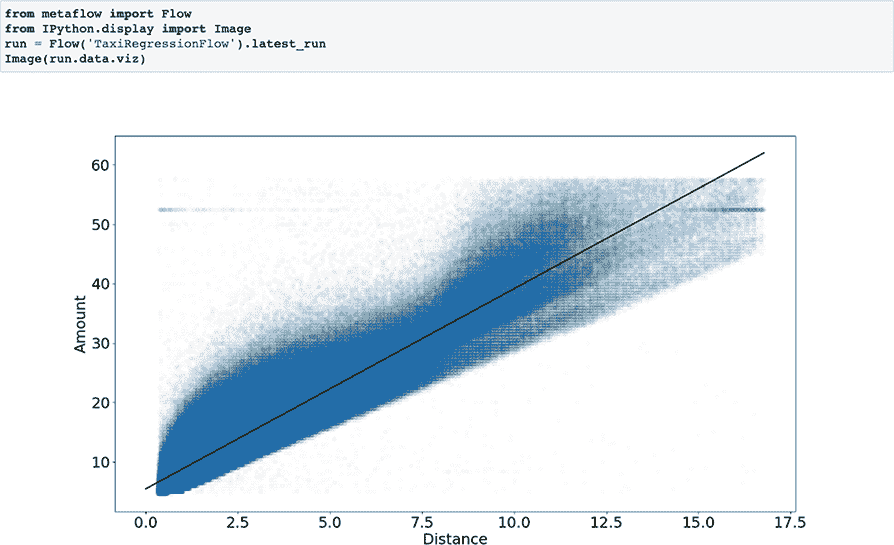

图 7.21 在数据上叠加距离与出租车行程成本的回归，如图 7.21 所示

此示例扩展了之前的 TaxiPlotterFlow 示例，展示了以下内容：

+   数据科学家可以使用 MapReduce 风格的模式来编码特征。

+   我们可以通过使用 SQL 进行数据提取和 Python 进行特征工程来结合两者的优点。

+   由于有 Apache Arrow 和 NumPy 等库的支持，这些库由 C 和 C++实现，因此可以在 Python 中以性能意识的方式执行特征工程。

在第九章中，我们将扩展示例以包括对模型的适当测试，使用深度学习的更复杂的回归模型，以及可扩展的特征编码管道。

本章涵盖了大量的内容，从基础的数据访问模式到特征工程管道和模型训练，如图 7.22 所示进行了总结。

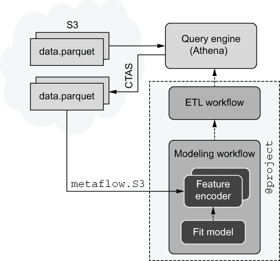

图 7.22 总结本章涵盖的概念

我们从快速将数据从 S3 移动到实例的基本原理开始。我们讨论了使用 Apache Arrow 的高效内存数据表示。之后，我们展示了如何使用这些技术来与 Spark、Snowflake、Trino 或 Amazon Athena 等查询引擎接口，它们是现代数据基础设施的核心部分。

我们创建了一个工作流程，使用查询引擎通过执行 Create-Table-As-Select SQL 查询来处理数据集，其结果可以快速下载到下游工作流程。最后，我们利用这一功能创建了一个特征编码管道来训练模型。

结合前一章的教训，这些工具允许您构建生产级的数据科学应用程序，这些应用程序可以从数据仓库中摄取大量数据，并行编码特征，并大规模训练模型。对于计算密集型的特征编码器，如果需要，您可以利用第五章的教训来优化它们。

## 摘要

+   通过确保数据适合内存、文件足够大以及使用大型实例类型来优化 S3 和 EC2 实例之间的下载速度。

+   使用 Parquet 作为存储表格数据的有效格式，并使用 Apache Arrow 在内存中读取和处理它。

+   如果内存消耗是一个问题，避免将数据转换为 pandas。相反，使用 Arrow 和 NumPy 数据结构进行操作。

+   利用现有的数据基础设施从数据科学工作流程中提取和预处理数据，并将它们连接到 ETL 工作流程。

+   使用现代查询引擎，如 Spark、Trino、Snowflake 或 Athena，执行 SQL 查询以生成任意数据提取，存储在 Parquet 中，供数据科学工作流程使用。

+   在组织上，数据工程师可以专注于生产高质量、可靠的事实，而数据科学家可以自主迭代项目特定的数据集。

+   使用 MapReduce 模式在 Python 中并行处理大型数据集。像 Arrow 和 NumPy 这样的库由高性能的 C/C++代码支持，使得快速处理数据成为可能。

+   利用基础工具和模式构建一个适用于您特定用例的解决方案——特征工程和特征管道往往具有相当强的领域特定性。

+   在设计特征管道时，考虑使用时间作为主要维度，以便于使用历史数据进行回测，并防止信息泄露。

+   在特征工程管道中，确保数据科学家可以轻松访问事实并快速迭代特征。
