# 8 使用和操作模型

本章涵盖

+   使用机器学习模型生成对现实应用有益的预测

+   作为批量工作流程生成预测

+   作为实时应用生成预测

为什么企业会投资于数据科学应用？“为了生成模型”并不是一个充分的答案，因为模型只是数据代码的集合，没有内在价值。为了产生有形价值，应用必须对周围世界产生积极影响。例如，一个推荐模型在孤立状态下是无用的，但连接到用户界面后，它可以降低客户流失并增加长期收入。或者，一个预测信用风险的模型在连接到供人类决策者使用的决策支持仪表板时变得有价值。

在本章中，我们弥合了数据科学和商业应用之间的差距。尽管这是本书的第二章倒数第二章，但在实际项目中，你应该尽早开始考虑这种联系。图 8.1 使用第三章中引入的螺旋图来阐述这一想法。

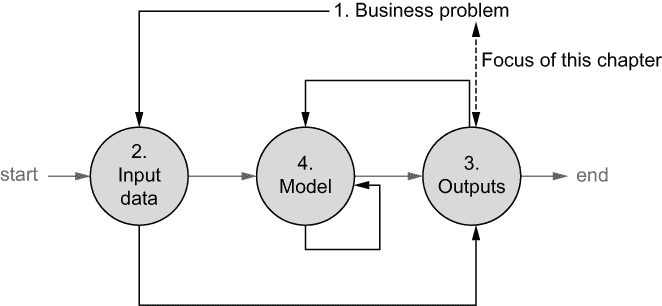

图 8.1 将输出连接到周围系统

通常，首先彻底了解需要解决的商业问题是明智的。之后，你可以识别和评估可用于解决问题的数据资产。在编写任何建模代码之前，你可以选择一个架构模式，允许结果连接到一个价值生成业务应用，这是本章的主要内容。

通常，思考输入和输出会揭示问题，例如缺乏合适的数据或在使用结果时遇到的技术或组织困难，这些问题可以在构建任何模型之前得到解决。一旦明确了应用在其环境中的部署方式，你就可以开始实际建模工作。如果项目成功，例如 Netflix 的个性化视频推荐，建模工作永远不会结束：数据科学家会年复一年地不断改进模型。

模型可以用无数种方式在生产中使用。公司越来越渴望将数据科学应用于商业的各个方面，从而产生多样化的需求。理论上，给定一个模型，有一种明确的方式来生成预测。然而，技术上，这与一个在高速交易系统中产生实时预测的系统大不相同，比如，为内部仪表板填充少量预测。

注意，我们使用术语*预测*来指代数据科学工作流程的任何输出。严格来说，并非所有数据科学应用都会产生预测——它们还可以产生分类、分类、推理和其他见解。为了简洁起见，我们使用预测作为一个总称，来指代任何此类输出。对于此类活动，另一个常用的术语是*模型服务*——我们希望使模型可供其他系统使用，即提供模型服务。

我们在本章的开头，描述了多种常见的架构模式，用于使用模型进行预测。然后，你可以根据你的用例选择并应用最合适的模式。我们重点关注两种常见的模式：预先计算结果，即所谓的*批预测*，以及通过网络服务实时进行相同的操作，即所谓的*实时预测*。这些技术与我们在前几章中学到的所有课程都是互补的。

本章的后半部分专注于*模型操作*，即如何确保模型在一段时间内持续产生正确的结果。我们学习了持续重新训练和测试模型的模式，以及监控模型性能的模式。与推理类似，没有一种正确的方法或工具来实现模型操作，但了解通用模式有助于你为每个用例选择正确的工具。

图 8.2 总结了我们在基础设施堆栈上的这些主题。

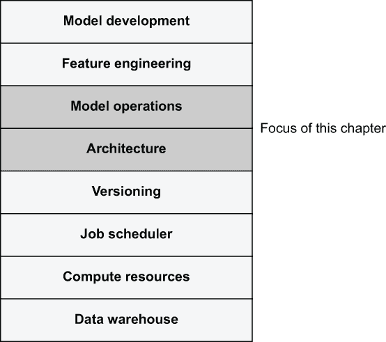

图 8.2 基础设施堆栈

通过将模型操作和架构放在堆栈的较高位置，我们表明这些关注点不能从数据科学家那里抽象出来——更不用说与第四章中涵盖的计算层相比。整体数据科学应用的架构以及它在生产中的操作，应遵循要解决的问题的业务问题。理解应用程序从原始数据到业务结果的端到端工作方式，使数据科学家能够充分利用他们的领域知识和建模专业知识。自然有效的数据科学基础设施应该足够简单，以至于无需成为 DevOps 专家就可以应用各种模式。你可以在这个章节中找到所有代码列表，请访问[`mng.bz/8MyB`](http://mng.bz/8MyB)。

## 8.1 生成预测

*受到 Alex 模型效率提升的鼓舞，Caveman Cupcakes 在行业内首次投资了一个全自动蛋糕工厂。Alex 和 Bowie 已经计划了几个月如何将 Alex 的机器学习模型的输出连接到为设施提供动力的各种控制系统。一些系统需要实时预测，而其他系统则每晚优化。在模型和工业自动化系统之间设计一个强大且通用的接口并不简单，但这项努力是值得的！精心设计的设置允许 Alex 像以前一样开发和测试模型的更好版本，Bowie 可以全面观察生产系统的健康状况，Harper 可以大幅扩展业务。*


从理论上讲，生成预测应该是相当直接的。例如，使用逻辑回归模型进行预测只是计算点积并通过 sigmoid 函数传递结果的问题。除了公式在数学上简单之外，这些操作在计算上并不特别昂贵。

在现实生活中使用模型的相关挑战是实际的，而不是理论上的。你需要考虑如何管理以下方面：

+   *规模*—尽管生成单个预测可能不需要很长时间，但在短时间内生成数百万个预测则需要更多的思考。

+   *变化*—数据会随时间变化，模型需要重新训练和重新部署。此外，应用程序代码也可能随时间演变。

+   *集成*—要产生实际影响，预测需要被另一个系统使用，而这个系统本身也面临着规模和变化的挑战。

+   *失败*—前三个问题都是失败案例的丰富来源：系统在负载下会失败，变化会导致预测随时间变得不准确，集成难以保持稳定。每当有东西失败时，你需要了解它是什么失败了，为什么失败了，以及如何快速修复它。

单独解决这四个问题中的任何一个都是一个非平凡的工程挑战。同时解决所有这些问题需要大量的工程努力。幸运的是，只有少数数据科学项目需要为所有这些担忧提供完美的解决方案。考虑以下典型的例子：

+   一个用于平衡营销预算的模型可能需要特殊的营销平台集成，但数据规模和变化速度可能适中。失败也可以手动处理，而不会造成重大破坏。

+   一个推荐模型可能需要处理数百万个用户和数百万个物品，但如果系统偶尔失败，用户可能不会注意到推荐稍微有些过时。

+   一个高频交易系统必须在不到一毫秒的时间内生成预测，每秒处理数十万次预测。由于模型直接负责数千万美元的利润，因此为托管模型的底层基础设施大规模超额配置是划算的。

+   人类决策者使用的信用评分模型规模适中，且不会迅速变化，但它需要高度透明，以便人类可以防范任何偏见或其他细微的失败。

+   训练以识别地名的语言模型不会迅速变化。该模型可以作为一个静态文件共享，仅偶尔更新。

单一的模式无法解决所有这些用例。有效的数据科学基础设施可以提供几种不同的模式和工具，以逐步加固部署，如第六章所述，确保每个用例都可以以最简单的方式解决。由于使用模型为现实生活应用提供动力的固有复杂性，避免在系统中引入额外的意外复杂性至关重要。例如，没有必要或有益于仅为了每天生成少量预测而部署一个可扩展、低延迟的模型托管系统。

您的工具箱还可以包括现成的工具和产品，其中许多在过去几年中涌现出来，以解决之前描述的挑战。令人困惑的是，这些新工具没有既定的命名法和分类，这使得有时难以理解它们应该如何最有效地使用。通常被归类为 *MLOps*（机器学习运维）的工具类别包括以下内容：

+   *模型监控* 工具有助于应对变化，例如，通过监控输入数据和预测随时间的变化分布，以及当预测超出预期范围时发出警报。

+   *模型托管和部署* 工具通过将模型作为微服务集群部署，以便外部系统查询，从而提供实时预测的解决方案。

+   *特征存储* 通过提供处理输入数据的一致方式来应对变化，确保数据在训练时间和预测过程中都得到一致使用。

除了特定于机器学习和数据科学的工具之外，通常可以利用通用基础设施，例如微服务平台来托管模型或仪表板工具来监控模型。这是一个有用的方法，尤其是在这些工具已经安装在你的环境中时。

在以下章节中，我们将介绍一个思维框架，帮助您为您的用例选择最佳模式。之后，我们将通过一个实际操作示例来展示这些模式的应用。

### 8.1.1 批量、流式和实时预测

当考虑如何有效地使用模型时，你可以从以下核心问题开始：在知道输入数据后，我们需要多快就能得到预测？请注意，这个问题不是模型可以多快产生预测，而是我们最多可以等待多长时间直到预测被用于某事。图 8.3 说明了这个*输入-响应差距*问题。

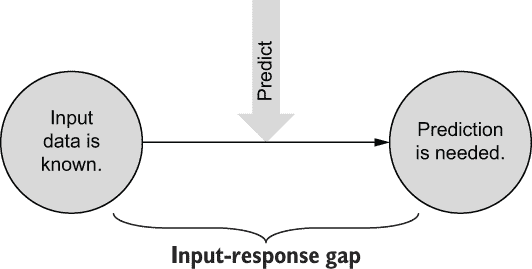

图 8.3 输入-响应差距

我们可以在输入数据已知（显然不是在之前）并且在外部系统需要预测之前，任何时候决定生成预测，如图 8.3 中的大箭头所示。输入-响应差距越长，我们选择何时以及如何生成预测的自由度就越大。

为什么这个问题很重要？直观上，很明显，快速产生答案比慢速产生答案更困难。差距越窄，规模、变化、集成和故障的挑战就越严峻。虽然技术上支持低延迟的系统也可以处理高延迟，因此可能会诱人使用单个低延迟系统来处理所有用例，但避免过度设计可以使生活更加轻松。

根据答案，我们可以为用例选择合适的基础设施和软件架构。图 8.4 展示了基于差距大小的三种常见的模型服务系统类别：*批量*，其中差距通常以分钟计，甚至更长；*流*，可以支持分钟级别的差距；以及*实时*，当需要秒或毫秒级的响应时。

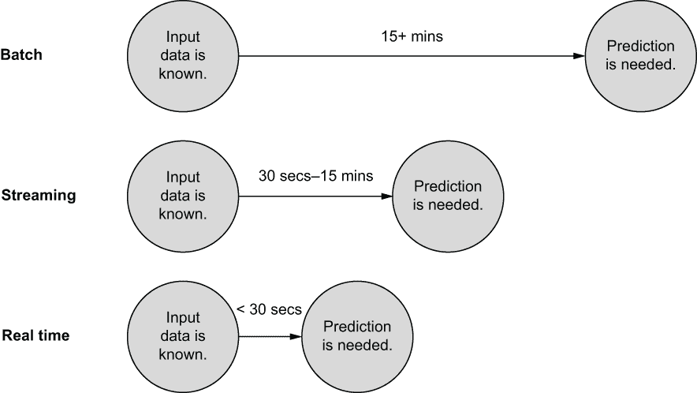

图 8.4 模型服务系统类别

批量预测方法最容易实现——所有系统都有足够的余量来运行——但这种方法仅适用于你能够承受在 15 分钟或更长时间后使用预测的情况。在这种情况下，你可以将所有新的输入数据汇总到一个大批次中，并安排一个工作流每小时或每天运行一次，以生成批次的预测。结果可以持久化存储在数据库或缓存中，以便外部系统可以快速访问，从而提供非常低的访问预计算预测的延迟。

使用工作流调度器来频繁地生成预测并不太实用，因为典型的工作流调度器并没有针对最小延迟进行优化。如果你需要更快的结果，在接收到输入数据点后的 30 秒到 15 分钟内，你可以使用*流平台*，例如 Apache Kafka，也许还可以配合 Apache Flink 这样的流应用程序平台。这些系统可以大规模接收数据，并在几秒钟内将其传递给数据消费者。

流式模型的例子可能是一个视频服务中的“观看下一个”推荐。假设我们希望在之前的视频结束时立即显示个性化的新视频推荐。我们可以在播放前一个节目时计算推荐，因此我们可以容忍几分钟的延迟。这允许我们在用户提前停止节目时仍然显示推荐。

最后，如果你需要在几秒钟内得到结果，你需要一个用于**实时模型服务**的解决方案。这类似于任何需要在使用者点击按钮后立即（在几十毫秒内）产生响应的 Web 服务。例如，支持互联网广告的公司使用此类系统来即时预测用户最有效的个性化横幅广告。

另一个重要的考虑因素是外部系统如何消费预测：工作流程是否会将结果推送到数据存储，还是消费者会从服务中拉取它们？图 8.5 概述了这些模式——请注意箭头的方向。


图 8.5 分享输出的模式

生成批量预测的工作流程可以将预测发送到外部 API 或数据库。然后，其他业务应用，包括仪表板，很容易从数据库中访问预测。相同的模式适用于流式预测，关键的区别在于预测刷新得更频繁。注意箭头的方向：批量和流式将预测推送到外部系统。外部系统不能直接调用它们。

相比之下，实时模型服务系统反转了模式：外部系统从模型中拉取预测。当输入数据在预测之前变得可用时，需要这种方法。例如，考虑一个基于用户刚刚访问的网站列表生成定向广告的模型。在这种情况下，预先计算所有可能的网站组合是不切实际的。预测必须在实时进行。

模式的选择具有深远的影响，如下所述：

+   在本地开发和测试批量预测很容易。你可以使用与训练模型相同的流程系统进行批量预测，因此不需要额外的系统。相比之下，开发和测试流式和实时预测需要额外的基础设施。

+   批量预测的数据处理，有时在流式处理中，可以遵循第七章中概述的模式。确保特征在训练和预测中保持一致相对容易，因为可以在双方使用相同的数据处理代码。相比之下，实时预测需要一个支持低延迟查询以及低延迟特征编码器的数据存储。

+   批处理预测的扩展与训练扩展一样简单，使用第四章中概述的计算层。自动扩展流和实时系统需要更复杂的架构。

+   在批处理系统中，准确监控模型、记录和管理故障更容易。一般来说，确保批处理系统保持高可用性相比流或实时系统，产生的运营开销更小。

总的来说，首先考虑该应用程序或其部分是否可以由批处理预测提供动力是有益的。

注意批处理并不意味着在需要时无法快速访问预测。事实上，作为批处理过程预先计算预测并将其推送到高性能数据存储，如内存缓存，可以提供最快的预测访问。然而，批处理要求输入提前很好地了解。

在接下来的几节中，我们将通过一个实际用例来展示三种模式：一个电影推荐系统。我们将从对推荐系统的一个简要介绍开始。然后，我们将展示如何使用推荐模型进行批处理预测，然后是如何使用它来提供实时预测。最后，我们将概述流预测的高级架构。

### 8.1.2 示例：推荐系统

让我们构建一个简单的电影推荐系统，以了解模式在实际应用中的工作原理。想象一下，你在一家人工智能流媒体视频的初创公司工作。这家初创公司目前没有在生产中部署任何机器学习系统。你被雇佣为数据科学家，为公司构建一个推荐模型。然而，你不想仅仅停留在模型上。为了使模型（以及你自己）变得有价值，你希望将你创建的推荐模型集成到公司的实时产品中，以便在用户界面中提供新的“为您推荐”功能。

从零开始构建这样一个系统需要一些努力。我们在图 8.6 中概述了一个项目计划，该计划概述了本节我们将关注的主题。我们遵循螺旋式方法，所以第一步将是详细了解该功能的业务背景。对于这个练习，我们可以跳过这一步（在现实生活中你不应该这样做！）。我们首先熟悉可用的数据，并概述一个基本的建模方法，如果项目显示出希望，我们可以在以后改进它。

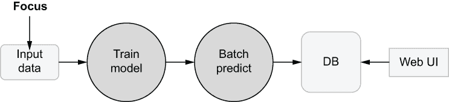

图 8.6 推荐系统项目：关注输入

我们将使用一种称为**协同过滤**的知名技术来开发模型的第一版。这个想法很简单：我们知道现有用户过去观看过哪些电影。通过知道新用户观看的一些电影，我们可以找到与该新用户相似的用户，并推荐他们喜欢的电影。对于这种类型的模型，关键问题是确切地定义“相似”是什么，以及如何快速计算用户之间的相似度。

为了训练模型，我们将使用公开可用的 MovieLens 数据集([`grouplens.org/datasets/movielens/`](https://grouplens.org/datasets/movielens/))。从[`mng.bz/EWnj`](http://mng.bz/EWnj)下载包含 2700 万条评分的完整数据集，并解压存档。

便利的是，数据集包括对每部电影丰富的描述，称为标签基因组。图 8.7 说明了这个概念。在图中，每部电影由两个维度来表征：戏剧与动作，以及严肃与幽默。

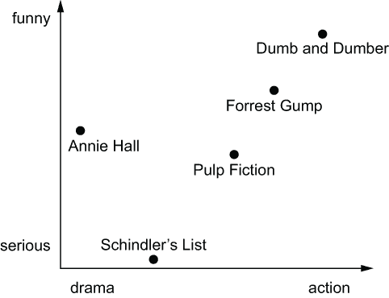

图 8.7 电影标签基因组

我们在类似的向量空间中表征电影，但实际标签基因组包括 1,128 个维度，在 genome-tags.csv 中描述。在这个 1,128 维空间中每部电影的坐标列在 genome-scores.csv 中。要了解电影 ID 与电影名称之间的映射，请参阅 movies.csv。

我们知道每个用户观看的电影以及他们为电影分配的星级评分。这些信息包含在 ratings.csv 文件中。我们只想推荐用户喜欢的电影，因此我们只包括用户评分达到四星或五星的电影。现在，我们根据用户喜欢的电影类型来描述每个用户，换句话说，一个用户（向量）是他们喜欢的电影向量的总和。图 8.8 说明了这个概念。

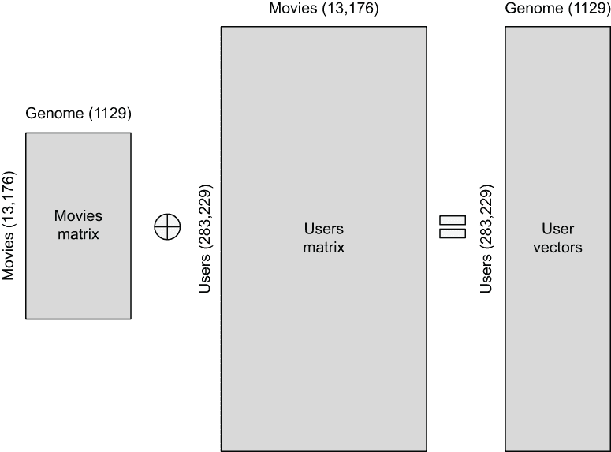

图 8.8 三个关键矩阵

为了在标签基因组空间中将每个用户表示为一个向量，我们采用**用户矩阵**，它告诉我们用户喜欢哪些电影，并使用它来对**电影矩阵**中的向量进行求和，该矩阵代表每部电影。如果我们知道一些用户喜欢的电影，我们可以用同样的方法将任何新用户表示为一个向量。我们将每个用户向量归一化到单位长度，因为我们不希望观看电影的数量产生任何影响——只有电影的性质应该被计算在内。

图 8.8 中所示的操作在列表 8.1 中实现，我们将其用作实用模块。列表中的大部分代码用于从 CSV 文件加载数据并进行转换。电影矩阵通过包含每个电影基因组 _dim（1,128）行数的 CSV 文件从 load_model_movies_mtx 加载。我们将文件分成固定大小的向量，并存储在以电影 ID 为键的字典中。

加载用户矩阵稍微复杂一些，因为每个用户观看的电影数量是可变的。根据我们在第五章中学到的知识，该章节强调了 NumPy 数组的性能，以及第七章中展示的 Apache Arrow 的强大功能，我们将使用这两个项目来高效地处理大数据集。我们使用 Arrow 的过滤方法来仅包括评分高的行。我们使用 NumPy 的唯一方法来计算用户观看的电影数量，相应地分块行，并将用户观看的电影 ID 列表存储在以用户 ID 为键的字典中。

列表 8.1 加载电影数据

```
from pyarrow.csv import read_csv
import numpy as np

def load_model_movies_mtx():                                            ❶
    genome_dim = read_csv('genome-tags.csv').num_rows                   ❷
    genome_table = read_csv('genome-scores.csv')                        ❸
    movie_ids = genome_table['movieId'].to_numpy()                      ❹
    scores = genome_table['relevance'].to_numpy()                       ❹
    model_movies_mtx = {}                                               ❺
    for i in range(0, len(scores), genome_dim):                         ❺
        model_movies_mtx[movie_ids[i]] = scores[i:i+genome_dim]         ❺
    return model_movies_mtx, genome_dim

  def load_model_users_mtx():                                           ❻
    ratings = read_csv('ratings.csv')
    good = ratings.filter(ratings['rating'].to_numpy() > 3.5)           ❼
    ids, counts = np.unique(good['userId'].to_numpy(),
                            return_counts=True)                         ❽
    movies = good['movieId'].to_numpy()
    model_users_mtx = {}                                                ❾
    idx = 0                                                             ❾
    for i, user_id in enumerate(ids):                                   ❾
        model_users_mtx[user_id] = tuple(movies[idx:idx + counts[i]])   ❾
        idx += counts[i]
    return model_users_mtx

def load_movie_names():                                                 ❿
    import csv
    names = {}
    with open('movies.csv', newline='') as f:
        reader = iter(csv.reader(f))
        next(reader)
        for movie_id, name, _ in reader:
            names[int(movie_id)] = name
    return names
```

❶ 加载电影矩阵

❷ 解析标签基因组的维度

❸ 解析电影基因组文件

❹ 提取所需的两个列作为 NumPy 数组

❺ 从长数组中提取单个电影向量

❻ 加载用户矩阵

❼ 仅包括获得四星或五星的观看电影

❽ 确定每个用户观看的电影数量

❾ 从长数组中提取单个用户向量

❿ 加载电影 ID-电影名称映射

将代码保存到实用模块，movie_data.py。

最后，我们在下一个列表中创建用户向量。make_user_vectors 函数通过结合用户矩阵和电影矩阵中的信息来工作。作为一个小的优化，我们避免为每个用户创建单独的向量，因为我们不需要显式地存储用户向量——关于这一点稍后会有更多介绍。相反，我们按顺序重用相同的向量。

列表 8.2 制作用户向量

```
import numpy as np

def make_user_vectors(movie_sets, model_movies_mtx):
    user_vector = next(iter(model_movies_mtx.values())).copy()     ❶
    for user_id, movie_set in movie_sets:
        user_vector.fill(0)                                        ❷
        for movie_id in movie_set:                                 ❸
            if movie_id in model_movies_mtx:
                user_vector += model_movies_mtx[movie_id]          ❹
        yield user_id,\
              movie_set,\
              user_vector / np.linalg.norm(user_vector)            ❺
```

❶ 提取第一个电影向量作为模板

❷ 清除用户向量

❸ 遍历用户观看的电影

❹ 通过求和电影向量来创建用户向量

❺ 将用户向量归一化到单位长度

将代码保存到实用模块，movie_uservec.py。我们将在训练流程中使用它。

训练一个基本的推荐模型

图 8.9 展示了我们的项目进展情况。我们已经完成了输入数据部分。接下来，我们将草拟一个基本的推荐模型作为未来工作的占位符。

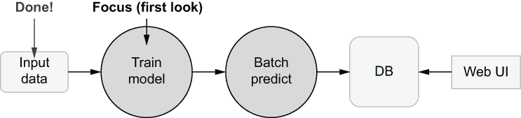

图 8.9 推荐系统项目：训练流程的第一迭代

为了为新用户提供推荐，我们将通过测量新用户与所有现有用户之间的向量距离，并选择最近的邻居来找到相似的用户。这仅为了生成一组推荐就需要进行数十万次距离测量，这在计算上非常昂贵。

幸运的是，存在高度优化的库来加速最近邻搜索。我们将使用 Spotify 为其音乐推荐系统创建的一个这样的库，*Annoy*。Annoy 将创建所有用户向量的索引和模型，我们可以将其保存并稍后用于生成推荐。

列表 8.3 中的代码展示了训练推荐模型的流程。它使用 movie_data 中的函数来加载数据，将其存储为工件，并生成用户向量，然后将这些向量输入到 Annoy 中。Annoy 将然后生成用户向量空间的效率表示。

列表 8.3 推荐模型训练流程

```
from metaflow import FlowSpec, step, conda_base, profile, resources
from tempfile import NamedTemporaryFile

ANN_ACCURACY = 100                                           ❶

@conda_base(python='3.8.10', libraries={'pyarrow': '5.0.0',
                                        'python-annoy': '1.17.0'})
class MovieTrainFlow(FlowSpec):

    @resources(memory=10000)
    @step
    def start(self):                                         ❷
        import movie_data
        self.model_movies_mtx, self.model_dim =\
                   movie_data.load_model_movies_mtx()
        self.model_users_mtx = movie_data.load_model_users_mtx()
        self.movie_names = movie_data.load_movie_names()
        self.next(self.build_annoy_index)

    @resources(memory=10000)
    @step
    def build_annoy_index(self):
        from annoy import AnnoyIndex
        import movie_uservec
        vectors = movie_data.make_user_vectors(\
                    self.model_users_mtx.items(),
                    self.model_movies_mtx)                   ❸
        with NamedTemporaryFile() as tmp:
            ann = AnnoyIndex(self.model_dim, 'angular')      ❹
            ann.on_disk_build(tmp.name)                      ❹
            with profile('Add vectors'):
                for user_id, _, user_vector in vectors:      ❺
                                          ann.add_item(user_id, user_vector)       ❺
            with profile('Build index'):
                ann.build(ANN_ACCURACY)                      ❻
            self.model_ann = tmp.read()                      ❼
        self.next(self.end)

    @step
    def end(self):
        pass

if __name__ == '__main__':
    MovieTrainFlow()
```

❶ 增加此参数以提高 Annoy 索引的准确性

❷ 开始步骤将电影数据存储为工件。

❸ 为所有现有用户生成用户向量的迭代器

❹ 初始化 Annoy 索引

❺ 将用户向量输入到索引中

❻ 最终化索引

❼ 将索引存储为工件

将代码保存到文件中，名为 movie_train_flow.py。要运行流程，请确保你当前工作目录中有 MovieLens CSV 文件。按照以下方式运行流程：

```
# python movie_train_flow.py --environment=conda run
```

构建索引大约需要 10-15 分钟。你可以通过降低 ANN_ACCURACY 常量来加快这个过程，但这样做会降低准确性。如果你对常量如何影响 Annoy 索引感兴趣，请参阅构建方法的文档，见 [`github.com/spotify/annoy`](https://github.com/spotify/annoy)。或者，你可以通过在云端运行代码来加快速度，使用 run --with batch。

在索引构建完成后，它被存储为一个工件。我们将在下一节中使用这个工件来生成推荐，首先作为批量工作流程，然后是实时推荐。

### 8.1.3 批量预测

现在我们有了模型，我们可以专注于本章的核心：使用模型生成预测。在实际操作中我们应该怎么做？让我们考虑一下在商业环境中讨论可能会如何进行。

很可能，初创公司的系统已经组织为微服务，即暴露了良好定义的 API 的单个容器。遵循相同的模式，将推荐系统作为另一个微服务（我们将在下一节中这样做）似乎是自然而然的。然而，在与工程团队讨论时，以下潜在问题被识别为微服务方法的问题：

+   该模型比现有的轻量级网络服务需要更多的内存和 CPU 功率。公司的容器编排系统需要改变以适应新的服务。

+   我们应该如何扩展服务？如果我们突然迎来大量新用户怎么办？每秒生成数千个推荐所需的计算能力非同小可。

+   每次用户刷新页面时都请求推荐，这不是很浪费吗？直到用户完成观看电影，推荐才会改变。我们可能需要以某种方式缓存推荐？

+   你，作为数据科学家，将要负责运营这个新的微服务吗？工程师负责他们的微服务，但运营它们需要复杂的工具链，而数据科学团队之前没有使用过这些工具链。

此外，你也认识到了冷启动问题：当新用户注册时，没有数据为他们生成推荐。产品经理建议，我们可以在注册过程中询问用户他们喜欢的几部电影，以解决这个问题。

所有这些观点都是有效的关注点。经过一段时间思考，你提出了一个截然不同的方法：如果，不是微服务，而是作为一个大批量操作，结构化为工作流程来为所有现有用户生成推荐，会怎样？对于现有用户，我们可以生成一个长长的推荐列表，所以即使他们看过了电影，列表也不会有太大变化。你可以每晚刷新列表。

为了解决冷启动问题，当新用户注册时，我们可以要求他们选择过去喜欢的两部电影，比如在最受欢迎的前 1000 部电影中。根据他们的初始选择，我们可以推荐他们可能喜欢的其他电影。一个关键的观察结果是，我们可以预先计算所有可能电影对的推荐。

图 8.10 可视化了这种情况。从概念上讲，用户选择与一部电影对应的行，然后选择与另一部电影对应的列。我们排除了对角线——我们不允许用户两次选择同一部电影。因为（电影 A，电影 B）的选择等于（电影 B，电影 A）——顺序不重要——我们也可以排除矩阵的一半。因此，我们只需要预先计算矩阵的上三角部分，即矩阵中的深灰色区域。你可能还记得确定矩阵中深色单元格数量的公式，即 2-组合的数量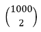，它等于 499,500。

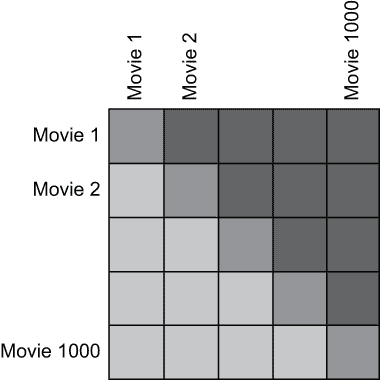

图 8.10 为所有电影对生成推荐（深色三角形）

换句话说，我们可以通过预先计算大约五十万条推荐来处理用户做出的任何选择，这是完全可行的！通过这样做，我们可以获得许多好处：我们可以将推荐写入由工程团队管理的数据库，无需担心性能问题、可扩展性问题、无需缓存任何内容，也没有新的运营开销。批量预测似乎是这个用例的一个很好的方法。

生成推荐

根据螺旋方法，在花费太多时间生成结果之前，我们应该考虑外部系统将如何消费这些结果。我们将首先思考如何使用模型生成推荐，以更好地理解结果的形式。我们将专注于共享结果，然后回来最终确定批量预测流程。图 8.11 显示了我们的进度。

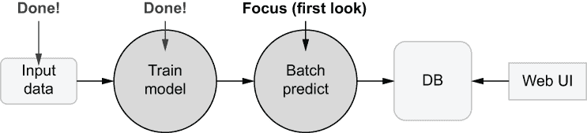

图 8.11 推荐系统项目：专注于预测

MovieTrainFlow 生成的 Annoy 索引使我们能够快速为新用户向量找到最近邻。我们如何从相似用户到实际电影推荐呢？一个简单的策略是考虑邻居们喜欢了哪些其他电影，然后推荐给他们。

图 8.12 说明了这个想法。想象我们有一个新用户的向量，用大灰色圆圈表示。使用 Annoy 索引，我们可以找到它的邻居，由椭圆形界定。根据用户矩阵，我们知道邻居们喜欢了哪些电影，因此我们可以简单地计算邻域中电影的频率，排除用户已经看过的电影，并将剩余的最高频率电影作为推荐返回。在图中，所有邻居都看过电影*异形*，因此它具有最高的频率，因此成为我们的推荐。如果用户已经看过邻域中的所有电影，我们可以增加邻域的大小，直到找到有效的推荐。

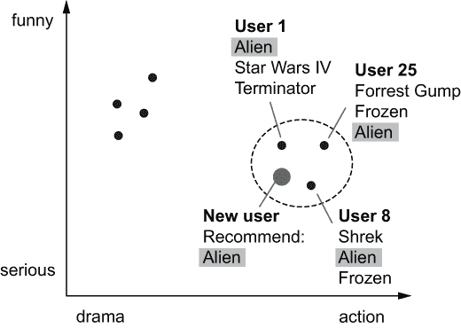

图 8.12 相似用户的邻域（虚线圆圈）

列表 8.4 展示了实现逻辑的实用模块。load_model 函数用于从工件中加载 Annoy 索引。Annoy 想要从文件中读取模型，因此我们必须先将模型写入临时文件。recommend 函数为一系列用户生成推荐，这些用户通过他们观看的电影 ID 集合（movie_sets）表示。它增加邻域的大小，直到找到新电影。find_common_movies 返回邻域中观看次数最多的 top_n 部电影，排除用户已经看过的电影。

列表 8.4 生成推荐

```
from collections import Counter
from tempfile import NamedTemporaryFile
from movie_uservec import make_user_vectors                             ❶

RECS_ACCURACY = 100                                                     ❷

def load_model(run):                                                    ❸
    from annoy import AnnoyIndex
    model_ann = AnnoyIndex(run.data.model_dim)
    with NamedTemporaryFile() as tmp:                                   ❹
        tmp.write(run.data.model_ann)                                   ❹
        model_ann.load(tmp.name)                                        ❹
    return model_ann,\
           run.data.model_users_mtx,\
           run.data.model_movies_mtx

def recommend(movie_sets,
              model_movies_mtx,
              model_users_mtx,
              model_ann,
              num_recs):                                                ❺
    for _, movie_set, vec in make_user_vectors(movie_sets,
                                               model_movies_mtx):       ❻
        for k in range(10, 100, 10):                                    ❼
            similar_users =\
                model_ann.get_nns_by_vector(vec,
                                            k,
                                            search_k=RECS_ACCURACY)     ❽
            recs = find_common_movies(similar_users,
                                      model_users_mtx,
                                      num_recs,
                                      exclude=movie_set)                ❾
            if recs:
                break
        yield movie_set, recs

def find_common_movies(users, model_users_mtx, top_n, exclude=None):    ❾
    stats = Counter()
    for user_id in users:
        stats.update(model_users_mtx[user_id])                          ❿
    if exclude:
        for movie_id in exclude:                                        ⓫
            stats.pop(movie_id, None)                                   ⓫
    return [int(movie_id)
            for movie_id, _ in stats.most_common(top_n)]                ⓬
```

❶ 使用与训练相同的函数创建向量

❷ 降低此值以获得更快、更不精确的结果。

❸ 从工件中加载 Annoy 索引

❹ 允许 Annoy 从文件中读取索引

❺ 为给定用户返回推荐

❻ 生成用户向量

❼ 增加邻域大小，直到找到推荐

❽ 使用 Annoy 索引找到最近邻

❾ 在邻域中找到最受欢迎的电影

❿ 使用用户矩阵收集关于观看电影的统计数据

⓫ 排除新用户已经看过的电影

⓬ 返回最受欢迎的前 N 部电影

将代码保存到文件 movie_model.py 中。我们很快就会使用这个模块。

注意，我们使用相同的 make_user_vectors 函数来训练模型（构建索引）以及生成预测。这非常重要，因为模型必须在训练和预测时使用相同的特征空间。记得在第七章我们讨论了特征编码器如何将事实转换为特征。虽然我们无法保证事实在时间上保持稳定——事实的变化称为*数据漂移*——但至少我们可以保证特征编码器，这里 make_user_vectors，是一致使用的。

重要 将位置数据处理和特征编码代码放在一个单独的模块中，您可以在训练和预测流程之间共享，确保特征是一致生成的。

现在我们已经很好地了解了如何生成推荐，让我们考虑如何有效地与外部系统共享它们。

坚固地共享结果

让我们构建一个与用于显示推荐的 Web 应用程序数据库集成的示例。图 8.13 显示了我们的进度。在实际项目中，您最有可能使用特定于您数据仓库或数据库的库来存储结果。在这里，为了演示这个想法，我们将结果写入 SQLite 数据库，它方便地内置在 Python 中。

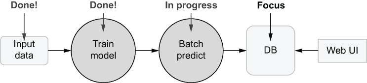

图 8.13 推荐系统项目：关注输出

列表 8.5 显示了一个名为 save 的函数，它创建一个数据库（存储在文件中），包含两个表：movies，它存储有关电影的信息（电影 ID、名称以及是否应在注册过程中显示），和 recs，它存储在注册过程中选择的每对电影推荐的列表。

列表 8.5 存储推荐

```
import sqlite3

def recs_key(movie_set):                                                  ❶
    return '%s,%s' % (min(movie_set), max(movie_set))

def dbname(run_id):                                                       ❷
    return 'movie_recs_%s.db' % run_id

def save(run_id, recs, names):
    NAMES_TABLE = "CREATE TABLE movies_%s("\
                  "   movie_id INTEGER PRIMARY KEY,"\
                  "   is_top INTEGER, name TEXT)" % run_id                ❸
    NAMES_INSERT = "INSERT INTO movies_%s "\
                   "VALUES (?, ?, ?)" % run_id                            ❹
    RECS_TABLE = "CREATE TABLE recs_%s(recs_key TEXT, "\
                 "    movie_id INTEGER)" % run_id                         ❺
    RECS_INSERT = "INSERT INTO recs_%s VALUES (?, ?)" % run_id            ❻
    RECS_INDEX = "CREATE INDEX index_recs ON recs_%s(recs_key)" % run_id  ❼

    def db_recs(recs):                                                    ❽
        for movie_set, user_recs in recs:
            key = recs_key(movie_set)
            for rec in user_recs:
                yield key, int(rec)

    name = dbname(run_id)
    with sqlite3.connect(name) as con:                                    ❾
        cur = con.cursor()                                                ❾
        cur.execute(NAMES_TABLE)                                          ❾
        cur.execute(RECS_TABLE)                                           ❾
        cur.executemany(NAMES_INSERT, names)                              ❾
        cur.executemany(RECS_INSERT, db_recs(recs))                       ❾
        cur.execute(RECS_INDEX)                                           ❾
    return name                                                           ❿
```

❶ 从两个电影 ID 中生成一个规范键。顺序无关紧要。

❷ 返回一个带版本的数据库名称

❸ 创建电影表的 SQL 语句

❹ 在表中插入电影的 SQL 语句

❺ 创建推荐表的 SQL 语句

❻ 在表中插入推荐的 SQL 语句

❼ 创建索引以加快查询速度的 SQL 语句

❽ 使推荐与我们的 SQL 语句兼容

❾ 创建并填充带有推荐的数据库

❿ 返回带版本的数据库名称

将代码保存到文件 movie_db.py 中。我们很快就会使用这个模块。注意 save 函数的一个重要细节：它使用 Metaflow 运行 ID 对数据库和表进行版本控制。版本化输出至关重要，因为它允许您执行以下操作：

+   *安全地操作多个并行版本*。在生产环境中，您可以拥有多个版本的推荐，例如，使用我们在第六章中讨论的@project 装饰器。例如，如果您想对带有实时流量的推荐变体进行 A/B 测试，这是必需的。多亏了版本控制，这些变体永远不会相互干扰。

+   *分离结果的发布、验证和推广到生产环境*。使用这种模式，您可以安全地运行批量预测工作流程，但它的结果不会生效，直到您将消费者指向新表，这使得您可以首先验证结果。

+   *将所有结果作为一个原子操作写入*。想象一下，当写入结果时工作流程失败了。如果一半的结果是新的，一半是旧的，那会非常混乱。许多数据库支持事务，但并非所有，尤其是如果结果跨越多个表甚至多个数据库。版本化方法适用于所有系统。

+   *安全实验*。即使有人在原型设计期间在自己的笔记本电脑上运行工作流程，也不会对生产系统产生自动的负面影响。

+   *帮助调试和审计*。想象一下，一个用户报告了意外的或不正确的预测。你如何知道他们确切看到了什么？版本控制确保你可以从 UI 回溯到模型训练的完整预测谱系。

+   *高效清理旧结果*。特别是，如果你对整个结果表进行版本控制，你可以使用单个 DROP TABLE 语句快速清理旧结果。

我们将在第 8.2 节关于模型操作的详细讨论中讨论这些主题。

推荐始终在写入外部系统的所有结果中包含版本标识符。

现在我们有了两个关键组成部分，一个用于生成推荐的模块和一个用于共享推荐的模块，我们可以开发一个预先计算注册过程中所需的所有推荐的工作流程。

生成一批推荐

接下来，我们将实现最后一部分：生成假设的用户资料并为它们生成推荐。我们将使用由 MovieTrainFlow 生成的最新模型来完成这项工作。图 8.14 显示了我们的进展。

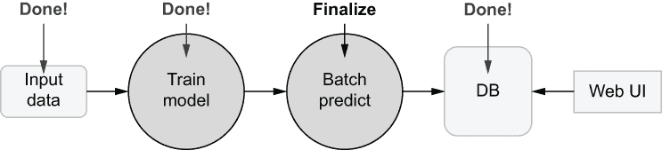

图 8.14 推荐系统项目：最终确定预测

拥有一个单独的模型来训练模型和批量生成预测是有用的，因为它允许你独立地安排这两个流程。例如，你可以每晚重新训练模型，每小时刷新推荐。

批量预测的一个主要挑战是规模和性能。生成数十万条推荐需要许多计算周期，但完成一次运行不应该需要数小时或数天。幸运的是，如以下列表所示，我们可以使用熟悉的工具和技术来应对这一挑战：从第三章中扩展工作流程的水平缩放，从第四章中可扩展的计算层，第五章中的性能提示，以及第七章中的大规模数据处理模式。一旦完成，我们可以使用第六章中的经验将工作流程部署到生产环境中。

图 8.15 显示了批量预测工作流程的一般架构。我们首先获取我们想要预测的数据。我们将数据分成多个批次，这些批次可以并行处理。最后，我们将结果发送到外部系统。

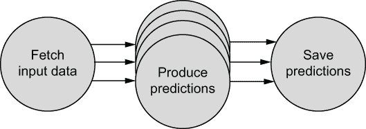

图 8.15 批量预测工作流程的典型结构

在这个例子中，我们只为在注册过程中选择了两部他们最喜欢的电影的理论新用户生成推荐。在一个真实的产品中，我们还会更新现有用户的推荐，每次流程运行时都会获取他们的用户资料。

如本节开头所述，我们限制新用户可以选择的电影数量，以限制我们必须预先计算的组合数量。为了增加新用户找到他们喜欢的电影的可能性，我们选择最受欢迎的前 K 部电影。下一个列表显示了一个函数 top_movies，它找到热门电影的子集。

我们将生成所有热门电影的组合，对于前 1,000 部电影，这将产生大约 500,000 对。我们可以并行地为这 500,000 个假设的用户配置文件生成推荐。我们使用 make_batches 工具函数将配对列表分成 100,000 个配置文件的块。

列表 8.6 批量推荐工具

```
from collections import Counter
from itertools import chain, groupby

def make_batches(lst, batch_size=100000):     ❶
    batches = []
    it = enumerate(lst)
    for _, batch in groupby(it, lambda x: x[0] // batch_size):
        batches.append(list(batch))
    return batches

def top_movies(user_movies, top_k):           ❷
    stats = Counter(chain.from_iterable(user_movies.values()))
    return [int(k) for k, _ in stats.most_common(top_k)]
```

❶ 将列表分割成固定大小的块并返回块列表

❷ 统计用户矩阵中的所有电影 ID 并返回最受欢迎的前 K 个

将代码保存到文件 movie_recs_util.py 中。它将在以下流程中使用。列表 8.7 将所有部分组合在一起。它生成所有电影对，在开始步骤中，在批量推荐步骤中并行地为用户配置文件批量生成推荐，并在连接步骤中汇总并存储结果，遵循上述图 8.15 中描述的模式。

列表 8.7 批量推荐流程

```
from metaflow import FlowSpec, step, conda_base, Parameter,\
                     current, resources, Flow, Run
from itertools import chain, combinations

@conda_base(python='3.8.10', libraries={'pyarrow': '5.0.0',
                                        'python-annoy': '1.17.0'})
class MovieRecsFlow(FlowSpec):

    num_recs = Parameter('num_recs',
                         help="Number of recommendations per user",
                         default=3)
    num_top_movies = Parameter('num_top',
                               help="Produce recs for num_top movies",
                               default=100)

    @resources(memory=10000)
    @step
    def start(self):
        from movie_recs_util import make_batches, top_movies
        run = Flow('MovieTrainFlow').latest_successful_run                ❶
        self.movie_names = run['start'].task['movie_names'].data
        self.model_run = run.pathspec
        print('Using model from', self.model_run)
        model_users_mtx = run['start'].task['model_users_mtx'].data
        self.top_movies = top_movies(model_users_mtx,
                                     self.num_top_movies)                 ❷
        self.pairs = make_batches(combinations(self.top_movies, 2))       ❸
        self.next(self.batch_recommend, foreach='pairs')

    @resources(memory=10000)
    @step
    def batch_recommend(self):                                            ❹
        from movie_model import load_model, recommend
        run = Run(self.model_run)
        model_ann, model_users_mtx, model_movies_mtx = load_model(run)    ❺
        self.recs = list(recommend(self.input,
                                   model_movies_mtx,
                                   model_users_mtx,
                                   model_ann,
                                   self.num_recs))                        ❻
        self.next(self.join)

    @step
    def join(self, inputs):
        import movie_db
        self.model_run = inputs[0].model_run
        names = inputs[0].movie_names
        top = inputs[0].top_movies
        recs = chain.from_iterable(inp.recs for inp in inputs)            ❼
        name_data = [(movie_id, int(movie_id in top), name)
                     for movie_id, name in names.items()]
        self.db_version = movie_db.save(current.run_id, recs, name_data)  ❽
        self.next(self.end)

    @step
    def end(self):
        pass

if __name__ == '__main__':
    MovieRecsFlow()
```

❶ 获取最新模型

❷ 生成最热门电影列表

❸ 生成假设用户配置文件：热门电影的配对

❹ 这些步骤是并行运行的。

❺ 加载 Annoy 索引

❻ 为此批次的用户生成推荐

❼ 汇总所有批次的推荐

❽ 将推荐保存到数据库

将代码保存到文件 movie_recs_flow.py 中。按照以下方式运行流程：

```
# python movie_recs_flow.py --environment=conda run
```

默认情况下，只考虑前 100 部电影。您可以通过添加选项 --num_top=1000（或更高）来预先计算更多电影的推荐。运行完成后，您应该在当前工作目录中找到一个以 movie_recs_ 为前缀的 SQLite 数据库文件。包含 500,000 个用户（假设用户配置文件）的推荐数据库大约是 56 MB——显然还有增长空间！如果您想在云中运行此流程，可以将 @resources 装饰器更改为 @batch，以远程运行仅开始和批量推荐步骤。您需要本地运行连接步骤，因为我们很快就需要存储在本地文件中的 SQLite 数据库。

注意我们如何使用表达式 Flow('MovieTrainFlow').latest_successful_run 来访问 MovieTrainFlow 生成的模型。这个调用在 MovieRecsFlow 的相同命名空间中操作，这意味着每个用户可以自由地实验流程，而不会相互干扰。正如第六章中讨论的，命名空间与 @project 装饰器一起工作，因此您可以在生产环境中安全地并发部署各种流程变体。

您可以使用 sqlite3 命令行工具打开数据库并查询它。然而，本章全部关于使用模型产生实际业务价值，因此我们可以更进一步，并在 Web UI 上查看结果！

在 Web 应用程序中使用推荐

在现实生活中的商业环境中，作为数据科学家，你的职责可能仅限于将结果写入数据库。另一个工程团队能够轻松地从数据库中读取建议并围绕它们构建应用程序。图 8.16 展示了最终步骤。

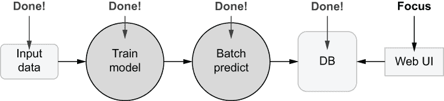

图 8.16 推荐系统项目：关注 Web UI

虽然通常你可以依赖其他工程团队进行 Web 应用程序开发，但有时能够快速构建一个应用程序原型来查看实际结果是有用的。幸运的是，存在一些强大的开源框架，使得在 Python 中构建简单的仪表板变得容易。接下来，我们将使用其中一个这样的框架，即 Plotly Dash ([`plotly.com/dash/`](https://plotly.com/dash/))，来构建一个简单的 UI 来模拟带有推荐的注册流程。

首先，让我们创建一个简单的客户端库来从 SQLite 数据库中获取推荐。我们只需要两个函数：get_recs，它返回两个电影给出的预计算推荐，以及 get_top_movies，它返回我们对其有推荐的顶级电影列表。下一个列表显示了客户端。

列表 8.8 访问推荐

```
import sqlite3
from movie_db import dbname, recs_key

class MovieRecsDB():
    def __init__(self, run_id):                           ❶
        self.run_id = run_id
        self.name = dbname(run_id)
        self.con = sqlite3.connect(self.name)

    def get_recs(self, movie_id1, movie_id2):             ❷
        SQL = "SELECT name FROM movies_{run_id} AS movies "\
              "JOIN recs_{run_id} AS recs "\
              "ON recs.movie_id = movies.movie_id "\
              "WHERE recs.recs_key = ?".format(run_id=self.run_id)
        cur = self.con.cursor()
        cur.execute(SQL, [recs_key((movie_id1, movie_id2))])
        return [k[0] for k in cur]

    def get_top_movies(self):                             ❸
        SQL = "SELECT movie_id, name FROM movies_%s "\
              "WHERE is_top=1" % self.run_id
        cur = self.con.cursor()
        cur.execute(SQL)
        return list(cur)
```

❶ 根据运行 ID 打开一个版本化的数据库

❷ 获取由两个电影组成的假设用户配置文件的推荐

❸ 返回顶级电影的列表

将代码保存到文件 movie_db_client.py 中。接下来，通过运行以下命令安装 Plotly Dash：

```
# pip install dash
```

Plotly Dash 允许你在一个 Python 模块中构建整个网络应用程序，包括在浏览器中运行的用户界面和作为后端的网络服务器。你可以参考其文档和教程来详细了解这个工具。接下来，我们将使用它来构建一个简单、自解释的原型用户界面，如图 8.17 所示。

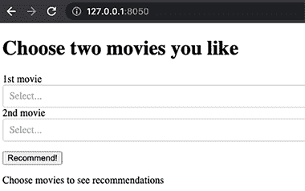

图 8.17 我们示例推荐系统的 Web UI

列表 8.9 展示了生成图 8.17 中 Web UI 的 Dash 应用程序。应用程序有两个主要部分：应用程序的布局定义在 app.layout 中，包括我们从数据库中获取的电影下拉列表。当用户点击按钮时，Dash 会调用 update_output 函数。如果用户选择了两部电影，我们可以从数据库中获取相应的推荐。

列表 8.9 推荐网络应用程序

```
import sys
from dash import Dash, html, dcc
from dash.dependencies import Input, Output, State
from movie_db_client import MovieRecsDB

RUN_ID = sys.argv[1]                                                       ❶
movies = [{'label': name, 'value': movie_id}
          for movie_id, name in MovieRecsDB(RUN_ID).get_top_movies()]      ❷

app = Dash(__name__)
app.layout = html.Div([                                                    ❸
    html.H1(children="Choose two movies you like"),
    html.Div(children='1st movie'),
    dcc.Dropdown(id='movie1', options=movies),
    html.Div(children='2nd movie'),
    dcc.Dropdown(id='movie2', options=movies),
    html.P([html.Button(id='submit-button', children='Recommend!')]),
    html.Div(id='recs')
])

@app.callback(Output('recs', 'children'),
              Input('submit-button', 'n_clicks'),
              State('movie1', 'value'),
              State('movie2', 'value'))
def update_output(_, movie1, movie2):                                      ❹
    if movie1 and movie2:        
        db = MovieRecsDB(RUN_ID)
        ret = [html.H2("Recommendations")]
        return ret + [html.P(rec) for rec in db.get_recs(movie1, movie2)]  ❺
    else:
        return [html.P("Choose movies to see recommendations")]

if __name__ == '__main__':
    app.run_server(debug=True)                                             ❻
```

❶ 将数据库版本作为命令行参数指定

❷ 从数据库中获取顶级电影的列表

❸ 定义 UI 组件

❹ 当按钮被点击时调用的函数

❺ 从数据库中获取推荐

❻ 启动网络服务器

将代码保存到文件 movie_dash.py 中。要启动服务器，你需要在当前工作目录中有一个由 MovieRecsFlow 生成的数据库。一旦你有了数据库，你可以通过指定运行 ID 来指向服务器，如下所示：

```
# python movie_dash.py 1636864889753383
```

服务器应该输出类似以下内容的行

```
Dash is running on http://127.0.0.1:8050/
```

你可以将 URL 复制并粘贴到浏览器中，然后应该会打开 web 应用。现在你可以选择任何一对电影，并获得符合你口味的个性化推荐！图 8.18 显示了两个示例结果。

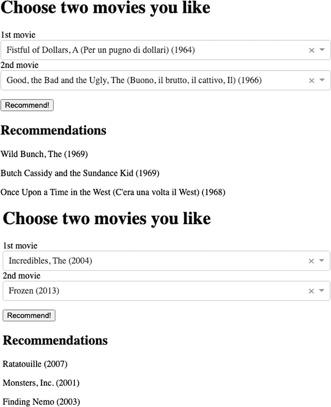

图 8.18 推荐示例

注意 UI 的响应速度非常快。在生成推荐时没有明显的延迟，从而提供了愉悦的用户体验。这是批量预测的主要优势：没有比完全不进行即时计算更快的预测方式。

恭喜你开发了一个功能齐全的推荐系统，从原始数据到功能性的 web UI！在下一节中，我们将看到如何使用相同的模型即时生成推荐，这对于我们事先不知道输入数据的情况非常有用。

### 8.1.4 实时预测

记得章节开头提到的图 8.4 吗？如图 8.19 再次所示，如果你从知道输入数据的那一刻起至少有 15 分钟的时间到实际需要预测的时间，你可以考虑批量预测。上一节演示了这种情况的一个极端例子：我们可以在预测之前很久就预先生成所有输入数据，包括顶级电影的配对。

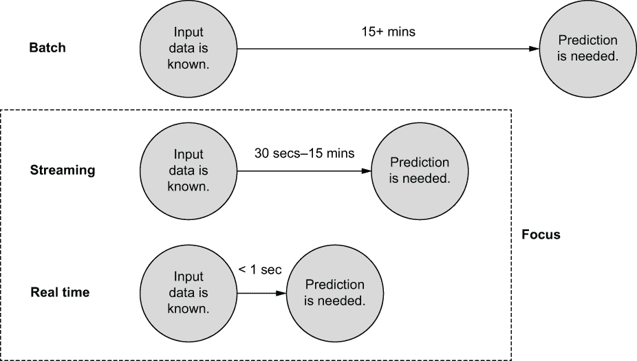

图 8.19 关注流式和实时预测

显然，我们并不总是有足够的时间。例如，我们可能希望在用户观看电影或产品几分钟或几秒钟后推荐电影或其他产品。虽然理想情况下，有一个可以在任何时间尺度上以相同方式工作的系统会非常方便，但在实践中，为了快速生成预测，需要做出权衡。例如，如果你需要在几秒钟内得到答案，就没有足够的时间在计算层上动态启动和关闭实例。或者，没有足够的时间从 S3 下载整个大型数据集。

因此，需要快速生成答案的系统需要以不同的方式构建。在机器学习的背景下，这类系统通常被称为*模型服务*或*模型托管*系统。它们在高级别的运行原理很简单：首先，你需要一个模型（文件），这通常由批量工作流程生成，例如通过 Metaflow。通常，模型会附带预处理输入数据的函数，例如将输入事实转换为特征，以及将结果后处理为所需格式的函数。模型和支持代码的集合可以打包成一个容器，部署在微服务平台上，该平台负责运行容器并将请求路由到它们。

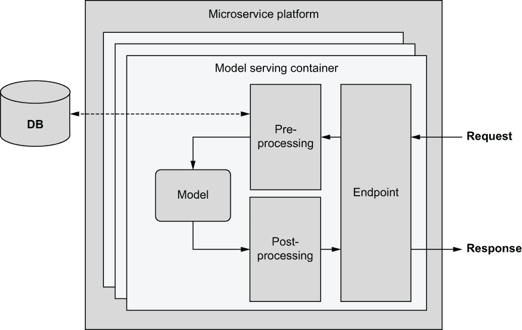

图 8.20 典型模型托管服务的架构

图 8.20 展示了模型托管服务的高级架构：

1.  通过发送请求，例如通过 HTTP，到 *一个托管端点*，该端点托管在类似 http://hosting-service/predict 的地址，来生成实时预测。

1.  端点解码并验证请求，并将其转发到预处理函数。

1.  预处理函数负责将请求中包含的事实转换为部署的模型使用的特征。通常，请求本身不包含所有所需数据，但需要从数据库中查找附加数据。例如，请求可能只包含一个用户 ID，然后从数据库中获取与用户相关的最新数据。

1.  一个特征向量/张量被输入到模型中，该模型生成一个预测。有时，一个模型可能是由多个模型组成的集成，甚至是一个复杂的模型图。

1.  预测通过后处理函数进行处理，以转换为合适的响应格式。

1.  返回一个响应。

注意，模型托管服务的架构与典型的非机器学习相关的微服务并没有太大区别。你只需要一个可以接收请求、即时处理一些代码并返回响应的容器。对于某些数据科学用例，使用现有的微服务平台，如 AWS 上的 Fargate 或 Google App Engine 进行模型托管是完全可行的。

然而，以下额外的考虑可能使得使用专门的模型托管平台或在通用平台上添加额外服务成为必要：

+   模型可能计算量较大，需要大量内存和专门的硬件，如 GPU。传统的微服务平台可能难以容纳这样的重型服务。

+   模型和它们的输入输出需要实时监控。许多 *模型监控* 解决方案可以帮助处理这种情况。

+   你想使用 *一个特征存储库* 来以一致的方式处理将事实转换为特征。在图 8.20 中，特征存储库将替换或集成到预处理函数和数据库中。

如果你需要一个专门的平台，所有主要云提供商都提供模型托管解决方案，如 Amazon Sagemaker Hosting 或 Google AI Platform。或者，你可以利用开源库，如 Ray Serve ([ray.io](https://www.ray.io/)) 或 Seldon ([seldon.io](https://www.seldon.io/))。

示例：实时电影推荐

让我们通过使用最小化模型托管服务来练习实时预测。此示例通过允许基于可以实时更新的电影列表生成推荐来扩展我们之前的电影推荐系统。例如，你可以使用这个系统根据用户最近浏览的所有电影生成实时推荐。

此示例并非旨在用于生产环境，而是将展示图 8.20 中概述的模型托管系统的以下关键概念：

+   一个可通过 HTTP 访问的服务端点

+   一个使用与训练代码相同的特征化模块的预处理函数

+   加载和使用使用批量工作流程训练的模型

+   以决定输出格式对预测进行后处理

我们将使用流行的 Python Web 框架 Flask ([flask.palletsprojects.com](https://flask.palletsprojects.com/en/2.1.x/))，将逻辑封装为 Web 服务。此示例可以轻松地适应任何其他 Web 框架。以下代码示例列出了一个功能齐全的模型托管服务。

列表 8.10 模型托管服务

```
from io import StringIO
from metaflow import Flow
from flask import Flask, request
from movie_model import load_model, recommend                             ❶
from movie_data import load_movie_names                                   ❶

class RecsModel():                                                        ❷
    def __init__(self):
        self.run = Flow('MovieTrainFlow').latest_successful_run           ❸
        self.model_ann,\
        self.model_users_mtx,\
                   self.model_movies_mtx = load_model(self.run)           ❹
        self.names = load_movie_names()                                   ❹

    def get_recs(self, movie_ids, num_recs):                              ❺
        [(_, recs)] = list(recommend([(None, set(movie_ids))],
                                     self.model_movies_mtx,
                                     self.model_users_mtx,
                                     self.model_ann,
                                     num_recs))                           ❻
        return recs

    def get_names(self, ids):                                             ❼
        return '\n'.join(self.names[movie_id] for movie_id in ids)

    def version(self):                                                    ❽
        return self.run.pathspec

print("Loading model") 
model = RecsModel()                                                       ❾
print("Model loaded")
app = Flask(__name__)

def preprocess(ids_str, model, response):                                 ❿
    ids = list(map(int, ids_str.split(',')))                              ⓫
    response.write("# Model version:\n%s\n" % model.version())            ⓬
    response.write(“# Input movies\n%s\n” % model.get_names(ids))
    return ids

def postprocess(recs, model, response):                                   ⓭
    response.write(“# Recommendations\n%s\n” % model.get_names(recs))

@app.route(“/recommend”)                                                  ⓮
def recommend_endpoint():
    response = StringIO()
    ids = preprocess(request.args.get('ids’), model, response)            ⓯
    num_recs = int(request.args.get('num', 3))
    recs = model.get_recs(ids, num_recs)                                  ⓰
    postprocess(recs, model, response)                                    ⓱
    return response.getvalue()                                            ⓱
```

❷ 使用上一节中的辅助模块

❸ 模型辅助类

❽ 获取最新的模型 ID

❻ 加载模型

❸ 生成推荐

❻ 为一组电影生成推荐

❶ 一个将 ID 映射到电影名称的辅助函数

❺ 返回模型版本

⓱ 加载模型（这可能需要几分钟）

⓱ 预处理函数以解析请求中的信息

⓫ 解析逗号分隔字符串中的整数 ID

⓬ 输出模型的版本标识符

⓭ 后处理函数以输出响应

❹ Flask 端点规范

⓯ 处理请求的输入

⓰ 生成推荐

⓰ 最终输出响应

将代码保存到 movie_recs_server.py。要运行服务器，您需要一个包含模型所需库的执行环境。因为这不是 Metaflow 工作流程，而是 Flask 应用程序，所以我们不能像早期示例中那样使用@conda。相反，您可以通过执行以下命令手动创建一个合适的 Conda 环境：

```
# conda create -y -n movie_recs python-annoy==1.17.0 pyarrow=5.0.0 flask 
➥ metaflow
# conda activate movie_recs
```

一旦环境被激活，您就可以按照以下方式在本地执行服务：

```
# FLASK_APP=movie_recs_server flask run
```

加载模型并启动服务器可能需要一分钟或更长时间。一旦服务器启动并运行，您将看到以下输出：

```
Model loaded
 * Running on http://127.0.0.1:5000/ (Press CTRL+C to quit)
```

在此之后，您就可以开始查询服务器了。要向服务器发送 HTTP 请求，请打开另一个终端窗口，您可以在其中使用命令行客户端 curl 向服务器发送请求。您可以在 movies.csv 中浏览有趣的电影 ID，然后按如下方式查询推荐：

```
# curl 'localhost:5000/recommend?ids=4993,41566'
```

生成类似以下响应需要大约 50-100 毫秒：

```
MovieTrainFlow/1636835055130894
# Input movies
Lord of the Rings: The Fellowship of the Ring, The (2001)
Chronicles of Narnia: The Lion, the Witch and the Wardrobe, The (2005)
# Recommendations
Lord of the Rings: The Two Towers, The (2002)
Lord of the Rings: The Return of the King, The (2003)
Harry Potter and the Sorcerer's Stone (2001)
```

您可以使用 num 参数来生成更多推荐：

```
# curl 'localhost:5000/recommend?ids=16,858,4262&num=10'
# Model version:
MovieTrainFlow/1636835055130894
# Input movies
Casino (1995)
Godfather, The (1972)
Scarface (1983)
# Recommendations
Goodfellas (1990)
Godfather: Part II, The (1974)
Donnie Brasco (1997)
Léon: The Professional (1994)
Bronx Tale, A (1993)
Taxi Driver (1976)
Raging Bull (1980)
Departed, The (2006)
No Country for Old Men (2007)
American Gangster (2007)
```

恭喜！您已经创建了一个能够实时生成推荐的 Web 服务。尽管服务运行正常，但您应该考虑一些改进，以便使服务完全准备好投入生产。首先，在基础设施方面，考虑以下方面：

+   服务应打包在 Docker 容器中，以便可以部署到微服务平台。

+   此服务一次只能处理单个请求。您应该查阅 Flask 文档，了解如何部署应用程序以便并行处理多个请求。

+   如果需要更大的规模，您可以在并行运行多个容器。这需要一个负载均衡器将流量路由到各个容器。

+   记录请求量日志和基本指标是一个好主意，为此有许多现成的工具可用。

其次，在建模方面，考虑添加以下内容：

+   一个用于实时跟踪模型指标的模型监控解决方案

+   一个用于跟踪请求中的数据质量以检测输入数据分布变化的解决方案

+   一个用于管理 A/B 测试的服务

模型部署所需的几乎所有 ML 特定工具都与调试性和结果质量相关。想象一下，服务返回的预测看起来很奇怪。第一个问题是，哪个模型产生了预测？为了回答这个问题，我们在每个预测响应中包含了模型版本。如果没有模型版本标识符，将无法知道预测的来源，尤其是在可能同时部署多个模型版本复杂环境中。

图 8.21 说明了模型血缘的概念。


图 8.21 从预测回溯到原始数据的模型血缘

通过使用如图 8.21 所示的架构，我们可以跟踪预测的血缘，一直回溯到源数据：

+   每个预测响应都应该包含一个 ID，表示哪个部署产生了响应。

+   例如，每个部署（例如，运行模型特定版本的容器）都应该获得一个唯一的 ID。

+   容器应该知道模型的 ID 和生成模型的运行 ID。

+   知道运行 ID，我们可以回溯到用于训练模型的原始数据。

你现在已经具备了在实时或预计算批量预测之间做出明智选择的能力，以及支持它们的框架。当不确定时，选择最简单可行的方法。

## 摘要

+   为了产生价值，机器学习模型必须与其他周围系统连接。

+   部署数据科学应用并生成预测没有唯一的方法：正确的方法取决于用例。

+   根据输入数据变得已知和需要预测之间的时间窗口，选择合适的预测基础设施。

+   另一个关键考虑因素是周围系统是否需要从模型请求预测，或者模型是否可以将预测推送到周围系统。在后一种情况下，批量或流预测是一个好方法。

+   如果在需要预测之前至少 15-30 分钟知道输入数据，通常可以以批量工作流的形式生成预测，这是技术上最直接的方法。

+   在批量和实时用例中，所有模型输出都应附上版本标识符非常重要。

+   实时预测可以通过通用微服务框架或针对数据科学应用定制的解决方案来生成。如果您的模型计算需求高，后者可能是最佳方法。

+   确保您的部署可以通过投资监控工具和溯源功能进行调试。应该能够追踪每个预测，直至模型及其生成的流程。
