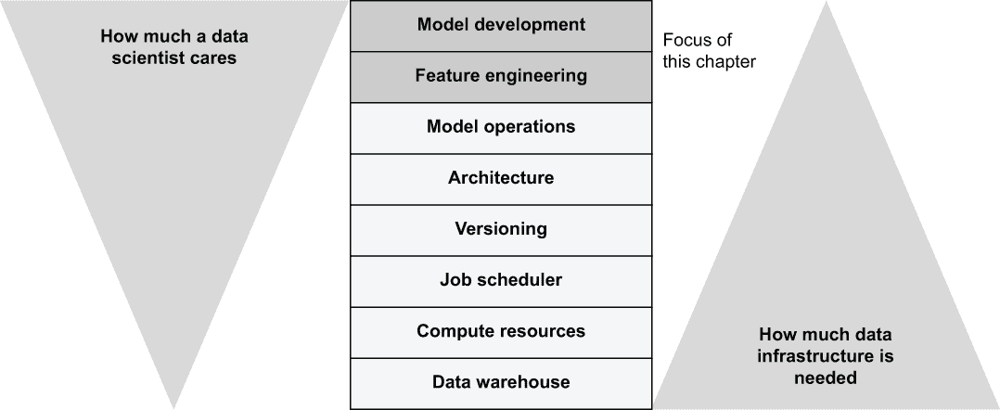
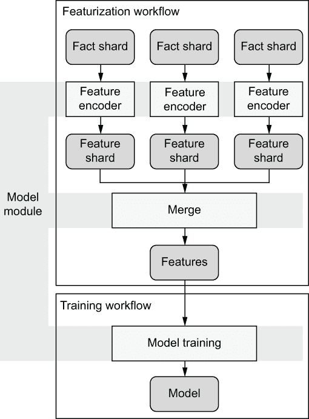
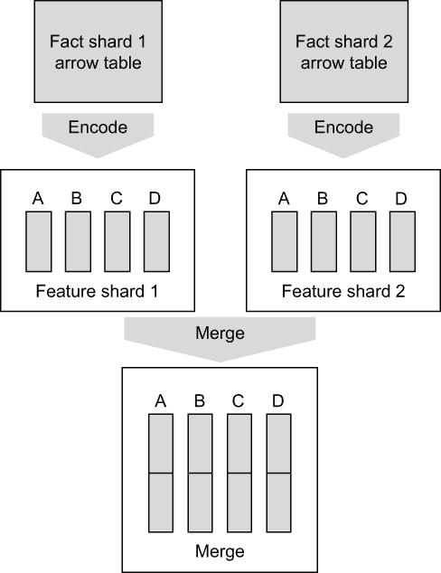
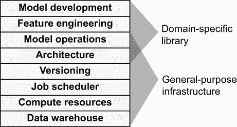
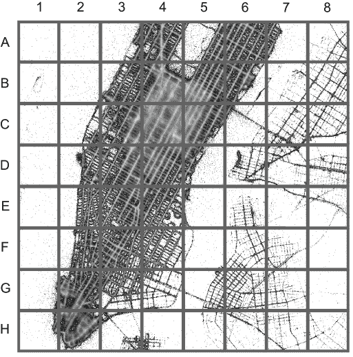
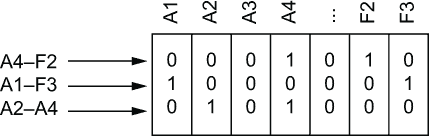
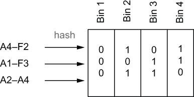
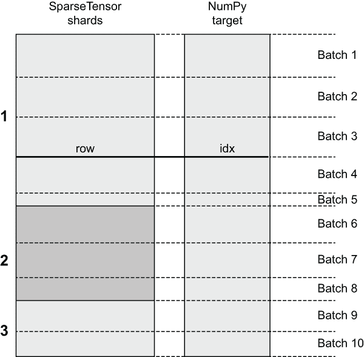
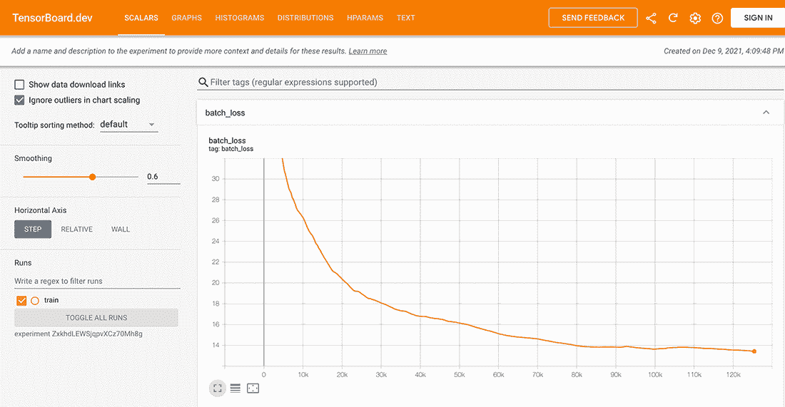

# 9 全栈机器学习

本章涵盖

+   开发一个定制框架，使其更容易为特定问题域开发模型和功能

+   在工作流中训练深度学习模型

+   总结本书学到的经验教训

我们现在已经涵盖了基础设施堆栈的所有层级，如图 9.1 所示，除了最顶层：模型开发。我们在第七章中只是触及了特征工程层。难道不是一种矛盾吗？一本关于机器学习与数据科学基础设施的书，却花了这么少的时间讨论机器学习的核心问题：模型和特征？

这种关注是有意为之的。首先，关于这些主题已经存在许多优秀的书籍。成熟的建模库，如 TensorFlow 和 PyTorch，都附带大量的深入文档和示例。如图 9.1 所示，这些主题往往是专业数据科学家和机器学习工程师的核心专业领域，而底层则不是。为了有效地提高数据科学家的日常生产力，有道理的是在需要帮助的地方提供帮助：堆栈的底层。



图 9.1 基础设施堆栈与数据科学家的兴趣领域

此外，最顶层往往比底层更具有应用特定性。例如，计算机视觉应用所需的模型和特征与用于平衡营销预算的模型和特征非常不同。然而，它们都可以使用相同的方法从云中访问数据、运行和编排容器，以及版本控制和跟踪项目。

在第一章讨论的四个“V”中——体积、速度、有效性和多样性——最后一个最难用标准化的解决方案来解决。如果基础设施能够很好地解决前三个“V”，那么开发并部署各种用例就变得可行，即使每个项目都带有自己的数据管道、定制模型和自定义业务逻辑。

回到第一章讨论的另一个主题，我们可以通过为堆栈的底层提供一种通用、低开销的解决方案来最小化由处理数据、计算和编排的样板代码引起的意外复杂性。同时，我们可以接受这样一个事实：现实世界的用例都伴随着一定程度的固有复杂性，这是顶层需要管理的。并非所有东西都可以抽象化。

在本书所学的基础上，你可以设计自己的库来支持特定用例的建模和特征工程，这有助于进一步控制复杂性。就像传统软件利用由操作系统如 OS X 或 Linux 提供的特性和服务一样，你的库可以将堆栈的底层视为任何数据密集型应用程序的操作系统。然而，你不需要急于这样做。先构建几个没有任何特殊抽象的应用程序是一个好主意，这样你就能更好地理解是否存在可以从额外支持和标准化中受益的常见模式。

为了展示所有这些概念是如何协同工作的，包括一个支持模型开发的定制库，下一节将带您通过一个涉及堆栈所有层的真实项目。在全面示例之后，我们通过总结本书学到的经验来结束本书。您可以在[`mng.bz/N6d7`](http://mng.bz/N6d7)找到本章的所有代码列表。

## 9.1 可插拔的特征编码器和模型

本节将扩展我们在第七章开始讨论的出租车行程成本预测示例。我们的原始版本非常简单。我们使用线性回归根据一个变量：行程距离来预测价格。你可能会在这个模型中至少发现一个明显的问题：行程的持续时间除了距离外也很重要。

让我们想象准确预测行程价格是一个真正的商业挑战。一个现实解决方案会是什么样子？首先，你不太可能一开始就知道现实生活中的商业问题的最佳解决方案。为了找到一个可行的解决方案，你必须对多个模型和特征进行实验，通过多次迭代测试它们的性能。你肯定会使用多个变量进行预测，因此你可能会花大量时间设计和实现合适的特征。很可能，你也会用不同的模型架构测试这些特征。

此外，现实生活中的数据往往不足。正如第七章中的示例所示，当有高质量的特征，如实际行程距离时，使用简单模型可以得到相当好的结果。如果我们的应用程序无法访问出租车计费器或汽车的里程表，而只有乘客的智能手机怎么办？也许我们只知道接车和下车的位置，我们必须在不知道确切行驶距离的情况下预测价格，这我们将在后面练习。

在本节中，我们将在一个更现实的设置中开发一个更高级的模型。因为我们知道我们需要在多个模型和特征上进行迭代——也许我们有一个数据科学家团队在解决这个问题——我们通过实现一个简单的框架来标准化模型开发设置，这个框架允许我们插入自定义特征编码器并灵活地测试各种模型。

使用该框架，我们开发了使用地理位置来预测价格的特征。为了实现这一点，我们将我们的模型从 20 世纪 50 年代的线性回归升级到 2020 年代的深度学习模型，该模型使用 Keras 和 TensorFlow 构建。为了验证我们的模型，我们创建了一个基准，比较了各种建模方法的性能。与之前一样，我们直接从公共 S3 存储桶访问原始数据。

### 9.1.1 开发可插拔组件的框架

我们有几个关于可能对价格预测任务表现良好的模型和特征的想法。我们希望快速原型设计和评估它们，以确定最有前途的方法。技术上，我们可以从头开始将每个想法实现为一个单独的工作流程，但我们可能会注意到，许多针对该任务的方案遵循一个类似的模式：它们都加载原始数据，将其分为训练集和测试集，运行特征编码器，训练模型，并使用测试数据进行评估。模型和特征编码器的实现各不相同，但工作流程的整体结构是相同的。

为了使模型开发过程更高效，我们将常见的模式实现为一个共享工作流程，这使得不同特征编码器和模型可以轻松插入。这种方法与我们在第五章中比较计算共现矩阵的各种算法的方法类似。图 9.2 展示了这种方法。



图 9.2：共享工作流程中的可插拔模型和特征编码器（浅灰色）

要实现一种新的建模方法，科学家需要开发三个组件，如图 9.2 中的浅灰色框所示：首先，将原始输入数据、事实转换为特征的特性编码器。为了使特性化更高效，我们可以将它们并行化处理多个数据分片。其次，在所有分片都被处理之后，我们可以将特性分片合并为模型的输入数据集。你可能已经认识到了这种方法，就是我们第七章中介绍的 MapReduce 模式。第三，我们需要一组函数来训练模型。

这三个组件可以作为可插拔模块来实现。我们开发了两个独立的流程来执行插件：一个用于处理特征，另一个用于训练模型。通过将数据和训练分离，我们使得它们可以独立调度。例如，如果你想遵循第八章中介绍的批量预测模式，你可以使用共享的特征化工作流程来为批量预测工作流程生成数据。

在 Python 中，我们通常将同一接口的不同实现定义为单独的类。让我们首先定义三个组件的接口：*编码器*、*合并*和*模型训练*。特征编码器需要实现两个方法：encode，它将一个输入数据碎片（即事实碎片）——表示为 PyArrow 表——转换为特征碎片。然后，碎片被提供给另一个方法，merge，该方法将碎片合并成一个可以由模型处理的数据集。图 9.3 阐述了这两个函数的作用。



图 9.3 首先将碎片化输入数据编码为特征，然后合并成数据集

编码函数可以输出多个命名特征，如图 9.3 中的 A-D 所示，这些特征作为字典输出，其中键是特征名称，值是编码器选择的数据结构，用于存储特征。我们当前的代码期望所有碎片产生相同的一组特征，但作为一个练习，你可以更改代码以放宽这一要求。merge 函数接收所有特征碎片作为输入，并选择如何将它们组合以生成最终数据集。

定义特征编码器

许多模型可以高效地读取作为 NumPy 数组的数据，因此我们首先定义一个输出 NumPy 数组的编码器模板。接下来的列表显示了一个通用超类——一个特定编码器可以从中派生的类，它期望编码函数输出一个 NumPy 数组。它负责合并碎片中产生的 NumPy 数组，而不对数组包含的确切内容有任何偏见。

列表 9.1 处理 NumPy 数组的特征编码器超类

```
class NumpyArrayFeatureEncoder():
    @classmethod                                                     ❶
    def encode(cls, table):                                          ❷
        return {}                                                    ❸

    @classmethod 
    def merge(cls, shards):                                          ❹
        from numpy import concatenate
        return {key: concatenate([shard[key] for shard in shards])   ❺
                for key in shards[0]}                                ❻
```

❶ 将方法定义为类方法，因此可以在不实例化类的情况下使用它们

❷ 接受一个事实碎片作为 PyArrow 表

❸ 编码器将覆盖此方法以生成包含特征的 NumPy 数组

❹ 接受一个特征碎片的列表

❺ 将特征碎片连接成一个大的数组

❻ 遍历所有特征

我们将创建许多小模块，因此让我们为它们创建一个专门的目录，taxi_modules。将代码保存到 taxi_modules/numpy_encoder.py。

接下来，让我们定义一个使用我们刚刚创建的 NumpyArrayFeatureEncoder 的特征编码器。下一个列表中显示的编码器将作为一个基准：它直接从数据集中获取行程距离列和实际行程价格、总金额，允许我们比较不直接使用距离特征的预测质量。

列表 9.2 基准特征编码器

```
from taxi_modules.numpy_encoder import NumpyArrayFeatureEncoder

class FeatureEncoder(NumpyArrayFeatureEncoder):             ❶
    NAME = 'baseline'                                       ❷
    FEATURE_LIBRARIES = {}                                  ❸
    CLEAN_FIELDS = ['trip_distance', 'total_amount']        ❹

    @classmethod
    def encode(cls, table):
        return {                                            ❺
            'actual_distance': table['trip_distance'].to_numpy(),
            'amount': table['total_amount'].to_numpy()
          }
```

❶ 重新使用来自 NumpyArrayFeatureEncoder 的合并方法

❷ 设置编码器名称

❸ 为此编码器定义额外的软件依赖

❹ 定义事实表中应清理的列

❺ 返回两个特征作为 NumPy 数组

将代码保存到 taxi_modules/feat_baseline.py 中。我们将所有特征编码器模块的前缀设置为 feat_，这样我们就可以自动发现它们。编码器定义了一些顶级常量，如下所示：

+   NAME—标识这个特征编码器。

+   FEATURE_LIBRARIES—定义此编码器需要的额外软件依赖项。

+   CLEAN_FIELDS—确定需要清理的事实表中的哪些列。

随着我们开始使用这些常数，它们的作用将变得更加清晰。接下来，让我们创建一个实用模块，用于加载之前定义的插件。

打包和加载插件

应该可以通过在 taxi_modules 目录中添加一个文件来简单地创建一个新的特征或模型。根据文件名，我们可以确定该模块是特征编码器还是模型。以下列表遍历 taxi_modules 目录中的所有文件，导入具有预期前缀的模块，并通过共享字典使它们可用。

列表 9.3 带参数的流程

```
import os       
from importlib import import_module

MODELS = {}                                                               ❶
FEATURES = {}                                                             ❷
FEATURE_LIBRARIES = {}                                                    ❸
MODEL_LIBRARIES = {}                                                      ❹

def init():
    for fname in os.listdir(os.path.dirname(__file__)):                   ❺
        is_feature = fname.startswith('feat_')                            ❻
        is_model = fname.startswith('model_')                             ❻
        if is_feature or is_model:
            mod = import_module('taxi_modules.%s' % fname.split('.')[0])  ❼
            if is_feature:                                                ❽
                cls = mod.FeatureEncoder
                FEATURES[cls.NAME] = cls
                FEATURE_LIBRARIES.update(cls.FEATURE_LIBRARIES.items())
            else:
                cls = mod.Model
                MODELS[cls.NAME] = cls
                MODEL_LIBRARIES.update(cls.MODEL_LIBRARIES.items())
```

❶ 将模型名称映射到模型类

❷ 将特征编码器名称映射到特征编码器类

❸ 记录编码器需要的库

❹ 记录模型需要的库

❺ 遍历 taxi_modules 目录中的所有文件

❻ 检查文件前缀

❼ 导入模块

❽ 填充包含编码器和模型的字典

将代码保存到 taxi_modules/__init__.py 中。请注意，该模块需要位于特征编码器和模型相同的目录中，以确保文件发现能够正确工作。Python 中的 __init__.py 文件具有特殊含义：在目录中包含 __init__.py 文件告诉 Python 该目录对应一个*Python 包*。Python 包是一组可以作为一个单元安装和导入的模块。更多关于包的信息，请参阅[`mng.bz/Dg8a`](http://mng.bz/Dg8a)。

目前，我们的 taxi_modules 包（目录）包含以下文件：

```
taxi_modules/__init__.py
taxi_modules/feat_baseline.py
taxi_modules/numpy_encoder.py
```

在本章中，我们将添加更多内容。将模块组织成 Python 包的好处是，你可以将其发布并共享为一个可以像其他 Python 包一样安装的包——想象一下 pip install taxi_modules 或 conda install taxi_modules。你可以参考[`packaging.python.org/`](https://packaging.python.org/)获取详细说明。然后，你可以使用，例如，@conda 装饰器将包包含到你的 Metaflow 项目中。

然而，没有必要发布这个包。一个更简单的方法是确保包目录与你的流程脚本相邻。例如，一个数据科学团队可能有以下结构的 Git 仓库：

```
taxi_modules/__init__.py
taxi_modules/...
flow1.py
flow2.py
flow3.py
```

在这种情况下，flow1、flow2 和 flow3 都可以自动访问共享的 taxi_modules 包，这得益于 Metaflow 在第六章中描述的自动将所有子目录作为包打包的事实。

建议：如果您有一个相对稳定的包，数据科学家在处理他们的流程时不需要修改，您可以将其打包并作为正常的 Python 包发布，这样就可以使用 @conda 将其包含在流程中，就像任何其他第三方库一样。如果预计数据科学家需要作为他们项目的一部分快速迭代包的内容，例如本例中的特征编码器，您可以通过将其作为子目录包含进来，使原型设计循环更加平滑，Metaflow 版本会自动处理。

### 9.1.2 执行特征编码器

我们几乎准备好开始执行特征编码器了。在定义一个流程来执行此操作之前，我们需要两个额外的实用模块。首先，为了预处理事实，我们使用第七章中介绍的 table_utils.py 中的实用函数。下一个代码示例再次展示了该模块。

列表 9.4 从 Arrow 表中删除异常行

```
def filter_outliers(table, clean_fields):                          ❶
    import numpy
    valid = numpy.ones(table.num_rows, dtype='bool')               ❷
    for field in clean_fields:                                     ❸
        column = table[field].to_numpy()
        minval = numpy.percentile(column, 2)                       ❹
        maxval = numpy.percentile(column, 98)                      ❹
        valid &= (column > minval) & (column < maxval)             ❺
    return table.filter(valid)                                     ❻

def sample(table, p):                                              ❼
    import numpy
    return table.filter(numpy.random.random(table.num_rows) < p)   ❽
```

❶ 接受一个 pyarrow.Table 和一个要清理的列列表

❷ 从接受所有行的过滤器开始

❸ 逐个处理所有列

❹ 找到值分布的顶部和底部 2%

❺ 只包含落在 2-98% 值分布之间的行

❻ 返回与过滤器匹配的行子集

❼ 从给定表中随机采样 p% 的行

❽ 在每一行上抛一个有偏的硬币并返回匹配的行

将代码保存在 taxi_modules/table_utils.py 中。有关这些函数如何工作的更多详细信息，请参阅第七章。

其次，我们定义一个辅助模块来执行特征编码器。列表 9.5 展示了一个包含两个函数的模块：execute 首先通过清理 CLEAN_FIELDS 中列出的所有字段来预处理事实表。它还接受一个输入行的样本，如果 sample_rate 小于 1.0。在此之后，它执行所有发现的特征编码器，并为他们提供事实表。合并函数接受两个碎片列表，分别为训练和测试的特征，并使用由其编码器指定的合并函数合并每个特征。

列表 9.5 执行特征编码器

```
from itertools import chain
from taxi_modules.table_utils import filter_outliers, sample
from taxi_modules import FEATURES                                          ❶

def execute(table, sample_rate):                                           ❷
    clean_fields = set(chain(*[feat.CLEAN_FIELDS
                               for feat in FEATURES.values()]))            ❸
    clean_table = sample(filter_outliers(table, clean_fields), sample_rate)❹
    print("%d/%d rows included" % (clean_table.num_rows, table.num_rows))
    shards = {}
    for name, encoder in FEATURES.items():                                 ❺
        print("Processing features: %s" % feat)
        shards[name] = encoder.encode(clean_table)                         ❻
    return shards

def merge(train_inputs, test_inputs):                                      ❼
    train_data = {}
    test_data = {}
    for name, encoder in FEATURES.items():                                 ❽
        train_shards = [inp.shards[name] for inp in train_inputs]
        test_shards = [inp.shards[name] for inp in test_inputs]
        train_data[name] = encoder.merge(train_shards)                     ❾
        test_data[name] = encoder.merge(test_shards)                       ❾
    return train_data, test_data
```

❶ 导入发现的特征

❷ 将特征编码器应用于事实表

❸ 生成需要清理的一组字段

❹ 清理并采样事实

❺ 遍历所有编码器

❻ 执行一个编码器

❼ 分别合并训练和测试数据

❽ 遍历所有特征

❾ 合并一个特征的特性碎片

将代码保存在 taxi_modules/encoders.py 中。现在我们已经准备好了可插拔特征编码器的机制！

我们可以组合一个工作流程，如列表 9.6 所示，该工作流程发现数据，并行生成数据碎片的特征，并最终合并一个最终数据集。工作流程的结构类似于第七章中的 TaxiRegressionFlow，但这次我们不在工作流程本身中硬编码特征，而是让插件指定它们。这样，数据科学家可以重用相同的流程——确保所有结果都是可比较的——并专注于开发新的特征编码器和模型。

在这个例子中，我们将使用第七章中介绍的两个月的出租车行程数据，即 2014 年 9 月和 10 月的数据。为了测试模型性能，我们使用 11 月的数据。我们将使用 foreach 将每个月的数据作为一个单独的分片来处理。

列表 9.6 执行可插入特征编码器的工作流程

```
from metaflow import FlowSpec, step, conda, S3, conda_base,\
                     resources, Flow, project, Parameter
from taxi_modules import init, encoders, FEATURES, FEATURE_LIBRARIES
from taxi_modules.table_utils import filter_outliers, sample
init()
TRAIN = ['s3://ursa-labs-taxi-data/2014/09/',                            ❶
         's3://ursa-labs-taxi-data/2014/10/']
TEST = ['s3://ursa-labs-taxi-data/2014/11/']                             ❷

@project(name='taxi_regression')
@conda_base(python='3.8.10', libraries={'pyarrow': '3.0.0'})
class TaxiRegressionDataFlow(FlowSpec):
    sample = Parameter('sample', default=0.1)

    @step
    def start(self):
        self.features = list(FEATURES)                                   ❸
        print("Encoding features: %s" % ', '.join(FEATURES))
        with S3() as s3:
            self.shards = []
            for prefix in TEST + TRAIN:
                objs = s3.list_recursive([prefix])                       ❹
                self.shards.append([obj.url for obj in objs])            ❹
        self.next(self.process_features, foreach='shards')

    @resources(memory=16000)
    @conda(libraries=FEATURE_LIBRARIES)                                  ❺
    @step
    def process_features(self):
        from pyarrow.parquet import ParquetDataset
        with S3() as s3:
            objs = s3.get_many(self.input)                               ❻
            table = ParquetDataset([obj.path for obj in objs]).read()    ❻
        self.shards = encoders.execute(table, self.sample)               ❼
        self.next(self.join_data)

    @resources(memory=16000)
    @conda(libraries=FEATURE_LIBRARIES)
    @step
    def join_data(self, inputs):
        self.features = inputs[0].features                               ❽
        self.train_data,\
        self.test_data = encoders.merge(inputs[1:], [inputs[0]])         ❾
        self.next(self.end)

    @step
    def end(self):
        pass

if __name__ == '__main__':
    TaxiRegressionDataFlow()
```

❶ 使用两个月的数据进行训练

❷ 使用一个月的数据进行测试

❸ 将特征集作为工件持久化，以供后续分析

❹ 发现数据分片

❺ 确保编码器需要的库可用

❻ 下载并解码分片

❼ 执行分片编码器

❽ 确保在连接步骤之后特征工件可用

❾ 分别合并训练数据和测试数据的分片

将代码保存到 taxi_modules 目录旁边（而不是内部），文件名为 taxi_regression_data.py。此时，目录结构应该如下所示：

```
taxi_regression_data.py
taxi_modules/__init__.py
taxi_modules/feat_baseline.py
taxi_modules/numpy_encoder.py
taxi_modules/encoders.py
taxi_modules/table_utils.py
```

您现在可以按照以下方式测试工作流程：

```
# python taxi_regression_data.py --environment=conda run
```

它应该打印“处理特征：基线”三次，每次对应一个分片。如果您好奇，可以打开一个笔记本来检查 train_data 和 test_data 工件，我们很快就会使用它们。

如果您已经像第四章中讨论的那样设置了计算层，例如 AWS Batch，您可以在云中执行工作流程。例如，您可以尝试以下操作：

```
# python taxi_regression_data.py --environment=conda run --with batch
```

如前所述，这样您可以扩展工作流程以处理更大的数据集，并在需要时更快地生成特征。

可插入的编码器是这个工作流程中最令人兴奋的主要功能。让我们通过创建另一个编码器来测试它们是如何工作的。这次我们创建一个不依赖于输入数据中的 trip_distance 字段的特征——假设我们的应用程序没有它可用或者我们不信任出租车计价器的读数。相反，我们根据事实表中可用的接车和下车位置的坐标来确定行程距离。

我们的新特性，称为欧几里得距离，定义在下一列表中，它测量两个位置之间的欧几里得距离。这显然是不准确的：城市中的出租车行程通常比直线距离要长，而且地球是圆的，所以我们不能在长距离上使用简单的欧几里得公式。然而，正如通常情况那样，一个简单的方法，尽管有已知缺陷，也能让我们快速开始。

列表 9.7 将欧几里得行程距离编码为特征

```
from taxi_modules.numpy_encoder import NumpyArrayFeatureEncoder

class FeatureEncoder(NumpyArrayFeatureEncoder):
    NAME = 'euclidean'
    FEATURE_LIBRARIES = {}
    CLEAN_FIELDS = ['pickup_latitude', 'pickup_longitude',       ❶
                    'dropoff_latitude', 'dropoff_longitude']

    @classmethod
    def encode(cls, table):
        import numpy
        plon = table['pickup_longitude'].to_numpy()              ❷
        plat = table['pickup_latitude'].to_numpy()               ❷
        dlon = table['dropoff_longitude'].to_numpy()             ❷
        dlat = table['dropoff_latitude'].to_numpy()              ❷
        euc = numpy.sqrt((plon - dlon)**2 + (plat - dlat)**2)    ❸
        return {'euclidean_distance': euc}
```

❶ 从事实表中提取坐标

❷ 将坐标转换为 NumPy 数组

❸ 计算坐标之间的欧几里得距离

将代码保存到 taxi_modules/feat_euclidean.py。请注意，编码器使用 NumPy 数组执行所有数学运算，避免了转换为单个 Python 对象，这使得编码器非常高效——遵循第五章的建议。

之后，再次按照以下方式运行工作流程：

```
# python taxi_regression_data.py --environment=conda run
```

这次，你应该能看到两个处理特征：基线处理特征和欧几里得处理特征。添加新特征只需在列表 9.7 中编写特征的定义——不需要对工作流程进行任何更改。你可以想象多个科学家在一段时间内协作创建新的特征和模型，这些模型通过共享工作流程进行评估和基准测试，确保结果的可靠性。

taxi_modules 目录中的模块演示了一个有用的模式：我们使用底层通用基础设施及其周围的抽象，如 Metaflow，作为基础。在其之上，我们创建了一个定制的、特定领域的库，这使得针对特定应用（在这种情况下，是行程价格预测）进行迭代变得更加容易。图 9.4 说明了这种模式。



图 9.4 基础基础设施堆栈之上的特定领域库

这种模式允许你有效地处理各种用例。通用基础设施可以专注于基础问题，如数据、计算、编排和版本控制，而高级、特定领域的库可以规范如何开发单个应用的策略。当应用的需求变化时，也可以快速演进特定领域库，同时保持基础稳定。

建议：使用特定领域库来规范应用特定的策略和通用基础设施来处理低级问题。这样，你就不需要针对特定用例优化整个堆栈。

现在我们有了训练和测试数据集，我们可以开始基准测试模型。与特征编码器类似，我们希望能够轻松地定义新的模型作为可插拔的模块。

### 9.1.3 基准测试模型

对于这个项目，我们将模型定义为模型架构和训练代码的组合，以及一组特征。这使得我们能够轻松地测试使用不同特征集的不同模型变体。与特征编码器类似，我们定义了一个所有模型都必须实现的通用接口。该接口定义了以下方法：

+   fit(train_data) 使用训练数据训练模型。

+   mse(model, test_data) 使用 test_data 评估模型，并返回衡量预测精度的均方误差。

+   save_model(model) 将模型序列化为字节。

+   load_model(blob) 从字节中反序列化模型。

最后两个方法是必需的，用于持久化模型。默认情况下，如第三章所述，Metaflow 使用 Python 内置序列化器 Pickle 将对象序列化为字节。许多机器学习模型包括它们自己的序列化方法，这些方法比 Pickle 更可靠，因此我们允许模型类使用自定义序列化器。值得注意的是，生成的字节仍然存储为 Metaflow 工件，因此模型存储和访问方式与其他任何工作流程结果相同。

我们首先定义一个简单的线性回归模型，使用实际距离来预测价格，就像我们在第七章中使用的那样。我们可以将不依赖于 actual_distance 特征的模型与其他基准模型进行比较。我们将很快定义通用回归器的代码，但首先我们从一个模型规范开始，如下所示。

列表 9.8 基线线性回归模型

```
from taxi_modules.regression import RegressionModel     ❶

class Model(RegressionModel):
    NAME = 'distance_regression'                        ❷
    MODEL_LIBRARIES = {'scikit-learn': '0.24.1'}        ❸
    FEATURES = ['baseline']                             ❹
    regressor = 'actual_distance'                       ❺
```

❶ 利用通用回归模型

❷ 模型名称

❸ 使用 Scikit-Learn 作为建模库

❹ 需要基线特征编码器

❺ 使用 actual_distance 变量来预测价格

将代码保存在 taxi_modules/model_baseline.py 中。请记住，列表 9.8 加载具有 model_ 前缀的文件中的模型。在 RegressionModel 基类中，FEATURES 和 regressor 属性的作用变得更加清晰，该类定义在下一个代码示例中。

列表 9.9 线性回归模型的超类

```
class RegressionModel():

    @classmethod
    def fit(cls, train_data):
        from sklearn.linear_model import LinearRegression
        d = train_data[cls.FEATURES[0]][cls.regressor].reshape(-1, 1)      ❶
        model = LinearRegression().fit(d, train_data['baseline']['amount'])
        return model

    @classmethod
    def mse(cls, model, test_data):
        from sklearn.metrics import mean_squared_error
        d = test_data[cls.FEATURES[0]][cls.regressor].reshape(-1, 1)       ❷
        pred = model.predict(d)                                            ❷
        return mean_squared_error(test_data['baseline']['amount'], pred)   ❷

    @classmethod
    def save_model(cls, model):                                            ❸
        return model

    @classmethod
    def load_model(cls, model):                                            ❸
        return model
```

❶ 使用 Scikit-Learn 拟合单变量线性回归模型

❷ 使用 Scikit-Learn 测试单变量线性回归模型

❸ 使用标准的 Python Pickle 序列化模型；不需要任何自定义

将代码保存在 taxi_modules/regression.py 中。该模块定义了一个简单的线性回归模型，使用 Scikit-Learn，它使用单个变量，定义在 regressor 属性中，来预测行程价格，存储在 amount 变量中。我们使用 Scikit-Learn 的 mean_squared_error 函数在 mse 方法中测量模型精度。在 save_model 和 load_model 中序列化和反序列化模型不需要任何特殊操作，因为 Scikit-Learn 模型与 Pickle 配合得很好。

模型工作流程

让我们定义一个工作流程来运行模型。我们允许每个模型定义它们期望可用的特征。只有所有特征都可用的模型才被启用。这样，在原型设计期间移除和添加特征编码器时，模型不会随机失败。合格模型的列表在启动步骤中确定。图 9.5 显示了工作流程的结构。


图 9.5 两个出租车工作流程之间的关系：数据和模型

每个模型，由假设的模型 A、B 和 C 表示，由一个单独的 foreach 分支处理。首先，在训练步骤中，我们使用 TaxiRegressionDataFlow 生成的 train_data 数据集训练一个模型。然后，在评估步骤中，我们使用 test_data 评估模型性能。在合并步骤中，打印出模型评估的摘要。下一个列表显示了代码。

列表 9.10 执行可插拔模型的流程

```
from metaflow import FlowSpec, step, conda, S3, conda_base,\
                     resources, Flow, project, profile
from taxi_modules import init, MODELS, MODEL_LIBRARIES
init()
@project(name='taxi_regression')
@conda_base(python='3.8.10', libraries={'pyarrow': '3.0.0'})
class TaxiRegressionModelFlow(FlowSpec):

    @step
    def start(self):
        run = Flow('TaxiRegressionDataFlow').latest_run                   ❶
        self.data_run_id = run.id                                         ❶
        self.features = run.data.features                                 ❷
        self.models = [name for name, model in MODELS.items()             ❸
                       if all(feat in self.features\
                              for feat in model.FEATURES)]
        print("Building models: %s" % ', '.join(self.models))
        self.next(self.train, foreach='models')

    @resources(memory=16000)
    @conda(libraries=MODEL_LIBRARIES)
    @step
    def train(self):
        self.model_name = self.input
        with profile('Training model: %s' % self.model_name):
            mod = MODELS[self.model_name]
            data_run = Flow('TaxiRegressionDataFlow')[self.data_run_id]   ❹
            model = mod.fit(data_run.data.train_data)                     ❺
            self.model = mod.save_model(model)                            ❻
        self.next(self.eval)

    @resources(memory=16000)
    @conda(libraries=MODEL_LIBRARIES)
    @step
    def eval(self):
        with profile("Evaluating %s" % self.model_name):
            mod = MODELS[self.model_name]
            data_run = Flow('TaxiRegressionDataFlow')[self.data_run_id]
            model = mod.load_model(self.model)                            ❼
            self.mse = mod.mse(model, data_run.data.test_data)            ❽
        self.next(self.join)

    @step
    def join(self, inputs):
        for inp in inputs:                                                ❾
            print("MODEL %s MSE %f" % (inp.model_name, inp.mse))
        self.next(self.end)

    @step
    def end(self):
        pass

if __name__ == '__main__':
    TaxiRegressionModelFlow()
```

❶ 从 TaxiRegressionDataFlow 的最新运行中访问输入数据

❷ 记录本次运行使用的特征

❸ 根据它们的输入特征确定哪些模型可以执行

❹ 访问训练数据

❺ 训练模型

❻ 使用特定于模型的序列化器将模型保存在一个工件中

❼ 加载模型并反序列化它

❽ 评估模型性能

❾ 打印模型得分的摘要

将代码保存到 taxi_regression_model.py 中。因为此流程访问由 TaxiRegressionDataFlow 生成的结果，请确保您已先运行该流程。此时，目录结构应该如下所示：

```
taxi_regression_data.py
taxi_regression_model.py
taxi_modules/__init__.py
taxi_modules/feat_baseline.py
taxi_modules/feat_euclidean.py
taxi_modules/model_baseline.py
taxi_modules/regression.py
taxi_modules/numpy_encoder.py
taxi_modules/encoders.py
taxi_modules/table_utils.py
```

你可以像往常一样运行流程：

```
# python taxi_regression_model.py --environment=conda run
```

你应该在输出中看到这些行：Training model: distance_regression 和 Evaluating distance_regression。最终的评估应该大致如下：

```
MODEL distance_regression MSE 9.451360
```

为了使事情更有趣，让我们定义另一个使用我们之前定义的欧几里得距离特征的回归模型。请看下面的代码列表。

列表 9.11 使用欧几里得距离特征的回归模型

```
from taxi_modules.regression import RegressionModel

class Model(RegressionModel):
    NAME = 'euclidean_regression'
    MODEL_LIBRARIES = {'scikit-learn': '0.24.1'}
    FEATURES = ['euclidean']
    regressor = 'euclidean_distance'
```

将代码保存到 taxi_modules/model_euclidean.py 中，然后再次按照以下方式运行工作流程：

```
# python taxi_regression_model.py --environment=conda run
```

这次，你应该会看到两个模型并行训练和评估：distance_regression 和 euclidean_regression。输出将如下所示：

```
MODEL euclidean_regression MSE 15.199947
MODEL distance_regression MSE 9.451360
```

毫不奇怪，使用起点和终点之间的欧几里得距离来预测价格的模型，其均方误差比使用实际行驶距离的基线模型要高。有了这两个模型，我们已经为未来的模型建立了一个坚实的基线。一个更复杂的模型应该能够轻松超越 euclidean_regression 的性能。如果能仅依靠位置特征就接近 distance_regression 的性能，那就太棒了。在下一节中，我们将构建一个更复杂的模型来应对这一挑战。

## 9.2 深度回归模型

如果你曾在大城市乘坐过出租车，你就会知道两个地点之间的欧几里得距离甚至实际路线长度都可能不是完成行程所需实际时间的良好预测指标。一些地点容易发生交通堵塞或以其他方式行驶缓慢。一个智能模型会根据历史数据学习识别这些缓慢区域，并相应地估计行程价格。

让我们先思考如何构建能够捕捉两个地点的旅行时间和距离作为函数的特征。首先，我们不需要任意精确的位置。几个城市街区之间的距离差异通常不会导致价格的系统差异。因此，我们不是使用精确坐标，而是可以使用图 9.6 中可视化的地图网格来编码起点和终点位置。



图 9.6 曼哈顿的假设地图网格

例如，使用图 9.6 中的网格，你可以将两个地点之间的行程编码为网格坐标对，例如 A4-F2 和 G7-B6。当然，现实世界的应用会使用比图中展示的更精细的网格。

你会如何将这样的位置对编码为特征？我们可以将像 A4 和 F2 这样的网格位置视为标记或单词，就像我们在第五章中处理 Yelp 评论聚类时做的那样。我们可以有一个高维向量，代表每个网格位置作为一个单独的维度。然后我们可以应用*多热编码*来标记接车和下车位置为 1，其他维度为 0，从而产生一个稀疏的行程向量。图 9.7 说明了这个想法。



图 9.7 将出租车行程编码为多热二进制向量

这种方法的一个不便之处在于，我们必须预先确定维度，即地图网格。如果我们使网格太小，我们无法处理区域外的行程。如果我们使它太大，数据就会变得非常稀疏，并且可能处理速度较慢。此外，我们必须维护网格位置和维度之间的映射。

任何高基数分类变量都存在相同的问题。解决这个问题的著名方法之一是*特征哈希*：对于每个可能的值，我们不是为每个值创建一个命名的维度，而是生成每个值的哈希值，并相应地将其放入一个桶中。关键的是，桶的数量比原始的区分值要少得多。只要哈希函数保持一致，相同的值总是会落在同一个桶中，从而产生一个与第一种方法相比具有固定、较低维度的多热编码矩阵。图 9.8 说明了这个想法。



图 9.8 将特征哈希应用于行程向量

在图 9.8 中，我们假设 hash(A4) = 桶 2，hash(F2) = 桶 4，等等。请注意，我们可以扩大网格并添加，比如说，坐标 A99，而不会影响现有数据，这是哈希方法的一个好处。此外，我们不必显式存储坐标标签和维度之间的映射，这使得实现变得更加简单。

当使用哈希时，我们无法保证两个不同的值总是会落在不同的桶中。可能两个不同的值会落在同一个桶中，导致数据中出现随机噪声。尽管存在这种不足，特征哈希在实践中往往表现良好。

假设我们想要测试使用哈希网格坐标特征矩阵的想法，如图 9.8 所示。在实际操作中，我们应该如何编码和存储这个矩阵呢？我们可以构建一个特征编码器，生成一个合适的矩阵，而不考虑将要使用它的模型，但思考整个问题的端到端是有益的。让我们看看手头的建模问题。我们的模型将如下所示：

+   *高维*——为了保持模型具有一定的准确性，网格单元应该在数百米或更小的范围内。因此，一个 100 平方公里的区域需要 10,000 个网格单元，即 10,000 个输入维度。

+   *大规模*——在我们的输入数据中，我们有数千万的行程可以用来训练模型。

+   *非线性*—接车和下车位置与价格之间的关系是各种变量的复杂函数，我们希望对其进行建模。

+   *稀疏*—行程在地图上不是均匀分布的。我们对某些地区的某些地区的数据有限，而对其他地区的数据则很充足。

+   *分类回归模型*—我们使用分类变量，地图网格上的离散位置，来预测一个连续变量，即行程价格。

考虑到这些特征，我们可能需要比线性回归模型更强大的东西。问题的规模和非线性表明，深度学习模型可能是这项工作的合适工具。我们选择使用 Keras，这是一个易于使用的、流行的深度学习包，它包含在 TensorFlow 包中。

按照深度学习领域广泛使用的命名法，我们称输入矩阵为 *张量*。在这个例子中，张量表现得就像任何其他数组一样，比如我们之前使用的 NumPy 数组，所以不要让听起来很花哨的词吓到你。一般来说，张量可以被视为可以通过定义良好的数学操作进行操作的多维数组。如果你对此感兴趣，可以在 [`www.tensorflow.org/guide/tensor`](https://www.tensorflow.org/guide/tensor) 上了解更多关于它们的信息。

开发高质量的深度神经网络模型涉及艺术和科学，以及许多次的试验和错误。我们相信这些主题对于专业数据科学家来说已经是熟悉的，但如果不是，已经有大量高质量的在线材料和书籍可供参考。因此，深度学习的细节超出了本书的范围。本书的目标是为开发这些模型的数据科学家提供有效的基础设施，比如我们迄今为止已经开发的脚手架。

### 9.2.1 编码输入张量

让我们创建一个实现先前想法的特征编码器。我们的编码器应该执行以下任务：

1.  将坐标转换为网格位置。我们可以使用现成的 *地理哈希* 库，例如 python-geohash，来完成这项工作。给定一对纬度和经度，它会产生一个表示相应网格位置的短字符串地理令牌。有关地理哈希的更多详细信息，请参阅维基百科上的相关文章([`en.wikipedia.org/wiki/Geohash`](https://en.wikipedia.org/wiki/Geohash))。

1.  将地理令牌哈希到固定数量的桶中。

1.  将桶多热编码以生成稀疏张量。

1.  合并并存储编码为张量的特征碎片，以供后续使用。

你可以在编码器中调整以下两个参数来调整资源消耗-精度权衡：

+   NUM_HASH_BINS—确定特征哈希的桶数。数字越小，哈希冲突越多，因此数据中的噪声也越多。另一方面，数字越大将需要更大的模型，这将使训练速度变慢且资源消耗更多。你可以尝试一个产生最佳结果的数字——没有唯一的正确答案。

+   精度——确定 geohash 的粒度，即网格大小。数字越高，位置越准确，但数字越高也需要更高的 NUM_HASH_BINS 来避免冲突。此外，数字越高，数据越稀疏，可能会损害准确性。默认的 PRECISION=6 对应于大约 0.3 × 0.3 英里网格。

编码器在下一列表中实现。

将列表 9.12 编码为特征的哈希行程向量

```
from metaflow import profile
NUM_HASH_BINS = 10000                                                      ❶
PRECISION = 6                                                              ❷

class FeatureEncoder():
    NAME = 'grid'
    FEATURE_LIBRARIES = {'python-geohash': '0.8.5',
                         'tensorflow-base': '2.6.0'}
    CLEAN_FIELDS = ['pickup_latitude', 'pickup_longitude',
                    'dropoff_latitude', 'dropoff_longitude']

    @classmethod
    def _coords_to_grid(cls, table):                                       ❸
        import geohash                                                     ❹
        plon = table['pickup_longitude'].to_numpy()
        plat = table['pickup_latitude'].to_numpy()
        dlon = table['dropoff_longitude'].to_numpy()
        dlat = table['dropoff_latitude'].to_numpy()
        trips = []
        for i in range(len(plat)):                                         ❺
            pcode = geohash.encode(plat[i], plon[i], precision=PRECISION)  ❻
            dcode = geohash.encode(dlat[i], dlon[i], precision=PRECISION)  ❻
            trips.append((pcode, dcode))                                   ❼
        return trips

    @classmethod
    def encode(cls, table):
                   from tensorflow.keras.layers import Hashing, IntegerLookup
        with profile('coordinates to grid'):
            grid = cls._coords_to_grid(table)
        hashing_trick = Hashing(NUM_HASH_BINS)                             ❽
        multi_hot = IntegerLookup(vocabulary=list(range(NUM_HASH_BINS)),   ❾
                                  output_mode='multi_hot',
                                  sparse=True)
        with profile('creating tensor'):
            tensor = multi_hot(hashing_trick(grid))                        ❿
        return {'tensor': tensor}

    @classmethod
    def merge(cls, shards):
        return {key: [s[key] for s in shards] for key in shards[0]}        ⓫
```

将地理定位哈希到 10,000 个桶

网格粒度

将坐标转换为网格位置

使用 geohash 库生成网格位置

遍历输入表中的所有行程

为每个行程生成一对 geohash

将对存储在列表中的对进行存储

使用 Keras 哈希层执行特征哈希

使用 Keras IntegerLookup 层执行多热编码

生成一个张量

将特征碎片的张量合并到一个大张量中

将代码保存在 taxi_modules/feat_gridtensor.py 中。有关 Keras 层（哈希和 IntegerLookup）的详细信息，请参阅 Keras 文档[keras.io](https://keras.io/)。本质上，它们实现了我们之前讨论的哈希和多热编码思想。在张量的情况下，合并方法可以简单地在一个字典中收集碎片。我们不需要将它们合并到一个大的张量中，因为我们将通过一个自定义数据加载器将张量喂给模型，如以下所示。

数据加载器

如何有效地将数据喂入深度学习模型是一个深奥的话题。一个关键挑战是我们可能想使用 GPU 来训练模型，但典型的 GPU 没有足够的内存一次在 GPU 内存中存储整个数据集。为了克服这一限制，我们必须以小批量的方式将数据喂给 GPU。

下一列表显示一个简单的数据加载器，该加载器接受由前面定义的合并方法产生的特征碎片作为 tensor_ 碎片。对于训练，我们可以指定一个目标变量，在我们的例子中是一个包含行程价格的 NumPy 数组，该数组被切片并随训练数据一起返回给模型。

列表 9.13 Keras 模型的数据加载器

```
BATCH_SIZE = 128                                                           ❶
def data_loader(tensor_shards, target=None):                               ❷
    import tensorflow as tf
    _, dim = tensor_shards[0].shape                                        ❸
    def make_batches():                                                    ❹
        if target is not None:
            out_tensor = tf.reshape(tf.convert_to_tensor(target),
                                    (len(target), 1))                      ❺
        while True:                                                        ❻
            row = 0                                                        ❼
            for shard in tensor_shards:                                    ❽
                idx = 0                                                    ❾
                while True:                                                ❿
                    x = tf.sparse.slice(shard, [idx, 0], [BATCH_SIZE, dim])⓫
                    n, _ = x.shape                                         ⓬
                    if n > 0:                                              ⓭
                        if target is not None:
                            yield x, tf.slice(out_tensor, [row, 0], [n, 1])⓮
                        else:
                            yield x                                        ⓯
                        row += n                                           ⓰
                        idx += n                                           ⓰
                    else:
                        break
                        input_sig = tf.SparseTensorSpec(shape=(None, dim)) ⓱
    if target is None:
        signature = input_sig                                              ⓲
    else:
        signature = (input_sig, tf.TensorSpec(shape=(None, 1)))            ⓲
    dataset = tf.data.Dataset.from_generator(make_batches,\
                output_signature=signature)                                ⓳
    data.prefetch(tf.data.AUTOTUNE)                                        ⓴
    return input_sig, dataset
```

将此值增加以提高训练速度

定义训练的目标变量；测试时没有目标

输入张量中的哈希桶数量

生成带有可选目标向量的输入批次

将 NumPy 数组转换为张量

无限循环。当需要时，训练代码将停止。

在每个 epoch 后重置目标索引

遍历所有特征碎片

重置碎片索引

从碎片中提取批次，直到没有更多行为止

从碎片中切片一个批次

获取批次的行数

如果批次非空，则产生它；否则，移动到下一个碎片

从目标数组中切片向量

如果未指定目标，则仅返回输入数据

增加行索引到下一个批次

指定输入张量的类型

对于测试，数据集仅包含输入张量。

⓲ 对于训练，数据集还包含目标向量。

⓳ 生成一个封装生成器的数据集对象

⓴ 优化数据访问

将代码保存在 taxi_modules/dnn_data.py 中。一个轻微的复杂性是由于目标是一个大的 NumPy 数组，而训练数据存储在多个稀疏张量分片中。我们必须确保来自两个来源的特征保持对齐。图 9.9 展示了这种情况。



图 9.9 分片张量与单个 NumPy 目标数组之间的对齐批次

图 9.9 展示了左侧的三个特征分片和右侧的目标数组。注意每个分片末尾的最后一个批次，即批次 5、8 和 10，比其他批次小。特征分片的大小是任意的，因此不一定能被 BATCH_SIZE 整除。列表 9.13 维护了两个索引变量：row 用于跟踪当前分片中的行，idx 用于跟踪目标数组中的索引。行索引在每个分片时重置，而 idx 在分片间递增。

批次由一个生成器函数 data_loader 返回，该函数无限循环遍历数据。在机器学习的上下文中，整个数据集的一次迭代通常被称为一个*epoch*。训练过程在多个 epoch 上运行，优化模型的参数。最终，训练过程达到一个停止条件，例如达到预定义的 epoch 数，然后停止从数据加载器中消耗数据。

生成器函数被封装在一个 TensorFlow Dataset 对象中，我们的 Keras 模型能够消费这个对象。我们必须手动指定数据集中包含的数据类型。对于训练，数据集包含稀疏传感器和目标变量的元组。对于测试，数据集只包含稀疏张量。

注意文件顶部的 BATCH_SIZE 参数。调整批次大小是你可以调整以微调训练性能的关键旋钮之一：更高的值将导致训练速度更快，尤其是在 GPU 上，但模型的准确性可能会受到影响。一般来说，较低的值会导致更好的准确性，但会以较慢的训练时间为代价。另一个值得强调的小细节是数据集.prefetch 调用在末尾：这个调用指示 TensorFlow（Keras 在底层使用）在计算前一个批次的同时，将下一个批次加载到 GPU 内存中，从而为训练性能提供小幅提升。

现在我们有了可以由自定义数据加载器消费的输入张量的机制。下一步是开发模型本身。

### 9.2.2 定义深度回归模型

为了让你了解我们价格预测任务的实际模型看起来像什么，我们在 Keras 中定义并训练了一个深度神经网络模型。我们展示了如何用数据喂养它，在 GPU 上运行它，监控其训练，并评估其性能与其他模型。这个例子类似于任何开发类似模型的数据科学家都会经历的过程。

首先，我们处理一些日常的账务问题。我们首先定义了两个实用函数，load_model 和 save_model，这些函数可以用来持久化任何 Keras 模型。我们在列表 9.14 中定义的 KerasModel 辅助类允许你将模型作为工件存储，绕过 Keras 模型默认无法序列化的事实。

该课程利用内置的 Keras 函数将模型保存到文件和从文件加载。我们不能直接使用 Keras 函数，因为本地文件在计算层之间不会工作，例如，当你运行 -with batch 时。此外，我们希望利用 Metaflow 内置的版本控制和数据存储来跟踪模型，这比手动组织本地文件要容易得多。

列表 9.14 Keras 模型的超类

```
import tempfile

class KerasModel():
    @classmethod
    def save_model(cls, model):
        import tensorflow as tf
        with tempfile.NamedTemporaryFile() as f:
            tf.keras.models.save_model(model, f.name, save_format='h5')   ❶
            return f.read()                                               ❷

    @classmethod
    def load_model(cls, blob):
        import tensorflow as tf
        with tempfile.NamedTemporaryFile() as f:
            f.write(blob)                                                 ❸
            f.flush()
            return tf.keras.models.load_model(f.name)                     ❹
```

❶ 将模型保存到临时文件

❷ 从临时文件中读取表示模型的字节

❸ 将字节写入临时文件

❹ 请求 Keras 从临时文件中读取模型

将代码保存在 taxi_modules/keras_model.py 中。我们可以使用这些方法来处理任何子类 KerasModel 的 Keras 模型，就像我们稍后定义的那样。

接下来，我们将为我们的非线性回归任务在列表 9.15 中定义一个模型架构。尽管列表展示了一个合理的架构，但许多其他架构可能在这个任务上表现更好。找到一个能够产生稳健结果的架构涉及大量的试错，加快这一过程是数据科学基础设施的关键动机。作为一个练习，你可以尝试找到一个性能更好的架构，无论是训练速度还是准确性。

列表 9.15 带参数的流程

```
def deep_regression_model(input_sig):                       ❶
    import tensorflow as tf
    model = tf.keras.Sequential([
        tf.keras.Input(type_spec=input_sig),                ❷
        tf.keras.layers.Dense(2048, activation='relu'),     ❸
        tf.keras.layers.Dense(128, activation='relu'),      ❸
        tf.keras.layers.Dense(64, activation='relu'),       ❸
        tf.keras.layers.Dense(1)                            ❹
    ])
    model.compile(loss='mean_squared_error',                ❺
                  steps_per_execution=10000,                ❻
                  optimizer=tf.keras.optimizers.Adam(0.001))
    return model
```

❶ 作为参数接受输入张量类型签名

❷ 输入层根据输入数据签名进行形状定义。

❸ 定义隐藏层

❹ 目标变量（行程价格）

❺ 最小化均方误差

❻ 加速 GPU 上的处理

将代码保存在 taxi_modules/dnn_model.py 中。列表 9.15 中的模型由一个稀疏输入层组成，匹配我们的输入特征，三个隐藏层，以及一个密集输出变量，代表我们想要预测的行程价格。请注意，我们使用均方误差作为损失函数来编译模型，这是我们关心的指标。steps_per_exeuction 参数通过一次加载多个批次来加速 GPU 上的处理。接下来，我们将通过以下方式指定一个模型插件，即组合到目前为止我们已经开发的所有组件：

+   模型是 KerasModel 的子类，用于持久化。

+   使用 dnn_data 模块中的 data_loader 加载数据。

+   从 dnn_module 模块加载模型本身。

以下代码列表显示了模型模块。

列表 9.16 Keras 模型的模型定义

```
from .dnn_data import data_loader, BATCH_SIZE
from .keras_model import KerasModel
from .dnn_model import deep_regression_model
EPOCHS = 4                                                                ❶

class Model(KerasModel):
    NAME = 'grid_dnn'
    MODEL_LIBRARIES = {'tensorflow-base': '2.6.0'}                        ❷
    FEATURES = ['grid']

    @classmethod
    def fit(cls, train_data):
        import tensorflow as tf
        input_sig, data = data_loader(train_data['grid']['tensor'],
                                   ➥ train_data['baseline']['amount'])   ❸
        model = deep_regression_model(input_sig)                          ❹
        monitor = tf.keras.callbacks.TensorBoard(update_freq=100)         ❺
        num_steps = len(train_data['baseline']['amount']) // BATCH_SIZE   ❻
        model.fit(data,                                                   ❼
                  epochs=EPOCHS,
                  verbose=2,
                  steps_per_epoch=num_steps,
                  callbacks=[monitor])
        return model

    @classmethod
    def mse(cls, model, test_data):
        import numpy
        _, data = data_loader(test_data['grid']['tensor'])                ❽
        pred = model.predict(data)
        arr = numpy.array([x[0] for x in pred])                           ❾
        return ((arr - test_data['baseline']['amount'])**2).mean()        ❿
```

❶ 训练周期数。增加以获得更准确的结果。

❷ 如果想利用 GPU，请将其更改为{'tensorflow-gpu': '2.6.2'}。

❸ 初始化数据加载器

❹ 创建一个模型

❺ 使用 TensorBoard 监控进度

❻ 批次数

❼ 训练模型

❽ 在测试中初始化数据加载器；没有目标变量

❾ 将结果张量转换为 NumPy 数组

❿ 计算预测值与正确价格之间的均方误差

将代码保存在 taxi_modules/model_grid.py 中。最终的目录结构应如下所示：

```
taxi_regression_data.py
taxi_regression_model.py
taxi_modules/__init__.py
taxi_modules/feat_baseline.py
taxi_modules/feat_euclidean.py
taxi_modules/feat_modelgrid.py
taxi_modules/model_baseline.py
taxi_modules/model_euclidean.py
taxi_modules/model_grid.py
taxi_modules/regression.py
taxi_modules/numpy_encoder.py
taxi_modules/encoders.py
taxi_modules/table_utils.py
taxi_modules/keras_model.py
taxi_modules/dnn_model.py
taxi_modules/dnn_data.py
```

这开始看起来像是一个真正的数据科学项目！幸运的是，每个模块都很小，整体结构相当易于理解，尤其是在文档的辅助下。我们现在可以开始训练模型了。

### 9.2.3 训练深度回归模型

让我们先说一句警告：训练深度神经网络模型是一个非常计算密集的过程。而我们在本章前面定义的线性回归模型可以在几秒钟内完成训练，而上面定义的深度回归模型可能需要数小时甚至数天才能训练，这取决于您的硬件。

通常，在花费数小时训练未经测试的模型之前，先进行快速烟雾测试是一个好主意——工作流程是否成功完成？——我们首先快速测试端到端工作流程，确保一切正常工作。您应该能够在几分钟内完成烟雾测试，包括您的笔记本电脑。

小规模训练

使训练变得最快的方法是减少数据量。因此，我们通过创建我们完整数据集的 1%的小样本来开始烟雾测试。运行我们定义在列表 9.6 中的数据工作流程，创建样本如下：

```
# python taxi_regression_data.py --environment=conda run -sample 0.01
```

现在，我们可以运行模型工作流程：

```
# python taxi_regression_model.py --environment=conda run
```

假设所有三个模型插件都存在于 taxi_modules 目录中，启动步骤应打印以下行：

```
Building models: euclidean_regression, grid_dnn, distance_regression
```

使用 1%的样本，工作流程应运行约 5-10 分钟，具体取决于您的硬件。模型基准测试的结果在 join 步骤中输出。它应该看起来像这样：

```
MODEL euclidean_regression MSE 15.498595
MODEL grid_dnn MSE 24.180864
MODEL distance_regression MSE 9.561464
```

如预期的那样，使用实际距离的距离回归模型表现最佳。遗憾的是，但也是意料之中的，我们的深度回归模型 grid_dnn 在少量数据训练时表现不如使用欧几里得行程距离的模型。众所周知，当数据量有限时，传统的机器学习方法往往优于深度学习。然而，如果您看到这样的结果，您应该庆祝：整个设置从头到尾都工作得很好！

大规模训练

对于更真实、更大规模训练，您可以采用以下最佳实践：

+   使用 GPU 加速训练。您可以通过以下方式完成：

    +   如果你有这样的硬件可用，你可以利用你的笔记本电脑或台式机上的 GPU。

    +   你可以将 GPU 实例作为云工作站启动，并在实例上执行示例。确保你使用包含 CUDA 内核库的实例镜像（AMI），例如 AWS Deep Learning AMI ([`aws.amazon.com/machine-learning/amis/`](https://aws.amazon.com/machine-learning/amis/))。

    +   你可以设置一个远程计算层，例如，带有 GPU 实例的批处理计算环境。

+   确保你的工作站训练过程中不会终止（例如，你的笔记本电脑电量耗尽或与工作站的 SSH 连接断开）。如果你使用云工作站，建议使用终端多路复用器如 screen 或 tmux 来确保进程持续运行，即使网络连接断开。例如，查看[`mng.bz/lxEB`](http://mng.bz/lxEB)以获取说明。或者，如果你使用 GPU 驱动的计算层，可以将工作流程部署到生产调度器，如第六章中讨论的 AWS Step Functions，它负责可靠地运行工作流程。

+   使用像 TensorBoard 这样的监控工具，它是 Google 免费提供的开源软件包和服务，以监控进度。尽管这不是必需的，但看到训练任务正在取得进展可以让人放心。

如果你想要利用 GPU 进行训练，请替换此行

```
MODEL_LIBRARIES = {'tensorflow-base': '2.6.0'}
```

在 model_grid.py 中使用

```
MODEL_LIBRARIES = {'tensorflow-gpu': '2.6.2'}
```

以使用 TensorFlow 的 GPU 优化版本。

当你的工作站准备就绪后，通过执行，例如：

```
# python taxi_regression_data.py --environment=conda run -sample 0.2
```

你可以使用高达 100%的样本来测试训练，具体取决于你的硬件和耐心。如果你在云工作站上执行命令，请确保在 screen 或 tmux 中运行这些命令，以便在 SSH 会话断开时重新连接到进程。你可以按照以下方式启动训练运行：

```
# python taxi_regression_model.py --environment=conda run -max-workers 1
```

注意，我们指定了`-max-workers 1`，这限制了`foreach`一次只能运行一个进程。这确保了重量级的 GPU 任务不需要与其他在工作站上同时运行的过程竞争。

因为我们在 model_grid.py 中已经启用了 TensorBoard 的日志记录，我们可以在另一个终端窗口中简单地运行 TensorBoard 来监控进度。打开另一个终端会话，导航到你开始运行的位置。然后，通过运行以下代码来安装 TensorBoard：

```
# pip install tensorboard
```

如果你在一个本地机器上运行训练，你可以通过执行以下命令在本地打开 TensorBoard：

```
# tensorboard --logdir logs
```

它应该会打印出一个类似 http://localhost:6006/的 URL，你可以将其复制并粘贴到浏览器窗口中。如果你在云工作站上运行，可能更容易依赖于公开托管的 TensorBoard 在[`tensorboard.dev`](https://tensorboard.dev)进行监控。要使用此服务，只需执行以下命令：

```
# tensorboard dev upload --logdir logs
```

当你第一次运行命令时，它会要求你进行身份验证并本地保存令牌。完成此操作后，它应该会打印出一个看起来像 [`tensorboard.dev/experiment/UeHdJZ7JRbGpN341gyOwrnQ/`](https://tensorboard.dev/experiment/UeHdJZ7JRbGpN341gyOwrnQ/) 的 URL，你可以用浏览器打开它。

本地以及托管在 TensorBoard 上的都应该看起来像图 9.10 中的截图。你可以定期重新加载页面以查看训练进度。如果一切顺利，损失曲线应该像图中所示那样呈下降趋势。



图 9.10 tensorboard.dev 的模型收敛截图

另一个可能在 GPU 系统上可用的实用命令是 nvidia-smi，它显示了 GPU 利用率的统计信息。它应该显示系统中所有可用的 GPU 以及一个利用率数值，如果 GPU 正在被训练过程使用，这个数值应该大于 0%。

在一个强大的 GPU 实例（p3.8xlarge）上，使用完整数据集（100% 样本）进行四个周期的模型训练大约需要八个小时。如果你想尝试加快训练速度，你可以尝试以下不同变体的模型：

+   你可以通过减小 feat_gridtensor.py 中 NUM_HASH_BINS 的值和精度来使输入张量变小。或者，你可以只改变其中一个参数来改变哈希行为进行实验。

+   你可以在 dnn_model.py 中更改模型架构。例如，你可以移除隐藏层或将它们变得更小。

+   你可以将 BATCH_SIZE 增加到一个非常高的数值，比如 10,000，以使模型训练得更快。你可以使用 TensorBoard 来监控批量大小的模型损失效果。

+   你可以通过减小 EPOCHS 的值来减少训练迭代次数。或者，你可以更改其他参数，但增加 EPOCHS。

模型开发的回报之一是结果可以完美量化。你可以在训练完成后立即看到实验参数对模型性能的影响。作为实验的基线，使用完整数据集训练模型会产生以下结果：

```
MODEL euclidean_regression MSE 15.214128
MODEL grid_dnn MSE 12.765191
MODEL distance_regression MSE 9.461593
```

我们的努力并非徒劳！当使用完整数据集进行训练时，深度回归模型轻松击败了简单的欧几里得模型，接近实际距离测量的性能。换句话说，我们可以构建一个仅考虑接车和下车位置的模型，以相对准确地预测行程价格，并且这种模型的性能优于仅考虑两地之间直线距离的模型。

作为一项练习，你可以尝试改进模型：例如，你可以包括一天中的时间作为一个特征，这无疑会影响交通模式。你还可以测试模型架构的不同变体，或者尝试改进数据加载器的性能。经过几轮改进后，你应该能够超越基线模型的性能。

然而，本章并非关于价格预测的最佳模型。更重要的是，我们学习了如何设计和开发一个简单的特定领域框架，允许数据科学家定义新的特征和模型，以有效地解决这个特定业务问题，并一致地测试新变体的性能。尽管这个例子相对简单，但你可以用它作为灵感，为你的更复杂框架提供支持，这些框架建立在完整的基础设施堆栈之上。

## 9.3 总结所学经验

我们以一张图片开始了这本书，如图 9.11 所示，展示了数据科学项目的完整生命周期。我们承诺要涵盖生命周期的所有部分，以便你的组织可以增加同时执行的项目数量（数量），加快上市时间（速度），确保结果稳健（有效性），并使支持更广泛的项目种类成为可能。为了总结这本书，让我们看看我们涵盖的章节如何与这张图相对应。


图 9.11 数据科学项目的完整生命周期

1.  模型不应该孤立地构建。我们在多个场合强调了关注业务问题的重要性。我们在第三章介绍了螺旋式方法的概念，并在整本书中的应用示例中进行了应用。

1.  数据科学家应该使用哪些工具来有效地开发项目，以及在哪里和如何使用这些工具？第二章全部内容都致力于笔记本、集成开发环境（IDE）、云工作站和工作流程这一主题。我们在第三章介绍了一个特定的框架，Metaflow，它以用户友好的方式解决了许多这些问题。在本章中，我们还展示了如何构建在堆栈之上的自定义库，以特定问题领域提高生产力。

1.  我们如何从现成的库中获益，同时又不让项目暴露在随机崩溃和性能下降的风险中？我们在第五章讨论了库的性能影响，并在第六章深入探讨了依赖管理的问题。我们在示例中使用了各种开源机器学习库，最终在本章展示了展示了一个深度神经网络模型。

1.  我们应该如何发现、访问和管理数据？第七章全部内容都致力于这个广泛而深入的主题。

1.  机器学习项目往往计算量很大——开放式的实验、模型训练和大规模数据处理都需要计算能力。一个人应该如何配置和管理计算资源？第四章深入探讨了计算层和现代容器编排系统。

1.  一旦结果可用，如何将它们与周围的业务系统连接起来？关键的是，生产部署应在没有人为干预的情况下可靠运行，正如第六章所讨论的。第八章讨论了如何在各种环境中利用结果，从相对较慢的批量处理到毫秒级实时系统。

1.  最后，数据科学项目的成果在实践中得到应用。如果项目的消费者认为结果有希望，循环就会再次开始，因为人们希望使结果变得更好。如果反应是消极的，循环就会再次开始，因为数据科学家将转向新的项目。

循环永不停止的事实是投资有效数据科学基础设施的最终理由。如果循环只运行一次，任何可行的解决方案都足够了。然而，由于循环在多个项目和多个团队之间重复，每个团队都在不断改进他们拥有的应用程序，因此对共同、共享基础的需求变得明显。

希望这本书能帮助你牢固地理解数据科学项目的基础层，包括数据、计算、编排和版本控制。利用这些知识，你能够评估各种技术系统和方法的相对优点，做出明智的决策，并设置一个适合你环境的合理堆栈。

虽然基础可以共享，但随着数据科学应用于生活的新领域，堆栈顶部的应用和方法的多样性将随着时间的推移而增加。当涉及到解决特定的业务问题时，人类创造力和领域专业知识是无法替代的。基础只是基础：现在轮到你了，拿起草图本，进行实验，并开始在堆栈上构建新的、令人兴奋的、量身定制的数据科学应用。

## 摘要

+   堆栈的顶层，即模型开发和特征工程，往往具有领域特定性。你可以在基础基础设施堆栈之上创建小型、领域特定的库，以满足每个项目的需求。

+   模型和特征编码器可以作为可插拔模块实现，从而实现想法的快速原型设计和基准测试。

+   使用一个共同的流程加载数据，生成训练和测试分割，并执行特征编码器和模型，确保结果在模型之间是一致的且可比较的。

+   现代深度学习库与基础设施堆栈配合良好，尤其是在支持 GPU 的计算层上执行时。

+   使用现成的监控工具和服务，如 TensorBoard，实时监控训练过程。
