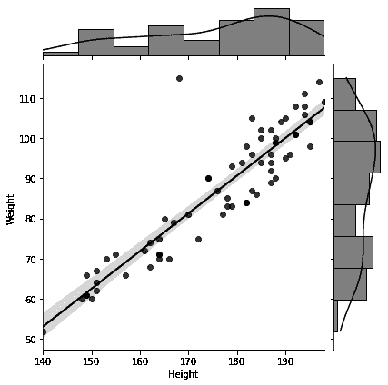

# 第二章。数据，数据，数据

> *也许如果我知道一切的来龙去脉，我就会知道一切的发展方向和原因。*

数据是大多数 AI 系统的动力源。在本章中，我们将了解数据以及设计从数据中提取有用和可操作信息的方法，这是*感知* AI 的核心。

*感知 AI*基于从数据中进行统计学习，其中 AI 代理或机器从其环境中感知数据，然后检测数据中的模式，使其能够得出结论和/或做出决策。

感知 AI 不同于其他三种类型的 AI：

1.  *理解* AI，AI 系统理解将图像分类为椅子意味着它可以用来坐，将图像分类为癌症意味着人生病需要进一步的医疗关注，或者它读过的线性代数教科书可以用来从数据中提取有用的信息。

1.  *控制* AI，涉及控制 AI 代理的物理部分，以便在空间中导航，打开门，倒咖啡等。机器人在这个领域取得了重大进展。我们需要用包括感知 AI 和理解 AI 的*大脑*来增强机器人，并将其连接到控制 AI。理想情况下，像人类一样，控制 AI 然后从其与环境的*物理*交互中学习，通过将该信息传递给其感知和理解系统，然后将控制命令传递给代理的控制系统。

1.  *意识* AI，其中 AI 代理具有类似于人类经历的内在体验。由于我们还不知道如何在数学上定义意识，因此在本书中我们根本不讨论这个概念。

理想情况下，真正类似于人类的智能结合了上述四个方面：感知，理解，控制和意识。本章和接下来的几章的主要重点是*感知 AI*。AI 和数据已经紧密结合，以至于现在常见的，尽管错误的，是将数据科学和 AI 视为同义词。

# AI 的数据

在许多流行的机器学习模型的核心，包括自 2012 年 AlexNet 以来重新引起人们关注的高度成功的神经网络，存在一个非常简单的数学问题：

***将给定的数据点拟合到适当的函数中（将输入映射到输出），从数据中捕捉重要信号并忽略噪音，然后确保该函数在新数据上表现良好。***

然而，复杂性和挑战来自各种来源。

假设和特征

生成数据的真实函数以及它实际依赖的所有特征都是未知的。我们只是观察数据，然后尝试估计生成它的假设函数。我们的函数试图学习数据中哪些特征对我们的预测、分类、决策或一般目的很重要。它还学习这些特征如何相互作用以产生观察到的结果。在这种情况下，人工智能的一个巨大潜力是它能够捕捉到人类通常不会注意到的数据特征之间的微妙相互作用，因为我们非常擅长观察强特征，但忽略更微妙的特征。例如，我们作为人类可以知道一个人的月收入影响他们偿还贷款的能力，但我们可能不会观察到他们的日常通勤或早晨例行公事对此也可能有非常重要的影响。一些特征之间的相互作用比其他的简单得多，比如线性相互作用。其他的则更复杂，是非线性的。从数学角度来看，无论我们的特征相互作用是简单的（线性）还是复杂的（非线性），我们的目标仍然是相同的：找到一个适合你的数据并能够在新数据上做出良好预测的假设函数。这里还有一个额外的复杂性：有许多假设函数可以*拟合*相同的数据集，我们如何知道选择哪一个？

性能

即使计算出一个适合我们数据的假设函数，我们如何知道它在新的未知数据上表现良好呢？我们如何知道选择哪种性能度量，并且在部署到真实世界后如何监控这种性能？真实世界的数据和场景并不都带有地面真相的标签，所以我们不能轻易衡量我们的人工智能系统是否表现良好并做出正确或适当的预测和决策。我们不知道如何衡量人工智能系统的结果。如果真实世界的数据和场景都带有地面真相的标签，那么我们都会失业，因为我们会知道在每种情况下该做什么，地球上会和平，我们会幸福地生活下去（实际上并非如此，我希望事情能够如此简单）。

数量

人工智能领域几乎所有的东西都是非常高维的！数据实例的数量、观察到的特征以及需要计算的未知权重可能都在百万级别，所需的计算步骤则在十亿级别。在这样大量数据上的高效存储、传输、探索、预处理、结构化和计算成为中心目标。此外，探索涉及高维数学函数的景观是一项非常艰巨的任务。

结构

现代世界创造的绝大部分数据都是非结构化的。它不是以易于查询的表格形式组织的，其中包含有标记的字段，比如姓名，电话号码，性别，年龄，邮政编码，房价，收入水平，*等等*。非结构化数据无处不在：社交媒体上的帖子，用户活动，文字文档，PDF 文件，图像，音频和视频文件，协作软件数据，交通，地震和天气数据，GPS，军事行动，电子邮件，即时通讯软件，移动聊天数据等等。其中一些例子，比如电子邮件数据，可以被视为半结构化的，因为电子邮件带有包括邮件元数据的标题：发件人，收件人，日期，时间，主题，内容类型，垃圾邮件状态，*等等*。此外，大量重要数据并不以数字格式可用，并且分散在多个不相互通信的数据库中。这里的例子包括历史军事数据，博物馆和医院记录。目前，我们正努力将我们的世界和城市数字化，以利用更多的人工智能应用。总的来说，从结构化和标记的数据中获得见解比从非结构化数据中获得见解更容易。挖掘非结构化数据需要创新技术，这些技术目前是数据科学，机器学习和人工智能领域的推动力。

# 真实数据*vs.*模拟数据

当我们处理数据时，非常重要的是要知道真实数据和模拟数据之间的区别。这两种类型的数据对于人类的发现和进步都非常宝贵。

真实数据

这些数据是通过真实世界观察收集的，使用测量设备，传感器，调查，结构化表格（如医学问卷），望远镜，成像设备，网站，股票市场，受控实验，*等等*。这些数据通常是不完美和嘈杂的，因为测量方法和仪器的不准确性和故障。从数学上讲，*我们不知道生成真实数据的确切函数或概率分布*，但我们可以使用模型，理论和模拟来假设它们。然后我们可以测试我们的模型，最终使用它们进行预测。

模拟数据

这是使用*已知*函数生成的数据，或者从*已知*概率分布中随机抽样得到的数据。在这里，我们有我们已知的数学函数（们），或者*模型*，我们将数值代入模型中以生成我们的数据点。例子很多：数值解决了模拟各种自然现象的偏微分方程，涵盖了各种规模，比如湍流流动，蛋白质折叠，热扩散，化学反应，行星运动，断裂材料，交通，甚至迪士尼电影动画（《冰雪奇缘》，《海洋奇缘》，*等等*）。

在本章中，我们提供了两个关于人类身高和体重数据的例子，以演示真实数据和模拟数据之间的区别。在第一个例子中，我们访问一个在线公共数据库，然后下载并探索两个包含真实个体身高和体重测量的真实数据集。在第二个例子中，我们根据我们假设的函数模拟了自己的身高和体重数据集：我们假设一个人的体重在数值上取决于他们的身高，这意味着当我们将体重数据与身高数据绘制在一起时，我们期望看到一个直线或平坦的视觉模式。

# 数学模型：线性*vs.*非线性

线性依赖模拟了世界上的平坦，比如一维直线、二维平面（称为*平面*）和更高维的超平面。线性函数的图形，它模拟了线性依赖，永远是平的，不会弯曲。每当你看到一个平的物体，比如桌子、杆、天花板，或者一堆数据点聚集在一条直线或一个平面周围，知道它们代表的函数是线性的。除了平的东西是非线性的，所以图形弯曲的函数是非线性的，而聚集在弯曲曲线或曲面周围的数据点必须是由非线性函数生成的。

线性函数的公式，代表了函数输出对*特征*或*变量*的线性依赖，非常容易写下来。这些特征在公式中只是它们自己，没有幂或根，并且没有嵌入在任何其他函数中，比如分数的分母、正弦、余弦、指数、对数或其他微积分函数。它们只能被*标量*（实数或复数，而不是向量或矩阵）相乘，并且可以相互加减。例如，一个依赖于三个特征<x 1，x 2>和<x 3>的线性函数可以写成：

<math alttext="dollar-sign f left-parenthesis x 1 comma x 2 comma x 3 right-parenthesis equals omega 0 plus omega 1 x 1 plus omega 2 x 2 plus omega 3 x 3 comma dollar-sign"><mrow><mi>f</mi> <mrow><mo>(</mo> <msub><mi>x</mi> <mn>1</mn></msub> <mo>,</mo> <msub><mi>x</mi> <mn>2</mn></msub> <mo>,</mo> <msub><mi>x</mi> <mn>3</mn></msub> <mo>)</mo></mrow> <mo>=</mo> <msub><mi>ω</mi> <mn>0</mn> <mo>+</mo> <msub><mi>ω</mi> <mn>1</mn> <msub><mi>x</mi> <mn>1</mn> <mo>+</mo> <msub><mi>ω</mi> <mn>2</mn> <msub><mi>x</mi> <mn>2</mn> <mo>+</mo> <msub><mi>ω</mi> <mn>3</mn> <msub><mi>x</mi> <mn>3</mn> <mo>,</mo></mrow></math>

其中参数<math alttext="omega 0，omega 1，omega 2"><mrow><msub><mi>ω</mi> <mn>0</mn> <mo>,</mo> <msub><mi>ω</mi> <mn>1</mn> <mo>,</mo> <msub><mi>ω</mi> <mn>2</mn></mrow></math>和<math alttext="omega 3"><msub><mi>ω</mi> <mn>3</mn></math>是标量数。这些参数，或*权重*<math alttext="omega 1，omega 2"><mrow><msub><mi>ω</mi> <mn>1</mn> <mo>,</mo> <msub><mi>ω</mi> <mn>2</mn></mrow></math>和<math alttext="omega 3"><msub><mi>ω</mi> <mn>3</mn></math> *线性组合*特征，并在添加*偏置*项<math alttext="omega 0"><msub><mi>ω</mi> <mn>0</mn></math>后产生<math alttext="f left-parenthesis x 1 comma x 2 comma x 3 right-parenthesis"><mrow><mi>f</mi> <mo>(</mo> <msub><mi>x</mi> <mn>1</mn> <mo>,</mo> <msub><mi>x</mi> <mn>2</mn> <mo>,</mo> <msub><mi>x</mi> <mn>3</mn> <mo>)</mo></mrow></math>的结果。换句话说，结果是由特征之间的*线性相互作用*<math alttext="x 1，x 2"><mrow><msub><mi>x</mi> <mn>1</mn> <mo>,</mo> <msub><mi>x</mi> <mn>2</mn></mrow></math>和<math alttext="x 3"><msub><mi>x</mi> <mn>3</mn></math>以及偏置产生的。

非线性函数的公式，表示函数输出对特征的非线性依赖，也很容易识别：一个或多个特征以非一次幂出现在函数公式中，或者与其他特征相乘或相除，或者嵌入在其他微积分函数中，如正弦、余弦、指数、对数等。以下是三个关于三个特征 x1，x2 和 x3 非线性依赖的函数的例子：

<math alttext="美元符号 1 期 f 左括号 x1，x2，x3 右括号等于 omega0 加 omega1 StartRoot x1 EndRoot 加 omega2 StartFraction x2 Over x3 EndFraction period dollar-sign"><mrow><mn>1</mn> <mo>。</mo> <mi>f</mi> <mrow><mo>（</mo> <msub><mi>x</mi> <mn>1</mn></msub> <mo>，</mo> <msub><mi>x</mi> <mn>2</mn></msub> <mo>，</mo> <msub><mi>x</mi> <mn>3</mn></msub> <mo>）</mo></mrow> <mo>=</mo> <msub><mi>ω</mi> <mn>0</mn></msub> <mo>+</mo> <msub><mi>ω</mi> <mn>1</mn></msub> <msqrt><msub><mi>x</mi> <mn>1</mn></msub></msqrt> <mo>+</mo> <msub><mi>ω</mi> <mn>2</mn></msub> <mfrac><msub><mi>x</mi> <mn>2</mn></msub> <msub><mi>x</mi> <mn>3</mn></msub></mfrac> <mo>。</mo></mrow></math><math alttext="美元符号 2 期 f 左括号 x1，x2，x3 右括号等于 omega0 加 omega1 x1 平方加 omega2 x2 平方加 omega3 x3 平方 period dollar-sign"><mrow><mn>2</mn> <mo>。</mo> <mi>f</mi> <mrow><mo>（</mo> <msub><mi>x</mi> <mn>1</mn></msub> <mo>，</mo> <msub><mi>x</mi> <mn>2</mn></msub> <mo>，</mo> <msub><mi>x</mi> <mn>3</mn></msub> <mo>）</mo></mrow> <mo>=</mo> <msub><mi>ω</mi> <mn>0</mn></msub> <mo>+</mo> <msub><mi>ω</mi> <mn>1</mn></msub> <msubsup><mi>x</mi> <mn>1</mn> <mn>2</mn></msubsup> <mo>+</mo> <msub><mi>ω</mi> <mn>2</mn></msub> <msubsup><mi>x</mi> <mn>2</mn> <mn>2</mn></msubsup> <mo>+</mo> <msub><mi>ω</mi> <mn>3</mn></msub> <msubsup><mi>x</mi> <mn>3</mn> <mn>2</mn></msubsup> <mo>。</mo></mrow></math><math alttext="美元符号 3 期 f 左括号 x1，x2，x3 右括号等于 omega1 e Superscript x1 Baseline 加 omega2 e Superscript x2 Baseline 加 omega3 cosine 左括号 x3 右括号 period dollar-sign"><mrow><mn>3</mn> <mo>。</mo> <mi>f</mi> <mrow><mo>（</mo> <msub><mi>x</mi> <mn>1</mn></msub> <mo>，</mo> <msub><mi>x</mi> <mn>2</mn></msub> <mo>，</mo> <msub><mi>x</mi> <mn>3</mn></msub> <mo>）</mo></mrow> <mo>=</mo> <msub><mi>ω</mi> <mn>1</mn></msub> <msup><mi>e</mi> <msub><mi>x</mi> <mn>1</mn></msub></msup> <mo>+</mo> <msub><mi>ω</mi> <mn>2</mn></msub> <msup><mi>e</mi> <msub><mi>x</mi> <mn>2</mn></msub></msup> <mo>+</mo> <msub><mi>ω</mi> <mn>3</mn></msub> <mo form="prefix">cos</mo> <mrow><mo>（</mo> <msub><mi>x</mi> <mn>3</mn></msub> <mo>）</mo></mrow> <mo>。</mo></mrow></math>

正如您所看到的，我们可以提出各种各样的非线性函数，以及与非线性交互相关的可能性是无限的。事实上，神经网络之所以成功，是因为它们能够捕捉数据特征之间的相关*非线性*交互。

我们将在整本书中使用上述符号和术语，因此您将非常熟悉线性组合、权重、特征以及特征之间的线性和非线性交互等术语。

# 一个真实数据的例子

您可以在[第二章的链接 Jupyter 笔记本](https://github.com/halanelson/Essential-Math-For-AI)中找到调查数据并生成图表的 Python 代码的两个示例。

# 注意：结构化数据

我们将在这里使用的身高、体重和性别的两个数据集是*结构化*数据集的示例。它们以行和列的形式组织。列包含特征，如体重、身高、性别、健康指数，*等等*。行包含每个数据实例的特征分数，也就是每个人的情况。另一方面，一堆音频文件、Facebook 帖子、图像或视频都是非结构化数据集的示例。

我从数据科学家的[Kaggle 网站](https://www.kaggle.com)下载了两个数据集。这两个数据集都包含了一定数量的个体的身高、体重和性别信息。我的目标是了解一个人的体重如何取决于他们的身高。从数学上讲，我想要写出一个公式，将体重作为一个特征，即身高的函数：

数学符号“美元符号重量等于 f 左括号高度右括号逗号美元符号”

因此，如果我得到一个*新*人的身高，我将能够*预测*他们的体重。当然，人的体重除了身高之外还取决于其他特征，比如他们的性别、饮食习惯、锻炼习惯、遗传倾向，*等等*。但是，对于我下载的数据集，我们只有身高、体重和性别数据可用。除非我们想要寻找更详细的数据集，或者出去收集新数据，我们必须使用我们手头的数据。此外，这个例子的目标只是为了说明真实数据和模拟数据之间的差异。当我们有更深入的目标时，我们将使用更多特征的更复杂的数据集。

对于[第一个数据集](https://www.kaggle.com/yersever/500-person-gender-height-weight-bodymassindex)，我在图 2-1 中绘制了体重列与身高列，得到了似乎完全没有模式的结果！

###### 图 2-1。当绘制[第一个数据集](https://www.kaggle.com/yersever/500-person-gender-height-weight-bodymassindex)的体重与身高时，我们无法检测到模式。散点图上方和右侧的图显示了身高和体重数据的直方图和经验分布。

对于[第二个数据集](https://www.kaggle.com/mustafaali96/weight-height)，我做了同样的事情，我可以在图 2-2 中明显观察到线性依赖。数据点似乎聚集在一条直线周围！

###### 图 2-2。当绘制[第二个数据集](https://www.kaggle.com/mustafaali96/weight-height)的体重与身高时，我们观察到线性模式。请注意，体重数据的经验分布绘制在图的右侧，身高数据的经验分布绘制在图的顶部。两者似乎都有两个峰值（双峰），表明存在混合分布。实际上，身高和体重数据集都可以使用两个正态分布的混合来建模，称为高斯混合，代表混合男性和女性数据的基础分布。因此，如果我们单独绘制女性或男性亚群的数据，就像图 2-6 中那样，我们会观察到身高和体重数据呈正态分布（钟形）。

发生了什么？为什么我的第一个真实数据集完全没有反映出人的身高和体重之间的任何依赖关系，但我的第二个数据集反映出了线性依赖？我们需要深入研究数据。

这是处理真实数据时面临的许多挑战之一。我们不知道是什么函数生成了数据，以及为什么数据看起来是这个样子。我们调查、获得洞察力、检测模式（如果有的话），并提出一个假设函数。然后我们测试我们的假设，如果根据我们的性能指标表现良好，我们就将其部署到现实世界中。我们使用我们部署的模型进行预测，直到新数据告诉我们我们的假设不再有效为止，在这种情况下，我们调查更新的数据，并提出一个新的假设。只要我们的模型在运行，这个过程和反馈循环就会继续下去。

在转向模拟数据之前，让我们解释一下为什么第一个数据集似乎对个体的身高和体重之间的关系没有任何见解。经过进一步检查，我们注意到数据集中有过多指数分数为 4 和 5 的个体，指的是肥胖和极度肥胖。因此，我决定按指数分数拆分数据，并为所有具有相似指数分数的个体绘制体重与身高的图。这一次，在图 2-3 中明显地显示了身高和体重之间的线性依赖关系，谜团得到了解决。这可能会让人觉得我们在通过个体的指数分数进行条件处理来获得线性关系，但在数据探索的名义下，一切都是公平竞争。

###### 图 2-3。当为[第一个数据集](https://www.kaggle.com/yersever/500-person-gender-height-weight-bodymassindex)中具有相似指数分数的个体绘制体重与身高时，我们观察到了线性模式。这张图显示了指数分数为 3 的个体的体重与身高。

现在我们可以放心地假设体重是线性依赖于身高的：

<math alttext="dollar-sign w e i g h t equals omega 0 plus omega 1 times h e i g h t period dollar-sign"><mrow><mi>w</mi> <mi>e</mi> <mi>i</mi> <mi>g</mi> <mi>h</mi> <mi>t</mi> <mo>=</mo> <msub><mi>ω</mi> <mn>0</mn></msub> <mo>+</mo> <msub><mi>ω</mi> <mn>1</mn></msub> <mo>×</mo> <mi>h</mi> <mi>e</mi> <mi>i</mi> <mi>g</mi> <mi>h</mi> <mi>t</mi> <mo>.</mo></mrow></math>

当然，我们还需要找到参数<math alttext="omega 0"><msub><mi>ω</mi> <mn>0</mn></msub></math>和<math alttext="omega 1"><msub><mi>ω</mi> <mn>1</mn></msub></math>的适当值。下一章将教会我们如何做到这一点。事实上，机器学习，包括深度学习，的大部分活动都是关于*从数据中学习*这些<math alttext="omega"><mi>ω</mi></math>。在我们非常简单的例子中，我们只需要学习两个<math alttext="omega"><mi>ω</mi></math>，因为我们只有一个特征，身高，并且在观察到真实数据中的线性模式后，我们*假设*了线性依赖关系。在接下来的几章中，我们将遇到一些有数百万个<math alttext="omega"><mi>ω</mi></math>需要学习的深度学习网络，然而，我们将看到问题的数学结构实际上与我们将在第三章中学到的完全相同的结构。

# 模拟数据的一个例子

在这个例子中，我模拟了自己的身高-体重数据集。模拟我们自己的数据可以避免在网上搜索数据、现实世界中寻找数据，甚至建立实验室以获得受控的测量数据的麻烦。当所需数据不可用或非常昂贵时，这是非常有价值的。它还可以通过只改变函数中的数字来测试不同的场景，而不是创建新材料、建立实验室并进行新实验。模拟数据非常方便，因为我们只需要一个数学函数，如果我们想要涉及随机性和/或噪声，还需要一个概率分布，以及一台计算机。

让我们再次假设身高和体重之间存在线性依赖关系，因此我们将使用的函数是：

<math alttext="重量等于 omega 0 加 omega 1 乘以高度"><mrow><mi>w</mi> <mi>e</mi> <mi>i</mi> <mi>g</mi> <mi>h</mi> <mi>t</mi> <mo>=</mo> <msub><mi>ω</mi> <mn>0</mn></msub> <mo>+</mo> <msub><mi>ω</mi> <mn>1</mn></msub> <mo>×</mo> <mi>h</mi> <mi>e</mi> <mi>i</mi> <mi>g</mi> <mi>h</mi> <mi>t</mi> <mo>.</mo></mrow></math>

为了能够模拟数值<math alttext="（高度，重量）"><mrow><mo>(</mo> <mi>h</mi> <mi>e</mi> <mi>i</mi> <mi>g</mi> <mi>h</mi> <mi>t</mi> <mo>,</mo> <mi>w</mi> <mi>e</mi> <mi>i</mi> <mi>g</mi> <mi>h</mi> <mi>t</mi> <mo>)</mo></mrow></math>对，或者数据点，我们必须假设参数<math alttext="omega 0"><msub><mi>ω</mi> <mn>0</mn></msub></math>和<math alttext="omega 1"><msub><mi>ω</mi> <mn>1</mn></msub></math>的数值。在没有来自真实数据的见解来选择这些<math alttext="omega"><mi>ω</mi></math>的正确值时，我们只能根据问题的背景做出合理的猜测并尝试不同的数值。请注意，在本例中的身高体重情况下，我们碰巧有真实数据可以用来学习<math alttext="omega"><mi>ω</mi></math>的适当值，第三章的一个目标就是学习如何做到这一点。然而，在许多其他情况下，我们没有真实数据，所以唯一的方法就是尝试不同的<math alttext="omega"><mi>ω</mi></math>的数值。

在以下模拟中，我们设置<math alttext="omega 0 等于负 314.5"><mrow><msub><mi>ω</mi> <mn>0</mn></msub> <mo>=</mo> <mo>-</mo> <mn>314</mn> <mo>.</mo> <mn>5</mn></mrow></math>和<math alttext="omega 1 等于 7.07"><mrow><msub><mi>ω</mi> <mn>1</mn></msub> <mo>=</mo> <mn>7</mn> <mo>.</mo> <mn>07</mn></mrow></math>，所以函数变为：

<math alttext="重量等于负 314.5 加 7.07 乘以高度"><mrow><mi>w</mi> <mi>e</mi> <mi>i</mi> <mi>g</mi> <mi>h</mi> <mi>t</mi> <mo>=</mo> <mo>-</mo> <mn>314</mn> <mo>.</mo> <mn>5</mn> <mo>+</mo> <mn>7</mn> <mo>.</mo> <mn>07</mn> <mo>×</mo> <mi>h</mi> <mi>e</mi> <mi>i</mi> <mi>g</mi> <mi>h</mi> <mi>t</mi> <mo>.</mo></mrow></math>

现在我们可以生成尽可能多的数值<math alttext="left-parenthesis h e i g h t comma w e i g h t right-parenthesis"><mrow><mo>(</mo> <mi>h</mi> <mi>e</mi> <mi>i</mi> <mi>g</mi> <mi>h</mi> <mi>t</mi> <mo>,</mo> <mi>w</mi> <mi>e</mi> <mi>i</mi> <mi>g</mi> <mi>h</mi> <mi>t</mi> <mo>)</mo></mrow></math>对，我们想要。例如，将<math alttext="h e i g h t equals 60"><mrow><mi>h</mi> <mi>e</mi> <mi>i</mi> <mi>g</mi> <mi>h</mi> <mi>t</mi> <mo>=</mo> <mn>60</mn></mrow></math>插入重量函数的公式中，我们得到<math alttext="w e i g h t equals negative 314.5 plus 7.07 times 60 equals 109.7"><mrow><mi>w</mi> <mi>e</mi> <mi>i</mi> <mi>g</mi> <mi>h</mi> <mi>t</mi> <mo>=</mo> <mo>-</mo> <mn>314</mn> <mo>.</mo> <mn>5</mn> <mo>+</mo> <mn>7</mn> <mo>.</mo> <mn>07</mn> <mo>×</mo> <mn>60</mn> <mo>=</mo> <mn>109</mn> <mo>.</mo> <mn>7</mn></mrow></math>。因此，我们的线性模型*预测*，身高为 60 英寸的人体重为<math alttext="109.7"><mrow><mn>109</mn> <mo>.</mo> <mn>7</mn></mrow></math>磅，我们可以在身高体重图上绘制的数据点的坐标为<math alttext="left-parenthesis 60 comma 109.7 right-parenthesis"><mrow><mo>(</mo> <mn>60</mn> <mo>,</mo> <mn>109</mn> <mo>.</mo> <mn>7</mn> <mo>)</mo></mrow></math>。在图 2-4 中，我们生成了 5000 个这些数据点：我们选择了身高在 54 至 79 英寸之间的 5000 个值，并将它们代入重量函数。我们注意到图 2-4 中的图是一条完美的直线，模拟数据中没有噪音或变化，因为我们没有将这些因素纳入我们的线性模型中。这是模拟数据的特点：它做了生成它的函数所做的事情。如果我们了解我们用来构建模拟的函数（称为*模型*）以及我们的计算没有积累太多的数值误差和/或非常大的数值，那么我们就了解了我们的模型生成的数据，并且我们可以以任何我们认为合适的方式使用这些数据。这里没有太多的惊喜。在我们的例子中，我们提出的函数是线性的，因此它的方程式是一条直线的方程式，正如你在图 2-4 中看到的，生成的数据完全位于这条直线上。

###### 图 2-4。模拟数据：我们使用线性函数<math alttext="w e i g h t equals negative 314.5 plus 7.07 times h e i g h t"><mrow><mi>w</mi> <mi>e</mi> <mi>i</mi> <mi>g</mi> <mi>h</mi> <mi>t</mi> <mo>=</mo> <mo>-</mo> <mn>314</mn> <mo>.</mo> <mn>5</mn> <mo>+</mo> <mn>7</mn> <mo>.</mo> <mn>07</mn> <mo>×</mo> <mi>h</mi> <mi>e</mi> <mi>i</mi> <mi>g</mi> <mi>h</mi> <mi>t</mi></mrow></math>生成了五千个（身高，体重）点。

如果我们想要模拟更真实的身高和体重数据呢？那么我们可以从更真实的人类身高分布中对身高值进行抽样：钟形正态分布！同样，我们*知道*我们正在抽样的概率分布，这与真实数据的情况不同。在我们抽样身高值之后，我们将其代入体重的线性模型中，然后添加一些噪音，因为我们希望我们的模拟数据更加真实。由于噪音具有随机性质，因此我们还必须选择它将从哪个概率分布中抽样。我们再次选择钟形正态分布，但我们也可以选择均匀分布来模拟均匀的随机波动。我们更真实的身高体重模型变为：

<math alttext="dollar-sign w e i g h t equals negative 314.5 plus 7.07 times h e i g h t plus n o i s e period dollar-sign"><mrow><mi>w</mi> <mi>e</mi> <mi>i</mi> <mi>g</mi> <mi>h</mi> <mi>t</mi> <mo>=</mo> <mo>-</mo> <mn>314</mn> <mo>.</mo> <mn>5</mn> <mo>+</mo> <mn>7</mn> <mo>.</mo> <mn>07</mn> <mo>×</mo> <mi>h</mi> <mi>e</mi> <mi>i</mi> <mi>g</mi> <mi>h</mi> <mi>t</mi> <mo>+</mo> <mi>n</mi> <mi>o</mi> <mi>i</mi> <mi>s</mi> <mi>e</mi> <mo>.</mo></mrow></math>

我们获得图 2-5。

###### 图 2-5。模拟数据：我们使用线性函数<math alttext="w e i g h t equals negative 314.5 plus 7.07 times h e i g h t"><mrow><mi>w</mi> <mi>e</mi> <mi>i</mi> <mi>g</mi> <mi>h</mi> <mi>t</mi> <mo>=</mo> <mo>-</mo> <mn>314</mn> <mo>.</mo> <mn>5</mn> <mo>+</mo> <mn>7</mn> <mo>.</mo> <mn>07</mn> <mo>×</mo> <mi>h</mi> <mi>e</mi> <mi>i</mi> <mi>g</mi> <mi>h</mi> <mi>t</mi></mrow></math>生成了五千个（身高，体重）点。身高点是正态分布的，我们也添加了正态分布的噪声。请注意图的右侧和顶部分别的体重和身高数据的分布都是正态分布的。这并不奇怪，因为我们在模拟中就是这样设计的。

现在比较包含我们模拟的身高体重数据的图 2-5 和包含来自我们使用的[第二个 Kaggle 数据集](https://www.kaggle.com/mustafaali96/weight-height)中 5000 名女性真实身高体重数据的图 2-6。考虑到只花了五分钟的代码编写来生成这些数据，情况还不错，而不是收集真实数据！如果我们花更多时间调整我们的<math alttext="omega"><mi>ω</mi></math>的值，以及我们添加的正态分布噪声的参数（均值和标准差），我们将获得一个看起来更好的模拟数据集。然而，我们将在这里结束这个模拟，因为很快我们的整个重点将是*学习*我们假设模型的适当参数值。

###### 图 2-6。真实数据：[第二个 Kaggle 数据集](https://www.kaggle.com/mustafaali96/weight-height)中 5000 名女性的体重数据与身高数据的图。请注意图的右侧和顶部分别的女性体重和身高数据的分布都是正态分布的。请查看[链接的 Jupyter 笔记本](https://github.com/halanelson/Essential-Math-For-AI)以获取更多详细信息。

# 数学模型：模拟和人工智能

我们总是可以调整我们的数学模型使其更加现实。我们是设计者，所以我们决定这些模型中包含什么。通常情况下，模型越接近自然，其中包含的数学对象就越多。因此，在构建数学模型时，通常需要在接近现实和模型的简单性以及数学分析和计算的可访问性之间进行权衡。不同的设计者提出不同的数学模型，有些模型比其他模型更好地捕捉了某些现象。随着捕捉自然行为的探索不断进行，这些模型不断改进和演变。值得庆幸的是，过去几十年中我们的计算能力已经大大提高，使我们能够创建和测试更复杂和更现实的数学模型。

自然同时非常细致和巨大。自然界的相互作用范围从亚原子量子领域一直到星系间的相互作用。我们作为人类，永远试图理解自然，并捕捉其复杂的组成部分及其众多的相互联系和相互作用。我们这样做的原因是多种多样的。它们从对生命和宇宙起源的纯好奇，到创造新技术，增强通信系统，设计药物和发现治疗方法，建造武器和防御系统，到未来可能前往遥远行星并在那里居住。数学模型以仅仅使用数字、函数、方程式来描述自然的所有细节的方式，以及在面对不确定性时通过概率引入量化的随机性，提供了一种极好而几乎奇迹般的方式。这些数学模型的计算机模拟使我们能够研究和可视化所建模系统或现象的各种简单和复杂行为。反过来，来自计算机模拟的见解有助于模型的增强和设计，除了提供更深入的数学见解。这种令人难以置信的积极反馈循环使数学建模和模拟成为一种不可或缺的工具，而我们的计算能力的增强使其得到了极大的增强。

宇宙的奥秘在于，它的各种现象可以用数学的抽象语言准确地建模，而人类的头脑之所以了解和理解数学，并构建强大的技术设备，对各种应用都有用，这也是一个奇迹。同样令人印象深刻的是，这些设备在其核心上所做的无非是计算或传输数学，更具体地说，就是一堆零和一。

人类能够将对简单数字的理解推广到建立和应用各种规模的自然现象的数学模型，这是学习知识的*泛化*的一个壮观例子，也是人类智慧的标志。在人工智能领域，通用人工智能（类似人类）和狭义人工智能（特定任务导向）的一个共同目标是*泛化*：人工智能代理能够将学到的能力推广到新的和未知的情况。在下一章中，我们将了解狭义和任务导向人工智能的这一原则：*人工智能代理从数据中学习，然后为新的和未见过的数据产生良好的预测*。

人工智能以三种方式与数学模型和模拟进行交互：

1.  *数学模型和模拟产生数据，供人工智能系统进行训练*：自动驾驶汽车被一些人认为是人工智能的一个基准。让智能汽车原型车在没有人工智能系统学会这些不利事件必须避免之前，开车冲下悬崖，撞到行人，或者撞上新的工作区域，这将是不方便的。在这里，模拟数据的训练尤其有价值，因为模拟可以为汽车创造各种危险的虚拟情况，供其在上路之前进行训练。同样，模拟数据对于火星车、药物发现、材料设计、天气预报、航空、军事训练等人工智能系统的训练非常有帮助。

1.  人工智能增强了现有的数学模型和模拟：人工智能在传统上对数学模型和模拟困难和限制的领域有很大潜力，例如学习模型中涉及的参数的适当值、适当的概率分布、在离散化方程时的网格形状和大小（细网格捕捉各种空间和时间尺度上的细节和微妙行为），以及将计算方法扩展到更长的时间或具有复杂形状的更大领域。诸如导航、航空、金融、材料科学、流体动力学、运筹学、分子和核科学、大气和海洋科学、天体物理学、物理和网络安全等领域都严重依赖数学建模和模拟。将人工智能能力整合到这些领域正在开始，并取得了非常积极的成果。在本书的后面章节中，我们将遇到人工智能增强模拟的例子。

1.  人工智能本身是一个数学模型和模拟：人工智能的一个重要愿景是通过计算来复制人类智能。成功的机器学习系统，包括神经网络及其所有架构和变体，都是旨在模拟人类智能相关任务的数学模型，如视觉、模式识别和泛化、自然语言交流和逻辑推理。理解、情感体验、共情和合作也与智能相关，并且对人类的成功和统治做出了巨大贡献，因此如果我们想实现通用人工智能并同时更深入地了解智能的本质和人脑的运作，我们也必须找到复制它们的方法。在这些领域的努力已经在进行中。我们要记住的是，在所有这些领域，机器所做的是计算：机器计算自然语言处理文档的含义，组合和计算计算机视觉的数字图像像素，将音频信号转换为数字向量并计算人机交互的新音频，等等。因此很容易看出，软件人工智能是一个大型数学模型和模拟。随着我们在本书中的进展，这一点将变得更加明显。

# 我们的数据从哪里获取？

当我决定进入人工智能领域时，我想要运用我的数学知识来帮助解决我热衷的现实世界问题。我在战争中长大，看到许多问题的爆发、破坏，然后最终消散或得到解决，要么通过直接修复，要么通过人类网络的调整并最终稳定在全新的（不稳定的）平衡状态。战争中常见的问题包括对不同供应链的突然和大规模破坏，大部分电网的突然毁坏，通过有针对性的炸桥导致整个道路网络的突然瘫痪，恐怖网络的突然出现，黑市、贩卖、通货膨胀和贫困的突然出现。数学在这些情况下可以帮助解决的问题数量是无限的，包括战争战术和战略。在美国的安全环境下，我拥有数学博士学位，并在大学任教，我开始接触公司、政府机构和军方，寻找真实的项目和真实的数据来进行研究。我提出免费帮助他们解决问题。我不知道的是，我以艰难的方式学到的，获取真实数据是最大的障碍。有许多法规、隐私问题、机构审查委员会和其他障碍阻碍着我们。即使跳过了所有这些障碍，公司、机构和组织也倾向于保留他们的数据，即使他们知道他们没有充分利用它，我们几乎不得不乞求才能获取真实数据。结果证明，我遇到的经历并不是独一无二的。同样的事情也发生在这个领域的许多其他人身上。

以上故事并不是要阻止你获取训练 AI 系统所需的真实数据。重点不是要让你在遇到数据所有者的犹豫和抵抗时感到惊讶和沮丧。继续询问，总会有人愿意冒险一试。

有时你需要的数据可以在网上公开获取。在本章中，我使用了[Kaggle](https://www.kaggle.com)网站的数据集来构建简单的模型。还有其他很棒的公共数据存储库，我就不一一列举了，但是简单的谷歌搜索关键词“最佳数据存储库”会返回出色的结果。一些存储库专门用于计算机视觉，其他用于自然语言处理、音频生成和转录、科学研究等等。

在网上获取数据是常见的，但你必须遵守你爬取的网站的规则。你还必须学会如何爬取（有人说数据科学家和统计学家的区别在于数据科学家知道如何“黑客”！）。有些网站要求你在爬取之前获得书面许可。例如，如果你对社交媒体用户行为或合作网络感兴趣，你可以爬取社交媒体和专业网络：Facebook、Instagram、YouTube、Flickr、LinkedIn 等等，以获取用户账户的统计数据，比如他们的朋友或联系人数量，点赞、评论以及他们在这些网站上的活动。你最终会得到包含数十万条记录的非常庞大的数据集，然后你可以进行计算。

为了直观地了解数据如何集成到人工智能中，以及进入各种系统的数据类型，同时避免被所有信息和数据所压倒，有益的是养成一个习惯，即探索成功的人工智能系统所训练的数据集，如果可以的话。你不必下载并处理这些数据。浏览数据集、其元数据、特征和标签（如果有的话）等就足以让你对数据感到舒适。例如，DeepMind 的[WaveNet](https://deepmind.com/blog/article/wavenet-generative-model-raw-audio)(2016)是一个神经网络，可以生成真实的人声或愉悦的音乐。它可以完成文本到音频的转换，甚至可以模仿特定人的声音。我们将在第七章学习 WaveNet 时了解条件的数学含义。现在，可以将其视为对问题施加的人为限制，以将结果限制在一定的结果集中。那么 WaveNet 是在哪些数据上训练的呢？对于不受文本条件限制的多说话者音频生成，WaveNet 是在包含来自 109 位不同说话者的 44 小时音频的数据集上进行训练的：[英语多说话者语料库来自 CSTR Voice Cloning Toolkit](https://datashare.ed.ac.uk/handle/10283/3443)(2012)。对于文本转语音，WaveNet 是在包含 24 小时语音数据的[北美英语数据集](https://catalog.ldc.upenn.edu/LDC2009V01)和包含 34.8 小时语音数据的[中文数据集](https://www.openslr.org/68/)上进行训练的。对于生成音乐，WaveNet 是在包含来自 YouTube 视频的 60 小时独奏钢琴音乐的数据集和包含约 200 小时音乐音频的[MagnaTagATune 数据集](https://mirg.city.ac.uk/codeapps/the-magnatagatune-dataset)(2009)上进行训练的。标记数据对于人工智能系统非常有价值，因为它提供了一个基准来衡量你的假设函数的输出。我们将在接下来的几节中学习这一点。

那么著名的图像分类（用于计算机视觉）AlexNet（2012）呢？它的卷积神经网络是在哪些数据上进行训练和测试的？AlexNet 是在包含数百万图像（从互联网上获取）并标记了数千个类别的[ImageNet](https://www.image-net.org/about.php)数据集上进行训练的。

请注意，上述示例都是关于非结构化数据的示例。

如果某个系统所训练的数据不是公开可用的，最好查阅该系统的发表论文或文档，并了解所需数据是如何获取的。这本身就会让你学到很多。

在继续进行数学之前，请记住以下要点：

1.  人工智能系统需要数字数据。

1.  有时，你需要的数据并不容易获取。

1.  有一个数字化我们整个世界的运动。

# 数据分布、概率和统计的词汇

当你进入一个新的领域时，你想要学习的第一件事是该领域的词汇。这类似于学习一门新语言。你可以在课堂上学习，然后受苦，或者你可以去一个说这种语言的国家，听频繁使用的术语。你不必知道法语中的“Bonjour”是什么意思。但当你在法国时，你会注意到人们经常互相说这个词，所以你也开始说。有时候你可能不会在正确的上下文中使用它，比如当你必须说“Bonsoir”而不是“Bonjour”。但慢慢地，当你发现自己在法国呆得越来越久时，你会在正确的上下文中使用正确的词汇。

尽快学习词汇的另一个优势是，不一定要掌握任何细节，因为不同领域用不同的术语指代相同的概念，因此存在大量的词汇冲突。这最终成为混淆的一个重要来源，因此体现了*语言障碍*。当你学习该领域的常用词汇时，你会意识到你可能已经了解这些概念，只是现在你有了新的名称。

你想要了解的概率和统计学的词汇术语并不多。我会在我们使用它时定义每个术语，但请注意，概率论的目标是对随机或随机数量和事件做出确定性的陈述，因为人类讨厌不确定性，喜欢他们的世界是可控和可预测的。当你阅读有关人工智能、机器学习或数据科学的内容时，留意以下来自概率和统计领域的语言。再次强调，你不必立刻了解任何定义，你只需要听到以下术语，并熟悉它们在彼此之后的进展方式：

+   一切都始于*随机变量*。数学家们不停地谈论函数。函数有确定的结果。当你评估一个函数时，你知道它将返回什么值：在 3 处评估函数<math alttext="x squared"><msup><mi>x</mi> <mn>2</mn></msup></math>，你可以肯定会得到<math alttext="3 squared equals 9"><mrow><msup><mn>3</mn> <mn>2</mn></msup> <mo>=</mo> <mn>9</mn></mrow></math>。另一方面，随机变量没有确定的结果。它们的结果是不确定的、不可预测的或随机的。当你调用一个随机变量时，你在实际看到结果之前不知道它将返回什么值。由于你不再能够追求确定性，你可以追求的是量化得到某个结果的可能性有多大。例如，当你掷骰子时，你可以自信地说你得到 4 的机会是 1/6，假设你掷的骰子没有被篡改。你在实际掷骰子之前永远不知道你会得到什么结果。如果知道的话，赌场就会破产，金融部门就会取消其整个预测分析和风险管理部门。就像确定性函数一样，随机变量可以返回离散集合的结果（离散随机变量）或连续集合的结果（连续随机变量）。随机变量和函数之间的关键区别在于结果的随机性*vs.*确定性。

+   在随机变量之后，我们为连续随机变量定义*概率密度函数*，为离散随机变量定义*概率质量函数*。我们都称之为*分布*，以增加我们的困惑。通常，一个分布代表离散还是连续随机变量是从上下文中理解的。使用这个术语，我们有时会说一个随机变量，无论是连续还是离散的，是从一个概率分布中*抽样*，多个随机变量是从一个*联合概率分布*中抽样。在实践中，我们很少知道我们数据中涉及的所有随机变量的完整联合概率分布。当我们知道，或者我们能够*学习*它时，这是一件强大的事情。

+   *边际概率分布*就像坐落在联合概率分布的边缘上（如果我们用包含所涉变量所有组合状态的概率的表来表示联合概率分布，例如[此维基百科页面](https://en.wikipedia.org/wiki/Marginal_distribution)上的第一个表）。在这种情况下，你很幸运能够访问多个随机变量的完整联合概率分布，并且你有兴趣找出其中一个或几个的概率分布。你可以使用概率的*求和规则*轻松地找到这些*边际概率分布*，例如：

<math alttext="dollar-sign p left-parenthesis x right-parenthesis equals sigma-summation Underscript y element-of all states of y Endscripts p left-parenthesis x comma y right-parenthesis dollar-sign"><mrow><mi>p</mi> <mrow><mo>(</mo> <mi>x</mi> <mo>)</mo></mrow> <mo>=</mo> <msub><mo>∑</mo> <mrow><mi>y</mi><mo>∈</mo><mtext>all</mtext><mtext>states</mtext><mtext>of</mtext><mtext>y</mtext></mrow></msub> <mi>p</mi> <mrow><mo>(</mo> <mi>x</mi> <mo>,</mo> <mi>y</mi> <mo>)</mo></mrow></mrow></math>

+   *均匀分布*和*正态分布*是最受欢迎的连续分布，因此我们从它们开始。正态分布和概率论中的基本*中心极限定理*密切相关。在我们的数据中涉及的许多其他有用分布代表不同的随机变量，但我们不需要立即使用它们，所以我们推迟到需要使用它们时再讨论。

+   一旦我们开始处理多个随机变量（例如我们的性别、身高、体重和健康指数数据），这几乎总是情况，我们引入*条件概率*、*贝叶斯定理或定理*和条件概率的*乘积或链规则*；

+   还有*独立和条件独立的随机变量*的概念（知道一个变量的值不会改变另一个变量的概率）。

+   条件概率和联合分布都涉及多个随机变量，因此它们之间有某种联系是有意义的：切割联合概率分布的图表（当我们固定一个变量的值时），我们得到一个条件概率分布（见图 _slice_joint）。

# 非常重要的一点：贝叶斯定理 *vs.* 联合概率分布

如果我们恰好可以访问我们设置中关心的所有多个随机变量的完整联合概率分布，那么我们就不需要贝叶斯定理。换句话说，贝叶斯定理帮助我们计算所需的条件概率*当我们无法访问*所涉随机变量的完整联合概率分布时。

+   从逻辑和数学的角度来看，我们可以定义条件概率，然后顺利进行我们的计算和生活。然而，从业者根据他们是在对已观察到的数据进行条件概率还是对他们仍需要估计的权重（也称为参数）进行条件概率，给不同的条件概率赋予不同的名称。这里的词汇包括：*先验分布*（在观察任何数据之前，模型权重的一般概率分布），*后验分布*（给定观察数据的权重的概率分布），以及*似然函数*（编码给定特定权重分布的情况下观察数据点的概率）。所有这些都可以通过贝叶斯定理以及联合分布来联系起来。

# 注：我们说似然函数*不是*似然分布。

我们将似然性称为函数，而不是分布，因为概率分布*必须*加起来为一（或者如果我们处理连续随机变量，则积分为一），但似然函数不一定加起来为一（或者在连续随机变量的情况下积分为一）。

+   我们可以混合概率分布并产生*分布混合物*。*高斯混合*非常有名。上面包含男性和女性身高测量值的身高数据就是高斯混合的一个很好的例子。

+   我们可以将从简单分布中抽样的随机变量相加或相乘，以产生具有更复杂分布的新随机变量，代表更复杂的随机事件。通常在这里调查的自然问题是：*随机变量的和或积的分布是什么？*

+   最后，我们使用有向和无向图表示来有效地分解联合概率分布。这使得我们的计算生活变得更加便宜和可处理。

+   对于概率、统计和数据科学来说，有四个关键的量：*期望*和*均值*，用于量化平均值，以及*方差*和*标准差*，用于量化围绕平均值的扩散，因此编码不确定性。我们的目标是控制方差，以减少不确定性。方差越大，使用平均值进行预测时可能犯的错误就越多。因此，当你探索这个领域时，你经常会注意到数学陈述、不等式和定理主要涉及对涉及随机性的任何量的期望和方差的一些控制。

+   当我们有一个随机变量及其相应的概率分布时，我们计算*期望*（预期平均结果）、*方差*（与预期平均值的平方距离的期望）和*标准差*（与平均值的期望距离）。对于已经抽样或观察到的数据，例如上面的身高和体重数据，我们计算*样本均值*（平均值）、方差（与均值的平方距离的平均值）和标准差（与均值的平均距离，因此这测量了均值周围的扩散）。因此，如果我们关心的数据尚未被抽样或观察到，我们使用*期望*的语言进行推测，但如果我们已经有了观察或测量的样本，我们计算其*统计量*。自然地，我们对我们的推测与我们计算出的观察数据的统计量有多大偏差感兴趣，以及在极限（但理想化）情况下，我们实际上可以测量整个人口的数据。*大数定律*为我们解答了这个问题，并告诉我们，在这种极限情况下（样本量趋于无穷大时），我们的期望与样本均值相匹配。

+   当我们有两个或更多的随机变量时，我们计算*协方差*、*相关性*和*协方差矩阵*。这时，线性代数领域的向量、矩阵和矩阵分解（如特征值和奇异值分解）的语言与概率和统计领域结合在一起。每个随机变量的方差都位于协方差矩阵的对角线上，每对可能的协方差都位于对角线之外。协方差矩阵是对称的。当你对其进行对角化时，使用标准线性代数技术，你会*去相关*涉及的随机变量。

+   与此同时，我们暂停一下，确保我们知道独立性和零协方差之间的区别。协方差和相关性都是关于捕捉两个随机变量之间的线性关系。相关性适用于*标准化*的随机变量，这样我们即使随机变量或数据测量具有非常不同的尺度，仍然可以检测到线性关系。当你对数量进行标准化时，它的尺度就不再重要了。无论它是以百万为单位还是以 0.001 为单位测量都无关紧要。协方差适用于未标准化的随机变量。生活并不都是线性的。独立性比零协方差更强。

+   *马尔可夫过程*对于人工智能的强化学习范式非常重要。它们的特征是系统的所有可能状态，代理可以执行的所有可能动作的集合（向左移动、向右移动，*等*），*包含所有状态之间转移概率的矩阵*，或者代理在采取某个动作后将转移到哪个状态的概率分布，以及一个奖励函数，我们希望最大化。人工智能中的两个流行例子包括棋盘游戏和*智能*恒温器，如 NEST。我们将在强化学习章节中介绍这些内容。

# 注：标准化、缩放和/或标准化随机变量或数据集

这是许多情况下词汇冲突的一个例子。在各种上下文中，标准化、缩放和标准化通常是同义词。目标总是相同的。从数据或随机变量的所有可能结果中减去一个数字（偏移），然后除以一个常数（比例）。如果你从数据样本的均值（或随机变量的期望）中减去并除以它们的标准差，那么你会得到新的*标准化*或*归一化*数据值（或新的标准化或归一化的随机变量），它们的均值等于零（或期望值等于零），标准差等于一。如果你减去最小值并除以范围（最大值减去最小值），那么你会得到新的数据值或新的随机变量，其结果都在零和一之间。有时我们谈论标准化数字向量。在这种情况下，我们的意思是我们将向量中的每个数字除以向量本身的长度，这样我们就得到一个长度为一的新向量。因此，无论我们说我们正在标准化、缩放还是标准化一组数字，目标都是尝试控制这些数字的值，并将它们居中在零周围，并/或限制它们的扩散小于或等于一，同时保留它们固有的变异性。

数学家喜欢用抛硬币、掷骰子、从瓮中取球、从牌组中抽牌、火车到站、顾客打电话、顾客点击广告或网站链接、疾病及其症状、刑事审判和证据，以及直到某事发生的时间等概率概念。不要感到惊讶，这些例子随处可见，因为它们很好地概括了许多其他现实生活情况。

除了上述概率理论的映射，我们还将从统计力学（例如*分区函数*）和信息论（例如信号*vs.*噪声、熵和*交叉熵函数*）中借用很少的术语和函数。我们将在后面的章节中遇到它们时进行解释。

# 连续分布*vs.*离散分布（密度*vs.*质量）

当我们处理连续分布时，重要的是使用诸如观察或抽样*接近*或*围绕*某个值的数据点的术语，而不是观察或抽样*确切*的值。实际上，在这种情况下观察到确切值的概率为零。

当我们的数字处于连续状态时，一个值和下一个值之间没有离散的分隔。实数具有无限的精度。例如，如果我测量一个男性的身高，得到 6 英尺，我就不知道我的测量是精确的 6 英尺，还是 6.00000000785 英尺，或者是 5.9999111134255 英尺。最好将我的观察设置在 6 英尺左右的一个区间内，例如 5.95 < height < 6.05，然后量化在 5.95 英尺和 6.05 英尺之间观察到的概率。

对于离散随机变量，我们不必担心这种情况，因为我们可以轻松地将可能的值彼此分开。例如，当我们掷骰子时，我们的可能值是 1、2、3、4、5 或 6。因此，我们可以自信地断言掷出确切的 5 的概率为 1/6。此外，离散随机变量可以具有非数值结果，例如，当我们抛硬币时，我们的可能值是正面或反面。连续随机变量只能具有数值结果。

由于上述推理，当我们有一个连续的随机变量时，我们定义它的概率*密度*函数，而不是其概率*质量*函数，就像离散随机变量的情况一样。密度指定了在一定长度、面积或空间体积内存在多少物质（取决于我们所处的维度）。为了找到指定区域内的物质质量，我们将密度与所考虑区域的长度、面积或体积相乘。如果我们给定了每个无限小区域的密度，那么我们必须对整个区域进行积分，以便找到该区域内的质量，因为积分类似于对无限多个无限小区域进行求和。

我们将在概率章节中详细阐述这些想法，并在数学上对其进行形式化。目前，我们强调以下几点：

+   如果我们只有一个连续的随机变量，比如某一人口中男性的身高，那么我们使用一维概率密度函数来表示其概率分布：<math alttext="f left-parenthesis x 1 right-parenthesis"><mrow><mi>f</mi> <mo>(</mo> <msub><mi>x</mi> <mn>1</mn></msub> <mo>)</mo></mrow></math>。为了找到身高在 5.95 < height < 6.05 之间的概率，我们对区间（5.95，6.05）上的概率密度函数<math alttext="f left-parenthesis x 1 right-parenthesis"><mrow><mi>f</mi> <mo>(</mo> <msub><mi>x</mi> <mn>1</mn></msub> <mo>)</mo></mrow></math>进行积分，我们写成：

<math alttext="dollar-sign upper P left-parenthesis 5.95 less-than h e i g h t less-than 6.05 right-parenthesis equals integral Subscript 5.95 Superscript 6.05 Baseline f left-parenthesis x 1 right-parenthesis d x 1 period dollar-sign"><mrow><mi>P</mi> <mrow><mo>(</mo> <mn>5</mn> <mo>.</mo> <mn>95</mn> <mo><</mo> <mi>h</mi> <mi>e</mi> <mi>i</mi> <mi>g</mi> <mi>h</mi> <mi>t</mi> <mo><</mo> <mn>6</mn> <mo>.</mo> <mn>05</mn> <mo>)</mo></mrow> <mo>=</mo> <msubsup><mo>∫</mo> <mrow><mn>5</mn><mo>.</mo><mn>95</mn></mrow> <mrow><mn>6</mn><mo>.</mo><mn>05</mn></mrow></msubsup> <mi>f</mi> <mrow><mo>(</mo> <msub><mi>x</mi> <mn>1</mn></msub> <mo>)</mo></mrow> <mi>d</mi> <msub><mi>x</mi> <mn>1</mn></msub> <mo>.</mo></mrow></math>

+   如果我们有两个连续随机变量，比如某一人群中男性的身高和体重，或者一个人的真实身高和测量身高（通常包括随机噪声），那么我们使用一个二维概率密度函数来表示它们的*联合概率分布*：<math alttext="f left-parenthesis x 1 comma x 2 right-parenthesis"><mrow><mi>f</mi> <mo>(</mo> <msub><mi>x</mi> <mn>1</mn></msub> <mo>,</mo> <msub><mi>x</mi> <mn>2</mn></msub> <mo>)</mo></mrow></math>。因此，为了找到身高在 5.95 < height < 6.05 *和* 体重在 160 < weight < 175 之间的联合概率，我们对联合概率密度函数<math alttext="f left-parenthesis x 1 comma x 2 right-parenthesis"><mrow><mi>f</mi> <mo>(</mo> <msub><mi>x</mi> <mn>1</mn></msub> <mo>,</mo> <msub><mi>x</mi> <mn>2</mn></msub> <mo>)</mo></mrow></math>进行*双重积分*，假设我们知道<math alttext="f left-parenthesis x 1 comma x 2 right-parenthesis"><mrow><mi>f</mi> <mo>(</mo> <msub><mi>x</mi> <mn>1</mn></msub> <mo>,</mo> <msub><mi>x</mi> <mn>2</mn></msub> <mo>)</mo></mrow></math>的公式，对区间(5.95, 6.05)和(160,175)进行积分，并写成：

<math alttext="dollar-sign upper P left-parenthesis 5.95 less-than h e i g h t less-than 6.05 comma 160 less-than w e i g h t less-than 175 right-parenthesis equals integral Subscript 160 Superscript 175 Baseline integral Subscript 5.95 Superscript 6.05 Baseline f left-parenthesis x 1 comma x 2 right-parenthesis d x 1 d x 2 period dollar-sign"><mrow><mi>P</mi> <mrow><mo>(</mo> <mn>5</mn> <mo>.</mo> <mn>95</mn> <mo><</mo> <mi>h</mi> <mi>e</mi> <mi>i</mi> <mi>g</mi> <mi>h</mi> <mi>t</mi> <mo><</mo> <mn>6</mn> <mo>.</mo> <mn>05</mn> <mo>,</mo> <mn>160</mn> <mo><</mo> <mi>w</mi> <mi>e</mi> <mi>i</mi> <mi>g</mi> <mi>h</mi> <mi>t</mi> <mo><</mo> <mn>175</mn> <mo>)</mo></mrow> <mo>=</mo> <msubsup><mo>∫</mo> <mrow><mn>160</mn></mrow> <mn>175</mn></msubsup> <msubsup><mo>∫</mo> <mrow><mn>5</mn><mo>.</mo><mn>95</mn></mrow> <mrow><mn>6</mn><mo>.</mo><mn>05</mn></mrow></msubsup> <mi>f</mi> <mrow><mo>(</mo> <msub><mi>x</mi> <mn>1</mn></msub> <mo>,</mo> <msub><mi>x</mi> <mn>2</mn></msub> <mo>)</mo></mrow> <mi>d</mi> <msub><mi>x</mi> <mn>1</mn></msub> <mi>d</mi> <msub><mi>x</mi> <mn>2</mn></msub> <mo>.</mo></mrow></math>

+   如果我们有两个以上的连续随机变量，那么我们使用更高维的概率密度函数来表示它们的联合分布。例如，如果我们有某一人群中男性的身高、体重和血压，那么我们使用一个三维联合概率分布函数：<math alttext="f left-parenthesis x 1 comma x 2 comma x 3 right-parenthesis"><mrow><mi>f</mi> <mo>(</mo> <msub><mi>x</mi> <mn>1</mn></msub> <mo>,</mo> <msub><mi>x</mi> <mn>2</mn></msub> <mo>,</mo> <msub><mi>x</mi> <mn>3</mn></msub> <mo>)</mo></mrow></math>。类似于上述两个项目的推理，为了找到第一个随机变量在<math alttext="a less-than x 1 less-than b"><mrow><mi>a</mi> <mo><</mo> <msub><mi>x</mi> <mn>1</mn></msub> <mo><</mo> <mi>b</mi></mrow></math>之间的联合概率，第二个随机变量在<math alttext="c less-than x 2 less-than d"><mrow><mi>c</mi> <mo><</mo> <msub><mi>x</mi> <mn>2</mn></msub> <mo><</mo> <mi>d</mi></mrow></math>之间，第三个随机变量在<math alttext="e less-than x 3 less-than f"><mrow><mi>e</mi> <mo><</mo> <msub><mi>x</mi> <mn>3</mn></msub> <mo><</mo> <mi>f</mi></mrow></math>之间，我们对区间(a,b)、(c,d)和(e,f)上的联合概率密度函数进行*三重积分*，并写成：

<math alttext="dollar-sign upper P left-parenthesis a less-than x 1 less-than b comma c less-than x 2 less-than d comma e less-than x 3 less-than f right-parenthesis equals integral Subscript e Superscript f Baseline integral Subscript c Superscript d Baseline integral Subscript a Superscript b Baseline f left-parenthesis x 1 comma x 2 comma x 3 right-parenthesis d x 1 d x 2 d x 3 period dollar-sign"><mrow><mi>P</mi> <mrow><mo>(</mo> <mi>a</mi> <mo><</mo> <msub><mi>x</mi> <mn>1</mn></msub> <mo><</mo> <mi>b</mi> <mo>,</mo> <mi>c</mi> <mo><</mo> <msub><mi>x</mi> <mn>2</mn></msub> <mo><</mo> <mi>d</mi> <mo>,</mo> <mi>e</mi> <mo><</mo> <msub><mi>x</mi> <mn>3</mn></msub> <mo><</mo> <mi>f</mi> <mo>)</mo></mrow> <mo>=</mo> <msubsup><mo>∫</mo> <mrow><mi>e</mi></mrow> <mi>f</mi></msubsup> <msubsup><mo>∫</mo> <mrow><mi>c</mi></mrow> <mi>d</mi></msubsup> <msubsup><mo>∫</mo> <mrow><mi>a</mi></mrow> <mi>b</mi></msubsup> <mi>f</mi> <mrow><mo>(</mo> <msub><mi>x</mi> <mn>1</mn></msub> <mo>,</mo> <msub><mi>x</mi> <mn>2</mn></msub> <mo>,</mo> <msub><mi>x</mi> <mn>3</mn></msub> <mo>)</mo></mrow> <mi>d</mi> <msub><mi>x</mi> <mn>1</mn></msub> <mi>d</mi> <msub><mi>x</mi> <mn>2</mn></msub> <mi>d</mi> <msub><mi>x</mi> <mn>3</mn></msub> <mo>.</mo></mrow></math>

+   我们定义了连续随机变量的概率密度函数后，我们并没有消除所有的担忧（即数学上的加法）。再次，罪魁祸首是实数的无限精度。如果我们允许*所有集合*都有概率，我们会遇到悖论，因为我们可以构造不相交的集合（如分形形状的集合或通过变换有理数集合而构成的集合），它们的概率总和超过了 1！必须承认，这些集合是病态的，必须由有充裕时间的人仔细构造，但是，它们存在并产生悖论。数学中的*测度论*提供了一个数学框架，我们可以在其中使用概率密度函数而不会遇到悖论。它定义了零测度集合（这些集合在我们工作的空间中不占体积），然后给我们提供了许多定理，允许我们在*几乎所有地方*进行计算，即除了零测度集合。这对我们的应用来说已经足够了。

# 联合概率密度函数的威力

拥有许多随机变量的联合概率分布是一件强大但罕见的事情。原因是联合概率分布中包含了每个单独随机变量的概率分布（边际分布），以及我们在这些随机变量之间遇到的所有可能的共同发生（和条件概率）。这类似于从上方看到整个城镇，而不是在城镇内部观察两条或多条小巷之间的交叉口。

如果随机变量是独立的，那么联合分布就是它们各自的分布的乘积。然而，当随机变量不独立时，例如一个人的身高和体重，或者一个人的观测身高（包括测量误差）和一个人的真实身高（不包括误差），访问联合分布就会变得更加困难和昂贵。在依赖随机变量的情况下，联合分布是不可分的，因此我们不能仅仅单独存储它的每个部分。我们需要存储两个或更多变量之间每个共同发生的每个值。随着依赖随机变量数量的增加，存储需求（以及计算或搜索空间）呈指数增长，这是臭名昭著的*维度诅咒*的一种体现。

当我们*切割*联合概率密度函数，比如<math alttext="f left-parenthesis x 1 comma x 2 right-parenthesis"><mrow><mi>f</mi> <mo>(</mo> <msub><mi>x</mi> <mn>1</mn></msub> <mo>,</mo> <msub><mi>x</mi> <mn>2</mn></msub> <mo>)</mo></mrow></math>，意味着当我们固定一个随机变量（或在更高维度中固定更多）为一个确切的值时，我们会得到与*后验概率分布*（给定观察结果的模型参数的概率分布）成比例的分布，这通常是我们感兴趣的。例如，切割<math alttext="f left-parenthesis x 1 comma x 2 right-parenthesis"><mrow><mi>f</mi> <mo>(</mo> <msub><mi>x</mi> <mn>1</mn></msub> <mo>,</mo> <msub><mi>x</mi> <mn>2</mn></msub> <mo>)</mo></mrow></math>在<math alttext="x 1 equals a"><mrow><msub><mi>x</mi> <mn>1</mn></msub> <mo>=</mo> <mi>a</mi></mrow></math>时，我们得到<math alttext="f left-parenthesis a comma x 2 right-parenthesis"><mrow><mi>f</mi> <mo>(</mo> <mi>a</mi> <mo>,</mo> <msub><mi>x</mi> <mn>2</mn></msub> <mo>)</mo></mrow></math>，它恰好与概率分布<math alttext="f left-parenthesis x 2 vertical-bar x 1 equals a right-parenthesis"><mrow><mi>f</mi> <mo>(</mo> <msub><mi>x</mi> <mn>2</mn></msub> <mo>|</mo> <msub><mi>x</mi> <mn>1</mn></msub> <mo>=</mo> <mi>a</mi> <mo>)</mo></mrow></math>成比例（见图 2-7）。

###### 图 2-7。切割联合概率分布。

同样，这是在我们知道联合概率分布的奢侈情况下，否则，我们使用贝叶斯定理来获得相同的后验概率分布（使用先验分布和似然函数）。

在一些人工智能应用中，人工智能系统通过使用概率乘法规则将联合概率分布分解为条件概率的乘积来学习联合概率分布。一旦它学习了联合分布，它就会从中进行抽样，以生成新的有趣的数据。DeepMind 的 WaveNet 在生成原始音频的过程中就是这样做的。

接下来的部分介绍了人工智能应用中最有用的概率分布。两种普遍的连续分布是*均匀分布*和*正态分布*（也称为*高斯分布*），因此我们从这里开始。有关复制图表和更多细节，请参阅[Jupyter Notebook](https://github.com/halanelson/Essential-Math-For-AI)。

# 数据分布：均匀分布

为了直观地理解均匀分布，让我们举一个*非均匀*分布的例子，我们在本章前面已经看到过。在我们上面的真实身高体重数据集中，我们不能使用*均匀分布*来建模身高数据。我们也不能用它来建模体重数据。原因是人类的身高和体重并不是均匀分布的。在一般人群中，遇到身高约 7 英尺的人和遇到身高约 5 英尺 6 英寸的人并不是*同样可能*的。

*均匀分布*只模拟均匀分布的数据。如果我们有一个区间<mrow><mo>(</mo> <msub><mi>x</mi> <mrow><mi>m</mi><mi>i</mi><mi>n</mi></mrow></msub> <mo>,</mo> <msub><mi>x</mi> <mrow><mi>m</mi><mi>a</mi><mi>x</mi></mrow></msub> <mo>)</mo></mrow>，其中包含我们的数据在<msub><mi>x</mi> <mrow><mi>m</mi><mi>i</mi><mi>n</mi></mrow></msub>和<msub><mi>x</mi> <mrow><mi>m</mi><mi>a</mi><mi>x</mi></mrow></msub>之间的连续值，我们的数据在我们的区间内均匀分布，那么在我们的区间内观察到接近任何特定值的数据点的概率对于该区间内的所有值来说是相同的。也就是说，如果我们的区间是<mrow><mo>(</mo> <mn>0</mn> <mo>,</mo> <mn>1</mn> <mo>)</mo></mrow>，那么选择接近 0.2 的点和选择接近 0.75 的点是同样可能的。

因此，均匀分布的概率密度函数是常数。对于区间<mrow><mo>(</mo> <msub><mi>x</mi> <mrow><mi>m</mi><mi>i</mi><mi>n</mi></mrow></msub> <mo>,</mo> <msub><mi>x</mi> <mrow><mi>m</mi><mi>a</mi><mi>x</mi></mrow></msub> <mo>)</mo></mrow>上的一个随机变量 x，连续均匀分布的概率密度函数的公式如下：

<mrow><mi>f</mi> <mrow><mo>(</mo> <mi>x</mi> <mo>;</mo> <msub><mi>x</mi> <mrow><mi>m</mi><mi>i</mi><mi>n</mi></mrow></msub> <mo>,</mo> <msub><mi>x</mi> <mrow><mi>m</mi><mi>a</mi><mi>x</mi></mrow></msub> <mo>)</mo></mrow> <mo>=</mo> <mfrac><mn>1</mn> <mrow><msub><mi>x</mi> <mrow><mi>m</mi><mi>a</mi><mi>x</mi></mrow></msub> <mo>-</mo><msub><mi>x</mi> <mrow><mi>m</mi><mi>i</mi><mi>n</mi></mrow></msub></mrow></mfrac> <mtext>for</mtext> <msub><mi>x</mi> <mrow><mi>m</mi><mi>i</mi><mi>n</mi></mrow></msub> <mo><</mo> <mi>x</mi> <mo><</mo> <msub><mi>x</mi> <mrow><mi>m</mi><mi>a</mi><mi>x</mi></mrow></msub> <mo>,</mo>

在其他情况下为零。

让我们绘制均匀分布在区间<mrow><mo>(</mo> <msub><mi>x</mi> <mrow><mi>m</mi><mi>i</mi><mi>n</mi></mrow></msub> <mo>,</mo> <msub><mi>x</mi> <mrow><mi>m</mi><mi>a</mi><mi>x</mi></mrow></msub> <mo>)</mo></mrow>上的概率密度函数。图 2-8 中的图表是一条直线段，因为均匀分布的数据，无论是真实的还是模拟的，都在考虑的整个区间内均匀分布。区间内没有比其他更有利于出现的数据值。

###### 图 2-8。概率密度函数的图表，显示了在区间[0,1]上的均匀分布。

均匀分布在计算机模拟中非常有用，用于生成来自*任何其他概率分布*的随机数。如果你瞥一眼 Python 使用的随机数生成器，你会看到均匀分布在底层算法中的某个地方被使用。

# 数据分布：钟形正态（高斯）分布

连续概率分布更适合模拟人类身高数据（当限制为一种性别时）的是*钟形正态分布*，也称为*高斯分布*。从正态分布中抽样往往聚集在分布峰值处的平均值周围，称为*均值*<math alttext="mu"><mi>μ</mi></math>，然后随着远离均值而对称减少。分布在减少时扩散到离均值多远由正态分布的第二个参数控制，称为*标准差*<math alttext="sigma"><mi>σ</mi></math>。约 68%的数据落在均值的一个标准差范围内，95%的数据落在均值的两个标准差范围内，约 99.7%的数据落在均值的三个标准差范围内。

###### 图 2-9。参数为<math alttext="mu equals 0"><mrow><mi>μ</mi> <mo>=</mo> <mn>0</mn></mrow></math>和<math alttext="sigma equals 1"><mrow><mi>σ</mi> <mo>=</mo> <mn>1</mn></mrow></math>的钟形正态分布的概率密度函数图。

在从正态分布中抽取数据时，接近均值的值更有可能被选中（或发生或被观察到），而非常小（<math alttext="negative normal infinity"><mrow><mo>→</mo> <mo>-</mo> <mi>∞</mi></mrow></math>）或非常大（<math alttext="normal infinity"><mrow><mo>→</mo> <mi>∞</mi></mrow></math>）的值更不可能被选中。这种在分布的中心值附近出现的高峰和在分布的外围逐渐减小，使得这个分布具有其著名的钟形。请注意，还有其他钟形连续分布，但正态分布是最常见的。它有一个整洁的数学理由来解释这个当之无愧的名声，这是基于概率论中一个重要的定理，即*中心极限定理*。

中心极限定理表明，许多独立随机变量的平均值（不一定是正态分布）通常是正态分布的。这解释了为什么正态分布在社会和自然界中随处可见。它模拟了婴儿出生体重、学生成绩分布、国家收入分布、血压测量分布等。有特殊的统计测试可以帮助我们确定真实数据集是否可以用正态分布来建模。我们将在概率章节中进一步扩展这些想法。

如果你发现自己处于一个不确定的情况，并且对于你的应用程序不知道使用哪种分布，正态分布通常是一个合理的选择。实际上，在所有具有相同方差的分布选择中，正态分布是具有最大*不确定性*的选择，因此它实际上将最少的先验知识编码到你的模型中。

一个随机变量 x（单变量）的正态分布的概率密度函数公式为：

<math alttext="dollar-sign g left-parenthesis x semicolon mu comma sigma right-parenthesis equals StartFraction 1 Over StartRoot 2 pi sigma squared EndRoot EndFraction e Superscript minus StartFraction left-parenthesis x minus mu right-parenthesis squared Over 2 sigma squared EndFraction Baseline comma dollar-sign"><mrow><mi>g</mi> <mrow><mo>(</mo> <mi>x</mi> <mo>;</mo> <mi>μ</mi> <mo>,</mo> <mi>σ</mi> <mo>)</mo></mrow> <mo>=</mo> <mfrac><mn>1</mn> <msqrt><mrow><mn>2</mn><mi>π</mi><msup><mi>σ</mi> <mn>2</mn></msup></mrow></msqrt></mfrac> <msup><mi>e</mi> <mrow><mo>-</mo><mfrac><msup><mrow><mo>(</mo><mi>x</mi><mo>-</mo><mi>μ</mi><mo>)</mo></mrow> <mn>2</mn></msup> <mrow><mn>2</mn><msup><mi>σ</mi> <mn>2</mn></msup></mrow></mfrac></mrow></msup> <mo>,</mo></mrow></math>

参数为<math alttext="mu equals 0"><mrow><mi>μ</mi> <mo>=</mo> <mn>0</mn></mrow></math>和<math alttext="sigma equals 1"><mrow><mi>σ</mi> <mo>=</mo> <mn>1</mn></mrow></math>的图在图 2-9 中绘制出来。

两个随机变量 x 和 y（双变量）的正态分布的概率密度函数公式为：

数学符号“美元符号 g 左括号 x 逗号 y 分号 μ1 逗号 σ1 逗号 μ2 逗号 σ2 逗号 ρ 右括号 等于 分数 1 除以 开方 左括号 2π 右括号 平方 行列式 2 乘 2 矩阵 1 行 1 列 σ1 平方 2 列 ρσ1σ2 2 行 1 列 ρσ1σ2 2 列 σ2 平方 结束矩阵 开方 结束分数 e 上标负号 左大括号 一半 1 乘 2 矩阵 1 行 1 列 x 减去μ1 2 列 y 减去μ2 结束矩阵 2 乘 2 矩阵 1 行 1 列 σ1 平方 2 列 ρσ1σ2 2 行 1 列 ρσ1σ2 2 列 σ2 平方 结束矩阵 上标负 1 开合式 x 减去μ1 选择 y 减去μ2 结束式 美元符号”

并且它的图在图 2-10 中绘制。

我们可以使用线性代数的语言，用更紧凑的符号表示上述双变量公式。

<math alttext="dollar-sign g left-parenthesis x comma y semicolon mu comma normal upper Sigma right-parenthesis equals StartFraction 1 Over StartRoot left-parenthesis 2 pi right-parenthesis squared det left-parenthesis normal upper Sigma right-parenthesis EndRoot EndFraction e Superscript minus Baseline left-brace one-half left-parenthesis u minus mu right-parenthesis Superscript upper T Baseline normal upper Sigma Superscript negative 1 Baseline left-parenthesis u minus mu right-parenthesis right-brace dollar-sign"><mrow><mi>g</mi> <mrow><mo>(</mo> <mi>x</mi> <mo>,</mo> <mi>y</mi> <mo>;</mo> <mi>μ</mi> <mo>,</mo> <mi>Σ</mi> <mo>)</mo></mrow> <mo>=</mo> <mfrac><mn>1</mn> <msqrt><mrow><msup><mrow><mo>(</mo><mn>2</mn><mi>π</mi><mo>)</mo></mrow> <mn>2</mn></msup> <mo form="prefix" movablelimits="true">det</mo><mrow><mo>(</mo><mi>Σ</mi><mo>)</mo></mrow></mrow></msqrt></mfrac> <msup><mi>e</mi> <mo>-</mo></msup> <mfenced close="}" open="{" separators=""><mrow><mfrac><mn>1</mn> <mn>2</mn></mfrac> <msup><mrow><mo>(</mo><mi>u</mi><mo>-</mo><mi>μ</mi><mo>)</mo></mrow> <mi>T</mi></msup> <msup><mi>Σ</mi> <mrow><mo>-</mo><mn>1</mn></mrow></msup> <mrow><mo>(</mo> <mi>u</mi> <mo>-</mo> <mi>μ</mi> <mo>)</mo></mrow></mrow></mfenced></mrow></math>

###### 图 2-10。钟形双变量正态分布的概率密度函数图。

在图 2-11 中，我们从双变量正态分布中抽取了 6000 个点。

###### 图 2-11。从双变量正态分布中抽取 6000 个点。中心附近的点更有可能被选中，而远离中心的点被选中的可能性较小。这些线大致追踪了正态分布的轮廓线，如果我们只观察样本点而不知道它们是从哪个分布中抽取的。

让我们暂停一下，比较双变量正态分布的概率密度函数公式与单变量正态分布的概率密度函数公式：

+   当只有一个随机变量时，我们只有一个均值<math alttext="mu"><mi>μ</mi></math>和一个标准差<math alttext="sigma"><mi>σ</mi></math>。

+   当有两个随机变量时，我们有两个均值<math alttext="StartBinomialOrMatrix mu 1 Choose mu 2 EndBinomialOrMatrix"><mfenced close=")" open="("><mtable><mtr><mtd><msub><mi>μ</mi> <mn>1</mn></msub></mtd></mtr> <mtr><mtd><msub><mi>μ</mi> <mn>2</mn></msub></mtd></mtr></mtable></mfenced></math>，两个标准差<math alttext="StartBinomialOrMatrix sigma 1 Choose sigma 2 EndBinomialOrMatrix"><mfenced close=")" open="("><mtable><mtr><mtd><msub><mi>σ</mi> <mn>1</mn></msub></mtd></mtr> <mtr><mtd><msub><mi>σ</mi> <mn>2</mn></msub></mtd></mtr></mtable></mfenced></math>。乘积<math alttext="sigma squared"><msup><mi>σ</mi> <mn>2</mn></msup></math>将被协方差矩阵<math alttext="normal upper Sigma equals Start 2 By 2 Matrix 1st Row 1st Column sigma 1 squared 2nd Column rho sigma 1 sigma 2 2nd Row 1st Column rho sigma 1 sigma 2 2nd Column sigma 2 squared EndMatrix"><mrow><mi>Σ</mi> <mo>=</mo> <mfenced close=")" open="("><mtable><mtr><mtd><msubsup><mi>σ</mi> <mn>1</mn> <mn>2</mn></msubsup></mtd> <mtd><mrow><mi>ρ</mi> <msub><mi>σ</mi> <mn>1</mn></msub> <msub><mi>σ</mi> <mn>2</mn></msub></mrow></mtd></mtr> <mtr><mtd><mrow><mi>ρ</mi> <msub><mi>σ</mi> <mn>1</mn></msub> <msub><mi>σ</mi> <mn>2</mn></msub></mrow></mtd> <mtd><msubsup><mi>σ</mi> <mn>2</mn> <mn>2</mn></msubsup></mtd></mtr></mtable></mfenced></mrow></math>及其行列式所取代。<math alttext="rho"><mi>ρ</mi></math>是两个随机变量之间的相关性，即两个随机变量的标准化版本的协方差。

双变量正态分布的概率密度函数的完全相同的公式推广到任何维度，其中我们有许多随机变量而不仅仅是两个随机变量。例如，如果我们有 100 个随机变量，代表数据集中的 100 个特征，公式中的均值向量将有 100 个条目，并且协方差矩阵的大小将为 100×100，对角线上是每个随机变量的方差，而非对角线上是 4950 对随机变量的协方差。

# 数据分布：其他重要和常用的分布

在本章中你不理解的几乎所有内容都将在整本书中多次重访，第十一章专门讨论概率。这些概念将在各种有趣的背景中再次出现时得到强化。我们本章的目标是接触概率和统计的词汇，并为 AI 应用中经常出现的重要思想提供一个指导图。我们还希望在不必要的情况下获得对接下来的章节有一个良好的概率直觉，而不必深入研究和延迟我们的进展。

有许多概率分布。每个模型都代表不同类型的现实世界场景。均匀分布和正态分布非常常见，但我们还有其他重要的分布经常出现在 AI 领域。回想一下，我们的目标是模拟我们周围的世界，以便进行良好的设计、预测和/或决策。概率分布帮助我们在我们的模型涉及随机性或我们对结果不确定时进行预测。

当我们研究分布时，令人沮丧的一部分是大多数分布都有奇怪的名称，对于给定分布可能有用的现象提供零直觉。这使我们要么花费额外的精力来记住这些名称，要么在口袋里放一张分布备忘单。我更喜欢备忘单。另一个令人沮丧的部分是，大多数教科书例子都涉及抛硬币、掷骰子或从瓮中取出彩色球。这使我们没有真实生活的例子或动力来理解这个主题，因为我从未见过有人在那里抛硬币并数头或尾，除了《黑暗骑士》（一部 2008 年的非常好的电影，其中小丑（希斯·莱杰）说了一些我最喜欢和深刻的关于随机性和机会的声明，比如这个，“*世界是残酷的。在残酷的世界中，唯一的道德是机会。公正的。无偏见的。公平的*。”）。我会尽量在这本书中修正这一点，指出尽可能多的真实世界例子，以符合我的页面限制。

以下一些分布在数学上相关，或者自然地从其他分布中得出。我们将在第十章中探讨这些关系。现在，让我们命名一个流行的分布，说明它是离散的（预测我们关心的某种数量）还是连续的（预测存在于连续中的数量，例如某事发生前需要经过的时间：注意，这不是小时数，因为小时数是离散的，而是时间段的长度），说明控制它的参数，以及对我们的 AI 应用有用的定义属性。

+   二项分布：这是离散的。它表示在重复一次实验时，独立地多次进行时获得一定数量的成功的概率。它的控制参数是 n，我们进行的实验次数，以及*p*，*预先定义的*成功概率。现实世界的例子包括预测在临床试验中接种疫苗或新药物的患者出现副作用的数量，预测广告点击将导致购买的数量，或者客户在每月信用卡付款上违约的数量。当我们使用需要试验独立性的概率分布对现实世界的例子进行建模时，这意味着即使现实世界的试验并不真正独立，我们也*假设*独立。指出我们模型的假设是一个良好的礼仪。

+   泊松分布：这是离散的。它预测在一定时间内会发生的罕见事件的数量。这些事件是独立的或者弱相关的，这意味着事件的一次发生不会影响同一时间段内下一次发生的概率。它们也以*已知和恒定*的平均速率<math alttext="lamda"><mi>λ</mi></math>发生。因此，我们知道平均速率，并且想要预测在一定时间段内会发生多少*这样的*事件。泊松分布的控制参数是预先定义的罕见事件率<math alttext="lamda"><mi>λ</mi></math>。现实世界的例子包括预测在一个小时内出生的婴儿数量，一个人口中年满 98 岁以上的人数，一定时间段内从放射性系统中释放的α粒子数量，国税局发送的重复账单数量，某一天销售的不太受欢迎产品的数量，本书一页中包含的错别字数量，某一天某台机器生产的次品数量，某个小时进入商店的人数，保险公司需要在一定时间段内承担的车祸数量，以及在特定时间段内发生的地震数量。

+   几何分布：这是离散的。它预测了在进行独立试验时，在每次成功的*已知*概率 p 的情况下，我们获得成功之前需要的试验次数。这里的控制参数显然是成功的概率 p。现实世界的例子包括估计一家公司在不经历网络故障的情况下能够运作的周数，一台机器在生产次品之前能够运行的小时数，或者我们需要采访多少人才能遇到反对我们想通过的某项法案的人。同样，对于这些现实世界的例子，如果使用几何分布进行建模，我们可能会假设试验是独立的，而实际上试验可能并不是独立的。

+   指数分布：这是连续的。如果我们碰巧知道某个事件以恒定速率<math alttext="lamda"><mi>λ</mi></math>发生，那么指数分布预测了该事件发生的等待时间。它是“无记忆”的，因为属于指数分布的物品的剩余寿命也是指数分布。控制参数是恒定速率<math alttext="lamda"><mi>λ</mi></math>。现实世界的例子包括等待地震发生的时间，贷款违约的时间，机器零件失效的时间，或者恐怖袭击发生之前的时间。这对于可靠性领域非常有用，可用于计算某个机器零件的可靠性，因此会有“10 年保证”之类的说法。

+   威布尔分布：这是连续的。它在工程领域被广泛用于预测产品的寿命（10 年保修声明也适用于这里）。在这里，一个产品由许多部分组成，如果其中任何一个部分出现故障，那么产品就停止工作。例如，如果汽车的电池故障，或者变速箱中的保险丝烧断，汽车就无法工作。威布尔分布在考虑了许多部分及其*最薄弱环节*后，为汽车在停止工作之前的寿命提供了一个很好的近似值（假设我们不对汽车进行维护和重置计时器）。它由三个参数控制：形状、比例和位置参数。指数分布是这个分布的特例，因为指数分布具有恒定的事件发生率，但威布尔分布可以模拟随时间增加或减少的发生率。

+   对数正态分布：这是连续的。如果我们对该分布中提供的每个值取对数，那么我们得到的是正态分布的数据。这意味着起初你的数据可能看起来不是正态分布的，但尝试使用对数函数进行转换，然后你会看到正态分布的数据。当遇到偏斜数据、低均值、大方差和*仅假设正值*时，这是一个很好的分布。就像当你对一个随机变量的许多独立样本取平均值时会出现正态分布（使用中心极限定理），当你取许多正样本值的*乘积*时，就会出现对数正态分布。从数学上讲，这是由于对数函数的一个很棒的性质：乘积的对数是对数的和。这个分布由三个参数控制：形状、比例和位置参数。现实世界的例子包括石油储备中的气体体积，以及一天结束时证券价格与前一天结束时价格的比率。

+   卡方分布：这是连续的。这是一种用于正态分布独立随机变量平方和的分布。你可能会想为什么我们要关心平方正态分布的随机变量，然后把它们加起来。答案是这通常是我们计算随机变量或数据样本方差的方法，而我们的主要目标之一是控制方差，以降低我们的不确定性。与这个分布相关的有三种显著性检验：拟合优度检验，衡量我们的期望与观察结果的偏差程度，以及数据特征的独立性和均匀性检验。

+   帕累托分布：这是连续的。它对许多现实世界的应用非常有用，比如，完成分配给超级计算机的工作所需的时间（考虑机器学习计算）、特定人群的家庭收入水平、社交网络中的朋友数量以及互联网流量的文件大小。这个分布只由一个参数<math alttext="alpha"><mi>α</mi></math>控制，它是*重尾*的（其尾部比指数分布更重）。

在继续之前，让我们再加入一些其他分布，而不要为任何细节烦恼。这些都或多或少与前述分布相关：*学生 t-分布*（连续，类似于正态分布，但在样本量较小且总体方差未知时使用），*贝塔分布*（连续，在给定区间内产生随机值），*柯西分布*（连续，病态，因为它的均值和方差都未定义，可以使用随机选择的角的正切获得），*伽玛分布*（连续，与等待时间有关，直到发生 n 个独立事件，而不仅仅是一个事件，如指数分布），*负二项分布*（离散，与获得一定数量的成功所需的独立试验次数有关），*超几何分布*（离散，类似于二项分布，但试验不是独立的），以及*负超几何分布*（离散，捕捉在获得一定数量的成功之前需要的依赖试验次数）。

# *分布*一词的各种用法

您可能已经注意到，“分布”一词根据上下文指的是许多不同（但相关）的概念。同一个词的不一致使用可能会导致混淆，并且可能会立即使一些试图进入该领域的人望而却步。

让我们列出“分布”一词所指的不同概念，以便我们可以轻松地在特定上下文中识别其预期的含义：

+   如果您有真实数据，比如本章中的身高体重数据，并绘制数据集的一个特征的直方图，比如身高，那么您将得到身高数据的*经验分布*。您通常不知道整个人口身高的潜在概率密度函数，也称为分布，因为您拥有的真实数据只是该人口的样本，因此您尝试使用概率论给出的概率分布来估计它或对其进行建模。对于身高和体重特征，按性别分开时，高斯分布是合适的。

+   如果您有一个离散随机变量，“分布”一词可能指的是其概率质量函数或其累积分布函数（指定随机变量小于或等于某个值的概率 <math alttext="f left-parenthesis x right-parenthesis equals p r o b left-parenthesis upper X less-than-or-equal-to x right-parenthesis"><mrow><mi>f</mi> <mo>(</mo> <mi>x</mi> <mo>)</mo> <mo>=</mo> <mi>p</mi> <mi>r</mi> <mi>o</mi> <mi>b</mi> <mo>(</mo> <mi>X</mi> <mo>≤</mo> <mi>x</mi> <mo>)</mo></mrow></math> ）。

+   如果您有一个连续随机变量，“分布”一词可能指的是其概率密度函数或其累积分布函数，其积分给出了随机变量小于或等于某个值的概率。

+   如果您有多个随机变量（离散、连续或两者混合），那么“分布”一词指的是它们的联合概率分布。

一个共同的目标是建立一个理想化的数学函数，比如一个具有适当分布的随机变量，与真实观察到的数据或现象之间的适当对应关系，具有观察到的经验分布。在处理真实数据时，数据集的每个特征都可以使用随机变量进行建模。因此，在某种程度上，数学随机变量及其相应的分布是我们测量或观察到的特征的理想化版本。

最后，分布在人工智能应用中随处可见。在接下来的章节中，我们将多次遇到它们，例如神经网络每一层的权重分布，以及各种机器学习模型产生的噪音和误差的分布。

# A/B 测试

在离开本章之前，我们会稍微偏离一下，进入* A/B 测试*的世界，也称为*分割测试*，或*随机单盲*或*双盲试验*。我们会偏离一下，因为这是数据科学家重要的主题，而且这个想法足够简单，可以放在一个小节里。

无数家公司依靠 A/B 测试的数据来增加参与度、收入和客户满意度。微软、亚马逊、LinkedIn、谷歌等每年都进行数千次 A/B 测试。

A/B 测试很简单：将人群分成两组。将要测试的东西的一个版本（新的网页设计、不同的字体大小、新药、新的政治广告）推出给一个组，即测试组，而将另一组作为对照组。比较两组之间的数据。

如果受试者不知道他们属于哪个组（有些人甚至不知道他们根本在测试中），但实验者知道，那么这个测试就是*单盲*的。如果实验者和受试者都不知道他们正在与哪个组互动，那么这个测试就是*双盲*的。

# 总结和展望

在本章中，我们强调了数据对于人工智能的重要性。我们还澄清了通常会引起混淆的概念之间的区别：结构化和非结构化数据，线性和非线性模型，真实和模拟数据，确定性函数和随机变量，离散和连续分布，后验概率和似然函数。我们还提供了概率和统计学的地图，而没有深入任何细节，并介绍了最流行的概率分布。

如果你发现自己在某个新的概率概念中迷失了方向，你可能会想要查阅本章提供的地图，看看这个概念如何融入概率论的大局，最重要的是，它如何与人工智能相关。如果不知道某个数学概念如何与人工智能相关，你就只是拥有一个你知道如何打开的工具，但你不知道它用来做什么。

我们还没有提到*随机矩阵*和*高维概率*。在这些领域，概率论不断跟踪分布、期望和任何相关随机量的方差，与其对特征值和各种矩阵分解的超关注相结合。这些领域对于涉及人工智能应用中的极高维数据非常重要。我们在第十一章中讨论这些内容。

在下一章中，我们将学习如何将我们的数据拟合到一个函数中，然后使用这个函数进行预测和/或决策。从数学上讲，我们找到了表征我们数据特征之间各种相互作用强度的权重（<math alttext="omega"><mi>ω</mi></math>）。当我们表征了涉及的相互作用类型（拟合函数的公式，称为*学习*或*训练*函数）和这些相互作用的强度（<math alttext="omega"><mi>ω</mi></math>的值）时，我们就可以进行预测。在人工智能中，这个*用适当的权重值表征拟合函数*的概念可以成功地用于计算机视觉、自然语言处理、预测分析（比如房价、维护时间等），以及许多其他应用。
