# 第四章. 神经网络的优化

> *我已经活了我生命中的每一天进行优化...我的第一个顿悟是当我发现我们的大脑也会学习世界的模型。*

各种人工神经网络在其架构中具有全连接层。在本章中，我们解释全连接神经网络的数学原理，并通过一个真实数据集的端到端示例进行讲解。我们设计并尝试各种训练和损失函数。我们还解释了训练神经网络时使用的优化和反向传播步骤与我们大脑中学习的方式相似。大脑通过在面对之前见过的概念时加强神经元之间的连接来学习，并在学习到破坏或与之前学到的概念相矛盾的新信息时削弱连接。机器只能理解数字。从数学上讲，更强的连接对应于更大的数字，而更弱的连接对应于更小的数字。

最后，我们将介绍各种正则化技术，解释它们的优点、缺点和用例。

# 大脑皮层和人工神经网络

神经网络是模仿大脑皮层的结构，其中涉及数十亿个神经元排列成分层结构。图 4-1 显示了大脑新皮层的三个垂直横截面图像，图 4-2 显示了一个完全连接的人工神经网络的图表。

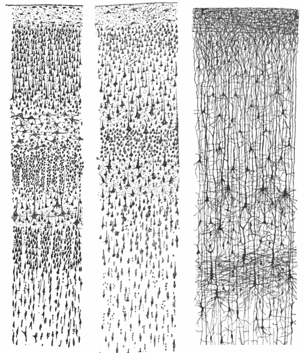

###### 图 4-1. Santiago Ramon y Cajal 绘制的三幅皮层层析图，摘自书籍《人类皮层感觉区域的比较研究》。每幅图显示了皮层的垂直横截面，皮层的表面（最靠近头骨的最外侧）位于顶部。左侧：染色的成年人视觉皮层。中间：染色的成年人运动皮层。右侧：一个半月大婴儿的 Golgi 染色皮层。Nissl 染色显示神经元的细胞体。Golgi 染色显示了一组随机神经元的树突和轴突。图片来源：[维基百科](https://commons.wikimedia.org/wiki/File:Cajal_cortex_drawings.png)。在所有三个横截面中，皮层中神经元的分层结构是显而易见的。

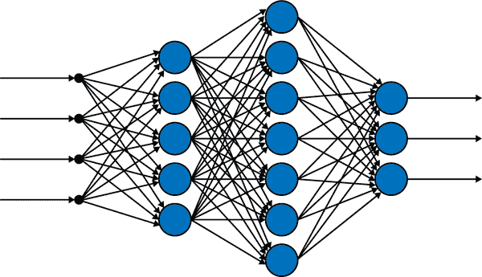

###### 图 4-2. 一个具有四层的全连接或密集的人工神经网络。

尽管大脑皮层的不同区域负责不同的功能，比如视觉、听觉感知、逻辑思维、语言、言语等，但实际上决定特定区域功能的是它的连接：它连接到哪些感觉和运动技能输入输出区域。这意味着，如果一个皮层区域连接到不同的感觉输入/输出区域，例如，一个视觉而不是听觉的地方，那么它将执行视觉任务（计算），而不是听觉任务。在非常简化的意义上，皮层在神经元水平上执行一个基本功能。在人工神经网络中，基本的计算单元是*感知器*，它在整个网络中的功能方式相同。神经网络（无论是大脑皮层还是人工神经网络）的各种连接、层和架构是使这些计算结构能够执行非常令人印象深刻的任务的原因。

# 训练功能：全连接或密集的前馈神经网络

在*全连接*或*密集*的人工神经网络中（参见图 4-2），每个神经元，由每一层中的节点（圆圈）表示，都连接到下一层中的所有神经元。第一层是输入层，最后一层是输出层，中间层称为*隐藏层*。神经网络本身，无论是全连接还是不全连接（我们将在接下来的几章中遇到的网络是*卷积*的，不是全连接的），都是表示训练函数公式的计算图。请记住，训练后我们使用这个函数进行预测。

在神经网络的背景下，训练意味着通过最小化损失函数找到进入训练函数公式的参数值或权重。这类似于我们在第三章中讨论的线性回归、逻辑回归、softmax 回归和支持向量机模型的训练。数学结构保持不变：

1.  训练函数

1.  损失函数

1.  优化

唯一的区别是，在第三章中简单模型的训练函数公式非常简单。它们线性组合数据特征，添加偏置项（<math alttext="omega 0"><msub><mi>ω</mi> <mn>0</mn></msub></math>），并将结果传递至最多一个非线性函数（例如，在逻辑回归中的逻辑函数）。因此，这些模型的结果也很简单：线性（平坦）函数用于线性回归，逻辑回归中不同类别之间的线性分界线，softmax 回归和支持向量机。即使我们使用这些简单模型来表示非线性数据，例如多项式回归（将数据拟合到特征的多项式函数中）或带有核技巧的支持向量机，我们仍然得到线性函数或分界线，但在更高的维度（对于多项式回归，维度将是特征及其幂）或转换后的维度（例如当我们使用支持向量机的核技巧时）。

另一方面，对于神经网络模型，线性组合特征、添加偏置项，然后通过非线性函数（现在称为*激活函数*）传递结果的过程是发生在*一个神经元*中的计算。这个简单的过程在成百上千、甚至数百万个神经元中一遍又一遍地发生，这些神经元排列在层中，其中一层的输出作为下一层的输入。类似于大脑皮层，许多神经元和层上的简单和相似过程的聚合产生了或允许了更复杂功能的表示。这有点神奇。幸运的是，我们能够比我们的大脑神经网络更多地了解人工神经网络，主要是因为我们设计它们，毕竟，人工神经网络只是一个数学函数。一旦我们在数学的镜头下剖析它，没有*黑匣子*会保持黑暗。也就是说，对人工神经网络的数学分析是一个相对较新的领域：仍有许多问题有待解答，还有很多待发现的东西。

## 神经网络是训练函数的计算图表示

即使是只有五个神经元的网络，比如图 4-3 中的网络，编写训练函数的公式也会非常混乱。这证明了使用计算图来有组织地、简单地表示神经网络的合理性。图表的特点是两个方面：节点和边（恭喜，这是图论中的第一课）。在神经网络中，连接第 m 层的节点 i 和第 n 层的节点 j 的边被赋予权重<math alttext="omega Subscript m n comma i j"><msub><mi>ω</mi> <mrow><mi>m</mi><mi>n</mi><mo>,</mo><mi>i</mi><mi>j</mi></mrow></msub></math>。这是一个边上的四个指标！为了避免淹没在指标的深海中，我们必须将神经网络的权重组织成矩阵。

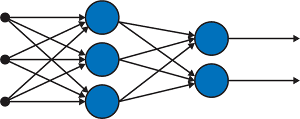

###### 图 4-3. 一个只有五个神经元的全连接（或密集）前馈神经网络，排列在三层中。第一层（最左边的三个黑点）是输入层，第二层是唯一的隐藏层，有三个神经元，最后一层是有两个神经元的输出层。

让我们建模一个*前馈*全连接神经网络的训练函数。前馈意味着信息通过代表网络训练函数的计算图向前传递。

## 线性组合，添加偏差，然后激活

当信息通过一个神经元流动时会发生什么样的计算：使用不同的权重线性组合输入信息，添加偏差项，然后使用非线性函数*激活*神经元。我们将逐步进行这个过程。

### 权重

让矩阵<math alttext="upper W Superscript 1"><msup><mi>W</mi> <mn>1</mn></msup></math>包含*incident to*隐藏层 1 的边的权重，<math alttext="upper W squared"><msup><mi>W</mi> <mn>2</mn></msup></math>包含*incident to*隐藏层 2 的边的权重，依此类推，直到达到输出层。

因此，对于图 4-3 中表示的小型神经网络，我们只有*h=1*个隐藏层，获得两个权重矩阵：

<math alttext="dollar-sign upper W Superscript 1 Baseline equals Start 3 By 3 Matrix 1st Row 1st Column omega 11 Superscript 1 Baseline 2nd Column omega 12 Superscript 1 Baseline 3rd Column omega 13 Superscript 1 Baseline 2nd Row 1st Column omega 21 Superscript 1 Baseline 2nd Column omega 22 Superscript 1 Baseline 3rd Column omega 23 Superscript 1 Baseline 3rd Row 1st Column omega 31 Superscript 1 Baseline 2nd Column omega 32 Superscript 1 Baseline 3rd Column omega 33 Superscript 1 Baseline EndMatrix and upper W Superscript h plus 1 Baseline equals upper W squared equals upper W Superscript o u t p u t Baseline equals Start 2 By 3 Matrix 1st Row 1st Column omega 11 squared 2nd Column omega 12 squared 3rd Column omega 13 squared 2nd Row 1st Column omega 21 squared 2nd Column omega 22 squared 3rd Column omega 23 squared EndMatrix comma dollar-sign"><mrow><msup><mi>W</mi> <mn>1</mn></msup> <mo>=</mo> <mfenced close=")" open="("><mtable><mtr><mtd><msubsup><mi>ω</mi> <mrow><mn>11</mn></mrow> <mn>1</mn></msubsup></mtd> <mtd><msubsup><mi>ω</mi> <mrow><mn>12</mn></mrow> <mn>1</mn></msubsup></mtd> <mtd><msubsup><mi>ω</mi> <mrow><mn>13</mn></mrow> <mn>1</mn></msubsup></mtd></mtr> <mtr><mtd><msubsup><mi>ω</mi> <mrow><mn>21</mn></mrow> <mn>1</mn></msubsup></mtd> <mtd><msubsup><mi>ω</mi> <mrow><mn>22</mn></mrow> <mn>1</mn></msubsup></mtd> <mtd><msubsup><mi>ω</mi> <mrow><mn>23</mn></mrow> <mn>1</mn></msubsup></mtd></mtr> <mtr><mtd><msubsup><mi>ω</mi> <mrow><mn>31</mn></mrow> <mn>1</mn></msubsup></mtd> <mtd><msubsup><mi>ω</mi> <mrow><mn>32</mn></mrow> <mn>1</mn></msubsup></mtd> <mtd><msubsup><mi>ω</mi> <mrow><mn>33</mn></mrow> <mn>1</mn></msubsup></mtd></mtr></mtable></mfenced> <mtext>and</mtext> <msup><mi>W</mi> <mrow><mi>h</mi><mo>+</mo><mn>1</mn></mrow></msup> <mo>=</mo> <msup><mi>W</mi> <mn>2</mn></msup> <mo>=</mo> <msup><mi>W</mi> <mrow><mi>o</mi><mi>u</mi><mi>t</mi><mi>p</mi><mi>u</mi><mi>t</mi></mrow></msup> <mo>=</mo> <mfenced close=")" open="("><mtable><mtr><mtd><msubsup><mi>ω</mi> <mrow><mn>11</mn></mrow> <mn>2</mn></msubsup></mtd> <mtd><msubsup><mi>ω</mi> <mrow><mn>12</mn></mrow> <mn>2</mn></msubsup></mtd> <mtd><msubsup><mi>ω</mi> <mrow><mn>13</mn></mrow> <mn>2</mn></msubsup></mtd></mtr> <mtr><mtd><msubsup><mi>ω</mi> <mrow><mn>21</mn></mrow> <mn>2</mn></msubsup></mtd> <mtd><msubsup><mi>ω</mi> <mrow><mn>22</mn></mrow> <mn>2</mn></msubsup></mtd> <mtd><msubsup><mi>ω</mi> <mrow><mn>23</mn></mrow> <mn>2</mn></msubsup></mtd></mtr></mtable></mfenced> <mo>,</mo></mrow></math>

上标表示边指向的层。请注意，如果输出层只有一个节点而不是两个，那么权重矩阵的最后一个矩阵将只是一个行向量：

<math alttext="dollar-sign upper W Superscript h plus 1 Baseline equals upper W squared equals upper W Superscript o u t p u t Baseline equals Start 1 By 3 Matrix 1st Row 1st Column omega 11 squared 2nd Column omega 12 squared 3rd Column omega 13 squared EndMatrix dollar-sign"><mrow><msup><mi>W</mi> <mrow><mi>h</mi><mo>+</mo><mn>1</mn></mrow></msup> <mo>=</mo> <msup><mi>W</mi> <mn>2</mn></msup> <mo>=</mo> <msup><mi>W</mi> <mrow><mi>o</mi><mi>u</mi><mi>t</mi><mi>p</mi><mi>u</mi><mi>t</mi></mrow></msup> <mo>=</mo> <mfenced close=")" open="("><mtable><mtr><mtd><msubsup><mi>ω</mi> <mrow><mn>11</mn></mrow> <mn>2</mn></msubsup></mtd> <mtd><msubsup><mi>ω</mi> <mrow><mn>12</mn></mrow> <mn>2</mn></msubsup></mtd> <mtd><msubsup><mi>ω</mi> <mrow><mn>13</mn></mrow> <mn>2</mn></msubsup></mtd></mtr></mtable></mfenced></mrow></math>

现在在这个神经网络的一个节点上进行两次计算：

1.  一个线性组合加上偏差。

1.  通过非线性激活函数（微积分中的复合运算）传递结果。

我们详细说明这两个，然后最终构建完全连接前馈神经网络的训练函数，该网络在图 4-3 中表示。

### 线性组合加偏差

在第一个隐藏层的第一个节点处（这个小网络的唯一隐藏层），我们线性组合输入：

<math alttext="dollar-sign z 1 Superscript 1 Baseline equals omega 11 Superscript 1 Baseline x 1 plus omega 12 Superscript 1 Baseline x 2 plus omega 13 Superscript 1 Baseline x 3 plus omega 01 Superscript 1 dollar-sign"><mrow><msubsup><mi>z</mi> <mn>1</mn> <mn>1</mn></msubsup> <mo>=</mo> <msubsup><mi>ω</mi> <mrow><mn>11</mn></mrow> <mn>1</mn></msubsup> <msub><mi>x</mi> <mn>1</mn></msub> <mo>+</mo> <msubsup><mi>ω</mi> <mrow><mn>12</mn></mrow> <mn>1</mn></msubsup> <msub><mi>x</mi> <mn>2</mn></msub> <mo>+</mo> <msubsup><mi>ω</mi> <mrow><mn>13</mn></mrow> <mn>1</mn></msubsup> <msub><mi>x</mi> <mn>3</mn></msub> <mo>+</mo> <msubsup><mi>ω</mi> <mrow><mn>01</mn></mrow> <mn>1</mn></msubsup></mrow></math>

在第一个隐藏层的第二个节点处，我们使用不同的权重线性组合输入：

<math alttext="dollar-sign z 2 Superscript 1 Baseline equals omega 21 Superscript 1 Baseline x 1 plus omega 22 Superscript 1 Baseline x 2 plus omega 23 Superscript 1 Baseline x 3 plus omega 02 Superscript 1 dollar-sign"><mrow><msubsup><mi>z</mi> <mn>2</mn> <mn>1</mn></msubsup> <mo>=</mo> <msubsup><mi>ω</mi> <mrow><mn>21</mn></mrow> <mn>1</mn></msubsup> <msub><mi>x</mi> <mn>1</mn></msub> <mo>+</mo> <msubsup><mi>ω</mi> <mrow><mn>22</mn></mrow> <mn>1</mn></msubsup> <msub><mi>x</mi> <mn>2</mn></msub> <mo>+</mo> <msubsup><mi>ω</mi> <mrow><mn>23</mn></mrow> <mn>1</mn></msubsup> <msub><mi>x</mi> <mn>3</mn></msub> <mo>+</mo> <msubsup><mi>ω</mi> <mrow><mn>02</mn></mrow> <mn>1</mn></msubsup></mrow></math>

在第一个隐藏层的第三个节点处，我们使用不同的权重线性组合输入：

<math alttext="dollar-sign z 3 Superscript 1 Baseline equals omega 31 Superscript 1 Baseline x 1 plus omega 32 Superscript 1 Baseline x 2 plus omega 33 Superscript 1 Baseline x 3 plus omega 03 Superscript 1 dollar-sign"><mrow><msubsup><mi>z</mi> <mn>3</mn> <mn>1</mn></msubsup> <mo>=</mo> <msubsup><mi>ω</mi> <mrow><mn>31</mn></mrow> <mn>1</mn></msubsup> <msub><mi>x</mi> <mn>1</mn></msub> <mo>+</mo> <msubsup><mi>ω</mi> <mrow><mn>32</mn></mrow> <mn>1</mn></msubsup> <msub><mi>x</mi> <mn>2</mn></msub> <mo>+</mo> <msubsup><mi>ω</mi> <mrow><mn>33</mn></mrow> <mn>1</mn></msubsup> <msub><mi>x</mi> <mn>3</mn></msub> <mo>+</mo> <msubsup><mi>ω</mi> <mrow><mn>03</mn></mrow> <mn>1</mn></msubsup></mrow></math>

让我们用向量和矩阵表示上述三个方程。这将极大方便我们后面的优化任务，当然也会保持我们的理智：

<math alttext="dollar-sign Start 3 By 1 Matrix 1st Row  z 1 Superscript 1 Baseline 2nd Row  z 2 Superscript 1 Baseline 3rd Row  z 3 Superscript 1 Baseline EndMatrix equals Start 3 By 1 Matrix 1st Row  omega 11 Superscript 1 Baseline 2nd Row  omega 21 Superscript 1 Baseline 3rd Row  omega 31 Superscript 1 Baseline EndMatrix x 1 plus Start 3 By 1 Matrix 1st Row  omega 12 Superscript 1 Baseline 2nd Row  omega 22 Superscript 1 Baseline 3rd Row  omega 32 Superscript 1 Baseline EndMatrix x 2 plus Start 3 By 1 Matrix 1st Row  omega 13 Superscript 1 Baseline 2nd Row  omega 23 Superscript 1 Baseline 3rd Row  omega 33 Superscript 1 Baseline EndMatrix x 3 plus Start 3 By 1 Matrix 1st Row  omega 01 Superscript 1 Baseline 2nd Row  omega 02 Superscript 1 Baseline 3rd Row  omega 03 Superscript 1 Baseline EndMatrix equals Start 3 By 3 Matrix 1st Row 1st Column omega 11 Superscript 1 Baseline 2nd Column omega 12 Superscript 1 Baseline 3rd Column omega 13 Superscript 1 Baseline 2nd Row 1st Column omega 21 Superscript 1 Baseline 2nd Column omega 22 Superscript 1 Baseline 3rd Column omega 23 Superscript 1 Baseline 3rd Row 1st Column omega 31 Superscript 1 Baseline 2nd Column omega 32 Superscript 1 Baseline 3rd Column omega 33 Superscript 1 Baseline EndMatrix Start 3 By 1 Matrix 1st Row  x 1 2nd Row  x 2 3rd Row  x 3 EndMatrix plus Start 3 By 1 Matrix 1st Row  omega 01 Superscript 1 Baseline 2nd Row  omega 02 Superscript 1 Baseline 3rd Row  omega 03 Superscript 1 Baseline EndMatrix period dollar-sign"><mrow><mfenced close=")" open="("><mtable><mtr><mtd><msubsup><mi>z</mi> <mn>1</mn> <mn>1</mn></msubsup></mtd></mtr> <mtr><mtd><msubsup><mi>z</mi> <mn>2</mn> <mn>1</mn></msubsup></mtd></mtr> <mtr><mtd><msubsup><mi>z</mi> <mn>3</mn> <mn>1</mn></msubsup></mtd></mtr></mtable></mfenced> <mo>=</mo> <mfenced close=")" open="("><mtable><mtr><mtd><msubsup><mi>ω</mi> <mrow><mn>11</mn></mrow> <mn>1</mn></msubsup></mtd></mtr> <mtr><mtd><msubsup><mi>ω</mi> <mrow><mn>21</mn></mrow> <mn>1</mn></msubsup></mtd></mtr> <mtr><mtd><msubsup><mi>ω</mi> <mrow><mn>31</mn></mrow> <mn>1</mn></msubsup></mtd></mtr></mtable></mfenced> <msub><mi>x</mi> <mn>1</mn></msub> <mo>+</mo> <mfenced close=")" open="("><mtable><mtr><mtd><msubsup><mi>ω</mi> <mrow><mn>12</mn></mrow> <mn>1</mn></msubsup></mtd></mtr> <mtr><mtd><msubsup><mi>ω</mi> <mrow><mn>22</mn></mrow> <mn>1</mn></msubsup></mtd></mtr> <mtr><mtd><msubsup><mi>ω</mi> <mrow><mn>32</mn></mrow> <mn>1</mn></msubsup></mtd></mtr></mtable></mfenced> <msub><mi>x</mi> <mn>2</mn></msub> <mo>+</mo> <mfenced close=")" open="("><mtable><mtr><mtd><msubsup><mi>ω</mi> <mrow><mn>13</mn></mrow> <mn>1</mn></msubsup></mtd></mtr> <mtr><mtd><msubsup><mi>ω</mi> <mrow><mn>23</mn></mrow> <mn>1</mn></msubsup></mtd></mtr> <mtr><mtd><msubsup><mi>ω</mi> <mrow><mn>33</mn></mrow> <mn>1</mn></msubsup></mtd></mtr></mtable></mfenced> <msub><mi>x</mi> <mn>3</mn></msub> <mo>+</mo> <mfenced close=")" open="("><mtable><mtr><mtd><msubsup><mi>ω</mi> <mrow><mn>01</mn></mrow> <mn>1</mn></msubsup></mtd></mtr> <mtr><mtd><msubsup><mi>ω</mi> <mrow><mn>02</mn></mrow> <mn>1</mn></msubsup></mtd></mtr> <mtr><mtd><msubsup><mi>ω</mi> <mrow><mn>03</mn></mrow> <mn>1</mn></msubsup></mtd></mtr></mtable></mfenced> <mo>=</mo> <mfenced close=")" open="("><mtable><mtr><mtd><msubsup><mi>ω</mi> <mrow><mn>11</mn></mrow> <mn>1</mn></msubsup></mtd> <mtd><msubsup><mi>ω</mi> <mrow><mn>12</mn></mrow> <mn>1</mn></msubsup></mtd> <mtd><msubsup><mi>ω</mi> <mrow><mn>13</mn></mrow> <mn>1</mn></msubsup></mtd></mtr> <mtr><mtd><msubsup><mi>ω</mi> <mrow><mn>21</mn></mrow> <mn>1</mn></msubsup></mtd> <mtd><msubsup><mi>ω</mi> <mrow><mn>22</mn></mrow> <mn>1</mn></msubsup></mtd> <mtd><msubsup><mi>ω</mi> <mrow><mn>23</mn></mrow> <mn>1</mn></msubsup></mtd></mtr> <mtr><mtd><msubsup><mi>ω</mi> <mrow><mn>31</mn></mrow> <mn>1</mn></msubsup></mtd> <mtd><msubsup><mi>ω</mi> <mrow><mn>32</mn></mrow> <mn>1</mn></msubsup></mtd> <mtd><msubsup><mi>ω</mi> <mrow><mn>33</mn></mrow> <mn>1</mn></msubsup></mtd></mtr></mtable></mfenced> <mfenced close=")" open="("><mtable><mtr><mtd><msub><mi>x</mi> <mn>1</mn></msub></mtd></mtr> <mtr><mtd><msub><mi>x</mi> <mn>2</mn></msub></mtd></mtr> <mtr><mtd><msub><mi>x</mi> <mn>3</mn></msub></mtd></mtr></mtable></mfenced> <mo>+</mo> <mfenced close=")" open="("><mtable><mtr><mtd><msubsup><mi>ω</mi> <mrow><mn>01</mn></mrow> <mn>1</mn></msubsup></mtd></mtr> <mtr><mtd><msubsup><mi>ω</mi> <mrow><mn>02</mn></mrow> <mn>1</mn></msubsup></mtd></mtr> <mtr><mtd><msubsup><mi>ω</mi> <mrow><mn>03</mn></mrow> <mn>1</mn></msubsup></mtd></mtr></mtable></mfenced> <mo>.</mo></mrow></math>

我们现在可以将上述表达式简洁地总结为：

<math alttext="dollar-sign ModifyingAbove z With right-arrow Superscript 1 Baseline equals upper W Superscript 1 Baseline ModifyingAbove x With right-arrow plus ModifyingAbove omega With right-arrow Subscript 0 Superscript 1 dollar-sign"><mrow><msup><mover accent="true"><mi>z</mi> <mo>→</mo></mover> <mn>1</mn></msup> <mo>=</mo> <msup><mi>W</mi> <mn>1</mn></msup> <mover accent="true"><mi>x</mi> <mo>→</mo></mover> <mo>+</mo> <msubsup><mover accent="true"><mi>ω</mi> <mo>→</mo></mover> <mn>0</mn> <mn>1</mn></msubsup></mrow></math>

### 通过非线性激活函数传递结果

线性组合特征并添加偏差不足以捕捉数据中更复杂的信息，神经网络如果没有这一关键但非常简单的步骤就永远不会成功：在隐藏层的每个节点处与*非线性*函数组合。

# 线性组合的线性组合仍然是线性组合

如果我们跳过与非线性函数组合的步骤，仅使用线性组合将信息从第一层传递到下一层，那么我们的网络将无法在下一层学到任何新知识。它将无法从一层到下一层捕捉到更复杂的特征。为什么会这样的数学原因很简单。为了简单起见，假设我们只有两个输入特征，第一个隐藏层只有两个节点，第二个隐藏层也有两个节点。那么没有非线性激活函数的第一个隐藏层的输出将是：

<math alttext="dollar-sign StartLayout 1st Row 1st Column z 1 Superscript 1 2nd Column equals omega 11 Superscript 1 Baseline x 1 plus omega 12 Superscript 1 Baseline x 2 plus omega 01 Superscript 1 Baseline 2nd Row 1st Column z 2 Superscript 1 2nd Column equals omega 21 Superscript 1 Baseline x 1 plus omega 22 Superscript 1 Baseline x 2 plus omega 02 Superscript 1 EndLayout dollar-sign"><mtable displaystyle="true"><mtr><mtd columnalign="right"><msubsup><mi>z</mi> <mn>1</mn> <mn>1</mn></msubsup></mtd> <mtd columnalign="left"><mrow><mo>=</mo> <msubsup><mi>ω</mi> <mrow><mn>11</mn></mrow> <mn>1</mn></msubsup> <msub><mi>x</mi> <mn>1</mn></msub> <mo>+</mo> <msubsup><mi>ω</mi> <mrow><mn>12</mn></mrow> <mn>1</mn></msubsup> <msub><mi>x</mi> <mn>2</mn></msub> <mo>+</mo> <msubsup><mi>ω</mi> <mrow><mn>01</mn></mrow> <mn>1</mn></msubsup></mrow></mtd></mtr> <mtr><mtd columnalign="right"><msubsup><mi>z</mi> <mn>2</mn> <mn>1</mn></msubsup></mtd> <mtd columnalign="left"><mrow><mo>=</mo> <msubsup><mi>ω</mi> <mrow><mn>21</mn></mrow> <mn>1</mn></msubsup> <msub><mi>x</mi> <mn>1</mn></msub> <mo>+</mo> <msubsup><mi>ω</mi> <mrow><mn>22</mn></mrow> <mn>1</mn></msubsup> <msub><mi>x</mi> <mn>2</mn></msub> <mo>+</mo> <msubsup><mi>ω</mi> <mrow><mn>02</mn></mrow> <mn>1</mn></msubsup></mrow></mtd></mtr></mtable></math>

在第二个隐藏层，这些将再次进行线性组合，因此这一层的第一个节点的输出将是：

<math alttext="dollar-sign StartLayout 1st Row 1st Column z 1 squared 2nd Column equals omega 11 squared z 1 Superscript 1 Baseline plus omega 12 squared z 2 Superscript 1 Baseline plus omega 01 squared 2nd Row 1st Column Blank 2nd Column equals omega 11 squared left-parenthesis omega 11 Superscript 1 Baseline x 1 plus omega 12 Superscript 1 Baseline x 2 plus omega 01 Superscript 1 Baseline right-parenthesis plus omega 21 squared left-parenthesis omega 21 Superscript 1 Baseline x 1 plus omega 22 Superscript 1 Baseline x 2 plus omega 02 Superscript 1 Baseline right-parenthesis plus omega 01 squared 3rd Row 1st Column Blank 2nd Column equals left-parenthesis omega 11 squared omega 11 Superscript 1 Baseline plus omega 21 squared omega 21 Superscript 1 Baseline right-parenthesis x 1 plus left-parenthesis omega 11 squared omega 12 Superscript 1 Baseline plus omega 21 squared omega 22 Superscript 1 Baseline right-parenthesis x 2 plus left-parenthesis omega 11 squared omega 01 Superscript 1 Baseline plus omega 21 squared omega 02 Superscript 1 Baseline plus omega 01 squared right-parenthesis 4th Row 1st Column Blank 2nd Column equals omega 1 x 1 plus omega 2 x 2 plus omega 3 period EndLayout dollar-sign"><mtable displaystyle="true"><mtr><mtd columnalign="right"><msubsup><mi>z</mi> <mn>1</mn> <mn>2</mn></msubsup></mtd> <mtd columnalign="left"><mrow><mo>=</mo> <msubsup><mi>ω</mi> <mrow><mn>11</mn></mrow> <mn>2</mn></msubsup> <msubsup><mi>z</mi> <mn>1</mn> <mn>1</mn></msubsup> <mo>+</mo> <msubsup><mi>ω</mi> <mrow><mn>12</mn></mrow> <mn>2</mn></msubsup> <msubsup><mi>z</mi> <mn>2</mn> <mn>1</mn></msubsup> <mo>+</mo> <msubsup><mi>ω</mi> <mrow><mn>01</mn></mrow> <mn>2</mn></msubsup></mrow></mtd></mtr> <mtr><mtd columnalign="left"><mrow><mo>=</mo> <msubsup><mi>ω</mi> <mrow><mn>11</mn></mrow> <mn>2</mn></msubsup> <mrow><mo>(</mo> <msubsup><mi>ω</mi> <mrow><mn>11</mn></mrow> <mn>1</mn></msubsup> <msub><mi>x</mi> <mn>1</mn></msub> <mo>+</mo> <msubsup><mi>ω</mi> <mrow><mn>12</mn></mrow> <mn>1</mn></msubsup> <msub><mi>x</mi> <mn>2</mn></msub> <mo>+</mo> <msubsup><mi>ω</mi> <mrow><mn>01</mn></mrow> <mn>1</mn></msubsup> <mo>)</mo></mrow> <mo>+</mo> <msubsup><mi>ω</mi> <mrow><mn>21</mn></mrow> <mn>2</mn></msubsup> <mrow><mo>(</mo> <msubsup><mi>ω</mi> <mrow><mn>21</mn></mrow> <mn>1</mn></msubsup> <msub><mi>x</mi> <mn>1</mn></msub> <mo>+</mo> <msubsup><mi>ω</mi> <mrow><mn>22</mn></mrow> <mn>1</mn></msubsup> <msub><mi>x</mi> <mn>2</mn></msub> <mo>+</mo> <msubsup><mi>ω</mi> <mrow><mn>02</mn></mrow> <mn>1</mn></msubsup> <mo>)</mo></mrow> <mo>+</mo> <msubsup><mi>ω</mi> <mrow><mn>01</mn></mrow> <mn>2</mn></msubsup></mrow></mtd></mtr> <mtr><mtd columnalign="left"><mrow><mo>=</mo> <mrow><mo>(</mo> <msubsup><mi>ω</mi> <mrow><mn>11</mn></mrow> <mn>2</mn></msubsup> <msubsup><mi>ω</mi> <mrow><mn>11</mn></mrow> <mn>1</mn></msubsup> <mo>+</mo> <msubsup><mi>ω</mi> <mrow><mn>21</mn></mrow> <mn>2</mn></msubsup> <msubsup><mi>ω</mi> <mrow><mn>21</mn></mrow> <mn>1</mn></msubsup> <mo>)</mo></mrow> <msub><mi>x</mi> <mn>1</mn></msub> <mo>+</mo> <mrow><mo>(</mo> <msubsup><mi>ω</mi> <mrow><mn>11</mn></mrow> <mn>2</mn></msubsup> <msubsup><mi>ω</mi> <mrow><mn>12</mn></mrow> <mn>1</mn></msubsup> <mo>+</mo> <msubsup><mi>ω</mi> <mrow><mn>21</mn></mrow> <mn>2</mn></msubsup> <msubsup><mi>ω</mi> <mrow><mn>22</mn></mrow> <mn>1</mn></msubsup> <mo>)</mo></mrow> <msub><mi>x</mi> <mn>2</mn></msub> <mo>+</mo> <mrow><mo>(</mo> <msubsup><mi>ω</mi> <mrow><mn>11</mn></mrow> <mn>2</mn></msubsup> <msubsup><mi>ω</mi> <mrow><mn>01</mn></mrow> <mn>1</mn></msubsup> <mo>+</mo> <msubsup><mi>ω</mi> <mrow><mn>21</mn></mrow> <mn>2</mn></msubsup> <msubsup><mi>ω</mi> <mrow><mn>02</mn></mrow> <mn>1</mn></msubsup> <mo>+</mo> <msubsup><mi>ω</mi> <mrow><mn>01</mn></mrow> <mn>2</mn></msubsup> <mo>)</mo></mrow></mrow></mtd></mtr> <mtr><mtd columnalign="left"><mrow><mo>=</mo> <msub><mi>ω</mi> <mn>1</mn></msub> <msub><mi>x</mi> <mn>1</mn></msub> <mo>+</mo> <msub><mi>ω</mi> <mn>2</mn></msub> <msub><mi>x</mi> <mn>2</mn></msub> <mo>+</mo> <msub><mi>ω</mi> <mn>3</mn></msub> <mo>.</mo></mrow></mtd></mtr></mtable></math>

这个输出只是原始特征加偏差的简单线性组合。因此，添加一个没有任何非线性激活的层不会带来任何新的东西。换句话说，训练函数将保持线性，并且缺乏捕捉数据中任何非线性关系的能力。

我们是决定非线性激活函数公式的人，不同的节点可以有不同的激活函数，尽管在实践中很少这样做。设 f 为这个激活函数，那么第一个隐藏层的输出将是：

<math alttext="dollar-sign ModifyingAbove s With right-arrow Superscript 1 Baseline equals ModifyingAbove f With right-arrow left-parenthesis ModifyingAbove z With right-arrow Superscript 1 Baseline right-parenthesis equals ModifyingAbove f With right-arrow left-parenthesis upper W Superscript 1 Baseline ModifyingAbove x With right-arrow plus ModifyingAbove omega With right-arrow Subscript 0 Superscript 1 Baseline right-parenthesis period dollar-sign"><mrow><msup><mover accent="true"><mi>s</mi> <mo>→</mo></mover> <mn>1</mn></msup> <mo>=</mo> <mover accent="true"><mi>f</mi> <mo>→</mo></mover> <mrow><mo>(</mo> <msup><mover accent="true"><mi>z</mi> <mo>→</mo></mover> <mn>1</mn></msup> <mo>)</mo></mrow> <mo>=</mo> <mover accent="true"><mi>f</mi> <mo>→</mo></mover> <mrow><mo>(</mo> <msup><mi>W</mi> <mn>1</mn></msup> <mover accent="true"><mi>x</mi> <mo>→</mo></mover> <mo>+</mo> <msubsup><mover accent="true"><mi>ω</mi> <mo>→</mo></mover> <mn>0</mn> <mn>1</mn></msubsup> <mo>)</mo></mrow> <mo>.</mo></mrow></math>

现在很容易看到，如果我们有更多的隐藏层，它们的输出将与前一层的输出*链接*在一起，使得编写训练函数有点繁琐：

<math alttext="dollar-sign StartLayout 1st Row 1st Column ModifyingAbove s With right-arrow squared 2nd Column ModifyingAbove f With right-arrow left-parenthesis ModifyingAbove z With right-arrow squared right-parenthesis equals ModifyingAbove f With right-arrow left-parenthesis upper W squared ModifyingAbove s With right-arrow Superscript 1 Baseline plus ModifyingAbove omega With right-arrow Subscript 0 Superscript 2 Baseline right-parenthesis equals ModifyingAbove f With right-arrow left-parenthesis upper W squared left-parenthesis ModifyingAbove f With right-arrow left-parenthesis upper W Superscript 1 Baseline ModifyingAbove x With right-arrow plus ModifyingAbove omega With right-arrow Subscript 0 Superscript 1 Baseline right-parenthesis right-parenthesis plus ModifyingAbove omega With right-arrow Subscript 0 Superscript 2 Baseline right-parenthesis comma 2nd Row 1st Column ModifyingAbove s With right-arrow cubed 2nd Column ModifyingAbove f With right-arrow left-parenthesis ModifyingAbove z With right-arrow cubed right-parenthesis equals ModifyingAbove f With right-arrow left-parenthesis upper W cubed ModifyingAbove s With right-arrow squared plus ModifyingAbove omega With right-arrow Subscript 0 Superscript 3 Baseline right-parenthesis equals ModifyingAbove f With right-arrow left-parenthesis upper W cubed left-parenthesis ModifyingAbove f With right-arrow left-parenthesis upper W squared left-parenthesis ModifyingAbove f With right-arrow left-parenthesis upper W Superscript 1 Baseline ModifyingAbove x With right-arrow plus ModifyingAbove omega With right-arrow Subscript 0 Superscript 1 Baseline right-parenthesis right-parenthesis plus ModifyingAbove omega With right-arrow Subscript 0 Superscript 2 Baseline right-parenthesis right-parenthesis plus ModifyingAbove omega With right-arrow Subscript 0 Superscript 3 Baseline right-parenthesis period EndLayout dollar-sign"><mtable displaystyle="true"><mtr><mtd columnalign="right"><msup><mover accent="true"><mi>s</mi> <mo>→</mo></mover> <mn>2</mn></msup></mtd> <mtd columnalign="left"><mrow><mo>=</mo> <mover accent="true"><mi>f</mi> <mo>→</mo></mover> <mrow><mo>(</mo> <msup><mover accent="true"><mi>z</mi> <mo>→</mo></mover> <mn>2</mn></msup> <mo>)</mo></mrow> <mo>=</mo> <mover accent="true"><mi>f</mi> <mo>→</mo></mover> <mrow><mo>(</mo> <msup><mi>W</mi> <mn>2</mn></msup> <msup><mover accent="true"><mi>s</mi> <mo>→</mo></mover> <mn>1</mn></msup> <mo>+</mo> <msubsup><mover accent="true"><mi>ω</mi> <mo>→</mo></mover> <mn>0</mn> <mn>2</mn></msubsup> <mo>)</mo></mrow> <mo>=</mo> <mover accent="true"><mi>f</mi> <mo>→</mo></mover> <mrow><mo>(</mo> <msup><mi>W</mi> <mn>2</mn></msup> <mrow><mo>(</mo> <mover accent="true"><mi>f</mi> <mo>→</mo></mover> <mrow><mo>(</mo> <msup><mi>W</mi> <mn>1</mn></msup> <mover accent="true"><mi>x</mi> <mo>→</mo></mover> <mo>+</mo> <msubsup><mover accent="true"><mi>ω</mi> <mo>→</mo></mover> <mn>0</mn> <mn>1</mn></msubsup> <mo>)</mo></mrow> <mo>)</mo></mrow> <mo>+</mo> <msubsup><mover accent="true"><mi>ω</mi> <mo>→</mo></mover> <mn>0</mn> <mn>2</mn></msubsup> <mo>)</mo></mrow> <mo>,</mo></mrow></mtd></mtr> <mtr><mtd columnalign="right"><msup><mover accent="true"><mi>s</mi> <mo>→</mo></mover> <mn>3</mn></msup></mtd> <mtd columnalign="left"><mrow><mo>=</mo> <mover accent="true"><mi>f</mi> <mo>→</mo></mover> <mrow><mo>(</mo> <msup><mover accent="true"><mi>z</mi> <mo>→</mo></mover> <mn>3</mn></msup> <mo>)</mo></mrow> <mo>=</mo> <mover accent="true"><mi>f</mi> <mo>→</mo></mover> <mrow><mo>(</mo> <msup><mi>W</mi> <mn>3</mn></msup> <msup><mover accent="true"><mi>s</mi> <mo>→</mo></mover> <mn>2</mn></msup> <mo>+</mo> <msubsup><mover accent="true"><mi>ω</mi> <mo>→</mo></mover> <mn>0</mn> <mn>3</mn></msubsup> <mo>)</mo></mrow> <mo>=</mo> <mover accent="true"><mi>f</mi> <mo>→</mo></mover> <mrow><mo>(</mo> <msup><mi>W</mi> <mn>3</mn></msup> <mrow><mo>(</mo> <mover accent="true"><mi>f</mi> <mo>→</mo></mover> <mrow><mo>(</mo> <msup><mi>W</mi> <mn>2</mn></msup> <mrow><mo>(</mo> <mover accent="true"><mi>f</mi> <mo>→</mo></mover> <mrow><mo>(</mo> <msup><mi>W</mi> <mn>1</mn></msup> <mover accent="true"><mi>x</mi> <mo>→</mo></mover> <mo>+</mo> <msubsup><mover accent="true"><mi>ω</mi> <mo>→</mo></mover> <mn>0</mn> <mn>1</mn></msubsup> <mo>)</mo></mrow> <mo>)</mo></mrow> <mo>+</mo> <msubsup><mover accent="true"><mi>ω</mi> <mo>→</mo></mover> <mn>0</mn> <mn>2</mn></msubsup> <mo>)</mo></mrow> <mo>)</mo></mrow> <mo>+</mo> <msubsup><mover accent="true"><mi>ω</mi> <mo>→</mo></mover> <mn>0</mn> <mn>3</mn></msubsup> <mo>)</mo></mrow> <mo>.</mo></mrow></mtd></mtr></mtable></math>

这种链接继续下去，直到我们到达输出层。在这个最后一层发生的情况取决于网络的任务。如果目标是回归（预测一个数值）或二元分类（分类为两类），那么我们只有一个输出节点（参见图 4-4）。

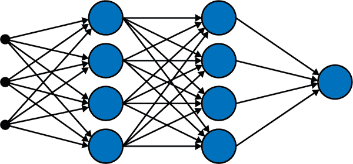

###### 图 4-4. 一个仅有九个神经元排列在四层中的全连接（或密集）前馈神经网络。最左边的第一层是输入层，第二层和第三层是每个四个神经元的两个隐藏层，最后一层是仅有一个神经元的输出层（此网络执行回归任务或二元分类任务）。

+   如果任务是回归，我们在最终输出节点处线性组合前一层的输出，添加偏差，然后结束（在这种情况下*不*通过非线性函数传递结果）。由于输出层只有一个节点，输出矩阵只是一个行向量<math alttext="upper W Superscript o u t p u t Baseline equals upper W Superscript h plus 1"><mrow><msup><mi>W</mi> <mrow><mi>o</mi><mi>u</mi><mi>t</mi><mi>p</mi><mi>u</mi><mi>t</mi></mrow></msup> <mo>=</mo> <msup><mi>W</mi> <mrow><mi>h</mi><mo>+</mo><mn>1</mn></mrow></msup></mrow></math>，和一个偏差<math alttext="omega 0 Superscript h plus 1"><msubsup><mi>ω</mi> <mn>0</mn> <mrow><mi>h</mi><mo>+</mo><mn>1</mn></mrow></msubsup></math>。网络的预测现在将是：

<math alttext="dollar-sign y Subscript p r e d i c t Baseline equals upper W Superscript h plus 1 Baseline ModifyingAbove s With right-arrow Superscript h Baseline plus omega 0 Superscript h plus 1 Baseline comma dollar-sign"><mrow><msub><mi>y</mi> <mrow><mi>p</mi><mi>r</mi><mi>e</mi><mi>d</mi><mi>i</mi><mi>c</mi><mi>t</mi></mrow></msub> <mo>=</mo> <msup><mi>W</mi> <mrow><mi>h</mi><mo>+</mo><mn>1</mn></mrow></msup> <msup><mover accent="true"><mi>s</mi> <mo>→</mo></mover> <mi>h</mi></msup> <mo>+</mo> <msubsup><mi>ω</mi> <mn>0</mn> <mrow><mi>h</mi><mo>+</mo><mn>1</mn></mrow></msubsup> <mo>,</mo></mrow></math>

其中 h 是网络中隐藏层的总数（不包括输入和输出层）。

+   另一方面，如果任务是二元分类，那么我们再次只有一个输出节点，在这里我们线性组合前一层的输出，添加偏差，然后通过逻辑函数传递结果<math alttext="sigma left-parenthesis s right-parenthesis equals StartFraction 1 Over 1 plus e Superscript negative s Baseline EndFraction"><mrow><mi>σ</mi> <mrow><mo>(</mo> <mi>s</mi> <mo>)</mo></mrow> <mo>=</mo> <mfrac><mn>1</mn> <mrow><mn>1</mn><mo>+</mo><msup><mi>e</mi> <mrow><mo>-</mo><mi>s</mi></mrow></msup></mrow></mfrac></mrow></math>，导致网络的预测：

<math alttext="dollar-sign y Subscript p r e d i c t Baseline equals sigma left-parenthesis upper W Superscript h plus 1 Baseline ModifyingAbove s With right-arrow Superscript h Baseline plus omega 0 Superscript h plus 1 Baseline right-parenthesis dollar-sign"><mrow><msub><mi>y</mi> <mrow><mi>p</mi><mi>r</mi><mi>e</mi><mi>d</mi><mi>i</mi><mi>c</mi><mi>t</mi></mrow></msub> <mo>=</mo> <mi>σ</mi> <mrow><mo>(</mo> <msup><mi>W</mi> <mrow><mi>h</mi><mo>+</mo><mn>1</mn></mrow></msup> <msup><mover accent="true"><mi>s</mi> <mo>→</mo></mover> <mi>h</mi></msup> <mo>+</mo> <msubsup><mi>ω</mi> <mn>0</mn> <mrow><mi>h</mi><mo>+</mo><mn>1</mn></mrow></msubsup> <mo>)</mo></mrow></mrow></math>

+   如果任务是分类到多个类别，比如五个类别，那么输出层将包括五个节点。在这些节点中，我们线性组合前一层的输出，添加偏差，然后通过 softmax 函数传递结果：

<math alttext="dollar-sign StartLayout 1st Row 1st Column sigma left-parenthesis z Superscript 1 Baseline right-parenthesis 2nd Column equals StartFraction e Superscript z Super Superscript 1 Superscript Baseline Over e Superscript z Super Superscript 1 Superscript Baseline plus e Superscript z squared Baseline plus e Superscript z cubed Baseline plus e Superscript z Super Superscript 4 Superscript Baseline plus e Superscript z Super Superscript 5 Superscript Baseline EndFraction comma 2nd Row 1st Column sigma left-parenthesis z squared right-parenthesis 2nd Column equals StartFraction e Superscript z squared Baseline Over e Superscript z Super Superscript 1 Superscript Baseline plus e Superscript z squared Baseline plus e Superscript z cubed Baseline plus e Superscript z Super Superscript 4 Superscript Baseline plus e Superscript z Super Superscript 5 Superscript Baseline EndFraction comma 3rd Row 1st Column sigma left-parenthesis z cubed right-parenthesis 2nd Column equals StartFraction e Superscript z cubed Baseline Over e Superscript z Super Superscript 1 Superscript Baseline plus e Superscript z squared Baseline plus e Superscript z cubed Baseline plus e Superscript z Super Superscript 4 Superscript Baseline plus e Superscript z Super Superscript 5 Superscript Baseline EndFraction comma 4th Row 1st Column sigma left-parenthesis z Superscript 4 Baseline right-parenthesis 2nd Column equals StartFraction e Superscript z Super Superscript 4 Superscript Baseline Over e Superscript z Super Superscript 1 Superscript Baseline plus e Superscript z squared Baseline plus e Superscript z cubed Baseline plus e Superscript z Super Superscript 4 Superscript Baseline plus e Superscript z Super Superscript 5 Superscript Baseline EndFraction comma 5th Row 1st Column sigma left-parenthesis z Superscript 5 Baseline right-parenthesis 2nd Column equals StartFraction e Superscript z Super Superscript 5 Superscript Baseline Over e Superscript z Super Superscript 1 Superscript Baseline plus e Superscript z squared Baseline plus e Superscript z cubed Baseline plus e Superscript z Super Superscript 4 Superscript Baseline plus e Superscript z Super Superscript 5 Superscript Baseline EndFraction period EndLayout dollar-sign"><mtable displaystyle="true"><mtr><mtd columnalign="right"><mrow><mi>σ</mi> <mo>(</mo> <msup><mi>z</mi> <mn>1</mn></msup> <mo>)</mo></mrow></mtd> <mtd columnalign="left"><mrow><mo>=</mo> <mfrac><msup><mi>e</mi> <msup><mi>z</mi> <mn>1</mn></msup></msup> <mrow><msup><mi>e</mi> <msup><mi>z</mi> <mn>1</mn></msup></msup> <mo>+</mo><msup><mi>e</mi> <msup><mi>z</mi> <mn>2</mn></msup></msup> <mo>+</mo><msup><mi>e</mi> <msup><mi>z</mi> <mn>3</mn></msup></msup> <mo>+</mo><msup><mi>e</mi> <msup><mi>z</mi> <mn>4</mn></msup></msup> <mo>+</mo><msup><mi>e</mi> <msup><mi>z</mi> <mn>5</mn></msup></msup></mrow></mfrac> <mo>,</mo></mrow></mtd></mtr> <mtr><mtd columnalign="right"><mrow><mi>σ</mi> <mo>(</mo> <msup><mi>z</mi> <mn>2</mn></msup> <mo>)</mo></mrow></mtd> <mtd columnalign="left"><mrow><mo>=</mo> <mfrac><msup><mi>e</mi> <msup><mi>z</mi> <mn>2</mn></msup></msup> <mrow><msup><mi>e</mi> <msup><mi>z</mi> <mn>1</mn></msup></msup> <mo>+</mo><msup><mi>e</mi> <msup><mi>z</mi> <mn>2</mn></msup></msup> <mo>+</mo><msup><mi>e</mi> <msup><mi>z</mi> <mn>3</mn></msup></msup> <mo>+</mo><msup><mi>e</mi> <msup><mi>z</mi> <mn>4</mn></msup></msup> <mo>+</mo><msup><mi>e</mi> <msup><mi>z</mi> <mn>5</mn></msup></msup></mrow></mfrac> <mo>,</mo></mrow></mtd></mtr> <mtr><mtd columnalign="right"><mrow><mi>σ</mi> <mo>(</mo> <msup><mi>z</mi> <mn>3</mn></msup> <mo>)</mo></mrow></mtd> <mtd columnalign="left"><mrow><mo>=</mo> <mfrac><msup><mi>e</mi> <msup><mi>z</mi> <mn>3</mn></msup></msup> <mrow><msup><mi>e</mi> <msup><mi>z</mi> <mn>1</mn></msup></msup> <mo>+</mo><msup><mi>e</mi> <msup><mi>z</mi> <mn>2</mn></msup></msup> <mo>+</mo><msup><mi>e</mi> <msup><mi>z</mi> <mn>3</mn></msup></msup> <mo>+</mo><msup><mi>e</mi> <msup><mi>z</mi> <mn>4</mn></msup></msup> <mo>+</mo><msup><mi>e</mi> <msup><mi>z</mi> <mn>5</mn></msup></msup></mrow></mfrac> <mo>,</mo></mrow></mtd></mtr> <mtr><mtd columnalign="right"><mrow><mi>σ</mi> <mo>(</mo> <msup><mi>z</mi> <mn>4</mn></msup> <mo>)</mo></mrow></mtd> <mtd columnalign="left"><mrow><mo>=</mo> <mfrac><msup><mi>e</mi> <msup><mi>z</mi> <mn>4</mn></msup></msup> <mrow><msup><mi>e</mi> <msup><mi>z</mi> <mn>1</mn></msup></msup> <mo>+</mo><msup><mi>e</mi> <msup><mi>z</mi> <mn>2</mn></msup></msup> <mo>+</mo><msup><mi>e</mi> <msup><mi>z</mi> <mn>3</mn></msup></msup> <mo>+</mo><msup><mi>e</mi> <msup><mi>z</mi> <mn>4</mn></msup></msup> <mo>+</mo><msup><mi>e</mi> <msup><mi>z</mi> <mn>5</mn></msup></msup></mrow></mfrac> <mo>,</mo></mrow></mtd></mtr> <mtr><mtd columnalign="right"><mrow><mi>σ</mi> <mo>(</mo> <msup><mi>z</mi> <mn>5</mn></msup> <mo>)</mo></mrow></mtd> <mtd columnalign="left"><mrow><mo>=</mo> <mfrac><msup><mi>e</mi> <msup><mi>z</mi> <mn>5</mn></msup></msup> <mrow><msup><mi>e</mi> <msup><mi>z</mi> <mn>1</mn></msup></msup> <mo>+</mo><msup><mi>e</mi> <msup><mi>z</mi> <mn>2</mn></msup></msup> <mo>+</mo><msup><mi>e</mi> <msup><mi>z</mi> <mn>3</mn></msup></msup> <mo>+</mo><msup><mi>e</mi> <msup><mi>z</mi> <mn>4</mn></msup></msup> <mo>+</mo><msup><mi>e</mi> <msup><mi>z</mi> <mn>5</mn></msup></msup></mrow></mfrac> <mo>.</mo></mrow></mtd></mtr></mtable></math>

将上述分组为一个矢量函数<math alttext="ModifyingAbove sigma With right-arrow"><mover accent="true"><mi>σ</mi> <mo>→</mo></mover></math>，该函数还将矢量作为输入：<math alttext="ModifyingAbove sigma With right-arrow left-parenthesis ModifyingAbove z With right-arrow right-parenthesis"><mrow><mover accent="true"><mi>σ</mi> <mo>→</mo></mover> <mrow><mo>(</mo> <mover accent="true"><mi>z</mi> <mo>→</mo></mover> <mo>)</mo></mrow></mrow></math>，那么神经网络的最终预测是一个包含五个概率分数的向量，表示数据实例属于五个类别中的每一个的概率：

<math alttext="dollar-sign StartLayout 1st Row 1st Column ModifyingAbove y With right-arrow Subscript p r e d i c t 2nd Column equals ModifyingAbove sigma With right-arrow left-parenthesis ModifyingAbove z With right-arrow right-parenthesis 2nd Row 1st Column Blank 2nd Column equals ModifyingAbove sigma With right-arrow left-parenthesis upper W Superscript o u t p u t Baseline ModifyingAbove s With right-arrow Superscript h Baseline plus ModifyingAbove omega 0 With right-arrow Superscript h plus 1 Baseline right-parenthesis EndLayout dollar-sign"><mtable displaystyle="true"><mtr><mtd columnalign="right"><msub><mover accent="true"><mi>y</mi> <mo>→</mo></mover> <mrow><mi>p</mi><mi>r</mi><mi>e</mi><mi>d</mi><mi>i</mi><mi>c</mi><mi>t</mi></mrow></msub></mtd> <mtd columnalign="left"><mrow><mo>=</mo> <mover accent="true"><mi>σ</mi> <mo>→</mo></mover> <mrow><mo>(</mo> <mover accent="true"><mi>z</mi> <mo>→</mo></mover> <mo>)</mo></mrow></mrow></mtd></mtr> <mtr><mtd columnalign="left"><mrow><mo>=</mo> <mover accent="true"><mi>σ</mi> <mo>→</mo></mover> <mrow><mo>(</mo> <msup><mi>W</mi> <mrow><mi>o</mi><mi>u</mi><mi>t</mi><mi>p</mi><mi>u</mi><mi>t</mi></mrow></msup> <msup><mover accent="true"><mi>s</mi> <mo>→</mo></mover> <mi>h</mi></msup> <mo>+</mo> <msup><mover accent="true"><msub><mi>ω</mi> <mn>0</mn></msub> <mo>→</mo></mover> <mrow><mi>h</mi><mo>+</mo><mn>1</mn></mrow></msup> <mo>)</mo></mrow></mrow></mtd></mtr></mtable></math>

### 符号概述

在我们讨论神经网络时，我们将尽量保持符号的一致性：x 是输入特征，W 是包含用于线性组合的权重的矩阵或列向量，<math alttext="omega 0"><msub><mi>ω</mi> <mn>0</mn></msub></math>是有时分组为矢量的偏差，z 是线性组合加偏差的结果，*s*是将这些结果传递到非线性激活函数中的结果。

## 常见的激活函数

理论上，我们可以使用任何非线性函数来*激活我们的节点*（想象我们曾经遇到的所有微积分函数）。在实践中，有一些流行的函数，如下所列，并在图 4-5 中绘制。

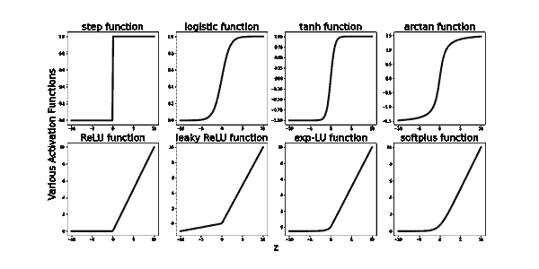

###### 图 4-5。神经网络的各种激活函数。第一行由类似字母 S 形状的 Sigmoid 型激活函数组成。对于输入的绝对值较大，这些函数会饱和（变得平坦并输出相同的值）。第二行由不会饱和的 ReLU 型激活函数组成。

到目前为止，修正线性单元函数（简称 ReLU）是当今网络中最常用的激活函数，2012 年[AlexNet](https://en.wikipedia.org/wiki/AlexNet)的成功部分归因于使用这种激活函数，而不是当时神经网络中常用的双曲正切和逻辑函数（Sigmoid）。下面列表中的前四个函数以及图 4-5 中的函数都受到计算神经科学的启发，它们试图模拟一个神经元细胞的激活（发射）阈值。它们的图形看起来相似，有些是其他函数的平滑变体，有些只输出正数，其他输出在-1 和 1 之间或在<math alttext="minus StartFraction pi Over 2 EndFraction"><mrow><mo>-</mo> <mfrac><mi>π</mi> <mn>2</mn></mfrac></mrow></math>和<math alttext="StartFraction pi Over 2 EndFraction"><mfrac><mi>π</mi> <mn>2</mn></mfrac></math>之间的更平衡的数字。它们对于小或大的输入都会饱和，意味着它们的图形对于绝对值较大的输入会变得平坦。这会导致*学习*问题，因为如果这些函数一遍又一遍地输出相同的数字，那么学习就不会发生太多。从数学上讲，这表现为所谓的*梯度消失问题*。第二组激活函数试图纠正这种饱和问题，它确实做到了，正如我们在图 4-5 的第二行图中所看到的。然而，这引入了另一个问题，称为*梯度爆炸问题*，因为这些激活函数是无界的，现在可以输出大数字，如果这些数字在多个层上增长，我们就会遇到问题。引入的每个新问题都伴随着一套尝试解决它的技术，例如*梯度裁剪*，在每一层后对输出进行归一化，*等等*。重要的一点是，这一切都不是魔法。其中很多是试错，新方法出现是为了解决其他新方法引入的问题。我们只需要理解原则，为什么和如何，对领域中流行的内容有一定了解，同时保持开放的思维来改进事物，或者完全不同的方式来做事。

让我们列出常见激活函数的公式，以及它们的导数。在我们寻找神经网络最佳权重时，我们需要计算训练函数的一个导数，以优化损失函数：

+   阶跃函数：<math alttext="f left-parenthesis z right-parenthesis equals StartLayout Enlarged left-brace 1st Row 1st Column Blank 2nd Column 0 if z less-than 0 2nd Row 1st Column Blank 2nd Column 1 if z greater-than-or-equal-to 0 EndLayout"><mrow><mi>f</mi> <mrow><mo>(</mo> <mi>z</mi> <mo>)</mo></mrow> <mo>=</mo> <mfenced close="" open="{" separators=""><mtable displaystyle="true"><mtr><mtd columnalign="left"><mrow><mn>0</mn> <mtext>if</mtext> <mi>z</mi> <mo><</mo> <mn>0</mn></mrow></mtd></mtr> <mtr><mtd columnalign="left"><mrow><mn>1</mn> <mtext>if</mtext> <mi>z</mi> <mo>≥</mo> <mn>0</mn></mrow></mtd></mtr></mtable></mfenced></mrow></math>

其导数：

+   逻辑函数：

其导数：

+   双曲正切函数：

它的导数：

+   反正切函数：

其导数：

+   整流线性单元函数或 ReLU(z)：

其导数：

+   泄漏整流线性单元函数（或参数化线性单元）：

其导数：

+   指数线性单元函数：f（z）= {α（e^z - 1）如果 z < 0；z 如果 z ≥ 0}。

它的导数：f'（z）= {f（z）+ α如果 z < 0；1 如果 z ≥ 0}。

+   Softplus 函数：f（z）= ln（1 + e^z）。

它的导数：f'（z）= 1 /（1 + e^-z）= σ（z）。

请注意，所有这些激活函数都是相当基本的函数。这是一件好事，因为它们及其导数通常参与在训练、测试和部署神经网络过程中涉及数千个参数（权重）和数据实例的大规模计算，因此最好保持它们基本。另一个原因是，在理论上，我们最终选择的激活函数并不真的重要，因为接下来将讨论的*通用函数逼近定理*。在操作上，我们选择神经网络节点的激活函数确实很重要。正如我们在本节前面提到的，AlexNet 在图像分类任务中取得成功部分归功于其使用的修正线性单元函数 ReLU（z）。在这种情况下，理论和实践并不矛盾，尽管表面上看起来是这样。我们将在下一小节中解释这一点。

## 通用函数逼近

逼近定理一旦可用，就会很棒，因为它们以数学的信心和权威告诉我们，如果我们有一个我们不知道的函数，或者我们知道但难以包含在我们的计算中的函数，那么我们根本不必处理这个未知或困难的函数。相反，我们可以使用更容易计算的已知函数来近似它，以很高的精度。这意味着在未知或复杂函数以及已知和简单（有时是基本的）函数的一定条件下，我们可以使用简单函数，并确信我们的计算是正确的。这些类型的逼近定理量化了真实函数与其近似之间的差距，因此我们确切地知道在用这个近似替代真实函数时我们所犯的错误有多少。

神经网络，甚至有时只有一个隐藏层的*非深度*神经网络，在视觉、语音识别、分类、回归等各种任务中取得了如此成功的成就，这意味着它们具有某种通用逼近性质：神经网络表示的训练函数（由基本线性组合、偏差和非常简单的激活函数构建）相当好地逼近了真正表示或生成数据的未知函数。

数学家现在必须用一个定理或一堆定理来回答的自然问题是：

1.  鉴于我们不知道但非常关心的某个函数（因为我们认为它是潜在或生成我们数据的真实函数），是否有一个神经网络可以以很高的精度近似它（而不必知道这个真实函数）？成功使用神经网络的实践表明答案是肯定的，并且神经网络的通用逼近定理证明了对于某一类函数和网络，答案是肯定的。

1.  *如果有一个神经网络可以逼近这个真实而难以捉摸的数据生成函数，我们如何构建它？它应该有多少层？每层有多少节点？应该包含什么类型的激活函数？*换句话说，这个网络的*架构*是什么？遗憾的是，到目前为止，我们对如何构建这些网络知之甚少，尝试各种架构和激活是唯一的前进之路，直到更多的数学家参与其中。

1.  *有多种神经网络架构表现良好吗？有些比其他的更好吗？*实验证明答案是肯定的，因为各种架构在相同任务和数据集上的可比性表现。

请注意，对上述问题有明确答案非常有用。对第一个问题的肯定回答告诉我们：嘿，这里没有魔法，神经网络确实相当好地逼近了*广泛类别的函数*！这种*广泛覆盖*或普适性至关重要，因为请记住，我们不知道数据生成函数，但如果逼近定理涵盖了广泛类别的函数，我们未知和难以捉摸的函数很可能也被包括在内，因此神经网络的成功。回答第二和第三个问题对实际应用更有用，因为如果我们知道哪种架构最适合每种任务类型和数据集，那么我们将免于进行大量实验，并立即选择一个表现良好的架构。

在陈述神经网络的通用逼近定理并讨论它们的证明之前，让我们回顾两个例子，我们已经在中学时代遇到过逼近类型的定理。所有例子都适用同一原则：我们有一个难以处理或未知的难以处理的量，我们想用另一个更容易处理的量来近似它。如果我们想要通用结果，我们需要指定三件事：

1.  难以处理的量或函数属于什么类别或什么*空间*？它是实数集<math alttext="双击上标 R"><mi>ℝ</mi></math>吗？无理数集？区间上连续函数的空间？紧支持函数在<math alttext="双击上标 R"><mi>ℝ</mi></math>上的空间？勒贝格可测函数的空间（我在这里插入了一些*测度论*的内容，希望没有人注意到或逃跑）？*等等*

1.  我们使用什么样的更简单的量或函数来近似难以处理的实体，使用这些量而不是真实函数对我们有什么好处？如果已经有一些其他流行的近似方法，这些近似方法与*其他近似方法*相比如何？

1.  近似发生在什么意义上，也就是说，当我们说我们可以用<math alttext="f Subscript t r u e"><msub><mi>f</mi> <mrow><mi>t</mi><mi>r</mi><mi>u</mi><mi>e</mi></mrow></msub></math>来近似<math alttext="f Subscript a p p r o x i m a t e"><msub><mi>f</mi> <mrow><mi>a</mi><mi>p</mi><mi>p</mi><mi>r</mi><mi>o</mi><mi>x</mi><mi>i</mi><mi>m</mi><mi>a</mi><mi>t</mi><mi>e</mi></mrow></msub></math>时，我们究竟是如何测量<math alttext="f Subscript t r u e"><msub><mi>f</mi> <mrow><mi>t</mi><mi>r</mi><mi>u</mi><mi>e</mi></mrow></msub></math>和<math alttext="f Subscript a p p r o x i m a t e"><msub><mi>f</mi> <mrow><mi>a</mi><mi>p</mi><mi>p</mi><mi>r</mi><mi>o</mi><mi>x</mi><mi>i</mi><mi>m</mi><mi>a</mi><mi>t</mi><mi>e</mi></mrow></msub></math>之间的距离？回想一下，在数学中我们可以用许多方式来测量物体的大小，包括距离。那么我们究竟在我们特定的近似中使用哪种方式？这就是我们听说欧几里得范数、均匀范数、*上确界*范数、<math alttext="上 L 平方"><msup><mi>L</mi> <mn>2</mn></msup></math>范数等的地方。范数（大小）与距离有什么关系？范数引出距离。这是直观的：如果我们的空间允许我们谈论物体的大小，那么它最好也允许我们谈论距离。我们将在概率章节中稍后形式化这一点。

    例 1：用有理数近似无理数

    任何无理数都可以用有理数近似，直到我们想要的任意精度。有理数表现得很好且有用，因为它们只是整数对。我们的思维可以轻松地理解整数和分数。无理数则完全相反。你有没有在六年级被要求计算<math alttext="StartRoot 47 EndRoot equals 6.8556546 period period period"><mrow><msqrt><mn>47</mn></msqrt> <mo>=</mo> <mn>6</mn> <mo>.</mo> <mn>8556546</mn> <mo>.</mo> <mo>.</mo> <mo>.</mo></mrow></math>，没有计算器，一直计算直到得到一个确定的答案？我有。相当刻薄！即使计算器和计算机也用有理数近似无理数。但我必须坐在那里想着我可以继续写数字，直到我找到一个模式或计算终止。当然，两者都没有发生，大约 30 位数字后，我才知道有些数字就是无理数。

有多种方式可以编写数学陈述来量化这种近似。它们都是等效且有用的：

+   *近似实体可以无限接近真实数量*：这是最直观的方式。

给定一个无理数*s*和任意精度<math alttext="epsilon"><mi>ϵ</mi></math>，无论多么小，我们都可以找到一个距离*s*小于<math alttext="epsilon"><mi>ϵ</mi></math>的有理数*q*。

<math alttext="dollar-sign StartAbsoluteValue s minus q EndAbsoluteValue less-than epsilon period dollar-sign"><mrow><mo>|</mo> <mi>s</mi> <mo>-</mo> <mi>q</mi> <mo>|</mo> <mo><</mo> <mi>ϵ</mi> <mo>.</mo></mrow></math>

这意味着有理数和无理数在实数线<math alttext="double-struck upper R"><mi>ℝ</mi></math>上彼此之间生活得非常接近。这引入了密度的概念。

+   *密度和闭包*：逼近实体在真实数量所在的空间中是*密集*的。

这意味着，如果我们只关注逼近成员的空间，然后加入所有它们序列的所有极限，我们就得到了真实成员的整个空间。在某个空间 S 中加入所有极限点被称为*闭合*空间，或者取其*闭包*，<math alttext="upper S overbar"><mover accent="true"><mi>S</mi> <mo>¯</mo></mover></math>。例如，当我们在开区间<math alttext="left-parenthesis a comma b right-parenthesis"><mrow><mo>(</mo> <mi>a</mi> <mo>,</mo> <mi>b</mi> <mo>)</mo></mrow></math>中加入其极限点*a*和*b*时，我们得到了*闭合*区间[a,b]。因此，<math alttext="left-parenthesis a comma b right-parenthesis"><mrow><mo>(</mo> <mi>a</mi> <mo>,</mo> <mi>b</mi> <mo>)</mo></mrow></math>的*闭包*是[a,b]。我们写成<math alttext="ModifyingAbove left-parenthesis a comma b right-parenthesis With bar equals"><mrow><mover accent="true"><mrow><mo>(</mo><mi>a</mi><mo>,</mo><mi>b</mi><mo>)</mo></mrow> <mo>¯</mo></mover> <mo>=</mo></mrow></math>[a,b]。

有理数集<math alttext="double-struck upper Q"><mi>ℚ</mi></math>在实数线<math alttext="double-struck upper R"><mi>ℝ</mi></math>中是*密集*的。换句话说，<math alttext="double-struck upper Q"><mi>ℚ</mi></math>的*闭包*是<math alttext="double-struck upper R"><mi>ℝ</mi></math>。我们写成<math alttext="double-struck upper Q overbar equals double-struck upper R"><mrow><mover accent="true"><mi>ℚ</mi> <mo>¯</mo></mover> <mo>=</mo> <mi>ℝ</mi></mrow></math>。

+   *序列的极限*：真实数量是逼近实体序列的极限。

在前面的点中*添加* *极限点*的概念引入了使用序列及其极限的术语进行逼近。

在有理数逼近无理数的背景下，因此我们可以写成：对于任意无理数*s*，存在一个有理数序列<math alttext="q Subscript n"><msub><mi>q</mi> <mi>n</mi></msub></math>，使得<math alttext="limit Underscript n right-arrow normal infinity Endscripts q Subscript n Baseline equals s"><mrow><msub><mo form="prefix" movablelimits="true">lim</mo> <mrow><mi>n</mi><mo>→</mo><mi>∞</mi></mrow></msub> <msub><mi>q</mi> <mi>n</mi></msub> <mo>=</mo> <mi>s</mi></mrow></math>。这使我们有机会举例说明最著名的无理数之一的最喜欢的定义：*e=2.71828182…*

<math alttext="dollar-sign limit Underscript n right-arrow normal infinity Endscripts left-parenthesis 1 plus StartFraction 1 Over n EndFraction right-parenthesis Superscript n Baseline equals e dollar-sign"><mrow><msub><mo form="prefix" movablelimits="true">lim</mo> <mrow><mi>n</mi><mo>→</mo><mi>∞</mi></mrow></msub> <msup><mrow><mo>(</mo><mn>1</mn><mo>+</mo><mfrac><mn>1</mn> <mi>n</mi></mfrac><mo>)</mo></mrow> <mi>n</mi></msup> <mo>=</mo> <mi>e</mi></mrow></math>

也就是说，*无理数*e 是有理数序列<math alttext="left-parenthesis 1 plus one-first right-parenthesis Superscript 1 Baseline comma left-parenthesis 1 plus one-half right-parenthesis squared comma left-parenthesis 1 plus one-third right-parenthesis cubed comma ellipsis"><mrow><msup><mrow><mo>(</mo><mn>1</mn><mo>+</mo><mfrac><mn>1</mn> <mn>1</mn></mfrac><mo>)</mo></mrow> <mn>1</mn></msup> <mo>,</mo> <msup><mrow><mo>(</mo><mn>1</mn><mo>+</mo><mfrac><mn>1</mn> <mn>2</mn></mfrac><mo>)</mo></mrow> <mn>2</mn></msup> <mo>,</mo> <msup><mrow><mo>(</mo><mn>1</mn><mo>+</mo><mfrac><mn>1</mn> <mn>3</mn></mfrac><mo>)</mo></mrow> <mn>3</mn></msup> <mo>,</mo> <mo>⋯</mo></mrow></math>的极限，等价于<math alttext="2 comma 2.25 comma 2.370370 period period comma ellipsis"><mrow><mn>2</mn> <mo>,</mo> <mn>2</mn> <mo>.</mo> <mn>25</mn> <mo>,</mo> <mn>2</mn> <mo>.</mo> <mn>370370</mn> <mo>.</mo> <mo>.</mo> <mo>,</mo> <mo>⋯</mo></mrow></math>。

无论我们使用*任意接近*概念、*密集性和闭包*概念还是*序列极限*概念来用有理数逼近无理数，数学陈述中涉及的任何距离都是使用通常的欧几里德范数来衡量的：<math alttext="d 左括号 s，q 右括号等于 StartAbsoluteValue s 减 q EndAbsoluteValue"><mrow><mi>d</mi> <mo>(</mo> <mi>s</mi> <mo>,</mo> <mi>q</mi> <mo>)</mo> <mo>=</mo> <mo>|</mo> <mi>s</mi> <mo>-</mo> <mi>q</mi> <mo>|</mo></mrow></math>，这是两个数之间的正常距离。

# 注意：接近性质需要伴随特定的范数。

我们可能会想：如果我们改变范数会怎样？逼近性质是否仍然成立？如果我们使用某种与通常的欧几里德范数不同的距离定义来衡量它们之间的距离，我们是否仍然可以用有理数逼近无理数？欢迎来到*数学分析*。一般来说，答案是否定的。使用某种范数可以使量之间彼此接近，而使用另一种范数可以使它们之间相距很远。因此，在数学中，当我们说量之间彼此接近、逼近其他量或收敛到某处时，我们需要提及伴随的范数，以便准确定义*这些接近性质是如何发生*。

例 2：用多项式逼近连续函数

连续函数可以是任何东西。一个孩子可以在一张纸上画一条曲线，那就是一个没有人知道公式的连续函数。另一方面，多项式是一种特殊类型的连续函数，极易评估、求导、积分、解释和进行计算。多项式函数中唯一涉及的操作是幂、标量乘法、加法和减法。*n*次多项式有一个简单的公式：

<math alttext="dollar-sign p Subscript n Baseline left-parenthesis x right-parenthesis equals a 0 plus a 1 x plus a 2 x squared plus a 3 x cubed plus ellipsis plus a Subscript n Baseline x Superscript n Baseline comma dollar-sign"><mrow><msub><mi>p</mi> <mi>n</mi></msub> <mrow><mo>(</mo> <mi>x</mi> <mo>)</mo></mrow> <mo>=</mo> <msub><mi>a</mi> <mn>0</mn></msub> <mo>+</mo> <msub><mi>a</mi> <mn>1</mn></msub> <mi>x</mi> <mo>+</mo> <msub><mi>a</mi> <mn>2</mn></msub> <msup><mi>x</mi> <mn>2</mn></msup> <mo>+</mo> <msub><mi>a</mi> <mn>3</mn></msub> <msup><mi>x</mi> <mn>3</mn></msup> <mo>+</mo> <mo>⋯</mo> <mo>+</mo> <msub><mi>a</mi> <mi>n</mi></msub> <msup><mi>x</mi> <mi>n</mi></msup> <mo>,</mo></mrow></math>

其中<math alttext="a 下标 i"><msub><mi>a</mi> <mi>i</mi></msub></math>是标量数。自然地，我们非常希望能够用多项式函数逼近非多项式连续函数。令人惊喜的消息是，我们可以，直到任意精度<math alttext="epsilon"><mi>ϵ</mi></math>。这是数学分析中的一个经典结果，称为魏尔斯特拉斯逼近定理。

魏尔斯特拉斯逼近定理：假设*f*是定义在实区间[a，b]上的连续实值函数。对于任意精度<math alttext="epsilon 大于 0"><mrow><mi>ϵ</mi> <mo>></mo> <mn>0</mn></mrow></math>，存在一个多项式<math alttext="p 下标 n"><msub><mi>p</mi> <mi>n</mi></msub></math>，使得对于[a，b]中的所有*x*，我们有<math alttext="StartAbsoluteValue f 左括号 x 右括号减 p 下标 n Baseline 左括号 x 右括号 EndAbsoluteValue 小于 epsilon"><mrow><mrow><mo>|</mo> <mi>f</mi> <mrow><mo>(</mo> <mi>x</mi> <mo>)</mo></mrow> <mo>-</mo></mrow> <msub><mi>p</mi> <mi>n</mi></msub> <mrow><mrow><mo>(</mo> <mi>x</mi> <mo>)</mo></mrow> <mo>|</mo> <mo><</mo> <mi>ϵ</mi></mrow></mrow></math>，或者等价地，上确界范数<math alttext="parallel-to f 减 p 下标 n Baseline parallel-to 小于 epsilon"><mrow><mrow><mo>∥</mo> <mi>f</mi> <mo>-</mo></mrow> <msub><mi>p</mi> <mi>n</mi></msub> <mrow><mo>∥</mo> <mo><</mo> <mi>ϵ</mi></mrow></mrow></math>。

注意，与我们讨论使用有理数逼近无理数的原理相同：定理断言我们总是可以找到多项式，这些多项式与连续函数*任意接近*；这意味着多项式集合在区间[a，b]上的连续函数空间中是*密集*的；或者等价地，对于任何连续函数*f*，我们可以找到一系列多项式函数，它们收敛于*f*（因此*f*是一系列多项式的*极限*）。在这些相同事实的所有变化中，距离是根据*上确界*范数来衡量的。在图 4-6 中，我们验证连续函数<math alttext="sine x"><mrow><mo form="prefix">sin</mo> <mi>x</mi></mrow></math>是多项式函数序列的极限<math alttext="StartSet x comma x minus StartFraction x cubed Over 3 factorial EndFraction comma x minus StartFraction x cubed Over 3 factorial EndFraction plus StartFraction x Superscript 5 Baseline Over 5 factorial EndFraction comma ellipsis EndSet"><mrow><mo>{</mo> <mi>x</mi> <mo>,</mo> <mi>x</mi> <mo>-</mo> <mfrac><msup><mi>x</mi> <mn>3</mn></msup> <mrow><mn>3</mn><mo>!</mo></mrow></mfrac> <mo>,</mo> <mi>x</mi> <mo>-</mo> <mfrac><msup><mi>x</mi> <mn>3</mn></msup> <mrow><mn>3</mn><mo>!</mo></mrow></mfrac> <mo>+</mo> <mfrac><msup><mi>x</mi> <mn>5</mn></msup> <mrow><mn>5</mn><mo>!</mo></mrow></mfrac> <mo>,</mo> <mo>⋯</mo> <mo>}</mo></mrow></math>

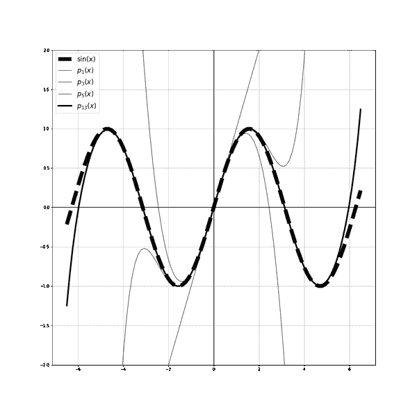

###### 图 4-6。通过一系列多项式逼近连续函数<math alttext="sine x"><mrow><mo form="prefix">sin</mo> <mi>x</mi></mrow></math>。

### 神经网络的通用逼近定理陈述

现在我们了解了逼近原理，让我们陈述神经网络的最新逼近定理。

回想一下神经网络是将训练函数表示为计算图。我们希望这个训练函数能够很好地逼近生成数据的未知函数。这使我们能够使用训练函数，而不是我们不知道的基础真实函数，也可能永远不会知道，来进行预测。以下逼近定理断言神经网络可以以任意精度逼近基础函数。当我们将这些定理的陈述与上述无理数和连续函数的两个示例进行比较时，我们注意到它们是相同类型的数学陈述。

以下结果归功于 Hornik，Stinchombe 和 White 1989：设 f 是紧集 K 上的连续函数（这是数据背后的真实但未知函数），其输出在<math alttext="double-struck upper R Superscript d"><msup><mi>ℝ</mi> <mi>d</mi></msup></math>中。那么：

+   *任意接近*：存在一个只有单隐藏层的前馈神经网络，可以在 K 上均匀逼近 f，精度在 K 上任意<math alttext="epsilon greater-than 0"><mrow><mi>ϵ</mi> <mo>></mo> <mn>0</mn></mrow></math>。

+   *密集性*：具有预定非线性激活和神经元数量和层数限制的神经网络集合在<math alttext="upper C left-parenthesis upper K comma double-struck upper R Superscript d Baseline right-parenthesis"><mrow><mi>C</mi> <mo>(</mo> <mi>K</mi> <mo>,</mo> <msup><mi>ℝ</mi> <mi>d</mi></msup> <mo>)</mo></mrow></math>的均匀拓扑中是密集的。

在这两种相同事实的变化中，距离是根据连续函数上的*上确界*范数来衡量的。

证明需要来自*测度论*和*泛函分析*的数学概念。我们将在第十一章中介绍测度论，即*概率*。目前我们只列出证明所需的内容，没有任何细节：Borel 和 Radon 测度；Hahn Banach 定理；以及 Reiz 表示定理。

## 深度学习的逼近理论

在激励逼近理论并陈述其在深度学习中的一个主要结果后，我们指向了诸如[神经网络学习概率分布的能力](https://arxiv.org/pdf/1702.07028.pdf)、Barron 定理、神经切线核、[以及其他内容](https://arxiv.org/pdf/1901.02220.pdf)等最新成果。

# 损失函数

尽管在本章中我们从第三章的传统机器学习过渡到了深度学习时代，但训练函数、损失函数和优化的结构仍然完全相同。用于神经网络的损失函数与第三章中讨论的并无不同，因为损失函数的目标并未改变：捕捉地面真相与训练函数所做预测之间的误差。在深度学习中，神经网络代表训练函数，对于前馈神经网络，我们看到这只不过是一系列线性组合后跟随非线性激活函数的组合。

在深度学习中使用最广泛的损失函数仍然是用于回归任务的均方误差和用于分类任务的交叉熵函数。回到第三章详细解释这些函数。

在领域中我们有时会遇到其他损失函数。当我们遇到一个新的损失函数时，通常模型的设计者会有某种理由更喜欢它而不是其他更流行的损失函数，所以确保你仔细阅读他们使用特定损失函数的理由。理想情况下，一个好的损失函数会惩罚糟糕的预测，计算成本不高，并且有一个易于计算的导数。我们需要这个导数存在，以便我们的优化方法表现良好。正如我们在第三章中讨论的，具有一个良好导数的函数比具有不连续导数的函数具有更平滑的地形，因此在搜索损失函数的最小值时，在优化过程中更容易导航。

# 注意：最小化交叉熵损失函数等同于最大化对数似然函数。概率分布的 KL 散度与之密切相关。

回想一下，交叉熵函数是从信息论和统计力学中借来的，它量化了数据的真实（经验）分布与神经网络训练函数产生的分布（预测）之间的交叉熵。交叉熵函数的公式中有一个负号和一个<math alttext="log"><mo form="prefix">log</mo></math>函数。最小化一个函数的负号等同于最大化没有负号的相同函数，因此有时你会在领域中遇到以下陈述：*最大化对数似然函数*，对我们来说等同于*最小化交叉熵损失函数*。一个密切相关的概念是*Kullback-Leibler 散度，也称为 KL 散度*。有时，例如在生成图像或机器音频的情况下，我们需要学习一个概率分布，而不是一个确定性函数。在这种情况下，我们的损失函数应该捕捉数据的真实概率分布与学习到的概率分布之间的*差异*（我不会说距离，因为它的数学公式不是一个距离度量）。KL 散度就是这样一种损失函数的例子，它量化了当学习到的分布用于近似真实分布时丢失的信息量，或者真实分布相对于学习到的分布的相对熵。

# 优化

忠实于我们的*训练函数*、*损失函数*和*优化*数学结构，我们现在讨论优化步骤。我们的目标是对损失函数<math alttext="upper L left-parenthesis ModifyingAbove omega With right-arrow right-parenthesis"><mrow><mi>L</mi> <mo>(</mo> <mover accent="true"><mi>ω</mi> <mo>→</mo></mover> <mo>)</mo></mrow></math>的景观进行高效搜索，以找到最小化的<math alttext="omega"><mi>ω</mi></math>。请注意，当我们在早期章节明确写出神经网络的训练函数的公式时，我们将<math alttext="omega"><mi>ω</mi></math>权重捆绑在矩阵*W*中，将偏差捆绑在向量<math alttext="ModifyingAbove omega With right-arrow Subscript 0"><msub><mover accent="true"><mi>ω</mi> <mo>→</mo></mover> <mn>0</mn></msub></math>中。在本节中，为了简化符号并保持对数学的关注，我们将所有权重和偏差放在一个非常长的向量<math alttext="ModifyingAbove omega With right-arrow"><mover accent="true"><mi>ω</mi> <mo>→</mo></mover></math>中。也就是说，我们将损失函数写为<math alttext="upper L left-parenthesis ModifyingAbove omega With right-arrow right-parenthesis"><mrow><mi>L</mi> <mo>(</mo> <mover accent="true"><mi>ω</mi> <mo>→</mo></mover> <mo>)</mo></mrow></math>，而实际上，对于具有*h*隐藏层的全连接神经网络，它是：

<math alttext="dollar-sign Loss function equals upper L left-parenthesis upper W Superscript 1 Baseline comma ModifyingAbove omega With right-arrow Subscript 0 Superscript 1 Baseline comma upper W squared comma ModifyingAbove omega With right-arrow Subscript 0 Superscript 2 Baseline comma ellipsis comma upper W Superscript h plus 1 Baseline comma ModifyingAbove omega With right-arrow Subscript 0 Superscript h plus 1 Baseline right-parenthesis period dollar-sign"><mrow><mtext>Loss</mtext> <mtext>function</mtext> <mo>=</mo> <mi>L</mi> <mo>(</mo> <msup><mi>W</mi> <mn>1</mn></msup> <mo>,</mo> <msubsup><mover accent="true"><mi>ω</mi> <mo>→</mo></mover> <mn>0</mn> <mn>1</mn></msubsup> <mo>,</mo> <msup><mi>W</mi> <mn>2</mn></msup> <mo>,</mo> <msubsup><mover accent="true"><mi>ω</mi> <mo>→</mo></mover> <mn>0</mn> <mn>2</mn></msubsup> <mo>,</mo> <mo>⋯</mo> <mo>,</mo> <msup><mi>W</mi> <mrow><mi>h</mi><mo>+</mo><mn>1</mn></mrow></msup> <mo>,</mo> <msubsup><mover accent="true"><mi>ω</mi> <mo>→</mo></mover> <mn>0</mn> <mrow><mi>h</mi><mo>+</mo><mn>1</mn></mrow></msubsup> <mo>)</mo> <mo>.</mo></mrow></math>

我们只需要上述表示当我们明确使用*反向传播*计算损失函数的导数时，这将在本章后面讨论。

对于深度学习，向量<math alttext="ModifyingAbove omega With right-arrow"><mover accent="true"><mi>ω</mi> <mo>→</mo></mover></math>中的<math alttext="omega"><mi>ω</mi></math>的数量可能非常高，可以达到数万、百万甚至十亿：[OpenAI 的 GPT-2 自然语言](https://en.wikipedia.org/wiki/GPT-2)拥有 15 亿个参数，并且是在 800 万个网页数据集上训练的。我们需要解决这么多未知数！

使用优化方法，如牛顿类型方法，需要计算这么多未知数的损失函数的二阶导数矩阵，即使在我们当前强大的计算能力下也是不可行的。这是一个很好的例子，数值方法的数学理论完全有效，但在计算和实际应用中是不切实际的。这里令人沮丧的是，使用二阶导数的数值优化方法通常比仅使用一阶导数的方法收敛更快，因为它们利用了关于函数凹凸性（其碗的形状）的额外知识，而不仅仅使用一阶导数提供的关于函数增减的信息。在我们发明更强大的计算机之前，我们必须满足于只使用损失函数对未知<math alttext="omega"><mi>ω</mi></math>的一阶导数的一阶方法。这些是*梯度下降类型*的方法，幸运的是，它们在许多当前部署在我们日常生活中使用的真实 AI 系统中表现非常出色，例如亚马逊的 Alexa。

## 数学与神秘的神经网络成功

值得在这里停下来反思神经网络的成功，这在本节的背景下可以理解为：我们能够找到使训练函数很好地泛化到新的和未见过的数据的损失函数的最小化器。我没有北美口音，亚马逊的 Alexa 能够完全理解我。从数学上讲，神经网络的这种成功仍然令人困惑，原因有很多。

+   损失函数的ω域，即发生最小化的地方，是非常高维的（可以达到数十亿维）。我们有数十亿甚至数万亿的选择。我们如何找到正确的解决方案？

+   损失函数本身的景观是非凸的，因此有很多局部最小值和鞍点，优化方法可能会陷入困境或收敛到错误的局部最小值。同样，我们如何找到正确的解决方案？

+   在一些人工智能应用中，比如计算机视觉，比数据点（图像）要多得多的ω。回想一下，对于图像，每个像素都是一个特征，因此在输入级别就已经有很多ω。对于这样的应用，未知数（ω）比确定它们所需的信息（数据点）要多得多。从数学上讲，这是一个“欠定”系统，这样的系统有“无限多个可能的解”！那么我们的网络的优化方法究竟是如何选择好的解决方案的呢？哪些能很好地泛化？

一些神秘的成功归因于在训练过程中已经成为基本技术的技巧，比如正则化（在本章的后面部分讨论）、验证、测试等。然而，深度学习仍然缺乏坚实的理论基础。这就是为什么很多数学家最近聚集在一起回答这些问题。国家科学基金会（NSF）在这方面的努力，以及我们从其公告中摘录的引用（用斜体表示）非常具有信息性，并深入了解数学如何与推进人工智能相互交织：

[NSF 最近成立了 11 个新的人工智能研究所](https://www.nsf.gov/cise/ai.jsp)来推动各个领域的人工智能发展，比如人机交互与协作、优化进展的人工智能、高级网络基础设施的人工智能、计算机和网络系统中的人工智能、动态系统中的人工智能、增强学习和农业和食品系统中的人工智能驱动创新。NSF 能够汇集包括计算机和信息科学工程、认知科学和心理学、经济学和博弈论、工程和控制理论、伦理学、语言学、数学和哲学在内的多个科学领域，使该机构在拓展人工智能前沿方面独具优势。NSF 的资助将帮助美国充分利用人工智能的全部潜力，以加强经济、促进就业增长，并为未来几十年为社会带来利益。

以下内容摘自 NSF 的[深度学习 SCALE MoDl 的数学和科学基础](https://www.nsf.gov/events/event_summ.jsp?cntn_id=302168)：*深度学习取得了令人印象深刻的经验成功，推动了基础科学发现，并改变了人工智能的许多应用领域。然而，我们对该领域的理论理解尚不完整，这阻碍了更广泛范围的参与者接触深度学习技术。面对我们对深度学习成功机制的不完整理解应该有助于克服其局限性并扩展其适用性。SCALE MoDL 计划将赞助由数学家、统计学家、电气工程师和计算机科学家组成的新研究合作。研究活动应集中在涉及数学和科学基础领域中一些最具挑战性的理论问题的明确主题上。每个合作应通过涉及最近获得博士学位的研究人员、研究生和/或本科生在跨学科领域的研究中进行培训。这些提案可能涉及深度学习理论基础的各种科学主题。可能的主题包括但不限于几何、拓扑、贝叶斯或博弈论形式，利用最优输运理论、优化理论、逼近理论、信息理论、动力系统、偏微分方程或平均场理论的分析方法，以及应用启发式观点探索小数据集的有效训练、对抗性学习和关闭决策-行动循环，更不用说对成功指标、隐私保障、因果推断和算法公平性的基础性工作*。

## 梯度下降<math alttext="ModifyingAbove omega With right-arrow Superscript i plus 1 Baseline equals ModifyingAbove omega With right-arrow Superscript i Baseline minus eta normal nabla upper L left-parenthesis ModifyingAbove omega With right-arrow Superscript i Baseline right-parenthesis"><mrow><msup><mover accent="true"><mi>ω</mi> <mo>→</mo></mover> <mrow><mi>i</mi><mo>+</mo><mn>1</mn></row></msup> <mo>=</mo> <msup><mover accent="true"><mi>ω</mi> <mo>→</mo></mover> <mi>i</mi></msup> <mo>-</mo> <mi>η</mi> <mi>∇</mi> <mi>L</mi> <mrow><mo>(</mo> <msup><mover accent="true"><mi>ω</mi> <mo>→</mo></mover> <mi>i</mi></msup> <mo>)</mo></mrow></mrow></math>

在深度学习中用于优化的梯度下降方法非常简单，以至于我们可以将其公式放在本小节的标题中。这就是梯度下降如何搜索损失函数<math alttext="upper L left-parenthesis ModifyingAbove omega With right-arrow right-parenthesis"><mrow><mi>L</mi> <mo>(</mo> <mover accent="true"><mi>ω</mi> <mo>→</mo></mover> <mo>)</mo></mrow></math>的局部最小值的方式：

+   **在某处初始化 <math alttext="ModifyingAbove omega With right-arrow Superscript 0"><msup><mover accent="true"><mi>ω</mi> <mo>→</mo></mover> <mn>0</mn></msup></math>**：随机选择起始数值 <math alttext="ModifyingAbove omega With right-arrow Superscript 0 Baseline equals left-parenthesis omega 0 comma omega 1 comma ellipsis comma omega Subscript n Baseline right-parenthesis"><mrow><msup><mover accent="true"><mi>ω</mi> <mo>→</mo></mover> <mn>0</mn></msup> <mo>=</mo> <mrow><mo>(</mo> <msub><mi>ω</mi> <mn>0</mn></msub> <mo>,</mo> <msub><mi>ω</mi> <mn>1</mn></msub> <mo>,</mo> <mo>⋯</mo> <mo>,</mo> <msub><mi>ω</mi> <mi>n</mi></msub> <mo>)</mo></mrow></mrow></math>。这个选择将我们放置在搜索空间的某处以及 <math alttext="upper L left-parenthesis ModifyingAbove omega With right-arrow right-parenthesis"><mrow><mi>L</mi> <mo>(</mo> <mover accent="true"><mi>ω</mi> <mo>→</mo></mover> <mo>)</mo></mrow></math> 的景观中。这里有一个重要的警告：*我们从哪里开始很重要*！不要用全零或全相等的数字初始化。这将减弱网络学习不同特征的能力，因为不同节点将输出完全相同的数字。我们将在即将到来的子节中讨论初始化。

+   **移动到新点 <math alttext="ModifyingAbove omega With right-arrow Superscript 1"><msup><mover accent="true"><mi>ω</mi> <mo>→</mo></mover> <mn>1</mn></msup></math>**：梯度下降沿着损失函数的梯度向量相反的方向移动 <math alttext="minus normal nabla upper L left-parenthesis ModifyingAbove omega With right-arrow Superscript 0 Baseline right-parenthesis"><mrow><mo>-</mo> <mi>∇</mi> <mi>L</mi> <mo>(</mo> <msup><mover accent="true"><mi>ω</mi> <mo>→</mo></mover> <mn>0</mn></msup> <mo>)</mo></mrow></math>。如果步长 <math alttext="eta"><mi>η</mi></math>，也称为*学习率*不是太大，这将保证梯度下降。

<math alttext="dollar-sign ModifyingAbove omega With right-arrow Superscript 1 Baseline equals ModifyingAbove omega With right-arrow Superscript 0 Baseline minus eta normal nabla upper L left-parenthesis ModifyingAbove omega With right-arrow Superscript 0 Baseline right-parenthesis dollar-sign"><mrow><msup><mover accent="true"><mi>ω</mi> <mo>→</mo></mover> <mn>1</mn></msup> <mo>=</mo> <msup><mover accent="true"><mi>ω</mi> <mo>→</mo></mover> <mn>0</mn></msup> <mo>-</mo> <mi>η</mi> <mi>∇</mi> <mi>L</mi> <mrow><mo>(</mo> <msup><mover accent="true"><mi>ω</mi> <mo>→</mo></mover> <mn>0</mn></msup> <mo>)</mo></mrow></mrow></math>

+   **移动到新点 <math alttext="ModifyingAbove omega With right-arrow squared"><msup><mover accent="true"><mi>ω</mi> <mo>→</mo></mover> <mn>2</mn></msup></math>**：同样，梯度下降沿着损失函数的梯度向量相反的方向移动 <math alttext="minus normal nabla upper L left-parenthesis ModifyingAbove omega With right-arrow Superscript 1 Baseline right-parenthesis"><mrow><mo>-</mo> <mi>∇</mi> <mi>L</mi> <mo>(</mo> <msup><mover accent="true"><mi>ω</mi> <mo>→</mo></mover> <mn>1</mn></msup> <mo>)</mo></mrow></math>。如果学习率 <math alttext="eta"><mi>η</mi></math> 不是太大，这将再次保证梯度下降。

<math alttext="dollar-sign ModifyingAbove omega With right-arrow squared equals ModifyingAbove omega With right-arrow Superscript 1 Baseline minus eta normal nabla upper L left-parenthesis ModifyingAbove omega With right-arrow Superscript 1 Baseline right-parenthesis dollar-sign"><mrow><msup><mover accent="true"><mi>ω</mi> <mo>→</mo></mover> <mn>2</mn></msup> <mo>=</mo> <msup><mover accent="true"><mi>ω</mi> <mo>→</mo></mover> <mn>1</mn></msup> <mo>-</mo> <mi>η</mi> <mi>∇</mi> <mi>L</mi> <mrow><mo>(</mo> <msup><mover accent="true"><mi>ω</mi> <mo>→</mo></mover> <mn>1</mn></msup> <mo>)</mo></mrow></mrow></math>

+   **继续直到点序列 <math alttext="StartSet ModifyingAbove omega With right-arrow Superscript 0 Baseline comma ModifyingAbove omega With right-arrow Superscript 1 Baseline comma ModifyingAbove omega With right-arrow squared comma ellipsis EndSet"><mrow><mo>{</mo> <msup><mover accent="true"><mi>ω</mi> <mo>→</mo></mover> <mn>0</mn></msup> <mo>,</mo> <msup><mover accent="true"><mi>ω</mi> <mo>→</mo></mover> <mn>1</mn></msup> <mo>,</mo> <msup><mover accent="true"><mi>ω</mi> <mo>→</mo></mover> <mn>2</mn></msup> <mo>,</mo> <mo>⋯</mo> <mo>}</mo></mrow></math> 收敛**。

图 4-7 显示了使用梯度下降最小化某个损失函数 L(ω1,ω2)的图片。我们作为人类受限于我们存在的三维空间，因此无法可视化超过三维。这对我们来说在可视化方面是一个严重的限制，因为我们的损失函数通常作用在非常高维的空间上。它们是许多ω的函数，但如果它们最多依赖于两个ω，我们只能准确地可视化它们。也就是说，我们可以可视化依赖于两个ω的损失函数 L(ω1,ω2)，但不能可视化依赖于三个（或更多）ω的损失函数 L(ω1,ω2,ω3)。即使我们在可视化高维空间中的损失函数方面受到严重限制，图 4-7 给出了梯度下降方法的一般操作的准确图像。在图 4-7 中，搜索发生在二维(ω1,ω2)-平面（图 4-7 中的平坦地面），我们跟踪嵌入在ℝ³中的函数 L(ω1,ω2)的景观上的进展。搜索空间的维度始终比嵌入损失函数景观的空间的维度少一个。这使得优化过程更加困难，因为我们正在寻找一个繁忙景观的最小化者，而这个景观在其地形的扁平或压缩版本中（图 4-7 中的地面水平）进行了压缩。

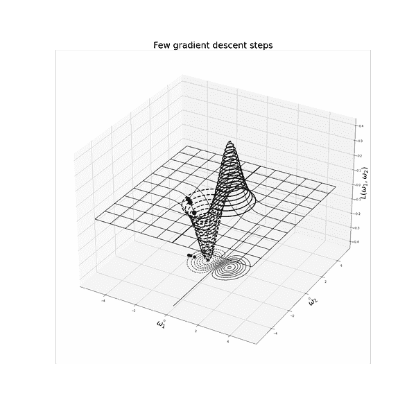

###### 图 4-7。两个梯度下降步骤。请注意，如果我们从山的另一侧开始，我们将无法收敛到最小值。因此，当我们搜索非凸函数的最小值时，我们从哪里开始，或者如何初始化ω很重要。

## 解释学习率超参数η的作用

在每次迭代中，梯度下降方法将我们从搜索空间中的点<math alttext="ModifyingAbove omega With right-arrow Superscript i"><msup><mover accent="true"><mi>ω</mi> <mo>→</mo></mover> <mi>i</mi></msup></math>移动到另一个点<math alttext="ModifyingAbove omega With right-arrow Superscript i plus 1"><msup><mover accent="true"><mi>ω</mi> <mo>→</mo></mover> <mrow><mi>i</mi><mo>+</mo><mn>1</mn></mrow></msup></math>。梯度下降将<math alttext="minus eta normal nabla upper L left-parenthesis ModifyingAbove omega With right-arrow Superscript i Baseline right-parenthesis"><mrow><mo>-</mo> <mi>η</mi> <mi>∇</mi> <mi>L</mi> <mo>(</mo> <msup><mover accent="true"><mi>ω</mi> <mo>→</mo></mover> <mi>i</mi></msup> <mo>)</mo></mrow></math>添加到当前<math alttext="ModifyingAbove omega With right-arrow Superscript i"><msup><mover accent="true"><mi>ω</mi> <mo>→</mo></mover> <mi>i</mi></msup></math>，以获得<math alttext="ModifyingAbove omega With right-arrow Superscript i plus 1"><msup><mover accent="true"><mi>ω</mi> <mo>→</mo></mover> <mrow><mi>i</mi><mo>+</mo><mn>1</mn></mrow></msup></math>。数量<math alttext="minus eta normal nabla upper L left-parenthesis ModifyingAbove omega With right-arrow Superscript i Baseline right-parenthesis"><mrow><mo>-</mo> <mi>η</mi> <mi>∇</mi> <mi>L</mi> <mo>(</mo> <msup><mover accent="true"><mi>ω</mi> <mo>→</mo></mover> <mi>i</mi></msup> <mo>)</mo></mrow></math>由标量<math alttext="eta"><mi>η</mi></math>乘以梯度向量的负值组成，该向量指向从点<math alttext="ModifyingAbove omega With right-arrow Superscript i"><msup><mover accent="true"><mi>ω</mi> <mo>→</mo></mover> <mi>i</mi></msup></math>开始的损失函数最陡降方向。因此，缩放的<math alttext="minus eta normal nabla upper L left-parenthesis ModifyingAbove omega With right-arrow Superscript i Baseline right-parenthesis"><mrow><mo>-</mo> <mi>η</mi> <mi>∇</mi> <mi>L</mi> <mo>(</mo> <msup><mover accent="true"><mi>ω</mi> <mo>→</mo></mover> <mi>i</mi></msup> <mo>)</mo></mrow></math>告诉我们在搜索空间中沿着最陡降方向要走多远，以选择下一个点<math alttext="ModifyingAbove omega With right-arrow Superscript i plus 1"><msup><mover accent="true"><mi>ω</mi> <mo>→</mo></mover> <mrow><mi>i</mi><mo>+</mo><mn>1</mn></mrow></msup></math>。换句话说，向量<math alttext="minus normal nabla upper L left-parenthesis ModifyingAbove omega With right-arrow Superscript i Baseline right-parenthesis"><mrow><mo>-</mo> <mi>∇</mi> <mi>L</mi> <mo>(</mo> <msup><mover accent="true"><mi>ω</mi> <mo>→</mo></mover> <mi>i</mi></msup> <mo>)</mo></mrow></math>指定我们将远离当前点的方向，而标量<math alttext="eta"><mi>η</mi></math>，称为*学习率*，控制我们将沿着该方向迈出多远。太大的学习率可能会超过最小值并越过山谷的另一侧。另一方面，学习率太小需要一段时间才能到达最小值。因此，权衡之处在于选择较大的学习率并冒着超过最小值的风险，或选择较小的学习率并增加计算成本和收敛时间。

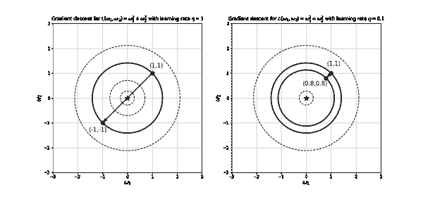

###### 图 4-8。两种不同学习率的一步梯度下降。左侧，学习率过大，梯度下降超过了最小值（星点），落在山谷的另一侧。右侧，学习率较小，但是需要一段时间才能到达最小值（星点）。请注意，某点处的梯度向量与该点处的等高线垂直。

学习率<mi>η</mi>是机器学习模型的另一个超参数的例子。它不是进入训练函数公式的权重之一。它是一种固有于我们所使用的算法的参数，用于估计训练函数的权重。

### 特征的比例影响梯度下降的性能

这是提前标准化特征的原因之一。标准化特征意味着从每个数据实例中减去平均值，然后除以标准差。这样可以强制所有数据值具有相同的比例，均值为零，标准差为一，而不是具有迥异的比例，例如一个特征的测量值在百万级，另一个特征的测量值在 0.001 级。但为什么这会影响梯度下降方法的性能？继续阅读。

回想一下，输入特征的值会在训练函数中与权重相乘，而训练函数又会进入损失函数的公式中。输入特征的非常不同的比例会改变损失函数的碗的形状，使最小化过程变得更加困难。图 4-9 显示了函数<mrow><mi>L</mi> <mrow><mo>(</mo> <msub><mi>ω</mi> <mn>1</mn></msub> <mo>,</mo> <msub><mi>ω</mi> <mn>2</mn></msub> <mo>)</mo></mrow> <mo>=</mo> <msubsup><mi>ω</mi> <mn>1</mn> <mn>2</mn></msubsup> <mo>+</mo> <mi>a</mi> <msubsup><mi>ω</mi> <mn>2</mn> <mn>2</mn></msubsup></mrow>的等高线，模拟不同输入特征的不同比例。请注意，随着*a*的值增加，损失函数的等高线变得更加狭窄和延长。这意味着损失函数的碗的形状是一个长而窄的山谷。

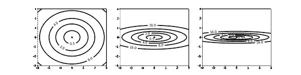

###### 图 4-9。损失函数<mrow><mi>L</mi> <mrow><mo>(</mo> <msub><mi>ω</mi> <mn>1</mn></msub> <mo>,</mo> <msub><mi>ω</mi> <mn>2</mn></msub> <mo>)</mo></mrow> <mo>=</mo> <msubsup><mi>ω</mi> <mn>1</mn> <mn>2</mn></msubsup> <mo>+</mo> <mi>a</mi> <msubsup><mi>ω</mi> <mn>2</mn> <mn>2</mn></msubsup></mrow>的等高线随着*a*的值从 1 增加到 20 再到 40 变得更加狭窄和延长。

当梯度下降方法试图在这样一个狭窄的山谷中操作时，它的点会从山谷的一侧跳到另一侧，试图找到最小值时会蜿蜒曲折，大大减慢收敛速度。想象一下在抵达梵蒂冈之前在罗马的所有街道上蜿蜒曲折，而不是直接乘直升机到达梵蒂冈。

但为什么会发生这种蜿蜒曲折的行为？函数的梯度向量的一个特点是它与该函数的等高线垂直。我们在本书的附录中进行了这种计算。因此，如果损失函数的山谷如此长而窄，其等高线几乎看起来像是彼此平行的线条，而且具有足够大的步长（学习率），我们可以从山谷的一侧穿越到另一侧，因为它是如此狭窄。搜索*梯度下降蜿蜒曲折*，你会看到许多插图展示这种行为。

为了防止在狭窄的长谷底部来回摇摆（假设我们没有提前缩放输入特征值），一个修正方法是选择非常小的学习率，防止梯度下降方法从谷的一侧跨越到另一侧。然而，这会以自己的方式减慢到达最小值的速度，因为方法每次迭代只会逐步前进。这样，我们最终会从罗马到梵蒂冈，但速度很慢。

### 在损失函数景观的最小值（局部和/或全局）、平坦区域或鞍点附近，梯度下降方法爬行。

梯度下降方法通过添加向量<math alttext="minus eta normal nabla upper L left-parenthesis ModifyingAbove omega With right-arrow Superscript i Baseline right-parenthesis"><mrow><mo>-</mo> <mi>η</mi> <mi>∇</mi> <mi>L</mi> <mo>(</mo> <msup><mover accent="true"><mi>ω</mi> <mo>→</mo></mover> <mi>i</mi></msup> <mo>)</mo></mrow></math> 更新当前点<math alttext="ModifyingAbove omega With right-arrow Superscript i"><msup><mover accent="true"><mi>ω</mi> <mo>→</mo></mover> <mi>i</mi></msup></math>。因此，从点<math alttext="ModifyingAbove omega With right-arrow Superscript i"><msup><mover accent="true"><mi>ω</mi> <mo>→</mo></mover> <mi>i</mi></msup></math>沿着负梯度向量的方向的步长是<math alttext="eta"><mi>η</mi></math>乘以梯度向量<math alttext="normal nabla upper L left-parenthesis ModifyingAbove omega With right-arrow Superscript i Baseline right-parenthesis"><mrow><mi>∇</mi> <mi>L</mi> <mo>(</mo> <msup><mover accent="true"><mi>ω</mi> <mo>→</mo></mover> <mi>i</mi></msup> <mo>)</mo></mrow></math>的长度。在损失函数的景观中的最小值、最大值、鞍点或任何平坦区域附近，梯度向量为零，因此其长度也为零。这意味着在最小值、最大值、鞍点或任何平坦区域附近，梯度下降方法的步长变得非常小，方法会显著减慢。如果这发生在最小值附近，那么就没有太多担心，因为这可以作为停止准则，除非这个最小值是离全局最小值很远的局部最小值。另一方面，如果发生在平坦区域或鞍点附近，那么方法将会在那里停留一段时间，这是不可取的。一些从业者将学习率<math alttext="eta"><mi>η</mi></math>放在一个时间表上，在优化过程中改变其值。当我们研究这些时，我们注意到目标是避免爬行，节省计算时间，并加快收敛速度。

我们将在本章后面讨论随机梯度下降。由于这种方法的随机性质，点会频繁跳动，而不是沿着更一致的路径朝向最小值前进。这在我们被困的情况下（如鞍点或局部最小值）对我们有利，因为我们可能会被随机地推出局部最小值或远离鞍点，进入一个更好朝向最小值的部分景观。

## 凸*vs*非凸景观

我们不能没有讨论*凸性*的优化章节。事实上，整个数学领域专门致力于[*凸优化*](https://en.wikipedia.org/wiki/Convex_optimization)。立即注意到的是，神经网络的优化通常是*非凸*的。

当我们使用非凸激活函数，例如图 4-5 中第一行中的 S 型函数时，导致的神经网络中涉及的损失函数的景观不是凸的。这就是为什么我们花了大量时间讨论在局部最小值、平坦区域和鞍点处卡住的问题，而对于凸景观，我们不会担心这些。凸和非凸景观之间的对比在图 4-10 中是明显的，它展示了一个凸损失函数及其等高线图，以及图 4-11 和图 4-12，展示了非凸函数及其等高线图。

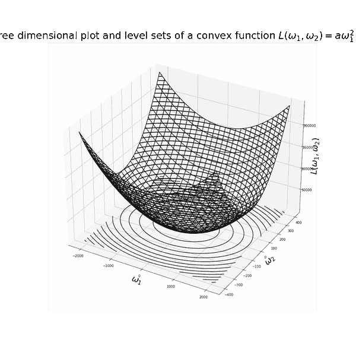

###### 图 4-10。三维凸函数及其等高线图。梯度向量存在于与等高线图相同的空间（<math alttext="双划线上标 R 平方"><msup><mi>ℝ</mi> <mn>2</mn></msup></math>），而不是<math alttext="双划线上标 R 立方"><msup><mi>ℝ</mi> <mn>3</mn></msup></math>。

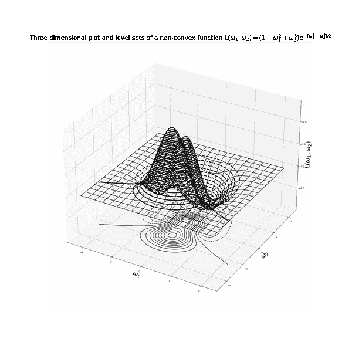

###### 图 4-11。三维非凸函数及其等高线图。梯度向量存在于与等高线图相同的空间（<math alttext="双划线上标 R 平方"><msup><mi>ℝ</mi> <mn>2</mn></msup></math>），而不是<math alttext="双划线上标 R 立方"><msup><mi>ℝ</mi> <mn>3</mn></msup></math>。

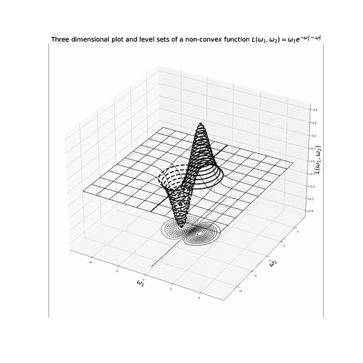

###### 图 4-12。三维非凸函数及其等高线图。梯度向量存在于与等高线图相同的空间（<math alttext="双划线上标 R 平方"><msup><mi>ℝ</mi> <mn>2</mn></msup></math>），而不是<math alttext="双划线上标 R 立方"><msup><mi>ℝ</mi> <mn>3</mn></msup></math>。

当我们在整个网络中使用凸激活函数，例如图 4-5 中第二行中的 ReLU 型函数，*和*凸损失函数时，我们仍然可能遇到一个*凸凸*优化问题，因为两个凸函数的组合不一定是凸的。如果损失函数恰好是非递减的和凸的，那么它与凸函数的组合就是凸的。神经网络中流行的损失函数，如均方误差、交叉熵和铰链损失都是凸的，但不是非递减的。

熟悉凸优化的中心概念是很重要的。如果你不知道从哪里开始，记住凸性取代了线性当线性过于简单或不可用时，然后学习关于以下内容的一切（这将与我们在运筹学章节中讨论的人工智能、深度学习和强化学习相关联）：

+   线性函数的最大值是凸的

+   最大最小和最小最大

+   鞍点

+   两人零和博弈

+   对偶

由于凸优化是一个发展成熟且被理解的领域（至少比神经网络的数学基础更为深入），而神经网络在数学上仍有很长的路要走，如果我们能利用我们对凸性的知识来更深入地理解神经网络将是很好的。这一领域的研究正在进行中。例如，在一篇[最近的论文（2020 年）](https://proceedings.mlr.press/v108/ergen20a.xhtml)中，题为*两层 ReLU 网络的凸几何：隐式自编码和可解释模型*，作者将训练两层 ReLU 网络的问题框架为一个凸解析优化问题。以下是该论文的摘要：

*我们为 ReLU 神经网络开发了一个凸解析框架，阐明了隐藏神经元及其函数空间特征的内部工作。我们展示了神经网络中的修正线性单元作为凸正则化器，通过某个凸集的极端点鼓励简单解决方案。对于一维回归和分类，我们证明了带有范数正则化的有限两层 ReLU 网络产生线性样条插值。在更一般的高维情况下，我们展示了两层网络的训练问题可以被视为一个具有无限多个约束的凸优化问题。然后我们提供了一系列凸松弛来近似解决方案，并提供了一个切割平面算法来改进这些松弛。我们推导了松弛的准确性条件，并在某些情况下为最优神经网络权重提供了简单的闭合形式公式。我们的结果表明，ReLU 网络的隐藏神经元可以被解释为输入层的凸自编码器。我们还建立了与压缩感知中最小基数解类似的神经网络的<math alttext="l 0 minus l 1"><mrow><msub><mi>l</mi> <mn>0</mn></msub> <mo>-</mo> <msub><mi>l</mi> <mn>1</mn></msub></mrow></math>等价性的联系。大量实验结果表明，所提出的方法产生了可解释且准确的模型*。

## 随机梯度下降

到目前为止，前馈神经网络的训练进展如下：

1.  为训练函数固定一组初始权重<math alttext="ModifyingAbove omega With right-arrow Superscript 0"><msup><mover accent="true"><mi>ω</mi> <mo>→</mo></mover> <mn>0</mn></msup></math>。

1.  在训练子集中的所有数据点上评估这个训练函数。

1.  通过将它们的真实标签与训练函数所做的预测进行比较，计算训练子集中所有数据点的个体损失。

1.  对训练子集中的所有数据执行此操作。

1.  对所有这些个体损失求平均。这个平均值就是损失函数。

1.  在这组初始权重处评估这个损失函数的梯度。

1.  根据最陡下降规则选择下一组权重。

1.  重复直到收敛到某个地方，或者根据验证集上训练函数的性能确定一定数量的迭代次数后停止。

以上过程的问题在于，当训练子集包含数千个点，神经网络包含数千个权重时，评估训练函数、损失函数以及在训练子集中的所有数据点上评估损失函数的梯度变得太昂贵。解决方法是随机化过程：随机选择训练子集的一个非常小的部分，在每一步评估训练函数、损失函数以及这个损失函数的梯度。这样可以大大减少每一步的计算成本。

重复这种随机选择（原则上是有替换的，但实际上是无替换的）训练子集的小部分，直到收敛到某个地方，或者根据验证集上训练函数的性能确定一定数量的迭代次数后停止。一次完整的训练子集称为*一个时代*。

随机梯度下降表现出色，已成为训练神经网络的重要方法。

## 初始化权重<math alttext="ModifyingAbove omega With right-arrow Superscript 0"><msup><mover accent="true"><mi>ω</mi> <mo>→</mo></mover> <mn>0</mn></msup></math>以进行优化过程

我们已经确定，使用全零权重或全相同权重进行初始化是一个非常糟糕的主意。下一个合乎逻辑的步骤，也是传统做法（2010 年之前）将初始权重随机选择，可以从均匀分布中抽样，例如[-1,1]、[0,1]或[-0.3,0.3]，或者从高斯分布中抽样，具有预先选择的均值和方差。尽管这方面尚未深入研究，但根据经验证据，初始权重是从均匀分布还是高斯分布中抽样似乎并不重要，但初始权重的规模对于优化过程的进展以及网络泛化到未见数据的能力似乎很重要。事实证明，在这方面有一些选择比其他选择更好。目前，两种最先进的选择取决于激活函数的选择，无论是 Sigmoid 类型还是 ReLu 类型。

Xavier Glorot 初始化

在这里，初始权重是从均匀分布中随机抽样，范围是[ <math alttext="minus StartFraction StartRoot 6 EndRoot Over StartRoot n plus m EndRoot EndFraction comma StartFraction StartRoot 6 EndRoot Over StartRoot n plus m EndRoot EndFraction"><mrow><mo>-</mo> <mfrac><msqrt><mn>6</mn></msqrt> <msqrt><mrow><mi>n</mi><mo>+</mo><mi>m</mi></mrow></msqrt></mfrac> <mo>,</mo> <mfrac><msqrt><mn>6</mn></msqrt> <msqrt><mrow><mi>n</mi><mo>+</mo><mi>m</mi></mrow></msqrt></mfrac></mrow></math> ]，其中 n 是节点的输入数量（例如，前一层中的节点数量），m 是该层输出的数量（例如，当前层中的节点数量）。

He 初始化

在这里，初始权重是从均值为零、方差为 2/n 的高斯分布中随机抽样，其中 n 是节点的输入数量。

# 正则化技术

正则化帮助我们找到训练函数权重的良好选择，同时避免过拟合数据。我们希望我们训练的函数跟随数据中的信号而不是噪音，这样它可以很好地泛化到未见的数据。在这里，我们包括四种简单但流行的正则化技术，这些技术在训练神经网络时使用：Dropout、提前停止、批量归一化和权重衰减（岭回归、Lasso 和弹性网络）正则化。

## Dropout

在训练过程中，从每一层中随机删除一些神经元。通常，会随机删除输入层节点的约百分之二十，以及每个隐藏层节点的约一半。不会删除输出层的节点。Dropout 在一定程度上受到遗传繁殖的启发，其中一半父母的基因被删除，然后有一个小的随机突变。这样做的效果是同时训练不同的网络（每层节点数量不同）并对它们的结果进行平均，通常会产生更可靠的结果。

实现 dropout 的一种方法是为每个层引入一个超参数*p*，该参数指定该层中每个节点被丢弃的概率。回想一下每个节点发生的基本操作：线性组合前一层节点的输出，然后激活。使用 dropout，前一层节点的每个输出（从输入层开始）都乘以一个随机数*r*，该随机数可以是零或一，概率为*p*。因此，当一个节点的*r*取零时，该节点实际上从网络中被丢弃，这样在调整权重时，其他*保留*节点就需要在一个梯度下降步骤中*接管*。我们将在反向传播部分进一步解释这一点，这个[链接](https://www.tech-quantum.com/implementing-drop-out-regularization-in-neural-networks/)提供了一个实现 dropout 的逐步路线。

对于更深入的数学探索，以下[论文（2015）](https://arxiv.org/abs/1506.02142)将 dropout 与模型不确定性的贝叶斯近似联系起来。

## 提前停止

在训练过程中更新权重时，特别是在梯度下降期间，每个时代之后，我们评估训练函数在当前权重下对数据的验证子集所产生的错误。这个错误应该随着模型*学习*训练数据而减少，然而，在一定数量的时代之后，这个错误将开始增加，表明训练函数现在开始过度拟合训练数据，并且无法很好地泛化到验证数据。一旦我们观察到模型在验证子集上的预测增加，我们就停止训练，并回到那个错误最低的权重集，就在我们开始观察到增加之前。

## 每层的批量归一化

这里的主要思想是对网络的每一层的输入进行归一化。这意味着每一层的输入将具有零均值和单位方差。通常通过减去每个层输入的均值并除以方差来实现这一点。我们稍后会详细说明这一点。在每个隐藏层这样做的原因与在原始输入层这样做的原因类似。

应用*批量归一化*通常消除了对 dropout 的需求，并使我们对初始化不那么挑剔。它使训练更快，更安全，避免了梯度消失和梯度爆炸。它还具有正则化的额外优势。所有这些收益的成本并不太高，因为通常只涉及训练每层的两个额外参数，一个用于缩放，一个用于移位。[Ioffe 和 Szegedy（2015）的论文](http://proceedings.mlr.press/v37/ioffe15.pdf)介绍了这种方法。他们的论文摘要描述了批量归一化过程以及它解决的问题（括号内是我的评论）：

训练深度神经网络变得复杂，因为在训练过程中，每一层的输入分布会随着前面层的参数变化而改变。这需要更低的学习率和谨慎的参数初始化，从而减慢训练速度，并且使得训练具有饱和非线性的模型变得非常困难（例如在图 4-5 中的 Sigmoid 类型激活函数，当输入的幅度很大时，输出几乎保持不变，这使得非线性在训练过程中变得无用，网络在后续层停止学习）。我们将这种现象（每一层输入分布的变化）称为内部协变量转移，通过对层输入进行归一化来解决这个问题。我们的方法之所以有效，是因为将归一化作为模型架构的一部分，并对每个训练小批量执行归一化。批量归一化使我们能够使用更高的学习率，对初始化要求不那么严格，在某些情况下甚至可以消除 Dropout 的需要。应用于最先进的图像分类模型时，批量归一化在 14 倍更少的训练步骤下达到相同的准确率，并且明显超过原始模型。通过使用批量归一化网络的集成，我们改进了 ImageNet 分类的最佳已发布结果：达到 4.82%的前 5 测试错误率，超过了人类评分者的准确率。

批量归一化通常在网络的架构中实现，要么在激活步骤之前作为独立层，要么在激活之后。*在训练期间*，通常按照以下步骤进行：

1.  从大小为 b 的训练数据中选择一个批次。每个数据点都有特征向量<math alttext="ModifyingAbove x Subscript i Baseline With right-arrow"><mover accent="true"><msub><mi>x</mi> <mi>i</mi></msub> <mo>→</mo></mover></math>，因此整个批次具有特征向量<math alttext="ModifyingAbove x 1 With right-arrow comma ModifyingAbove x 2 With right-arrow comma ellipsis comma ModifyingAbove x Subscript b Baseline With right-arrow"><mrow><mover accent="true"><msub><mi>x</mi> <mn>1</mn></msub> <mo>→</mo></mover> <mo>,</mo> <mover accent="true"><msub><mi>x</mi> <mn>2</mn></msub> <mo>→</mo></mover> <mo>,</mo> <mo>⋯</mo> <mo>,</mo> <mover accent="true"><msub><mi>x</mi> <mi>b</mi></msub> <mo>→</mo></mover></mrow></math>。

1.  计算向量，其条目是该特定批次中每个特征的均值：<math alttext="ModifyingAbove mu With right-arrow equals StartFraction ModifyingAbove x 1 With right-arrow plus ModifyingAbove x 2 With right-arrow plus ellipsis plus ModifyingAbove x Subscript b Baseline With right-arrow Over b EndFraction"><mrow><mover accent="true"><mi>μ</mi> <mo>→</mo></mover> <mo>=</mo> <mfrac><mrow><mover accent="true"><msub><mi>x</mi> <mn>1</mn></msub> <mo>→</mo></mover><mo>+</mo><mover accent="true"><msub><mi>x</mi> <mn>2</mn></msub> <mo>→</mo></mover><mo>+</mo><mo>⋯</mo><mo>+</mo><mover accent="true"><msub><mi>x</mi> <mi>b</mi></msub> <mo>→</mo></mover></mrow> <mi>b</mi></mfrac></mrow></math>。

1.  计算批次的方差：从每个<math alttext="ModifyingAbove x 1 With right-arrow comma ModifyingAbove x 2 With right-arrow comma ellipsis comma ModifyingAbove x Subscript b Baseline With right-arrow"><mrow><mover accent="true"><msub><mi>x</mi> <mn>1</mn></msub> <mo>→</mo></mover> <mo>,</mo> <mover accent="true"><msub><mi>x</mi> <mn>2</mn></msub> <mo>→</mo></mover> <mo>,</mo> <mo>⋯</mo> <mo>,</mo> <mover accent="true"><msub><mi>x</mi> <mi>b</mi></msub> <mo>→</mo></mover></mrow></math>中减去<math alttext="ModifyingAbove mu With right-arrow"><mover accent="true"><mi>μ</mi> <mo>→</mo></mover></math>，计算结果的<math alttext="l squared"><msup><mi>l</mi> <mn>2</mn></msup></math>范数，相加，然后除以*b*。

1.  通过减去均值并除以方差的平方根来对<math alttext="ModifyingAbove x 1 With right-arrow comma ModifyingAbove x 2 With right-arrow comma ellipsis comma ModifyingAbove x Subscript b Baseline With right-arrow"><mrow><mover accent="true"><msub><mi>x</mi> <mn>1</mn></msub> <mo>→</mo></mover> <mo>,</mo> <mover accent="true"><msub><mi>x</mi> <mn>2</mn></msub> <mo>→</mo></mover> <mo>,</mo> <mo>⋯</mo> <mo>,</mo> <mover accent="true"><msub><mi>x</mi> <mi>b</mi></msub> <mo>→</mo></mover></mrow></math>进行归一化：

1.  通过可由梯度下降初始化和学习的可训练参数进行缩放和移位，与训练函数的权重学习方式相同。这成为第一个隐藏层的输入。

1.  对于每个后续层的输入执行相同操作。

1.  为下一批次重复。

*在测试和预测过程中*，没有数据批次可供训练，每一层的参数已经学习。然而，批量归一化步骤已经融入到训练函数的公式中。在训练过程中，我们正在更改这些*每批次*的训练数据。这反过来会稍微改变每批次的损失函数公式。然而，规范化的目的部分是*不要过分改变损失函数的公式*，因为这会改变其最小值的位置，这将导致我们*永追逐一个移动的目标*。好了，我们在训练过程中通过批量归一化解决了这个问题，现在我们想要验证、测试和预测。那么我们在测试/预测时应该使用哪个均值和方差向量？我们应该使用原始数据集的特征的均值和方差吗？我们必须做出这样的决定。

## 通过惩罚它们的范数来控制权重的大小

另一种规范化训练函数的方法，以避免过拟合数据，是在最小化问题中引入一个*竞争项*。而不是仅解决使损失函数最小化的权重集合<math alttext="ModifyingAbove omega With right-arrow"><mover accent="true"><mi>ω</mi> <mo>→</mo></mover></math>：

<math alttext="dollar-sign min Underscript ModifyingAbove omega With right-arrow Endscripts upper L left-parenthesis ModifyingAbove omega With right-arrow right-parenthesis comma dollar-sign"><mrow><msub><mo form="prefix" movablelimits="true">min</mo> <mover accent="true"><mi>ω</mi> <mo>→</mo></mover></msub> <mi>L</mi> <mrow><mo>(</mo> <mover accent="true"><mi>ω</mi> <mo>→</mo></mover> <mo>)</mo></mrow> <mo>,</mo></mrow></math>

我们引入一个新项<math alttext="alpha parallel-to ModifyingAbove omega With right-arrow parallel-to"><mrow><mrow><mi>α</mi> <mo>∥</mo></mrow> <mover accent="true"><mi>ω</mi> <mo>→</mo></mover> <mrow><mo>∥</mo></mrow></mrow></math>并解决使权重集合<math alttext="ModifyingAbove omega With right-arrow"><mover accent="true"><mi>ω</mi> <mo>→</mo></mover></math>最小化的问题：

<math alttext="dollar-sign min Underscript ModifyingAbove omega With right-arrow Endscripts upper L left-parenthesis ModifyingAbove omega With right-arrow right-parenthesis plus alpha parallel-to ModifyingAbove omega With right-arrow parallel-to period dollar-sign"><mrow><msub><mo form="prefix" movablelimits="true">min</mo> <mover accent="true"><mi>ω</mi> <mo>→</mo></mover></msub> <mi>L</mi> <mrow><mo>(</mo> <mover accent="true"><mi>ω</mi> <mo>→</mo></mover> <mo>)</mo></mrow> <mo>+</mo> <mi>α</mi> <mrow><mo>∥</mo> <mover accent="true"><mi>ω</mi> <mo>→</mo></mover> <mo>∥</mo></mrow> <mo>.</mo></mrow></math>

例如，对于通常用于回归问题的均方误差损失函数，最小化问题如下所示：

<math alttext="dollar-sign min Underscript ModifyingAbove omega With right-arrow Endscripts StartFraction 1 Over m EndFraction sigma-summation Underscript i equals 1 Overscript m Endscripts StartAbsoluteValue y Subscript p r e d i c t Baseline left-parenthesis ModifyingAbove omega With right-arrow right-parenthesis minus y Subscript t r u e Baseline EndAbsoluteValue squared plus alpha parallel-to ModifyingAbove omega With right-arrow parallel-to dollar-sign"><mrow><msub><mo form="prefix" movablelimits="true">min</mo> <mover accent="true"><mi>ω</mi> <mo>→</mo></mover></msub> <mfrac><mn>1</mn> <mi>m</mi></mfrac> <msubsup><mo>∑</mo> <mrow><mi>i</mi><mo>=</mo><mn>1</mn></mrow> <mi>m</mi></msubsup> <mrow><mo>|</mo></mrow> <msub><mi>y</mi> <mrow><mi>p</mi><mi>r</mi><mi>e</mi><mi>d</mi><mi>i</mi><mi>c</mi><mi>t</mi></mrow></msub> <mrow><mo>(</mo> <mover accent="true"><mi>ω</mi> <mo>→</mo></mover> <mo>)</mo></mrow> <mo>-</mo> <msub><mi>y</mi> <mrow><mi>t</mi><mi>r</mi><mi>u</mi><mi>e</mi></mrow></msub> <msup><mrow><mo>|</mo></mrow> <mn>2</mn></msup> <mo>+</mo> <mi>α</mi> <mrow><mo>∥</mo> <mover accent="true"><mi>ω</mi> <mo>→</mo></mover> <mo>∥</mo></mrow></mrow></math>

迄今为止，我们已经建立了两种解决上述最小化问题的方法：

最小值出现在导数（梯度）为零的点处

因此，最小化<math alttext="ModifyingAbove omega With right-arrow"><mover accent="true"><mi>ω</mi> <mo>→</mo></mover></math>必须满足<math alttext="normal nabla upper L left-parenthesis ModifyingAbove omega With right-arrow right-parenthesis plus alpha normal nabla left-parenthesis parallel-to ModifyingAbove omega With right-arrow parallel-to right-parenthesis equals 0"><mrow><mi>∇</mi> <mi>L</mi> <mrow><mo>(</mo> <mover accent="true"><mi>ω</mi> <mo>→</mo></mover> <mo>)</mo></mrow> <mo>+</mo> <mrow><mi>α</mi> <mi>∇</mi> <mo>(</mo> <mo>∥</mo></mrow> <mover accent="true"><mi>ω</mi> <mo>→</mo></mover> <mrow><mo>∥</mo> <mo>)</mo></mrow> <mo>=</mo> <mn>0</mn></mrow></math>。然后，如果我们有幸获得解的*闭式形式*，我们解这个方程得到<math alttext="ModifyingAbove omega With right-arrow"><mover accent="true"><mi>ω</mi> <mo>→</mo></mover></math>。在线性回归的情况下（我们可以将其视为一个极其简化的神经网络，只有一层和零非线性激活函数），我们有这种奢侈，对于这种*正则化*情况，最小化<math alttext="ModifyingAbove omega With right-arrow"><mover accent="true"><mi>ω</mi> <mo>→</mo></mover></math>的公式是：

<math alttext="dollar-sign ModifyingAbove omega With right-arrow equals left-parenthesis upper X Superscript t Baseline upper X plus alpha upper B right-parenthesis Superscript negative 1 Baseline upper X Superscript t Baseline ModifyingAbove y With right-arrow Subscript t r u e Baseline comma dollar-sign"><mrow><mover accent="true"><mi>ω</mi> <mo>→</mo></mover> <mo>=</mo> <msup><mrow><mo>(</mo><msup><mi>X</mi> <mi>t</mi></msup> <mi>X</mi><mo>+</mo><mi>α</mi><mi>B</mi><mo>)</mo></mrow> <mrow><mo>-</mo><mn>1</mn></mrow></msup> <msup><mi>X</mi> <mi>t</mi></msup> <msub><mover accent="true"><mi>y</mi> <mo>→</mo></mover> <mrow><mi>t</mi><mi>r</mi><mi>u</mi><mi>e</mi></mrow></msub> <mo>,</mo></mrow></math>

其中 X 的列是数据的特征列，增加了一个包含 1 的向量，B 是单位矩阵（如果我们使用下面讨论的岭回归）。*对于带有正则化的极其简单的线性回归问题的闭式解有助于我们理解权重衰减类型的正则化以及它所起的重要作用*：在*非正则化*解中，我们需要求逆矩阵<math alttext="left-parenthesis upper X Superscript t Baseline upper X right-parenthesis"><mrow><mo>(</mo> <msup><mi>X</mi> <mi>t</mi></msup> <mi>X</mi> <mo>)</mo></mrow></math>并担心其病态性（例如，来自高度相关的输入特征）和由此产生的不稳定性，而在*正则化*解中，我们需要求逆<math alttext="left-parenthesis upper X Superscript t Baseline upper X plus alpha upper B right-parenthesis"><mrow><mo>(</mo> <msup><mi>X</mi> <mi>t</mi></msup> <mi>X</mi> <mo>+</mo> <mi>α</mi> <mi>B</mi> <mo>)</mo></mrow></math>。添加这个<math alttext="alpha upper B"><mrow><mi>α</mi> <mi>B</mi></mrow></math>项等同于向标量数的分母添加一个小正数项，帮助我们避免除以零：我们使用<math alttext="1 slash left-parenthesis x plus alpha right-parenthesis"><mrow><mn>1</mn> <mo>/</mo> <mo>(</mo> <mi>x</mi> <mo>+</mo> <mi>α</mi> <mo>)</mo></mrow></math>而不是使用<math alttext="1 slash x"><mrow><mn>1</mn> <mo>/</mo> <mi>x</mi></mrow></math>，其中*x*可能为零，我们使用一个正常数<math alttext="alpha"><mi>α</mi></math>。请记住，矩阵求逆是标量数除法的类比。

梯度下降

当我们没有幸运地获得导数为零的闭式解，以及当我们的问题非常庞大以至于计算二阶导数非常昂贵时，我们使用梯度下降或其任何变体，如随机梯度下降。

### 常用的权重衰减正则化

在本书中，有三种流行的正则化方法来控制我们永远在寻找的权重的大小：

1.  *岭回归*：对<math alttext="ModifyingAbove omega With right-arrow"><mover accent="true"><mi>ω</mi> <mo>→</mo></mover></math>的<math alttext="l squared"><msup><mi>l</mi> <mn>2</mn></msup></math>范数进行惩罚。在这种情况下，我们将项<math alttext="alpha sigma-summation Underscript i equals 1 Overscript n Endscripts StartAbsoluteValue omega Subscript i Baseline EndAbsoluteValue squared"><mrow><mi>α</mi> <msubsup><mo>∑</mo> <mrow><mi>i</mi><mo>=</mo><mn>1</mn></mrow> <mi>n</mi></msubsup> <msup><mrow><mo>|</mo><msub><mi>ω</mi> <mi>i</mi></msub> <mo>|</mo></mrow> <mn>2</mn></msup></mrow></math>添加到损失函数中，然后我们最小化。

1.  *套索回归*：对<math alttext="omega"><mi>ω</mi></math>的<math alttext="l Superscript 1"><msup><mi>l</mi> <mn>1</mn></msup></math>范数进行惩罚。在这种情况下，我们将项<math alttext="alpha sigma-summation Underscript i equals 1 Overscript n Endscripts StartAbsoluteValue omega Subscript i Baseline EndAbsoluteValue"><mrow><mi>α</mi> <msubsup><mo>∑</mo> <mrow><mi>i</mi><mo>=</mo><mn>1</mn></mrow> <mi>n</mi></msubsup> <mrow><mo>|</mo> <msub><mi>ω</mi> <mi>i</mi></msub> <mo>|</mo></mrow></mrow></math>添加到损失函数中，然后我们最小化。

1.  *弹性网络*：这是岭回归和套索回归之间的中间情况。我们引入一个额外的超参数<math alttext="gamma"><mi>γ</mi></math>，它可以取零到一之间的任何值，并通过<math alttext="gamma"><mi>γ</mi></math>将岭回归和套索回归结合起来添加到损失函数中的一个项：<math alttext="gamma alpha sigma-summation Underscript i equals 1 Overscript n Endscripts StartAbsoluteValue omega Subscript i Baseline EndAbsoluteValue squared plus left-parenthesis 1 minus gamma right-parenthesis alpha sigma-summation Underscript i equals 1 Overscript n Endscripts StartAbsoluteValue omega Subscript i Baseline EndAbsoluteValue"><mrow><mi>γ</mi> <mi>α</mi> <msubsup><mo>∑</mo> <mrow><mi>i</mi><mo>=</mo><mn>1</mn></mrow> <mi>n</mi></msubsup> <mrow><mo>|</mo></mrow> <msub><mi>ω</mi> <mi>i</mi></msub> <msup><mrow><mo>|</mo></mrow> <mn>2</mn></msup> <mo>+</mo> <mrow><mo>(</mo> <mn>1</mn> <mo>-</mo> <mi>γ</mi> <mo>)</mo></mrow> <mi>α</mi> <msubsup><mo>∑</mo> <mrow><mi>i</mi><mo>=</mo><mn>1</mn></mrow> <mi>n</mi></msubsup> <mrow><mo>|</mo> <msub><mi>ω</mi> <mi>i</mi></msub> <mo>|</mo></mrow></mrow></math>。当<math alttext="gamma equals 0"><mrow><mi>γ</mi> <mo>=</mo> <mn>0</mn></mrow></math>时，这变成套索回归，当它等于一时，它是岭回归，当它在零和一之间时，它是某种中间地带。

### 何时使用普通线性回归、岭回归、套索回归或弹性网络？

如果您已经对构建机器学习模型的多种选择感到困惑和有些不知所措，请加入我们，但不要感到沮丧。在数学分析告诉我们哪些选择比其他选择更好，并在什么情况下变得可用（或者通过数学计算和实验追赶我们）之前，想想可用选择的巨大数量，就像考虑家庭装修一样：我们必须从许多可用的材料、设计和架构中进行选择，以生产最终产品。这是一次家庭装修，而不是一次家庭装饰，因此我们的决定是决定性的，比单纯的家庭装饰更有意义。它们确实影响我们最终产品的*质量*和*功能*，但它们仍然是选择。放心，有多种方法可以实现人工智能：

1.  一些正则化总是有益的：添加一个控制权重大小并与最小化损失函数竞争的项通常是有益的。

1.  岭回归通常是一个不错的选择，因为<math alttext="l squared"><msup><mi>l</mi> <mn>2</mn></msup></math>范数是可微的。最小化这个范数比最小化<math alttext="l Superscript 1"><msup><mi>l</mi> <mn>1</mn></msup></math>范数更稳定。

1.  如果我们决定选择<math alttext="l Superscript 1"><msup><mi>l</mi> <mn>1</mn></msup></math>范数，即使在 0 处不可微，我们可以定义其在零点的次梯度或次梯度为零（f(x)= <math alttext="StartAbsoluteValue x EndAbsoluteValue"><mrow><mo>|</mo> <mi>x</mi> <mo>|</mo></mrow></math>在<math alttext="x not-equals 0"><mrow><mi>x</mi> <mo>≠</mo> <mn>0</mn></mrow></math>时是可微的。当 x>0 时，它的导数为 1，当 x<0 时为-1）。

1.  如果我们怀疑只有少数特征是有用的，那么最好使用套索或弹性网络作为数据预处理步骤，以消除不太重要的特征。

1.  弹性网络通常优于套索，因为当特征数量大于训练实例数量或多个特征强相关时，套索可能表现不佳。

## 惩罚<math alttext="l squared"><msup><mi>l</mi> <mn>2</mn></msup></math>范数 *vs* 惩罚<math alttext="l Superscript 1"><msup><mi>l</mi> <mn>1</mn></msup></math>范数

我们的目标是找到解决最小化问题的<math alttext="ModifyingAbove omega With right-arrow"><mover accent="true"><mi>ω</mi> <mo>→</mo></mover></math>：

<math alttext="dollar-sign min Underscript ModifyingAbove omega With right-arrow Endscripts upper L left-parenthesis ModifyingAbove omega With right-arrow comma ModifyingAbove omega 0 With right-arrow right-parenthesis plus alpha parallel-to ModifyingAbove omega With right-arrow parallel-to period dollar-sign"><mrow><msub><mo form="prefix" movablelimits="true">min</mo> <mover accent="true"><mi>ω</mi> <mo>→</mo></mover></msub> <mi>L</mi> <mrow><mo>(</mo> <mover accent="true"><mi>ω</mi> <mo>→</mo></mover> <mo>,</mo> <mover accent="true"><msub><mi>ω</mi> <mn>0</mn></msub> <mo>→</mo></mover> <mo>)</mo></mrow> <mo>+</mo> <mi>α</mi> <mrow><mo>∥</mo> <mover accent="true"><mi>ω</mi> <mo>→</mo></mover> <mo>∥</mo></mrow> <mo>.</mo></mrow></math>

第一个术语希望减少损失<math alttext="upper L left-parenthesis ModifyingAbove omega With right-arrow comma ModifyingAbove omega 0 With right-arrow right-parenthesis"><mrow><mi>L</mi> <mo>(</mo> <mover accent="true"><mi>ω</mi> <mo>→</mo></mover> <mo>,</mo> <mover accent="true"><msub><mi>ω</mi> <mn>0</mn></msub> <mo>→</mo></mover> <mo>)</mo></mrow></math>。另一个术语希望减少<math alttext="ModifyingAbove omega With right-arrow"><mover accent="true"><mi>ω</mi> <mo>→</mo></mover></math>的坐标值，一直减少到零。我们选择<math alttext="parallel-to ModifyingAbove omega With right-arrow parallel-to"><mrow><mrow><mo>∥</mo></mrow> <mover accent="true"><mi>ω</mi> <mo>→</mo></mover> <mrow><mo>∥</mo></mrow></mrow></math>的范数类型决定了<math alttext="ModifyingAbove omega With right-arrow"><mover accent="true"><mi>ω</mi> <mo>→</mo></mover></math>到<math alttext="ModifyingAbove 0 With right-arrow"><mover accent="true"><mn>0</mn> <mo>→</mo></mover></math>的路径。*如果我们使用<math alttext="l Superscript 1"><msup><mi>l</mi> <mn>1</mn></msup></math>范数，<math alttext="ModifyingAbove omega With right-arrow"><mover accent="true"><mi>ω</mi> <mo>→</mo></mover></math>的坐标将减少，然而，很多坐标可能会过早地变为零，比其他坐标更早。也就是说，<math alttext="l Superscript 1"><msup><mi>l</mi> <mn>1</mn></msup></math>范数鼓励稀疏性：当一个权重消失时，它会消除相关特征对训练函数的贡献。在图 4-13 右侧的图中显示了<math alttext="parallel-to ModifyingAbove omega With right-arrow parallel-to equals StartAbsoluteValue omega 1 EndAbsoluteValue plus StartAbsoluteValue omega 2 EndAbsoluteValue"><mrow><mrow><mo>∥</mo></mrow> <mover accent="true"><mi>ω</mi> <mo>→</mo></mover> <msub><mrow><mo>∥</mo></mrow> <msup><mi>l</mi> <mn>1</mn></msup></msub> <mrow><mo>=</mo> <mo>|</mo></mrow> <msub><mi>ω</mi> <mn>1</mn></msub> <mrow><mo>|</mo> <mo>+</mo> <mo>|</mo></mrow> <msub><mi>ω</mi> <mn>2</mn></msub> <mrow><mo>|</mo></mrow></mrow></math>在二维空间中的菱形级别集（如果我们只有两个特征），即，<math alttext="StartAbsoluteValue omega 1 EndAbsoluteValue plus StartAbsoluteValue omega 2 EndAbsoluteValue equals c"><mrow><mrow><mo>|</mo></mrow> <msub><mi>ω</mi> <mn>1</mn></msub> <mrow><mo>|</mo> <mo>+</mo> <mo>|</mo></mrow> <msub><mi>ω</mi> <mn>2</mn></msub> <mrow><mo>|</mo> <mo>=</mo> <mi>c</mi></mrow></mrow></math>对于不同的*c*值。如果一个最小化算法遵循最陡下降的路径，比如梯度下降，那么我们必须沿着垂直于级别集的方向前进，正如图中箭头所示，<math alttext="omega 2"><msub><mi>ω</mi> <mn>2</mn></msub></math>很快变为零，因为沿着垂直于菱形级别集的方向必然会碰到其中一个坐标轴，有效地消除了相应的特征。然后<math alttext="omega 1"><msub><mi>ω</mi> <mn>1</mn></msub></math>沿着水平轴前进到零。

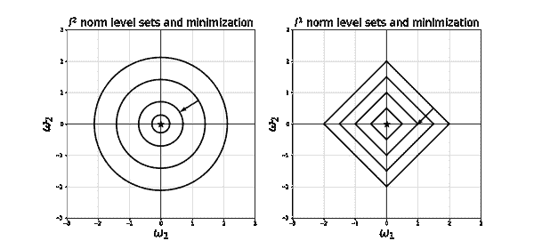

###### 图 4-13。左侧的图显示了 <math alttext="l squared"><msup><mi>l</mi> <mn>2</mn></msup></math> 范数的圆形级别集，以及梯度下降沿着朝向最小值 <math alttext="left-parenthesis 0 comma 0 right-parenthesis"><mrow><mo>(</mo> <mn>0</mn> <mo>,</mo> <mn>0</mn> <mo>)</mo></mrow></math> 的方向。右侧的图显示了 <math alttext="l Superscript 1"><msup><mi>l</mi> <mn>1</mn></msup></math> 范数的菱形级别集，以及梯度下降沿着朝向最小值 <math alttext="left-parenthesis 0 comma 0 right-parenthesis"><mrow><mo>(</mo> <mn>0</mn> <mo>,</mo> <mn>0</mn> <mo>)</mo></mrow></math> 的方向。

+   如果我们使用 <math alttext="l squared"><msup><mi>l</mi> <mn>2</mn></msup></math> 范数，权重的大小会变小，而不会将它们彻底消除。图 4-13 中左侧的图显示了二维空间中 <math alttext="parallel-to ModifyingAbove omega With right-arrow parallel-to equals omega 1 squared plus omega 2 squared"><mrow><mrow><mo>∥</mo></mrow> <mover accent="true"><mi>ω</mi> <mo>→</mo></mover> <msub><mrow><mo>∥</mo></mrow> <msup><mi>l</mi> <mn>2</mn></msup></msub> <mo>=</mo> <msubsup><mi>ω</mi> <mn>1</mn> <mn>2</mn></msubsup> <mo>+</mo> <msubsup><mi>ω</mi> <mn>2</mn> <mn>2</mn></msubsup></mrow></math> 的圆形级别集，沿着垂直于圆形级别集的路径朝向最小值 <math alttext="left-parenthesis 0 comma 0 right-parenthesis"><mrow><mo>(</mo> <mn>0</mn> <mo>,</mo> <mn>0</mn> <mo>)</mo></mrow></math> 减少了 <math alttext="omega 1"><msub><mi>ω</mi> <mn>1</mn></msub></math> 和 <math alttext="omega 2"><msub><mi>ω</mi> <mn>2</mn></math> 的值，而不会使它们中的任何一个在另一个之前变为零。

选择哪种范数取决于我们的用例。请注意，在所有情况下，我们不对偏置权重 <math alttext="ModifyingAbove omega 0 With right-arrow"><mover accent="true"><msub><mi>ω</mi> <mn>0</mn></msub> <mo>→</mo></mover></math> 进行正则化。这就是为什么在本节中我们在损失函数中单独写出它们的原因 <math alttext="upper L left-parenthesis ModifyingAbove omega With right-arrow comma ModifyingAbove omega 0 With right-arrow right-parenthesis"><mrow><mi>L</mi> <mo>(</mo> <mover accent="true"><mi>ω</mi> <mo>→</mo></mover> <mo>,</mo> <mover accent="true"><msub><mi>ω</mi> <mn>0</mn></msub> <mo>→</mo></mover> <mo>)</mo></mrow></math> 。

## 解释正则化超参数 <math alttext="alpha"><mi>α</mi></math> 的作用

带有权重衰减正则化的最小化问题如下所示：

<math alttext="dollar-sign min Underscript ModifyingAbove omega With right-arrow Endscripts upper L left-parenthesis ModifyingAbove omega With right-arrow right-parenthesis plus alpha parallel-to ModifyingAbove omega With right-arrow parallel-to dollar-sign"><mrow><msub><mo form="prefix" movablelimits="true">min</mo> <mover accent="true"><mi>ω</mi> <mo>→</mo></mover></msub> <mi>L</mi> <mrow><mo>(</mo> <mover accent="true"><mi>ω</mi> <mo>→</mo></mover> <mo>)</mo></mrow> <mo>+</mo> <mi>α</mi> <mrow><mo>∥</mo> <mover accent="true"><mi>ω</mi> <mo>→</mo></mover> <mo>∥</mo></mrow></mrow></math>

为了理解正则化超参数 <math alttext="alpha"><mi>α</mi></math> 的作用，我们观察到以下内容：

+   第一个术语之间存在竞争，其中损失函数 <math alttext="upper L left-parenthesis ModifyingAbove omega With right-arrow right-parenthesis"><mrow><mi>L</mi> <mo>(</mo> <mover accent="true"><mi>ω</mi> <mo>→</mo></mover> <mo>)</mo></mrow></math> 选择适合训练数据的训练函数的 <math alttext="omega"><mi>ω</mi></math> ，而第二个术语只关心使 <math alttext="omega"><mi>ω</mi></math> 的值变小。这两个目标不一定同步：使第一个术语变小的 <math alttext="omega"><mi>ω</mi></math> 的值可能会使第二个术语变大，反之亦然。

+   如果 <math alttext="alpha"><mi>α</mi></math> 很大，那么最小化过程将通过使 <math alttext="omega"><mi>ω</mi></math> 的值非常小来进行补偿，无论这些小值的 <math alttext="omega"><mi>ω</mi></math> 是否也会使第一项变小。因此，我们增加 <math alttext="alpha"><mi>α</mi></math> 的值，第二项的最小化变得比第一项更重要，因此我们最终的模型可能最终不能完全拟合数据（高偏差），但有时这是期望的（低方差），以便它能很好地推广到未知数据。

+   另一方面，如果 <math alttext="alpha"><mi>α</mi></math> 很小（接近零），那么我们可以选择更大的 <math alttext="omega"><mi>ω</mi></math> 值，并且最小化第一项变得更加重要。在这种情况下，最小化过程将导致使第一项满意的 <math alttext="omega"><mi>ω</mi></math> 值，因此数据将很好地适应模型（低偏差），但方差可能很高。在这种情况下，我们的模型在已知数据上表现良好（通过最小化 <math alttext="upper L left-parenthesis ModifyingAbove omega With right-arrow right-parenthesis"><mrow><mi>L</mi> <mo>(</mo> <mover accent="true"><mi>ω</mi> <mo>→</mo></mover> <mo>)</mo></mrow></math> 来设计得很好），但可能不会很好地推广到未知数据。

+   当 <math alttext="alpha right-arrow 0"><mrow><mi>α</mi> <mo>→</mo> <mn>0</mn></mrow></math> 时，我们可以数学上证明正则化问题的解收敛到未正则化问题的解。

# 出现在机器学习中的超参数示例

我们现在已经遇到了许多进入机器学习模型的超参数。列出进入我们特定模型的超参数及其值是一个好习惯。让我们列出我们遇到的超参数，并记住调整这些参数可以提高我们模型的性能。大多数情况下，我们可以使用预先推荐的值。这些通常作为机器学习库和软件包中的默认值实现。然而，在建模过程的验证阶段，尽管需要有可用的时间和资源，尝试不同的值总是一个好主意。

+   梯度下降中的学习率。

+   权重衰减系数，如 Ridge、Lasso 和 Elastic Net 正则化中出现的系数。

+   在停止训练之前的时代数量。

+   数据分割成训练、验证和测试子集的大小。

+   随机梯度下降及其变体中的小批量大小。

+   动量方法中的加速系数。

+   神经网络的架构：层数、每层神经元数量、每层发生的情况（批量归一化、激活函数类型）、正则化类型（dropout、ridge、lasso）、网络类型（前馈、稠密、卷积、对抗、循环）、损失函数类型等。

# 链式法则和反向传播：计算 <math alttext="normal nabla upper L left-parenthesis ModifyingAbove omega With right-arrow Superscript i Baseline right-parenthesis"><mrow><mi>∇</mi> <mi>L</mi> <mo>(</mo> <msup><mover accent="true"><mi>ω</mi> <mo>→</mo></mover> <mi>i</mi></msup> <mo>)</mo></mrow></math>

现在是时候动手计算一些重要的东西了：损失函数的梯度，即，<math alttext="normal nabla upper L left-parenthesis ModifyingAbove omega With right-arrow Superscript i Baseline right-parenthesis"><mrow><mi>∇</mi> <mi>L</mi> <mo>(</mo> <msup><mover accent="true"><mi>ω</mi> <mo>→</mo></mover> <mi>i</mi></msup> <mo>)</mo></mrow></math> 。无论我们决定使用梯度下降、随机梯度下降、小批量梯度下降或任何其他梯度下降的变体来找到最佳权重，都无法避免计算这个量。请记住，损失函数在其公式中包含了神经网络的训练函数，而训练函数又由后续的线性组合和激活函数组成。这意味着我们必须使用链式法则。聪明地使用。在微积分中，我们只使用了单变量的导数链式法则，但现在，我们不得不过渡到多变量的链式法则：有时是数十亿个变量。

神经网络的分层架构迫使我们停下来思考：我们究竟如何计算损失函数的导数。这里的工作马是*反向传播*算法（也称为*反向模式自动微分*），它是一个强大的算法。

在写出公式之前，让我们总结一下训练神经网络时遵循的步骤：

+   训练函数是一个关于 <math alttext="ModifyingAbove omega With right-arrow"><mover accent="true"><mi>ω</mi> <mo>→</mo></mover></math> 的函数，因此数据点通过它后神经网络的结果，也就是在数据点上评估训练函数，是： <math alttext="o u t c o m e equals f u n c t i o n left-parenthesis ModifyingAbove omega With right-arrow right-parenthesis"><mrow><mi>o</mi> <mi>u</mi> <mi>t</mi> <mi>c</mi> <mi>o</mi> <mi>m</mi> <mi>e</mi> <mo>=</mo> <mi>f</mi> <mi>u</mi> <mi>n</mi> <mi>c</mi> <mi>t</mi> <mi>i</mi> <mi>o</mi> <mi>n</mi> <mo>(</mo> <mover accent="true"><mi>ω</mi> <mo>→</mo></mover> <mo>)</mo></mrow></math> 。这由节点输出的线性组合和激活函数组成，重复在所有网络层上。输出层可能有或没有激活函数，可能有一个节点或多个节点，取决于网络的最终任务。

+   损失函数提供了训练函数的结果与真实值偏离的程度的度量。

+   我们使用一个*随机*的权重集 <math alttext="ModifyingAbove omega With right-arrow Superscript 0"><msup><mover accent="true"><mi>ω</mi> <mo>→</mo></mover> <mn>0</mn></msup></math> 来初始化我们的学习函数，根据前几节中规定的首选初始化规则。然后我们计算损失，或者因为使用这些特定权重值而导致的错误。*这是数据点通过网络的前向传递*。

+   我们希望移动到下一个给出更低错误的权重集 <math alttext="ModifyingAbove omega With right-arrow Superscript 1"><msup><mover accent="true"><mi>ω</mi> <mo>→</mo></mover> <mn>1</mn></msup></math> 。我们沿着损失函数的梯度向量的相反方向移动。

+   但是：训练函数内置于损失函数中，考虑到神经网络的架构以及其高维度，我们如何有效地执行多变量链式法则，以找到梯度并在当前权重集上评估它呢？

答案是我们将数据点发送回网络，从输出层一直向输入层计算梯度*向后*，在途中评估*每个节点如何导致错误*。实质上，我们计算<math alttext="StartFraction normal partial-differential upper L Over normal partial-differential node functions EndFraction">∂L/∂node functions，*然后相应地调整权重*，从<math alttext="ModifyingAbove omega With right-arrow Superscript 0">ω⁰</math>更新到<math alttext="ModifyingAbove omega With right-arrow Superscript 1">ω¹</math>。随着我们将更多数据点传递到网络中，这个过程会继续进行，通常是批量进行。每当网络*看到*完整的训练集时，就会计算一个*epoch*。

### 反向传播与我们大脑学习的方式并没有太大不同

当我们遇到一个新的数学概念时，我们大脑中的神经元会建立某些连接。下次我们再次看到相同的概念时，相同的神经元连接得更好。对于我们的神经网络的类比是，连接神经元的边的值<math alttext="omega">ω</math>增加。当我们一遍又一遍地看到相同的概念时，它成为我们大脑模型的一部分。除非我们学到了撤销先前信息的新信息，否则这个模型不会改变。在这种情况下，神经元之间的连接会减弱。对于我们的神经网络，连接神经元的<math alttext="omega">ω</math>值会减少。通过最小化损失函数来微调<math alttext="omega">ω</math>，正是为了*建立神经元之间的正确连接*。

神经科学家唐纳德·赫布在他 1949 年的著作中提到（paraphrased）：*当一个生物神经元经常触发另一个神经元时，这两个神经元之间的连接会变得更加牢固。换句话说，一起激活的细胞会一起连接。*

同样，神经网络的计算模型考虑了网络产生结果时所产生的错误：由于计算机只能理解数字，如果节点有助于降低错误，则边的<math alttext="omega">ω</math>会增加，如果节点有助于增加错误函数，则<math alttext="omega">ω</math>会减少。因此，神经网络的学习规则通过增加相应的<math alttext="omega">ω</math>来加强减少错误的连接，并通过减少相应的<math alttext="omega">ω</math>来削弱增加错误的连接。

### 为什么反向传播更好？

反向传播计算训练函数对每个节点的导数，通过网络向*后*移动。这衡量了每个节点对训练函数和损失函数的贡献。

这里要记住的最重要的公式是：*微积分中的链式法则*。这计算了*链式*函数（或函数组合）的导数。微积分的链式法则主要处理只依赖于一个变量<math alttext="omega">ω</math>的函数，例如，对于三个链式函数，关于<math alttext="omega">ω</math>的导数是：

<math alttext="dollar-sign StartFraction d Over d omega EndFraction f 3 left-parenthesis f 2 left-parenthesis f 1 left-parenthesis omega right-parenthesis right-parenthesis right-parenthesis equals StartSet StartFraction d Over d omega EndFraction f 1 left-parenthesis omega right-parenthesis EndSet StartSet StartFraction d Over d f 1 EndFraction f 2 left-parenthesis f 1 left-parenthesis omega right-parenthesis right-parenthesis EndSet StartSet StartFraction d Over f 2 EndFraction f 3 left-parenthesis f 2 left-parenthesis f 1 left-parenthesis omega right-parenthesis right-parenthesis right-parenthesis EndSet dollar-sign"><mrow><mfrac><mi>d</mi> <mrow><mi>d</mi><mi>ω</mi></mrow></mfrac> <msub><mi>f</mi> <mn>3</mn></msub> <mrow><mo>(</mo> <msub><mi>f</mi> <mn>2</mn></msub> <mrow><mo>(</mo> <msub><mi>f</mi> <mn>1</mn></msub> <mrow><mo>(</mo> <mi>ω</mi> <mo>)</mo></mrow> <mo>)</mo></mrow> <mo>)</mo></mrow> <mo>=</mo> <mrow><mo>{</mo> <mfrac><mi>d</mi> <mrow><mi>d</mi><mi>ω</mi></mrow></mfrac> <msub><mi>f</mi> <mn>1</mn></msub> <mrow><mo>(</mo> <mi>ω</mi> <mo>)</mo></mrow> <mo>}</mo></mrow> <mrow><mo>{</mo> <mfrac><mi>d</mi> <mrow><mi>d</mi><msub><mi>f</mi> <mn>1</mn></msub></mrow></mfrac> <msub><mi>f</mi> <mn>2</mn></msub> <mrow><mo>(</mo> <msub><mi>f</mi> <mn>1</mn></msub> <mrow><mo>(</mo> <mi>ω</mi> <mo>)</mo></mrow> <mo>)</mo></mrow> <mo>}</mo></mrow> <mrow><mo>{</mo> <mfrac><mi>d</mi> <msub><mi>f</mi> <mn>2</mn></msub></mfrac> <msub><mi>f</mi> <mn>3</mn></msub> <mrow><mo>(</mo> <msub><mi>f</mi> <mn>2</mn></msub> <mrow><mo>(</mo> <msub><mi>f</mi> <mn>1</mn></msub> <mrow><mo>(</mo> <mi>ω</mi> <mo>)</mo></mrow> <mo>)</mo></mrow> <mo>)</mo></mrow> <mo>}</mo></mrow></mrow></math>

对于神经网络，我们必须将链式法则应用于依赖于变量*W*和<math alttext="ModifyingAbove omega 0 With right-arrow"><mover accent="true"><msub><mi>ω</mi> <mn>0</mn></msub> <mo>→</mo></mover></math> 的矩阵和向量的损失函数。因此，我们必须将上述规则推广到*许多变量的链式法则*。这样做的最简单方法是按照网络的结构计算导数，从输出层一直回溯到输入层。

如果我们决定通过网络向前计算导数，我们将不知道这些导数对每个变量的影响是否最终会对我们的最终结果产生影响，因为我们不知道它们是否会通过网络的图连接。即使图是完全连接的，深层的权重也不会出现在较早的层中，因此在早期层中计算它们的导数是一种巨大的浪费。

当我们通过网络向后计算导数时，我们从输出开始，沿着网络的图向后计算导数，计算每个节点的导数。每个节点的贡献仅从指向它的边和从它出去的边计算。这在计算上要便宜得多，因为现在我们确切知道这些节点如何以及何时对网络的结果产生影响。

在线性代数中，计算矩阵与向量的乘积要比计算两个矩阵的乘积便宜得多。我们必须始终避免将两个矩阵相乘：计算<math alttext="upper A left-parenthesis upper B bold v right-parenthesis"><mrow><mi>A</mi> <mo>(</mo> <mi>B</mi> <mi>𝐯</mi> <mo>)</mo></mrow></math>比计算<math alttext="left-parenthesis upper A upper B right-parenthesis bold v"><mrow><mo>(</mo> <mi>A</mi> <mi>B</mi> <mo>)</mo> <mi>𝐯</mi></mrow></math>要便宜，尽管从理论上讲，这两者完全相同。对于大型矩阵和向量，这个简单的观察提供了巨大的成本节约。

### 反向传播详细说明

让我们停下来感谢软件包的存在，这样我们就永远不必自己实现以下计算。我们也不要忘记感谢这些软件包的创造者。现在我们开始计算。

对于具有*h*个隐藏层的神经网络，我们可以将损失函数写成训练函数的函数，而训练函数又是网络中出现的所有权重的函数：

<math alttext="dollar-sign upper L equals upper L left-parenthesis g left-parenthesis upper W Superscript 1 Baseline comma ModifyingAbove omega 0 With right-arrow Superscript 1 Baseline comma upper W squared comma ModifyingAbove omega 0 With right-arrow squared comma ellipsis comma upper W Superscript h Baseline comma ModifyingAbove omega 0 With right-arrow Superscript h Baseline comma upper W Superscript h plus 1 Baseline comma ModifyingAbove omega 0 With right-arrow Superscript h plus 1 Baseline right-parenthesis right-parenthesis dollar-sign"><mrow><mi>L</mi> <mo>=</mo> <mi>L</mi> <mo>(</mo> <mi>g</mi> <mrow><mo>(</mo> <msup><mi>W</mi> <mn>1</mn></msup> <mo>,</mo> <msup><mover accent="true"><msub><mi>ω</mi> <mn>0</mn></msub> <mo>→</mo></mover> <mn>1</mn></msup> <mo>,</mo> <msup><mi>W</mi> <mn>2</mn></msup> <mo>,</mo> <msup><mover accent="true"><msub><mi>ω</mi> <mn>0</mn></msub> <mo>→</mo></mover> <mn>2</mn></msup> <mo>,</mo> <mo>⋯</mo> <mo>,</mo> <msup><mi>W</mi> <mi>h</mi></msup> <mo>,</mo> <msup><mover accent="true"><msub><mi>ω</mi> <mn>0</mn></msub> <mo>→</mo></mover> <mi>h</mi></msup> <mo>,</mo> <msup><mi>W</mi> <mrow><mi>h</mi><mo>+</mo><mn>1</mn></mrow></msup> <mo>,</mo> <msup><mover accent="true"><msub><mi>ω</mi> <mn>0</mn></msub> <mo>→</mo></mover> <mrow><mi>h</mi><mo>+</mo><mn>1</mn></mrow></msup> <mo>)</mo></mrow> <mo>)</mo></mrow></math>

我们将反向计算*L*的偏导数，从<math alttext="分数正常偏导数上标 L 除以正常偏导数上标 W 上标 h 加 1"><mfrac><mrow><mi>∂</mi><mi>L</mi></mrow> <mrow><mi>∂</mi><msup><mi>W</mi> <mrow><mi>h</mi><mo>+</mo><mn>1</mn></mrow></msup></mrow></mfrac></math>开始，并从<math alttext="分数正常偏导数上标 L 除以正常偏导数用右箭头上标 h 加 1 的 omega0"><mfrac><mrow><mi>∂</mi><mi>L</mi></mrow> <mrow><mi>∂</mi><msup><mover accent="true"><msub><mi>ω</mi> <mn>0</mn></msub> <mo>→</mo></mover> <mrow><mi>h</mi><mo>+</mo><mn>1</mn></mrow></msup></mrow></mfrac></math>开始，逐步回溯到<math alttext="分数正常偏导数上标 L 除以正常偏导数上标 W 上标 1"><mfrac><mrow><mi>∂</mi><mi>L</mi></mrow> <mrow><mi>∂</mi><msup><mi>W</mi> <mn>1</mn></msup></mrow></mfrac></math>和<math alttext="分数正常偏导数上标 L 除以正常偏导数用右箭头上标 1 的 omega0"><mfrac><mrow><mi>∂</mi><mi>L</mi></mrow> <mrow><mi>∂</mi><msup><mover accent="true"><msub><mi>ω</mi> <mn>0</mn></msub> <mo>→</mo></mover> <mn>1</mn></msup></mrow></mfrac></math>。它们的导数是相对于相应矩阵或向量中的每个条目进行的。

假设为简单起见，但不失一般性，网络是一个回归网络，预测单个数值，因此训练函数*g*是标量（不是向量）。假设我们在整个网络中使用相同的激活函数*f*。输出神经元没有激活，因为这是一个回归问题。

对指向输出层的权重的导数：

<math alttext="dollar-sign upper L equals upper L left-parenthesis upper W Superscript h plus 1 Baseline ModifyingAbove s With right-arrow Superscript h Baseline plus omega 0 Superscript h plus 1 Baseline right-parenthesis dollar-sign"><mrow><mi>L</mi> <mo>=</mo> <mi>L</mi> <mo>(</mo> <msup><mi>W</mi> <mrow><mi>h</mi><mo>+</mo><mn>1</mn></mrow></msup> <msup><mover accent="true"><mi>s</mi> <mo>→</mo></mover> <mi>h</mi></msup> <mo>+</mo> <msubsup><mi>ω</mi> <mn>0</mn> <mrow><mi>h</mi><mo>+</mo><mn>1</mn></mrow></msubsup> <mo>)</mo></mrow></math>

因此

<math alttext="dollar-sign StartFraction normal partial-differential upper L Over normal partial-differential omega 0 Superscript h plus 1 Baseline EndFraction equals 1 times upper L prime left-parenthesis upper W Superscript h plus 1 Baseline ModifyingAbove s With right-arrow Superscript h Baseline plus omega 0 Superscript h plus 1 Baseline right-parenthesis dollar-sign"><mrow><mfrac><mrow><mi>∂</mi><mi>L</mi></mrow> <mrow><mi>∂</mi><msubsup><mi>ω</mi> <mn>0</mn> <mrow><mi>h</mi><mo>+</mo><mn>1</mn></mrow></msubsup></mrow></mfrac> <mo>=</mo> <mn>1</mn> <mo>×</mo> <msup><mi>L</mi> <mo>'</mo></msup> <mrow><mo>(</mo> <msup><mi>W</mi> <mrow><mi>h</mi><mo>+</mo><mn>1</mn></mrow></msup> <msup><mover accent="true"><mi>s</mi> <mo>→</mo></mover> <mi>h</mi></msup> <mo>+</mo> <msubsup><mi>ω</mi> <mn>0</mn> <mrow><mi>h</mi><mo>+</mo><mn>1</mn></mrow></msubsup> <mo>)</mo></mrow></mrow></math>

和

<math alttext="dollar-sign StartFraction normal partial-differential upper L Over normal partial-differential upper W Superscript h plus 1 Baseline EndFraction equals left-parenthesis ModifyingAbove s With right-arrow Superscript h Baseline right-parenthesis Superscript t Baseline upper L prime left-parenthesis upper W Superscript h plus 1 Baseline ModifyingAbove s With right-arrow Superscript h Baseline plus omega 0 Superscript h plus 1 Baseline right-parenthesis period dollar-sign"><mrow><mfrac><mrow><mi>∂</mi><mi>L</mi></mrow> <mrow><mi>∂</mi><msup><mi>W</mi> <mrow><mi>h</mi><mo>+</mo><mn>1</mn></mrow></msup></mrow></mfrac> <mo>=</mo> <msup><mrow><mo>(</mo><msup><mover accent="true"><mi>s</mi> <mo>→</mo></mover> <mi>h</mi></msup> <mo>)</mo></mrow> <mi>t</mi></msup> <msup><mi>L</mi> <mo>'</mo></msup> <mrow><mo>(</mo> <msup><mi>W</mi> <mrow><mi>h</mi><mo>+</mo><mn>1</mn></mrow></msup> <msup><mover accent="true"><mi>s</mi> <mo>→</mo></mover> <mi>h</mi></msup> <mo>+</mo> <msubsup><mi>ω</mi> <mn>0</mn> <mrow><mi>h</mi><mo>+</mo><mn>1</mn></mrow></msubsup> <mo>)</mo></mrow> <mo>.</mo></mrow></math>

回想一下，<math alttext="用右箭头上标 h 修改 s"><msup><mover accent="true"><mi>s</mi> <mo>→</mo></mover> <mi>h</mi></msup></math> 是最后一层的输出，因此它取决于前几层的所有权重，即，<math alttext="左括号上标 W1 逗号用右箭头上标 1 修改的 omega0 逗号上标 W 平方逗号用右箭头平方的 omega0 逗号省略号上标 h 逗号用右箭头上标 h 右括号"><mrow><mo>(</mo> <msup><mi>W</mi> <mn>1</mn></msup> <mo>,</mo> <msup><mover accent="true"><msub><mi>ω</mi> <mn>0</mn></msub> <mo>→</mo></mover> <mn>1</mn></msup> <mo>,</mo> <msup><mi>W</mi> <mn>2</mn></msup> <mo>,</mo> <msup><mover accent="true"><msub><mi>ω</mi> <mn>0</mn></msub> <mo>→</mo></mover> <mn>2</mn></msup> <mo>,</mo> <mo>⋯</mo> <mo>,</mo> <msup><mi>W</mi> <mi>h</mi></msup> <mo>,</mo> <msup><mover accent="true"><msub><mi>ω</mi> <mn>0</mn></msub> <mo>→</mo></mover> <mi>h</mi></msup> <mo>)</mo></mrow></math>。

对指向最后隐藏层的权重的导数

要计算这些导数，我们在损失函数的公式中明确显示它们：

<math alttext="dollar-sign upper L equals upper L left-parenthesis upper W Superscript h plus 1 Baseline left-parenthesis f left-parenthesis upper W Superscript h Baseline ModifyingAbove s With right-arrow Superscript h minus 1 Baseline plus ModifyingAbove omega 0 With right-arrow Superscript h Baseline right-parenthesis right-parenthesis plus omega 0 Superscript h plus 1 Baseline right-parenthesis dollar-sign"><mrow><mi>L</mi> <mo>=</mo> <mi>L</mi> <mo>(</mo> <msup><mi>W</mi> <mrow><mi>h</mi><mo>+</mo><mn>1</mn></mrow></msup> <mrow><mo>(</mo> <mi>f</mi> <mrow><mo>(</mo> <msup><mi>W</mi> <mi>h</mi></msup> <msup><mover accent="true"><mi>s</mi> <mo>→</mo></mover> <mrow><mi>h</mi><mo>-</mo><mn>1</mn></mrow></msup> <mo>+</mo> <msup><mover accent="true"><msub><mi>ω</mi> <mn>0</mn></msub> <mo>→</mo></mover> <mi>h</mi></msup> <mo>)</mo></mrow> <mo>)</mo></mrow> <mo>+</mo> <msubsup><mi>ω</mi> <mn>0</mn> <mrow><mi>h</mi><mo>+</mo><mn>1</mn></mrow></msubsup> <mo>)</mo></mrow></math>

因此

<math alttext="dollar-sign StartFraction normal partial-differential upper L Over normal partial-differential ModifyingAbove omega 0 With right-arrow Superscript h Baseline EndFraction equals ModifyingAbove 1 With right-arrow left-parenthesis upper W Superscript h plus 1 Baseline f prime left-parenthesis upper W Superscript h Baseline ModifyingAbove s With right-arrow Superscript h minus 1 Baseline plus ModifyingAbove omega 0 With right-arrow Superscript h Baseline right-parenthesis right-parenthesis upper L prime left-parenthesis upper W Superscript h plus 1 Baseline left-parenthesis f left-parenthesis upper W Superscript h Baseline ModifyingAbove s With right-arrow Superscript h minus 1 Baseline plus ModifyingAbove omega 0 With right-arrow Superscript h Baseline right-parenthesis right-parenthesis plus omega 0 Superscript h plus 1 Baseline right-parenthesis dollar-sign"><mrow><mfrac><mrow><mi>∂</mi><mi>L</mi></mrow> <mrow><mi>∂</mi><msup><mover accent="true"><msub><mi>ω</mi> <mn>0</mn></msub> <mo>→</mo></mover> <mi>h</mi></msup></mrow></mfrac> <mo>=</mo> <mover accent="true"><mn>1</mn> <mo>→</mo></mover> <mrow><mo>(</mo> <msup><mi>W</mi> <mrow><mi>h</mi><mo>+</mo><mn>1</mn></mrow></msup> <msup><mi>f</mi> <mo>'</mo></msup> <mrow><mo>(</mo> <msup><mi>W</mi> <mi>h</mi></msup> <msup><mover accent="true"><mi>s</mi> <mo>→</mo></mover> <mrow><mi>h</mi><mo>-</mo><mn>1</mn></mrow></msup> <mo>+</mo> <msup><mover accent="true"><msub><mi>ω</mi> <mn>0</mn></msub> <mo>→</mo></mover> <mi>h</mi></msup> <mo>)</mo></mrow> <mo>)</mo></mrow> <msup><mi>L</mi> <mo>'</mo></msup> <mrow><mo>(</mo> <msup><mi>W</mi> <mrow><mi>h</mi><mo>+</mo><mn>1</mn></mrow></msup> <mrow><mo>(</mo> <mi>f</mi> <mrow><mo>(</mo> <msup><mi>W</mi> <mi>h</mi></msup> <msup><mover accent="true"><mi>s</mi> <mo>→</mo></mover> <mrow><mi>h</mi><mo>-</mo><mn>1</mn></mrow></msup> <mo>+</mo> <msup><mover accent="true"><msub><mi>ω</mi> <mn>0</mn></msub> <mo>→</mo></mover> <mi>h</mi></msup> <mo>)</mo></mrow> <mo>)</mo></mrow> <mo>+</mo> <msubsup><mi>ω</mi> <mn>0</mn> <mrow><mi>h</mi><mo>+</mo><mn>1</mn></mrow></msubsup> <mo>)</mo></mrow></mrow></math>

和

<math alttext="dollar-sign StartFraction normal partial-differential upper L Over normal partial-differential upper W Superscript h Baseline EndFraction equals ModifyingAbove s With right-arrow Superscript h minus 1 Baseline left-parenthesis upper W Superscript h plus 1 Baseline f prime left-parenthesis upper W Superscript h Baseline ModifyingAbove s With right-arrow Superscript h minus 1 Baseline plus ModifyingAbove omega 0 With right-arrow Superscript h Baseline right-parenthesis right-parenthesis upper L prime left-parenthesis upper W Superscript h plus 1 Baseline left-parenthesis f left-parenthesis upper W Superscript h Baseline ModifyingAbove s With right-arrow Superscript h minus 1 Baseline plus ModifyingAbove omega 0 With right-arrow Superscript h Baseline right-parenthesis right-parenthesis plus omega 0 Superscript h plus 1 Baseline right-parenthesis dollar-sign"><mrow><mfrac><mrow><mi>∂</mi><mi>L</mi></mrow> <mrow><mi>∂</mi><msup><mi>W</mi> <mi>h</mi></msup></mrow></mfrac> <mo>=</mo> <msup><mover accent="true"><mi>s</mi> <mo>→</mo></mover> <mrow><mi>h</mi><mo>-</mo><mn>1</mn></mrow></msup> <mrow><mo>(</mo> <msup><mi>W</mi> <mrow><mi>h</mi><mo>+</mo><mn>1</mn></mrow></msup> <msup><mi>f</mi> <mo>'</mo></msup> <mrow><mo>(</mo> <msup><mi>W</mi> <mi>h</mi></msup> <msup><mover accent="true"><mi>s</mi> <mo>→</mo></mover> <mrow><mi>h</mi><mo>-</mo><mn>1</mn></mrow></msup> <mo>+</mo> <msup><mover accent="true"><msub><mi>ω</mi> <mn>0</mn></msub> <mo>→</mo></mover> <mi>h</mi></msup> <mo>)</mo></mrow> <mo>)</mo></mrow> <msup><mi>L</mi> <mo>'</mo></msup> <mrow><mo>(</mo> <msup><mi>W</mi> <mrow><mi>h</mi><mo>+</mo><mn>1</mn></mrow></msup> <mrow><mo>(</mo> <mi>f</mi> <mrow><mo>(</mo> <msup><mi>W</mi> <mi>h</mi></msup> <msup><mover accent="true"><mi>s</mi> <mo>→</mo></mover> <mrow><mi>h</mi><mo>-</mo><mn>1</mn></mrow></msup> <mo>+</mo> <msup><mover accent="true"><msub><mi>ω</mi> <mn>0</mn></msub> <mo>→</mo></mover> <mi>h</mi></msup> <mo>)</mo></mrow> <mo>)</mo></mrow> <mo>+</mo> <msubsup><mi>ω</mi> <mn>0</mn> <mrow><mi>h</mi><mo>+</mo><mn>1</mn></mrow></msubsup> <mo>)</mo></mrow></mrow></math>

回想一下<math alttext="ModifyingAbove s With right-arrow Superscript h minus 1"><msup><mover accent="true"><mi>s</mi> <mo>→</mo></mover> <mrow><mi>h</mi><mo>-</mo><mn>1</mn></mrow></msup></math>是倒数第二个隐藏层的输出，因此它取决于前几层的所有权重，即<math alttext="left-parenthesis upper W Superscript 1 Baseline comma ModifyingAbove omega 0 With right-arrow Superscript 1 Baseline comma upper W squared comma ModifyingAbove omega 0 With right-arrow squared comma ellipsis comma upper W Superscript h minus 1 Baseline comma ModifyingAbove omega 0 With right-arrow Superscript h minus 1 Baseline right-parenthesis"><mrow><mo>(</mo> <msup><mi>W</mi> <mn>1</mn></msup> <mo>,</mo> <msup><mover accent="true"><msub><mi>ω</mi> <mn>0</mn></msub> <mo>→</mo></mover> <mn>1</mn></msup> <mo>,</mo> <msup><mi>W</mi> <mn>2</mn></msup> <mo>,</mo> <msup><mover accent="true"><msub><mi>ω</mi> <mn>0</mn></msub> <mo>→</mo></mover> <mn>2</mn></msup> <mo>,</mo> <mo>⋯</mo> <mo>,</mo> <msup><mi>W</mi> <mrow><mi>h</mi><mo>-</mo><mn>1</mn></mrow></msup> <mo>,</mo> <msup><mover accent="true"><msub><mi>ω</mi> <mn>0</mn></msub> <mo>→</mo></mover> <mrow><mi>h</mi><mo>-</mo><mn>1</mn></mrow></msup> <mo>)</mo></mrow></math>。

我们系统地继续这个过程，直到达到输入层。

# 评估输入数据特征的重要性

数据分析师的一个目标是评估输入变量（数据特征）与输出或目标变量之间的相关性。

这里要回答的主要问题是：*如果我们调整某个输入变量的值，输出的相对变化是多少？*

例如，如果在给定的公交线路上增加一辆公交车，是否会影响整体的公交车乘客量？

我们所问的数学问题是一个*导数*问题：找到关于所讨论的输入变量的输出的偏导数。

在模型是线性的时候（敏感性分析），我们在统计学上有大量关于变量重要性的文献。当模型是非线性的，比如我们的神经网络模型时，相关文献就不那么多了。我们不能基于非线性模型做出预测，然后使用为线性模型设计的变量重要性分析。许多数据分析师在他们的分析中使用内置软件包时会陷入这种陷阱。这是另一个寻求深入理解我们基于业务决策的模型假设的原因。

# 总结和展望

这一章代表了我们正式进入人工智能领域的深度学习时代。虽然第三章介绍了传统但仍然非常有用的机器学习模型，第四章将神经网络添加到我们的机器学习模型库中。这两章都建立在训练函数、损失函数和优化的一般数学结构上，其中每个都针对特定任务和手头的模型进行了定制。

通过在神经网络的每个神经元上使用非线性激活函数，跨多个层，我们的训练函数能够捕捉到数据中复杂的特征，这些特征很难用非线性函数的显式公式描述。数学分析，特别是神经网络的通用逼近定理，支持这种直觉，并提供了一个理论背景，证明了神经网络的巨大成功。然而，这些定理仍然缺乏能力为我们提供一个构建特定任务和数据集的特殊网络的地图，因此我们必须尝试各种架构、正则化、超参数，直到我们获得一个在新的和未知数据上表现良好的神经网络模型。

神经网络非常适合处理具有大数据集的大问题。对于这样的大问题，优化任务需要高效且计算成本低廉的方法，尽管在这种规模下的所有计算都可以被视为昂贵的。随机梯度下降是流行的优化方法选择，而反向传播算法是这种方法的核心。更具体地说，反向传播算法计算当前权重选择下损失函数的梯度（或者当我们添加权重衰减正则化时的目标函数）。理解目标函数的景观对于任何优化任务都是至关重要的，作为一个经验法则，凸问题比非凸问题更容易优化。神经网络模型中涉及的损失函数通常是非凸的。

第四章是本书中最后一个基础（且较长）的章节。我们最终可以讨论更专门的人工智能模型，以及在需要时更深入的数学知识。接下来的章节彼此独立，所以按照对您当前应用领域更相关的顺序阅读它们。

最后，让我们总结一下本章中出现的数学内容，随着我们在这个领域的进展，我们必须更详细地阐述：

概率和测度

这是证明通用逼近类型定理所需的，将在概率章节中讨论。这也与与 Dropout 相关的不确定性分析有关。

统计学

在神经网络的每一层进行批量归一化时的输入标准化步骤，以及相关分布的重塑。

优化

梯度下降，随机梯度下降，凸和非凸景观。

线性代数上的微积分

反向传播算法：这是在矩阵函数上应用的微积分链式法则。
