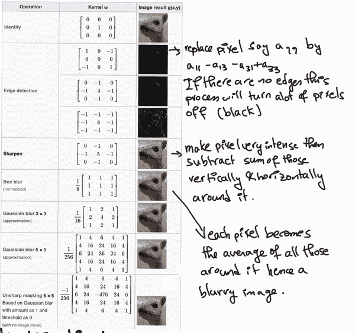
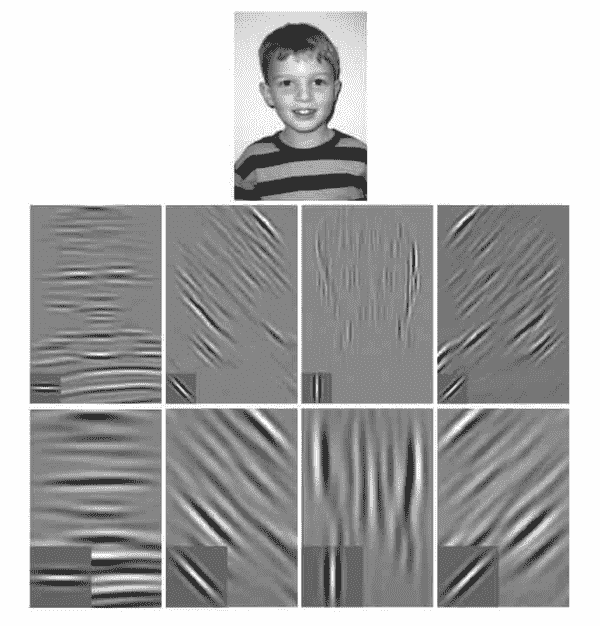
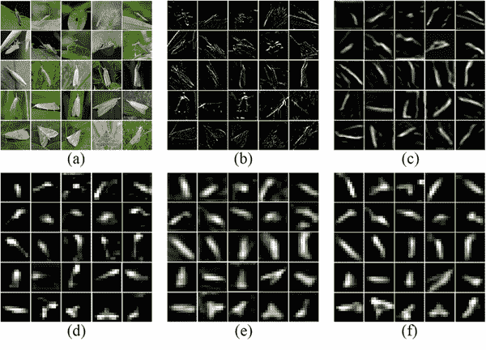
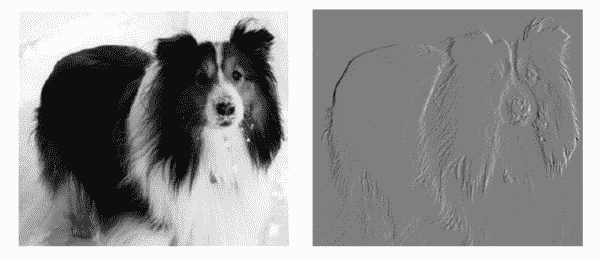
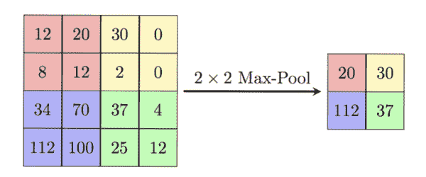
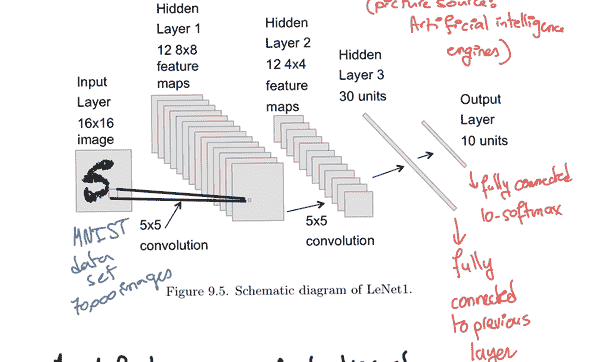
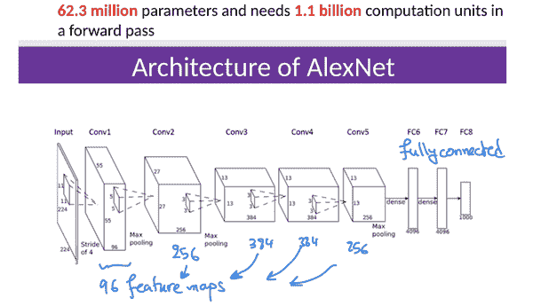
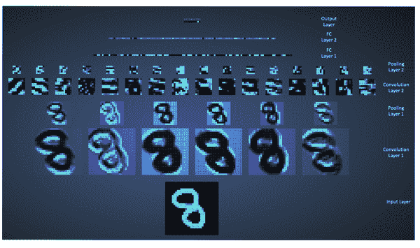

# 第五章：卷积神经网络和计算机视觉

> 他们。能。看见。
> 
> H.

卷积神经网络已经彻底改变了计算机视觉和自然语言处理领域。应用领域，不论与之相关的伦理问题如何，都是无限的：自动驾驶汽车，智能无人机，人脸识别，语音识别，医学影像，生成音频，生成图像，机器人等。

在这一章中，我们从*卷积*和*互相关*的简单定义和解释开始，并强调这两种略有不同的数学运算在机器学习术语中被混淆的事实。我们也犯了同样的错误，将它们混为一谈，但有一个很好的理由。

然后，我们将卷积操作应用于过滤类似网格的信号，这非常适合，比如时间序列数据（一维）、音频数据（一维）和图像（如果图像是灰度的，则为二维，如果是彩色图像，则为三维，额外的维度对应于红色、绿色和蓝色通道）。当数据是一维时，我们使用一维卷积，当数据是二维时，我们使用二维卷积（为了简单和简洁起见，在本章中我们不会进行三维卷积，对应于三维彩色图像，称为*张量*）。换句话说，我们使网络适应数据的形状，这个过程极大地促成了卷积神经网络的成功。这与强制数据适应网络输入形状的做法形成鲜明对比，比如将二维图像展平成一个长向量，以使其适应只接受一维数据作为输入的网络。在后面的章节中，我们将看到同样适用于图神经网络成功的原因是相同的。

接下来，我们将卷积操作融入到前馈神经网络的架构中。卷积操作使网络变得“局部连接”，而不是完全连接。从数学上讲，包含每一层权重的矩阵并不是“密集的”（因此卷积层的大部分权重为零）。此外，权重具有相似的值（权重共享），不像完全连接的神经网络，其中每个输入都分配了不同的权重。因此，包含卷积层权重的矩阵大部分为零，非零部分是“局部化的并且具有相似的值”。对于图像数据或音频数据来说，这是很好的，因为大部分信息都是局部的。此外，这显著减少了我们在优化步骤中需要存储和计算的权重数量，使卷积神经网络成为具有大量输入特征的数据的理想选择（回想一下，对于图像来说，每个像素都是一个特征）。

接着我们讨论*池化*，这是卷积神经网络架构中常见的另一层。与上一章类似，多层结构和每一层的非线性使我们能够从图像中提取越来越复杂的特征，显著增强计算机视觉任务。

一旦我们理解了卷积神经网络的基本解剖结构，就可以直接将相同的数学应用于涉及自然语言处理的任务，比如情感分析、语音识别、音频生成等。相同的数学在计算机视觉和自然语言处理中起作用的事实类似于我们大脑对环境、经历和思维的物理变化能力（大脑的虚拟模拟版本）。即使大脑的某些部分受损，其他部分也可以接管并执行新的功能。例如，致力于视觉的大脑部分在视力受损时可以开始执行听觉或记忆任务。在神经科学中，这被称为神经可塑性。我们离完全理解大脑及其工作原理还有很长的路要走，但对这种现象的最简单解释是大脑中的每个神经元执行相同的基本功能，类似于神经网络中的神经元执行一种基本数学计算（实际上是两种，线性组合然后激活），而是多层次的各种神经连接产生了感知和行为中观察到的复杂性。卷积神经网络实际上受到了大脑视觉新皮层的启发。正是它们在 2012 年在图像分类方面的成功（[AlexNet2012](https://en.wikipedia.org/wiki/AlexNet)）将人工智能重新推回主流，激励了许多人并带领我们走到了这里。如果你有额外的时间，这一章节的一个很好的睡前阅读是关于大脑视觉新皮层功能及其与为计算机视觉设计的卷积神经网络的类比。

# 卷积和互相关

卷积和互相关是稍有不同的操作，测量信号中的不同内容，可以是数字图像、数字音频信号或其他内容。如果我们使用对称函数 k，称为*滤波器*或*核*，它们就完全相同。简而言之，卷积*翻转*滤波器然后沿函数滑动，而互相关在*不翻转*的情况下沿函数滑动滤波器。自然地，如果滤波器恰好是对称的，那么卷积和互相关就完全相同。翻转核的优势在于使卷积操作可交换，这反过来有利于编写理论证明。也就是说，从神经网络的角度来看，可交换性并不重要，有三个原因：

1.  首先，卷积操作通常不会单独出现在神经网络中，而是与其他非线性函数组合在一起，因此无论我们是否翻转内核，我们都会失去交换律。

1.  其次，在训练过程中，神经网络通常会*学习*核中条目的值，因此，它会学习正确位置的正确值，翻转变得无关紧要。

1.  第三，对于实际实现而言，卷积网络通常使用*多通道卷积*，例如，输入可以是一个带有红绿蓝通道的彩色图像，甚至是一个视频，带有红绿蓝空间通道和一个时间通道。此外，它们使用批处理模式卷积，意味着它们以批量方式接受输入向量、图像、视频或其他数据类型，并同时应用并行卷积操作。即使进行了卷积核翻转，这些操作也不能保证是可交换的，除非每个操作的输出通道数与输入通道数相同。通常情况下并非如此，因为多个通道的输出通常被整体或部分地相加在一起，产生的输出通道数与输入通道数不同。

因此，许多机器学习库在实现卷积时不会翻转核，实质上是实现了互相关，并将其称为卷积。我们在这里也是这样做的。

两个实值函数 k（滤波器）和 f 之间的卷积运算定义为：

<math alttext="dollar-sign StartLayout 1st Row 1st Column left-parenthesis k star f right-parenthesis left-parenthesis t right-parenthesis 2nd Column equals integral Subscript negative normal infinity Superscript normal infinity Baseline f left-parenthesis s right-parenthesis k left-parenthesis negative s plus t right-parenthesis d s 2nd Row 1st Column Blank 2nd Column equals integral Subscript negative normal infinity Superscript normal infinity Baseline f left-parenthesis negative s plus t right-parenthesis k left-parenthesis s right-parenthesis d s comma EndLayout dollar-sign"><mtable displaystyle="true"><mtr><mtd columnalign="right"><mrow><mo>(</mo> <mi>k</mi> <mo>☆</mo> <mi>f</mi> <mo>)</mo> <mo>(</mo> <mi>t</mi> <mo>)</mo></mrow></mtd> <mtd columnalign="left"><mrow><mo>=</mo> <msubsup><mo>∫</mo> <mrow><mo>-</mo><mi>∞</mi></mrow> <mi>∞</mi></msubsup> <mi>f</mi> <mrow><mo>(</mo> <mi>s</mi> <mo>)</mo></mrow> <mi>k</mi> <mrow><mo>(</mo> <mo>-</mo> <mi>s</mi> <mo>+</mo> <mi>t</mi> <mo>)</mo></mrow> <mi>d</mi> <mi>s</mi></mrow></mtd></mtr> <mtr><mtd columnalign="left"><mrow><mo>=</mo> <msubsup><mo>∫</mo> <mrow><mo>-</mo><mi>∞</mi></mrow> <mi>∞</mi></msubsup> <mi>f</mi> <mrow><mo>(</mo> <mo>-</mo> <mi>s</mi> <mo>+</mo> <mi>t</mi> <mo>)</mo></mrow> <mi>k</mi> <mrow><mo>(</mo> <mi>s</mi> <mo>)</mo></mrow> <mi>d</mi> <mi>s</mi> <mo>,</mo></mrow></mtd></mtr></mtable></math>

离散函数的离散模拟为：

<math alttext="dollar-sign StartLayout 1st Row 1st Column left-parenthesis k star f right-parenthesis left-parenthesis n right-parenthesis 2nd Column equals sigma-summation Underscript s equals negative normal infinity Overscript normal infinity Endscripts f left-parenthesis s right-parenthesis k left-parenthesis negative s plus n right-parenthesis 2nd Row 1st Column Blank 2nd Column equals sigma-summation Underscript s equals negative normal infinity Overscript normal infinity Endscripts f left-parenthesis negative s plus n right-parenthesis k left-parenthesis s right-parenthesis period EndLayout dollar-sign"><mtable displaystyle="true"><mtr><mtd columnalign="right"><mrow><mo>(</mo> <mi>k</mi> <mo>☆</mo> <mi>f</mi> <mo>)</mo> <mo>(</mo> <mi>n</mi> <mo>)</mo></mrow></mtd> <mtd columnalign="left"><mrow><mo>=</mo> <munderover><mo>∑</mo> <mrow><mi>s</mi><mo>=</mo><mo>-</mo><mi>∞</mi></mrow> <mi>∞</mi></munderover> <mi>f</mi> <mrow><mo>(</mo> <mi>s</mi> <mo>)</mo></mrow> <mi>k</mi> <mrow><mo>(</mo> <mo>-</mo> <mi>s</mi> <mo>+</mo> <mi>n</mi> <mo>)</mo></mrow></mrow></mtd></mtr> <mtr><mtd columnalign="left"><mrow><mo>=</mo> <munderover><mo>∑</mo> <mrow><mi>s</mi><mo>=</mo><mo>-</mo><mi>∞</mi></mrow> <mi>∞</mi></munderover> <mi>f</mi> <mrow><mo>(</mo> <mo>-</mo> <mi>s</mi> <mo>+</mo> <mi>n</mi> <mo>)</mo></mrow> <mi>k</mi> <mrow><mo>(</mo> <mi>s</mi> <mo>)</mo></mrow> <mo>.</mo></mrow></mtd></mtr></mtable></math>

两个实值函数*k*（滤波器）和*f*之间的交叉相关操作被定义为：

<math alttext="dollar-sign StartLayout 1st Row 1st Column left-parenthesis k asterisk f right-parenthesis left-parenthesis t right-parenthesis 2nd Column equals integral Subscript negative normal infinity Superscript normal infinity Baseline f left-parenthesis s right-parenthesis k left-parenthesis s plus t right-parenthesis d s 2nd Row 1st Column Blank 2nd Column equals integral Subscript negative normal infinity Superscript normal infinity Baseline f left-parenthesis s minus t right-parenthesis k left-parenthesis s right-parenthesis d s comma EndLayout dollar-sign"><mtable displaystyle="true"><mtr><mtd columnalign="right"><mrow><mo>(</mo> <mi>k</mi> <mo>*</mo> <mi>f</mi> <mo>)</mo> <mo>(</mo> <mi>t</mi> <mo>)</mo></mrow></mtd> <mtd columnalign="left"><mrow><mo>=</mo> <msubsup><mo>∫</mo> <mrow><mo>-</mo><mi>∞</mi></mrow> <mi>∞</mi></msubsup> <mi>f</mi> <mrow><mo>(</mo> <mi>s</mi> <mo>)</mo></mrow> <mi>k</mi> <mrow><mo>(</mo> <mi>s</mi> <mo>+</mo> <mi>t</mi> <mo>)</mo></mrow> <mi>d</mi> <mi>s</mi></mrow></mtd></mtr> <mtr><mtd columnalign="left"><mrow><mo>=</mo> <msubsup><mo>∫</mo> <mrow><mo>-</mo><mi>∞</mi></mrow> <mi>∞</mi></msubsup> <mi>f</mi> <mrow><mo>(</mo> <mi>s</mi> <mo>-</mo> <mi>t</mi> <mo>)</mo></mrow> <mi>k</mi> <mrow><mo>(</mo> <mi>s</mi> <mo>)</mo></mrow> <mi>d</mi> <mi>s</mi> <mo>,</mo></mrow></mtd></mtr></mtable></math>

离散函数的离散模拟是：

<math alttext="dollar-sign StartLayout 1st Row 1st Column left-parenthesis k asterisk f right-parenthesis left-parenthesis n right-parenthesis 2nd Column equals sigma-summation Underscript s equals negative normal infinity Overscript normal infinity Endscripts f left-parenthesis s right-parenthesis k left-parenthesis s plus n right-parenthesis 2nd Row 1st Column Blank 2nd Column equals sigma-summation Underscript s equals negative normal infinity Overscript normal infinity Endscripts f left-parenthesis s minus n right-parenthesis k left-parenthesis s right-parenthesis period EndLayout dollar-sign"><mtable displaystyle="true"><mtr><mtd columnalign="right"><mrow><mo>(</mo> <mi>k</mi> <mo>*</mo> <mi>f</mi> <mo>)</mo> <mo>(</mo> <mi>n</mi> <mo>)</mo></mrow></mtd> <mtd columnalign="left"><mrow><mo>=</mo> <munderover><mo>∑</mo> <mrow><mi>s</mi><mo>=</mo><mo>-</mo><mi>∞</mi></mrow> <mi>∞</mi></munderover> <mi>f</mi> <mrow><mo>(</mo> <mi>s</mi> <mo>)</mo></mrow> <mi>k</mi> <mrow><mo>(</mo> <mi>s</mi> <mo>+</mo> <mi>n</mi> <mo>)</mo></mrow></mrow></mtd></mtr> <mtr><mtd columnalign="left"><mrow><mo>=</mo> <munderover><mo>∑</mo> <mrow><mi>s</mi><mo>=</mo><mo>-</mo><mi>∞</mi></mrow> <mi>∞</mi></munderover> <mi>f</mi> <mrow><mo>(</mo> <mi>s</mi> <mo>-</mo> <mi>n</mi> <mo>)</mo></mrow> <mi>k</mi> <mrow><mo>(</mo> <mi>s</mi> <mo>)</mo></mrow> <mo>.</mo></mrow></mtd></mtr></mtable></math>

请注意，定义卷积和互相关的公式看起来完全相同，只是对于卷积，我们使用-*s*而不是*s*。这对应于翻转所涉及的函数（在移位之前）。还要注意，卷积积分和求和中涉及的索引相加得到 t 或 n，而对于互相关则不是这样。这使得卷积是可交换的，即<math alttext="left-parenthesis f star k right-parenthesis left-parenthesis n right-parenthesis equals left-parenthesis k star f right-parenthesis left-parenthesis n right-parenthesis"><mrow><mo>(</mo> <mi>f</mi> <mo>☆</mo> <mi>k</mi> <mo>)</mo> <mo>(</mo> <mi>n</mi> <mo>)</mo> <mo>=</mo> <mo>(</mo> <mi>k</mi> <mo>☆</mo> <mi>f</mi> <mo>)</mo> <mo>(</mo> <mi>n</mi> <mo>)</mo></mrow></math>，而互相关不一定是可交换的。我们稍后会进一步讨论可交换性。

每当我们遇到一个新的数学对象时，最好停下来问自己几个问题，然后再深入研究。这样，我们可以建立坚实的数学基础，同时避免深不见底的技术和复杂数学的海洋。

我们手头有什么样的数学对象？

对于卷积和互相关，我们在离散情况下考虑无限和，而在连续情况下考虑无限域上的积分。这引导了我们的下一个问题：

由于我们正在对无限域求和，我们可以允许哪种函数，而不会导致我们的计算无限增长？

换句话说，这些无限和积分对于什么样的函数存在并且是明确定义的？在这里，从简单的答案开始，比如当*f*和*k*是紧支持的（在定义域的有限部分以外都是零），或者当*f*和*k*衰减得足够快，使得无限和或积分收敛。大多数情况下，这些简单情况已经足够适用于我们的应用，比如图像和音频数据，以及我们陪伴它们的滤波器。只有当我们发现我们的简单答案不适用于我们特定的用例时，我们才寻求更一般的答案。这些答案以定理和证明的形式出现。不要首先寻求最一般的答案，因为这些答案通常是建立在一个历经数个世纪、无数问题和寻找答案的数学理论之上的。首先选择最一般的道路是令人不知所措的，违反直觉的，违反历史的，而且会耗费时间和资源。这不是数学和分析自然演变的方式。此外，如果我们碰巧遇到某人用最一般和技术性的语言谈论，却没有提供任何背景或动机说明为什么需要这种广泛和复杂程度，我们只会将他们调整出去，平静地继续我们的生活，否则他们可能会让我们困惑不已。

这个数学对象用来做什么？

卷积运算具有广泛的应用，涵盖了从纯理论数学到应用科学再到工程和系统设计领域。在数学中，它出现在许多领域，如：微分方程、测度论、概率、统计学、分析和数值线性代数。在应用科学和工程中，它被用于声学、光谱学、图像处理和计算机视觉，以及在信号处理中有限冲激响应滤波器的设计和实现中。

这个数学对象在我的特定研究领域中有什么用处，它如何应用于我的特定兴趣或使用案例？

为了我们的人工智能目的，我们将使用卷积操作来构建一维文本和音频数据以及二维图像数据的卷积神经网络。相同的思想可以推广到大多数信息局部化的高维数据类型。我们在两个情境中使用卷积神经网络：*理解*图像、文本和音频数据，以及*生成*图像、文本和音频数据。

此外，在数据和数据分布的背景下，我们使用以下与两个独立随机变量的概率分布有关的结果：如果μ和ν是拓扑群上的概率测度，并且 X 和 Y 是两个独立随机变量，它们各自的分布是μ和ν，则卷积μ☆ν是随机变量 X + Y 的概率分布。我们在概率和测度章节中详细阐述这一点。

这个数学对象是如何产生的？

值得投入一点额外的时间来学习一些历史和时间顺序，了解我们关心的对象首次出现的时间、方式和原因，以及与之相关的主要结果。换句话说，与其通过一系列干燥的引理、命题和定理来研究我们的数学对象，这些通常缺乏所有背景信息，我们通过它自己的故事学习，以及数学家在尝试发展它时遇到的起起落落。我们在这里学到的最有价值的见解之一是，数学是随着我们探索各种问题、建立联系以及更深入地理解我们需要使用的东西而有机地发展的。现代数学分析是在尝试回答与傅里叶正弦和余弦级数相关的非常简单的问题时发展起来的（将一个函数分解为其组成频率），结果对于许多类型的函数来说并不那么简单，例如：我们何时可以交换积分和无穷和？积分是什么，*dx*又是什么？

对许多人来说，尤其是那些感到被数学吓到或感到害怕的人，令人惊讶的是，在追求理解的过程中，一些数学界最重要的人物，包括某些领域的奠基人，都曾在路上犯过多次错误，并在以后的时间里加以纠正，或者被他人纠正，直到理论最终成形。

卷积积分的最早应用之一出现在 1754 年，是在达朗贝尔推导泰勒定理中。后来在 1797 年至 1800 年间，西尔维斯特·弗朗索瓦·拉克罗瓦在他的著作《差分与级数论》中使用了这个概念，这是他百科全书系列《微积分和积分微积分论》的一部分。此后不久，卷积运算出现在数学界非常著名的人物的作品中，如拉普拉斯、傅立叶、泊松和沃尔特拉。这里的共同点是所有这些研究都与函数的积分、导数和级数有关。换句话说，微积分，再次将函数分解为其组成频率（傅立叶级数和变换）。

在深入研究之前，我们必须了解与这个数学对象相关的最重要的操作、操纵和/或定理是什么？

事物不会在没有对许多人极其有益的情况下突然成名或走红。卷积运算虽然简单，但非常有用，并且可以很好地推广到更复杂的数学实体，如测度和分布。它是可交换的，可结合的，对加法和标量乘法具有分配性，其积分变为乘积，其导数变为仅对其组成函数之一进行微分。

+   *平移不变性和平移等变性*：卷积神经网络的这些特性使我们能够在图像的不同部分检测相似的特征。也就是说，在图像的一个位置出现的模式很容易在图像的其他位置被识别出来。主要原因是在神经网络的卷积层中，我们在整个图像上使用相同的滤波器（也称为卷积核或模板），捕捉相同的模式（如边缘或水平、垂直和对角方向）。这个滤波器有一组固定的权重。回想一下，这在全连接神经网络中并不适用，因为我们需要为图像的不同像素使用不同的权重。由于我们使用卷积而不是矩阵乘法来执行图像滤波，我们可以获得平移不变性的好处，因为通常我们只关心模式的存在，而不关心其位置。从数学上讲，平移不变性看起来像：

<math alttext="dollar-sign t r a n s Subscript a Baseline left-parenthesis k right-parenthesis star f equals k star t r a n s Subscript a Baseline left-parenthesis f right-parenthesis equals t r a n s Subscript a Baseline left-parenthesis k star f right-parenthesis left-parenthesis t right-parenthesis dollar-sign"><mrow><mi>t</mi> <mi>r</mi> <mi>a</mi> <mi>n</mi> <msub><mi>s</mi> <mi>a</mi></msub> <mrow><mo>(</mo> <mi>k</mi> <mo>)</mo></mrow> <mo>☆</mo> <mi>f</mi> <mo>=</mo> <mi>k</mi> <mo>☆</mo> <mi>t</mi> <mi>r</mi> <mi>a</mi> <mi>n</mi> <msub><mi>s</mi> <mi>a</mi></msub> <mrow><mo>(</mo> <mi>f</mi> <mo>)</mo></mrow> <mo>=</mo> <mi>t</mi> <mi>r</mi> <mi>a</mi> <mi>n</mi> <msub><mi>s</mi> <mi>a</mi></msub> <mrow><mo>(</mo> <mi>k</mi> <mo>☆</mo> <mi>f</mi> <mo>)</mo></mrow> <mrow><mo>(</mo> <mi>t</mi> <mo>)</mo></mrow></mrow></math>

其中<math alttext="t r a n s Subscript a"><mrow><mi>t</mi> <mi>r</mi> <mi>a</mi> <mi>n</mi> <msub><mi>s</mi> <mi>a</mi></msub></mrow></math>是通过*a*函数进行的翻译。对于我们的 AI 目的，这意味着给定一个设计用于在图像中捕捉某些特征的滤波器，将其与平移图像（在水平或垂直方向）卷积等同于过滤图像*然后*翻译它。这种性质有时被称为平移*等变性*，而平移不变性则归因于经常内置在卷积神经网络架构中的池化层。我们将在本章后面讨论这一点。无论如何，在每一层我们在整个图像上使用一个滤波器（一组权重）的事实意味着当存在时我们在图像的各个位置检测到一个模式。相同的原理适用于音频数据或任何其他类型的类似网格的数据。

+   在常规空间中的卷积是频率空间中的乘积：两个函数的卷积的傅里叶变换是每个函数的傅里叶变换的乘积，只是有一个缩放因子。换句话说，卷积操作不会产生新的频率，卷积函数中存在的频率只是组成函数的频率的乘积。

在数学中，我们不断更新我们用来解决不同问题的有用工具，因此，根据我们的专业领域，我们在这一点上会拓展研究相关但更复杂的结果，比如*周期函数的循环卷积*，计算卷积的首选算法等。对于我们以一种对 AI 目的有用的方式深入研究卷积的最佳途径是通过信号和系统设计，这是下一节的主题。

# 从系统设计的角度看卷积

我们被系统包围着，每个系统与其环境互动，并被设计用来完成特定任务。例如我们建筑中的暖通空调系统，汽车中的自适应巡航控制系统，城市交通系统，灌溉系统，各种通信系统，安全系统，导航系统，数据中心等。一些系统彼此互动，而另一些则不互动。有些系统非常庞大，而另一些则像一个恒温器这样小而简单的设备，通过传感器接收来自环境的信号，处理它们，并输出其他信号，例如给致动器。

当设计和分析这样的简单系统时，卷积运算会出现，这些系统处理输入信号并产生输出信号，如果我们强加两个特殊约束：*线性和时不变性*。如果我们处理*空间相关信号*，如图像，而不是*时间相关信号*，如电信号或音频信号，线性和时不变性变为线性和*平移或移位不变性*。请注意，视频既是空间（两个或三个空间维度）又是时间相关的。在这种情况下，线性性与缩放信号（放大或缩小）的输出以及两个叠加信号的输出有关。时间和平移不变性与延迟（时间相关）信号的输出或平移或移位（空间相关）信号的输出有关。我们将在下一节详细介绍这些内容。线性性和时间或平移不变性结合起来非常强大。它们使我们能够找到*任何信号*的系统输出，只要我们知道一个简单*脉冲信号*，称为系统的*脉冲响应*的输出。系统对*任何输入信号*的输出仅通过将信号与系统的脉冲响应进行卷积即可获得。因此，强加线性和时间或平移不变性的条件极大简化了信号处理系统的分析。

那么困扰人的问题是：这些创造奇迹的条件有多现实？换句话说，线性和时/平移不变系统有多普遍，甚至只是近似线性和近似时/平移不变系统？大多数现实系统不是非线性和复杂的吗？幸运的是，我们可以控制系统的设计，所以我们可以决定设计具有这些特性的系统。一个例子是由电容器、电阻器、电感器和线性放大器组成的任何电路。事实上，这在数学上等同于一个理想的机械弹簧、质量和阻尼器系统。对我们来说相关的其他例子包括处理和过滤各种类型的信号和图像。我们将在接下来的几节中讨论这些内容。

## 卷积和冲激响应对于线性和平移不变系统

让我们形式化线性系统和时/平移不变系统的概念，然后理解当试图量化具有这些特性的系统对*任何*信号的响应时，卷积运算是如何自然产生的。从数学角度来看，一个系统是一个函数<math alttext="upper H"><mi>H</mi></math>，它接受一个输入信号<math alttext="x"><mi>x</mi></math>并产生一个输出信号<math alttext="y"><mi>y</mi></math>。信号<math alttext="x"><mi>x</mi></math>和<math alttext="y"><mi>y</mi></math>可以依赖于时间、空间（单个或多个维度）或两者都可以。如果我们在这样的函数上强制线性性，那么我们在声称两件事情：

1.  一个经过缩放的输入信号的输出仅仅是原始输出的缩放：<math alttext="上 H 左括号 a x 右括号等于 a 上 H 左括号 x 右括号等于 a y"><mrow><mi>H</mi> <mo>(</mo> <mi>a</mi> <mi>x</mi> <mo>)</mo> <mo>=</mo> <mi>a</mi> <mi>H</mi> <mo>(</mo> <mi>x</mi> <mo>)</mo> <mo>=</mo> <mi>a</mi> <mi>y</mi></mrow></math>

1.  两个叠加信号的输出只是两个原始输出的叠加：上 H（x1 + x2）= 上 H（x1）+ 上 H（x2）= y1 + y2.

如果我们强制时间/平移不变性，那么我们声称延迟/平移/移位信号的输出只是延迟/平移/移位的原始输出：<math alttext="upper H left-parenthesis x left-parenthesis t minus t 0 right-parenthesis right-parenthesis equals y left-parenthesis t minus t 0 right-parenthesis"><mrow><mi>H</mi> <mrow><mo>(</mo> <mi>x</mi> <mrow><mo>(</mo> <mi>t</mi> <mo>-</mo> <msub><mi>t</mi> <mn>0</mn></msub> <mo>)</mo></mrow> <mo>)</mo></mrow> <mo>=</mo> <mi>y</mi> <mrow><mo>(</mo> <mi>t</mi> <mo>-</mo> <msub><mi>t</mi> <mn>0</mn></msub> <mo>)</mo></mrow></mrow></math> .

当我们考虑任意信号时，无论是离散的还是连续的，我们可以利用上述条件，将其看作是各种幅度的*冲激信号*的叠加。这样，如果我们能够测量系统对单个冲激信号的输出，称为系统的*冲激响应*，那么这就足以测量系统对任何其他信号的响应。这成为一个非常丰富的理论基础。在本章中，我们只讨论离散情况，因为在人工智能中我们关心的信号（例如自然语言处理、人机交互和计算机视觉）是离散的，无论是一维音频信号还是二维或三维图像。连续情况是类似的，只是我们考虑无穷小步长而不是离散步长，我们使用积分而不是求和，并且我们强制执行连续性条件（或者我们需要的任何其他条件，以便使所涉及的积分定义良好）。实际上，连续情况带来了一点额外的复杂性：必须以数学上合理的方式正确定义*冲激*，因为它不是以通常意义上的函数。幸运的是，有多种数学方法可以使其定义良好，例如分布理论，或将其定义为作用于通常函数的算子，或作为测度并利用勒贝格积分的帮助。然而，我一直在避免测度、勒贝格积分和任何深入的数学理论，直到我们真正需要它们的额外功能，因此目前，离散情况是非常充分的。

我们定义一个单位冲激<math alttext="delta left-parenthesis k right-parenthesis"><mrow><mi>δ</mi> <mo>(</mo> <mi>k</mi> <mo>)</mo></mrow></math>，对于每个非零的 k 都为零，当 k=0 时为 1，并定义其响应为<math alttext="upper H left-parenthesis delta left-parenthesis k right-parenthesis right-parenthesis equals h left-parenthesis k right-parenthesis"><mrow><mi>H</mi> <mo>(</mo> <mi>δ</mi> <mo>(</mo> <mi>k</mi> <mo>)</mo> <mo>)</mo> <mo>=</mo> <mi>h</mi> <mo>(</mo> <mi>k</mi> <mo>)</mo></mrow></math>。然后<math alttext="delta left-parenthesis n minus k right-parenthesis"><mrow><mi>δ</mi> <mo>(</mo> <mi>n</mi> <mo>-</mo> <mi>k</mi> <mo>)</mo></mrow></math>对于每个 k 都为零，当 k=n 时为 1。这代表了一个位于 k=n 处的单位冲激。因此，<math alttext="x left-parenthesis k right-parenthesis delta left-parenthesis n minus k right-parenthesis"><mrow><mi>x</mi> <mo>(</mo> <mi>k</mi> <mo>)</mo> <mi>δ</mi> <mo>(</mo> <mi>n</mi> <mo>-</mo> <mi>k</mi> <mo>)</mo></mrow></math>是一个幅度为 x(k)的冲激，位于 k=n 处。现在我们可以将输入信号 x(n)写成：

<math alttext="dollar-sign x left-parenthesis n right-parenthesis equals sigma-summation Underscript k equals negative normal infinity Overscript normal infinity Endscripts x left-parenthesis k right-parenthesis delta left-parenthesis n minus k right-parenthesis dollar-sign"><mrow><mi>x</mi> <mrow><mo>(</mo> <mi>n</mi> <mo>)</mo></mrow> <mo>=</mo> <msubsup><mo>∑</mo> <mrow><mi>k</mi><mo>=</mo><mo>-</mo><mi>∞</mi></mrow> <mi>∞</mi></msubsup> <mi>x</mi> <mrow><mo>(</mo> <mi>k</mi> <mo>)</mo></mrow> <mi>δ</mi> <mrow><mo>(</mo> <mi>n</mi> <mo>-</mo> <mi>k</mi> <mo>)</mo></mrow></mrow></math>

上面的总和可能看起来像是一种复杂的信号写法，但实际上它非常有用，因为它表明任何离散信号都可以被表达为在正确位置按比例缩放的无限脉冲的总和。现在，利用 H 的线性和平移不变性假设，很容易看出系统对信号 x(n)的响应是：

<math alttext="dollar-sign StartLayout 1st Row 1st Column upper H left-parenthesis x left-parenthesis n right-parenthesis right-parenthesis 2nd Column equals upper H left-parenthesis sigma-summation Underscript k equals negative normal infinity Overscript normal infinity Endscripts x left-parenthesis k right-parenthesis delta left-parenthesis n minus k right-parenthesis right-parenthesis 2nd Row 1st Column Blank 2nd Column equals sigma-summation Underscript k equals negative normal infinity Overscript normal infinity Endscripts x left-parenthesis k right-parenthesis upper H left-parenthesis delta left-parenthesis n minus k right-parenthesis right-parenthesis 3rd Row 1st Column Blank 2nd Column equals sigma-summation Underscript k equals negative normal infinity Overscript normal infinity Endscripts x left-parenthesis k right-parenthesis h left-parenthesis n minus k right-parenthesis 4th Row 1st Column Blank 2nd Column equals left-parenthesis x star h right-parenthesis left-parenthesis n right-parenthesis 5th Row 1st Column Blank 2nd Column equals y left-parenthesis n right-parenthesis EndLayout dollar-sign"><mtable displaystyle="true"><mtr><mtd columnalign="right"><mrow><mi>H</mi> <mo>(</mo> <mi>x</mi> <mo>(</mo> <mi>n</mi> <mo>)</mo> <mo>)</mo></mrow></mtd> <mtd columnalign="left"><mrow><mo>=</mo> <mi>H</mi> <mo>(</mo> <munderover><mo>∑</mo> <mrow><mi>k</mi><mo>=</mo><mo>-</mo><mi>∞</mi></mrow> <mi>∞</mi></munderover> <mi>x</mi> <mrow><mo>(</mo> <mi>k</mi> <mo>)</mo></mrow> <mi>δ</mi> <mrow><mo>(</mo> <mi>n</mi> <mo>-</mo> <mi>k</mi> <mo>)</mo></mrow> <mo>)</mo></mrow></mtd></mtr> <mtr><mtd columnalign="left"><mrow><mo>=</mo> <munderover><mo>∑</mo> <mrow><mi>k</mi><mo>=</mo><mo>-</mo><mi>∞</mi></mrow> <mi>∞</mi></munderover> <mi>x</mi> <mrow><mo>(</mo> <mi>k</mi> <mo>)</mo></mrow> <mi>H</mi> <mrow><mo>(</mo> <mi>δ</mi> <mrow><mo>(</mo> <mi>n</mi> <mo>-</mo> <mi>k</mi> <mo>)</mo></mrow> <mo>)</mo></mrow></mrow></mtd></mtr> <mtr><mtd columnalign="left"><mrow><mo>=</mo> <munderover><mo>∑</mo> <mrow><mi>k</mi><mo>=</mo><mo>-</mo><mi>∞</mi></mrow> <mi>∞</mi></munderover> <mi>x</mi> <mrow><mo>(</mo> <mi>k</mi> <mo>)</mo></mrow> <mi>h</mi> <mrow><mo>(</mo> <mi>n</mi> <mo>-</mo> <mi>k</mi> <mo>)</mo></mrow></mrow></mtd></mtr> <mtr><mtd columnalign="left"><mrow><mo>=</mo> <mo>(</mo> <mi>x</mi> <mo>☆</mo> <mi>h</mi> <mo>)</mo> <mo>(</mo> <mi>n</mi> <mo>)</mo></mrow></mtd></mtr> <mtr><mtd columnalign="left"><mrow><mo>=</mo> <mi>y</mi> <mo>(</mo> <mi>n</mi> <mo>)</mo></mrow></mtd></mtr></mtable></math>

因此，一个线性和平移不变系统完全由其冲激响应 h(n)描述。但还有另一种看待这个问题的方式，这种方式与线性和平移不变系统无关，对我们接下来几节的目的非常有用。这种说法

<math alttext="dollar-sign y left-parenthesis n right-parenthesis equals left-parenthesis x star h right-parenthesis left-parenthesis n right-parenthesis dollar-sign"><mrow><mi>y</mi> <mo>(</mo> <mi>n</mi> <mo>)</mo> <mo>=</mo> <mo>(</mo> <mi>x</mi> <mo>☆</mo> <mi>h</mi> <mo>)</mo> <mo>(</mo> <mi>n</mi> <mo>)</mo></mrow></math>

信号 x(n)经过与*滤波器*h(n)卷积后可以转换为信号 y(n)。因此，精心设计滤波器 h(n)可以产生具有一些期望特性的 y(n)，或者可以从信号 x(n)中*提取特定特征*，例如所有的边缘。此外，使用不同的滤波器 h(n)可以从相同的信号 x(n)中提取不同的特征。我们将在接下来的几节中详细阐述这些概念，同时请记住以下内容：当信息，如信号或图像，通过卷积神经网络流动时，不同的特征会在每个卷积层中被提取（映射）。

在离开线性和时不变系统之前，我们必须提到这样的系统对正弦输入有非常简单的响应：如果系统的输入是具有特定频率的正弦波，那么输出也是具有相同频率的正弦波，但可能具有不同的幅度和相位。此外，了解系统的冲激响应使我们能够计算其*频率响应*，即系统对所有频率的正弦波的响应，反之亦然。也就是说，确定系统的冲激响应使我们能够计算其频率响应，确定频率响应使我们能够计算其冲激响应，从而完全确定系统对任意信号的响应。这种联系在理论和应用角度都非常有用，并与傅立叶变换和信号的频域表示密切相关。简而言之，线性和时不变系统的频率响应简单地是其冲激响应的傅立叶变换。我们在这里不详细介绍计算细节，因为这些概念对本书的其余部分并不重要，然而，了解这些联系并理解看似不同领域的事物如何联系并相互关联是很重要的。

# 卷积和一维离散信号

让我们解剖卷积操作，并理解它是如何通过将滤波器（卷积核）滑动到输入信号上来创建一个新信号的。接下来我们不会翻转卷积核，因为我们已经确定了从神经网络的角度来看，翻转卷积核是无关紧要的。我们从一个一维离散信号 *x(n)* 开始，然后将其与滤波器（卷积核）*k(n)* 进行卷积，产生一个新信号 *z(n)*。我们展示如何通过沿着 *x(n)* 滑动 *k(n)* 逐个获取 *z(n)* 的条目。为简单起见，设 <math alttext="x left-parenthesis n right-parenthesis equals left-parenthesis x 0 comma x 1 comma x 2 comma x 3 comma x 4 right-parenthesis"><mrow><mi>x</mi> <mrow><mo>(</mo> <mi>n</mi> <mo>)</mo></mrow> <mo>=</mo> <mrow><mo>(</mo> <msub><mi>x</mi> <mn>0</mn></msub> <mo>,</mo> <msub><mi>x</mi> <mn>1</mn></msub> <mo>,</mo> <msub><mi>x</mi> <mn>2</mn></msub> <mo>,</mo> <msub><mi>x</mi> <mn>3</mn></msub> <mo>,</mo> <msub><mi>x</mi> <mn>4</mn></msub> <mo>)</mo></mrow></mrow></math> 和 <math alttext="k left-parenthesis n right-parenthesis equals left-parenthesis k 0 comma k 1 comma k 2 right-parenthesis"><mrow><mi>k</mi> <mrow><mo>(</mo> <mi>n</mi> <mo>)</mo></mrow> <mo>=</mo> <mrow><mo>(</mo> <msub><mi>k</mi> <mn>0</mn></msub> <mo>,</mo> <msub><mi>k</mi> <mn>1</mn></msub> <mo>,</mo> <msub><mi>k</mi> <mn>2</mn></msub> <mo>)</mo></mrow></mrow></math> 。在这个例子中，输入信号 *x(n)* 只有五个条目，而卷积核有三个条目。在实践中，比如在信号处理、图像滤波或人工智能的神经网络中，输入信号 *x(n)* 的规模比滤波器 *k(n)* 大几个数量级。我们很快就会看到这一点，但这里的例子仅供说明。回想一下离散互相关的公式，即卷积而不翻转卷积核的情况：

<math alttext="dollar-sign StartLayout 1st Row 1st Column left-parenthesis k asterisk x right-parenthesis left-parenthesis n right-parenthesis 2nd Column equals sigma-summation Underscript s equals negative normal infinity Overscript normal infinity Endscripts x left-parenthesis s right-parenthesis k left-parenthesis s plus n right-parenthesis 2nd Row 1st Column Blank 2nd Column equals ellipsis plus x left-parenthesis negative 1 right-parenthesis k left-parenthesis negative 1 plus n right-parenthesis plus x left-parenthesis 0 right-parenthesis k left-parenthesis n right-parenthesis plus x left-parenthesis 1 right-parenthesis k left-parenthesis 1 plus n right-parenthesis plus x left-parenthesis 2 right-parenthesis k left-parenthesis 2 plus n right-parenthesis plus ellipsis EndLayout dollar-sign"><mtable displaystyle="true"><mtr><mtd columnalign="right"><mrow><mo>(</mo> <mi>k</mi> <mo>*</mo> <mi>x</mi> <mo>)</mo> <mo>(</mo> <mi>n</mi> <mo>)</mo></mrow></mtd> <mtd columnalign="left"><mrow><mo>=</mo> <munderover><mo>∑</mo> <mrow><mi>s</mi><mo>=</mo><mo>-</mo><mi>∞</mi></mrow> <mi>∞</mi></munderover> <mi>x</mi> <mrow><mo>(</mo> <mi>s</mi> <mo>)</mo></mrow> <mi>k</mi> <mrow><mo>(</mo> <mi>s</mi> <mo>+</mo> <mi>n</mi> <mo>)</mo></mrow></mrow></mtd></mtr> <mtr><mtd columnalign="left"><mrow><mo>=</mo> <mo>⋯</mo> <mo>+</mo> <mi>x</mi> <mo>(</mo> <mo>-</mo> <mn>1</mn> <mo>)</mo> <mi>k</mi> <mo>(</mo> <mo>-</mo> <mn>1</mn> <mo>+</mo> <mi>n</mi> <mo>)</mo> <mo>+</mo> <mi>x</mi> <mo>(</mo> <mn>0</mn> <mo>)</mo> <mi>k</mi> <mo>(</mo> <mi>n</mi> <mo>)</mo> <mo>+</mo> <mi>x</mi> <mo>(</mo> <mn>1</mn> <mo>)</mo> <mi>k</mi> <mo>(</mo> <mn>1</mn> <mo>+</mo> <mi>n</mi> <mo>)</mo> <mo>+</mo> <mi>x</mi> <mo>(</mo> <mn>2</mn> <mo>)</mo> <mi>k</mi> <mo>(</mo> <mn>2</mn> <mo>+</mo> <mi>n</mi> <mo>)</mo> <mo>+</mo> <mo>⋯</mo></mrow></mtd></mtr></mtable></math>

由于*x(n)*和*k(n)*都没有无限多个条目，并且总和是无限的，我们假装当索引未定义时，条目为零。由卷积产生的新滤波信号只有具有索引的非平凡条目：-4，-3，-2，-1，0，1，2。让我们写下每个条目：

<math alttext="dollar-sign StartLayout 1st Row 1st Column left-parenthesis k asterisk x right-parenthesis left-parenthesis negative 4 right-parenthesis 2nd Column equals x 4 k 0 2nd Row 1st Column left-parenthesis k asterisk x right-parenthesis left-parenthesis negative 3 right-parenthesis 2nd Column equals x 3 k 0 plus x 4 k 1 3rd Row 1st Column left-parenthesis k asterisk x right-parenthesis left-parenthesis negative 2 right-parenthesis 2nd Column equals x 2 k 0 plus x 3 k 1 plus x 4 k 2 4th Row 1st Column left-parenthesis k asterisk x right-parenthesis left-parenthesis negative 1 right-parenthesis 2nd Column equals x 1 k 0 plus x 2 k 1 plus x 3 k 2 5th Row 1st Column left-parenthesis k asterisk x right-parenthesis left-parenthesis 0 right-parenthesis 2nd Column equals x 0 k 0 plus x 1 k 1 plus x 2 k 2 6th Row 1st Column left-parenthesis k asterisk x right-parenthesis left-parenthesis 1 right-parenthesis 2nd Column equals x 0 k 1 plus x 1 k 2 7th Row 1st Column left-parenthesis k asterisk x right-parenthesis left-parenthesis 2 right-parenthesis 2nd Column equals x 0 k 2 EndLayout dollar-sign"><mtable displaystyle="true"><mtr><mtd columnalign="right"><mrow><mo>(</mo> <mi>k</mi> <mo>*</mo> <mi>x</mi> <mo>)</mo> <mo>(</mo> <mo>-</mo> <mn>4</mn> <mo>)</mo></mrow></mtd> <mtd columnalign="left"><mrow><mo>=</mo> <msub><mi>x</mi> <mn>4</mn></msub> <msub><mi>k</mi> <mn>0</mn></msub></mrow></mtd></mtr> <mtr><mtd columnalign="right"><mrow><mo>(</mo> <mi>k</mi> <mo>*</mo> <mi>x</mi> <mo>)</mo> <mo>(</mo> <mo>-</mo> <mn>3</mn> <mo>)</mo></mrow></mtd> <mtd columnalign="left"><mrow><mo>=</mo> <msub><mi>x</mi> <mn>3</mn></msub> <msub><mi>k</mi> <mn>0</mn></msub> <mo>+</mo> <msub><mi>x</mi> <mn>4</mn></msub> <msub><mi>k</mi> <mn>1</mn></msub></mrow></mtd></mtr> <mtr><mtd columnalign="right"><mrow><mo>(</mo> <mi>k</mi> <mo>*</mo> <mi>x</mi> <mo>)</mo> <mo>(</mo> <mo>-</mo> <mn>2</mn> <mo>)</mo></mrow></mtd> <mtd columnalign="left"><mrow><mo>=</mo> <msub><mi>x</mi> <mn>2</mn></msub> <msub><mi>k</mi> <mn>0</mn></msub> <mo>+</mo> <msub><mi>x</mi> <mn>3</mn></msub> <msub><mi>k</mi> <mn>1</mn></msub> <mo>+</mo> <msub><mi>x</mi> <mn>4</mn></msub> <msub><mi>k</mi> <mn>2</mn></msub></mrow></mtd></mtr> <mtr><mtd columnalign="right"><mrow><mo>(</mo> <mi>k</mi> <mo>*</mo> <mi>x</mi> <mo>)</mo> <mo>(</mo> <mo>-</mo> <mn>1</mn> <mo>)</mo></mrow></mtd> <mtd columnalign="left"><mrow><mo>=</mo> <msub><mi>x</mi> <mn>1</mn></msub> <msub><mi>k</mi> <mn>0</mn></msub> <mo>+</mo> <msub><mi>x</mi> <mn>2</mn></msub> <msub><mi>k</mi> <mn>1</mn></msub> <mo>+</mo> <msub><mi>x</mi> <mn>3</mn></msub> <msub><mi>k</mi> <mn>2</mn></msub></mrow></mtd></mtr> <mtr><mtd columnalign="right"><mrow><mo>(</mo> <mi>k</mi> <mo>*</mo> <mi>x</mi> <mo>)</mo> <mo>(</mo> <mn>0</mn> <mo>)</mo></mrow></mtd> <mtd columnalign="left"><mrow><mo>=</mo> <msub><mi>x</mi> <mn>0</mn></msub> <msub><mi>k</mi> <mn>0</mn></msub> <mo>+</mo> <msub><mi>x</mi> <mn>1</mn></msub> <msub><mi>k</mi> <mn>1</mn></msub> <mo>+</mo> <msub><mi>x</mi> <mn>2</mn></msub> <msub><mi>k</mi> <mn>2</mn></msub></mrow></mtd></mtr> <mtr><mtd columnalign="right"><mrow><mo>(</mo> <mi>k</mi> <mo>*</mo> <mi>x</mi> <mo>)</mo> <mo>(</mo> <mn>1</mn> <mo>)</mo></mrow></mtd> <mtd columnalign="left"><mrow><mo>=</mo> <msub><mi>x</mi> <mn>0</mn></msub> <msub><mi>k</mi> <mn>1</mn></msub> <mo>+</mo> <msub><mi>x</mi> <mn>1</mn></msub> <msub><mi>k</mi> <mn>2</mn></msub></mrow></mtd></mtr> <mtr><mtd columnalign="right"><mrow><mo>(</mo> <mi>k</mi> <mo>*</mo> <mi>x</mi> <mo>)</mo> <mo>(</mo> <mn>2</mn> <mo>)</mo></mrow></mtd> <mtd columnalign="left"><mrow><mo>=</mo> <msub><mi>x</mi> <mn>0</mn></msub> <msub><mi>k</mi> <mn>2</mn></msub></mrow></mtd></mtr></mtable></math>

上述操作更容易通过一个心理图像来理解：固定信号 <math alttext="x left-parenthesis n right-parenthesis equals left-parenthesis x 0 comma x 1 comma x 2 comma x 3 comma x 4 right-parenthesis"><mrow><mi>x</mi> <mrow><mo>(</mo> <mi>n</mi> <mo>)</mo></mrow> <mo>=</mo> <mrow><mo>(</mo> <msub><mi>x</mi> <mn>0</mn></msub> <mo>,</mo> <msub><mi>x</mi> <mn>1</mn></msub> <mo>,</mo> <msub><mi>x</mi> <mn>2</mn></msub> <mo>,</mo> <msub><mi>x</mi> <mn>3</mn></msub> <mo>,</mo> <msub><mi>x</mi> <mn>4</mn></msub> <mo>)</mo></mrow></mrow></math>，然后从右向左滑动滤波器 <math alttext="k left-parenthesis n right-parenthesis equals left-parenthesis k 0 comma k 1 comma k 2 right-parenthesis"><mrow><mi>k</mi> <mrow><mo>(</mo> <mi>n</mi> <mo>)</mo></mrow> <mo>=</mo> <mrow><mo>(</mo> <msub><mi>k</mi> <mn>0</mn></msub> <mo>,</mo> <msub><mi>k</mi> <mn>1</mn></msub> <mo>,</mo> <msub><mi>k</mi> <mn>2</mn></msub> <mo>)</mo></mrow></mrow></math>。这也可以用线性代数符号简洁地总结，我们将输入向量 *x(n)* 乘以一种特殊的矩阵，称为包含滤波器权重的 *Teoplitz 矩阵*。我们将在本章后面详细介绍这一点。

当我们在信号上滑动滤波器时，输出信号将在*x(n)*和*k(n)*匹配的索引处达到峰值，因此我们可以设计滤波器以捕捉*x(n)*中的某些模式。这样，卷积（未翻转）提供了信号和核之间相似性的度量。

我们还可以以不同的方式查看交叉相关性，或未翻转的卷积：输出信号的每个条目都是输入信号条目的*加权平均值*。这样，我们强调了这种转换的线性性，以及我们可以选择内核中的权重以突出某些特征而不是其他特征的事实。我们将在接下来讨论的图像处理中更清楚地看到这一点，但为此我们必须在二维中写出卷积（未翻转）的公式。在线性代数符号中，离散二维卷积相当于将二维信号乘以另一种特殊类型的矩阵，称为*双重块循环矩阵*，也将在本章后面出现。请记住，矩阵乘法是一种线性变换。

# 卷积和二维离散信号

在二维中，卷积（未翻转）操作如下：

<math alttext="dollar-sign left-parenthesis k asterisk x right-parenthesis left-parenthesis m comma n right-parenthesis equals sigma-summation Underscript q equals negative normal infinity Overscript normal infinity Endscripts sigma-summation Underscript s equals negative normal infinity Overscript normal infinity Endscripts x left-parenthesis m plus q comma n plus s right-parenthesis k left-parenthesis q comma s right-parenthesis dollar-sign"><mrow><mrow><mo>(</mo> <mi>k</mi> <mo>*</mo> <mi>x</mi> <mo>)</mo></mrow> <mrow><mo>(</mo> <mi>m</mi> <mo>,</mo> <mi>n</mi> <mo>)</mo></mrow> <mo>=</mo> <msubsup><mo>∑</mo> <mrow><mi>q</mi><mo>=</mo><mo>-</mo><mi>∞</mi></mrow> <mi>∞</mi></msubsup> <msubsup><mo>∑</mo> <mrow><mi>s</mi><mo>=</mo><mo>-</mo><mi>∞</mi></mrow> <mi>∞</mi></msubsup> <mi>x</mi> <mrow><mo>(</mo> <mi>m</mi> <mo>+</mo> <mi>q</mi> <mo>,</mo> <mi>n</mi> <mo>+</mo> <mi>s</mi> <mo>)</mo></mrow> <mi>k</mi> <mrow><mo>(</mo> <mi>q</mi> <mo>,</mo> <mi>s</mi> <mo>)</mo></mrow></mrow></math>

例如，矩阵 A 和卷积核 K 之间的（2,1）项的卷积（未翻转）如下：<math alttext="4 times 4"><mrow><mn>4</mn> <mo>×</mo> <mn>4</mn></mrow></math>矩阵和<math alttext="3 times 3"><mrow><mn>3</mn> <mo>×</mo> <mn>3</mn></mrow></math>卷积核。

<math alttext="dollar-sign upper A asterisk upper K equals Start 4 By 4 Matrix 1st Row 1st Column a 00 2nd Column a 01 3rd Column a 02 4th Column a 03 2nd Row 1st Column a 10 2nd Column a 11 3rd Column a 12 4th Column a 13 3rd Row 1st Column a 20 2nd Column StartEnclose box a 21 EndEnclose 3rd Column a 22 4th Column a 23 4th Row 1st Column a 30 2nd Column a 31 3rd Column a 32 4th Column a 33 EndMatrix asterisk Start 3 By 3 Matrix 1st Row 1st Column k 00 2nd Column k 01 3rd Column k 02 2nd Row 1st Column k 10 2nd Column StartEnclose box k 11 EndEnclose 3rd Column k 12 3rd Row 1st Column k 20 2nd Column k 21 3rd Column k 22 EndMatrix dollar-sign"><mrow><mi>A</mi> <mo>*</mo> <mi>K</mi> <mo>=</mo> <mfenced close=")" open="("><mtable><mtr><mtd><msub><mi>a</mi> <mn>00</mn></msub></mtd> <mtd><msub><mi>a</mi> <mn>01</mn></msub></mtd> <mtd><msub><mi>a</mi> <mn>02</mn></msub></mtd> <mtd><msub><mi>a</mi> <mn>03</mn></msub></mtd></mtr> <mtr><mtd><msub><mi>a</mi> <mn>10</mn></msub></mtd> <mtd><msub><mi>a</mi> <mn>11</mn></msub></mtd> <mtd><msub><mi>a</mi> <mn>12</mn></msub></mtd> <mtd><msub><mi>a</mi> <mn>13</mn></msub></mtd></mtr> <mtr><mtd><msub><mi>a</mi> <mn>20</mn></msub></mtd> <mtd><mtable frame="solid"><mtr><mtd><msub><mi>a</mi> <mn>21</mn></msub></mtd></mtr></mtable></mtd> <mtd><msub><mi>a</mi> <mn>22</mn></msub></mtd> <mtd><msub><mi>a</mi> <mn>23</mn></msub></mtd></mtr> <mtr><mtd><msub><mi>a</mi> <mn>30</mn></msub></mtd> <mtd><msub><mi>a</mi> <mn>31</mn></msub></mtd> <mtd><msub><mi>a</mi> <mn>32</mn></msub></mtd> <mtd><msub><mi>a</mi> <mn>33</mn></msub></mtd></mtr></mtable></mfenced> <mo>*</mo> <mfenced close=")" open="("><mtable><mtr><mtd><msub><mi>k</mi> <mn>00</mn></msub></mtd> <mtd><msub><mi>k</mi> <mn>01</mn></msub></mtd> <mtd><msub><mi>k</mi> <mn>02</mn></msub></mtd></mtr> <mtr><mtd><msub><mi>k</mi> <mn>10</mn></msub></mtd> <mtd><mtable frame="solid"><mtr><mtd><msub><mi>k</mi> <mn>11</mn></msub></mtd></mtr></mtable></mtd> <mtd><msub><mi>k</mi> <mn>12</mn></msub></mtd></mtr> <mtr><mtd><msub><mi>k</mi> <mn>20</mn></msub></mtd> <mtd><msub><mi>k</mi> <mn>21</mn></msub></mtd> <mtd><msub><mi>k</mi> <mn>22</mn></msub></mtd></mtr></mtable></mfenced></mrow></math>

这是一个数学公式，描述了如何计算卷积操作。要理解这一点，想象将卷积核 K 准确放置在矩阵 A 的中心位置，然后将重叠的部分相乘并将所有结果相加。请注意，这里我们只计算了输出信号的一个条目，这意味着如果我们处理图像，它将是滤波后图像的一个像素值。我们需要所有其他像素的值！为此，我们需要知道哪些索引是有效的卷积。有效的意思是*完整*，即在计算过程中考虑所有卷积核条目。找到考虑完整卷积核的索引，回想一下我们将 K 准确放置在 A 上的心理图像，K 的中心位于我们要计算的索引位置。根据这种放置方式，K 的其余部分不应超出 A 的边界，因此对于我们的示例，好的索引将是(1,1)，(1,2)，(2,1)和(2,2)，产生输出：

<math alttext="dollar-sign upper Z equals Start 2 By 2 Matrix 1st Row 1st Column z 11 2nd Column z 12 2nd Row 1st Column z 21 2nd Column z 22 EndMatrix period dollar-sign"><mrow><mi>Z</mi> <mo>=</mo> <mfenced close=")" open="("><mtable><mtr><mtd><msub><mi>z</mi> <mn>11</mn></msub></mtd> <mtd><msub><mi>z</mi> <mn>12</mn></msub></mtd></mtr> <mtr><mtd><msub><mi>z</mi> <mn>21</mn></msub></mtd> <mtd><msub><mi>z</mi> <mn>22</mn></msub></mtd></mtr></mtable></mfenced> <mo>.</mo></mrow></math>

这意味着如果我们在处理图像，经过滤的图像 Z 的尺寸会比原始图像 A 小。如果我们想要生成与原始图像相同尺寸的图像，那么在应用滤波器之前，我们必须用零填充原始图像。对于我们的示例，我们需要在 A 的完整边界周围填充一层零，但如果 K 更大，那么我们需要更多层的零。以下是用一层零填充的 A：

<math alttext="dollar-sign upper A Subscript p a d d e d Baseline equals Start 6 By 6 Matrix 1st Row 1st Column 0 2nd Column 0 3rd Column 0 4th Column 0 5th Column 0 6th Column 0 2nd Row 1st Column 0 2nd Column a 00 3rd Column a 01 4th Column a 02 5th Column a 03 6th Column 0 3rd Row 1st Column 0 2nd Column a 10 3rd Column a 11 4th Column a 12 5th Column a 13 6th Column 0 4th Row 1st Column 0 2nd Column a 20 3rd Column a 21 4th Column a 22 5th Column a 23 6th Column 0 5th Row 1st Column 0 2nd Column a 30 3rd Column a 31 4th Column a 32 5th Column a 33 6th Column 0 6th Row 1st Column 0 2nd Column 0 3rd Column 0 4th Column 0 5th Column 0 6th Column 0 EndMatrix period dollar-sign"><mrow><msub><mi>A</mi> <mrow><mi>p</mi><mi>a</mi><mi>d</mi><mi>d</mi><mi>e</mi><mi>d</mi></mrow></msub> <mo>=</mo> <mfenced close=")" open="("><mtable><mtr><mtd><mn>0</mn></mtd> <mtd><mn>0</mn></mtd> <mtd><mn>0</mn></mtd> <mtd><mn>0</mn></mtd> <mtd><mn>0</mn></mtd> <mtd><mn>0</mn></mtd></mtr> <mtr><mtd><mn>0</mn></mtd> <mtd><msub><mi>a</mi> <mn>00</mn></msub></mtd> <mtd><msub><mi>a</mi> <mn>01</mn></msub></mtd> <mtd><msub><mi>a</mi> <mn>02</mn></msub></mtd> <mtd><msub><mi>a</mi> <mn>03</mn></msub></mtd> <mtd><mn>0</mn></mtd></mtr> <mtr><mtd><mn>0</mn></mtd> <mtd><msub><mi>a</mi> <mn>10</mn></msub></mtd> <mtd><msub><mi>a</mi> <mn>11</mn></msub></mtd> <mtd><msub><mi>a</mi> <mn>12</mn></msub></mtd> <mtd><msub><mi>a</mi> <mn>13</mn></msub></mtd> <mtd><mn>0</mn></mtd></mtr> <mtr><mtd><mn>0</mn></mtd> <mtd><msub><mi>a</mi> <mn>20</mn></msub></mtd> <mtd><msub><mi>a</mi> <mn>21</mn></msub></mtd> <mtd><msub><mi>a</mi> <mn>22</mn></msub></mtd> <mtd><msub><mi>a</mi> <mn>23</mn></msub></mtd> <mtd><mn>0</mn></mtd></mtr> <mtr><mtd><mn>0</mn></mtd> <mtd><msub><mi>a</mi> <mn>30</mn></msub></mtd> <mtd><msub><mi>a</mi> <mn>31</mn></msub></mtd> <mtd><msub><mi>a</mi> <mn>32</mn></msub></mtd> <mtd><msub><mi>a</mi> <mn>33</mn></msub></mtd> <mtd><mn>0</mn></mtd></mtr> <mtr><mtd><mn>0</mn></mtd> <mtd><mn>0</mn></mtd> <mtd><mn>0</mn></mtd> <mtd><mn>0</mn></mtd> <mtd><mn>0</mn></mtd> <mtd><mn>0</mn></mtd></mtr></mtable></mfenced> <mo>.</mo></mrow></math>

除了零填充之外，还有其他方法可以保持输出图像的大小，尽管零填充是最简单和最流行的方法。这些方法包括：

+   *反射*: 不要添加一层或多层零值，而是添加一层或多层与图像边界像素相同的值，以及它们下面的像素，如果需要更多的话。也就是说，不要关闭图像边界外的像素，而是使用已经存在或接近边界的相同像素来扩展图像。

+   *环绕*：这用于周期信号。数学上，这是循环卷积、循环矩阵、离散傅里叶变换产生循环矩阵的特征值，以及傅里叶矩阵包含其特征向量作为列的地方。我们不会在这里深入讨论，但要记住周期性通常会简化事情，并让我们想到周期波，进而让我们想到傅里叶相关的东西。

+   *多通道*：应用多个独立滤波器（权重矩阵）的*通道*，每个通道对原始输入进行下采样，然后将它们的输出组合起来。

## 图像滤波

图 5-1 展示了使用不同卷积核对同一图像进行卷积，提取图像不同特征的示例。

###### 图 5-1。将各种滤镜应用于图像（图片来源）。

例如，表中的第三个核心在其中心有 8，其余的条目都是-1。这意味着这个核心使当前像素的强度增加了 8 倍，然后减去周围所有像素的值。如果我们在图像的一个均匀区域，意味着所有像素的值相等或非常接近，那么这个过程将得到零，返回一个黑色或关闭的像素。另一方面，如果这个像素位于边界上，例如眼睛的边界，或者鹿的脸部边界，那么卷积的输出将具有非零值，因此它将是一个明亮的像素。当我们将这个过程应用于整个图像时，结果是一个新图像，其中许多边缘都用明亮的像素描绘，而图像的其余部分则是黑暗的。正如我们在表中看到的，能够检测边缘、模糊等的核心的选择并不是唯一的。同一表格包括用于模糊的二维离散高斯滤波器。当我们离散化一维高斯函数时，我们不会失去其对称性，但是当我们离散化二维高斯函数时，我们会失去其径向对称性，因为我们必须用一个方形矩阵来近似其自然的圆形或椭圆形状。请注意，高斯在中心处达到峰值，随着远离中心的扩散而衰减。此外，其曲线下的面积（在二维中是曲面）为 1。这具有平均和平滑（去除噪音）的整体效果，当我们将其与另一个信号卷积时。我们付出的代价是去除尖锐的边缘，这正是模糊的作用（想象一下，尖锐的边缘被自身和中心几个标准偏差距离内所有周围像素的平滑衰减平均值所取代）。标准偏差（或方差的平方）越小，我们就能从图像中保留更多的细节。

另一个很好的例子显示在图 5-2 中。在这里，每个图像是顶部图像与每个子图的左下角所示的滤波器（核）之间的卷积结果。这些滤波器被称为[Gabor 滤波器](https://en.wikipedia.org/wiki/Gabor_filter)。它们被设计用来捕捉图像中的某些模式/纹理/特征，并且它们的工作方式类似于人类视觉系统中发现的滤波器。

###### 图 5-2. Gabor 滤波器

我们的眼睛检测图像中事物变化的部分，即对比度。它们捕捉到边缘（水平、垂直、对角线）和梯度（测量变化的陡峭程度）。我们设计数学上执行相同操作的滤波器，通过卷积将它们滑过信号。当信号中没有变化时，这些产生平滑和无事件的结果（零或接近的数字），当检测到与核对齐的边缘或梯度时，会产生尖峰。

## 特征图

卷积神经网络通过优化损失函数来从数据中学习卷积核，就像全连接网络一样。训练函数的未知权重是每个卷积层中每个卷积核的条目、偏差以及与网络架构中涉及的任何全连接层相关的权重。卷积层的输出（包括非线性激活函数）称为特征图，学习到的卷积核是特征检测器。神经网络中的一个常见观察是，网络中较早的层（靠近输入层）学习低级特征，如边缘，而后续层学习更高级别的特征，如形状。这是自然而然的，因为在每个新层中，我们都会与非线性激活函数组合，所以复杂度会随着多个层的增加而增加，网络表达更复杂特征的能力也会增强。

我们如何绘制特征图？

特征图帮助我们打开黑匣子，直接观察训练网络在每个卷积层上检测到的内容。如果网络仍在训练过程中，特征图可以帮助我们找出错误的来源，然后相应地调整模型。假设我们将一幅图像输入到一个经过训练的卷积神经网络中。在第一层，通过卷积操作，一个核在整个图像上滑动并产生一个新的滤波图像。然后，这个滤波图像通过一个非线性激活函数，产生另一个图像。最后，这个图像通过一个池化层，很快会解释，产生卷积层的最终输出。这个输出是一个不同于我们开始的图像的图像，可能具有不同的尺寸，但如果网络训练得好，输出图像将突出显示原始图像的一些重要特征，如边缘、纹理等。这个输出图像通常是一个数字矩阵或数字张量（对于彩色图像是三维的，或者如果我们在批量图像或视频数据中工作，则是四维的，其中有一个额外的维度用于时间序列）。可以使用 Python 中的 matplotlib 库将这些可视化为特征图，其中矩阵或张量中的每个条目都映射到与矩阵条目相同位置的像素的强度。图 5-3 显示了卷积神经网络的各个卷积层中的各种特征图。

###### 图 5-3. 卷积神经网络中的特征图

# 线性代数符号

现在我们知道，在卷积神经网络中最基本的操作是卷积。给定一个滤波器*k*（可以是一维、二维或三维或更高维），卷积操作将输入信号应用到*k*上，通过在信号上滑动*k*。这个操作是线性的，意味着每个输出是输入组件的线性组合（通过*k*中的权重），因此可以高效地表示为矩阵乘法。我们需要这种效率，因为我们仍然必须以一种易于评估和区分的方式编写代表卷积神经网络的训练函数。问题的数学结构仍然与许多机器学习模型的情况相同，我们现在非常熟悉：

+   **训练函数**：对于卷积神经网络，这通常包括输入的组件的线性组合，与激活函数组合，然后是一个池化函数（即将讨论），在多个不同大小和连接的层上，最后顶部是一个逻辑函数、支持向量机函数，或者根据网络的最终目的（分类、图像分割、数据生成等）而定的其他函数。与全连接神经网络的不同之处在于，线性组合现在是与滤波器相关联的权重进行的，这意味着它们彼此之间并非完全不同（除非我们只进行局部连接层而不是卷积层）。此外，滤波器的大小通常比输入信号的数量级小得多，因此当我们用矩阵表示卷积运算时，矩阵中的大多数权重实际上将为零。请记住，网络的每一层每个输入特征都有一个权重。例如，如果输入是彩色图像，则每个通道中的每个像素都有一个不同的权重，除非我们决定实现一个卷积层，那么只会有少量独特的权重，以及许多零。这极大地简化了存储要求和计算时间，同时捕捉了重要的局部交互作用。也就是说，在卷积神经网络的架构中，通常在输出层附近有全连接层（每个连接分配一个不同的权重）。可以将这解释为特征的提炼：在捕获了随着每一层复杂度增加的重要且局部相关的特征之后，这些特征被组合在一起进行预测。也就是说，当信息到达全连接层时，它将被提炼为最重要的组件，这些组件反过来作为独特的特征对最终预测做出贡献。

+   **损失函数**：这类似于我们在前几章中讨论过的所有损失函数，始终提供网络预测和实际值之间误差的度量。

+   **优化**：由于问题规模庞大且涉及的变量数量巨大，因此再次使用随机梯度下降。在这里，和往常一样，我们需要评估损失函数的一个导数，其中包括训练函数的一个导数。我们计算与网络所有层和通道的滤波器中涉及的所有未知权重以及相关偏差有关的导数。在计算上，反向传播算法仍然是区分过程的主要工具。

线性代数和计算线性代数拥有我们需要生产可训练的卷积神经网络的所有工具。一般来说，在我们的计算中涉及的最糟糕的矩阵是一个密集的（大部分非零元素）矩阵，其条目没有明显的结构或模式（如果它是不可对角化的，等等）。但是当我们有一个稀疏矩阵（大部分为零），或者具有某种模式的矩阵（如对角线、三对角线、循环等），或者两者兼有时，我们就处于一个计算友好的世界中，只要我们学会如何利用特殊的矩阵结构来获得优势。研究大型矩阵计算和算法的研究人员是这种必要利用的国王和皇后，没有他们的工作，我们将只剩下在实践和规模上非常难以实现的理论。

在一维中，卷积操作可以用一种特殊类型的矩阵来表示，称为*Toeplitz*矩阵，在二维中，可以用另一种特殊类型的矩阵来表示，称为*双重块循环*矩阵。让我们只关注这两种，但带着这个教训：矩阵表示法，总的来说，是最好的方法，我们愚蠢地不去发现和充分利用矩阵内在的结构。换句话说，首先攻击最一般的情况可能只是一种悲哀的时间浪费，而时间在这个生活中是一种稀缺资源。在使用最一般的矩阵和最具体的矩阵之间找到一个很好的折衷方案是伴随结果进行复杂性分析：这种方法的顺序是<math alttext="n cubed comma n log n"><mrow><msup><mi>n</mi> <mn>3</mn></msup> <mo>,</mo> <mi>n</mi> <mo form="prefix">log</mo> <mi>n</mi></mrow></math>，*等等*，这样利益相关者就能意识到在实施某些方法与其他方法之间的权衡。

我们从在线免费书籍《深度学习书籍 2016（第九章第 334 页）》中借用一个简单的例子，以展示在检测图像中的垂直边缘时，使用卷积或利用矩阵中的许多零与使用常规矩阵乘法的效率。*卷积是一种非常高效的描述变换的方式，它在整个输入中应用相同的线性变换于一个小的局部区域。*

右侧的图像是通过将原始图像中的每个像素减去其左侧相邻像素的值而形成的。这显示了输入图像中所有垂直边缘的强度，这对于目标检测可能是一个有用的操作。

###### 图 5-4。检测图像中的垂直边缘（图像来源）。

两幅图像都是 280 像素高。输入图像宽度为 320 像素，而输出图像宽度为 319 像素。这种转换可以用包含两个元素的卷积核来描述，并且需要进行 267,960 次浮点运算（每个输出像素两次乘法和一次加法）才能使用卷积计算。

用矩阵乘法描述相同的转换需要在矩阵中有 320×280×319×280，或者超过 80 亿个条目，使得卷积在表示这种转换时效率提高了四十亿倍。直接的矩阵乘法算法执行了超过 160 亿次浮点运算，使得卷积在计算上大约高效了 6 万倍。当然，矩阵的大部分条目将是零。如果我们只存储矩阵的非零条目，那么矩阵乘法和卷积都需要相同数量的浮点运算来计算。矩阵仍然需要包含 2×319×280 = 178,640 个条目。

## 一维情况：乘以一个特普利茨矩阵

一个*带状*的特普利茨矩阵看起来像：

<math alttext="dollar-sign upper T e o p l i t z equals Start 5 By 7 Matrix 1st Row 1st Column k 0 2nd Column k 1 3rd Column k 2 4th Column 0 5th Column 0 6th Column 0 7th Column 0 2nd Row 1st Column 0 2nd Column k 0 3rd Column k 1 4th Column k 2 5th Column 0 6th Column 0 7th Column 0 3rd Row 1st Column 0 2nd Column 0 3rd Column k 0 4th Column k 1 5th Column k 2 6th Column 0 7th Column 0 4th Row 1st Column 0 2nd Column 0 3rd Column 0 4th Column k 0 5th Column k 1 6th Column k 2 7th Column 0 5th Row 1st Column 0 2nd Column 0 3rd Column 0 4th Column 0 5th Column k 0 6th Column k 1 7th Column k 2 EndMatrix dollar-sign"><mrow><mi>T</mi> <mi>e</mi> <mi>o</mi> <mi>p</mi> <mi>l</mi> <mi>i</mi> <mi>t</mi> <mi>z</mi> <mo>=</mo> <mfenced close=")" open="("><mtable><mtr><mtd><msub><mi>k</mi> <mn>0</mn></msub></mtd> <mtd><msub><mi>k</mi> <mn>1</mn></msub></mtd> <mtd><msub><mi>k</mi> <mn>2</mn></msub></mtd> <mtd><mn>0</mn></mtd> <mtd><mn>0</mn></mtd> <mtd><mn>0</mn></mtd> <mtd><mn>0</mn></mtd></mtr> <mtr><mtd><mn>0</mn></mtd> <mtd><msub><mi>k</mi> <mn>0</mn></msub></mtd> <mtd><msub><mi>k</mi> <mn>1</mn></msub></mtd> <mtd><msub><mi>k</mi> <mn>2</mn></msub></mtd> <mtd><mn>0</mn></mtd> <mtd><mn>0</mn></mtd> <mtd><mn>0</mn></mtd></mtr> <mtr><mtd><mn>0</mn></mtd> <mtd><mn>0</mn></mtd> <mtd><msub><mi>k</mi> <mn>0</mn></msub></mtd> <mtd><msub><mi>k</mi> <mn>1</mn></msub></mtd> <mtd><msub><mi>k</mi> <mn>2</mn></msub></mtd> <mtd><mn>0</mn></mtd> <mtd><mn>0</mn></mtd></mtr> <mtr><mtd><mn>0</mn></mtd> <mtd><mn>0</mn></mtd> <mtd><mn>0</mn></mtd> <mtd><msub><mi>k</mi> <mn>0</mn></msub></mtd> <mtd><msub><mi>k</mi> <mn>1</mn></msub></mtd> <mtd><msub><mi>k</mi> <mn>2</mn></msub></mtd> <mtd><mn>0</mn></mtd></mtr> <mtr><mtd><mn>0</mn></mtd> <mtd><mn>0</mn></mtd> <mtd><mn>0</mn></mtd> <mtd><mn>0</mn></mtd> <mtd><msub><mi>k</mi> <mn>0</mn></msub></mtd> <mtd><msub><mi>k</mi> <mn>1</mn></msub></mtd> <mtd><msub><mi>k</mi> <mn>2</mn></msub></mtd></mtr></mtable></mfenced></mrow></math>

将这个 Toeplitz 矩阵乘以一个一维信号<x>，得到一个一维滤波器<k>与信号*x*的卷积的确切结果，即，<math alttext="left-parenthesis upper T e o p l i t z right-parenthesis x Superscript t Baseline equals k asterisk x"><mrow><mrow><mo>(</mo> <mi>T</mi> <mi>e</mi> <mi>o</mi> <mi>p</mi> <mi>l</mi> <mi>i</mi> <mi>t</mi> <mi>z</mi> <mo>)</mo></mrow> <msup><mi>x</mi> <mi>t</mi></msup> <mo>=</mo> <mi>k</mi> <mo>*</mo> <mi>x</mi></mrow></math>。进行乘法运算，我们可以看到滤波器在信号上的*滑动效果*。

## 二维情况：由双重块循环矩阵进行乘法

二维模拟涉及二维卷积运算和图像滤波。在这里，我们不是与一个特普利茨矩阵相乘，而是实际上与一个*双循环矩阵*相乘，其中每一行都是给定向量的循环移位。将这个矩阵写下来并与二维卷积的等效性一起写下来是线性代数的一个很好的练习。在深度学习中，我们最终学习到这些矩阵的条目，也就是权重。这种线性代数符号（以特普利茨或循环矩阵的形式）帮助我们找到关于这些权重的损失函数导数的紧凑公式。

# 汇集

几乎所有卷积神经网络都会经历一个步骤，即*池化*。通常在输入经过卷积滤波后，通过非线性激活函数后实现。池化有多种类型，但其思想是相同的：用周围输出的汇总统计数据替换特定位置的当前输出。例如，对于图像，可以用包含原始四个像素最大值的一个像素替换四个像素（*最大池化*），或者用它们的平均值，加权平均值，或者它们平方和的平方根，*等等*。

图 5-5 显示了最大池化的工作原理。

###### 图 5-5. 最大池化。

实际上，这减少了维度并总结了整个输出的邻域，但以牺牲细节为代价。因此，池化不适用于细节对于进行预测至关重要的用例。尽管如此，池化有许多优点：

1.  它对输入的小空间平移提供了近似不变性。如果我们更关心某个特征是否存在而不是其确切位置，这将非常有用。

1.  它可以极大地提高网络的统计效率。

1.  它提高了网络的计算效率和内存需求，因为它减少了输入到下一层的数量。

1.  这有助于处理不同大小的输入，因为我们可以控制池化邻域的大小，以及池化后的输出大小。

# 用于图像分类的卷积神经网络

在不偏离书本主旨——理解支撑不同模型的数学原理的情况下，要列出所有涉及神经网络中不同架构和变体的详尽清单是不可能的。然而，可以讨论基本组件以及它们如何共同完成人工智能任务，比如计算机视觉中的图像分类。在训练过程中，前一章的步骤仍然适用：

1.  初始化随机权重（根据我们在上一章中描述的初始化过程）。

1.  通过卷积网络前向传播一批图像，并为图像输出一个类别。

1.  评估这组权重的损失函数。

1.  通过网络反向传播错误。

1.  调整导致错误的权重（随机梯度下降）。

1.  重复直到达到一定数量的迭代次数，或者直到收敛。

值得庆幸的是，我们不必独自完成这些工作。Python 的库 Keras 有许多预训练模型，这意味着它们的权重已经固定，我们只需要在我们特定的数据集上评估训练好的模型。

我们可以做的，也应该做的，是观察和学习成功和获胜网络的架构。图 5-6 展示了 Le Cun 等人（1989 年）提出的 LeNet1 的简单架构，图 5-7 展示了 AlexNet（2012 年）的架构。

###### 图 5-6. LeNet1 的架构（1989 年）。

###### 图 5-7. AlexNet 的架构，拥有惊人的 6230 万个权重（2012 年）。

一个很好的练习是计算 LeNet1 和 AlexNet 训练函数中的权重数量。请注意，每一层（特征图）中的单元越多，权重就越多。当我尝试根据图图 5-6 中的架构计算 LeNet1 中涉及的权重时，我得到了 9484 个权重，但原始论文提到了 9760 个权重，所以我不知道其余的权重在哪里。如果您找到了它们，请告诉我。无论如何，重点是我们需要在<math alttext="双击上标 9760"><msup><mi>ℝ</mi> <mn>9760</mn></msup></math>中解决一个优化问题。现在对 AlexNet 在图 5-7 中进行相同的计算：我们大约有 6230 万个权重，因此优化问题最终在<math alttext="双击上标 6230 万"><msup><mi>ℝ</mi> <mrow><mn>62</mn><mo>.</mo><mn>3</mn><mi>m</mi><mi>i</mi><mi>l</mi><mi>l</mi><mi>i</mi><mi>o</mi><mi>n</mi></mrow></msup></math>中。另一个惊人的数字：我们需要 11 亿个计算单元进行一次前向传递。

图 5-8 展示了一个精彩的插图，展示了手写数字 8 经过预训练的 LeNet1 并最终被正确分类为 8。

###### 图 5-8。通过预训练的 LeNet1 传递手写数字 8 的图像（图像来源）。

最后，如果你觉得架构的选择对你来说似乎是随意的，也就是说，如果你在想：我们能否用更简单的架构实现类似的性能？那么欢迎加入这个俱乐部。整个社区都在思考同样的问题。

# 总结与展望

在这一章中，我们定义了卷积操作：卷积神经网络最重要的组成部分。卷积神经网络对于计算机视觉、机器音频处理和其他人工智能应用至关重要。

我们从系统设计的角度介绍了卷积，然后通过对一维和二维信号进行滤波。我们强调了卷积操作的线性代数等价物（通过特殊结构的矩阵相乘），最后以图像分类的示例结束。

在本书中，我们经常会遇到卷积神经网络，因为它们已经成为许多包括视觉和/或自然语言在内的人工智能系统中的重要组成部分。
