# 第六章：奇异值分解：图像处理、自然语言处理和社交媒体

奇异值分解是线性代数中的数学运算，在数据科学、机器学习和人工智能领域广泛适用。它是主成分分析（在数据分析中）和潜在语义分析（在自然语言处理中）背后的数学。这个操作将一个密集矩阵转换为一个对角矩阵。在线性代数中，对角矩阵非常特殊且非常理想。当我们乘以它们时，它们就像标量一样，只会在某些方向上拉伸或挤压。

当计算矩阵的奇异值分解时，我们额外获得了揭示和量化矩阵对空间本身的作用的奖励：旋转、反射、拉伸和/或挤压。空间没有扭曲（弯曲），因为这个操作是线性的（毕竟，它被称为线性代数）。在一个方向上的极端拉伸或挤压与其他方向的影响稳定性，这会影响涉及我们矩阵的任何计算的敏感性，因此有一个度量可以让我们直接控制我们的计算对各种扰动的敏感性，例如，嘈杂的测量。

奇异值分解的威力在于它可以应用于*任何*矩阵。这一点以及它在人工智能领域的广泛应用使得它在本书中有了自己的章节。在接下来的章节中，我们将探讨奇异值分解，重点放在整体图景而不是细节上，并应用于图像处理、自然语言处理和社交媒体。

给定一个矩阵*C*（一幅图像，一个数据矩阵等），我们省略了计算其奇异值分解的细节。大多数线性代数书籍都会这样做，提出一种基于计算对称矩阵<math alttext="upper C Superscript t Baseline upper C"><mrow><msup><mi>C</mi> <mi>t</mi></msup> <mi>C</mi></mrow></math> 和<math alttext="upper C upper C Superscript t"><mrow><mi>C</mi> <msup><mi>C</mi> <mi>t</mi></msup></mrow></math>的特征向量和特征值的理论方法，对我们来说，这些是数据的协方差矩阵（如果数据已居中）。虽然理解理论仍然非常重要，但它提供的计算奇异值分解的方法对于高效计算并且尤其是对于许多现实问题中涉及的大矩阵来说是不可行的。此外，我们生活在一个软件包帮助我们轻松计算它的时代。在 Python 中，我们只需要从*numpy*库中调用*numpy.linalg.svd*方法。我们稍后在本章中简要了解进入这些软件包的数值算法。然而，我们的主要重点是理解奇异值分解的工作原理以及为什么这种分解对于减少给定问题的存储和计算需求而不丢失其基本信息是重要的。我们还将理解它在聚类数据中的作用。

# 矩阵分解

我们可以用多种方式因式分解一个标量数，例如，我们可以写出数字 <math alttext="12 equals 4 times 3"><mrow><mn>12</mn> <mo>=</mo> <mn>4</mn> <mo>×</mo> <mn>3</mn></mrow></math> ，<math alttext="12 equals 2 times 2 times 3"><mrow><mn>12</mn> <mo>=</mo> <mn>2</mn> <mo>×</mo> <mn>2</mn> <mo>×</mo> <mn>3</mn></mrow></math> 或 <math alttext="12 equals 0.5 times 24"><mrow><mn>12</mn> <mo>=</mo> <mn>0</mn> <mo>.</mo> <mn>5</mn> <mo>×</mo> <mn>24</mn></mrow></math> 。哪种因式分解更好取决于我们的用例。对于数字矩阵也可以做同样的事情。线性代数为我们提供了各种有用的矩阵因式分解。这个想法是我们想要将一个对象分解成更小的组件，这些组件让我们了解对象本身的功能和作用。这种分解也让我们对哪些组件包含了最多信息有一个很好的概念，因此比其他组件更重要。在这种情况下，我们可能会受益于丢弃不太重要的组件，并构建一个具有类似功能的更小的对象。这个更小的对象可能不像我们最初开始的包含所有组件的对象那样详细，但它包含了原始对象的足够重要的信息，使用它的更小尺寸会带来好处。奇异值分解就是一个正好做到这一点的矩阵因式分解。它的公式如下：

<math alttext="dollar-sign upper C Subscript m times n Baseline equals upper U Subscript m times m Baseline normal upper Sigma Subscript m times n Baseline upper V Subscript n times n Superscript t Baseline comma dollar-sign"><mrow><msub><mi>C</mi> <mrow><mi>m</mi><mo>×</mo><mi>n</mi></mrow></msub> <mo>=</mo> <msub><mi>U</mi> <mrow><mi>m</mi><mo>×</mo><mi>m</mi></mrow></msub> <msub><mi>Σ</mi> <mrow><mi>m</mi><mo>×</mo><mi>n</mi></mrow></msub> <msubsup><mi>V</mi> <mrow><mi>n</mi><mo>×</mo><mi>n</mi></mrow> <mi>t</mi></msubsup> <mo>,</mo></mrow></math>

其中我们将矩阵*C*分解为三个组件矩阵：*U*，<math alttext="normal upper Sigma"><mi>Σ</mi></math>，和<math alttext="upper V Superscript t"><msup><mi>V</mi> <mi>t</mi></msup></math>。*U*和*V*是具有正交行和列的方阵。 <math alttext="normal upper Sigma"><mi>Σ</mi></math> 是一个对角矩阵，其形状与*C*相同（见图 6-1）。

让我们从矩阵乘法开始。假设*A*是一个有*3*行和*3*列的矩阵：

<math alttext="dollar-sign upper A equals Start 3 By 3 Matrix 1st Row 1st Column 1 2nd Column 2 3rd Column 3 2nd Row 1st Column 4 2nd Column 5 3rd Column 6 3rd Row 1st Column 7 2nd Column 8 3rd Column 9 EndMatrix Subscript 3 times 3 Baseline comma dollar-sign"><mrow><mi>A</mi> <mo>=</mo> <msub><mfenced close=")" open="("><mtable><mtr><mtd><mn>1</mn></mtd><mtd><mn>2</mn></mtd><mtd><mn>3</mn></mtd></mtr><mtr><mtd><mn>4</mn></mtd><mtd><mn>5</mn></mtd><mtd><mn>6</mn></mtd></mtr><mtr><mtd><mn>7</mn></mtd><mtd><mn>8</mn></mtd><mtd><mn>9</mn></mtd></mtr></mtable></mfenced> <mrow><mn>3</mn><mo>×</mo><mn>3</mn></mrow></msub> <mo>,</mo></mrow></math>

而*B*是一个有*3*行和*2*列的矩阵：

<math alttext="dollar-sign upper B equals Start 3 By 2 Matrix 1st Row 1st Column 1 2nd Column 3 2nd Row 1st Column 4 2nd Column negative 2 3rd Row 1st Column 0 2nd Column 1 EndMatrix Subscript 3 times 2 Baseline period dollar-sign"><mrow><mi>B</mi> <mo>=</mo> <msub><mfenced close=")" open="("><mtable><mtr><mtd><mn>1</mn></mtd><mtd><mn>3</mn></mtd></mtr><mtr><mtd><mn>4</mn></mtd><mtd><mrow><mo>-</mo><mn>2</mn></mrow></mtd></mtr><mtr><mtd><mn>0</mn></mtd><mtd><mn>1</mn></mtd></mtr></mtable></mfenced> <mrow><mn>3</mn><mo>×</mo><mn>2</mn></mrow></msub> <mo>.</mo></mrow></math>

然后*C=AB*是一个有*3*行和*2*列的矩阵：

<math alttext="dollar-sign upper C Subscript 3 times 2 Baseline equals upper A Subscript 3 times 3 Baseline upper B Subscript 3 times 2 Baseline equals Start 3 By 3 Matrix 1st Row 1st Column 1 2nd Column 2 3rd Column 3 2nd Row 1st Column 4 2nd Column 5 3rd Column 6 3rd Row 1st Column 7 2nd Column 8 3rd Column 9 EndMatrix Subscript 3 times 3"><mrow><msub><mi>C</mi> <mrow><mn>3</mn><mo>×</mo><mn>2</mn></mrow></msub> <mo>=</mo> <msub><mi>A</mi> <mrow><mn>3</mn><mo>×</mo><mn>3</mn></mrow></msub> <msub><mi>B</mi> <mrow><mn>3</mn><mo>×</mo><mn>2</mn></mrow></msub> <mo>=</mo> <msub><mfenced close=")" open="("><mtable><mtr><mtd><mn>1</mn></mtd><mtd><mn>2</mn></mtd><mtd><mn>3</mn></mtd></mtr><mtr><mtd><mn>4</mn></mtd><mtd><mn>5</mn></mtd><mtd><mn>6</mn></mtd></mtr><mtr><mtd><mn>7</mn></mtd><mtd><mn>8</mn></mtd><mtd><mn>9</mn></mtd></mtr></mtable></mfenced> <mrow><mn>3</mn><mo>×</mo><mn>3</mn></mrow></msub></mrow></math> <math><msub><mfenced close=")" open="("><mtable><mtr><mtd><mn>1</mn></mtd><mtd><mn>3</mn></mtd></mtr><mtr><mtd><mn>4</mn></mtd><mtd><mrow><mo>-</mo><mn>2</mn></mrow></mtd></mtr><mtr><mtd><mn>0</mn></mtd><mtd><mn>1</mn></mtd></mtr></mtable></mfenced> <mrow><mn>3</mn><mo>×</mo><mn>2</mn></mrow></msub></math> <math><mrow><mo>=</mo> <msub><mfenced close=")" open="("><mtable><mtr><mtd><mn>9</mn></mtd><mtd><mn>2</mn></mtd></mtr><mtr><mtd><mn>24</mn></mtd><mtd><mn>8</mn></mtd></mtr><mtr><mtd><mn>39</mn></mtd><mtd><mn>14</mn></mtd></mtr></mtable></mfenced> <mrow><mn>3</mn><mo>×</mo><mn>2</mn></mrow></msub> <mo>.</mo></mrow></math>

我们可以将*C*看作是*A*和*B*的乘积，就像数字<math alttext="12 equals 4 times 3"><mrow><mn>12</mn> <mo>=</mo> <mn>4</mn> <mo>×</mo> <mn>3</mn></mrow></math>一样。上述*C*的因式分解没有意义，因为*A*和*B*都不是特殊类型的矩阵。*C*的一个非常重要的因式分解是其奇异值分解。任何矩阵都有奇异值分解。我们使用 Python 计算它（请参阅相关的 Jupyter 笔记本以获取代码）：

<math alttext="dollar-sign StartLayout 1st Row 1st Column Blank 2nd Column upper C Subscript 3 times 2 Baseline equals upper U Subscript 3 times 3 Baseline normal upper Sigma Subscript 3 times 2 Baseline upper V Subscript 2 times 2 Superscript t Baseline equals 2nd Row 1st Column Blank 2nd Column Start 3 By 3 Matrix 1st Row 1st Column negative 0.1853757 2nd Column 0.8938507 3rd Column 0.4082482 2nd Row 1st Column negative 0.5120459 2nd Column 0.2667251 3rd Column negative 0.8164965 3rd Row 1st Column negative 0.8387161 2nd Column negative 0.3604005 3rd Column 0.4082482 EndMatrix Start 3 By 2 Matrix 1st Row 1st Column 49.402266 2nd Column 0 2nd Row 1st Column 0 2nd Column 1.189980 3rd Row 1st Column 0 2nd Column 0 EndMatrix Start 2 By 2 Matrix 1st Row 1st Column negative 0.9446411 2nd Column negative 0.3281052 2nd Row 1st Column 0.3281052 2nd Column negative 0.9446411 EndMatrix period EndLayout dollar-sign"><mtable displaystyle="true"><mtr><mtd columnalign="left"><mrow><msub><mi>C</mi> <mrow><mn>3</mn><mo>×</mo><mn>2</mn></mrow></msub> <mo>=</mo> <msub><mi>U</mi> <mrow><mn>3</mn><mo>×</mo><mn>3</mn></mrow></msub> <msub><mi>Σ</mi> <mrow><mn>3</mn><mo>×</mo><mn>2</mn></mrow></msub> <msubsup><mi>V</mi> <mrow><mn>2</mn><mo>×</mo><mn>2</mn></mrow> <mi>t</mi></msubsup> <mo>=</mo></mrow></mtd></mtr> <mtr><mtd columnalign="left"><mrow><mfenced close=")" open="("><mtable><mtr><mtd><mrow><mo>-</mo> <mn>0</mn> <mo>.</mo> <mn>1853757</mn></mrow></mtd> <mtd><mrow><mn>0</mn> <mo>.</mo> <mn>8938507</mn></mrow></mtd> <mtd><mrow><mn>0</mn> <mo>.</mo> <mn>4082482</mn></mrow></mtd></mtr> <mtr><mtd><mrow><mo>-</mo> <mn>0</mn> <mo>.</mo> <mn>5120459</mn></mrow></mtd> <mtd><mrow><mn>0</mn> <mo>.</mo> <mn>2667251</mn></mrow></mtd> <mtd><mrow><mo>-</mo> <mn>0</mn> <mo>.</mo> <mn>8164965</mn></mrow></mtd></mtr> <mtr><mtd><mrow><mo>-</mo> <mn>0</mn> <mo>.</mo> <mn>8387161</mn></mrow></mtd> <mtd><mrow><mo>-</mo> <mn>0</mn> <mo>.</mo> <mn>3604005</mn></mrow></mtd> <mtd><mrow><mn>0</mn> <mo>.</mo> <mn>4082482</mn></mrow></mtd></mtr></mtable></mfenced> <mfenced close=")" open="("><mtable><mtr><mtd><mrow><mn>49</mn> <mo>.</mo> <mn>402266</mn></mrow></mtd> <mtd><mn>0</mn></mtd></mtr> <mtr><mtd><mn>0</mn></mtd> <mtd><mrow><mn>1</mn> <mo>.</mo> <mn>189980</mn></mrow></mtd></mtr> <mtr><mtd><mn>0</mn></mtd> <mtd><mn>0</mn></mtd></mtr></mtable></mfenced> <mfenced close=")" open="("><mtable><mtr><mtd><mrow><mo>-</mo> <mn>0</mn> <mo>.</mo> <mn>9446411</mn></mrow></mtd> <mtd><mrow><mo>-</mo> <mn>0</mn> <mo>.</mo> <mn>3281052</mn></mrow></mtd></mtr> <mtr><mtd><mrow><mn>0</mn> <mo>.</mo> <mn>3281052</mn></mrow></mtd> <mtd><mrow><mo>-</mo> <mn>0</mn> <mo>.</mo> <mn>9446411</mn></mrow></mtd></mtr></mtable></mfenced> <mo>.</mo></mrow></mtd></mtr></mtable></math>

观察上述分解中的以下内容： <math alttext="upper V Superscript t"><msup><mi>V</mi> <mi>t</mi></msup></math>的行是*右奇异向量*（这些恰好是*V*的列），*U*的列是*左奇异向量*，<math alttext="normal upper Sigma"><mi>Σ</mi></math>的对角线条目是*奇异值*。奇异值*始终*为正，并始终按照<math alttext="normal upper Sigma"><mi>Σ</mi></math>的对角线上的递减顺序排列。最大奇异值与最小奇异值的比值是矩阵的*条件数<math alttext="kappa"><mi>κ</mi></math>*。在我们的情况下，只有两个奇异值和<math alttext="kappa equals StartFraction 49.402266 Over 1.189980 EndFraction equals 41.515207"><mrow><mi>κ</mi> <mo>=</mo> <mfrac><mrow><mn>49</mn><mo>.</mo><mn>402266</mn></mrow> <mrow><mn>1</mn><mo>.</mo><mn>189980</mn></mrow></mfrac> <mo>=</mo> <mn>41</mn> <mo>.</mo> <mn>515207</mn></mrow></math>。这个数字在涉及我们的矩阵的计算稳定性中起着重要作用。条件良好的矩阵是那些条件数不是很大的矩阵。

左奇异向量是正交的（彼此正交且长度为 1）。同样，右奇异向量也是正交的。

对于定性特性，图像比无尽的数字数组更容易评估。使用 Python 可以轻松将矩阵可视化为图像（反之亦然，图像存储为数字矩阵）：矩阵条目的值对应于相应像素的强度。数字越大，像素越亮。矩阵中较小的数字显示为较暗的像素，较大的数字显示为较亮的像素。图 6-1 展示了上述奇异值分解。我们观察到对角矩阵<math alttext="normal upper Sigma"><mi>Σ</mi></math>与*C*具有相同的形状，其对角线条目按递减顺序排列，最亮的像素对应于左上角的最大*奇异值*。

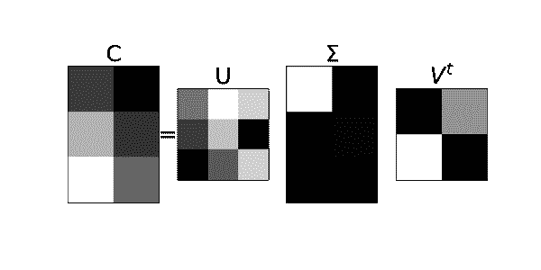

###### 图 6-1。可视化奇异值分解。对角矩阵<math alttext="normal upper Sigma"><mi>Σ</mi></math>与*C*具有相同的形状，其对角线条目按递减顺序排列，最亮的像素对应于左上角的最大奇异值。

图 6-2 和图 6-3 展示了两个矩形矩阵*A*和*B*的奇异值分解，其中*A*是宽的，*B*是高的：

<math alttext="dollar-sign upper B equals Start 4 By 2 Matrix 1st Row 1st Column 5 2nd Column 4 2nd Row 1st Column 4 2nd Column 0 3rd Row 1st Column 7 2nd Column 10 4th Row 1st Column negative 1 2nd Column 8 EndMatrix Subscript 4 times 2 Baseline equals upper U Subscript 4 times 4 Baseline normal upper Sigma Subscript 4 times 2 Baseline upper V Subscript 2 times 2 Superscript t dollar-sign"><mrow><mi>B</mi> <mo>=</mo> <msub><mfenced close=")" open="("><mtable><mtr><mtd><mn>5</mn></mtd><mtd><mn>4</mn></mtd></mtr><mtr><mtd><mn>4</mn></mtd><mtd><mn>0</mn></mtd></mtr><mtr><mtd><mn>7</mn></mtd><mtd><mn>10</mn></mtd></mtr><mtr><mtd><mrow><mo>-</mo><mn>1</mn></mrow></mtd><mtd><mn>8</mn></mtd></mtr></mtable></mfenced> <mrow><mn>4</mn><mo>×</mo><mn>2</mn></mrow></msub> <mo>=</mo> <msub><mi>U</mi> <mrow><mn>4</mn><mo>×</mo><mn>4</mn></mrow></msub> <msub><mi>Σ</mi> <mrow><mn>4</mn><mo>×</mo><mn>2</mn></mrow></msub> <msubsup><mi>V</mi> <mrow><mn>2</mn><mo>×</mo><mn>2</mn></mrow> <mi>t</mi></msubsup></mrow></math>

<math alttext="dollar-sign upper A equals Start 3 By 5 Matrix 1st Row 1st Column negative 1 2nd Column 3 3rd Column negative 5 4th Column 4 5th Column 18 2nd Row 1st Column 1 2nd Column negative 2 3rd Column 4 4th Column 0 5th Column negative 7 3rd Row 1st Column 2 2nd Column 0 3rd Column 4 4th Column negative 3 5th Column negative 8 EndMatrix Subscript 3 times 5 Baseline equals upper U Subscript 3 times 3 Baseline normal upper Sigma Subscript 3 times 5 Baseline upper V Subscript 5 times 5 Superscript t dollar-sign"><mrow><mi>A</mi> <mo>=</mo> <msub><mfenced close=")" open="("><mtable><mtr><mtd><mrow><mo>-</mo><mn>1</mn></mrow></mtd><mtd><mn>3</mn></mtd><mtd><mrow><mo>-</mo><mn>5</mn></mrow></mtd><mtd><mn>4</mn></mtd><mtd><mn>18</mn></mtd></mtr><mtr><mtd><mn>1</mn></mtd><mtd><mrow><mo>-</mo><mn>2</mn></mrow></mtd><mtd><mn>4</mn></mtd><mtd><mn>0</mn></mtd><mtd><mrow><mo>-</mo><mn>7</mn></mrow></mtd></mtr><mtr><mtd><mn>2</mn></mtd><mtd><mn>0</mn></mtd><mtd><mn>4</mn></mtd><mtd><mrow><mo>-</mo><mn>3</mn></mrow></mtd><mtd><mrow><mo>-</mo><mn>8</mn></mrow></mtd></mtr></mtable></mfenced> <mrow><mn>3</mn><mo>×</mo><mn>5</mn></mrow></msub> <mo>=</mo> <msub><mi>U</mi> <mrow><mn>3</mn><mo>×</mo><mn>3</mn></mrow></msub> <msub><mi>Σ</mi> <mrow><mn>3</mn><mo>×</mo><mn>5</mn></mrow></msub> <msubsup><mi>V</mi> <mrow><mn>5</mn><mo>×</mo><mn>5</mn></mrow> <mi>t</mi></msubsup></mrow></math>

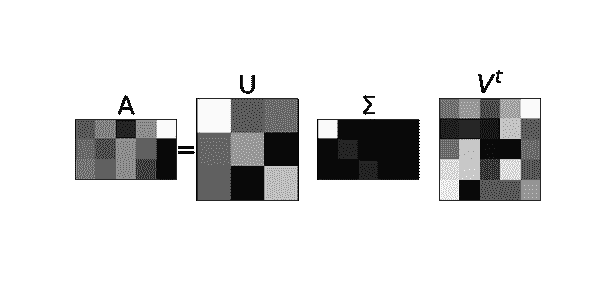

###### 在图 6-2 中，我们注意到 <math alttext="normal upper Sigma"><mi>Σ</mi></math> 的最后两列都是零（黑色像素），因此我们可以节省存储空间，丢弃这两列以及 <math alttext="upper V Superscript t"><msup><mi>V</mi> <mi>t</mi></msup></math> 的最后两行（请参见下一节关于从左侧乘以对角矩阵）。类似地，在图 6-3 中，我们注意到 <math alttext="normal upper Sigma"><mi>Σ</mi></math> 的最后两行都是零（黑色像素），因此我们可以节省存储空间，丢弃这两行以及 <math alttext="upper U"><mi>U</mi></math> 的最后两列（请参见下一节关于从右侧乘以对角矩阵）。奇异值分解已经为我们节省了一些空间（请注意，我们通常只存储 <math alttext="normal upper Sigma"><mi>Σ</mi></math> 的对角元素，而不是整个带有所有零的矩阵）。

图 6-2。可视化宽矩形矩阵的奇异值分解。 <math alttext="normal upper Sigma"><mi>Σ</mi></math> 的最后两列都是零（黑色像素），可以减少存储空间：丢弃 <math alttext="normal upper Sigma"><mi>Σ</mi></math> 的最后两列以及 <math alttext="upper V Superscript t"><msup><mi>V</mi> <mi>t</mi></msup></math> 的最后两行。

###### 图 6-3。可视化一个高矩形矩阵的奇异值分解。<math alttext="normal upper Sigma"><mi>Σ</mi></math>的最后两行都是零（黑色像素），允许减少存储：丢弃<math alttext="normal upper Sigma"><mi>Σ</mi></math>的最后两行以及<math alttext="upper U"><mi>U</mi></math>的最后两列。

# 对角矩阵

当我们将一个向量乘以一个标量，比如 3，我们得到一个沿着相同方向的新向量，具有相同的方向，但长度被拉伸了三倍。当我们将相同的向量乘以另一个标量，比如-0.5，我们得到另一个向量，同样沿着相同方向，但这次长度减半，方向翻转。乘以一个标量是一个如此简单的操作，如果我们有矩阵在应用到（换句话说，乘以）向量时同样容易，那将是很好的。如果我们的生活是一维的，那么我们只需要处理标量，但由于我们的生活和感兴趣的应用是更高维的，所以我们必须满足对角矩阵（图 6-4）。这些是好的。

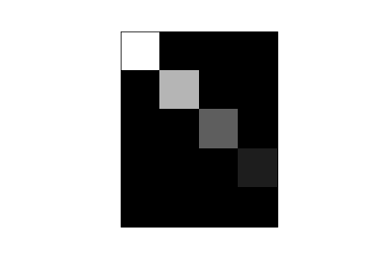

###### 图 6-4。一个<math alttext="5 times 4"><mrow><mn>5</mn> <mo>×</mo> <mn>4</mn></mrow></math>对角矩阵的图像，对角线条目为：10（最亮的像素），6，3 和 1（除了零之外最暗的像素）。

通过对角矩阵进行乘法相当于在空间中的某些方向进行拉伸或挤压，方向翻转对应于对角线上的任何负数。正如我们非常清楚的，大多数矩阵远非对角矩阵。奇异值分解的力量在于它为我们提供了空间中的方向，沿着这些方向矩阵*表现得像*（虽然在广义上）对角矩阵。对角矩阵通常在与向量坐标相同的方向上进行拉伸/挤压。另一方面，如果矩阵不是对角的，它通常不会在与坐标相同的方向上进行拉伸/挤压。它会在*其他*方向上进行，在坐标变换后。奇异值分解给出了我们所需的坐标变换（*右奇异向量*），向量将被拉伸/挤压的方向（*左奇异向量*），以及拉伸/挤压的幅度（*奇异值*）。我们将在下一节详细介绍这一点，但首先我们澄清一下从左边和从右边乘以对角矩阵的乘法。

### 通过对角矩阵<math alttext="normal upper Sigma"><mi>Σ</mi></math>进行乘法：

1.  如果我们从右边将矩阵<math alttext="upper A"><mi>A</mi></math>乘以对角矩阵<math alttext="normal upper Sigma"><mi>Σ</mi></math>，即<math alttext="upper A normal upper Sigma"><mrow><mi>A</mi> <mi>Σ</mi></mrow></math>，那么我们将<math alttext="upper A"><mi>A</mi></math>的列按<math alttext="sigma"><mi>σ</mi></math>进行缩放，例如：

    <math alttext="dollar-sign upper A normal upper Sigma equals Start 3 By 2 Matrix 1st Row 1st Column a 11 2nd Column a 12 2nd Row 1st Column a 21 2nd Column a 22 3rd Row 1st Column a 31 2nd Column a 32 EndMatrix Start 2 By 2 Matrix 1st Row 1st Column sigma 1 2nd Column 0 2nd Row 1st Column 0 2nd Column sigma 2 EndMatrix equals Start 3 By 2 Matrix 1st Row 1st Column sigma 1 a 11 2nd Column sigma 2 a 12 2nd Row 1st Column sigma 1 a 21 2nd Column sigma 2 a 22 3rd Row 1st Column sigma 1 a 31 2nd Column sigma 2 a 32 EndMatrix dollar-sign"><mrow><mi>A</mi> <mi>Σ</mi> <mo>=</mo> <mfenced close=")" open="("><mtable><mtr><mtd><msub><mi>a</mi> <mn>11</mn></msub></mtd> <mtd><msub><mi>a</mi> <mn>12</mn></msub></mtd></mtr> <mtr><mtd><msub><mi>a</mi> <mn>21</mn></msub></mtd> <mtd><msub><mi>a</mi> <mn>22</mn></msub></mtd></mtr> <mtr><mtd><msub><mi>a</mi> <mn>31</mn></msub></mtd> <mtd><msub><mi>a</mi> <mn>32</mn></msub></mtd></mtr></mtable></mfenced> <mfenced close=")" open="("><mtable><mtr><mtd><msub><mi>σ</mi> <mn>1</mn></msub></mtd> <mtd><mn>0</mn></mtd></mtr> <mtr><mtd><mn>0</mn></mtd> <mtd><msub><mi>σ</mi> <mn>2</mn></msub></mtd></mtr></mtable></mfenced> <mo>=</mo> <mfenced close=")" open="("><mtable><mtr><mtd><mrow><msub><mi>σ</mi> <mn>1</mn></msub> <msub><mi>a</mi> <mn>11</mn></msub></mrow></mtd> <mtd><mrow><msub><mi>σ</mi> <mn>2</mn></msub> <msub><mi>a</mi> <mn>12</mn></msub></mrow></mtd></mtr> <mtr><mtd><mrow><msub><mi>σ</mi> <mn>1</mn></msub> <msub><mi>a</mi> <mn>21</mn></msub></mrow></mtd> <mtd><mrow><msub><mi>σ</mi> <mn>2</mn></msub> <msub><mi>a</mi> <mn>22</mn></msub></mrow></mtd></mtr> <mtr><mtd><mrow><msub><mi>σ</mi> <mn>1</mn></msub> <msub><mi>a</mi> <mn>31</mn></msub></mrow></mtd> <mtd><mrow><msub><mi>σ</mi> <mn>2</mn></msub> <msub><mi>a</mi> <mn>32</mn></msub></mrow></mtd></mtr></mtable></mfenced></mrow></math>

1.  如果我们从左边将<math alttext="upper A"><mi>A</mi></math>乘以<math alttext="normal upper Sigma"><mi>Σ</mi></math>，即<math alttext="normal upper Sigma upper A"><mrow><mi>Σ</mi> <mi>A</mi></mrow></math>，那么我们将<math alttext="upper A"><mi>A</mi></math>的行按<math alttext="sigma"><mi>σ</mi></math>进行缩放，例如：

    <math alttext="dollar-sign normal upper Sigma upper A equals Start 3 By 3 Matrix 1st Row 1st Column sigma 1 2nd Column 0 3rd Column 0 2nd Row 1st Column 0 2nd Column sigma 2 3rd Column 0 3rd Row 1st Column 0 2nd Column 0 3rd Column sigma 3 EndMatrix Start 3 By 2 Matrix 1st Row 1st Column a 11 2nd Column a 12 2nd Row 1st Column a 21 2nd Column a 22 3rd Row 1st Column a 31 2nd Column a 32 EndMatrix equals Start 3 By 2 Matrix 1st Row 1st Column sigma 1 a 11 2nd Column sigma 1 a 12 2nd Row 1st Column sigma 2 a 21 2nd Column sigma 2 a 22 3rd Row 1st Column sigma 3 a 31 2nd Column sigma 3 a 32 EndMatrix dollar-sign"><mrow><mi>Σ</mi> <mi>A</mi> <mo>=</mo> <mfenced close=")" open="("><mtable><mtr><mtd><msub><mi>σ</mi> <mn>1</mn></msub></mtd> <mtd><mn>0</mn></mtd> <mtd><mn>0</mn></mtd></mtr> <mtr><mtd><mn>0</mn></mtd> <mtd><msub><mi>σ</mi> <mn>2</mn></msub></mtd> <mtd><mn>0</mn></mtd></mtr> <mtr><mtd><mn>0</mn></mtd> <mtd><mn>0</mn></mtd> <mtd><msub><mi>σ</mi> <mn>3</mn></msub></mtd></mtr></mtable></mfenced> <mfenced close=")" open="("><mtable><mtr><mtd><msub><mi>a</mi> <mn>11</mn></msub></mtd> <mtd><msub><mi>a</mi> <mn>12</mn></msub></mtd></mtr> <mtr><mtd><msub><mi>a</mi> <mn>21</mn></msub></mtd> <mtd><msub><mi>a</mi> <mn>22</mn></msub></mtd></mtr> <mtr><mtd><msub><mi>a</mi> <mn>31</mn></msub></mtd> <mtd><msub><mi>a</mi> <mn>32</mn></msub></mtd></mtr></mtable></mfenced> <mo>=</mo> <mfenced close=")" open="("><mtable><mtr><mtd><mrow><msub><mi>σ</mi> <mn>1</mn></msub> <msub><mi>a</mi> <mn>11</mn></msub></mrow></mtd> <mtd><mrow><msub><mi>σ</mi> <mn>1</mn></msub> <msub><mi>a</mi> <mn>12</mn></msub></mrow></mtd></mtr> <mtr><mtd><mrow><msub><mi>σ</mi> <mn>2</mn></msub> <msub><mi>a</mi> <mn>21</mn></msub></mrow></mtd> <mtd><mrow><msub><mi>σ</mi> <mn>2</mn></msub> <msub><mi>a</mi> <mn>22</mn></msub></mrow></mtd></mtr> <mtr><mtd><mrow><msub><mi>σ</mi> <mn>3</mn></msub> <msub><mi>a</mi> <mn>31</mn></msub></mrow></mtd> <mtd><mrow><msub><mi>σ</mi> <mn>3</mn></msub> <msub><mi>a</mi> <mn>32</mn></msub></mrow></mtd></mtr></mtable></mfenced></mrow></math>

# 矩阵作为作用于空间的线性变换

我们可以将矩阵视为对空间中的向量和空间本身进行线性变换（无扭曲）。如果不允许扭曲，因为那会使操作非线性化，那么哪些操作是允许的？答案是旋转、反射、拉伸和/或挤压，这些都是非扭曲操作。奇异值分解<math alttext="upper A equals upper U normal upper Sigma upper V Superscript t"><mrow><mi>A</mi> <mo>=</mo> <mi>U</mi> <mi>Σ</mi> <msup><mi>V</mi> <mi>t</mi></msup></mrow></math>捕捉了这个概念。当*A*作用于一个向量<math alttext="ModifyingAbove v With right-arrow"><mover accent="true"><mi>v</mi> <mo>→</mo></mover></math>时，让我们逐步进行乘法<math alttext="upper A ModifyingAbove v With right-arrow equals upper U normal upper Sigma upper V Superscript t Baseline ModifyingAbove v With right-arrow"><mrow><mi>A</mi> <mover accent="true"><mi>v</mi> <mo>→</mo></mover> <mo>=</mo> <mi>U</mi> <mi>Σ</mi> <msup><mi>V</mi> <mi>t</mi></msup> <mover accent="true"><mi>v</mi> <mo>→</mo></mover></mrow></math>：

1.  首先<math alttext="ModifyingAbove v With right-arrow"><mover accent="true"><mi>v</mi> <mo>→</mo></mover></math>由于正交矩阵<math alttext="upper V Superscript t"><msup><mi>V</mi> <mi>t</mi></msup></math>而被旋转/反射。

1.  然后，由于对角矩阵<math alttext="normal upper Sigma"><mi>Σ</mi></math>，它沿着特定方向被拉伸/挤压。

1.  最后，由于另一个正交矩阵*U*，它再次被旋转/反射。

反射和旋转实际上不会改变空间，因为它们保持大小和对称性（想象旋转一个物体或看它在镜子中的倒影）。对角矩阵<math alttext="normal upper Sigma"><mi>Σ</mi></math>中编码的拉伸和/或挤压量（通过其对角线上的奇异值）对*A*的作用非常有信息量。

# 注意：正交矩阵

正交矩阵具有正交行和正交列。它永远不会拉伸或挤压，只会旋转和/或反射，这意味着在作用于对象时不会改变对象的大小和形状，只会改变它们的方向和/或方向。像数学中的许多事物一样，这些名称很令人困惑。它被称为*正交*矩阵，即使它的行和列是*正交的*，这意味着正交*且*长度等于一。还有一个有用的事实：如果*C*是一个正交矩阵，那么<math alttext="upper C upper C Superscript t Baseline equals upper C Superscript t Baseline upper C equals upper I"><mrow><mi>C</mi> <msup><mi>C</mi> <mi>t</mi></msup> <mo>=</mo> <msup><mi>C</mi> <mi>t</mi></msup> <mi>C</mi> <mo>=</mo> <mi>I</mi></mrow></math>，也就是说，这个矩阵的逆矩阵是它的转置。计算矩阵的逆通常是一个非常昂贵的操作，但对于正交矩阵，我们只需要将其行与列互换。

我们使用二维矩阵来说明上述概念，因为这些很容易可视化。在接下来的小节中，我们探讨：

1.  矩阵<math alttext="upper A"><mi>A</mi></math>对右奇异向量的作用，这些是矩阵*V*的列<math alttext="ModifyingAbove v With right-arrow Subscript 1"><msub><mover accent="true"><mi>v</mi> <mo>→</mo></mover> <mn>1</mn></msub></math>和<math alttext="ModifyingAbove v With right-arrow Subscript 2"><msub><mover accent="true"><mi>v</mi> <mo>→</mo></mover> <mn>2</mn></msub></math>。这些被发送到左奇异向量<math alttext="ModifyingAbove u With right-arrow Subscript 1"><msub><mover accent="true"><mi>u</mi> <mo>→</mo></mover> <mn>1</mn></msub></math>和<math alttext="ModifyingAbove u With right-arrow Subscript 2"><msub><mover accent="true"><mi>u</mi> <mo>→</mo></mover> <mn>2</mn></msub></math>的倍数，这些是矩阵*U*的列。

1.  A 对标准单位向量<math alttext="ModifyingAbove e With right-arrow Subscript 1"><msub><mover accent="true"><mi>e</mi> <mo>→</mo></mover> <mn>1</mn></msub></math>和<math alttext="ModifyingAbove e With right-arrow Subscript 2"><msub><mover accent="true"><mi>e</mi> <mo>→</mo></mover> <mn>2</mn></sub></math>的作用。我们还注意到单位正方形被转换为平行四边形。

1.  A 对一个一般向量<math alttext="ModifyingAbove x With right-arrow"><mover accent="true"><mi>x</mi> <mo>→</mo></mover></math>的作用。这将帮助我们理解矩阵<math alttext="upper U"><mi>U</mi></math>和<math alttext="upper V"><mi>V</mi></math>作为空间中的旋转或反射。

1.  A 对单位圆的作用。我们看到*A*将单位圆变换为椭圆，其主轴沿着左奇异向量（<math alttext="ModifyingAbove u With right-arrow"><mover accent="true"><mi>u</mi> <mo>→</mo></mover></math>）方向，并且其主轴的长度是奇异值（<math alttext="sigma"><mi>σ</mi></math>）的长度。由于奇异值从大到小排序，因此<math alttext="ModifyingAbove u With right-arrow Subscript 1"><msub><mover accent="true"><mi>u</mi> <mo>→</mo></mover> <mn>1</mn></msub></math>定义了具有最大变化的方向，<math alttext="ModifyingAbove u With right-arrow Subscript 2"><msub><mover accent="true"><mi>u</mi> <mo>→</mo></mover> <mn>2</mn></msub></math>定义了具有第二大变化的方向，依此类推。

### A 对右奇异向量的作用

设*A*为<math alttext="2 times 2"><mrow><mn>2</mn> <mo>×</mo> <mn>2</mn></mrow></math>矩阵：

<math display="block"><mrow><mi>A</mi> <mo>=</mo> <mfenced close=")" open="("><mtable><mtr><mtd><mn>1</mn></mtd> <mtd><mn>5</mn></mtd></mtr> <mtr><mtd><mrow><mo>-</mo> <mn>1</mn></mrow></mtd> <mtd><mn>2</mn></mtd></mtr></mtable></mfenced></mrow></math>

其奇异值分解为：<math alttext="upper A equals upper U normal upper Sigma upper V Superscript t"><mrow><mi>A</mi> <mo>=</mo> <mi>U</mi> <mi>Σ</mi> <msup><mi>V</mi> <mi>t</mi></msup></mrow></math>如下所示：

<math display="block"><mrow><mi>A</mi> <mo>=</mo> <mfenced close=")" open="("><mtable><mtr><mtd><mrow><mn>0</mn> <mo>.</mo> <mn>93788501</mn></mrow></mtd> <mtd><mrow><mn>0</mn> <mo>.</mo> <mn>34694625</mn></mrow></mtd></mtr> <mtr><mtd><mrow><mn>0</mn> <mo>.</mo> <mn>34694625</mn></mrow></mtd> <mtd><mrow><mo>-</mo> <mn>0</mn> <mo>.</mo> <mn>93788501</mn></mrow></mtd></mtr></mtable></mfenced> <mfenced close=")" open="("><mtable><mtr><mtd><mrow><mn>5</mn> <mo>.</mo> <mn>41565478</mn></mrow></mtd> <mtd><mn>0</mn></mtd></mtr> <mtr><mtd><mn>0</mn></mtd> <mtd><mrow><mn>1</mn> <mo>.</mo> <mn>29254915</mn></mrow></mtd></mtr></mtable></mfenced> <mfenced close=")" open="("><mtable><mtr><mtd><mrow><mn>0</mn> <mo>.</mo> <mn>10911677</mn></mrow></mtd> <mtd><mrow><mn>0</mn> <mo>.</mo> <mn>99402894</mn></mrow></mtd></mtr> <mtr><mtd><mrow><mn>0</mn> <mo>.</mo> <mn>99402894</mn></mrow></mtd> <mtd><mrow><mo>-</mo> <mn>0</mn> <mo>.</mo> <mn>10911677</mn></mrow></mtd></mtr></mtable></mfenced></mrow></math>

表达式<math alttext="upper A equals upper U normal upper Sigma upper V Superscript t"><mrow><mi>A</mi> <mo>=</mo> <mi>U</mi> <mi>Σ</mi> <msup><mi>V</mi> <mi>t</mi></msup></mrow></math>等价于

<math display="block"><mrow><mi>A</mi> <mi>V</mi> <mo>=</mo> <mi>U</mi> <mi>Σ</mi> <mo>,</mo></mrow></math>

因为我们只需要将<math alttext="upper A equals upper U normal upper Sigma upper V Superscript t"><mrow><mi>A</mi> <mo>=</mo> <mi>U</mi> <mi>Σ</mi> <msup><mi>V</mi> <mi>t</mi></msup></mrow></math>从右边乘以*V*，并利用<math alttext="upper V Superscript t Baseline upper V equals upper I"><mrow><msup><mi>V</mi> <mi>t</mi></msup> <mi>V</mi> <mo>=</mo> <mi>I</mi></mrow></math>的事实，由于*V*的正交性。

我们可以将*AV*看作矩阵*A*作用于矩阵*V*的每一列。由于<math alttext="upper A upper V equals upper U normal upper Sigma"><mrow><mi>A</mi> <mi>V</mi> <mo>=</mo> <mi>U</mi> <mi>Σ</mi></mrow></math>，则*A*对<math alttext="upper V"><mi>V</mi></math>的正交列的作用等同于通过奇异值拉伸/挤压<math alttext="upper U"><mi>U</mi></math>的列。

<math display="block"><mrow><mi>A</mi> <msub><mover accent="true"><mi>v</mi> <mo>→</mo></mover> <mn>1</mn></msub> <mo>=</mo> <msub><mi>σ</mi> <mn>1</mn></msub> <msub><mover accent="true"><mi>u</mi> <mo>→</mo></mover> <mn>1</mn></msub></mrow></math>

和

<math display="block"><mrow><mi>A</mi> <msub><mover accent="true"><mi>v</mi> <mo>→</mo></mover> <mn>2</mn></msub> <mo>=</mo> <msub><mi>σ</mi> <mn>2</mn></msub> <msub><mover accent="true"><mi>u</mi> <mo>→</mo></mover> <mn>2</mn></msub></mrow></math>

这在图 6-5 中有所展示。

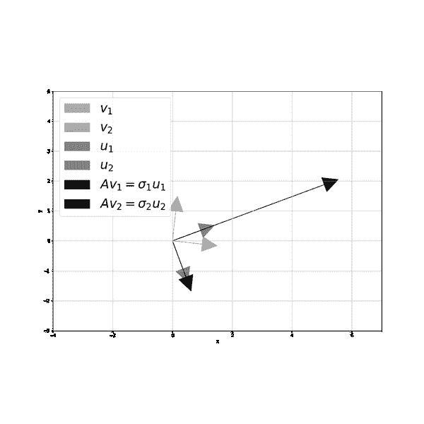

###### 图 6-5。矩阵*A*将右奇异向量发送到左奇异向量的倍数：<math alttext="upper A v 1 equals sigma 1 u 1"><mrow><mi>A</mi> <msub><mi>v</mi> <mn>1</mn></msub> <mo>=</mo> <msub><mi>σ</mi> <mn>1</mn></msub> <msub><mi>u</mi> <mn>1</mn></msub></mrow></math>和<math alttext="upper A v 2 equals sigma 2 u 2"><mrow><mi>A</mi> <msub><mi>v</mi> <mn>2</mn></msub> <mo>=</mo> <msub><mi>σ</mi> <mn>2</mn></msub> <msub><mi>u</mi> <mn>2</mn></msub></mrow></math>。

### A 对标准单位向量和由它们确定的单位正方形的作用

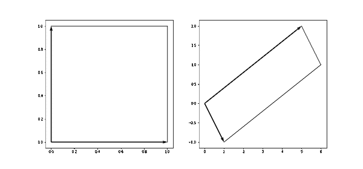

###### 图 6-6。矩阵*A*将标准单位向量发送到其自身的列，并将单位正方形转换为平行四边形。空间没有扭曲（弯曲）。

### 矩阵*A*对单位圆的作用

图 6-7 显示矩阵*A*将单位圆发送到椭圆：主轴沿着<math alttext="u"><mi>u</mi></math>的方向，主轴的长度等于<math alttext="sigma"><mi>σ</mi></math>。再次，由于矩阵代表线性变换，所以有空间的反射/旋转和拉伸/挤压，但没有扭曲。

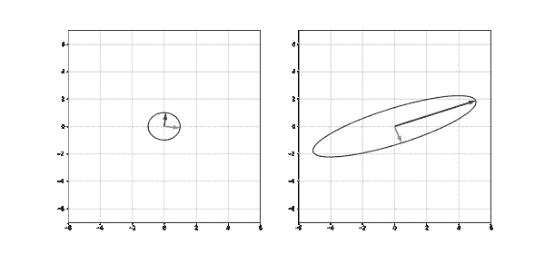

###### 图 6-7。矩阵*A*将单位圆发送到椭圆，主轴沿着左奇异向量，主轴的长度等于奇异值。

我们可以从奇异值分解中轻松看到上述操作。

极分解

<math display="block"><mrow><mi>A</mi> <mo>=</mo> <mi>Q</mi> <mi>S</mi></mrow></math>

是一个非常简单的几何方式，展示了圆如何被转换为椭圆。

### 根据奇异值分解将圆到椭圆的转换分解

图 6-8 显示了将圆转换为椭圆的步骤的四个子图：

1.  首先我们将单位圆和向量<math alttext="ModifyingAbove v With right-arrow Subscript 1"><msub><mover accent="true"><mi>v</mi> <mo>→</mo></mover> <mn>1</mn></msub></math>和<math alttext="ModifyingAbove v With right-arrow Subscript 2"><msub><mover accent="true"><mi>v</mi> <mo>→</mo></mover> <mn>2</mn></msub></math>乘以<math alttext="upper V Superscript t"><msup><mi>V</mi> <mi>t</mi></msup></math>。由于<math alttext="upper V Superscript t Baseline upper V equals upper I"><mrow><msup><mi>V</mi> <mi>t</mi></msup> <mi>V</mi> <mo>=</mo> <mi>I</mi></mrow></math>，我们有<math alttext="upper V Superscript t Baseline ModifyingAbove v With right-arrow Subscript 1 Baseline equals ModifyingAbove e With right-arrow Subscript 1"><mrow><msup><mi>V</mi> <mi>t</mi></msup> <msub><mover accent="true"><mi>v</mi> <mo>→</mo></mover> <mn>1</mn></msub> <mo>=</mo> <msub><mover accent="true"><mi>e</mi> <mo>→</mo></mover> <mn>1</mn></msub></mrow></math>和<math alttext="upper V Superscript t Baseline ModifyingAbove v With right-arrow Subscript 2 Baseline equals ModifyingAbove e With right-arrow Subscript 2"><mrow><msup><mi>V</mi> <mi>t</mi></msup> <msub><mover accent="true"><mi>v</mi> <mo>→</mo></mover> <mn>2</mn></msub> <mo>=</mo> <msub><mover accent="true"><mi>e</mi> <mo>→</mo></mover> <mn>2</mn></msub></mrow></math>。因此，起初，右奇异向量被“拉直”，与标准单位向量正确对齐。

1.  然后我们乘以<math alttext="normal upper Sigma"><mi>Σ</mi></math>：这里发生的一切只是通过<math alttext="sigma 1"><msub><mi>σ</mi> <mn>1</mn></msub></math>和<math alttext="sigma 2"><msub><mi>σ</mi> <mn>2</mn></msub></math>（拉伸或挤压取决于奇异值的大小是大于还是小于一）来拉伸/挤压标准单位向量。

1.  最后我们乘以<math alttext="upper U"><mi>U</mi></math>：这要么将椭圆反射到一条线上，要么将其顺时针或逆时针旋转一定角度。下一小节将详细解释这一点。

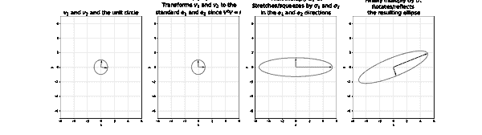

###### 图 6-8。使用奇异值分解的单位圆到椭圆转换步骤。

### 旋转和反射矩阵

在奇异值分解<math alttext="upper A equals upper U normal upper Sigma upper V Superscript t"><mrow><mi>A</mi> <mo>=</mo> <mi>U</mi> <mi>Σ</mi> <msup><mi>V</mi> <mi>t</mi></msup></mrow></math>中出现的矩阵*U*和<math alttext="upper V Superscript t"><msup><mi>V</mi> <mi>t</msup></math>是正交矩阵。它们的行和列是正交的，它们的逆矩阵与转置矩阵相同。在二维空间中，<math alttext="upper U"><mi>U</mi></math>和<math alttext="upper V"><mi>V</mi></math>可以是旋转或反射（关于一条直线）矩阵。

旋转矩阵

顺时针旋转一个角度<math alttext="theta"><mi>θ</mi></math>的矩阵如下：

<math display="block"><mfenced close=")" open="("><mtable><mtr><mtd><mrow><mo form="prefix">cos</mo> <mi>θ</mi></mrow></mtd> <mtd><mrow><mo form="prefix">sin</mo> <mi>θ</mi></mrow></mtd></mtr> <mtr><mtd><mrow><mo>-</mo> <mo form="prefix">sin</mo> <mi>θ</mi></mrow></mtd> <mtd><mrow><mo form="prefix">cos</mo> <mi>θ</mi></mrow></mtd></mtr></mtable></mfenced></math>

旋转矩阵的转置是一个相反方向的旋转。因此，如果一个矩阵顺时针旋转一个角度<math alttext="theta"><mi>θ</mi></math>，那么它的转置就会逆时针旋转<math alttext="theta"><mi>θ</mi></math>，如下所示：

<math display="block"><mfenced close=")" open="("><mtable><mtr><mtd><mrow><mo form="prefix">cos</mo> <mi>θ</mi></mrow></mtd> <mtd><mrow><mo>-</mo> <mo form="prefix">sin</mo> <mi>θ</mi></mrow></mtd></mtr> <mtr><mtd><mrow><mo form="prefix">sin</mo> <mi>θ</mi></mrow></mtd> <mtd><mrow><mo form="prefix">cos</mo> <mi>θ</mi></mrow></mtd></mtr></mtable></mfenced></math>

反射矩阵

关于与<math alttext="x"><mi>x</mi></math>-轴成角度<math alttext="theta"><mi>θ</mi></math>的直线<math alttext="upper L"><mi>L</mi></math>的反射矩阵如下：

<math display="block"><mfenced close=")" open="("><mtable><mtr><mtd><mrow><mo form="prefix">cos</mo> <mn>2</mn> <mi>θ</mi></mrow></mtd> <mtd><mrow><mo form="prefix">sin</mo> <mn>2</mn> <mi>θ</mi></mrow></mtd></mtr> <mtr><mtd><mrow><mo form="prefix">sin</mo> <mn>2</mn> <mi>θ</mi></mrow></mtd> <mtd><mrow><mo>-</mo> <mo form="prefix">cos</mo> <mn>2</mn> <mi>θ</mi></mrow></mtd></mtr></mtable></mfenced></math>

直线*L*的斜率为<math alttext="tangent theta"><mrow><mo form="prefix">tan</mo> <mi>θ</mi></mrow></math>，它经过原点，因此它的方程为<math alttext="y equals left-parenthesis tangent theta right-parenthesis x"><mrow><mi>y</mi> <mo>=</mo> <mo>(</mo> <mo form="prefix">tan</mo> <mi>θ</mi> <mo>)</mo> <mi>x</mi></mrow></math>。这条直线就像反射操作的镜子。图 6-9 展示了矩阵<math alttext="upper V Superscript t"><msup><mi>V</mi> <mi>t</mi></msup></math>和*U*反射的两条直线，以及一个向量<math alttext="ModifyingAbove x With right-arrow"><mover accent="true"><mi>x</mi> <mo>→</mo></mover></math>及其随后的变换。

旋转矩阵的行列式为 1，反射矩阵的行列式为<math alttext="negative 1"><mrow><mo>-</mo> <mn>1</mn></mrow></math>。

在更高维度中，反射和旋转矩阵看起来不同。始终确保您理解正在处理的对象：如果我们在三维空间中进行旋转，那么围绕哪个轴？如果我们进行反射，那么围绕哪个平面？如果您想深入了解，那么现在是阅读正交矩阵及其性质的好时机。

### 对一般向量<math alttext="ModifyingAbove x With right-arrow"><mover accent="true"><mi>x</mi> <mo>→</mo></mover></math>的作用

我们已经探讨了矩阵*A*对右奇异向量的作用（它们被映射到左奇异向量）、标准单位向量（它们被映射到矩阵*A*的列）、单位正方形（它被映射到平行四边形）、单位圆（它被映射到一个椭圆，其主轴沿着左奇异向量，长度等于奇异值）。最后，我们探讨了矩阵*A*对一个一般的非特殊向量<math alttext="ModifyingAbove x With right-arrow"><mover accent="true"><mi>x</mi> <mo>→</mo></mover></math>的作用。这被映射到另一个非特殊向量<math alttext="upper A ModifyingAbove x With right-arrow"><mrow><mi>A</mi> <mover accent="true"><mi>x</mi> <mo>→</mo></mover></mrow></math>。然而，使用奇异值分解将这个转换分解成步骤是具有信息性的。

回想一下我们的矩阵*A*及其奇异值分解：

<math alttext="dollar-sign StartLayout 1st Row 1st Column upper A 2nd Column equals Start 2 By 2 Matrix 1st Row 1st Column 1 2nd Column 5 2nd Row 1st Column negative 1 2nd Column 2 EndMatrix 2nd Row 1st Column Blank 2nd Column equals upper U normal upper Sigma upper V Superscript t Baseline 3rd Row 1st Column Blank 2nd Column equals Start 2 By 2 Matrix 1st Row 1st Column 0.93788501 2nd Column 0.34694625 2nd Row 1st Column 0.34694625 2nd Column negative 0.93788501 EndMatrix Start 2 By 2 Matrix 1st Row 1st Column 5.41565478 2nd Column 0 2nd Row 1st Column 0 2nd Column 1.29254915 EndMatrix Start 2 By 2 Matrix 1st Row 1st Column 0.10911677 2nd Column 0.99402894 2nd Row 1st Column 0.99402894 2nd Column negative 0.10911677 EndMatrix EndLayout dollar-sign"><mtable displaystyle="true"><mtr><mtd columnalign="right"><mi>A</mi></mtd> <mtd columnalign="left"><mrow><mo>=</mo> <mfenced close=")" open="("><mtable><mtr><mtd><mn>1</mn></mtd> <mtd><mn>5</mn></mtd></mtr> <mtr><mtd><mrow><mo>-</mo> <mn>1</mn></mrow></mtd> <mtd><mn>2</mn></mtd></mtr></mtable></mfenced></mrow></mtd></mtr> <mtr><mtd columnalign="left"><mrow><mo>=</mo> <mi>U</mi> <mi>Σ</mi> <msup><mi>V</mi> <mi>t</mi></msup></mrow></mtd></mtr> <mtr><mtd columnalign="left"><mrow><mo>=</mo> <mfenced close=")" open="("><mtable><mtr><mtd><mrow><mn>0</mn> <mo>.</mo> <mn>93788501</mn></mrow></mtd> <mtd><mrow><mn>0</mn> <mo>.</mo> <mn>34694625</mn></mrow></mtd></mtr> <mtr><mtd><mrow><mn>0</mn> <mo>.</mo> <mn>34694625</mn></mrow></mtd> <mtd><mrow><mo>-</mo> <mn>0</mn> <mo>.</mo> <mn>93788501</mn></mrow></mtd></mtr></mtable></mfenced> <mfenced close=")" open="("><mtable><mtr><mtd><mrow><mn>5</mn> <mo>.</mo> <mn>41565478</mn></mrow></mtd> <mtd><mn>0</mn></mtd></mtr> <mtr><mtd><mn>0</mn></mtd> <mtd><mrow><mn>1</mn> <mo>.</mo> <mn>29254915</mn></mrow></mtd></mtr></mtable></mfenced> <mfenced close=")" open="("><mtable><mtr><mtd><mrow><mn>0</mn> <mo>.</mo> <mn>10911677</mn></mrow></mtd> <mtd><mrow><mn>0</mn> <mo>.</mo> <mn>99402894</mn></mrow></mtd></mtr> <mtr><mtd><mrow><mn>0</mn> <mo>.</mo> <mn>99402894</mn></mrow></mtd> <mtd><mrow><mo>-</mo> <mn>0</mn> <mo>.</mo> <mn>10911677</mn></mrow></mtd></mtr></mtable></mfenced></mrow></mtd></mtr></mtable></math>

在上述奇异值分解中，*U*和<math alttext="upper V Superscript t"><msup><mi>V</mi> <mi>t</mi></msup></math>都是反射矩阵。作为这些反射镜的直线<math alttext="upper L Subscript upper U"><msub><mi>L</mi> <mi>U</mi></msub></math>和<math alttext="upper L Subscript upper V Sub Superscript t"><msub><mi>L</mi> <msup><mi>V</mi> <mi>t</mi></msup></msub></math>在图 6-9 中绘制出来，它们的方程很容易从各自的矩阵中找到：<math alttext="cosine left-parenthesis 2 theta right-parenthesis"><mrow><mo form="prefix">cos</mo> <mo>(</mo> <mn>2</mn> <mi>θ</mi> <mo>)</mo></mrow></math>和<math alttext="sine left-parenthesis 2 theta right-parenthesis"><mrow><mo form="prefix">sin</mo> <mo>(</mo> <mn>2</mn> <mi>θ</mi> <mo>)</mo></mrow></math>在第一行，因此我们可以使用这些来找到斜率<math alttext="tangent left-parenthesis theta right-parenthesis"><mrow><mo form="prefix">tan</mo> <mo>(</mo> <mi>θ</mi> <mo>)</mo></mrow></math>。然后，<math alttext="upper V Superscript t"><msup><mi>V</mi> <mi>t</mi></msup></math>反射的直线方程是<math alttext="y equals left-parenthesis tangent theta Subscript upper V Sub Superscript t Subscript Baseline right-parenthesis x equals 0.8962347008436108 x"><mrow><mi>y</mi> <mo>=</mo> <mo>(</mo> <mo form="prefix">tan</mo> <msub><mi>θ</mi> <msup><mi>V</mi> <mi>t</mi></msup></msub> <mo>)</mo> <mi>x</mi> <mo>=</mo> <mn>0</mn> <mo>.</mo> <mn>8962347008436108</mn> <mi>x</mi></mrow></math>，*U*反射的直线方程是<math alttext="y equals left-parenthesis tangent theta Subscript upper U Baseline right-parenthesis x equals 0.17903345403184898 x"><mrow><mi>y</mi> <mo>=</mo> <mo>(</mo> <mo form="prefix">tan</mo> <msub><mi>θ</mi> <mi>U</mi></msub> <mo>)</mo> <mi>x</mi> <mo>=</mo> <mn>0</mn> <mo>.</mo> <mn>17903345403184898</mn> <mi>x</mi></mrow></math>。由于<math alttext="upper A ModifyingAbove x With right-arrow equals upper U normal upper Sigma upper V Superscript t Baseline ModifyingAbove x With right-arrow"><mrow><mi>A</mi> <mover accent="true"><mi>x</mi> <mo>→</mo></mover> <mo>=</mo> <mi>U</mi> <mi>Σ</mi> <msup><mi>V</mi> <mi>t</mi></msup> <mover accent="true"><mi>x</mi> <mo>→</mo></mover></mrow></math>，首先<math alttext="ModifyingAbove x With right-arrow"><mover accent="true"><mi>x</mi> <mo>→</mo></mover></math>被反射到直线<math alttext="upper L Subscript upper V Sub Superscript t"><msub><mi>L</mi> <msup><mi>V</mi> <mi>t</mi></msup></msub></math>上，到达<math alttext="upper V Superscript t Baseline ModifyingAbove x With right-arrow"><mrow><msup><mi>V</mi> <mi>t</mi></msup> <mover accent="true"><mi>x</mi> <mo>→</mo></mover></mrow></math>。然后，当我们从左边乘以<math alttext="normal upper Sigma"><mi>Σ</mi></math>时，<math alttext="upper V Superscript t Baseline ModifyingAbove x With right-arrow"><mrow><msup><mi>V</mi> <mi>t</mi></msup> <mover accent="true"><mi>x</mi> <mo>→</mo></mover></mrow></math>的第一个坐标被第一个奇异值水平拉伸，第二个坐标被第二个奇异值拉伸，得到<math alttext="normal upper Sigma upper V Superscript t Baseline ModifyingAbove x With right-arrow"><mrow><mi>Σ</mi> <msup><mi>V</mi> <mi>t</mi></msup> <mover accent="true"><mi>x</mi> <mo>→</mo></mover></mrow></math>。最后，当我们乘以*U*时，向量<math alttext="normal upper Sigma upper V Superscript t Baseline ModifyingAbove x With right-arrow"><mrow><mi>Σ</mi> <msup><mi>V</mi> <mi>t</mi></msup> <mover accent="true"><mi>x</mi> <mo>→</mo></mover></mrow></math>被反射到直线<math alttext="upper L Subscript upper U"><msub><mi>L</mi> <mi>U</mi></msub></math>上，到达<math alttext="upper A ModifyingAbove x With right-arrow equals upper U normal upper Sigma upper V Superscript t Baseline ModifyingAbove x With right-arrow"><mrow><mi>A</mi> <mover accent="true"><mi>x</mi> <mo>→</mo></mover> <mo>=</mo> <mi>U</mi> <mi>Σ</mi> <msup><mi>V</mi> <mi>t</mi></msup> <mover accent="true"><mi>x</mi> <mo>→</mo></mover></mrow></math>。图 6-9 说明了这个过程。

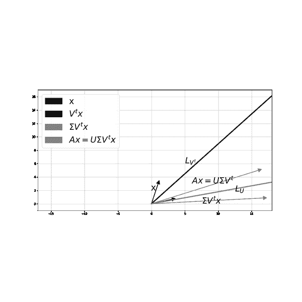

###### 图 6-9。矩阵 A 对一个一般向量<math alttext="ModifyingAbove x With right-arrow"><mover accent="true"><mi>x</mi> <mo>→</mo></mover></math>的作用。使用奇异值分解逐步进行变换。

# 矩阵相乘的三种方法

在大数据时代，矩阵乘法的高效算法是如此令人渴望。理论上，有三种方法可以将两个矩阵<math alttext="upper A Subscript m times n"><msub><mi>A</mi> <mrow><mi>m</mi><mo>×</mo><mi>n</mi></mrow></msub></math>和<math alttext="upper B Subscript n times s"><msub><mi>B</mi> <mrow><mi>n</mi><mo>×</mo><mi>s</mi></mrow></msub></math>相乘：

1.  **行-列方法**：通过将*A*的第*i*行与*B*的第*j*列进行点积，逐个生成一个条目<math alttext="left-parenthesis a b right-parenthesis Subscript i j"><msub><mrow><mo>(</mo><mi>a</mi><mi>b</mi><mo>)</mo></mrow> <mrow><mi>i</mi><mi>j</mi></mrow></msub></math>：

    <math alttext="dollar-sign left-parenthesis a b right-parenthesis Subscript i j Baseline equals upper A Subscript r o w Sub Subscript i Baseline upper B Subscript c o l Sub Subscript j Baseline equals sigma-summation Underscript k equals 1 Overscript n Endscripts a Subscript i k Baseline b Subscript k j dollar-sign"><mrow><msub><mrow><mo>(</mo><mi>a</mi><mi>b</mi><mo>)</mo></mrow> <mrow><mi>i</mi><mi>j</mi></mrow></msub> <mo>=</mo> <msub><mi>A</mi> <mrow><mi>r</mi><mi>o</mi><msub><mi>w</mi> <mi>i</mi></msub></mrow></msub> <msub><mi>B</mi> <mrow><mi>c</mi><mi>o</mi><msub><mi>l</mi> <mi>j</mi></msub></mrow></msub> <mo>=</mo> <msubsup><mo>∑</mo> <mrow><mi>k</mi><mo>=</mo><mn>1</mn></mrow> <mi>n</mi></msubsup> <msub><mi>a</mi> <mrow><mi>i</mi><mi>k</mi></mrow></msub> <msub><mi>b</mi> <mrow><mi>k</mi><mi>j</mi></mrow></msub></mrow></math>

1.  **列-列方法**：通过线性组合*A*的列，使用*B*的第*i*列的条目，逐个生成一个列<math alttext="left-parenthesis upper A upper B right-parenthesis Subscript c o l Sub Subscript i"><msub><mrow><mo>(</mo><mi>A</mi><mi>B</mi><mo>)</mo></mrow> <mrow><mi>c</mi><mi>o</mi><msub><mi>l</mi> <mi>i</mi></msub></mrow></msub></math>：

    <math alttext="dollar-sign left-parenthesis upper A upper B right-parenthesis Subscript c o l Sub Subscript i Baseline equals b Subscript 1 i Baseline upper A Subscript c o l 1 Baseline plus b Subscript 2 i Baseline upper A Subscript c o l 2 Baseline plus ellipsis plus b Subscript n i Baseline upper A Subscript c o l Sub Subscript n dollar-sign"><mrow><msub><mrow><mo>(</mo><mi>A</mi><mi>B</mi><mo>)</mo></mrow> <mrow><mi>c</mi><mi>o</mi><msub><mi>l</mi> <mi>i</mi></msub></mrow></msub> <mo>=</mo> <msub><mi>b</mi> <mrow><mn>1</mn><mi>i</mi></mrow></msub> <msub><mi>A</mi> <mrow><mi>c</mi><mi>o</mi><msub><mi>l</mi> <mn>1</mn></msub></mrow></msub> <mo>+</mo> <msub><mi>b</mi> <mrow><mn>2</mn><mi>i</mi></mrow></msub> <msub><mi>A</mi> <mrow><mi>c</mi><mi>o</mi><msub><mi>l</mi> <mn>2</mn></msub></mrow></msub> <mo>+</mo> <mo>⋯</mo> <mo>+</mo> <msub><mi>b</mi> <mrow><mi>n</mi><mi>i</mi></mrow></msub> <msub><mi>A</mi> <mrow><mi>c</mi><mi>o</mi><msub><mi>l</mi> <mi>n</mi></msub></mrow></msub></mrow></math>

1.  **列-行方法**：逐个生成乘积的*秩一片段*，通过将*A*的第一列与*B*的第一行相乘，将*A*的第二列与*B*的第二行相乘，依此类推。然后将所有这些秩一矩阵相加以获得最终乘积*AB*：

    <math display="block"><mrow><mi>A</mi> <mi>B</mi> <mo>=</mo> <msub><mi>A</mi> <mrow><mi>c</mi><mi>o</mi><msub><mi>l</mi> <mn>1</mn></msub></mrow></msub> <msub><mi>B</mi> <mrow><mi>r</mi><mi>o</mi><msub><mi>w</mi> <mn>1</mn></msub></mrow></msub> <mo>+</mo> <msub><mi>A</mi> <mrow><mi>c</mi><mi>o</mi><msub><mi>l</mi> <mn>2</mn></msub></mrow></msub> <msub><mi>B</mi> <mrow><mi>r</mi><mi>o</mi><msub><mi>w</mi> <mn>2</mn></msub></mrow></msub> <mo>+</mo> <mo>⋯</mo> <mo>+</mo> <msub><mi>A</mi> <mrow><mi>c</mi><mi>o</mi><msub><mi>l</mi> <mi>n</mi></msub></mrow></msub> <msub><mi>B</mi> <mrow><mi>r</mi><mi>o</mi><msub><mi>w</mi> <mi>n</mi></msub></mrow></msub></mrow></math>

### 这如何帮助我们理解奇异值分解的有用性？

我们可以将奇异值分解的乘积<math alttext="upper A equals upper U normal upper Sigma upper V Superscript t"><mrow><mi>A</mi> <mo>=</mo> <mi>U</mi> <mi>Σ</mi> <msup><mi>V</mi> <mi>t</mi></msup></mrow></math>扩展为一系列秩为一的矩阵之和，使用*列-行*方法进行矩阵乘法。在这里，我们将矩阵<math alttext="upper U normal upper Sigma"><mrow><mi>U</mi> <mi>Σ</mi></mrow></math>（它将*U*的每一列<math alttext="upper U Subscript c o l Sub Subscript i"><msub><mi>U</mi> <mrow><mi>c</mi><mi>o</mi><msub><mi>l</mi> <mi>i</mi></msub></mrow></msub></math>乘以<math alttext="sigma Subscript i"><msub><mi>σ</mi> <mi>i</mi></msub></math>）与<math alttext="upper V Superscript t"><msup><mi>V</mi> <mi>t</mi></msup></math>相乘：

<math alttext="dollar-sign upper A equals upper U normal upper Sigma upper V Superscript t Baseline equals sigma 1 upper U Subscript c o l 1 Baseline upper V Subscript r o w 1 Superscript t Baseline plus sigma 2 upper U Subscript c o l 2 Baseline upper V Subscript r o w 2 Superscript t Baseline plus ellipsis plus sigma Subscript r Baseline upper U Subscript c o l Sub Subscript r Baseline upper V Subscript r o w Sub Subscript r Superscript t dollar-sign"><mrow><mi>A</mi> <mo>=</mo> <mi>U</mi> <mi>Σ</mi> <msup><mi>V</mi> <mi>t</mi></msup> <mo>=</mo> <msub><mi>σ</mi> <mn>1</mn></msub> <msub><mi>U</mi> <mrow><mi>c</mi><mi>o</mi><msub><mi>l</mi> <mn>1</mn></msub></mrow></msub> <msubsup><mi>V</mi> <mrow><mi>r</mi><mi>o</mi><msub><mi>w</mi> <mn>1</mn></msub></mrow> <mi>t</mi></msubsup> <mo>+</mo> <msub><mi>σ</mi> <mn>2</mn></msub> <msub><mi>U</mi> <mrow><mi>c</mi><mi>o</mi><msub><mi>l</mi> <mn>2</mn></msub></mrow></msub> <msubsup><mi>V</mi> <mrow><mi>r</mi><mi>o</mi><msub><mi>w</mi> <mn>2</mn></msub></mrow> <mi>t</mi></msubsup> <mo>+</mo> <mo>⋯</mo> <mo>+</mo> <msub><mi>σ</mi> <mi>r</mi></msub> <msub><mi>U</mi> <mrow><mi>c</mi><mi>o</mi><msub><mi>l</mi> <mi>r</mi></msub></mrow></msub> <msubsup><mi>V</mi> <mrow><mi>r</mi><mi>o</mi><msub><mi>w</mi> <mi>r</mi></msub></mrow> <mi>t</mi></msubsup></mrow></math>

其中*r*是*A*的非零奇异值的数量（也称为*A*的*秩*）。

上述表达式的伟大之处在于，它将*A*分解为按重要性顺序排列的秩一矩阵之和，因为<math alttext="sigma"><mi>σ</mi></math>按降序排列。此外，它提供了一种简单的方法来通过低秩矩阵近似*A*：舍弃较低的奇异值。[*Eckart–Young–Mirsky 定理*](https://en.wikipedia.org/wiki/Low-rank_approximation)断言，这实际上是找到*A*的低秩近似的*最佳方法*，当使用[*Frobenius 范数*](https://en.wikipedia.org/wiki/Matrix_norm)（矩阵奇异值的平方和的平方根）来衡量近似的*接近度*时。在本章的后面，我们利用*A*的秩一分解进行数字图像压缩。

# 大局观

到目前为止，我们已经专注于矩阵的奇异值分解，以*A*对空间的作用和使用低秩矩阵近似*A*。在转向与 AI 相关的应用之前，让我们以鹰眼视角看待并解决大局。

### 给定一个实数矩阵，我们想根据我们的用例了解以下内容：

1.  如果矩阵代表我们关心的数据，如图像或表格数据，那么这个矩阵（数据）的最重要组成部分是什么？

1.  数据主要沿着哪些重要方向传播（数据中变化最大的方向）？

1.  如果我将矩阵视为从初始空间到目标空间的转换，那么这个矩阵对空间中的向量有什么影响？它们被发送到哪些向量？

1.  这个矩阵对空间本身的影响是什么？由于这是一个线性变换，我们知道没有空间扭曲，但有空间拉伸、挤压、旋转、反射。

1.  许多物理系统可以表示为线性方程组的系统？我们如何解决这个系统（找到）？根据*A*的属性，最有效的方法是什么？如果没有解，是否有一个满足我们目的的近似解？请注意，这里我们正在寻找未知向量，当*A*作用于它时，它被转换为。

奇异值分解可用于回答上述所有问题。前两个问题是矩阵本身固有的，而后两个问题与将矩阵与向量相乘的效果有关（矩阵作用于空间和空间中的向量）。第五个问题涉及解决线性方程组的非常重要问题，并出现在各种应用中。

因此，我们可以以两种方式研究数字矩阵：

1.  它的固有属性是什么？

1.  将其视为转换时的属性是什么？

这两者相关，因为矩阵的固有属性影响它对向量和空间的作用。

### 要牢记的属性

1.  *A*将其初始空间的标准正交向量（右奇异向量）发送到其目标空间的标准正交向量（左奇异向量）的标量倍数：

    <math display="block"><mrow><mi>A</mi> <msub><mi>v</mi> <mi>i</mi></msub> <mo>=</mo> <msub><mi>σ</mi> <mi>i</mi></msub> <msub><mi>u</mi> <mi>i</mi></msub></mrow></math>

1.  **方阵的行列式**：如果我们的矩阵是方阵，那么它的行列式等于所有奇异值的乘积：<math alttext="sigma 1 sigma 2 ellipsis sigma Subscript r"><mrow><msub><mi>σ</mi> <mn>1</mn></msub> <msub><mi>σ</mi> <mn>2</mn></msub> <mo>⋯</mo> <msub><mi>σ</mi> <mi>r</mi></msub></mrow></math>。

1.  矩阵的**条件数**，相对于<math alttext="l squared"><msup><mi>l</mi> <mn>2</mn></msup></math>范数，即欧几里德空间中的常规距离，是最大奇异值与最小奇异值的比值：

    <math display="block"><mrow><mi>κ</mi> <mo>=</mo> <mfrac><msub><mi>σ</mi> <mn>1</mn></msub> <msub><mi>σ</mi> <mi>r</mi></msub></mfrac> <mo>.</mo></mrow></math>

### 条件数对计算稳定性非常重要

+   它衡量了<math alttext="upper A"><mi>A</mi></math>对空间的拉伸程度。如果条件数太大，那么它在一个方向相对于另一个方向过度拉伸空间，在这种极端拉伸的空间中进行计算可能是危险的：当<math alttext="upper A"><mi>A</mi></math>的条件数很大时，解<math alttext="upper A ModifyingAbove x With right-arrow equals ModifyingAbove b With right-arrow"><mrow><mi>A</mi> <mover accent="true"><mi>x</mi> <mo>→</mo></mover> <mo>=</mo> <mover accent="true"><mi>b</mi> <mo>→</mo></mover></mrow></math>会使解<math alttext="ModifyingAbove x With right-arrow"><mover accent="true"><mi>x</mi> <mo>→</mo></mover></math>不稳定，因为它对<math alttext="b"><mi>b</mi></math>的扰动非常敏感。在<math alttext="ModifyingAbove b With right-arrow"><mover accent="true"><mi>b</mi> <mo>→</mo></mover></math>中的一个小错误将导致解<math alttext="ModifyingAbove x With right-arrow"><mover accent="true"><mi>x</mi> <mo>→</mo></mover></math>与没有<math alttext="ModifyingAbove b With right-arrow"><mover accent="true"><mi>b</mi> <mo>→</mo></mover></math>错误的解截然不同。这种不稳定性在几何上很容易想象。

+   通过数值方法解<math alttext="upper A ModifyingAbove x With right-arrow equals ModifyingAbove b With right-arrow"><mrow><mi>A</mi> <mover accent="true"><mi>x</mi> <mo>→</mo></mover> <mo>=</mo> <mover accent="true"><mi>b</mi> <mo>→</mo></mover></mrow></math>（比如通过高斯消元）和迭代方法在涉及的矩阵具有合理（不是很大）条件数时可以很好地工作。

+   关于具有特别大条件数的矩阵的一件事：它拉伸空间太多，几乎将其压缩到较低维度的空间中。有趣的部分是，如果我们决定放弃那个非常小的奇异值，因此在较低维度的压缩空间中工作，我们的计算变得完全正常。因此，在极端性的边界处是正常性，只是这种正常性现在位于较低维度。

+   许多迭代数值方法，包括非常有用的梯度下降，都涉及到它们的分析中的矩阵。如果这些矩阵的条件数太大，那么迭代方法可能无法收敛到解。条件数控制着这些迭代方法收敛的速度。

# 奇异值分解的成分

在这一章中，我们只解剖了一个公式：<math alttext="upper A equals upper U normal upper Sigma upper V Superscript t"><mrow><mi>A</mi> <mo>=</mo> <mi>U</mi> <mi>Σ</mi> <msup><mi>V</mi> <mi>t</mi></msup></mrow></math>。我们使用 Python 来计算*U*，<math alttext="normal upper Sigma"><mi>Σ</mi></math>和*V*的条目，但这些条目究竟是什么？答案很简单，如果我们知道什么是特征向量和特征值，我们将在下一节中澄清。现在，我们列出*U*，<math alttext="normal upper Sigma"><mi>Σ</mi></math>和*V*的成分：

1.  *V*的列（右奇异向量）是对称矩阵*A*的正交特征向量。

1.  *U*的列（左奇异向量）是对称矩阵*A*的正交特征向量。

1.  奇异值*σ1*，*σ2*，⋯，*σr*是对称矩阵*A*的特征值的平方根，排列为非负并按降序排列。奇异值可以为零。

1.  <math alttext="upper A v Subscript i Baseline equals sigma Subscript i Baseline u Subscript i"><mrow><mi>A</mi> <msub><mi>v</mi> <mi>i</mi></msub> <mo>=</mo> <msub><mi>σ</mi> <mi>i</mi></msub> <msub><mi>u</mi> <mi>i</mi></msub></mrow></math>

> **注意**：每个实对称正半定（非负特征值）矩阵都是可对角化的，这意味着当在不同坐标系（*P*的列）中查看时，它类似于对角矩阵*D*。*A*的转置乘以*A*和*A*乘以*A*的转置都恰好是对称正半定的，因此它们是可对角化的。

# 奇异值分解*vs*特征值分解

如果我们想要理解奇异值分解的要素，了解更多关于对称矩阵的知识是很重要的。这也将帮助我们区分奇异值分解和特征值分解，当后者存在时。

> **注意**奇异值分解总是存在的，但特征值分解仅对特殊矩阵（称为可对角化）存在。矩形矩阵永远不可对角化。方阵可能是可对角化的，也可能不可对角化。当方阵可对角化时，SVD 和特征值分解*不相等*，除非矩阵是对称的并且具有非负特征值。

1.  最好最简单的矩阵是沿对角线具有相同数字的方阵对角矩阵。

1.  第二好的是不一定沿对角线具有相同数字的方阵对角矩阵*D*。

1.  第三好的矩阵是对称矩阵。这些矩阵具有实特征值和正交特征向量。它们是最接近对角矩阵的矩阵类型，因为它们是可对角化的，或者在基变换后类似于对角矩阵。*P*的列（特征向量）是正交的。

1.  第四种最佳矩阵是可对角化的方阵，形式为 A=PD(P 的逆)。这些矩阵在基变换后类似于对角矩阵，然而，P 的列（特征向量）不一定正交。

1.  第五种最佳矩阵是其余所有矩阵。这些矩阵不可对角化，意味着没有基变换可以使它们变为对角矩阵，然而，通过奇异值分解，可以接近地使它们类似于对角矩阵。这里的 U 和 V 是不同的，它们具有正交的列和行。它们的逆矩阵非常容易，因为它们的逆矩阵等于它们的转置矩阵。奇异值分解适用于方阵和非方阵。

1.  给定一个矩阵 A，A 的转置乘以 A 和 A 乘以 A 的转置都是对称的且半正定的（意味着它们的特征值是非负的），因此，它们可以对角化为两组正交特征向量。当我们除以这些正交特征向量的范数时，它们变为正交的。这些分别是 V 和 U 的列。

1.  A 的转置乘以 A 和 A 乘以 A 的转置具有完全相同的非负特征值，λi=σi²。将这些特征值的平方根按降序排列（保持 U 和 V 中对应特征向量的顺序），我们得到奇异值分解中的对角矩阵Σ。

1.  如果我们开始的矩阵是对称的呢？它的奇异值分解与对角化有什么关系？对称矩阵 A 的列是正交的特征向量。当我们除以它们的长度时，它们变成正交的。将这些正交特征向量按照对应的特征值绝对值递减的顺序堆叠在一个矩阵中，我们得到奇异值分解的 U 和 V。现在，如果对称矩阵 A 的所有特征值恰好是非负的，那么这个半正定对称矩阵的奇异值分解将与其特征值分解相同，只要你对 P 中的正交特征向量进行归一化，按照非负特征值递减的顺序排列。在这种情况下，U 等于 V。如果一些（或全部）特征值是负的呢？那么，但现在我们必须小心对应的特征向量。这使得奇异值分解中的 U 和 V 不相等。因此，具有一些负特征值的对称矩阵的奇异值分解可以很容易地从其特征值分解中提取出来，但并不完全相同。

1.  如果我们开始的矩阵不是对称的，但是可对角化呢？它的奇异值分解与对角化有什么关系？在这种情况下，矩阵 A 的特征向量，即 P 的列，通常不是正交的，因此这样一个矩阵的奇异值分解和特征值分解没有关系。

# 奇异值分解的计算

Python 和其他如何数值计算矩阵的奇异值分解？底层的数值算法是什么？快速的答案是：*QR*分解，*Householder 反射*，以及用于特征值和特征向量的*迭代算法*。

理论上，计算一般矩阵的奇异值分解，或者方阵的特征值和特征向量，需要将一个多项式=0 来解特征值，然后建立一个线性方程组来解特征向量。这对于应用来说远非实际可行。找到多项式的零点的问题对多项式系数的任何变化都非常敏感，因此计算问题容易受到系数中存在的舍入误差的影响。我们需要稳定的数值方法来找到特征向量和特征值，而不必数值计算多项式的零点。此外，我们需要确保涉及线性方程组的矩阵是良好条件的，否则流行的方法如高斯消元（<math alttext="upper L upper U"><mrow><mi>L</mi> <mi>U</mi></mrow></math>分解）将无法工作。

大多数奇异值分解的数值实现都试图避免计算<math alttext="upper A upper A Superscript t"><mrow><mi>A</mi> <msup><mi>A</mi> <mi>t</mi></msup></mrow></math>和<math alttext="upper A Superscript t Baseline upper A"><mrow><msup><mi>A</mi> <mi>t</mi></msup> <mi>A</mi></mrow></math>。这与本书的一个主题一致：避免矩阵相乘，而是将矩阵与向量相乘。奇异值分解的流行数值方法使用一种称为*Householder 反射*的算法将矩阵转换为一个双对角矩阵（有时在*QR*分解之前），然后使用迭代算法来找到特征值和特征向量。数值线性代数领域开发了这样的方法，并将它们适应于应用中出现的矩阵的类型和大小。在下一小节中，我们将介绍一种迭代方法来计算给定矩阵的一个特征值及其对应的特征向量。

### 找到方阵对应最大特征值的特征向量的简单数值方法

方阵<math alttext="upper A"><mi>A</mi></math>的特征向量是一个不变方向的非零向量，当乘以<math alttext="upper A"><mi>A</mi></math>时不改变方向，而只被特征值<math alttext="lamda"><mi>λ</mi></math>缩放：

<math display="block"><mrow><mi>A</mi> <mi>v</mi> <mo>=</mo> <mi>λ</mi> <mi>v</mi> <mo>.</mo></mrow></math>

以下迭代算法是一种简单的数值方法，用于找到矩阵的一个特征向量：

1.  从一个随机单位向量（长度为 1）<math alttext="v 0"><msub><mi>v</mi> <mn>0</mn></msub></math>开始

1.  乘以<math alttext="upper A"><mi>A</mi></math>：<math alttext="v Subscript i plus 1 Baseline equals upper A v Subscript i"><mrow><msub><mi>v</mi> <mrow><mi>i</mi><mo>+</mo><mn>1</mn></mrow></msub> <mo>=</mo> <mi>A</mi> <msub><mi>v</mi> <mi>i</mi></msub></mrow></math>

1.  通过<math alttext="v Subscript i plus 1"><msub><mi>v</mi> <mrow><mi>i</mi><mo>+</mo><mn>1</mn></mrow></msub></math>的长度除以，以避免我们的向量大小增长过大。

1.  当你收敛时停止。

上述迭代方法非常简单，但有一个缺点：它只找到矩阵的一个特征向量，即对应于其最大特征值的特征向量。因此，它找到了当我们应用<math alttext="upper A"><mi>A</mi></math>时被最大拉伸的方向。

例如，考虑矩阵 <math alttext="upper A equals Start 2 By 2 Matrix 1st Row 1st Column 1 2nd Column 2 2nd Row 1st Column 2 2nd Column negative 3 EndMatrix"><mrow><mi>A</mi> <mo>=</mo> <mfenced close=")" open="("><mtable><mtr><mtd><mn>1</mn></mtd> <mtd><mn>2</mn></mtd></mtr> <mtr><mtd><mn>2</mn></mtd> <mtd><mrow><mo>-</mo> <mn>3</mn></mrow></mtd></mtr></mtable></mfenced></mrow></math>。我们从向量 <math alttext="ModifyingAbove v With right-arrow Subscript 0 Baseline equals StartBinomialOrMatrix 1 Choose 0 EndBinomialOrMatrix"><mrow><msub><mover accent="true"><mi>v</mi> <mo>→</mo></mover> <mn>0</mn></msub> <mo>=</mo> <mfenced close=")" open="("><mtable><mtr><mtd><mn>1</mn></mtd></mtr> <mtr><mtd><mn>0</mn></mtd></mtr></mtable></mfenced></mrow></math> 开始，并应用上述算法。我们注意到在 28 次迭代后，向量变为 <math alttext="ModifyingAbove v With right-arrow equals StartBinomialOrMatrix negative 0.38268343 Choose 0.92387953 EndBinomialOrMatrix"><mrow><mover accent="true"><mi>v</mi> <mo>→</mo></mover> <mo>=</mo> <mfenced close=")" open="("><mtable><mtr><mtd><mrow><mo>-</mo> <mn>0</mn> <mo>.</mo> <mn>38268343</mn></mrow></mtd></mtr> <mtr><mtd><mrow><mn>0</mn> <mo>.</mo> <mn>92387953</mn></mrow></mtd></mtr></mtable></mfenced></mrow></math>。代码在链接的 Jupyter 笔记本中，输出如下。

`**输出：**`

```py
[1, 0]
[0.4472136  0.89442719]
[ 0.78086881 -0.62469505]
[-0.1351132   0.99083017]
[ 0.49483862 -0.86898489]
[-0.3266748  0.9451368]
[ 0.40898444 -0.91254136]
[-0.37000749  0.92902877]
[ 0.38871252 -0.92135909]
[-0.37979817  0.92506937]
[ 0.3840601 -0.9233081]
[-0.38202565  0.92415172]
[ 0.38299752 -0.92374937]
[-0.38253341  0.92394166]
[ 0.38275508 -0.92384985]
[-0.38264921  0.92389371]
[ 0.38269977 -0.92387276]
[-0.38267563  0.92388277]
[ 0.38268716 -0.92387799]
[-0.38268165  0.92388027]
[ 0.38268428 -0.92387918]
[-0.38268303  0.9238797 ]
[ 0.38268363 -0.92387945]
[-0.38268334  0.92387957]
[ 0.38268348 -0.92387951]
[-0.38268341  0.92387954]
[ 0.38268344 -0.92387953]
[-0.38268343  0.92387953]
[ 0.38268343 -0.92387953]

 v= [-0.38268343  0.92387953]
Av= [ 1.46507563 -3.53700546]
$\lambda=$ -3.828427140993716
```

图 6-10 显示了上述迭代。请注意，所有向量的长度均为 1，并且当算法收敛时，向量的方向不会改变，因此捕获了 *A* 的一个特征向量。在最后几次迭代中，符号保持振荡，因此向量保持翻转方向，因此特征值必须为负。事实上，我们发现它为 <math alttext="lamda equals negative 3.828427140993716"><mrow><mi>λ</mi> <mo>=</mo> <mo>-</mo> <mn>3</mn> <mo>.</mo> <mn>828427140993716</mn></mrow></math>。

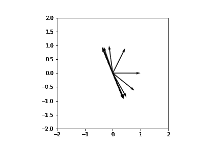

###### 图 6-10。我们从 <math alttext="ModifyingAbove v With right-arrow Subscript 0 Baseline equals StartBinomialOrMatrix 1 Choose 0 EndBinomialOrMatrix"><mrow><msub><mover accent="true"><mi>v</mi> <mo>→</mo></mover> <mn>0</mn></msub> <mo>=</mo> <mfenced close=")" open="("><mtable><mtr><mtd><mn>1</mn></mtd></mtr> <mtr><mtd><mn>0</mn></mtd></mtr></mtable></mfenced></mrow></math> 开始，然后我们乘以 *A* 并归一化，直到收敛到特征向量。

# 伪逆

许多物理系统可以用（或近似于）线性方程组<mrow><mi>A</mi> <mover accent="true"><mi>x</mi> <mo>→</mo></mover> <mo>=</mo> <mover accent="true"><mi>b</mi> <mo>→</mo></mover></mrow>来表示。如果<mover accent="true"><mi>x</mi> <mo>→</mo></mover>是我们关心的未知向量，则我们需要通过矩阵*A*来找到<mover accent="true"><mi>x</mi> <mo>→</mo></mover>。矩阵除法的等效物是找到*逆矩阵*<msup><mi>A</mi> <mrow><mo>-</mo><mn>1</mn></mrow></msup>，这样解就是<mrow><mover accent="true"><mi>x</mi> <mo>→</mo></mover> <mo>=</mo> <msup><mi>A</mi> <mrow><mo>-</mo><mn>1</mn></mrow></msup> <mover accent="true"><mi>b</mi> <mo>→</mo></mover></mrow>。具有逆矩阵的矩阵称为*可逆*矩阵。这些是具有非零行列式的方阵（行列式是特征值的乘积，奇异值的乘积，行列式的绝对值将相同）。但是那些矩阵是长方形的系统呢？那些具有不可逆矩阵的系统呢？那些矩阵是方阵且可逆的，但*几乎*不可逆（它们的行列式非常接近零）呢？我们仍然关心找到这些系统的*解*。奇异值分解的威力在于它适用于*任何矩阵*，包括上述提到的那些，它可以帮助我们*反转*任何矩阵。

给定任何矩阵及其奇异值分解<mrow><mi>A</mi> <mo>=</mo> <mi>U</mi> <mi>Σ</mi> <msup><mi>V</mi> <mi>t</mi></msup></mrow>，我们可以将其*伪逆*定义为：

<math display="block"><mrow><msup><mi>A</mi> <mo>+</mo></msup> <mo>=</mo> <mi>V</mi> <msup><mi>Σ</mi> <mo>+</mo></msup> <msup><mi>U</mi> <mi>t</mi></msup> <mo>,</mo></mrow></math>

其中<msup><mi>Σ</mi> <mo>+</mo></msup>是通过反转所有对角线条目获得的<mi>Σ</mi>（除了那些为零的条目（或者如果矩阵恰好病态，则非常接近于零））。

这使我们能够找到*任何*线性方程组<mrow><mi>A</mi> <mi>x</mi> <mo>=</mo> <mi>b</mi></mrow>的*解*，即<mrow><mi>x</mi> <mo>=</mo> <msup><mi>A</mi> <mo>+</mo></msup> <mi>b</mi></mrow>。

> **注意** 当后者存在时，矩阵的伪逆与其逆矩阵相同。

# 将奇异值分解应用于图像

我们终于准备好将奇异值分解应用于实际世界中。我们从图像压缩开始。数字图像以数字矩阵的形式存储，其中每个数字对应于像素的强度。我们将使用奇异值分解来减少图像的存储要求，而不会丢失其最基本的信息。我们所要做的就是丢弃不重要的奇异值，以及对应的*U*的列和<msup><mi>V</mi> <mi>t</mi></msup>的行。在这里帮助我们的数学表达式是：

<math alttext="dollar-sign upper A equals upper U normal upper Sigma upper V Superscript t Baseline equals sigma 1 upper U Subscript c o l 1 Baseline upper V Subscript r o w 1 Superscript t Baseline plus sigma 2 upper U Subscript c o l 2 Baseline upper V Subscript r o w 2 Superscript t Baseline plus ellipsis plus sigma Subscript r Baseline upper U Subscript c o l Sub Subscript r Baseline upper V Subscript r o w Sub Subscript r Superscript t dollar-sign"><mrow><mi>A</mi> <mo>=</mo> <mi>U</mi> <mi>Σ</mi> <msup><mi>V</mi> <mi>t</mi></msup> <mo>=</mo> <msub><mi>σ</mi> <mn>1</mn></msub> <msub><mi>U</mi> <mrow><mi>c</mi><mi>o</mi><msub><mi>l</mi> <mn>1</mn></msub></mrow></msub> <msubsup><mi>V</mi> <mrow><mi>r</mi><mi>o</mi><msub><mi>w</mi> <mn>1</mn></msub></mrow> <mi>t</mi></msubsup> <mo>+</mo> <msub><mi>σ</mi> <mn>2</mn></msub> <msub><mi>U</mi> <mrow><mi>c</mi><mi>o</mi><msub><mi>l</mi> <mn>2</mn></msub></mrow></msub> <msubsup><mi>V</mi> <mrow><mi>r</mi><mi>o</mi><msub><mi>w</mi> <mn>2</mn></msub></mrow> <mi>t</mi></msubsup> <mo>+</mo> <mo>⋯</mo> <mo>+</mo> <msub><mi>σ</mi> <mi>r</mi></msub> <msub><mi>U</mi> <mrow><mi>c</mi><mi>o</mi><msub><mi>l</mi> <mi>r</mi></msub></mrow></msub> <msubsup><mi>V</mi> <mrow><mi>r</mi><mi>o</mi><msub><mi>w</mi> <mi>r</mi></msub></mrow> <mi>t</mi></msubsup></mrow></math>

回想一下，<mi>σ</mi>按从最大值到最小值排列，因此我们的想法是保留前几个大的<mi>σ</mi>，丢弃其余的小的<mi>σ</mi>，反正它们本来就很小。

让我们使用图 6-11 中的图像。代码和详细信息在链接的 Jupyter 笔记本中。每个彩色图像有三个通道，红色、绿色和蓝色（参见图 6-12 和图 6-13）。每个通道都是一个数字矩阵，就像本章中我们一直在处理的那些一样。图 6-11 中图像的每个通道都是一个<math alttext="s i z e equals 960 times 714"><mrow><mi>s</mi> <mi>i</mi> <mi>z</mi> <mi>e</mi> <mo>=</mo> <mn>960</mn> <mo>×</mo> <mn>714</mn></mrow></math>矩阵，因此为了存储完整的图像，我们需要<math alttext="s i z e equals 960 times 714 times 3 equals 2 comma 056 comma 320"><mrow><mi>s</mi> <mi>i</mi> <mi>z</mi> <mi>e</mi> <mo>=</mo> <mn>960</mn> <mo>×</mo> <mn>714</mn> <mo>×</mo> <mn>3</mn> <mo>=</mo> <mn>2</mn> <mo>,</mo> <mn>056</mn> <mo>,</mo> <mn>320</mn></mrow></math>个数字。想象一下流媒体视频的存储需求，其中包含许多图像帧。我们需要一种压缩机制，以免内存不足。我们为每个通道计算奇异值分解（参见图 6-14 中红色通道奇异值分解的图像表示）。然后我们进行大规模的减少，每个通道仅保留前 25 个奇异值（共 714 个）、*U*的 25 列（共 960 列）和<math alttext="upper V Superscript t"><msup><mi>V</mi> <mi>t</mi></msup></math>的 25 行（共 714 行）。每个通道的存储减少是巨大的：*U*现在是<math alttext="960 times 25"><mrow><mn>960</mn> <mo>×</mo> <mn>25</mn></mrow></math>，<math alttext="upper V Superscript t"><msup><mi>V</mi> <mi>t</mi></msup></math>是<math alttext="25 times 714"><mrow><mn>25</mn> <mo>×</mo> <mn>714</mn></mrow></math>，我们只需要存储 25 个奇异值（不需要存储对角矩阵<math alttext="normal upper Sigma"><mi>Σ</mi></math>的零元素）。每个通道需要存储 41,875 个数字，因此对于所有三个通道，我们需要存储<math alttext="41 comma 875 times 3 equals 125 comma 625"><mrow><mn>41</mn> <mo>,</mo> <mn>875</mn> <mo>×</mo> <mn>3</mn> <mo>=</mo> <mn>125</mn> <mo>,</mo> <mn>625</mn></mrow></math>个数字，存储需求减少了 93%。

我们通过将减少的*U*、减少的<math alttext="normal upper Sigma"><mi>Σ</mi></math>和减少的<math alttext="upper V Superscript t"><msup><mi>V</mi> <mi>t</mi></msup></math>相乘，逐个通道将图像重新组合：

<math alttext="dollar-sign upper C h a n n e l Subscript r e d u c e d Baseline equals upper U Subscript 960 times 25 Baseline normal upper Sigma Subscript 25 times 25 Baseline left-parenthesis upper V Superscript t Baseline right-parenthesis Subscript 25 times 714 dollar-sign"><mrow><mi>C</mi> <mi>h</mi> <mi>a</mi> <mi>n</mi> <mi>n</mi> <mi>e</mi> <msub><mi>l</mi> <mrow><mi>r</mi><mi>e</mi><mi>d</mi><mi>u</mi><mi>c</mi><mi>e</mi><mi>d</mi></mrow></msub> <mo>=</mo> <msub><mi>U</mi> <mrow><mn>960</mn><mo>×</mo><mn>25</mn></mrow></msub> <msub><mi>Σ</mi> <mrow><mn>25</mn><mo>×</mo><mn>25</mn></mrow></msub> <msub><mrow><mo>(</mo><msup><mi>V</mi> <mi>t</mi></msup> <mo>)</mo></mrow> <mrow><mn>25</mn><mo>×</mo><mn>714</mn></mrow></msub></mrow></math>

图 6-15 显示了对红色、绿色和蓝色通道进行此乘法的结果。

最后，我们将减少的通道叠加在一起，生成减少的图像（图 6-16）。显然，我们在这个过程中丢失了很多细节，但这是我们不得不接受的权衡。

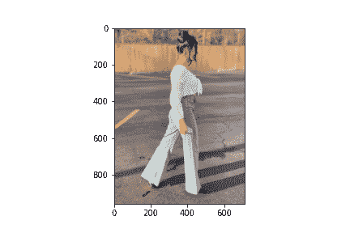

###### 图 6-11。一个大小为<math alttext="s i z e equals 960 times 714 times 3"><mrow><mi>s</mi> <mi>i</mi> <mi>z</mi> <mi>e</mi> <mo>=</mo> <mn>960</mn> <mo>×</mo> <mn>714</mn> <mo>×</mo> <mn>3</mn></mrow></math>的数字彩色图像。

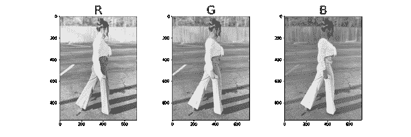

###### 图 6-12。数字图像的红色、绿色和蓝色通道。每个通道的大小为<math alttext="s i z e equals 960 times 714"><mrow><mi>s</mi> <mi>i</mi> <mi>z</mi> <mi>e</mi> <mo>=</mo> <mn>960</mn> <mo>×</mo> <mn>714</mn></mrow></math>。

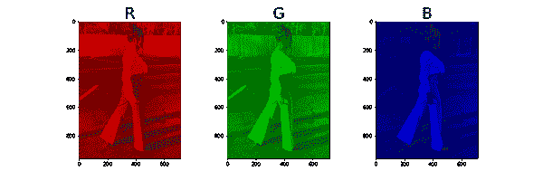

###### 图 6-13。显示数字图像的三个通道的红色、绿色和蓝色色调。每个通道的大小为<math alttext="s i z e equals 960 times 714 times 3"><mrow><mi>s</mi> <mi>i</mi> <mi>z</mi> <mi>e</mi> <mo>=</mo> <mn>960</mn> <mo>×</mo> <mn>714</mn> <mo>×</mo> <mn>3</mn></mrow></math>。

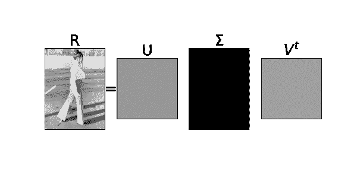

###### 图 6-14。红色通道的奇异值分解。我们有 714 个非零奇异值，但只有少数显著的。

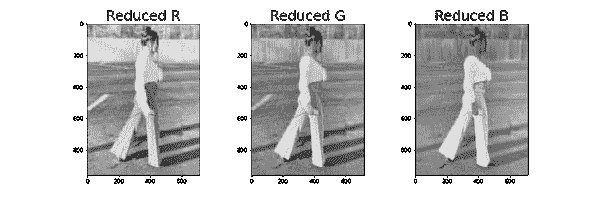

###### 图 6-15。降秩后的红色、绿色和蓝色通道。对于每个通道，我们仅保留了前 25 个奇异值，*U*的前 25 列和<math alttext="upper V Superscript t"><msup><mi>V</mi> <mi>t</mi></msup></math> 的前 25 行。

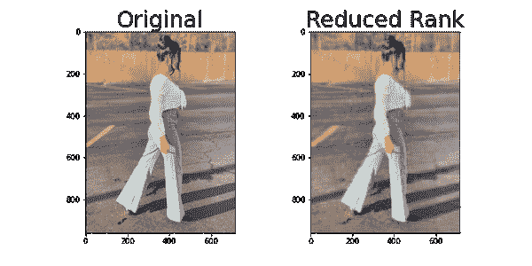

###### 图 6-16。具有 714 个奇异值的原始图像*vs*仅具有 25 个奇异值的降秩图像。两者仍然具有大小<math alttext="s i z e equals 960 times 714 times 3"><mrow><mi>s</mi> <mi>i</mi> <mi>z</mi> <mi>e</mi> <mo>=</mo> <mn>960</mn> <mo>×</mo> <mn>714</mn> <mo>×</mo> <mn>3</mn></mrow></math>，但需要不同的存储空间。

有关高级图像压缩技术，请查看此文章：[图像压缩技术：无损和有损算法调查](https://www.sciencedirect.com/science/article/abs/pii/S0925231218302935)，神经计算（Elsevier）卷 300，2018 年 7 月 26 日，页面 44-69。

# 主成分分析和降维

主成分分析在数据分析中广受欢迎。它用于无监督机器学习中的降维和聚类。简而言之，它是在数据矩阵*X*上执行的奇异值分解，之前对数据进行了*居中*处理，这意味着从每个特征的平均值中减去每个特征列的平均值（*X*的每一列）。然后主成分是右奇异向量，它们是在现在熟悉的分解<math alttext="upper X equals upper U normal upper Sigma upper V Superscript t"><mrow><mi>X</mi> <mo>=</mo> <mi>U</mi> <mi>Σ</mi> <msup><mi>V</mi> <mi>t</mi></msup></mrow></math> 中的<math alttext="upper V Superscript t"><msup><mi>V</mi> <mi>t</mi></msup></math> 的行。

统计学家喜欢用方差或数据中的变化以及*去相关化*数据的语言来描述主成分分析。他们最终会使用数据的*协方差矩阵*的特征向量进行工作。这是统计学中对主成分分析的熟悉描述：*它是一种减少数据集维度的方法，同时尽可能保留更多的变异性或统计信息。尽可能保留更多的变异性意味着找到数据集的线性组合的新特征，这些特征依次最大化方差并且彼此不相关*。例如参见[主成分分析：回顾和最新发展](https://royalsocietypublishing.org/doi/pdf/10.1098/rsta.2015.0202)。

两种描述（对数据进行中心化的右奇异向量和协方差矩阵的特征向量）完全相同，因为<math alttext="upper V Superscript t"><msup><mi>V</mi> <mi>t</mi></msup></math> 的行是<math alttext="upper X Subscript c e n t e r e d Superscript t Baseline upper X Subscript c e n t e r e d"><mrow><msubsup><mi>X</mi> <mrow><mi>c</mi><mi>e</mi><mi>n</mi><mi>t</mi><mi>e</mi><mi>r</mi><mi>e</mi><mi>d</mi></mrow> <mi>t</mi></msubsup> <msub><mi>X</mi> <mrow><mi>c</mi><mi>e</mi><mi>n</mi><mi>t</mi><mi>e</mi><mi>r</mi><mi>e</mi><mi>d</mi></mrow></msub></mrow></math> 的特征向量，而<math alttext="upper X Subscript c e n t e r e d Superscript t Baseline upper X Subscript c e n t e r e d"><mrow><msubsup><mi>X</mi> <mrow><mi>c</mi><mi>e</mi><mi>n</mi><mi>t</mi><mi>e</mi><mi>r</mi><mi>e</mi><mi>d</mi></mrow> <mi>t</mi></msubsup> <msub><mi>X</mi> <mrow><mi>c</mi><mi>e</mi><mi>n</mi><mi>t</mi><mi>e</mi><mi>r</mi><mi>e</mi><mi>d</mi></mrow></msub></mrow></math> ，这反过来是数据的协方差矩阵。此外，统计学中的*去相关化*术语对应于数学和线性代数中的*对角化*，奇异值分解表明任何矩阵在新坐标系中（即<math alttext="upper V Superscript t"><msup><mi>V</mi> <mi>t</mi></msup></math> 的行，它们是*V*的列）中的行为类似于对角矩阵，即<math alttext="normal upper Sigma"><mi>Σ</mi></math>。

让我们详细解释一下。假设*X*是一个中心化的数据矩阵，其奇异值分解为<math alttext="upper X equals upper U normal upper Sigma upper V Superscript t"><mrow><mi>X</mi> <mo>=</mo> <mi>U</mi> <mi>Σ</mi> <msup><mi>V</mi> <mi>t</mi></msup></mrow></math>。这等同于<math alttext="upper X upper V equals upper U normal upper Sigma"><mrow><mi>X</mi> <mi>V</mi> <mo>=</mo> <mi>U</mi> <mi>Σ</mi></mrow></math>，或者，当我们逐列解析表达式时：<math alttext="upper X upper V Subscript c o l Sub Subscript i Baseline equals sigma Subscript i Baseline upper U Subscript c o l Sub Subscript i"><mrow><mi>X</mi> <msub><mi>V</mi> <mrow><mi>c</mi><mi>o</mi><msub><mi>l</mi> <mi>i</mi></msub></mrow></msub> <mo>=</mo> <msub><mi>σ</mi> <mi>i</mi></msub> <msub><mi>U</mi> <mrow><mi>c</mi><mi>o</mi><msub><mi>l</mi> <mi>i</mi></msub></mrow></msub></mrow></math>。注意<math alttext="upper X upper V Subscript c o l Sub Subscript i"><mrow><mi>X</mi> <msub><mi>V</mi> <mrow><mi>c</mi><mi>o</mi><msub><mi>l</mi> <mi>i</mi></msub></mrow></msub></mrow></math>只是使用*V*的特定列的条目对数据的特征进行线性组合。现在，忠实于本章一直在做的事情，我们可以丢弃较不显著的组件，即对应于较低奇异值的*V*和*U*的列。

假设我们的数据有 200 个特征，但只有两个奇异值是显著的，因此我们决定只保留*V*的前两列和*U*的前两列。因此，我们将特征的维度从 200 降低到 2。第一个新特征是使用*V*的第一列的条目对所有原始 200 个特征进行线性组合得到的，但这恰好是<math alttext="sigma 1 upper U Subscript c o l 1"><mrow><msub><mi>σ</mi> <mn>1</mn></msub> <msub><mi>U</mi> <mrow><mi>c</mi><mi>o</mi><msub><mi>l</mi> <mn>1</mn></msub></mrow></msub></mrow></math>，第二个新特征是使用*V*的第二列的条目对所有原始 200 个特征进行线性组合得到的，但这恰好是<math alttext="sigma 2 upper U Subscript c o l 2"><mrow><msub><mi>σ</mi> <mn>2</mn></msub> <msub><mi>U</mi> <mrow><mi>c</mi><mi>o</mi><msub><mi>l</mi> <mn>2</mn></msub></mrow></msub></mrow></math>。

现在让我们考虑单个数据点。数据矩阵*X*中的数据点有 200 个特征。这意味着我们需要 200 个轴来绘制这个数据点。然而，通过上面使用仅前两个主成分进行的降维，这个数据点现在只有两个坐标，即<math alttext="sigma 1 upper U Subscript c o l 1"><mrow><msub><mi>σ</mi> <mn>1</mn></msub> <msub><mi>U</mi> <mrow><mi>c</mi><mi>o</mi><msub><mi>l</mi> <mn>1</mn></msub></mrow></msub></mrow></math>和<math alttext="sigma 2 upper U Subscript c o l 2"><mrow><msub><mi>σ</mi> <mn>2</mn></msub> <msub><mi>U</mi> <mrow><mi>c</mi><mi>o</mi><msub><mi>l</mi> <mn>2</mn></msub></mrow></msub></mrow></math>的对应条目。因此，如果这是数据集中的第三个数据点，那么它的新坐标将是<math alttext="sigma 1 upper U Subscript c o l 1"><mrow><msub><mi>σ</mi> <mn>1</mn></msub> <msub><mi>U</mi> <mrow><mi>c</mi><mi>o</mi><msub><mi>l</mi> <mn>1</mn></msub></mrow></msub></mrow></math>的第三个条目和<math alttext="sigma 2 upper U Subscript c o l 2"><mrow><msub><mi>σ</mi> <mn>2</mn></msub> <msub><mi>U</mi> <mrow><mi>c</mi><mi>o</mi><msub><mi>l</mi> <mn>2</mn></msub></mrow></msub></mrow></math>的第三个条目。现在很容易在二维空间中绘制这个数据点，而不是在原始的 200 维空间中绘制它。

我们决定保留多少奇异值（因此主成分）是我们自己选择的。我们保留的越多，我们对原始数据集的忠实度就越高，但当然维度会更高。这种*截断*决策（找到奇异值截断的最佳阈值）是正在进行的研究课题。常见的方法是提前确定所需的秩，或者保留原始数据中一定量的方差。其他技术绘制所有奇异值，观察图中明显的变化，并决定在该位置截断，希望将数据中的基本模式与噪音分开。

重要的是不仅要对数据进行中心化，还要对其进行标准化：减去每个特征的平均值并除以标准差。原因是奇异值分解对特征测量的尺度敏感。当我们对数据进行标准化时，我们最终会使用相关矩阵而不是协方差矩阵。为了不让自己困惑，要记住的主要观点是我们对标准化数据集执行奇异值分解，然后主成分是*V*的列，数据点的新坐标是<math alttext="sigma Subscript i Baseline upper U Subscript c o l Sub Subscript i"><mrow><msub><mi>σ</mi> <mi>i</mi></msub> <msub><mi>U</mi> <mrow><mi>c</mi><mi>o</mi><msub><mi>l</mi> <mi>i</mi></msub></mrow></msub></mrow></math>的条目。

# 主成分分析和聚类

在前一节中，我们看到如何使用主成分分析来减少数据的特征数量，提供一个按照数据变化的层次顺序排列的新特征集。这对于可视化数据非常有用，因为我们只能在二维或三维中进行可视化。能够在高维数据中可视化模式和相关性非常重要，例如在基因数据中。有时，在由主成分确定的降维空间中，数据按其类别固有地聚类。例如，如果数据集既包含患癌症患者又包含无癌症患者，以及它们的基因表达（通常在数千个），我们可能会注意到在前三个主成分空间中绘制数据时，患癌症的患者与无癌症的患者分开聚类。

# 社交媒体应用

在主成分分析和聚类的同一本质中，Dan Vilenchik 最近的一篇[出版物（2020 年 12 月）](https://link.springer.com/chapter/10.1007/978-3-030-59177-9_2)展示了来自社交媒体的一个精彩应用：一种无监督的方法来描述在线社交媒体平台上的用户。以下是他在这个主题上发表的演讲摘要以及他的出版物的摘要：

*理解从在线平台（如在线社交媒体或电子学习平台）自动收集的数据是一项具有挑战性的任务：数据庞大、多维、嘈杂且异构（由行为不同的个体组成）。在这次演讲中，我们专注于所有在线社交平台共同的一个核心任务，即用户描述的任务。例如，自动识别 Twitter 上的垃圾邮件发送者或机器人，或者在电子学习平台上识别一个不参与的学生。*

*在线社交媒体渠道在我们的生活中扮演着核心角色。对社交网络中的用户进行表征是一个长期存在的问题，可以追溯到上世纪 50 年代，当时 Katz 和 Lazarsfeld 研究了“大众传播”中的影响。在机器学习时代，这个任务通常被视为一个监督学习问题，其中需要预测一个目标变量：年龄、性别、政治倾向、收入等。在这次讨论中，我们探讨了在无监督方式下可以实现什么。具体来说，我们利用主成分分析来理解一些社交媒体平台固有的模式和结构，以及其他平台没有的原因。我们得出了一个类似辛普森悖论的结论，这可能让我们更深入地了解这些平台用户表征的数据驱动过程。*

主成分分析的概念用于在数据中创建具有最大方差的聚类将在本书中多次出现。

# 潜在语义分析

自然语言数据（文档）的潜在语义分析类似于数值数据的主成分分析。

在这里，我们想分析一组文档和它们包含的单词之间的关系。潜在语义分析的分布假设表明具有相似含义的单词出现在相似的文本片段中，因此出现在相似的文档中。计算机只能理解数字，因此在对它们进行任何分析之前，我们必须想出我们的单词文档的数值表示。这样的表示是*词频*矩阵*X*：列代表唯一的单词（如苹果，橙子，狗，城市，智能等），行代表每个文档。这样的矩阵非常大但非常稀疏（有很多零）。有太多的单词（这些是特征），所以我们需要降低特征的维度，同时保留文档（数据点）之间的相似性结构。到现在为止，我们知道该怎么做：对词频矩阵执行奇异值分解，<math alttext="upper X equals upper U normal upper Sigma upper V Superscript t"><mrow><mi>X</mi> <mo>=</mo> <mi>U</mi> <mi>Σ</mi> <msup><mi>V</mi> <mi>t</mi></msup></mrow></math>，然后丢弃较小的奇异值以及对应的*U*中的列和<math alttext="upper V Superscript t"><msup><mi>V</mi> <mi>t</mi></msup></math>中的行。现在我们可以在较低维度空间中表示每个文档（线性组合的单词），这与主成分分析允许在较低维度特征空间中表示数据的方式完全相同。

一旦我们降低了维度，我们最终可以使用*余弦相似度*比较文档：计算表示文档的两个向量之间的角度的余弦。如果余弦接近 1，那么文档在*词空间*中指向相同方向，因此代表非常相似的文档。如果余弦接近 0，则表示文档的向量彼此正交，因此彼此非常不同。

在早期，谷歌搜索更像是一个索引，然后它发展到接受更自然语言搜索。智能手机自动完成也是如此。潜在语义分析将句子或文档的含义压缩成一个向量，当这个向量集成到搜索引擎中时，它显著提高了引擎的质量，检索到我们正在寻找的确切文档。

# 随机奇异值分解

在本章中，我们故意避免计算奇异值分解，因为这是昂贵的。然而，我们提到常见的算法使用一种称为*QR*分解的矩阵分解（获得数据矩阵列的正交基），然后使用*Householder 反射*将其转换为双对角矩阵，最后使用迭代方法计算所需的特征向量和特征值。遗憾的是，对于不断增长的数据集，即使对于这些高效算法，涉及的矩阵也太大了。我们唯一的救赎是通过*随机线性代数*。这个领域提供了非常高效的矩阵分解方法，依赖于*随机抽样理论*。随机数值方法奇迹般地工作，提供准确的矩阵分解，同时比确定性方法便宜得多。随机奇异值分解对大数据矩阵*X*的列空间进行抽样，计算抽样（要小得多）矩阵的*QR*分解，将*X*投影到较小的空间（<math alttext="upper Y equals upper Q Superscript t Baseline upper X"><mrow><mi>Y</mi> <mo>=</mo> <msup><mi>Q</mi> <mi>t</mi></msup> <mi>X</mi></mrow></math>，因此<math alttext="upper X almost-equals upper Q upper Y"><mrow><mi>X</mi> <mo>≈</mo> <mi>Q</mi> <mi>Y</mi></mrow></math>），然后计算*Y*的奇异值分解（<math alttext="upper Y equals upper U normal upper Sigma upper V Superscript t"><mrow><mi>Y</mi> <mo>=</mo> <mi>U</mi> <mi>Σ</mi> <msup><mi>V</mi> <mi>t</mi></msup></mrow></math>）。矩阵*Q*是正交的，并且近似于*X*的列空间，因此矩阵<math alttext="normal upper Sigma"><mi>Σ</mi></math>和*V*对于*X*和*Y*是相同的。要找到*X*的*U*，我们可以从*Y*和*Q*的*U*计算得到<math alttext="upper U Subscript upper X Baseline equals upper Q upper U Subscript upper Y"><mrow><msub><mi>U</mi> <mi>X</mi></msub> <mo>=</mo> <mi>Q</mi> <msub><mi>U</mi> <mi>Y</mi></msub></mrow></math>。

像所有随机方法一样，它们必须伴随着误差界限，即从原始矩阵*X*到抽样*QY*的期望有多远。我们有这样的误差界限，但我们将它们推迟到下一章，专门讨论大型随机矩阵。

# 总结和展望

本章的焦点是一个公式：

<math alttext="dollar-sign upper X equals upper U normal upper Sigma upper V Superscript t Baseline equals sigma 1 upper U Subscript c o l 1 Baseline upper V Subscript r o w 1 Superscript t Baseline plus sigma 2 upper U Subscript c o l 2 Baseline upper V Subscript r o w 2 Superscript t Baseline plus ellipsis plus sigma Subscript r Baseline upper U Subscript c o l Sub Subscript r Baseline upper V Subscript r o w Sub Subscript r Superscript t dollar-sign"><mrow><mi>X</mi> <mo>=</mo> <mi>U</mi> <mi>Σ</mi> <msup><mi>V</mi> <mi>t</mi></msup> <mo>=</mo> <msub><mi>σ</mi> <mn>1</mn></msub> <msub><mi>U</mi> <mrow><mi>c</mi><mi>o</mi><msub><mi>l</mi> <mn>1</mn></msub></mrow></msub> <msubsup><mi>V</mi> <mrow><mi>r</mi><mi>o</mi><msub><mi>w</mi> <mn>1</mn></msub></mrow> <mi>t</mi></msubsup> <mo>+</mo> <msub><mi>σ</mi> <mn>2</mn></msub> <msub><mi>U</mi> <mrow><mi>c</mi><mi>o</mi><msub><mi>l</mi> <mn>2</mn></msub></mrow></msub> <msubsup><mi>V</mi> <mrow><mi>r</mi><mi>o</mi><msub><mi>w</mi> <mn>2</mn></msub></mrow> <mi>t</mi></msubsup> <mo>+</mo> <mo>⋯</mo> <mo>+</mo> <msub><mi>σ</mi> <mi>r</mi></msub> <msub><mi>U</mi> <mrow><mi>c</mi><mi>o</mi><msub><mi>l</mi> <mi>r</mi></msub></mrow></msub> <msubsup><mi>V</mi> <mrow><mi>r</mi><mi>o</mi><msub><mi>w</mi> <mi>r</mi></msub></mrow> <mi>t</mi></msubsup></mrow></math>

这等同于<math alttext="upper X upper V equals upper U normal upper Sigma"><mrow><mi>X</mi> <mi>V</mi> <mo>=</mo> <mi>U</mi> <mi>Σ</mi></mrow></math>和<math alttext="upper X upper V Subscript c o l Sub Subscript i Baseline equals sigma Subscript i Baseline upper U Subscript c o l Sub Subscript i"><mrow><mi>X</mi> <msub><mi>V</mi> <mrow><mi>c</mi><mi>o</mi><msub><mi>l</mi> <mi>i</mi></msub></mrow></msub> <mo>=</mo> <msub><mi>σ</mi> <mi>i</mi></msub> <msub><mi>U</mi> <mrow><mi>c</mi><mi>o</mi><msub><mi>l</mi> <mi>i</mi></msub></mrow></msub></mrow></math>。

奇异值分解的威力在于它允许在不丢失基本信息的情况下进行秩降低。这使我们能够压缩图像，减少数据集的特征空间的维数，并在自然语言处理中计算文档相似性。

我们讨论了主成分分析、潜在语义分析以及主成分空间中固有的聚类结构。我们讨论了主成分分析被用作根据基因表达对卵巢癌患者进行无监督聚类技术的示例，以及对社交媒体用户进行表征的示例。

我们以随机奇异值分解结束了本章，突出了本书的一个重要主题：当事物太大时，对其进行抽样。*随机性通常产生可靠性*。

对于想深入了解的读者，可以阅读有关张量分解和 N 维数据数组的内容，以及数据对齐对奇异值分解正常工作的重要性。对于对流行示例感兴趣的读者，可以从现代角度了解特征脸。
