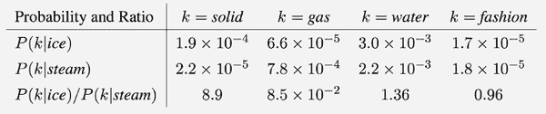

# 第七章。自然语言和金融人工智能：向量化和时间序列

> *他们。能。阅读。*

人类智慧的一个标志是我们在很小的时候就掌握了语言：理解书面和口头语言，书面和口头表达思想，两个或更多人之间的对话，从一种语言到另一种语言的翻译，以及使用语言表达同理心、传达情感，并处理从周围环境中感知到的视觉和音频数据。撇开意识的哲学问题不谈，如果机器能够像人类一样或超过人类一样，以类似于人类的水平执行这些语言任务，解读单词的意图，那么这将是通往通用人工智能的重要推动力。这些任务属于*自然语言处理*、*计算语言学*、*机器学习*和/或*概率语言建模*的范畴。这些领域广阔，很容易让人们在各种充满大量承诺的模型中徘徊。我们不应迷失方向。本章的目的是一次性展示自然处理领域，以便我们可以一览全局而不深入细节。

以下问题始终指导我们：

1.  手头上是什么类型的任务？换句话说，我们的目标是什么？

1.  手头上是什么类型的数据？我们需要收集什么类型的数据？

1.  有哪些最先进的模型处理类似任务和类似类型的数据？如果没有，那么我们必须自己设计模型。

1.  我们如何训练这些模型？它们以什么格式消耗数据？它们以什么格式产生输出？它们是否有训练函数、损失函数（或目标函数）和优化结构？

1.  各种模型相对于其他模型的优缺点是什么？

1.  是否有 Python 包或库可用于实现它们？幸运的是，如今，大多数模型都伴随着它们的 Python 实现和非常简单的 API（应用程序编程接口）一起发布。更好的是，有许多预训练模型可供下载并准备在应用中使用。

1.  为了训练和/或部署这些模型，我们需要多少计算基础设施？

1.  我们能做得更好吗？总有改进的空间。

我们还需要*从表现最佳的模型中提取数学*。幸运的是，这是容易的部分，因为许多模型都有相似的数学基础，即使涉及不同类型的任务或来自不同的应用领域，比如预测句子中的下一个单词或预测股市行为。

我们打算在本章中介绍的最先进模型有：

+   变压器或注意力模型（自 2017 年起）。这里的重要数学非常简单：两个向量之间的点积。

+   递归长短期记忆神经网络（自 1995 年起）。这里的重要数学是*时间反向传播*。我们在第四章中介绍了反向传播，但对于递归网络，我们要对时间进行导数。

+   卷积神经网络（自 1989 年起）用于时间序列数据。重要的数学是*卷积*操作，我们在第五章中介绍过。

这些模型非常适用于*时间序列数据*，即随时间顺序出现的数据。时间序列数据的例子包括电影、音频文件（如音乐和语音录音）、金融市场数据、气候数据、动态系统数据、文件和书籍。

我们可能会想知道为什么文件和书籍可以被视为时间相关，即使它们已经被写成并且只是*存在*。为什么图像不是时间相关，但书籍，以及一般来说，阅读和写作是？答案很简单：

+   当我们阅读一本书时，我们逐个理解我们读到的每个单词，然后逐个理解每个短语，然后逐个理解每个句子，然后逐个理解每个段落，依此类推。这是我们理解书中概念和主题的方式。

+   当我们写文档时，即使我们尝试表达的整个想法已经*编码*在那里，我们也是逐个输出一个单词，*顺序地*在纸上输出。

+   当我们给图像加标题时，图像本身不是时间相关的，但我们的标题（输出）是。

+   当我们总结一篇文章、回答一个问题或从一种语言翻译到另一种语言时，输出文本是时间相关的。如果使用循环神经网络处理，输入文本可能是时间相关的，如果使用 transformer 或卷积模型一次处理所有文本，则是静态的。

直到 2017 年，处理时间序列数据的最流行的机器学习模型要么基于*卷积神经网络*，要么基于*具有长短期记忆的循环神经网络*。2017 年，*transformers*取代了它们，在某些应用领域完全放弃了循环。关于循环神经网络是否过时的问题存在，但在人工智能领域每天都在发生变化，谁知道哪些模型会消亡，哪些模型会经受时间的考验。此外，循环神经网络驱动许多人工智能引擎，仍然是积极研究的对象。

在本章中，我们回答以下问题：

1.  我们如何将自然语言文本转换为保留含义的数值量？我们的机器只能理解数字，我们需要使用这些机器处理自然语言。我们必须*向量化*我们的文本数据样本，或者将它们*嵌入*到有限维向量空间中。

1.  我们如何将最初需要的巨大向量的维度降低到表示自然语言所需的维度？例如，法语有大约 135,000 个不同的单词，我们如何避免使用每个包含 135,000 个条目的向量对法语句子进行独热编码？

1.  手头的模型是否将我们的自然语言数据（作为输入和/或输出）视为一个接一个地输入的时间相关序列，还是一次消耗所有的静态向量？

1.  各种自然语言处理模型究竟是如何工作的？

1.  为什么本章中也涉及金融？

在讨论过程中，我们将讨论我们的模型适用于哪些类型的自然语言和金融应用。我们将重点放在数学上，而不是编程，因为这些模型（特别是语言应用）需要实质性的计算基础设施。例如，[DeepL Translator](https://www.deepl.com/en/translator)使用冰岛水力发电操作的超级计算机生成翻译，达到 5.1 petaflops。我们还注意到，AI 专用芯片行业正在蓬勃发展，由 Nvidia、谷歌的 Tensor Processing Unit、亚马逊的 Inferentia、AMD 的 Instinct GPU 以及 Cerebras 和 Graphcore 等初创公司领导。尽管传统芯片难以跟上摩尔定律，即每 18 个月处理能力翻倍，但 AI 专用芯片已经远远超过了这一定律。

尽管我们在本章中没有编写代码，但我们注意到大多数编程可以使用 Python 的 TensorFlow 和 Keras 库完成。

在下面的讨论中，我们必须注意我们是在模型的*训练*阶段还是在*预测*阶段（使用预先训练的模型执行任务）。此外，重要的是区分我们的模型是否需要标记数据进行训练，例如英语句子*以及*它们的法语翻译作为标签，或者可以从未标记的数据中学习，例如从上下文中计算单词的*含义*。

# 自然语言人工智能

自然语言处理应用程序是无处不在的。这项技术已经融入到我们生活的许多方面，当我们在智能手机上使用应用程序、数字日历、数字家庭助手、Siri、Alexa 等时，我们往往认为这是理所当然的。以下列表部分改编自优秀书籍《自然语言处理实战》（Lane、Howard 和 Hapke）。它展示了自然语言处理已经变得不可或缺的程度：

+   搜索和信息检索：网络，文档，自动完成，聊天机器人

+   电子邮件：垃圾邮件过滤器，电子邮件分类，电子邮件优先级

+   编辑：拼写检查，语法检查，风格建议

+   情感分析：产品评论，客户关怀，社区士气监测

+   对话：聊天机器人，数字助手如亚马逊的 Alexa，调度

+   写作：索引，一致性，目录

+   文本挖掘：摘要，知识提取，如挖掘选举活动的财务和自然语言数据（找到政治捐赠者之间的联系），简历与工作匹配，医学诊断

+   法律：法律推理，先例搜索，传票分类

+   新闻：事件检测，事实核查，标题撰写

+   归因：抄袭检测，文学取证，风格指导

+   行为预测：金融应用，选举预测，营销

+   创意写作：电影剧本，诗歌，歌词，机器人驱动的金融和体育新闻报道

+   字幕：计算机视觉结合自然语言处理

+   翻译：谷歌翻译和 DeepL 翻译。

尽管过去的十年取得了令人印象深刻的成就，但机器仍然远远没有掌握自然语言。涉及的过程是繁琐的，需要注意的统计记账和实质性的记忆，就像人类需要记忆来掌握语言一样。这里的重点是：在这个领域有很多新的创新和贡献的空间。

语言模型最近已经从手工编码转变为数据驱动。它们不实现硬编码的逻辑和语法规则。相反，它们依赖于检测单词之间的统计关系。尽管在语言学中有一种思想认为语法是人类的固有属性，或者换句话说，硬编码到我们的大脑中，人类有一种惊人的能力，可以掌握新语言，而从未遇到过这些语言的任何语法规则。从个人经验来看，尝试学习一门新语言的语法似乎会妨碍学习过程，但请不要引用我说的话。

一个主要挑战是自然语言数据的维度极高。有数以百万计的单词跨越数千种语言。有大量的文档语料库，如整个作者作品集，数十亿条推特，维基百科文章，新闻文章，Facebook 评论，电影评论等等。第一个目标是减少维度以实现高效存储、处理和计算，同时避免丢失关键信息。这在人工智能领域是一个常见主题，人们不禁要想，如果我们拥有无限的存储和计算基础设施，多少数学创新将永远不会见天日。

# 为机器处理自然语言数据做准备

对于机器来处理任何自然语言任务，它必须首先对文本进行分解，并将其组织成保留意义、意图、上下文、主题、信息和情感的构建块。为此，它必须建立单词和数字标签之间的对应关系，使用称为*标记化*、*词干提取*（例如给予单词及其复数变体相同的标记）、*词形还原*（将意思相近的几个单词关联在一起）、*大小写规范化*（例如给予拼写相同的大写和小写单词相同的标记）等过程。这种对应关系不是针对构成单词的个别字符，而是针对完整的单词、成对或更多的单词（*2-gram 或 n-gram*）、标点符号、重要的大写等携带意义的内容。这创建了一个与给定自然语言文档语料库对应的数字标记的*词汇表*或*词典*。在这种意义上，词汇表或词典类似于 Python 字典：每个单独的自然语言*构建块对象*都有一个唯一的标记。

一个*n-gram*是一系列按顺序排列的*n*个单词，当它们一起保持有序时，其含义与每个单词单独浮动时不同。例如，一个 2-gram 是一对单词，如果我们将它们分开，如*冰淇淋*或*不是*，它们的含义会发生变化，因此整个 2-gram 会得到一个数字标记，保留两个单词在正确上下文中的含义。类似地，一个 3-gram 是一组有序的三个单词，例如*约翰·F·肯尼迪*；依此类推。自然语言的*解析器*与计算机的编译器相同。如果这些新术语让您感到困惑，不要担心。对于我们的数学目的，我们只需要与唯一单词、*n-gram*、表情符号、标点符号、*等*相关联的数字标记，以及自然语言文档语料库的结果*词汇表*。这些保存在类似字典的对象中，使我们可以轻松地在文本和数字标记之间来回切换。

我们将标记化、词干提取、词形还原、解析以及其他自然语言数据准备的实际细节留给计算机科学家和他们与语言学家的合作。事实上，随着模型在直接从数据中检测模式的能力成熟，与语言学家的合作变得不那么重要，因此，将手工制作的语言规则编码到自然语言模型中的需求已经减少。还要注意，并非所有自然语言流水线都包括词干提取和词形还原。但它们都涉及到标记化。对文本数据进行标记化的质量对我们自然语言流水线的性能至关重要。这是包含我们输入模型的数据的基本构建块的第一步。数据和标记化方式的质量会影响整个自然语言处理流水线的输出。对于生产应用程序，请使用*spaCy*解析器，它可以在一次处理中进行句子分割、标记化和多种其他操作。

在对文本进行标记化和拥有丰富的词汇表（数字标记的集合以及它们在自然语言文本中对应的实体）之后，我们需要使用数字向量来表示整个自然语言文档。这些文档可以非常长，比如一本书系列，也可以非常短，比如一条 Twitter 推文或者一个简单的 Google 搜索或 DuckDuckGo 搜索查询。然后，我们可以将一百万个文档的语料库表示为一百万个数字向量的集合，或者一个具有一百万列的矩阵。这些列的长度将与我们选择的词汇表一样长，或者如果我们决定进一步*压缩*这些文档，则会更短。在线性代数语言中，这些向量的长度是我们的文档所*嵌入*的*向量空间*的维度。

上述过程的整个目的是获得我们文档的数值向量表示，以便我们可以对其进行数学运算：线性代数带来了一系列线性组合、投影、点积和奇异值分解。然而，有一个警告：对于自然语言应用，表示我们文档的向量的长度，或者我们词汇表的大小，是非常庞大的，无法进行任何有用的计算。维度的诅咒成为了一个真实存在的问题。

# 注：维度的诅咒

随着维度数量的增加，向量之间的欧几里德距离呈指数增长。一个自然语言的例子是根据它们与另一个文档的*距离*对文档进行排序，比如搜索查询。当我们超过 20 个维度时，如果使用欧几里德距离来衡量文档的*接近程度*，这种简单操作就变得不切实际了（有关更多详细信息，请参阅[Wikipedia 的维度诅咒](https://en.wikipedia.org/wiki/Curse_of_dimensionality)）。因此，对于自然语言应用，我们必须使用另一种衡量文档之间距离的方法。我们将很快讨论*余弦相似度*，它衡量两个文档向量之间的*角度*，而不是它们的欧几里德距离。

因此，自然语言处理模型的主要驱动因素是使用较短的向量来表示这些文档，传达主要主题并保留含义。想想我们必须使用多少个唯一标记或标记组合来表示这本书，同时又保留其最重要的信息。

总结一下，我们的自然语言处理流程如下：

1.  从文本到数字标记，然后到整个文档语料库的可接受词汇。

1.  从标记文档到高维数字向量。

1.  从高维数字向量到使用*直接投影到词汇空间的较小子集*（只是丢弃词汇的一部分，使相应的条目为零）、*潜在语义分析*（投影到由文档向量的特殊线性组合确定的特殊向量）、*Word2Vec*、*Doc2Vec*、*思维向量*、*Dirichlet 分配*等技术生成的主题的较低维向量。我们会简要讨论这些。

通常在数学建模中，有多种方法可以将给定文档表示为一组数字的向量。我们决定我们的文档所在的向量空间，或者被*嵌入*的向量空间。每种向量表示都有优点和缺点，取决于我们自然语言任务的目标。有些比其他的简单。

# 统计模型和*log*函数

当将文档表示为一组数字的向量时，首先要计算文档中某些术语出现的次数，那么我们的文档向量化模型是*统计*的，因为它是基于频率的。

当处理术语频率时，最好将*log*函数应用于我们的计数，而不是使用原始计数。当处理可能变得极大、极小或在规模上有极端变化的数量时，*log*函数是有利的。在对数尺度内查看这些极端计数或变化将它们带回正常范围。

例如，数字<math alttext="10 Superscript 23"><msup><mn>10</mn> <mn>23</mn></msup></math>是巨大的，但<math alttext="log left-parenthesis 10 Superscript 23 Baseline right-parenthesis equals 23 log left-parenthesis 10 right-parenthesis"><mrow><mo form="prefix">log</mo> <mrow><mo>(</mo> <msup><mn>10</mn> <mn>23</mn></msup> <mo>)</mo></mrow> <mo>=</mo> <mn>23</mn> <mo form="prefix">log</mo> <mrow><mo>(</mo> <mn>10</mn> <mo>)</mo></mrow></mrow></math>不是。同样，如果术语*shark*出现在语料库中的两个文档中（2000 万/2=1000 万），而术语*whale*出现在这个语料库的二十个文档中（2000 万/20=100 万），那么这是一个 900 万的差异，对于分别出现在两个和二十个文档中的术语来说，这似乎过多。在*对数*尺度上计算相同的数量，我们分别得到*7log(10)*和*6log(10)*（无论使用哪种*对数*基数），这看起来不再过多，更符合语料库中术语的出现情况。

在处理特定的词频时，使用*对数*函数的必要性特别受到*齐普夫定律*的支持。这个定律说，自然语言语料库中的术语计数自然遵循幂律，因此最好用对数函数来调节，将术语频率的差异转化为线性刻度。接下来我们将讨论这一点。

# 术语计数的齐普夫定律

齐普夫定律与自然语言中的词频有关。它非常有趣，令人惊讶，以至于我忍不住想尝试看看它是否适用于我的书。很难想象，当我在这本书中写下每个词时，我的独特词频实际上遵循了某种规律。我们连同我们表达思想和观点的方式，是*那么可预测*吗？事实证明，齐普夫定律适用于我们周围许多事物的计数，不仅仅是文档和语料库中的词语。

***齐普夫定律***：*对于一个自然语言语料库，其中术语根据它们的频率排序，第一项的频率是第二项的两倍，第三项的三倍，依此类推。*也就是说，一个项目在语料库中出现的频率与其排名有关：<math alttext="f 1 equals 2 f 2 equals 3 f 3 equals period period period"><mrow><msub><mi>f</mi> <mn>1</mn></msub> <mo>=</mo> <mn>2</mn> <msub><mi>f</mi> <mn>2</mn></msub> <mo>=</mo> <mn>3</mn> <msub><mi>f</mi> <mn>3</mn></msub> <mo>=</mo> <mo>.</mo> <mo>.</mo> <mo>.</mo></mrow></math>

我们可以通过绘制术语的频率与它们各自的排名，并验证幂律来验证齐普夫定律：<math alttext="f Subscript r Baseline equals f left-parenthesis r right-parenthesis equals f 1 r Superscript negative 1"><mrow><msub><mi>f</mi> <mi>r</mi></msub> <mo>=</mo> <mi>f</mi> <mrow><mo>(</mo> <mi>r</mi> <mo>)</mo></mrow> <mo>=</mo> <msub><mi>f</mi> <mn>1</mn></msub> <msup><mi>r</mi> <mrow><mo>-</mo><mn>1</mn></mrow></msup></mrow></math>。要验证幂律，最好制作一个*对数-对数*图，将<math alttext="log left-parenthesis f Subscript r Baseline right-parenthesis"><mrow><mo form="prefix">log</mo> <mo>(</mo> <msub><mi>f</mi> <mi>r</mi></msub> <mo>)</mo></mrow></math>绘制在<math alttext="log left-parenthesis r right-parenthesis"><mrow><mo form="prefix">log</mo> <mo>(</mo> <mi>r</mi> <mo>)</mo></mrow></math>上。如果我们在*对数-对数*图中获得一条直线，那么<math alttext="f Subscript r Baseline equals f left-parenthesis r right-parenthesis equals f 1 r Superscript alpha"><mrow><msub><mi>f</mi> <mi>r</mi></msub> <mo>=</mo> <mi>f</mi> <mrow><mo>(</mo> <mi>r</mi> <mo>)</mo></mrow> <mo>=</mo> <msub><mi>f</mi> <mn>1</mn></msub> <msup><mi>r</mi> <mi>α</mi></msup></mrow></math>，其中<math alttext="alpha"><mi>α</mi></math>是直线的斜率。

# 自然语言文档的各种向量表示形式

让我们列出最常见的自然语言处理模型的文档向量表示。前两种，词项频率和词项频率乘以逆文档频率，是统计表示，因为它们是基于频率的，依赖于计算文档中单词出现的次数。它们比简单的二进制表示稍微复杂一些，可以检测文档中某些单词的存在或不存在，然而，它们仍然是浅层的，仅仅计算单词。即使有这种浅显性，它们对于垃圾邮件过滤和情感分析等应用非常有用：

## 文档或词袋的词项频率（TF）向量表示

在这里，我们使用*词袋*来表示一个文档，忽略单词在文档中出现的顺序。尽管单词顺序编码了关于文档内容的重要信息，但忽略它通常是一个对于短句和短语的良好近似。

假设我们想要将给定的文档嵌入到一个包含 10,000 个标记的*词汇空间*中。那么代表这个文档的向量将有 10,000 个条目，每个条目计算每个特定标记在文档中出现的次数。出于明显的原因，这被称为文档的*词项频率*或*词袋*向量表示，其中每个条目是一个非负整数（整数）。

例如，一个谷歌搜索查询：*明天的天气如何？*将被矢量化为除了代表单词*what*、*the*、*weather*和*tomorrow*的标记外，其他地方都是零，如果它们存在于词汇表中。然后我们*标准化*这个向量，将每个条目除以文档中的总术语数，以便文档的长度不会扭曲我们的分析。也就是说，如果一个文档有 50,000 个术语，术语*cat*被提及 100 次，另一个文档只有 100 个术语，术语*cat*被提及 10 次，那么显然单词 cat 对于第二个文档比对于第一个文档更重要，而仅仅计算单词数量而不进行标准化将无法捕捉到这一点。

最后，一些自然语言处理课程对文档向量中的每个术语取对数，原因在前两节中提到。

## 文档的词项频率乘以逆文档频率（TF-IDF）向量表示

在这里，对于代表文档的向量的每个条目，我们仍然计算标记在文档中出现的次数，*但然后我们除以我们语料库中包含该标记的文档的数量*。

这个想法是，如果一个术语在一个文档中出现很多次，而在其他文档中出现的次数不那么多，那么这个术语对于这个文档必须是重要的，在代表这个文档的向量的相应条目中得到更高的分数。

为了避免除以零，在一个术语不出现在任何文档中的情况下，通常的做法是在分母上加一。例如，标记*cat*的逆文档频率是：

<math alttext="dollar-sign IDF for cat equals StartFraction number of documents in corpus Over number of documents containing cat plus 1 EndFraction dollar-sign"><mrow><mtext>IDF</mtext> <mtext>for</mtext> <mtext>cat</mtext> <mo>=</mo> <mfrac><mrow><mtext>number</mtext><mtext>of</mtext><mtext>documents</mtext><mtext>in</mtext><mtext>corpus</mtext></mrow> <mrow><mtext>number</mtext><mtext>of</mtext><mtext>documents</mtext><mtext>containing</mtext><mtext>cat</mtext><mo>+</mo><mn>1</mn></mrow></mfrac></mrow></math>

显然，使用 TF-IDF 表示，文档向量的条目将是非负有理数，每个条目提供了该特定标记对文档的*重要性*的度量。最后，我们对这个向量中的每个条目取对数，原因与前一节中所述相同。

有许多与信息检索系统相关的 TF-IDF 方法，例如 Okapi BM25。参见 Molino 2017。

## 由潜在语义分析确定的文档主题向量表示

TF-IDF 向量非常高维（与语料库中的标记数量一样多，可能达到百万级），稀疏，并且在相互相加或相减时没有特殊含义。我们需要更紧凑的向量，维度在数百个或更少，这是从百万维度中的大幅压缩。除了降维的优势外，这些向量捕捉了一些含义，不仅仅是词频和统计数据。我们称它们为*主题向量*。我们不再关注*文档中单词的统计数据*，而是关注*文档内和跨语料库中单词之间的连接统计数据*。这里产生的主题将是单词计数的线性组合。

首先，我们处理我们语料库的整个 TF-IDF 矩阵*X*，产生我们的*主题空间*。在这种情况下，处理意味着我们计算线性代数中 TF-IDF 矩阵的*奇异值分解*，即，<math alttext="upper X equals upper U normal upper Sigma upper V Superscript t"><mrow><mi>X</mi> <mo>=</mo> <mi>U</mi> <mi>Σ</mi> <msup><mi>V</mi> <mi>t</mi></msup></mrow></math>。我们在本书中有一整章关于奇异值分解，所以我们现在不会详细介绍，但我们会解释如何用它来产生我们语料库的主题空间。线性代数中的奇异值分解在自然语言处理中被称为[*潜在语义分析*](https://en.wikipedia.org/wiki/Latent_semantic_analysis)。我们将两个术语互换使用。

我们必须注意语料库的 TF-IDF 矩阵*X*的列是代表单词标记还是文档。不同的作者和软件包使用其中一个，因此我们必须小心处理矩阵或其转置以产生我们的主题空间。在本节中，我们遵循这种表示：行是整个语料库的所有单词（标记为单词、n-gram 等），列是语料库中每个文档的 TF-IDF 向量表示。这与数据矩阵的通常表示略有不同，其中特征（每个文档中的单词）在列中，实例（文档）在行中。这种切换的原因很快就会显而易见。然而，这与我们对文档的列向量表示并不相悖。

接下来，给定一个新文档及其 TF-IDF 向量表示，我们通过将其*投影到*由语料库的 TF-IDF 矩阵的奇异值分解产生的主题空间上，将其转换为一个更紧凑的*主题向量*。在线性代数中，*投影*仅仅是计算适当向量之间的*点积*，并将结果标量数保存到新的*投影*向量的条目中。以下是步骤：

+   我们有一个文档的 TF-IDF 向量，条目数量与整个语料库中的标记数量相同；

+   我们有*主题权重向量*，它们是通过 TF-IDF 矩阵的奇异值分解产生的矩阵*U*的列。同样，每个主题权重向量的条目数量与我们的语料库中的标记数量相同。最初，我们的主题权重向量与整个语料库中的标记数量一样多（*U*的列）。*U*中的列中的*权重*告诉我们某个标记对主题的贡献有多大，如果是接近 1 的正数，则贡献很大，如果接近零，则贡献模棱两可，如果是接近-1 的负数，则贡献甚至为负。请注意，*U*的条目始终是-1 和 1 之间的数字，因此我们将其解释为我们语料库标记的权重因子。

你可能会想：如果我们的语料库中有与标记数量相同的主题权重向量，每个向量的条目数也与标记数量相同，那么节省在哪里，何时会发生压缩或降维？继续阅读。

+   目标 1：计算我们的文档包含多少特定主题。这只是文档的 TF-IDF 向量与我们关心的主题对应的*U*列之间的点积。将其记录为第一个标量数字。

+   目标 2：计算我们的文档包含*另一个*主题的多少。这是文档的 TF-IDF 向量与与我们关心的另一个主题对应的*U*列之间的点积。将其记录为第二个标量数字。

+   目标 3：为我们喜欢的主题（与*U*的列数相同，也就是语料库中的总标记数）或不喜欢的主题（一个）重复这个过程，记录我们计算的每个点积的标量数字。现在很明显，在这种情况下，*一个主题*意味着一个包含在语料库中每个标记之间分配的-1 到 1 之间权重的列向量。

+   目标 4：通过仅保留重要的主题来*减少维度*。也就是说，如果我们决定只保留两个主题，那么我们文档的*压缩向量表示*将是包含两个标量数字的二维向量，这两个标量数字是使用文档的 TF-IDF 向量和两个主题权重向量之间的两个点积产生的。这样，我们将把文档的维度从可能的*数百万*减少到只有两个。非常酷。

+   目标 5：*选择正确的主题*来代表我们的文档。这就是奇异值分解发挥作用的地方。*U*的列按顺序组织，从整个语料库中最重要的主题到最不重要的主题。从统计学的角度来看，列按照在整个语料库中方差最大的主题到方差最小的主题的顺序组织，因此编码更多信息。我们在第十章中解释了方差和奇异值分解的关系。因此，如果我们决定仅将我们的高维文档投影到*U*的前几个列向量上，我们可以确保在捕捉语料库中可能的主题变化方面不会错过太多，并评估我们的文档包含多少这些内容。

+   目标 6：了解*这仍然是一种用于捕捉文档中主题的统计方法*。我们从语料库的 TF-IDF 矩阵开始，简单地计算文档中标记的出现次数。在这种意义上，主题是基于一个前提捕捉的，即涉及相似事物的文档使用相似的词语。这与基于它们使用的词语的*含义*捕捉主题是不同的。也就是说，如果我们有两篇讨论相同主题但使用完全不同词汇的文档，它们在主题空间中会相距很远。解决这个问题的方法是将具有相似含义的单词与其他单词一起存储，这是后面在本章中讨论的 Word2Vec 方法。

+   问题 1：如果我们向我们的语料库添加另一个文档会发生什么？幸运的是，我们不必重新处理整个语料库来生成文档的主题向量，我们只需将其投影到语料库现有的主题空间中。当然，如果我们添加一个与我们的语料库没有共同之处的新文档，比如将一篇关于莎士比亚情诗的语料库添加到一篇关于纯数学的文章中，这种方法就会失败。在这种情况下，我们的数学文章将由一堆零或接近零的条目表示，这并不能充分捕捉文章中的思想。

+   问题 2：在奇异值分解中的矩阵<math alttext="upper V Superscript t"><msup><mi>V</mi> <mi>t</mi></msup></math>在我们语料库的自然语言处理背景下意味着什么？矩阵<math alttext="upper V Superscript t"><msup><mi>V</mi> <mi>t</mi></msup></math>的行数和列数与我们语料库中的文档数量相同。它是文档-文档矩阵，给出了文档之间的共享含义。

+   问题 3：当我们使用潜在语义分析转移到较低维度的主题空间时，文档之间的大距离会被保留吗？是的，因为奇异值分解侧重于最大化语料库文档之间的方差。

+   问题 4：小距离被保留吗，即潜在语义分析是否保留了文档的“精细结构”，使其与“并非完全不同”的其他文档区分开来？不。即将讨论的潜在 Dirichlet 分配在这方面做得更好。

+   问题 5：我们可以改进潜在语义分析以使较低维度主题空间中的文档向量保持接近吗？是的，我们可以通过利用文档的额外信息或元数据，例如具有相同发件人的消息，或通过惩罚使用成本函数来“引导”向量，以便该方法产生保持“接近性”的主题向量。

**总结**：潜在语义分析以最大化语料库中主题的多样性的最佳方式选择主题。来自 TF-IDF 矩阵奇异值分解的矩阵*U*对我们非常重要。它返回方差最大的方向。我们通常会摆脱在语料库中文档之间方差最小的主题，丢弃*U*的最后几列。这类似于在文本准备过程中手动摆脱停用词（和、a、the 等），但潜在语义分析以优化的方式为我们完成了这项工作。矩阵*U*的行数和列数与我们的词汇量相同。它是基于单词在同一文档中共现的词和主题之间的交叉相关性。当我们将一个新文档乘以*U*（将其投影到*U*的列上）时，我们将得到文档中每个主题的数量。我们可以根据需要截断*U*并丢弃不太重要的主题，将维度减少到我们想要的主题数量。

**潜在语义分析存在缺点**：它产生的主题空间或*U*的列只是将标记的线性组合放在一起，以尽可能多地捕捉词汇标记在使用中的方差。这并不一定转化为对人类有意义的词组合。遗憾。稍后将讨论的 Word2Vec 解决了这些缺点。

最后，通过潜在语义分析产生的主题向量只是在 TF-IDF 向量上执行的线性变换。它们应该是语义搜索、文档聚类和基于内容的推荐引擎的首选。所有这些都可以通过测量这些主题向量之间的距离来实现，我们将在本章后面解释。

## 由潜在 Dirichlet 分配确定的文档的主题向量表示

与使用潜在语义分析的主题向量不同，使用[潜在狄利克雷分配](https://en.wikipedia.org/wiki/Latent_Dirichlet_allocation)时，如果我们向语料库添加新文档以生成其主题向量，则必须重新处理整个语料库。此外，我们使用非线性统计方法将单词捆绑到主题中：我们假设单词频率遵循狄利克雷分布。这使得该方法在将单词分配给主题的统计方面比潜在语义分析更精确。因此，该方法是可解释的：单词如何分配到主题中，基于它们在文档中一起出现的频率，以及主题如何分配到文档中，对我们人类来说是有意义的。

这种非线性方法的训练时间比线性潜在语义分析长。因此，尽管它是可解释的，但对于涉及文档语料库的应用来说是不切实际的。我们可以将其用于总结单个文档，其中文档中的每个句子都成为其自己的*文档*，而母文档则成为语料库。

潜在狄利克雷分配是在 2000 年由遗传学家发明的，用于推断人口结构，并于 2003 年用于自然语言处理。以下是其假设：

+   我们从原始单词计数开始（而不是归一化的 TF-IDF 向量），但仍然没有对单词进行排序以理解它们。相反，我们仍然依靠对每个文档的单词统计进行建模，只是这一次我们将单词分布明确地纳入模型。

+   文档是任意数量主题的线性组合（提前指定此数量，以便该方法将文档的标记分配给此数量的主题）。

+   我们可以根据单词的词频来表示每个主题的某种分布。

+   文档中某个主题出现的概率遵循狄利克雷概率分布。

+   某个单词被分配到某个主题的概率也遵循狄利克雷概率分布。

因此，使用狄利克雷分配获得的主题向量是稀疏的，表明主题在包含哪些单词方面有清晰的分离，这使得它们可以解释。

使用狄利克雷分配，频繁一起出现的单词被分配到相同的主题中。因此，当我们转移到较低维度的主题空间时，该方法会保持靠在一起的标记靠在一起。另一方面，潜在语义分析在我们转移到较低维度的主题空间时会保持分散的标记分散，因此在我们转移到较低维度空间时，这对于保持类别之间的分离更好。

## 由潜在判别分析确定的文档的主题向量表示

与潜在语义分析和潜在狄利克雷分配将文档分解为我们选择的主题数量不同，潜在判别分析将文档分解为*仅一个主题*，例如垃圾邮件、情感等。这对于二元分类非常有用，例如将消息分类为垃圾邮件或非垃圾邮件，或将评论分类为积极或消极。与潜在语义分析最大化新主题空间中所有向量之间的分离不同，潜在判别分析仅最大化属于每个类别的向量的质心之间的分离。

但是我们如何确定代表这个主题的向量？给定带标签的垃圾邮件和非垃圾邮件文档的 TF-IDF 向量，我们计算每个类别的质心，然后我们的向量沿着连接两个质心的线（参见图 7-1）。

###### 图 7-1. 潜在判别分析。

现在每个新文档都可以投影到这个一维空间中。我们的文档沿着那条线的坐标是其 TF-IDF 和质心线方向向量之间的点积。整个文档（具有数百万维度）现在被压缩成一个数字沿着一个维度（一个轴），其中包含两个质心及其中点。然后我们可以根据文档沿着那条线到每个质心的距离来将文档分类为属于一个类别或另一个类别。请注意，使用这种方法分离类别的决策边界是线性的。

## 由神经网络嵌入确定的单词和文档的含义向量表示

以前用于将自然语言文本文档向量化的模型只考虑了单词之间的线性关系，或者在潜在狄利克雷分配中，我们必须使用人类判断力来选择模型的参数并提取特征。我们现在知道神经网络的力量在于其捕捉非线性关系、提取特征和自动找到适当的模型参数的能力。我们现在将使用神经网络来创建代表单个单词和术语的向量，并采用类似的方法来创建代表整个段落含义的向量。由于这些向量编码了每个术语的含义、逻辑和上下文使用，我们可以通过简单地进行常规向量加法和减法来进行推理。

### Word2Vec 通过整合连续的*ness*属性来表示单个术语的向量

通过使用 TF 向量或 TF-IDF 向量作为我们主题向量模型的起点，我们忽略了单词附近上下文的影响以及这对单词含义的影响。单词向量解决了这个问题。单词向量是单词含义的数值向量表示，因此语料库中的每个术语都变成了语义向量。这种向量表示，具有浮点数条目，单词的单个词语使得语义查询和逻辑推理成为可能。

单词向量表示是使用神经网络*学习*的。它们通常具有 100 到 500 个维度，编码一个词在其中携带多少意义维度。在训练单词向量模型时，文本数据是无标签的。一旦训练完成，可以通过比较它们的向量来确定两个术语在意义上是接近的还是相距甚远，通过一些接近度指标。余弦相似度，接下来会讨论，是一种常用的方法。

2013 年，谷歌创建了这个单词到向量模型 Word2Vec，它在包含 1000 亿个单词的谷歌新闻源上进行了训练。结果预训练的 word2vec 模型包含 300 维向量，用于 3 百万个单词和短语。可以在 word2vec 项目的[谷歌代码存档页面](https://code.google.com/archive/p/word2vec/)上免费下载。

Word2Vec 构建的向量捕捉了比本章前面讨论的主题向量更多的单词含义。论文摘要[*Efficient Estimation of Word Representations in Vector Space (2013)*](https://arxiv.org/abs/1301.3781)很有启发性：*我们提出了两种新颖的模型架构，用于从非常大的数据集计算单词的连续向量表示。这些表示的质量是通过单词相似性任务来衡量的，并且结果与以前基于不同类型的神经网络的表现最佳技术进行了比较。我们观察到在准确性方面取得了很大的改进，而计算成本要低得多，即从一个包含 16 亿个单词的数据集中学习高质量的单词向量不到一天的时间。此外，我们展示这些向量在我们的测试集上提供了最先进的性能，用于测量句法和语义单词相似性。*

一个月后发表的论文[*Distributed Representations of Words and Phrases and their Compositionality*](https://arxiv.org/pdf/1310.4546.pdf)讨论了表示与其各个组成部分含义不同的词组，例如*Air Canada*：*最近引入的连续 Skip-gram 模型是一种学习高质量分布式向量表示的有效方法，可以捕捉大量精确的句法和语义单词关系。在本文中，我们提出了几种扩展，既提高了向量的质量，又提高了训练速度。通过对频繁单词进行子采样，我们获得了显著的加速，并且学习了更规则的单词表示。我们还描述了一种简单的替代分层 softmax 的负采样。单词表示的固有局限性在于它们对单词顺序的漠不关心以及无法表示习语短语。例如，“Canada”和“Air”的含义不能轻松结合以获得“Air Canada”。受到这个例子的启发，我们提出了一种在文本中找到短语的简单方法，并展示了学习数百万短语的良好向量表示是可能的。*

引入 Word2Vec 表示的出版物[Linguistic Regularities in Continuous Space Word Representations (2013)](https://www.microsoft.com/en-us/research/wp-content/uploads/2016/02/rvecs.pdf)演示了这些单词的含义向量如何编码逻辑规律，以及这如何使我们能够回答常规类比问题：*连续空间语言模型最近在各种任务中表现出色。在本文中，我们研究了隐式学习的输入层权重所学习的向量空间单词表示。我们发现这些表示在捕捉语言中的句法和语义规律方面出奇地好，并且每个关系都由一个特定关系向量偏移所表征。这允许基于单词之间的偏移进行向量定向推理。例如，男性/女性关系是自动学习的，通过诱导的向量表示，“国王 - 男人 + 女人”得到的向量非常接近“女王”。我们通过句法类比问题（本文提供）演示了单词向量捕捉句法规律的能力，并且能够正确回答近 40%的问题。我们通过使用向量偏移方法回答 SemEval-2012 任务 2 问题来演示单词向量捕捉语义规律的能力。值得注意的是，这种方法胜过了以前最好的系统。*

自 2013 年以来，word2vec 的性能显著提高，通过在更大的语料库上进行训练。

Word2Vec 将一个单词分配给一个属性向量，例如：地点性，动物性，城市性，积极性（情感），明亮度，性别，*等等*。每个属性都是一个维度，捕捉单词含义中包含多少该属性。

这些词义向量和属性并非手动编码，而是在训练过程中学习的，模型从句子中的周围五个左右单词中学习一个词的含义。这与潜在语义分析不同，潜在语义分析仅从出现在同一文档中的单词中学习主题，而不一定是彼此接近的单词。对于涉及短文档和陈述的应用，Word2Vec 嵌入实际上已经取代了通过潜在语义分析获得的主题向量。我们还可以使用单词向量从庞大的数据集中推导出单词簇：在单词向量表示之上执行 K 均值聚类。有关更多信息，请参阅[Google Code Archive 页面上的 word2vec 项目](https://code.google.com/archive/p/word2vec/)。

通过用有意义的向量表示单词（而不是计数）的优势是我们可以用它们进行推理。例如，如果我们从代表男人的向量中减去代表国王的向量并加上代表女人的向量，那么我们得到一个非常接近代表女王的向量。另一个例子是捕捉单数和复数单词之间的关系：如果我们从代表单词单数形式的向量中减去代表它们复数形式的向量，我们得到的向量对于所有单词来说大致相同。

下一个问题是：我们如何计算 Word2Vec 嵌入？也就是说，我们如何训练一个 Word2Vec 模型？训练数据、神经网络的架构以及其输入和输出是什么？训练 Word2Vec 模型的神经网络是浅层的，只有一个隐藏层。输入是一个大型文本语料库，输出是语料库中每个唯一术语的几百维向量。共享相同语言环境的单词最终具有*接近*的向量。

Word2Vec 有两种学习算法，我们暂时不详细介绍[我将在下一轮编辑中详细介绍]，但是到目前为止，我们对神经网络的工作原理有了很好的了解，特别是只有一个隐藏层的浅层网络。这两种学习算法是：

1.  *连续词袋*：这从周围上下文词的窗口中预测当前单词；上下文词的顺序不影响预测。

1.  *连续跳字*：这使用当前单词来预测周围上下文词的窗口；该算法更加重视附近的上下文词而不是更远的上下文词。

这两种算法都学习一个术语的向量表示，这对于预测句子中的其他术语很有用。连续词袋比连续跳字似乎更快，而跳字对于不常见的词更好。

有关更多详细信息，我们参考教程[Word Vectors 的惊人力量](https://blog.acolyer.org/2016/04/21/the-amazing-power-of-word-vectors/)，[Word2Vec 的维基百科页面](https://en.wikipedia.org/wiki/Word2vec)以及关于该主题的三篇原始论文（2013 年）：[*在向量空间中高效估计单词表示*](https://arxiv.org/pdf/1301.3781.pdf)，[单词和短语的分布式表示及其组合性](https://arxiv.org/pdf/1310.4546.pdf)，[连续空间单词表示中的语言规律性](https://www.microsoft.com/en-us/research/publication/linguistic-regularities-in-continuous-space-word-representations/?from=http%3A%2F%2Fresearch.microsoft.com%2Fpubs%2F189726%2Frvecs.pdf)。

经过训练的 Google News Word2vec 模型有三百万个单词，每个单词用一个 300 维的向量表示。要下载这个模型，您需要 3GB 的可用内存。如果我们的内存有限或者我们只关心部分单词，那么可以绕过下载整个预训练模型。

**如何可视化代表单词的向量？**

单词向量是非常高维的（100-500 维），但人类只能可视化二维和三维向量，因此我们需要将我们的高维向量投影到这些极低维度的空间上，并仍然保留它们最基本的特征。到目前为止，我们知道奇异值分解（主成分分析）可以为我们完成这项工作，给出我们投影的向量，按重要性递减的顺序，或者给出一组单词向量变化最大的方向。也就是说，奇异值分解确保这种投影给出单词向量的最佳视图，使它们尽可能远离。

网络上有许多很好的工作示例。在出版物[*https://www.researchgate.net/publication/338405739_WET_Word_Embedding-Topic_distribution_vectors_for_MOOC_video_lectures_dataset*](https://www.researchgate.net/publication/338405739_WET_Word_Embedding-Topic_distribution_vectors_for_MOOC_video_lectures_dataset) [*Word Embedding-Topic distribution vectors for MOOC (Massive Open Online Courses) video lectures dataset*]中，作者从教育领域的数据集中生成了两样东西，即来自[Coursera](https://www.coursera.org)收集的 200 门课程中 12,032 个视频讲座的转录：使用 Word2Vec 模型的词向量，以及使用潜在狄利克雷分配的文档主题向量。数据集包含 878 万个句子和超过 7900 万个标记。词汇量超过 68,000 个独特单词。各个视频讲座的转录长度不同，标记数量从 228 到 32,767 个不等，平均每个视频讲座有 6622 个标记。作者在 Python 的 Gensim 包中使用了 Word2Vec 和潜在狄利克雷分配的实现。图 7-2 展示了该出版物使用主成分分析的三维可视化的部分词向量。

###### 图 7-2. 使用前三个主成分的三维词向量可视化。此示例突出显示了代表单词“studying”及其邻居的向量：academic, studies, institution, reading, *等*（[图片来源](https://www.researchgate.net/publication/338405739_WET_Word_Embedding-Topic_distribution_vectors_for_MOOC_video_lectures_dataset)）。

请注意，词向量和文档主题向量本身并不是目的，而是达到目的的手段，通常是自然语言处理任务，例如：特定领域内的分类，例如上面的大规模在线开放课程（MOOCS）；现有和新模型的基准测试和性能分析；迁移学习，推荐系统，上下文分析，用主题丰富短文本，个性化学习；以易于搜索和最大可见性的方式组织内容。我们很快会讨论这些任务。

### Facebook 的 fastText 对个别 n 字符 gram 的向量表示

Facebook 的 fastText 类似于 Word2Vec，但它不是将完整单词或 n-gram 表示为向量，而是训练为每个*n 字符* gram 输出一个向量表示。这使得 fastText 能够处理罕见、拼写错误甚至部分单词，例如社交媒体帖子中经常出现的单词。在训练过程中，Word2Vec 的 skip-gram 算法学习预测给定单词的周围上下文。类似地，fastText 的 n 字符 gram 算法学习预测单词周围的 n 字符 gram，因此提供了更多的细粒度和灵活性。例如，它不仅仅将单词 lovely 表示为一个向量，还会将 2 个和 3 个 gram 也表示为向量：lo, lov, ov, ove, ve, vel, el, ely, ly。

Facebook 发布了他们预训练的 fastText 模型，涵盖了 294 种语言，这些模型是在这些语言的可用维基百科语料库上训练的。这些语言从阿布哈兹语到祖鲁语，包括只有少数人口使用的罕见语言。当然，发布的模型的准确性在不同语言之间有所差异，并取决于训练数据的可用性和质量。

### Doc2Vec 或 Par2Vec 文档的向量表示

那么如何在语义上表示文档呢？在前面的部分中，我们能够将整个文档表示为主题向量，但 Word2Vec 只将单个单词或短语表示为向量。那么我们能否将 Word2Vec 模型扩展到将整个文档表示为携带含义的向量？2014 年的论文[*句子和文档的分布式表示*](https://arxiv.org/abs/1405.4053)正是这样做的，它使用一种无监督算法从可变长度的文本片段（如句子、段落和文档）中学习固定长度的密集向量。教程[*使用 Gensim 进行 Doc2Vec 教程*](https://medium.com/@klintcho/doc2vec-tutorial-using-gensim-ab3ac03d3a1)通过 Python 实现过程，为给定语料库中的每个完整文档生成固定大小的向量。

### 全局向量或（GloVe）单词向量表示

还有其他产生表示单词含义的向量的方法。[Gobal vector GloVe (2014)](https://nlp.stanford.edu/projects/glove/)是一个使用奇异值分解获得这些向量的模型。它仅在全局单词共现矩阵的非零条目上进行训练，该矩阵记录了整个语料库中单词彼此共现的频率。

GloVe 本质上是一个带有加权最小二乘目标的*对数双线性模型*。对数双线性模型可能是最简单的神经语言模型。给定前*n-1*个单词，对数双线性模型通过简单地线性组合这些前*n-1*个单词的向量表示来计算下一个单词的初始向量表示。然后，基于计算线性组合向量表示与词汇表中所有单词的表示之间的相似性（点积），计算给定这前*n-1*个单词的下一个单词出现的概率。

<math alttext="dollar-sign upper P r o b left-parenthesis w Subscript n Baseline equals w vertical-bar w 1 comma w 2 comma ellipsis comma w Subscript n minus 1 Baseline right-parenthesis equals StartFraction e x p left-parenthesis w Subscript v o c a b Sub Subscript i Subscript Superscript t Baseline w right-parenthesis Over e x p left-parenthesis w Subscript v o c a b 1 Superscript t Baseline w right-parenthesis plus e x p left-parenthesis w Subscript v o c a b 2 Superscript t Baseline w right-parenthesis plus ellipsis plus e x p left-parenthesis w Subscript v o c a b Sub Subscript v o c a b minus s i z e Subscript Superscript t Baseline w right-parenthesis EndFraction dollar-sign"><mrow><mi>P</mi> <mi>r</mi> <mi>o</mi> <mi>b</mi> <mrow><mo>(</mo> <msub><mi>w</mi> <mi>n</mi></msub> <mo>=</mo> <mi>w</mi> <mo>|</mo> <msub><mi>w</mi> <mn>1</mn></msub> <mo>,</mo> <msub><mi>w</mi> <mn>2</mn></msub> <mo>,</mo> <mo>⋯</mo> <mo>,</mo> <msub><mi>w</mi> <mrow><mi>n</mi><mo>-</mo><mn>1</mn></mrow></msub> <mo>)</mo></mrow> <mo>=</mo> <mfrac><mrow><mi>e</mi><mi>x</mi><mi>p</mi><mo>(</mo><msubsup><mi>w</mi> <mrow><mi>v</mi><mi>o</mi><mi>c</mi><mi>a</mi><msub><mi>b</mi> <mi>i</mi></msub></mrow> <mi>t</mi></msubsup> <mi>w</mi><mo>)</mo></mrow> <mrow><mi>e</mi><mi>x</mi><mi>p</mi><mrow><mo>(</mo><msubsup><mi>w</mi> <mrow><mi>v</mi><mi>o</mi><mi>c</mi><mi>a</mi><msub><mi>b</mi> <mn>1</mn></msub></mrow> <mi>t</mi></msubsup> <mi>w</mi><mo>)</mo></mrow><mo>+</mo><mi>e</mi><mi>x</mi><mi>p</mi><mrow><mo>(</mo><msubsup><mi>w</mi> <mrow><mi>v</mi><mi>o</mi><mi>c</mi><mi>a</mi><msub><mi>b</mi> <mn>2</mn></msub></mrow> <mi>t</mi></msubsup> <mi>w</mi><mo>)</mo></mrow><mo>+</mo><mo>⋯</mo><mo>+</mo><mi>e</mi><mi>x</mi><mi>p</mi><mrow><mo>(</mo><msubsup><mi>w</mi> <mrow><mi>v</mi><mi>o</mi><mi>c</mi><mi>a</mi><msub><mi>b</mi> <mrow><mi>v</mi><mi>o</mi><mi>c</mi><mi>a</mi><mi>b</mi><mo>-</mo><mi>s</mi><mi>i</mi><mi>z</mi><mi>e</mi></mrow></msub></mrow> <mi>t</mi></msubsup> <mi>w</mi><mo>)</mo></mrow></mrow></mfrac></mrow></math>

全局向量模型的主要直觉是简单观察到单词共现概率的比值可能编码某种含义。GloVe 项目网站上的示例考虑了目标单词"ice"和"steam"与词汇表中各种探针词的共现概率。图 7-3 显示了来自 60 亿字的语料库的实际概率。

###### 图 7-3。显示单词"ice"和"steam"与单词"solid"、"gas"、"water"和"fashion"共现的概率表格（[图片来源](https://nlp.stanford.edu/projects/glove/)）。

观察图 7-3 中的表格，我们注意到，如预期，单词"ice"与单词"solid"的共现频率比与单词"gas"的共现频率更高，而单词"steam"与单词"gas"的共现频率比与单词"solid"的共现频率更高。"ice"和"steam"都经常与它们共享的属性"water"共现，而与不相关的单词"fashion"共现的频率较低。计算概率的比值可以消除与非歧视性词语（如"water"）相关的噪音，因此大于 1 的大值与"ice"特有的属性相关联，而远小于 1 的小值与"steam"特有的属性相关联。这样，概率的比值编码了与热力学相位这一抽象概念相关的某种粗糙含义。

GloVe 的训练目标是学习单词向量，使它们的点积等于单词共现的概率的对数。由于比值的对数等于对数的差，这个目标考虑了单词向量空间中的向量差异。由于这些比值可以编码某种含义，这些信息也被编码为向量差异。因此，由此产生的单词向量在词类比任务上表现非常出色，例如在 Word2Vec 包中讨论的任务。

由于奇异值分解算法已经经过数十年的优化，GloVe 在训练方面比 Word2Vec 具有优势，后者是一个神经网络，依赖于梯度下降和反向传播来执行其误差最小化。如果我们要从我们关心的某个语料库中训练自己的词向量，我们可能最好使用全局向量模型而不是 Word2Vec，即使 Word2Vec 是第一个用单词实现语义和逻辑推理的模型，因为全局向量训练速度更快，具有更好的 RAM 和 CPU 效率，并且即使在较小的语料库上也比 Word2Vec 给出更准确的结果。

# 余弦相似度

到目前为止，在本章中，我们只致力于一个目标：将自然语言文本的文档转换为数字向量。我们的文档可以是一个词、一个句子、一个段落、多个段落或更长。我们发现了多种获取向量的方法，其中一些更具语义代表性。

一旦我们有了一个文档的向量表示，我们可以将其输入到机器学习模型中，例如分类算法、聚类算法或其他算法。一个例子是使用一些聚类算法（如*k-means*）对语料库的文档向量进行聚类，以创建一个文档分类器。我们还可以确定我们的文档在语义上与其他文档有多相似，用于搜索引擎、信息检索系统和其他应用。

我们已经确定，由于维度诅咒，测量两个非常高维文档向量之间的欧氏距离是没有意义的，因为它们会因为所处空间的广阔而相距甚远。那么我们如何确定代表文档的向量是“接近”还是“远”，或者是“相似”还是“不同”？一个成功的方法是使用“余弦相似度”，测量两个文档向量之间的夹角的余弦值。这由向量的点积给出，每个向量都被其长度归一化（如果我们提前归一化文档向量，那么它们的长度已经是一了）：

<math alttext="dollar-sign cosine left-parenthesis angle between ModifyingAbove d o c 1 With right-arrow and ModifyingAbove d o c 2 With right-arrow right-parenthesis equals StartFraction ModifyingAbove d o c 1 With right-arrow Superscript t Baseline Over l e n g t h left-parenthesis ModifyingAbove d o c 1 With right-arrow right-parenthesis EndFraction StartFraction ModifyingAbove d o c 2 With right-arrow Over l e n g t h left-parenthesis ModifyingAbove d o c 2 With right-arrow right-parenthesis EndFraction dollar-sign"><mrow><mo form="prefix">cos</mo> <mrow><mo>(</mo> <mtext>angle</mtext> <mtext>between</mtext> <mover accent="true"><mrow><mi>d</mi><mi>o</mi><msub><mi>c</mi> <mn>1</mn></msub></mrow> <mo>→</mo></mover> <mtext>and</mtext> <mover accent="true"><mrow><mi>d</mi><mi>o</mi><msub><mi>c</mi> <mn>2</mn></msub></mrow> <mo>→</mo></mover> <mo>)</mo></mrow> <mo>=</mo> <mfrac><msup><mover accent="true"><mrow><mi>d</mi><mi>o</mi><msub><mi>c</mi> <mn>1</mn></msub></mrow> <mo>→</mo></mover> <mi>t</mi></msup> <mrow><mi>l</mi><mi>e</mi><mi>n</mi><mi>g</mi><mi>t</mi><mi>h</mi><mo>(</mo><mover accent="true"><mrow><mi>d</mi><mi>o</mi><msub><mi>c</mi> <mn>1</mn></msub></mrow> <mo>→</mo></mover><mo>)</mo></mrow></mfrac> <mfrac><mover accent="true"><mrow><mi>d</mi><mi>o</mi><msub><mi>c</mi> <mn>2</mn></msub></mrow> <mo>→</mo></mover> <mrow><mi>l</mi><mi>e</mi><mi>n</mi><mi>g</mi><mi>t</mi><mi>h</mi><mo>(</mo><mover accent="true"><mrow><mi>d</mi><mi>o</mi><msub><mi>c</mi> <mn>2</mn></msub></mrow> <mo>→</mo></mover><mo>)</mo></mrow></mfrac></mrow></math>

图 7-4 展示了在二维向量空间中表示的三个文档。我们关心它们之间的夹角。

###### 图 7-4. 在二维向量空间中表示的三个文档。

一个角的余弦值始终在-1 和 1 之间。当两个文档向量完全对齐并沿着所有维度指向相同方向时，它们的余弦相似度为 1；当它们在每个维度上都是完全相反的时，它们的余弦相似度为-1；当它们彼此正交时，它们的余弦相似度为零。

# 自然语言处理应用

本章的大部分内容是关于将给定的自然语言文本文档转换为数字向量。我们已经确定有多种方法可以获得我们的文档向量，所有这些方法都会导致不同的表示（因此结论也不同），或者强调给定自然语言数据的某些方面而不是其他方面。对于进入人工智能自然语言处理子领域的人来说，这是最难克服的障碍之一，特别是如果他们来自数量背景，那里他们处理的实体本质上是数字，适合数学建模和分析。现在我们已经克服了这个障碍，具备了自然语言数据的具体向量表示，我们可以数学地思考流行的应用。重要的是要意识到每个任务都有多种实现方式。传统方法是硬编码规则，为单词、标点符号、表情符号等分配分数，然后依赖于数据样本中这些元素的存在来产生结果。现代方法依赖于各种机器学习模型，这些模型又依赖于（主要是）标记的训练数据集。要在这个领域取得成功，我们必须抽出时间，尝试在同一个任务上使用不同的模型，比较性能，并深入了解每个模型以及其成功和失败的数学理由。

## 情感分析

+   硬编码规则：一个成功的算法是 VADER 或情感推理的 Valence Aware Dictionary。这里的分词器需要正确处理标点符号和表情符号，因为这些传达了很多情感。我们还必须手动编译成千上万个单词以及它们的情感分数，而不是让机器自动完成这个任务。

+   [朴素贝叶斯分类器](https://en.wikipedia.org/wiki/Naive_Bayes_classifier)：这是一组基于贝叶斯定理的分类算法。分类的决策规则是最大似然。这将在概率和测度章节中讨论。

+   潜在判别分析：在前一节中，我们学习了如何使用潜在判别分析对文档进行分类。

+   使用潜在语义分析：使用潜在语义分析形成的文档向量集群可以用于分类。理想情况下，在潜在语义分析的主题空间中，正面评价与负面评价会聚集在一起。给定一堆标记为正面或负面的评价，我们首先使用潜在语义分析计算它们的主题向量。现在，为了对新的评价进行分类，我们可以计算其主题向量，然后将该主题向量与正面和负面主题向量的余弦相似度进行比较。最后，如果评价更类似于正面主题向量，则将其分类为正面，如果更类似于负面主题向量，则将其分类为负面。

+   变压器、卷积神经网络、循环长短期记忆神经网络：所有这些现代机器学习方法都需要将我们的文档以向量形式传递到具有特定架构的神经网络中。我们将很快花时间研究这些最先进的方法。

## 垃圾邮件过滤器

从数学上讲，垃圾邮件过滤与上述讨论的情感分析是一个类似的分类问题，当文档的情感为正面或负面时。因此，情感分类的相同方法也适用于垃圾邮件过滤。在所有情况下，我们创建文档向量的方式并不重要，我们可以使用它们来预测社交帖子是否是垃圾邮件，预测它有多大可能获得*赞*等。

## 搜索和信息检索

再次，无论我们如何创建代表文档的数值向量，我们都可以将它们用于搜索和信息检索任务。搜索可以基于索引或基于语义，根据它们的含义找到文档。

+   全文搜索：当我们基于文档中包含的单词或部分单词搜索文档时。搜索引擎将文档分解为可以索引的单词，类似于我们在教科书末尾找到的索引。当然，拼写错误和打字错误需要大量的跟踪和有时猜测。索引，一旦可用，工作得相当不错。

+   语义搜索：当我们搜索文档时考虑到查询和我们搜索的文档中单词的含义。

1.  基于文档的 TF-IDF 之间的余弦相似度（对包含数十亿文档的语料库）。任何具有毫秒响应的搜索引擎都利用 TF-IDF 矩阵。

1.  基于语义：通过潜在语义分析（对包含数百万文档的语料库）或潜在狄利克雷分配（对规模较小的语料库）获得的文档主题向量之间的余弦相似度。这类似于我们如何使用潜在语义分析来分类一条消息是否是垃圾邮件，只是现在我们计算新文档的主题向量与我们数据库中*所有*主题向量之间的余弦相似度，返回与我们文档最相似的那些。

1.  基于特征向量迭代

1.  语义搜索和使用词向量（Word2Vec 或 GloVe）的查询：考虑这样一个搜索（这个例子改编自书籍《自然语言处理实战》）：*她在 20 世纪初在欧洲发明了与物理有关的东西*。当我们将我们的搜索句子输入到 Google 或 Bing 时，我们可能不会直接得到答案*玛丽·居里*。Google 搜索很可能只会给我们一些著名物理学家的链接，包括男性和女性。在搜索了几页之后，我们找到了*玛丽·居里*，这就是我们的答案。Google 会注意到这一点，并在下次搜索时优化我们的结果。现在使用词向量，我们可以对代表的单词向量进行简单的算术运算：女人+欧洲+物理+科学家+著名，然后我们会得到一个新的向量，与代表*玛丽·居里*的向量在余弦相似度上接近，Voila！我们得到了答案。我们甚至可以通过简单地减去代表*男人*、*男性*等的向量来消除自然科学中的性别偏见，这样我们就可以搜索与女人+欧洲+物理+科学家-男性-2*男最接近的词向量。

1.  基于类比问题的搜索：要计算这样一个搜索*他们对音乐的意义就像玛丽·居里对科学的意义一样*，我们只需要对代表的单词向量进行简单的向量算术：玛丽·居里-科学+音乐。

这篇笔记是从书籍《自然语言处理实战》中改编的：传统的索引方法使用二进制词出现向量、离散向量（词袋向量）、稀疏浮点数向量（词频乘以逆文档频率向量）和低维浮点数向量（如三维地理信息系统数据）。但是，高维浮点数向量，如潜在语义分析或潜在狄利克雷分配的主题向量，是具有挑战性的。倒排索引适用于离散向量或二进制向量，因为索引只需要维护每个非零离散维度的条目。被引用的向量或文档中是否存在该维度的值。由于 TF-IDF 向量是稀疏的，大部分为零，我们不需要为大多数文档的大多数维度在我们的索引中添加条目。现在，潜在语义分析和潜在狄利克雷分配产生的主题向量是高维、连续且密集的，零值很少。此外，语义分析算法并不为可扩展搜索生成有效的索引。这受到维度诅咒的影响，使得精确索引变得不可能。解决高维向量挑战的一个方法是使用局部敏感哈希对它们进行索引，类似于 ZIP 代码，指定超空间的区域。这样的哈希类似于常规哈希：它是离散的，只取决于向量中的值。但是，即使在超过大约 12 个维度时，这也不完美。精确的语义搜索对于大语料库，如 Google 搜索或甚至维基百科语义搜索，都不适用。关键是要接受*足够好*，而不是追求完美的索引或高维向量的潜在哈希算法。现在有几个开源实现了一些高效准确的近似最近邻算法，使用潜在语义哈希来有效实现语义搜索。从技术上讲，这些索引或哈希解决方案不能保证我们会找到语义搜索查询的所有最佳匹配。但是，如果我们愿意放弃一点精度，它们可以几乎与 TF-IDF 向量或词袋向量的常规反向索引一样快地获得一份良好的接近匹配列表。神经网络模型微调主题向量的概念，使与单词相关联的向量更精确和有用，从而增强搜索。

## 机器翻译

将任意长度的令牌序列（如句子或段落）翻译成不同语言的任意长度序列。下面讨论的编码器-解码器架构，在变压器和循环神经网络的上下文中，已被证明对翻译任务非常成功。编码器-解码器架构与自动编码器架构不同。

## 图像字幕

这将计算机视觉与自然语言处理相结合。

## 聊天机器人

这是自然语言处理的终极应用。聊天机器人需要多种处理：解析语言，搜索，分析，生成响应，响应请求并执行它们。此外，它需要一个数据库来维护过去语句和响应的记忆。

## 其他应用

其他应用包括[*命名实体识别*](https://medium.com/mysuperai/what-is-named-entity-recognition-ner-and-how-can-i-use-it-2b68cf6f545d)，[*概念焦点*](https://www.sciencedirect.com/science/article/pii/S1877042815035193)，从文本中提取相关信息（如日期），以及语言生成，我们将在下一章中讨论。

# 变压器和注意力模型

Transformers 和注意力模型是自然语言处理应用的最新技术，如机器翻译、问答、语言生成、命名实体识别、图像字幕和聊天机器人（截至 2022 年）。目前，它们是大型语言模型的基础，如[Google 的 BERT](https://en.wikipedia.org/wiki/BERT_(language_model))和 OpenAI 的[GPT-2](https://en.wikipedia.org/wiki/GPT-2)和[GPT-3](https://en.wikipedia.org/wiki/GPT-3)。

Transformer 绕过了直到 2017 年之前自然语言处理应用中常用的循环和卷积架构，当时论文[*Attention Is All You Need*](https://arxiv.org/abs/1706.03762)引入了第一个 transformer 模型。

被推翻的循环和卷积神经网络架构仍然在某些自然语言处理应用（以及金融等其他应用）中使用（并且表现良好）。我们稍后在本章中详细介绍这些模型。然而，导致放弃它们用于自然语言处理的原因是：

1.  对于自然语言标记的短输入序列，transformer 模型中涉及的注意力层比循环层更快。即使对于长序列，我们也可以修改注意力层，只关注输入中的某些邻域。

1.  循环层所需的顺序操作次数取决于输入序列的长度。对于注意力层，这个数字保持不变。

1.  在卷积神经网络中，卷积核的宽度直接影响输入和输出对之间的长期依赖关系。跟踪长期依赖关系需要大的卷积核或者卷积层的堆叠，这些都增加了使用它们的自然语言模型的计算成本。

## transformer 架构

Transformers 是庞大语言模型的重要组成部分，如 OpenAI 的[GPT-2](https://en.wikipedia.org/wiki/GPT-2)（生成式预训练 transformer）、[GPT-3](https://en.wikipedia.org/wiki/GPT-3)和 Google 的 BERT（双向编码器 transformer 表示，通过从左到右和从右到左查看顺序文本数据来训练语言模型）以及[Wu Dao 的 transformer](https://en.wikipedia.org/wiki/Wu_Dao)。这些模型非常庞大：GPT-2 在数百万文档上训练了大约 15 亿个参数，这些文档来自互联网上的 800 万个网站。GPT-3 在更大的数据集上训练了 1750 亿个参数。Wu Dao 的 transformer 有 1.75 万亿个参数，为训练和推理消耗更多的计算资源。

Transformers 最初是为语言翻译任务设计的，因此具有*编码器-解码器*结构。图 7-5 说明了 transformer 模型的架构，最初由论文[Attention Is All You Need (2017)](https://arxiv.org/pdf/1706.03762.pdf)引入。然而，编码器和解码器各自是独立的模块，因此可以单独使用来执行各种任务。例如，我们可以仅使用编码器执行分类任务，如词性标注，这意味着我们输入句子：“我喜欢在厨房里做饭”，输出将是每个词的类别：“我”：代词；“喜欢”：动词；“做饭”：[我的语法出问题了，编辑帮帮我]。

###### 图 7-5. transformer 模型的简单编码器-解码器架构（[图片来源](https://arxiv.org/pdf/1706.03762.pdf)）。

完整 Transformer 模型（包括编码器和解码器）的输入是任意长度的自然语言标记序列，例如对话机器人的问题，需要将英语段落翻译成法语，或者总结成标题。输出是另一个自然语言标记序列，也是任意长度的，例如对话机器人的回答，法语翻译的段落，或标题。

不要混淆模型的训练阶段和推理阶段：

+   在训练期间，模型同时接收数据和标签，例如英语句子（输入数据样本）以及其法语翻译（标签），模型学习从输入到目标标签的映射，以期望很好地泛化到两种语言的整个词汇和语法。

+   在推理过程中，模型只接收英语句子，并输出其法语翻译。Transformer 逐个新标记输出法语句子。

编码器位于 Transformer 架构的左半部分（见图 7-5），接收诸如英语句子“你今天过得怎么样？”之类的标记输入，并为该句子的每个标记产生多个数值向量表示，编码标记在句子中的上下文信息。架构的解码器部分接收这些向量作为其输入。

解码器位于架构的右半部分，接收编码器的向量输出以及前一个时间步的解码器输出[解释这个]。最终，它生成标记的输出，例如输入句子的法语翻译“Comme se passe ta journée”（见图 7-6）。解码器实际计算的是法语词汇中每个单词的*概率*（假设有 50,000 个标记），使用 softmax 函数，然后产生概率最高的标记。实际上，由于计算如此高维度词汇的 softmax 代价高昂，解码器使用*采样 softmax*，在每个步骤中计算法语词汇中每个标记的概率。在训练期间，必须在此样本中包含目标标记，但在推理期间，没有目标标记。

Transformer 使用一种称为*注意力*的过程来捕捉标记序列中的长期依赖关系。这里的“序列”一词可能会让人感到困惑，特别是对于数学家来说，他们在“序列”、“级数”、“向量”和“列表”这些术语之间有明确的区分。序列通常是逐个项地处理，意味着一个项被处理，然后是下一个，然后是下一个，依此类推，直到整个输入被消耗。Transformer 不会按顺序处理输入标记。它们一起并行处理。这与递归神经网络处理输入标记的方式不同，后者必须按顺序馈送，实际上禁止了并行计算。如果由我们来纠正这个术语，我们应该称自然语言句子为*向量*，如果我们使用 Transformer 模型来处理它，或者称为*矩阵*，因为句子中的每个单词都表示为自己的向量，或者称为*张量*，如果我们一次处理一批句子，这是 Transformer 的架构允许的。如果我们想使用递归神经网络模型处理完全相同的句子，那么我们应该称之为*序列*，因为这个模型按顺序消耗其输入数据，逐个标记处理。如果我们使用卷积神经网络处理它，那么我们会再次称之为向量（或矩阵），因为网络将其作为整体消耗，而不是逐个标记拆分。

当模型不需要按顺序处理输入时，这是一个优势，因为这样的架构允许并行处理。尽管并行化使变压器在计算上更有效，但它们无法充分利用自然语言输入的固有顺序性以及在这种顺序性中编码的信息。想想人类如何处理文本。有一些新的变压器模型试图利用这一点。

变压器模型的运行如下[更好地解释这一点]：

1.  将输入序列中的每个单词表示为一个 d 维向量。

1.  通过将单词的顺序加入模型中，通过向单词向量添加关于其位置的信息（*位置编码*）：通过将每个单词的向量与相同长度的位置编码向量相伴，将位置信息引入输入。位置编码向量具有与单词向量嵌入相同的维度（这允许将这两个向量相加）。有许多选择的位置编码，一些在训练期间学习，另一些是固定的。具有不同频率的离散正弦和余弦函数是常见的。

1.  接下来，我们将位置编码的单词向量馈送到编码器块。编码器关注输入序列中的所有单词，无论它们是在考虑的单词之前还是之后，因此变压器编码器是双向的。

1.  解码器在时间步 t-1 接收到自己预测的输出单词，以及编码器的输出向量。

1.  解码器的输入也通过位置编码进行增强。

1.  增强的解码器输入被馈送到三个子层。解码器不能关注后续单词，因此我们在其第一个子层中应用掩码。在第二个子层中，解码器还接收编码器的输出，这样解码器就可以关注输入序列中的所有单词。

1.  解码器的输出最终通过一个全连接层，然后是一个 softmax 层，以生成输出序列的下一个单词的预测。

## 注意力机制

变压器的魔力主要归功于其内置的*注意力机制*。注意力机制带来了一些好处：

1.  **可解释性**：指出模型在生成特定输出时关注输入句子（或文档）的哪些部分（参见图 7-6）。

1.  **利用预训练的注意力模型**：我们可以将预训练模型调整到特定领域的任务。也就是说，我们可以通过在特定领域的数据上进行额外训练来进一步调整其参数值。

1.  **更准确地对长句建模**：注意力机制的另一个价值在于，它们允许对自然语言标记序列中的依赖关系进行建模，而不考虑相关标记在这些序列中相距多远。

图 7-6 展示了从英语到法语的翻译任务中的注意力。

###### 图 7-6. 通过翻译任务展示注意力：指示分配给输入标记的权重，显示模型为了生成每个输出标记而更关注哪些标记（[图片来源](https://blog.floydhub.com/attention-mechanism/)）。

在注意力机制中没有涉及到硬核数学：我们只需要计算一个缩放后的点积。注意力的主要目标是突出输入序列中最相关的部分，它们在输入本身内部之间的关联程度以及它们对输出的某些部分的贡献程度。

*自注意力*是指一系列向量在其成员内部计算对齐。我们现在熟悉点积测量两个向量之间的兼容性。我们可以通过找到序列向量的所有成员之间的点积来计算最简单的自注意力权重。例如，对于句子*I love cooking in my kitchen*，我们将计算代表单词*I*、*love*、*cooking*、*in*、*my*和*kitchen*的单词向量之间的所有点积。我们期望*I*和*my*之间的点积很高，类似地，*cooking*和*kitchen*之间也是如此。然而，*I*和*I*、*love*和*love*等之间的点积将最高，因为这些向量与自身完全对齐，但从中无法获得有价值的信息。变压器避免这种浪费的解决方案是多方面的：

+   首先，对输入序列的每个向量（句子中的每个单词）应用三种不同的转换，将它们分别乘以三个不同的权重矩阵。然后，我们获得与每个输入单词向量<math alttext="ModifyingAbove w With right-arrow"><mover accent="true"><mi>w</mi> <mo>→</mo></mover></math>对应的三组不同的向量：

    1.  *查询*向量<math alttext="ModifyingAbove q u e r y With right-arrow equals upper W Subscript q Baseline ModifyingAbove w With right-arrow"><mrow><mover accent="true"><mrow><mi>q</mi><mi>u</mi><mi>e</mi><mi>r</mi><mi>y</mi></mrow> <mo>→</mo></mover> <mo>=</mo> <msub><mi>W</mi> <mi>q</mi></msub> <mover accent="true"><mi>w</mi> <mo>→</mo></mover></mrow></math>，其目的是成为*被关注的*向量。

    1.  *关键*向量<math alttext="ModifyingAbove k e y With right-arrow equals upper W Subscript k Baseline ModifyingAbove w With right-arrow"><mrow><mover accent="true"><mrow><mi>k</mi><mi>e</mi><mi>y</mi></mrow> <mo>→</mo></mover> <mo>=</mo> <msub><mi>W</mi> <mi>k</mi></msub> <mover accent="true"><mi>w</mi> <mo>→</mo></mover></mrow></math>，其目的是成为*被关注的*向量。

    1.  *值*向量<math alttext="ModifyingAbove v a l u e With right-arrow equals upper W Subscript v Baseline ModifyingAbove w With right-arrow"><mrow><mover accent="true"><mrow><mi>v</mi><mi>a</mi><mi>l</mi><mi>u</mi><mi>e</mi></mrow> <mo>→</mo></mover> <mo>=</mo> <msub><mi>W</mi> <mi>v</mi></msub> <mover accent="true"><mi>w</mi> <mo>→</mo></mover></mrow></math>，其目的是捕捉正在生成的上下文。

+   其次，通过计算它们的点积乘以这些向量长度的平方根的倒数来获得句子中所有单词的查询向量和关键向量之间的对齐分数。我们应用这种缩放以保持数值稳定性，以防止点积变得很大（这些点积很快将被传递到 softmax 函数中。由于 softmax 函数在其输入具有很大幅度时具有非常小的梯度，我们通过将每个点积除以 s q r t l 来抵消这种效应。）。此外，两个向量的对齐与这些向量的长度无关。因此，在我们的句子中，*cooking*和*kitchen*之间的对齐分数将是：

<math alttext="dollar-sign a l i g n m e n t Subscript c o o k i n g comma k i t c h e n Baseline equals StartFraction 1 Over StartRoot l EndRoot EndFraction ModifyingAbove q u e r y With right-arrow Subscript c o o k i n g Superscript t Baseline ModifyingAbove k e y With right-arrow Subscript k i t c h e n dollar-sign"><mrow><mi>a</mi> <mi>l</mi> <mi>i</mi> <mi>g</mi> <mi>n</mi> <mi>m</mi> <mi>e</mi> <mi>n</mi> <msub><mi>t</mi> <mrow><mi>c</mi><mi>o</mi><mi>o</mi><mi>k</mi><mi>i</mi><mi>n</mi><mi>g</mi><mo>,</mo><mi>k</mi><mi>i</mi><mi>t</mi><mi>c</mi><mi>h</mi><mi>e</mi><mi>n</mi></mrow></msub> <mo>=</mo> <mfrac><mn>1</mn> <msqrt><mi>l</mi></msqrt></mfrac> <msubsup><mover accent="true"><mrow><mi>q</mi><mi>u</mi><mi>e</mi><mi>r</mi><mi>y</mi></mrow> <mo>→</mo></mover> <mrow><mi>c</mi><mi>o</mi><mi>o</mi><mi>k</mi><mi>i</mi><mi>n</mi><mi>g</mi></mrow> <mi>t</mi></msubsup> <msub><mover accent="true"><mrow><mi>k</mi><mi>e</mi><mi>y</mi></mrow> <mo>→</mo></mover> <mrow><mi>k</mi><mi>i</mi><mi>t</mi><mi>c</mi><mi>h</mi><mi>e</mi><mi>n</mi></mrow></msub></mrow></math>

请注意，这与*kitchen*和*cooking*之间的对齐分数不同，因为每个的查询和关键向量都不同。因此，得到的对齐矩阵不是对称的。

+   第三，将句子中每两个单词之间的对齐分数转换为概率，通过将分数传递到*softmax*函数中。例如：

<math alttext="dollar-sign omega Subscript c o o k i n g comma k i t c h e n Baseline equals s o f t m a x left-parenthesis a l i g n m e n t Subscript c o o k i n g comma k i t c h e n Baseline right-parenthesis equals StartFraction e x p left-parenthesis a l i g n m e n t Subscript c o o k i n g comma k i t c h e n Baseline right-parenthesis Over e x p left-parenthesis a l i g n m e n t Subscript c o o k i n g comma upper I Baseline right-parenthesis plus e x p left-parenthesis a l i g n m e n t Subscript c o o k i n g comma l o v e Baseline right-parenthesis plus e x p left-parenthesis a l i g n m e n t Subscript c o o k i n g comma c o o k i n g Baseline right-parenthesis plus e x p left-parenthesis a l i g n m e n t Subscript c o o k i n g comma i n Baseline right-parenthesis plus e x p left-parenthesis a l i g n m e n t Subscript c o o k i n g comma m y Baseline right-parenthesis plus e x p left-parenthesis a l i g n m e n t Subscript c o o k i n g comma k i t c h e n Baseline right-parenthesis EndFraction dollar-sign"><mrow><msub><mi>ω</mi> <mrow><mi>c</mi><mi>o</mi><mi>o</mi><mi>k</mi><mi>i</mi><mi>n</mi><mi>g</mi><mo>,</mo><mi>k</mi><mi>i</mi><mi>t</mi><mi>c</mi><mi>h</mi><mi>e</mi><mi>n</mi></mrow></msub> <mo>=</mo> <mi>s</mi> <mi>o</mi> <mi>f</mi> <mi>t</mi> <mi>m</mi> <mi>a</mi> <mi>x</mi> <mrow><mo>(</mo> <mi>a</mi> <mi>l</mi> <mi>i</mi> <mi>g</mi> <mi>n</mi> <mi>m</mi> <mi>e</mi> <mi>n</mi> <msub><mi>t</mi> <mrow><mi>c</mi><mi>o</mi><mi>o</mi><mi>k</mi><mi>i</mi><mi>n</mi><mi>g</mi><mo>,</mo><mi>k</mi><mi>i</mi><mi>t</mi><mi>c</mi><mi>h</mi><mi>e</mi><mi>n</mi></mrow></msub> <mo>)</mo></mrow> <mo>=</mo> <mfrac><mrow><mi>e</mi><mi>x</mi><mi>p</mi><mo>(</mo><mi>a</mi><mi>l</mi><mi>i</mi><mi>g</mi><mi>n</mi><mi>m</mi><mi>e</mi><mi>n</mi><msub><mi>t</mi> <mrow><mi>c</mi><mi>o</mi><mi>o</mi><mi>k</mi><mi>i</mi><mi>n</mi><mi>g</mi><mo>,</mo><mi>k</mi><mi>i</mi><mi>t</mi><mi>c</mi><mi>h</mi><mi>e</mi><mi>n</mi></mrow></msub> <mo>)</mo></mrow> <mrow><mi>e</mi><mi>x</mi><mi>p</mi><mrow><mo>(</mo><mi>a</mi><mi>l</mi><mi>i</mi><mi>g</mi><mi>n</mi><mi>m</mi><mi>e</mi><mi>n</mi><msub><mi>t</mi> <mrow><mi>c</mi><mi>o</mi><mi>o</mi><mi>k</mi><mi>i</mi><mi>n</mi><mi>g</mi><mo>,</mo><mi>I</mi></mrow></msub> <mo>)</mo></mrow><mo>+</mo><mi>e</mi><mi>x</mi><mi>p</mi><mrow><mo>(</mo><mi>a</mi><mi>l</mi><mi>i</mi><mi>g</mi><mi>n</mi><mi>m</mi><mi>e</mi><mi>n</mi><msub><mi>t</mi> <mrow><mi>c</mi><mi>o</mi><mi>o</mi><mi>k</mi><mi>i</mi><mi>n</mi><mi>g</mi><mo>,</mo><mi>l</mi><mi>o</mi><mi>v</mi><mi>e</mi></mrow></msub> <mo>)</mo></mrow><mo>+</mo><mi>e</mi><mi>x</mi><mi>p</mi><mrow><mo>(</mo><mi>a</mi><mi>l</mi><mi>i</mi><mi>g</mi><mi>n</mi><mi>m</mi><mi>e</mi><mi>n</mi><msub><mi>t</mi> <mrow><mi>c</mi><mi>o</mi><mi>o</mi><mi>k</mi><mi>i</mi><mi>n</mi><mi>g</mi><mo>,</mo><mi>c</mi><mi>o</mi><mi>o</mi><mi>k</mi><mi>i</mi><mi>n</mi><mi>g</mi></mrow></msub> <mo>)</mo></mrow><mo>+</mo><mi>e</mi><mi>x</mi><mi>p</mi><mrow><mo>(</mo><mi>a</mi><mi>l</mi><mi>i</mi><mi>g</mi><mi>n</mi><mi>m</mi><mi>e</mi><mi>n</mi><msub><mi>t</mi> <mrow><mi>c</mi><mi>o</mi><mi>o</mi><mi>k</mi><mi>i</mi><mi>n</mi><mi>g</mi><mo>,</mo><mi>i</mi><mi>n</mi></mrow></msub> <mo>)</mo></mrow><mo>+</mo><mi>e</mi><mi>x</mi><mi>p</mi><mrow><mo>(</mo><mi>a</mi><mi>l</mi><mi>i</mi><mi>g</mi><mi>n</mi><mi>m</mi><mi>e</mi><mi>n</mi><msub><mi>t</mi> <mrow><mi>c</mi><mi>o</mi><mi>o</mi><mi>k</mi><mi>i</mi><mi>n</mi><mi>g</mi><mo>,</mo><mi>m</mi><mi>y</mi></mrow></msub> <mo>)</mo></mrow><mo>+</mo><mi>e</mi><mi>x</mi><mi>p</mi><mrow><mo>(</mo><mi>a</mi><mi>l</mi><mi>i</mi><mi>g</mi><mi>n</mi><mi>m</mi><mi>e</mi><mi>n</mi><msub><mi>t</mi> <mrow><mi>c</mi><mi>o</mi><mi>o</mi><mi>k</mi><mi>i</mi><mi>n</mi><mi>g</mi><mo>,</mo><mi>k</mi><mi>i</mi><mi>t</mi><mi>c</mi><mi>h</mi><mi>e</mi><mi>n</mi></mrow></msub> <mo>)</mo></mrow></mrow></mfrac></mrow></math>

+   最后，通过线性组合值向量，使用对齐概率作为线性组合的权重来编码每个单词的上下文。例如：

<math alttext="dollar-sign c o n t e x t Subscript c o o k i n g Baseline equals omega Subscript c o o k i n g comma upper I Baseline ModifyingAbove v a l u e With right-arrow Subscript upper I Baseline plus omega Subscript c o o k i n g comma l o v e Baseline ModifyingAbove v a l u e With right-arrow Subscript l o v e Baseline plus omega Subscript c o o k i n g comma c o o k i n g Baseline ModifyingAbove v a l u e With right-arrow Subscript c o o k i n g Baseline plus omega Subscript c o o k i n g comma i n Baseline ModifyingAbove v a l u e With right-arrow Subscript i n Baseline plus omega Subscript c o o k i n g comma m y Baseline ModifyingAbove v a l u e With right-arrow Subscript m y Baseline plus omega Subscript c o o k i n g comma k i t c h e n Baseline ModifyingAbove v a l u e With right-arrow Subscript k i t c h e n dollar-sign"><mrow><mi>c</mi> <mi>o</mi> <mi>n</mi> <mi>t</mi> <mi>e</mi> <mi>x</mi> <msub><mi>t</mi> <mrow><mi>c</mi><mi>o</mi><mi>o</mi><mi>k</mi><mi>i</mi><mi>n</mi><mi>g</mi></mrow></msub> <mo>=</mo> <msub><mi>ω</mi> <mrow><mi>c</mi><mi>o</mi><mi>o</mi><mi>k</mi><mi>i</mi><mi>n</mi><mi>g</mi><mo>,</mo><mi>I</mi></mrow></msub> <msub><mover accent="true"><mrow><mi>v</mi><mi>a</mi><mi>l</mi><mi>u</mi><mi>e</mi></mrow> <mo>→</mo></mover> <mi>I</mi></msub> <mo>+</mo> <msub><mi>ω</mi> <mrow><mi>c</mi><mi>o</mi><mi>o</mi><mi>k</mi><mi>i</mi><mi>n</mi><mi>g</mi><mo>,</mo><mi>l</mi><mi>o</mi><mi>v</mi><mi>e</mi></mrow></msub> <msub><mover accent="true"><mrow><mi>v</mi><mi>a</mi><mi>l</mi><mi>u</mi><mi>e</mi></mrow> <mo>→</mo></mover> <mrow><mi>l</mi><mi>o</mi><mi>v</mi><mi>e</mi></mrow></msub> <mo>+</mo> <msub><mi>ω</mi> <mrow><mi>c</mi><mi>o</mi><mi>o</mi><mi>k</mi><mi>i</mi><mi>n</mi><mi>g</mi><mo>,</mo><mi>c</mi><mi>o</mi><mi>o</mi><mi>k</mi><mi>i</mi><mi>n</mi><mi>g</mi></mrow></msub> <msub><mover accent="true"><mrow><mi>v</mi><mi>a</mi><mi>l</mi><mi>u</mi><mi>e</mi></mrow> <mo>→</mo></mover> <mrow><mi>c</mi><mi>o</mi><mi>o</mi><mi>k</mi><mi>i</mi><mi>n</mi><mi>g</mi></mrow></msub> <mo>+</mo> <msub><mi>ω</mi> <mrow><mi>c</mi><mi>o</mi><mi>o</mi><mi>k</mi><mi>i</mi><mi>n</mi><mi>g</mi><mo>,</mo><mi>i</mi><mi>n</mi></mrow></msub> <msub><mover accent="true"><mrow><mi>v</mi><mi>a</mi><mi>l</mi><mi>u</mi><mi>e</mi></mrow> <mo>→</mo></mover> <mrow><mi>i</mi><mi>n</mi></mrow></msub> <mo>+</mo> <msub><mi>ω</mi> <mrow><mi>c</mi><mi>o</mi><mi>o</mi><mi>k</mi><mi>i</mi><mi>n</mi><mi>g</mi><mo>,</mo><mi>m</mi><mi>y</mi></mrow></msub> <msub><mover accent="true"><mrow><mi>v</mi><mi>a</mi><mi>l</mi><mi>u</mi><mi>e</mi></mrow> <mo>→</mo></mover> <mrow><mi>m</mi><mi>y</mi></mrow></msub> <mo>+</mo> <msub><mi>ω</mi> <mrow><mi>c</mi><mi>o</mi><mi>o</mi><mi>k</mi><mi>i</mi><mi>n</mi><mi>g</mi><mo>,</mo><mi>k</mi><mi>i</mi><mi>t</mi><mi>c</mi><mi>h</mi><mi>e</mi><mi>n</mi></mrow></msub> <msub><mover accent="true"><mrow><mi>v</mi><mi>a</mi><mi>l</mi><mi>u</mi><mi>e</mi></mrow> <mo>→</mo></mover> <mrow><mi>k</mi><mi>i</mi><mi>t</mi><mi>c</mi><mi>h</mi><mi>e</mi><mi>n</mi></mrow></msub></mrow></math>

因此，我们已经成功地在一个向量中捕捉了给定句子中每个单词的上下文，对于与句子中大部分对齐的单词赋予了高价值。

好消息是，我们可以同时计算句子（数据样本）中所有单词的上下文向量，因为我们可以将上述向量打包在矩阵中，并使用高效且可并行化的矩阵计算一次性获取所有术语的上下文。

我们在一个*注意力头*中实现了上述所有内容。也就是说，一个注意力头为数据样本中的每个标记产生一个上下文向量。我们会从为同一标记产生多个上下文向量中受益，因为在生成上下文向量的过程中发生的所有平均化会导致一些信息丢失。这里的想法是能够使用句子（数据样本）术语的不同表示来提取信息，而不是对应于单个注意力头的单个表示。因此，我们实现了*多头注意力*，为每个头选择新的变换矩阵<math alttext="上标 W 下标 q"><msub><mi>W</mi> <mi>q</mi></msub></math>，<math alttext="上标 W 下标 k"><msub><mi>W</mi> <mi>k</mi></msub></math>和<math alttext="上标 W 下标 v"><msub><mi>W</mi> <mi>v</mi></msub></math>。

请注意，在训练过程中，变换矩阵的条目是必须从训练数据样本中学习的模型参数。想象一下，模型参数的数量会迅速增加多快。

图 7-7 展示了*多头注意力机制*，实现了*h*个头部，每个头部接收查询、键和值的不同线性变换版本，为每个标记产生*h*个上下文向量，然后将它们连接起来以产生模型结构中*多头注意力*部分的输出。

###### 图 7-7。多头注意力机制（[图片来源](https://arxiv.org/pdf/1706.03762.pdf)）。

解码器使用类似的自注意机制，但在这里，每个单词只能关注其之前的单词，因为文本是从左到右生成的。此外，解码器还有一个额外的注意机制，关注来自编码器的输出。

## 变压器远非完美

尽管变压器模型已经彻底改变了自然语言处理领域，但它们远非完美。总的来说，语言模型是*无意识的模仿者。它们既不理解它们的输入，也不理解它们的输出*。[这篇](https://www.technologyreview.com/2020/08/22/1007539/gpt3-openai-language-generator-artificial-intelligence-ai-opinion/)和[这篇](https://www.technologyreview.com/2021/02/24/1017797/gpt3-best-worst-ai-openai-natural-language/)等批评文章详细说明了它们的缺点，比如对语言的理解不足，在生成长篇文本时重复等。尽管如此，变压器模型为自然语言带来了一场巨浪，并且正在向生物医学、计算机视觉和图像生成等其他人工智能领域迈进。

# 卷积神经网络用于时间序列数据

在自然语言处理和金融领域中，“时间序列”一词应该改为“时间序列”。在数学中，“序列”指的是无限*序列*的项相加。因此，当我们的数据*没有被求和*时，这适用于所有自然语言数据和大多数金融数据，实际上我们有数字、向量等的*序列*，而不是*系列*。哦，词汇冲突是不可避免的，即使在彼此之间严重依赖的不同领域中也是如此。

除了字典中对单词的定义外，它们的含义大多与它们相对于彼此出现的方式相关。这通过单词在句子中的*顺序*、单词的上下文以及它们在句子中与其他单词的接近程度传达。

我们首先强调我们可以探索文档中单词和术语背后含义的两种方式：

1.  空间上：将一个句子作为一个标记向量一次性地探索，无论这些标记在数学上如何表示。

1.  临时：逐个标记地探索一个句子。

卷积神经网络，讨论在第五章中，通过沿着句子的标记滑动一个固定宽度的窗口（卷积核或滤波器）来空间地探索句子。当使用卷积神经网络来分析文本数据时，网络期望输入具有固定的维度。另一方面，当使用循环神经网络（接下来讨论）来分析文本数据时，网络期望标记按顺序，因此，输入不需要具有固定长度。

在第五章中，我们在图像上滑动二维窗口（卷积核或滤波器），而在本章中，我们将在文本标记上滑动一维卷积核。我们现在知道每个标记本身都表示为数字向量。我们可以使用独热编码或 Word2Vec 模型的单词向量。独热编码的标记用一个非常长的向量表示，其中对于我们想要从语料库中包含的每个可能的词汇词，都有一个 0，并且在我们正在编码的标记位置有一个 1。或者，我们可以使用通过 Word2Vec 生成的训练过的单词向量。因此，卷积神经网络的输入数据样本是一个矩阵，由列向量组成，每个列向量对应数据样本中的一个标记。如果我们使用 Word2Vec 表示标记，那么每个列向量将有 100 到 500 个条目，取决于使用的特定 Word2Vec 模型。请记住，对于卷积神经网络，每个数据样本必须具有完全相同数量的标记。

因此，一个数据样本（一个句子或一个段落）用一个二维矩阵表示，其中行数是单词向量的完整长度。在这种情况下，说我们正在在数据样本上滑动一个*一维*卷积核有点误导，但这里是解释：样本标记的向量表示向*下*延伸，然而，滤波器一次覆盖该维度的整个长度。也就是说，如果滤波器宽度为三个标记，它将是一个具有三列权重的矩阵，行数与我们标记的向量表示一样多。因此，这里的一维卷积是指仅在*水平*方向上进行卷积。这与图像的二维卷积不同，图像的二维滤波器在图像上水平和垂直方向上移动。

与上一章类似，在前向传播期间，滤波器中的权重值对于一个数据样本是相同的。这意味着我们可以并行化这个过程，这就是为什么卷积神经网络训练高效的原因。

回想一下，卷积神经网络也可以同时处理多个通道的输入，也就是说，三维张量的输入，而不仅仅是数字的二维矩阵。对于图像来说，这是同时处理输入图像的红色、绿色和蓝色通道。对于自然语言，一个输入样本是一堆单词，表示为相邻排列的列向量。我们现在知道有多种方式将同一个单词表示为数字向量，每种方式可能捕捉到同一个单词的不同语义。这些同一个单词的不同向量表示不一定具有相同的长度。如果我们限制它们具有相同的长度，那么这些表示中的每一个可以是一个单词的*通道*，卷积神经网络可以同时处理同一个数据样本的所有通道。

就像第五章中所述，卷积神经网络由于权重共享、池化层、dropout 和小的过滤器尺寸而高效。我们可以使用多个尺寸的过滤器运行模型，然后将每个尺寸过滤器的输出连接成一个更长的思考向量，然后将其传递到最后一层的全连接层。当然，网络的最后一层是完成所需任务的层，例如情感分类、垃圾邮件过滤、文本生成等。我们在过去的两章中已经讨论过这一点。

# 递归神经网络用于时间序列数据

考虑以下三个句子：

1.  她买了电影票去看电影。

1.  她有空的时候，买了电影票去看电影。

1.  她连续两周听说了这件事，最终买了电影票去看电影。

在所有三个句子中，谓词“买了电影票去看电影”对应于句子的主语“她”。如果自然语言模型被设计为处理长期依赖关系，它将能够学习到这一点：

+   卷积神经网络，通过其窄的过滤窗口范围为 3-5 个标记扫描句子，将能够轻松地从第一个句子中学习，并且也许可以从第二个句子中学习，因为谓词的位置只有稍微改变（池化层有助于网络对小变化的抵抗力），但第三个句子将会很困难，除非我们使用更大的过滤器（这会增加计算成本，并使网络更像全连接网络而不是卷积网络），或者我们加深网络，将卷积层堆叠在一起，以便随着句子深入网络，覆盖范围扩大。

+   一个完全不同的方法是将句子逐个标记地顺序输入到网络中，并保持一个“状态”和一个“记忆”，保存重要信息一段时间。当句子中的所有标记都通过网络时，网络会产生一个结果。如果这是在训练期间，只有在处理完最后一个标记后产生的结果与句子的标签进行比较，然后错误会“通过时间反向传播”来调整权重。将这与我们阅读长句子或段落时保留信息的方式进行比较。带有长短期记忆单元的递归神经网络是按照这种方式设计的。

+   我们之前讨论过的 Transformer 模型废除了卷积和循环，仅依赖于注意力来捕捉句子的主语“她”和谓词“买了电影票去看电影”之间的关系。

还有一件事可以区分递归模型和卷积以及 Transformer 模型：模型是否期望其输入对于所有数据样本都是相同长度？意味着我们只能输入相同长度的句子吗？对于 Transformer 和卷积网络来说，它们只期望固定长度的数据样本，因此我们必须预处理我们的样本并使它们都具有相同的长度。另一方面，递归神经网络非常适应可变长度的输入，因为它们一次只处理一个标记。

递归神经网络的主要思想是，网络在处理新信息时保留过去的信息。这种保留是如何发生的？在前馈网络中，神经元的输出离开它并永远不会返回。在递归网络中，输出回路返回到神经元中，同时带有新的输入，实质上创建了一个“记忆”。这样的算法非常适合自动完成和语法检查。自 2018 年以来，它们已经集成到 Gmail 的“智能撰写”中。

### 递归神经网络是如何工作的？

以下是递归在一组带标签的数据样本上进行训练的步骤。每个数据样本由一堆标记和一个标签组成。与往常一样，网络的目标是学习数据中产生某个标签（或输出）与其他标签相比产生的一般特征和模式。当每个样本的标记按顺序输入时，我们的目标是检测特征，跨所有数据样本，当某些标记以相对于彼此的模式出现时产生的特征：

1.  从数据集中获取一个经过标记和标记的数据样本（例如标记为积极的电影评论，或标记为虚假新闻的推文）。

1.  将样本的第一个标记<math alttext="t o k e n 0"><mrow><mi>t</mi> <mi>o</mi> <mi>k</mi> <mi>e</mi> <msub><mi>n</mi> <mn>0</mn></msub></mrow></math>传递到网络中。请记住，标记是矢量化的，因此您实际上是将一组数字传递到网络中。在数学术语中，我们正在评估该标记的矢量处的函数，并产生另一个矢量。到目前为止，我们的网络已经计算了<math alttext="f left-parenthesis t o k e n 0 right-parenthesis"><mrow><mi>f</mi> <mo>(</mo> <mi>t</mi> <mi>o</mi> <mi>k</mi> <mi>e</mi> <msub><mi>n</mi> <mn>0</mn></msub> <mo>)</mo></mrow></math>。

1.  现在将样本的第二个标记<math alttext="t o k e n 1"><mrow><mi>t</mi> <mi>o</mi> <mi>k</mi> <mi>e</mi> <msub><mi>n</mi> <mn>1</mn></msub></mrow></math>传递到网络中，*以及第一个标记的输出*，<math alttext="f left-parenthesis t o k e n 0 right-parenthesis"><mrow><mi>f</mi> <mo>(</mo> <mi>t</mi> <mi>o</mi> <mi>k</mi> <mi>e</mi> <msub><mi>n</mi> <mn>0</mn></msub> <mo>)</mo></mrow></math>。网络现在将评估<math alttext="f left-parenthesis t o k e n 1 plus f left-parenthesis t o k e n 0 right-parenthesis right-parenthesis"><mrow><mi>f</mi> <mo>(</mo> <mi>t</mi> <mi>o</mi> <mi>k</mi> <mi>e</mi> <msub><mi>n</mi> <mn>1</mn></msub> <mo>+</mo> <mi>f</mi> <mrow><mo>(</mo> <mi>t</mi> <mi>o</mi> <mi>k</mi> <mi>e</mi> <msub><mi>n</mi> <mn>0</mn></msub> <mo>)</mo></mrow> <mo>)</mo></mrow></math>。这是循环步骤，这就是网络在处理<math alttext="t o k e n 1"><mrow><mi>t</mi> <mi>o</mi> <mi>k</mi> <mi>e</mi> <msub><mi>n</mi> <mn>1</mn></msub></mrow></math>时不会忘记<math alttext="t o k e n 0"><mrow><mi>t</mi> <mi>o</mi> <mi>k</mi> <mi>e</mi> <msub><mi>n</mi> <mn>0</mn></msub></mrow></math>。

1.  现在将样本的第三个标记<math alttext="t o k e n 2"><mrow><mi>t</mi> <mi>o</mi> <mi>k</mi> <mi>e</mi> <msub><mi>n</mi> <mn>2</mn></msub></mrow></math>传递到网络中，*以及上一步的输出*，<math alttext="f left-parenthesis t o k e n 1 plus f left-parenthesis t o k e n 0 right-parenthesis right-parenthesis"><mrow><mi>f</mi> <mo>(</mo> <mi>t</mi> <mi>o</mi> <mi>k</mi> <mi>e</mi> <msub><mi>n</mi> <mn>1</mn></msub> <mo>+</mo> <mi>f</mi> <mrow><mo>(</mo> <mi>t</mi> <mi>o</mi> <mi>k</mi> <mi>e</mi> <msub><mi>n</mi> <mn>0</mn></msub> <mo>)</mo></mrow> <mo>)</mo></mrow></math>。网络现在将评估<math alttext="f left-parenthesis t o k e n 2 plus f left-parenthesis t o k e n 1 plus f left-parenthesis t o k e n 0 right-parenthesis right-parenthesis right-parenthesis"><mrow><mi>f</mi> <mo>(</mo> <mi>t</mi> <mi>o</mi> <mi>k</mi> <mi>e</mi> <msub><mi>n</mi> <mn>2</mn></msub> <mo>+</mo> <mi>f</mi> <mrow><mo>(</mo> <mi>t</mi> <mi>o</mi> <mi>k</mi> <mi>e</mi> <msub><mi>n</mi> <mn>1</mn></msub> <mo>+</mo> <mi>f</mi> <mrow><mo>(</mo> <mi>t</mi> <mi>o</mi> <mi>k</mi> <mi>e</mi> <msub><mi>n</mi> <mn>0</mn></msub> <mo>)</mo></mrow> <mo>)</mo></mrow> <mo>)</mo></mrow></math>。

1.  继续进行，直到完成一个样本的所有标记。假设这个样本只有五个标记，那么我们的递归网络将输出<math alttext="f left-parenthesis t o k e n 4 plus f left-parenthesis t o k e n 3 plus f left-parenthesis t o k e n 2 plus f left-parenthesis t o k e n 1 plus f left-parenthesis t o k e n 0 right-parenthesis right-parenthesis right-parenthesis right-parenthesis right-parenthesis"><mrow><mi>f</mi> <mo>(</mo> <mi>t</mi> <mi>o</mi> <mi>k</mi> <mi>e</mi> <msub><mi>n</mi> <mn>4</mn></msub> <mo>+</mo> <mi>f</mi> <mrow><mo>(</mo> <mi>t</mi> <mi>o</mi> <mi>k</mi> <mi>e</mi> <msub><mi>n</mi> <mn>3</mn></msub> <mo>+</mo> <mi>f</mi> <mrow><mo>(</mo> <mi>t</mi> <mi>o</mi> <mi>k</mi> <mi>e</mi> <msub><mi>n</mi> <mn>2</mn></msub> <mo>+</mo> <mi>f</mi> <mrow><mo>(</mo> <mi>t</mi> <mi>o</mi> <mi>k</mi> <mi>e</mi> <msub><mi>n</mi> <mn>1</mn></msub> <mo>+</mo> <mi>f</mi> <mrow><mo>(</mo> <mi>t</mi> <mi>o</mi> <mi>k</mi> <mi>e</mi> <msub><mi>n</mi> <mn>0</mn></msub> <mo>)</mo></mrow> <mo>)</mo></mrow> <mo>)</mo></mrow> <mo>)</mo></mrow> <mo>)</mo></mrow></math>。请注意，这个输出看起来与我们在第四章讨论的前馈全连接网络的输出非常相似，只是这个输出*随着时间展开*，当我们逐个将样本的标记*输入到一个递归神经元*时，而在第四章中，网络的输出*随着空间展开*，当一个数据样本从神经网络的一层移动到下一层。从数学上讲，当我们写出每个公式时，它们是相同的，所以我们不需要更多的数学知识，超出我们在过去三章中学到的。这就是为什么我们喜欢数学。

1.  在训练网络以产生正确结果时，样本的最终输出<math alttext="f left-parenthesis t o k e n 4 plus f left-parenthesis t o k e n 3 plus f left-parenthesis t o k e n 2 plus f left-parenthesis t o k e n 1 plus f left-parenthesis t o k e n 0 right-parenthesis right-parenthesis right-parenthesis right-parenthesis right-parenthesis"><mrow><mi>f</mi> <mo>(</mo> <mi>t</mi> <mi>o</mi> <mi>k</mi> <mi>e</mi> <msub><mi>n</mi> <mn>4</mn></msub> <mo>+</mo> <mi>f</mi> <mrow><mo>(</mo> <mi>t</mi> <mi>o</mi> <mi>k</mi> <mi>e</mi> <msub><mi>n</mi> <mn>3</mn></msub> <mo>+</mo> <mi>f</mi> <mrow><mo>(</mo> <mi>t</mi> <mi>o</mi> <mi>k</mi> <mi>e</mi> <msub><mi>n</mi> <mn>2</mn></msub> <mo>+</mo> <mi>f</mi> <mrow><mo>(</mo> <mi>t</mi> <mi>o</mi> <mi>k</mi> <mi>e</mi> <msub><mi>n</mi> <mn>1</mn></msub> <mo>+</mo> <mi>f</mi> <mrow><mo>(</mo> <mi>t</mi> <mi>o</mi> <mi>k</mi> <mi>e</mi> <msub><mi>n</mi> <mn>0</mn></msub> <mo>)</mo></mrow> <mo>)</mo></mrow> <mo>)</mo></mrow> <mo>)</mo></mrow> <mo>)</mo></mrow></math>，将与样本的真实标签进行比较，通过评估损失函数，就像我们在第 3、4 和 5 章中所做的那样。

1.  现在逐个将下一个数据样本的标记传递到网络中，并再次执行相同的操作。

1.  我们通过梯度下降算法来最小化损失函数，从而更新网络的权重，计算所需的梯度（相对于网络所有权重的导数）通过反向传播。正如我们刚才所说的，在第四章学到的反向传播数学，现在当然我们可以说*我们正在通过时间进行反向传播*。

在金融、动力学和反馈控制中，上述过程被称为[自回归移动平均（ARMA）模型](https://en.wikipedia.org/wiki/Autoregressive_model)。

训练递归神经网络可能会很昂贵，特别是对于任何长度显著的数据样本，比如 10 个标记或更多，因为要学习的权重数量与数据样本中的标记数量直接相关：标记越多，递归网络的“时间深度”就越大。除了计算成本之外，这种深度带来了与具有许多层的常规前馈网络相同的所有问题：梯度消失或爆炸，特别是对于具有数百个标记的数据样本，这将是数百层全连接前馈神经网络的数学等价物！对于前馈网络的梯度爆炸和消失问题，这里也适用相同的解决方法。

### 门控循环单元和长短期记忆单元

递归网络中的递归神经元不足以捕捉句子中的长期依赖关系：随着更多标记通过递归神经元，一个标记的影响会被新信息稀释和覆盖。事实上，只有在两个标记经过后，一个标记的信息几乎完全消失。如果我们在网络的架构中添加记忆单元，即*长短期记忆单元*，则可以解决这个问题。这有助于学习跨整个数据样本的依赖关系。

长短期记忆单元本身包含神经网络，它们可以被训练来找到需要保留以供即将输入的新信息，并忘记或重置为零不再相关于学习的信息。因此，长短期记忆单元学会了保留哪些信息，而网络的其余部分则学会了预测目标标签。

在这里，除了我们在第四章中学到的数学知识外，没有任何新的数学内容，因此我们不会深入研究长短期记忆单元或门控单元的具体架构。总的来说，每个时间步的输入标记通过遗忘和更新门（函数）传递，与权重和掩码相乘，然后存储在记忆单元中。网络的下一个输出取决于输入标记和记忆单元的当前状态的组合。此外，长短期记忆单元共享它们跨样本学习的权重，因此它们不必在通过每个样本的标记时重新学习关于语言的基本信息。

人类能够在潜意识水平上处理语言，而长短期记忆是对此进行建模的一步。它们能够检测语言中的模式，使我们能够处理比简单分类更复杂的任务，如语言生成。我们可以根据学习的概率分布生成新的文本。这是下一章的主题。

# 自然语言数据的示例

当面对关于不同模型的叙述时，如果我们有具体的实例和真实数据以及模型的超参数，事情总是变得更容易。我们可以在[斯坦福人工智能网站](https://ai.stanford.edu/~amaas/data/sentiment/)上找到[IMDB](https://www.imdb.com/chart/top/)电影评论数据集。每个数据样本都标有 0（负面评论）或 1（正面评论）。如果我们想要练习处理自然语言文本，可以从原始文本数据开始。然后，我们可以使用一个选择的词汇表、Google Word2vec 模型或其他模型对其进行标记化和向量化。不要忘记将数据分割成训练集和测试集。然后选择超参数，例如：单词向量长度约为 300，每个数据样本的标记数约为 400，小批量为 32，迭代次数为 2。我们可以尝试调整这些参数以了解模型的性能。

# 金融人工智能

AI 模型在金融领域有广泛应用。到目前为止，我们已经了解了大多数 AI 模型的基本结构（除了图形，它们具有不同的数学结构；我们在第九章中讨论图形网络）。此时，仅仅提及金融领域的一个应用领域就足以让我们对如何使用 AI 进行建模有一个很好的想法。此外，许多金融应用与自然语言处理应用自然交织在一起，例如基于客户评论的营销决策，或者使用自然语言处理系统仅基于模型的输出来预测经济趋势并触发大额金融交易。

以下是金融领域中的两个 AI 应用，其中之一。想想我们如何能够将迄今学到的知识应用于对这些问题进行建模：

+   股票市场：时间序列预测。递归神经网络可以接受一系列输入并产生一系列输出。这对于股票价格所需的时间序列预测非常有用。我们输入过去*n*天的价格，网络输出过去*n-1*天的价格*以及明天的价格*。

+   [自回归移动平均（ARMA）模型](https://en.wikipedia.org/wiki/Autoregressive_model)在金融、动力学和反馈控制中。

股票市场在本书中多次出现。在讨论概率中的随机过程时，请留意第十一章中的内容。

# 总结和展望

本章几乎没有新的数学知识，但却是最难写的之一。目标是总结整个自然语言处理领域中最重要的思想。从单词转移到携带含义的相对低维数字向量是要克服的主要障碍。一旦我们学会了多种方法来做到这一点，无论是一次一个词的向量化，还是一个长文档或整个语料库中的主要主题的向量化，将这些向量馈送到具有不同架构和目的的不同机器学习模型中就变得司空见惯。

微积分

+   术语频率和逆文档频率的*对数*比例尺

统计学

+   Zipf 定律适用于单词计数

+   Dirichlet 概率分布用于将单词分配给主题和主题分配给文档。

线性代数

+   将自然语言文档向量化

+   两个向量的点积以及它如何提供向量所代表的实体之间的相似性或兼容性度量。

+   余弦相似度

+   奇异值分解，即潜在语义分析

概率

+   条件概率

+   双线性对数模型

时间序列数据

+   含义

+   如何将其输入到机器学习模型中（作为一个整体，或一次一个项目）

AI 模型每日一题

变压器
