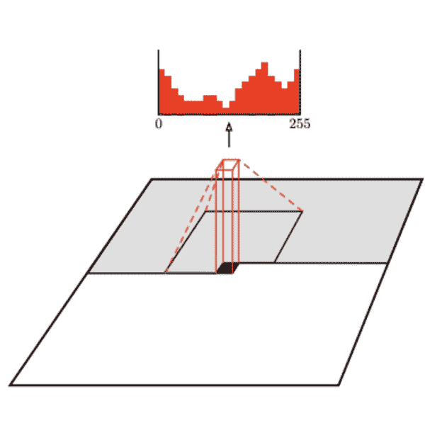
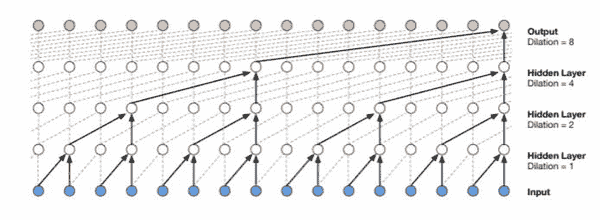
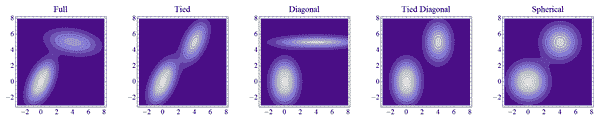

# 第八章：概率生成模型

> *AI 将我所知道的所有数学联系在一起，我已经学习数学多年了。*

如果机器要理解周围的世界，并且能够像我们想象、梦想、绘画、创作歌曲、电影或写书时那样重新创造它，那么生成模型是朝着这个方向迈出的一大步。如果我们要实现通用人工智能，就需要正确地构建这些模型。

生成模型建立在这样一个假设上，即只有当我们的模型学习了数据的潜在统计结构时，我们才能正确解释输入数据。这与我们的梦境过程有些类似，这表明我们的大脑可能学习了一个能够虚拟重现我们环境的模型。

在本章中，我们仍然有训练函数、损失函数和优化的数学结构，这些在整本书中都有提到。然而，与前几章不同的是，我们的目标是学习概率分布，而不是确定性函数。总体主题是有训练数据，我们想要提出一个能够生成类似数据的数学模型。

感兴趣的两个数量是：

1.  输入数据特征的真实（未知）联合概率分布<math alttext="p Subscript d a t a Baseline left-parenthesis ModifyingAbove x With right-arrow right-parenthesis"><mrow><msub><mi>p</mi> <mrow><mi>d</mi><mi>a</mi><mi>t</mi><mi>a</mi></mrow></msub> <mrow><mo>(</mo> <mover accent="true"><mi>x</mi> <mo>→</mo></mover> <mo>)</mo></mrow></mrow></math>。

1.  数据特征的模型联合概率分布以及模型参数：<math alttext="p Subscript m o d e l Baseline left-parenthesis ModifyingAbove x With right-arrow semicolon ModifyingAbove theta With right-arrow right-parenthesis"><mrow><msub><mi>p</mi> <mrow><mi>m</mi><mi>o</mi><mi>d</mi><mi>e</mi><mi>l</mi></mrow></msub> <mrow><mo>(</mo> <mover accent="true"><mi>x</mi> <mo>→</mo></mover> <mo>;</mo> <mover accent="true"><mi>θ</mi> <mo>→</mo></mover> <mo>)</mo></mrow></mrow></math>

理想情况下，我们希望这两者尽可能接近。在实践中，我们会接受参数值<math alttext="ModifyingAbove theta With right-arrow"><mover accent="true"><mi>θ</mi> <mo>→</mo></mover></math>，使得<math alttext="p Subscript m o d e l Baseline left-parenthesis ModifyingAbove x With right-arrow semicolon ModifyingAbove theta With right-arrow right-parenthesis"><mrow><msub><mi>p</mi> <mrow><mi>m</mi><mi>o</mi><mi>d</mi><mi>e</mi><mi>l</mi></mrow></msub> <mrow><mo>(</mo> <mover accent="true"><mi>x</mi> <mo>→</mo></mover> <mo>;</mo> <mover accent="true"><mi>θ</mi> <mo>→</mo></mover> <mo>)</mo></mrow></mrow></math>能够很好地适用于我们特定的用例。

在整个章节中，我们利用了三条概率分布的规则：

1.  将多变量联合概率分布分解为单变量条件概率分布的乘积的乘法规则。

1.  贝叶斯规则允许我们无缝地在变量之间切换。

1.  特征或潜在（隐藏）变量的独立性或条件独立性假设，使我们能够进一步简化单变量条件概率的乘积。

在之前的章节中，我们在最小化*损失函数*。在本章中，类似的函数是*对数似然函数*，优化过程总是试图*最大化*这个对数似然（注意，我们不是在最小化损失函数，而是在最大化一个目标函数）。很快会详细介绍。

在我们深入讨论之前，让我们注意一下，将我们之前的确定性机器学习模型转换为概率语言：我们之前的模型学习了一个训练函数，将输入数据的特征映射到输出（目标或标签）或 。当我们的目标是分类时，*f*返回具有最高概率的标签*y*。也就是说，分类器学习了从输入数据到类别标签*y*的直接映射，换句话说，它们直接对后验概率进行建模。我们将在本章后面详细阐述这一点。

# 生成模型有哪些用途？

生成模型使得真实数据和计算机生成数据之间的界限变得模糊。它们一直在改进，并取得了令人印象深刻的成功：机器生成的图像，包括人类的图像，变得越来越逼真。很难判断时尚行业模特的图像是真实人物还是生成机器学习模型的输出。

生成模型的目标是使用机器生成新颖的数据，例如包含语音的音频波形，图像，视频或自然语言文本。生成模型从学习的概率分布中采样数据，其中样本尽可能地模拟现实。这里的假设是存在一些未知的概率分布潜在地支撑着我们想要模仿的真实生活数据（否则我们整个现实将是一种随机混乱的噪音，缺乏任何连贯性或结构），模型的目标是使用训练数据学习这个概率分布的近似值。

在从特定领域收集了大量数据之后，我们训练一个生成模型来生成类似于收集数据的数据。收集的数据可以是数百万张图像或视频，数千个音频录音，或者整个自然语言语料库。

生成模型在许多应用中非常有用，包括在数据稀缺且需要更多数据时进行数据增强，为高分辨率图像填充缺失值，为强化学习模拟新数据，或者在只有少量标签可用时进行半监督学习。另一个应用是图像到图像的转换，例如将航空图像转换为地图或将手绘草图转换为图像。更多的应用包括图像去噪、修补、超分辨率、图像编辑（如使微笑更宽，颧骨更高，脸部更苗条等）。

此外，生成模型是建立在从所需概率分布中抽取多个样本以生成多个可接受输出的基础上的。这与我们的确定性模型不同，确定性模型在训练过程中使用均方误差损失函数或其他平均损失函数对具有不同特征的输出进行平均。这里的缺点是生成模型也可能生成一些不好的样本。

一种生成模型，即[*生成对抗网络*](https://proceedings.neurips.cc/paper/2014/file/5ca3e9b122f61f8f06494c97b1afccf3-Paper.pdf)（2014 年由 Ian Goodfellow 等人发明），具有极大的潜力，并且具有广泛的应用，从增加数据集到完成遮蔽的人脸，再到天体物理学和高能物理学，比如模拟类似于 CERN 大型强子对撞机产生的数据集，或模拟暗物质的分布并预测引力透镜效应。生成对抗模型建立了两个神经网络，它们在一个零和博弈中相互竞争（想象数学中的博弈论），直到机器本身无法区分真实图像和计算机生成的图像之间的区别。这就是为什么它们的输出看起来非常接近现实。

前一章，主要针对自然语言处理，涉及到生成模型，但没有明确指出。自然语言处理的大多数应用，不是简单的分类模型（垃圾邮件或非垃圾邮件，积极情绪或消极情绪，词性标注），包括语言生成。这些例子包括：我们智能手机或电子邮件上的自动完成，机器翻译，文本摘要，聊天机器人和图像标题。

# 生成模型的典型数学

生成模型感知和表征世界的方式是通过概率分布。也就是说，一幅彩色图像是从像素的联合概率分布中取样得到的，这些像素一起形成了一个有意义的图像（尝试计算包括所有红色、绿色和蓝色通道的这种联合概率分布的维度），一段音频波形是从音频信号的联合概率分布中取样得到的，这些信号一起构成了有意义的声音（这些也是极高维度的），一句话是从单词或字符的联合概率分布中取样得到的，这些单词或字符一起构成了连贯的句子。

那么，一个显著的问题是：我们如何计算这些能够捕捉我们周围世界复杂性的惊人代表性联合概率分布，但不幸的是这些分布往往是极高维度的呢？

机器学习的答案在这一点上是可预测的：从我们已知的简单概率分布开始，比如高斯分布，然后找到一种方法将其塑造成另一个很好地近似手头数据的经验分布的分布。但我们如何将一个分布塑造成另一个分布呢？我们可以对其概率密度应用一个确定性函数。因此，我们必须理解以下内容：

1.  我们如何将确定性函数应用于概率分布，以及由此产生的随机变量的概率分布是什么？我们使用以下转换公式：

<math alttext="dollar-sign p Subscript x Baseline left-parenthesis ModifyingAbove x With right-arrow right-parenthesis equals p Subscript z Baseline left-parenthesis g Superscript negative 1 Baseline left-parenthesis ModifyingAbove x With right-arrow right-parenthesis right-parenthesis StartAbsoluteValue det left-parenthesis StartFraction normal partial-differential g Superscript negative 1 Baseline ModifyingAbove x With right-arrow Over normal partial-differential ModifyingAbove x With right-arrow EndFraction right-parenthesis EndAbsoluteValue dollar-sign"><mrow><msub><mi>p</mi> <mi>x</mi></msub> <mrow><mo>(</mo> <mover accent="true"><mi>x</mi> <mo>→</mo></mover> <mo>)</mo></mrow> <mo>=</mo> <msub><mi>p</mi> <mi>z</mi></msub> <mrow><mo>(</mo> <msup><mi>g</mi> <mrow><mo>-</mo><mn>1</mn></mrow></msup> <mrow><mo>(</mo> <mover accent="true"><mi>x</mi> <mo>→</mo></mover> <mo>)</mo></mrow> <mo>)</mo></mrow> <mrow><mo>|</mo> <mo form="prefix" movablelimits="true">det</mo> <mrow><mo>(</mo> <mfrac><mrow><mi>∂</mi><msup><mi>g</mi> <mrow><mo>-</mo><mn>1</mn></mrow></msup> <mover accent="true"><mi>x</mi> <mo>→</mo></mover></mrow> <mrow><mi>∂</mi><mover accent="true"><mi>x</mi> <mo>→</mo></mover></mrow></mfrac> <mo>)</mo></mrow> <mo>|</mo></mrow></mrow></math>

这在许多概率书籍中都有很好的记录，我们很快就会从中提取我们需要的内容。我们必须应用的正确函数是什么？一种方法是训练我们的模型来*学习*它。我们现在知道神经网络有能力表示各种函数，因此我们可以通过神经网络传递我们开始的简单概率分布（神经网络将是我们正在寻找的确定性函数的公式），然后通过最小化给定数据的经验分布与网络输出的分布之间的误差来学习网络的参数。

1.  我们如何衡量概率分布之间的误差？概率论为我们提供了一些衡量两个概率分布之间差异的方法，比如 Kullback-Leibler（KL）散度。这也与信息论中的交叉熵有关。

1.  所有生成模型都是这样工作的吗？是和不是。是指它们都试图学习生成训练数据的联合概率分布。换句话说，生成模型试图学习最大化训练数据的似然性的联合概率分布的公式和参数。不是指我们只概述了一种明确的逼近我们所需的联合概率分布的方法。这是一种思维方式。一般来说，一个定义了明确且可处理的概率密度函数的模型允许我们直接操作训练数据的对数似然性，计算其梯度，并应用可用的优化算法来搜索最大值。还有其他提供明确但难以处理的概率密度函数的模型，这种情况下，我们必须使用逼近方法来最大化似然性。我们如何*近似*解决优化问题？我们可以使用确定性逼近，依赖于*变分方法*（变分自动编码器模型），或者使用随机逼近，依赖于马尔可夫链蒙特卡洛方法。最后，还有*隐式*的方法来逼近我们所需的联合概率分布。隐式模型学习从未明确定义公式的未知分布中抽样。生成对抗网络属于这一类别。

如今，生成建模的三种最流行的方法是：

+   生成对抗网络，这是隐式密度模型；

+   变分模型提供明确但难以处理的概率密度函数。我们在概率图模型框架内逼近优化问题的解，其中我们最大化数据对数似然性的下界，因为直接最大化数据的对数似然性是难以处理的；

+   *完全可见信念网络*，提供明确且可处理的概率密度函数，如[Pixel 卷积神经网络（PixelCNN）2016](https://arxiv.org/pdf/1606.05328.pdf)和[WaveNet（2016）](https://arxiv.org/abs/1609.03499)。这些模型通过将联合概率分布分解为每个单独维度的概率分布的乘积，条件于之前的维度，并逐个学习这些分布来学习。这种分解得益于概率的乘法规则或链规则。例如，PixelCNN 训练一个网络，学习图像中每个单独像素的条件概率分布，给定之前的像素（左侧和顶部），而 WaveNet 训练一个网络，学习声波中每个单独音频信号的条件概率分布，条件于之前的信号。这里的缺点是这些模型只能一次生成一个条目，并且不允许并行化。这显著减慢了生成过程。例如，WaveNet 需要两分钟的计算时间才能生成一秒的音频，因此我们无法用它进行实时的来回对话。

还有其他生成模型属于上述类别，但由于昂贵的计算要求或选择密度函数及/或其变换的困难而不太受欢迎。这些模型包括需要变量变换的模型，例如非线性独立成分估计（显式和可计算密度模型）、玻尔兹曼机模型（显式但不可计算密度模型，通过随机马尔可夫链近似解决最大化问题）、生成随机网络模型（隐式密度模型再次取决于马尔可夫链以达到其近似最大似然）。我们在本章末尾简要调查这些模型。在实践中，远离数学理论和分析，由于计算成本高昂且不愿意迅速收敛，马尔可夫链方法不受青睐。

# 从确定性思维转变为概率性思维

在这一章中，我们正在慢慢将我们的大脑从确定性思维转变为概率性思维。到目前为止，在这本书中，我们只使用确定性函数来进行预测。训练函数是数据特征的线性组合，有时与非线性激活器组合，损失函数是真实值和预测值之间的确定性鉴别器，优化方法基于确定性梯度下降方法。随机性或随机性仅在我们需要使模型的确定性组件的计算变得更加经济时引入，例如随机梯度下降或随机奇异值分解，当我们将数据集分成训练、验证和测试子集时，当我们选择我们的小批量时，当我们遍历一些超参数空间时，或者当我们将数据样本的分数传递到 softmax 函数中时，这是一个确定性函数，并将结果值解释为概率。在所有这些设置中，随机性和相关的概率分布仅与模型的特定组件相关，仅作为实现和计算确定性模型的手段：从来没有构成模型的核心组成部分。

生成模型与我们在前几章中看到的模型不同，因为它们在本质上是概率性的。然而，我们仍然有训练、损失和优化结构，只是现在模型学习一个概率分布（显式或隐式），而不是学习一个确定性函数。然后，我们的损失函数衡量真实和预测概率分布之间的误差（至少对于显式密度模型），因此我们必须了解如何定义和计算概率之间的某种误差函数，而不是确定性值。我们还必须学习如何在这种概率设置中进行优化和求导。

在数学中，评估给定函数（正向问题）要比找到其逆函数（逆向问题）容易得多，更不用说当我们只能访问少量函数值观测时，比如我们的数据样本。在我们的概率设置中，正向问题看起来是：给定某种概率分布，抽取一些数据。逆向问题是我们关心的问题：给定这个我们不知道的概率分布的有限数量的实现（数据样本），找到最有可能生成它们的概率分布。我们首先想到的一个困难是唯一性的问题：可能有多个分布适合我们的数据。此外，逆向问题通常更难，因为本质上我们必须向后操作并撤消正向函数遵循的过程，以到达给定的观测值。问题在于大多数过程无法撤消，这在某种程度上超出了我们的能力，嵌入在自然法则中：宇宙倾向于增加熵。除了解决逆问题固有的困难之外，我们通常尝试为 AI 应用估计的概率分布是高维的，具有许多变量，并且我们甚至不确定我们的概率模型是否已经考虑了所有变量（但这对确定性模型也是有问题的）。这些困难不应该使我们却步：表示和操作高维概率分布对于许多数学、科学、金融、工程和其他应用都很重要。我们必须深入研究生成模型。

在本章的其余部分，我们将区分估计的概率分布是否具有显式公式的情况，以及当我们没有公式而是从隐式分布中数值生成新数据样本时的情况。请注意，在之前的章节中，对于所有我们的确定性模型，我们总是有明确的公式用于我们的训练函数，包括决策树、全连接神经网络和卷积神经网络给出的公式。那时，一旦我们从数据中估计出这些确定性函数，我们就可以回答问题，比如：目标变量的预测值是多少？在概率模型中，我们回答一个不同的问题：目标变量假定某个值的概率是多少，或者落在某个区间内的概率是多少？不同之处在于我们不知道我们的模型是如何组合变量以产生结果的，就像确定性情况下那样。在概率模型中，我们试图估计的是模型变量与目标变量一起发生的概率（它们的联合概率），理想情况下是对所有变量的所有范围。这将为我们提供目标变量的概率分布，而无需明确制定模型变量如何相互作用以产生这个结果。这完全取决于观察数据。

# 最大似然估计

许多生成模型直接或间接地依赖于*最大似然原则*。对于概率模型，目标是学习一个概率分布，该分布近似于观测数据的真实概率分布。一种方法是指定一个明确的概率分布<p_subscript model Baseline left-parenthesis ModifyingAbove x With right-arrow semicolon ModifyingAbove theta With right-arrow right-parenthesis>，其中包含一些未知参数<ModifyingAbove theta With right-arrow>，然后解出使训练数据集尽可能被观察到的参数<ModifyingAbove theta With right-arrow>。也就是说，我们需要找到*最大化*训练数据的似然性的<ModifyingAbove theta With right-arrow>，为这些样本分配高概率。如果有*m*个训练数据点，我们假设它们是独立采样的，因此观察它们一起的概率就是所有单个样本概率的乘积。因此我们有：

<math alttext="dollar-sign ModifyingAbove theta With right-arrow Subscript o p t i m a l Baseline equals arg max Underscript ModifyingAbove theta With right-arrow Endscripts p Subscript m o d e l Baseline left-parenthesis ModifyingAbove x With right-arrow Superscript 1 Baseline semicolon ModifyingAbove theta With right-arrow right-parenthesis p Subscript m o d e l Baseline left-parenthesis ModifyingAbove x With right-arrow squared semicolon ModifyingAbove theta With right-arrow right-parenthesis ellipsis p Subscript m o d e l Baseline left-parenthesis ModifyingAbove x With right-arrow Superscript m Baseline semicolon ModifyingAbove theta With right-arrow right-parenthesis dollar-sign"><mrow><msub><mover accent="true"><mi>θ</mi> <mo>→</mo></mover> <mrow><mi>o</mi><mi>p</mi><mi>t</mi><mi>i</mi><mi>m</mi><mi>a</mi><mi>l</mi></mrow></msub> <mo>=</mo> <mo form="prefix">arg</mo> <msub><mo form="prefix" movablelimits="true">max</mo> <mover accent="true"><mi>θ</mi> <mo>→</mo></mover></msub> <msub><mi>p</mi> <mrow><mi>m</mi><mi>o</mi><mi>d</mi><mi>e</mi><mi>l</mi></mrow></msub> <mrow><mo>(</mo> <msup><mover accent="true"><mi>x</mi> <mo>→</mo></mover> <mn>1</mn></msup> <mo>;</mo> <mover accent="true"><mi>θ</mi> <mo>→</mo></mover> <mo>)</mo></mrow> <msub><mi>p</mi> <mrow><mi>m</mi><mi>o</mi><mi>d</mi><mi>e</mi><mi>l</mi></mrow></msub> <mrow><mo>(</mo> <msup><mover accent="true"><mi>x</mi> <mo>→</mo></mover> <mn>2</mn></msup> <mo>;</mo> <mover accent="true"><mi>θ</mi> <mo>→</mo></mover> <mo>)</mo></mrow> <mo>⋯</mo> <msub><mi>p</mi> <mrow><mi>m</mi><mi>o</mi><mi>d</mi><mi>e</mi><mi>l</mi></mrow></msub> <mrow><mo>(</mo> <msup><mover accent="true"><mi>x</mi> <mo>→</mo></mover> <mi>m</mi></msup> <mo>;</mo> <mover accent="true"><mi>θ</mi> <mo>→</mo></mover> <mo>)</mo></mrow></mrow></math>

回想一下，每个概率都是介于零和一之间的数字。如果我们将所有这些概率相乘，我们将得到数量极小的数字，这会引入数值不稳定性，我们面临下溢的风险（当机器将一个非常小的数字存储为零时，实质上删除了所有有效数字）。*对数*函数总是解决这个问题，将那些数量极大或极小的数字转换回合理的数量范围。好消息是，对我们的概率进行*对数*转换不会影响最优<math alttext="ModifyingAbove theta With right-arrow"><mover accent="true"><mi>θ</mi> <mo>→</mo></mover></math> 的值，因为*对数*函数是一个增函数。也就是说，如果对于所有的<math alttext="ModifyingAbove theta With right-arrow"><mover accent="true"><mi>θ</mi> <mo>→</mo></mover></math> ，都有<math alttext="f left-parenthesis ModifyingAbove theta With right-arrow Subscript o p t i m a l Baseline right-parenthesis greater-than-or-equal-to f left-parenthesis ModifyingAbove theta With right-arrow right-parenthesis"><mrow><mi>f</mi> <mrow><mo>(</mo> <msub><mover accent="true"><mi>θ</mi> <mo>→</mo></mover> <mrow><mi>o</mi><mi>p</mi><mi>t</mi><mi>i</mi><mi>m</mi><mi>a</mi><mi>l</mi></mrow></msub> <mo>)</mo></mrow> <mo>≥</mo> <mi>f</mi> <mrow><mo>(</mo> <mover accent="true"><mi>θ</mi> <mo>→</mo></mover> <mo>)</mo></mrow></mrow></math> ，那么对于所有的<math alttext="ModifyingAbove theta With right-arrow"><mover accent="true"><mi>θ</mi> <mo>→</mo></mover></math> ，也有<math alttext="log left-parenthesis f left-parenthesis ModifyingAbove theta With right-arrow Subscript o p t i m a l Baseline right-parenthesis right-parenthesis greater-than-or-equal-to log left-parenthesis f left-parenthesis ModifyingAbove theta With right-arrow right-parenthesis right-parenthesis"><mrow><mo form="prefix">log</mo> <mrow><mo>(</mo> <mi>f</mi> <mrow><mo>(</mo> <msub><mover accent="true"><mi>θ</mi> <mo>→</mo></mover> <mrow><mi>o</mi><mi>p</mi><mi>t</mi><mi>i</mi><mi>m</mi><mi>a</mi><mi>l</mi></mrow></msub> <mo>)</mo></mrow> <mo>)</mo></mrow> <mo>≥</mo> <mo form="prefix">log</mo> <mrow><mo>(</mo> <mi>f</mi> <mrow><mo>(</mo> <mover accent="true"><mi>θ</mi> <mo>→</mo></mover> <mo>)</mo></mrow> <mo>)</mo></mrow></mrow></math> 。与增函数组合不会改变不等号。关键是，最大似然解变得等价于最大对数似然解。现在回想一下，*对数*函数将乘积转换为和，我们有：

<math alttext="dollar-sign ModifyingAbove theta With right-arrow Subscript o p t i m a l Baseline equals arg max Underscript ModifyingAbove theta With right-arrow Endscripts log left-parenthesis p Subscript m o d e l Baseline left-parenthesis ModifyingAbove x With right-arrow Superscript 1 Baseline semicolon ModifyingAbove theta With right-arrow right-parenthesis right-parenthesis plus log left-parenthesis p Subscript m o d e l Baseline left-parenthesis ModifyingAbove x With right-arrow squared semicolon ModifyingAbove theta With right-arrow right-parenthesis right-parenthesis plus ellipsis plus log left-parenthesis p Subscript m o d e l Baseline left-parenthesis ModifyingAbove x With right-arrow Superscript m Baseline semicolon ModifyingAbove theta With right-arrow right-parenthesis right-parenthesis dollar-sign"><mrow><msub><mover accent="true"><mi>θ</mi> <mo>→</mo></mover> <mrow><mi>o</mi><mi>p</mi><mi>t</mi><mi>i</mi><mi>m</mi><mi>a</mi><mi>l</mi></mrow></msub> <mo>=</mo> <mo form="prefix">arg</mo> <msub><mo form="prefix" movablelimits="true">max</mo> <mover accent="true"><mi>θ</mi> <mo>→</mo></mover></msub> <mo form="prefix">log</mo> <mrow><mo>(</mo> <msub><mi>p</mi> <mrow><mi>m</mi><mi>o</mi><mi>d</mi><mi>e</mi><mi>l</mi></mrow></msub> <mrow><mo>(</mo> <msup><mover accent="true"><mi>x</mi> <mo>→</mo></mover> <mn>1</mn></msup> <mo>;</mo> <mover accent="true"><mi>θ</mi> <mo>→</mo></mover> <mo>)</mo></mrow> <mo>)</mo></mrow> <mo>+</mo> <mo form="prefix">log</mo> <mrow><mo>(</mo> <msub><mi>p</mi> <mrow><mi>m</mi><mi>o</mi><mi>d</mi><mi>e</mi><mi>l</mi></mrow></msub> <mrow><mo>(</mo> <msup><mover accent="true"><mi>x</mi> <mo>→</mo></mover> <mn>2</mn></msup> <mo>;</mo> <mover accent="true"><mi>θ</mi> <mo>→</mo></mover> <mo>)</mo></mrow> <mo>)</mo></mrow> <mo>+</mo> <mo>⋯</mo> <mo>+</mo> <mo form="prefix">log</mo> <mrow><mo>(</mo> <msub><mi>p</mi> <mrow><mi>m</mi><mi>o</mi><mi>d</mi><mi>e</mi><mi>l</mi></mrow></msub> <mrow><mo>(</mo> <msup><mover accent="true"><mi>x</mi> <mo>→</mo></mover> <mi>m</mi></msup> <mo>;</mo> <mover accent="true"><mi>θ</mi> <mo>→</mo></mover> <mo>)</mo></mrow> <mo>)</mo></mrow></mrow></math>

注意，上述表达式希望增加每个数据样本的 <math alttext="p Subscript m o d e l Baseline left-parenthesis ModifyingAbove x With right-arrow comma ModifyingAbove theta With right-arrow right-parenthesis"><mrow><msub><mi>p</mi> <mrow><mi>m</mi><mi>o</mi><mi>d</mi><mi>e</mi><mi>l</mi></mrow></msub> <mrow><mo>(</mo> <mover accent="true"><mi>x</mi> <mo>→</mo></mover> <mo>,</mo> <mover accent="true"><mi>θ</mi> <mo>→</mo></mover> <mo>)</mo></mrow></mrow></math>。也就是说，它更喜欢 <math alttext="ModifyingAbove theta With right-arrow"><mover accent="true"><mi>θ</mi> <mo>→</mo></mover></math> 的值*推动* <math alttext="p Subscript m o d e l Baseline left-parenthesis ModifyingAbove x With right-arrow comma ModifyingAbove theta With right-arrow right-parenthesis"><mrow><msub><mi>p</mi> <mrow><mi>m</mi><mi>o</mi><mi>d</mi><mi>e</mi><mi>l</mi></mrow></msub> <mrow><mo>(</mo> <mover accent="true"><mi>x</mi> <mo>→</mo></mover> <mo>,</mo> <mover accent="true"><mi>θ</mi> <mo>→</mo></mover> <mo>)</mo></mrow></mrow></math> 在每个数据点 <math alttext="ModifyingAbove x With right-arrow Superscript i"><msup><mover accent="true"><mi>x</mi> <mo>→</mo></mover> <mi>i</mi></msup></math> 上方。然而，我们不能无限制地向上推动：必须有向下的补偿，因为图形下方区域的超面积必须相加为一，知道 <math alttext="p Subscript m o d e l Baseline left-parenthesis ModifyingAbove x With right-arrow comma ModifyingAbove theta With right-arrow right-parenthesis"><mrow><msub><mi>p</mi> <mrow><mi>m</mi><mi>o</mi><mi>d</mi><mi>e</mi><mi>l</mi></mrow></msub> <mrow><mo>(</mo> <mover accent="true"><mi>x</mi> <mo>→</mo></mover> <mo>,</mo> <mover accent="true"><mi>θ</mi> <mo>→</mo></mover> <mo>)</mo></mrow></mrow></math> 是一个概率分布。

我们可以用期望和条件概率的术语重新表达上述表达式：

<math alttext="dollar-sign ModifyingAbove theta With right-arrow Subscript o p t i m a l Baseline equals arg max Underscript ModifyingAbove theta With right-arrow Endscripts double-struck upper E Subscript x tilde p Sub Subscript d a t a Baseline log left-parenthesis p Subscript m o d e l Baseline left-parenthesis ModifyingAbove x With right-arrow vertical-bar ModifyingAbove theta With right-arrow right-parenthesis right-parenthesis dollar-sign"><mrow><msub><mover accent="true"><mi>θ</mi> <mo>→</mo></mover> <mrow><mi>o</mi><mi>p</mi><mi>t</mi><mi>i</mi><mi>m</mi><mi>a</mi><mi>l</mi></mrow></msub> <mo>=</mo> <mo form="prefix">arg</mo> <msub><mo form="prefix" movablelimits="true">max</mo> <mover accent="true"><mi>θ</mi> <mo>→</mo></mover></msub> <msub><mi>𝔼</mi> <mrow><mi>x</mi><mo>∼</mo><msub><mi>p</mi> <mrow><mi>d</mi><mi>a</mi><mi>t</mi><mi>a</mi></mrow></msub></mrow></msub> <mo form="prefix">log</mo> <mrow><mo>(</mo> <msub><mi>p</mi> <mrow><mi>m</mi><mi>o</mi><mi>d</mi><mi>e</mi><mi>l</mi></mrow></msub> <mrow><mo>(</mo> <mover accent="true"><mi>x</mi> <mo>→</mo></mover> <mo>|</mo> <mover accent="true"><mi>θ</mi> <mo>→</mo></mover> <mo>)</mo></mrow> <mo>)</mo></mrow></mrow></math>

我们在前几章讨论的确定性模型通过最小化衡量模型预测与数据标签提供的真实值之间误差的损失函数来找到模型的参数（或权重），或者换句话说，找到 <math alttext="y Subscript m o d e l"><msub><mi>y</mi> <mrow><mi>m</mi><mi>o</mi><mi>d</mi><mi>e</mi><mi>l</mi></mrow></msub></math> 和 <math alttext="y Subscript d a t a"><msub><mi>y</mi> <mrow><mi>d</mi><mi>a</mi><mi>t</mi><mi>a</mi></mrow></msub></math> 之间的误差。在本章中，我们关心找到最大化数据对数似然的参数。如果有一个类似于最小化衡量概率分布 <math alttext="p Subscript m o d e l"><msub><mi>p</mi> <mrow><mi>m</mi><mi>o</mi><mi>d</mi><mi>e</mi><mi>l</mi></mrow></msub></math> 和 <math alttext="p Subscript d a t a"><msub><mi>p</mi> <mrow><mi>d</mi><mi>a</mi><mi>t</mi><mi>a</mi></mrow></msub></math> 之间误差的量的公式，那么本章与前几章之间的类比就会很明显。幸运的是，有这样的公式。最大似然估计与最小化[*Kullback Leibler (KL) 散度*](https://en.wikipedia.org/wiki/Kullback%E2%80%93Leibler_divergence)之间是相同的，这个散度是生成数据的概率分布和模型的概率分布之间的差异：

<math alttext="dollar-sign ModifyingAbove theta With right-arrow Subscript o p t i m a l Baseline equals arg min Underscript ModifyingAbove theta With right-arrow Endscripts upper D i v e r g e n c e Subscript upper K upper L Baseline left-parenthesis p Subscript d a t a Baseline left-parenthesis ModifyingAbove x With right-arrow right-parenthesis StartAbsoluteValue EndAbsoluteValue p Subscript m o d e l Baseline left-parenthesis ModifyingAbove x With right-arrow semicolon ModifyingAbove theta With right-arrow right-parenthesis right-parenthesis dollar-sign"><mrow><msub><mover accent="true"><mi>θ</mi> <mo>→</mo></mover> <mrow><mi>o</mi><mi>p</mi><mi>t</mi><mi>i</mi><mi>m</mi><mi>a</mi><mi>l</mi></mrow></msub> <mo>=</mo> <mo form="prefix">arg</mo> <msub><mo form="prefix" movablelimits="true">min</mo> <mover accent="true"><mi>θ</mi> <mo>→</mo></mover></msub> <mi>D</mi> <mi>i</mi> <mi>v</mi> <mi>e</mi> <mi>r</mi> <mi>g</mi> <mi>e</mi> <mi>n</mi> <mi>c</mi> <msub><mi>e</mi> <mrow><mi>K</mi><mi>L</mi></mrow></msub> <mrow><mo>(</mo></mrow> <msub><mi>p</mi> <mrow><mi>d</mi><mi>a</mi><mi>t</mi><mi>a</mi></mrow></msub> <mrow><mo>(</mo> <mover accent="true"><mi>x</mi> <mo>→</mo></mover> <mo>)</mo></mrow> <mrow><mo>|</mo> <mo>|</mo></mrow> <msub><mi>p</mi> <mrow><mi>m</mi><mi>o</mi><mi>d</mi><mi>e</mi><mi>l</mi></mrow></msub> <mrow><mo>(</mo> <mover accent="true"><mi>x</mi> <mo>→</mo></mover> <mo>;</mo> <mover accent="true"><mi>θ</mi> <mo>→</mo></mover> <mo>)</mo></mrow> <mrow><mo>)</mo></mrow></mrow></math>

如果<p_data>恰好是分布家族<p_model Baseline left-parenthesis ModifyingAbove x With right-arrow semicolon ModifyingAbove theta With right-arrow right-parenthesis>的成员，并且如果我们能够精确执行最小化，那么我们将恢复生成数据的确切分布，即<p_data>。然而，在实践中，我们无法访问生成数据的分布，事实上，这是我们试图逼近的分布。我们只能访问<p_data>中的*m*个样本。这些样本定义了只在这些*m*个样本上放置质量的经验分布<ModifyingAbove p With caret Subscript d a t a>。现在，最大化训练集的对数似然恰好等同于最小化<ModifyingAbove p With caret Subscript d a t a>和<p_model Baseline left-parenthesis ModifyingAbove x With right-arrow semicolon ModifyingAbove theta With right-arrow right-parenthesis>之间的 KL 散度：

<math alttext="dollar-sign ModifyingAbove theta With right-arrow Subscript o p t i m a l Baseline equals arg min Underscript ModifyingAbove theta With right-arrow Endscripts upper D i v e r g e n c e Subscript upper K upper L Baseline left-parenthesis ModifyingAbove p With caret Subscript d a t a Baseline left-parenthesis ModifyingAbove x With right-arrow right-parenthesis StartAbsoluteValue EndAbsoluteValue p Subscript m o d e l Baseline left-parenthesis ModifyingAbove x With right-arrow semicolon ModifyingAbove theta With right-arrow right-parenthesis right-parenthesis dollar-sign"><mrow><msub><mover accent="true"><mi>θ</mi> <mo>→</mo></mover> <mrow><mi>o</mi><mi>p</mi><mi>t</mi><mi>i</mi><mi>m</mi><mi>a</mi><mi>l</mi></mrow></msub> <mo>=</mo> <mo form="prefix">arg</mo> <msub><mo form="prefix" movablelimits="true">min</mo> <mover accent="true"><mi>θ</mi> <mo>→</mo></mover></msub> <mi>D</mi> <mi>i</mi> <mi>v</mi> <mi>e</mi> <mi>r</mi> <mi>g</mi> <mi>e</mi> <mi>n</mi> <mi>c</mi> <msub><mi>e</mi> <mrow><mi>K</mi><mi>L</mi></mrow></msub> <mrow><mo>(</mo></mrow> <msub><mover accent="true"><mi>p</mi> <mo>^</mo></mover> <mrow><mi>d</mi><mi>a</mi><mi>t</mi><mi>a</mi></mrow></msub> <mrow><mo>(</mo> <mover accent="true"><mi>x</mi> <mo>→</mo></mover> <mo>)</mo></mrow> <mrow><mo>|</mo> <mo>|</mo></mrow> <msub><mi>p</mi> <mrow><mi>m</mi><mi>o</mi><mi>d</mi><mi>e</mi><mi>l</mi></mrow></msub> <mrow><mo>(</mo> <mover accent="true"><mi>x</mi> <mo>→</mo></mover> <mo>;</mo> <mover accent="true"><mi>θ</mi> <mo>→</mo></mover> <mo>)</mo></mrow> <mrow><mo>)</mo></mrow></mrow></math>

在这一点上，我们可能会在三个优化问题之间感到困惑，实际上它们在数学上是等价的，它们只是来自数学、统计学、自然科学和计算机科学的不同子学科和子文化：

1.  最大化训练数据的对数似然

1.  最小化训练数据的经验分布与模型分布之间的 KL 散度

1.  当我们使用 softmax 函数与多个类别进行组合进行分类时，最小化训练数据标签和模型输出之间的交叉熵损失函数。

不要混淆：最小化 KL 散度的参数与最小化交叉熵和负对数似然的参数相同。

# 显式和隐式密度模型

最大对数似然估计（或最小 KL 散度）的目标是找到一个概率分布<math alttext="p Subscript m o d e l Baseline left-parenthesis ModifyingAbove x With right-arrow semicolon ModifyingAbove theta With right-arrow right-parenthesis"><mrow><msub><mi>p</mi> <mrow><mi>m</mi><mi>o</mi><mi>d</mi><mi>e</mi><mi>l</mi></mrow></msub> <mrow><mo>(</mo> <mover accent="true"><mi>x</mi> <mo>→</mo></mover> <mo>;</mo> <mover accent="true"><mi>θ</mi> <mo>→</mo></mover> <mo>)</mo></mrow></mrow></math>，最好地解释观察到的数据。生成模型使用这个学习的<math alttext="p Subscript m o d e l Baseline left-parenthesis ModifyingAbove x With right-arrow semicolon ModifyingAbove theta With right-arrow right-parenthesis"><mrow><msub><mi>p</mi> <mrow><mi>m</mi><mi>o</mi><mi>d</mi><mi>e</mi><mi>l</mi></mrow></msub> <mrow><mo>(</mo> <mover accent="true"><mi>x</mi> <mo>→</mo></mover> <mo>;</mo> <mover accent="true"><mi>θ</mi> <mo>→</mo></mover> <mo>)</mo></mrow></mrow></math>来生成新数据。这里有两种方法，一种是显式的，另一种是隐式的：

1.  **显式密度模型**：根据<math alttext="ModifyingAbove x With right-arrow"><mover accent="true"><mi>x</mi> <mo>→</mo></mover></math>和<math alttext="ModifyingAbove theta With right-arrow"><mover accent="true"><mi>θ</mi> <mo>→</mo></mover></math>明确地定义概率分布的公式，然后通过沿着梯度向量（相对于<math alttext="ModifyingAbove theta With right-arrow"><mover accent="true"><mi>θ</mi> <mo>→</mo></mover></math>的分量的偏导数）向上走，找到最大化训练数据样本的对数似然的值。这里一个明显的困难是提出一个能够捕捉数据复杂性的概率密度公式，同时又能友好地计算对数似然及其梯度。

1.  **隐式密度模型**：直接从<math alttext="p Subscript m o d e l Baseline left-parenthesis ModifyingAbove x With right-arrow semicolon ModifyingAbove theta With right-arrow right-parenthesis"><mrow><msub><mi>p</mi> <mrow><mi>m</mi><mi>o</mi><mi>d</mi><mi>e</mi><mi>l</mi></mrow></msub> <mrow><mo>(</mo> <mover accent="true"><mi>x</mi> <mo>→</mo></mover> <mo>;</mo> <mover accent="true"><mi>θ</mi> <mo>→</mo></mover> <mo>)</mo></mrow></mrow></math>进行采样，而无需为这个分布编写公式。生成随机网络基于马尔可夫链框架进行此操作，这种方法收敛速度慢，因此在实际应用中不受欢迎。使用这种方法，模型随机地转换现有样本，以获得来自相同分布的另一个样本。生成对抗网络间接与模型的概率分布交互，而不明确定义它。它们在两个网络之间建立一个零和博弈，其中一个网络生成一个样本，另一个网络充当分类器，确定生成的样本是否来自正确的分布。

# 显式密度-易处理：完全可见信念网络

这些模型具有明确的概率密度函数，可进行易处理的对数似然优化。它们依赖于[概率链规则](https://en.wikipedia.org/wiki/Chain_rule_(probability))来将联合概率分布分解为一维概率分布的乘积：

<math alttext="dollar-sign p Subscript m o d e l Baseline left-parenthesis ModifyingAbove x With right-arrow right-parenthesis equals product Underscript i equals 1 Overscript n Endscripts p Subscript m o d e l Baseline left-parenthesis x Subscript i Baseline vertical-bar x 1 comma x 2 comma ellipsis comma x Subscript i minus 1 Baseline right-parenthesis dollar-sign"><mrow><msub><mi>p</mi> <mrow><mi>m</mi><mi>o</mi><mi>d</mi><mi>e</mi><mi>l</mi></mrow></msub> <mrow><mo>(</mo> <mover accent="true"><mi>x</mi> <mo>→</mo></mover> <mo>)</mo></mrow> <mo>=</mo> <msubsup><mo>∏</mo> <mrow><mi>i</mi><mo>=</mo><mn>1</mn></mrow> <mi>n</mi></msubsup> <msub><mi>p</mi> <mrow><mi>m</mi><mi>o</mi><mi>d</mi><mi>e</mi><mi>l</mi></mrow></msub> <mrow><mo>(</mo> <msub><mi>x</mi> <mi>i</mi></msub> <mo>|</mo> <msub><mi>x</mi> <mn>1</mn></msub> <mo>,</mo> <msub><mi>x</mi> <mn>2</mn></msub> <mo>,</mo> <mo>⋯</mo> <mo>,</mo> <msub><mi>x</mi> <mrow><mi>i</mi><mo>-</mo><mn>1</mn></mrow></msub> <mo>)</mo></mrow></mrow></math>

这里的主要缺点是样本必须逐个组件生成（图像的一个像素，单词的一个字符，或离散音频波形的一个条目），因此，生成一个样本的成本是 *O(n)*。

## 示例：通过 PixelCNN 生成图像和通过 WaveNet 生成机器音频。

[PixelCNN](https://arxiv.org/pdf/1606.05328.pdf) 训练了一个卷积神经网络，模拟了给定先前像素（左侧和目标像素上方）的每个单独像素的条件分布。图 8-1 说明了这一点。

###### 图 8-1\. PixelCNN 学习第 n 个像素的条件分布，条件是前 n-1 个像素 [(图像来源)](https://arxiv.org/pdf/1606.05328.pdf)。

WaveNet 训练了一个卷积神经网络，模拟了音频波形中每个条目的条件分布，给定先前的条目。我们只会详细介绍 WaveNet。它是 PixelCNN 的一维模拟，并捕捉了基本思想。

WaveNet 的目标是生成宽带原始音频波形。因此，我们必须学习音频波形的联合概率分布 <math alttext="ModifyingAbove x With right-arrow equals left-parenthesis x 1 comma x 2 comma ellipsis comma x Subscript upper T Baseline right-parenthesis"><mrow><mover accent="true"><mi>x</mi> <mo>→</mo></mover> <mo>=</mo> <mrow><mo>(</mo> <msub><mi>x</mi> <mn>1</mn></msub> <mo>,</mo> <msub><mi>x</mi> <mn>2</mn></msub> <mo>,</mo> <mo>⋯</mo> <mo>,</mo> <msub><mi>x</mi> <mi>T</mi></msub> <mo>)</mo></mrow></mrow></math> 来自某种类型。

我们使用乘法规则将联合分布分解为单变量分布的乘积，其中我们将音频波形的每个条目条件化为其之前的条目：

<math alttext="dollar-sign p Subscript m o d e l Baseline left-parenthesis ModifyingAbove x With right-arrow right-parenthesis equals product Underscript t equals 1 Overscript upper T Endscripts p Subscript m o d e l Baseline left-parenthesis x Subscript t Baseline vertical-bar x 1 comma x 2 comma ellipsis comma x Subscript t minus 1 Baseline right-parenthesis dollar-sign"><mrow><msub><mi>p</mi> <mrow><mi>m</mi><mi>o</mi><mi>d</mi><mi>e</mi><mi>l</mi></mrow></msub> <mrow><mo>(</mo> <mover accent="true"><mi>x</mi> <mo>→</mo></mover> <mo>)</mo></mrow> <mo>=</mo> <msubsup><mo>∏</mo> <mrow><mi>t</mi><mo>=</mo><mn>1</mn></mrow> <mi>T</mi></msubsup> <msub><mi>p</mi> <mrow><mi>m</mi><mi>o</mi><mi>d</mi><mi>e</mi><mi>l</mi></mrow></msub> <mrow><mo>(</mo> <msub><mi>x</mi> <mi>t</mi></msub> <mo>|</mo> <msub><mi>x</mi> <mn>1</mn></msub> <mo>,</mo> <msub><mi>x</mi> <mn>2</mn></msub> <mo>,</mo> <mo>⋯</mo> <mo>,</mo> <msub><mi>x</mi> <mrow><mi>t</mi><mo>-</mo><mn>1</mn></mrow></msub> <mo>)</mo></mrow></mrow></math>

一个困难是音频波形具有非常高的时间分辨率，每秒至少有 16000 个条目（因此，一分钟长的一个数据样本是一个具有 *T*=960000 个条目的向量）。这些条目中的每一个代表离散原始音频的一个时间步，并通常存储为 16 位整数。也就是说，每个条目可以假定为介于零和 65535 之间的任何值。如果我们保持这个范围，网络必须学习每个条目的概率，因此输出级别的 softmax 函数必须为每个单个条目输出 65536 个概率分数。我们必须为这些条目的总数以及网络本身的计算复杂性变得非常昂贵。为了使这更易处理，我们必须量化，这在电子学中意味着通过其幅度受限于一组规定值的信号来近似连续变化的信号。WaveNet 将原始数据转换为将条目值限制为每个 256 个选项的选项，范围从 0 到 255，类似于数字图像的像素范围。现在，在训练期间，网络必须学习每个条目在这 256 个值上的概率分布，给定先前的条目，在音频生成期间，它逐个条目从这些学习的分布中采样。

最后一个复杂性是，如果音频信号代表任何有意义的东西，那么表示它的向量在多个时间尺度上具有长距离依赖性。为了捕捉这些长距离依赖性，WaveNet 使用扩张卷积。这些是跳过一些条目以覆盖更广泛范围而不增加参数数量的一维核或滤波器（请参见 图 8-2 进行说明）。

###### 图 8-2\. 具有核大小为两的扩张卷积。在每一层，核只有两个参数，但它会跳过一些条目以获得更广泛的覆盖范围 [(具有漂亮动画的图像来源)](https://www.deepmind.com/blog/wavenet-a-generative-model-for-raw-audio)。

还要注意，网络无法预知未来，因此每个层的滤波器不能使用训练样本中位于目标条目之前的条目。在一维中，我们只是在每个卷积层中较早地停止滤波，因此这是一个简单的时间偏移。在二维中，我们使用*掩码*滤波器，其右侧和底部的中心条目为零。

WaveNet 学习了总共*T*个概率分布，每个概率分布对应音频波形的一个条目，条件是前面的条目：<math alttext="p Subscript m o d e l Baseline left-parenthesis x 1 right-parenthesis comma p Subscript m o d e l Baseline left-parenthesis x 2 vertical-bar x 1 right-parenthesis comma p Subscript m o d e l Baseline left-parenthesis x 3 vertical-bar x 1 comma x 2 right-parenthesis comma d o t s"><mrow><msub><mi>p</mi> <mrow><mi>m</mi><mi>o</mi><mi>d</mi><mi>e</mi><mi>l</mi></mrow></msub> <mrow><mo>(</mo> <msub><mi>x</mi> <mn>1</mn></msub> <mo>)</mo></mrow> <mo>,</mo> <msub><mi>p</mi> <mrow><mi>m</mi><mi>o</mi><mi>d</mi><mi>e</mi><mi>l</mi></mrow></msub> <mrow><mo>(</mo> <msub><mi>x</mi> <mn>2</mn></msub> <mo>|</mo> <msub><mi>x</mi> <mn>1</mn></msub> <mo>)</mo></mrow> <mo>,</mo> <msub><mi>p</mi> <mrow><mi>m</mi><mi>o</mi><mi>d</mi><mi>e</mi><mi>l</mi></mrow></msub> <mrow><mo>(</mo> <msub><mi>x</mi> <mn>3</mn></msub> <mo>|</mo> <msub><mi>x</mi> <mn>1</mn></msub> <mo>,</mo> <msub><mi>x</mi> <mn>2</mn></msub> <mo>)</mo></mrow> <mo>,</mo> <mi>d</mi> <mi>o</mi> <mi>t</mi> <mi>s</mi></mrow></math> 和 <math alttext="p Subscript m o d e l Baseline left-parenthesis x Subscript upper T Baseline vertical-bar x 1 comma x 2 comma ellipsis comma x Subscript upper T minus 1 Baseline right-parenthesis"><mrow><msub><mi>p</mi> <mrow><mi>m</mi><mi>o</mi><mi>d</mi><mi>e</mi><mi>l</mi></mrow></msub> <mrow><mo>(</mo> <msub><mi>x</mi> <mi>T</mi></msub> <mo>|</mo> <msub><mi>x</mi> <mn>1</mn></msub> <mo>,</mo> <msub><mi>x</mi> <mn>2</mn></msub> <mo>,</mo> <mo>⋯</mo> <mo>,</mo> <msub><mi>x</mi> <mrow><mi>T</mi><mo>-</mo><mn>1</mn></mrow></msub> <mo>)</mo></mrow></mrow></math> 。在训练过程中，这些分布可以并行计算。

现在假设我们需要学习第 100 个条目的概率分布，给定前面的 99 个条目。我们从训练数据中输入音频样本批次，卷积网络仅使用每个样本的前 99 个条目，计算线性组合（滤波器进行线性组合），通过非线性激活函数从一层传递到下一层，再到下一层，使用一些跳跃连接和残差层来对抗消失的梯度，最终通过 softmax 函数传递结果，并输出一个长度为 256 的向量，包含第 100 个条目的概率分数。这是模型输出的第 100 个条目的概率分布。将此输出分布与来自训练批次的第 100 个条目的经验分布进行比较后，网络的参数将被调整以减少错误（降低交叉熵或增加可能性）。随着更多数据批次和更多时代通过网络，给定前 99 个条目的第 100 个条目的概率分布将接近训练数据的经验分布。训练后我们在网络中保存的是参数的值。现在我们可以使用训练好的网络逐个生成机器音频条目：

+   从概率分布中抽取一个值<math alttext="x 1"><msub><mi>x</mi> <mn>1</mn></msub></math> 。

+   用零增加<math alttext="left-parenthesis x 1 right-parenthesis"><mrow><mo>(</mo> <msub><mi>x</mi> <mn>1</mn></msub> <mo>)</mo></mrow></math>，以建立网络输入所需的长度（请检查），并通过网络传递向量。我们将得到一个输出，稍后<math alttext="p Subscript m o d e l Baseline left-parenthesis x 2 vertical-bar x 1 right-parenthesis"><mrow><msub><mi>p</mi> <mrow><mi>m</mi><mi>o</mi><mi>d</mi><mi>e</mi><mi>l</mi></mrow></msub> <mrow><mo>(</mo> <msub><mi>x</mi> <mn>2</mn></msub> <mo>|</mo> <msub><mi>x</mi> <mn>1</mn></msub> <mo>)</mo></mrow></mrow></math>，从中我们可以对<math alttext="x 2"><msub><mi>x</mi> <mn>2</mn></msub></math>进行采样。

+   用零增加<math alttext="left-parenthesis x 1 comma x 2 right-parenthesis"><mrow><mo>(</mo> <msub><mi>x</mi> <mn>1</mn></msub> <mo>,</mo> <msub><mi>x</mi> <mn>2</mn></msub> <mo>)</mo></mrow></math>，并通过网络传递向量。我们将得到一个输出，稍后<math alttext="p Subscript m o d e l Baseline left-parenthesis x 3 vertical-bar x 1 comma x 2 right-parenthesis"><mrow><msub><mi>p</mi> <mrow><mi>m</mi><mi>o</mi><mi>d</mi><mi>e</mi><mi>l</mi></mrow></msub> <mrow><mo>(</mo> <msub><mi>x</mi> <mn>3</mn></msub> <mo>|</mo> <msub><mi>x</mi> <mn>1</mn></msub> <mo>,</mo> <msub><mi>x</mi> <mn>2</mn></msub> <mo>)</mo></mrow></mrow></math>，从中我们可以对<math alttext="x 3"><msub><mi>x</mi> <mn>3</mn></msub></math>进行采样。

+   继续。

我们可以根据特定的说话者身份来调节 WaveNet，因此我们可以使用一个模型生成不同的声音。

我们可以并行训练 WaveNet，但只能顺序生成音频是一个主要缺点。这已经得到了纠正，[Parallel WaveNet](https://arxiv.org/pdf/1711.10433.pdf)已经在线部署在 Google Assistant 上，包括提供多种英语和日语语音。

总结并将上述讨论放在与本章相同的数学背景下，PixelCNN 和 WaveNet 是旨在学习特定类型图像数据或音频数据的联合概率分布的模型。它们通过将联合分布分解为每个数据条目的一维概率分布的乘积，条件于所有先前的条目来实现这一目标。为了找到这些一维条件分布，它们使用卷积网络来学习观察到的条目如何相互作用以产生下一个条目的分布。这样，网络的输入是确定性的，其输出是一个概率质量函数。网络本身也是一个确定性函数。我们可以将网络及其输出视为具有我们调整参数的概率分布。随着训练的进行，输出会进行调整，直到与训练数据的经验分布达成可接受的一致。因此，我们不是将确定性函数应用于概率分布并调整函数的参数，直到我们同意训练数据的分布。相反，我们从一个具有许多参数（网络参数）的显式概率分布的公式开始，然后调整参数，直到这个显式概率分布与训练数据合理一致。我们对应于每个条目的每个条件概率分布都这样做。

# 密度显式-可计算：变量变换非线性独立分量分析

这里的主要思想是我们有代表观察到的训练数据的随机变量 x→，我们想要学习生成它的源随机变量 s→。我们假设存在一个可逆且可微的确定性转换 g（s→）= x→，将未知的 s→转换为观察到的 x→。然后 s→ = g^-1（x→）。现在我们需要找到一个适当的 g，并找到 s→的概率分布。此外，我们假设 s→具有独立的条目或组件，因此其概率分布仅仅是其组件的分布的乘积。

将随机变量的概率分布与其确定性转换的概率分布相关联的公式是：

<math alttext="dollar-sign StartLayout 1st Row 1st Column p Subscript s Baseline left-parenthesis ModifyingAbove s With right-arrow right-parenthesis 2nd Column equals p Subscript x Baseline left-parenthesis ModifyingAbove x With right-arrow right-parenthesis times d e t e r m i n a n t left-parenthesis upper J a c o b i a n right-parenthesis 2nd Row 1st Column Blank 2nd Column equals p Subscript x Baseline left-parenthesis g left-parenthesis ModifyingAbove s With right-arrow right-parenthesis right-parenthesis StartAbsoluteValue det left-parenthesis StartFraction normal partial-differential g left-parenthesis ModifyingAbove s With right-arrow right-parenthesis Over normal partial-differential ModifyingAbove s With right-arrow EndFraction right-parenthesis EndAbsoluteValue EndLayout dollar-sign"><mtable displaystyle="true"><mtr><mtd columnalign="right"><mrow><msub><mi>p</mi> <mi>s</mi></msub> <mrow><mo>(</mo> <mover accent="true"><mi>s</mi> <mo>→</mo></mover> <mo>)</mo></mrow></mrow></mtd> <mtd columnalign="left"><mrow><mo>=</mo> <msub><mi>p</mi> <mi>x</mi></msub> <mrow><mo>(</mo> <mover accent="true"><mi>x</mi> <mo>→</mo></mover> <mo>)</mo></mrow> <mo>×</mo> <mi>d</mi> <mi>e</mi> <mi>t</mi> <mi>e</mi> <mi>r</mi> <mi>m</mi> <mi>i</mi> <mi>n</mi> <mi>a</mi> <mi>n</mi> <mi>t</mi> <mrow><mo>(</mo> <mi>J</mi> <mi>a</mi> <mi>c</mi> <mi>o</mi> <mi>b</mi> <mi>i</mi> <mi>a</mi> <mi>n</mi> <mo>)</mo></mrow></mrow></mtd></mtr> <mtr><mtd columnalign="left"><mrow><mo>=</mo> <msub><mi>p</mi> <mi>x</mi></msub> <mrow><mo>(</mo> <mi>g</mi> <mrow><mo>(</mo> <mover accent="true"><mi>s</mi> <mo>→</mo></mover> <mo>)</mo></mrow> <mo>)</mo></mrow> <mrow><mo>|</mo> <mo form="prefix" movablelimits="true">det</mo> <mrow><mo>(</mo> <mfrac><mrow><mi>∂</mi><mi>g</mi><mo>(</mo><mover accent="true"><mi>s</mi> <mo>→</mo></mover><mo>)</mo></mrow> <mrow><mi>∂</mi><mover accent="true"><mi>s</mi> <mo>→</mo></mover></mrow></mfrac> <mo>)</mo></mrow> <mo>|</mo></mrow></mrow></mtd></mtr></mtable></math>

乘以转换的雅可比行列式解释了由于转换而导致空间体积的变化。

非线性独立成分估计模型将联合概率分布建模为数据的非线性转换 s→ = g^-1（x→）。学习转换 g，使得 g^-1 将数据映射到一个潜在空间，其中符合分解分布，即映射导致独立的潜在变量。转换 g^-1 的参数化方式允许轻松计算雅可比行列式和逆雅可比。g^-1 基于深度神经网络，其参数通过优化对数似然来学习，这是可行的。

请注意，要求变换*g*必须是可逆的意味着潜在变量<math alttext="ModifyingAbove s With right-arrow"><mover accent="true"><mi>s</mi> <mo>→</mo></mover></math>必须具有与数据特征相同的维度（<math alttext="ModifyingAbove x With right-arrow"><mover accent="true"><mi>x</mi> <mo>→</mo></mover></math>的长度）。这对函数*g*的选择施加了限制，这是非线性独立成分分析模型的一个缺点。

相比之下，生成对抗网络对 g 的要求很少，特别是允许<math alttext="ModifyingAbove s With right-arrow"><mover accent="true"><mi>s</mi> <mo>→</mo></mover></math>比<math alttext="ModifyingAbove x With right-arrow"><mover accent="true"><mi>x</mi> <mo>→</mo></mover></math>具有更多维度。

# 显式密度-难以处理：变分自动编码器-通过变分方法进行近似

确定性自动编码器由一个将数据从 x 空间映射到较低维度的潜在 z 空间的编码器和一个将数据从 z 空间映射到<math alttext="ModifyingAbove x With caret"><mover accent="true"><mi>x</mi> <mo>^</mo></mover></math>空间的解码器组成，其目标是不丢失太多信息，或者减少重构误差，这意味着保持 x 和<math alttext="ModifyingAbove x With caret"><mover accent="true"><mi>x</mi> <mo>^</mo></mover></math>接近，例如在欧几里得距离意义上。在这个意义上，我们可以将基于奇异值分解<math alttext="upper X equals upper U normal upper Sigma upper V Superscript t"><mrow><mi>X</mi> <mo>=</mo> <mi>U</mi> <mi>Σ</mi> <msup><mi>V</mi> <mi>t</mi></msup></mrow></math>的*主成分分析*视为线性编码器，其中解码器简单地是编码矩阵的转置。编码和解码函数可以是非线性和/或神经网络。

对于确定性自动编码器，我们不能将解码器用作数据生成器。至少，如果我们这样做，那么我们必须从潜在 z 空间中选择一些 z 并将解码器函数应用于它。除非我们选择了一个对应于编码 x 的 z，否则我们不太可能得到任何接近所需数据 x 外观的<math alttext="ModifyingAbove x With caret"><mover accent="true"><mi>x</mi> <mo>^</mo></mover></math>，由于过拟合。我们需要一种正则化方法，使我们能够对 z 空间进行一定程度的控制，从而避免过拟合并将自动编码器用作数据生成器。我们通过从确定性自动编码转向概率自动编码来实现这一点。

变分自动编码器是概率自动编码器：编码器输出概率分布而不是单个点。此外，在训练过程中，损失函数包括一个额外的正则化项，用于控制潜在空间上的分布。因此，变分自动编码器的损失函数包含一个重构项（如均方距离）和一个正则化项，用于控制编码器输出的概率分布。正则化项可以是与高斯分布的 KL 散度，因为基本假设是简单的概率模型最好地描述训练数据。换句话说，复杂的关系可以在概率上简单描述。在这里我们必须小心，因为这引入了一种偏见：潜变量中对数据分布的简单假设如果太弱可能会有缺陷。也就是说，如果对先验分布或近似后验分布的假设太弱，即使使用完美的优化算法和无限的训练数据，估计值和真实对数似然之间的差距可能导致<math alttext="p Subscript m o d e l"><msub><mi>p</mi> <mrow><mi>m</mi><mi>o</mi><mi>d</mi><mi>e</mi><mi>l</mi></mrow></msub></math>学习到一个与真实<math alttext="p Subscript d a t a"><msub><mi>p</mi> <mrow><mi>d</mi><mi>a</mi><mi>t</mi><mi>a</mi></mrow></msub></math>完全不同的分布。

在数学上，我们最大化数据对数似然的下界<math alttext="script upper L"><mi>ℒ</mi></math>。在科学中，变分方法定义我们要最大化的能量泛函的下界，或者我们要最小化的能量泛函的上界。即使对数似然不容易获得，这些界通常更容易获得，并且具有可处理的优化算法。同时，它们为我们正在寻找的最优值提供了良好的估计。

<math alttext="dollar-sign script upper L left-parenthesis ModifyingAbove x With right-arrow comma ModifyingAbove theta With right-arrow right-parenthesis less-than-or-equal-to log p Subscript m o d e l Baseline left-parenthesis ModifyingAbove x With right-arrow comma ModifyingAbove theta With right-arrow right-parenthesis dollar-sign"><mrow><mi>ℒ</mi> <mrow><mo>(</mo> <mover accent="true"><mi>x</mi> <mo>→</mo></mover> <mo>,</mo> <mover accent="true"><mi>θ</mi> <mo>→</mo></mover> <mo>)</mo></mrow> <mo>≤</mo> <mo form="prefix">log</mo> <msub><mi>p</mi> <mrow><mi>m</mi><mi>o</mi><mi>d</mi><mi>e</mi><mi>l</mi></mrow></msub> <mrow><mo>(</mo> <mover accent="true"><mi>x</mi> <mo>→</mo></mover> <mo>,</mo> <mover accent="true"><mi>θ</mi> <mo>→</mo></mover> <mo>)</mo></mrow></mrow></math>

变分方法通常能够获得非常好的似然度，但对样本的主观评价认为它们生成的样本质量较低。人们认为它们比完全可见的信念网络更难优化。此外，人们发现它们的数学比完全可见的信念网络和生成对抗网络更难理解（即将讨论）。

# 显式密度-难以处理：Boltzman 机器-通过马尔可夫链近似

Boltzmann 机器（1980 年代）是一类依赖于马尔可夫链训练生成模型的家族。这是一种采样技术，比起从数据集中简单采样一个小批量来估计损失函数更昂贵。我们将在第十四章中讨论马尔可夫链在强化学习中的上下文。在数据生成的背景下，它们有许多缺点导致它们不受青睐：计算成本高，难以扩展到更高维度，收敛速度慢，甚至在理论上必须收敛时也没有明确的方法知道模型是否已经收敛。马尔可夫链方法尚未扩展到像 ImageNet 生成这样的问题规模。

马尔可夫链具有一个转移算子*q*，编码系统从一个状态过渡到另一个状态的概率。这个转移算子*q*需要明确定义。我们可以通过重复抽取样本<math alttext="x prime tilde q left-parenthesis x prime vertical-bar x right-parenthesis"><mrow><msup><mi>x</mi> <mo>'</mo></msup> <mo>∼</mo> <mi>q</mi> <mrow><mo>(</mo> <msup><mi>x</mi> <mo>'</mo></msup> <mo>|</mo> <mi>x</mi> <mo>)</mo></mrow></mrow></math>，根据转移算子*q*依次更新<math alttext="x prime"><msup><mi>x</mi> <mo>'</mo></msup></math>。与单步生成相比，这种顺序生成的性质是另一个缺点。马尔可夫链方法有时可以保证 x'最终会收敛到从<math alttext="p Subscript m o d e l Baseline left-parenthesis x right-parenthesis"><mrow><msub><mi>p</mi> <mrow><mi>m</mi><mi>o</mi><mi>d</mi><mi>e</mi><mi>l</mi></mrow></msub> <mrow><mo>(</mo> <mi>x</mi> <mo>)</mo></mrow></mrow></math>中抽取的样本，尽管收敛可能很慢。

一些模型，如深度玻尔兹曼机，同时使用马尔可夫链和变分逼近。

# 隐密度-马尔可夫链：生成随机网络

生成随机网络（Bengio 等人，2014）不明确定义密度函数，而是使用马尔可夫链转移算子与<math alttext="p Subscript m o d e l Baseline left-parenthesis x right-parenthesis"><mrow><msub><mi>p</mi> <mrow><mi>m</mi><mi>o</mi><mi>d</mi><mi>e</mi><mi>l</mi></mrow></msub> <mrow><mo>(</mo> <mi>x</mi> <mo>)</mo></mrow></mrow></math>间接交互，通过从训练数据中抽样。必须多次运行这个马尔可夫链算子才能获得从<math alttext="p Subscript m o d e l Baseline left-parenthesis x right-parenthesis"><mrow><msub><mi>p</mi> <mrow><mi>m</mi><mi>o</mi><mi>d</mi><mi>e</mi><mi>l</mi></mrow></msub> <mrow><mo>(</mo> <mi>x</mi> <mo>)</mo></mrow></mrow></math>中抽取的样本。这些方法仍然存在前一节提到的马尔可夫链方法的缺点。

# 隐密度-直接：生成对抗网络

目前最流行的生成模型有：

+   完全可见的深度信念网络，如 PixelCNN，WaveNet 及其变体。

+   变分自动编码器，由概率编码器-解码器架构组成。

+   生成对抗网络，由于其概念简单和生成样本质量好，受到科学界的关注。我们现在讨论它们。

[*生成对抗网络*](https://arxiv.org/pdf/1406.2661.pdf)由 Ian Goodfellow 等人于 2014 年提出。涉及的数学是概率和博弈论之间的美妙混合。生成对抗网络避免了与其他生成模型相关的一些缺点：

+   一次性并行生成样本，而不是将新像素馈送回网络以预测像素，如 PixelCNN。

+   生成函数的限制很少。这是与玻尔兹曼机相比的优势，对于玻尔兹曼机，很少有概率分布适合可计算的马尔可夫链抽样，相对于非线性独立成分分析，生成器必须是可逆的，潜在变量 z 必须与样本 x 具有相同的维度。

+   生成对抗网络不需要马尔可夫链。这是与玻尔兹曼机和生成随机网络相比的优势。

+   虽然变分自动编码器可能永远无法收敛到真实数据生成分布，如果它们假设的先验或后验分布太弱，生成对抗网络会收敛到真实
，假设我们有无限的训练数据和足够大的模型。此外，生成对抗网络不需要变分界限，而且在生成对抗网络框架内使用的特定模型族已知是通用逼近器。因此，生成对抗网络已知是渐近一致的。另一方面，一些变分自动编码器被推测为渐近一致，但这仍然需要证明（请检查）。

生成对抗网络的缺点在于训练它们需要找到博弈的纳什均衡，这比仅仅优化一个目标函数更困难。此外，解决方案往往在数值上不稳定。2015 年，Alec Radford 等人改进了这一点，[深度卷积生成对抗网络](https://arxiv.org/pdf/1511.06434.pdf)。这种方法导致了更稳定的模型。

在训练过程中，生成对抗网络构建了两个独立网络之间的博弈：一个生成器网络和一个鉴别器网络，鉴别器试图将生成器样本分类为来自真实分布
或来自模型
。这两个网络的损失函数是相关的，因此鉴别器传达了两个分布之间的差异，生成器相应地调整其参数，直到生成器完全复制真实数据分布（理论上），使得鉴别器的分类不比随机猜测更好。

生成器网络希望最大化鉴别器在分类中分配错误标签的概率，无论样本是来自训练数据还是模型，而鉴别器网络希望最小化该概率。这是一个两人零和博弈，其中一方的收益是另一方的损失。我们最终解决了一个极小极大问题，而不是一个纯粹的最大化或最小化问题。存在唯一的解决方案。

### 生成对抗网络是如何工作的？

为了学习生成器的概率分布
，这里是生成对抗网络学习过程的进展：

+   从先验概率分布
中随机抽取一个样本
，对于
的每个分量，这可能只是均匀随机噪声。

+   同时从训练数据中随机抽取一个样本<math alttext="ModifyingAbove x With right-arrow"><mover accent="true"><mi>x</mi> <mo>→</mo></mover></math>，使其成为生成器试图学习的概率分布<math alttext="p Subscript d a t a Baseline left-parenthesis ModifyingAbove x With right-arrow right-parenthesis"><mrow><msub><mi>p</mi> <mrow><mi>d</mi><mi>a</mi><mi>t</mi><mi>a</mi></mrow></msub> <mrow><mo>(</mo> <mover accent="true"><mi>x</mi> <mo>→</mo></mover> <mo>)</mo></mrow></mrow></math>的样本。

+   将确定性函数应用于<math alttext="ModifyingAbove z With right-arrow"><mover accent="true"><mi>z</mi> <mo>→</mo></mover></math>，表示生成神经网络的函数<math alttext="upper G left-parenthesis ModifyingAbove z With right-arrow comma ModifyingAbove theta With right-arrow Subscript g Baseline right-parenthesis"><mrow><mi>G</mi> <mo>(</mo> <mover accent="true"><mi>z</mi> <mo>→</mo></mover> <mo>,</mo> <msub><mover accent="true"><mi>θ</mi> <mo>→</mo></mover> <mi>g</mi></msub> <mo>)</mo></mrow></math>。参数<math alttext="ModifyingAbove theta With right-arrow Subscript g"><msub><mover accent="true"><mi>θ</mi> <mo>→</mo></mover> <mi>g</mi></msub></math>是我们需要通过反向传播调整的参数，直到输出<math alttext="upper G left-parenthesis ModifyingAbove z With right-arrow comma ModifyingAbove theta With right-arrow Subscript g Baseline right-parenthesis"><mrow><mi>G</mi> <mo>(</mo> <mover accent="true"><mi>z</mi> <mo>→</mo></mover> <mo>,</mo> <msub><mover accent="true"><mi>θ</mi> <mo>→</mo></mover> <mi>g</mi></msub> <mo>)</mo></mrow></math>看起来类似于训练数据集中的样本。

+   将输出<math alttext="upper G left-parenthesis ModifyingAbove z With right-arrow comma ModifyingAbove theta With right-arrow Subscript g Baseline right-parenthesis"><mrow><mi>G</mi> <mo>(</mo> <mover accent="true"><mi>z</mi> <mo>→</mo></mover> <mo>,</mo> <msub><mover accent="true"><mi>θ</mi> <mo>→</mo></mover> <mi>g</mi></msub> <mo>)</mo></mrow></math>传递到另一个确定性函数*D*，代表判别性神经网络。现在我们有新的输出<math alttext="upper D left-parenthesis upper G left-parenthesis ModifyingAbove z With right-arrow comma ModifyingAbove theta With right-arrow Subscript g Baseline right-parenthesis comma ModifyingAbove left-parenthesis With right-arrow theta right-parenthesis Subscript d Baseline right-parenthesis"><mrow><mi>D</mi> <msub><mrow><mo>(</mo><mi>G</mi><mrow><mo>(</mo><mover accent="true"><mi>z</mi> <mo>→</mo></mover><mo>,</mo><msub><mover accent="true"><mi>θ</mi> <mo>→</mo></mover> <mi>g</mi></msub> <mo>)</mo></mrow><mo>,</mo><mover accent="true"><mo>(</mo> <mo>→</mo></mover><mi>θ</mi><mo>)</mo></mrow> <mi>d</mi></msub> <mrow><mo>)</mo></mrow></mrow></math>，这只是一个接近一或零的数字，表示这个样本是来自生成器还是训练数据。因此，对于来自生成器的这个输入<math alttext="upper D left-parenthesis upper G left-parenthesis ModifyingAbove z With right-arrow comma ModifyingAbove theta With right-arrow Subscript g Baseline right-parenthesis comma ModifyingAbove left-parenthesis With right-arrow theta right-parenthesis Subscript d Baseline right-parenthesis"><mrow><mi>D</mi> <msub><mrow><mo>(</mo><mi>G</mi><mrow><mo>(</mo><mover accent="true"><mi>z</mi> <mo>→</mo></mover><mo>,</mo><msub><mover accent="true"><mi>θ</mi> <mo>→</mo></mover> <mi>g</mi></msub> <mo>)</mo></mrow><mo>,</mo><mover accent="true"><mo>(</mo> <mo>→</mo></mover><mi>θ</mi><mo>)</mo></mrow> <mi>d</mi></msub> <mrow><mo>)</mo></mrow></mrow></math>必须返回接近一的数字。参数<math alttext="ModifyingAbove theta With right-arrow Subscript d"><msub><mover accent="true"><mi>θ</mi> <mo>→</mo></mover> <mi>d</mi></msub></math>是我们需要通过反向传播调整的，直到*D*返回错误分类约一半的时间。

+   还将来自训练数据的样本<math alttext="ModifyingAbove x With right-arrow"><mover accent="true"><mi>x</mi> <mo>→</mo></mover></math>传递给*D*，以便我们评估<math alttext="upper D left-parenthesis ModifyingAbove x With right-arrow comma ModifyingAbove theta With right-arrow Subscript d Baseline right-parenthesis"><mrow><mi>D</mi> <mo>(</mo> <mover accent="true"><mi>x</mi> <mo>→</mo></mover> <mo>,</mo> <msub><mover accent="true"><mi>θ</mi> <mo>→</mo></mover> <mi>d</mi></msub> <mo>)</mo></mrow></math>。对于这个输入，<math alttext="upper D left-parenthesis ModifyingAbove x With right-arrow comma ModifyingAbove theta With right-arrow Subscript d Baseline right-parenthesis"><mrow><mi>D</mi> <mo>(</mo> <mover accent="true"><mi>x</mi> <mo>→</mo></mover> <mo>,</mo> <msub><mover accent="true"><mi>θ</mi> <mo>→</mo></mover> <mi>d</mi></msub> <mo>)</mo></mrow></math>必须返回接近零的数字。

+   这两个网络的损失函数是什么，其中的公式中包含两组参数<math alttext="ModifyingAbove theta With right-arrow Subscript g"><msub><mover accent="true"><mi>θ</mi> <mo>→</mo></mover> <mi>g</mi></msub></math>和<math alttext="ModifyingAbove theta With right-arrow Subscript d"><msub><mover accent="true"><mi>θ</mi> <mo>→</mover> <mi>d</mi></msub></math>，以及采样向量<math alttext="ModifyingAbove x With right-arrow"><mover accent="true"><mi>x</mi> <mo>→</mo></mover></math>和<math alttext="ModifyingAbove z With right-arrow"><mover accent="true"><mi>z</mi> <mo>→</mo></mover></math>？鉴别器函数*D*希望对两种类型的输入<math alttext="ModifyingAbove x With right-arrow"><mover accent="true"><mi>x</mi> <mo>→</mo></mover></math>和<math alttext="upper G left-parenthesis ModifyingAbove z With right-arrow comma ModifyingAbove theta With right-arrow Subscript g Baseline right-parenthesis"><mrow><mi>G</mi> <mo>(</mo> <mover accent="true"><mi>z</mi> <mo>→</mo></mover> <mo>,</mo> <msub><mover accent="true"><mi>θ</mi> <mo>→</mo></mover> <mi>g</mi></msub> <mo>)</mo></mrow></math>做出正确判断。因此，它的参数<math alttext="ModifyingAbove theta With right-arrow Subscript d"><msub><mover accent="true"><mi>θ</mi> <mo>→</mover> <mi>d</mi></msub></math>必须被选择，以便在输入为<math alttext="upper G left-parenthesis ModifyingAbove z With right-arrow comma ModifyingAbove theta With right-arrow Subscript g Baseline right-parenthesis"><mrow><mi>G</mi> <mo>(</mo> <mover accent="true"><mi>z</mi> <mo>→</mo></mover> <mo>,</mo> <msub><mover accent="true"><mi>θ</mi> <mo>→</mover> <mi>g</mi></msub> <mo>)</mo></mrow></math>时，接近 1 的数字被赋予较大的分数，而在输入为<math alttext="ModifyingAbove x With right-arrow"><mover accent="true"><mi>x</mi> <mo>→</mo></mover></math>时，接近 0 的数字被赋予较大的值。在这两种情况下，我们可以使用*log*函数的负值，因为它在接近零时较大，在接近 1 时较小。因此，*D*需要最大化的参数<math alttext="ModifyingAbove theta With right-arrow Subscript d"><msub><mover accent="true"><mi>θ</mi> <mo>→</mover> <mi>d</mi></msub></math>是：

<math alttext="dollar-sign double-struck upper E Subscript ModifyingAbove x With right-arrow tilde p Sub Subscript d a t a Subscript left-parenthesis ModifyingAbove x With right-arrow right-parenthesis Baseline left-bracket log upper D left-parenthesis ModifyingAbove x With right-arrow comma ModifyingAbove theta With right-arrow Subscript d Baseline right-parenthesis right-bracket plus double-struck upper E Subscript ModifyingAbove z With right-arrow tilde p Sub Subscript z Subscript left-parenthesis ModifyingAbove z With right-arrow right-parenthesis Baseline left-bracket log left-parenthesis 1 minus upper D left-parenthesis upper G left-parenthesis ModifyingAbove z With right-arrow comma ModifyingAbove theta Subscript g Baseline With right-arrow right-parenthesis comma ModifyingAbove theta Subscript d Baseline With right-arrow right-parenthesis right-parenthesis right-bracket dollar-sign"><mrow><msub><mi>𝔼</mi> <mrow><mover accent="true"><mi>x</mi> <mo>→</mo></mover><mo>∼</mo><msub><mi>p</mi> <mrow><mi>d</mi><mi>a</mi><mi>t</mi><mi>a</mi></mrow></msub> <mrow><mo>(</mo><mover accent="true"><mi>x</mi> <mo>→</mo></mover><mo>)</mo></mrow></mrow></msub> <mrow><mo>[</mo> <mo form="prefix">log</mo> <mi>D</mi> <mrow><mo>(</mo> <mover accent="true"><mi>x</mi> <mo>→</mo></mover> <mo>,</mo> <msub><mover accent="true"><mi>θ</mi> <mo>→</mo></mover> <mi>d</mi></msub> <mo>)</mo></mrow> <mo>]</mo></mrow> <mo>+</mo> <msub><mi>𝔼</mi> <mrow><mover accent="true"><mi>z</mi> <mo>→</mo></mover><mo>∼</mo><msub><mi>p</mi> <mi>z</mi></msub> <mrow><mo>(</mo><mover accent="true"><mi>z</mi> <mo>→</mo></mover><mo>)</mo></mrow></mrow></msub> <mrow><mo>[</mo> <mo form="prefix">log</mo> <mrow><mo>(</mo> <mn>1</mn> <mo>-</mo> <mi>D</mi> <mrow><mo>(</mo> <mi>G</mi> <mrow><mo>(</mo> <mover accent="true"><mi>z</mi> <mo>→</mo></mover> <mo>,</mo> <mover accent="true"><msub><mi>θ</mi> <mi>g</mi></msub> <mo>→</mo></mover> <mo>)</mo></mrow> <mo>,</mo> <mover accent="true"><msub><mi>θ</mi> <mi>d</mi></msub> <mo>→</mo></mover> <mo>)</mo></mrow> <mo>)</mo></mrow> <mo>]</mo></mrow></mrow></math>

同时，*G*需要最小化的参数<math alttext="ModifyingAbove theta With right-arrow Subscript g"><msub><mover accent="true"><mi>θ</mi> <mo>→</mo></mover> <mi>g</mi></msub></math>，使得<math alttext="log left-parenthesis 1 minus upper D left-parenthesis upper G left-parenthesis ModifyingAbove z With right-arrow comma ModifyingAbove theta Subscript g Baseline With right-arrow right-parenthesis comma ModifyingAbove theta Subscript d Baseline With right-arrow right-parenthesis right-parenthesis"><mrow><mo form="prefix">log</mo> <mo>(</mo> <mn>1</mn> <mo>-</mo> <mi>D</mi> <mrow><mo>(</mo> <mi>G</mi> <mrow><mo>(</mo> <mover accent="true"><mi>z</mi> <mo>→</mo></mover> <mo>,</mo> <mover accent="true"><msub><mi>θ</mi> <mi>g</mi></msub> <mo>→</mo></mover> <mo>)</mo></mrow> <mo>,</mo> <mover accent="true"><msub><mi>θ</mi> <mi>d</mi></msub> <mo>→</mo></mover> <mo>)</mo></mrow> <mo>)</mo></mrow></math>。*D*和*G*一起参与一个具有值函数 V(G, D)的两人零和博弈：

<math alttext="dollar-sign min Underscript upper G Endscripts max Underscript upper D Endscripts upper V left-parenthesis upper D comma upper G right-parenthesis equals double-struck upper E Subscript ModifyingAbove x With right-arrow tilde p Sub Subscript d a t a Subscript left-parenthesis ModifyingAbove x With right-arrow right-parenthesis Baseline left-bracket log upper D left-parenthesis ModifyingAbove x With right-arrow right-parenthesis right-bracket plus double-struck upper E Subscript ModifyingAbove z With right-arrow tilde p Sub Subscript z Subscript left-parenthesis ModifyingAbove z With right-arrow right-parenthesis Baseline left-bracket log left-parenthesis 1 minus upper D left-parenthesis upper G left-parenthesis ModifyingAbove z With right-arrow right-parenthesis right-parenthesis right-parenthesis right-bracket dollar-sign"><mrow><msub><mo form="prefix" movablelimits="true">min</mo> <mi>G</mi></msub> <msub><mo form="prefix" movablelimits="true">max</mo> <mi>D</mi></msub> <mi>V</mi> <mrow><mo>(</mo> <mi>D</mi> <mo>,</mo> <mi>G</mi> <mo>)</mo></mrow> <mo>=</mo> <msub><mi>𝔼</mi> <mrow><mover accent="true"><mi>x</mi> <mo>→</mo></mover><mo>∼</mo><msub><mi>p</mi> <mrow><mi>d</mi><mi>a</mi><mi>t</mi><mi>a</mi></mrow></msub> <mrow><mo>(</mo><mover accent="true"><mi>x</mi> <mo>→</mo></mover><mo>)</mo></mrow></mrow></msub> <mrow><mo>[</mo> <mo form="prefix">log</mo> <mi>D</mi> <mrow><mo>(</mo> <mover accent="true"><mi>x</mi> <mo>→</mo></mover> <mo>)</mo></mrow> <mo>]</mo></mrow> <mo>+</mo> <msub><mi>𝔼</mi> <mrow><mover accent="true"><mi>z</mi> <mo>→</mo></mover><mo>∼</mo><msub><mi>p</mi> <mi>z</mi></msub> <mrow><mo>(</mo><mover accent="true"><mi>z</mi> <mo>→</mo></mover><mo>)</mo></mrow></mrow></msub> <mrow><mo>[</mo> <mo form="prefix">log</mo> <mrow><mo>(</mo> <mn>1</mn> <mo>-</mo> <mi>D</mi> <mrow><mo>(</mo> <mi>G</mi> <mrow><mo>(</mo> <mover accent="true"><mi>z</mi> <mo>→</mo></mover> <mo>)</mo></mrow> <mo>)</mo></mrow> <mo>)</mo></mrow> <mo>]</mo></mrow></mrow></math>

这是一个非常简单的数学结构，通过设置鉴别器网络，我们可以更接近真实数据分布，而无需明确定义它或假设任何关于它的内容。

最后，我们注意到生成对抗网络在许多应用中具有很高的潜力。一个例子是它们对半监督学习的显著增强，其中[NIPS 2016 教程：生成对抗网络](https://arxiv.org/abs/1701.00160)报告：*我们引入了一种半监督学习的方法，使用生成对抗网络，其中鉴别器产生一个额外的输出，指示输入的标签。这种方法使我们能够在 MNIST、SVHN 和 CIFAR-10 上获得最先进的结果，即使只有很少的标记示例。例如，在 MNIST 上，我们只使用每类 10 个标记示例就实现了 99.14%的准确率，使用全连接神经网络——这个结果非常接近使用所有 60,000 个标记示例的全监督方法的最佳已知结果。这是非常有希望的，因为在实践中获得标记示例可能非常昂贵。*

生成对抗网络（以及机器学习一般）的另一个广泛应用是模拟高能物理数据。我们接下来讨论这个。

# 示例：机器学习和生成网络用于高能物理

以下讨论受到并借鉴了[2020 年强子物理机器学习研讨会](https://iris-hep.org/2020/01/17/ml4jets-workshop.xhtml)和两篇文章[深度学习及其在大型强子对撞机物理中的应用](https://arxiv.org/pdf/1806.11484.pdf)和[用于高能物理中稀疏数据生成的图生成对抗网络](https://arxiv.org/pdf/2012.00173.pdf)。

在 2012 年之前的深度学习革命之前，高能物理领域传统上依赖于物理考虑和人类直觉、增强决策树、手工制作的数据特征工程和降维、传统统计分析进行分析和计算。这些技术虽然具有洞察力，但自然远非最佳，难以自动化或扩展到更高维度。多项研究表明，基于物理启发的工程化*高级*特征的传统浅层网络被基于接受较少预处理的更高维度*低级*特征的深层网络超越。大型强子对撞机数据分析的许多领域长期以来一直受到次优特征工程的困扰，值得重新审视。因此，高能物理领域是机器学习应用的肥沃土壤。在这方面正在取得很多进展。该领域正在应用多种机器学习技术，包括人工神经网络、核密度估计、支持向量机、遗传算法、增强决策树、随机森林和生成网络。

大型强子对撞机的实验计划探索现代物理学中最基本的问题：质量的本质、空间的维度、基本力的统一、暗物质的粒子性质以及[标准模型](https://en.wikipedia.org/wiki/Standard_Model)的微调。一个驱动目标是理解物质的最基本结构。其中一部分包括搜索和研究异域粒子，如在大型强子对撞机等加速器中产生的顶夸克和希格斯玻色子。具体的基准和挑战包括：质量重建、喷注亚结构和喷注味道分类。例如，可以识别来自重*(c、b、t)*或轻*(u、d、s)*夸克、胶子以及*W*、*Z*和*H*玻色子的喷注。

进行高能粒子实验并收集所得数据是非常昂贵的。所收集的数据在碰撞数量和每次碰撞的复杂性方面都是巨大的。此外，大部分加速器事件并不产生有趣的粒子（信号粒子与背景粒子）。信号粒子很少，因此需要高数据速率。例如，大型强子对撞机探测器有 O(108)个传感器用于记录每次碰撞后产生的大量粒子。因此，从实验数据中提取最大信息（考虑回归和分类模型），准确选择和识别事件以进行有效测量，并为模拟新数据（考虑生成模型）产生可靠方法至关重要。高能物理数据的特点是其高维度，以及许多信号事件的复杂拓扑结构。

这种讨论与我们的章节的联系在于碰撞的性质以及其产物与大型强子对撞机探测器的相互作用：它们是量子力学的，因此，由特定相互作用产生的观察结果基本上是概率性的。因此，随后的数据分析必须以统计和概率术语来构建。

在我们的章节中，我们的目标是学习模型参数的概率分布
θ|x)给定观察到的数据。如果数据是相当低维的，例如小于五维，那么从模拟样本中估计未知的统计模型的问题并不困难，可以使用直方图或基于核的密度估计。然而，我们无法轻易将这些简单方法扩展到更高维度，这是由于维度诅咒。在单个维度中，我们需要 N 个样本来估计源概率密度函数，但在 d 个维度中，我们需要 O(N^d)。其结果是，如果数据的维度大于十左右，使用朴素方法估计概率分布是不切实际甚至不可能的，需要大量的计算资源。

高能物理学家传统上通过一系列步骤来降低数据的维度，既对单个碰撞事件进行操作，也对事件集合进行操作，以应对维度诅咒。这些已建立的方法基于数据中的特定手工设计特征，将数据的维度降低到足够小的数量，以允许使用模拟工具生成的样本来估计未知概率分布<math alttext="p left-parenthesis x vertical-bar theta right-parenthesis"><mrow><mi>p</mi> <mo>(</mo> <mi>x</mi> <mo>|</mo> <mi>θ</mi> <mo>)</mo></mrow></math>。显然，由于数据的复杂性和潜在新物理的罕见性以及其微妙的特征，这种传统方法可能不是最佳选择。机器学习消除了手工设计特征和手动降维的需求，这可能会错过较低级别高维数据中的关键信息。此外，直接从传感器获得的较低级别数据的结构非常适合于已经建立的神经网络模型，例如卷积神经网络和图神经网络：例如，几乎所有现代高能物理探测器中存在的量能器的投影塔结构类似于图像的像素。

然而需要注意的是，虽然基于图像的方法取得了成功，但实际探测器的几何形状并不完全规则，因此需要一些数据预处理来表示喷流图像。此外，喷流图像通常非常稀疏。不规则的几何形状和稀疏性可以使用*基于图的卷积网络*来解决，而不是通常用于粒子数据建模的卷积网络。图卷积网络将卷积神经网络的应用扩展到不规则采样的数据。它们能够处理稀疏、置换不变的数据和复杂几何形状。我们将在下一章讨论图网络。它们始终带有节点、边和编码图中关系的矩阵，称为*邻接矩阵*。在高能物理的背景下，喷流的粒子代表图的节点，边编码了粒子在学习的邻接矩阵中的接近程度。在高能物理中，基于图的网络已成功应用于分类、重建和生成任务。

我们章节的主题是生成模型，或者生成类似给定数据集的数据。在高能物理中生成或模拟与实验数据相符的数据是非常重要的。在[用于高能物理中稀疏数据生成的图生成对抗网络](https://arxiv.org/pdf/2012.00173.pdf)中，作者们开发了基于图的生成模型，使用生成对抗网络框架，用于模拟类似于[CERN](https://home.cern)大型强子对撞机产生的稀疏数据集。

作者们通过对 MNIST 手写数字图像和质子-质子碰撞中产生的粒子喷流等稀疏表示进行训练和生成来说明他们的方法，这些类似于大型强子对撞机中的情况。该模型成功生成了稀疏的 MNIST 数字和粒子喷流数据。作者们使用两个指标来量化真实数据和生成数据之间的一致性：基于图的[Fréchet Inception 距离](https://en.wikipedia.org/wiki/Fr%C3%A9chet_inception_distance)，以及粒子和喷流特征级别的[1-Wasserstein 距离](https://en.wikipedia.org/wiki/Wasserstein_metric)。

# 其他生成模型

我们已经讨论了最先进的生成模型（截至 2022 年），但如果我们不介绍朴素贝叶斯、高斯混合和玻尔兹曼机模型，这一章节将是不完整的。还有许多其他模型。话虽如此，Meta 的副总裁兼首席人工智能科学家 Yann LeCun 在一些模型上提供了他的观点：

在 2000 年代，语音识别、计算机视觉和自然语言处理领域的研究人员着迷于准确表示不确定性。这导致了大量关于概率生成模型的工作，如语音中的隐马尔可夫模型，视觉中的马尔可夫随机场和星座模型，以及自然语言处理中的概率主题模型，例如潜在狄利克雷分析。在计算机视觉研讨会上有关生成模型与判别模型的辩论。曾经有英勇而徒劳的尝试使用非参数贝叶斯方法构建物体识别系统。这在之前的贝叶斯网络、因子图和其他图形模型的基础上进行。这就是人们了解指数族、信念传播、循环信念传播、变分推断等的方式，中国餐馆过程、印度自助餐过程等。但几乎没有这项工作关注学习表示的问题。特征被认为是已知的。图形模型的结构，以及其中的潜在变量，被认为是已知的。人们所要做的就是通过线性组合特征计算某种对数似然，然后使用上述提到的一种复杂推断方法之一来生成未知变量的边际分布，其中之一就是答案，例如一个类别。事实上，指数族几乎意味着浅层：对数似然可以表示为特征（或其简单组合）的线性参数化函数。学习模型的参数被视为另一个变分推断问题。有趣的是，几乎没有这些内容与今天顶尖的语音、视觉和自然语言处理系统相关。事实证明，解决学习分层表示和复杂功能依赖的问题比能够使用浅层模型进行准确的概率推断更为重要。这并不是说准确的概率推断没有用处。

在同样的思路下，他继续说：生成对抗网络对于生成漂亮的图片很好（尽管它们正被扩散模型或“多步去噪自动编码器”所取代），但对于识别和表示学习，GANs 是一个巨大的失望。

尽管如此，从所有这些模型中可以学到很多数学知识。根据我的经验，当我们看到数学被开发和用于特定目的时，我们对数学的理解和保留会更加深入，而不仅仅是训练大脑的神经元。许多数学家声称在证明尚未找到应用的理论时会感到愉悦。我从来不是其中之一。

## 朴素贝叶斯分类模型

朴素贝叶斯模型是一个非常简单的分类模型，我们也可以将其用作生成模型，因为最终会计算数据的联合概率分布<math alttext="p left-parenthesis ModifyingAbove x With right-arrow comma y Subscript k Baseline right-parenthesis"><mrow><mi>p</mi> <mo>(</mo> <mover accent="true"><mi>x</mi> <mo>→</mo></mover> <mo>,</mo> <msub><mi>y</mi> <mi>k</mi></msub> <mo>)</mo></mrow></math>，以确定其分类。训练数据具有特征<math alttext="ModifyingAbove x With right-arrow"><mover accent="true"><mi>x</mi> <mo>→</mo></mover></math>和标签<math alttext="y Subscript k"><msub><mi>y</mi> <mi>k</msub></math>。因此，我们可以使用朴素贝叶斯模型从这个联合概率分布中抽样生成新的数据点和标签。

朴素贝叶斯模型的目标是计算给定数据特征<math alttext="ModifyingAbove x With right-arrow"><mover accent="true"><mi>x</mi> <mo>→</mo></mover></math>的类别<math alttext="y Subscript k"><msub><mi>y</mi> <mi>k</msub></math>的概率，即条件概率<math alttext="p left-parenthesis y Subscript k Baseline vertical-bar ModifyingAbove x With right-arrow right-parenthesis"><mrow><mi>p</mi> <mo>(</mo> <msub><mi>y</mi> <mi>k</mi></msub> <mo>|</mo> <mover accent="true"><mi>x</mi> <mo>→</mo></mover> <mo>)</mo></mrow></math>。对于具有许多特征（高维<math alttext="ModifyingAbove x With right-arrow"><mover accent="true"><mi>x</mi> <mo>→</mo></mover></math>）的数据，这种计算是昂贵的，因此我们使用贝叶斯规则并利用逆条件概率，从而导致联合概率分布。也就是说：

<math alttext="dollar-sign p left-parenthesis y Subscript k Baseline vertical-bar ModifyingAbove x With right-arrow right-parenthesis equals StartFraction p left-parenthesis y Subscript k Baseline right-parenthesis p left-parenthesis ModifyingAbove x With right-arrow vertical-bar y Subscript k Baseline right-parenthesis Over p left-parenthesis ModifyingAbove x With right-arrow right-parenthesis EndFraction equals StartFraction p left-parenthesis ModifyingAbove x With right-arrow comma y Subscript k Baseline right-parenthesis Over p left-parenthesis ModifyingAbove x With right-arrow right-parenthesis EndFraction dollar-sign"><mrow><mi>p</mi> <mrow><mo>(</mo> <msub><mi>y</mi> <mi>k</mi></msub> <mo>|</mo> <mover accent="true"><mi>x</mi> <mo>→</mo></mover> <mo>)</mo></mrow> <mo>=</mo> <mfrac><mrow><mi>p</mi><mrow><mo>(</mo><msub><mi>y</mi> <mi>k</mi></msub> <mo>)</mo></mrow><mi>p</mi><mrow><mo>(</mo><mover accent="true"><mi>x</mi> <mo>→</mo></mover><mo>|</mo><msub><mi>y</mi> <mi>k</mi></msub> <mo>)</mo></mrow></mrow> <mrow><mi>p</mi><mo>(</mo><mover accent="true"><mi>x</mi> <mo>→</mo></mover><mo>)</mo></mrow></mfrac> <mo>=</mo> <mfrac><mrow><mi>p</mi><mo>(</mo><mover accent="true"><mi>x</mi> <mo>→</mo></mover><mo>,</mo><msub><mi>y</mi> <mi>k</mi></msub> <mo>)</mo></mrow> <mrow><mi>p</mi><mo>(</mo><mover accent="true"><mi>x</mi> <mo>→</mo></mover><mo>)</mo></mrow></mfrac></mrow></math>

朴素贝叶斯模型做出了非常强烈和天真的假设，实际上比人们预期的效果更好，即在给定类别标签<math alttext="y Subscript k"><msub><mi>y</mi> <mi>k</mi></msub></math>时，数据特征是相互独立的。这种假设有助于极大地简化分子中的联合概率分布，特别是当我们将其扩展为单变量条件概率的乘积时。在给定类别标签<math alttext="y Subscript k"><msub><mi>y</mi> <mi>k</mi></msub></math>的特征独立假设意味着：

<math alttext="dollar-sign p left-parenthesis x Subscript i Baseline vertical-bar x Subscript i plus 1 Baseline comma x Subscript i plus 2 Baseline comma ellipsis comma x Subscript n Baseline comma y Subscript k Baseline right-parenthesis equals p left-parenthesis x Subscript i Baseline vertical-bar y Subscript k Baseline right-parenthesis dollar-sign"><mrow><mi>p</mi> <mrow><mo>(</mo> <msub><mi>x</mi> <mi>i</mi></msub> <mo>|</mo> <msub><mi>x</mi> <mrow><mi>i</mi><mo>+</mo><mn>1</mn></mrow></msub> <mo>,</mo> <msub><mi>x</mi> <mrow><mi>i</mi><mo>+</mo><mn>2</mn></mrow></msub> <mo>,</mo> <mo>⋯</mo> <mo>,</mo> <msub><mi>x</mi> <mi>n</mi></msub> <mo>,</mo> <msub><mi>y</mi> <mi>k</mi></msub> <mo>)</mo></mrow> <mo>=</mo> <mi>p</mi> <mrow><mo>(</mo> <msub><mi>x</mi> <mi>i</mi></msub> <mo>|</mo> <msub><mi>y</mi> <mi>k</mi></msub> <mo>)</mo></mrow></mrow></math>

因此，联合概率分布分解为：

<math alttext="dollar-sign StartLayout 1st Row 1st Column p left-parenthesis ModifyingAbove x With right-arrow comma y Subscript k Baseline right-parenthesis 2nd Column equals p left-parenthesis x 1 vertical-bar x 2 comma ellipsis comma x Subscript n Baseline comma y Subscript k Baseline right-parenthesis p left-parenthesis x 2 vertical-bar x 3 comma ellipsis comma x Subscript n Baseline comma y Subscript k Baseline right-parenthesis ellipsis p left-parenthesis x Subscript n Baseline vertical-bar y Subscript k Baseline right-parenthesis p left-parenthesis y Subscript k Baseline right-parenthesis 2nd Row 1st Column Blank 2nd Column equals p left-parenthesis x 1 vertical-bar y Subscript k Baseline right-parenthesis p left-parenthesis x 2 vertical-bar y Subscript k Baseline right-parenthesis ellipsis p left-parenthesis x Subscript n Baseline vertical-bar y Subscript k Baseline right-parenthesis p left-parenthesis y Subscript k Baseline right-parenthesis EndLayout dollar-sign"><mtable displaystyle="true"><mtr><mtd columnalign="right"><mrow><mi>p</mi> <mo>(</mo> <mover accent="true"><mi>x</mi> <mo>→</mo></mover> <mo>,</mo> <msub><mi>y</mi> <mi>k</mi></msub> <mo>)</mo></mrow></mtd> <mtd columnalign="left"><mrow><mo>=</mo> <mi>p</mi> <mrow><mo>(</mo> <msub><mi>x</mi> <mn>1</mn></msub> <mo>|</mo> <msub><mi>x</mi> <mn>2</mn></msub> <mo>,</mo> <mo>⋯</mo> <mo>,</mo> <msub><mi>x</mi> <mi>n</mi></msub> <mo>,</mo> <msub><mi>y</mi> <mi>k</mi></msub> <mo>)</mo></mrow> <mi>p</mi> <mrow><mo>(</mo> <msub><mi>x</mi> <mn>2</mn></msub> <mo>|</mo> <msub><mi>x</mi> <mn>3</mn></msub> <mo>,</mo> <mo>⋯</mo> <mo>,</mo> <msub><mi>x</mi> <mi>n</mi></msub> <mo>,</mo> <msub><mi>y</mi> <mi>k</mi></msub> <mo>)</mo></mrow> <mo>⋯</mo> <mi>p</mi> <mrow><mo>(</mo> <msub><mi>x</mi> <mi>n</mi></msub> <mo>|</mo> <msub><mi>y</mi> <mi>k</mi></msub> <mo>)</mo></mrow> <mi>p</mi> <mrow><mo>(</mo> <msub><mi>y</mi> <mi>k</mi></msub> <mo>)</mo></mrow></mrow></mtd></mtr> <mtr><mtd columnalign="left"><mrow><mo>=</mo> <mi>p</mi> <mrow><mo>(</mo> <msub><mi>x</mi> <mn>1</mn></msub> <mo>|</mo> <msub><mi>y</mi> <mi>k</mi></msub> <mo>)</mo></mrow> <mi>p</mi> <mrow><mo>(</mo> <msub><mi>x</mi> <mn>2</mn></msub> <mo>|</mo> <msub><mi>y</mi> <mi>k</mi></msub> <mo>)</mo></mrow> <mo>⋯</mo> <mi>p</mi> <mrow><mo>(</mo> <msub><mi>x</mi> <mi>n</mi></msub> <mo>|</mo> <msub><mi>y</mi> <mi>k</mi></msub> <mo>)</mo></mrow> <mi>p</mi> <mrow><mo>(</mo> <msub><mi>y</mi> <mi>k</mi></msub> <mo>)</mo></mrow></mrow></mtd></mtr></mtable></math>

现在我们可以从训练数据中轻松估计这些单个特征概率，条件是每个数据类别。我们也可以从训练数据中估计每个类别<math alttext="p left-parenthesis y Subscript k Baseline right-parenthesis"><mrow><mi>p</mi> <mo>(</mo> <msub><mi>y</mi> <mi>k</mi></msub> <mo>)</mo></mrow></math>的概率，或者我们可以假设类别是等可能的，因此<math alttext="p left-parenthesis y Subscript k Baseline right-parenthesis equals StartFraction 1 Over number of classes EndFraction"><mrow><mi>p</mi> <mrow><mo>(</mo> <msub><mi>y</mi> <mi>k</mi></msub> <mo>)</mo></mrow> <mo>=</mo> <mfrac><mn>1</mn> <mrow><mtext>类别数</mtext></mrow></mfrac></mrow></math>。

请注意，一般来说，生成模型找到标签<math alttext="y Subscript k"><msub><mi>y</mi> <mi>k</mi></msub></math>和数据<math alttext="ModifyingAbove x With right-arrow"><mover accent="true"><mi>x</mi> <mo>→</mo></mover></math>之间的联合概率分布<math alttext="p left-parenthesis ModifyingAbove x With right-arrow comma ModifyingAbove y Subscript k Baseline With right-arrow right-parenthesis"><mrow><mi>p</mi> <mo>(</mo> <mover accent="true"><mi>x</mi> <mo>→</mo></mover> <mo>,</mo> <mover accent="true"><msub><mi>y</mi> <mi>k</mi></msub> <mo>→</mo></mover> <mo>)</mo></mrow></math>。另一方面，分类模型计算条件概率<math alttext="p left-parenthesis y Subscript k Baseline vertical-bar ModifyingAbove x With right-arrow right-parenthesis"><mrow><mi>p</mi> <mo>(</mo> <msub><mi>y</mi> <mi>k</mi></msub> <mo>|</mo> <mover accent="true"><mi>x</mi> <mo>→</mo></mover> <mo>)</mo></mrow></math>。它们专注于通过返回具有最高概率的类<math alttext="y Subscript k"><msub><mi>y</mi> <mi>k</mi></msub></math>来计算数据中不同类之间的决策边界。因此，对于朴素贝叶斯分类器，它返回具有<math alttext="p left-parenthesis y Subscript asterisk"><msub><mi>y</mi> <mo>*</mo></msub></math>的最高值的标签<math alttext="y Subscript asterisk"><msub><mi>y</mi> <mo>*</mo></msub></math>，该值与<math alttext="p left-parenthesis y Subscript k Baseline vertical-bar ModifyingAbove x With right-arrow right-parenthesis"><mrow><mi>p</mi> <mo>(</mo> <msub><mi>y</mi> <mi>k</mi></msub> <mo>|</mo> <mover accent="true"><mi>x</mi> <mo>→</mo></mover> <mo>)</mo></mrow></math>的最高值相同，这与<math alttext="p left-parenthesis x 1 vertical-bar y Subscript k Baseline right-parenthesis p left-parenthesis x 2 vertical-bar y Subscript k Baseline right-parenthesis ellipsis p left-parenthesis x Subscript n Baseline vertical-bar y Subscript k Baseline right-parenthesis p left-parenthesis y Subscript k Baseline right-parenthesis"><mrow><mi>p</mi> <mrow><mo>(</mo> <msub><mi>x</mi> <mn>1</mn></msub> <mo>|</mo> <msub><mi>y</mi> <mi>k</mi></msub> <mo>)</mo></mrow> <mi>p</mi> <mrow><mo>(</mo> <msub><mi>x</mi> <mn>2</mn></msub> <mo>|</mo> <msub><mi>y</mi> <mi>k</mi></msub> <mo>)</mo></mrow> <mo>⋯</mo> <mi>p</mi> <mrow><mo>(</mo> <msub><mi>x</mi> <mi>n</mi></msub> <mo>|</mo> <msub><mi>y</mi> <mi>k</mi></msub> <mo>)</mo></mrow> <mi>p</mi> <mrow><mo>(</mo> <msub><mi>y</mi> <mi>k</mi></msub> <mo>)</mo></mrow></mrow></math>的最高值相同。

## 高斯混合模型

在高斯混合模型中，我们假设所有数据点都是从具有未知参数（均值和协方差矩阵）的有限数量的高斯分布混合中生成的。我们可以将混合模型视为类似于 k 均值聚类，但在这里我们包括有关聚类中心（高斯的均值）以及每个聚类中数据传播形状（由高斯的协方差确定）的信息。为了确定数据中的聚类数量，高斯混合模型有时会实现[贝叶斯信息准则](https://en.wikipedia.org/wiki/Bayesian_information_criterion)。我们还可以限制我们的模型以控制混合物中不同高斯的协方差：完全、绑定、对角线、绑定对角线和球形（参见图 8-3 以进行说明）。

###### 图 8-3. 高斯混合协方差类型（[图片来源](https://i.stack.imgur.com/0zLpe.png)）。

最终我们需要最大化数据的似然以估计混合物的未知参数（均值和协方差矩阵的条目）。

当数据中存在潜在或隐藏变量（即未直接测量或观察的变量）时，最大似然变得难以处理。解决这个问题的方法是使用期望最大化（EM）算法来估计最大似然。期望最大化算法的工作原理如下：

1.  通过创建一个关于当前未知参数估计的期望对数似然的函数，估计潜在变量的值。

1.  优化：计算新参数，使得在前一步中评估的期望对数似然最大化。

1.  重复上述两个步骤直至收敛。

我们可以看到高斯混合模型可以用作聚类、生成或分类模型。对于聚类：这是模型构建的主要部分。对于生成：通过期望最大化计算未知参数后，从混合中抽样新数据点。对于分类：给定一个新数据点，模型将其分配给它最有可能属于的高斯分布。

# 生成模型的演变

在本节中，我们讲述了导致神经网络冬天结束的故事，最终导致了现代概率深度学习模型的出现，如变分自动编码器、完全可见深度信念网络和生成对抗网络。我们经历了从 Hopfield 网络到 Boltzmann 机器再到受限 Boltzmann 机器的发展过程。我对这些模型有特殊的偏爱：除了它们的历史价值外，通过组装基本计算单元网络来学习数据特征的联合概率分布，它们还利用了极其整洁和发展完善的*统计力学*领域的数学机制，这是我最初的研究领域。

在统计力学中，我们通过能量函数来定义概率分布。我们找到系统处于某种状态<math alttext="ModifyingAbove x With right-arrow"><mover accent="true"><mi>x</mi> <mo>→</mo></mover></math>的概率取决于该状态的能量<math alttext="upper E left-parenthesis ModifyingAbove x With right-arrow right-parenthesis"><mrow><mi>E</mi> <mo>(</mo> <mover accent="true"><mi>x</mi> <mo>→</mo></mover> <mo>)</mo></mrow></math>。更准确地说，高能态的概率较低，这在以下公式中的指数的负号中体现：

<math alttext="dollar-sign p left-parenthesis ModifyingAbove x With right-arrow right-parenthesis equals StartFraction e x p left-parenthesis minus upper E left-parenthesis ModifyingAbove x With right-arrow right-parenthesis right-parenthesis Over upper Z EndFraction period dollar-sign"><mrow><mi>p</mi> <mrow><mo>(</mo> <mover accent="true"><mi>x</mi> <mo>→</mo></mover> <mo>)</mo></mrow> <mo>=</mo> <mfrac><mrow><mi>e</mi><mi>x</mi><mi>p</mi><mo>(</mo><mo>-</mo><mi>E</mi><mrow><mo>(</mo><mover accent="true"><mi>x</mi> <mo>→</mo></mover><mo>)</mo></mrow><mo>)</mo></mrow> <mi>Z</mi></mfrac> <mo>.</mo></mrow></math>

指数函数确保*p*为正，分区函数*Z*在分母中确保对所有状态<math alttext="ModifyingAbove x With right-arrow"><mover accent="true"><mi>x</mi> <mo>→</mo></mover></math>的和（如果*x*是连续的，则是积分）为一，使*p*成为有效的概率分布。以这种方式定义联合概率分布的机器学习模型被称为*基于能量的模型*，原因显而易见。它们在如何分配每个状态的能量上有所不同，这意味着它们在<math alttext="upper E left-parenthesis ModifyingAbove x With right-arrow right-parenthesis"><mrow><mi>E</mi> <mo>(</mo> <mover accent="true"><mi>x</mi> <mo>→</mo></mover> <mo>)</mo></mrow></math> 的具体公式中使用的公式不同，这反过来影响了分区函数*Z*的公式。<math alttext="upper E left-parenthesis ModifyingAbove x With right-arrow right-parenthesis"><mrow><mi>E</mi> <mo>(</mo> <mover accent="true"><mi>x</mi> <mo>→</mo></mover> <mo>)</mo></mrow></math> 的公式包含模型参数<math alttext="ModifyingAbove theta With right-arrow"><mover accent="true"><mi>θ</mi> <mo>→</mo></mover></math>，我们需要使用最大似然估计从数据中计算出这些参数。事实上，如果我们在联合概率分布公式中明确地考虑*p*、*E*和*Z*对<math alttext="ModifyingAbove theta With right-arrow"><mover accent="true"><mi>θ</mi> <mo>→</mo></mover></math>的依赖性会更好：

<math alttext="dollar-sign p left-parenthesis ModifyingAbove x With right-arrow comma ModifyingAbove theta With right-arrow right-parenthesis equals StartFraction e x p left-parenthesis minus upper E left-parenthesis ModifyingAbove x With right-arrow comma ModifyingAbove theta With right-arrow right-parenthesis right-parenthesis Over upper Z left-parenthesis ModifyingAbove theta With right-arrow right-parenthesis EndFraction period dollar-sign"><mrow><mi>p</mi> <mrow><mo>(</mo> <mover accent="true"><mi>x</mi> <mo>→</mo></mover> <mo>,</mo> <mover accent="true"><mi>θ</mi> <mo>→</mo></mover> <mo>)</mo></mrow> <mo>=</mo> <mfrac><mrow><mi>e</mi><mi>x</mi><mi>p</mi><mo>(</mo><mo>-</mo><mi>E</mi><mrow><mo>(</mo><mover accent="true"><mi>x</mi> <mo>→</mo></mover><mo>,</mo><mover accent="true"><mi>θ</mi> <mo>→</mo></mover><mo>)</mo></mrow><mo>)</mo></mrow> <mrow><mi>Z</mi><mo>(</mo><mover accent="true"><mi>θ</mi> <mo>→</mo></mover><mo>)</mo></mrow></mfrac> <mo>.</mo></mrow></math>

在大多数情况下，计算分区函数*Z*的闭合公式是不可能的，这使得最大似然估计变得棘手。更确切地说，当我们最大化对数似然时，我们需要计算其梯度，其中包括计算其对参数<math alttext="ModifyingAbove theta With right-arrow"><mover accent="true"><mi>θ</mi> <mo>→</mo></mover></math>的梯度，这反过来又迫使我们计算分区函数*Z*对<math alttext="ModifyingAbove theta With right-arrow"><mover accent="true"><mi>θ</mi> <mo>→</mo></mover></math>的梯度。在这些计算中，以下数量经常出现：

<math alttext="dollar-sign normal nabla Subscript ModifyingAbove theta With right-arrow Baseline log upper Z left-parenthesis ModifyingAbove theta With right-arrow right-parenthesis equals double-struck upper E Subscript ModifyingAbove x With right-arrow tilde p left-parenthesis ModifyingAbove x With right-arrow right-parenthesis Baseline left-parenthesis normal nabla Subscript ModifyingAbove theta With right-arrow Baseline log left-parenthesis n u m e r a t o r left-parenthesis ModifyingAbove x With right-arrow comma ModifyingAbove theta With right-arrow right-parenthesis right-parenthesis dollar-sign"><mrow><msub><mi>∇</mi> <mover accent="true"><mi>θ</mi> <mo>→</mo></mover></msub> <mo form="prefix">log</mo> <mi>Z</mi> <mrow><mo>(</mo> <mover accent="true"><mi>θ</mi> <mo>→</mo></mover> <mo>)</mo></mrow> <mo>=</mo> <msub><mi>𝔼</mi> <mrow><mover accent="true"><mi>x</mi> <mo>→</mo></mover><mo>∼</mo><mi>p</mi><mrow><mo>(</mo><mover accent="true"><mi>x</mi> <mo>→</mo></mover><mo>)</mo></mrow></mrow></msub> <mrow><mo>(</mo></mrow> <msub><mi>∇</mi> <mover accent="true"><mi>θ</mi> <mo>→</mo></mover></msub> <mo form="prefix">log</mo> <mrow><mo>(</mo> <mi>n</mi> <mi>u</mi> <mi>m</mi> <mi>e</mi> <mi>r</mi> <mi>a</mi> <mi>t</mi> <mi>o</mi> <mi>r</mi> <mrow><mo>(</mo> <mover accent="true"><mi>x</mi> <mo>→</mo></mover> <mo>,</mo> <mover accent="true"><mi>θ</mi> <mo>→</mo></mover> <mo>)</mo></mrow> <mo>)</mo></mrow></mrow></math>

在我们的情况下，基于能量的联合概率分布公式中的分子是<math alttext="e x p left-parenthesis minus upper E left-parenthesis ModifyingAbove x With right-arrow comma ModifyingAbove theta With right-arrow right-parenthesis right-parenthesis"><mrow><mi>e</mi> <mi>x</mi> <mi>p</mi> <mo>(</mo> <mo>-</mo> <mi>E</mi> <mrow><mo>(</mo> <mover accent="true"><mi>x</mi> <mo>→</mo></mover> <mo>,</mo> <mover accent="true"><mi>θ</mi> <mo>→</mo></mover> <mo>)</mo></mrow> <mo>)</mo></mrow></math>，但这在模型之间也可能有所不同。

分区函数难以计算的情况促使我们求助于近似方法，如随机最大似然和对比散度。其他方法则避免近似计算分区函数，而是在不了解分区函数的情况下计算条件概率。它们利用条件概率的比率定义以及基于能量的联合概率分布定义中的比率，有效地消除了分区函数。这些方法包括得分匹配、比率匹配和去噪得分匹配。

其他方法，如噪声对比估计、退火重要性采样、桥接采样，或者结合这些方法的优势，直接近似计算分区函数，而不是其梯度的对数。

我们不会在这里讨论任何这些方法。相反，我们建议感兴趣的读者参考[Ian Goodfellow（2016）的《深度学习书》](https://www.deeplearningbook.org/contents/partition.xhtml)。

回到霍普菲尔德网络和玻尔兹曼机：这些是深度神经网络的基石，通过反向传播进行训练，最近的确定性和概率深度学习模型都依赖于这种方法。这些方法构成了学习任意概率分布的原始*连接主义*（神经元）方法，最初只针对二进制零和一的向量，后来扩展到具有任意实数值的向量。

## 霍普菲尔德网络

霍普菲尔德网络利用统计力学的优雅数学，通过将人工神经网络的神经元状态与物理系统中元素的状态进行对应。尽管霍普菲尔德网络最终被证明计算昂贵且实用性有限，但它们是现代神经网络时代的奠基人，值得探索，即使只是为了衡量人工智能领域的历史演变。霍普菲尔德网络没有隐藏单元，所有（可见）单元都彼此连接。每个单元可以处于*开*或*关*状态（一或零），并且它们共同编码关于整个网络（或系统）的信息。

## 玻尔兹曼机

玻尔兹曼机是霍普菲尔德网络，但增加了隐藏单元。我们已经熟悉神经网络中输入单元和隐藏单元的结构，所以不需要解释它们，但这是它们的起点。与霍普菲尔德网络类似，输入和隐藏单元都是二进制的，状态为 0 或 1（现代版本实现了不仅是二进制值而且是实数值的单元）。

所有玻尔兹曼机都有一个难以处理的分区函数，因此我们使用在本节介绍中调查的技术来近似最大似然梯度。

玻尔兹曼机仅依赖计算密集的*吉布斯抽样*进行训练。吉布斯是在统计力学领域中反复出现的名字。吉布斯抽样提供了网络权重的无偏估计，但这些估计具有很高的方差。一般来说，偏差和方差之间存在权衡，这种权衡突出了依赖于每种方法的优缺点。

## 限制玻尔兹曼机（显式密度和难以处理）

玻尔兹曼机由于可见层内部和隐藏层内部之间的许多相互连接而具有非常缓慢的学习速率（想象一下非常混乱的反向传播）。这使得它们的训练非常缓慢，并且阻碍了它们在实际问题中的应用。限制玻尔兹曼机将连接仅限制在不同层之间，解决了这个问题。也就是说，在限制玻尔兹曼机的每一层内部没有连接，允许每一层的所有单元同时更新。因此，对于两个连接的层，我们可以通过交替更新每一层的所有单元来收集共现统计数据。在实践中，由于最小化抽样程序（如对比散度），可以实现更大的节省。

### 条件独立性

每一层内部缺乏连接意味着隐藏层中所有单元的状态不相互依赖，但它们确实依赖于前一层单元的状态。换句话说，给定前一层单元的状态，每个隐藏单元的状态与隐藏层中其他单元的状态是独立的。这种条件独立性使我们能够将隐藏层状态的联合概率因子化为各个隐藏单元状态的条件概率的乘积。例如，如果我们在隐藏层中有三个单元，则等于 。另一种方式也成立，即前一层单元的状态在给定当前层状态的情况下是条件独立的。这种条件独立性意味着我们可以对单元状态进行采样，而不是长时间迭代更新它们。

### 通用逼近

受限玻尔兹曼机中的受限连接允许它们堆叠，即具有一系列能够提取更复杂特征的多个隐藏层。我们现在可以看到现代多层人工神经网络的架构是如何逐渐出现的。回想一下，在第四章中，我们讨论了神经网络对各种确定性函数的通用逼近。在本章中，我们希望我们的网络代表（或学习）联合概率分布，而不是确定性函数。2008 年，Le Roux 和 Bengio 证明了玻尔兹曼机可以以任意精度逼近任何离散概率分布。这个结果也适用于受限玻尔兹曼机。此外，在某些温和条件下，每个额外的隐藏层都会增加对数似然函数的值，从而使模型分布更接近训练集的真实联合概率分布。

2015 年，Eldan 和 Shamir 经验性地验证了增加神经网络层数的价值远远超过增加网络层宽度中每层单元的数量（深度与宽度）。我们也从实践中知道（没有证明），可以训练一个具有数百个隐藏层的网络，其中更深层代表更高阶特征。从历史上看，必须克服梯度消失问题才能训练深度网络。

## 原始自动编码器

自动编码器架构旨在将输入的信息压缩到其较低维度的隐藏层中。隐藏层应该保留与输入层相同数量的信息，即使它们的单元数少于输入层。我们已经讨论了现代变分自动编码器，为训练自动编码器网络提供了一种高效的方法。在训练过程中，每个向量应该被映射到自身（无监督），网络试图学习最佳的编码。然后输入层和输出层必须具有相同数量的单元。一个玻尔兹曼机设置了一定数量的输入单元，较少数量的隐藏单元，以及一个具有与输入层相同数量的单元的输出层，解释了原始网络自动编码器架构。从历史的角度来看，这是重要的：自动编码器是网络成功学习代码的第一个例子，隐含在隐藏单元的状态中，以表示其输入。这使得网络能够强制将其输入压缩到一个隐藏层中，而最小化信息损失。这现在是神经网络中我们理所当然的一个重要部分。自动编码器架构，无论是否使用玻尔兹曼机（是否使用基于能量的联合概率分布），在深度学习领域仍然具有很大影响力。

在本章的前面，我们讨论了变分自动编码器。从历史的角度来看，这些综合了玻尔兹曼机自动编码器、深度自动编码器网络、去噪自动编码器和信息瓶颈（Tishby 等人，2000）的思想，这些思想源于分析合成的概念（Selfridge，1958）。变分自动编码器使用快速变分方法进行学习。在偏差-方差权衡的背景下，变分方法为网络的权重提供了偏差估计，具有较低的方差。

# 概率语言建模

这一章与第六章之间的自然联系，第六章几乎专注于自然语言处理以及从自然语言数据中提取含义的各种方法，这一章是调查概率语言模型背后的基本原理，然后强调前一章中遵循这些基本原理的模型。

本章以最大似然估计开始。当我们需要估计概率分布时，这种方法无处不在的原因之一是，通过最大似然估计获得的概率分布受到数学理论的支持，在一些条件下：最大似然估计会收敛到生成数据的真实分布<math alttext="p Subscript d a t a Baseline left-parenthesis ModifyingAbove x With right-arrow right-parenthesis">，当数据样本数量趋于无穷大时（也就是，假设我们有大量数据），并且假设模型概率分布<math alttext="p Subscript m o d e l Baseline left-parenthesis ModifyingAbove x With right-arrow comma ModifyingAbove theta With right-arrow right-parenthesis">已经包含了真实的概率分布。也就是说，当样本数量趋于无穷大时，最大化数据似然性的模型参数<math alttext="ModifyingAbove theta With right-arrow Superscript asterisk">将满足：<math alttext="p Subscript m o d e l Baseline left-parenthesis ModifyingAbove x With right-arrow comma ModifyingAbove theta With right-arrow Superscript asterisk Baseline right-parenthesis equals p Subscript d a t a Baseline left-parenthesis ModifyingAbove x With right-arrow right-parenthesis">。

在语言模型中，训练数据是来自某个语料库和/或流派的文本样本，我们希望学习其概率分布，以便生成类似的文本。重要的是要记住，真实的数据分布很可能*不*包含在由<math alttext="p Subscript m o d e l Baseline left-parenthesis ModifyingAbove x With right-arrow comma ModifyingAbove theta With right-arrow right-parenthesis">提供的分布族中，因此前一段中的理论结果在实践中可能永远不会成立，然而，这并不会阻止我们，我们通常会满足于对我们的目的足够有用的模型。我们的目标是构建一个能够为语言片段分配概率的模型。如果我们随机组合一些语言片段，我们很可能最终得到一些无意义的话。我们实际上想要找到那些有意义的句子的分布。一个好的语言模型是那种为有意义的句子分配高概率的模型，即使这些句子不在训练数据中。人们通常计算语言模型在训练数据集上的*困惑度*来评估其性能。

语言模型基于这样一个假设，即下一个单词的概率分布取决于前面的*n-1*个单词，对于某个固定的*n*，因此我们关心计算<math alttext="p Subscript m o d e l Baseline left-parenthesis x Subscript n Baseline vertical-bar x 1 comma x 2 comma ellipsis comma x Subscript n minus 1 Baseline right-parenthesis"><mrow><msub><mi>p</mi> <mrow><mi>m</mi><mi>o</mi><mi>d</mi><mi>e</mi><mi>l</mi></mrow></msub> <mrow><mo>(</mo> <msub><mi>x</mi> <mi>n</mi></msub> <mo>|</mo> <msub><mi>x</mi> <mn>1</mn></msub> <mo>,</mo> <msub><mi>x</mi> <mn>2</mn></msub> <mo>,</mo> <mo>⋯</mo> <mo>,</mo> <msub><mi>x</mi> <mrow><mi>n</mi><mo>-</mo><mn>1</mn></mrow></msub> <mo>)</mo></mrow></mrow></math>。如果我们使用一个 word2vec 模型，它将每个单词的含义嵌入到向量中，那么这些*x*中的每一个都由一个向量表示。那些有意义或在类似上下文中经常使用的单词往往具有相似的向量值。我们可以使用前一章的 transformer 模型来基于前面的单词向量预测下一个单词向量。

基于频率的语言模型通过计算训练语料库中单词一起出现的次数来构建条件概率表。例如，我们可以通过计算语料库中*good morning*出现的次数除以语料库中*good*出现的次数来估计单词*morning*在单词*good*之后出现的条件概率 p(morning|good)。即：

<math alttext="dollar-sign p left-parenthesis m o r n i n g vertical-bar g o o d right-parenthesis equals StartFraction p left-parenthesis g o o d comma m o r n i n g right-parenthesis Over p left-parenthesis g o o d right-parenthesis EndFraction dollar-sign"><mrow><mi>p</mi> <mrow><mo>(</mo> <mi>m</mi> <mi>o</mi> <mi>r</mi> <mi>n</mi> <mi>i</mi> <mi>n</mi> <mi>g</mi> <mo>|</mo> <mi>g</mi> <mi>o</mi> <mi>o</mi> <mi>d</mi> <mo>)</mo></mrow> <mo>=</mo> <mfrac><mrow><mi>p</mi><mo>(</mo><mi>g</mi><mi>o</mi><mi>o</mi><mi>d</mi><mo>,</mo><mi>m</mi><mi>o</mi><mi>r</mi><mi>n</mi><mi>i</mi><mi>n</mi><mi>g</mi><mo>)</mo></mrow> <mrow><mi>p</mi><mo>(</mo><mi>g</mi><mi>o</mi><mi>o</mi><mi>d</mi><mo>)</mo></mrow></mfrac></mrow></math>

这在非常大的语料库或非结构化文本数据（如推特、Facebook 评论或短信消息）中会出现问题，因为这些数据通常不完全遵循语法/拼写等规则。

我们可以这样形式化概率语言模型的概念：

1.  指定您语言的词汇表*V*。这可以是一组字符、空格、标点符号、符号、独特单词和/或 n-gram。从数学上讲，它是一个包括一个停止符号的有限离散集合，该符号表示思想或句子的结束，就像英语中的句号（尽管句号并不总是表示句子的结束，比如在缩写中使用时）。

1.  将一个句子（可能有意义也可能没有）定义为一个以词汇表*V*结束的符号有限序列<math alttext="ModifyingAbove x With right-arrow equals left-parenthesis x 1 comma x 2 comma ellipsis comma x Subscript m Baseline right-parenthesis"><mrow><mover accent="true"><mi>x</mi> <mo>→</mo></mover> <mo>=</mo> <mrow><mo>(</mo> <msub><mi>x</mi> <mn>1</mn></msub> <mo>,</mo> <msub><mi>x</mi> <mn>2</mn></msub> <mo>,</mo> <mo>⋯</mo> <mo>,</mo> <msub><mi>x</mi> <mi>m</mi></msub> <mo>)</mo></mrow></mrow></math>。每个<math alttext="x Subscript i"><msub><mi>x</mi> <mi>i</mi></msub></math>可以从词汇表*V*中任意取值。我们可以将*m*指定为我们句子的最大长度。

1.  将我们的语言空间<math alttext="l Superscript m Baseline equals StartSet left-parenthesis x 1 comma x 2 comma ellipsis comma x Subscript m Baseline right-parenthesis comma x Subscript i Baseline element-of upper V EndSet"><mrow><msup><mi>l</mi> <mi>m</mi></msup> <mo>=</mo> <mrow><mo>{</mo> <mrow><mo>(</mo> <msub><mi>x</mi> <mn>1</mn></msub> <mo>,</mo> <msub><mi>x</mi> <mn>2</mn></msub> <mo>,</mo> <mo>⋯</mo> <mo>,</mo> <msub><mi>x</mi> <mi>m</mi></msub> <mo>)</mo></mrow> <mo>,</mo> <msub><mi>x</mi> <mi>i</mi></msub> <mo>∈</mo> <mi>V</mi> <mo>}</mo></mrow></mrow></math>定义为所有长度小于或等于*m*的句子集合。这些句子中绝大多数将毫无意义，我们需要定义一个语言模型，只捕捉那些有意义的句子：对有意义句子的高概率和对无意义句子的低概率。

1.  让<math alttext="script upper L"><mi>ℒ</mi></math>表示<math alttext="l Superscript m"><msup><mi>l</mi> <mi>m</mi></msup></math>的所有子集的集合。这涵盖了所有最大长度为*m*的有意义和无意义句子的集合。

1.  在严格的概率理论中，我们通常从概率三元组开始：一个空间，包含该空间一些子集的*sigma 代数*，以及分配给所选 sigma 代数的概率测度（在本章中不必担心这些细节）。在这种情况下，语言模型是概率三元组：语言空间<math alttext="l Superscript m"><msup><mi>l</mi> <mi>m</mi></msup></math>，由语言空间<math alttext="script upper L"><mi>ℒ</mi></math>的所有子集组成的 sigma 代数，以及我们需要分配给<math alttext="script upper L"><mi>ℒ</mi></math>的每个成员的概率测度*P*。由于我们的语言空间是离散且有限的，更容易为<math alttext="l Superscript m"><msup><mi>l</mi> <mi>m</mi></msup></math>的每个成员分配一个概率*p*，即为每个句子<math alttext="ModifyingAbove x With right-arrow equals left-parenthesis x 1 comma x 2 comma ellipsis comma x Subscript m Baseline right-parenthesis"><mrow><mover accent="true"><mi>x</mi> <mo>→</mo></mover> <mo>=</mo> <mrow><mo>(</mo> <msub><mi>x</mi> <mn>1</mn></msub> <mo>,</mo> <msub><mi>x</mi> <mn>2</mn></msub> <mo>,</mo> <mo>⋯</mo> <mo>,</mo> <msub><mi>x</mi> <mi>m</mi></msub> <mo>)</mo></mrow></mrow></math>分配一个概率（因为这将进而在所有子集<math alttext="script upper L"><mi>ℒ</mi></math>的集合上引入一个概率测度*P*，所以我们永远不会为语言模型担心这一点）。我们需要从训练数据中学习的就是这个*p*。通常的方法是选择一个由<math alttext="ModifyingAbove theta With right-arrow"><mover accent="true"><mi>θ</mi> <mo>→</mo></mover></math>参数化的概率分布的完整系列<math alttext="p left-parenthesis ModifyingAbove x With right-arrow semicolon ModifyingAbove theta With right-arrow right-parenthesis"><mrow><mi>p</mi> <mo>(</mo> <mover accent="true"><mi>x</mi> <mo>→</mo></mover> <mo>;</mo> <mover accent="true"><mi>θ</mi> <mo>→</mo></mover> <mo>)</mo></mrow></math>。

1.  最后，我们需要通过最大化包含许多来自<math alttext="l Superscript m"><msup><mi>l</mi> <mi>m</mi></msup></math>的句子样本的训练数据集的似然性来估计参数<math alttext="ModifyingAbove theta With right-arrow"><mover accent="true"><mi>θ</mi> <mo>→</mo></mover></math>。由于有意义的句子的概率非常小，我们使用这些概率的对数来避免下溢的风险。

为了保持一致性，在这一部分的背景下，检查对数线性模型和对数双线性模型（GloVe）以及来自第七章的潜在狄利克雷分配是一个不错的练习。

# 总结和展望

这是我们在寻找最先进人工智能模型所需的数学基础的旅程中的又一个基础章节。我们从早期章节中学习确定性函数转向学习数据特征的联合概率分布。目标是利用这些数据生成类似于训练数据的新数据。我们学到了很多关于概率分布的性质和规则，尽管还没有正式化。我们调查了最相关的模型，以及一些历史演变，导致我们到达这里。我们区分了提供其联合分布的显式公式的模型和间接与底层分布交互而不明确写出公式的模型。对于具有显式公式的模型，计算对数似然及其梯度可能是可行的或不可行的，每种情况都需要自己的方法。目标始终相同：通过找到最大化其对数似然的模型来捕捉数据的潜在真实联合概率分布。

如果我们的数据是低维的，只有一个或两个特征，那么这一切都是不必要的。直方图和核密度估计器很好地估计了低维数据的概率分布。机器学习中最重要的成就之一是能够从大量数据中建模高维联合概率分布。

本章中我们介绍的所有方法都有其优缺点。例如，变分自动编码器允许我们在具有隐藏（潜在）变量的概率图模型中执行学习和高效的贝叶斯推断。然而，它们生成的样本质量较低。生成对抗网络生成更好的样本，但由于其不稳定的训练动态，更难优化。它们寻找一个不稳定的鞍点，而不是一个稳定的最大值或最小值。像 PixelCNN 和 WaveNet 这样的深度信念网络具有稳定的训练过程，优化 softmax 损失函数。然而，在采样过程中效率低下，不像自动编码器那样有机地将数据嵌入到较低维度。

本章中出现的博弈论中的两人零和游戏是由生成对抗网络的设置自然产生的。

展望下一章关于*图形建模*，我们注意到神经网络图中的连接决定了我们如何编写条件概率，轻松指出各种依赖关系和条件独立性。我们在本章讨论受限玻尔兹曼机时看到了这一点。在下一章中，我们将专注于图形建模，这是我们在本书的三分之三中设法避免的。
