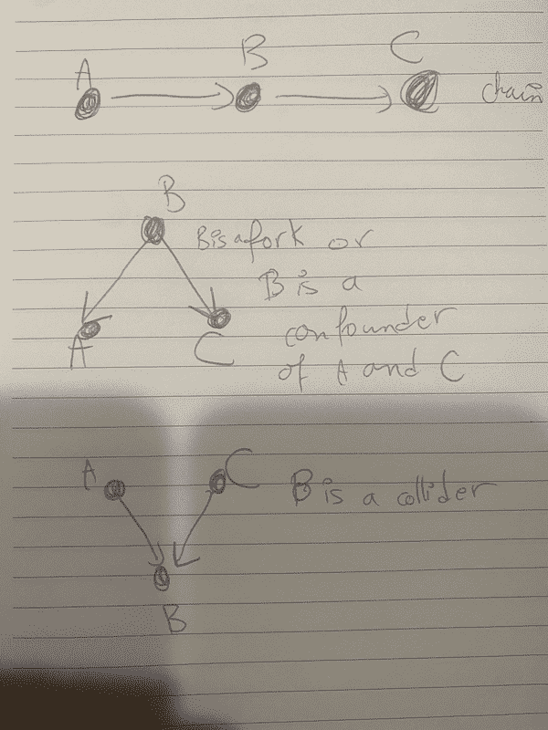

# 第九章：图模型

图表和网络无处不在：城市和路线图，机场和连接航班，电力网络，电网，全球网络，分子网络，生物网络，如我们的神经系统，社交网络，恐怖组织网络，数学模型的图表表示，人工神经网络等等。它们很容易被识别，具有明显的节点代表我们关心的某些实体，然后由有向或无向边连接，表示连接节点之间存在某种关系。

具有自然图结构的数据通过利用和保留该结构的机制更容易理解，构建直接在图上操作的函数（无论它们如何在数学上表示），而不是将图数据输入到机器学习模型中，然后再分析它。这不可避免地导致有价值信息的丢失。这也是卷积神经网络在图像数据上成功的原因，循环神经网络在序列数据上成功的原因，等等。

基于图的模型对数据科学家和工程师非常有吸引力：图结构提供了一种在具有固定底层坐标系统的空间中无法提供的灵活性，例如在欧几里得空间或关系数据库中，数据及其特征被迫遵循严格和预定的形式。此外，图是一种自然的设置，允许我们研究数据集中点之间的关系。到目前为止，我们的机器学习模型消耗的数据表示为孤立的数据点。另一方面，图模型消耗孤立的数据点，*以及它们之间的连接*，从而实现更深入的理解和更具表现力的模型。

人类大脑自然内化了图形结构：它能够对实体及其连接进行建模。它也足够灵活，可以生成新的网络，或者扩展和增强现有的网络，例如在城市规划、项目规划或持续更新交通网络时。此外，人类可以无缝地从自然语言文本过渡到图模型，反之亦然：当我们阅读新内容时，我们自然会制定图形表示以更好地理解它或向其他人说明。相反，当我们看到图表时，我们能够通过自然语言描述它。目前有一些模型可以基于知识图生成自然语言文本，反之亦然。这被称为在知识图上推理。

此时，我们对神经网络的构建模块以及它们通常适用于的数据类型和任务已经非常熟悉：

1.  多层感知器或全连接神经网络（第四章）

1.  卷积层（第五章）

1.  循环层（第七章）

1.  编码器-解码器组件（第七章）

1.  对抗组件和两人零和博弈（第八章）

1.  变分组件（第八章）

主要任务主要是：分类、回归、聚类、编码和解码，或新数据生成，其中模型学习数据特征的联合概率分布。

我们也熟悉这样一个事实，即我们可以混合和匹配神经网络的一些组件，以构建针对特定任务的新模型。好消息是，图神经网络使用完全相同的组件，因此我们不需要在本章中介绍任何新的机器学习概念。一旦我们了解了如何数学表示图数据及其特征，以一种可以输入到神经网络中进行分析或生成新网络（图）数据的方式，我们就可以开始了。因此，我们将避免深入研究所有图神经网络。相反，我们专注于简单的数学公式、流行的应用程序、图模型的常见任务、可用的数据集和模型评估方法。我们的目标是对这一主题的工作原理有一个深刻的直觉。主要挑战再次是以一种使问题降维并易于计算和分析的方式，同时保留最多信息。换句话说，对于拥有数百万用户的网络，我们不能期望我们的模型以数百万维的向量或矩阵作为输入。我们需要有效的图数据表示方法。

对于希望深入了解和快速掌握图神经网络的读者，2019 年的调查报告：[*关于图神经网络的综合调查*](https://arxiv.org/pdf/1901.00596.pdf?ref=https://githubhelp.com) 是一个很好的起点（当然，在仔细阅读本章之后）。

# 图：节点、边和每个节点的特征

图自然适合模拟任何目标是通过它们之间的关系来理解离散对象集合（重点是离散而不是连续）的问题。图论是离散数学和计算机科学中一个相对年轻的学科，具有几乎无限的应用。这个领域需要更多的头脑来解决其许多未解决的问题。

一个图（见图 9-1）由以下组成：

1.  节点或顶点：捆绑在一个集合中 <math alttext="upper N o d e s equals StartSet n o d e 1 comma n o d e 2 comma ellipsis comma n o d e Subscript n Baseline EndSet"><mrow><mi>N</mi> <mi>o</mi> <mi>d</mi> <mi>e</mi> <mi>s</mi> <mo>=</mo> <mo>{</mo> <mi>n</mi> <mi>o</mi> <mi>d</mi> <msub><mi>e</mi> <mn>1</mn></msub> <mo>,</mo> <mi>n</mi> <mi>o</mi> <mi>d</mi> <msub><mi>e</mi> <mn>2</mn></msub> <mo>,</mo> <mo>⋯</mo> <mo>,</mo> <mi>n</mi> <mi>o</mi> <mi>d</mi> <msub><mi>e</mi> <mi>n</mi></msub> <mo>}</mo></mrow></math> 。这可以是少数节点（甚至一个节点），也可以是数十亿个节点。

1.  边：以有向（从一个节点指向另一个节点）或无向方式（边没有从任一节点指向另一个节点的方向）连接任意两个节点（这可以包括从一个节点到自身的边，或连接相同两个节点的多条边）。边的集合为<math alttext="upper E d g e s equals StartSet e d g e Subscript i j Baseline equals left-parenthesis n o d e Subscript i Baseline comma n o d e Subscript j Baseline right-parenthesis such that there is an edge pointing from n o d e Subscript i Baseline to n o d e Subscript j Baseline EndSet"><mrow><mi>E</mi> <mi>d</mi> <mi>g</mi> <mi>e</mi> <mi>s</mi> <mo>=</mo> <mo>{</mo> <mi>e</mi> <mi>d</mi> <mi>g</mi> <msub><mi>e</mi> <mrow><mi>i</mi><mi>j</mi></mrow></msub> <mo>=</mo> <mrow><mo>(</mo> <mi>n</mi> <mi>o</mi> <mi>d</mi> <msub><mi>e</mi> <mi>i</mi></msub> <mo>,</mo> <mi>n</mi> <mi>o</mi> <mi>d</mi> <msub><mi>e</mi> <mi>j</mi></msub> <mo>)</mo></mrow> <mtext>such</mtext> <mtext>that</mtext> <mtext>there</mtext> <mtext>is</mtext> <mtext>an</mtext> <mtext>edge</mtext> <mtext>pointing</mtext> <mtext>from</mtext> <mi>n</mi> <mi>o</mi> <mi>d</mi> <msub><mi>e</mi> <mi>i</mi></msub> <mtext>to</mtext> <mi>n</mi> <mi>o</mi> <mi>d</mi> <msub><mi>e</mi> <mi>j</mi></msub> <mo>}</mo></mrow></math>。

1.  节点特征：我们可以为每个<math alttext="n o d e Subscript i"><mrow><mi>n</mi> <mi>o</mi> <mi>d</mi> <msub><mi>e</mi> <mi>i</mi></msub></mrow></math>分配一个包含*d*个特征的列表（例如社交媒体用户的年龄、性别和收入水平），这些特征捆绑在一个向量<math alttext="ModifyingAbove f e a t u r e s Subscript n o d e Sub Subscript i With right-arrow"><mover accent="true"><mrow><mi>f</mi><mi>e</mi><mi>a</mi><mi>t</mi><mi>u</mi><mi>r</mi><mi>e</mi><msub><mi>s</mi> <mrow><mi>n</mi><mi>o</mi><mi>d</mi><msub><mi>e</mi> <mi>i</mi></msub></mrow></msub></mrow> <mo>→</mo></mover></math>中。然后，我们可以将图的所有*n*个节点的所有特征向量捆绑在一个大小为<math alttext="d times n"><mrow><mi>d</mi> <mo>×</mo> <mi>n</mi></mrow></math>的矩阵<math alttext="upper F e a t u r e s Subscript upper N o d e s"><mrow><mi>F</mi> <mi>e</mi> <mi>a</mi> <mi>t</mi> <mi>u</mi> <mi>r</mi> <mi>e</mi> <msub><mi>s</mi> <mrow><mi>N</mi><mi>o</mi><mi>d</mi><mi>e</mi><mi>s</mi></mrow></msub></mrow></math>中。

1.  边特征：类似地，我们可以为每个<math alttext="e d g e Subscript i j"><mrow><mi>e</mi> <mi>d</mi> <mi>g</mi> <msub><mi>e</mi> <mrow><mi>i</mi><mi>j</mi></mrow></msub></mrow></math>分配一个包含*c*个特征的列表（例如道路长度、速度限制以及是否是收费道路），这些特征捆绑在一个向量<math alttext="ModifyingAbove f e a t u r e s Subscript e d g e Sub Subscript i j With right-arrow"><mover accent="true"><mrow><mi>f</mi><mi>e</mi><mi>a</mi><mi>t</mi><mi>u</mi><mi>r</mi><mi>e</mi><msub><mi>s</mi> <mrow><mi>e</mi><mi>d</mi><mi>g</mi><msub><mi>e</mi> <mrow><mi>i</mi><mi>j</mi></mrow></msub></mrow></msub></mrow> <mo>→</mo></mover></math>中。然后，我们可以将图的所有*m*条边的所有特征向量捆绑在一个大小为<math alttext="c times m"><mrow><mi>c</mi> <mo>×</mo> <mi>m</mi></mrow></math>的矩阵<math alttext="upper F e a t u r e s Subscript upper E d g e s"><mrow><mi>F</mi> <mi>e</mi> <mi>a</mi> <mi>t</mi> <mi>u</mi> <mi>r</mi> <mi>e</mi> <msub><mi>s</mi> <mrow><mi>E</mi><mi>d</mi><mi>g</mi><mi>e</mi><mi>s</mi></mrow></msub></mrow></math>中。

###### 图 9-1。一个图由连接节点的有向或无向边和节点组成。

图模型很强大，因为它们灵活，不一定要遵循严格的网格结构。我们可以将它们的节点想象为在空间中*漂浮*，根本没有任何坐标。它们只是通过连接它们的边保持在一起。然而，我们需要一种方法来表示它们的内在结构。有一些软件包可以根据它们的节点和边的集合来可视化图形，但我们不能在这些漂亮（和信息丰富）的图片上进行分析和计算。有两种流行的图表示可以作为机器学习模型的输入：图的*邻接矩阵*和*关联矩阵*。还有其他对于图论算法有用的表示，比如*边列表*、*两个线性数组*和*后继列表*。所有这些表示传达相同的信息，但在存储需求和图的检索、搜索和操作的效率方面有所不同。大多数图神经网络将邻接矩阵与节点和边的特征矩阵一起作为输入。许多时候，它们必须在将图数据输入模型之前进行维度缩减（称为图表示或图嵌入）。其他时候，维度缩减步骤是模型本身的一部分。

1.  *邻接矩阵*：在计算机上存储图的结构并研究其属性的一种代数方法是通过邻接矩阵，它是一个<math alttext="n times n"><mrow><mi>n</mi> <mo>×</mo> <mi>n</mi></mrow></math>，如果从<math alttext="n o d e Subscript i"><mrow><mi>n</mi> <mi>o</mi> <mi>d</mi> <msub><mi>e</mi> <mi>i</mi></msub></mrow></math>到<math alttext="n o d e Subscript j"><mrow><mi>n</mi> <mi>o</mi> <mi>d</mi> <msub><mi>e</mi> <mi>j</mi></msub></mrow></math>有一条边，则其条目<math alttext="a d j a c e n c y Subscript i j Baseline equals 1"><mrow><mi>a</mi> <mi>d</mi> <mi>j</mi> <mi>a</mi> <mi>c</mi> <mi>e</mi> <mi>n</mi> <mi>c</mi> <msub><mi>y</mi> <mrow><mi>i</mi><mi>j</mi></mrow></msub> <mo>=</mo> <mn>1</mn></mrow></math>，如果从<math alttext="n o d e Subscript i"><mrow><mi>n</mi> <mi>o</mi> <mi>d</mi> <msub><mi>e</mi> <mi>i</mi></msub></mrow></math>到<math alttext="n o d e Subscript j"><mrow><mi>n</mi> <mi>o</mi> <mi>d</mi> <msub><mi>e</mi> <mi>j</mi></msub></mrow></math>没有边，则其条目<math alttext="a d j a c e n c y Subscript i j Baseline equals 0"><mrow><mi>a</mi> <mi>d</mi> <mi>j</mi> <mi>a</mi> <mi>c</mi> <mi>e</mi> <mi>n</mi> <mi>c</mi> <msub><mi>y</mi> <mrow><mi>i</mi><mi>j</mi></mrow></msub> <mo>=</mo> <mn>0</mn></mrow></math>。请注意，此定义可以容纳自环，即从一个顶点到自身的边，但不包括两个不同节点之间的多条边，除非我们决定在邻接矩阵中包含数字 2、3，*等*作为条目。然而，这可能会破坏一些图论学家使用邻接矩阵建立的结果。

1.  *关联矩阵*：这是另一种代数方式来存储图的结构并保留其完整信息。在这里，我们列出节点和边，然后制定一个矩阵，其行对应于顶点，列对应于边。如果矩阵的条目<math alttext="i n c i d e n c e Subscript i j"><mrow><mi>i</mi> <mi>n</mi> <mi>c</mi> <mi>i</mi> <mi>d</mi> <mi>e</mi> <mi>n</mi> <mi>c</mi> <msub><mi>e</mi> <mrow><mi>i</mi><mi>j</mi></mrow></msub></mrow></math>为 1，则<math alttext="e d g e Subscript j"><mrow><mi>e</mi> <mi>d</mi> <mi>g</mi> <msub><mi>e</mi> <mi>j</mi></msub></mrow></math>连接<math alttext="n o d e Subscript i"><mrow><mi>n</mi> <mi>o</mi> <mi>d</mi> <msub><mi>e</mi> <mi>i</mi></msub></mrow></math>到其他节点，否则为零。请注意，此定义能够容纳两个不同节点之间的多条边，但不能容纳节点自身到自身的自环。由于许多图的边远多于顶点，因此这个矩阵往往非常宽，比邻接矩阵更大。

*Laplacian 矩阵*是与无向图相关联的另一个矩阵。它是一个对称矩阵，大小为<math alttext="n times n"><mrow><mi>n</mi> <mo>×</mo> <mi>n</mi></mrow></math>，其中每个节点都有对应的行和列。Laplacian 矩阵的对角线条目等于每个节点的度，非对角线条目为零，如果两个节点之间没有边相连，则为-1。这是从微积分和偏微分方程中的连续拉普拉斯算子离散化的过程，其中离散化发生在图的节点上。Laplacian 考虑了连续（且两次可微）函数的二阶导数，这些导数测量函数的凹凸性，或者函数在某一点的值与周围点的值有多大差异。与连续拉普拉斯算子类似，Laplacian 矩阵提供了一个度量，衡量图中一个节点与其附近节点的值有多大差异。当我们研究图上的随机游走以及电网络和电阻时，图的 Laplacian 矩阵会出现。我们将在本章后面看到这些内容。

我们可以从邻接矩阵和关联矩阵中轻松推断出简单的节点和边统计信息，例如节点的度数（节点的度数是连接到该节点的边的数量）。度分布 P(k)反映了所有节点的度数的变异性。P(k)是节点恰好有 k 条边的经验概率。这对于许多网络都很重要，比如网络连接和生物网络。例如，如果图中度为*k*的节点的分布遵循形式为<math alttext="upper P left-parenthesis k right-parenthesis equals k Superscript negative alpha"><mrow><mi>P</mi> <mrow><mo>(</mo> <mi>k</mi> <mo>)</mo></mrow> <mo>=</mo> <msup><mi>k</mi> <mrow><mo>-</mo><mi>α</mi></mrow></msup></mrow></math>的幂律分布，则这样的图具有少量高连通性的节点，或者中心节点，这些节点对网络拓扑结构至关重要，它们与许多低连通性的节点连接在一起。

我们还可以添加时间依赖性，并考虑随着时间演变而改变的动态图的属性。目前，有一些模型将时间依赖性添加到节点和/或边特征向量中（因此这些向量的每个条目都变得与时间有关）。例如，对于预测旅行路线的 GPS 系统，连接地图上一点到另一点的边特征会随着时间根据交通情况而改变。

现在我们已经有了一个数学框架，用于图对象以及它们的节点和边特征，我们可以将这些代表性向量、矩阵（以及用于监督模型的标签）输入到机器学习模型中，然后像往常一样进行业务。大多数时候，故事的一半是拥有一个良好的对象表示。另一半故事是机器学习模型的表达能力，我们可以在不编码（甚至不需要学习）导致这些结果的规则的情况下获得良好的结果。对于本章的目的，这意味着我们可以在学习适当的图论之前直接跳入图神经网络。

# 有向图

对于有向图，一方面，我们对于无向图感兴趣的属性也是一样的，比如它们的生成树、基本回路、割集、平面性、厚度等。另一方面，有向图有它们自己独特的属性，这些属性与无向图不同，比如强连通性、树形结构（根树的有向形式）、去环化等。

# 示例：PageRank 算法

[PageRank](https://en.wikipedia.org/wiki/PageRank)是谷歌用于排名其搜索引擎结果中网页的一种当前已停用的算法（2019 年过期）。它根据有多少其他页面链接到它来衡量网页的重要性。在图语言中，节点是网页，有向边是从一个页面指向另一个页面的链接。根据 PageRank，当一个节点有许多其他网页指向它时，即其入度较大时，该节点是重要的（参见图 9-2）。

###### 图 9-2\. PageRank 为指向（或链接）到它们的页面给出更高的分数（[图片来源](https://en.wikipedia.org/wiki/PageRank#/media/File:PageRanks-Example.svg)）。

作为涉及图、邻接矩阵、线性代数和网络的具体示例，让我们通过 PageRank 算法来走一遍一个仅包含四个索引网页的荒谬简化全球网络，如图 9-3 中所示，而不是数十亿个。

###### 图 9-3\. 一个仅包含四个索引网页的虚构全球网络。

在图 9-3 的图中，只有 B 链接到 A；A 和 D 链接到 B；A 和 D 链接到 C；A、B 和 C 链接到 D；A 链接到 B、C 和 D；B 链接到 A 和 D；C 链接到 D；D 链接到 B 和 C。

让我们想象一个从某个页面开始然后随机点击该页面的链接，然后从这个新页面点击一个链接，依此类推的网络冲浪者。这个冲浪者模拟了*网络图上的随机游走*。

一般来说，在代表全球网络的图上，这样一个随机冲浪者从某个节点遍历图到其邻居之一（或者如果有指向页面本身的链接，则返回到自身）。我们将在本章中再次遇到全球网络，并探讨我们想要了解有关其图性质的问题。我们需要一个用于随机游走的矩阵，对于这个应用我们称之为*链接矩阵*，但实际上它是由每个顶点的度加权的邻接矩阵。我们使用这个随机游走矩阵，或链接矩阵，来理解图上随机游走的长期行为。本章将在整个章节中出现图上的随机游走。

回到图 9-3 的四页全球网络。如果网络冲浪者在页面 A，有三分之一的机会冲浪者将移动到页面 B，三分之一的机会移动到 C，三分之一的机会移动到 D。因此，页面 A 的*外向链接*向量是

<math alttext="dollar-sign ModifyingAbove l i n k i n g Subscript upper A Baseline With right-arrow equals Start 4 By 1 Matrix 1st Row  0 2nd Row  1 slash 3 3rd Row  1 slash 3 4th Row  1 slash 3 EndMatrix dollar-sign"><mrow><mover accent="true"><mrow><mi>l</mi><mi>i</mi><mi>n</mi><mi>k</mi><mi>i</mi><mi>n</mi><msub><mi>g</mi> <mi>A</mi></msub></mrow> <mo>→</mo></mover> <mo>=</mo> <mfenced close=")" open="("><mtable><mtr><mtd><mn>0</mn></mtd></mtr> <mtr><mtd><mrow><mn>1</mn> <mo>/</mo> <mn>3</mn></mrow></mtd></mtr> <mtr><mtd><mrow><mn>1</mn> <mo>/</mo> <mn>3</mn></mrow></mtd></mtr> <mtr><mtd><mrow><mn>1</mn> <mo>/</mo> <mn>3</mn></mrow></mtd></mtr></mtable></mfenced></mrow></math>

如果网络冲浪者在页面 B，有一半的机会他们会移动到页面 A，一半的机会他们会移动到页面 D。因此，页面 B 的外向链接向量是

<math alttext="dollar-sign ModifyingAbove l i n k i n g Subscript upper B Baseline With right-arrow equals Start 4 By 1 Matrix 1st Row  1 slash 2 2nd Row  0 3rd Row  0 4th Row  1 slash 2 EndMatrix dollar-sign"><mrow><mover accent="true"><mrow><mi>l</mi><mi>i</mi><mi>n</mi><mi>k</mi><mi>i</mi><mi>n</mi><msub><mi>g</mi> <mi>B</mi></msub></mrow> <mo>→</mo></mover> <mo>=</mo> <mfenced close=")" open="("><mtable><mtr><mtd><mrow><mn>1</mn> <mo>/</mo> <mn>2</mn></mrow></mtd></mtr> <mtr><mtd><mn>0</mn></mtd></mtr> <mtr><mtd><mn>0</mn></mtd></mtr> <mtr><mtd><mrow><mn>1</mn> <mo>/</mo> <mn>2</mn></mrow></mtd></mtr></mtable></mfenced></mrow></math>

类似地，页面 C 和 D 的外向链接向量是

<math alttext="dollar-sign ModifyingAbove l i n k i n g Subscript upper C Baseline With right-arrow equals Start 4 By 1 Matrix 1st Row  0 2nd Row  0 3rd Row  0 4th Row  1 EndMatrix and ModifyingAbove l i n k i n g Subscript upper D Baseline With right-arrow equals Start 4 By 1 Matrix 1st Row  0 2nd Row  1 slash 2 3rd Row  1 slash 2 4th Row  0 EndMatrix dollar-sign"><mrow><mover accent="true"><mrow><mi>l</mi><mi>i</mi><mi>n</mi><mi>k</mi><mi>i</mi><mi>n</mi><msub><mi>g</mi> <mi>C</mi></msub></mrow> <mo>→</mo></mover> <mo>=</mo> <mfenced close=")" open="("><mtable><mtr><mtd><mn>0</mn></mtd></mtr> <mtr><mtd><mn>0</mn></mtd></mtr> <mtr><mtd><mn>0</mn></mtd></mtr> <mtr><mtd><mn>1</mn></mtd></mtr></mtable></mfenced> <mtext>and</mtext> <mover accent="true"><mrow><mi>l</mi><mi>i</mi><mi>n</mi><mi>k</mi><mi>i</mi><mi>n</mi><msub><mi>g</mi> <mi>D</mi></msub></mrow> <mo>→</mo></mover> <mo>=</mo> <mfenced close=")" open="("><mtable><mtr><mtd><mn>0</mn></mtd></mtr> <mtr><mtd><mrow><mn>1</mn> <mo>/</mo> <mn>2</mn></mrow></mtd></mtr> <mtr><mtd><mrow><mn>1</mn> <mo>/</mo> <mn>2</mn></mrow></mtd></mtr> <mtr><mtd><mn>0</mn></mtd></mtr></mtable></mfenced></mrow></math>

我们将所有网页的链接向量捆绑在一起，创建一个链接矩阵：

<math alttext="dollar-sign upper L i n k i n g equals Start 4 By 4 Matrix 1st Row 1st Column 0 2nd Column 1 slash 2 3rd Column 0 4th Column 0 2nd Row 1st Column 1 slash 3 2nd Column 0 3rd Column 0 4th Column 1 slash 2 3rd Row 1st Column 1 slash 3 2nd Column 0 3rd Column 0 4th Column 1 slash 2 4th Row 1st Column 1 slash 3 2nd Column 1 slash 2 3rd Column 1 4th Column 0 EndMatrix dollar-sign"><mrow><mi>L</mi> <mi>i</mi> <mi>n</mi> <mi>k</mi> <mi>i</mi> <mi>n</mi> <mi>g</mi> <mo>=</mo> <mfenced close=")" open="("><mtable><mtr><mtd><mn>0</mn></mtd> <mtd><mrow><mn>1</mn> <mo>/</mo> <mn>2</mn></mrow></mtd> <mtd><mn>0</mn></mtd> <mtd><mn>0</mn></mtd></mtr> <mtr><mtd><mrow><mn>1</mn> <mo>/</mo> <mn>3</mn></mrow></mtd> <mtd><mn>0</mn></mtd> <mtd><mn>0</mn></mtd> <mtd><mrow><mn>1</mn> <mo>/</mo> <mn>2</mn></mrow></mtd></mtr> <mtr><mtd><mrow><mn>1</mn> <mo>/</mo> <mn>3</mn></mrow></mtd> <mtd><mn>0</mn></mtd> <mtd><mn>0</mn></mtd> <mtd><mrow><mn>1</mn> <mo>/</mo> <mn>2</mn></mrow></mtd></mtr> <mtr><mtd><mrow><mn>1</mn> <mo>/</mo> <mn>3</mn></mrow></mtd> <mtd><mrow><mn>1</mn> <mo>/</mo> <mn>2</mn></mrow></mtd> <mtd><mn>1</mn></mtd> <mtd><mn>0</mn></mtd></mtr></mtable></mfenced></mrow></math>

请注意，链接矩阵的列是外向链接概率，A 的行是*内向链接*概率：冲浪者如何到达页面 A？他们只能在 B，从那里只有 0.5 的概率他们最终会到达 A。

现在我们可以通过将指向 A 的所有页面的排名加起来，每个页面的排名都加权，权重是冲浪者从该页面最终到达页面 A 的概率，也就是说，一个有许多高排名页面指向它的页面也会排名较高。因此，四个页面的排名是：

<math alttext="dollar-sign StartLayout 1st Row 1st Column r a n k Subscript upper A 2nd Column equals 0 r a n k Subscript upper A Baseline plus 1 slash 2 r a n k Subscript upper B Baseline plus 0 r a n k Subscript upper C Baseline plus 0 r a n k Subscript upper D Baseline 2nd Row 1st Column r a n k Subscript upper B 2nd Column equals 1 slash 3 r a n k Subscript upper A Baseline plus 0 r a n k Subscript upper B Baseline plus 0 r a n k Subscript upper C Baseline plus 1 slash 2 r a n k Subscript upper D Baseline 3rd Row 1st Column r a n k Subscript upper C 2nd Column equals 1 slash 3 r a n k Subscript upper A Baseline plus 0 r a n k Subscript upper B Baseline plus 0 r a n k Subscript upper C Baseline plus 1 slash 2 r a n k Subscript upper D Baseline 4th Row 1st Column r a n k Subscript upper D 2nd Column equals 1 slash 3 r a n k Subscript upper A Baseline plus 1 slash 2 r a n k Subscript upper B Baseline plus 1 r a n k Subscript upper C Baseline plus 0 r a n k Subscript upper D EndLayout dollar-sign"><mtable displaystyle="true"><mtr><mtd columnalign="right"><mrow><mi>r</mi> <mi>a</mi> <mi>n</mi> <msub><mi>k</mi> <mi>A</mi></msub></mrow></mtd> <mtd columnalign="left"><mrow><mo>=</mo> <mn>0</mn> <mi>r</mi> <mi>a</mi> <mi>n</mi> <msub><mi>k</mi> <mi>A</mi></msub> <mo>+</mo> <mn>1</mn> <mo>/</mo> <mn>2</mn> <mi>r</mi> <mi>a</mi> <mi>n</mi> <msub><mi>k</mi> <mi>B</mi></msub> <mo>+</mo> <mn>0</mn> <mi>r</mi> <mi>a</mi> <mi>n</mi> <msub><mi>k</mi> <mi>C</mi></msub> <mo>+</mo> <mn>0</mn> <mi>r</mi> <mi>a</mi> <mi>n</mi> <msub><mi>k</mi> <mi>D</mi></msub></mrow></mtd></mtr> <mtr><mtd columnalign="right"><mrow><mi>r</mi> <mi>a</mi> <mi>n</mi> <msub><mi>k</mi> <mi>B</mi></msub></mrow></mtd> <mtd columnalign="left"><mrow><mo>=</mo> <mn>1</mn> <mo>/</mo> <mn>3</mn> <mi>r</mi> <mi>a</mi> <mi>n</mi> <msub><mi>k</mi> <mi>A</mi></msub> <mo>+</mo> <mn>0</mn> <mi>r</mi> <mi>a</mi> <mi>n</mi> <msub><mi>k</mi> <mi>B</mi></msub> <mo>+</mo> <mn>0</mn> <mi>r</mi> <mi>a</mi> <mi>n</mi> <msub><mi>k</mi> <mi>C</mi></msub> <mo>+</mo> <mn>1</mn> <mo>/</mo> <mn>2</mn> <mi>r</mi> <mi>a</mi> <mi>n</mi> <msub><mi>k</mi> <mi>D</mi></msub></mrow></mtd></mtr> <mtr><mtd columnalign="right"><mrow><mi>r</mi> <mi>a</mi> <mi>n</mi> <msub><mi>k</mi> <mi>C</mi></msub></mrow></mtd> <mtd columnalign="left"><mrow><mo>=</mo> <mn>1</mn> <mo>/</mo> <mn>3</mn> <mi>r</mi> <mi>a</mi> <mi>n</mi> <msub><mi>k</mi> <mi>A</mi></msub> <mo>+</mo> <mn>0</mn> <mi>r</mi> <mi>a</mi> <mi>n</mi> <msub><mi>k</mi> <mi>B</mi></msub> <mo>+</mo> <mn>0</mn> <mi>r</mi> <mi>a</mi> <mi>n</mi> <msub><mi>k</mi> <mi>C</mi></msub> <mo>+</mo> <mn>1</mn> <mo>/</mo> <mn>2</mn> <mi>r</mi> <mi>a</mi> <mi>n</mi> <msub><mi>k</mi> <mi>D</mi></msub></mrow></mtd></mtr> <mtr><mtd columnalign="right"><mrow><mi>r</mi> <mi>a</mi> <mi>n</mi> <msub><mi>k</mi> <mi>D</mi></msub></mrow></mtd> <mtd columnalign="left"><mrow><mo>=</mo> <mn>1</mn> <mo>/</mo> <mn>3</mn> <mi>r</mi> <mi>a</mi> <mi>n</mi> <msub><mi>k</mi> <mi>A</mi></msub> <mo>+</mo> <mn>1</mn> <mo>/</mo> <mn>2</mn> <mi>r</mi> <mi>a</mi> <mi>n</mi> <msub><mi>k</mi> <mi>B</mi></msub> <mo>+</mo> <mn>1</mn> <mi>r</mi> <mi>a</mi> <mi>n</mi> <msub><mi>k</mi> <mi>C</mi></msub> <mo>+</mo> <mn>0</mn> <mi>r</mi> <mi>a</mi> <mi>n</mi> <msub><mi>k</mi> <mi>D</mi></msub></mrow></mtd></mtr></mtable></math>

要找到每个网页排名的数值，我们必须解决上述线性方程组，这是线性代数的领域。在矩阵向量表示中，我们将上述系统写为：

<math alttext="dollar-sign ModifyingAbove r a n k s With right-arrow equals upper L i n k i n g ModifyingAbove r a n k s With right-arrow dollar-sign"><mrow><mover accent="true"><mrow><mi>r</mi><mi>a</mi><mi>n</mi><mi>k</mi><mi>s</mi></mrow> <mo>→</mo></mover> <mo>=</mo> <mi>L</mi> <mi>i</mi> <mi>n</mi> <mi>k</mi> <mi>i</mi> <mi>n</mi> <mi>g</mi> <mover accent="true"><mrow><mi>r</mi><mi>a</mi><mi>n</mi><mi>k</mi><mi>s</mi></mrow> <mo>→</mo></mover></mrow></math>

因此，包含所有网页排名的向量是网页图的链接矩阵的特征向量（其中节点是网页，有向边是它们之间的链接）的特征值为 1。请记住，实际上，网络的图是巨大的，这意味着链接矩阵是巨大的，设计有效的方法来找到它的特征向量变得非常重要。

计算给定矩阵的特征向量和特征值是数值线性代数的最重要贡献之一，具有许多领域的直接应用。许多用于找到特征向量和特征值的数值方法涉及反复将矩阵与向量相乘。当处理巨大矩阵时，这是昂贵的，我们必须使用书中的每一个技巧来使操作更便宜：我们利用矩阵的稀疏性（许多条目为零，因此与这些条目相乘是浪费，*然后*发现它们只是零）；我们引入随机化或随机性，并涉足高维概率和大型随机矩阵领域（我们将在第十一章中尝试这些）。目前，我们重申了我们在第六章中介绍的迭代方法：我们从一个随机向量<math alttext="ModifyingAbove r a n k s With right-arrow Subscript 0"><msub><mover accent="true"><mrow><mi>r</mi><mi>a</mi><mi>n</mi><mi>k</mi><mi>s</mi></mrow> <mo>→</mo></mover> <mn>0</mn></msub></math>开始，然后通过乘以链接矩阵迭代产生一系列向量：

<math alttext="dollar-sign ModifyingAbove r a n k s With right-arrow Subscript i plus 1 Baseline equals upper L i n k i n g ModifyingAbove r a n k s With right-arrow Subscript i Baseline dollar-sign"><mrow><msub><mover accent="true"><mrow><mi>r</mi><mi>a</mi><mi>n</mi><mi>k</mi><mi>s</mi></mrow> <mo>→</mo></mover> <mrow><mi>i</mi><mo>+</mo><mn>1</mn></mrow></msub> <mo>=</mo> <mi>L</mi> <mi>i</mi> <mi>n</mi> <mi>k</mi> <mi>i</mi> <mi>n</mi> <mi>g</mi> <msub><mover accent="true"><mrow><mi>r</mi><mi>a</mi><mi>n</mi><mi>k</mi><mi>s</mi></mrow> <mo>→</mo></mover> <mi>i</mi></msub></mrow></math>

对于我们的四页全球网络，这收敛到向量

<math alttext="dollar-sign ModifyingAbove r a n k s With right-arrow equals Start 4 By 1 Matrix 1st Row  0.12 2nd Row  0.24 3rd Row  0.24 4th Row  0.4 EndMatrix dollar-sign"><mrow><mover accent="true"><mrow><mi>r</mi><mi>a</mi><mi>n</mi><mi>k</mi><mi>s</mi></mrow> <mo>→</mo></mover> <mo>=</mo> <mfenced close=")" open="("><mtable><mtr><mtd><mrow><mn>0</mn> <mo>.</mo> <mn>12</mn></mrow></mtd></mtr> <mtr><mtd><mrow><mn>0</mn> <mo>.</mo> <mn>24</mn></mrow></mtd></mtr> <mtr><mtd><mrow><mn>0</mn> <mo>.</mo> <mn>24</mn></mrow></mtd></mtr> <mtr><mtd><mrow><mn>0</mn> <mo>.</mo> <mn>4</mn></mrow></mtd></mtr></mtable></mfenced></mrow></math>

这意味着页面 D 排名最高，在具有相似内容的搜索引擎查询中，它将是返回的第一个页面。然后，我们可以重新绘制图 9-3 中的图表，其中每个圆的大小对应页面的重要性。

当 PageRank 算法在使用时，真正的实现包括一个阻尼因子*d*，它是介于零和一之间的数字，通常约为 0.85，它考虑了只有 85%的机会，网络冲浪者点击当前所在页面的链接，以及 15%的机会，他们从当前所在页面开始访问一个完全新的页面，该页面没有从当前所在页面链接过来。这修改了找到网页排名的迭代过程的方式：

<math alttext="dollar-sign ModifyingAbove r a n k s With right-arrow Subscript i plus 1 Baseline equals d left-parenthesis upper L i n k i n g ModifyingAbove r a n k s With right-arrow Subscript i Baseline right-parenthesis plus StartFraction 1 minus d Over total number of pages EndFraction ModifyingAbove o n e s With right-arrow dollar-sign"><mrow><msub><mover accent="true"><mrow><mi>r</mi><mi>a</mi><mi>n</mi><mi>k</mi><mi>s</mi></mrow> <mo>→</mo></mover> <mrow><mi>i</mi><mo>+</mo><mn>1</mn></mrow></msub> <mo>=</mo> <mi>d</mi> <mrow><mo>(</mo> <mi>L</mi> <mi>i</mi> <mi>n</mi> <mi>k</mi> <mi>i</mi> <mi>n</mi> <mi>g</mi> <msub><mover accent="true"><mrow><mi>r</mi><mi>a</mi><mi>n</mi><mi>k</mi><mi>s</mi></mrow> <mo>→</mo></mover> <mi>i</mi></msub> <mo>)</mo></mrow> <mo>+</mo> <mfrac><mrow><mn>1</mn><mo>-</mo><mi>d</mi></mrow> <mrow><mtext>total</mtext><mtext>number</mtext><mtext>of</mtext><mtext>pages</mtext></mrow></mfrac> <mover accent="true"><mrow><mi>o</mi><mi>n</mi><mi>e</mi><mi>s</mi></mrow> <mo>→</mo></mover></mrow></math>

最后，如果你想知道谷歌是否一直在搜索网络上的新网页并对其进行索引，并且是否一直在检查所有已索引的网页是否有新链接？答案是肯定的，以下摘录来自[谷歌搜索工作原理](https://developers.google.com/search/docs/advanced/guidelines/how-search-works)：*谷歌搜索是一个完全自动化的搜索引擎，使用称为网络爬虫的软件定期探索网络以找到要添加到我们索引中的页面。事实上，我们结果中列出的绝大多数页面并非手动提交以进行包含，而是在我们的网络爬虫探索网络时自动发现并添加的。[...]并没有所有网页的中央注册表，因此谷歌必须不断寻找新的和更新的页面，并将它们添加到已知页面列表中。这个过程称为“URL 发现”。有些页面是已知的，因为谷歌已经访问过它们。当谷歌从已知页面跟踪到新页面时，例如，一个中心页面，比如一个类别页面，链接到一个新的博客文章时，就会发现其他页面。当您提交一个页面列表（站点地图）供谷歌爬取时，也会发现其他页面。[...]当用户输入查询时，我们的机器在索引中搜索匹配的页面，并返回我们认为对用户最有价值和最相关的结果。相关性由数百个因素决定，这些因素可能包括用户的位置、语言和设备（台式机或手机）等信息。例如，搜索“自行车修理店”会向巴黎用户显示与向香港用户显示不同的结果。*

我们收集的数据越多，搜索就变得越复杂。谷歌在 2015 年推出了 RankBrain。它使用机器学习来对网页上的文本进行向量化，类似于我们在第七章中所做的。这个过程为索引页面添加了上下文和含义，使搜索结果更准确。这个过程增加的不好之处是与含义向量相关联的维度更高。为了避免在返回与查询最接近的网页之前检查每个维度上的每个向量的困难，谷歌使用了近似最近邻算法，帮助在毫秒内返回优秀的结果，这就是我们现在的体验。

# 使用图来求逆矩阵

应用科学中的许多问题涉及编写一个离散线性系统 <math alttext="upper A ModifyingAbove x With right-arrow equals ModifyingAbove b With right-arrow"><mrow><mi>A</mi> <mover accent="true"><mi>x</mi> <mo>→</mo></mover> <mo>=</mo> <mover accent="true"><mi>b</mi> <mo>→</mo></mover></mrow></math> 并解决它，这等同于求矩阵 A 的逆并找到解 <math alttext="ModifyingAbove x With right-arrow equals upper A Superscript negative 1 Baseline ModifyingAbove b With right-arrow"><mrow><mover accent="true"><mi>x</mi> <mo>→</mo></mover> <mo>=</mo> <msup><mi>A</mi> <mrow><mo>-</mo><mn>1</mn></mrow></msup> <mover accent="true"><mi>b</mi> <mo>→</mo></mover></mrow></math> 。但对于大矩阵来说，这是一个计算昂贵的操作，加上高存储要求和低精度。我们一直在寻找有效的方法来求逆矩阵，有时利用手头特定矩阵的特殊特性。

以下是一个图论方法，用于计算一个相当大的矩阵（例如，一百行一百列）的逆：

1.  用 1 替换矩阵 A 中的每个非零元素。我们得到一个二进制矩阵。

1.  重新排列得到的二进制矩阵的行和相应的列，使所有对角线条目为 1。

1.  我们将得到的矩阵视为一个有向图的邻接矩阵（在图中删除对应于对角线上的 1 的自环）。

1.  得到的有向图被分成了片段。

1.  如果一个片段太大，那么我们通过删除适当的边将其进一步分解为更小的片段。

1.  我们反转较小的矩阵。

1.  显然，这导致了原始矩阵的逆。

我们不会解释为什么和如何，但这种方法非常可爱，所以它进入了这一章节。

# 群的凯莱图：纯代数和并行计算

群的图，也称为凯莱图或凯莱图表，对于设计和分析并行计算机的网络架构、路由问题以及互连网络的路由算法都是有帮助的。论文[Processor Interconnection Networks From Cayley Graphs](https://www.nsa.gov/portals/75/documents/news-features/declassified-documents/cryptologic-quarterly/Processor_Interconnection.pdf)是一篇有趣且易读的早期设计应用凯莱图进行并行计算网络的论文，解释了如何构建符合特定设计参数的凯莱图。凯莱图也被应用于[数据分类](https://www.sciencedirect.com/science/article/pii/S0012365X08006869)。

我们可以将具有 n 个元素的每个群表示为具有 n 个节点的连接有向图，其中每个节点对应于群中的一个元素，每条边代表由群中的一个生成器相乘。边根据我们要乘以的群中的生成器进行标记（或着色）（参见图 9-4）。这个有向图唯一定义了群：群中元素的每个乘积对应于在图上遵循一系列有向边。例如，具有 n 个元素的循环群的图是一个由 n 个节点组成的有向电路，其中每条边代表群的一个生成器的乘法。

从纯数学的角度来看，凯莱图对于可视化和研究抽象群是有用的，它在视觉图表中编码了它们的完整抽象结构和所有元素。凯莱图的对称性使它们对于构建更复杂的抽象对象很有用。这些是组合和几何群论的中心工具。要了解更多凯莱图，请查看[此页面](https://mathworld.wolfram.com/CayleyGraph.xhtml)。

###### 图 9-4。自由群 a 和 b 的凯莱图：每个节点代表自由群的一个元素，每条边代表乘以 a 或 b。([图片来源](https://commons.wikimedia.org/wiki/File:F2_Cayley_Graph.png))。

# 图中的消息传递在图内传递

一种用于模拟图中信息传播的有用方法，以及将节点、边和图结构传达的信息整齐地聚合到特定维度的向量中的方法是*消息传递框架*。在这个框架内，我们从相邻节点和连接到它们的边的特征向量中更新每个节点的信息。图神经网络执行多轮消息传递，每一轮传播一个节点的信息。最后，我们结合每个单独节点的潜在特征来获得其统一的向量表示，并表示整个图。

更具体地说，对于一个特定的节点，我们选择一个函数，该函数以节点的特征向量、其中一个相邻节点的特征向量（通过边连接到它的节点）以及连接它到这个相邻节点的边的特征向量作为输入，并输出一个包含来自节点、相邻节点和它们连接的边的信息的新向量。我们将同样的函数应用于所有节点的相邻节点，然后将生成的向量相加，产生一个*消息向量*。最后，我们通过将原始特征向量与消息向量结合在一起的更新函数来更新我们节点的特征向量，这也是我们选择的。当我们对图中的每个节点都这样做时，每个节点的新特征向量将包含来自它自身、所有相邻节点和所有连接的边的信息。现在当我们再次重复这个过程时，节点的最新特征向量将包含来自它自身、所有相邻节点*及其相邻节点*，以及所有相应的连接边的信息。因此，我们进行的消息传递轮数越多，每个节点的特征向量就包含了来自图中更远节点的信息，每次移动一个边的距离。信息逐渐在整个网络中传播。

# 图的无限应用

图神经网络和图模型的应用普遍且重要，以至于我有点后悔没有从图开始这本书。在任何图模型中，我们首先回答以下问题：

+   节点是什么？

+   是什么关系连接了两个节点，建立了它们之间的有向或无向边？

+   模型是否应该包括节点和/或边的特征向量？

+   我们的模型是动态的吗，其中节点、边和它们的特征随时间演变，还是静态的？

+   我们感兴趣的是什么？分类（例如癌细胞或非癌细胞；虚假新闻传播者或非虚假新闻传播者）？生成新的图（例如用于药物发现）？聚类？将图嵌入到一个更低维度和结构化的空间中？

+   可用或需要的数据是什么，数据是否组织和/或标记？是否需要预处理？

在本节中我们调查了一些应用，但还有许多应用真正适合图模型结构。阅读链接出版物的摘要是很好的，因为它们有助于捕捉这些模型的共同主题和思考方式。以下列表提供了图神经网络的常见任务的一个很好的概念，包括：

+   节点分类

+   图分类

+   聚类和社区检测

+   生成新的图

+   影响最大化

+   链接预测

# 图像数据作为图

我们可能会遇到在[手写数字 MNIST 数据集](http://yann.lecun.com/exdb/mnist/)上测试的图神经网络，这是计算机视觉的基准数据集之一。如果你想知道图像数据（存储为每个通道上的像素强度的三维张量）如何适应图结构，这里是它的工作原理：每个像素是一个节点，其特征是其三个通道的相应强度（如果是彩色图像，则只有一个特征）。边连接每个像素到其周围的三个、五个或八个像素，取决于像素是位于角落、边缘还是图像中间。

### 大脑网络

神经科学中的主要追求之一是理解大脑的网络组织。图模型为分析大脑的复杂网络提供了一个自然的框架和许多工具，无论是从解剖学还是功能学的角度。

要创建与人类智能相媲美的人工智能，我们必须在许多层面上了解人类大脑。其中一个方面是大脑的网络连接性，连接性如何影响大脑的功能，以及如何复制这一点，从小的计算单元逐步构建到模块化组件，最终形成一个完全独立和功能完善的系统。

人类大脑解剖网络展示了短路径长度（保持布线成本）以及高度皮层*中枢*，即高聚类。这既在细胞尺度上，也在整个大脑尺度上。换句话说，大脑网络似乎以一种最大化信息传输效率和最小化连接成本的方式组织自己。该网络还展示了模块化和分层的拓扑结构和功能。大脑网络的拓扑结构和功能在短时间尺度和长时间尺度上是相互依存的：网络的动态特性受其结构连接的影响，而在更长的时间尺度上，动态特性影响网络的拓扑结构。

最重要的问题是：大脑的网络属性与其认知行为之间的关系是什么？网络属性与大脑和精神障碍之间的关系是什么？例如，我们可以将神经精神障碍视为失连接综合征，图论可以帮助量化网络结构中的弱点、对损伤的脆弱性和异常。事实上，图论已被应用于研究精神分裂症、阿尔茨海默病和其他疾病中的结构和功能网络属性。

### 疾病传播

正如我们从 Covid19 大流行中学到的那样，准确可靠地预测疾病事件对于减轻目的、隔离措施、政策和许多其他决策因素至关重要。图模型可以将个体或整个地理区块视为节点，将这些个体或区块之间的接触事件视为边。最近用于预测 Covid19 传播的模型，例如文章[结合图神经网络和时空疾病模型以改善对德国每周 COVID-19 病例的预测（2022）](https://www.nature.com/articles/s41598-022-07757-5)，将来自 Facebook、Apple 和 Google 的人类流动数据纳入模型中，以模拟节点之间的相互作用。

这里有大量数据可以加以利用：Facebook 的[Data For Good](https://dataforgood.facebook.com)资源拥有大量关于人口密度、社会流动和旅行模式、社会联系等数据。谷歌的[Covid 19 社区流动报告](https://www.google.com/covid19/mobility/index.xhtml?hl=en)从谷歌地图和其他产品中获取见解，形成一个数据集，通过地理位置和不同类别的地点（如零售和娱乐、杂货店和药店、公园、交通站、工作场所和居住区）跟踪随时间变化的移动趋势。同样，苹果和亚马逊的流动数据也具有类似的目的，旨在帮助限制 Covid19 的传播。

### 信息传播

我们可以使用图形来模拟信息、疾病、谣言、八卦、计算机病毒、创新想法或其他事物的传播。这样的模型通常是一个有向图，其中每个节点对应一个个体，边缘带有关于个体之间互动的信息。边缘标签或权重通常是概率：连接<math alttext="n o d e Subscript i"><mrow><mi>n</mi> <mi>o</mi> <mi>d</mi> <msub><mi>e</mi> <mi>i</mi></msub></mrow></math> 和<math alttext="n o d e Subscript j"><mrow><mi>n</mi> <mi>o</mi> <mi>d</mi> <msub><mi>e</mi> <mi>j</mi></msub></mrow></math> 的边缘的权重<math alttext="w Subscript i j"><msub><mi>w</mi> <mrow><mi>i</mi><mi>j</mi></mrow></msub></math> 是某种效应（疾病、谣言、计算机病毒）从<math alttext="n o d e Subscript i"><mrow><mi>n</mi> <mi>o</mi> <mi>d</mi> <msub><mi>e</mi> <mi>i</mi></msub></mrow></math> 传播到<math alttext="n o d e Subscript j"><mrow><mi>n</mi> <mi>o</mi> <mi>d</mi> <msub><mi>e</mi> <mi>j</mi></msub></mrow></math> 的概率。

### 检测和跟踪假新闻传播

图神经网络在检测假新闻的任务中表现比基于内容的自然语言处理方法更好（见图 9-5）。2019 年论文《在社交媒体上使用几何深度学习检测假新闻》的摘要很有信息量：*社交媒体如今是全球数百万人的主要新闻来源之一，因为它们成本低、易于访问且传播迅速。然而，这也带来了可疑的信任度和暴露于“假新闻”的风险，这些新闻是有意编写以误导读者的。自动检测假新闻面临挑战，这挑战超越了现有基于内容的分析方法。其中一个主要原因是，新闻的解释通常需要政治或社会背景知识或“常识”，而当前的自然语言处理算法仍然缺乏。最近的研究实证表明，假新闻和真实新闻在社交媒体上传播方式不同，形成了传播模式，这些模式可以用于自动检测假新闻。基于传播的方法与基于内容的方法相比具有多个优势，其中包括语言独立性和更好的抵抗对抗性攻击。在本文中，我们展示了一种基于几何深度学习的新型自动假新闻检测模型。底层核心算法是将经典卷积神经网络推广到图形，允许融合异构数据，如内容、用户资料和活动、社交图和新闻传播。我们的模型在 Twitter 上传播的经专业事实核查组织验证的新闻报道上进行了训练和测试。我们的实验表明，社交网络结构和传播是重要特征，允许高度准确（92.7% ROC AUC）的假新闻检测。其次，我们观察到假新闻可以在传播几小时后可靠地检测出来。第三，我们测试了我们模型在时间上分开的训练和测试数据的老化情况。我们的结果指向基于传播的方法对于假新闻检测的潜力，作为基于内容的方法的替代或补充策略。*

###### 图 9-5。传播假新闻的节点标记为红色。思想相似的人在社交网络中聚集在一起（[图片来源](https://arxiv.org/pdf/1902.06673.pdf)）。

### Web-Scale Recommendation Systems

自 2018 年以来，Pinterest 一直在使用[PinSage 图卷积网络](https://arxiv.org/pdf/1806.01973.pdf)。这个网络整理用户的主页并为新的相关的图钉提供建议。作者在他们的模型中使用了*图上的随机游走*，我们将在本章后面讨论。以下是完整的摘要：*针对图结构数据的深度神经网络的最新进展已经在推荐系统基准测试中取得了最先进的性能。然而，使这些方法实用并可扩展到拥有数十亿个项目和数亿用户的网络规模推荐任务仍然是一个挑战。在这里，我们描述了一个我们在 Pinterest 开发和部署的大规模深度推荐引擎。我们开发了一种数据高效的图卷积网络（GCN）算法 PinSage，它结合了高效的随机游走和图卷积，生成了结合了图结构和节点特征信息的节点（即项目）嵌入。与先前的 GCN 方法相比，我们开发了一种基于高效随机游走的新方法来构造卷积，并设计了一种依赖于越来越难的训练示例来改善模型的鲁棒性和收敛性的新型训练策略。我们在 Pinterest 部署了 PinSage，并在拥有 30 亿个代表图钉和画板的节点和 180 亿条边的图上对其进行了 750 亿个示例的训练。根据离线指标、用户研究和 A/B 测试，PinSage 生成的推荐比可比的深度学习和基于图的替代方法具有更高的质量。据我们所知，这是迄今为止最大规模的深度图嵌入应用，并为基于图卷积架构的新一代网络规模推荐系统铺平了道路。*

### 对抗癌症

在 2019 年的文章[*HyperFoods: 机器智能映射食物中的抗癌分子*](https://www.nature.com/articles/s41598-019-45349-y)中，作者利用蛋白质、基因和药物相互作用数据来识别有助于预防和战胜癌症的分子。他们还绘制了富含抗癌分子的食物（见图 9-6）。作者再次利用图上的随机游走。以下是论文的摘要：*最近的数据表明，30-40%的癌症可以仅通过饮食和生活方式措施来预防。在这里，我们介绍了一种独特的基于网络的机器学习平台，用于识别可能的基于食物的抗癌分子。这些分子是通过它们与临床批准的抗癌疗法的分子生物学网络共同性来识别的。使用图上的随机游走机器学习算法（在超级计算 DreamLab 平台内运行），模拟药物在人类相互作用网络上的作用，以获得 1962 种批准的药物的全基因组活性概况（其中 199 种被分类为“抗癌”并具有它们的主要适应症）。采用监督方法来预测抗癌分子，使用这些‘学习’相互作用活性概况。经验证的模型性能预测抗癌治疗药物的分类准确率为 84-90%。7962 种食物中的生物活性分子的全面数据库被输入模型，预测出 110 种抗癌分子（通过抗癌药物相似性阈值定义为>70%），其预期能力与来自各种化学类别的临床批准的抗癌药物相当。这反过来被用来构建一个‘食物地图’，其中每种成分的抗癌潜力由其中发现的抗癌分子数量来定义。我们的分析支持下一代癌症预防和治疗营养策略的设计。*

###### 图 9-6\. 超级食物：食物中癌症抗击分子的机器智能映射。节点越大，癌症抗击分子集合越多样化。([图片来源](https://www.nature.com/articles/s41598-019-45349-y))。

### 生化图

我们可以将分子和化合物表示为图，其中节点是原子，边是它们之间的化学键。来自化学信息学领域的数据集对于评估分类模型的性能很有用。例如，包含约 4100 种化合物的[NCI-1](https://paperswithcode.com/dataset/nci1)数据集，对于抗癌筛选非常有用，其中化学品被标记为阻碍肺癌细胞的阳性或阴性。同一网站上还提供了蛋白质和其他化合物的类似标记图数据集，以及使用它们的论文以及不同模型在这些数据集上的性能。

### 药物和蛋白质结构发现的分子图生成

在上一章中，我们学习了生成网络如变分自动编码器和对抗网络如何从数据中学习联合概率分布，以便为各种目的生成外观相似的数据。生成图网络建立在类似的思想基础上，但是比单纯生成图像的网络更复杂。生成图网络以顺序方式生成新图，逐步输出节点和边，或者以全局方式一次性输出整个图的邻接矩阵。有关该主题的详细信息，请参见调查报告[生成图网络(2020)](https://arxiv.org/pdf/2007.06686.pdf)。

### 引文网络

在引文网络中，节点可以是作者，边是他们的合著关系，或者节点是论文，(有向)边是它们之间的引用：每篇论文都有指向它引用的论文的有向边。每篇论文的特征包括其摘要、作者、年份、会议、标题、研究领域等。任务包括节点聚类、节点分类和链接预测。用于论文引文网络的流行数据集包括 Cora、Citeseer 和 Pubmed。[Cora 数据集](https://sites.google.com/site/semanticbasedregularization/home/software/experiments_on_cora)包含约三千篇机器学习出版物，分为七个类别。引文网络中的每篇论文都由一个独热向量表示，指示预定字典中单词的存在或不存在，或者由词频-逆文档频率(TF-IDF)向量表示。随着更多论文加入网络，这些数据集将不断更新。

### 社交媒体网络和社交影响预测

社交媒体网络如 Facebook、Twitter、Instagram 和 Reddit 是我们这个时代(2010 年后)的一个独特特征。[Reddit 数据集](https://paperswithcode.com/dataset/reddit)是可用数据集的一个例子：这是一个图，其中节点是帖子，边是两个帖子之间的评论来自同一用户。这些帖子还标有它们所属的社区。

社交媒体网络及其社会影响对我们的社会产生了重大影响，从广告到赢得总统选举再到推翻政治制度。代表社交网络的图模型的一个重要任务是预测网络中节点的社会影响。在这里，节点是用户，他们的互动是边缘。特征包括用户的性别、年龄、性别、位置、活动水平等。量化社会影响的一种方法是通过预测用户在网络中的邻近邻居的行为来预测目标变量。例如，如果用户的朋友购买了一个产品，那么在一段时间后他们购买相同产品的概率是多少？图上的随机游走有助于预测网络中某些节点的社会影响。

### 社会结构

社会图是代表社会中个人或个人群体之间关系的有向图。节点是社会成员或群体，有向边是这些成员之间的关系，如钦佩、联合、影响等。我们对这些社会图中的连通性、可分离性、片段大小等感兴趣。一个例子来自人类学研究，根据他们的亲属结构对一些部落进行分类。

### 贝叶斯网络

很快在本章中我们将讨论贝叶斯网络。这些是概率图模型，其目标是我们在人工智能领域非常熟悉的目标：学习数据集特征的联合概率分布。贝叶斯网络将这个联合概率分布视为表示数据特征之间关系的图中*仅条件于节点的父节点*的单变量分布的乘积。也就是说，节点是特征变量，边缘是我们*认为*相连的特征之间的边缘。应用包括垃圾邮件过滤、语音识别、编码和解码等。

### 交通预测

交通预测是使用历史道路地图、道路速度和交通量数据来预测交通量的任务。有[基准交通数据集](https://paperswithcode.com/task/traffic-prediction)，我们可以用来跟踪进展并比较模型。例如，[METR-LA](https://www.researchgate.net/figure/The-dataset-was-collected-from-the-highway-of-Los-Angeles-County-METR-LA-from-1-March_fig7_344150366)是一个时空图数据集，包含洛杉矶县高速公路上 207 个传感器收集的四个月的交通数据。交通网络是一个图，其中节点是传感器，边缘是这些传感器之间的道路段。在某个时间*t*，特征是交通参数，如速度和量。图神经网络的任务是在经过一定时间后预测图的特征。

其他交通预测模型采用[贝叶斯网络](http://bigeye.au.tsinghua.edu.cn/english/paper/A%20Bayesian%20Network%20Approach%20to.pdf)：相邻道路链接之间的交通流量。该模型利用相邻道路链接的信息来分析焦点链接的趋势。

### 物流与运营研究

我们可以使用图来建模和解决运筹学中的许多问题，例如运输问题和活动网络。涉及的图通常是加权有向图。运筹学问题具有组合性质，如果网络很小，问题总是微不足道的。然而，对于大型现实世界网络，挑战在于找到能够快速筛选出大部分搜索空间并迅速排除其中大部分内容的高效算法。研究文献的很大一部分涉及估计这些算法的计算复杂性。这被称为组合优化。典型问题包括“旅行推销员问题”、“供应链优化”、“共享乘车路线和票价”、“工作匹配”等。用于解决这些问题的一些图方法和算法包括最小生成树、最短路径、最大流最小割以及图中的匹配。我们将在本书的后面讨论运筹学示例。

### 语言模型

图模型与各种自然语言任务相关。这些任务在表面上看起来不同，但许多任务归结为聚类，而图模型非常适合这种任务。

对于任何应用程序，我们必须首先选择节点、边以及每个节点代表的特征。对于自然语言，这些选择揭示了语言和语言语料库中的隐藏结构和规律。

与将自然语言句子表示为递归模型的令牌序列或变压器的令牌向量不同，在图模型中，我们将句子嵌入到图中，然后使用图深度学习（或图神经网络）。

计算语言学中的一个例子是构建解析语言的图表图 9-7。

###### 图 9-7。解析后的句子。

节点可以是单词、n-gram 或短语，边是它们之间的关系，这取决于语言的语法或语法（冠词、名词、动词等）。语言被定义为根据其语法规则从语言词汇表中正确生成的所有字符串的集合。在这个意义上，计算机语言易于解析（它们是这样构建的），而自然语言由于其复杂性而很难完全指定。

# 解析

解析意味着将输入流转换为结构化或正式表示，以便可以自动处理。解析器的输入可以是句子、单词，甚至字符。输出是包含有关输入每个部分功能的信息的树形图。我们的大脑是语言输入的出色解析器。计算机解析编程语言。

另一个例子是新闻聚类或文章推荐。在这里，我们使用文本数据的图嵌入来确定文本相似性：节点可以是单词，边可以是单词之间的语义关系，或者只是它们的共现关系。或者节点可以是单词和文档，边可以再次是语义或共现关系。节点和边的特征可以包括作者、主题、时间段等。在这样的图中，聚类自然而然地出现。

另一种不依赖于语言的语法或语法的解析类型是抽象意义表示（AMR）。它依赖于语义表示，即意义相似的句子应该被分配相同的抽象意义表示，即使它们的措辞不完全相同。抽象意义表示图是根据完整句子构建的有根、标记、有向、无环图。这对于机器翻译和自然语言理解非常有用。有用于抽象意义表示解析、可视化和表面生成的软件包和库，以及公开可用的数据集。

对于其他自然语言应用，以下调查论文是一个很好的参考，易于阅读并了解更多有关主题的信息：[自然语言处理中的图调查](https://web.eecs.umich.edu/~mihalcea/papers/nastase.jnle15.pdf)

### 网络的图结构

自 1989 年*万维网*（www）的诞生以来，它已经得到了巨大的发展，并已成为全球数十亿人不可或缺的工具。它允许使用互联网浏览器访问数十亿个网页、文档和其他资源。由于数十亿个页面相互链接，研究网络的图结构具有极大的兴趣。从数学上讲，这个广阔而庞大的图本身就是迷人的。但理解这个图对于更多原因至关重要，它提供了对爬取、索引和排名网络的算法（如我们在本章前面看到的 PageRank 算法）、搜索社区以及发现表征其增长或衰退的社会和其他现象的洞察。

全球网络图具有：

+   节点：网页，数量达数十亿。

+   边：从一个页面指向另一个页面，数量达数百亿。

我们感兴趣的是：

+   节点的平均度是多少？

+   节点的度分布（对于入度和出度，可能非常不同）。它们是否符合幂律？其他一些规律？

+   图的连通性：连接对的百分比是多少？

+   节点之间的平均距离。

+   观察到的网络结构是否依赖于特定的爬取？

+   弱连接组件和强连接组件的特定结构。

+   是否存在一个巨大的强连通分量？可以到达或可以从这个巨大分量到达的节点的比例是多少？

### 自动分析计算机程序

我们可以使用图来验证计算机程序、程序推理、可靠性理论、计算机故障诊断以及研究计算机内存的结构。文章[程序分析中的图神经网络](https://miltos.allamanis.com/publicationfiles/allamanis2021graph/allamanis2021graph.pdf:)是一个例子：*程序分析旨在确定程序的行为是否符合某些规范。通常，程序分析需要由人类定义和调整。这是一个昂贵的过程。最近，机器学习方法已经显示出在概率上实现各种程序分析的潜力。鉴于程序的结构化特性，以及程序分析中图表示的普遍性，图神经网络（GNN）提供了一种优雅的方式来表示、学习和推理程序，并广泛用于基于机器学习的程序分析。本文讨论了图神经网络在程序分析中的应用，重点介绍了两个实际用例：变量误用检测和类型推断。*

### 计算机科学中的数据结构

在计算机科学中，数据结构是一种存储、管理和组织数据的结构。有不同的数据结构，它们通常被选择为使访问数据更有效（读取、写入、附加、推断或存储关系等）。

一些数据结构使用图来组织数据，计算设备在一个集群中，并表示数据和计算或通信网络的流动。还有一些面向存储和查询图数据的图数据库。其他数据库将图数据转换为更结构化的格式（如关系格式）。

以下是一些图数据结构的示例：

1.  我们已经遇到了 PageRank 算法，以及网站的链接结构表示为有向图，其中节点是网页，边表示从一个页面到另一个页面的链接。一个数据库保存所有网页以及它们的链接结构可以是图结构化的，其中图以链接矩阵或邻接矩阵的形式存储，无需进行任何转换，或者可以转换以适应其他非图形数据库的结构。

1.  用于组织数据库中文件的二叉搜索树：二叉搜索树是有序的数据结构，对于随机和顺序访问记录以及文件的修改都很高效。二叉搜索树的固有顺序加快了搜索时间：在树的每个级别，我们将要排序的数据量减少了一半。它还加快了插入时间：与数组不同，当我们向二叉树数据结构添加一个节点时，我们在内存中创建一个新的部分并链接到它。这比创建一个新的大数组然后将数据从较小的数组插入到新的更大数组要快。

1.  基于图的信息检索系统：在一些信息检索系统中，我们为每个文档分配一定数量的索引项。我们可以将这些视为文档的指示符、描述符或关键词。这些索引项将被表示为图的节点。如果两个索引项密切相关，例如索引*图*和*网络*，我们用无向边连接这两个索引项。结果的*相似性图*非常庞大，可能是不连通的。该图的最大连接子图是其*组件*，它们自然地对该系统中的文档进行分类。对于信息检索，我们的查询指定了一些索引项，即图的某些节点，系统返回包含相应节点的最大完整子图。这给出了指定我们正在搜索的文档的完整索引项列表。

### 在分布式网络中的负载均衡

计算世界已经从摩尔定律发展到并行计算再到云计算。在云计算中，我们的数据、文件以及执行我们文件和对我们数据进行计算的机器都不在我们附近。它们甚至不彼此靠近。随着应用程序变得更加复杂，网络流量增加，我们需要软件或硬件的网络流量分配器，将网络流量分配到多个服务器上，以便没有单个服务器承担沉重负载，从而提高应用程序响应时间、最终用户体验等性能。随着流量增加，需要添加更多的设备或节点来处理体积。在保护数据安全和隐私的同时，需要进行网络流量分配，并且应该能够在发生之前预测流量瓶颈。这正是负载均衡器所做的。可以将分布式网络想象成一个图，其中节点是连接的服务器和设备。然后负载均衡是在给定图上的流量问题，有各种算法用于分配负载。所有算法都在网络的图上运行。有些是静态的，分配负载而不更新网络的当前状态，有些是动态的，但需要网络内关于节点状态的持续通信。以下是一些算法：

1.  最少连接算法：这种方法将流量引导到具有最少活动连接的服务器。

1.  最小响应时间算法：这种方法将流量引导到具有最少活动连接和最低平均响应时间的服务器。

1.  轮询算法：该算法在服务器上轮流分配负载：首先将流量引导到第一个可用的服务器，然后将该服务器移动到队列的底部。

1.  IP 哈希：这种方法根据客户端的 IP 地址分配服务器。

### 人工神经网络

最后，人工神经网络本身是图，其中节点是计算单元，边是这些单元的输入和输出。图 9-8 总结了流行的人工神经网络模型作为图。

###### 图 9-8\. 神经网络作为图（[图片来源](https://www.asimovinstitute.org/author/fjodorvanveen/)）。

# 图上的随机行走

图上的随机行走（图 9-9）的意思就是：一系列步骤从某个节点开始，每个时间步骤选择一个相邻节点（使用邻接矩阵），概率与边的权重成比例，并移动到那里。

###### 图 9-9\. 无向图上的随机行走者。

如果边没有权重，那么相邻节点被选择作为行走移动的概率是相等的。在任何时间步骤中，如果存在自环，行走可以停留在同一节点，或者在进行懒惰随机行走时，行走者有一定概率停留在一个节点而不是移动到其邻居之一。我们感兴趣的是以下内容：

1.  随机行走访问的节点列表，按访问顺序排列是什么？在这里，起点和图的结构对行走者覆盖范围或行走是否能到达图的某些区域有影响。在图神经网络中，人们希望根据邻居的特征学习给定节点的表示。在大图中，节点的邻居比可计算的要多，我们使用随机行走。然而，我们必须小心，图的不同部分具有不同的随机行走扩展速度，因此如果我们不根据子图结构调整随机行走的步数，我们可能会得到节点的低质量表示，并且随着这些表示进入工作流程，可能会产生不良后果。

1.  随机行走的预期行为是什么，即在一定步数后访问节点的概率分布。我们可以通过使用*图的谱*，即其邻接矩阵的特征值集合，来研究随机行走的基本属性，比如其长期行为。一般来说，运算符的谱帮助我们理解当我们重复应用运算符时会发生什么。在图上随机行走等同于重复应用邻接矩阵的归一化版本到我们开始的图的节点上。每次应用这个*随机行走矩阵*，我们在图上向前走一步。

1.  随机行走在不同类型的图上的行为如何，比如路径、树、两个完全连接的图通过一条边连接、无限图等？

1.  对于给定的图，行走是否会回到起点？如果是，我们需要走多久才能回到？

1.  我们需要走多久才能到达特定节点？

1.  我们需要走多久才能访问所有节点？

1.  随机行走如何*扩展*？也就是说，属于图中某些区域的特定节点的*影响分布*是什么？他们的影响大小是多少？

1.  我们能否设计基于随机行走的算法，能够到达大图的*隐秘*部分？

# 随机行走和布朗运动

当随机行走的步长大小趋近于零时，我们得到布朗运动。布朗运动通常模拟悬浮在介质中的粒子的随机波动，比如液体中的粒子或者金融市场中衍生品的价格波动。我们经常将布朗运动与*维纳过程*一起提及，维纳过程是一个连续随机过程，对于运动（粒子或金融中价格波动）的开始（从零开始）、下一步的采样（从正态分布中采样并具有独立增量）以及关于其时间连续性的假设（几乎肯定是连续的）有明确的数学定义。另一个相关的术语是*鞅*。我们将在第十一章中的概率部分看到这些内容。

我们在本章中讨论 PageRank 算法时曾遇到过随机行走，其中一个随机网页浏览者随机选择从当前页面移动到网络中的相邻页面。我们注意到当我们反复应用图的链接矩阵时，随机行走的长期行为会被发现，这与每个节点的度数归一化的邻接矩阵相同。在下一节中，我们将看到更多关于图神经网络中随机行走的用途。

我们可以利用随机行走（在有向或无向图、加权或非加权图上）进行社区检测和影响最大化，其中我们只需要图的邻接矩阵（而不是将节点嵌入到特征向量中然后进行聚类）。

# 节点表示学习

在机器上实现任何图任务之前，我们必须能够将图的节点表示为包含有关其在图中位置和相对于图中局部性的特征的向量。节点的表示向量通常是从节点自身的特征和周围节点的特征聚合而来的。

有不同的方法来聚合特征、转换特征，甚至选择哪些邻居节点对给定节点的特征表示有贡献。让我们看看一些方法：

+   传统的节点表示方法依赖于子图摘要统计。

+   在其他方法中，一起出现在短随机行走中的节点将具有相似的向量表示。

+   其他方法考虑到随机行走在不同的图子结构上传播方式不同，因此节点的表示方法会根据节点所属的局部子结构进行调整，根据所属子图的拓扑结构决定每个节点的适当影响半径。

+   其他方法通过将节点的特征向量与随机行走矩阵的幂相乘来产生多尺度表示。

+   其他方法允许对节点及其邻居的特征向量进行非线性聚合。

确定节点从多大范围的邻域中获取信息（影响分布）也很重要，也就是找到哪些节点的特征会影响给定节点的表示。这类似于统计学中的敏感性分析，但在这里我们需要确定节点的表示对周围节点特征变化的敏感性。

创建节点表示向量后，在训练期间将其输入到另一个机器学习模型中，例如支持向量机模型进行分类，就像将数据的其他特征输入模型一样。例如，我们可以学习社交网络中每个用户的特征向量，然后将这些向量与其他特征一起传递到分类模型中，以预测用户是否是虚假新闻传播者。但是，我们不必依赖下游的机器学习模型来对节点进行分类。我们可以直接从图结构数据中进行分类，在那里我们可以根据其与其他局部节点的关联来预测节点的类别。图可能只有部分标记，任务是预测其余标签。此外，节点表示步骤可以是预处理步骤，也可以是端到端模型的一部分，例如图神经网络。

# 图神经网络的任务

经过线性代数图形式化、图模型应用、图上的随机游走以及编码节点特征及其在图中影响区域的向量节点表示，我们应该对图神经网络可以执行的任务有一个良好的了解。让我们来看看其中一些。

## 节点分类

+   在文章引用网络中，比如在 Citeseer 或 Cora 中，其中节点是学术论文（表示为词袋向量），有向边是论文之间的引用，将每篇论文分类到特定学科中。

+   在 Reddit 数据集中，其中节点是评论帖子（表示为词向量），无向边是由同一用户发布的评论之间的关系，根据其所属社区对每个帖子进行分类。

+   蛋白质相互作用网络数据集包含 24 个图，其中节点标记有基因本体集（不用担心医学技术名称，专注于数学。这是数学建模的好处，它对来自各种领域的各种应用都起作用，这证实了它作为潜在的宇宙基础语言）。通常从蛋白质相互作用网络数据集中选取 20 个图用于训练，2 个图用于验证，其余用于测试，每个对应一个人类组织。与节点相关的特征包括位置基因集、模体基因集和免疫特征。根据其基因本体集对每个节点进行分类。

+   有野生动物贸易监测网络，比如[Trade.org](https://www.traffic.org/)，分析动态的野生动物贸易趋势，并使用和更新数据集，比如[CITES 野生动物贸易数据库](https://www.kaggle.com/datasets/cites/cites-wildlife-trade-database)和[USADA 美国农业部数据共享](https://data.nal.usda.gov/dataset/data-united-states-wildlife-and-wildlife-product-imports-2000%E2%80%932014)（该数据集包括超过一百万个野生动物或野生动物产品运输，代表超过 60 个生物类别和超过 32 亿个活体生物）。贸易网络上的一个分类任务是将每个节点分类为从事非法贸易活动的交易者（买方或卖方）或不从事。网络中的边表示这些买方和卖方之间的交易。节点的特征包括交易者的个人信息、银行账号、位置等，边的特征包括交易标识号、日期、价格标签、购买或出售的物种等。如果我们已经有一部分交易者标记为非法交易者，那么我们模型的任务将是根据它们与网络中其他节点（及其特征）的连接来预测网络中其他节点的标签。

节点分类示例自然适合半监督学习，其中数据集中只有少数节点带有标签，任务是为其余节点标记。干净标记的数据是我们所有人都应该倡导的，这样我们的系统才能更准确、可靠和透明。

## 图分类

有时我们关心将整个图标记为与标记图的个别节点相对。例如，在 PROTEINS 数据集中，我们有一组化合物，每个化合物都表示为一个图，并标记为酶或非酶。对于图学习模型，我们将输入数据集中每个图的节点、边、它们的特征、图结构和标签，创建整个图表示或嵌入，而不是单个节点表示。

## 聚类和社区检测

图中的聚类是一个重要的任务，它在网络中发现社区或群组，比如恐怖组织。一种方法是创建节点和图表示，然后将它们输入传统的聚类方法，如*k*均值聚类。其他方法产生节点和图表示，考虑到聚类目标在其设计中。这些方法可以包括编码器解码器设计和类似于我们在之前章节中遇到的方法的注意机制。其他方法是谱方法，这意味着它们依赖于图的拉普拉斯矩阵的特征值。请注意，对于非图数据，主成分分析是我们用于聚类的一种方法，也是谱方法，依赖于数据表的奇异值。计算任何东西的特征值总是一个昂贵的操作，所以目标是找到避免这样做的方法。对于图，我们可以采用图论方法，如*最大流最小割*（我们将在本章后面看到）。不同的方法有各自的优势和缺点，例如一些采用经过时间验证的图论结果，但未包括节点或边的特征，因为该理论并未考虑任何特征，更不用说一大堆特征了。重要的是要始终诚实地说明我们的模型考虑了什么，没有考虑什么。

## 图生成

图生成对于药物发现、材料设计和其他应用非常重要。传统上，图生成方法使用手工制作的随机图模型系列，使用简单的随机生成过程。由于它们的简单属性，这些模型在数学上是很容易理解的。然而，由于同样的原因，它们在捕捉具有更复杂依赖关系的真实世界图，甚至是许多真实世界网络所展示的正确统计属性，如节点度的重尾分布方面存在局限性。更近期的方法，如生成图神经网络，将图和节点表示与我们在前一章中介绍的生成模型相结合。这些方法具有更大的能力从数据中学习结构信息，并生成复杂的图，如分子和化合物。

## 影响最大化

影响最大化是网络扩散的一个子领域，其目标是通过网络最大化某种东西（如信息或疫苗）的扩散，同时只将该东西给予少数初始节点或种子。因此，目标是找到具有整体最大影响力的少数节点。应用包括信息传播，如职位空缺、新闻、广告和疫苗接种。传统方法选择种子节点的方式是基于最高度、接近度、介数和其他图结构属性。其他方法采用离散优化领域，获得良好结果并证明近似优化器的存在。最近的方法采用图神经网络和对抗网络，当存在其他与最大化节点影响力目标竞争的目标时，例如达到特定人口部分，如某个少数群体，他们不一定与图的自然中心紧密连接。

## 链接预测

给定图中的两个节点，它们之间存在边的概率是多少？请注意，在共享共同邻居的意义上的接近性并不一定是连接（或互动）的指标。在社交网络中，人们倾向于在同一个圈子里活动，因此共享许多共同朋友的两个人很可能互动，因此它们也很可能相连，但在某些生物系统中，例如研究蛋白质相互作用时，情况恰恰相反：共享更多共同邻居的蛋白质更不可能相互作用。因此，基于基本属性（如图距离、度、共同邻居等）计算相似性分数并不总是产生正确结果。我们需要神经网络来学习节点和图的嵌入，并分类两个节点是否相连。这篇论文中有一个这样的网络示例：[Link Prediction with Graph Neural Networks and Knowledge Extraction](http://cs230.stanford.edu/projects_spring_2020/reports/38854344.pdf)。

# 动态图模型

本章讨论的许多应用都将受益于在我们的图模型中包含时间依赖性，因为它们具有动态性质。示例包括交通预测、分布式网络的负载平衡、模拟各种相互作用的粒子系统以及非法野生动物贸易监测。在动态图模型中，节点和边的特征允许随时间演变，一些节点或边可以被添加或移除。这种建模捕捉了市场中最新贸易趋势、波动、某些网络中的新犯罪活动以及交通系统中的新路线或连接等信息。

思考如何建模动态图并从中提取信息并不是新鲜事，例如可以参考 1997 年的文章[Dynamic graph models](https://www.sciencedirect.com/science/article/pii/S0895717797000502)，然而，深度学习的引入使得从这些系统中提取知识更加简单。目前用于动态图的方法将图卷积与循环神经网络或卷积神经网络相结合，以捕获空间依赖性并建模时间依赖性。

这篇论文[Learning to Simulate Complex Physics with Graph Networks (2020)](https://arxiv.org/pdf/2002.09405.pdf)是一个很好的例子，展示了出色的高分辨率结果，利用动态图神经网络在更大的尺度上模拟任何相互作用粒子系统，无论是涉及的粒子数量还是系统允许（数值上）演化的时间，都比以前做的要多。粒子，如沙子或水粒子，是图的节点，具有属性如位置、速度、压力、外部力等，边连接允许相互作用的粒子。神经网络的输入是一个图，输出是一个具有相同节点和边的图，但具有更新后的粒子位置和属性。网络通过消息传递学习动态，或者说每个时间步的更新规则。更新规则取决于当前时间步系统的状态，以及一个参数化函数，其参数针对某个训练目标进行优化，该目标取决于特定应用，这是任何神经网络的主要步骤。监督学习的预测目标是每个粒子的平均加速度。

# 贝叶斯网络

贝叶斯网络是完全适合处理不确定性的图形，以数学上合理的方式编码概率。图 9-10 和图 9-11 是两个贝叶斯网络的示例。

###### 图 9-10. 贝叶斯网络

###### 图 9-11. 另一个贝叶斯网络

在贝叶斯网络中，我们有：

1.  节点是我们认为模型应该包含的变量。

1.  边是有向的，从*父*节点指向*子*节点，或者从*更高的神经元*指向*更低的神经元*，意思是：我们知道在观察到父变量的情况下子变量的概率。

1.  网络图中不允许循环。

1.  它们严重依赖于贝叶斯规则：如果从 A 到 B 有一个箭头，那么 P(B|A)是正向概率，P(A|B)是逆向概率。可以将其视为 P(证据|假设)或 P(症状|疾病)。我们可以根据贝叶斯规则计算逆向概率：

<math alttext="dollar-sign upper P left-parenthesis upper A vertical-bar upper B right-parenthesis equals StartFraction upper P left-parenthesis upper B vertical-bar upper A right-parenthesis upper P left-parenthesis upper A right-parenthesis Over upper P left-parenthesis upper B right-parenthesis EndFraction period dollar-sign"><mrow><mi>P</mi> <mrow><mo>(</mo> <mi>A</mi> <mo>|</mo> <mi>B</mi> <mo>)</mo></mrow> <mo>=</mo> <mfrac><mrow><mi>P</mi><mo>(</mo><mi>B</mi><mo>|</mo><mi>A</mi><mo>)</mo><mi>P</mi><mo>(</mo><mi>A</mi><mo>)</mo></mrow> <mrow><mi>P</mi><mo>(</mo><mi>B</mi><mo>)</mo></mrow></mfrac> <mo>.</mo></mrow></math>

1.  如果没有箭头指向一个变量（如果它没有父节点），那么我们只需要该变量的*先验*概率，我们可以从数据或专家知识中计算，比如：美国有百分之十三的女性患乳腺癌。

1.  如果我们在模型中的某个变量或更多*证据*上获得更多数据，那么我们更新对应于该变量的节点（条件概率），然后沿着网络中的连接传播该信息，更新每个节点的条件概率，有两种不同的方式，取决于信息是从父节点传播到子节点，还是从子节点传播到父节点。每个方向的更新非常简单：遵守贝叶斯规则。

### 贝叶斯网络代表的是一个紧凑的条件概率表。

贝叶斯网络代表的是一个紧凑的条件概率表。通常，当我们建模一个真实世界的场景时，每个离散变量可以假定某些离散值或类别，每个连续变量可以假定在给定连续范围内的任何值。理论上，我们可以构建一个巨大的条件概率表，该表给出了每个变量在固定其他变量值的情况下假定某个状态的概率。实际上，即使对于一个相对较小的变量数量，这也是不可行且昂贵的，无论是对于存储还是计算。此外，我们没有访问构建表所需的所有信息。贝叶斯网络克服这一障碍的方法是允许变量只与少数相邻变量交互，因此我们只需计算网络图中直接连接到它的变量的概率，无论是向前还是向后。如果网络中任何变量的新证据到达，那么网络的图结构，连同贝叶斯规则，将引导我们以系统化、可解释和透明的方式更新网络中所有变量的概率。以这种方式*稀疏化*网络是贝叶斯网络成功的一个特征。

总之，贝叶斯网络的图表明了模型变量（或数据特征）的联合概率分布，作为局部条件概率分布的乘积，每个节点一个：

<math alttext="dollar-sign upper P left-parenthesis x 1 comma x 2 comma ellipsis comma x Subscript n Baseline right-parenthesis equals product Underscript i equals 1 Overscript n Endscripts upper P left-parenthesis x Subscript i Baseline vertical-bar parents of x Subscript i Baseline right-parenthesis dollar-sign"><mrow><mi>P</mi> <mrow><mo>(</mo> <msub><mi>x</mi> <mn>1</mn></msub> <mo>,</mo> <msub><mi>x</mi> <mn>2</mn></msub> <mo>,</mo> <mo>⋯</mo> <mo>,</mo> <msub><mi>x</mi> <mi>n</mi></msub> <mo>)</mo></mrow> <mo>=</mo> <msubsup><mo>∏</mo> <mrow><mi>i</mi><mo>=</mo><mn>1</mn></mrow> <mi>n</mi></msubsup> <mi>P</mi> <mrow><mo>(</mo> <msub><mi>x</mi> <mi>i</mi></msub> <mo>|</mo> <mtext>parents</mtext> <mtext>of</mtext> <msub><mi>x</mi> <mi>i</mi></msub> <mo>)</mo></mrow></mrow></math>

### 使用贝叶斯网络进行预测

一旦贝叶斯网络设置并初始化条件概率（并持续使用更多数据进行更新），我们可以通过沿着贝叶斯规则或乘积规则搜索这些条件概率分布表来快速获得结果，具体取决于查询，比如：给定邮件包含的单词、发件人位置、一天中的时间、包含的链接、发件人和收件人之间的互动历史以及垃圾邮件检测变量的其他值，这封电子邮件是垃圾邮件的概率是多少？给定患者的乳腺癌概率是多少，考虑到她的乳腺 X 光检查结果、家族史、症状、血液检测等？这里最好的部分是我们不需要执行大型程序或使用大型计算机集群来获得结果。也就是说，我们的手机和平板电脑的电池将持续更长时间，因为它们不需要花费大量计算能力来编码和解码消息，而是应用贝叶斯网络来使用[（*turbo code*）](http://authors.library.caltech.edu/6938/1/MCEieeejstc98.pdf)前向纠错算法。

### 贝叶斯网络是信念网络，而不是因果网络

在贝叶斯网络中，尽管从父变量指向子变量的箭头最好是因果关系，但一般来说*并不是*因果关系。这只是意味着我们可以模拟子变量的概率分布，考虑到其父变量的状态，我们可以使用贝叶斯规则找到逆概率：父变量给定子变量的概率分布。这通常是更困难的方向，因为它不太直观，更难观察。一种思考这个问题的方法是，在知道孩子的父母特征之前，计算孩子特征的概率分布更容易，*P(孩子|母亲，父亲)*，甚至在有孩子之前，而推断出父母特征，*P(父亲|孩子)*和*P(母亲|孩子)*。这个例子中的贝叶斯网络图 9-12 有三个节点，母亲、父亲和孩子，从母亲指向孩子的边，从父亲指向孩子的另一条边。

###### 图 9-12。在这个贝叶斯网络中，孩子变量是一个碰撞器。

母亲和父亲之间没有边，因为他们的特征之间没有关联。知道母亲的特征不会给我们关于父亲的特征提供任何信息，然而，知道母亲的特征和孩子的特征可以让我们稍微了解更多关于父亲的特征，或者分布 P(父亲|母亲,孩子)。这意味着母亲和父亲的特征，最初是独立的，但在知道孩子的特征的情况下是有条件相关的。因此，贝叶斯网络模拟了图结构中变量之间的依赖关系，提供了一个关于这些变量之间关系的地图：它们的条件依赖和独立性。这就是为什么贝叶斯网络也被称为信念网络。

### 关于贝叶斯网络，请记住以下内容

让我们记住关于贝叶斯网络的以下内容：

+   贝叶斯网络没有因果方向，并且在回答因果问题或为什么问题方面受到限制，比如：是什么导致了某种疾病的发作？也就是说，我们很快将会了解到，我们可以使用贝叶斯网络进行因果推理，并预测干预的后果。无论是用于因果推理还是其他用途，我们更新贝叶斯网络的方式，或者传播*信念*的方式，总是一样的。

+   如果一些变量有缺失数据，贝叶斯网络可以处理，因为它们被设计成有效地从具有关于它们的丰富信息的变量向具有较少信息的变量传播信息。

### 链、分叉和碰撞器

贝叶斯网络的构建模块（具有三个或更多节点）是三种类型的*连接*：链、分叉和碰撞器，如图 9-13 所示。

###### 图 9-13。贝叶斯网络中的三种连接类型。

1.  *链*：A <math alttext="right-arrow"><mo>→</mo></math> B <math alttext="right-arrow"><mo>→</mo></math> C。在这个链中，B 是一个中介者。如果我们知道 B 的值，那么了解 A 不会增加或减少我们对 C 的信念。因此，在我们知道中介者 B 的值的情况下，A 和 C 是有条件独立的。条件独立性使我们和使用贝叶斯网络的机器只需关注相关信息。

1.  *分叉*：B <math alttext="right-arrow"><mo>→</mo></math> A 和 B <math alttext="right-arrow"><mo>→</mo></math> C，也就是说，B 是 A 和 C 的共同父节点或混杂因素。数据将显示，即使它们之间没有因果关系，A 和 C 在统计上是相关的。我们可以通过对混杂因素 B 进行条件处理来暴露这种虚假相关性。

1.  *碰撞器*：A <math alttext="right-arrow"><mo>→</mo></math> B 和 C <math alttext="right-arrow"><mo>→</mo></math> B。当我们对中间变量进行条件处理时，碰撞器与链或分叉是不同的。我们在上面父母指向孩子的例子中看到了这一点。如果 A 和 C 最初是独立的，那么对 B 进行条件处理会使它们变得相关！这种意外的、非因果关系的信息传递是贝叶斯网络条件处理的一个特征：对碰撞器进行条件处理会打开其父节点之间的依赖路径。

另一件我们需要小心的事情是：当结果和中介者混淆时。在这种情况下，对中介者进行条件处理与将其保持恒定是不同的。

### 给定一个数据集，我们如何为涉及的变量建立一个贝叶斯网络？

贝叶斯网络的图结构可以由我们手动决定，也可以通过算法从数据中学习。贝叶斯网络的算法非常成熟，而且有商业化。一旦网络的结构确定，如果有关网络中某个变量的新信息到达，只需按照图表更新每个节点的条件概率，通过网络传播信息，更新对网络中每个变量的信念。贝叶斯网络的发明者朱迪亚·珀尔将这个更新过程比作生物有机组织，比作神经元的生物网络，如果激发一个神经元，整个网络会做出反应，将信息从一个神经元传播到其邻居。

最后，我们可以将神经网络视为贝叶斯网络。

# 从数据中学习模式

需要注意的是，贝叶斯网络以及学习给定数据特征的联合概率分布的任何其他模型，比如我们在前一章中遇到的生成模型以及早期章节中的确定性模型，只是从数据中检测模式并学习关联，而不是学习这些模式最初是如何产生的。要使 AI 代理真正智能并像人类一样推理，他们必须询问关于他们所看到的和他们所做的事情的“如何”、“为什么”和“如果”等问题，并且必须寻找答案，就像人类在很小的时候那样。事实上，对于人类来说，在他们的发展早期有一个“为什么”的年龄：那就是孩子们让他们的父母因为询问一切事情的“为什么”而发疯的年龄。AI 代理应该有一个“因果模型”。这个概念对于获得通用人工智能非常重要。我们将在下一节和第十一章中再次讨论这个问题。

# 概率因果建模的图表

自从我们在统计学中迈出第一步以来，我们听到的一直是：“相关不意味着因果关系”。然后我们继续谈论数据、更多数据和数据中的相关性。好吧，我们明白了，但是因果关系呢？它是什么？我们如何量化它？作为人类，我们清楚知道“为什么”是什么意思？我们直观地概念化因果关系，即使是八个月大的婴儿也是如此。我实际上认为我们在“为什么”的世界中更多地依靠自然和直觉水平运作，而不是在关联的世界中。那么，我们期望有一天能像我们一样推理的机器，为什么只在关联和回归水平上运作？这是数学家和哲学家朱迪亚·珀尔在人工智能领域提出的观点，也是他在他出色的著作《为什么之书（2020）》中提出的观点。我从这本书中最喜欢的一句话是：“非因果关系违反了我们的常识”。这个想法是我们需要明确并量化哪些相关性是由因果关系引起的，哪些是由其他因素引起的。

珀尔使用图表（图）构建他的数学因果模型，这些图表类似于贝叶斯网络图，但具有基于“do 演算”的概率推理方案，或者计算概率“给定 do”运算符，而不是计算概率“给定观察”运算符，这在非因果统计模型中非常熟悉。主要观点是：

+   观察并不等同于行动。在数学符号中，<math alttext="上 P r o b left-parenthesis number of bus riders vertical-bar color coded routes right-parenthesis"><mrow><mi>P</mi> <mi>r</mi> <mi>o</mi> <mi>b</mi> <mo>(</mo> <mtext>number</mtext> <mtext>of</mtext> <mtext>bus</mtext> <mtext>riders</mtext> <mo>|</mo> <mtext>color</mtext> <mtext>coded</mtext> <mtext>routes</mtext> <mo>)</mo></mrow></math> 不同于 <math alttext="上 P r o b left-parenthesis number of bus riders vertical-bar do color coded routes right-parenthesis"><mrow><mi>P</mi> <mi>r</mi> <mi>o</mi> <mi>b</mi> <mo>(</mo> <mtext>number</mtext> <mtext>of</mtext> <mtext>bus</mtext> <mtext>riders</mtext> <mo>|</mo> <mtext>do</mtext> <mtext>color</mtext> <mtext>coded</mtext> <mtext>routes</mtext> <mo>)</mo></mrow></math>。

我们可以从数据中推断第一个问题：查看某个城市的公交路线采用彩色编码时的乘客量。这种概率并不能告诉我们彩色编码路线对乘客数量的*影响*。第二种概率，*带有 do 运算符*，是不同的，仅凭数据，没有因果图，我们无法得出答案。区别在于当我们调用 do 运算符时，我们故意改变了公交路线为彩色编码，并且我们想评估这种改变对乘客量的影响。如果在这种故意的*行动*之后乘客量增加了，并且考虑到我们绘制了正确的图表包括变量及它们之间的关系，那么我们可以断言：使用彩色编码的公交路线*导致*了乘客量的增加。当我们*行动*而不是*观察*时，我们手动阻止了所有可能导致公交路线变为彩色的道路，比如领导层的变化，或者一年中的某个时间，同时可能影响乘客量。如果我们仅仅观察数据，我们无法阻止这些道路。此外，当我们使用 do 运算符时，我们故意和手动地*设置了*公交路线为彩色编码（而不是编号、*等等*）。

实际上，公交路线的例子并非虚构。我目前正在与弗吉尼亚州哈里森堡市的公共交通部门合作，旨在增加他们的乘客量，提高他们的效率，并在资源有限且大学不在开学期间市内人口急剧减少的情况下优化他们的运营。2019 年，交通部门*故意*将他们的路线从编号系统改为彩色编码系统，同时*故意*将他们的时间表从适应大学课程时间表改为固定时间表。结果如下：他们的乘客量增加了惊人的 18%。可以肯定，我今年夏天正在参与该项目的学生们很快将绘制因果图并编写概率，看起来像：

<math alttext="dollar-sign upper P left-parenthesis r i d e r s h i p vertical-bar do color coded routes comma do fixed schedules right-parenthesis period dollar-sign"><mrow><mi>P</mi> <mo>(</mo> <mi>r</mi> <mi>i</mi> <mi>d</mi> <mi>e</mi> <mi>r</mi> <mi>s</mi> <mi>h</mi> <mi>i</mi> <mi>p</mi> <mo>|</mo> <mtext>do</mtext> <mtext>color</mtext> <mtext>coded</mtext> <mtext>routes</mtext> <mo>,</mo> <mtext>do</mtext> <mtext>fixed</mtext> <mtext>schedules</mtext> <mo>)</mo> <mo>.</mo></mrow></math>

一台机器如果擅长发现模式并采取行动，就像蜥蜴观察一只昆虫飞来飞去，学习它的模式，然后捕捉并吃掉它，那么它的*智力*水平就与一台能够在两个比简单模式检测更高层次上推理的机器有很大不同：

1.  *如果我故意采取这个行动，[在此插入变量]会发生什么？*

1.  *如果我不采取这个行动，[变量取某个值]是否仍然会发生？* 如果哈里森堡市没有转向彩色编码路线和固定时间表，乘客量是否仍然会增加？如果只有这两个变量中的一个改变而不是两者同时改变呢？

单凭数据无法回答这些问题。事实上，精心构建的因果图帮助我们区分何时可以仅凭数据回答上述问题，以及何时无论我们收集多少数据都无法回答这些问题。直到我们的机器被赋予代表因果推理的图表之前，我们的机器的智力水平与蜥蜴相同。令人惊讶的是，人类可以即时进行所有这些计算，尽管很多时候会得出错误的结论，并且几十年来争论起因和结果。我们仍然需要数学和图表来解决问题。事实上，图表指导我们，告诉我们必须寻找和收集哪些数据，对哪些变量进行条件设置，以及对哪些变量应用 do 运算符。这种有意识的设计和推理与积累大量数据或毫无目的地对各种变量进行条件设置的文化非常不同。

现在我们知道这一点，我们可以绘制图表和设计模型，帮助我们解决各种因果问题：我是因为医生的治疗而康复，还是因为时间过去了，生活平静下来了？我们仍然需要收集和整理数据，但这个过程现在将是有意识和有指导性的。一个具有这些推理方式的机器：一个因果图模型，以及与因果图模型配套的（非常简短的）有效操作列表，将能够回答所有三个层面的因果问题：

+   变量 A 和 B 是否相关？乘客量和公交路线的标记是否相关？

+   如果我将变量 A 设置为特定值，变量 B 会如何变化？如果我故意设置颜色编码的路线，乘客量会增加吗？

+   如果变量 A 没有取某个值，变量 B 会发生变化吗？如果我没有改变颜色编码的公交路线，乘客量是否仍然会增加？

我们仍然需要学习如何处理涉及*do*运算符的概率表达式。我们已经确定看到和做不是一回事：*看到*是在数据中，而*做*是有意地进行实验来评估某个变量对另一个变量的因果效应。这比仅仅计算数据中看到的比例更昂贵。Pearl 建立了三条关于操纵涉及*do*运算符的概率表达式的规则。这些规则帮助我们从涉及*做*的表达式转移到仅涉及*看到*的表达式，从中我们可以从数据中得到答案。这些规则很有价值，因为它们使我们能够通过*看到*来量化因果效应，绕过*做*。我们将在第十一章中详细介绍这些内容。

# 图论简史

我们不能在没有对图论和该领域当前状态进行良好概述的情况下结束本章。这个领域建立在如此简单的基础上，但它是美丽的、刺激的，并且具有广泛的应用，这使我重新评估了我的整个数学职业道路并试图迅速转变。

图论的词汇包括：图、节点、边、度、连通性、树、生成树、回路、基本回路、图的向量空间、秩和零度（类似于线性代数）、对偶、路径、行走、欧拉线、哈密顿回路、切割、网络流、遍历、着色、枚举、链接和脆弱性。

图论发展的时间线是启发性的，它的根源在于交通系统、地图和地理、电路和化学中的分子结构：

+   1736 年，欧拉发表了图论的第一篇论文，解决了[Königsberg 桥问题](https://mathworld.wolfram.com/KoenigsbergBridgeProblem.xhtml)。然后在这个领域里一百多年没有发生任何事情。

+   1847 年，基希霍夫在研究电网络时发展了树的理论。

+   不久之后，在 1850 年代，凯利在尝试列举饱和烃异构体时发现了树。亚瑟·凯利（1821-1895）是图论的奠基人之一。无论何时涉及图数据，我们都会看到他的名字。最近，CayleyNet 使用称为凯利多项式的复有理函数，用于图数据的深度学习的谱域方法。

+   在同一时间段内，1850 年，威廉·汉密尔顿爵士发明了成为汉密尔顿回路基础的游戏，并在都柏林出售：我们有一个木制的正多面体，有 12 个面和 20 个角，每个面都是一个正五边形，每个角有三条边相交。20 个角上有 20 个城市的名字，如伦敦、罗马、纽约、孟买、德里、巴黎等。我们必须找到一条路径沿着多面体的边，确保每个城市只经过一次（汉密尔顿回路）。这个特定问题的解决方案很容易，但到目前为止，我们还没有任意图中存在这样一条路径的必要和充分条件。

+   在同一时间段内，莫比乌斯（1840 年代）在一次讲座中，德摩根（1850 年代）的一封信，以及凯利在皇家地理学会第一卷会议记录（1879 年）中的一篇文章中，图论中最著名的问题（在 1970 年解决），即四色定理，开始引起人们的关注。自那时以来，这一问题一直困扰着许多数学家，导致了许多有趣的发现。四色定理指出，四种颜色足以为平面上的任何地图着色，使具有共同边界的国家使用不同的颜色。有趣的是，如果我们通过离开平面，例如到球面的表面，为自己提供更多的空间，那么我们确实可以找到这个猜想的解决方案。

+   不幸的是，接下来的 70 年左右没有发生任何事情，直到 20 世纪 20 年代，König 写了第一本关于这个主题的书，并于 1936 年出版。

+   随着计算机的出现和它们越来越能够探索组合性质的大问题，情况发生了变化。这激发了纯粹和应用图论的激烈活动。现在有成千上万篇论文和数十本书籍涉及这一主题，重要的贡献者包括克劳德·贝尔热、奥斯坦·奥尔、保罗·埃尔德什、威廉·图特和弗兰克·哈拉里。

# 图论的主要考虑因素

让我们组织图论的主要主题，力求以鸟瞰的方式进行总览，而不深入细节：

## 生成树和最短生成树

这些都非常重要，并且在网络路由协议、最短路径算法和搜索算法中使用。图的生成树是一个子图，是一棵树（任意两个顶点可以使用唯一路径连接），包括图的所有顶点。也就是说，生成树将图的顶点保持在一起。同一个图可以有许多生成树。

## 割集和割点

我们可以通过切割足够多的边或者有时移除足够多的顶点，将任何连通图分开，使其断开连接。如果我们能够在给定的图中找到这些切割集合，比如在通信网络、电网、交通网络或其他网络中，我们可以切断其断开连接部分之间的所有通信方式。通常我们对最小或最小切割集感兴趣，这将通过移除最少数量的边或顶点来完成断开图的任务。这有助于我们识别网络中的最薄弱环节。与生成树相反，切割集将顶点分开，而不是将它们全部保持在一起。因此，我们可以合理地期望生成树和切割集之间存在密切关系。此外，如果图表示具有某种来源（如流体、交通、电力或信息）和汇点的网络，并且每条边只允许通过一定数量的流量，那么源到汇的最大流量与切割图的边之间存在密切关系，切割将源与汇断开，切割边的总容量最小。这就是*最大流最小切割定理*，它表明在流网络中，从源到汇的最大流量等于最小切割中边的总权重。在数学中，当最大化问题（最大流）以一种非平凡的方式等同于最小化问题（最小切割）时（例如不仅仅是改变目标函数的符号），这表明存在对偶性。事实上，图的最大流最小切割定理是线性优化对偶定理的一个特例。

## 平面性

图的几何表示是平面的还是三维的？也就是说，我们能否在同一平面上绘制图的顶点并连接其边，而不让边相互交叉？这对于技术应用如复杂系统的自动布线、印刷电路和大规模集成电路非常有趣。对于非平面图，我们对这些图的厚度和边之间的交叉数量等属性感兴趣。对于平面图的等价条件是存在*对偶图*，在图的向量空间的背景下，图与其对偶之间的关系变得清晰。线性代数和图论在这里相结合，代数和组合表示回答了关于几何图形的问题，反之亦然。对于平面性问题，我们只需要考虑所有顶点的度数均为三或更高的简单、不可分离图。此外，任何边数大于其顶点数减去六的三倍的图都是非平面的。在这个研究领域中有许多未解决的问题。

## 图作为向量空间

重要的是要理解图既作为几何对象又作为代数对象，以及两种表示之间的对应关系。这对于图来说是成立的。每个图对应于整数模 2 的一个*e*维向量空间，其中*e*是图的边数。因此，如果图只有三条边<math alttext="e d g e 1 comma e d g e 2 comma e d g e 3"><mrow><mi>e</mi> <mi>d</mi> <mi>g</mi> <msub><mi>e</mi> <mn>1</mn></msub> <mo>,</mo> <mi>e</mi> <mi>d</mi> <mi>g</mi> <msub><mi>e</mi> <mn>2</mn></msub> <mo>,</mo> <mi>e</mi> <mi>d</mi> <mi>g</mi> <msub><mi>e</mi> <mn>3</mn></msub></mrow></math>，那么它对应于包含向量的三维向量空间<math alttext="left-parenthesis 0 comma 0 comma 0 right-parenthesis comma left-parenthesis 1 comma 0 comma 0 right-parenthesis comma left-parenthesis 0 comma 1 comma 0 right-parenthesis comma left-parenthesis 1 comma 1 comma 0 right-parenthesis comma left-parenthesis 1 comma 0 comma 1 right-parenthesis comma left-parenthesis 0 comma 1 comma 1 right-parenthesis comma left-parenthesis 0 comma 0 comma 1 right-parenthesis comma left-parenthesis 1 comma 1 comma 1 right-parenthesis"><mrow><mo>(</mo> <mn>0</mn> <mo>,</mo> <mn>0</mn> <mo>,</mo> <mn>0</mn> <mo>)</mo> <mo>,</mo> <mo>(</mo> <mn>1</mn> <mo>,</mo> <mn>0</mn> <mo>,</mo> <mn>0</mn> <mo>)</mo> <mo>,</mo> <mo>(</mo> <mn>0</mn> <mo>,</mo> <mn>1</mn> <mo>,</mo> <mn>0</mn> <mo>)</mo> <mo>,</mo> <mo>(</mo> <mn>1</mn> <mo>,</mo> <mn>1</mn> <mo>,</mo> <mn>0</mn> <mo>)</mo> <mo>,</mo> <mo>(</mo> <mn>1</mn> <mo>,</mo> <mn>0</mn> <mo>,</mo> <mn>1</mn> <mo>)</mo> <mo>,</mo> <mo>(</mo> <mn>0</mn> <mo>,</mo> <mn>1</mn> <mo>,</mo> <mn>1</mn> <mo>)</mo> <mo>,</mo> <mo>(</mo> <mn>0</mn> <mo>,</mo> <mn>0</mn> <mo>,</mo> <mn>1</mn> <mo>)</mo> <mo>,</mo> <mo>(</mo> <mn>1</mn> <mo>,</mo> <mn>1</mn> <mo>,</mo> <mn>1</mn> <mo>)</mo></mrow></math>。这里<math alttext="left-parenthesis 0 comma 0 comma 0 right-parenthesis"><mrow><mo>(</mo> <mn>0</mn> <mo>,</mo> <mn>0</mn> <mo>,</mo> <mn>0</mn> <mo>)</mo></mrow></math>对应于不包含这三条边的空子图，<math alttext="left-parenthesis 1 comma 1 comma 1 right-parenthesis"><mrow><mo>(</mo> <mn>1</mn> <mo>,</mo> <mn>1</mn> <mo>,</mo> <mn>1</mn> <mo>)</mo></mrow></math>对应于包含所有三条边的完整图，<math alttext="left-parenthesis 0 comma 1 comma 1 right-parenthesis"><mrow><mo>(</mo> <mn>0</mn> <mo>,</mo> <mn>1</mn> <mo>,</mo> <mn>1</mn> <mo>)</mo></mrow></math>对应于只包含<math alttext="e d g e 2"><mrow><mi>e</mi> <mi>d</mi> <mi>g</mi> <msub><mi>e</mi> <mn>2</mn></msub></mrow></math>的子图，以及<math alttext="e d g e 3"><mrow><mi>e</mi> <mi>d</mi> <mi>g</mi> <msub><mi>e</mi> <mn>3</mn></msub></mrow></math>，等等。

# 整数模 2 的领域

整数模 2 的领域只包含两个元素 0 和 1，加法和<math alttext="times"><mo>×</mo></math>运算都是模 2 进行的。实际上，这等同于布尔逻辑中的*异或*（异或运算符）和*与*操作。向量空间必须在一个领域上定义，并且必须对该领域的*标量*的向量乘法封闭。在这种情况下，标量只有 0 和 1，乘法是模 2 进行的。因此，图是有限域上向量空间的良好示例，这与通常的实数或复数不同。图的向量空间的维数是图的边数*e*，这个向量空间中的向量总数是 2^(*e*)。我们可以看到图论如何立即适用于开关电路（带有开关和关闭开关）、数字系统和信号，因为它们都在整数模 2 的领域中运行。

通过这种简单的对应关系，并倚靠整个线性代数领域，自然而然地尝试理解切割集、回路、基本回路、生成树以及其他重要的图子结构，以及它们之间的关系，这些都是在向量子空间、基、交点、正交性以及这些子空间的维度的背景下进行的。

## 可实现性

我们已经使用邻接矩阵和关联矩阵作为完全描述图的矩阵表示。其他矩阵描述了图的重要特征，比如回路矩阵、割集矩阵和路径矩阵。然后当然相关研究必须涉及这些矩阵之间以及它们之间的相互关系和交互。

另一个非常重要的主题是*可实现性*：给定矩阵必须满足什么条件，以便它是某个图的回路矩阵？

## 着色和匹配

在许多情况下，我们有兴趣为图的节点、边缘甚至平面图中的区域分配标签或颜色。著名的图着色问题是指我们要为每个节点分配的颜色是这样的，即相邻的顶点不会得到相同的颜色，而且我们希望使用最少的颜色来实现这一点。着色图所需的最少颜色数称为其*色数*。与着色相关的主题包括节点分区、覆盖和色多项式。

匹配是一组边，使得任意两条边都不相邻。最大匹配是一组边的最大集合，其中任意两条边都不相邻。在一般图和二部图中的匹配有许多应用，比如匹配最小的一组课程以满足毕业要求，或者匹配工作分配给员工的偏好（这最终成为一个最大流最小割问题）。我们可以使用基于随机游走的算法来在大型二部图上找到完美匹配。

## 枚举

1857 年，Cayley 对饱和烃异构体<mrow><msub><mi>C</mi> <mi>n</mi></msub> <msub><mi>H</mi> <mrow><mn>2</mn><mi>n</mi><mo>+</mo><mn>2</mn></mrow></msub></mrow>的数量进行了计数，这使他开始计算具有 n 个节点的不同树的数量，并为他在图论方面的贡献。有许多类型的图需要枚举，许多都有自己的研究论文。例如，枚举所有根树、简单图、简单有向图以及具有特定属性的其他图。枚举是图论中的一个重要领域。一个重要的枚举技术是 Pólya 计数定理，其中需要找到一个适当的置换群，然后获得其循环指数，这是非平凡的。

# 图的算法和计算方面

对于任何从事图模型工作的人来说，算法和计算机实现具有巨大的价值。存在用于传统图论任务的算法，例如：

+   找出图是否可分。

+   找出图是否连通。

+   找出图的组件。

+   寻找图的生成树。

+   找到一组基本回路。

+   找到割集。

+   从给定节点到另一个节点找到最短路径。

+   测试图是否是平面的。

+   构建具有特定属性的图。

如今，图神经网络已经有了自己的开源软件包。对于任何算法来说，要想实际应用，它必须是高效的：其运行时间不能随着图的节点数量的增加而阶乘甚至指数增长。它应该是多项式时间，与<msup><mi>n</mi> <mi>k</mi></msup>成正比，其中*k*最好是一个较低的数字。

对于希望进入图模型领域的任何人来说，熟悉图的理论和计算方面是非常有用的。

# 总结和展望

这一章节总结了图形建模的各个方面，重点放在示例、应用和直觉上。对于希望深入了解的读者，有许多参考资料。主要信息是不要在没有目标或对大局、领域当前状态以及与人工智能的关系的理解的情况下迷失在细节中（而这些细节非常复杂）。

我们还介绍了图上的随机游走、贝叶斯网络和概率因果模型，这进一步引导我们的大脑朝着概率思维的方向发展，这也是第十一章的主题。在进入关于概率的数学章节之前，我一直打算讨论人工智能中概率的各种用途。

我们结束这一章节时推荐阅读这篇文章：《关系归纳偏差、深度学习和图网络》，该文章提出了深度学习社区应采用图网络的理由：*我们提出了一种具有强关系归纳偏差的人工智能工具包的新构建模块——图网络，它推广和扩展了各种在图上操作的神经网络方法，并提供了一个直观的界面来操作结构化知识和产生结构化行为。我们讨论了图网络如何支持关系推理和组合泛化，为更复杂、可解释和灵活的推理模式奠定了基础。*
