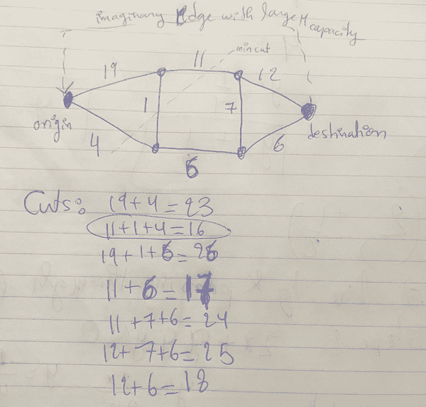
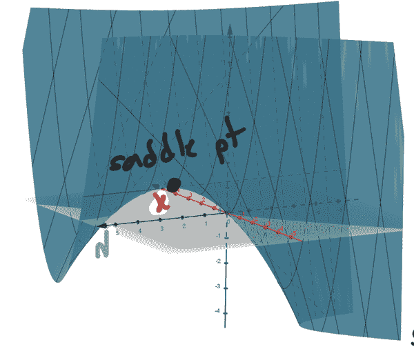

# 第十章 运筹学

> *许多科学家之所以伟大，不是因为他们解决问题的技能，而是因为他们选择问题的智慧*
> 
> E.布赖特·威尔逊（1908-1992），美国化学家

在本章中，我们探讨了将人工智能整合到运筹学领域中，利用两者的优势进行更高效和更明智的决策。尽管这个介绍性陈述听起来像是一则广告，但这正是运筹学的全部意义。机器学习的进步只能帮助推动该领域的发展。

运筹学是应用数学中最具吸引力和刺激性的领域之一。它是在最节约时间和成本的方式中平衡不同需求和可用资源的科学。运筹学中的许多问题都归结为寻找最佳点，即一切运行顺畅和高效的圣杯：没有备份，没有中断及时服务，没有浪费，平衡成本，对所有参与者都有良好的收入。许多应用永远找不到圣杯，但许多运筹学方法使我们能够至少接近，至少对于复杂现实的简化模型来说是如此。受限的数学优化渗透到每个行业、每个网络和我们生活的方方面面。做得正确，我们享受其好处；做得不当，我们承受其影响：全球和地方经济仍在经历 covid19、乌克兰战争以及对供应链的最终中断的后果。

在探讨机器学习如何开始进入运筹学之前，我们强调了一些有兴趣的人必须内化的想法，如果他们想参与这个领域。由于我们只有一个章节来探讨这个美妙的主题，我们必须将其提炼到其本质：

+   *没有免费午餐*定理：这使我们将注意力转向设计和分析最适合特定情况的方法，而不是寻找最通用和最广泛适用的方法，就像许多数学家天生倾向于做的那样。它基本上要求所有这些数学家基本上*放松*，并对特定类型问题的专业解决方案感到满意。

+   *问题的复杂性分析和算法的渐近分析*：*渐近分析*告诉我们，即使算法非常创新和高明，如果其计算需求随问题规模的增大而急剧增加，那么它就是无用的。运筹学解决方案需要适应具有许多变量的大型场景。另一方面，*复杂性分析*则处理问题本身的*难度级别*，而不是为解决它们而设计的算法。组合问题，即<math alttext="上标 O 左括号 n 阶乘 右括号"><mrow><mi>O</mi> <mo>(</mo> <mi>n</mi> <mo>!</mo> <mo>)</mo></mrow></math>，是极其糟糕的：<math alttext="n 阶乘"><mrow><mi>n</mi> <mo>!</mo></mrow></math>对于足够大的 n 来说比<math alttext="k 的 n 次方"><msup><mi>k</mi> <mi>n</mi></msup></math>要大，但指数<math alttext="k 的 n 次方"><msup><mi>k</mi> <mi>n</mi></msup></math>的复杂度已经非常糟糕！

+   *运筹学中的重要主题和应用*：这些内容可以在任何一本好的运筹学书籍中找到。我们总是需要随身携带一本。从特定应用和业务目标到数学公式的转化是必须强调的技能，以便在这个领域取得成功。

+   *各种类型的优化方法和算法*：这是运筹学解决方案和软件包的工作马。 

+   *软件包*：这些软件包的广泛可用性，以及有限的页面数量，是我不详细讨论本章中任何算法或计算内容的借口。

用六个词总结运筹学：*数学建模、优化、算法、软件和决策*。

阅读本章时，有助于将概念置于我们日常生活中与之互动的公司如何管理其运营的背景中。例如考虑亚马逊的物流。亚马逊是世界上最大的电子商务公司。2022 年，其在美国电子商务市场的份额为 45％，每天销售和交付数百万件商品，每秒约 5000 美元的销售额。他们是如何成功做到这一点的？他们如何管理他们的库存、仓库、运输和极其高效的交付系统？他们如何制定子问题，以及如何将它们整合成一个成功的大型运营？交通物流也是如此，比如 Uber：每天，Uber 在全球提供多达 1500 万次共享乘车服务，将可用司机与附近乘客匹配，安排和计时接送和送达，定价行程，预测司机收入、供需模式，并进行无数分析。

允许这些庞大系统相对顺利运行的复杂且高度相互关联的优化问题是运筹学的典型特征。此外，许多涉及的问题都是 NP 难题（在计算复杂性中，这意味着它们具有非确定性多项式时间级别的难度-用英语来说，*计算成本非常高*）。再加上它们的随机性质，我们有一些有趣的数学问题需要解决。

总的来说，运筹学的数学方法和算法每年为世界节省数十亿美元。对美国最大的 500 家公司进行的一项调查显示，其中 85％使用线性规划（这是线性优化的另一个名称，是运筹学的一个重要部分，也是我们在本章中花费一些时间讨论单纯形法和对偶性的原因）。现在结合 AI 行业的工具，是进入这个领域的绝佳时机。回报将在多个层面上体现：智力、财务和对人类共同利益的有意义贡献。因此，本章中选择的少数主题绝不应减弱该领域中其他同等重要主题的重要性。

深入研究运筹学（当然，在阅读本章之后），最好的方法是向最优秀的人学习：

+   浏览[弗兰兹·埃德尔曼高级分析、运筹学和管理科学成就奖](https://www.informs.org/Recognizing-Excellence/INFORMS-Prizes/Franz-Edelman-Award)的获奖和入围项目。

+   把《运筹学导论，希利尔和利伯曼，麦格劳希尔（2021）》放在心中。

# 没有免费午餐

*优化的无免费午餐定理*表明，没有一种特定的优化算法适用于每个问题。寻找目标函数（成本函数、损失函数、效用函数、似然函数）的优化器的所有算法在所有可能的目标函数上平均时具有类似的性能。因此，如果某个算法在某类目标函数上表现优于另一个算法，则在其他目标函数上，另一个算法表现更好。没有一种适用于所有问题类型的优越算法。因此，选择算法应该依赖于问题（或领域）。根据我们的应用领域，有大量关于从业者使用的算法、他们选择这些算法的理由、与其他算法在高维和合理维度问题上的比较以及他们不断努力实现更好性能的信息，这意味着两件事：更快（计算成本更低）和更准确。

# 复杂性分析和 O()符号

很多时候，*在各种约束条件下有效地分配有限资源*的问题归结为为*离散*优化设计高效算法。线性规划、整数规划、组合优化以及图结构（网络）上的优化，都是相互交织的（有时这些只是同一事物的两个不同名称），并且都涉及一个目标：从*离散且有限的有效选项集*中找到一个优化器，即*可行集*。如果初始的可行集不是离散的，有时我们可以将其减少为一个离散集，以便利用为该领域开发的丰富工具。这里的主要问题是：穷举��索通常是不可行的。这意味着如果我们列出可行集中的所有可用选项，并在每个选项上评估目标函数，我们将花费大量时间来找到给出最佳答案的点。没有人说有限的可行意味着它不是巨大的。我们需要专门的算法来有效地排除搜索空间的大片区域。一些算法可以精确定位某些问题的确切解决方案，而其他算法只能找到近似解决方案，我们别无选择，只能接受。

让我们现在提前做出以下区分，因为这会让很多人感到困惑：

+   **复杂性分析是为了我们想要解决的问题**（路由、旅行推销员、背包问题等）。问题的固有复杂性与用于解决它的算法无关。事实上，有时它告诉我们对于这种类型的问题，我们不能指望有更有效的算法，或者在其他情况下我们是否能做得更好。无论如何，对于问题的复杂性分析本身就是一个丰富的科学领域，运筹学领域提供了大量复杂问题供我们思考。这就是以下术语出现的地方：多项式问题、非确定性多项式问题、非确定性多项式完全问题、非确定性多项式时间困难问题、补充非确定性多项式问题以及补充非确定性多项式完全问题。上述术语非常令人困惑，有人需要认真重新考虑它们的命名。我们不会在这里定义每一个（主要是因为理论尚未确定这些问题类别之间的界限），但我们会做出以下划分：可以在多项式时间内或更短时间内解决的问题，以及我们无法在多项式时间内找到精确解决方案的问题，无论使用什么算法，这种情况下，我们必须接受近似算法（例如旅行推销员问题）。请注意，有时多项式时间问题可能并不是一件好事，因为例如 <math alttext="upper O left-parenthesis n squared 000 right-parenthesis"><mrow><mi>O</mi> <mo>(</mo> <msup><mi>n</mi> <mn>2</mn></msup> <mn>000</mn> <mo>)</mo></mrow></math> 终究不是那么快。

+   **渐近分析是为了我们设计的解决这些问题的算法**。这是我们试图估计算法所需操作次数并将其与问题规模相对比的地方。我们通常使用大 O 符号，意思是：

# 大 O()符号

当存在某个常数*c*，对于所有<math alttext="n greater-than-or-equal-to n 0"><mrow><mi>n</mi> <mo>≥</mo> <msub><mi>n</mi> <mn>0</mn></msub></mrow></math>，函数*g(n)*是*O(f(n))*时，<math alttext="g left-parenthesis n right-parenthesis less-than-or-equal-to c f left-parenthesis n right-parenthesis"><mrow><mi>g</mi> <mo>(</mo> <mi>n</mi> <mo>)</mo> <mo>≤</mo> <mi>c</mi> <mi>f</mi> <mo>(</mo> <mi>n</mi> <mo>)</mo></mrow></math>。

例如，*2n+1*是*O(n)*，<math alttext="5 n cubed minus 7 n squared plus 1"><mrow><mn>5</mn> <msup><mi>n</mi> <mn>3</mn></msup> <mo>-</mo> <mn>7</mn> <msup><mi>n</mi> <mn>2</mn></msup> <mo>+</mo> <mn>1</mn></mrow></math>是<math alttext="upper O left-parenthesis n cubed right-parenthesis"><mrow><mi>O</mi> <mo>(</mo> <msup><mi>n</mi> <mn>3</mn></msup> <mo>)</mo></mrow></math>，<math alttext="n squared 2 Superscript n minus 55 n Superscript 1 Baseline 00"><mrow><msup><mi>n</mi> <mn>2</mn></msup> <msup><mn>2</mn> <mi>n</mi></msup> <mo>-</mo> <mn>55</mn> <msup><mi>n</mi> <mn>1</mn></msup> <mn>00</mn></mrow></math>是<math alttext="upper O left-parenthesis n squared 2 Superscript n Baseline right-parenthesis"><mrow><mi>O</mi> <mo>(</mo> <msup><mi>n</mi> <mn>2</mn></msup> <msup><mn>2</mn> <mi>n</mi></msup> <mo>)</mo></mrow></math>，<math alttext="15 n l o g left-parenthesis n right-parenthesis minus 5 n"><mrow><mn>15</mn> <mi>n</mi> <mi>l</mi> <mi>o</mi> <mi>g</mi> <mo>(</mo> <mi>n</mi> <mo>)</mo> <mo>-</mo> <mn>5</mn> <mi>n</mi></mrow></math>是<math alttext="upper O left-parenthesis n l o g left-parenthesis n right-parenthesis right-parenthesis"><mrow><mi>O</mi> <mo>(</mo> <mi>n</mi> <mi>l</mi> <mi>o</mi> <mi>g</mi> <mo>(</mo> <mi>n</mi> <mo>)</mo> <mo>)</mo></mrow></math>。

不要忘记常数渐近情况*O(1)*，其中算法的操作计数与问题的大小无关（这是一个很棒的事情，因为这意味着它可以轻松地扩展到巨大的问题而不必担心）。

对于一些算法，我们可以计算出确切的操作次数，例如，为了计算长度为*n*的两个向量的标量积（点积），一个简单的算法需要精确地进行 2n-1 次乘法和加法，这使得它是*O(n)*。对于乘法两个大小为<math alttext="n times n"><mrow><mi>n</mi> <mo>×</mo> <mi>n</mi></mrow></math>的矩阵，一个简单的算法计算第一个矩阵的每一行与第二个矩阵的每一列的点积需要精确地<math alttext="left-parenthesis 2 n minus 1 right-parenthesis n squared"><mrow><mrow><mo>(</mo> <mn>2</mn> <mi>n</mi> <mo>-</mo> <mn>1</mn> <mo>)</mo></mrow> <msup><mi>n</mi> <mn>2</mn></msup></mrow></math>次操作，因此这将是<math alttext="upper O left-parenthesis n cubed right-parenthesis"><mrow><mi>O</mi> <mo>(</mo> <msup><mi>n</mi> <mn>3</mn></msup> <mo>)</mo></mrow></math>。矩阵求逆通常也是<math alttext="upper O left-parenthesis n cubed right-parenthesis"><mrow><mi>O</mi> <mo>(</mo> <msup><mi>n</mi> <mn>3</mn></msup> <mo>)</mo></mrow></math>。

对于对算法渐近分析感兴趣的人来说，很快就会意识到它比操作计数稍微复杂一些，因为有时我们必须对输入的大小进行估计或平均值（*n*代表什么？），如何计算算法中的操作（按代码的每一行？），我们不能忽视在大数字上进行计算比在小数字上进行操作更耗时和内存。最后，我们更喜欢运行时间为多项式时间或更少的算法，而不是指数时间或更多的算法。让我们用一个非常简单的例子来演示。

# 多项式算法<math alttext="upper O left-parenthesis n Superscript k Baseline right-parenthesis"><mrow><mi>O</mi> <mo>(</mo> <msup><mi>n</mi> <mi>k</mi></msup> <mo>)</mo></mrow></math>与指数算法<math alttext="upper O left-parenthesis k Superscript n Baseline right-parenthesis"><mrow><mi>O</mi> <mo>(</mo> <msup><mi>k</mi> <mi>n</mi></msup> <mo>)</mo></mrow></math>。

假设我们正在使用一台每秒能执行<math alttext="10 Superscript 7"><msup><mn>10</mn> <mn>7</mn></msup></math>次操作（1000 万）的机器。让我们在两种不同的算法上运行它 1000 秒，大约相当于 16 分钟，一个是问题规模指数级增长的算法，比如<math alttext="upper O left-parenthesis 2 Superscript n Baseline right-parenthesis"><mrow><mi>O</mi> <mo>(</mo> <msup><mn>2</mn> <mi>n</mi></msup> <mo>)</mo></mrow></math>，另一个是多项式<math alttext="upper O left-parenthesis n cubed right-parenthesis"><mrow><mi>O</mi> <mo>(</mo> <msup><mi>n</mi> <mn>3</mn></msup> <mo>)</mo></mrow></math>。在这种情况下，问题的规模是*n*，指的是输入的维度，例如图的节点数、矩阵的条目数、数据集的特征数或实例数。每种算法在这台机器上运行 16 分钟最大能处理多大规模的问题？

对于指数时间算法，它所需的操作次数最多（最坏情况）为<math alttext="c 2 Superscript n Baseline equals 10 Superscript 7 Baseline asterisk 1000"><mrow><mi>c</mi> <msup><mn>2</mn> <mi>n</mi></msup> <mo>=</mo> <msup><mn>10</mn> <mn>7</mn></msup> <mo>*</mo> <mn>1000</mn></mrow></math>，其中*c*最好是一个较小的值。因此，它可以在每秒 1000 万次操作的情况下运行 1000 秒的问题规模为<math alttext="n equals 10 log Subscript 2 Baseline left-parenthesis 10 right-parenthesis minus log Subscript 2 Baseline left-parenthesis c right-parenthesis almost-equals 33"><mrow><mi>n</mi> <mo>=</mo> <mn>10</mn> <msub><mo form="prefix">log</mo> <mn>2</mn></msub> <mrow><mo>(</mo> <mn>10</mn> <mo>)</mo></mrow> <mo>-</mo> <msub><mo form="prefix">log</mo> <mn>2</mn></msub> <mrow><mo>(</mo> <mi>c</mi> <mo>)</mo></mrow> <mo>≈</mo> <mn>33</mn></mrow></math>。

现在将这与多项式时间算法进行对比，其最坏情况是<math alttext="c n cubed equals 10 Superscript 7 Baseline asterisk 1000"><mrow><mi>c</mi> <msup><mi>n</mi> <mn>3</mn></msup> <mo>=</mo> <msup><mn>10</mn> <mn>7</mn></msup> <mo>*</mo> <mn>1000</mn></mrow></math>，因此<math alttext="n equals StartFraction 1 Over cubed StartRoot c EndRoot EndFraction cubed StartRoot 10 Superscript 10 Baseline EndRoot almost-equals 2100"><mrow><mi>n</mi> <mo>=</mo> <msup><mfrac><mn>1</mn> <mrow><msup><mn>3</mn></msup> <msqrt><mi>c</mi></msqrt></mrow></mfrac> <mn>3</mn></msup> <msqrt><msup><mn>10</mn> <mn>10</mn></msup></msqrt> <mo>≈</mo> <mn>2100</mn></mrow></math>。这几乎比指数时间算法大两个数量级。

结论是，在相同的硬件和时间条件下，多项式时间算法<math alttext="upper O left-parenthesis n Superscript k Baseline right-parenthesis"><mrow><mi>O</mi> <mo>(</mo> <msup><mi>n</mi> <mi>k</mi></msup> <mo>)</mo></mrow></math>可以解决比指数时间算法<math alttext="upper O left-parenthesis k Superscript n Baseline right-parenthesis"><mrow><mi>O</mi> <mo>(</mo> <msup><mi>k</mi> <mi>n</mi></msup> <mo>)</mo></mrow></math>更大的问题。组合时间算法<math alttext="upper O left-parenthesis n factorial right-parenthesis"><mrow><mi>O</mi> <mo>(</mo> <mi>n</mi> <mo>!</mo> <mo>)</mo></mrow></math>是无望的。此外，我们*总是*希望*k*越小越好。

一个习惯于在*精确*领域而不是*近似*或*渐近*领域操作的人可能会对上面的讨论感到困扰，因为有时，一些高阶算法对于较小规模的问题比低阶算法更好。例如：假设一个*O(n)*算法的精确操作次数为 20n-99，而一个<math alttext="上 O 左括号 n 平方右括号"><mrow><mi>O</mi> <mo>(</mo> <msup><mi>n</mi> <mn>2</mn></msup> <mo>)</mo></mrow></math>算法的操作次数为<math alttext="n 平方加 1"><mrow><msup><mi>n</mi> <mn>2</mn></msup> <mo>+</mo> <mn>1</mn></mrow></math>，那么从渐近的角度来看（或者对于足够大的*n*），*O(n)*算法比<math alttext="上 O 左括号 n 平方右括号"><mrow><mi>O</mi> <mo>(</mo> <msup><mi>n</mi> <mn>2</mn></msup> <mo>)</mo></mrow></math>算法更好，但如果*n*小于 10，则情况并非如此，因为在这种情况下，<math alttext="n 平方加 1 小于 20n 减 99"><mrow><msup><mi>n</mi> <mn>2</mn></msup> <mo>+</mo> <mn>1</mn> <mo><</mo> <mn>20</mn> <mi>n</mi> <mo>-</mo> <mn>99</mn></mrow></math>。这对于足够小的问题是可以接受的，但对于更大的问题则不行。

我们很快将在本章中提到的两种优化方法是单纯形法和内点法，用于线性优化（目标函数和约束均为线性的优化）。内点法是多项式时间算法，而单纯形法是指数时间，因此你可能会期望每个人都使用更便宜的内点法并放弃单纯形法，但事实并非如此。单纯形法（以及对偶单纯形法）仍然广泛用于线性优化，而不是内点法，因为指数时间是最坏情况，而大多数应用并非最坏情况。此外，算法之间通常存在计算量每次迭代、所需迭代次数、更好起始点的影响、算法是否收敛或是否需要在最后阶段*额外帮助*、这种额外帮助需要多少计算以及算法是否能利用并行处理等方面的权衡。因此，用于线性优化的计算机软件包具有单纯形法和内点法的高效实现（以及许多其他算法）。最终，我们选择最适合我们用例的方法。

# 优化：运筹学的核心

我们又回到了优化。在机器学习中，优化是关于最小化模型的损失函数，学习确定性函数或最大化学习概率分布的模型的似然函数。我们不希望得到完全匹配数据的解决方案，因为这样无法很好地泛化到未见数据。因此，正则化方法、提前停止等。在机器学习中，我们利用可用数据来学习模型：数据的来源（数据生成规则或过程）的确定性函数或概率分布，然后我们使用这个学习到的函数或分布进行推断。优化只是其中的一步：最小化损失函数，有���没有正则化项。出现在机器学习中的损失函数通常是可微的和非线性的，优化是无约束的。我们可以添加约束来*引导*过程进入某个期望的领域，具体取决于应用。

优化方法可以包括计算目标函数的导数 <math alttext="f left-parenthesis ModifyingAbove x With right-arrow right-parenthesis"><mrow><mi>f</mi> <mo>(</mo> <mover accent="true"><mi>x</mi> <mo>→</mo></mover> <mo>)</mo></mrow></math> ，例如机器学习中喜欢的梯度下降（随机梯度下降、ADAM 等），也可以不包括。有些优化算法是无导数的：当目标函数不可微（如具有角点的函数）或目标函数的公式甚至不可用时，这些方法非常有用。无导数优化方法的示例包括贝叶斯搜索、布谷鸟搜索和遗传算法。

优化，*特别是线性优化*，自二战以来一直是运筹研究的核心，当时为了协助军事后勤和作战而开发了线性优化方法，如*单纯形法*。目标始终是在给定一定约束条件（预算、截止日期、容量等）的情况下，最小化目标函数（成本、距离、时间等）：

<math alttext="dollar-sign m i n Subscript c o n s t r a i n t s Baseline f left-parenthesis ModifyingAbove x With right-arrow right-parenthesis dollar-sign"><mrow><mi>m</mi> <mi>i</mi> <msub><mi>n</mi> <mrow><mi>c</mi><mi>o</mi><mi>n</mi><mi>s</mi><mi>t</mi><mi>r</mi><mi>a</mi><mi>i</mi><mi>n</mi><mi>t</mi><mi>s</mi></mrow></msub> <mi>f</mi> <mrow><mo>(</mo> <mover accent="true"><mi>x</mi> <mo>→</mo></mover> <mo>)</mo></mrow></mrow></math>

学习运筹优化，一个典型的课程通常会花费大量时间在线性优化、整数优化和网络优化上，因为许多现实生活中的物流和资源分配问题完全符合这些表述。要成为成功的运筹研究者，我们需要学习：

+   **线性优化**，其中目标函数和约束条件均为线性：在这里，我们学习了单纯形法、对偶性、[拉格朗日松弛](http://www.mi.fu-berlin.de/wiki/pub/Main/GunnarKlauP1winter0708/discMath_klau_script_lag_I.pdf)和灵敏度分析。在线性问题中，我们的世界边界是平坦的，由线、平面和超平面构成。这个（超）多边形几何，或*多面体*，通常有角点作为优化器的候选者，因此我们设计系统化的方法来筛选这些点并测试它们是否最优（这就是单纯形法和对偶单纯形法所做的）。

+   **内点法**：用于大规模线性优化问题，可能超出单纯形法的范围。简而言之，单纯形法沿着可行搜索空间的*边界*（多面体的边缘）前进，检查到达的每个角落是否最优，然后移动到边界上的另一个角落。另一方面，内点法穿过可行搜索空间的*内部*，从内部到达最优角落，而不是从边界到达。

+   **整数规划**：优化中，优化向量的条目必须全部为整数。有时它们只能是零或一（将卡车送往俄亥俄州的仓库或不送）。[背包问题](https://en.wikipedia.org/wiki/Knapsack_problem)是一个非常简单的原型示例。在这里，我们学习了用于大整数规划问题的分支定界方法。

+   **网络优化**：我们可以将许多网络问题重新表述为线性优化问题，其中单纯形法及其专门版本可以工作，但更好的方法是利用网络结构，并从图论中获取有用的结果，例如最大流最小割定理，以获得更高效的算法。许多网络问题归结为以下之一的优化：网络上的最短路径（从一个节点到另一个节点的最小距离或最小成本路径）、网络的最小生成树（这对于优化网络的*设计*非常有用）、最大流（从起点到终点或从源到汇的流）、最小成本流；多商品流；或旅行推销员问题：找到通过网络所有节点仅一次的最小成本（或距离或权重）循环路线（哈密顿回路）。

+   **非线性优化**：目标函数和/或约束是非线性的：本书中一个经常出现的例子是为机器学习模型最小化非线性损失函数。这些函数总是非线性的，我们通常使用梯度下降类型的算法。对于较小的问题，我们可以使用牛顿类型的算法（二阶导数）。在运筹学中，目标函数和/或约束中的非线性可能出现，因为从一个地点运输货物到另一个地点的成本可能不是固定的（例如取决于距离或数量），或者网络中的流量可能包括损失或增益。我们了解很多的一种特殊类型的非线性优化是带有线性约束的*二次*优化。这在应用中出现，比如电路网络方程和弹性理论中，我们考虑结构中的位移、应力、应变和力的平衡。想想找到二次函数的最小值有多容易，其中 *s* 是一个正常数。这种简便性很好地转化到更高维度，其中我们的目标函数看起来像 <math alttext="f left-parenthesis ModifyingAbove x With right-arrow right-parenthesis equals ModifyingAbove x With right-arrow Superscript t Baseline upper S ModifyingAbove x With right-arrow"><mrow><mi>f</mi> <mrow><mo>(</mo> <mover accent="true"><mi>x</mi> <mo>→</mo></mover> <mo>)</mo></mrow> <mo>=</mo> <msup><mover accent="true"><mi>x</mi> <mo>→</mo></mover> <mi>t</mi></msup> <mi>S</mi> <mover accent="true"><mi>x</mi> <mo>→</mo></mover></mrow></math> 其中 *S* 是一个正半定矩阵，在高维度中扮演着与一维中正常数相同的角色。在这里，我们甚至有对偶理论可以利用，类似于线性优化的情况。在优化中，当我们失去线性性时，我们希望我们的函数是二次的，我们的约束是线性的。当我们失去这一点时，我们希望我们的函数和/或可行集是凸的。当我们失去凸性时，我们就只能靠自己了，希望我们的方法不会陷入高维度景观的局部最小值，并以某种方式找到最优解。

+   **动态规划和马尔可夫决策过程**：动态规划涉及到具有多个阶段的项目，每个阶段都需要做出决策，每个决策都会产生一些即时成本。每个阶段的决策与当前状态有关，以及一个策略来过渡到下一个状态（通过最小化确定性函数或概率选择下一个状态）。动态规划的核心是设计高效的方法，通常是递归方法，以找到*一系列相关决策的最佳顺序*以实现某个目标。这个想法是避免为决策过程的每个阶段列出所有选项，然后选择最佳的决策组合。对于具有许多决策阶段且每个阶段具有许多状态的问题，这种详尽搜索是非常昂贵的。现在，如果从一个阶段到另一个阶段的过渡策略是概率性的而不是确定性的，并且如果决策过程的阶段继续无限地重复，也就是说，如果项目具有无限数量的阶段，那么我们手头就有一个马尔可夫决策过程（或马尔可夫链）。这是一个以概率方式随时间演变的过程。马尔可夫决策过程的一个非常特殊的属性是，涉及到过程如何在未来演变的概率与过去事件无关，仅取决于系统的*当前状态*。离散时间和连续时间马尔可夫链模拟重要系统，例如[排队系统](https://www.sciencedirect.com/topics/computer-science/queueing-system)，动态交通灯控制以最小化汽车等待时间，以及灵活的呼叫中心人员配备。重要的数学对象是过渡矩阵，人们解出稳态概率。他们最终不得不计算过渡矩阵的特征空间。

+   **随机算法**：具有��率性过渡策略和马尔可夫链的动态规划都是随机算法的例子。随机梯度下降和图上的随机游走也是。任何涉及随机元素的算法都是随机的。数学转向概率、期望、稳态状态、收敛等语言。另一个出现随机算法和过程分析的例子是*排队论*，例如医院急诊室或船舶维修场的队列。这建立在顾客到达时间和服务设施的服务时间的概率分布之上。

+   **元启发式**：对于许多优化问题，找到最优解可能是不切实际的，因此人们（仍然需要做出决策）求助于*启发式方法*，这些方法找到一个*答案*（我不会称之为解决方案），这个答案不一定是最优的，但对于手头的问题足够好。元启发式是提供策略指导和通用框架的一般解决方法，用于开发适合某些问题族的启发式方法。我们无法保证从启发式方法得到的答案的最优性，但启发式方法加速了找到令人满意的解决方案的过程，其中最优解太昂贵或完全无法计算。还有*可满足性*的话题：由于运筹学中的问题几乎总是受限的，自然的问题是：约束是否可满足？意味着可行集是否非空？一些运筹学问题被重新制定为可满足性问题。

在现实世界的问题中，运筹学部门的工作的一大部分是以一种适合上述优化框架之一的方式制定他们的具体用例和目标。在这里，重要的是要认识到特殊结构（例如涉及矩阵的稀疏性）或者我们可以利用更高效算法的子结构。这对于复杂和大规模系统至关重要。

# 思考优化

当我们在数学中遇到一个优化问题时，

<math alttext="dollar-sign min Underscript ModifyingAbove x With right-arrow element-of some feasible set Endscripts f left-parenthesis ModifyingAbove x With right-arrow right-parenthesis comma dollar-sign"><mrow><msub><mo form="prefix" movablelimits="true">min</mo> <mrow><mover accent="true"><mi>x</mi> <mo>→</mo></mover><mo>∈</mo><mtext>some</mtext><mtext>feasible</mtext><mtext>set</mtext></mrow></msub> <mi>f</mi> <mrow><mo>(</mo> <mover accent="true"><mi>x</mi> <mo>→</mo></mover> <mo>)</mo></mrow> <mo>,</mo></mrow></math>

在可行集由向量<math alttext="ModifyingAbove x With right-arrow"><mover accent="true"><mi>x</mi> <mo>→</mo></mover></math>必须满足的一些约束定义的情况下（或者它可能完全没有约束），我们通常会停下来进行头脑风暴：

+   <math alttext="f left-parenthesis ModifyingAbove x With right-arrow right-parenthesis"><mrow><mi>f</mi> <mo>(</mo> <mover accent="true"><mi>x</mi> <mo>→</mo></mover> <mo>)</mo></mrow></math> 是线性的吗？

+   <math alttext="f left-parenthesis ModifyingAbove x With right-arrow right-parenthesis"><mrow><mi>f</mi> <mo>(</mo> <mover accent="true"><mi>x</mi> <mo>→</mo></mover> <mo>)</mo></mrow></math>是凸的吗？下界有界吗？

+   最小值是有限的，还是<math alttext="negative normal infinity"><mrow><mo>→</mo> <mo>-</mo> <mi>∞</mi></mrow></math>？

+   可行集非空吗？意味着是否有<math alttext="ModifyingAbove x With right-arrow"><mover accent="true"><mi>x</mi> <mo>→</mo></mover></math>实际满足约束？

+   可行集是凸的吗？

+   是否存在最小化器？

+   最小化器是唯一的，还是还有其他的？

+   我们如何找到最小化器？

+   最小值是多少？

+   如果我们的约束或目标函数发生变化，最小化器和最小值会发生多大变化？

根据手头问题的类型，我们可能能够独立回答上述问题，有时候我们只能回答其中一些而不能回答其他问题。这没关系，因为有关优化器和最优值的任何信息都是有价值的。

让我们探讨常见类型的优化问题：

## 优化-有限维-无约束

这类似于我们在微积分课程中进行的优化，以及我们在训练机器学习模型时进行的优化，即最小化损失函数。目标函数<math alttext="f left-parenthesis ModifyingAbove x With right-arrow right-parenthesis"><mrow><mi>f</mi> <mo>(</mo> <mover accent="true"><mi>x</mi> <mo>→</mo></mover> <mo>)</mo></mrow></math> 是可微的：

<math alttext="dollar-sign min Underscript ModifyingAbove x With right-arrow element-of double-struck upper R Superscript d Baseline Endscripts f left-parenthesis ModifyingAbove x With right-arrow right-parenthesis period dollar-sign"><mrow><msub><mo form="prefix" movablelimits="true">min</mo> <mrow><mover accent="true"><mi>x</mi> <mo>→</mo></mover><mo>∈</mo><msup><mi>ℝ</mi> <mi>d</mi></msup></mrow></msub> <mi>f</mi> <mrow><mo>(</mo> <mover accent="true"><mi>x</mi> <mo>→</mo></mover> <mo>)</mo></mrow> <mo>.</mo></mrow></math>

在无约束和可微的优化中，最小化器<math alttext="ModifyingAbove x With right-arrow Superscript asterisk"><msup><mover accent="true"><mi>x</mi> <mo>→</mo></mover> <mo>*</mo></msup></math> 满足<math alttext="normal nabla f left-parenthesis ModifyingAbove x With right-arrow right-parenthesis equals 0"><mrow><mi>∇</mi> <mi>f</mi> <mo>(</mo> <mover accent="true"><mi>x</mi> <mo>→</mo></mover> <mo>)</mo> <mo>=</mo> <mn>0</mn></mrow></math>。此外，在<math alttext="ModifyingAbove x With right-arrow Superscript asterisk"><msup><mover accent="true"><mi>x</mi> <mo>→</mo></mover> <mo>*</mo></msup></math>处，Hessian（二阶导数矩阵）是半正定的。在讨论机器学习的优化时，我们选择了随机梯度下降及其变体来解决非常高维的问题。对于较小的问题，牛顿类型（使用二阶导数而不仅仅是一阶导数）的方法也有效。对于很少的问题，比如线性回归的均方误差损失函数，我们可以得到解析解。通常可以得到解析解的示例通常是精心构造的（例如我们微积分书中的所有示例），并且维度非常低。

## 优化-有限维-约束-拉格朗日乘数

让我们考虑只有一个约束<math alttext="g left-parenthesis ModifyingAbove x With right-arrow right-parenthesis equals b"><mrow><mi>g</mi> <mo>(</mo> <mover accent="true"><mi>x</mi> <mo>→</mo></mover> <mo>)</mo> <mo>=</mo> <mi>b</mi></mrow></math>的情况。这相当好地解释了我们需要什么。最小化问题看起来像：

<math alttext="dollar-sign min Underscript StartLayout 1st Row 1st Column Blank 2nd Column g left-parenthesis ModifyingAbove x With right-arrow right-parenthesis equals b 2nd Row 1st Column Blank 2nd Column x element-of double-struck upper R Superscript d Baseline EndLayout Endscripts f left-parenthesis ModifyingAbove x With right-arrow right-parenthesis period dollar-sign"><mrow><msub><mo form="prefix" movablelimits="true">min</mo> <mtable displaystyle="true"><mtr><mtd columnalign="left"><mrow><mi>g</mi><mo>(</mo><mover accent="true"><mi>x</mi> <mo>→</mo></mover><mo>)</mo><mo>=</mo><mi>b</mi></mrow></mtd></mtr><mtr><mtd columnalign="left"><mrow><mi>x</mi><mo>∈</mo><msup><mi>ℝ</mi> <mi>d</mi></msup></mrow></mtd></mtr></mtable></msub> <mi>f</mi> <mrow><mo>(</mo> <mover accent="true"><mi>x</mi> <mo>→</mo></mover> <mo>)</mo></mrow> <mo>.</mo></mrow></math>

如果<math alttext="f left-parenthesis ModifyingAbove x With right-arrow right-parenthesis"><mrow><mi>f</mi> <mo>(</mo> <mover accent="true"><mi>x</mi> <mo>→</mo></mover> <mo>)</mo></mrow></math>和<math alttext="g left-parenthesis ModifyingAbove x With right-arrow right-parenthesis"><mrow><mi>g</mi> <mo>(</mo> <mover accent="true"><mi>x</mi> <mo>→</mo></mover> <mo>)</mo></mrow></math>是从<math alttext="double-struck upper R Superscript d Baseline right-arrow double-struck upper R"><mrow><msup><mi>ℝ</mi> <mi>d</mi></msup> <mo>→</mo> <mi>ℝ</mi></mrow></math>的可微函数，我们可以引入拉格朗日乘子（一种来自 1797 年的方法）将我们的问题转化为一个*无约束*问题，但在更高的维度（对应于我们引入到优化问题中的新拉格朗日乘子）。没有免费的午餐。在这种情况下，我们将约束的倍数添加到目标函数中，然后最小化，这意味着寻找梯度为零的点。无约束问题的新目标函数称为拉格朗日函数，它是决策向量<math alttext="ModifyingAbove x With right-arrow"><mover accent="true"><mi>x</mi> <mo>→</mo></mover></math>和我们乘以约束的新变量<math alttext="lamda"><mi>λ</mi></math>的函数，称为*拉格朗日乘子*：

<math alttext="dollar-sign script upper L left-parenthesis ModifyingAbove x With right-arrow semicolon lamda right-parenthesis equals f left-parenthesis ModifyingAbove x With right-arrow right-parenthesis plus lamda left-parenthesis b minus g left-parenthesis ModifyingAbove x With right-arrow right-parenthesis right-parenthesis period dollar-sign"><mrow><mi>ℒ</mi> <mrow><mo>(</mo> <mover accent="true"><mi>x</mi> <mo>→</mo></mover> <mo>;</mo> <mi>λ</mi> <mo>)</mo></mrow> <mo>=</mo> <mi>f</mi> <mrow><mo>(</mo> <mover accent="true"><mi>x</mi> <mo>→</mo></mover> <mo>)</mo></mrow> <mo>+</mo> <mi>λ</mi> <mrow><mo>(</mo> <mi>b</mi> <mo>-</mo> <mi>g</mi> <mrow><mo>(</mo> <mover accent="true"><mi>x</mi> <mo>→</mo></mover> <mo>)</mo></mrow> <mo>)</mo></mrow> <mo>.</mo></mrow></math>

如果我们有多于一个约束条件，比如五个约束条件，那么我们为每个约束引入一个拉格朗日乘子，最终在我们的优化问题中添加五个额外的维度，以将其从受限制的状态移动到无约束状态。

无约束问题的优化器<math alttext="left-parenthesis ModifyingAbove x With right-arrow Superscript asterisk Baseline comma lamda Superscript asterisk Baseline right-parenthesis"><mrow><mo>(</mo> <msup><mover accent="true"><mi>x</mi> <mo>→</mo></mover> <mo>*</mo></msup> <mo>,</mo> <msup><mi>λ</mi> <mo>*</mo></msup> <mo>)</mo></mrow></math>必须满足：<math alttext="normal nabla script upper L left-parenthesis ModifyingAbove x With right-arrow semicolon lamda right-parenthesis equals 0"><mrow><mi>∇</mi> <mi>ℒ</mi> <mo>(</mo> <mover accent="true"><mi>x</mi> <mo>→</mo></mover> <mo>;</mo> <mi>λ</mi> <mo>)</mo> <mo>=</mo> <mn>0</mn></mrow></math>。我们寻找它的方式与我们处理一般无约束问题的方式相同（参见前面的情况）。从<math alttext="left-parenthesis ModifyingAbove x With right-arrow Superscript asterisk Baseline comma lamda Superscript asterisk Baseline right-parenthesis"><mrow><mo>(</mo> <msup><mover accent="true"><mi>x</mi> <mo>→</mo></mover> <mo>*</mo></msup> <mo>,</mo> <msup><mi>λ</mi> <mo>*</mo></msup> <mo>)</mo></mrow></math>中的<math alttext="ModifyingAbove x With right-arrow Superscript asterisk"><msup><mover accent="true"><mi>x</mi> <mo>→</mo></mover> <mo>*</mo></msup></math> *是我们最初寻找的受限制问题的解*。这意味着它是由约束<math alttext="g left-parenthesis ModifyingAbove x With right-arrow Superscript asterisk Baseline right-parenthesis equals b"><mrow><mi>g</mi> <mo>(</mo> <msup><mover accent="true"><mi>x</mi> <mo>→</mo></mover> <mo>*</mo></msup> <mo>)</mo> <mo>=</mo> <mi>b</mi></mrow></math>定义的超曲面上的点，其中*f*的值最小。

如果问题具有我们可以利用的特殊结构，比如*f*是二次的，约束*g*是线性的，或者*f*和*g*都是线性的，那么我们有更方便的方法来进行这种受限优化，无论我们决定使用拉格朗日乘子（引入对偶）还是不使用拉格朗日乘子。幸运的是，具有简单结构的优化问题已经被广泛研究，不仅因为它们使数学和计算更容易，而且因为它们在科学和现实生活应用中经常出现，这证实了我的理论，即自然比数学家认为的要简单。我们将在对偶部分重新讨论受限问题的拉格朗日乘子，在那里我们专注于完全线性问题或具有线性约束的二次问题。

我们应该永久地记住的好事是，拉格朗日乘子λ不是一种毫无价值的辅助标量，它帮助我们将一个受限问题转变为一个无约束问题。它具有非常有用的含义，对于灵敏度分析、金融和运营研究应用以及对偶理论都非常有帮助（它们彼此相关）。从数学上讲，通过观察拉格朗日函数的公式，λ是拉格朗日函数作为*b*的函数的变化率，如果我们被允许改变*b*（约束的值；在应用中，我们关心推动或放松约束的影响）。也就是说：

<math alttext="dollar-sign StartFraction normal partial-differential script upper L left-parenthesis left-parenthesis ModifyingAbove x With right-arrow semicolon lamda comma b right-parenthesis right-parenthesis Over normal partial-differential b EndFraction equals StartFraction normal partial-differential f left-parenthesis ModifyingAbove x With right-arrow right-parenthesis plus lamda left-parenthesis b minus g left-parenthesis ModifyingAbove x With right-arrow right-parenthesis right-parenthesis Over normal partial-differential b EndFraction equals StartFraction normal partial-differential f left-parenthesis ModifyingAbove x With right-arrow right-parenthesis Over normal partial-differential b EndFraction plus StartFraction lamda left-parenthesis b minus g left-parenthesis ModifyingAbove x With right-arrow right-parenthesis right-parenthesis Over normal partial-differential b EndFraction equals 0 plus lamda equals lamda period dollar-sign"><mrow><mfrac><mrow><mi>∂</mi><mi>ℒ</mi><mo>(</mo><mrow><mo>(</mo><mover accent="true"><mi>x</mi> <mo>→</mo></mover><mo>;</mo><mi>λ</mi><mo>,</mo><mi>b</mi><mo>)</mo></mrow><mo>)</mo></mrow> <mrow><mi>∂</mi><mi>b</mi></mrow></mfrac> <mo>=</mo> <mfrac><mrow><mi>∂</mi><mi>f</mi><mrow><mo>(</mo><mover accent="true"><mi>x</mi> <mo>→</mo></mover><mo>)</mo></mrow><mo>+</mo><mi>λ</mi><mrow><mo>(</mo><mi>b</mi><mo>-</mo><mi>g</mi><mrow><mo>(</mo><mover accent="true"><mi>x</mi> <mo>→</mo></mover><mo>)</mo></mrow><mo>)</mo></mrow></mrow> <mrow><mi>∂</mi><mi>b</mi></mrow></mfrac> <mo>=</mo> <mfrac><mrow><mi>∂</mi><mi>f</mi><mo>(</mo><mover accent="true"><mi>x</mi> <mo>→</mo></mover><mo>)</mo></mrow> <mrow><mi>∂</mi><mi>b</mi></mrow></mfrac> <mo>+</mo> <mfrac><mrow><mi>λ</mi><mo>(</mo><mi>b</mi><mo>-</mo><mi>g</mi><mrow><mo>(</mo><mover accent="true"><mi>x</mi> <mo>→</mo></mover><mo>)</mo></mrow><mo>)</mo></mrow> <mrow><mi>∂</mi><mi>b</mi></mrow></mfrac> <mo>=</mo> <mn>0</mn> <mo>+</mo> <mi>λ</mi> <mo>=</mo> <mi>λ</mi> <mo>.</mo></mrow></math>

此外，我们可以将对应于最优化器的最优值λ*解释为*b*对目标函数 f 的最优可达值的边际效应。因此，如果λ* = 2.1，则将*b*增加一单位（将约束推动一单位）将使*f*的最优值增加 2.1 单位。这对金融和运营研究中的应用非常有价值。让我们看看为什么会这样。我们想要证明：

<math alttext="dollar-sign StartFraction d f left-parenthesis ModifyingAbove x With right-arrow Superscript asterisk Baseline left-parenthesis b right-parenthesis right-parenthesis Over d b EndFraction equals lamda Superscript asterisk Baseline period dollar-sign"><mrow><mfrac><mrow><mi>d</mi><mi>f</mi><mo>(</mo><msup><mover accent="true"><mi>x</mi> <mo>→</mo></mover> <mo>*</mo></msup> <mrow><mo>(</mo><mi>b</mi><mo>)</mo></mrow><mo>)</mo></mrow> <mrow><mi>d</mi><mi>b</mi></mrow></mfrac> <mo>=</mo> <msup><mi>λ</mi> <mo>*</mo></msup> <mo>.</mo></mrow></math>

请注意，在优化器<math alttext="ModifyingAbove x With right-arrow Superscript asterisk Baseline left-parenthesis b right-parenthesis"><mrow><msup><mover accent="true"><mi>x</mi> <mo>→</mo></mover> <mo>*</mo></msup> <mrow><mo>(</mo> <mi>b</mi> <mo>)</mo></mrow></mrow></math>处发生两件事，当我们将拉格朗日函数的梯度设为零时，我们得到： <math alttext="normal nabla f left-parenthesis ModifyingAbove x With right-arrow Superscript asterisk Baseline left-parenthesis b right-parenthesis right-parenthesis equals lamda Superscript asterisk Baseline normal nabla g left-parenthesis ModifyingAbove x With right-arrow Superscript asterisk Baseline left-parenthesis b right-parenthesis right-parenthesis"><mrow><mi>∇</mi> <mi>f</mi> <mrow><mo>(</mo> <msup><mover accent="true"><mi>x</mi> <mo>→</mo></mover> <mo>*</mo></msup> <mrow><mo>(</mo> <mi>b</mi> <mo>)</mo></mrow> <mo>)</mo></mrow> <mo>=</mo> <msup><mi>λ</mi> <mo>*</mo></msup> <mi>∇</mi> <mi>g</mi> <mrow><mo>(</mo> <msup><mover accent="true"><mi>x</mi> <mo>→</mo></mover> <mo>*</mo></msup> <mrow><mo>(</mo> <mi>b</mi> <mo>)</mo></mrow> <mo>)</mo></mrow></mrow></math>，和<math alttext="g left-parenthesis ModifyingAbove x With right-arrow Superscript asterisk Baseline left-parenthesis b right-parenthesis right-parenthesis equals b"><mrow><mi>g</mi> <mo>(</mo> <msup><mover accent="true"><mi>x</mi> <mo>→</mo></mover> <mo>*</mo></msup> <mrow><mo>(</mo> <mi>b</mi> <mo>)</mo></mrow> <mo>)</mo> <mo>=</mo> <mi>b</mi></mrow></math>。利用这些信息和导数的链式法则（回到您的微积分书中，掌握链式法则，我们经常使用它），我们现在有：

<math alttext="dollar-sign StartFraction d f left-parenthesis ModifyingAbove x With right-arrow Superscript asterisk Baseline left-parenthesis b right-parenthesis right-parenthesis Over d b EndFraction equals normal nabla f left-parenthesis ModifyingAbove x With right-arrow Superscript asterisk Baseline left-parenthesis b right-parenthesis right-parenthesis period StartFraction d ModifyingAbove x With right-arrow Superscript asterisk Baseline left-parenthesis b right-parenthesis Over d b EndFraction equals lamda Superscript asterisk Baseline normal nabla g left-parenthesis ModifyingAbove x With right-arrow Superscript asterisk Baseline left-parenthesis b right-parenthesis right-parenthesis StartFraction d ModifyingAbove x With right-arrow Superscript asterisk Baseline left-parenthesis b right-parenthesis Over d b EndFraction equals lamda Superscript asterisk Baseline StartFraction d g left-parenthesis ModifyingAbove x With right-arrow Superscript asterisk Baseline left-parenthesis b right-parenthesis right-parenthesis Over d b EndFraction equals lamda Superscript asterisk Baseline StartFraction d b Over d b EndFraction equals lamda Superscript asterisk Baseline times 1 equals lamda Superscript asterisk Baseline period dollar-sign"><mrow><mfrac><mrow><mi>d</mi><mi>f</mi><mo>(</mo><msup><mover accent="true"><mi>x</mi> <mo>→</mo></mover> <mo>*</mo></msup> <mrow><mo>(</mo><mi>b</mi><mo>)</mo></mrow><mo>)</mo></mrow> <mrow><mi>d</mi><mi>b</mi></mrow></mfrac> <mo>=</mo> <mi>∇</mi> <mi>f</mi> <mrow><mo>(</mo> <msup><mover accent="true"><mi>x</mi> <mo>→</mo></mover> <mo>*</mo></msup> <mrow><mo>(</mo> <mi>b</mi> <mo>)</mo></mrow> <mo>)</mo></mrow> <mo>.</mo> <mfrac><mrow><mi>d</mi><msup><mover accent="true"><mi>x</mi> <mo>→</mo></mover> <mo>*</mo></msup> <mrow><mo>(</mo><mi>b</mi><mo>)</mo></mrow></mrow> <mrow><mi>d</mi><mi>b</mi></mrow></mfrac> <mo>=</mo> <msup><mi>λ</mi> <mo>*</mo></msup> <mi>∇</mi> <mi>g</mi> <mrow><mo>(</mo> <msup><mover accent="true"><mi>x</mi> <mo>→</mo></mover> <mo>*</mo></msup> <mrow><mo>(</mo> <mi>b</mi> <mo>)</mo></mrow> <mo>)</mo></mrow> <mfrac><mrow><mi>d</mi><msup><mover accent="true"><mi>x</mi> <mo>→</mo></mover> <mo>*</mo></msup> <mrow><mo>(</mo><mi>b</mi><mo>)</mo></mrow></mrow> <mrow><mi>d</mi><mi>b</mi></mrow></mfrac> <mo>=</mo> <msup><mi>λ</mi> <mo>*</mo></msup> <mfrac><mrow><mi>d</mi><mi>g</mi><mo>(</mo><msup><mover accent="true"><mi>x</mi> <mo>→</mo></mover> <mo>*</mo></msup> <mrow><mo>(</mo><mi>b</mi><mo>)</mo></mrow><mo>)</mo></mrow> <mrow><mi>d</mi><mi>b</mi></mrow></mfrac> <mo>=</mo> <msup><mi>λ</mi> <mo>*</mo></msup> <mfrac><mrow><mi>d</mi><mi>b</mi></mrow> <mrow><mi>d</mi><mi>b</mi></mrow></mfrac> <mo>=</mo> <msup><mi>λ</mi> <mo>*</mo></msup> <mo>×</mo> <mn>1</mn> <mo>=</mo> <msup><mi>λ</mi> <mo>*</mo></msup> <mo>.</mo></mrow></math>

换句话说，拉格朗日乘子<math alttext="lamda Superscript asterisk"><msup><mi>λ</mi> <mo>*</mo></msup></math>是最优成本（目标函数的值）由于相应约束的放松而发生变化的速率。在经济学中，<math alttext="lamda Superscript asterisk"><msup><mi>λ</mi> <mo>*</mo></msup></math>被称为与约束相关的*边际成本*，或者*影子价格*。当我们在本章后面讨论对偶性时，我们使用字母*p*表示对偶问题的决策变量，出于*价格*的原因。

## 优化-无限维度-变分法

变分法领域是一个优化领域，但我们不是在有限维空间中寻找优化点，而是在无限维空间中寻找优化*函数*。

在有限维度中，*优化点*（或点）满足一个基于将*目标函数*的梯度设为零的方程。

在无限维度中，*优化函数*满足一个基于将*目标泛函*的梯度（泛函是一个函数，其输入是一个函数，输出是一个实数，例如在区间[0,1]上的连续函数的积分是一个泛函）设为零的*微分方程*，也就是说，如果我们设法定义一个*泛函*的梯度。要找到优化器，我们要么解微分方程，要么遵循一些优化方案。数学中的一切都紧密地联系在一起。

最小化的*函数*满足一个称为*欧拉-拉格朗日方程*的微分方程。如果您对偏微分方程不感兴趣，可以跳过本节的其余部分，因为这对运筹学并不重要。

示例 1

如果您对偏微分方程有一些了解，这是将谐函数视为能量泛函的最小化器的好方法：狄利克雷能量的最小化器<math alttext="上 E 左括号 u 左括号 x 右括号右括号等于积分下标上 D 上标一半 StartAbsoluteValue 正常 nabla u 左括号 x 右括号 EndAbsoluteValue 平方 d x"><mrow><mi>E</mi> <mrow><mo>(</mo> <mi>u</mi> <mrow><mo>(</mo> <mi>x</mi> <mo>)</mo></mrow> <mo>)</mo></mrow> <mo>=</mo> <msub><mo>∫</mo> <mi>D</mi></msub> <mfrac><mn>1</mn> <mn>2</mn></mfrac> <msup><mrow><mo>|</mo><mi>∇</mi><mi>u</mi><mrow><mo>(</mo><mi>x</mi><mo>)</mo></mrow><mo>|</mo></mrow> <mn>2</mn></msup> <mi>d</mi> <mi>x</mi></mrow></math>，其中*u(x)*属于适当的函数空间，且*u(x)=h(x)*在边界<math alttext="正常偏微分上 D"><mrow><mi>∂</mi> <mi>D</mi></mrow></math>上满足欧拉-拉格朗日方程<math alttext="正常上三角形 u 等于 0"><mrow><mi>Δ</mi> <mi>u</mi> <mo>=</mo> <mn>0</mn></mrow></math>，*u=h(x)*在<math alttext="正常偏微分上 D"><mrow><mi>∂</mi> <mi>D</mi></mrow></math>上（因此最小化器必须是满足给定边界条件的谐函数）。

此外，热方程<math alttext="u 下标 t 基线等于正常上三角形 u"><mrow><msub><mi>u</mi> <mi>t</mi></msub> <mo>=</mo> <mi>Δ</mi> <mi>u</mi></mrow></math>，其中*u(x,t)=0*在<math alttext="正常偏微分上 D"><mrow><mi>∂</mi> <mi>D</mi></mrow></math>上，一些初始条件*u(x,0)=g(x)*进行<math alttext="上 L 平方"><msup><mi>L</mi> <mn>2</mn></msup></math> -最陡下降的狄利克雷能量：这意味着最初从<math alttext="u 左括号 x 逗号 0 右括号等于 g 左括号 x 右括号"><mrow><mi>u</mi> <mo>(</mo> <mi>x</mi> <mo>,</mo> <mn>0</mn> <mo>)</mo> <mo>=</mo> <mi>g</mi> <mo>(</mo> <mi>x</mi> <mo>)</mo></mrow></math>开始，到达狄利克雷能量景观上的最小化器的最快方式是通过解决热方程。因此，热方程为最小化问题提供了一个最小化方案的想法：

<math alttext="dollar-sign min Underscript u equals 0 on normal partial-differential upper D Endscripts one-half integral Underscript upper D Endscripts StartAbsoluteValue normal nabla u left-parenthesis x comma t right-parenthesis EndAbsoluteValue squared d x period dollar-sign"><mrow><msub><mo form="prefix" movablelimits="true">min</mo> <mrow><mi>u</mi><mo>=</mo><mn>0</mn><mtext>on</mtext><mi>∂</mi><mi>D</mi></mrow></msub> <mfrac><mn>1</mn> <mn>2</mn></mfrac> <msub><mo>∫</mo> <mi>D</mi></msub> <msup><mrow><mo>|</mo><mi>∇</mi><mi>u</mi><mrow><mo>(</mo><mi>x</mi><mo>,</mo><mi>t</mi><mo>)</mo></mrow><mo>|</mo></mrow> <mn>2</mn></msup> <mi>d</mi> <mi>x</mi> <mo>.</mo></mrow></math>

例 2

在<math alttext="双击上 R 平方"><msup><mi>ℝ</mi> <mn>2</mn></msup></math>中两点之间的最短路径是一条直线。为了做到这一点，我们最小化连接两点<math alttext="左括号 x 1 逗号 y 1 右括号"><mrow><mo>(</mo> <msub><mi>x</mi> <mn>1</mn></msub> <mo>,</mo> <msub><mi>y</mi> <mn>1</mn></msub> <mo>)</mo></mrow></math>和<math alttext="左括号 x 2 逗号 y 2 右括号"><mrow><mo>(</mo> <msub><mi>x</mi> <mn>2</mn></msub> <mo>,</mo> <msub><mi>y</mi> <mn>2</mn></msub> <mo>)</mo></mrow></math>的曲线的弧长，即，

<math alttext="dollar-sign min Underscript y left-parenthesis x 1 right-parenthesis equals y 1 and y left-parenthesis x 2 right-parenthesis equals y 2 Endscripts integral Subscript x 1 Superscript x 2 Baseline StartRoot 1 plus y prime left-parenthesis x right-parenthesis squared EndRoot d x period dollar-sign"><mrow><msub><mo form="prefix" movablelimits="true">min</mo> <mrow><mi>y</mi><mrow><mo>(</mo><msub><mi>x</mi> <mn>1</mn></msub> <mo>)</mo></mrow><mo>=</mo><msub><mi>y</mi> <mn>1</mn></msub> <mtext>and</mtext><mi>y</mi><mrow><mo>(</mo><msub><mi>x</mi> <mn>2</mn></msub> <mo>)</mo></mrow><mo>=</mo><msub><mi>y</mi> <mn>2</mn></msub></mrow></msub> <msubsup><mo>∫</mo> <mrow><msub><mi>x</mi> <mn>1</mn></msub></mrow> <msub><mi>x</mi> <mn>2</mn></msub></msubsup> <msqrt><mrow><mn>1</mn> <mo>+</mo> <msup><mi>y</mi> <mo>'</mo></msup> <msup><mrow><mo>(</mo><mi>x</mi><mo>)</mo></mrow> <mn>2</mn></msup></mrow></msqrt> <mi>d</mi> <mi>x</mi> <mo>.</mo></mrow></math>

然后我们写出欧拉-拉格朗日方程，导致最小化函数*y(x)=mx+b*，其中*m*和*b*分别是连接两个给定点的直线的斜率和*y*-截距。

变分微积分的其他入门示例

最小曲面问题和等周问题是我们可以使用适当的变分原理解决的其他示例。

# 网络上的优化

我想在线性优化的单纯形法之前从网络优化开始，因为更多的人习惯于以代数形式（方程和函数）思考，而不是以图形或网络结构的形式，尽管自然界和运营研究应用中有大量的网络结构。我们需要对图模型非常熟悉。网络结构上的优化问题往往是组合性质的<math alttext="上 O 左括号 n 阶乘右括号"><mrow><mi>O</mi> <mo>(</mo> <mi>n</mi> <mo>!</mo> <mo>)</mo></mrow></math> ，这是*不好的*，因此我们需要一些算法来规避这一点，并有效地筛选搜索空间（请记住问题的顺序通常是最坏情况，而在最坏情况下，我们满足于近似解决方案）。

我们讨论典型的网络问题，这些问题恰好涵盖了各种各样的现实生活应用。旅行推销员问题是最古老和最著名的问题之一，因此我们从那里开始。我们生活在一个有开源软件包和云计算资源的时代，其中包括用于解决本章中提到的所有问题的强大算法，因此在本节中，我们专注于理解网络问题的类型及其应用，而不是为解决这些问题而设计的算法。

## 旅行推销员问题

这是运筹学中的一个著名问题，适用于许多现实世界的情况：一个推销员在旅途中需要访问多个城市。给定城市之间的距离，他应该以什么顺序旅行，以便精确地访问每个城市一次并返回家中，目标是保持旅行距离最小（图 10-1）？

###### 图 10-1。旅行推销员问题（[*图片来源*](https://xkcd.com/399/))

应用非常广泛：一辆离开仓库的送货卡车必须以最经济的方式（以时间或距离衡量）将包裹送到每个地址；在制造电子芯片时找到最有效的孔序列来钻孔印刷电路板。

我们将旅行推销员问题表示为图上的优化问题：城市是节点，每对城市之间有边（使图完全），每条边都有一个权重（或属性或特征），表示两个城市之间的距离。这个图有许多路径通过所有城市仅一次并返回到我们开始的那个城市（一个*哈密顿回路*），但我们希望找到总距离最小的路径。

让我们来思考这个问题的复杂性：在一个完全图中，n 个节点有(n−1)!/2 个不同的哈密顿回路：从任何一个节点开始，我们有 n-1 条边可供选择，选择下一个要访问的城市，然后从第二个城市有 n−2 个选项，第三个城市有 n−3 个选项，依此类推。这些选择是独立的，所以我们总共有(n−1)!种选择。我们必须除以 2 来考虑对称性，也就是说我们可以沿着相同的哈密顿回路前进或后退，仍然得到完全相同的总行程。这个计数问题是一个具有对称性的循环排列。旅行推销员的详尽解决方案将列出所有(n−1)!/2 个哈密顿回路，计算每个回路中的行程总距离，然后选择最短距离的那个。即使对于一个合理的 n 值，这也是太昂贵的：要访问所有 50 个美国州首府（假设我们想要最小化总旅行成本），我们需要尝试<math alttext="left-parenthesis 50 minus 1 right-parenthesis factorial slash 2 equals 3.04 times 10 Superscript 6 Baseline 2"><mrow><mrow><mo>(</mo> <mn>50</mn> <mo>-</mo> <mn>1</mn> <mo>)</mo></mrow> <mo>!</mo> <mo>/</mo> <mn>2</mn> <mo>=</mo> <mn>3</mn> <mo>.</mo> <mn>04</mn> <mo>×</mo> <msup><mn>10</mn> <mn>6</mn></msup> <mn>2</mn></mrow></math> 个选项！我们没有一个有效的算法来解决任意规模的问题。启发式方法能够提供出色的近似解。此外，基于一种称为*分支和剪枝*的方法的优秀算法已经为非常大数量的城市解决了这个问题。

## 最小生成树

我将最小生成树问题放在旅行推销员问题之后，因为有时人们会混淆这两个问题。这是一个澄清混淆的好地方。在这里，我们有一个完全连接的网络，每条边上都有正权重，这些权重可以代表距离、时间、容量或连接基础设施（如水、电或电话线）的成本。与旅行推销员类似，我们希望找到包含图中所有节点并最小化总权重的边的集合。这里与旅行推销员不同的要求是，我们希望确保以一种方式选择边的集合，使得任意两个节点之间都有路径，也就是说我们可以从图中的任何一个节点到达任何其他节点。在旅行推销员中，我们只需要访问每个城市一次然后返回到起始城市，这意味着每个节点不能有超过两条边（对于生成树没有这样的要求）。在旅行推销员中返回到最后一个城市的事实意味着我们有一个额外的闭合边，这在生成树中是不需要的。如果我们移除旅行推销员解决方案的最后一条边，那么我们肯定会得到一个生成树，但不能保证它是成本最小的。图 10-2 展示了相同图的最小生成树和旅行推销员解决方案。

###### 图 10-2. 相同图的最小生成树和旅行推销员解决方案

请注意，对于任何网络，如果我们有 n 个节点，那么我们只需要 n-1 条边，这样我们就可以在每两个节点之间有一条路径，因此我们不应该使用超过 n-1 条边来构建最小生成树，因为那会增加我们的成本。我们需要选择最小化成本的边的集合。

我们已经提到了一些应用，比如设计电信网络、路由和运输网络、电网和基础设施网络（管道）。这些网络的开发非常昂贵，通过最佳设计可以节省数百万美元。

## 最短路径

最简单的最短路径问题版本是，我们在图上有两个节点，我们想要用一组边连接它们，使得边权重（距离、时间）的总和最小。这与旅行推销员和最小生成树问题不同，因为我们不关心覆盖图的所有节点。我们只关心以最经济的方式将自己从起点送到终点。

一个明显的应用是以最小距离、成本、时间等从一个目的地到另一个目的地旅行。其他应用虽然不是立即显而易见，但却非常重要的是活动网络。我们可能没有起点和终点，而是有一个项目的开始和结束。每个节点代表一个活动，每个边的权重代表如果活动 i 邻接活动 j 时所产生的成本或时间（如果我们有一个有向图，那么它将是活动 i 在活动 j 之后发生时所产生的成本或时间）。目标是选择最小化总成本的活动顺序。

最短路径问题的其他版本包括：找到从起点到*所有其他节点*的最短路径。其他包括找到*所有节点对*之间的最短路径。

许多车辆路径规划算法和网络设计算法包括最短路径算法作为子程序。

我们也可以将最短路径问题重新表述为线性优化问题，并使用线性优化的方法。

## 最大流最小割

在这里，我们还有一个起点和一个终点，每个*有向*边都有某种容量（路线上允许的车辆最大数量，路线上运输的商品最大数量，管道可以处理的最大材料或自然资源量，如石油或水），我们希望找到一组边，使得从起点到终点的*流*最大化。请注意，所有边都指向远离起点的方向，并指向终点。

图论中一个非常重要的定理在确定连接起点和终点的一组边的最优性（最大流）中起着关键作用：

+   **最大流最小割定理**：该定理指出，通过有向网络从起点到终点的最大流量等于所需的最小边权重之和，以切断起点和终点之间任何通信。也就是说，我们可以通过网络切断通信，以防止起点和终点之间的通信，有多种方式。切断通信*并且*具有最小权重的边集是最小割集。这个最小割集的值等于网络中可能的最大流量的值。这个结果非常直观：我们可以通过网络的边发送的最大量是多少？这受到连接起点和终点的关键边的容量的上限约束。

我们可以将最大流问题重新表述为线性优化问题，当然，最小割问题将是其对偶问题，因此它们当然有相同的解！我们将在本章很快看到这一点。

最后，假设我们有多个起点和多个终点，类似于一个分布网络，那么我们仍然可以通过解决完全相同的问题来最大化网络中的流量，只是现在我们添加一个虚构的*超级起点*指向所有真实起点，另一个虚构的*超级终点*，所有真实终点指向它，具有无限容量，然后像往常一样进行业务，解决这个新图上的最大流问题，其中有两个新虚构的*超级节点*。

## 最大流最小成本

这类似于最大流问题，不同之处在于现在我们将每条边发送流量的成本与流量单位数成比例地关联起来。目标显然是在满足所有起点到所有终点的供给的同时最小化成本。我们可以将这个问题表述为一个线性优化问题，并使用针对网络优化的单纯形法来解决它。应用广泛且非常重要：各种分配网络，包括供给节点、中转节点和需求节点，供应链（货物、血液、核材料、食品），固体废物管理网络，协调生产产品的类型或花费资源以满足市场需求，现金流管理，分配问题，如将员工分配到任务、时间段分配到任务或将求职者分配到可用工作岗位。

# 分配问题

分配问题也称为匹配问题。受让人的数量应与任务数量相同，每个受让人只能分配一个任务，每个任务只能由一个受让人执行。将任务 i 分配给受让人 j 会产生成本。目标是选择任务和受让人之间的匹配，以最小化总成本。这种问题的图是一种特殊类型的图，称为二部图。这样的图可以分为两部分，所有边都从第一部分的一个节点指向第二部分的一个节点。在所有权重相同的分配问题中，这是一个二部图上的最大流问题。我们所要做的就是分配一个虚拟的超级起点和另一个虚拟的超级终点，并以解决最大流问题的方式解决这个问题，即在即将介绍的线性优化和对偶性部分中解决最大流问题。对于这些问题有许多高效的算法。

## 项目设计的关键路径法（CPM）

关键路径法是一种优化方法，用于表示项目中涉及的所有活动、总预算、总时间限制，哪些活动需要在其他活动之前发生，每个活动需要多少时间和成本，以及哪些活动可以同时进行的网络。例如，考虑一个从开始到结束的房屋建设项目。关键路径法用于时间和成本的权衡是一个很好的工具，有助于设计一个项目，其中包含时间和成本之间的权衡，确保项目以最小总成本满足其截止日期。类似于关键路径法的是项目评估审查技术（PERT），它是一种项目管理规划工具，用于计算完成项目所需的时间。该方法提供三个时间表：最短可能的时间表、最长可能的时间表和最有可能的时间表。

# n 皇后问题

在继续线性优化、单纯形法和对偶之前，我们先稍微绕个弯，提到一个有趣的组合问题，这个问题困扰数学家已经 150 年了，主要是因为它完全没有结构：n 皇后问题，比如图 10-3 中的那个。迈克尔·西姆金[终于（2021 年 7 月）回答了这个有关攻击皇后的 150 年历史的国际象棋问题](https://www.quantamagazine.org/mathematician-answers-chess-problem-about-attacking-queens-20210921/)。以下是他解决方案论文的摘要的编辑部分，标题为[*n-皇后配置的数量*](https://arxiv.org/abs/2107.13460)：*n 皇后问题是确定如何在一个 n×n 的[国际象棋]棋盘上放置 n 个互不威胁的皇后的方式的数量。我们证明存在一个常数α=1.942±3×10^-3，使得[在棋盘上放置互不威胁的皇后的方式的数量为]（1±o(1)n e^-αn）n（（1±o(1)n e^-αn）n）。常数α被描述为 P（[-1/2,1/2]的 Borel 概率测度空间中一个凸优化问题的解。*

###### 图 10-3。8 个皇后在一个 8×8 的国际象棋棋盘上互不威胁的位置。

以下[页面](https://www.geeksforgeeks.org/n-queen-problem-backtracking-3/)有一个简单的*回溯*算法来解决 n 皇后问题。请注意，西姆金的解决方案量化了可行皇后配置的总数，而算法只能找到其中一个或一些配置。

# 线性优化

有限维度中的任何优化问题，无论是线性还是非线性，看起来都像：

<math alttext="dollar-sign min Underscript StartLayout 1st Row 1st Column Blank 2nd Column g 1 left-parenthesis ModifyingAbove x With right-arrow right-parenthesis less-than-or-equal-to 0 2nd Row 1st Column Blank 2nd Column g 2 left-parenthesis ModifyingAbove x With right-arrow right-parenthesis less-than-or-equal-to 0 3rd Row 1st Column Blank 2nd Column  ellipsis 4th Row 1st Column Blank 2nd Column g Subscript m Baseline left-parenthesis ModifyingAbove x With right-arrow right-parenthesis less-than-or-equal-to 0 EndLayout Endscripts f left-parenthesis ModifyingAbove x With right-arrow right-parenthesis period dollar-sign"><mrow><msub><mo form="prefix" movablelimits="true">min</mo> <mtable displaystyle="true"><mtr><mtd columnalign="left"><mrow><msub><mi>g</mi> <mn>1</mn></msub> <mrow><mo>(</mo><mover accent="true"><mi>x</mi> <mo>→</mo></mover><mo>)</mo></mrow><mo>≤</mo><mn>0</mn></mrow></mtd></mtr><mtr><mtd columnalign="left"><mrow><msub><mi>g</mi> <mn>2</mn></msub> <mrow><mo>(</mo><mover accent="true"><mi>x</mi> <mo>→</mo></mover><mo>)</mo></mrow><mo>≤</mo><mn>0</mn></mrow></mtd></mtr><mtr><mtd columnalign="left"><mo>⋯</mo></mtd></mtr><mtr><mtd columnalign="left"><mrow><msub><mi>g</mi> <mi>m</mi></msub> <mrow><mo>(</mo><mover accent="true"><mi>x</mi> <mo>→</mo></mover><mo>)</mo></mrow><mo>≤</mo><mn>0</mn></mrow></mtd></mtr></mtable></msub> <mi>f</mi> <mrow><mo>(</mo> <mover accent="true"><mi>x</mi> <mo>→</mo></mover> <mo>)</mo></mrow> <mo>.</mo></mrow></math>

我们有以下情况：

1.  存在一个唯一的最优解：认为盆地有一个最低点。

1.  存在多个最优解：在这种情况下，最优解集可以是有界的或无界的。

1.  最优成本趋于负无穷大，没有可行解是最优的：目标函数的景观无限下降。

1.  可行集为空，最小化问题没有解：这里没有人关心目标函数及其低值，因为没有同时满足所有约束的点！

1.  最优成本是有限的但不可达到：即使可行集非空，也没有优化器。例如 inf x≥0 1/x 等于零，但没有有限的 x 使得 1/x=0。这种情况在线性问题中永远不会发生。

要使优化问题是线性的，目标函数*f*和所有约束*g*必须是线性函数。线性优化在运筹学中占据很大比重，因为我们可以将许多运筹学问题建模为线性约束下线性函数的最小化，这些约束可以是相等关系或不等式。

线性是一件很好的事情。我们可以用线性代数语言（向量和矩阵）来表达任何线性优化问题，人们通常使用两种形式：

1.  *一般形式*：这对于发展线性规划理论很方便。向量<math alttext="ModifyingAbove x With right-arrow"><mover accent="true"><mi>x</mi> <mo>→</mo></mover></math>的条目的符号没有限制，决策变量：

<math alttext="dollar-sign min Underscript upper A ModifyingAbove x With right-arrow greater-than-or-equal-to ModifyingAbove b With right-arrow Endscripts ModifyingAbove c With right-arrow period ModifyingAbove x With right-arrow dollar-sign"><mrow><msub><mo form="prefix" movablelimits="true">min</mo> <mrow><mi>A</mi><mover accent="true"><mi>x</mi> <mo>→</mo></mover><mo>≥</mo><mover accent="true"><mi>b</mi> <mo>→</mo></mover></mrow></msub> <mover accent="true"><mi>c</mi> <mo>→</mo></mover> <mo>.</mo> <mover accent="true"><mi>x</mi> <mo>→</mo></mover></mrow></math>

可行集<math alttext="upper A ModifyingAbove x With right-arrow greater-than-or-equal-to ModifyingAbove b With right-arrow"><mrow><mi>A</mi> <mover accent="true"><mi>x</mi> <mo>→</mo></mover> <mo>≥</mo> <mover accent="true"><mi>b</mi> <mo>→</mo></mover></mrow></math>是一个多面体（添加一个多面体的图片），我们可以将其看作是有限数量半空间的交集。这个多面体可以是有界的或无界的（添加一个图片）。

1.  *标准形式*：这对于计算和开发算法很方便，比如单纯形和内点方法。决策变量必须是非负的，所以我们只在*第一象限*中搜索，这是第一象限的高维类比，其中所有坐标都是非负的。此外，约束必须始终是相等关系，而不是不等式，因此我们必须在半空间的边界上，而不是在内部。这就是标准形式的线性优化问题的样子：

<math alttext="dollar-sign min Underscript StartLayout 1st Row 1st Column Blank 2nd Column upper A ModifyingAbove x With right-arrow equals ModifyingAbove b With right-arrow comma 2nd Row 1st Column Blank 2nd Column ModifyingAbove x With right-arrow greater-than-or-equal-to ModifyingAbove 0 With right-arrow EndLayout Endscripts ModifyingAbove c With right-arrow period ModifyingAbove x With right-arrow dollar-sign"><mrow><msub><mo form="prefix" movablelimits="true">min</mo> <mtable displaystyle="true"><mtr><mtd columnalign="left"><mrow><mi>A</mi><mover accent="true"><mi>x</mi> <mo>→</mo></mover><mo>=</mo><mover accent="true"><mi>b</mi> <mo>→</mo></mover><mo>,</mo></mrow></mtd></mtr><mtr><mtd columnalign="left"><mrow><mover accent="true"><mi>x</mi> <mo>→</mo></mover><mo>≥</mo><mover accent="true"><mn>0</mn> <mo>→</mo></mover></mrow></mtd></mtr></mtable></msub> <mover accent="true"><mi>c</mi> <mo>→</mo></mover> <mo>.</mo> <mover accent="true"><mi>x</mi> <mo>→</mo></mover></mrow></math>

标准形式的线性问题有一个简单的内化方法：以最小化成本<math alttext="ModifyingAbove c With right-arrow period ModifyingAbove x With right-arrow"><mrow><mover accent="true"><mi>c</mi> <mo>→</mo></mover> <mo>.</mo> <mover accent="true"><mi>x</mi> <mo>→</mo></mover></mrow></math> 的方式从*A*的列中合成向量<math alttext="ModifyingAbove b With right-arrow"><mover accent="true"><mi>b</mi> <mo>→</mo></mover></math>。

我们可以轻松地在标准形式和一般形式之间来回转换线性优化问题（例如，通过引入剩余和松弛变量将一般线性优化问题转换为标准形式），但请注意，我们最终解决的是不同维度的相同问题：如果我们引入一个变量来将不等式转换为等式，例如引入<math alttext="s 1"><msub><mi>s</mi> <mn>1</mn></msub></math>将不等式<math alttext="x 1 minus 3 x 2 greater-than-or-equal-to 4"><mrow><msub><mi>x</mi> <mn>1</mn></msub> <mo>-</mo> <mn>3</mn> <msub><mi>x</mi> <mn>2</mn></msub> <mo>≥</mo> <mn>4</mn></mrow></math>转换为等式<math alttext="x 1 minus 3 x 2 minus s 1 equals 4"><mrow><msub><mi>x</mi> <mn>1</mn></msub> <mo>-</mo> <mn>3</mn> <msub><mi>x</mi> <mn>2</mn></msub> <mo>-</mo> <msub><mi>s</mi> <mn>1</mn></msub> <mo>=</mo> <mn>4</mn></mrow></math>，那么我们会增加维度（在这个例子中从二维到三维）。这没问题。这实际上是数学的一个好处，我们可以模拟无限维度，即使我们只生活在一个三维世界中。

# 例子：二维线性优化问题的图形表示

图 10-4 显示了线性优化问题的图形表示。

<math alttext="dollar-sign min Underscript StartLayout 1st Row 1st Column Blank 2nd Column x plus 2 y less-than-or-equal-to 3 2nd Row 1st Column Blank 2nd Column 2 x plus y less-than-or-equal-to 3 3rd Row 1st Column Blank 2nd Column x greater-than-or-equal-to 0 4th Row 1st Column Blank 2nd Column y greater-than-or-equal-to 0 EndLayout Endscripts minus x minus y period dollar-sign"><mrow><msub><mo form="prefix" movablelimits="true">min</mo> <mtable displaystyle="true"><mtr><mtd columnalign="left"><mrow><mi>x</mi><mo>+</mo><mn>2</mn><mi>y</mi><mo>≤</mo><mn>3</mn></mrow></mtd></mtr><mtr><mtd columnalign="left"><mrow><mn>2</mn><mi>x</mi><mo>+</mo><mi>y</mi><mo>≤</mo><mn>3</mn></mrow></mtd></mtr><mtr><mtd columnalign="left"><mrow><mi>x</mi><mo>≥</mo><mn>0</mn></mrow></mtd></mtr><mtr><mtd columnalign="left"><mrow><mi>y</mi><mo>≥</mo><mn>0</mn></mrow></mtd></mtr></mtable></msub> <mo>-</mo> <mi>x</mi> <mo>-</mo> <mi>y</mi> <mo>.</mo></mrow></math>

这个问题是二维的（既不是一般形式也不是标准形式，但我们可以轻松转换为任何一个）。

请注意，-x-y 的最优值为-2，取得于点（1,1），这是可行集的一个角点。如果这是一个无约束问题，那么下确界将是<math alttext="负无穷"><mrow><mo>-</mo> <mi>∞</mi></mrow></math>。约束会产生巨大的影响。最优值在多边形（二维多面体）的一个角点上并非偶然。如果我们画一条直线-x-y=c，其中 c 使得直线的一部分在可行集内，然后沿着负梯度向量的方向移动（回想一下这是最快下降的方向），直线将沿着向量<math alttext="负斜率左括号负 x 减 y 右括号等于负左括号负 1，负 1 右括号等于左括号 1，1 右括号"><mrow><mo>-</mo> <mi>∇</mi> <mo>(</mo> <mo>-</mo> <mi>x</mi> <mo>-</mo> <mi>y</mi> <mo>)</mo> <mo>=</mo> <mo>-</mo> <mo>(</mo> <mo>-</mo> <mn>1</mn> <mo>,</mo> <mo>-</mo> <mn>1</mn> <mo>)</mo> <mo>=</mo> <mo>(</mo> <mn>1</mn> <mo>,</mo> <mn>1</mn> <mo>)</mo></mrow></math>的方向移动（这里梯度向量与优化点具有相同的坐标是巧合，这两者完全无关）。只要直线的部分在可行集内，我们就可以*继续推进*并使*c*变小，直到无法再推进，因为如果这样做，我们将离开可行集，变得不可行，并且失去所有推进的工作。这正好发生在整条直线都在可行集外部并且勉强悬挂在点（1,1）时，而这个点仍然在可行集内。我们找到了我们的优化器，使得-x-y 的值最小的点。很快我们将回到线性问题的可行集的角落中，因为那里是优化器所在的地方。

###### 图 10-4\. 可行集和-x-y 的最优值为-2，取得于角点（1,1）。

## 凸到线性

即使目标函数是非线性的，在许多情况下我们可以将问题重新表述为一个线性问题，并使用线性优化技术来获得精确解或接近精确解的近似解。我们可以通过分段线性凸函数来近似凸（且可微）函数图 10-5。我们可以将具有分段线性目标函数的优化问题转化为具有线性目标函数的问题。然而，这会使我们失去可微性（函数不再平滑）。没有免费的午餐。在优化问题中，线性之后，凸性是下一个理想的特性，因为我们不会担心陷入局部最小值。对于凸函数来说，局部最小值就是全局最小值。

###### 图 10-5\. 通过分段线性函数逼近凸函数

一个*凸优化*问题具有凸目标函数和凸可行集。凸优化是一个完整的领域。

# 凸函数

一个函数 <math alttext="f colon double-struck upper R Superscript n Baseline right-arrow double-struck upper R"><mrow><mi>f</mi> <mo>:</mo> <msup><mi>ℝ</mi> <mi>n</mi> <mo>→</mo> <mi>ℝ</mi></mrow></math> 是凸函数当且仅当 <math alttext="f left-parenthesis lamda x plus left-parenthesis 1 minus lamda right-parenthesis y right-parenthesis less-than-or-equal-to lamda f left-parenthesis x right-parenthesis plus left-parenthesis 1 minus lamda right-parenthesis f left-parenthesis y right-parenthesis"><mrow><mi>f</mi> <mo>(</mo> <mi>λ</mi> <mi>x</mi> <mo>+</mo> <mo>(</mo> <mn>1</mn> <mo>-</mo> <mi>λ</mi> <mo>)</mo> <mi>y</mi> <mo>)</mo> <mo>≤</mo> <mi>λ</mi> <mi>f</mi> <mo>(</mo> <mi>x</mi> <mo>)</mo> <mo>+</mo> <mo>(</mo> <mn>1</mn> <mo>-</mo> <mi>λ</mi> <mo>)</mo> <mi>f</mi> <mo>(</mo> <mi>y</mi> <mo>)</mo></mrow></math> ，对于所有 <math alttext="x comma y element-of double-struck upper R Superscript n"><mrow><mi>x</mi> <mo>,</mo> <mi>y</mi> <mo>∈</mo> <msup><mi>ℝ</mi> <mi>n</mi></mrow></math> 和 <math alttext="0 less-than-or-equal-to lamda less-than-or-equal-to 1"><mrow><mn>0</mn> <mo>≤</mo> <mi>λ</mi> <mo>≤</mo> <mn>1</mn></mrow></math> 。这意味着连接*f*图上任意两点的线段位于*f*的图形之上（画个图）。

关于凸函数的一些有用事实：

+   凸函数不可能有一个局部最小值，而不是全局最小值。

+   如果函数 <math alttext="f 1 comma f 2 comma ellipsis comma f Subscript m Baseline colon double-struck upper R Superscript n Baseline right-arrow double-struck upper R"><mrow><msub><mi>f</mi> <mn>1</mn></msub> <mo>,</mo> <msub><mi>f</mi> <mn>2</mn></msub> <mo>,</mo> <mo>...</mo> <mo>,</mo> <msub><mi>f</mi> <mi>m</mi></msub> <mo>:</mo> <msup><mi>ℝ</mi> <mi>n</mi></msup> <mo>→</mo> <mi>ℝ</mi></mrow></math> 是凸函数，那么函数 <math alttext="f left-parenthesis x right-parenthesis equals max Underscript i Endscripts f Subscript i Baseline left-parenthesis x right-parenthesis"><mrow><mi>f</mi> <mrow><mo>(</mo> <mi>x</mi> <mo>)</mo></mrow> <mo>=</mo> <msub><mo form="prefix" movablelimits="true">max</mo> <mi>i</mi></msub> <msub><mi>f</mi> <mi>i</mi></msub> <mrow><mo>(</mo> <mi>x</mi> <mo>)</mo></mrow></mrow></math> 也是凸函数。在这种情况下，*f* 可能会失去平滑性，因此优化方法无法使用导数。

+   函数<math alttext="f left-parenthesis x right-parenthesis equals max left-brace m 1 x plus d 1 comma m 2 x plus d 2 comma ellipsis comma m Subscript n Baseline x plus d Subscript n Baseline right-brace"><mrow><mi>f</mi> <mrow><mo>(</mo> <mi>x</mi> <mo>)</mo></mrow> <mo>=</mo> <mo form="prefix" movablelimits="true">max</mo> <mrow><mo>{</mo> <msub><mi>m</mi> <mn>1</mn></msub> <mi>x</mi> <mo>+</mo> <msub><mi>d</mi> <mn>1</mn></msub> <mo>,</mo> <msub><mi>m</mi> <mn>2</mn></msub> <mi>x</mi> <mo>+</mo> <msub><mi>d</mi> <mn>2</mn></msub> <mo>,</mo> <mo>⋯</mo> <mo>,</mo> <msub><mi>m</mi> <mi>n</mi></msub> <mi>x</mi> <mo>+</mo> <msub><mi>d</mi> <mi>n</mi></msub> <mo>}</mo></mrow></mrow></math>或更简洁地<math alttext="f left-parenthesis x right-parenthesis equals max Underscript i equals 1 comma 2 ellipsis comma n Endscripts left-brace m Subscript i Baseline x plus d Subscript i Baseline right-brace"><mrow><mi>f</mi> <mrow><mo>(</mo> <mi>x</mi> <mo>)</mo></mrow> <mo>=</mo> <msub><mo form="prefix" movablelimits="true">max</mo> <mrow><mi>i</mi><mo>=</mo><mn>1</mn><mo>,</mo><mn>2</mn><mo>⋯</mo><mo>,</mo><mi>n</mi></mrow></msub> <mrow><mo>{</mo> <msub><mi>m</mi> <mi>i</mi></msub> <mi>x</mi> <mo>+</mo> <msub><mi>d</mi> <mi>i</mi></msub> <mo>}</mo></mrow></mrow></math>是分段线性的图 10-6。这是一个凸函数，因为每个<math alttext="m Subscript i Baseline x plus d Subscript i"><mrow><msub><mi>m</mi> <mi>i</mi></msub> <mi>x</mi> <mo>+</mo> <msub><mi>d</mi> <mi>i</mi></msub></mrow></math>是凸的（线性函数同时是凸和凹的），凸函数的最大值也是凸的。

###### 图 10-6。线性函数的最大值是分段线性和凸的

例如，绝对值函数 f(x)=|x|=max{x,-x}是分段线性和凸的（画个图）。

+   我们可以将具有分段线性凸目标函数的优化问题重新表述为线性优化问题：

<math alttext="dollar-sign min Underscript upper A x greater-than-or-equal-to b Endscripts max Underscript i Endscripts m Subscript i Baseline period x plus d Subscript i Baseline left-right-arrow min Underscript StartLayout 1st Row 1st Column Blank 2nd Column z greater-than-or-equal-to m Subscript i Baseline period x plus d Subscript i Baseline 2nd Row 1st Column Blank 2nd Column upper A x greater-than-or-equal-to b EndLayout Endscripts z dollar-sign"><mrow><msub><mo form="prefix" movablelimits="true">min</mo> <mrow><mi>A</mi><mi>x</mi><mo>≥</mo><mi>b</mi></mrow></msub> <msub><mo form="prefix" movablelimits="true">max</mo> <mi>i</mi></msub> <msub><mi>m</mi> <mi>i</mi></msub> <mo>.</mo> <mi>x</mi> <mo>+</mo> <msub><mi>d</mi> <mi>i</mi></msub> <mo>↔</mo> <msub><mo form="prefix" movablelimits="true">min</mo> <mtable displaystyle="true"><mtr><mtd columnalign="left"><mrow><mi>z</mi><mo>≥</mo><msub><mi>m</mi> <mi>i</mi></msub> <mo>.</mo><mi>x</mi><mo>+</mo><msub><mi>d</mi> <mi>i</mi></msub></mrow></mtd></mtr> <mtr><mtd columnalign="left"><mrow><mi>A</mi><mi>x</mi><mo>≥</mo><mi>b</mi></mrow></mtd></mtr></mtable></msub> <mi>z</mi></mrow></math>

+   特别是，一个优化问题，其中目标函数具有决策变量的绝对值，可以通过两种方式重新表述为线性优化问题（这里目标函数中的<math alttext="c Subscript i"><msub><mi>c</mi> <mi>i</mi></msub></math>是非负的，否则目标函数可能是非凸的）：

<math alttext="dollar-sign min Underscript upper A x greater-than-or-equal-to b Endscripts sigma-summation Underscript i equals 1 Overscript n Endscripts c Subscript i Baseline StartAbsoluteValue x Subscript i Baseline EndAbsoluteValue left-right-arrow min Underscript StartLayout 1st Row 1st Column upper A x 2nd Column b 2nd Row 1st Column x Subscript i Baseline 2nd Column z Subscript i Baseline 3rd Row 1st Column minus x Subscript i Baseline 2nd Column z Subscript i Baseline EndLayout Endscripts sigma-summation Underscript i equals 1 Overscript n Endscripts c Subscript i Baseline z Subscript i Baseline left-right-arrow min Underscript StartLayout 1st Row 1st Column Blank 2nd Column upper A x Superscript plus Baseline minus upper A x Superscript minus Baseline greater-than-or-equal-to b 2nd Row 1st Column Blank 2nd Column x Superscript plus Baseline comma x Superscript minus Baseline greater-than-or-equal-to 0 EndLayout Endscripts sigma-summation Underscript i equals 1 Overscript n Endscripts c Subscript i Baseline left-parenthesis x Subscript i Superscript plus Baseline plus x Subscript i Superscript minus Baseline right-parenthesis dollar-sign"><mrow><msub><mo form="prefix" movablelimits="true">min</mo> <mrow><mi>A</mi><mi>x</mi><mo>≥</mo><mi>b</mi></mrow></msub> <msubsup><mo>∑</mo> <mrow><mi>i</mi><mo>=</mo><mn>1</mn></mrow> <mi>n</mi></msubsup> <msub><mi>c</mi> <mi>i</mi></msub> <mrow><mo>|</mo> <msub><mi>x</mi> <mi>i</mi></msub> <mo>|</mo></mrow> <mo>↔</mo> <msub><mo form="prefix" movablelimits="true">min</mo> <mtable displaystyle="true"><mtr><mtd columnalign="right"><mrow><mi>A</mi><mi>x</mi></mrow></mtd><mtd columnalign="left"><mrow><mo>≥</mo><mi>b</mi></mrow></mtd></mtr><mtr><mtd columnalign="right"><msub><mi>x</mi> <mi>i</mi></msub></mtd> <mtd columnalign="left"><mrow><mo>≤</mo><msub><mi>z</mi> <mi>i</mi></msub></mrow></mtd></mtr> <mtr><mtd columnalign="right"><mrow><mo>-</mo><msub><mi>x</mi> <mi>i</mi></msub></mrow></mtd> <mtd columnalign="left"><mrow><mo>≤</mo><msub><mi>z</mi> <mi>i</mi></msub></mrow></mtd></mtr></mtable></msub> <msubsup><mo>∑</mo> <mrow><mi>i</mi><mo>=</mo><mn>1</mn></mrow> <mi>n</mi></msubsup> <msub><mi>c</mi> <mi>i</mi></msub> <msub><mi>z</mi> <mi>i</mi></msub> <mo>↔</mo> <msub><mo form="prefix" movablelimits="true">min</mo> <mtable displaystyle="true"><mtr><mtd columnalign="left"><mrow><mi>A</mi><msup><mi>x</mi> <mo>+</mo></msup> <mo>-</mo><mi>A</mi><msup><mi>x</mi> <mo>-</mo></msup> <mo>≥</mo><mi>b</mi></mrow></mtd></mtr><mtr><mtd columnalign="left"><mrow><msup><mi>x</mi> <mo>+</mo></msup> <mo>,</mo><msup><mi>x</mi> <mo>-</mo></msup> <mo>≥</mo><mn>0</mn></mrow></mtd></mtr></mtable></msub> <msubsup><mo>∑</mo> <mrow><mi>i</mi><mo>=</mo><mn>1</mn></mrow> <mi>n</mi></msubsup> <msub><mi>c</mi> <mi>i</mi></msub> <mrow><mo>(</mo> <msubsup><mi>x</mi> <mi>i</mi> <mo>+</mo></msubsup> <mo>+</mo> <msubsup><mi>x</mi> <mi>i</mi> <mo>-</mo></msubsup> <mo>)</mo></mrow></mrow></math>

## 线性优化的几何形态

让我们来思考标准形式线性优化问题的几何形态。不失一般性，我们假设*A*的行是线性无关的。换句话说，没有冗余约束。这保证了至少存在一个*A*的线性无关列集（或*rank(A)=m*）：

<math alttext="dollar-sign min Underscript StartLayout 1st Row 1st Column Blank 2nd Column upper A ModifyingAbove x With right-arrow equals ModifyingAbove b With right-arrow 2nd Row 1st Column Blank 2nd Column ModifyingAbove x With right-arrow greater-than-or-equal-to ModifyingAbove 0 With right-arrow EndLayout Endscripts ModifyingAbove c With right-arrow period ModifyingAbove x With right-arrow dollar-sign"><mrow><msub><mo form="prefix" movablelimits="true">min</mo> <mtable displaystyle="true"><mtr><mtd columnalign="left"><mrow><mi>A</mi><mover accent="true"><mi>x</mi> <mo>→</mo></mover><mo>=</mo><mover accent="true"><mi>b</mi> <mo>→</mo></mover></mrow></mtd></mtr><mtr><mtd columnalign="left"><mrow><mover accent="true"><mi>x</mi> <mo>→</mo></mover><mo>≥</mo><mover accent="true"><mn>0</mn> <mo>→</mo></mover></mrow></mtd></mtr></mtable></msub> <mover accent="true"><mi>c</mi> <mo>→</mo></mover> <mo>.</mo> <mover accent="true"><mi>x</mi> <mo>→</mo></mover></mrow></math>

正如我们之前提到的，如果我们从一般形式转换为标准形式，那么我们会在维度上跳跃。因此，即使一个多面体在一般形式中没有角，它在更高维度的标准形式中总会有角：由于标准形式中坐标的正性条件，多面体位于第一超八面体中，因此不可能有完整的线。现在我们有定理保证，对于线性优化问题，要么最优成本是<math alttext="负无穷大"><mrow><mo>-</mo> <mi>∞</mi></mrow></math>，要么存在一个有限的最优成本发生在多面体的一个角（在一个基本可行解处）。

## 单纯形算法

我们的目标是构建一个算法，找到标准形式线性优化问题的最优解：

<math alttext="dollar-sign min Underscript StartLayout 1st Row 1st Column Blank 2nd Column upper A ModifyingAbove x With right-arrow equals ModifyingAbove b With right-arrow 2nd Row 1st Column Blank 2nd Column ModifyingAbove x With right-arrow greater-than-or-equal-to ModifyingAbove 0 With right-arrow EndLayout Endscripts ModifyingAbove c With right-arrow period ModifyingAbove x With right-arrow dollar-sign"><mrow><msub><mo form="prefix" movablelimits="true">min</mo> <mtable displaystyle="true"><mtr><mtd columnalign="left"><mrow><mi>A</mi><mover accent="true"><mi>x</mi> <mo>→</mo></mover><mo>=</mo><mover accent="true"><mi>b</mi> <mo>→</mo></mover></mrow></mtd></mtr><mtr><mtd columnalign="left"><mrow><mover accent="true"><mi>x</mi> <mo>→</mo></mover><mo>≥</mo><mover accent="true"><mn>0</mn> <mo>→</mo></mover></mrow></mtd></mtr></mtable></msub> <mover accent="true"><mi>c</mi> <mo>→</mo></mover> <mo>.</mo> <mover accent="true"><mi>x</mi> <mo>→</mo></mover></mrow></math>

*A* 是 <math alttext="m times n"><mrow><mi>m</mi> <mo>×</mo> <mi>n</mi></mrow></math>，其中 *m* 个线性无关的行（因此 <math alttext="m less-than-or-equal-to n"><mrow><mi>m</mi> <mo>≤</mo> <mi>n</mi></mrow></math>），<math alttext="ModifyingAbove b With right-arrow"><mover accent="true"><mi>b</mi> <mo>→</mo></mover></math> 是 <math alttext="m times 1"><mrow><mi>m</mi> <mo>×</mo> <mn>1</mn></mrow></math>，<math alttext="ModifyingAbove c With right-arrow"><mover accent="true"><mi>c</mi> <mo>→</mo></mover></math> 和 <math alttext="ModifyingAbove x With right-arrow"><mover accent="true"><mi>x</mi> <mo>→</mo></mover></math> 是 <math alttext="n times 1"><mrow><mi>n</mi> <mo>×</mo> <mn>1</mn></mrow></math>。

### 单纯形法的主要思想

从多面体的一个顶点（一个角，也称为基本可行解）开始，沿着保证减少目标函数或成本（减少成本 <math alttext="c overbar"><mover accent="true"><mi>c</mi> <mo>¯</mo></mover></math>）的方向移动到另一个顶点，直到达到最优解，或发现问题是无界的，并且最优成本是 <math alttext="negative normal infinity"><mrow><mo>-</mo> <mi>∞</mi></mrow></math>（这些您可以使用最优性条件知道，并成为算法的终止标准）。在退化问题的情况下可能会出现循环的机会，但可以通过在过程中出现平局时做出明智选择（选择的系统化方式）来避免这种情况。

### 示例：跟踪单纯形法在多面体图形上所采取的路径

图 10-7 显示了三维线性优化问题的多面体。我们从一个基本可行解开始，然后跟踪单纯形法所经过的路径，从多面体的一个顶点移动到下一个顶点，在每一步中减少成本（目标函数的值），直到到达具有最小成本的顶点。

<math alttext="dollar-sign min Underscript StartLayout 1st Row 1st Column x 1 plus x 2 plus x 3 2nd Column 4 2nd Row 1st Column x 1 2nd Column 2 3rd Row 1st Column x 3 2nd Column 3 4th Row 1st Column 3 x 2 plus x 3 2nd Column 6 5th Row 1st Column x 1 comma x 2 comma x 3 2nd Column 0 EndLayout Endscripts minus x 1 plus 5 x 2 minus x 3 dollar-sign"><mrow><msub><mo form="prefix" movablelimits="true">min</mo> <mtable displaystyle="true"><mtr><mtd columnalign="right"><mrow><msub><mi>x</mi> <mn>1</mn></msub> <mo>+</mo><msub><mi>x</mi> <mn>2</mn></msub> <mo>+</mo><msub><mi>x</mi> <mn>3</mn></msub></mrow></mtd> <mtd columnalign="left"><mrow><mo>≤</mo><mn>4</mn></mrow></mtd></mtr><mtr><mtd columnalign="right"><msub><mi>x</mi> <mn>1</mn></msub></mtd> <mtd columnalign="left"><mrow><mo>≤</mo><mn>2</mn></mrow></mtd></mtr><mtr><mtd columnalign="right"><msub><mi>x</mi> <mn>3</mn></msub></mtd> <mtd columnalign="left"><mrow><mo>≤</mo><mn>3</mn></mrow></mtd></mtr><mtr><mtd columnalign="right"><mrow><mn>3</mn><msub><mi>x</mi> <mn>2</mn></msub> <mo>+</mo><msub><mi>x</mi> <mn>3</mn></msub></mrow></mtd> <mtd columnalign="left"><mrow><mo>≤</mo><mn>6</mn></mrow></mtd></mtr><mtr><mtd columnalign="right"><mrow><msub><mi>x</mi> <mn>1</mn></msub> <mo>,</mo><msub><mi>x</mi> <mn>2</mn></msub> <mo>,</mo><msub><mi>x</mi> <mn>3</mn></msub></mrow></mtd> <mtd columnalign="left"><mrow><mo>≥</mo><mn>0</mn></mrow></mtd></mtr></mtable></msub> <mo>-</mo> <msub><mi>x</mi> <mn>1</mn></msub> <mo>+</mo> <mn>5</mn> <msub><mi>x</mi> <mn>2</mn></msub> <mo>-</mo> <msub><mi>x</mi> <mn>3</mn></msub></mrow></math>

###### 图 10-7。单纯形法从多面体的一个顶点移动到下一个顶点，直到找到一个优化的顶点。

您可以跳过本小节的其余部分，直接查看有关运输和分配问题的示例，除非您对单纯形法及其不同实现的细节感兴趣。

1.  从多面体的一个顶点开始（基本可行解 *x*：零个非基本坐标和 <math alttext="x Subscript upper B Baseline equals upper B Superscript negative 1 Baseline b"><mrow><msub><mi>x</mi> <mi>B</mi></msub> <mo>=</mo> <msup><mi>B</mi> <mrow><mo>-</mo><mn>1</mn></mrow></msup> <mi>b</mi></mrow></math> ）。这需要一个由 *A* 的 *m* 个线性无关列组成的基础矩阵 *B*；

    例如，如果 <math alttext="upper A equals Start 4 By 7 Matrix 1st Row 1st Column 1 2nd Column 1 3rd Column 2 4th Column 1 5th Column 0 6th Column 0 7th Column 0 2nd Row 1st Column 0 2nd Column 1 3rd Column 6 4th Column 0 5th Column 1 6th Column 0 7th Column 0 3rd Row 1st Column 1 2nd Column 0 3rd Column 0 4th Column 0 5th Column 0 6th Column 1 7th Column 0 4th Row 1st Column 0 2nd Column 1 3rd Column 0 4th Column 0 5th Column 0 6th Column 0 7th Column 1 EndMatrix"><mrow><mi>A</mi> <mo>=</mo> <mfenced close=")" open="("><mtable><mtr><mtd><mn>1</mn></mtd> <mtd><mn>1</mn></mtd> <mtd><mn>2</mn></mtd> <mtd><mn>1</mn></mtd> <mtd><mn>0</mn></mtd> <mtd><mn>0</mn></mtd> <mtd><mn>0</mn></mtd></mtr> <mtr><mtd><mn>0</mn></mtd> <mtd><mn>1</mn></mtd> <mtd><mn>6</mn></mtd> <mtd><mn>0</mn></mtd> <mtd><mn>1</mn></mtd> <mtd><mn>0</mn></mtd> <mtd><mn>0</mn></mtd></mtr> <mtr><mtd><mn>1</mn></mtd> <mtd><mn>0</mn></mtd> <mtd><mn>0</mn></mtd> <mtd><mn>0</mn></mtd> <mtd><mn>0</mn></mtd> <mtd><mn>1</mn></mtd> <mtd><mn>0</mn></mtd></mtr> <mtr><mtd><mn>0</mn></mtd> <mtd><mn>1</mn></mtd> <mtd><mn>0</mn></mtd> <mtd><mn>0</mn></mtd> <mtd><mn>0</mn></mtd> <mtd><mn>0</mn></mtd> <mtd><mn>1</mn></mtd></mtr></mtable></mfenced></mrow></math> ，以及 <math alttext="b equals Start 4 By 1 Matrix 1st Row  8 2nd Row  12 3rd Row  4 4th Row  6 EndMatrix"><mrow><mi>b</mi> <mo>=</mo> <mfenced close=")" open="("><mtable><mtr><mtd><mn>8</mn></mtd></mtr> <mtr><mtd><mn>12</mn></mtd></mtr> <mtr><mtd><mn>4</mn></mtd></mtr> <mtr><mtd><mn>6</mn></mtd></mtr></mtable></mfenced></mrow></math> ，那么我们可以选择 <math alttext="a 4 comma a 5 comma a 6 comma a 7"><mrow><msub><mi>a</mi> <mn>4</mn></msub> <mo>,</mo> <msub><mi>a</mi> <mn>5</mn></msub> <mo>,</mo> <msub><mi>a</mi> <mn>6</mn></msub> <mo>,</mo> <msub><mi>a</mi> <mn>7</mn></msub></mrow></math> 作为一组基本列，给出 x=(0,0,0,8,12,4,6) 作为基本可行解（多面体的一个顶点的坐标）。我们也可以选择 <math alttext="a 3 comma a 5 comma a 6 comma a 7"><mrow><msub><mi>a</mi> <mn>3</mn></msub> <mo>,</mo> <msub><mi>a</mi> <mn>5</mn></msub> <mo>,</mo> <msub><mi>a</mi> <mn>6</mn></msub> <mo>,</mo> <msub><mi>a</mi> <mn>7</mn></msub></mrow></math> 作为另一组基本列，给出 x=(0,0,4,0,-12,4,6) 作为基本解但*不是*基本可行解，因为它有一个负坐标。

1.  移动到另一个顶点<math alttext="y equals x plus theta Superscript asterisk Baseline d"><mrow><mi>y</mi> <mo>=</mo> <mi>x</mi> <mo>+</mo> <msup><mi>θ</mi> <mo>*</mo></msup> <mi>d</mi></mrow></math>，在一个可行方向*d*中，只增加一个非基本变量<math alttext="x Subscript j"><msub><mi>x</mi> <mi>j</mi></msub></math>，并将其他非基本变量保持在零水平（*d*的坐标：<math alttext="d Subscript j Baseline equals 1"><mrow><msub><mi>d</mi> <mi>j</mi></msub> <mo>=</mo> <mn>1</mn></mrow></math>，<math alttext="d Subscript i Baseline equals 0"><mrow><msub><mi>d</mi> <mi>i</mi></msub> <mo>=</mo> <mn>0</mn></mrow></math>如果<math alttext="i 不等于 j"><mrow><mi>i</mi> <mo>≠</mo> <mi>j</mi></mrow></math>或*i*非基本，并且<math alttext="d Subscript upper B Baseline equals minus upper B Superscript negative 1 Baseline upper A Subscript j"><mrow><msub><mi>d</mi> <mi>B</mi></msub> <mo>=</mo> <mo>-</mo> <msup><mi>B</mi> <mrow><mo>-</mo><mn>1</mn></mrow></msup> <msub><mi>A</mi> <mi>j</mi></msub></mrow></math>），这是保证会降低成本的（引入<math alttext="x Subscript j"><msub><mi>x</mi> <mi>j</mi></msub></math>相关的减少成本为<math alttext="c overbar Subscript j Baseline equals c Subscript j Baseline minus c Subscript upper B Baseline period upper B Superscript negative 1 Baseline upper A Subscript j Baseline"><mrow><msub><mover accent="true"><mi>c</mi> <mo>¯</mo></mover> <mi>j</mi></msub> <mo>=</mo> <msub><mi>c</mi> <mi>j</mi></msub> <mo>-</mo> <msub><mi>c</mi> <mi>B</mi></msub> <mo>.</mo> <msup><mi>B</mi> <mrow><mo>-</mo><mn>1</mn></mrow></msup> <msub><mi>A</mi> <mi>j</mi></msub></mrow></math>，因此选择一个*j*，使得这个数量为负）。<math alttext="theta Superscript asterisk"><msup><mi>θ</mi> <mo>*</mo></msup></math>的值

    <math alttext="dollar-sign theta Superscript asterisk Baseline equals min Underscript all basic indices for which d Subscript upper B left-parenthesis i right-parenthesis Baseline less-than 0 Endscripts left-brace minus StartFraction x Subscript upper B left-parenthesis i right-parenthesis Baseline Over d Subscript upper B left-parenthesis i right-parenthesis Baseline EndFraction right-brace colon equals minus StartFraction x Subscript upper B left-parenthesis l right-parenthesis Baseline Over d Subscript upper B left-parenthesis l right-parenthesis Baseline EndFraction semicolon dollar-sign"><mrow><msup><mi>θ</mi> <mo>*</mo></msup> <mo>=</mo> <msub><mo form="prefix" movablelimits="true">min</mo> <mrow><mtext>all</mtext><mtext>basic</mtext><mtext>indices</mtext><mtext>for</mtext><mtext>which</mtext><msub><mi>d</mi> <mrow><mi>B</mi><mo>(</mo><mi>i</mi><mo>)</mo></mrow></msub> <mo><</mo><mn>0</mn></mrow></msub> <mfenced close="}" open="{" separators=""><mo>-</mo> <mfrac><msub><mi>x</mi> <mrow><mi>B</mi><mo>(</mo><mi>i</mi><mo>)</mo></mrow></msub> <msub><mi>d</mi> <mrow><mi>B</mi><mo>(</mo><mi>i</mi><mo>)</mo></mrow></msub></mfrac></mfenced> <mo>:</mo> <mo>=</mo> <mo>-</mo> <mfrac><msub><mi>x</mi> <mrow><mi>B</mi><mo>(</mo><mi>l</mi><mo>)</mo></mrow></msub> <msub><mi>d</mi> <mrow><mi>B</mi><mo>(</mo><mi>l</mi><mo>)</mo></mrow></msub></mfrac> <mo>;</mo></mrow></math>

1.  <math alttext="upper A Subscript upper B left-parenthesis l right-parenthesis"><msub><mi>A</mi> <mrow><mi>B</mi><mo>(</mo><mi>l</mi><mo>)</mo></mrow></msub></math>退出基础*B*，并替换为<math alttext="upper A Subscript j"><msub><mi>A</mi> <mi>j</mi></msub></math>。

1.  重复直到我们要么达到有限的最优解（当所有可用列的*A*中没有一个<math alttext="upper A Subscript j"><msub><mi>A</mi> <mi>j</mi></msub></math>给出负<c Subscript j><msub><mi>c</mi> <mi>j</mi></msub></math>），要么发现问题是无界的，最优成本是负无穷大（当我们有<math alttext="d 大于或等于 0"><mrow><mi>d</mi> <mo>≥</mo> <mn>0</mn></mrow></math>，所以<math alttext="y 等于 x 加 theta d 大于或等于 0"><mrow><mi>y</mi> <mo>=</mo> <mi>x</mi> <mo>+</mo> <mi>θ</mi> <mi>d</mi> <mo>≥</mo> <mn>0</mn></mrow></math>，无论θ取多大，这都是可行的，因此将θ推到<math alttext="normal infinity"><mi>∞</mi></math>将不断降低成本<math alttext="c period y equals c period x plus theta left-parenthesis c Subscript j Baseline minus c Subscript upper B Baseline period upper B Superscript negative 1 Baseline upper A Subscript j Baseline right-parenthesis"><mrow><mi>c</mi> <mo>.</mo> <mi>y</mi> <mo>=</mo> <mi>c</mi> <mo>.</mo> <mi>x</mi> <mo>+</mo> <mi>θ</mi> <mo>(</mo> <msub><mi>c</mi> <mi>j</mi></msub> <mo>-</mo> <msub><mi>c</mi> <mi>B</mi></msub> <mo>.</mo> <msup><mi>B</mi> <mrow><mo>-</mo><mn>1</mn></mrow></msup> <msub><mi>A</mi> <mi>j</mi></msub> <mo>)</mo></mrow></math>一直到<math alttext="negative normal infinity"><mrow><mo>-</mo> <mi>∞</mi></mrow></math>）。

### 上述单纯形法的注记

1.  上述最后一项给出了单纯形算法的两个终止标准：没有负的降低成本<math alttext="c overbar Subscript j"><msub><mover accent="true"><mi>c</mi> <mo>¯</mo></mover> <mi>j</mi></msub></math>或所有可行降低成本方向*d*的坐标都是非负的。

1.  如果可行集非空且每个基本可行解都是非退化的，则单纯形法在有限次迭代后保证终止，要么得到有限最优解，要么得到一个有限的最优成本为负无穷的解。

1.  假设一些基本可行解是退化的（一些*基本*变量也为零），我们最终停留在其中一个。在这种情况下，当我们通过引入<math alttext="upper A Subscript j"><msub><mi>A</mi> <mi>j</mi></msub></math>并使<math alttext="upper A Subscript upper B left-parenthesis l right-parenthesis"><msub><mi>A</mi> <mrow><mi>B</mi><mo>(</mo><mi>l</mi><mo>)</mo></mrow></msub></math>退出来改变基础时，有可能停留在同一点*y=x+0d*（当<math alttext="x Subscript upper B left-parenthesis l right-parenthesis Baseline equals 0"><mrow><msub><mi>x</mi> <mrow><mi>B</mi><mo>(</mo><mi>l</mi><mo>)</mo></mrow></msub> <mo>=</mo> <mn>0</mn></row></math>时，<math alttext="theta Superscript asterisk Baseline equals minus StartFraction x Subscript upper B left-parenthesis l right-parenthesis Baseline Over d Subscript upper B left-parenthesis l right-parenthesis Baseline EndFraction equals 0"><mrow><msup><mi>θ</mi> <mo>*</mo></msup> <mo>=</mo> <mo>-</mo> <mfrac><msub><mi>x</mi> <mrow><mi>B</mi><mo>(</mo><mi>l</mi><mo>)</mo></mrow></msub> <msub><mi>d</mi> <mrow><mi>B</mi><mo>(</mo><mi>l</mi><mo>)</mo></mrow></msub></mfrac> <mo>=</mo> <mn>0</mn></mrow></math>）！在这种情况下，选择一个新的<math alttext="upper A Subscript j"><msub><mi>A</mi> <mi>j</mi></msub></math>，直到实际从*x*移动到<math alttext="y equals x plus theta Superscript asterisk Baseline d"><mrow><mi>y</mi> <mo>=</mo> <mi>x</mi> <mo>+</mo> <msup><mi>θ</mi> <mo>*</mo></msup> <mi>d</mi></mrow></math>，<math alttext="theta Superscript asterisk Baseline greater-than 0"><mrow><msup><mi>θ</mi> <mo>*</mo></msup> <mo>></mo> <mn>0</mn></mrow></math>。这里可能发生的一个非常糟糕的事情是：在我们停在*x*并不断改变基础（在*x*处稍作停顿）直到找到一个实际将我们从*x*移开到<math alttext="y equals x plus theta Superscript asterisk Baseline d"><mrow><mi>y</mi> <mo>=</mo> <mi>x</mi> <mo>+</mo> <msup><mi>θ</mi> <mo>*</mo></msup> <mi>d</mi></mrow></math>的成本降低方向时，我们可能最终得到与算法开始时相同的基础！这将导致循环，并且算法可能无限循环。通过在*A*的哪些列将进入和退出基础上做出明智选择，可以避免循环：在过程中选择<math alttext="upper A Subscript j"><msub><mi>A</mi> <mi>j</mi></msub></math>和后来的*B(l)*的系统方法<math alttext="theta Superscript asterisk"><msup><mi>θ</mi> <mo>*</mo></msup></math>，当在过程中存在并列时。

1.  在过程中出现平局时（我们有多个减少成本选项 <math alttext="upper A Subscript j"><msub><mi>A</mi> <mi>j</mi></msub></math>，使得 <math alttext="c overbar Subscript j Baseline less-than 0"><mrow><msub><mover accent="true"><mi>c</mi> <mo>¯</mo></mover> <mi>j</mi></msub> <mo><</mo> <mn>0</mn></mrow></math>，和/或有多个最小化索引 *B(l)* 为 <math alttext="theta Superscript asterisk"><msup><mi>θ</mi> <mo>*</mo></msup></math> ），我们可以制定规则来选择在这种平局步骤中进入 <math alttext="upper A Subscript j"><msub><mi>A</mi> <mi>j</msub></math> 和/或退出 <math alttext="upper A Subscript upper B left-parenthesis l right-parenthesis"><msub><mi>A</mi> <mrow><mi>B</mi><mo>(</mo><mi>l</mi><mo>)</mo></mrow></msub></math>。当出现这种平局时，我们决定遵循的选择规则称为*枢轴*规则。

1.  布兰德规则是一种非常简单且计算成本低廉的枢轴规则：选择索引最小的 <math alttext="upper A Subscript j"><msub><mi>A</mi> <mi>j</mi></msub></math>，其中 <math alttext="c overbar Subscript j Baseline less-than 0"><mrow><msub><mover accent="true"><mi>c</mi> <mo>¯</mo></mover> <mi>j</mi></msub> <mo><</mo> <mn>0</mn></mrow></math>，以进入基础，并选择具有最小合格索引 *B(l)* 的 <math alttext="upper A Subscript upper B left-parenthesis l right-parenthesis"><msub><mi>A</mi> <mrow><mi>B</mi><mo>(</mo><mi>l</mi><mo>)</mo></mrow></msub></math> 以退出基础。这种最小下标枢轴规则有助于避免循环。另一种枢轴规则是*词典排序*：见书页 108。

1.  如果 *n-m=2*（因此 *A* 的列数比行数多 *2* 列），那么无论使用哪种枢轴规则，单纯形法都不会循环。

1.  *选择初始基础以开始单纯形法*：对于没有起源于一般形式问题的问题，特别是那些具有大量变量的问题，可能并不总是明显如何选择初始基础 *B* 和相关的基本可行解 *x*（因为不清楚 *A* 的 *m* 列是线性独立的哪些列）。在这种情况下，我们引入*人工变量*并解决*辅助线性规划问题*，以确定原始问题是否*不可行*，因此没有解决方案；或者，如果问题是可行的，将人工变量驱使出基础，并为我们的原始问题获得初始基础和相关的基本可行解。这个过程称为单纯形法的*第一阶段*。

1.  有一种结合了单纯形法的第一阶段和第二阶段的方法称为*大 M 法*。在这里我们使用单纯形法来解决

<math alttext="dollar-sign min Underscript StartLayout 1st Row 1st Column Blank 2nd Column upper A x plus b equals 0 2nd Row 1st Column Blank 2nd Column x greater-than-or-equal-to 0 comma y greater-than-or-equal-to 0 EndLayout Endscripts c period x plus upper M left-parenthesis y 1 plus y 2 plus period period period plus y Subscript m Baseline right-parenthesis dollar-sign"><mrow><msub><mo form="prefix" movablelimits="true">min</mo> <mtable displaystyle="true"><mtr><mtd columnalign="left"><mrow><mi>A</mi><mi>x</mi><mo>+</mo><mi>b</mi><mo>=</mo><mn>0</mn></mrow></mtd></mtr><mtr><mtd columnalign="left"><mrow><mi>x</mi><mo>≥</mo><mn>0</mn><mo>,</mo><mi>y</mi><mo>≥</mo><mn>0</mn></mrow></mtd></mtr></mtable></msub> <mi>c</mi> <mo>.</mo> <mi>x</mi> <mo>+</mo> <mi>M</mi> <mrow><mo>(</mo> <msub><mi>y</mi> <mn>1</mn></msub> <mo>+</mo> <msub><mi>y</mi> <mn>2</mn></msub> <mo>+</mo> <mo>.</mo> <mo>.</mo> <mo>.</mo> <mo>+</mo> <msub><mi>y</mi> <mi>m</mi></msub> <mo>)</mo></mrow></mrow></math>

对于足够大的 *M* 选择，如果原始问题是可行的且其最优成本是有限的，所有人工变量 <math alttext="y 1 comma y 2 comma ellipsis comma y Subscript m Baseline"><mrow><msub><mi>y</mi> <mn>1</mn></msub> <mo>,</mo> <msub><mi>y</mi> <mn>2</mn></msub> <mo>,</mo> <mo>⋯</mo> <mo>,</mo> <msub><mi>y</mi> <mi>m</mi></msub></mrow></math> 最终会被驱使为零，这将使我们回到原始问题。*M* 可以被视为一个未确定的参数，并让减少的成本成为 *M* 的函数，并在确定减少的成本是否为负时将 *M* 视为一个非常大的数。

### 修订的单纯形法

修订后的单纯形法是一种计算成本较低的实现。它提供了一种更便宜的计算方法来计算<math alttext="upper B overbar Superscript negative 1"><msup><mover accent="true"><mi>B</mi> <mo>¯</mo></mover> <mrow><mo>-</mo><mn>1</mn></mrow></msup></math>，通过利用旧基础*B*和新基础<math alttext="upper B overbar"><mover accent="true"><mi>B</mi> <mo>¯</mo></mover></math>之间的关系：它们只有一个不同的列（涉及的两个顶点是相邻的）。因此，我们可以从先前的<math alttext="upper B Superscript negative 1"><msup><mi>B</mi> <mrow><mo>-</mo><mn>1</mn></mrow></msup></math>获得新的<math alttext="upper B overbar Superscript negative 1"><msup><mover accent="true"><mi>B</mi> <mo>¯</mo></mover> <mrow><mo>-</mo><mn>1</mn></mrow></msup></math>。

这是修订后单纯形算法的典型迭代：

1.  从*A*中包含*m*个基本列的*B*和相关的基本可行解*x*开始，其中<math alttext="x Subscript upper B Baseline equals upper B Superscript negative 1 Baseline b"><mrow><msub><mi>x</mi> <mi>B</mi></msub> <mo>=</mo> <msup><mi>B</mi> <mrow><mo>-</mo><mn>1</mn></mrow></msup> <mi>b</mi></mrow></math>，否则<math alttext="x Subscript i Baseline equals 0"><mrow><msub><mi>x</mi> <mi>i</mi></msub> <mo>=</mo> <mn>0</mn></mrow></math>。

1.  计算<math alttext="upper B Superscript negative 1"><msup><mi>B</mi> <mrow><mo>-</mo><mn>1</mn></mrow></msup></math>（在单纯形法计算中出现的是<math alttext="upper B Superscript negative 1"><msup><mi>B</mi> <mrow><mo>-</mo><mn>1</mn></mrow></msup></math>而不是*B*）。

1.  对于非基本的*j*，计算减少成本<math alttext="c overbar Subscript j Baseline equals c Subscript j Baseline minus c Subscript upper B Baseline period upper B Superscript negative 1 Baseline upper A Subscript j Baseline"><mrow><msub><mover accent="true"><mi>c</mi> <mo>¯</mo></mover> <mi>j</mi></msub> <mo>=</mo> <msub><mi>c</mi> <mi>j</mi></msub> <mo>-</mo> <msub><mi>c</mi> <mi>B</mi></msub> <mo>.</mo> <msup><mi>B</mi> <mrow><mo>-</mo><mn>1</mn></mrow></msup> <msub><mi>A</mi> <mi>j</mi></msub></mrow></math>（这将给出*n-m*个减少成本）。

1.  如果所有的<math alttext="c overbar Subscript j"><msub><mover accent="true"><mi>c</mi> <mo>¯</mo></mover> <mi>j</mi></msub></math>都是非负的，则当前的基本可行解*x*是最优的，算法以*x*作为优化器和*c.x*作为最优成本终止（没有<math alttext="upper A Subscript j"><msub><mi>A</mi> <mi>j</mi></msub></math>可以进入基础并进一步降低成本）。

1.  *否则*，选择一个*j*，使得<math alttext="c overbar Subscript j Baseline less-than 0"><mrow><msub><mover accent="true"><mi>c</mi> <mo>¯</mo></mover> <mi>j</mi></msub> <mo><</mo> <mn>0</mn></mrow></math>（Bland 的枢轴规则告诉我们选择最小的*j*）。*注意*：这会使<math alttext="upper A Subscript j"><msub><mi>A</mi> <mi>j</mi></msub></math>进入基础。

1.  计算可行方向*d*：<math alttext="d Subscript j Baseline equals 1"><mrow><msub><mi>d</mi> <mi>j</mi></msub> <mo>=</mo> <mn>1</mn></mrow></math>，<math alttext="d Subscript upper B Baseline equals minus upper B Superscript negative 1 Baseline upper A Subscript j"><mrow><msub><mi>d</mi> <mi>B</mi></msub> <mo>=</mo> <mo>-</mo> <msup><mi>B</mi> <mrow><mo>-</mo><mn>1</mn></mrow></msup> <msub><mi>A</mi> <mi>j</mi></msub></mrow></math>，否则<math alttext="d Subscript i Baseline equals 0"><mrow><msub><mi>d</mi> <mi>i</mi></msub> <mo>=</mo> <mn>0</mn></mrow></math>。

    +   如果<math alttext="d Subscript upper B"><msub><mi>d</mi> <mi>B</mi></msub></math>的所有分量都是非负的，则算法以最优成本<math alttext="negative normal infinity"><mrow><mo>-</mo> <mi>∞</mi></mrow></math>终止，没有优化器。

    +   *否则*（选择 <math alttext="d Subscript upper B"><msub><mi>d</mi> <mi>B</mi></msub></math> 中为负数的分量），让

<math alttext="dollar-sign theta Superscript asterisk Baseline equals min Underscript all basic indices for which d Subscript upper B left-parenthesis i right-parenthesis Baseline less-than 0 Endscripts left-brace minus StartFraction x Subscript upper B left-parenthesis i right-parenthesis Baseline Over d Subscript upper B left-parenthesis i right-parenthesis Baseline EndFraction right-brace colon equals minus StartFraction x Subscript upper B left-parenthesis l right-parenthesis Baseline Over d Subscript upper B left-parenthesis l right-parenthesis Baseline EndFraction dollar-sign"><mrow><msup><mi>θ</mi> <mo>*</mo></msup> <mo>=</mo> <msub><mo form="prefix" movablelimits="true">min</mo> <mrow><mtext>all</mtext><mtext>basic</mtext><mtext>indices</mtext><mtext>for</mtext><mtext>which</mtext><msub><mi>d</mi> <mrow><mi>B</mi><mo>(</mo><mi>i</mi><mo>)</mo></mrow></msub> <mo><</mo><mn>0</mn></mrow></msub> <mfenced close="}" open="{" separators=""><mo>-</mo> <mfrac><msub><mi>x</mi> <mrow><mi>B</mi><mo>(</mo><mi>i</mi><mo>)</mo></mrow></msub> <msub><mi>d</mi> <mrow><mi>B</mi><mo>(</mo><mi>i</mi><mo>)</mo></mrow></msub></mfrac></mfenced> <mo>:</mo> <mo>=</mo> <mo>-</mo> <mfrac><msub><mi>x</mi> <mrow><mi>B</mi><mo>(</mo><mi>l</mi><mo>)</mo></mrow></msub> <msub><mi>d</mi> <mrow><mi>B</mi><mo>(</mo><mi>l</mi><mo>)</mo></mrow></msub></mfrac></mrow></math>

这一步计算 <math alttext="theta Superscript asterisk"><msup><mi>θ</mi> <mo>*</mo></msup></math> 并将 *B(l)* 分配为退出列的索引。

1.  计算新的基本可行解 <math alttext="y equals x plus theta Superscript asterisk Baseline d"><mrow><mi>y</mi> <mo>=</mo> <mi>x</mi> <mo>+</mo> <msup><mi>θ</mi> <mo>*</mo></msup> <mi>d</mi></mrow></math>（这个新的基本可行解对应于具有 <math alttext="upper B overbar"><mover accent="true"><mi>B</mi> <mo>¯</mo></mover></math> 的新基 <math alttext="upper A Subscript j"><msub><mi>A</mi> <mi>j</mi></msub></math> 替换 *B* 中的 <math alttext="upper A Subscript upper B left-parenthesis l right-parenthesis"><msub><mi>A</mi> <mrow><mi>B</mi><mo>(</mo><mi>l</mi><mo>)</mo></mrow></msub></math>）。

1.  这一步计算下一次迭代的新 <math alttext="upper B overbar Superscript negative 1"><msup><mover accent="true"><mi>B</mi> <mo>¯</mo></mover> <mrow><mo>-</mo><mn>1</mn></mrow></msup></math>，而不形成新的基 <math alttext="upper B overbar"><mover accent="true"><mi>B</mi> <mo>¯</mo></mover></math> 然后对其进行求逆。

形成 <math alttext="m times m plus 1"><mrow><mi>m</mi> <mo>×</mo> <mi>m</mi> <mo>+</mo> <mn>1</mn></mrow></math> 增广矩阵 <math alttext="left-parenthesis upper B Superscript negative 1 Baseline vertical-bar upper B Superscript negative 1 Baseline upper A Subscript j Baseline right-parenthesis"><mrow><mo>(</mo> <msup><mi>B</mi> <mrow><mo>-</mo><mn>1</mn></mrow></msup> <mo>|</mo> <msup><mi>B</mi> <mrow><mo>-</mo><mn>1</mn></mrow></msup> <msub><mi>A</mi> <mi>j</mi></msub> <mo>)</mo></mrow></math>。使用 *l* 行执行行操作（向每行添加 *l* 行的倍数），使最后一列成为单位向量 <math alttext="e Subscript l"><msub><mi>e</mi> <mi>l</mi></msub></math>，除了 *l* 坐标处为 *1* 外，其他地方都是零。结果的前 *m* 列是你的新 <math alttext="upper B overbar Superscript negative 1"><msup><mover accent="true"><mi>B</mi> <mo>¯</mo></mover> <mrow><mo>-</mo><mn>1</mn></mrow></msup></math>。

### 理由

让<u>等于上 B 的逆乘以上 A 的第 j 列</u>，注意到<上 B 的逆乘以上 B 横线等于（e1 e2 ... u ... em）>，其中<ei>是单位列向量，第 i 个元素为 1，其他位置为 0，u 是第 l 列。如果我们使用第 l 行进行行操作，并将 u 转换为<el>，上述矩阵将变为单位矩阵。所有行操作可以打包在一个可逆矩阵 Q 中，从左边应用：<Q 上 B 的逆乘以上 B 横线等于上 I>。现在右乘以<上 B 横线的逆>，我们得到<Q 上 B 的逆等于上 B 横线的逆>。这意味着要获得<上 B 横线的逆>，在<上 B 的逆>上执行相同的行操作，将 u 转换为<el>。

# 使用修正单纯形法计算<上 B 横线的逆>使用<上 B 的逆>

这种方法不是从原始 A 的 m 列开始找逆，而是在先前计算的<上 B 的逆>上进行行操作，这可能包括舍入误差。在许多迭代中这样做会积累这些错误，因此最好偶尔直接从 A 的列计算<上 B 横线的逆>，以避免错误积累。

### 单纯形法的完整表格实现

单纯形法的完整表格实现具有只存储和更新一个矩阵的优势：

这里，不再维护和更新<math alttext="upper B Superscript negative 1"><msup><mi>B</mi> <mrow><mo>-</mo><mn>1</mn></mrow></msup></math>，而是维护和更新<math alttext="m times n plus 1"><mrow><mi>m</mi> <mo>×</mo> <mi>n</mi> <mo>+</mo> <mn>1</mn></mrow></math>矩阵<math alttext="x Subscript upper B Baseline vertical-bar upper B Superscript negative 1 Baseline upper A right-parenthesis equals left-parenthesis upper B Superscript negative 1 Baseline b vertical-bar upper B Superscript negative 1 Baseline upper A"><mrow><msub><mi>x</mi> <mi>B</mi></msub> <mrow><mo>|</mo></mrow> <msup><mi>B</mi> <mrow><mo>-</mo><mn>1</mn></mrow></msup> <mrow><mi>A</mi> <mo>)</mo> <mo>=</mo> <mo>(</mo></mrow> <msup><mi>B</mi> <mrow><mo>-</mo><mn>1</mn></mrow></msup> <mrow><mi>b</mi> <mo>|</mo></mrow> <msup><mi>B</mi> <mrow><mo>-</mo><mn>1</mn></mrow></msup> <mi>A</mi></mrow></math>。与进入基础的变量对应的列<math alttext="u equals upper B Superscript negative 1 Baseline upper A Subscript j"><mrow><mi>u</mi> <mo>=</mo> <msup><mi>B</mi> <mrow><mo>-</mo><mn>1</mn></mrow></msup> <msub><mi>A</mi> <mi>j</mi></msub></mrow></math>被称为*pivot column*。如果第*l*个基本变量退出基础，那么第*l*行被称为*pivot row*。属于 pivot row 和 pivot column 的元素被称为*pivot element*。现在在你的*tableau*顶部添加一个*zeroth row*，用于跟踪当前成本的负值<math alttext="negative c period x equals minus c Subscript upper B Baseline period x Subscript upper B Baseline equals c Subscript upper B Baseline period upper B Superscript negative 1 Baseline b"><mrow><mo>-</mo> <mi>c</mi> <mo>.</mo> <mi>x</mi> <mo>=</mo> <mo>-</mo> <msub><mi>c</mi> <mi>B</mi></msub> <mo>.</mo> <msub><mi>x</mi> <mi>B</mi></msub> <mo>=</mo> <msub><mi>c</mi> <mi>B</mi></msub> <mo>.</mo> <msup><mi>B</mi> <mrow><mo>-</mo><mn>1</mn></mrow></msup> <mi>b</mi></mrow></math>和减少的成本<math alttext="c minus c Subscript upper B Baseline period upper B Superscript negative 1 Baseline upper A"><mrow><mi>c</mi> <mo>-</mo> <msub><mi>c</mi> <mi>B</mi></msub> <mo>.</mo> <msup><mi>B</mi> <mrow><mo>-</mo><mn>1</mn></mrow></msup> <mi>A</mi></mrow></math>。因此，tableau 看起来像：

<math alttext="dollar-sign Start 2 By 2 Matrix 1st Row 1st Column minus c Subscript upper B Baseline period upper B Superscript negative 1 Baseline b 2nd Column c minus c Subscript upper B Baseline period upper B Superscript negative 1 Baseline upper A 2nd Row 1st Column upper B Superscript negative 1 Baseline b 2nd Column upper B Superscript negative 1 Baseline upper A EndMatrix dollar-sign"><mfenced close=")" open="("><mtable><mtr><mtd><mrow><mo>-</mo> <msub><mi>c</mi> <mi>B</mi></msub> <mo>.</mo> <msup><mi>B</mi> <mrow><mo>-</mo><mn>1</mn></mrow></msup> <mi>b</mi></mrow></mtd> <mtd><mrow><mi>c</mi> <mo>-</mo> <msub><mi>c</mi> <mi>B</mi></msub> <mo>.</mo> <msup><mi>B</mi> <mrow><mo>-</mo><mn>1</mn></mrow></msup> <mi>A</mi></mrow></mtd></mtr> <mtr><mtd><mrow><msup><mi>B</mi> <mrow><mo>-</mo><mn>1</mn></mrow></msup> <mi>b</mi></mrow></mtd> <mtd><mrow><msup><mi>B</mi> <mrow><mo>-</mo><mn>1</mn></mrow></msup> <mi>A</mi></mrow></mtd></mtr></mtable></mfenced></math>

或者更详细：

<math alttext="dollar-sign Start 4 By 2 Matrix 1st Row 1st Column minus c Subscript upper B Baseline period x Subscript upper B Baseline 2nd Column c overbar Subscript 1 Baseline ellipsis c overbar Subscript n 2nd Row 1st Column x Subscript upper B left-parenthesis 1 right-parenthesis 2nd Column StartAbsoluteValue ellipsis EndAbsoluteValue 3rd Row 1st Column  ellipsis 2nd Column upper B Superscript negative 1 Baseline upper A 1 ellipsis upper B Superscript negative 1 Baseline upper A Subscript n 4th Row 1st Column x Subscript upper B left-parenthesis m right-parenthesis 2nd Column StartAbsoluteValue ellipsis EndAbsoluteValue EndMatrix dollar-sign"><mfenced close=")" open="("><mtable><mtr><mtd><mrow><mo>-</mo> <msub><mi>c</mi> <mi>B</mi></msub> <mo>.</mo> <msub><mi>x</mi> <mi>B</mi></msub></mrow></mtd> <mtd><mrow><msub><mover accent="true"><mi>c</mi> <mo>¯</mo></mover> <mn>1</mn></msub> <mo>⋯</mo> <msub><mover accent="true"><mi>c</mi> <mo>¯</mo></mover> <mi>n</mi></msub></mrow></mtd></mtr> <mtr><mtd><msub><mi>x</mi> <mrow><mi>B</mi><mo>(</mo><mn>1</mn><mo>)</mo></mrow></msub></mtd> <mtd><mrow><mo>|</mo> <mo>⋯</mo> <mo>|</mo></mrow></mtd></mtr> <mtr><mtd><mo>⋮</mo></mtd> <mtd><mrow><msup><mi>B</mi> <mrow><mo>-</mo><mn>1</mn></mrow></msup> <msub><mi>A</mi> <mn>1</mn></msub> <mo>⋯</mo> <msup><mi>B</mi> <mrow><mo>-</mo><mn>1</mn></mrow></msup> <msub><mi>A</mi> <mi>n</mi></msub></mrow></mtd></mtr> <mtr><mtd><msub><mi>x</mi> <mrow><mi>B</mi><mo>(</mo><mi>m</mi><mo>)</mo></mrow></msub></mtd> <mtd><mrow><mo>|</mo> <mo>⋯</mo> <mo>|</mo></mrow></mtd></mtr></mtable></mfenced></math>

这是完整 tableau 实现的典型迭代：

1.  从与基础矩阵*B*和相应的基本可行解*x*相关联的 tableau 开始（其中<math alttext="x Subscript upper B Baseline equals upper B Superscript negative 1 Baseline b"><mrow><msub><mi>x</mi> <mi>B</mi></msub> <mo>=</mo> <msup><mi>B</mi> <mrow><mo>-</mo><mn>1</mn></mrow></msup> <mi>b</mi></mrow></math>和其余坐标为零）。

1.  检查 tableau 的零行中的减少成本。如果它们都不是负数，则当前的基本可行解*x*是最优的，算法终止。*否则*，选择一些*j*，使得<math alttext="c overbar Subscript j Baseline less-than 0"><mrow><msub><mover accent="true"><mi>c</mi> <mo>¯</mo></mover> <mi>j</mi></msub> <mo><</mo> <mn>0</mn></mrow></math>（这个*j*告诉您哪个<math alttext="upper A Subscript j"><msub><mi>A</mi> <mi>j</mi></msub></math>进入了基础，您有了 pivot column<math alttext="u equals upper B Superscript negative 1 Baseline upper A Subscript j"><mrow><mi>u</mi> <mo>=</mo> <msup><mi>B</mi> <mrow><mo>-</mo><mn>1</mn></mrow></msup> <msub><mi>A</mi> <mi>j</mi></msub></mrow></math>）。

1.  检查主列 <math alttext="u equals upper B Superscript negative 1 Baseline upper A Subscript j"><mrow><mi>u</mi> <mo>=</mo> <msup><mi>B</mi> <mrow><mo>-</mo><mn>1</mn></mrow></msup> <msub><mi>A</mi> <mi>j</mi></msub></mrow></math>。如果*u*的所有分量都是负数，则最优成本为 <math alttext="negative normal infinity"><mrow><mo>-</mo> <mi>∞</mi></mrow></math>，算法终止。*否则*，对于每个正分量 <math alttext="u Subscript i"><msub><mi>u</mi> <mi>i</mi></msub></math>，计算 <math alttext="StartFraction x Subscript upper B left-parenthesis i right-parenthesis Baseline Over u Subscript i Baseline EndFraction"><mfrac><msub><mi>x</mi> <mrow><mi>B</mi><mo>(</mo><mi>i</mi><mo>)</mo></mrow></msub> <msub><mi>u</mi> <mi>i</mi></msub></mfrac></math>，选择最小比率，让*l*成为对应最小比率的行的索引。这就是你的主行。（所以现在发生的是 <math alttext="upper A Subscript upper B left-parenthesis l right-parenthesis"><msub><mi>A</mi> <mrow><mi>B</mi><mo>(</mo><mi>l</mi><mo>)</mo></mrow></msub></math> 离开基础，<math alttext="upper A Subscript j"><msub><mi>A</mi> <mi>j</mi></msub></math> 进入基础，但这里没有明确显示，因为表的列在所有步骤中保持不变，这只是一个心理提示。）

1.  现在使用主行执行行操作，以将主列更改为 <math alttext="e Subscript l"><msub><mi>e</mi> <mi>l</mi></msub></math>（主元变为一，主列中的所有其他条目变为零）。

1.  现在你有一个新的表，新的 <math alttext="x Subscript upper B"><msub><mi>x</mi> <mi>B</mi></msub></math> 在第零列，新的最优成本的负值在左上角，新的基础 <math alttext="upper B overbar"><mover accent="true"><mi>B</mi> <mo>¯</mo></mover></math> 没有明确写出，而是用 <math alttext="upper B overbar Superscript negative 1 Baseline upper A"><mrow><msup><mover accent="true"><mi>B</mi> <mo>¯</mo></mover> <mrow><mo>-</mo><mn>1</mn></mrow></msup> <mi>A</mi></mrow></math> 的形式给出在表的正文中。所以回到步骤(a)直到算法终止。

1.  最有效的实现是修正单纯形法（内存使用为 <math alttext="upper O left-parenthesis m squared right-parenthesis"><mrow><mi>O</mi> <mo>(</mo> <msup><mi>m</mi> <mn>2</mn></msup> <mo>)</mo></mrow></math>，单次迭代的最坏情况时间为 <math alttext="upper O left-parenthesis m n right-parenthesis"><mrow><mi>O</mi> <mo>(</mo> <mi>m</mi> <mi>n</mi> <mo>)</mo></mrow></math>，单次迭代的最佳情况时间为 <math alttext="upper O left-parenthesis m squared right-parenthesis"><mrow><mi>O</mi> <mo>(</mo> <msup><mi>m</mi> <mn>2</mn></msup> <mo>)</mo></mrow></math>，而全表法的上述所有度量都是 <math alttext="upper O left-parenthesis m n right-parenthesis"><mrow><mi>O</mi> <mo>(</mo> <mi>m</mi> <mi>n</mi> <mo>)</mo></mrow></math>），但这也取决于矩阵的稀疏程度。

一个有用的技巧是很好掌握的：从给定的单纯形表中提取 <math alttext="upper B Superscript negative 1"><msup><mi>B</mi> <mrow><mo>-</mo><mn>1</mn></mrow></msup></math> 和 *B*（就像在电影中：*黑客帝国*）。

### 示例：运输和分配问题

在网络部分我们提到了运输和分配问题，因为它们是线性优化问题，可以将其制定为最小成本网络流问题。

运输问题：将产品分配给仓库，最小化成本。分配问题：将被分配者分配给任务，被分配者的数量等于任务的数量，并且每个被分配者执行一个任务。当被分配者 i 执行任务 j 时会产生成本。目标是选择一种分配方式以最小化成本。一个例子是将 Uber 司机分配给顾客，或将机器分配给任务。

我们利用所涉及的矩阵是稀疏的这一事实，因此我们不必完全实现单纯形算法，只需一个特殊的*简化*版本，可以同时解决分配和运输问题。这与*网络单纯形方法*有关，它解决任何最小成本流问题，包括运输和分配问题。运输和分配问题是最小流问题的特例。匈牙利方法是分配问题的特例。由于它专门为此而设计，因此更有效率。这些专用算法包含在一些线性规划软件包中。

## 对偶性，拉格朗日松弛，影子价格，最大最小值，最小最大值，以及其他一切

在本章早些时候讨论有限维约束优化和使用拉格朗日乘数放松约束时，我们已经暗示并围绕*对偶性*的概念打转。当我们的约束问题是线性的，或者具有线性约束的二次型时，对偶性真的很有帮助。它给了我们两种选择：要么解决手头的优化问题（*原始*），要么解决另一个相关的问题（*对偶*），无论哪个更容易或更便宜，都会得到相同的解决方案。通常，对于算法来说，拥有更多的决策变量（问题的维度）不像拥有更多的约束那样费力。由于对偶问题颠倒了决策变量和约束的角色，所以当我们有太多约束时，解决对偶问题而不是原始问题更有意义（另一种方法是使用对偶单纯形方法来解决我们即将讨论的原始问题）。对偶问题有助于解决原始问题的另一种方式是，它有时提供了解决原始问题的捷径。如果原始问题存在一个可行向量<math alttext="ModifyingAbove x With right-arrow"><mover accent="true"><mi>x</mi> <mo>→</mo></mover></math>，那么如果对偶问题存在一个可行向量<math alttext="ModifyingAbove p With right-arrow"><mover accent="true"><mi>p</mi> <mo>→</mo></mover></math>，使得<math alttext="ModifyingAbove c With right-arrow period ModifyingAbove x With right-arrow equals ModifyingAbove p With right-arrow period ModifyingAbove b With right-arrow"><mrow><mover accent="true"><mi>c</mi> <mo>→</mo></mover> <mo>.</mo> <mover accent="true"><mi>x</mi> <mo>→</mo></mover> <mo>=</mo> <mover accent="true"><mi>p</mi> <mo>→</mo></mover> <mo>.</mo> <mover accent="true"><mi>b</mi> <mo>→</mo></mover></mrow></math>，那么这个向量将成为优化器。

在接下来的几段中学习对偶性时，将其视为您在图 10-8 中看到的方式：在原始领域中发生了某种事情，在对偶领域中发生了某种相关的影子或回声（某种替代宇宙），两者在优化器处相遇，就像两个宇宙相遇的门。

###### 图 10-8。对偶性，影子问题，影子价格（我想要一个看起来像这个的未受版权保护的图形）。

因此，如果我们在一个宇宙中最大化，那么在另一个宇宙中我们在最小化，如果我们在一个宇宙中对约束进行某些操作，那么我们在另一个宇宙中对决策变量进行某些操作，反之亦然。

### 对偶性的动机-拉格朗日乘数

对于任何优化问题（线性或非线性）

<math alttext="dollar-sign min Underscript ModifyingAbove x With right-arrow element-of feasible set Endscripts f left-parenthesis ModifyingAbove x With right-arrow right-parenthesis comma dollar-sign"><mrow><msub><mo form="prefix" movablelimits="true">min</mo> <mrow><mover accent="true"><mi>x</mi> <mo>→</mo></mover><mo>∈</mo><mtext>feasible</mtext><mtext>set</mtext></mrow></msub> <mi>f</mi> <mrow><mo>(</mo> <mover accent="true"><mi>x</mi> <mo>→</mo></mover> <mo>)</mo></mrow> <mo>,</mo></mrow></math>

不要通过将梯度设为零来找到最小化器<math alttext="ModifyingAbove x With right-arrow Superscript asterisk"><msup><mover accent="true"><mi>x</mi> <mo>→</mo></mover> <mo>*</mo></msup></math>，而是寻找<math alttext="f left-parenthesis ModifyingAbove x With right-arrow Superscript asterisk Baseline right-parenthesis"><mrow><mi>f</mi> <mo>(</mo> <msup><mover accent="true"><mi>x</mi> <mo>→</mo></mover> <mo>*</mo></msup> <mo>)</mo></mrow></math>的上界（通过将可行集合的任意元素代入<math alttext="f left-parenthesis ModifyingAbove x With right-arrow right-parenthesis"><mrow><mi>f</mi> <mo>(</mo> <mover accent="true"><mi>x</mi> <mo>→</mo></mover> <mo>)</mo></mrow></math>很容易），以及<math alttext="f left-parenthesis ModifyingAbove x With right-arrow Superscript asterisk Baseline right-parenthesis"><mrow><mi>f</mi> <mo>(</mo> <msup><mover accent="true"><mi>x</mi> <mo>→</mo></mover> <mo>*</mo></msup> <mo>)</mo></mrow></math>的下界（这是一个更难的不等式，通常需要巧妙的想法）。现在我们会有*下界*<math alttext="f left-parenthesis ModifyingAbove x With right-arrow Superscript asterisk Baseline right-parenthesis less-than-or-equal-to"><mrow><mo>≤</mo> <mi>f</mi> <mo>(</mo> <msup><mover accent="true"><mi>x</mi> <mo>→</mo></mover> <mo>*</mo></msup> <mo>)</mo> <mo>≤</mo></mrow></math>*上界*，所以我们*收紧*这些界限以接近实际解<math alttext="f left-parenthesis ModifyingAbove x With right-arrow Superscript asterisk Baseline right-parenthesis"><mrow><mi>f</mi> <mo>(</mo> <msup><mover accent="true"><mi>x</mi> <mo>→</mo></mover> <mo>*</mo></msup> <mo>)</mo></mrow></math>。我们通过最小化上界（这将使我们回到原始的最小化问题）和*最大化下界*（这建立了对偶问题）来收紧界限。

现在对于*任何形式*的线性最小化问题（标准形式、一般形式或其他形式），

<math alttext="dollar-sign min Underscript linear constraints on ModifyingAbove x With right-arrow Endscripts ModifyingAbove c With right-arrow period ModifyingAbove x With right-arrow dollar-sign"><mrow><msub><mo form="prefix" movablelimits="true">min</mo> <mrow><mtext>linear</mtext><mtext>constraints</mtext><mtext>on</mtext><mover accent="true"><mi>x</mi> <mo>→</mo></mover></mrow></msub> <mover accent="true"><mi>c</mi> <mo>→</mo></mover> <mo>.</mo> <mover accent="true"><mi>x</mi> <mo>→</mo></mover></mrow></math>

给我们 <math alttext="f left-parenthesis ModifyingAbove x With right-arrow right-parenthesis equals ModifyingAbove c With right-arrow period ModifyingAbove x With right-arrow"><mrow><mi>f</mi> <mrow><mo>(</mo> <mover accent="true"><mi>x</mi> <mo>→</mo></mover> <mo>)</mo></mrow> <mo>=</mo> <mover accent="true"><mi>c</mi> <mo>→</mo></mover> <mo>.</mo> <mover accent="true"><mi>x</mi> <mo>→</mo></mover></mrow></math> 的下界是什么聪明的想法？我们寻找由问题约束的 *线性组合* 组成的 <math alttext="f left-parenthesis ModifyingAbove x With right-arrow right-parenthesis equals ModifyingAbove c With right-arrow period ModifyingAbove x With right-arrow"><mrow><mi>f</mi> <mrow><mo>(</mo> <mover accent="true"><mi>x</mi> <mo>→</mo></mover> <mo>)</mo></mrow> <mo>=</mo> <mover accent="true"><mi>c</mi> <mo>→</mo></mover> <mo>.</mo> <mover accent="true"><mi>x</mi> <mo>→</mo></mover></mrow></math> 的下界。因此，我们通过乘以每个约束的乘数 <math alttext="p Subscript i"><msub><mi>p</mi> <mi>i</mi></msub></math>（拉格朗日乘数）来加强它们，选择它们的符号，使约束不等式朝着 <math alttext="greater-than-or-equal-to"><mo>≥</mo></math> 方向。为什么？线性约束是 <math alttext="ModifyingAbove x With right-arrow"><mover accent="true"><mi>x</mi> <mo>→</mo></mover></math> 的条目的线性组合，目标函数 <math alttext="ModifyingAbove c With right-arrow period ModifyingAbove x With right-arrow"><mrow><mover accent="true"><mi>c</mi> <mo>→</mo></mover> <mo>.</mo> <mover accent="true"><mi>x</mi> <mo>→</mo></mover></mrow></math> 也是 <math alttext="ModifyingAbove x With right-arrow"><mover accent="true"><mi>x</mi> <mo>→</mo></mover></math> 的条目的线性组合，线性组合的线性组合仍然是线性组合，所以我们完全可以选择约束的线性组合，将其与 <math alttext="ModifyingAbove c With right-arrow period ModifyingAbove x With right-arrow"><mrow><mover accent="true"><mi>c</mi> <mo>→</mo></mover> <mo>.</mo> <mover accent="true"><mi>x</mi> <mo>→</mo></mover></mrow></math> 进行比较。

换句话说，如果我们有 *m* 个线性约束，则我们需要

<math alttext="dollar-sign p 1 b 1 plus p 2 b 2 plus ellipsis plus p Subscript m Baseline b Subscript m Baseline less-than-or-equal-to ModifyingAbove c With right-arrow period ModifyingAbove x With right-arrow dollar-sign"><mrow><msub><mi>p</mi> <mn>1</mn></msub> <msub><mi>b</mi> <mn>1</mn></msub> <mo>+</mo> <msub><mi>p</mi> <mn>2</mn></msub> <msub><mi>b</mi> <mn>2</mn></msub> <mo>+</mo> <mo>⋯</mo> <mo>+</mo> <msub><mi>p</mi> <mi>m</mi></msub> <msub><mi>b</mi> <mi>m</mi></msub> <mo>≤</mo> <mover accent="true"><mi>c</mi> <mo>→</mo></mover> <mo>.</mo> <mover accent="true"><mi>x</mi> <mo>→</mo></mover></mrow></math>

如果约束条件是相等的，乘数 <math alttext="p Subscript i"><msub><mi>p</mi> <mi>i</mi></msub></math> 的符号将是自由的。一旦我们有了这些下界，我们通过最大化 <math alttext="p Subscript i"><msub><mi>p</mi> <mi>i</mi></msub></math> 来加强它们，这给我们了对偶问题。

### 从原始线性优化问题中找到对偶线性优化问题

将线性优化问题的输入大小设置正确是很重要的。输入包括：*A*，它是 <math alttext="m times n"><mrow><mi>m</mi> <mo>×</mo> <mi>n</mi></mrow></math>，<math alttext="ModifyingAbove c With right-arrow"><mover accent="true"><mi>c</mi> <mo>→</mo></mover></math>，它是 <math alttext="n times 1"><mrow><mi>n</mi> <mo>×</mo> <mn>1</mn></mrow></math>，<math alttext="ModifyingAbove b With right-arrow"><mover accent="true"><mi>b</mi> <mo>→</mo></mover></math>，它是 <math alttext="m times 1"><mrow><mi>m</mi> <mo>×</mo> <mn>1</mn></mrow></math>。原始问题中的决策变量在向量 <math alttext="ModifyingAbove x With right-arrow"><mover accent="true"><mi>x</mi> <mo>→</mo></mover></math> 中，它是 <math alttext="n times 1"><mrow><mi>n</mi> <mo>×</mo> <mn>1</mn></mrow></math>。对偶问题中的决策变量在向量 <math alttext="ModifyingAbove p With right-arrow"><mover accent="true"><mi>p</mi> <mo>→</mo></mover></math> 中，它是 <math alttext="m times 1"><mrow><mi>m</mi> <mo>×</mo> <mn>1</mn></mrow></math>。

一般来说，如果*A*出现在原始问题中，则<math alttext="上 A 上标 t"><msup><mi>A</mi> <mi>t</mi></msup></math>出现在对偶问题中。因此，在原始问题中，我们有*A*和<math alttext="用右箭头修改上面的 x"><mover accent="true"><mi>x</mi> <mo>→</mo></mover></math>的行的点积。在对偶问题中，我们有*A*和<math alttext="用右箭头修改上面的 p"><mover accent="true"><mi>p</mi> <mo>→</mo></mover></math>的列的点积。如果线性优化问题以*任何形式*出现，按照这个过程很容易写出它的对偶问题：

+   如果原始问题是最小化，则对偶问题是最大化，反之亦然。

+   原始成本函数为<math alttext="用右箭头修改上面的 c 期用右箭头修改上面的 x"><mrow><mover accent="true"><mi>c</mi> <mo>→</mo></mover> <mo>·</mo> <mover accent="true"><mi>x</mi> <mo>→</mo></mover></mrow></math>，对偶成本函数为<math alttext="用右箭头修改上面的 p 期用右箭头修改上面的 b"><mrow><mover accent="true"><mi>p</mi> <mo>→</mo></mover> <mo>·</mo> <mover accent="true"><mi>b</mi> <mo>→</mo></mover></mrow></math>。

+   在*最小化*原始问题中，我们将约束分为两种类型：

    类型一

    约束告诉我们关于决策变量符号的信息，例如：

+   <math alttext="x 3 大于或等于 0"><mrow><msub><mi>x</mi> <mn>3</mn></msub> <mo>≥</mo> <mn>0</mn></mrow></math>。然后在对偶中，这将对应于<math alttext="上 A 3 期用右箭头修改上面的 p 小于或等于 c 3"><mrow><msub><mi>A</mi> <mn>3</mn></msub> <mo>·</mo> <mover accent="true"><mi>p</mi> <mo>→</mo></mover> <mo>≤</mo> <msub><mi>c</mi> <mn>3</mn></msub></mrow></math>其中<math alttext="上 A 3"><msub><mi>A</mi> <mn>3</mn></msub></math>是*A*的第三列，<math alttext="c 3"><msub><mi>c</mi> <mn>3</mn></msub></math>是<math alttext="用右箭头修改上面的 c"><mover accent="true"><mi>c</mi> <mo>→</mo></mover></math>的第三个条目。

+   <math alttext="x 12 小于或等于 0"><mrow><msub><mi>x</mi> <mn>12</mn></msub> <mo>≤</mo> <mn>0</mn></mrow></math>。然后在对偶中，这将对应于<math alttext="上 A 12 期 p 大于或等于 c 12"><mrow><msub><mi>A</mi> <mn>12</mn></msub> <mo>·</mo> <mi>p</mi> <mo>≥</mo> <msub><mi>c</mi> <mn>12</mn></msub></mrow></math>其中<math alttext="上 A 12"><msub><mi>A</mi> <mn>12</mn></msub></math>是*A*的第十二列，<math alttext="c 12"><msub><mi>c</mi> <mn>12</mn></msub></math>是<math alttext="用右箭头修改上面的 c"><mover accent="true"><mi>c</mi> <mo>→</mo></mover></math>的第十二个条目。

+   <math alttext="x 5"><msub><mi>x</mi> <mn>5</mn></msub></math>是自由的，意味着没有指定的符号。然后在对偶中，这将对应于<math alttext="上 A 5 期 p 等于 c 5"><mrow><msub><mi>A</mi> <mn>5</mn></msub> <mo>·</mo> <mi>p</mi> <mo>=</mo> <msub><mi>c</mi> <mn>5</mn></msub></mrow></math>其中<math alttext="上 A 5"><msub><mi>A</mi> <mn>5</mn></msub></math>是*A*的第五列，<math alttext="c 5"><msub><mi>c</mi> <mn>5</mn></msub></math>是<math alttext="用右箭头修改上面的 c"><mover accent="true"><mi>c</mi> <mo>→</mo></mover></math>的第五个条目。

    类型二

    形式约束为<math alttext="a 下标 i 基线期 x 大于或等于小于或等于等于 b 下标 i 基线"><mrow><msub><mi>a</mi> <mi>i</mi></msub> <mo>·</mo> <mi>x</mi> <mo>≥</mo> <mo>≤</mo> <mo>=</mo> <msub><mi>b</mi> <mi>i</mi></msub></mrow></math>其中<math alttext="a 下标 i"><msub><mi>a</mi> <mi>i</mi></msub></math>是 A 的第 i 行。在对偶中，这些将对应于对<math alttext="p 下标 i"><msub><mi>p</mi> <mi>i</mi></msub></math>符号的约束，例如：

+   <math alttext="a 2 period x greater-than-or-equal-to b 2"><mrow><msub><mi>a</mi> <mn>2</mn></msub> <mo>.</mo> <mi>x</mi> <mo>≥</mo> <msub><mi>b</mi> <mn>2</mn></msub></mrow></math>。那么在对偶中，这将对应于<math alttext="p 2 greater-than-or-equal-to 0"><mrow><msub><mi>p</mi> <mn>2</mn></msub> <mo>≥</mo> <mn>0</mn></mrow></math>。

+   <math alttext="a 7 period x less-than-or-equal-to b 7"><mrow><msub><mi>a</mi> <mn>7</mn></msub> <mo>.</mo> <mi>x</mi> <mo>≤</mo> <msub><mi>b</mi> <mn>7</mn></msub></mrow></math>。那么在对偶中，这将对应于<math alttext="p 5 less-than-or-equal-to 0"><mrow><msub><mi>p</mi> <mn>5</mn></msub> <mo>≤</mo> <mn>0</mn></mrow></math>。

+   <math alttext="a 8 period x equals b 8"><mrow><msub><mi>a</mi> <mn>8</mn></msub> <mo>.</mo> <mi>x</mi> <mo>=</mo> <msub><mi>b</mi> <mn>8</mn></msub></mrow></math>。那么<math alttext="p 8"><msub><mi>p</mi> <mn>8</mn></msub></math>的符号是自由的。

特别是如果线性优化问题处于标准形式：

<math alttext="dollar-sign min Underscript StartLayout 1st Row 1st Column Blank 2nd Column upper A ModifyingAbove x With right-arrow equals ModifyingAbove b With right-arrow 2nd Row 1st Column Blank 2nd Column ModifyingAbove x With right-arrow greater-than-or-equal-to ModifyingAbove 0 With right-arrow EndLayout Endscripts ModifyingAbove c With right-arrow period ModifyingAbove x With right-arrow comma dollar-sign"><mrow><msub><mo form="prefix" movablelimits="true">min</mo> <mtable displaystyle="true"><mtr><mtd columnalign="left"><mrow><mi>A</mi><mover accent="true"><mi>x</mi> <mo>→</mo></mover><mo>=</mo><mover accent="true"><mi>b</mi> <mo>→</mo></mover></mrow></mtd></mtr><mtr><mtd columnalign="left"><mrow><mover accent="true"><mi>x</mi> <mo>→</mo></mover><mo>≥</mo><mover accent="true"><mn>0</mn> <mo>→</mo></mover></mrow></mtd></mtr></mtable></msub> <mover accent="true"><mi>c</mi> <mo>→</mo></mover> <mo>.</mo> <mover accent="true"><mi>x</mi> <mo>→</mo></mover> <mo>,</mo></mrow></math>

然后它的对偶是：

<math alttext="dollar-sign max Underscript StartLayout 1st Row 1st Column Blank 2nd Column ModifyingAbove p With right-arrow is free 2nd Row 1st Column Blank 2nd Column upper A Superscript upper T Baseline ModifyingAbove p With right-arrow less-than-or-equal-to ModifyingAbove c With right-arrow EndLayout Endscripts ModifyingAbove p With right-arrow period ModifyingAbove b With right-arrow period dollar-sign"><mrow><msub><mo form="prefix" movablelimits="true">max</mo> <mtable displaystyle="true"><mtr><mtd columnalign="left"><mrow><mover accent="true"><mi>p</mi> <mo>→</mo></mover><mtext>is</mtext><mtext>free</mtext></mrow></mtd></mtr><mtr><mtd columnalign="left"><mrow><msup><mi>A</mi> <mi>T</mi></msup> <mover accent="true"><mi>p</mi> <mo>→</mo></mover><mo>≤</mo><mover accent="true"><mi>c</mi> <mo>→</mo></mover></mrow></mtd></mtr></mtable></msub> <mover accent="true"><mi>p</mi> <mo>→</mo></mover> <mo>.</mo> <mover accent="true"><mi>b</mi> <mo>→</mo></mover> <mo>.</mo></mrow></math>

如果线性优化问题处于一般形式：

<math alttext="dollar-sign min Underscript StartLayout 1st Row 1st Column Blank 2nd Column upper A ModifyingAbove x With right-arrow greater-than-or-equal-to ModifyingAbove b With right-arrow 2nd Row 1st Column Blank 2nd Column ModifyingAbove x With right-arrow is free EndLayout Endscripts ModifyingAbove c With right-arrow period ModifyingAbove x With right-arrow dollar-sign"><mrow><msub><mo form="prefix" movablelimits="true">min</mo> <mtable displaystyle="true"><mtr><mtd columnalign="left"><mrow><mi>A</mi><mover accent="true"><mi>x</mi> <mo>→</mo></mover><mo>≥</mo><mover accent="true"><mi>b</mi> <mo>→</mo></mover></mrow></mtd></mtr><mtr><mtd columnalign="left"><mrow><mover accent="true"><mi>x</mi> <mo>→</mo></mover><mtext>is</mtext><mtext>free</mtext></mrow></mtd></mtr></mtable></msub> <mover accent="true"><mi>c</mi> <mo>→</mo></mover> <mo>.</mo> <mover accent="true"><mi>x</mi> <mo>→</mo></mover></mrow></math>

然后它的对偶是

<math alttext="dollar-sign max Underscript StartLayout 1st Row 1st Column Blank 2nd Column ModifyingAbove p With right-arrow greater-than-or-equal-to ModifyingAbove 0 With right-arrow 2nd Row 1st Column Blank 2nd Column upper A Superscript upper T Baseline ModifyingAbove p With right-arrow equals ModifyingAbove c With right-arrow EndLayout Endscripts ModifyingAbove p With right-arrow period ModifyingAbove b With right-arrow dollar-sign"><mrow><msub><mo form="prefix" movablelimits="true">max</mo> <mtable displaystyle="true"><mtr><mtd columnalign="left"><mrow><mover accent="true"><mi>p</mi> <mo>→</mo></mover><mo>≥</mo><mover accent="true"><mn>0</mn> <mo>→</mo></mover></mrow></mtd></mtr><mtr><mtd columnalign="left"><mrow><msup><mi>A</mi> <mi>T</mi></msup> <mover accent="true"><mi>p</mi> <mo>→</mo></mover><mo>=</mo><mover accent="true"><mi>c</mi> <mo>→</mo></mover></mrow></mtd></mtr></mtable></msub> <mover accent="true"><mi>p</mi> <mo>→</mo></mover> <mo>.</mo> <mover accent="true"><mi>b</mi> <mo>→</mo></mover></mrow></math>

如何解决对偶问题？单纯形法解决对偶问题，但现在您移动到增加成本而不是减少成本的基本可行解。

### 标准形式线性优化问题的对偶推导

推导对偶问题的另一种思考方式，但是对于这种情况，线性问题必须处于标准形式。这是它的想法：我们放松约束<math alttext="upper A ModifyingAbove x With right-arrow equals ModifyingAbove b With right-arrow"><mrow><mi>A</mi> <mover accent="true"><mi>x</mi> <mo>→</mo></mover> <mo>=</mo> <mover accent="true"><mi>b</mi> <mo>→</mo></mover></mrow></math>，但引入拉格朗日乘数<math alttext="ModifyingAbove p With right-arrow"><mover accent="true"><mi>p</mi> <mo>→</mo></mover></math>（当约束违反时支付惩罚<math alttext="ModifyingAbove p With right-arrow"><mover accent="true"><mi>p</mi> <mo>→</mo></mover></math>）。因此

<math alttext="dollar-sign min Underscript StartLayout 1st Row 1st Column Blank 2nd Column upper A ModifyingAbove x With right-arrow equals ModifyingAbove b With right-arrow 2nd Row 1st Column Blank 2nd Column ModifyingAbove x With right-arrow greater-than-or-equal-to ModifyingAbove 0 With right-arrow EndLayout Endscripts ModifyingAbove c With right-arrow period ModifyingAbove x With right-arrow dollar-sign"><mrow><msub><mo form="prefix" movablelimits="true">min</mo> <mtable displaystyle="true"><mtr><mtd columnalign="left"><mrow><mi>A</mi><mover accent="true"><mi>x</mi> <mo>→</mo></mover><mo>=</mo><mover accent="true"><mi>b</mi> <mo>→</mo></mover></mrow></mtd></mtr><mtr><mtd columnalign="left"><mrow><mover accent="true"><mi>x</mi> <mo>→</mo></mover><mo>≥</mo><mover accent="true"><mn>0</mn> <mo>→</mo></mover></mrow></mtd></mtr></mtable></msub> <mover accent="true"><mi>c</mi> <mo>→</mo></mover> <mo>.</mo> <mover accent="true"><mi>x</mi> <mo>→</mo></mover></mrow></math>

变成

<math alttext="dollar-sign min Underscript ModifyingAbove x With right-arrow greater-than-or-equal-to ModifyingAbove 0 With right-arrow Endscripts ModifyingAbove c With right-arrow period ModifyingAbove x With right-arrow plus ModifyingAbove p With right-arrow period left-parenthesis ModifyingAbove b With right-arrow minus upper A ModifyingAbove x With right-arrow right-parenthesis equals g left-parenthesis ModifyingAbove p With right-arrow right-parenthesis period dollar-sign"><mrow><msub><mo form="prefix" movablelimits="true">min</mo> <mrow><mover accent="true"><mi>x</mi> <mo>→</mo></mover><mo>≥</mo><mover accent="true"><mn>0</mn> <mo>→</mo></mover></mrow></msub> <mover accent="true"><mi>c</mi> <mo>→</mo></mover> <mo>.</mo> <mover accent="true"><mi>x</mi> <mo>→</mo></mover> <mo>+</mo> <mover accent="true"><mi>p</mi> <mo>→</mo></mover> <mo>.</mo> <mrow><mo>(</mo> <mover accent="true"><mi>b</mi> <mo>→</mo></mover> <mo>-</mo> <mi>A</mi> <mover accent="true"><mi>x</mi> <mo>→</mo></mover> <mo>)</mo></mrow> <mo>=</mo> <mi>g</mi> <mrow><mo>(</mo> <mover accent="true"><mi>p</mi> <mo>→</mo></mover> <mo>)</mo></mrow> <mo>.</mo></mrow></math>

现在证明<math alttext="g left-parenthesis ModifyingAbove p With right-arrow right-parenthesis"><mrow><mi>g</mi> <mo>(</mo> <mover accent="true"><mi>p</mi> <mo>→</mo></mover> <mo>)</mo></mrow></math>是原始<math alttext="ModifyingAbove c With right-arrow period ModifyingAbove x With right-arrow Superscript asterisk"><mrow><mover accent="true"><mi>c</mi> <mo>→</mo></mover> <mo>.</mo> <msup><mover accent="true"><mi>x</mi> <mo>→</mo></mover> <mo>*</mo></msup></mrow></math>的下界（这是弱对偶定理），然后最大化*p*。对偶问题出现在这个过程中（我关于对偶的讲义中有完整的推导）。

*强对偶定理*表明原始问题的最小值和对偶问题的最大值相等。请注意，如果原始问题无界，则对偶问题不可行，如果对偶问题无界，则原始问题不可行。

[Farkas 引理](https://en.wikipedia.org/wiki/Farkas%27_lemma)是对偶理论的核心，具有许多经济和金融应用。

### 对偶单纯形法

对偶单纯形法解决原始问题（而不是对偶问题）使用对偶理论。单纯形法和对偶单纯形法的主要区别在于：常规单纯形法从不是最优的基本可行解开始，并朝向最优解，而对偶单纯形法从最优的不可行解开始，并朝向可行性。对偶单纯形法就像单纯形法的镜像。

首先，注意当我们使用单纯形法解决原始问题时，我们可以免费获得对偶问题的最优成本（等于原始问题的最优成本），而且，*我们可以从原始问题的最终表中读取出对偶问题的解（优化器）*。一个最优对偶变量只有在其对应的原始约束是约束时才为非零。这应该直观地清楚，因为最优对偶变量是与约束相关的影子价格（拉格朗日乘数）。我们可以将这些影子价格解释为分配给稀缺资源（约束）的值，以便这些资源的价值等于原始目标函数的价值。最优对偶变量满足单纯形法的最优性条件。在单纯形法的最终表中，基本变量的降低成本必须为零。最优对偶变量必须是与最优解相关的影子价格。

另一种方法是将对偶单纯形法视为解决对偶问题的伪装单纯形法。但是，我们这样做时没有明确地写出对偶问题，并应用单纯形法进行最大化。

此外，单纯形法产生一系列原始基本可行解（多面体的角点），一旦找到一个也是对偶可行的解，方法就终止。另一方面，对偶单纯形法产生一系列对偶基本可行解，一旦找到一个也是原始可行的解，方法就终止。

### 例子：网络、线性优化和对偶性

考虑图 10-9 中的网络。数字表示边的容量，即每条边可以处理的最大流量。*最大流*问题是将最大流从起始节点发送到目标节点。直观地说，网络中的最大流量将受到边缘可以传输的容量的限制。事实上，这一观察结果构成了一个对偶问题：通过网络的最大流量等同于最小化那些如果我们切断就无法从起点到终点的边的总容量。这就是*最大流最小割定理*。

###### 图 10-9. 对偶性：网络中的最大流量等于最小割容量。

图 10-9 显示了通过网络的所有割（如果我们一起切割，就无法从起点到达目的地的边的集合）的值，以及最小总边容量的割，为 16。根据*最大流最小割*定理，我们可以通过网络发送的最大流量为 16：通过容量为 19 的边发送<math alttext="y 1 等于 12"><mrow><msub><mi>y</mi> <mn>1</mn></msub> <mo>=</mo> <mn>12</mn></mrow></math>单位，通过容量为 4 的边发送<math alttext="y 2 等于 4"><mrow><msub><mi>y</mi> <mn>2</mn></msub> <mo>=</mo> <mn>4</mn></mrow></math>单位。其中，<math alttext="y 3 等于 1"><mrow><msub><mi>y</mi> <mn>3</mn></msub> <mo>=</mo> <mn>1</mn></mrow></math>单位将通过容量为 1 的边流过，<math alttext="y 4 等于 11"><mrow><msub><mi>y</mi> <mn>4</mn></msub> <mo>=</mo> <mn>11</mn></mrow></math>单位将通过容量为 11 的边流过，<math alttext="y 5 等于 1 加 4 等于 5"><mrow><msub><mi>y</mi> <mn>5</mn></msub> <mo>=</mo> <mn>1</mn> <mo>+</mo> <mn>4</mn> <mo>=</mo> <mn>5</mn></mrow></math>单位将通过容量为 6 的底部边流过。所有 12 个单位将通过连接到它的最后两条边到达目的地，其中<math alttext="y 6 等于 0"><mrow><msub><mi>y</mi> <mn>6</mn></msub> <mo>=</mo> <mn>0</mn></mrow></math>（不需要通过容量为 7 的垂直边流过），<math alttext="y 7 等于 11"><mrow><msub><mi>y</mi> <mn>7</mn></msub> <mo>=</mo> <mn>11</mn></mrow></math>单位通过容量为 12 的最右边流过，<math alttext="y 8 等于 5"><mrow><msub><mi>y</mi> <mn>8</mn></msub> <mo>=</mo> <mn>5</mn></mrow></math>单位通过容量为 6 的最右边流过。现在最大流问题的解为<math alttext="（y 1，y 2，y 3，y 4，y 5，y 6，y 7，y 8）等于（12，4，1，11，5，0，11，5）"><mrow><mrow><mo>(</mo> <msub><mi>y</mi> <mn>1</mn></msub> <mo>,</mo> <msub><mi>y</mi> <mn>2</mn></msub> <mo>,</mo> <msub><mi>y</mi> <mn>3</mn></msub> <mo>,</mo> <msub><mi>y</mi> <mn>4</mn></msub> <mo>,</mo> <msub><mi>y</mi> <mn>5</mn></msub> <mo>,</mo> <msub><mi>y</mi> <mn>6</mn></msub> <mo>,</mo> <msub><mi>y</mi> <mn>7</mn></msub> <mo>,</mo> <msub><mi>y</mi> <mn>8</mn></msub> <mo>)</mo></mrow> <mo>=</mo> <mrow><mo>(</mo> <mn>12</mn> <mo>,</mo> <mn>4</mn> <mo>,</mo> <mn>1</mn> <mo>,</mo> <mn>11</mn> <mo>,</mo> <mn>5</mn> <mo>,</mo> <mn>0</mn> <mo>,</mo> <mn>11</mn> <mo>,</mo> <mn>5</mn> <mo>)</mo></mrow></mrow></math>。

为了将这个网络问题制定为线性优化问题（我们刚刚使用对偶问题的解来图形化解决了它，即最小割的值），我们需要添加一条流量值为<math alttext="y 9"><msub><mi>y</mi> <mn>9</mn></msub></math>的虚构边，将目的地连接到起点，并假设到达目的地的流量虚拟地回到起点。换句话说，我们*闭合电路*，并应用*Kirchhoff 电流定律*，即*在相遇于一点的导体网络中的电流之和为零*，或者节点的流入等于流出。线性最大化问题现在变为：

<math alttext="dollar-sign max Underscript StartLayout 1st Row 1st Column Blank 2nd Column upper A ModifyingAbove y With right-arrow equals ModifyingAbove 0 With right-arrow 2nd Row 1st Column Blank 2nd Column StartAbsoluteValue y Subscript i Baseline EndAbsoluteValue less-than-or-equal-to upper M Subscript i Baseline EndLayout Endscripts y 9 dollar-sign"><mrow><msub><mo form="prefix" movablelimits="true">max</mo> <mtable displaystyle="true"><mtr><mtd columnalign="left"><mrow><mi>A</mi><mover accent="true"><mi>y</mi> <mo>→</mo></mover><mo>=</mo><mover accent="true"><mn>0</mn> <mo>→</mo></mover></mrow></mtd></mtr><mtr><mtd columnalign="left"><mrow><mrow><mo>|</mo></mrow><msub><mi>y</mi> <mi>i</mi></msub> <mrow><mo>|</mo><mo>≤</mo></mrow><msub><mi>M</mi> <mi>i</mi></msub></mrow></mtd></mtr></mtable></msub> <msub><mi>y</mi> <mn>9</mn></msub></mrow></math>

其中*A*（图 10-10）是我们网络的关联矩阵，<math alttext="ModifyingAbove y With right-arrow equals left-parenthesis y 1 comma y 2 comma y 3 comma y 4 comma y 5 comma y 6 comma y 7 comma y 8 comma y 9 right-parenthesis Superscript t"><mrow><mover accent="true"><mi>y</mi> <mo>→</mo></mover> <mo>=</mo> <msup><mrow><mo>(</mo><msub><mi>y</mi> <mn>1</mn></msub> <mo>,</mo><msub><mi>y</mi> <mn>2</mn></msub> <mo>,</mo><msub><mi>y</mi> <mn>3</mn></msub> <mo>,</mo><msub><mi>y</mi> <mn>4</mn></msub> <mo>,</mo><msub><mi>y</mi> <mn>5</mn></msub> <mo>,</mo><msub><mi>y</mi> <mn>6</mn></msub> <mo>,</mo><msub><mi>y</mi> <mn>7</mn></msub> <mo>,</mo><msub><mi>y</mi> <mn>8</mn></msub> <mo>,</mo><msub><mi>y</mi> <mn>9</mn></msub> <mo>)</mo></mrow> <mi>t</mi></msup></mrow></math> 是*有符号*最大流向量（我们允许*y*值为负，以便流入的流量抵消流出的流量），我们需要解决这个问题（我们刚刚通过最小割直觉找到了它的解，不考虑符号），<math alttext="upper M Subscript i"><msub><mi>M</mi> <mi>i</mi></msub></math> 是网络中每条边的最大容量，条件<math alttext="upper A ModifyingAbove y With right-arrow equals ModifyingAbove 0 With right-arrow"><mrow><mi>A</mi> <mover accent="true"><mi>y</mi> <mo>→</mo></mover> <mo>=</mo> <mover accent="true"><mn>0</mn> <mo>→</mo></mover></mrow></math> 保证了流入节点的流量等于流出节点的流量。当然，在这种情况下，网络将具有显示最佳流通过每条边的方向的有向边。

###### 图 10-10。图 10-9 中网络的关联矩阵。

现在我们已经对最大流问题有了线性表述，我们可以使用本章学到的方法（最小割问题）轻松地编写其对偶，并解决原问题或对偶问题。请注意，这个表述所需的仅仅是网络的关联矩阵、边的容量和基尔霍夫条件，即流入节点的流量等于流出节点的流量。

### 示例：两人零和游戏、线性优化和对偶。

另一个相关的设置是博弈论中的两人零和博弈，其中包含对偶性和线性优化。对一个玩家的收益就是另一个玩家的损失（提示：对偶性）。为了在数学上表达这个问题，我们需要为每个玩家<math alttext="p l a y e r 1"><mrow><mi>p</mi> <mi>l</mi> <mi>a</mi> <mi>y</mi> <mi>e</mi> <msub><mi>r</mi> <mn>1</mn></msub></mrow></math> 和<math alttext="p l a y e r 2"><mrow><mi>p</mi> <mi>l</mi> <mi>a</mi> <mi>y</mi> <mi>e</mi> <msub><mi>r</mi> <mn>2</mn></msub></mrow></math> 的游戏中的所有选项建立*收益矩阵*。每个玩家都希望制定一种策略，以最大化他们的收益（没有人说游戏的收益矩阵必须是公平的）。我们需要为每个玩家解决最佳策略。如果我们为<math alttext="p l a y e r 1"><mrow><mi>p</mi> <mi>l</mi> <mi>a</mi> <mi>y</mi> <mi>e</mi> <msub><mi>r</mi> <mn>1</mn></msub></mrow></math> 设置优化问题，我们不需要从头开始得到<math alttext="p l a y e r 2"><mrow><mi>p</mi> <mi>l</mi> <mi>a</mi> <mi>y</mi> <mi>e</mi> <msub><mi>r</mi> <mn>2</mn></msub></mrow></math> 的策略的优化问题：我们只需编写其对偶。假设两个玩家都理性行事并遵循他们的最佳策略，游戏的总预期收益对于两个玩家来说是相同的。

考虑例如图 10-11 中的收益矩阵。游戏进行如下：<math alttext="p l a y e r 1"><mrow><mi>p</mi> <mi>l</mi> <mi>a</mi> <mi>y</mi> <mi>e</mi> <msub><mi>r</mi> <mn>1</mn></msub></mrow></math>选择一行，<math alttext="p l a y e r 2"><mrow><mi>p</mi> <mi>l</mi> <mi>a</mi> <mi>y</mi> <mi>e</mi> <msub><mi>r</mi> <mn>2</mn></msub></mrow></math>同时选择一列。<math alttext="p l a y e r 1"><mrow><mi>p</mi> <mi>l</mi> <mi>a</mi> <mi>y</mi> <mi>e</mi> <msub><mi>r</mi> <mn>1</mn></msub></mrow></math>支付所选行和列中的数字给<math alttext="p l a y e r 2"><mrow><mi>p</mi> <mi>l</mi> <mi>a</mi> <mi>y</mi> <mi>e</mi> <msub><mi>r</mi> <mn>2</mn></msub></mrow></math>。因此，<math alttext="p l a y e r 1"><mrow><mi>p</mi> <mi>l</mi> <mi>a</mi> <mi>y</mi> <mi>e</mi> <msub><mi>r</mi> <mn>1</mn></msub></mrow></math>希望最小化，<math alttext="p l a y e r 2"><mrow><mi>p</mi> <mi>l</mi> <mi>a</mi> <mi>y</mi> <mi>e</mi> <msub><mi>r</mi> <mn>2</mn></msub></mrow></math>希望最大化。玩家重复游戏多次。

对于每个<math alttext="p l a y e r 1"><mrow><mi>p</mi> <mi>l</mi> <mi>a</mi> <mi>y</mi> <mi>e</mi> <msub><mi>r</mi> <mn>1</mn></msub></mrow></math>和<math alttext="p l a y e r 2"><mrow><mi>p</mi> <mi>l</mi> <mi>a</mi> <mi>y</mi> <mi>e</mi> <msub><mi>r</mi> <mn>2</mn></msub></mrow></math>的最佳策略是什么，游戏的预期收益是多少？

###### 图 10-11. 收益矩阵。

为了找到最优策略，假设<math alttext="p l a y e r 1"><mrow><mi>p</mi> <mi>l</mi> <mi>a</mi> <mi>y</mi> <mi>e</mi> <msub><mi>r</mi> <mn>1</mn></msub></mrow></math>选择<math alttext="r o w 1"><mrow><mi>r</mi> <mi>o</mi> <msub><mi>w</mi> <mn>1</mn></msub></mrow></math>的概率为<math alttext="x 1"><msub><mi>x</mi> <mn>1</mn></msub></math>，选择<math alttext="r o w 2"><mrow><mi>r</mi> <mi>o</mi> <msub><mi>w</mi> <mn>2</mn></msub></mrow></math>的概率为<math alttext="x 2"><msub><mi>x</mi> <mn>2</mn></msub></math>。那么<math alttext="x 1 plus x 2 equals 1"><mrow><msub><mi>x</mi> <mn>1</mn></msub> <mo>+</mo> <msub><mi>x</mi> <mn>2</mn></msub> <mo>=</mo> <mn>1</mn></mrow></math>，<math alttext="0 less-than-or-equal-to x 1 less-than-or-equal-to 1"><mrow><mn>0</mn> <mo>≤</mo> <msub><mi>x</mi> <mn>1</mn></msub> <mo>≤</mo> <mn>1</mn></mrow></math>，以及<math alttext="0 less-than-or-equal-to x 2 less-than-or-equal-to 1"><mrow><mn>0</mn> <mo>≤</mo> <msub><mi>x</mi> <mn>2</mn></msub> <mo>≤</mo> <mn>1</mn></mrow></math>。<math alttext="p l a y e r 1"><mrow><mi>p</mi> <mi>l</mi> <mi>a</mi> <mi>y</mi> <mi>e</mi> <msub><mi>r</mi> <mn>1</mn></msub></mrow></math>推断，如果他使用一个<math alttext="left-parenthesis x 1 comma x 2 right-parenthesis"><mrow><mo>(</mo> <msub><mi>x</mi> <mn>1</mn></msub> <mo>,</mo> <msub><mi>x</mi> <mn>2</mn></msub> <mo>)</mo></mrow></math>混合策略，那么支付矩阵中会有另一行对应于这个新策略（见图 10-11）。现在<math alttext="p l a y e r 1"><mrow><mi>p</mi> <mi>l</mi> <mi>a</mi> <mi>y</mi> <mi>e</mi> <msub><mi>r</mi> <mn>1</mn></msub></mrow></math>知道<math alttext="p l a y e r 2"><mrow><mi>p</mi> <mi>l</mi> <mi>a</mi> <mi>y</mi> <mi>e</mi> <msub><mi>r</mi> <mn>2</mn></msub></mrow></math>想要选择最大化他们的支付的列，所以<math alttext="p l a y e r 1"><mrow><mi>p</mi> <mi>l</mi> <mi>a</mi> <mi>y</mi> <mi>e</mi> <msub><mi>r</mi> <mn>1</mn></msub></mrow></math>必须选择使最差支付（第三行的最大值）尽可能小的<math alttext="left-parenthesis x 1 comma x 2 right-parenthesis"><mrow><mo>(</mo> <msub><mi>x</mi> <mn>1</mn></msub> <mo>,</mo> <msub><mi>x</mi> <mn>2</mn></msub> <mo>)</mo></mrow></math>。因此，<math alttext="p l a y e r 1"><mrow><mi>p</mi> <mi>l</mi> <mi>a</mi> <mi>y</mi> <mi>e</mi> <msub><mi>r</mi> <mn>1</mn></msub></mrow></math>必须解决*min max*问题

<math alttext="dollar-sign min Underscript StartLayout 1st Row 1st Column Blank 2nd Column 0 less-than-or-equal-to x 1 less-than-or-equal-to 1 2nd Row 1st Column Blank 2nd Column 0 less-than-or-equal-to x 2 less-than-or-equal-to 1 3rd Row 1st Column Blank 2nd Column x 1 plus x 2 equals 1 EndLayout Endscripts max x 1 plus 3 x 2 comma minus x 2 comma 4 x 1 plus 2 x 2 dollar-sign"><mrow><msub><mo form="prefix" movablelimits="true">min</mo> <mtable displaystyle="true"><mtr><mtd columnalign="left"><mrow><mn>0</mn><mo>≤</mo><msub><mi>x</mi> <mn>1</mn></msub> <mo>≤</mo><mn>1</mn></mrow></mtd></mtr><mtr><mtd columnalign="left"><mrow><mn>0</mn><mo>≤</mo><msub><mi>x</mi> <mn>2</mn></msub> <mo>≤</mo><mn>1</mn></mrow></mtd></mtr><mtr><mtd columnalign="left"><mrow><msub><mi>x</mi> <mn>1</mn></msub> <mo>+</mo><msub><mi>x</mi> <mn>2</mn></msub> <mo>=</mo><mn>1</mn></mrow></mtd></mtr></mtable></msub> <mo form="prefix" movablelimits="true">max</mo> <mrow><msub><mi>x</mi> <mn>1</mn></msub> <mo>+</mo> <mn>3</mn> <msub><mi>x</mi> <mn>2</mn></msub> <mo>,</mo> <mo>-</mo> <msub><mi>x</mi> <mn>2</mn></msub> <mo>,</mo> <mn>4</mn> <msub><mi>x</mi> <mn>1</mn></msub> <mo>+</mo> <mn>2</mn> <msub><mi>x</mi> <mn>2</mn></msub></mrow></mrow></math>

回想一下，线性函数的最大值是一个凸分段线性函数。我们可以很容易地将这样一个*min max(线性函数)*问题转化为线性最小化问题：

<math alttext="dollar-sign min Underscript StartLayout 1st Row 1st Column Blank 2nd Column z greater-than-or-equal-to x 1 plus 3 x 2 2nd Row 1st Column Blank 2nd Column z greater-than-or-equal-to minus x 2 3rd Row 1st Column Blank 2nd Column z greater-than-or-equal-to 4 x 1 plus 2 x 2 4th Row 1st Column Blank 2nd Column 0 less-than-or-equal-to x 1 less-than-or-equal-to 1 5th Row 1st Column Blank 2nd Column 0 less-than-or-equal-to x 2 less-than-or-equal-to 1 6th Row 1st Column Blank 2nd Column x 1 plus x 2 equals 1 EndLayout Endscripts z dollar-sign"><mrow><msub><mo form="prefix" movablelimits="true">min</mo> <mtable displaystyle="true"><mtr><mtd columnalign="left"><mrow><mi>z</mi><mo>≥</mo><msub><mi>x</mi> <mn>1</mn></msub> <mo>+</mo><mn>3</mn><msub><mi>x</mi> <mn>2</mn></msub></mrow></mtd></mtr> <mtr><mtd columnalign="left"><mrow><mi>z</mi><mo>≥</mo><mo>-</mo><msub><mi>x</mi> <mn>2</mn></msub></mrow></mtd></mtr> <mtr><mtd columnalign="left"><mrow><mi>z</mi><mo>≥</mo><mn>4</mn><msub><mi>x</mi> <mn>1</mn></msub> <mo>+</mo><mn>2</mn><msub><mi>x</mi> <mn>2</mn></msub></mrow></mtd></mtr> <mtr><mtd columnalign="left"><mrow><mn>0</mn><mo>≤</mo><msub><mi>x</mi> <mn>1</mn></msub> <mo>≤</mo><mn>1</mn></mrow></mtd></mtr><mtr><mtd columnalign="left"><mrow><mn>0</mn><mo>≤</mo><msub><mi>x</mi> <mn>2</mn></msub> <mo>≤</mo><mn>1</mn></mrow></mtd></mtr><mtr><mtd columnalign="left"><mrow><msub><mi>x</mi> <mn>1</mn></msub> <mo>+</mo><msub><mi>x</mi> <mn>2</mn></msub> <mo>=</mo><mn>1</mn></mrow></mtd></mtr></mtable></msub> <mi>z</mi></mrow></math>

图 10-12 展示了上述问题的对偶形式，而图 10-13 则显示这正是<math alttext="p l a y e r 2"><mrow><mi>p</mi> <mi>l</mi> <mi>a</mi> <mi>y</mi> <mi>e</mi> <msub><mi>r</mi> <mn>2</mn></msub></mrow></math>试图解决的问题。

###### 图 10-12\. <math alttext="p l a y e r 1"><mrow><mi>p</mi> <mi>l</mi> <mi>a</mi> <mi>y</mi> <mi>e</mi> <msub><mi>r</mi> <mn>1</mn></msub></mrow></math> 的问题的对偶形式。

###### 图 10-13\. <math alttext="p l a y e r 1"><mrow><mi>p</mi> <mi>l</mi> <mi>a</mi> <mi>y</mi> <mi>e</mi> <msub><mi>r</mi> <mn>1</mn></msub></mrow></math>的*min max*问题的对偶与<math alttext="p l a y e r 2"><mrow><mi>p</mi> <mi>l</mi> <mi>a</mi> <mi>y</mi> <mi>e</mi> <msub><mi>r</mi> <mn>2</mn></msub></mrow></math>的*max min*问题相同。

请注意，约束条件<math alttext="y 1 小于等于 1"><mrow><msub><mi>y</mi> <mn>1</mn></msub> <mo>≤</mo> <mn>1</mn></mrow></math>，<math alttext="y 2 小于等于 1"><mrow><msub><mi>y</mi> <mn>2</mn></msub> <mo>≤</mo> <mn>1</mn></mrow></math>和<math alttext="y 3 小于等于 1"><mrow><msub><mi>y</mi> <mn>3</mn></msub> <mo>≤</mo> <mn>1</mn></mrow></math>是多余的，因为我们知道所有的 y 都是非负的且它们加起来等于 1。同样，对于约束条件<math alttext="x 1 小于等于 1"><mrow><msub><mi>x</mi> <mn>1</mn></msub> <mo>≤</mo> <mn>1</mn></mrow></math>和<math alttext="x 2 小于等于 1"><mrow><msub><mi>x</mi> <mn>2</mn></msub> <mo>≤</mo> <mn>1</mn></mrow></math>也是如此。在制定线性优化问题时，这种情况经常发生。

解决原始问题或对偶问题，我们找到每个玩家的最佳策略：<math alttext="p l a y e r 1"><mrow><mi>p</mi> <mi>l</mi> <mi>a</mi> <mi>y</mi> <mi>e</mi> <msub><mi>r</mi> <mn>1</mn></msub></mrow></math>必须选择第一行<math alttext="x 1 等于 0.25"><mrow><msub><mi>x</mi> <mn>1</mn></msub> <mo>=</mo> <mn>0</mn> <mo>.</mo> <mn>25</mn></mrow></math>的时间和第二行<math alttext="x 2 等于 0.75"><mrow><msub><mi>x</mi> <mn>2</mn></msub> <mo>=</mo> <mn>0</mn> <mo>.</mo> <mn>75</mn></mrow></math>的时间，预期收益为 2.5，这意味着<math alttext="p l a y e r 1"><mrow><mi>p</mi> <mi>l</mi> <mi>a</mi> <mi>y</mi> <mi>e</mi> <msub><mi>r</mi> <mn>1</mn></msub></mrow></math>预计使用这种策略不会损失超过 2.5。<math alttext="p l a y e r 2"><mrow><mi>p</mi> <mi>l</mi> <mi>a</mi> <mi>y</mi> <mi>e</mi> <msub><mi>r</mi> <mn>2</mn></msub></mrow></math>必须选择第一列<math alttext="y 1 等于 0.5"><mrow><msub><mi>y</mi> <mn>1</mn></msub> <mo>=</mo> <mn>0</mn> <mo>.</mo> <mn>5</mn></mrow></math>的时间和第三列<math alttext="y 3 等于 0.5"><mrow><msub><mi>y</mi> <mn>3</mn></msub> <mo>=</mo> <mn>0</mn> <mo>.</mo> <mn>5</mn></mrow></math>的时间（不会选择第二列<math alttext="y 2 等于 0"><mrow><msub><mi>y</mi> <mn>2</mn></msub> <mo>=</mo> <mn>0</mn></mrow></math>），预期收益为 2.5，这意味着<math alttext="p l a y e r 2"><mrow><mi>p</mi> <mi>l</mi> <mi>a</mi> <mi>y</mi> <mi>e</mi> <msub><mi>r</mi> <mn>2</mn></msub></mrow></math>预计使用这种策略不会获得少于 2.5。

### 具有线性约束、拉格朗日、极小极大定理和对偶性的二次优化

一个具有良好结构的*非线性*优化问题，在各种应用中都会出现，并且可以教会我们很多关于事物如何联系在一起的知识，就是一个具有线性约束的二次问题：

<math alttext="dollar-sign min Underscript upper A ModifyingAbove x With right-arrow equals ModifyingAbove b With right-arrow Endscripts one-half ModifyingAbove x With right-arrow Superscript t Baseline upper S ModifyingAbove x With right-arrow dollar-sign"><mrow><msub><mo form="prefix" movablelimits="true">min</mo> <mrow><mi>A</mi><mover accent="true"><mi>x</mi> <mo>→</mo></mover><mo>=</mo><mover accent="true"><mi>b</mi> <mo>→</mo></mover></mrow></msub> <mfrac><mn>1</mn> <mn>2</mn></mfrac> <msup><mover accent="true"><mi>x</mi> <mo>→</mo></mover> <mi>t</mi></msup> <mi>S</mi> <mover accent="true"><mi>x</mi> <mo>→</mo></mover></mrow></math>

在这里，*S*是一个对称且半正定矩阵，这意味着它的特征值是非负的。对于高维空间，这起到了使目标函数凸且下界有界，或者形状像一维函数的碗状的作用。

例如，这是一个具有一个线性约束的二维二次优化问题：

<math alttext="dollar-sign min Underscript a 1 x 1 plus a 2 x 2 equals b Endscripts one-half left-parenthesis s 1 x 1 squared plus s 2 x 2 squared right-parenthesis dollar-sign"><mrow><msub><mo form="prefix" movablelimits="true">min</mo> <mrow><msub><mi>a</mi> <mn>1</mn></msub> <msub><mi>x</mi> <mn>1</mn></msub> <mo>+</mo><msub><mi>a</mi> <mn>2</mn></msub> <msub><mi>x</mi> <mn>2</mn></msub> <mo>=</mo><mi>b</mi></mrow></msub> <mfrac><mn>1</mn> <mn>2</mn></mfrac> <mrow><mo>(</mo> <msub><mi>s</mi> <mn>1</mn></msub> <msubsup><mi>x</mi> <mn>1</mn> <mn>2</mn></msubsup> <mo>+</mo> <msub><mi>s</mi> <mn>2</mn></msub> <msubsup><mi>x</mi> <mn>2</mn> <mn>2</mn></msubsup> <mo>)</mo></mrow></mrow></math>

这里，<math alttext="upper S equals Start 2 By 2 Matrix 1st Row 1st Column s 1 2nd Column 0 2nd Row 1st Column 0 2nd Column s 2 EndMatrix"><mrow><mi>S</mi> <mo>=</mo> <mfenced close=")" open="("><mtable><mtr><mtd><msub><mi>s</mi> <mn>1</mn></msub></mtd> <mtd><mn>0</mn></mtd></mtr> <mtr><mtd><mn>0</mn></mtd> <mtd><msub><mi>s</mi> <mn>2</mn></msub></mtd></mtr></mtable></mfenced></mrow></math>，其中 *s* 的条目是非负的，而 <math alttext="upper A equals Start 1 By 2 Matrix 1st Row 1st Column a 1 2nd Column a 2 EndMatrix"><mrow><mi>A</mi> <mo>=</mo> <mfenced close=")" open="("><mtable><mtr><mtd><msub><mi>a</mi> <mn>1</mn></msub></mtd> <mtd><msub><mi>a</mi> <mn>2</mn></msub></mtd></mtr></mtable></mfenced></mrow></math>。检查这个问题，我们正在寻找直线 <math alttext="a 1 x 1 plus a 2 x 2 equals b"><mrow><msub><mi>a</mi> <mn>1</mn></msub> <msub><mi>x</mi> <mn>1</mn></msub> <mo>+</mo> <msub><mi>a</mi> <mn>2</mn></msub> <msub><mi>x</mi> <mn>2</mn></msub> <mo>=</mo> <mi>b</mi></mrow></math> 上使得量 <math alttext="f left-parenthesis ModifyingAbove x With right-arrow right-parenthesis equals s 1 x 1 squared plus s 2 x 2 squared"><mrow><mi>f</mi> <mrow><mo>(</mo> <mover accent="true"><mi>x</mi> <mo>→</mo></mover> <mo>)</mo></mrow> <mo>=</mo> <msub><mi>s</mi> <mn>1</mn></msub> <msubsup><mi>x</mi> <mn>1</mn> <mn>2</mn></msubsup> <mo>+</mo> <msub><mi>s</mi> <mn>2</mn></msub> <msubsup><mi>x</mi> <mn>2</mn> <mn>2</mn></msubsup></mrow></math> 最小化的点 <math alttext="left-parenthesis x 1 comma x 2 right-parenthesis"><mrow><mo>(</mo> <msub><mi>x</mi> <mn>1</mn></msub> <mo>,</mo> <msub><mi>x</mi> <mn>2</mn></msub> <mo>)</mo></mrow></math>，目标函数的等高线是同心椭圆，覆盖整个 <math alttext="double-struck upper R squared"><msup><mi>ℝ</mi> <mn>2</mn></msup></math> 平面。获胜的椭圆（具有最小等高线值的椭圆）是在获胜点处与直线相切的椭圆（图 10-14）。在这一点上，椭圆的梯度向量和约束的梯度向量是对齐的，这正是拉格朗日乘数公式给我们的：制定拉格朗日函数，放宽约束，但在目标函数中支付一个等于拉格朗日乘数 *p* 乘以我们在目标函数中放松的量的惩罚，从而最小化无约束问题。

<math alttext="dollar-sign script upper L left-parenthesis ModifyingAbove x With right-arrow semicolon p right-parenthesis equals f left-parenthesis ModifyingAbove x With right-arrow right-parenthesis plus p left-parenthesis b minus g left-parenthesis ModifyingAbove x With right-arrow right-parenthesis right-parenthesis equals s 1 x 1 squared plus s 2 x 2 squared plus p left-parenthesis b minus a 1 x 1 minus a 2 x 2 right-parenthesis dollar-sign"><mrow><mi>ℒ</mi> <mrow><mo>(</mo> <mover accent="true"><mi>x</mi> <mo>→</mo></mover> <mo>;</mo> <mi>p</mi> <mo>)</mo></mrow> <mo>=</mo> <mi>f</mi> <mrow><mo>(</mo> <mover accent="true"><mi>x</mi> <mo>→</mo></mover> <mo>)</mo></mrow> <mo>+</mo> <mi>p</mi> <mrow><mo>(</mo> <mi>b</mi> <mo>-</mo> <mi>g</mi> <mrow><mo>(</mo> <mover accent="true"><mi>x</mi> <mo>→</mo></mover> <mo>)</mo></mrow> <mo>)</mo></mrow> <mo>=</mo> <msub><mi>s</mi> <mn>1</mn></msub> <msubsup><mi>x</mi> <mn>1</mn> <mn>2</mn></msubsup> <mo>+</mo> <msub><mi>s</mi> <mn>2</mn></msub> <msubsup><mi>x</mi> <mn>2</mn> <mn>2</mn></msubsup> <mo>+</mo> <mi>p</mi> <mrow><mo>(</mo> <mi>b</mi> <mo>-</mo> <msub><mi>a</mi> <mn>1</mn></msub> <msub><mi>x</mi> <mn>1</mn></msub> <mo>-</mo> <msub><mi>a</mi> <mn>2</mn></msub> <msub><mi>x</mi> <mn>2</mn></msub> <mo>)</mo></mrow></mrow></math>

当我们最小化拉格朗日函数时，我们将其梯度设为零，这导致 <math alttext="normal nabla f left-parenthesis ModifyingAbove x With right-arrow right-parenthesis equals p normal nabla g left-parenthesis ModifyingAbove x With right-arrow right-parenthesis"><mrow><mi>∇</mi> <mi>f</mi> <mrow><mo>(</mo> <mover accent="true"><mi>x</mi> <mo>→</mo></mover> <mo>)</mo></mrow> <mo>=</mo> <mi>p</mi> <mi>∇</mi> <mi>g</mi> <mrow><mo>(</mo> <mover accent="true"><mi>x</mi> <mo>→</mo></mover> <mo>)</mo></mrow></mrow></math>。这意味着目标函数的梯度向量与优化点处约束的梯度向量平行。由于任何函数的梯度向量垂直于其等高线，这意味着约束实际上与最小化点处的目标函数的等高线相切。因此，要找到优化点，我们寻找目标函数的等高线，看它何时恰好与约束相切。

###### 图 10-14。二次函数的水平集是同心椭圆，每个椭圆都有一个恒定值。当我们施加线性约束<math alttext="x 1 plus x 2 equals 2.5"><mrow><msub><mi>x</mi> <mn>1</mn></msub> <mo>+</mo> <msub><mi>x</mi> <mn>2</mn></msub> <mo>=</mo> <mn>2</mn> <mo>.</mo> <mn>5</mn></mrow></math>时，我们得到优化器(2,0.5)，恰好在一个水平集与约束相切的点。最优水平集的值为<math alttext="x 1 squared plus 4 x squared equals 5"><mrow><msubsup><mi>x</mi> <mn>1</mn> <mn>2</mn></msubsup> <mo>+</mo> <mn>4</mn> <msup><mi>x</mi> <mn>2</mn></msup> <mo>=</mo> <mn>5</mn></mrow></math>。

另一个帮助我们可视化拉格朗日和即将到来的*极小极大定理*的例子是一个简单的一维例子：

<math alttext="dollar-sign min Underscript x equals 1 Endscripts x squared dollar-sign"><mrow><msub><mo form="prefix" movablelimits="true">min</mo> <mrow><mi>x</mi><mo>=</mo><mn>1</mn></mrow></msub> <msup><mi>x</mi> <mn>2</mn></msup></mrow></math>

拉格朗日是<math alttext="script upper L left-parenthesis x semicolon p right-parenthesis equals x squared minus p left-parenthesis 1 minus x right-parenthesis"><mrow><mi>ℒ</mi> <mrow><mo>(</mo> <mi>x</mi> <mo>;</mo> <mi>p</mi> <mo>)</mo></mrow> <mo>=</mo> <msup><mi>x</mi> <mn>2</mn></msup> <mo>-</mo> <mi>p</mi> <mrow><mo>(</mo> <mn>1</mn> <mo>-</mo> <mi>x</mi> <mo>)</mo></mrow></mrow></math>。我们使用这个玩具例子，其优化器显然是<math alttext="x equals 1"><mrow><mi>x</mi> <mo>=</mo> <mn>1</mn></mrow></math>，最小值为 1，以便我们可以可视化拉格朗日。回想一下，拉格朗日公式使维度跳跃，这种情况下我们有一个约束，所以维度从一维增加到二维，在我们有限的三维世界中，我们只能可视化两个变量（*x*和*p*）的函数。图 10-15 展示了我们简单拉格朗日函数的景观，现在代表了具有线性约束的二次优化问题的拉格朗日公式。在图 10-15 中需要注意的主要事项是这类问题的优化器<math alttext="left-parenthesis x Superscript asterisk Baseline semicolon p Superscript asterisk Baseline right-parenthesis"><mrow><mo>(</mo> <msup><mi>x</mi> <mo>*</mo></msup> <mo>;</mo> <msup><mi>p</mi> <mo>*</mo></msup> <mo>)</mo></mrow></math>发生在拉格朗日的*鞍点*处：这些点是拉格朗日函数在一个变量中是正的，而在另一个变量中是负的二阶导数，因此拉格朗日函数的景观在一个变量（*x*）中是凸的，在另一个变量（*p*）中是凹的。

###### 图 10-15。约束问题的优化器发生在拉格朗日的鞍点（请注意，拉格朗日本身的最小值是<math alttext="negative normal infinity"><mrow><mo>-</mo> <mi>∞</mi></mrow></math>，但这不是我们关心的，因为我们关心的是具有线性约束的二次函数的优化器）。

定位拉格朗日的鞍点（给出相应约束问题的优化器）的一种方法是解<math alttext="normal nabla script upper L left-parenthesis x semicolon p right-parenthesis equals ModifyingAbove 0 With right-arrow"><mrow><mi>∇</mi> <mi>ℒ</mi> <mrow><mo>(</mo> <mi>x</mi> <mo>;</mo> <mi>p</mi> <mo>)</mo></mrow> <mo>=</mo> <mover accent="true"><mn>0</mn> <mo>→</mo></mover></mrow></math>得到*x*和*p*，但这是对简单问题（如手头的简单问题）或小规模问题有效的蛮力方法。另一种找到这些鞍点的方法是先在*x*中最小化，然后在*p*中最大化（图 10-16）。另一种方法是先在*p*中最大化，然后在*x*中最小化。*极小极大定理*表明这两条路径是相同的。

###### 图 10-16。在 x 上最小化然后在 p 上最大化得到<math alttext="max Underscript p Endscripts x Superscript asterisk Baseline left-parenthesis p right-parenthesis equals x Superscript asterisk Baseline left-parenthesis p Superscript asterisk Baseline right-parenthesis"><mrow><msub><mo form="prefix" movablelimits="true">max</mo> <mi>p</mi></msub> <msup><mi>x</mi> <mo>*</mo></msup> <mrow><mo>(</mo> <mi>p</mi> <mo>)</mo></mrow> <mo>=</mo> <msup><mi>x</mi> <mo>*</mo></msup> <mrow><mo>(</mo> <msup><mi>p</mi> <mo>*</mo></msup> <mo>)</mo></mrow></mrow></math> =鞍点。这将得到与先在*p*上最大化然后在*x*上最小化相同的答案。

因此，在鞍点<math alttext="left-parenthesis x Superscript asterisk Baseline comma p Superscript asterisk Baseline right-parenthesis"><mrow><mo>(</mo> <msup><mi>x</mi> <mo>*</mo></msup> <mo>,</mo> <msup><mi>p</mi> <mo>*</mo></msup> <mo>)</mo></mrow></math>处，我们有<math alttext="normal nabla script upper L left-parenthesis x semicolon p right-parenthesis equals 0"><mrow><mi>∇</mi> <mi>ℒ</mi> <mo>(</mo> <mi>x</mi> <mo>;</mo> <mi>p</mi> <mo>)</mo> <mo>=</mo> <mn>0</mn></mrow></math>（与<math alttext="StartFraction normal partial-differential script upper L left-parenthesis x semicolon p right-parenthesis Over normal partial-differential x EndFraction equals 0"><mrow><mfrac><mrow><mi>∂</mi><mi>ℒ</mi><mo>(</mo><mi>x</mi><mo>;</mo><mi>p</mi><mo>)</mo></mrow> <mrow><mi>∂</mi><mi>x</mi></mrow></mfrac> <mo>=</mo> <mn>0</mn></mrow></math>和<math alttext="StartFraction normal partial-differential script upper L left-parenthesis x semicolon p right-parenthesis Over normal partial-differential p EndFraction equals 0"><mrow><mfrac><mrow><mi>∂</mi><mi>ℒ</mi><mo>(</mo><mi>x</mi><mo>;</mo><mi>p</mi><mo>)</mo></mrow> <mrow><mi>∂</mi><mi>p</mi></mrow></mfrac> <mo>=</mo> <mn>0</mn></mrow></math>），*以及*

<math alttext="dollar-sign min Underscript x Endscripts max Underscript p comma hold x fixed Endscripts script upper L left-parenthesis x semicolon p right-parenthesis equals max Underscript p Endscripts min Underscript x comma hold p fixed Endscripts script upper L left-parenthesis x semicolon p right-parenthesis dollar-sign"><mrow><msub><mo form="prefix" movablelimits="true">min</mo> <mi>x</mi></msub> <msub><mo form="prefix" movablelimits="true">max</mo> <mrow><mi>p</mi><mo>,</mo><mtext>hold</mtext><mtext>x</mtext><mtext>fixed</mtext></mrow></msub> <mi>ℒ</mi> <mrow><mo>(</mo> <mi>x</mi> <mo>;</mo> <mi>p</mi> <mo>)</mo></mrow> <mo>=</mo> <msub><mo form="prefix" movablelimits="true">max</mo> <mi>p</mi></msub> <msub><mo form="prefix" movablelimits="true">min</mo> <mrow><mi>x</mi><mo>,</mo><mtext>hold</mtext><mtext>p</mtext><mtext>fixed</mtext></mrow></msub> <mi>ℒ</mi> <mrow><mo>(</mo> <mi>x</mi> <mo>;</mo> <mi>p</mi> <mo>)</mo></mrow></mrow></math>

我们已经完整地展示了，在*x*中的受约束最小化问题中，我们有另一个在 Lagrange 乘子*p*中的受约束最大化问题。Lagrange 乘子、对偶性和受约束优化之间的相互作用得到了充分展示。

现在我们已经讨论了重要的思想，让我们回过头来将它们放在我们开始这个小节的具有线性约束的高维二次问题的背景中：

<math alttext="dollar-sign min Underscript upper A ModifyingAbove x With right-arrow equals ModifyingAbove b With right-arrow Endscripts one-half ModifyingAbove x With right-arrow Superscript t Baseline upper S ModifyingAbove x With right-arrow comma dollar-sign"><mrow><msub><mo form="prefix" movablelimits="true">min</mo> <mrow><mi>A</mi><mover accent="true"><mi>x</mi> <mo>→</mo></mover><mo>=</mo><mover accent="true"><mi>b</mi> <mo>→</mo></mover></mrow></msub> <mfrac><mn>1</mn> <mn>2</mn></mfrac> <msup><mover accent="true"><mi>x</mi> <mo>→</mo></mover> <mi>t</mi></msup> <mi>S</mi> <mover accent="true"><mi>x</mi> <mo>→</mo></mover> <mo>,</mo></mrow></math>

其中*S*是对称且正定的矩阵。带有*放松*约束的 Lagrange 公式是：

<math alttext="dollar-sign min script upper L left-parenthesis ModifyingAbove x With right-arrow semicolon ModifyingAbove p With right-arrow right-parenthesis equals min one-half ModifyingAbove x With right-arrow Superscript t Baseline upper S ModifyingAbove x With right-arrow plus ModifyingAbove p With right-arrow period left-parenthesis ModifyingAbove b With right-arrow minus upper A ModifyingAbove x With right-arrow right-parenthesis period dollar-sign"><mrow><mo form="prefix" movablelimits="true">min</mo> <mi>ℒ</mi> <mrow><mo>(</mo> <mover accent="true"><mi>x</mi> <mo>→</mo></mover> <mo>;</mo> <mover accent="true"><mi>p</mi> <mo>→</mo></mover> <mo>)</mo></mrow> <mo>=</mo> <mo form="prefix" movablelimits="true">min</mo> <mfrac><mn>1</mn> <mn>2</mn></mfrac> <msup><mover accent="true"><mi>x</mi> <mo>→</mo></mover> <mi>t</mi></msup> <mi>S</mi> <mover accent="true"><mi>x</mi> <mo>→</mo></mover> <mo>+</mo> <mover accent="true"><mi>p</mi> <mo>→</mo></mover> <mo>.</mo> <mrow><mo>(</mo> <mover accent="true"><mi>b</mi> <mo>→</mo></mover> <mo>-</mo> <mi>A</mi> <mover accent="true"><mi>x</mi> <mo>→</mo></mover> <mo>)</mo></mrow> <mo>.</mo></mrow></math>

解决这个无约束问题，无论是通过设置 <math alttext="normal nabla script upper L left-parenthesis ModifyingAbove x With right-arrow semicolon ModifyingAbove p With right-arrow right-parenthesis equals ModifyingAbove 0 With right-arrow"><mrow><mi>∇</mi> <mi>ℒ</mi> <mrow><mo>(</mo> <mover accent="true"><mi>x</mi> <mo>→</mo></mover> <mo>;</mo> <mover accent="true"><mi>p</mi> <mo>→</mo></mover> <mo>)</mo></mrow> <mo>=</mo> <mover accent="true"><mn>0</mn> <mo>→</mo></mover></mrow></math>，或者通过在 <math alttext="ModifyingAbove x With right-arrow"><mover accent="true"><mi>x</mi> <mo>→</mo></mover></math> 上最小化然后在 <math alttext="ModifyingAbove p With right-arrow"><mover accent="true"><mi>p</mi> <mo>→</mo></mover></math> 上最大化，或者通过在 <math alttext="ModifyingAbove p With right-arrow"><mover accent="true"><mi>p</mi> <mo>→</mo></mover></math> 上最大化然后在 <math alttext="ModifyingAbove x With right-arrow"><mover accent="true"><mi>x</mi> <mo>→</mo></mover></math> 上最小化，我们得到相同的解 <math alttext="left-parenthesis ModifyingAbove x With right-arrow Superscript asterisk Baseline semicolon ModifyingAbove p Superscript asterisk Baseline With right-arrow right-parenthesis"><mrow><mo>(</mo> <msup><mover accent="true"><mi>x</mi> <mo>→</mo></mover> <mo>*</mo></msup> <mo>;</mo> <mover accent="true"><msup><mi>p</mi> <mo>*</mo></msup> <mo>→</mo></mover> <mo>)</mo></mrow></math>，这发生在我们高维拉格朗日函数的*鞍点*处，并给出了目标函数的最优值（这个问题的简单结构的优势是我们可以手动解决）：

<math alttext="dollar-sign minimum cost f equals one-half ModifyingAbove b With right-arrow period left-parenthesis upper A upper S Superscript negative 1 Baseline upper A Superscript t Baseline right-parenthesis Superscript negative 1 Baseline ModifyingAbove b With right-arrow dollar-sign"><mrow><mtext>minimum</mtext> <mtext>cost</mtext> <mtext>f</mtext> <mo>=</mo> <mfrac><mn>1</mn> <mn>2</mn></mfrac> <mover accent="true"><mi>b</mi> <mo>→</mo></mover> <mo>.</mo> <msup><mrow><mo>(</mo><mi>A</mi><msup><mi>S</mi> <mrow><mo>-</mo><mn>1</mn></mrow></msup> <msup><mi>A</mi> <mi>t</mi></msup> <mo>)</mo></mrow> <mrow><mo>-</mo><mn>1</mn></mrow></msup> <mover accent="true"><mi>b</mi> <mo>→</mo></mover></mrow></math>

此外，最优的*影子价格*是：<math alttext="ModifyingAbove p With right-arrow Superscript asterisk Baseline equals StartFraction d f Over d ModifyingAbove b With right-arrow EndFraction equals left-parenthesis upper A upper S Superscript negative 1 Baseline upper A Superscript t Baseline right-parenthesis Superscript negative 1 Baseline ModifyingAbove b With right-arrow"><mrow><msup><mover accent="true"><mi>p</mi> <mo>→</mo></mover> <mo>*</mo></msup> <mo>=</mo> <mfrac><mrow><mi>d</mi><mi>f</mi></mrow> <mrow><mi>d</mi><mover accent="true"><mi>b</mi> <mo>→</mo></mover></mrow></mfrac> <mo>=</mo> <msup><mrow><mo>(</mo><mi>A</mi><msup><mi>S</mi> <mrow><mo>-</mo><mn>1</mn></mrow></msup> <msup><mi>A</mi> <mi>t</mi></msup> <mo>)</mo></mrow> <mrow><mo>-</mo><mn>1</mn></mrow></msup> <mover accent="true"><mi>b</mi> <mo>→</mo></mover></mrow></math>。

我们需要在这里学习的最后一件事是在更高维度中对鞍点的表征。对于一维约束问题，标志是拉格朗日函数的二阶导数（这是一个关于*x*和*p*的函数）在一个变量中为负，在另一个变量中为正。高维度的类比是：Hessian 矩阵（二阶导数矩阵）的特征值在一组变量中为负，在另一组变量中为正，因此在一组变量中是凹的，在另一组变量中是凸的。我们的讨论适用于优化任何高维目标函数，该函数在一组变量中是凸的，在另一组变量中是凹的。这是表明景观具有鞍点的标志。对于拉格朗日函数，鞍点恰好是约束问题达到最小值的地方。

这是否适用于线性约束的线性优化问题，在运筹学中随处可见？是的，只要我们在问题中所有系数的符号正确，例如我们在前面子节中看到的最大流最小割和两人零和博弈的例子。

## 敏感性

在这里，我们关心优化问题及其解决方案对其输入数据变化的敏感性。也就是说，如果我们稍微改变<math alttext="ModifyingAbove c With right-arrow"><mover accent="true"><mi>c</mi> <mo>→</mo></mover></math>、或*A*、或<math alttext="ModifyingAbove b With right-arrow"><mover accent="true"><mi>b</mi> <mo>→</mo></mover></math>，那么最优解<math alttext="ModifyingAbove x With right-arrow Superscript asterisk"><msup><mover accent="true"><mi>x</mi> <mo>→</mo></mover> <mo>*</mo></msup></math>和最优成本<math alttext="ModifyingAbove c With right-arrow period ModifyingAbove x With right-arrow Superscript asterisk"><mrow><mover accent="true"><mi>c</mi> <mo>→</mo></mover> <mo>.</mo> <msup><mover accent="true"><mi>x</mi> <mo>→</mo></mover> <mo>*</mo></msup></mrow></math>会发生什么？我们能否从旧解中获得新的最优解？在什么条件下我们可以这样做？这些是敏感性分析所涉及的一些重要情况：

1.  我们已经将对偶问题中的最优<math alttext="ModifyingAbove p With right-arrow"><mover accent="true"><mi>p</mi> <mo>→</mo></mover></math>解释为边际价格的向量。这与敏感性分析有关：最优成本相对于约束值的变化率。

1.  如果我们添加一个新的决策变量，我们会检查它的降低成本，如果是负的，我们会向表中添加一个新列并从那里继续。

1.  如果<math alttext="ModifyingAbove b With right-arrow"><mover accent="true"><mi>b</mi> <mo>→</mo></mover></math>或<math alttext="ModifyingAbove c With right-arrow"><mover accent="true"><mi>c</mi> <mo>→</mo></mover></math>的一个元素改变了<math alttext="delta"><mi>δ</mi></math>，我们会得到一个<math alttext="delta"><mi>δ</mi></math>值的区间，使得相同的基础仍然是最优的。

1.  如果*A*的一个元素改变了<math alttext="delta"><mi>δ</mi></math>，类似的分析是可能的。然而，如果这种改变影响了基本列的一个元素，情况就有些复杂了。

一般来说，如果我们有一个函数，我们想要了解它对其中一个输入的变化的敏感性，那就类似于询问关于该输入的一阶导数（在某个状态下），或者在该状态下的离散一阶导数（有限差分）。这里使得敏感性问题更有趣的是，我们正在处理*受限*问题，并检查问题的各种输入的小变化的影响。

# 博弈论和多智能体

博弈论对经济学、政治、军事行动、多智能体人工智能以及基本上对建模任何存在对手或竞争者的环境都非常重要，我们必须在这些条件下做出决策或制定策略。我们的最优策略受到我们对手策略的严重影响，无论我们是否了解它们或只是在猜测。

最简单和最容易理解的博弈论设置是*两人零和博弈*，我们在讨论对偶性时看到了这一点。在这里，有两个竞争实体，其中一个实体的损失是另一个实体的获胜，例如，两个政治竞选活动或两个竞争公司。将理论扩展到更复杂的现实生活情况，有许多竞争对手相互之间具有不同的优势和劣势，合作程度不同，以及许多相互关联的策略，一直是一个挑战。理论能够准确描绘和分析的情况与现实生活情况之间仍然存在差距。进展正在发生，许多研究人员正在研究这个问题，因为这样一个完整的理论将给世界带来难以置信的好处。想象一下能够从上方查看对手的整个网络，了解他们的动向、联系、可能的策略及其后果。

对于多智体环境，博弈论模型了每个涉及智体（玩家、公司、国家、军队、政治活动等）的理性行为或决策过程。在这个意义上，多智体的博弈论类似于单一智体的决策理论。

对于非合作博弈论（智体独立做出决策）最重要的概念是*Nash 均衡*：游戏的策略大纲，其中每个智体没有动机偏离大纲规定的策略。也就是说，如果他们偏离策略，智体将变得更糟，当然，假设每个人都是理性行事。

正如我们在对偶性部分看到的那样，对于两人零和博弈，我们可以将其建模为一个极小极大问题，并使用*极小极大定理*。我们也可以将其建模为一个线性优化问题，其中一个玩家解决原始问题，另一个解决对偶问题。这意味着我们可以为第一个玩家或第二个玩家设置优化问题。这两个问题最终会得到相同的解决方案。在这里，我们为两个玩家的游戏中所有策略的收益表提供了，目标是找到最大化每个玩家的收益（或最小化损失）的策略组合。直观地说，我们可以看到为什么对偶性内置在这个问题中。两个玩家互相推动，每个玩家的最佳策略解决了原始问题和对偶问题。

我们还可以使用图和图论的结果来分析两人博弈。这类似于我们如何将网络中的最大流量问题制定为线性优化问题。最终，数学中的许多事物都能很好地连接在一起，其中最令人满意的感觉之一就是当我们理解这些联系时。

对于多智体，有一些可用于决策的技术，包括：投票程序、用于分配稀缺资源的拍卖、用于达成协议的讨价还价，以及用于任务共享的合同网络协议。在数学建模多智体博弈方面，我们将在第十三章（人工智能和偏微分方程）中讨论*哈密尔顿-雅可比-贝尔曼*偏微分方程。在这里，为了找到每个玩家的最佳策略，我们必须解决一个高维的哈密尔顿-雅可比-贝尔曼类型的偏微分方程，用于游戏的价值函数。在深度学习之前，这些类型的高维偏微分方程是难以处理的，人们不得不进行许多近似，或者不考虑所有参与实体。最近（2018 年），一种[深度学习技术](https://www.pnas.org/doi/10.1073/pnas.1718942115)已被应用于解决这些高维偏微分方程，一旦重新制定为带有终端条件的反向随机微分方程（如果您不知道这意味着什么，不用担心。这对本章不重要）。

我们在本书中早些时候遇到了另一个两人对抗性博弈理论设置，当时讨论生成对抗网络时，在第八章中，关于概率生成模型。

# 排队。

队列无处不在：为机器计算作业、船厂的服务队列、急诊室的队列、机场办理登机手续的队列，以及当地星巴克店的队列。设计良好的队列系统将为不同的设施和整个经济节省大量的时间、精力和金钱。它们将提高我们整体的幸福感。

队列的数学建模的目标是确定适当的服务水平，以最小化等待时间。该模型可能包括优先级规则，这意味着有优先级组，成员接受服务的顺序取决于其优先级组。它可能还包括按顺序或并行发生的不同类型的服务，或者一些按顺序进行，另一些并行进行（例如，在船舶维护设施中）。一些模型包括多个服务设施，一个排队网络。

关于排队理论有成千上万篇论文。重要的是要认识到排队数学模型的基本要素：

+   队列的成员（顾客、船只、工作、患者）以一定的到达时间到达。如果到达过程是随机的，那么数学模型必须决定这种到达时间遵循的概率分布，要么来自数据，要么来自已知用于建模此类时间的数学分布。一些模型假设到达时间恒定。其他模型假设指数分布（马尔可夫过程），因为它便于数学分析并更好地模拟实际过程。其他模型假设*Erlang*分布，允许不同时间间隔的不同指数分布。其他模型假设更一般的分布。分布越一般，数学分析就越困难。数值模拟是我们永远的好朋友。

+   可用的服务器数量（并行和顺序）：一个整数。

+   服务时间也遵循某种概率分布，我们必须决定。常见的分布类似于用于到达时间的分布。

此外，数学模型还必须跟踪以下内容：

+   完整排队系统中初始成员的数量（等待和当前正在接受服务的成员）。

+   在给定的后续时间点，完整排队系统中有*n*个成员的概率。

最后，该模型希望计算排队系统的*稳态*。

+   在完整排队系统中有*n*个成员的概率。

+   每单位时间到达的新成员的预期数量。

+   每单位时间完成服务的成员的预期数量。

+   系统中每个成员的预期等待时间。

成员以一定的平均速率进入队列，等待接受服务，以一定的平均速率接受服务，然后离开设施。数学模型必须量化这些并平衡它们。

# 库存

随着供应链中目前的短缺，超市货架上空空如也，汽车维修零件短缺，新车、家庭装修材料等物资短缺，显然供需之间存在差距。商店补充货物之间的时间间隔增加，导致积压、低生产率和整体经济放缓。库存管理的数学模型量化了供应（随机或确定性）、需求，并制定了一个最佳的库存策略，用于确定何时补充和决定每次补充所需的数量。理想情况下，该模型必须能够访问一个信息处理系统，收集有关当前库存水平的数据，并在何时以及以多少数量补充它们时发出信号。

# 运营研究的机器学习

首先，与十年前相比，当今运营研究中非常令人兴奋的是，能够解决庞大的运营研究问题，有时涉及数千万个约束和决策变量。我们要感谢计算能力的爆炸和运营研究算法的计算机实现的持续改进。

此外，机器学习可以帮助预测进入运筹学模型的许多参数的值，利用大量可用数据。如果这些参数难以测量，建模者必须将它们从模型中移除或对其值进行假设。由于更准确的机器学习模型能够考虑成千上万的变量，这种情况不再存在。

最后，机器学习可以通过*学习*哪些空间部分值得关注或哪些子问题应优先考虑，加快在组合性大的搜索空间中搜索的速度。这正是文章《学习委派大规模车辆路径规划（2021）》所做的，比现有的路径规划算法提高了 10 到 100 倍的车辆路径规划速度。

在机器学习和运筹学交叉领域的类似研究正在取得巨大进展和可扩展解决方案。来自会议《运筹学遇见机器学习》的摘要列表提供了许多相关项目，例如实时数据综合和处理，从废物箱传感器中获取数据（跟踪容量）以实现更高效的废物收集操作（由于这依赖于实时数据，团队依赖于动态路由）。另一个很好的例子是自行车共享系统，其目标是预测每个位置所需的自行车数量，并分配团队以有效地分配所需数量的自行车。以下是摘要：*自行车共享系统控制室的运营商不断重新分配自行车到最有可能需要的地方，这需要对每个站点所需自行车数量的最佳洞察，并计划有效的路线以帮助相应地重新分配自行车。预测引擎和决策优化被用来计算每个站点在任何给定时间所需的最佳自行车数量，并计划有效的路线以帮助相应地重新分配自行车。DecisionBrain 和 IBM 为伦敦的自行车共享系统提供的解决方案是第一个利用优化和机器学习来解决自行车租赁库存、分配和维护问题的应用，可以轻松地重新部署到世界各地的其他自行车共享系统中。*实际上，DecisionBrain 的项目值得浏览和深思。

目前，我的团队和我正在解决我所在城市公共交通部门的一个问题。这是一个完美的场景，机器学习与运筹学相遇：利用历史乘客数据，特别是城市每个公交车站的日常上下车人数，以及人口密度、人口统计数据、脆弱性、城市分区数据、汽车拥有量、大学入学率和停车数据，我们使用神经网络来预测每个站点的供需模式，然后我们利用这些数据和运筹学中的最佳网络设计来重新设计公交路线，以便公交车站，特别是城市中最社会脆弱地区的车站，得到充分和高效的服务。

# 哈密尔顿-雅各比-贝尔曼方程

运筹学、博弈论和偏微分方程领域通过动态规划和*哈密尔顿-雅可比-贝尔曼*偏微分方程相交。首次在动态规划的背景下提出*维度诅咒*这个术语的是理查德·贝尔曼（数学家，1920-1984 年）。现在，维度诅咒使得这个非常有用的方程在现实生活中的应用受到限制，无法涵盖游戏中的所有参与者（或竞争对手、国家、军队），并解决他们的最佳策略，或者在运筹学问题中涉及的数千个变量，比如最佳资源分配问题。随着深度学习的发展，情况已经发生了变化。论文[*使用深度学习解决高维偏微分方程（2018）*](https://www.pnas.org/doi/10.1073/pnas.1718942115)提出了一种解决这个方程和其他高维问题的方法。我们将在第十三章中讨论作者是如何做到的，关于人工智能和偏微分方程。

# 人工智能的运筹学

运筹学是基于最优解的决策科学。人类总是试图根据可用情况做出决策。人工智能旨在复制人类智能的所有方面，包括决策制定。在这个意义上，运筹学采用的决策制定方法自然地适用于人工智能。动态规划、马尔可夫链、最优控制和哈密尔顿-雅可比-贝尔曼方程、博弈论和多智能体游戏、网络优化等思想，随着几十年来人工智能的发展而不断进步。事实上，许多初创公司将自己打造成人工智能公司，而实际上他们在做的是古老的（而且很棒的）运筹学。

# 总结和展望

运筹学是在当前知识和情况下做出最佳决策的领域。它总是要找到在非常高维空间中搜索优化器的巧妙方法。

本书贯穿始终的一个主题是维度诅咒，以及研究人员为找到绕过它的方法所做的所有努力。在没有哪个领域像运筹学那样广泛地出现这种诅咒。在这里，随着特定问题中参与者数量的增加，搜索空间与组合增长：路线上的城市数量、竞争实体数量、人数、商品数量等。有非常强大的精确方法和启发式方法，但在速度和规模方面还有很大的改进空间。

机器学习，特别是深度学习，提供了一种从先前解决的问题、标记数据或模拟数据中学习的方法。如果我们能够确定瓶颈并能够将瓶颈的来源表述为一个机器学习问题，那么这将加快优化搜索的速度。例如，一个瓶颈可能是：*我们有太多子问题需要解决，但我们不知道应该优先解决哪些问题以便快速接近最优解*。为了使用机器学习来解决这个问题，我们需要一个已解决问题和子问题的数据集，并让机器学习模型学习哪些子问题应该优先解决。一旦模型学会了这一点，我们就可以用它来加速解决新问题。

运筹学中机器学习的其他用途包括*业务常规*类型的机器学习：从可用数据（实时或历史数据）中预测需求，然后使用运筹学来优化资源分配。在这里，机器学习有助于更好地预测需求，从而提高效率并减少浪费。

在这一章中，我们对运筹学领域及其最重要的问题类型进行了广泛概述。我们特别强调了线性优化、网络和对偶性。针对许多有用问题都有强大的软件包可用。我们希望这些软件包能不断整合该领域的最新进展。

在初级运筹学课程中通常不教授的两个主题是用于最优控制的 Hamilton Jacobi Bellman 偏微分方程和多人游戏的策略，以及使用变分法来优化*泛函*。这些通常被认为是偏微分方程中的高级主题。我们在这里讨论它们是因为它们都自然地与优化和运筹学联系在一起。此外，在这种背景下观察它们可以揭开它们对应领域的神秘面纱。

在进行运筹学和优化以降低成本、增加收入、提高时间效率等方面时，重要的是我们的优化模型不要忽视人为因素。如果一个调度模型的输出通过不稳定的时间表来保持某个公司的准时表现而扰乱低工资工人的生活，那么这就不是一个好模型，公司依赖的工人的生活质量和生计需要被量化然后纳入模型中。是的，*生活质量*需要被量化，因为其他一切都被纳入考虑，我们不能忽略这一点。像亚马逊、星巴克、麦当劳等拥有数十万低工资工人的公司有责任确保他们的运筹学算法不会让他们的工人陷入贫困。

我们以这段摘自 1960 年[查尔斯·希奇](https://www.informs.org/Explore/History-of-O.R.-Excellence/Biographical-Profiles/Hitch-Charles-J)撰写的关于[运筹学中的不确定性](https://www.rand.org/pubs/papers/P1959.xhtml)的论文结束这一章。阅读这篇论文（括号内为我的编辑），人们不禁会思考自 1960 年以来运筹学领域取得了多大进步：

决策过程中没有比不确定性更普遍的特征了。作为运营研究者，当我们试图简化分析时，假设情况可以用确定性等价物来描述，我们可能会歪曲事实，甚至可能造成如此严重的错误，以至于使问题虚假，并给出一个荒谬的解决方案。例如，我们如何帮助军方做出发展决策——比如决定开发哪种飞机或导弹，当问题的本质是没有人能准确预测开发任何竞争装备需要多长时间，或者使其投入运营，它们将花费多少，性能如何，或者在未来的某个不确定日期，世界会是什么样子（如果世界确实还存在的话）？当我说“无法准确预测”时，我并没有夸大。我们通常发现，例如，新设备的生产成本在开发的早期阶段被低估了两到二十倍（不是 2 到 20％，而是两到二十倍）。为什么它们总是被低估，而不是高估，我留给你们丰富的想象力。[...] 另一件[运营研究者]经常可以做的事情，特别是涉及研究和开发的问题，是确定关键的不确定性并推荐减少它们的策略——购买信息。如果你不知道两种不同的导弹制导技术中哪一种会更好，你最好的建议很可能是：让它们都继续开发一段时间，当有更多更好的信息可用时再在它们之间做出选择。不要在意那些称你优柔寡断的人。你可以证明这种优柔寡断可以节省金钱和时间。当然，你不能尝试所有的事情。没有足够的预算。没有足够的资源。你还记得我们曾经说过“如果你给军事部门他们要求的一切，他们会试图加固月球！”（我们将不得不改变这种比喻。）实际上，正是由于资源的限制，运营研究和运营研究者才显得重要。如果没有资源的限制，我们就没有问题。我们的工作和机会是在限制条件下找到或发明一种更好的适应不确定世界的模式，比我们的上级在没有我们的情况下会找到的更好的方式；或者考虑成本和回报，购买信息以减少不确定性。
