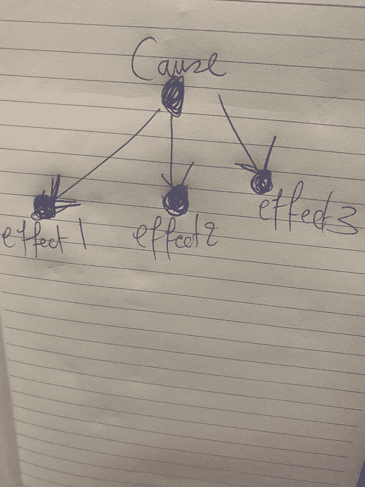
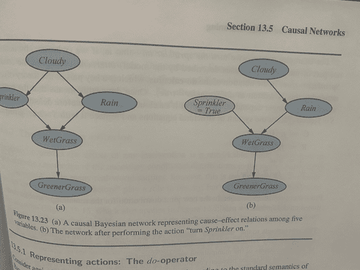
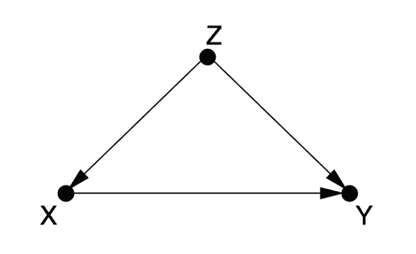
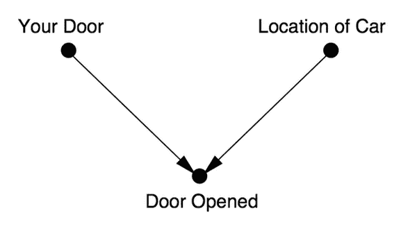
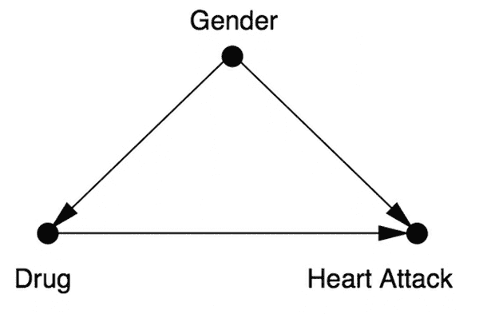

# 第十一章：概率

概率论是数学中最美丽的学科之一，它将我们带回到随机和确定性领域之间，这本应该是魔术的事情，但结果却是数学及其奇迹。概率提供了一种系统化的方法来量化随机性，控制不确定性，并将逻辑和推理扩展到在人工智能中至关重要的情况下：当信息和知识包含不确定性时，和/或当代理在不可预测或部分观察的环境中导航时。在这种情况下，代理计算关于某个环境的未观察方面的概率，然后基于这些概率做出决策。

人类对不确定性感到不舒服，但对近似和期望感到舒适。他们不会清楚地知道每一天的每一刻将如何发展，而是在路上做出决定。一个概率智能机器存在于概率世界中，而不是确定性和完全预定的真理和谬误中。

在整本书中，我们在需要时使用了概率论的术语和技术。通过这个过程，我们现在意识到我们需要熟练掌握联合概率分布（例如数据特征的联合概率分布）、条件概率、独立性、贝叶斯定理和马尔可夫过程。我们也意识到我们可以通过计算平均值和期望回到确定性世界。

这本书的每一章都有一个特点，那就是每一章都需要有自己的书来进行深入和全面的讨论。这在概率论的章节中尤为真实，因为其中涉及到成千上万的主题。我不得不做出选择，所以我选择在这一章中涵盖的主题基于三个标准：

1.  在这本书中我们已经使用了与概率有关的内容。

1.  作为学生，我在概率论中最困惑的是（比如在计算概率时为什么需要测度论？）。

1.  我们还需要从概率论中了解哪些内容以应用于人工智能。

# 概率在这本书中的哪些地方出现了？

让我们快速列出在这本书中使用概率或采用随机方法的地方。我们将这个列表视为*人工智能的基本概率*。请注意，*先验*概率是无条件的，因为它们是在观察数据或证据之前的，而*后验*概率是有条件的，因为它们的值是在观察相关数据后条件化的。在接收到新的和相关的证据后，我们对某事物的信念程度会发生变化是有道理的。通常我们追求的是所有相关变量的联合概率分布，但这通常太大了，而且完全构建它所需的信息并不总是可用的。

以下是列表：

1.  在最小化确定性机器学习模型（如回归、支持向量机、神经网络等）的损失函数时，我们使用随机梯度下降及其变体，在每个梯度下降步骤中随机选择训练数据实例的子集，而不是使用整个训练数据集，以加快计算速度。

1.  在图模型的第九章中，我们多次利用了图上的随机游走，通过图的加权邻接矩阵实现这些游走。

1.  在运筹学的第十章中出现了特定的概率分布，比如排队中顾客的到达和服务时间的概率分布。

1.  动态决策和马尔可夫过程也出现在第十章的运筹学中，对于人工智能中的强化学习至关重要。它们将在本章中再次出现，然后在第十三章中再次出现，这次是在汉密尔顿雅可比贝尔曼方程的背景下。

1.  在第十章中的两人零和博弈中，每个玩家都有一定概率采取某种动作，我们利用这一点来计算玩家的最优策略和预期收益。

1.  蒙特卡洛模拟方法是依赖于重复随机抽样来数值解决确定性问题的计算算法。我们在第十三章中以 AI 和 PDEs 为例进行了说明。

1.  神经网络的普遍定理：我们多次提到这一点，我们将在本章中证明它。这个证明是本书中唯一的理论部分，它将为我们提供测度论和泛函分析的美妙味道。

1.  概率机器学习模型学习数据特征的联合概率分布<math alttext="upper P r o b left-parenthesis x 1 comma x 2 comma ellipsis comma x Subscript n Baseline comma y Subscript t a r g e t Baseline right-parenthesis"><mrow><mi>P</mi> <mi>r</mi> <mi>o</mi> <mi>b</mi> <mo>(</mo> <msub><mi>x</mi> <mn>1</mn></msub> <mo>,</mo> <msub><mi>x</mi> <mn>2</mn></msub> <mo>,</mo> <mo>⋯</mo> <mo>,</mo> <msub><mi>x</mi> <mi>n</mi></msub> <mo>,</mo> <msub><mi>y</mi> <mrow><mi>t</mi><mi>a</mi><mi>r</mi><mi>g</mi><mi>e</mi><mi>t</mi></mrow></msub> <mo>)</mo></mrow></math>，而不是学习这些特征的确定性函数。这个联合概率分布编码了这些特征同时发生的可能性。给定输入数据特征<math alttext="left-parenthesis x 1 comma x 2 comma ellipsis comma x Subscript n Baseline right-parenthesis"><mrow><mo>(</mo> <msub><mi>x</mi> <mn>1</mn></msub> <mo>,</mo> <msub><mi>x</mi> <mn>2</mn></msub> <mo>,</mo> <mo>⋯</mo> <mo>,</mo> <msub><mi>x</mi> <mi>n</mi></msub> <mo>)</mo></mrow></math>，模型输出目标变量在给定数据特征时的条件概率<math alttext="upper P r o b left-parenthesis y Subscript p r e d i c t Baseline vertical-bar x 1 comma x 2 comma ellipsis comma x Subscript n Baseline right-parenthesis"><mrow><mi>P</mi> <mi>r</mi> <mi>o</mi> <mi>b</mi> <mo>(</mo> <msub><mi>y</mi> <mrow><mi>p</mi><mi>r</mi><mi>e</mi><mi>d</mi><mi>i</mi><mi>c</mi><mi>t</mi></mrow></msub> <mo>|</mo> <msub><mi>x</mi> <mn>1</mn></msub> <mo>,</mo> <msub><mi>x</mi> <mn>2</mn></msub> <mo>,</mo> <mo>⋯</mo> <mo>,</mo> <msub><mi>x</mi> <mi>n</mi></msub> <mo>)</mo></mrow></math>，而不是输出<math alttext="y Subscript p r e d i c t"><msub><mi>y</mi> <mrow><mi>p</mi><mi>r</mi><mi>e</mi><mi>d</mi><mi>i</mi><mi>c</mi><mi>t</mi></mrow></msub></math>作为特征的确定性函数：<math alttext="y Subscript p r e d i c t Baseline equals f left-parenthesis x 1 comma x 2 comma ellipsis comma x Subscript n Baseline right-parenthesis"><mrow><msub><mi>y</mi> <mrow><mi>p</mi><mi>r</mi><mi>e</mi><mi>d</mi><mi>i</mi><mi>c</mi><mi>t</mi></mrow></msub> <mo>=</mo> <mi>f</mi> <mrow><mo>(</mo> <msub><mi>x</mi> <mn>1</mn></msub> <mo>,</mo> <msub><mi>x</mi> <mn>2</mn></msub> <mo>,</mo> <mo>⋯</mo> <mo>,</mo> <msub><mi>x</mi> <mi>n</mi></msub> <mo>)</mo></mrow></mrow></math>。

1.  随机变量及与之相关的两个最重要的量，即期望（随机变量的期望平均值）和方差（围绕平均值的扩散程度的度量）：我们一直在使用它们，但没有正式定义。我们将在本章中定义它们。

1.  概率的乘法规则或链式规则，即

    <math alttext="dollar-sign upper P r o b left-parenthesis x 1 comma x 2 right-parenthesis equals upper P r o b left-parenthesis x 1 vertical-bar x 2 right-parenthesis upper P r o b left-parenthesis x 2 right-parenthesis equals upper P r o b left-parenthesis x 2 vertical-bar x 1 right-parenthesis upper P r o b left-parenthesis x 1 right-parenthesis dollar-sign"><mrow><mi>P</mi> <mi>r</mi> <mi>o</mi> <mi>b</mi> <mrow><mo>(</mo> <msub><mi>x</mi> <mn>1</mn></msub> <mo>,</mo> <msub><mi>x</mi> <mn>2</mn></msub> <mo>)</mo></mrow> <mo>=</mo> <mi>P</mi> <mi>r</mi> <mi>o</mi> <mi>b</mi> <mrow><mo>(</mo> <msub><mi>x</mi> <mn>1</mn></msub> <mo>|</mo> <msub><mi>x</mi> <mn>2</mn></msub> <mo>)</mo></mrow> <mi>P</mi> <mi>r</mi> <mi>o</mi> <mi>b</mi> <mrow><mo>(</mo> <msub><mi>x</mi> <mn>2</mn></msub> <mo>)</mo></mrow> <mo>=</mo> <mi>P</mi> <mi>r</mi> <mi>o</mi> <mi>b</mi> <mrow><mo>(</mo> <msub><mi>x</mi> <mn>2</mn></msub> <mo>|</mo> <msub><mi>x</mi> <mn>1</mn></msub> <mo>)</mo></mrow> <mi>P</mi> <mi>r</mi> <mi>o</mi> <mi>b</mi> <mrow><mo>(</mo> <msub><mi>x</mi> <mn>1</mn></msub> <mo>)</mo></mrow></mrow></math>

    或者对于超过两个变量的情况，比如三个，不失一般性：

    <math alttext="dollar-sign StartLayout 1st Row 1st Column upper P r o b left-parenthesis x 1 comma x 2 comma x 3 right-parenthesis 2nd Column equals upper P r o b left-parenthesis x 1 vertical-bar x 2 comma x 3 right-parenthesis upper P r o b left-parenthesis x 2 comma x 3 right-parenthesis 2nd Row 1st Column Blank 2nd Column equals upper P r o b left-parenthesis x 1 vertical-bar x 2 comma x 3 right-parenthesis upper P r o b left-parenthesis x 2 vertical-bar x 3 right-parenthesis upper P r o b left-parenthesis x 3 right-parenthesis EndLayout dollar-sign"><mtable displaystyle="true"><mtr><mtd columnalign="right"><mrow><mi>P</mi> <mi>r</mi> <mi>o</mi> <mi>b</mi> <mo>(</mo> <msub><mi>x</mi> <mn>1</mn></msub> <mo>,</mo> <msub><mi>x</mi> <mn>2</mn></msub> <mo>,</mo> <msub><mi>x</mi> <mn>3</mn></msub> <mo>)</mo></mrow></mtd> <mtd columnalign="left"><mrow><mo>=</mo> <mi>P</mi> <mi>r</mi> <mi>o</mi> <mi>b</mi> <mrow><mo>(</mo> <msub><mi>x</mi> <mn>1</mn></msub> <mo>|</mo> <msub><mi>x</mi> <mn>2</mn></msub> <mo>,</mo> <msub><mi>x</mi> <mn>3</mn></msub> <mo>)</mo></mrow> <mi>P</mi> <mi>r</mi> <mi>o</mi> <mi>b</mi> <mrow><mo>(</mo> <msub><mi>x</mi> <mn>2</mn></msub> <mo>,</mo> <msub><mi>x</mi> <mn>3</mn></msub> <mo>)</mo></mrow></mrow></mtd></mtr> <mtr><mtd columnalign="left"><mrow><mo>=</mo> <mi>P</mi> <mi>r</mi> <mi>o</mi> <mi>b</mi> <mrow><mo>(</mo> <msub><mi>x</mi> <mn>1</mn></msub> <mo>|</mo> <msub><mi>x</mi> <mn>2</mn></msub> <mo>,</mo> <msub><mi>x</mi> <mn>3</mn></msub> <mo>)</mo></mrow> <mi>P</mi> <mi>r</mi> <mi>o</mi> <mi>b</mi> <mrow><mo>(</mo> <msub><mi>x</mi> <mn>2</mn></msub> <mo>|</mo> <msub><mi>x</mi> <mn>3</mn></msub> <mo>)</mo></mrow> <mi>P</mi> <mi>r</mi> <mi>o</mi> <mi>b</mi> <mrow><mo>(</mo> <msub><mi>x</mi> <mn>3</mn></msub> <mo>)</mo></mrow></mrow></mtd></mtr></mtable></math>

1.  独立性和条件独立性的概念是基础性的。如果一个事件的发生不影响另一个事件发生的概率，则这两个事件是独立的。所考虑特征的独立性极大地简化了问题。它帮助我们解开许多变量的复杂联合分布，将它们简化为更少变量的简单乘积，并使许多以前难以处理的计算变得可行。这极大地简化了世界的概率解释。注意独立性的区别，即*仅两个事件的独立性*（<math alttext="upper P r o b left-parenthesis x 1 comma x 2 right-parenthesis equals upper P r o b left-parenthesis x 1 right-parenthesis upper P r o b left-parenthesis x 2 right-parenthesis"><mrow><mi>P</mi> <mi>r</mi> <mi>o</mi> <mi>b</mi> <mrow><mo>(</mo> <msub><mi>x</mi> <mn>1</mn></msub> <mo>,</mo> <msub><mi>x</mi> <mn>2</mn></msub> <mo>)</mo></mrow> <mo>=</mo> <mi>P</mi> <mi>r</mi> <mi>o</mi> <mi>b</mi> <mrow><mo>(</mo> <msub><mi>x</mi> <mn>1</mn></msub> <mo>)</mo></mrow> <mi>P</mi> <mi>r</mi> <mi>o</mi> <mi>b</mi> <mrow><mo>(</mo> <msub><mi>x</mi> <mn>2</mn></msub> <mo>)</mo></mrow></mrow></math>）和*许多事件的独立性*，这是一个强假设，其中每个事件都独立于其他事件的任何交集。

1.  对于第八章的概率生成模型，我们假设了一个先验概率分布，通过神经网络传递，并调整其参数。

1.  在讨论联合和条件概率时，贝叶斯定理是至关重要的。它帮助我们量化代理的信念相对于证据。我们在许多情境中使用它，立即展示了它的用处，比如：

    <math alttext="dollar-sign upper P r o b left-parenthesis d i s e a s e vertical-bar s y m p t o m s right-parenthesis equals StartFraction upper P r o b left-parenthesis s y m p t o m s vertical-bar d i s e a s e right-parenthesis upper P r o b left-parenthesis d i s e a s e right-parenthesis Over upper P r o b left-parenthesis s y m p t o m s right-parenthesis EndFraction dollar-sign"><mrow><mi>P</mi> <mi>r</mi> <mi>o</mi> <mi>b</mi> <mrow><mo>(</mo> <mi>d</mi> <mi>i</mi> <mi>s</mi> <mi>e</mi> <mi>a</mi> <mi>s</mi> <mi>e</mi> <mo>|</mo> <mi>s</mi> <mi>y</mi> <mi>m</mi> <mi>p</mi> <mi>t</mi> <mi>o</mi> <mi>m</mi> <mi>s</mi> <mo>)</mo></mrow> <mo>=</mo> <mfrac><mrow><mi>P</mi><mi>r</mi><mi>o</mi><mi>b</mi><mo>(</mo><mi>s</mi><mi>y</mi><mi>m</mi><mi>p</mi><mi>t</mi><mi>o</mi><mi>m</mi><mi>s</mi><mo>|</mo><mi>d</mi><mi>i</mi><mi>s</mi><mi>e</mi><mi>a</mi><mi>s</mi><mi>e</mi><mo>)</mo><mi>P</mi><mi>r</mi><mi>o</mi><mi>b</mi><mo>(</mo><mi>d</mi><mi>i</mi><mi>s</mi><mi>e</mi><mi>a</mi><mi>s</mi><mi>e</mi><mo>)</mo></mrow> <mrow><mi>P</mi><mi>r</mi><mi>o</mi><mi>b</mi><mo>(</mo><mi>s</mi><mi>y</mi><mi>m</mi><mi>p</mi><mi>t</mi><mi>o</mi><mi>m</mi><mi>s</mi><mo>)</mo></mrow></mfrac></mrow></math>

    或

    <math alttext="dollar-sign upper P r o b left-parenthesis t a r g e t vertical-bar d a t a right-parenthesis equals StartFraction upper P r o b left-parenthesis d a t a vertical-bar t a r g e t right-parenthesis upper P r o b left-parenthesis t a r g e t right-parenthesis Over upper P r o b left-parenthesis d a t a right-parenthesis EndFraction dollar-sign"><mrow><mi>P</mi> <mi>r</mi> <mi>o</mi> <mi>b</mi> <mrow><mo>(</mo> <mi>t</mi> <mi>a</mi> <mi>r</mi> <mi>g</mi> <mi>e</mi> <mi>t</mi> <mo>|</mo> <mi>d</mi> <mi>a</mi> <mi>t</mi> <mi>a</mi> <mo>)</mo></mrow> <mo>=</mo> <mfrac><mrow><mi>P</mi><mi>r</mi><mi>o</mi><mi>b</mi><mo>(</mo><mi>d</mi><mi>a</mi><mi>t</mi><mi>a</mi><mo>|</mo><mi>t</mi><mi>a</mi><mi>r</mi><mi>g</mi><mi>e</mi><mi>t</mi><mo>)</mo><mi>P</mi><mi>r</mi><mi>o</mi><mi>b</mi><mo>(</mo><mi>t</mi><mi>a</mi><mi>r</mi><mi>g</mi><mi>e</mi><mi>t</mi><mo>)</mo></mrow> <mrow><mi>P</mi><mi>r</mi><mi>o</mi><mi>b</mi><mo>(</mo><mi>d</mi><mi>a</mi><mi>t</mi><mi>a</mi><mo>)</mo></mrow></mfrac></mrow></math>

    或

    <math alttext="dollar-sign upper P r o b left-parenthesis t a r g e t vertical-bar e v i d e n c e right-parenthesis equals StartFraction upper P r o b left-parenthesis e v i d e n c e vertical-bar t a r g e t right-parenthesis upper P r o b left-parenthesis t a r g e t right-parenthesis Over upper P r o b left-parenthesis e v i d e n c e right-parenthesis EndFraction period dollar-sign"><mrow><mi>P</mi> <mi>r</mi> <mi>o</mi> <mi>b</mi> <mrow><mo>(</mo> <mi>t</mi> <mi>a</mi> <mi>r</mi> <mi>g</mi> <mi>e</mi> <mi>t</mi> <mo>|</mo> <mi>e</mi> <mi>v</mi> <mi>i</mi> <mi>d</mi> <mi>e</mi> <mi>n</mi> <mi>c</mi> <mi>e</mi> <mo>)</mo></mrow> <mo>=</mo> <mfrac><mrow><mi>P</mi><mi>r</mi><mi>o</mi><mi>b</mi><mo>(</mo><mi>e</mi><mi>v</mi><mi>i</mi><mi>d</mi><mi>e</mi><mi>n</mi><mi>c</mi><mi>e</mi><mo>|</mo><mi>t</mi><mi>a</mi><mi>r</mi><mi>g</mi><mi>e</mi><mi>t</mi><mo>)</mo><mi>P</mi><mi>r</mi><mi>o</mi><mi>b</mi><mo>(</mo><mi>t</mi><mi>a</mi><mi>r</mi><mi>g</mi><mi>e</mi><mi>t</mi><mo>)</mo></mrow> <mrow><mi>P</mi><mi>r</mi><mi>o</mi><mi>b</mi><mo>(</mo><mi>e</mi><mi>v</mi><mi>i</mi><mi>d</mi><mi>e</mi><mi>n</mi><mi>c</mi><mi>e</mi><mo>)</mo></mrow></mfrac> <mo>.</mo></mrow></math>

    或

    <math alttext="dollar-sign upper P r o b left-parenthesis c a u s e vertical-bar e f f e c t right-parenthesis equals StartFraction upper P r o b left-parenthesis e f f e c t vertical-bar c a u s e right-parenthesis upper P r o b left-parenthesis c a u s e right-parenthesis Over upper P r o b left-parenthesis e f f e c t right-parenthesis EndFraction period dollar-sign"><mrow><mi>P</mi> <mi>r</mi> <mi>o</mi> <mi>b</mi> <mrow><mo>(</mo> <mi>c</mi> <mi>a</mi> <mi>u</mi> <mi>s</mi> <mi>e</mi> <mo>|</mo> <mi>e</mi> <mi>f</mi> <mi>f</mi> <mi>e</mi> <mi>c</mi> <mi>t</mi> <mo>)</mo></mrow> <mo>=</mo> <mfrac><mrow><mi>P</mi><mi>r</mi><mi>o</mi><mi>b</mi><mo>(</mo><mi>e</mi><mi>f</mi><mi>f</mi><mi>e</mi><mi>c</mi><mi>t</mi><mo>|</mo><mi>c</mi><mi>a</mi><mi>u</mi><mi>s</mi><mi>e</mi><mo>)</mo><mi>P</mi><mi>r</mi><mi>o</mi><mi>b</mi><mo>(</mo><mi>c</mi><mi>a</mi><mi>u</mi><mi>s</mi><mi>e</mi><mo>)</mo></mrow> <mrow><mi>P</mi><mi>r</mi><mi>o</mi><mi>b</mi><mo>(</mo><mi>e</mi><mi>f</mi><mi>f</mi><mi>e</mi><mi>c</mi><mi>t</mi><mo>)</mo></mrow></mfrac> <mo>.</mo></mrow></math>

    请注意，在最后一个公式中，<math alttext="upper P r o b left-parenthesis c a u s e vertical-bar e f f e c t right-parenthesis"><mrow><mi>P</mi> <mi>r</mi> <mi>o</mi> <mi>b</mi> <mo>(</mo> <mi>c</mi> <mi>a</mi> <mi>u</mi> <mi>s</mi> <mi>e</mi> <mo>|</mo> <mi>e</mi> <mi>f</mi> <mi>f</mi> <mi>e</mi> <mi>c</mi> <mi>t</mi> <mo>)</mo></mrow></math> 量化了*对角*方向，而<math alttext="upper P r o b left-parenthesis e f f e c t vertical-bar c a u s e right-parenthesis"><mrow><mi>P</mi> <mi>r</mi> <mi>o</mi> <mi>b</mi> <mo>(</mo> <mi>e</mi> <mi>f</mi> <mi>f</mi> <mi>e</mi> <mi>c</mi> <mi>t</mi> <mo>|</mo> <mi>c</mi> <mi>a</mi> <mi>u</mi> <mi>s</mi> <mi>e</mi> <mo>)</mo></mrow></math> 量化了*因果*方向。

1.  贝叶斯网络是表示变量之间依赖关系的数据结构。在这里，我们总结了有向图中的变量关系，并使用它来确定我们需要跟踪和更新哪些条件概率表，以便根据新证据进行更新：我们跟踪子节点在观察其父节点的条件下的概率。节点的父节点是直接影响该节点的任何变量。在这个意义上，贝叶斯网络是联合概率分布的表示，简化了我们知道涉及变量如何相互关联（哪些变量是哪些变量的父节点）：

    <math alttext="dollar-sign upper P r o b left-parenthesis x 1 comma x 2 comma ellipsis comma x Subscript n Baseline right-parenthesis equals normal upper Pi Subscript i equals 1 Superscript n Baseline upper P r o b left-parenthesis x Subscript i Baseline vertical-bar p a r e n t s left-parenthesis upper X Subscript i Baseline right-parenthesis right-parenthesis dollar-sign"><mrow><mi>P</mi> <mi>r</mi> <mi>o</mi> <mi>b</mi> <mrow><mo>(</mo> <msub><mi>x</mi> <mn>1</mn></msub> <mo>,</mo> <msub><mi>x</mi> <mn>2</mn></msub> <mo>,</mo> <mo>⋯</mo> <mo>,</mo> <msub><mi>x</mi> <mi>n</mi></msub> <mo>)</mo></mrow> <mo>=</mo> <msubsup><mi>Π</mi> <mrow><mi>i</mi><mo>=</mo><mn>1</mn></mrow> <mi>n</mi></msubsup> <mi>P</mi> <mi>r</mi> <mi>o</mi> <mi>b</mi> <mrow><mo>(</mo> <msub><mi>x</mi> <mi>i</mi></msub> <mo>|</mo> <mi>p</mi> <mi>a</mi> <mi>r</mi> <mi>e</mi> <mi>n</mi> <mi>t</mi> <mi>s</mi> <mrow><mo>(</mo> <msub><mi>X</mi> <mi>i</mi></msub> <mo>)</mo></mrow> <mo>)</mo></mrow></mrow></math>

1.  在机器学习中，我们可以在回归模型和分类模型之间划清界限。在第八章中的概率生成模型中，我们遇到了一个用于分类的流行概率模型：朴素贝叶斯。在因果效应语言中，*朴素*假设是一些观察到的多个效应在给定原因的情况下是独立的，因此我们可以写成：

    <math alttext="dollar-sign upper P r o b left-parenthesis c a u s e vertical-bar e f f e c t 1 comma e f f e c t 2 comma e f f e c t 3 right-parenthesis equals upper P left-parenthesis c a u s e right-parenthesis upper P left-parenthesis e f f e c t 1 vertical-bar c a u s e right-parenthesis upper P left-parenthesis e f f e c t 2 vertical-bar c a u s e right-parenthesis upper P left-parenthesis e f f e c t 3 vertical-bar c a u s e right-parenthesis dollar-sign"><mrow><mi>P</mi> <mi>r</mi> <mi>o</mi> <mi>b</mi> <mrow><mo>(</mo> <mi>c</mi> <mi>a</mi> <mi>u</mi> <mi>s</mi> <mi>e</mi> <mo>|</mo> <mi>e</mi> <mi>f</mi> <mi>f</mi> <mi>e</mi> <mi>c</mi> <msub><mi>t</mi> <mn>1</mn></msub> <mo>,</mo> <mi>e</mi> <mi>f</mi> <mi>f</mi> <mi>e</mi> <mi>c</mi> <msub><mi>t</mi> <mn>2</mn></msub> <mo>,</mo> <mi>e</mi> <mi>f</mi> <mi>f</mi> <mi>e</mi> <mi>c</mi> <msub><mi>t</mi> <mn>3</mn></msub> <mo>)</mo></mrow> <mo>=</mo> <mi>P</mi> <mrow><mo>(</mo> <mi>c</mi> <mi>a</mi> <mi>u</mi> <mi>s</mi> <mi>e</mi> <mo>)</mo></mrow> <mi>P</mi> <mrow><mo>(</mo> <mi>e</mi> <mi>f</mi> <mi>f</mi> <mi>e</mi> <mi>c</mi> <msub><mi>t</mi> <mn>1</mn></msub> <mo>|</mo> <mi>c</mi> <mi>a</mi> <mi>u</mi> <mi>s</mi> <mi>e</mi> <mo>)</mo></mrow> <mi>P</mi> <mrow><mo>(</mo> <mi>e</mi> <mi>f</mi> <mi>f</mi> <mi>e</mi> <mi>c</mi> <msub><mi>t</mi> <mn>2</mn></msub> <mo>|</mo> <mi>c</mi> <mi>a</mi> <mi>u</mi> <mi>s</mi> <mi>e</mi> <mo>)</mo></mrow> <mi>P</mi> <mrow><mo>(</mo> <mi>e</mi> <mi>f</mi> <mi>f</mi> <mi>e</mi> <mi>c</mi> <msub><mi>t</mi> <mn>3</mn></msub> <mo>|</mo> <mi>c</mi> <mi>a</mi> <mi>u</mi> <mi>s</mi> <mi>e</mi> <mo>)</mo></mrow></mrow></math>

    当上述公式用于给定数据特征的分类时，*原因*是类别。此外，我们可以绘制代表这种设置的贝叶斯网络。原因变量是父节点，所有效应都是从一个父节点衍生出来的子节点（图 11-1）。

###### 图 11-1. 代表有共同原因的三个效应的贝叶斯网络。

# AI 所需的更多基本知识是什么？

我们需要一些在本书中没有得到关注或仅仅是偶尔提到并被推迟到本章进行更详细讨论的额外主题。这些包括：

+   Judea Pearl 的因果建模和 do 计算

+   一些悖论

+   大型随机矩阵和高维概率

+   随机过程，如随机游走，布朗运动等

+   马尔可夫决策过程和强化学习

+   概率论及其在 AI 中的应用

本章的其余部分关注上述主题。

# 因果建模和 do 计算

原则上，贝叶斯网络中相关变量之间的箭头可以指向任何方向。它们最终都导致相同的联合概率分布，尽管有些方式比其他方式更复杂。

相比之下，因果网络是那些特殊的贝叶斯网络，其中图的有向边不能指向除了因果方向以外的任何方向。对于这些网络，在构建连接和它们的方向时，我们必须更加留心。图 11-2 展示了一个因果贝叶斯网络的示例。

###### 图 11-2. 因果贝叶斯网络。

请注意，贝叶斯网络和因果网络都对哪些变量听从哪些变量做出了强烈的假设。

具有因果推理能力的代理人，在人类术语中，比那些仅仅观察数据模式然后基于相关模式做出决策的代理人*功能更高*。

以下区别至关重要：

+   在贝叶斯网络中，我们只需要知道两个变量是否在概率上相关。火和烟在概率上相关吗？

+   在因果网络中，我们进一步询问*哪个变量对哪个变量做出响应*：烟对火（因此我们在图中从火到烟画一个箭头）；或火对烟（因此我们在图中从烟到火画一个箭头）？

我们需要的是一个数学框架来*干预*，以量化固定一个变量值的效果。这被称为*do 计算*（与统计*观察和计数*计算相对）。让我们介绍*do 计算*的两个基本公式：

+   调整公式

+   背门准则

根据因果推理的发明者[Judea Pearl](https://en.wikipedia.org/wiki/Judea_Pearl)，他的*为什么之书（2020 年）*激发了本节和下一节的讨论，这些*允许研究人员探索和绘制所有可能的干预路径，无论多么曲折*，甚至可以节省我们运行随机对照试验的成本和困难，即使这些试验在物理上是可行的并且在法律上是允许的。

### 另一种选择：do 计算

给定一个因果网络，我们基于常识和专业知识的组合构建，同时为每个变量添加额外的未知原因，以确保我们考虑了一切，总体公式是联合概率分布的公式：

<math alttext="dollar-sign upper P r o b left-parenthesis x 1 comma x 2 comma ellipsis comma x Subscript n Baseline right-parenthesis equals normal upper Pi Subscript i equals 1 Superscript n Baseline upper P r o b left-parenthesis x Subscript i Baseline vertical-bar p a r e n t s left-parenthesis upper X Subscript i Baseline right-parenthesis right-parenthesis period dollar-sign"><mrow><mi>P</mi> <mi>r</mi> <mi>o</mi> <mi>b</mi> <mrow><mo>(</mo> <msub><mi>x</mi> <mn>1</mn></msub> <mo>,</mo> <msub><mi>x</mi> <mn>2</mn></msub> <mo>,</mo> <mo>⋯</mo> <mo>,</mo> <msub><mi>x</mi> <mi>n</mi></msub> <mo>)</mo></mrow> <mo>=</mo> <msubsup><mi>Π</mi> <mrow><mi>i</mi><mo>=</mo><mn>1</mn></mrow> <mi>n</mi></msubsup> <mi>P</mi> <mi>r</mi> <mi>o</mi> <mi>b</mi> <mrow><mo>(</mo> <msub><mi>x</mi> <mi>i</mi></msub> <mo>|</mo> <mi>p</mi> <mi>a</mi> <mi>r</mi> <mi>e</mi> <mi>n</mi> <mi>t</mi> <mi>s</mi> <mrow><mo>(</mo> <msub><mi>X</mi> <mi>i</mi></msub> <mo>)</mo></mrow> <mo>)</mo></mrow> <mo>.</mo></mrow></math>

然后我们*干预*，应用<math alttext="d o left-parenthesis upper X Subscript j Baseline equals x Superscript asterisk Baseline right-parenthesis"><mrow><mi>d</mi> <mi>o</mi> <mo>(</mo> <msub><mi>X</mi> <mi>j</mi></msub> <mo>=</mo> <msup><mi>x</mi> <mo>*</mo></msup> <mo>)</mo></mrow></math>：这会切断指向<math alttext="upper X Subscript j"><msub><mi>X</mi> <mi>j</mi></msub></math>的任何边，并影响<math alttext="upper X Subscript j"><msub><mi>X</mi> <mi>j</mi></msub></math>的后代的所有条件概率，导致新的联合概率分布，其中不再包括干预变量的条件概率：我们已经将其值设置为<math alttext="upper X Subscript j Baseline equals x Superscript asterisk"><mrow><msub><mi>X</mi> <mi>j</mi></msub> <mo>=</mo> <msup><mi>x</mi> <mo>*</mo></msup></mrow></math>的概率为一，任何其他值的概率为零。图 11-2 显示了当我们打开洒水器时，原始网络中指向它的所有箭头都被切断。

因此我们有：

<math alttext="dollar-sign upper P r o b Subscript i n t e r v e n e d Baseline left-parenthesis x 1 comma x 2 comma ellipsis comma x Subscript n Baseline right-parenthesis equals StartLayout 1st Row 1st Column Blank 2nd Column normal upper Pi Subscript i not-equals j Superscript n Baseline upper P r o b left-parenthesis x Subscript i Baseline vertical-bar p a r e n t s left-parenthesis upper X Subscript i Baseline right-parenthesis right-parenthesis if x Subscript j Baseline equals x Superscript asterisk Baseline 2nd Row 1st Column Blank 2nd Column 0 otherwise EndLayout dollar-sign"><mrow><mi>P</mi> <mi>r</mi> <mi>o</mi> <msub><mi>b</mi> <mrow><mi>i</mi><mi>n</mi><mi>t</mi><mi>e</mi><mi>r</mi><mi>v</mi><mi>e</mi><mi>n</mi><mi>e</mi><mi>d</mi></mrow></msub> <mrow><mo>(</mo> <msub><mi>x</mi> <mn>1</mn></msub> <mo>,</mo> <msub><mi>x</mi> <mn>2</mn></msub> <mo>,</mo> <mo>⋯</mo> <mo>,</mo> <msub><mi>x</mi> <mi>n</mi></msub> <mo>)</mo></mrow> <mo>=</mo> <mtable displaystyle="true"><mtr><mtd columnalign="left"><mrow><msubsup><mi>Π</mi> <mrow><mi>i</mi><mo>≠</mo><mi>j</mi></mrow> <mi>n</mi></msubsup> <mi>P</mi> <mi>r</mi> <mi>o</mi> <mi>b</mi> <mrow><mo>(</mo> <msub><mi>x</mi> <mi>i</mi></msub> <mo>|</mo> <mi>p</mi> <mi>a</mi> <mi>r</mi> <mi>e</mi> <mi>n</mi> <mi>t</mi> <mi>s</mi> <mrow><mo>(</mo> <msub><mi>X</mi> <mi>i</mi></msub> <mo>)</mo></mrow> <mo>)</mo></mrow> <mtext>if</mtext> <msub><mi>x</mi> <mi>j</mi></msub> <mo>=</mo> <msup><mi>x</mi> <mo>*</mo></msup></mrow></mtd></mtr> <mtr><mtd columnalign="left"><mrow><mn>0</mn> <mtext>otherwise</mtext></mrow></mtd></mtr></mtable></mrow></math>

### 调整公式

我们真正关心的是设置<math alttext="upper X Subscript j Baseline equals x Superscript asterisk"><mrow><msub><mi>X</mi> <mi>j</mi></msub> <mo>=</mo> <msup><mi>x</mi> <mo>*</mo></msup></mrow></math>如何影响网络中每个其他变量的概率，并且我们希望从原始未干预的网络中计算这些值：用数学术语来说，没有 do 运算符，因为我们可以观察数据来获取这些值，而不是进行新实验。

为此，我们引入*调整公式*，或者，控制混杂因素（可能的共同原因）：这是<math alttext="upper X Subscript j"><msub><mi>X</mi> <mi>j</mi></msub></math>及其父节点对<math alttext="upper X Subscript i"><msub><mi>X</mi> <mi>i</mi></msub></math>影响的加权平均值。权重是父节点值的先验概率：

<math alttext="dollar-sign upper P r o b left-parenthesis x Subscript i Baseline vertical-bar d o left-parenthesis upper X Subscript j Baseline equals x Superscript asterisk Baseline right-parenthesis right-parenthesis equals upper P r o b Subscript i n t e r v e n e d Baseline left-parenthesis upper X Subscript i Baseline equals x Subscript i Baseline right-parenthesis equals sigma-summation Underscript p a r e n t s left-parenthesis upper X Subscript j Baseline right-parenthesis Endscripts upper P r o b left-parenthesis x Subscript i Baseline vertical-bar x Superscript asterisk Baseline comma p a r e n t s left-parenthesis upper X Subscript j Baseline right-parenthesis right-parenthesis upper P r o b left-parenthesis p a r e n t s left-parenthesis upper X Subscript j Baseline right-parenthesis right-parenthesis dollar-sign"><mrow><mi>P</mi> <mi>r</mi> <mi>o</mi> <mi>b</mi> <mrow><mo>(</mo> <msub><mi>x</mi> <mi>i</mi></msub> <mo>|</mo> <mi>d</mi> <mi>o</mi> <mrow><mo>(</mo> <msub><mi>X</mi> <mi>j</mi></msub> <mo>=</mo> <msup><mi>x</mi> <mo>*</mo></msup> <mo>)</mo></mrow> <mo>)</mo></mrow> <mo>=</mo> <mi>P</mi> <mi>r</mi> <mi>o</mi> <msub><mi>b</mi> <mrow><mi>i</mi><mi>n</mi><mi>t</mi><mi>e</mi><mi>r</mi><mi>v</mi><mi>e</mi><mi>n</mi><mi>e</mi><mi>d</mi></mrow></msub> <mrow><mo>(</mo> <msub><mi>X</mi> <mi>i</mi></msub> <mo>=</mo> <msub><mi>x</mi> <mi>i</mi></msub> <mo>)</mo></mrow> <mo>=</mo> <msub><mo>∑</mo> <mrow><mi>p</mi><mi>a</mi><mi>r</mi><mi>e</mi><mi>n</mi><mi>t</mi><mi>s</mi><mo>(</mo><msub><mi>X</mi> <mi>j</mi></msub> <mo>)</mo></mrow></msub> <mi>P</mi> <mi>r</mi> <mi>o</mi> <mi>b</mi> <mrow><mo>(</mo> <msub><mi>x</mi> <mi>i</mi></msub> <mo>|</mo> <msup><mi>x</mi> <mo>*</mo></msup> <mo>,</mo> <mi>p</mi> <mi>a</mi> <mi>r</mi> <mi>e</mi> <mi>n</mi> <mi>t</mi> <mi>s</mi> <mrow><mo>(</mo> <msub><mi>X</mi> <mi>j</mi></msub> <mo>)</mo></mrow> <mo>)</mo></mrow> <mi>P</mi> <mi>r</mi> <mi>o</mi> <mi>b</mi> <mrow><mo>(</mo> <mi>p</mi> <mi>a</mi> <mi>r</mi> <mi>e</mi> <mi>n</mi> <mi>t</mi> <mi>s</mi> <mrow><mo>(</mo> <msub><mi>X</mi> <mi>j</mi></msub> <mo>)</mo></mrow> <mo>)</mo></mrow></mrow></math>

注意，上述公式实现了我们消除*do*运算符的目标，并使我们重新通过观察数据而不是运行一些昂贵的干预实验或随机对照试验来找到我们的条件概率。

### 背门标准，或控制混杂因素

因果图表的故事还有更多。我们想知道对图表中某个*下游*变量的干预<math alttext="d o left-parenthesis upper X Subscript j Baseline equals x Superscript asterisk Baseline right-parenthesis"><mrow><mi>d</mi> <mi>o</mi> <mo>(</mo> <msub><mi>X</mi> <mi>j</mi></msub> <mo>=</mo> <msup><mi>x</mi> <mo>*</mo></msup> <mo>)</mo></mrow></math>的效果。我们应该能够对图表中*另一个祖先*的值进行条件处理：这也导致我们关心的下游变量。在因果建模中，我们称这个过程为*阻断背门*或*背门标准*：

<math alttext="dollar-sign upper P r o b left-parenthesis x Subscript d o w n s t r e a m Baseline vertical-bar d o left-parenthesis upper X Subscript j Baseline equals x Superscript asterisk Baseline right-parenthesis right-parenthesis equals upper P r o b Subscript i n t e r v e n e d Baseline left-parenthesis upper X Subscript d o w n s t r e a m Baseline equals x Subscript d o w n s t r e a m Baseline right-parenthesis equals sigma-summation Underscript a n s c e s t o r left-parenthesis upper X Subscript d o w n s t r e a m Baseline right-parenthesis Endscripts upper P r o b left-parenthesis x Subscript d o w n s t r e a m Baseline vertical-bar x Superscript asterisk Baseline comma a n s c e s t o r left-parenthesis upper X Subscript d o w n s t r e a m Baseline right-parenthesis right-parenthesis upper P r o b left-parenthesis a n s c e s t o r left-parenthesis upper X Subscript d o w n s t r e a m Baseline right-parenthesis right-parenthesis dollar-sign"><mrow><mi>P</mi> <mi>r</mi> <mi>o</mi> <mi>b</mi> <mrow><mo>(</mo> <msub><mi>x</mi> <mrow><mi>d</mi><mi>o</mi><mi>w</mi><mi>n</mi><mi>s</mi><mi>t</mi><mi>r</mi><mi>e</mi><mi>a</mi><mi>m</mi></mrow></msub> <mo>|</mo> <mi>d</mi> <mi>o</mi> <mrow><mo>(</mo> <msub><mi>X</mi> <mi>j</mi></msub> <mo>=</mo> <msup><mi>x</mi> <mo>*</mo></msup> <mo>)</mo></mrow> <mo>)</mo></mrow> <mo>=</mo> <mi>P</mi> <mi>r</mi> <mi>o</mi> <msub><mi>b</mi> <mrow><mi>i</mi><mi>n</mi><mi>t</mi><mi>e</mi><mi>r</mi><mi>v</mi><mi>e</mi><mi>n</mi><mi>e</mi><mi>d</mi></mrow></msub> <mrow><mo>(</mo> <msub><mi>X</mi> <mrow><mi>d</mi><mi>o</mi><mi>w</mi><mi>n</mi><mi>s</mi><mi>t</mi><mi>r</mi><mi>e</mi><mi>a</mi><mi>m</mi></mrow></msub> <mo>=</mo> <msub><mi>x</mi> <mrow><mi>d</mi><mi>o</mi><mi>w</mi><mi>n</mi><mi>s</mi><mi>t</mi><mi>r</mi><mi>e</mi><mi>a</mi><mi>m</mi></mrow></msub> <mo>)</mo></mrow> <mo>=</mo> <msub><mo>∑</mo> <mrow><mi>a</mi><mi>n</mi><mi>s</mi><mi>c</mi><mi>e</mi><mi>s</mi><mi>t</mi><mi>o</mi><mi>r</mi><mo>(</mo><msub><mi>X</mi> <mrow><mi>d</mi><mi>o</mi><mi>w</mi><mi>n</mi><mi>s</mi><mi>t</mi><mi>r</mi><mi>e</mi><mi>a</mi><mi>m</mi></mrow></msub> <mo>)</mo></mrow></msub> <mi>P</mi> <mi>r</mi> <mi>o</mi> <mi>b</mi> <mrow><mo>(</mo> <msub><mi>x</mi> <mrow><mi>d</mi><mi>o</mi><mi>w</mi><mi>n</mi><mi>s</mi><mi>t</mi><mi>r</mi><mi>e</mi><mi>a</mi><mi>m</mi></mrow></msub> <mo>|</mo> <msup><mi>x</mi> <mo>*</mo></msup> <mo>,</mo> <mi>a</mi> <mi>n</mi> <mi>s</mi> <mi>c</mi> <mi>e</mi> <mi>s</mi> <mi>t</mi> <mi>o</mi> <mi>r</mi> <mrow><mo>(</mo> <msub><mi>X</mi> <mrow><mi>d</mi><mi>o</mi><mi>w</mi><mi>n</mi><mi>s</mi><mi>t</mi><mi>r</mi><mi>e</mi><mi>a</mi><mi>m</mi></mrow></msub> <mo>)</mo></mrow> <mo>)</mo></mrow> <mi>P</mi> <mi>r</mi> <mi>o</mi> <mi>b</mi> <mrow><mo>(</mo> <mi>a</mi> <mi>n</mi> <mi>s</mi> <mi>c</mi> <mi>e</mi> <mi>s</mi> <mi>t</mi> <mi>o</mi> <mi>r</mi> <mrow><mo>(</mo> <msub><mi>X</mi> <mrow><mi>d</mi><mi>o</mi><mi>w</mi><mi>n</mi><mi>s</mi><mi>t</mi><mi>r</mi><mi>e</mi><mi>a</mi><mi>m</mi></mrow></msub> <mo>)</mo></mrow> <mo>)</mo></mrow></mrow></math>

### 控制混杂因素

科学家和统计学家预测干预效果的最常见方法，以便他们可以对因果关系进行陈述，是控制*可能的共同原因*或混杂因素。图 11-3 显示了变量 Z 作为 X 和 Y 之间怀疑的因果关系的混杂因素。

###### 图 11-3\. Z 是 X 和 Y 之间怀疑的因果关系的混杂因素。

这是因为，一般来说，混杂是观察和干预之间的混淆的主要来源。这也是著名的*相关不意味因果*的来源。在这里，我们看到一些奇怪而有趣的例子：高温是冰淇淋销售和鲨鱼袭击的混杂因素（但为什么有人会研究冰淇淋和鲨鱼之间的任何关系呢？）。背门标准和调整公式轻松解决了混杂因素对因果关系的规定的障碍。

如果我们确信已经获得了足够的*deconfounder*变量集合的数据来阻止干预和结果之间的所有背门路径，我们可以使用调整公式来控制混杂因素。为此，我们从数据中逐层估计因果效应，然后计算这些层的加权平均值，其中每个层根据其在人口中的普遍程度进行加权。

现在没有了背门标准，统计学家和科学家就无法保证任何调整是合法的。换句话说，背门标准保证了 deconfounder 的每个分层中的因果效应实际上是该分层中的观察趋势。

### 是否有更多的规则可以消除 do 运算符？

能够将我们从具有 do 运算符（干预）的表达式转换为没有 do 运算符（观察）的表达式的规则非常可取，因为它们消除了干预的需要：它们使我们能够通过纯粹的数据观察来估计因果效应。调整公式和背门标准确实为我们做到了这一点。

是否有更多的规则？更雄心勃勃的问题是：是否有一种方法可以事先决定某个因果模型是否适合于消除 do 运算符，以便我们知道模型的假设是否足以从观测数据中揭示因果效应而无需任何干预？了解这一点是巨大的！例如，如果模型的假设不足以消除 do 运算符，那么无论我们多聪明，都无法避免进行干预实验。另一方面，如果我们不必干预就能估计因果效应，那么节省是惊人的。这些本身就值得更深入地研究概率因果建模和 do 微积分。

为了理解朱迪亚·珀尔的 do 微积分，我们总是从因果图开始，考虑导致删除指向或指出感兴趣变量的边缘的条件。珀尔的三条规则给出了以下条件：

1.  我们可以插入或删除观察：

    <math alttext="dollar-sign upper P r o b left-parenthesis y vertical-bar d o left-parenthesis x right-parenthesis comma z comma w right-parenthesis equals upper P r o b left-parenthesis y vertical-bar d o left-parenthesis x right-parenthesis comma w right-parenthesis dollar-sign"><mrow><mi>P</mi> <mi>r</mi> <mi>o</mi> <mi>b</mi> <mo>(</mo> <mi>y</mi> <mo>|</mo> <mi>d</mi> <mi>o</mi> <mo>(</mo> <mi>x</mi> <mo>)</mo> <mo>,</mo> <mi>z</mi> <mo>,</mo> <mi>w</mi> <mo>)</mo> <mo>=</mo> <mi>P</mi> <mi>r</mi> <mi>o</mi> <mi>b</mi> <mo>(</mo> <mi>y</mi> <mo>|</mo> <mi>d</mi> <mi>o</mi> <mo>(</mo> <mi>x</mi> <mo>)</mo> <mo>,</mo> <mi>w</mi> <mo>)</mo></mrow></math>

1.  我们可以插入或删除干预：

    <math alttext="dollar-sign upper P r o b left-parenthesis y vertical-bar d o left-parenthesis x right-parenthesis comma d o left-parenthesis z right-parenthesis comma w right-parenthesis equals upper P r o b left-parenthesis y vertical-bar d o left-parenthesis x right-parenthesis comma w right-parenthesis dollar-sign"><mrow><mi>P</mi> <mi>r</mi> <mi>o</mi> <mi>b</mi> <mo>(</mo> <mi>y</mi> <mo>|</mo> <mi>d</mi> <mi>o</mi> <mo>(</mo> <mi>x</mi> <mo>)</mo> <mo>,</mo> <mi>d</mi> <mi>o</mi> <mo>(</mo> <mi>z</mi> <mo>)</mo> <mo>,</mo> <mi>w</mi> <mo>)</mo> <mo>=</mo> <mi>P</mi> <mi>r</mi> <mi>o</mi> <mi>b</mi> <mo>(</mo> <mi>y</mi> <mo>|</mo> <mi>d</mi> <mi>o</mi> <mo>(</mo> <mi>x</mi> <mo>)</mo> <mo>,</mo> <mi>w</mi> <mo>)</mo></mrow></math>

1.  我们可以用观察替换干预：

    <math alttext="dollar-sign upper P r o b left-parenthesis y vertical-bar d o left-parenthesis x right-parenthesis comma d o left-parenthesis z right-parenthesis comma w right-parenthesis equals upper P r o b left-parenthesis y vertical-bar d o left-parenthesis x right-parenthesis comma z comma w right-parenthesis dollar-sign"><mrow><mi>P</mi> <mi>r</mi> <mi>o</mi> <mi>b</mi> <mo>(</mo> <mi>y</mi> <mo>|</mo> <mi>d</mi> <mi>o</mi> <mo>(</mo> <mi>x</mi> <mo>)</mo> <mo>,</mo> <mi>d</mi> <mi>o</mi> <mo>(</mo> <mi>z</mi> <mo>)</mo> <mo>,</mo> <mi>w</mi> <mo>)</mo> <mo>=</mo> <mi>P</mi> <mi>r</mi> <mi>o</mi> <mi>b</mi> <mo>(</mo> <mi>y</mi> <mo>|</mo> <mi>d</mi> <mi>o</mi> <mo>(</mo> <mi>x</mi> <mo>)</mo> <mo>,</mo> <mi>z</mi> <mo>,</mo> <mi>w</mi> <mo>)</mo></mrow></math>

有关 do 微积分的更多详细信息，请参见例如[《重新审视 do 微积分，朱迪亚·珀尔，主题演讲，2012 年 8 月 17 日》](https://ftp.cs.ucla.edu/pub/stat_ser/r402.pdf)。

# 悖论和图表解释

人工智能代理需要能够处理悖论。我们都看过卡通片，其中一个机器人陷入疯狂的循环，甚至在逻辑遇到悖论时自行拆卸，螺丝和弹簧四处飞溅。我们不能让这种事情发生。此外，悖论经常出现在非常重要的领域，比如制药和医学领域，因此我们必须在数学的视角下仔细审视它们，并仔细揭开它们的神秘面纱。

让我们来看看三个著名的悖论：*蒙蒂霍尔、伯克森和辛普森*。我们将通过图表和因果模型来看待它们：蒙蒂霍尔和伯克森类型的悖论由于碰撞器而导致混淆，而辛普森类型的悖论由于混杂因素而导致混淆。人工智能代理应该配备这些图表作为其数据结构的一部分（或具有构建和调整它们的能力），以便进行正确推理。

朱迪亚·珀尔的《为什么之书（2020）》完美地表达了以下观点：

*悖论反映了因果和关联之间的紧张关系。这种紧张关系始于它们站在因果阶梯的两个不同梯级上[观察、干预、反事实]，并且由于人类直觉遵循因果逻辑，而数据符合概率和比例逻辑，这种紧张关系变得更加严重。当我们将在一个领域学到的规则错误地应用到另一个领域时，悖论就会产生。*

## 蒙提霍尔问题

*假设你参加一个游戏节目，有三扇门供你选择。其中一扇门后面是一辆汽车，其他的是山羊。你选择了一扇门，比如#1，主持人知道门后面是什么，打开了另一扇门，比如#3，里面有一只山羊。他对你说：“你想换门选#2 吗？”你改变选择门有利吗？*

答案是是的，换门，因为如果不换门，你得到汽车的概率是 1/3，而换门后，概率就跳到了 2/3！这里需要注意的主要事情是主持人*知道*汽车在哪里，并选择打开一个他知道里面没有汽车的门。

那么，如果我们从最初的选择中换门，为什么赢得的概率会翻倍呢？因为主持人提供了新信息，只有在我们从最初没有信息的选择中换门时才会利用这些信息：

在不换门策略下

+   如果我们最初选择了赢得的门（概率为 1/3），并且不换，那么我们就赢了。

+   如果我们最初选择了一个失败的门（概率为 2/3），并且不换，那么我们就输了。

这意味着在不换门策略下，我们只会赢得 1/3 的时间。

在换门策略下

+   如果我们最初选择了赢得的门（概率为 1/3），并且从中换门，那么我们就输了。

+   如果我们最初选择了一个失败的门（概率为 2/3），新信息指向另一扇失败的门，我们换门，那么我们会赢，因为剩下的唯一一扇门就是赢得的门。

这意味着在换门策略下，我们会赢得 2/3 的时间。

当我们在图 11-4 中绘制这个游戏的图表时，我们意识到主持人选择打开的门有两个指向它的父母：你选择的门和汽车的位置。

###### 图 11-4。蒙提霍尔悖论涉及的变量的因果图。

在这个*碰撞器*上进行条件处理会改变父母的概率。它在最初独立的父母之间创建了一种虚假的依赖关系！这类似于我们在遇到他们的孩子后改变对父母遗传特征的信念。这些是无因果关系的相关性，在我们对碰撞器进行条件处理时引起。

现在假设主持人在*不知道*自己选择的门是赢得还是失败的门的情况下选择了门。那么换门或不换门都不会改变赢得汽车的几率，因为在这种情况下，你和主持人都有相等的机会，1/3 的时间赢得，2/3 的时间输掉。现在当我们为这个完全随机且没有先验知识的游戏绘制图表时，汽车的位置和主持人选择打开的门之间没有箭头，因此在主持人的选择条件下，你选择的门和汽车的位置*仍然是独立的*。

## 伯克森悖论

*1946 年，梅奥诊所的生物统计学家约瑟夫·伯克森指出了在医院环境中进行的观察性研究的一个特殊之处：即使两种疾病在整体人群中没有关联，它们在医院患者中可能会出现关联。1979 年，麦克马斯特大学的大卫·萨克特，一个各种统计偏差的专家，提供了强有力的证据证明伯克森悖论是真实的。在一个例子中，他研究了两组疾病：呼吸系统和骨骼。大约 7.5%的人口患有骨骼疾病，这个百分比与他们是否患有呼吸系统疾病无关。但对于住院患有呼吸系统疾病的人来说，骨骼疾病的发生率跃升至 25%！萨克特称这种现象为“入院率偏差”或“伯克森偏差”。

与蒙蒂·霍尔案例类似，导致伯克森悖论出现的罪魁祸首是一个碰撞器图，原本独立的两种疾病都指向了住院：患有这两种疾病的患者比只患有其中一种疾病的患者更有可能住院。当我们以住院为条件，也就是碰撞器时，最初独立变量之间出现了无因果相关的情况。我们现在已经习惯了碰撞器偏差。

## 辛普森悖论

想象一个悖论，如果让其自行发展，其结论是荒谬的：*当我们知道患者的性别时，我们不应该开药，因为数据显示这种药对男性和女性都有害；但如果性别未知，那么我们应该开药，因为数据显示这种药对整体人群有益！*这显然是荒谬的，我们的第一反应应该是抗议：给我看数据！

当人群的几个组合中出现趋势，但在合并这些组合时消失或反转时，我们认识到辛普森悖论。

让我们首先揭穿这个悖论。这是一个简单的分数（或比例）相加的数值错误。总之，当我们相加分数时，我们不能简单地将各自的分子和分母相加：

<math alttext="dollar-sign StartFraction upper A Over upper B EndFraction greater-than StartFraction a Over b EndFraction and StartFraction upper C Over upper D EndFraction greater-than StartFraction c Over d EndFraction right double arrow with stroke StartFraction upper A plus upper C Over upper B plus upper D EndFraction greater-than StartFraction a plus c Over b plus d EndFraction dollar-sign"><mrow><mfrac><mi>A</mi> <mi>B</mi></mfrac> <mo>></mo> <mfrac><mi>a</mi> <mi>b</mi></mfrac> <mtext>and</mtext> <mfrac><mi>C</mi> <mi>D</mi></mfrac> <mo>></mo> <mfrac><mi>c</mi> <mi>d</mi></mfrac> <mo>⇏</mo> <mfrac><mrow><mi>A</mi><mo>+</mo><mi>C</mi></mrow> <mrow><mi>B</mi><mo>+</mo><mi>D</mi></mrow></mfrac> <mo>></mo> <mfrac><mrow><mi>a</mi><mo>+</mo><mi>c</mi></mrow> <mrow><mi>b</mi><mo>+</mo><mi>d</mi></mrow></mfrac></mrow></math>

例如，假设数据显示：

+   服用药物的女性中有 3/40 患心脏病，而没有服用药物的女性中只有 1/20 患心脏病（3/40 > 1/20）；

+   服用药物的男性中有 8/20 患心脏病，而没有服用药物的男性中有 12/40 患心脏病（8/20 > 12/40）。

现在当我们合并女性和男性的数据时，不平等的方向发生了逆转：3/40 > 1/20 和 8/20 > 12/40 但是合理地 (3 + 8)/(40 + 20) < (1 + 12)/(20 + 40)。换句话说：在服用药物的 60 名男性和女性中，有 11 人患心脏病，而在没有服用药物的 60 名男性和女性中，有 13 人患心脏病。

然而，当我们以这种方式合并数据时，我们犯了一个简单的分数错误。换句话说，为了解决辛普森悖论，我们不应该简单地将分子和分母相加，然后期望不等式成立。请注意，服用药物的 60 人中，有 40 名女性和 20 名男性；而没有服用药物的 60 人中，有 20 名女性和 40 名男性。我们正在比较苹果和橙子，并且与性别混淆：性别影响*是否*给药和是否发生心脏病。图 11-5 中的图表说明了这种混淆关系。

###### 图 11-5. 性别是服用药物和心脏病的混杂因素。

如果我们天真地合并比例时感觉有些不对劲，那是正确的：如果在每个地方都是公平的，那么全局也是公平的，或者如果在每个地方都是某种方式，那么我们应该期望全局也是这样。

这种错误经常发生并不奇怪，因为人类直到相对较近的时候才能正确理解分数。在领域如继承和贸易中，有古代文本中处理分数的错误。我们的大脑对分数的抵抗似乎仍然存在：我们在七年级学习分数，这也是许多人传说中对数学的憎恶的起源。

那么正确的数据合并方式是什么呢？我们七年级的智慧告诉我们使用公共分母 40，并根据性别进行条件判断：对于女性，3/40>2/40，对于男性，16/40>12/40。现在由于在一般人口中男性和女性的分布是相等的，我们应该取平均值，并得出结论（3/40+16/40）/2>(2/40+12/40）/2，也就是说，在一般人口中服用药物的心脏病发作率为 23.75%，不服用药物的为 17.5%。这里没有发生任何神奇和不合逻辑的逆转。此外，这种药物相当糟糕！

# 大型随机矩阵

大多数人工智能应用处理大量高维数据（大数据），这些数据以高维向量、矩阵或张量的形式组织，代表数据表、图像、自然语言、图网络等。这些数据中很多是嘈杂的或具有固有的随机性质。为了处理这样的数据，我们需要一个数学框架，结合了通常处理*标量*随机变量的概率和统计学，以及处理*向量和矩阵*的线性代数。

均值和方差仍然是核心概念，因此我们会发现许多关于所涉及的高维随机变量的期望和方差（不确定性）的陈述和结果。与标量情况类似，棘手的部分是控制方差，因此文献中的许多工作都会找到随机变量分布尾部（不等式）的界限，或者从均值一定距离内找到随机变量的可能性。

由于我们现在有了矩阵值随机变量，许多结果旨在了解它们的谱的行为（分布）：特征值和特征向量。

## 随机向量和随机矩阵的例子

不足为奇的是，对大型随机矩阵的研究演变成了自己的理论。它们出现在各种重要应用中，从金融到神经科学再到物理学和技术设备的制造。以下仅是一些例子。这些具有重大影响，因此每个领域都有大量的数学社区。

### 量化金融

一个随机向量的例子是量化金融中的投资组合。我们经常需要决定如何在大量股票中进行投资，这些股票的价格波动是随机的，以实现最佳表现。投资组合本身是一个随时间演变的大型随机向量。同样，纳斯达克股票的每日回报率（纳斯达克包含 2500 多只股票）是一个随时间演变的大型随机向量。

### 神经科学

另一个例子来自神经科学：在大脑中建模神经元之间的突触连接网络时，随机矩阵会出现。在一定长度的*t*个连续时间间隔内，*n*个神经元发射的脉冲数是一个<math alttext="n times t"><mrow><mi>n</mi> <mo>×</mo> <mi>t</mi></mrow></math>随机矩阵。

### 数学物理学：维格纳矩阵

在数学物理学中，特别是在核物理学中，物理学家尤金·维格纳引入了随机矩阵来模拟重原子核和它们的谱。简而言之，他将重原子核谱线之间的间距与随机矩阵的特征值之间的间距联系起来。

Wigner 最初使用的确定性矩阵是系统的哈密顿量，它是描述核子中中子和质子之间所有相互作用的矩阵。对哈密顿量进行对角化以找到核的能级是不可能的，因此 Wigner 寻找了一种替代方法。他完全放弃了精确性和确定性，从概率的角度来看待问题：不是问*能级究竟是什么*，而是问类似的问题：

+   在某个区间内找到一个能级的概率是多少？

+   两个连续能级之间的距离在某个范围内的概率是多少？

+   我们能否用具有正确对称性质的纯随机矩阵替换系统的哈密顿量？例如，在时间反演不变的量子系统中，哈密顿量是一个实对称矩阵（无限大）。在存在磁场的情况下，哈密顿量是一个复的厄米矩阵（实对称矩阵的复数对应）。在存在*自旋轨道耦合*（量子物理术语）的情况下，哈密顿量是辛（另一种特殊类型的对称矩阵）的。

类似地，Wigner 类型的随机矩阵出现在凝聚态物理中，我们在这里使用实对称 Wigner 矩阵模拟原子对或自旋对之间的相互作用。总的来说，Wigner 矩阵在随机矩阵理论中被认为是*经典的*。

### 多元统计学：Wishart 矩阵和协方差

在多元统计学中，John Wishart 在想要估计大型随机向量的样本协方差矩阵时引入了随机矩阵。Wishart 随机矩阵在随机矩阵理论中也被认为是经典的。请注意，样本协方差矩阵是对总体协方差矩阵的估计。

在处理样本协方差矩阵时，一个常见的情况是观察到*n*维变量*t*次，也就是说，原始数据集是一个大小为<math alttext="n times t"><mrow><mi>n</mi> <mo>×</mo> <mi>t</mi></mrow></math>的矩阵。例如，我们可能需要估计大量资产的回报的协方差矩阵（使用较小的样本），比如：*纳斯达克*的 2500 只股票的日回报。如果我们使用 5 年的每日数据，考虑到一年有 252 个交易日，那么对于 2500 只股票，我们每只股票有 5×252=1260 个数据点。原始数据集将是一个大小为<math alttext="2500 times 1260"><mrow><mn>2500</mn> <mo>×</mo> <mn>1260</mn></mrow></math>的矩阵。这是一个观测次数小于变量数量的情况。我们还有其他情况，观测次数和变量数量相反，以及观测次数和变量数量相差很大的极端情况。在所有情况下，我们对样本协方差矩阵的特征值的概率分布感兴趣。

让我们写出协方差矩阵的条目公式。对于一个变量<math alttext="ModifyingAbove z With right-arrow Subscript 1"><msub><mover accent="true"><mi>z</mi> <mo>→</mo></mover> <mn>1</mn></msub></math>（比如一只股票）有*t*次观察，其均值为<math alttext="z overbar Subscript 1"><msub><mover accent="true"><mi>z</mi> <mo>¯</mo></mover> <mn>1</mn></msub></math>，我们有方差

<math alttext="dollar-sign sigma 1 squared equals StartFraction left-parenthesis z 1 left-parenthesis 1 right-parenthesis minus z overbar Subscript 1 Baseline right-parenthesis squared plus left-parenthesis z 1 left-parenthesis 2 right-parenthesis minus z overbar Subscript 1 Baseline right-parenthesis squared plus ellipsis plus left-parenthesis z 1 left-parenthesis t right-parenthesis minus z overbar Subscript 1 Baseline right-parenthesis squared Over t EndFraction dollar-sign"><mrow><msubsup><mi>σ</mi> <mn>1</mn> <mn>2</mn></msubsup> <mo>=</mo> <mfrac><mrow><msup><mrow><mo>(</mo><msub><mi>z</mi> <mn>1</mn></msub> <mrow><mo>(</mo><mn>1</mn><mo>)</mo></mrow><mo>-</mo><msub><mover accent="true"><mi>z</mi> <mo>¯</mo></mover> <mn>1</mn></msub> <mo>)</mo></mrow> <mn>2</mn></msup> <mo>+</mo><msup><mrow><mo>(</mo><msub><mi>z</mi> <mn>1</mn></msub> <mrow><mo>(</mo><mn>2</mn><mo>)</mo></mrow><mo>-</mo><msub><mover accent="true"><mi>z</mi> <mo>¯</mo></mover> <mn>1</mn></msub> <mo>)</mo></mrow> <mn>2</mn></msup> <mo>+</mo><mo>⋯</mo><mo>+</mo><msup><mrow><mo>(</mo><msub><mi>z</mi> <mn>1</mn></msub> <mrow><mo>(</mo><mi>t</mi><mo>)</mo></mrow><mo>-</mo><msub><mover accent="true"><mi>z</mi> <mo>¯</mo></mover> <mn>1</mn></msub> <mo>)</mo></mrow> <mn>2</mn></msup></mrow> <mi>t</mi></mfrac></mrow></math>

同样，对于每个变量<math alttext="ModifyingAbove z With right-arrow Subscript i"><msub><mover accent="true"><mi>z</mi> <mo>→</mo></mover> <mi>i</mi></msub></math>，我们有它们的方差<math alttext="sigma Subscript i Superscript 2"><msubsup><mi>σ</mi> <mi>i</mi> <mn>2</mn></msubsup></math>。这些位于协方差矩阵的对角线上。现在每个非对角线<math alttext="sigma Subscript i j"><msub><mi>σ</mi> <mrow><mi>i</mi><mi>j</mi></mrow></msub></math>条目是相应变量对的协方差：

<math alttext="dollar-sign sigma Subscript i j Baseline equals StartFraction left-parenthesis z Subscript i Baseline left-parenthesis 1 right-parenthesis minus z overbar Subscript i Baseline right-parenthesis left-parenthesis z Subscript j Baseline left-parenthesis 1 right-parenthesis minus z overbar Subscript j Baseline right-parenthesis plus left-parenthesis z Subscript i Baseline left-parenthesis 2 right-parenthesis minus z overbar Subscript i Baseline right-parenthesis left-parenthesis z Subscript j Baseline left-parenthesis 2 right-parenthesis minus z overbar Subscript j Baseline right-parenthesis plus ellipsis plus left-parenthesis z Subscript i Baseline left-parenthesis t right-parenthesis minus z overbar Subscript i Baseline right-parenthesis left-parenthesis z Subscript j Baseline left-parenthesis t right-parenthesis minus z overbar Subscript j Baseline right-parenthesis Over t EndFraction dollar-sign"><mrow><msub><mi>σ</mi> <mrow><mi>i</mi><mi>j</mi></mrow></msub> <mo>=</mo> <mfrac><mrow><mrow><mo>(</mo><msub><mi>z</mi> <mi>i</mi></msub> <mrow><mo>(</mo><mn>1</mn><mo>)</mo></mrow><mo>-</mo><msub><mover accent="true"><mi>z</mi> <mo>¯</mo></mover> <mi>i</mi></msub> <mo>)</mo></mrow><mrow><mo>(</mo><msub><mi>z</mi> <mi>j</mi></msub> <mrow><mo>(</mo><mn>1</mn><mo>)</mo></mrow><mo>-</mo><msub><mover accent="true"><mi>z</mi> <mo>¯</mo></mover> <mi>j</mi></msub> <mo>)</mo></mrow><mo>+</mo><mrow><mo>(</mo><msub><mi>z</mi> <mi>i</mi></msub> <mrow><mo>(</mo><mn>2</mn><mo>)</mo></mrow><mo>-</mo><msub><mover accent="true"><mi>z</mi> <mo>¯</mo></mover> <mi>i</mi></msub> <mo>)</mo></mrow><mrow><mo>(</mo><msub><mi>z</mi> <mi>j</mi></msub> <mrow><mo>(</mo><mn>2</mn><mo>)</mo></mrow><mo>-</mo><msub><mover accent="true"><mi>z</mi> <mo>¯</mo></mover> <mi>j</mi></msub> <mo>)</mo></mrow><mo>+</mo><mo>⋯</mo><mo>+</mo><mrow><mo>(</mo><msub><mi>z</mi> <mi>i</mi></msub> <mrow><mo>(</mo><mi>t</mi><mo>)</mo></mrow><mo>-</mo><msub><mover accent="true"><mi>z</mi> <mo>¯</mo></mover> <mi>i</mi></msub> <mo>)</mo></mrow><mrow><mo>(</mo><msub><mi>z</mi> <mi>j</mi></msub> <mrow><mo>(</mo><mi>t</mi><mo>)</mo></mrow><mo>-</mo><msub><mover accent="true"><mi>z</mi> <mo>¯</mo></mover> <mi>j</mi></msub> <mo>)</mo></mrow></mrow> <mi>t</mi></mfrac></mrow></math>

协方差矩阵是对称的且正定的（具有正特征值）。协方差矩阵中的随机性通常源于嘈杂的观测。由于测量噪声是不可避免的，确定协方差矩阵在数学上变得更加复杂。另一个常见问题是样本通常不是独立的。相关样本引入了某种冗余，因此我们预期样本协方差矩阵的行为就好像我们观察到的样本比实际少。因此，我们必须在存在相关样本的情况下分析样本协方差矩阵。

### 动力系统

在平衡点附近的线性化动力系统（<math alttext="StartFraction d ModifyingAbove x With right-arrow left-parenthesis t right-parenthesis Over d t EndFraction equals upper A ModifyingAbove x With right-arrow left-parenthesis t right-parenthesis"><mrow><mfrac><mrow><mi>d</mi><mover accent="true"><mi>x</mi> <mo>→</mo></mover><mrow><mo>(</mo><mi>t</mi><mo>)</mo></mrow></mrow> <mrow><mi>d</mi><mi>t</mi></mrow></mfrac> <mo>=</mo> <mi>A</mi> <mover accent="true"><mi>x</mi> <mo>→</mo></mover> <mrow><mo>(</mo> <mi>t</mi> <mo>)</mo></mrow></mrow></math>）。在混沌系统的背景下，我们想要了解初始条件的微小差异如何随着动力学的展开而传播。一种方法是在线性化未受扰动轨迹的附近线性化动力学。扰动会随着矩阵的乘积演化，对应于线性化动力学，作用在初始扰动上。

### 其他同样重要的例子

还有其他例子。在数论中，我们可以使用某些随机矩阵的特征值分布来建模黎曼 zeta 函数的零点分布。对于关注量子计算的人，这里有一个历史注记：在薛定谔方程之前，海森堡用他所称之为“矩阵力学”的术语制定了量子力学。最后，在第十三章中，我们将遇到“概率演化的主方程”。这涉及从系统的一个状态到另一个状态的转移概率的大矩阵。

## 随机矩阵理论中的主要考虑因素

根据问题的表述，出现的矩阵可能是确定性的或随机的。对于确定性向量和矩阵，经典的数值线性代数适用，但极高的维度迫使我们使用随机化来有效地进行矩阵乘法（通常为<math alttext="upper O left-parenthesis n cubed right-parenthesis"><mrow><mi>O</mi> <mo>(</mo> <msup><mi>n</mi> <mn>3</mn></msup> <mo>)</mo></mrow></math>）、分解和计算谱（特征值和特征向量）。通过研究这些特征值和特征向量，我们可以了解矩阵的大量性质。在随机领域中，当矩阵是随机的时，它们也是随机的。那么我们如何计算它们并找到它们的概率分布（甚至只是它们的均值和方差或这些值的界限）？这是大型随机矩阵领域（或随机化线性代数，或高维概率）所涉及的问题类型。我们通常关注：

+   涉及的随机数学对象：随机向量和随机矩阵。随机向量或随机矩阵的每个元素都是一个随机变量。这些随机变量可以是静态的随机变量，也可以随时间演变。当随机变量随时间演变时，它就成为“随机过程”。显然，随机过程在数学上比它们的静态对应物更加复杂。例如，我们可以对随时间演变的方差说些什么？

+   随机投影：我们总是对投影到一些低维空间并保留基本信息感兴趣。这通常涉及将矩阵与向量相乘或将矩阵分解为更简单矩阵的乘积，例如奇异值分解。当数据不仅很大而且条目是随机的时，我们如何做到这一点？

+   添加和乘以随机矩阵：请注意，*标量*随机变量的和与积也是随机变量，并且它们的分布已经得到了深入研究。同样，*时间演变标量*随机变量的和与积，这是布朗运动和随机微积分的基础，有大量文献支持。这个理论如何过渡到更高维度？

+   计算随机矩阵的谱，并探索其（随机）特征值和特征向量的性质。

+   计算随机矩阵的和与积的谱。

+   乘以*许多*随机矩阵，而不仅仅是两个。这个问题在技术行业的许多情境中出现，例如，在研究光在一系列具有不同光学指数的板块中的传播时，或者在无序导线中电子的传播，或者位移在颗粒介质中的传播方式。

+   矩阵的贝叶斯估计（贝叶斯*任何事情*总是涉及根据某些证据估计某事的概率）：在这里，我们开始的矩阵（观测矩阵）是我们关心的真实矩阵的一个带有噪声的版本。噪声可以是加性的，因此观察到的矩阵*E=真实矩阵+一个随机噪声矩阵*。噪声也可以是乘性的，因此观察到的矩阵*E=真实矩阵* <math alttext="times"><mo>×</mo></math> *随机噪声矩阵*。一般来说，我们不知道真实矩阵，希望知道在观察到有噪声的矩阵的情况下这个矩阵的概率。也就是说，我们必须计算*Prob(真实矩阵|有噪声的矩阵)*。

## 随机矩阵集合

在大多数应用中，我们会遇到（随机或确定性的）没有特定结构的大矩阵。随机矩阵理论的主要前提是，我们可以用某个随机矩阵集合的典型元素（期望元素）替换这样一个大复杂矩阵。大部分时间我们将注意力限制在具有实数元素的对称矩阵上，因为这些是数据分析和统计物理中最常见的矩阵。幸运的是，这些矩阵在数学上更容易分析。

谈到数学，我们喜欢多项式函数。它们是非线性的，足够复杂，可以捕捉周围世界中的复杂性，并且易于评估和进行计算。当我们研究大型随机矩阵时，会出现一种特殊类型的经过深入研究的多项式：正交多项式。正交多项式序列是一组多项式，使得序列中的任意两个不同多项式在某种内积下是正交的（它们的内积为零）。最广泛使用的正交多项式序列是：Hermite 多项式，Laguerre 多项式和 Jacobi 多项式（其中包括重要的 Chebyshev 多项式和 Legendre 多项式类）。在正交多项式领域中著名的人物，主要是在 19 世纪末期发展起来的，有 Chebyshev、Markov 和 Stieltjes。难怪这些名字在概率论中随处可见，从 Chebyshev 不等式到 Markov 链和过程再到 Stieltjes 变换。

以下三种基本的随机矩阵集合与正交多项式密切相关：

1.  *Wigner*: 这是高斯分布的矩阵等价物。一个 1×1 的 Wigner 矩阵是一个单个的高斯随机数。这与厄米特正交多项式密切相关。高斯分布及其相关的厄米特多项式在基础变量无上限和下限的情况下非常自然地出现。Wigner 随机矩阵的特征多项式的平均遵循简单的递归关系，使我们能够将它们表示为厄米特多项式。Wigner 集合是所有随机矩阵集合中最简单的。这些矩阵的所有元素都是高斯随机变量，唯一的约束是矩阵是实对称的（高斯正交集合），复共轭（高斯酉集合）或辛（高斯辛集合）。

1.  *Wishart*: 这是 gamma 分布的矩阵等价物。一个 1×1 的 Wishart 是一个 gamma 分布的数字。这与拉盖尔正交多项式密切相关。Gamma 分布和拉盖尔多项式出现在变量从下限（例如正变量）受限的问题中。Wishart 随机矩阵的特征多项式的平均遵循简单的递归关系，使我们能够将它们表示为拉盖尔多项式。

1.  *Jacobi*: 这是 beta 分布的矩阵等价物。一个 1×1 的 Wishart 是一个 beta 分布的数字。这与雅可比正交多项式密切相关。Beta 分布和雅可比多项式出现在变量从上限和下限受限的问题中。雅可比矩阵出现的一个自然情境是样本协方差矩阵。它们还出现在仅具有两个特征值的矩阵的加法或乘法的简单问题中。

与标量随机变量一样，我们研究随机矩阵集合的矩和 Stieltjes 变换。此外，由于我们处于矩阵领域，我们研究这些随机矩阵的特征值的联合概率分布。对于上述提到的集合，特征值之间存在强相关性，我们可以将它们视为通过成对排斥相互作用的粒子。这些被称为库仑排斥特征值，这个想法是从统计物理学中借鉴的（例如，有关矩阵特殊结构的特征值行为的更深入探讨，请参阅[特征值模式（2003）](https://www.ams.org/journals/bull/2003-40-02/S0273-0979-03-00975-3/S0273-0979-03-00975-3.pdf)）。事实证明，在 Wigner 情况下，库仑气体问题的最可能位置与厄米特多项式的零点重合，在 Wishart 情况下与拉盖尔多项式的零点重合。此外，这些集合的特征值在其最可能位置周围波动非常小。

## 两个大型随机矩阵之和的特征值密度

除了找到随机矩阵集合的特征值的联合概率分布外，我们还关心大型随机矩阵之和的特征值密度（概率分布），以每个矩阵在总和中的情况为基础。*戴森布朗运动*出现在这个背景下。它是从标量随机变量到随机矩阵的布朗运动的扩展。此外，矩阵的傅立叶变换使我们能够定义标量独立同分布随机变量的生成函数的类比，并使用其对数来找到精心构造的随机矩阵之和的特征值密度。最后，我们可以将 Chernoff、Bernstein 和 Hoeffding 类型的不等式应用于有限个随机厄米矩阵的最大特征值。

## 大型随机矩阵的基本数学

在离开大型随机矩阵讨论之前，让我们强调一下如果我们想深入研究这一领域的*必知*内容。我们在本章中涉及了其中一些内容，其余内容留给您的搜索技能：

+   计算谱：矩阵的特征值和特征向量（<math alttext="upper A ModifyingAbove v With right-arrow equals lamda ModifyingAbove v With right-arrow"><mrow><mi>A</mi> <mover accent="true"><mi>v</mi> <mo>→</mo></mover> <mo>=</mo> <mi>λ</mi> <mover accent="true"><mi>v</mi> <mo>→</mo></mover></mrow></math>）

+   矩阵的特征多项式（<math alttext="d e t left-parenthesis lamda upper I minus upper A right-parenthesis"><mrow><mi>d</mi> <mi>e</mi> <mi>t</mi> <mo>(</mo> <mi>λ</mi> <mi>I</mi> <mo>-</mo> <mi>A</mi> <mo>)</mo></mrow></math>）

+   埃尔米特、拉盖尔和雅各比正交多项式

+   高斯、伽玛和贝塔概率分布

+   随机变量的矩和矩生成函数

+   斯蒂尔杰斯变换

+   切比雪夫一切

+   马尔可夫一切

+   切诺夫、伯恩斯坦和霍夫丁类型的不等式

+   布朗运动和戴森布朗运动

截至 2022 年，最快的超级计算机是*Frontier*，世界上第一台艾克萨计算机（1.102 艾克萨 FLOPS），位于能源部奥克岭国家实验室。即使在这样一台超级计算机上，当矩阵非常大时，我们也无法应用数值线性代数（例如解涉及矩阵的方程组、找到其谱或找到其奇异值分解）。我们必须做的是*对矩阵的列进行随机抽样*。最好以导致最忠实逼近的概率抽样列，即方差最小的那个。例如，如果问题是将两个大矩阵*A*和*B*相乘，我们不是均匀地从*A*中抽取一列和从*B*中对应的一行，而是选择*A*中的列和*B*中对应的行，概率为<math alttext="p Subscript j"><msub><mi>p</mi> <mi>j</mi></msub></math>与*norm(column j of A)norm(row j of B)*成比例。这意味着我们更经常选择具有较大范数的列和行，从而更有可能捕捉乘积的*重要部分*。

大型和非大型矩阵的列空间非常重要。记住给定矩阵*A*的列空间的三个最佳基础：

1.  奇异值分解中的奇异向量，

1.  来自 Gram Schmidt 过程的正交向量（矩阵的著名*QR*分解），

1.  或者直接从*A*的列中选择线性独立的列。

# 随机过程

我们现在不再考虑静态（标量或向量或矩阵或张量）随机变量，而是考虑一个时间相关的随机变量。数学中的下一步总是包括时间演变实体。顺便说一句，人类尚未完全理解时间的本质，也没有找到表达其定义的方法。然而，我们理解运动和变化，一个系统从一个状态过渡到另一个状态，我们将时间与之联系起来。我们还将从一个状态过渡到另一个状态的概率联系起来。记住这一点，马尔可夫链很快就会出现。

*随机过程*是一个*无限*序列<math alttext="upper X 0 comma upper X 1 comma upper X 2 comma period period period"><mrow><msub><mi>X</mi> <mn>0</mn></msub> <mo>,</mo> <msub><mi>X</mi> <mn>1</mn></msub> <mo>,</mo> <msub><mi>X</mi> <mn>2</mn></msub> <mo>,</mo> <mo>.</mo> <mo>.</mo> <mo>.</mo></mrow></math>，其中我们将每个<math alttext="upper X Subscript t"><msub><mi>X</mi> <mi>t</mi></msub></math>中的索引*t*视为离散时间。因此，<math alttext="upper X 0"><msub><mi>X</mi> <mn>0</mn></msub></math>是时间*0*时的过程（或在某个特定时间*0*的随机量的值），<math alttext="upper X 1"><msub><mi>X</mi> <mn>1</mn></msub></math>是时间*1*时的过程（或在某个特定时间*1*的随机量的值），依此类推。要正式定义一个随机变量，我们通常将其固定在我们称之为概率三元组的组合中：*(样本空间，σ代数，概率测度)*。暂时不要纠结于这个三元组的含义，而是纠结于一个随机过程<math alttext="upper X 0 comma upper X 1 comma upper X 2 comma period period period"><mrow><msub><mi>X</mi> <mn>0</mn></msub> <mo>,</mo> <msub><mi>X</mi> <mn>1</mn></msub> <mo>,</mo> <msub><mi>X</mi> <mn>2</mn></msub> <mo>,</mo> <mo>.</mo> <mo>.</mo> <mo>.</mo></mrow></math>中的所有随机变量都生活在*相同*的概率三元组上，从这个意义上说属于一个家族。此外，这些随机变量通常不是独立的。

同样重要（取决于应用）的是*连续时间*随机过程，其中<math alttext="upper X Subscript t"><msub><mi>X</mi> <mi>t</mi></msub></math>现在编码了*任意*非负时间*t*的随机量的值。此外，这很容易与我们对时间的直观感知相吻合，即时间是连续的。

因此，随机过程是有限维多变量分布向无限维度的泛化。当试图证明随机过程的*存在*时，这种思考方式非常方便，因为我们可以借助允许我们通过依赖于组成分布的有限维集合*扩展*到无限维度的定理。

随机过程的例子无处不在。每当我们遇到波动时，我们就会想到这些：气体分子的运动，电流波动，金融市场中的股票价格，一段时间内呼叫中心接到的电话数量，赌徒的过程，以及这个有趣的微生物学领域中的例子，讨论在肠道中发现的细菌，[血液、跳蚤或蜱虫的群落组装主要受随机过程控制，而肠道微生物组则由确定性过程决定](https://academic.oup.com/femsec/article/94/6/fiy082/4990947)。

股市的例子在随机过程理论中是中心的，因为这是布朗运动（也称为维纳随机过程）如何被推广的，L. 巴舍利耶研究了巴黎证券交易所的价格变动。呼叫中心的电话例子也在理论中是中心的，因为这是泊松随机过程如何被推广的，A. K. 埃尔朗模拟了一段时间内发生的电话呼叫数量。

这两个过程，布朗运动和泊松过程，在许多与上述例子无关的情境中出现。也许这告诉我们一些关于自然及其基础过程统一性的更深层次的东西，但让我们不要陷入哲学，而是留在数学领域。一般来说，我们可以根据它们的数学特性将随机过程分为几类。其中一些是离散时间过程，另一些是连续时间过程。区分哪个是哪个是相当直观的。

为了得出关于布朗运动和泊松过程以及我们即将概述的其他随机过程的结论，我们需要对它们进行数学分析。在概率论中，我们首先要建立随机过程的*存在性*：也就是说，我们需要明确定义离散时间的*无限*随机变量序列 <math alttext="上标 X 0，上标 X 1，上标 X 2，点点点"><mrow><msub><mi>X</mi> <mn>0</mn></msub> <mo>,</mo> <msub><mi>X</mi> <mn>1</mn></msub> <mo>,</mo> <msub><mi>X</mi> <mn>2</mn></msub> <mo>,</mo> <mo>.</mo> <mo>.</mo> <mo>.</mo></mrow></math> 或连续时间 <math alttext="上标 X 下标 t"><msub><mi>X</mi> <mi>t</mi></msub></math> 过程存在的概率三元组（样本空间，sigma 代数，概率测度），并证明我们可以找到一组满足其特征性质的随机变量。我们将在本章后面重新讨论这一点，但在证明随机过程的存在性时，我们要搜索的一个重要名字是 A.科尔莫戈洛夫（1903-1987），即*科尔莫戈洛夫存在定理*。这确保了存在一个随机过程，其具有与我们期望的过程相同的*有限维*分布。也就是说，我们可以通过以某种*一致*的方式指定所有有限维分布来获得我们期望的随机过程（无限过程，以离散或连续时间为索引）。

让我们来看一下最突出的随机过程：

## 伯努利过程

这是与反复抛硬币以及生活中模仿这种过程的任何过程大多相关的随机过程（在一些机场，海关官员让我们按下一个按钮，如果灯变绿，我们通过，如果变红，我们就被搜查）。在数学上，它是一个独立同分布的无限序列的随机变量 <math alttext="上标 X 0，上标 X 1，上标 X 2，点点点"><mrow><msub><mi>X</mi> <mn>0</mn></msub> <mo>,</mo> <msub><mi>X</mi> <mn>1</mn></msub> <mo>,</mo> <msub><mi>X</mi> <mn>2</mn></msub> <mo>,</mo> <mo>.</mo> <mo>.</mo> <mo>.</mo></mrow></math> ，其中每个随机变量以概率*p*取零值或以概率*1-p*取一值。这个过程的一个样本实现看起来像 <math alttext="0，1，1，0，点点点"><mrow><mn>0</mn> <mo>,</mo> <mn>1</mn> <mo>,</mo> <mn>1</mn> <mo>,</mo> <mn>0</mn> <mo>,</mo> <mo>.</mo> <mo>.</mo> <mo>.</mo></mrow></math> 。

## 泊松过程

我们可以将泊松过程看作是其基础随机变量为计数变量的随机过程：这些变量计算在一段时间内发生了多少有趣的事件。这些事件要么是独立的，要么是弱相关的，并且每个事件发生的概率很小。它们以一个固定的期望速率<math alttext="λ"><mi>λ</mi></math>发生。这个参数表征了泊松随机变量。例如，在排队理论中，我们用它来模拟顾客到达商店的情况，或者电话中心的电话呼叫，或者在某个时间间隔内地震的发生。这个过程的状态空间是自然数，索引集是非负数。涉及泊松过程的随机变量的概率分布具有以下公式

<math alttext="dollar-sign upper P r o b left-parenthesis upper X equals n right-parenthesis equals StartFraction lamda Superscript n Baseline e Superscript negative lamda Baseline Over n factorial EndFraction dollar-sign"><mrow><mi>P</mi> <mi>r</mi> <mi>o</mi> <mi>b</mi> <mrow><mo>(</mo> <mi>X</mi> <mo>=</mo> <mi>n</mi> <mo>)</mo></mrow> <mo>=</mo> <mfrac><mrow><msup><mi>λ</mi> <mi>n</mi></msup> <msup><mi>e</mi> <mrow><mo>-</mo><mi>λ</mi></mrow></msup></mrow> <mrow><mi>n</mi><mo>!</mo></mrow></mfrac></mrow></math>

上面的公式给出了在一个单位时间段内发生*n*个有趣事件的概率。显然，在固定的时间间隔内，不太可能发生许多罕见事件，这解释了大*n*时公式中的快速衰减。泊松随机变量的期望和方差是<math alttext="λ"><mi>λ</mi></math>。

泊松*过程* <math alttext="上标 X 下标 t 分号 t 大于或等于 0"><mrow><msub><mi>X</mi> <mi>t</mi></msub> <mo>;</mo> <mi>t</mi> <mo>≥</mo> <mn>0</mn></mrow></math> ，以连续时间为索引，具有以下特性：

+   X_0=0

+   在长度为*t*的任何区间内的事件（或点）的数量是一个参数为<math alttext="lamda t"><mrow><mi>λ</mi> <mi>t</mi></mrow></math>的泊松随机变量。

泊松过程具有两个重要特征：

1.  每个有限间隔内的事件数量是一个泊松随机变量（具有泊松概率分布）。

1.  不相交时间间隔内的事件数量是独立的随机变量。

泊松过程是一个 Levy 随机过程的例子，这是一个具有平稳独立增量的过程。

## 随机漫步

很容易将最简单的随机漫步想象为某人在道路上行走，他从某处开始，然后以概率*p*向前移动（在他的位置上加一），以概率*1-p*向后移动（从他的位置上减一）。我们可以定义结果离散时间随机过程<mrow><msub><mi>X</mi> <mn>0</mn></msub> <mo>,</mo> <msub><mi>X</mi> <mn>1</mn></msub> <mo>,</mo> <mo>⋯</mo></mrow>，使得<mrow><msub><mi>X</mi> <mn>0</mn></msub> <mo>=</mo> <msub><mi>x</mi> <mn>0</mn></msub></mrow>，<mrow><msub><mi>X</mi> <mn>1</mn></msub> <mo>=</mo> <msub><mi>X</mi> <mn>0</mn></msub> <mo>+</mo> <msub><mi>Z</mi> <mn>1</mn></msub></mrow>，<mrow><msub><mi>X</mi> <mn>2</mn></msub> <mo>=</mo> <msub><mi>X</mi> <mn>1</mn></msub> <mo>+</mo> <msub><mi>Z</mi> <mn>2</mn></msub> <mo>=</mo> <msub><mi>X</mi> <mn>0</mn></msub> <mo>+</mo> <msub><mi>Z</mi> <mn>1</mn></msub> <mo>+</mo> <msub><mi>Z</mi> <mn>2</mn></msub></mrow>，*等等*，其中<mrow><msub><mi>Z</mi> <mn>1</mn></msub> <mo>,</mo> <msub><mi>Z</mi> <mn>2</mn></msub> <mo>,</mo> <mi>d</mi> <mi>o</mi> <mi>t</mi> <mi>s</mi></mrow>是一个伯努利过程。如果*p=0.5*，这是一个对称随机漫步。

在第九章中，我们多次使用图上的随机漫步，我们从某个图节点开始，然后以给定概率转移到其中一个相邻节点。图的归一化邻接矩阵将定义所有节点的转移概率。这是一个很好的例子，说明了图上的随机漫步与马尔可夫链的联系，即将很快出现。有关更多信息，请查看这篇关于[图上的随机漫步](https://www.bowaggoner.com/courses/2019/csci5454/docs/spectral.pdf)的笔记。

## 维纳过程或布朗运动

我们可以将维纳过程或布朗运动视为具有无穷小步长的随机漫步，因此离散运动变为无穷小波动，我们得到一个*连续*随机漫步。布朗运动是一个连续时间随机过程<mrow><msub><mi>X</mi> <mi>t</mi></msub> <mo>;</mo> <mi>t</mi> <mo>≥</mo> <mn>0</mn></mrow>。随机变量<mrow><msub><mi>X</mi> <mi>t</mi></msub></mrow>是实值的，具有独立增量，并且在两个不同时间*t*和*s*的<math alttext="upper X Subscript t"><msub><mi>X</mi> <mi>t</mi></msub></math>和<math alttext="upper X Subscript s"><msub><mi>X</mi> <mi>s</mi></msub></math>之间的差异通常分布（遵循高斯钟形分布）具有均值*0*和方差*t-s*。也就是说，<mrow><msub><mi>X</mi> <mi>t</mi></msub> <mo>-</mo> <msub><mi>X</mi> <mi>s</mi></msub></mrow>根据增量的大小服从正态分布。

关于实值连续时间随机过程的有趣之处在于它们可以沿着连续路径移动，产生有趣的随机时间函数。例如，几乎可以肯定，布朗运动（维纳过程）的一个样本路径在任何地方都是连续的，但在任何地方都不可微分（尖峰太多）。

布朗运动在随机过程的研究中是基础性的。它是随机微积分的起点，位于几个重要类别的过程的交集处：它是一个高斯马尔可夫过程，它是一个莱维过程（一个具有平稳独立增量的过程），它是一个马丁格尔，接下来将讨论。

## 马丁格尔

离散时间马丁格尔是一个随机过程<math alttext="upper X 0 comma upper X 1 comma upper X 2 comma period period"><mrow><msub><mi>X</mi> <mn>0</mn></msub> <mo>,</mo> <msub><mi>X</mi> <mn>1</mn></msub> <mo>,</mo> <msub><mi>X</mi> <mn>2</mn></msub> <mo>,</mo> <mo>.</mo> <mo>.</mo></mrow></math>，对于任何离散时间 t，

<math alttext="dollar-sign double-struck upper E left-parenthesis upper X Subscript t plus 1 Baseline vertical-bar upper X 1 comma upper X 2 comma ellipsis comma upper X Subscript t Baseline right-parenthesis equals upper X Subscript t dollar-sign"><mrow><mi>𝔼</mi> <mrow><mo>(</mo> <msub><mi>X</mi> <mrow><mi>t</mi><mo>+</mo><mn>1</mn></mrow></msub> <mo>|</mo> <msub><mi>X</mi> <mn>1</mn></msub> <mo>,</mo> <msub><mi>X</mi> <mn>2</mn></msub> <mo>,</mo> <mo>⋯</mo> <mo>,</mo> <msub><mi>X</mi> <mi>t</mi></msub> <mo>)</mo></mrow> <mo>=</mo> <msub><mi>X</mi> <mi>t</mi></msub></mrow></math>

也就是说，给定所有先前的观察，下一个观察的期望值等于最近的观察。这是定义某物的一种奇怪方式（遗憾的是这在这个领域非常常见），但让我们简要举几个例子，说明马丁格尔出现在其中的一些背景中：

+   一个无偏随机游走是马丁格尔的一个例子。

+   一个赌徒的财富是一个马丁格尔，如果赌徒玩的所有赌博游戏都是公平的：假设一个赌徒赢得 1 美元，如果硬币正面朝上，输掉 1 美元，如果硬币反面朝上。如果<math alttext="upper X Subscript n"><msub><mi>X</mi> <mi>n</mi></msub></math>是赌徒在*n*次抛硬币后的财富，那么赌徒在下一次抛硬币后的条件期望财富，鉴于历史，等于他们目前的财富。

+   在一个生态群落中，一群物种竞争有限资源，我们可以将任何特定物种的个体数量建模为随机过程。根据[生物多样性和生物地理学统一中性理论](https://en.wikipedia.org/wiki/Unified_neutral_theory_of_biodiversity)，这个序列是一个马丁格尔。

当讨论马丁格尔时，停时出现。这是一个有趣的概念，捕捉到这样的想法：*在任何特定时间 t，你可以查看到目前的序列，并判断是否是停止的时候*。关于随机过程<math alttext="upper X 1 comma upper X 2 comma upper X 3 comma period period period"><mrow><msub><mi>X</mi> <mn>1</mn></msub> <mo>,</mo> <msub><mi>X</mi> <mn>2</mn></msub> <mo>,</mo> <msub><mi>X</mi> <mn>3</mn></msub> <mo>,</mo> <mo>.</mo> <mo>.</mo> <mo>.</mo></mrow></math>的停时是一个随机变量*S*（代表*停止*），具有这样的性质，即对于每个 t，事件*S=t*的发生或非发生仅取决于<math alttext="upper X 1 comma upper X 2 comma upper X 3 comma period period period comma upper X Subscript t Baseline"><mrow><msub><mi>X</mi> <mn>1</mn></msub> <mo>,</mo> <msub><mi>X</mi> <mn>2</mn></msub> <mo>,</mo> <msub><mi>X</mi> <mn>3</mn></msub> <mo>,</mo> <mo>.</mo> <mo>.</mo> <mo>.</mo> <mo>,</mo> <msub><mi>X</mi> <mi>t</mi></msub></mrow></math>的值。例如，停时随机变量模拟赌徒选择何时停止并离开赌桌的时间：这将取决于他之前的赢利和损失，但不取决于他尚未玩过的游戏的结果。

## 莱维过程

我们已经提到泊松过程和布朗运动（维纳过程）作为莱维过程最受欢迎的两个例子。这是一个具有独立、平稳增量的随机过程。它可以模拟一个粒子的运动，其连续的位移是随机的，在成对不相交的时间间隔内的位移是独立的，并且在相同长度的不同时间间隔内的位移具有相同的概率分布。在这个意义上，它是随机游走的连续时间模拟。

## 分支过程

一个分支过程会随机地分裂成分支。例如，它模拟了某种人口的演变（如细菌，或核反应堆中的中子），其中给定一代中的每个个体根据某个固定的概率分布产生下一代中的随机数量的个体，这个概率分布不会因个体而异。分支过程理论中的一个主要问题是最终灭绝的概率，即在有限代之后人口灭绝的概率。

## 马尔可夫链

现在让我们正式定义一个离散时间马尔可夫链，因为它是最重要的随机过程之一，并且在 AI 强化学习的背景下经常出现。为了定义一个马尔可夫链，我们需要：

+   一个离散的可能状态集合*S*（有限或无限）。将其视为粒子或代理可以占据的状态集合。在每一步中，马尔可夫过程随机地从一个状态演变到另一个状态。

+   一个初始分布规定了每个可能状态<math alttext="s t a t e Subscript i"><mrow><mi>s</mi> <mi>t</mi> <mi>a</mi> <mi>t</mi> <msub><mi>e</mi> <mi>i</mi></msub></mrow></math>的概率<math alttext="nu Subscript i"><msub><mi>ν</mi> <mi>i</mi></msub></math>：最初，粒子在某个位置或代理处于某个状态的可能性有多大？

+   转移概率<math alttext="p Subscript i j"><msub><mi>p</mi> <mrow><mi>i</mi><mi>j</mi></mrow></msub></math>指定了粒子或代理从<math alttext="s t a t e Subscript i"><mrow><mi>s</mi> <mi>t</mi> <mi>a</mi> <mi>t</mi> <msub><mi>e</mi> <mi>i</mi></msub></mrow></math>转移到<math alttext="s t a t e Subscript j"><mrow><mi>s</mi> <mi>t</mi> <mi>a</mi> <mi>t</mi> <msub><mi>e</mi> <mi>j</mi></msub></mrow></math>的概率。注意对于每个状态*i*，和为 1 的总和<math alttext="p Subscript i Baseline 1 Baseline plus p Subscript i Baseline 2 Baseline plus ellipsis plus p Subscript i n Baseline equals 1"><mrow><msub><mi>p</mi> <mrow><mi>i</mi><mn>1</mn></mrow></msub> <mo>+</mo> <msub><mi>p</mi> <mrow><mi>i</mi><mn>2</mn></mrow></msub> <mo>+</mo> <mo>⋯</mo> <mo>+</mo> <msub><mi>p</mi> <mrow><mi>i</mi><mi>n</mi></mrow></msub> <mo>=</mo> <mn>1</mn></mrow></math>。此外，这个过程没有记忆，因为这个转移概率仅取决于<math alttext="s t a t e Subscript i"><mrow><mi>s</mi> <mi>t</mi> <mi>a</mi> <mi>t</mi> <msub><mi>e</mi> <mi>i</mi></msub></mrow></math>和<math alttext="s t a t e Subscript j"><mrow><mi>s</mi> <mi>t</mi> <mi>a</mi> <mi>t</mi> <msub><mi>e</mi> <mi>j</mi></msub></mrow></math>，而不是先前访问的状态。

现在，马尔可夫链是一个取值于*S*的随机过程<mrow><msub><mi>X</mi> <mn>0</mn></msub> <mo>,</mo> <msub><mi>X</mi> <mn>1</mn></msub> <mo>,</mo> <mo>⋯</mo></mrow>，使得

<math alttext="dollar-sign upper P r o b left-parenthesis upper X 0 equals s t a t e Subscript i 0 Baseline comma upper X 1 equals s t a t e Subscript i 1 Baseline comma ellipsis comma upper X Subscript n Baseline equals s t a t e Subscript i Sub Subscript n Subscript Baseline right-parenthesis equals nu Subscript i 0 Baseline p Subscript i 0 i 1 Baseline p Subscript i 1 i 2 Baseline ellipsis p Subscript i Sub Subscript n minus 1 Subscript i Sub Subscript n dollar-sign"><mrow><mi>P</mi> <mi>r</mi> <mi>o</mi> <mi>b</mi> <mrow><mo>(</mo> <msub><mi>X</mi> <mn>0</mn></msub> <mo>=</mo> <mi>s</mi> <mi>t</mi> <mi>a</mi> <mi>t</mi> <msub><mi>e</mi> <msub><mi>i</mi> <mn>0</mn></msub></msub> <mo>,</mo> <msub><mi>X</mi> <mn>1</mn></msub> <mo>=</mo> <mi>s</mi> <mi>t</mi> <mi>a</mi> <mi>t</mi> <msub><mi>e</mi> <msub><mi>i</mi> <mn>1</mn></msub></msub> <mo>,</mo> <mo>⋯</mo> <mo>,</mo> <msub><mi>X</mi> <mi>n</mi></msub> <mo>=</mo> <mi>s</mi> <mi>t</mi> <mi>a</mi> <mi>t</mi> <msub><mi>e</mi> <msub><mi>i</mi> <mi>n</mi></msub></msub> <mo>)</mo></mrow> <mo>=</mo> <msub><mi>ν</mi> <msub><mi>i</mi> <mn>0</mn></msub></msub> <msub><mi>p</mi> <mrow><msub><mi>i</mi> <mn>0</mn></msub> <msub><mi>i</mi> <mn>1</mn></msub></mrow></msub> <msub><mi>p</mi> <mrow><msub><mi>i</mi> <mn>1</mn></msub> <msub><mi>i</mi> <mn>2</mn></msub></mrow></msub> <mo>⋯</mo> <msub><mi>p</mi> <mrow><msub><mi>i</mi> <mrow><mi>n</mi><mo>-</mo><mn>1</mn></mrow></msub> <msub><mi>i</mi> <mi>n</mi></msub></mrow></msub></mrow></math>

我们可以将所有的转移概率捆绑在一个方阵中（一个马尔可夫矩阵，每行都有非负数相加为 1），并乘以该矩阵。这个矩阵总结了从任何<math alttext="s t a t e Subscript i"><mrow><mi>s</mi> <mi>t</mi> <mi>a</mi> <mi>t</mi> <msub><mi>e</mi> <mi>i</mi></msub></mrow></math>到<math alttext="s t a t e Subscript j"><mrow><mi>s</mi> <mi>t</mi> <mi>a</mi> <mi>t</mi> <msub><mi>e</mi> <mi>j</mi></msub></mrow></math>的过渡概率在一步中。有趣的是，马尔可夫矩阵的幂也是马尔可夫的，例如这个矩阵的平方总结了从任何<math alttext="s t a t e Subscript i"><mrow><mi>s</mi> <mi>t</mi> <mi>a</mi> <mi>t</mi> <msub><mi>e</mi> <mi>i</mi></msub></mrow></math>到<math alttext="s t a t e Subscript j"><mrow><mi>s</mi> <mi>t</mi> <mi>a</mi> <mi>t</mi> <msub><mi>e</mi> <mi>j</mi></msub></mrow></math>的过渡概率在两步中，依此类推。

与马尔可夫链相关的一些基本概念是瞬态、再现性和不可约性。如果从一个状态开始，我们肯定最终会返回到它，则状态是再现的。如果状态不再现，则称为瞬态。如果马尔可夫链可以从任何状态移动到任何其他状态，则称为不可约。

最后，一个稳态概率向量，定义了可能状态上的概率分布，是一个不会在我们将其乘以转移矩阵时发生变化的向量。这直接与线性代数中的特征向量和对应的特征值为一的概念联系在一起。当我们知道的数学相互联系时，我们会感到非常愉快，这是一种让人上瘾的感觉，也是我们陷入这个领域的“爱恨”关系的原因。幸运的是，我们待的时间越长，这种感觉就会变得越来越“爱爱”。

## 伊藤引理

让我们再多谈一点数学。随机过程模拟随时间演变的随机数量。随机过程的函数也随时间随机演变。当确定性函数随时间演变时，下一个问题通常是，“多快？”为了回答这个问题，我们对时间求导，并围绕确定性函数的导数（和积分）发展微积分。链式法则至关重要，特别是对于训练机器学习模型。

伊藤引理是随机过程函数的链式法则的类比。它是链式法则的随机微积分对应物。我们用它来找到随时间变化的随机过程函数的微分。

# 马尔可夫决策过程和强化学习

在 AI 社区中，马尔可夫决策过程与以下内容相关：

+   动态规划和 Richard Bellman：Bellman 在该领域发挥了重要作用，他的最优性条件被许多算法实现。

+   强化学习：通过一系列与正面或负面奖励相关的行动（试错）找到最佳策略。代理在几种行动和转移状态之间有选择，其中转移概率取决于所选择的行动。

+   深度强化学习：将强化学习与神经网络结合起来。在这里，神经网络将观察结果作为输入，并为代理可以采取的每个可能行动输出一个概率（概率分布）。然后代理根据估计的概率随机决定下一步行动。例如，如果代理有两个选择，向左转或向右转，神经网络为向左转输出 0.7，则代理将以 70%的概率向左转，以 30%的概率向右转。

强化学习有很大的潜力将我们推向智能的方向。智能代理需要在行动的回报不是立即产生而是由一系列连续采取的行动产生时做出理性决策。这是在不确定性下推理的典范。

### 强化学习的例子

强化学习的例子很多：自动驾驶汽车、推荐系统、家中的恒温器（每当接近目标温度并节省能源时获得正面奖励，当人们需要调整温度时获得负面奖励）、股票市场的自动投资（输入是股价，输出是买入或卖出每支股票的数量，奖励是货币收益或损失）。

也许最著名的深度强化学习成功例子是[DeepMind 的 AlphaGo](https://en.wikipedia.org/wiki/AlphaGo)，这个 AI 代理在 2016 年击败了世界上最好的人类玩家在古老的中国围棋游戏中。以棋盘游戏的形式思考强化学习，比如国际象棋或围棋，是直观的，因为在每一步我们决定我们必须采取的行动序列，深知我们当前的决定会影响整个游戏的结果。我们最好在每一步都表现最佳。此外，在每一步，我们的最佳策略*会演变*，因为它还取决于我们对手的行动（他正在从他的角度解决完全相同的问题）。

我有点偏向于不包含游戏的例子，因为现在我的女儿沉迷于 PlayStation5。我更喜欢投资市场的例子：我们的理财顾问在每天都在变化的市场中操作，并且需要在每个时间步骤上做出买卖某些股票的决定，长期目标是最大化利润和最小化损失。市场环境是随机的，我们不知道其规则，但我们假设我们知道为了建模目的。现在让我们将我们的人类理财顾问换成一个 AI 代理，看看这个代理在不断变化的市场环境中每个时间步需要解决什么样的优化问题。

### 强化学习作为马尔可夫决策过程

让我们将强化学习在数学上表述为马尔可夫决策过程：我们的代理存在的环境是概率性的，由状态和这些状态之间的转移概率组成。这些转移概率*取决于选择的动作*。因此，从任何状态<math alttext="用右箭头修改上面的状态"><mover accent="true"><mrow><mi>s</mi><mi>t</mi><mi>a</mi><mi>t</mi><mi>e</mi></mrow> <mo>→</mo></mover></math>到另一个状态<math alttext="用右箭头撇号修改上面的状态"><msup><mover accent="true"><mrow><mi>s</mi><mi>t</mi><mi>a</mi><mi>t</mi><mi>e</mi></mrow> <mo>→</mo></mover> <mo>'</mo></msup></math>的马尔可夫过程具有对在状态<math alttext="用右箭头修改上面的状态"><mover accent="true"><mrow><mi>s</mi><mi>t</mi><mi>a</mi><mi>t</mi><mi>e</mi></mrow> <mo>→</mo></mover></math>时采取的动作<math alttext="用右箭头修改上面的 a"><mover accent="true"><mi>a</mi> <mo>→</mo></mover></math>的显式依赖。

这里的主要假设是我们*知道*这个过程，这意味着我们知道环境的规则。换句话说，我们知道每个<math alttext="用右箭头修改上面的状态"><mover accent="true"><mrow><mi>s</mi><mi>t</mi><mi>a</mi><mi>t</mi><mi>e</mi></mrow> <mo>→</mo></mover></math>，<math alttext="用右箭头撇号修改上面的状态"><msup><mover accent="true"><mrow><mi>s</mi><mi>t</mi><mi>a</mi><mi>t</mi><mi>e</mi></mrow> <mo>→</mo></mover> <mo>'</mo></msup></math>和动作<math alttext="用右箭头修改上面的 a"><mover accent="true"><mi>a</mi> <mo>→</mo></mover></math>的以下概率：

<math alttext="dollar-sign upper P r o b left-parenthesis next state equals ModifyingAbove s t a t e With right-arrow Superscript prime Baseline vertical-bar current state equals ModifyingAbove s t a t e With right-arrow comma action taken equals ModifyingAbove a With right-arrow right-parenthesis dollar-sign"><mrow><mi>P</mi> <mi>r</mi> <mi>o</mi> <mi>b</mi> <mo>(</mo> <mtext>next</mtext> <mtext>state</mtext> <mo>=</mo> <msup><mover accent="true"><mrow><mi>s</mi><mi>t</mi><mi>a</mi><mi>t</mi><mi>e</mi></mrow> <mo>→</mo></mover> <mo>'</mo></msup> <mo>|</mo> <mtext>current</mtext> <mtext>state</mtext> <mo>=</mo> <mover accent="true"><mrow><mi>s</mi><mi>t</mi><mi>a</mi><mi>t</mi><mi>e</mi></mrow> <mo>→</mo></mover> <mo>,</mo> <mtext>action</mtext> <mtext>taken</mtext> <mo>=</mo> <mover accent="true"><mi>a</mi> <mo>→</mo></mover> <mo>)</mo></mrow></math>

我们也知道奖励系统，即

<math alttext="dollar-sign upper P r o b left-parenthesis next reward value vertical-bar current state equals ModifyingAbove s t a t e With right-arrow comma action taken equals ModifyingAbove a With right-arrow comma next state equals ModifyingAbove s t a t e With right-arrow prime right-parenthesis dollar-sign"><mrow><mi>P</mi> <mi>r</mi> <mi>o</mi> <mi>b</mi> <mo>(</mo> <mtext>next</mtext> <mtext>reward</mtext> <mtext>value</mtext> <mo>|</mo> <mtext>current</mtext> <mtext>state</mtext> <mo>=</mo> <mover accent="true"><mrow><mi>s</mi><mi>t</mi><mi>a</mi><mi>t</mi><mi>e</mi></mrow> <mo>→</mo></mover> <mo>,</mo> <mtext>action</mtext> <mtext>taken</mtext> <mo>=</mo> <mover accent="true"><mi>a</mi> <mo>→</mo></mover> <mo>,</mo> <mtext>next</mtext> <mtext>state</mtext> <mo>=</mo> <msup><mover accent="true"><mrow><mi>s</mi><mi>t</mi><mi>a</mi><mi>t</mi><mi>e</mi></mrow> <mo>→</mo></mover> <mo>'</mo></msup> <mo>)</mo></mrow></math>

这个讨论现在属于动态规划的范畴：我们寻找导致*最优值*（最大奖励或最小损失）的*最优策略*（一系列良好的行动）。这个优化问题比我们迄今遇到的问题要复杂一些，因为它是导致最优值的*一系列行动*。因此，我们必须将问题分解为步骤，寻找每一步的行动，*在未来多步中寻求*最优奖励。*贝尔曼最优方程*恰好解决了这个问题，将其简化为在当前状态寻找*仅一个最优行动*（而不是一次性搜索所有行动），假设我们知道每一步要优化的问题。贝尔曼的巨大贡献是以下断言：当前状态的最优值等于采取*一个*最优行动后的平均奖励，*加上*这个行动可能导致的所有可能下一个状态的*期望最优值*。

代理通过一个交互过程与其环境进行交互。它从一个初始状态开始，以及该状态可能的一组动作（在给定该状态的情况下采取行动的概率分布），然后迭代计算以下内容：

1.  采取的下一个最优行动（将其转移到一个具有新一组可能行动的新状态）。这被称为*策略迭代*，优化目标是最大化未来奖励。

1.  给出最优行动的预期值（奖励或损失）。这被称为*值迭代*。

值函数将代理在其当前状态和之后采取的最优行动的预期未来奖励相加：

<math alttext="dollar-sign upper V a l u e left-parenthesis ModifyingAbove s t a t e With right-arrow comma optimal sequence of actions right-parenthesis equals double-struck upper E left-parenthesis sigma-summation Underscript k Endscripts gamma Superscript k Baseline r e w a r d Subscript k Baseline right-parenthesis period dollar-sign"><mrow><mi>V</mi> <mi>a</mi> <mi>l</mi> <mi>u</mi> <mi>e</mi> <mrow><mo>(</mo> <mover accent="true"><mrow><mi>s</mi><mi>t</mi><mi>a</mi><mi>t</mi><mi>e</mi></mrow> <mo>→</mo></mover> <mo>,</mo> <mtext>optimal</mtext> <mtext>sequence</mtext> <mtext>of</mtext> <mtext>actions</mtext> <mo>)</mo></mrow> <mo>=</mo> <mi>𝔼</mi> <mrow><mo>(</mo> <msub><mo>∑</mo> <mi>k</mi></msub> <msup><mi>γ</mi> <mi>k</mi></msup> <mi>r</mi> <mi>e</mi> <mi>w</mi> <mi>a</mi> <mi>r</mi> <msub><mi>d</mi> <mi>k</mi></msub> <mo>)</mo></mrow> <mo>.</mo></mrow></math>

*折现因子* <math alttext="g a m m a"><mrow><mi>g</mi> <mi>a</mi> <mi>m</mi> <mi>m</mi> <mi>a</mi></mrow></math> 是介于 0 和 1 之间的数字。它有助于鼓励采取导致*尽早而不是晚*获得正奖励的行动。将这个因子放入优化问题中会调整随时间变化的奖励的重要性，对未来奖励给予较少的权重（如果<math alttext="g a m m a"><mrow><mi>g</mi> <mi>a</mi> <mi>m</mi> <mi>m</mi> <mi>a</mi></mrow></math>在 0 和 1 之间，则<math alttext="g a m m a Superscript k"><mrow><mi>g</mi> <mi>a</mi> <mi>m</mi> <mi>m</mi> <msup><mi>a</mi> <mi>k</mi></msup></mrow></math>对于较大的*k*很小）。

让我们明确地在值函数中进行优化（我们正在选择在当前状态下最大化奖励的行动序列）：

<math alttext="dollar-sign upper V a l u e left-parenthesis ModifyingAbove s With right-arrow right-parenthesis equals max Underscript actions and states Endscripts double-struck upper E left-parenthesis sigma-summation Underscript k equals 0 Overscript normal infinity Endscripts gamma Superscript k Baseline left-parenthesis r e w a r d right-parenthesis Subscript k Baseline vertical-bar ModifyingAbove s t a t e With right-arrow Subscript 0 Baseline equals ModifyingAbove s With right-arrow right-parenthesis dollar-sign"><mrow><mi>V</mi> <mi>a</mi> <mi>l</mi> <mi>u</mi> <mi>e</mi> <mrow><mo>(</mo> <mover accent="true"><mi>s</mi> <mo>→</mo></mover> <mo>)</mo></mrow> <mo>=</mo> <msub><mo form="prefix" movablelimits="true">max</mo> <mrow><mtext>actions</mtext><mtext>and</mtext><mtext>states</mtext></mrow></msub> <mi>𝔼</mi> <mrow><mo>(</mo> <msubsup><mo>∑</mo> <mrow><mi>k</mi><mo>=</mo><mn>0</mn></mrow> <mi>∞</mi></msubsup> <msup><mi>γ</mi> <mi>k</mi></msup> <msub><mrow><mo>(</mo><mi>r</mi><mi>e</mi><mi>w</mi><mi>a</mi><mi>r</mi><mi>d</mi><mo>)</mo></mrow> <mi>k</mi></msub> <mo>|</mo> <msub><mover accent="true"><mrow><mi>s</mi><mi>t</mi><mi>a</mi><mi>t</mi><mi>e</mi></mrow> <mo>→</mo></mover> <mn>0</mn></msub> <mo>=</mo> <mover accent="true"><mi>s</mi> <mo>→</mo></mover> <mo>)</mo></mrow></mrow></math>

现在我们将这个问题分解，以确保代理的当前奖励明确且与其未来奖励分开：

<math alttext="dollar-sign upper V a l u e left-parenthesis ModifyingAbove s With right-arrow right-parenthesis equals max Underscript actions and states Endscripts double-struck upper E left-parenthesis r e w a r d 0 plus sigma-summation Underscript k equals 1 Overscript normal infinity Endscripts gamma Superscript k Baseline left-parenthesis r e w a r d right-parenthesis Subscript k Baseline vertical-bar ModifyingAbove s t a t e With right-arrow Subscript 1 Baseline equals ModifyingAbove s With right-arrow Superscript prime Baseline right-parenthesis period dollar-sign"><mrow><mi>V</mi> <mi>a</mi> <mi>l</mi> <mi>u</mi> <mi>e</mi> <mrow><mo>(</mo> <mover accent="true"><mi>s</mi> <mo>→</mo></mover> <mo>)</mo></mrow> <mo>=</mo> <msub><mo form="prefix" movablelimits="true">max</mo> <mrow><mtext>actions</mtext><mtext>and</mtext><mtext>states</mtext></mrow></msub> <mi>𝔼</mi> <mrow><mo>(</mo> <mi>r</mi> <mi>e</mi> <mi>w</mi> <mi>a</mi> <mi>r</mi> <msub><mi>d</mi> <mn>0</mn></msub> <mo>+</mo> <msubsup><mo>∑</mo> <mrow><mi>k</mi><mo>=</mo><mn>1</mn></mrow> <mi>∞</mi></msubsup> <msup><mi>γ</mi> <mi>k</mi></msup> <msub><mrow><mo>(</mo><mi>r</mi><mi>e</mi><mi>w</mi><mi>a</mi><mi>r</mi><mi>d</mi><mo>)</mo></mrow> <mi>k</mi></msub> <mo>|</mo> <msub><mover accent="true"><mrow><mi>s</mi><mi>t</mi><mi>a</mi><mi>t</mi><mi>e</mi></mrow> <mo>→</mo></mover> <mn>1</mn></msub> <mo>=</mo> <msup><mover accent="true"><mi>s</mi> <mo>→</mo></mover> <mo>'</mo></msup> <mo>)</mo></mrow> <mo>.</mo></mrow></math>

最后，我们发现代理的当前状态的值函数取决于其当前奖励和未来状态的折现值函数：

<math alttext="dollar-sign upper V a l u e left-parenthesis ModifyingAbove s With right-arrow right-parenthesis equals max Underscript actions and states Endscripts double-struck upper E left-parenthesis r e w a r d 0 plus gamma upper V a l u e left-parenthesis ModifyingAbove s With right-arrow Superscript prime Baseline right-parenthesis right-parenthesis period dollar-sign"><mrow><mi>V</mi> <mi>a</mi> <mi>l</mi> <mi>u</mi> <mi>e</mi> <mrow><mo>(</mo> <mover accent="true"><mi>s</mi> <mo>→</mo></mover> <mo>)</mo></mrow> <mo>=</mo> <msub><mo form="prefix" movablelimits="true">max</mo> <mrow><mtext>actions</mtext><mtext>and</mtext><mtext>states</mtext></mrow></msub> <mi>𝔼</mi> <mrow><mo>(</mo> <mi>r</mi> <mi>e</mi> <mi>w</mi> <mi>a</mi> <mi>r</mi> <msub><mi>d</mi> <mn>0</mn></msub> <mo>+</mo> <mi>γ</mi> <mi>V</mi> <mi>a</mi> <mi>l</mi> <mi>u</mi> <mi>e</mi> <mrow><mo>(</mo> <msup><mover accent="true"><mi>s</mi> <mo>→</mo></mover> <mo>'</mo></msup> <mo>)</mo></mrow> <mo>)</mo></mrow> <mo>.</mo></mrow></math>

上述陈述使我们能够通过迭代地解决我们的主要优化问题（向后推进时间）。现在，代理所要做的就是选择行动以达到*下一个最佳状态*。这个值函数的表达式是强大的*贝尔曼方程*或*贝尔曼最优性条件*，它将原始优化问题分解为一系列更简单的优化问题的递归序列，在每个状态局部优化（找到<math alttext="upper V a l u e left-parenthesis ModifyingAbove s With right-arrow prime right-parenthesis"><mrow><mi>V</mi> <mi>a</mi> <mi>l</mi> <mi>u</mi> <mi>e</mi> <mo>(</mo> <msup><mover accent="true"><mi>s</mi> <mo>→</mo></mover> <mo>'</mo></msup> <mo>)</mo></mrow></math> ），然后将结果放入下一个优化子问题（找到<math alttext="upper V a l u e left-parenthesis ModifyingAbove s With right-arrow right-parenthesis"><mrow><mi>V</mi> <mi>a</mi> <mi>l</mi> <mi>u</mi> <mi>e</mi> <mo>(</mo> <mover accent="true"><mi>s</mi> <mo>→</mo></mover> <mo>)</mo></mrow></math> ）。奇迹在于，通过这种从期望的最终奖励向后推导到现在决定采取什么行动的方式，最终给出了每个状态的整体最优策略以及最优值函数。

### 在最优控制和非线性动力学的背景下的强化学习

在第十三章中关于偏微分方程，我们重新审视了在非线性动力学、最优控制和哈密顿雅可比贝尔曼偏微分方程的背景下的强化学习。与我们的代理在上面的讨论中与概率马尔可夫环境互动不同，强化学习的动态规划方法（导致哈密顿雅可比贝尔曼偏微分方程）是确定性的。

### 强化学习的 Python 库

最后，一个有用的库用于实现强化学习算法是 TF-Agents 库（由谷歌开源于 2018 年），这是一个基于 TensorFlow（Python）的强化学习库。

# 理论和严格的基础

严格的，或者数学上精确的概率论需要测度论。*但为什么呢？* 你可能会正当地抗议。毕竟，我们已经尽可能地避免了这个问题。

*因为我们再也无法避免它了。*

让我们写下这个但永远不要大声说出来：测度论让许多学生对继续深入研究数学产生了厌恶，主要是因为它的故事从来没有按照时间顺序讲述，以及它是如何以及为什么产生的。此外，测度论概率的许多工作都涉及*证明*某个随机变量*存在*（在某个样本空间、事件空间或σ代数上，以及对于该σ代数中的每个事件或集合的测度），好像把随机变量写下来并用它来模拟各种随机实体的存在不够。这一定是数学家和哲学家相处得如此融洽的原因。

我们已经以闪电般的速度飞过了本章中的许多概念（我的学生们总是指责我这样做），但我们需要重新开始，并给出：

+   对概率和σ-代数的精确数学理解；

+   随机变量和概率分布的精确数学定义，

+   随机变量期望值的精确数学定义，以及它与积分的联系

+   概率不等式的概述（控制不确定性）

+   大数定律、中心极限定理和其他收敛定理的概述

好吧，这太雄心勃勃了。我们不能在一章的一节中提供关于严格概率论的完整课程。相反，我们将为此提出一个令人信服的理由，并以对基本思想的良好理解结束。

我们从非严格概率的两个主要局限性开始（除了它的数学对象具有无数不一致的名称、符号和模糊的定义之外）：

### 哪些事件有概率？

给定一个样本空间（我们可以从中随机抽样的集合），任何子集都可以在其上定义概率吗？如果我们从实数线上均匀抽样数字，并问，我们选中一个有理数的概率是多少？代数数（某个整系数多项式方程的解）的概率是多少？或者从实数线的其他复杂子集中选中一个成员的概率是多少？

看看这些问题是如何慢慢将我们引入实数线上集合论的细节中，而这又直接将我们引入*测度论*：这个理论涉及*我们可以测量实数线上哪些子集，以及哪些子集我们无法测量*。

为样本空间的子集定义概率开始听起来很像为那个集合定义一个测度，似乎只有*可测*的子集才能为它们定义概率。那么样本空间的其他*不可测*子集呢？对它们来说太糟糕了，我们无法为它们定义概率。再次强调，*Prob(A)*并不适用于样本空间的每个子集 A，而只适用于该空间的可测子集。因此，我们必须将所有可测子集聚集在一起，放弃其余部分，永远不要考虑它们或它们的数学，然后放松，因为这样我们就可以在一个所有我们聚集的事件（子集）都有概率（测度）定义的领域中行动。我们所使用的概率测度满足合理的性质，即它是[0,1]范围内的非负数，并且互补事件（子集）的概率之和为一。这整个过程揭示了实数及其子集的复杂性，更一般地，揭示了连续体和无限的奥秘。

严格的概率论帮助我们理解离散和连续空间的特性，这在简单的例子中得以体现，比如在离散集合上构建离散均匀分布与在给定区间上构建连续均匀分布。

### 我们能谈论更广泛范围的随机变量吗？

非严格概率的另一个限制，也就是避开我们刚刚描述的测度论的那种限制，是它允许的随机变量类型的限制。特别是，我们在离散和连续随机变量之间究竟应该划定何种界限？这个界限真的存在吗？那些既有离散又有连续特性的随机变量呢？举个简单的例子，假设一个随机变量的值由抛硬币决定：如果硬币正面朝上，则它服从泊松分布（离散），如果硬币反面朝上，则服从正态分布（连续）。这个新的随机变量在非严格意义上既不完全是离散的也不完全是连续的。那它是什么呢？严格的答案是：当我们定义了*任何*随机变量所依赖的基础后，离散和连续随机变量之间就没有区别了。这个基础是什么呢？是什么集合构成了样本空间？这个样本空间的哪些子集是可测的？概率测度是什么？随机变量的*分布*是什么？这是*任何*随机变量的共同基础，或者说起点。一旦我们明确了这个基础，那么离散、连续或者介于两者之间，就变成了一个小细节，就像回答：我们正在处理哪个集合（或者说集合的乘积）一样简单。

## 概率三元组（样本空间、σ代数、概率测度）

一切都始于一个概率三元组（实际上并非如此，但这是严谨开始的地方）。我们称之为概率测度空间，理解为整个样本空间的测度等于一。也就是说，样本空间的概率为一。我们现在感觉非常先进，交替使用概率和测度这两个词。测度提供的舒适感是，它将我们带回到确定性领域。抽样是随机的，但我们可以*测量*任何事件发生的可能性（即可测量）。

构成概率测度空间的三个对象（样本空间、σ代数、概率测度）是：

+   **样本空间**：我们随机抽取样本的任意非空集合。

+   **σ代数**：样本空间的子集合的集合，代表允许的事件（我们可以谈论它们的概率的事件，因为它们是我们能够测量的唯一事件）。σ代数必须包含整个样本空间，在补集下是封闭的（意味着如果一个集合在σ代数中，那么它的补集也在其中），并且在可数并集下是封闭的（意味着σ代数的可数个子集的并集也是σ代数的成员）。从前两个性质和德摩根定律（与并集和交集的补集有关）推论出来的是，σ代数也是在可数交集下是封闭的。

+   **概率测度**：介于零和一之间（包括零和一）的数字，与σ代数的*每个子集*相关联，满足我们与非严格概率相关的合理性质：

    1.  Prob（样本空间）=1

    1.  Prob（可数个两两不相交集合的并）=每个集合的概率的可数和。

这非常好，因为只要我们能够表达样本空间集合、σ代数和一个具有上述属性的函数，将σ代数的每个成员映射到其测度（概率），那么我们就可以在坚实的基础上开始*建立理论*，定义各种随机变量、它们的期望、方差、条件概率、和与积、序列的极限、随机过程、随机过程的函数的时间导数（伊藤积分微分学）等等。我们不会遇到哪种事件有为其定义概率（概率三元组的σ代数的所有成员），或者我们可以考虑哪种类型的随机变量（我们可以在概率三元组上严格定义的任何类型）的问题。

## 困难在哪里？

请注意，我们上面讨论的非严格概率的限制在涉及连续变量或样本空间在连续（不可数）时都会出现。如果我们的世界只是离散的，我们就不会遇到这些麻烦。当我们转向严格的概率，并尝试为离散样本空间构建概率三元组时，我们并不会遇到太多麻烦。挑战出现在连续世界中，即不可数样本空间。因为突然间我们必须在无限连续的深度上识别σ代数和相关的概率测度，这永远让人着迷。例如，即使我们想要为区间[0,1]上的连续均匀分布定义一个严格的概率三元组，这个挑战也会出现。

*扩展定理*来到我们的帮助，并允许我们构建复杂的概率三元组：不是在大型σ代数上定义概率测度，而是在一个更简单的子集合集合上构建它，一个*半代数*，然后定理允许我们自动将测度扩展到完整的σ代数。这个定理允许我们在[0,1]上构建勒贝格测度（这正是[0,1]上的连续均匀分布），乘积测度，多维勒贝格测度，有限和无限的抛硬币。

集合论、实分析和概率的世界已经很好地融合在一起。

## 随机变量、期望和积分

现在我们可以将概率三元组与样本空间关联起来，为样本空间的大量子集（所有相关 sigma 代数的成员）定义概率，我们可以严格地定义随机变量。正如我们从非严格概率中非常清楚的知道：随机变量为样本空间的每个元素分配一个数值。因此，如果我们将样本空间看作某个实验的所有可能随机结果（抛硬币得到正面和反面），那么随机变量为这些结果中的每一个分配一个数值。

为了建立在严格的基础上，我们必须定义随机变量*Y*如何与与样本空间相关的整个概率三元组交互。简短的答案是，它必须是一个从样本空间到实数线的*可测*函数，意味着集合<math alttext="上 Y 上标负 1 基线左括号负无穷逗号 y 右括号"><mrow><msup><mi>Y</mi> <mrow><mo>-</mo><mn>1</mn></mrow></msup> <mrow><mo>(</mo> <mo>-</mo> <mi>∞</mi> <mo>,</mo> <mi>y</mi> <mo>)</mo></mrow></mrow></math>（<math alttext="上 Y 上标负 1"><msup><mi>Y</mi> <mrow><mo>-</mo><mn>1</mn></mrow></msup></math>从实数线映射回样本空间的子集），是 sigma 代数的成员，这意味着它有一个概率测度。

就像非严格概率中的随机变量在严格概率理论中实际上是一个可测函数（关于三元组），随机变量的期望<math alttext="双击上 E 左括号上 Y 右括号"><mrow><mi>𝔼</mi> <mo>(</mo> <mi>Y</mi> <mo>)</mo></mrow></math>实际上等同于随机变量（可测函数）关于概率测度的积分。我们写成：

<math alttext="dollar-sign double-struck upper E left-parenthesis upper Y right-parenthesis equals integral Underscript normal upper Omega Endscripts upper Y d upper P equals integral Underscript normal upper Omega Endscripts upper Y left-parenthesis omega right-parenthesis upper P r o b left-parenthesis d omega right-parenthesis dollar-sign"><mrow><mi>𝔼</mi> <mrow><mo>(</mo> <mi>Y</mi> <mo>)</mo></mrow> <mo>=</mo> <msub><mo>∫</mo> <mi>Ω</mi></msub> <mi>Y</mi> <mi>d</mi> <mi>P</mi> <mo>=</mo> <msub><mo>∫</mo> <mi>Ω</mi></msub> <mi>Y</mi> <mrow><mo>(</mo> <mi>ω</mi> <mo>)</mo></mrow> <mi>P</mi> <mi>r</mi> <mi>o</mi> <mi>b</mi> <mrow><mo>(</mo> <mi>d</mi> <mi>ω</mi> <mo>)</mo></mrow></mrow></math>

# 理解期望公式中的积分符号

如果我们将随机变量的期望在离散设置中的含义理解为随机变量值乘以它假定该值的集合的概率的总和，那么很容易理解与概率测度相关的积分，比如上述公式中的积分：

<math alttext="dollar-sign double-struck upper E left-parenthesis upper Y right-parenthesis equals sigma-summation Underscript i equals 1 Overscript n Endscripts y Subscript i Baseline upper P left-parenthesis omega element-of normal upper Omega such that upper Y left-parenthesis omega right-parenthesis equals y Subscript i Baseline right-parenthesis dollar-sign"><mrow><mi>𝔼</mi> <mrow><mo>(</mo> <mi>Y</mi> <mo>)</mo></mrow> <mo>=</mo> <msubsup><mo>∑</mo> <mrow><mi>i</mi><mo>=</mo><mn>1</mn></mrow> <mi>n</mi></msubsup> <msub><mi>y</mi> <mi>i</mi></msub> <mi>P</mi> <mrow><mo>(</mo> <mi>ω</mi> <mo>∈</mo> <mi>Ω</mi> <mtext>such</mtext> <mtext>that</mtext> <mi>Y</mi> <mrow><mo>(</mo> <mi>ω</mi> <mo>)</mo></mrow> <mo>=</mo> <msub><mi>y</mi> <mi>i</mi></msub> <mo>)</mo></mrow></mrow></math>

现在将这个离散表达式与上面的连续积分进行比较。

我们严格地建立上述积分（期望）的方式与我们在测度论中建立勒贝格积分的方式完全相同：首先是简单随机变量，然后是非负随机变量，最后是一般随机变量。我们可以轻松地证明积分的基本性质，如线性和保序性。请注意，无论样本空间是离散的、连续的还是其他复杂的，只要我们有概率三元组来建立，上述积分就是有意义的（在我们为基本微积分里曼式积分所设想的更广泛的范围内）。一旦我们遇到勒贝格式积分，我们就不会再回头看了。

现在我们有了期望，我们可以像非严格概率理论一样精确地定义方差和协方差。

然后我们可以谈论独立性，以及重要性质，如如果 X 和 Y 是独立的，则 E(XY) = E(X)E(Y)和 Var(X + Y) = Var(X) + Var(Y)。

## 随机变量的分布和变量变换定理

随机变量*X*的分布是在实数线上定义的*相应概率三元组*<math alttext="左括号双击上 R 逗号上 B 逗号μ右括号"><mrow><mo>(</mo> <mi>ℝ</mi> <mo>,</mo> <mi>ℬ</mi> <mo>,</mo> <mi>μ</mi> <mo>)</mo></mrow></math>，对于实数线上定义的*波雷尔*sigma 代数的每个子集*B*，我们有：

<math alttext="dollar-sign mu left-parenthesis upper B right-parenthesis equals upper P left-parenthesis upper X element-of upper B right-parenthesis equals upper P left-parenthesis upper X Superscript negative 1 Baseline left-parenthesis upper B right-parenthesis right-parenthesis dollar-sign"><mrow><mi>μ</mi> <mrow><mo>(</mo> <mi>B</mi> <mo>)</mo></mrow> <mo>=</mo> <mi>P</mi> <mrow><mo>(</mo> <mi>X</mi> <mo>∈</mo> <mi>B</mi> <mo>)</mo></mrow> <mo>=</mo> <mi>P</mi> <mo>(</mo> <msup><mi>X</mi> <mrow><mo>-</mo><mn>1</mn></mrow></msup> <mrow><mo>(</mo> <mi>B</mi> <mo>)</mo></mrow> <mo>)</mo></mrow></math>

这完全由累积分布函数<math alttext="upper F Subscript upper X Baseline left-parenthesis x right-parenthesis equals upper P left-parenthesis upper X less-than-or-equal-to x right-parenthesis"><mrow><msub><mi>F</mi> <mi>X</mi></msub> <mrow><mo>(</mo> <mi>x</mi> <mo>)</mo></mrow> <mo>=</mo> <mi>P</mi> <mrow><mo>(</mo> <mi>X</mi> <mo>≤</mo> <mi>x</mi> <mo>)</mo></mrow></mrow></math>，决定*X*。

假设我们有一个定义在实数线上的实值函数*f*。让*X*是一个概率三元组<math alttext="left-parenthesis normal upper Omega comma s i g m a a l g e b r a comma upper P right-parenthesis"><mrow><mo>(</mo> <mi>Ω</mi> <mo>,</mo> <mi>s</mi> <mi>i</mi> <mi>g</mi> <mi>m</mi> <mi>a</mi> <mi>a</mi> <mi>l</mi> <mi>g</mi> <mi>e</mi> <mi>b</mi> <mi>r</mi> <mi>a</mi> <mo>,</mo> <mi>P</mi> <mo>)</mo></mrow></math>上的随机变量，其分布为<math alttext="mu"><mi>μ</mi></math>。注意对于任意实数*x*，f(x)是一个实数，对于随机变量*X*，f(X)是一个随机变量。

变量变换定理表明，随机变量*f(X)*的期望值关于样本空间<math alttext="normal upper Omega"><mi>Ω</mi></math>上的概率测度*P*等于关于<math alttext="double-struck upper R"><mi>ℝ</mi></math>上的测度<math alttext="mu"><mi>μ</mi></math>的函数*f*的期望值。让我们首先用期望的术语来表达这一点，然后用积分的术语来表达：

<math alttext="dollar-sign double-struck upper E Subscript upper P Baseline left-parenthesis f left-parenthesis upper X right-parenthesis right-parenthesis equals double-struck upper E Subscript mu Baseline left-parenthesis f right-parenthesis period dollar-sign"><mrow><msub><mi>𝔼</mi> <mi>P</mi></msub> <mrow><mo>(</mo> <mi>f</mi> <mrow><mo>(</mo> <mi>X</mi> <mo>)</mo></mrow> <mo>)</mo></mrow> <mo>=</mo> <msub><mi>𝔼</mi> <mi>μ</mi></msub> <mrow><mo>(</mo> <mi>f</mi> <mo>)</mo></mrow> <mo>.</mo></mrow></math><math alttext="dollar-sign integral Underscript normal upper Omega Endscripts f left-parenthesis upper X left-parenthesis omega right-parenthesis right-parenthesis upper P left-parenthesis d omega right-parenthesis equals integral Subscript negative normal infinity Superscript normal infinity Baseline f left-parenthesis t right-parenthesis mu left-parenthesis d t right-parenthesis period dollar-sign"><mrow><msub><mo>∫</mo> <mi>Ω</mi></msub> <mi>f</mi> <mrow><mo>(</mo> <mi>X</mi> <mrow><mo>(</mo> <mi>ω</mi> <mo>)</mo></mrow> <mo>)</mo></mrow> <mi>P</mi> <mrow><mo>(</mo> <mi>d</mi> <mi>ω</mi> <mo>)</mo></mrow> <mo>=</mo> <msubsup><mo>∫</mo> <mrow><mo>-</mo><mi>∞</mi></mrow> <mi>∞</mi></msubsup> <mi>f</mi> <mrow><mo>(</mo> <mi>t</mi> <mo>)</mo></mrow> <mi>μ</mi> <mrow><mo>(</mo> <mi>d</mi> <mi>t</mi> <mo>)</mo></mrow> <mo>.</mo></mrow></math>

从上述变量变换定理中方便的一点是，我们可以在期望、积分和概率之间进行切换：让*f*是<math alttext="double-struck upper R"><mi>ℝ</mi></math>的一个可测子集的指示函数，那么上述公式给出：

<math alttext="dollar-sign integral Subscript negative normal infinity Superscript normal infinity Baseline bold 1 Subscript upper B Baseline mu left-parenthesis d t right-parenthesis equals mu left-parenthesis upper B right-parenthesis equals upper P left-parenthesis upper X element-of upper B right-parenthesis period dollar-sign"><mrow><msubsup><mo>∫</mo> <mrow><mo>-</mo><mi>∞</mi></mrow> <mi>∞</mi></msubsup> <msub><mn mathvariant="bold">1</mn> <mi>B</mi></msub> <mi>μ</mi> <mrow><mo>(</mo> <mi>d</mi> <mi>t</mi> <mo>)</mo></mrow> <mo>=</mo> <mi>μ</mi> <mrow><mo>(</mo> <mi>B</mi> <mo>)</mo></mrow> <mo>=</mo> <mi>P</mi> <mrow><mo>(</mo> <mi>X</mi> <mo>∈</mo> <mi>B</mi> <mo>)</mo></mrow> <mo>.</mo></mrow></math>

## 严格概率论的下一步

严格概率论中的下一步是证明著名的不等式（马尔可夫、切比雪夫、柯西-施瓦茨、延森）引入随机变量的和积，大数定律和中心极限定理。然后我们转向随机变量序列和极限定理。

### 极限定理

如果我们有一个收敛到某个极限随机变量的随机变量序列，那么序列的期望是否会收敛到极限的期望？用积分语言来说，我们什么时候可以交换极限和积分？

这是我们证明单调收敛、有界收敛、Fatou 引理、支配收敛和一致可积收敛定理时使用的。

最后我们考虑双重或更高的积分，以及何时可以翻转积分的条件。 Fubini 定理回答了这个问题，我们可以应用它来给出独立随机变量之和的分布的卷积公式。

## 神经网络的普适性定理。

严格的测度论（概率论）帮助我们证明神经网络的定理，这是数学的一个新兴子领域，旨在为许多经验性人工智能成功提供理论基础。

神经网络的普适性定理是一个起点。我们在本书中多次提到它。以下是陈述：

*对于紧凑集 K 上的任何连续函数 f，存在一个只有一个隐藏层的前馈神经网络，可以在 K 上均匀逼近 f，误差小于 K 上的任意<math alttext="epsilon greater-than 0"><mrow><mi>ϵ</mi> <mo>></mo> <mn>0</mn></mrow></math>。*

这个[网页](https://mcneela.github.io/machine_learning/2017/03/21/Universal-Approximation-Theorem.xhtml)有一个简单易懂的证明。

# 总结和展望

在本章中，我们概述了对人工智能、机器学习和数据科学重要的概率概念。我们快速浏览了诸如因果建模、悖论、大型随机矩阵、随机过程和强化学习在人工智能中的主题。

通常当我们学习概率时，我们会陷入关于定义和围绕不确定性的整体哲学的*频率主义*与*客观主义*立场。以下是对每个观点的简洁描述：

+   *频率主义*的立场是概率只能来自实验和观察重复试验结果。

+   *客观主义*的立场是概率是宇宙的真实方面：一种真实的倾向或自然倾向以特定方式行为。例如，公平硬币翻转为正面的倾向百分之五十是公平硬币本身的固有属性。

然后频率主义者只是试图通过实验来测量这些自然倾向。严格的概率论统一了概率的不同观点。我们迅速介绍了严格的概率论，并建立了它实质上与实分析中的测度论相同。我们以神经网络的普适逼近定理结束。

我们以[Yann LeCun](https://en.wikipedia.org/wiki/Yann_LeCun)的一条完美贴切的推文结束这一章，这条推文碰到了我们在本章中涵盖的每个主题：

*我相信我们需要找到新的概念，使机器能够：*

+   *通过像婴儿一样观察来了解世界是如何运作的。*

+   学会通过采取行动来预测如何影响世界。

+   *学习允许在抽象表示空间中进行长期预测的分层表示。*

+   *妥善处理世界并非完全可预测的事实。*

+   *使代理能够预测行动序列的影响，从而能够推理和规划，使机器能够分层规划，将复杂任务分解为子任务。*

+   *所有这些都与基于梯度的学习兼容。*
